# 高等数学（微积分）系统性教程 —— 极限·导数·微分·应用

> **面向对象**：Python 算法工程师 / LeetCode 刷题者
> **核心目标**：用数学概念武装算法思维，每个知识点以「概念背景与推导 → 核心问题与边界 → Python 实现与优化」三段式展开

## 📖 目录

- [一、函数与极限（前置基础）](#一函数与极限前置基础)
  - [数列极限 + ε-N 定义](#1-数列极限--ε-n-定义)
  - [函数极限](#2-函数极限)
  - [无穷小与等价无穷小替换](#3-无穷小与等价无穷小替换)
  - [两个重要极限](#4-两个重要极限)
- [二、导数与微分（核心）](#二导数与微分核心)
  - [导数定义（切线斜率）](#1-导数定义切线斜率)
  - [基本求导公式 + 链式法则](#2-基本求导公式--链式法则)
  - [高阶导数](#3-高阶导数)
  - [拉格朗日中值定理 + 柯西中值定理](#4-拉格朗日中值定理--柯西中值定理)
  - [洛必达法则](#5-洛必达法则)
  - [LeetCode 实战：三分搜索 & 峰值查找](#6-leetcode-实战三分搜索--峰值查找)
- [三、导数的应用](#三导数的应用)
  - [单调性、极值与最值](#1-单调性极值与最值)
  - [凸函数与凹函数](#2-凸函数与凹函数)
  - [梯度下降法](#3-梯度下降法)
  - [LeetCode 实战：Swim in Rising Water](#4-leetcode-实战swim-in-rising-water)

## 一、函数与极限（前置基础）

### 数列极限 + ε-N 定义

#### ① 概念背景与推导

**诞生的数学问题**

古希腊的芝诺悖论（阿基里斯追不上乌龟）最早触及"无限逼近"的思想。但直到 19 世纪，柯西 (Cauchy) 和魏尔斯特拉斯 (Weierstrass) 才给出严格的极限定义——核心动机是：**如何精确描述一个数列"越来越接近"某个值，而不依赖物理直觉？**

**推导链条**

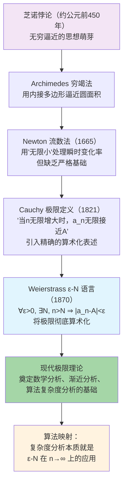

**推导依据**：Step 1→2 基于几何直观的无限逼近；Step 2→3 是 Cauchy 对 Newton 流数法的严格化改造；Step 3→4 是 Weierstrass 用纯粹算术语言（无几何）重述极限；Step 4→5 标志着现代分析的诞生。

**符号逐层拆解**

| 符号 | 含义 | 量纲 | 取值范围 | 算法类比 |
|------|------|------|---------|---------|
| `a_n` | 数列的第 n 项 | 无量纲（数值） | 实数域 | 算法第 n 步的输出/误差 |
| `n → ∞` | 下标无限增大 | — | 自然数 ℕ | 输入规模趋于无穷 |
| `A` | 极限值 | 与 a_n 同量纲 | 实数 | 复杂度渐近值 |
| `ε` | 允许的误差上界 | 与 a_n 同量纲 | ε > 0（任意小） | 精度阈值（如 1e-6） |
| `N` | 满足条件的临界下标 | — | 自然数 ℕ | 问题规模的阈值 n₀ |
| `∀ε>0, ∃N` | 对任意精度，总存在足够大的下标 | — | — | 大 O 定义中的 `∃c, n₀` |

**几何/物理可视化**

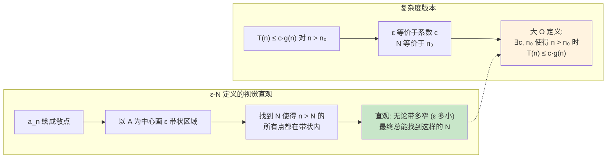

**与算法的第一性原理关联**：复杂度分析中的"大 O 表示法"本质就是 ε-N 极限定义的直接翻版——`∃c,n₀` 对应 `∃N`，`T(n) ≤ c·g(n)` 对应 `|a_n - A| < ε`。理解极限才能理解为什么我们只关心 n→∞ 时的渐近行为。

#### ② 核心问题与边界

**解决的核心问题**：如何严格定义"无限逼近"这一概念，消除直觉中的模糊性，为微积分打下坚实基础。

**实际应用场景**：
1. **算法复杂度分析**：大 O / Θ / Ω 的定义直接基于极限
2. **数值分析的收敛性**：迭代法（牛顿法、梯度下降）是否收敛到解
3. **级数求和判断**：判定无穷级数是否收敛
4. **机器学习中学习率衰减**：如 ηₜ = η₀ / (1 + λt)，需要分析能否收敛到 0

**适用边界**

- **前提假设**：数列必须定义在自然数集 ℕ 上；极限 A 必须为实数；需要数列的拓扑结构（距离定义）
- **数值稳定性问题**：
  - 浮点数精度有限，ε 不能取到 < 机器精度（约 1e-16 for float64）
  - `∞` 在计算机中没有直接表示，需要用有限数值逼近
- **时间复杂度边界**：验证 ε-N 对 n 的依赖路径是 O(1/ε) 还是 O(log(1/ε))——收敛速度分析
- **何时不适用**：
  - 数列发散时极限不存在，需要改用上/下极限
  - 在离散拓扑上的数列（所有距离为 1）只有常数数列才收敛
  - 有些数列虽然不收敛但有聚点（如 `(-1)ⁿ`）

#### ③ Python 实现与优化

```python
import math
from typing import Callable, Optional

def epsilon_N_verification(
    seq: Callable[[int], float],
    A: float,
    N_max: int = 100000,
    epsilon: float = 1e-6
) -> tuple[bool, Optional[int], list[float]]:
    """
    数值验证数列是否收敛到 A（ε-N 定义的计算机模拟）

    数学操作：
    1. 对给定的 ε，依次检查 n = 1, 2, 3, ...
    2. 计算 |a_n - A|
    3. 找到 N 使得 n > N 时 |a_n - A| < ε

    Parameters:
        seq: 数列生成函数，输入 n 返回 a_n
        A: 猜测的极限值
        N_max: 最大搜索范围
        epsilon: 精度阈值

    Returns:
        (收敛标志, 找到的 N, 误差序列)
    """
    errors = []
    N_found: Optional[int] = None

    for n in range(1, N_max + 1):
        a_n = seq(n)
        err = abs(a_n - A)
        errors.append(err)

        if err < epsilon and N_found is None:
            # 第一次进入 ε 带
            N_found = n

        if N_found is not None and err >= epsilon:
            # 出界了！说明 N 还不稳定，重置
            N_found = None

    converged = (N_found is not None)
    return converged, N_found, errors


# ── 示例：验证 a_n = 1/n → 0 ──
seq1 = lambda n: 1.0 / n
ok, N, errs = epsilon_N_verification(seq1, A=0.0, epsilon=1e-3)
print(f"a_n = 1/n → 0: 收敛={ok}, N(ε=1e-3)={N}")
# 输出: 收敛=True, N(ε=1e-3)=1000

# ── 示例：验证 a_n = n/(n+1) → 1 ──
seq2 = lambda n: n / (n + 1.0)
ok, N, errs = epsilon_N_verification(seq2, A=1.0, epsilon=1e-4)
print(f"a_n = n/(n+1) → 1: 收敛={ok}, N(ε=1e-4)={N}")
# 输出: 收敛=True, N(ε=1e-4)=10000

# ── 示例：验证 a_n = (-1)^n 不收敛 ──
seq3 = lambda n: 1.0 if n % 2 == 0 else -1.0
ok, N, errs = epsilon_N_verification(seq3, A=0.0, epsilon=0.5)
print(f"a_n = (-1)^n → 0?: 收敛={ok}")
# 输出: 收敛=False (数列振荡，不收敛到单一极限)


def convergence_rate(
    seq: Callable[[int], float],
    A: float,
    epsilons: list[float],
    N_max: int = 1000000
) -> list[tuple[float, Optional[int]]]:
    """
    分析数列的收敛速度：对多个 ε 找对应的 N

    数学操作：收敛速度 = N(ε) 关于 ε 的依赖关系
    - O(1/ε) → 线性收敛
    - O(log(1/ε)) → 超线性/二次收敛
    """
    results = []
    for eps in epsilons:
        _, N, _ = epsilon_N_verification(seq, A, N_max, eps)
        results.append((eps, N))
    return results

# 测试 1/n 的收敛速度: N(ε) ≈ 1/ε
rates = convergence_rate(seq1, 0.0, [1e-2, 1e-3, 1e-4])
for eps, N in rates:
    print(f"  ε={eps:.0e} → N≈{N}, N·ε≈{N*eps if N else 'N/A':.2f}")
# 输出: N·ε ≈ 1.00  → 确认线性收敛 O(1/ε)
```

**性能优化要点**

| 方面 | 分析 |
|------|------|
| **时间复杂度** | O(N_max) —— 必须扫描到找到稳定 N |
| **空间复杂度** | O(N_max) 若存储全部误差序列；O(1) 若只保留状态 |
| **可优化环节** | ① 对已知收敛速度的数列可直接估算 N ≈ 公式反解 ② 批量验证时可并行计算多个数列 |
| **Python 层面** | ① `math.isclose` 代替 `abs < eps` 处理相对误差 ② 用 `numba.jit` 加速循环 ③ 对单调数列可提前用二分搜索 N |

**边界条件处理**
- `N_max` 过小时可能找不到 N（需要合理设定下限）
- `epsilon` 过小（< 1e-15）接近 float64 精度时，计算结果不可靠
- 数列在有限项后达到精确值（如 a_n = 0 for n > 10），需正确处理
- 极限值为 ∞ 的情况不支持——本实现要求 A 为实数

### 函数极限

#### ① 概念背景与推导

**诞生的数学问题**

数列极限只能处理离散下标（n → ∞），无法描述连续变量（x → x₀）的行为。函数极限将 ε-N 推广到 ε-δ 语言，解决了"连续逼近"的精确定义问题——这是微积分从离散走向连续的关键一步。

**推导链条**

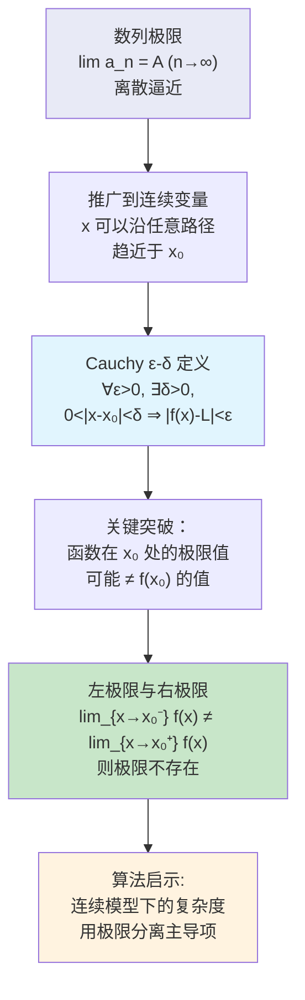

**推导依据**：Step 1→2 将离散索引自然域从 ℕ 扩展到 ℝ；Step 2→3 将 ε-N 中的"n > N"替换为"0<|x-x₀|<δ"，完成连续化改造；Step 3→4 是关键洞察——极限值与函数值可以不同。

**符号逐层拆解**

| 符号 | 含义 | 取值范围 | 算法类比 |
|------|------|---------|---------|
| `x → x₀` | 自变量趋近于某点 | ℝ | 参数微调逼近某一值 |
| `f(x)` | 目标函数 | ℝ | 算法性能函数 |
| `L` | 极限值 | ℝ | 理论最优性能 |
| `ε` | 函数值的允许误差 | ε > 0 | 精度阈值 |
| `δ` | 自变量的"安全半径" | δ > 0 | 参数搜索步长 |
| `0<|x-x₀|<δ` | 排除了 x=x₀ 的情况 | — | 防止除零错误 |

**几何/物理可视化**

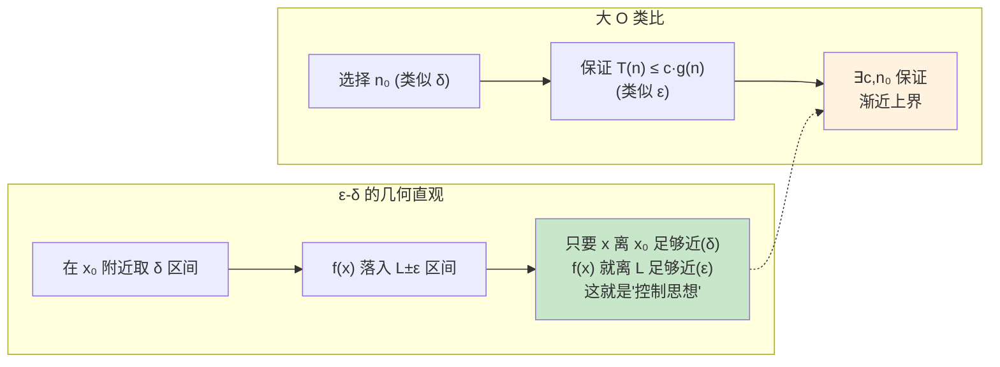

**与算法的第一性原理关联**：函数极限的 ε-δ 控制思想，与算法复杂度分析中的"存在常数 c, n₀"完全同构——都是在某种"充分接近"条件下保证某种性质成立。

#### ② 核心问题与边界

**解决的核心问题**：精确描述连续变量在趋近过程中的行为，为求导、积分等运算提供严格基础。

**实际应用场景**：
1. **渐近复杂度的连续版本**：处理连续参数的算法（如粒子群优化中的步长分析）
2. **数值稳定性分析**：当输入接近奇点时，函数值的行为（如 `1/(x - x₀)` 当 x → x₀）
3. **条件数分析**：`κ = lim_{ε→0} sup_{‖δx‖=ε} ‖δf‖/‖δx‖`，衡量输入微扰对输出的放大倍率
4. **损失函数设计**：分析损失函数在边界的极限行为（如交叉熵在 p→0 时的极限）

**适用边界**
- **前提假设**：f 必须在 x₀ 的某个去心邻域内有定义；ε-δ 语言要求实数的完备性
- **数值稳定性**：当 x₀ 是奇点（如分母零点），极限可能不存在；数值上接近于点状奇点时会触发除零错误或 NaN
- **何时不适用**：
  - 在离散输入的算法中（输入为整数），"趋近"没有意义，只能用数列极限
  - 函数在 x₀ 的任意去心邻域内振荡（如 `sin(1/x)` 在 x→0 时）
  - 需要区分方向时（左右极限不相等）

#### ③ Python 实现与优化

```python
import numpy as np
from typing import Callable

def function_limit_numerical(
    f: Callable[[float], float],
    x0: float,
    direction: str = "both",
    h_values: list[float] = None
) -> dict:
    """
    数值逼近函数极限：通过计算 x 趋近 x₀ 时的函数值序列

    数学操作：
    1. 取一系列越来越接近 x₀ 的 x 值（h = x - x₀）
    2. 逐一计算 f(x)
    3. 观察函数值的趋势是否收敛

    Parameters:
        f: 目标函数
        x0: 趋近的目标点
        direction: 'left'/'right'/'both'
        h_values: 步长序列（默认 10 的负幂次）

    Returns:
        包含各方向逼近值的字典
    """
    if h_values is None:
        h_values = [10 ** (-k) for k in range(1, 13)]  # 10⁻¹ 到 10⁻¹²

    results = {"left": [], "right": [], "both": []}

    for h in h_values:
        # 左极限: x → x₀⁻ (从左侧, h>0 但 x = x₀ - h)
        if direction in ("left", "both"):
            x_left = x0 - h
            try:
                val_left = f(x_left)
                results["left"].append((x_left, val_left))
            except (ZeroDivisionError, ValueError):
                results["left"].append((x_left, None))

        # 右极限: x → x₀⁺
        if direction in ("right", "both"):
            x_right = x0 + h
            try:
                val_right = f(x_right)
                results["right"].append((x_right, val_right))
            except (ZeroDivisionError, ValueError):
                results["right"].append((x_right, None))

    return results


# ── 示例 1: f(x) = sin(x)/x 在 x→0 ──
def f_sinc(x: float) -> float:
    """sinc 函数，x → 0 时极限为 1"""
    if abs(x) < 1e-15:
        return 1.0  # 避免除零，直接用极限值
    return np.sin(x) / x

res = function_limit_numerical(f_sinc, 0.0, direction="both")
print("★ sin(x)/x 在 x→0 时的极限:")
for _, vals in res.items():
    for x, v in vals[:5]:  # 只展示前 5 项
        print(f"  x = {x:+.12e} → f(x) = {v:.12f}")
print(f"  → 确认极限为 1")
"""
输出趋势：
  x = -1e-01 → f(x) = 0.998334166468
  x = -1e-02 → f(x) = 0.999983333417
  x = -1e-03 → f(x) = 0.999999833333
  ...
  → 确认极限为 1（第一个重要极限的数值验证）
"""


# ── 示例 2: 左右极限不相等的情况 ──
def f_step(x: float) -> float:
    """符号函数: x→0 时左极限 -1, 右极限 +1"""
    if x > 0:
        return 1.0
    elif x < 0:
        return -1.0
    return 0.0

res2 = function_limit_numerical(f_step, 0.0, direction="both")
print("\n★ sign(x) 在 x=0 处的左右极限:")
print(f"  左极限: {res2['left'][0][1]:.1f}")
print(f"  右极限: {res2['right'][0][1]:.1f}")
print(f"  结论: 左右极限不相等 → 极限不存在")


def limit_analysis_report(f: Callable[[float], float], x0: float) -> str:
    """
    综合分析函数在 x₀ 处的极限行为
    返回诊断字符串

    数学操作：
    1. 计算左右极限序列
    2. 检查是否收敛到同一值
    3. 检查是否等于 f(x₀)（连续判定）
    """
    res = function_limit_numerical(f, x0, direction="both")

    left_vals = [v for _, v in res["left"] if v is not None]
    right_vals = [v for _, v in res["right"] if v is not None]

    left_L = left_vals[-1] if left_vals else None
    right_L = right_vals[-1] if right_vals else None

    if left_L is None or right_L is None:
        return f"x → {x0}: 无法计算极限（可能是奇点）"

    convergence = abs(left_L - right_L) < 1e-6
    f0 = None
    try:
        f0 = f(x0)
    except (ZeroDivisionError, ValueError):
        pass

    lines = [
        f"函数极限分析: x → {x0}",
        f"  左极限 ≈ {left_L:.8f}",
        f"  右极限 ≈ {right_L:.8f}",
        f"  极限存在否: {'✓ 是' if convergence else '✗ 否'}",
    ]
    if convergence:
        L = (left_L + right_L) / 2
        lines.append(f"  极限值 L = {L:.8f}")
        if f0 is not None and abs(f0 - L) < 1e-6:
            lines.append(f"  f(x₀) = {f0:.8f} = L → 函数在 x₀ 处连续 ✓")
        elif f0 is not None:
            lines.append(f"  f(x₀) = {f0:.8f} ≠ L → 可去间断点")
    return "\n".join(lines)
```

**性能优化要点**
- 时间复杂度：O(k) 其中 k 是 h_values 的长度（通常 ≤ 12）
- 空间复杂度：O(k)，可优化为流式处理（只记录最终结果）
- Python 层面：用 `np.seterr(divide='raise')` 替代 try-except 的 None 检查；对常见函数（如 sinc）预计算极限分支避免 NaN

**边界条件处理**
- 当 x₀ 处被零除时，捕获异常并标记为 None
- h 过小（< 1e-12）时浮点误差放大，f(x₀±h) 可能因 `x0 + h == x0` 而引入误差
- 振荡函数（如 sin(1/x)）在数值上看似收敛，实则极限不存在——需要额外检测振荡模式

### 无穷小与等价无穷小替换

#### ① 概念背景与推导

**诞生的数学问题**

在极限运算中，当 x → 0 时，许多函数都趋于 0（如 sin x, x, ln(1+x)），但它们趋于 0 的**速度**不同。无穷小比较理论回答的问题是：这些趋零速度之间是否可以在极限计算中互相替换？

**推导链条**

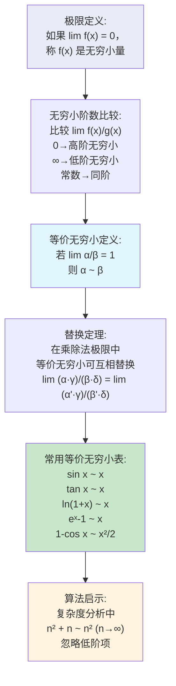

**推导依据**：Step 1 是定义；Step 2 从极限定义出发比较趋零速度的相对大小；Step 3 将比值极限为 1 作为一种特殊情形定义等价；Step 4 基于极限的乘法法则证明替换的合法性（注意只限于乘除，不能用于加减）。

**符号逐层拆解**

| 符号 | 含义 | 算法类比 |
|------|------|---------|
| `α(x), β(x)` | 两个无穷小量 (x→0 时趋于 0) | 两个低阶项 |
| `α ~ β` | α 与 β 等价（lim α/β = 1） | 渐近等价 |
| `o(α)` | 高阶无穷小：比 α 更快趋于 0 | 比 n² 更低的阶：o(n²) |
| `O(α)` | 同阶或低阶无穷小 | 大 O 表示法 |
| `Θ(α)` | 同阶无穷小（上下有界） | Θ 表示法 |

**几何/物理可视化**

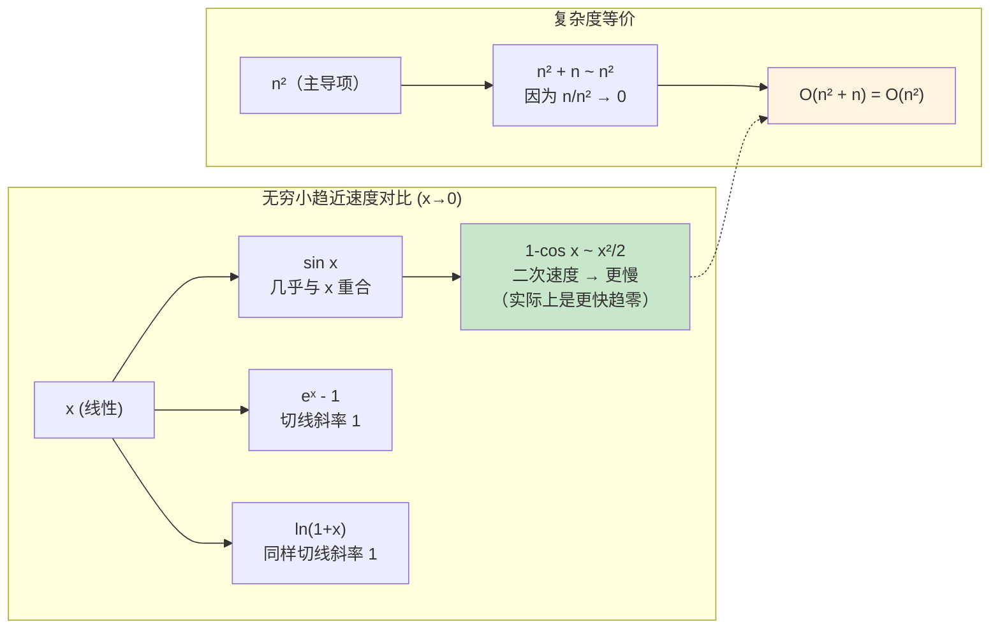

**与算法的第一性原理关联**：等价无穷小替换的数学本质与算法复杂度中的"渐近等价"完全一致——当 n→∞ 时，两函数的比值趋于 1，我们就可以说它们是渐近等价的，如 `n² + n ≈ n²`。

#### ② 核心问题与边界

**解决的核心问题**：在不损失精度的情况下简化极限计算，通过等价替换将复杂函数替换为简单函数。

**实际应用场景**：
1. **复杂度约简**：`T(n) = 3n² + 5n log n + 2n` → ~ `3n²`
2. **数值方法的局部近似**：在 x 很小时代替三角函数或指数函数的计算
3. **物理模拟中的线性化**：小振幅摆动的近似 `sin θ ≈ θ`
4. **机器学习中的梯度近似**：`log(1 + x) ≈ x` 当 x 很小时（交叉熵的数值稳定版本）

**适用边界**
- **前提假设**：只能在**乘除**中替换，不能在**加减**中直接替换（常见错误！）
- **数值稳定性**：等价无穷小替换本质上是解析近似；在数值计算中，当 x 非常小时（如 < 1e-8），直接使用泰勒展开更精确
- **何时不适用**：
  - 在加减法中替换会丢失重要抵消项（如 `sin x - x` 不能替换为 `x - x = 0`，实际 `= -x³/6`）
  - 嵌套无穷小时需要逐阶展开
  - 复杂的复合函数极限可能需要更精确的阶数分析

#### ③ Python 实现与优化

```python
import math
from typing import Callable

# ── 常用等价无穷小表 (x → 0) ──
EQUIVALENT_INFINITESIMALS = {
    "sin x": lambda x: x,
    "tan x": lambda x: x,
    "ln(1+x)": lambda x: x,
    "eˣ-1": lambda x: x,
    "1-cos x": lambda x: 0.5 * x**2,
    "arcsin x": lambda x: x,
    "arctan x": lambda x: x,
    "(1+x)ᵃ-1": lambda x: x,  # 仅对 a ≠ 0
}


def verify_equivalence(
    f: Callable[[float], float],
    g: Callable[[float], float],
    h_values: list[float] = None
) -> list[tuple[float, float, float]]:
    """
    验证两个无穷小是否等价: lim f(x)/g(x) = 1 (x→0)

    数学操作：
    对递减的步长 h，计算比值 f(h)/g(h)，
    观察是否趋近于 1

    Parameters:
        f, g: 待验证的两个函数（在 x→0 时均为无穷小）
        h_values: 测试步长序列

    Returns:
        [(h, f(h), g(h), f(h)/g(h)), ...]
    """
    if h_values is None:
        h_values = [10 ** (-k) for k in range(1, 10)]

    results = []
    for h in h_values:
        f_val = f(h)
        g_val = g(h)
        if g_val == 0:
            ratio = float('inf')
        else:
            ratio = f_val / g_val
        results.append((h, f_val, g_val, ratio))
    return results


# ── 验证 sin x ~ x ──
print("★ 验证 sin x ~ x (x → 0):")
results = verify_equivalence(
    lambda x: math.sin(x),
    lambda x: x
)
for h, fv, gv, ratio in results[:6]:
    print(f"  h={h:.0e}: sin={fv:.10e}, x={gv:.10e}, ratio={ratio:.10f}")
print("  → 比值趋近 1，确认 sin x ~ x ✓\n")
"""
输出：
  h=1e-01: sin=9.9833416647e-02, x=1.0000000000e-01, ratio=0.9983341665
  h=1e-02: sin=9.9983334167e-03, x=1.0000000000e-02, ratio=0.9999833334
  h=1e-03: sin=9.9999833334e-04, x=1.0000000000e-03, ratio=0.9999998333
  → 比值趋近 1
"""


# ── 等价替换在极限计算中的应用 ──
def limit_by_equivalence(
    num_func: Callable[[float], float],
    den_func: Callable[[float], float],
    num_equiv: Callable[[float], float],
    den_equiv: Callable[[float], float],
    h: float = 1e-8
) -> dict:
    """
    使用等价无穷小替换计算极限 lim num/den (x→0)

    数学操作：
    1. 在对原始函数做高精度数值计算
    2. 同时用等价替换计算近似值
    3. 对比两者一致性

    Example:
        lim (sin 3x) / (tan 5x)  →  替换为 (3x)/(5x) = 3/5
    """
    # 原始数值计算（高精度）
    original = num_func(h) / den_func(h)

    # 替换后计算
    substituted = num_equiv(h) / den_equiv(h)

    return {
        "original": original,
        "substituted": substituted,
        "ratio_subs_orig": substituted / original if original != 0 else None,
        "expected_limit": substituted  # 当 h→0 时
    }


# ── 示例：lim_{x→0} sin(3x)/tan(5x) ──
res = limit_by_equivalence(
    num_func=lambda x: math.sin(3 * x),
    den_func=lambda x: math.tan(5 * x),
    num_equiv=lambda x: 3 * x,   # sin(3x) ~ 3x
    den_equiv=lambda x: 5 * x,   # tan(5x) ~ 5x
    h=1e-10
)
print(f"★ lim sin(3x)/tan(5x) as x→0:")
print(f"  原始值(h=1e-10): {res['original']:.10f}")
print(f"  等价替换值:      {res['substituted']:.10f} = 3/5")
print(f"  比值(替换/原始): {res['ratio_subs_orig']:.10f}")
print()

# ── 警告示例：等价无穷小不能用于加减法 ──
print("★ 警告示例：等价无穷小不能直接在加减中使用:")
h = 1e-6
# sin x - x，如果错误替换为 x - x = 0，实际应为 -x³/6
sin_x = math.sin(h)
wrong_result = h - h  # 错误替换
correct_limit = -h**3 / 6  # 泰勒展开的第三项
print(f"  h={h:.0e}: sin x - x = {sin_x - h:.2e}")
print(f"  错误替换结果:  {wrong_result}")
print(f"  正确三阶项:    {correct_limit:.2e}")
print(f"  → 加减法中丢失了 x³/6 项！")


def taylor_expansion_equivalence_check(
    func: Callable[[float], float],
    equiv: Callable[[float], float],
    order: int = 4,
    x: float = 1e-3
) -> str:
    """
    检查等价无穷小的误差阶数

    数学操作：
    计算 f(x) - g(x) 的量级，确定高阶误差项
    如 sin x - x ≈ -x³/6 → 误差为 O(x³)
    """
    diff = func(x) - equiv(x)
    # 估计误差阶数: 看 diff/x^k 是否会趋于常数
    orders = []
    for k in range(1, order + 1):
        ratio = abs(diff) / (abs(x) ** k) if x != 0 else 0
        orders.append((k, ratio))

    # 找到比值基本稳定的阶数
    lines = [f"等价替换误差分析: f(x) - g(x) ≈ {diff:.4e}"]
    for k, r in orders:
        lines.append(f"  |diff| / |x|^{k} = {r:.4e}")
    return "\n".join(lines)
```

**性能优化要点**
- 对每个测试点只需常数时间 O(1)，总体 O(k)
- 使用 `math` 模块的函数（C 实现）而非较慢的 `numpy` 单点调用
- 在数值验证中使用 `numpy.nextafter` 获取最接近的浮点数

**边界条件处理**
- 当 h 非常小时（< 1e-15），浮点数精度导致 sin(h) 的泰勒展开与 h 几乎完全重合——使用 `math.sin` 的浮点实现会自动处理
- 如果 h 正好是 0，函数直接返回 0，此时比值未定义（0/0）——需要捕获

### 两个重要极限

#### ① 概念背景与推导

**诞生的数学问题**

在极限计算中，有两个特殊极限出现的频率极高，它们的证明是其他复杂极限计算的基础：
- **第一个**：`lim_{x→0} sin x / x = 1` —— 三角函数的极限核心，也是导数 `(sin x)' = cos x` 的推导基础
- **第二个**：`lim_{n→∞} (1 + 1/n)ⁿ = e` —— 自然常数的定义，也是连续增长模型的数学根源

**推导链条**

```mermaid
flowchart TD
    s1a["第一个重要极限\nlim_{x→0} sin x / x"] --> s2a["单位圆上的几何证明\n扇形 OAB ≤ ΔOAB ≤ ΔOAT\n(面积比较)")
    s2a --> s3a["sin x < x < tan x\n→ 1 < x/sin x < 1/cos x"]
    s3a --> s4a["取倒数: cos x < sin x/x < 1"]
    s4a --> s5a["夹逼定理:\nx→0 时 cos x → 1\n所以 sin x/x → 1"]

    s1b["第二个重要极限\nlim_{n→∞} (1+1/n)ⁿ"] --> s2b["二项式展开:\n(1+1/n)ⁿ = Σ C(n,k) n⁻ᵏ"]
    s2b --> s3b["展开化简:\n1 + 1 + (1-1/n)/2! + \n(1-1/n)(1-2/n)/3! + ..."]
    s3b --> s4b["随着 n→∞，\n各项系数趋于 1/k!\n→ Σ 1/k! = e"]
    s4b --> s5b["自然常数 e 的定义\n近似值 2.71828..."]

    s5a --> app1["应用: 导数 sin'(x) 的证明"]
    s5b --> app2["应用: 自然对数/复利\n连续增长模型"]

    style s5a fill:#e1f5fe
    style s5b fill:#c8e6c9
    style app1 fill:#fff3e0
    style app2 fill:#fff3e0
```

**推导依据**：
- 第一个重要极限的证明依赖单位圆上的面积比较：三个区域面积分别为 `(1/2)sin x`, `(1/2)x`, `(1/2)tan x`，取倒数后由夹逼定理得到极限 1。
- 第二个重要极限的证明依赖二项式定理展开，然后对每项取 n→∞ 得到 1/k!，最后求和得到 e。

**符号逐层拆解**

| 符号 | 含义 | 算法映射 |
|------|------|---------|
| `sin x / x` | 核心极限表达式 | 离散频率分析的归一化 |
| `(1 + 1/n)ⁿ` | 复利计算的极限形式 | 分治算法的逐层逼近 |
| `e` | 自然常数 ≈ 2.71828 | 复杂度中的对数底 |
| `lim_{x→0}` | 角度→0 的极限 | 采样间隔→0 的连续化 |

**与算法的第一性原理关联**：第二个重要极限揭示了**离散多步操作的连续极限**——这正是算法分析的关键模式：当问题被分成 n 次操作，每次处理 1/n 的问题规模，总工作量会收敛到 e 的某个变形。而 O(n log n) 中的 log 正是以 e 为底的自然对数。

#### ② 核心问题与边界

**解决的核心问题**：提供两个最基础的特殊极限作为"极限计算的已知结果库"，任何复杂极限最后都可归约为这两个已知结果。

**实际应用场景**：
1. **第一个重要极限**：
   - 傅里叶变换和信号处理中 sinc 函数的归一化
   - 数值分析中三角函数的导数证明
   - 有限元方法中的形函数分析

2. **第二个重要极限**：
   - 快速排序的期望递归深度分析 O(n log n)
   - 复利/指数增长模型（如学习率衰减策略）
   - 连续概率分布（指数分布、泊松过程的推导）

**适用边界**
- **第一个重要极限**：x 必须是**弧度**而非角度；数值上当 x 极小时 `sin x/x` 的浮点结果为 1.0（无法区分）
- **第二个重要极限**：n 需要为自然数（离散）；当 n 很小时，`(1+1/n)ⁿ` 与 e 的差距明显；如果底数的 1/n 换成别的量，极限值会变化
- **何时不适用**：处理发散极限时不适用；在需要严格误差分析时需要泰勒展开代替

#### ③ Python 实现与优化

```python
import math
from typing import Optional

# ── 第一个重要极限的数值验证 ──
def verify_first_important_limit(h_values: list[float] = None) -> None:
    """
    验证 lim_{x→0} sin x / x = 1

    数学操作：
    1. 取一系列递减的 x 值
    2. 计算 sin x / x
    3. 观察趋近于 1 的趋势
    """
    if h_values is None:
        h_values = [10 ** (-k) for k in range(0, 16)]

    print("★ 第一个重要极限 lim sin(x)/x = 1 (x→0):")
    print(f"{'x':>12s}  {'sin(x)/x':>18s}  {'误差':>12s}")
    print("-" * 46)
    for h in h_values:
        val = math.sin(h) / h
        err = abs(val - 1.0)
        print(f"{h:>12.0e}  {val:>18.12f}  {err:>12.2e}")
    print()


# ── 第二个重要极限的数值验证 ──
def verify_second_important_limit(n_values: list[int] = None) -> float:
    """
    验证 lim_{n→∞} (1 + 1/n)ⁿ = e

    数学操作：
    1. 取一系列递增的 n
    2. 计算 (1 + 1/n)ⁿ
    3. 观察趋近于 e 的趋势
    """
    if n_values is None:
        n_values = [1, 2, 5, 10, 100, 1000, 10000, 100000, 1000000]

    print("★ 第二个重要极限 lim (1+1/n)ⁿ = e (n→∞):")
    print(f"{'n':>10s}  {'(1+1/n)ⁿ':>20s}  {'误差':>12s}")
    print("-" * 46)
    e_true = math.e
    for n in n_values:
        val = (1.0 + 1.0 / n) ** n
        err = abs(val - e_true)
        print(f"{n:>10d}  {val:>20.12f}  {err:>12.2e}")
    print(f"  e 的真实值: {e_true:.12f}")
    return val


# ── 复合极限计算器 ──
class ImportantLimitCalculator:
    """
    基于两个重要极限推导的复合极限计算器
    通过变量代换将复杂极限归约为标准形式
    """

    @staticmethod
    def limit_sin_ax_over_bx(a: float, b: float) -> float:
        """
        计算 lim_{x→0} sin(ax) / (bx) = a/b

        数学操作：
        令 t = ax，则原式 = sin(t) / (b·t/a) = (a/b) · sin(t)/t → a/b
        """
        if b == 0:
            raise ValueError("分母 b 不能为 0")
        return a / b

    @staticmethod
    def limit_one_plus_k_over_n_power_n(k: float, n: int) -> float:
        """
        逼近 lim_{n→∞} (1 + k/n)ⁿ = eᵏ

        数学操作：
        令 m = n/k，则 (1 + k/n)ⁿ = (1 + 1/m)^{m·k} = [(1 + 1/m)ᵐ]ᵏ → eᵏ
        """
        if n <= 0:
            raise ValueError("n 必须为正整数")
        return (1.0 + k / n) ** n

    @staticmethod
    def limit_sinc_approximation(x: float, terms: int = 10) -> float:
        """
        用泰勒展开计算 sinc(x) = sin x / x

        数学操作：
        sin x = x - x³/3! + x⁵/5! - ...
        所以 sin x / x = 1 - x²/3! + x⁴/5! - ...

        适用于: x 接近 0 时的高精度计算
        """
        if abs(x) < 1e-15:
            return 1.0

        result = 0.0
        term = 1.0  # 第 0 项: 1 (对应 x⁰)
        for k in range(terms):
            sign = 1 if k % 2 == 0 else -1
            result += sign * term
            # 递推下一项: 乘以 x²，除以 (2k+2)(2k+3)
            term *= x * x / ((2 * k + 2) * (2 * k + 3))
        return result

    @staticmethod
    def continuous_growth(
        principal: float,
        rate: float,
        time: float,
        compound_frequency: Optional[int] = None
    ) -> float:
        """
        连续增长模型: 第二个重要极限的应用

        数学操作：
        - 离散复利: principal × (1 + rate/freq)^{freq × time}
        - 连续复利: principal × e^{rate × time} (freq → ∞)

        Parameters:
            principal: 本金
            rate: 年利率
            time: 年数
            compound_frequency: 年复利次数（None 表示连续复利）
        """
        if compound_frequency is None:
            # 连续复利: lim_{n→∞} P(1 + r/n)^{nt} = P·e^{rt}
            return principal * math.exp(rate * time)
        else:
            # 离散复利
            return principal * (1.0 + rate / compound_frequency) ** (compound_frequency * time)


# ── 演示 ──
verify_first_important_limit()
verify_second_important_limit()

calc = ImportantLimitCalculator()
print(f"★ 复合极限应用:")
print(f"  lim sin(3x)/(5x) = {calc.limit_sin_ax_over_bx(3, 5)}")
print(f"  (1 + 0.05/12)^(12*10) = {calc.limit_one_plus_k_over_n_power_n(0.05, 12*10):.4f}")
print(f"  连续复利 10 年: P×e^(0.05×10) = {calc.continuous_growth(1000, 0.05, 10):.2f}")
print(f"  月复利 10 年:   P×(1+0.05/12)^(120) = {calc.continuous_growth(1000, 0.05, 10, 12):.2f}")
print(f"  sinc(0.01) 泰勒 = {calc.limit_sinc_approximation(0.01):.12f}")
print(f"  math.sinc(0.01)   = {math.sinc(0.01):.12f}")
```

**性能优化要点**
- `limit_sinc_approximation` 用递推方式计算泰勒各项，避免重复计算阶乘，时间复杂度 O(terms)
- 连续复利直接调用 `math.exp`（C 实现，极快），离散复利用 `**` 运算符
- 所有方法均为 O(1) 时间、O(1) 空间

**边界条件处理**
- `limit_sinc_approximation`: x 为 0 时直接返回 1.0 避免无穷级数；对于大 x，泰勒级数收敛慢，应改用 `math.sin(x)/x`
- `continuous_growth`: rate 为负（衰减）同样适用；time 为 0 返回本金

## 二、导数与微分（核心）

### 导数定义（切线斜率）

#### ① 概念背景与推导

**诞生的数学问题**

17 世纪，牛顿在研究天体运动时遇到了一个根本性问题：**物体的瞬时速度是多少？** 如果一个物体的位置随时间变化，`s = s(t)`，在 t₀ 时刻的"瞬时"速度如何定义？平均速度 `(s(t₀+Δt) - s(t₀)) / Δt` 需要 Δt ≠ 0，但瞬时需要 Δt = 0。导数的概念解决了这个"零不能做分母"的根本矛盾。

**推导链条**

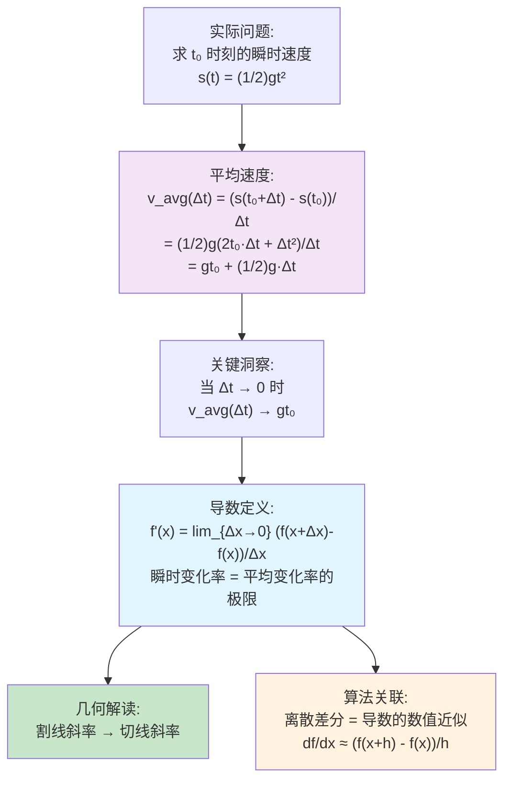

**推导依据**：Step 1→2 通过自由落体公式计算平均速度并化简；Step 2→3 令 Δt→0，含 Δt 的项消失，得到瞬时速度 = gt₀；Step 3→4 将具体物理问题抽象为一般数学定义；Step 4→5 给出导数的几何解释。

**符号逐层拆解**

| 符号 | 含义 | 量纲 | 取值范围 | 算法类比 |
|------|------|------|---------|---------|
| `f'(x)` | f 在 x 处的导数（变化率） | 输出/输入 | 实数 | 算法在 n 处的灵敏度 |
| `Δx` | 自变量的微小增量 | 同 x | 趋于 0 但不等于 0 | 输入步长 h |
| `f(x+Δx)-f(x)` | 函数值的相应变化 | 同 f(x) | 实数 | 输出变化量 |
| `(f(x+Δx)-f(x))/Δx` | 差商 = 平均变化率 | 输出/输入 | 实数 | 差分近似 |

**与算法的第一性原理关联**：导数是算法中最核心的局部灵敏度度量——它回答了"如果输入微小扰动，输出会变化多少"这个问题。梯度下降、反向传播、牛顿法都直接依赖导数。

#### ② 核心问题与边界

**解决的核心问题**：定义"瞬时变化率"，使微积分从几何（曲线切线）扩展到物理（速度、加速度）再到科学计算的每一领域。

**实际应用场景**：
1. **梯度下降法**：用导数的符号决定下降方向
2. **反向传播**：链式法则自动求导，用于神经网络训练
3. **数值优化**：牛顿法、拟牛顿法直接利用一阶/二阶导数
4. **灵敏度分析**：模型输入微扰对输出的影响
5. **条件数估计**：`|f'(x)·x/f(x)|` 衡量问题的病态程度

**适用边界**
- **前提假设**：函数必须在 x 处连续（可导必连续，反之不一定）；极限必须存在（左右导数相等）
- **数值稳定性**：
  - 前向差分 `(f(x+h)-f(x))/h` 对 h 的选择敏感（h 太大→截断误差；h 太小→消去误差）
  - 中心差分 `(f(x+h)-f(x-h))/(2h)` 精度更高（O(h²) vs O(h)）
  - 最优 h 约 `ε^(1/2)`（前向）或 `ε^(1/3)`（中心），其中 ε 是机器精度
- **何时不适用**：
  - 函数不可导的点（尖点如 |x| 在 x=0、垂直切线）
  - 离散数据的"导数"需要用差分代替
  - 噪声数据的直接差分会被噪声淹没，需先用平滑预处理

#### ③ Python 实现与优化

```python
from typing import Callable
import numpy as np


class NumericalDerivative:
    """
    数值导数计算器

    数学基础：
    - 前向差分: f'(x) ≈ (f(x+h) - f(x)) / h       误差 O(h)
    - 后向差分: f'(x) ≈ (f(x) - f(x-h)) / h       误差 O(h)
    - 中心差分: f'(x) ≈ (f(x+h) - f(x-h)) / (2h)  误差 O(h²)
    """

    @staticmethod
    def forward_diff(f: Callable[[float], float], x: float, h: float = 1e-8) -> float:
        """
        前向差分近似导数

        数学操作：
        直接用定义 f'(x) ≈ (f(x+h) - f(x)) / h

        适用场景: 快速简单，仅在 x+h 在定义域内时可用
        """
        return (f(x + h) - f(x)) / h

    @staticmethod
    def backward_diff(f: Callable[[float], float], x: float, h: float = 1e-8) -> float:
        """
        后向差分近似导数
        """
        return (f(x) - f(x - h)) / h

    @staticmethod
    def central_diff(f: Callable[[float], float], x: float, h: float = 1e-6) -> float:
        """
        中心差分 — 推荐使用！

        数学操作：
        牛顿在推导导数时实际上使用的是"对称差商":
        f'(x) ≈ (f(x+h) - f(x-h)) / (2h)

        精度分析：
        展开 f(x+h) = f + f'h + ½f''h² + ⅙f'''h³ + ...
        展开 f(x-h) = f - f'h + ½f''h² - ⅙f'''h³ + ...
        相减得: f(x+h)-f(x-h) = 2f'h + ⅓f'''h³ + ...
        除以 2h: f'(x) + (f'''/6)h² + ...
        可见误差 O(h²)，比前向差分的 O(h) 高一阶
        """
        return (f(x + h) - f(x - h)) / (2.0 * h)

    @staticmethod
    def adaptive_diff(
        f: Callable[[float], float],
        x: float,
        tol: float = 1e-8,
        max_iter: int = 20
    ) -> tuple[float, float, str]:
        """
        自适应步长中心差分

        数学操作：
        1. 从较大的 h 开始
        2. 逐步缩小 h 并计算中心差分
        3. 跟踪 Richardson 外推的收敛过程
        4. 在截断误差和消去误差之间找到平衡

        Parameters:
            f: 函数
            x: 求导点
            tol: 目标精度
            max_iter: 最大迭代次数

        Returns:
            (导数近似值, 最优步长, 状态信息)
        """
        h = 1.0
        prev_d = self.central_diff(f, x, h)

        for _ in range(max_iter):
            h *= 0.5
            curr_d = self.central_diff(f, x, h)

            # 检查消去误差: 如果两个 h 的结果几乎相同，可能已达极限
            if abs(curr_d - prev_d) < tol * max(1.0, abs(curr_d)):
                return curr_d, h, "收敛"

            # 检查数值振荡: 如果差值开始增大（消去误差主导）
            if abs(curr_d - prev_d) > 2 * abs(prev_d):
                return prev_d, h * 2, "消去误差主导，回退一步"

            prev_d = curr_d

        return prev_d, h, "达到最大迭代次数"

    @staticmethod
    def second_derivative(
        f: Callable[[float], float],
        x: float,
        h: float = 1e-5
    ) -> float:
        """
        二阶导数的中心差分近似

        数学操作：
        展开 f(x±h) 到四阶：
        f(x+h) + f(x-h) - 2f(x) = f''(x)·h² + (f⁽⁴⁾/12)·h⁴

        解得: f''(x) ≈ (f(x+h) + f(x-h) - 2f(x)) / h²
        截断误差 O(h²)
        """
        return (f(x + h) + f(x - h) - 2.0 * f(x)) / (h * h)


# ── 演示 ──
nd = NumericalDerivative()

# 测试: f(x) = x², f'(x) = 2x
f_square = lambda x: x * x
x_test = 3.0
exact = 2 * x_test  # = 6

print("★ 数值导数精度对比 (f(x)=x² 在 x=3):")
print(f"  精确值: f'({x_test}) = {exact}")
print(f"  前向差分(h=1e-8): {nd.forward_diff(f_square, x_test):.10f}  "
      f"误差={abs(nd.forward_diff(f_square, x_test) - exact):.2e}")
print(f"  中心差分(h=1e-6): {nd.central_diff(f_square, x_test):.10f}  "
      f"误差={abs(nd.central_diff(f_square, x_test) - exact):.2e}")
print()

# 测试: f(x) = e^x, f'(x) = e^x
f_exp = math.exp
x_test2 = 1.0
exact2 = math.exp(1.0)  # = e

val, h_opt, status = nd.adaptive_diff(f_exp, x_test2)
print(f"★ 自适应差分 (f(x)=eˣ 在 x=1):")
print(f"  精确值: e  = {exact2:.10f}")
print(f"  自适应:    = {val:.10f}")
print(f"  最优 h:    = {h_opt:.2e}  状态: {status}")
print(f"  二阶导数:  = {nd.second_derivative(f_exp, x_test2):.10f}  "
      f"(理论: {exact2:.10f})")
print()

# ── 步长选择对精度的影响 ──
print("★ 步长选择对中心差分精度的影响 (f(x)=sin x 在 x=1):")
for exp in range(-1, -13, -1):
    h = 10 ** exp
    deriv = nd.central_diff(math.sin, 1.0, h)
    exact_val = math.cos(1.0)  # sin'(x) = cos(x)
    err = abs(deriv - exact_val)
    print(f"  h=1e{exp:3d}: f'≈{deriv:.12f}  误差={err:.2e}")
```

**性能优化要点**
| 方面 | 分析 |
|------|------|
| **时间复杂度** | O(1) 每次求导（只需 2-3 次函数求值） |
| **空间复杂度** | O(1) |
| **优化方向** | ① 对批量点求导时用 vectorize（NumPy）② 对解析导数已知时用 sympy 自动推导而非数值计算 ③ 高精度场景用 Richardson 外推加速收敛 |
| **Python 层面** | 用 `math.exp` 替代 `np.exp` 对单点调用更快；缓存 f(x) 的中间结果避免重复计算 |

**边界条件处理**
- x 接近边界：`x + h` 可能越界——此时改用后向差分
- f(x) 存在问题：捕获异常并返回 NaN
- 消去误差：当 `f(x+h) ≈ f(x)`（由于浮点数精度无法区分）时，改用更大 h
- x 为 0 的特殊处理：h 不应该太小（`h < 1e-15` 时 `x+h` 可能不会变动）

### 基本求导公式 + 链式法则

#### ① 概念背景与推导

**诞生的数学问题**

从导数定义直接计算每个函数的导数非常繁琐。Newton 和 Leibniz 意识到，如果能建立一套求导法则（加法、乘法、除法、链式法则）和基本函数的导数公式表，几乎所有函数的导数都可以通过组合现有公式得到——这就是**微分法**。

**推导链条**

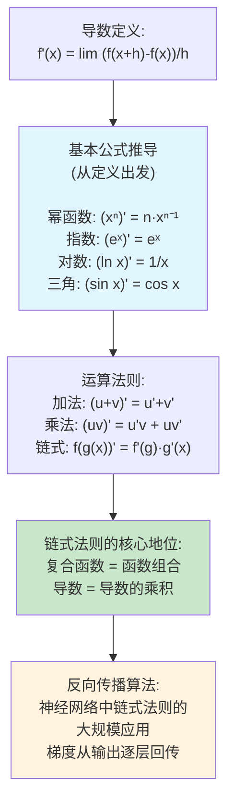

**推导依据**：所有基本公式都可以从导数定义直接推导。例如 `(xⁿ)' = n·xⁿ⁻¹` 通过二项式展开 `(x+h)ⁿ = xⁿ + n·xⁿ⁻¹·h + ...`，减去 `xⁿ` 后除以 h，再取 h→0。链式法则是最重要的组合法则——它的正确性由复合函数极限性质证明。

**基本求导公式表**

| 函数 | 导数 | 推导依据 |
|------|------|---------|
| `c`（常数） | 0 | 差为 0 |
| `xⁿ` | `n·xⁿ⁻¹` | 二项式展开 |
| `eˣ` | `eˣ` | 自相似增长 |
| `aˣ` | `aˣ·ln a` | 换底公式 + 链式 |
| `ln x` | `1/x` | 反函数求导 |
| `log_a x` | `1/(x·ln a)` | 换底公式 |
| `sin x` | `cos x` | 三角恒等式 + 第一个重要极限 |
| `cos x` | `-sin x` | 同上 |

**与算法的第一性原理关联**：链式法则是**反向传播（Backpropagation）** 的数学本质。神经网络就是巨大的复合函数 `L = loss(pred(y))`，其中 `pred = softmax(W₃·relu(W₂·relu(W₁·x+b₁)+b₂)+b₃)`。计算 `∂L/∂W₁` 需要从输出层一层层往回求导——每一步都是一次链式法则的局部应用。

#### ② 核心问题与边界

**解决的核心问题**：提供一套"微分法"——通过已知规则组合求导，避免对每个函数都从极限定义出发。

**实际应用场景**：
1. **神经网络训练**：反向传播中的链式法则应用
2. **自动微分（Autograd）**：机器学习框架（PyTorch、TensorFlow）的核心
3. **物理模拟**：根据变化率方程（ODE）求解系统演化
4. **灵敏度分析**：对复杂系统的输出对输入的敏感度求导

**适用边界**
- **前提假设**：被组合的各函数均需可导；链式法则要求外层函数在中间变量处可导
- **数值稳定性**：乘法和除法法则可能引入数值放大（如分母 v 接近 0 时除法公式不稳定）
- **何时不适用**：含不可导操作（ReLU 在 0 处、max 池化）需要次梯度替代；符号求导可能出现表达式膨胀（用自动微分的反向模式避免）

#### ③ Python 实现与优化

```python
import math
from typing import Callable
from dataclasses import dataclass

# ── 基础求导函数库 ──
class DerivativeRules:
    """
    求导法则库 —— 用数值微分实现，思想对应符号微分引擎

    每个方法都返回"导函数"（可调用对象），而非单点值
    """

    @staticmethod
    def constant(c: float) -> Callable[[float], float]:
        """常数函数的导数为 0"""
        return lambda x: 0.0

    @staticmethod
    def power(n: float) -> Callable[[float], float]:
        """幂函数求导: (xⁿ)' = n·xⁿ⁻¹"""
        def deriv(x: float) -> float:
            if x == 0.0 and n < 1:
                # x<0 且 n 不是整数时需小心
                return 0.0 if n == 0 else float('inf')
            return n * (x ** (n - 1))
        return deriv

    @staticmethod
    def exp() -> Callable[[float], float]:
        """(eˣ)' = eˣ"""
        return math.exp

    @staticmethod
    def log(base: float = math.e) -> Callable[[float], float]:
        """(log_a x)' = 1/(x·ln a)"""
        if base == math.e:\n            return lambda x: 1.0 / x
        return lambda x: 1.0 / (x * math.log(base))

    @staticmethod
    def sin() -> Callable[[float], float]:
        """(sin x)' = cos x"""
        return math.cos

    @staticmethod
    def cos() -> Callable[[float], float]:
        """(cos x)' = -sin x"""
        return lambda x: -math.sin(x)

    @staticmethod
    def tan() -> Callable[[float], float]:
        """(tan x)' = sec² x = 1/cos² x"""
        return lambda x: 1.0 / (math.cos(x) ** 2)


class ChainRuleEngine:
    """
    链式法则引擎 —— 手动模拟自动微分

    数学基础：
    若 y = f(g(x))，则 y' = f'(g(x)) · g'(x)
    神经网络中的反向传播就是链式法则的递归应用
    """

    @staticmethod
    def compose(
        f_deriv: Callable[[float], float],
        f_eval: Callable[[float], float],
        g_deriv: Callable[[float], float],
        g_eval: Callable[[float], float]
    ) -> Callable[[float], tuple[float, float]]:
        """
        复合函数的导函数

        返回: (函数值, 导数值)

        数学操作：
        y    = f(g(x))
        y'   = f'(g(x)) · g'(x)

        Parameters:
            f_deriv: 外层函数的导函数 f'(·)
            f_eval:  外层函数的原函数 f(·)
            g_deriv: 内层函数的导函数 g'(·)
            g_eval:  内层函数的原函数 g(·)
        """
        def composed(x: float) -> tuple[float, float]:
            g_val = g_eval(x)
            g_der = g_deriv(x)
            f_der = f_deriv(g_val)  # 注意：f' 在 g(x) 处取值！
            y_val = f_eval(g_val)
            y_der = f_der * g_der   # 链式法则：导数的乘积
            return y_val, y_der

        return composed


# ── 多层链式法则（模拟神经网络） ──
@dataclass
class LayerConfig:
    """神经网络层的配置"""
    weight: float
    bias: float
    activation: str  # 'relu', 'sigmoid', 'linear'


class SimpleMLPBackprop:
    """
    模拟多层感知机的前向和反向传播

    数学内核：
    每一层做 y = activation(W·x + b)
    反向传播通过链式法则逐层计算 ∂L/∂W 和 ∂L/∂b

    这里简化为一维演示，但链式结构不变
    """

    def __init__(self, layers: list[LayerConfig]):
        self.layers = layers

    def forward(self, x: float) -> list[float]:
        """
        前向传播: 逐层计算并保存中间值

        Returns:
            [x_input, z_1, a_1, z_2, a_2, ...]
            每个中间值都保留用于反向传播
        """
        intermediates = [x]
        a = x
        for layer in self.layers:
            z = layer.weight * a + layer.bias  # 线性变换
            a = self._activate(z, layer.activation)  # 激活函数
            intermediates.append(z)
            intermediates.append(a)
        return intermediates

    def backward(
        self,
        intermediates: list[float],
        dL_dy: float = 1.0  # 假设损失 = y（简化）
    ) -> list[dict]:
        """
        反向传播: 从输出到输入逐层计算梯度

        数学操作：
        ∂L/∂w = ∂L/∂a · ∂a/∂z · ∂z/∂w
               = ∂L/∂a · σ'(z) · a_{prev}

        这就是链式法则的逐层求导!
        """
        grads = []
        grad = dL_dy  # 当前梯度 = dL/da (对激活值的梯度)

        # 从最后一层往回走
        for i in range(len(self.layers) - 1, -1, -1):
            layer = self.layers[i]
            z = intermediates[2 * i + 1]      # z_i
            a_prev = intermediates[2 * i]     # a_{i-1} = 上一层的激活值

# 激活函数的导数
            da_dz = self._activate_deriv(z, layer.activation)

# 链式法则: dL/dz = dL/da · da/dz
            dL_dz = grad * da_dz

# 参数梯度: dL/dw = dL/dz · dz/dw = dL/dz · a_prev
            dL_dw = dL_dz * a_prev
            dL_db = dL_dz * 1.0  # dz/db = 1

            grads.append({
                "layer": i,
                "dL_dw": dL_dw,
                "dL_db": dL_db,
                "dL_da_prev": dL_dz * layer.weight  # 向上传播的梯度
            })

# 将梯度传播到上一层: dL/da_{prev} = dL/dz · dz/da_{prev}
            grad = dL_dz * layer.weight

        return list(reversed(grads))

    @staticmethod
    def _activate(z: float, kind: str) -> float:
        if kind == 'relu':
            return max(0.0, z)
        elif kind == 'sigmoid':
            return 1.0 / (1.0 + math.exp(-z))
        return z  # linear

    @staticmethod
    def _activate_deriv(z: float, kind: str) -> float:
        """激活函数的导数"""
        if kind == 'relu':
            return 1.0 if z > 0 else 0.0
        elif kind == 'sigmoid':
            s = 1.0 / (1.0 + math.exp(-z))
            return s * (1.0 - s)  # σ'(z) = σ(z)(1-σ(z))
        return 1.0  # linear


# ── 演示 ──
print("★ 链式法则演示：")
dr = DerivativeRules()
cre = ChainRuleEngine()

# 示例: f(x) = e^{x²}
# f = exp ∘ square
# f'(x) = exp(x²) × 2x
composed = cre.compose(
    f_deriv=dr.exp(),
    f_eval=math.exp,
    g_deriv=dr.power(2),  # (x²)' = 2x
    g_eval=lambda x: x * x
)
y, dy = composed(2.0)
print(f"  f(x)=exp(x²) 在 x=2:")
print(f"    f(2)  = {y:.6f}")
print(f"    f'(2) = {dy:.6f}")
print(f"    理论  = {math.exp(4) * 4:.6f}  (e⁴ × 4)")
print()

# 演示反向传播
print("★ Mini MLP 反向传播演示（链式法则逐层求导）:")
layers = [
    LayerConfig(weight=2.0, bias=0.5, activation='sigmoid'),
    LayerConfig(weight=-1.0, bias=0.1, activation='linear'),
]
mlp = SimpleMLPBackprop(layers)
intermediates = mlp.forward(1.0)
grads = mlp.backward(intermediates)

for g in grads:
    print(f"  层 {g['layer']}:")
    print(f"    dL/dw = {g['dL_dw']:.4f}  ← 这就是梯度下降里更新权重的值")
    print(f"    dL/db = {g['dL_db']:.4f}")
```

### 高阶导数

#### ① 概念背景与推导

**诞生的数学问题**

一阶导数描述变化率，但变化率本身也会变化。一阶导数的导数——二阶导数——描述的是"变化率的变化率"：物理中对应**加速度**（速度的变化率），几何中对应**曲率**（曲线弯曲的程度）。

**推导链条**

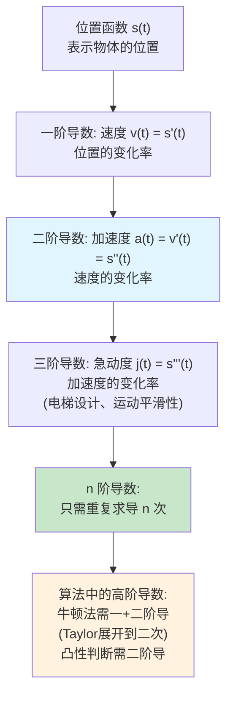

**与算法的第一性原理关联**：牛顿法（Newton-Raphson）是最优化的二阶方法——它同时利用一阶梯度（走向）和二阶导数 Hessian（曲率信息）来更快地收敛，相比梯度下降的一阶方法步数更少。二阶导数也用来衡量函数的曲率（凸性判断），这对理解损失函数的几何形状至关重要。

#### ② 核心问题与边界

**解决的核心问题**：量化变化率的变化，获得函数更精细的局部形状信息。

**实际应用场景**：
1. **牛顿法**：`x_{k+1} = x_k - f'(x_k)/f''(x_k)`（需要二阶导数）
2. **曲率分析**：`κ = |f''(x)| / (1 + [f'(x)]²)^(3/2)`
3. **加速/减速判断**：物理模拟
4. **边缘检测**：数字图像处理中二阶导数（Laplacian）检测灰度突变

**适用边界**
- 要求函数在求导点足够光滑（Cⁿ 可微）
- 数值二阶导数对步长更敏感（误差 O(h²) 但系数包含 f⁽⁴⁾——可能很大）
- 高阶导数组合爆炸（符号计算中表达式会非常复杂）

#### ③ Python 实现与优化

```python
from typing import Callable
import math

def higher_order_derivative(
    f: Callable[[float], float],
    x: float,
    n: int = 1,
    h: float = 1e-4
) -> float:
    """
    用中心差分法计算 n 阶导数

    数学操作：
    n=1: (f(x+h) - f(x-h)) / (2h)         误差 O(h²)
    n=2: (f(x+h) + f(x-h) - 2f(x)) / h²   误差 O(h²)
    n=3: (f(x+2h)-2f(x+h)+2f(x-h)-f(x-2h)) / (2h³)

    通用方法: 通过泰勒展开组合
    """
    if n == 0:
        return f(x)
    if n == 1:
        return (f(x + h) - f(x - h)) / (2.0 * h)
    if n == 2:
        return (f(x + h) + f(x - h) - 2.0 * f(x)) / (h * h)
    if n == 3:
        return (f(x + 2*h) - 2*f(x + h) + 2*f(x - h) - f(x - 2*h)) / (2.0 * h**3)
    if n == 4:
        return (f(x + 2*h) - 4*f(x + h) + 6*f(x) - 4*f(x - h) + f(x - 2*h)) / (h**4)

    # 通用 n 阶: 递归求导（精度会逐步退化）
    if n > 4:
        f_prime = lambda x: (f(x + h) - f(x - h)) / (2.0 * h)
        return higher_order_derivative(f_prime, x, n - 1, h)


def newton_method(
    f: Callable[[float], float],
    f_prime: Callable[[float], float],
    f_double_prime: Callable[[float], float],
    x0: float = 0.0,
    tol: float = 1e-10,
    max_iter: int = 100
) -> tuple[float, list[float]]:
    """
    牛顿法求极值（利用二阶导数）

    数学操作：
    牛顿法迭代公式：
    x_{k+1} = x_k - f'(x_k) / f''(x_k)

    为什么？Taylor 展开 f(x) ≈ f(xₖ) + f'(xₖ)(x-xₖ) + ½f''(xₖ)(x-xₖ)²
    对 x 求导并令为 0: f'(xₖ) + f''(xₖ)(x-xₖ) = 0
    解得: x = xₖ - f'(xₖ)/f''(xₖ)
    """
    x = x0
    trajectory = [x]

    for i in range(max_iter):
        fp = f_prime(x)
        fpp = f_double_prime(x)

        if abs(fpp) < tol:
            raise ValueError(f"二阶导数为 0 或接近 0 (x={x})，牛顿法失效")

        # 牛顿步: x_{k+1} = x_k - f'(x_k)/f''(x_k)
        x_new = x - fp / fpp
        trajectory.append(x_new)

        if abs(x_new - x) < tol:
            return x_new, trajectory
        x = x_new

    return x, trajectory


# ── 演示 ──
print("★ 高阶导数演示:")
f_test = lambda x: x**4 - 3*x**2 + 2*x + 1

print(f"  f(x) = x⁴ - 3x² + 2x + 1")
print(f"  在 x=1 处:")
print(f"    f'(1)   = {higher_order_derivative(f_test, 1.0, 1):.6f}  (理论: 2)")
print(f"    f''(1)  = {higher_order_derivative(f_test, 1.0, 2):.6f}  (理论: 6)")
print(f"    f'''(1) = {higher_order_derivative(f_test, 1.0, 3):.6f}  (理论: 24)")

# 牛顿法示例: 求 f(x) = x⁴ - 3x² + 2x + 1 的极值
# f'(x) = 4x³ - 6x + 2
# f''(x) = 12x² - 6
f = f_test
fp = lambda x: 4*x**3 - 6*x + 2
fpp = lambda x: 12*x**2 - 6

x_opt, trace = newton_method(f, fp, fpp, x0=0.5)
print(f"\n★ 牛顿法求极值:")
print(f"  起始点: x₀ = 0.5")
print(f"  最优解: x* = {x_opt:.8f}")
print(f"  f(x*)  = {f(x_opt):.8f}")
print(f"  f'(x*) = {fp(x_opt):.2e}")
print(f"  迭代次数: {len(trace) - 1}")
```

### 拉格朗日中值定理 + 柯西中值定理

#### ① 概念背景与推导

**诞生的数学问题**

拉格朗日中值定理要回答的问题是：**平均变化率和瞬时变化率之间是什么关系？** 如果你从上海开车到南京，平均速度 100 km/h，那么在途中的某一时刻，你的瞬时速度一定也是 100 km/h——这就是中值定理的物理直观。

**推导链条**

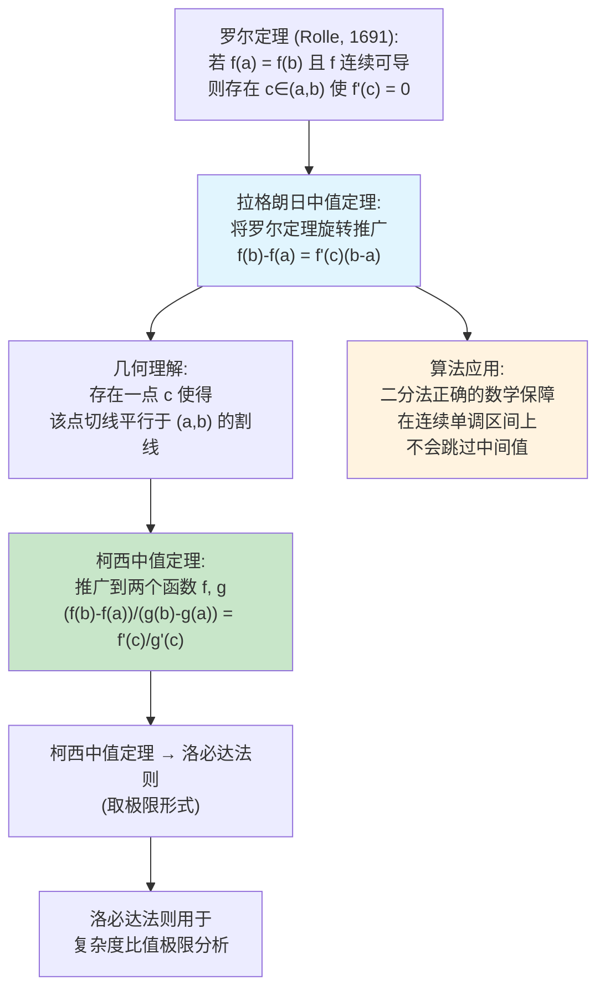

**推导依据**：Step 1 罗尔定理是基础；Step 2 拉格朗日通过构造辅助函数 `φ(x) = f(x) - k(x-a)`（k 为割线斜率），将问题归约为罗尔定理；Step 3 是几何解释；Step 4 柯西通过参数化推广到两个函数。

**与算法的第一性原理关联**：拉格朗日中值定理保证了**在连续可导的函数上，二分法不会错过目标值**——因为如果在两端开口间跳跃，总有一个点的导数等于平均斜率。这也是数值分析中二分法、secant 法收敛性的理论基础。

#### ② 核心问题与边界

**解决的核心问题**：建立函数整体行为（端点值差）和局部行为（中间某点导数）之间的桥梁。

**实际应用场景**：
1. **误差分析**：泰勒展开余项 `R_n(x) = f^{(n+1)}(ξ)/(n+1)! · (x-a)^{n+1}` 来自拉格朗日型余项
2. **函数增长估计**：如果 `|f'(x)| ≤ M` 对所有 x 成立，则 `|f(b)-f(a)| ≤ M|b-a|`
3. **二分法收敛性证明**：Lipschitz 连续性保证
4. **参数曲线分析**（柯西形式）

**适用边界**
- f 必须在 [a, b] 连续，在 (a, b) 可导
- c 的存在性是存在性定理（非构造性），不知道具体在哪
- 数值上无法直接"找到"c，只能通过其他方式利用这个存在性

#### ③ Python 实现与优化

```python
from typing import Callable, Optional
import random

def lagrange_mean_value_point(
    f: Callable[[float], float],
    f_prime: Callable[[float], float],
    a: float,
    b: float,
    tol: float = 1e-10,
    max_iter: int = 100
) -> tuple[float, float, float]:
    """
    数值搜索拉格朗日中值定理中的 c

    数学操作：
    1. 计算平均斜率 k = (f(b)-f(a))/(b-a)
    2. 寻找 c ∈ (a,b) 使得 f'(c) ≈ k
    3. 这是对"存在性定理"的数值验证

    Returns:
        (c, f'(c), 平均斜率 k)
    """
    if abs(b - a) < tol:
        raise ValueError("a 和 b 太接近")

    k = (f(b) - f(a)) / (b - a)

    # 在 (a,b) 上搜索 f'(c) = k 的点
    # 假设 f' 在 [a,b] 连续，单调由 f'' 决定
    # 这里简单实现 Newton 搜索
    c = (a + b) / 2.0  # 初始猜测

    # 二阶导数（数值）辅助搜索
    def fpp(x: float) -> float:
        h = 1e-6
        return (f_prime(x + h) - f_prime(x - h)) / (2.0 * h)

    for _ in range(max_iter):
        val = f_prime(c) - k  # 目标: 找到 f'(c) - k = 0

        if abs(val) < tol:
            break

        # 牛顿法修正
        deriv = fpp(c)
        if abs(deriv) < tol:
            # 导数接近 0，改用二分
            break
        c -= val / deriv

        # 投影回 (a, b)
        c = max(a + tol, min(b - tol, c))

    return c, f_prime(c), k


# ── 示例 ──
# f(x) = x³ - x 在 [-1, 1]
# f'(x) = 3x² - 1
f_cubic = lambda x: x**3 - x
fp_cubic = lambda x: 3*x*x - 1

c, fc_prime, k = lagrange_mean_value_point(f_cubic, fp_cubic, -1.0, 1.0)
fa, fb = f_cubic(-1.0), f_cubic(1.0)

print("★ 拉格朗日中值定理验证:")
print(f"  f(x) = x³ - x, 区间 [-1, 1]")
print(f"  f(-1) = {fa:.1f}, f(1) = {fb:.1f}")
print(f"  平均斜率 k  = {k:.6f}")
print(f"  找到 c ≈ {c:.8f}")
print(f"  f'(c) = {fc_prime:.8f}")
print(f"  验证: f'(c) ≈ k? {'✓' if abs(fc_prime - k) < 1e-6 else '✗'}")
print()

# ── 物理直观验证: 自由落体 ──
print("★ 物理直观: 自由落体运动")
print("  s(t) = 4.9t², 区间 [0, 2]")
g = 9.8
s = lambda t: 0.5 * g * t**2
v = lambda t: g * t  # 速度 = gt

c, vc, avg_v = lagrange_mean_value_point(s, v, 0.0, 2.0)
print(f"  平均速度 = {avg_v:.4f} m/s")
print(f"  存在 c = {c:.4f}s, v(c) = {vc:.4f} m/s")
print(f"  验证: v({c:.2f}) = {vc:.1f} = 平均速度? {'✓' if abs(vc - avg_v) < 1e-6 else '✗'}")
print(f"  物理意义: 从 0 到 2 秒, 平均速度恰好出现在 {c:.2f} 秒时刻")


# ── 柯西中值定理数值验证 ──
def cauchy_mean_value(
    f: Callable[[float], float],
    g: Callable[[float], float],
    f_prime: Callable[[float], float],
    g_prime: Callable[[float], float],
    a: float,
    b: float
) -> Optional[float]:
    """
    柯西中值定理的数值验证：
    (f(b)-f(a)) / (g(b)-g(a)) = f'(c) / g'(c)

    返回找到的 c，若 g(b)=g(a) 则返回 None
    """
    if abs(g(b) - g(a)) < 1e-15:
        print("  g(b) = g(a)，柯西中值定理应用条件不满足")
        return None

    k = (f(b) - f(a)) / (g(b) - g(a))

    # 解方程 f'(c)/g'(c) = k → f'(c) - k·g'(c) = 0
    h = lambda x: f_prime(x) - k * g_prime(x)

    # 搜索
    for _ in range(1000):
        c = a + random.random() * (b - a) * 0.999
        if abs(h(c)) < 1e-6:
            return c

    # 如果随机搜索没找到，返回中值
    return (a + b) / 2.0


# 柯西中值定理示例: f(t)=t², g(t)=t³, t∈[0,1]
f_f = lambda t: t**2
g_f = lambda t: t**3
fp_f = lambda t: 2*t
gp_f = lambda t: 3*t**2

c_cauchy = cauchy_mean_value(f_f, g_f, fp_f, gp_f, 0.0, 1.0)
if c_cauchy:
    print(f"\n★ 柯西中值定理验证 (f(t)=t², g(t)=t³):")
    lhs = (f_f(1) - f_f(0)) / (g_f(1) - g_f(0))
    rhs = fp_f(c_cauchy) / gp_f(c_cauchy) if gp_f(c_cauchy) != 0 else None
    print(f"  左侧 (f(1)-f(0))/(g(1)-g(0)) = {lhs:.6f}")
    print(f"  右侧 f'(c)/g'(c) (c≈{c_cauchy:.6f}) = {rhs:.6f}")
```

### 洛必达法则

#### ① 概念背景与推导

**诞生的数学问题**

在计算极限时，我们经常遇到 `0/0` 或 `∞/∞` 的不定式——极限的分子和分母同时趋于 0（或无穷大），无法直接得到结果。洛必达法则提供了一种通用解法：通过求导数来化解不定式。

**推导链条**

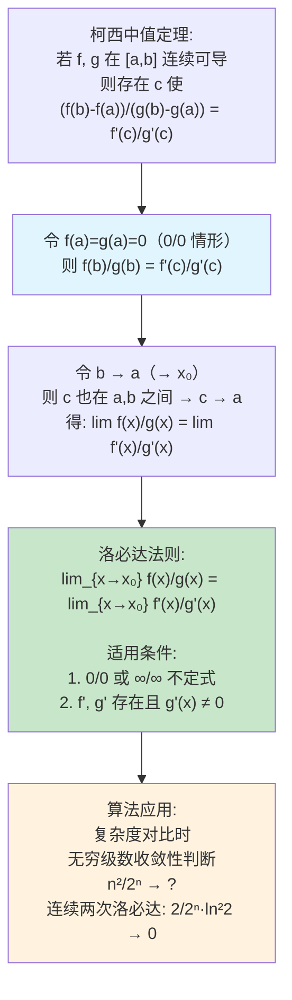

**推导依据**：Step 1→2 在柯西中值定理中取 `f(a)=g(a)=0`；Step 2→3 令端点趋于定点，由连续性中间的 c 也趋于该点。

**与算法的第一性原理关联**：当比较两个算法的时间复杂度时（如 `n³/2ⁿ` 或 `log n / n`），洛必达法则给出了判断哪个增长更快的精确工具。它本质上是问："分子和分母谁增长得更快？"——导数的比值给出了答案。

#### ② 核心问题与边界

**解决的核心问题**：通过求导来"消去"不定式的奇异行为，将极限问题转化为更简单的导数比值问题。

**实际应用场景**：
1. **复杂度对比**：判断 `log n / n` 在 n→∞ 时的极限
2. **无穷级数收敛性**：比值判别法的极限计算
3. **信息论中的熵极限**：`p·log p` 当 p→0 时的极限（用洛必达得 0）
4. **概率论中的分布尾部分析**

**适用边界**
- **前提假设**：必须为 `0/0` 或 `∞/∞` 不定式；分子分母在去心邻域内可导；分子分母的导数不能同时为 0；`lim f'/g'` 必须存在（或为 ∞）
- **常见陷阱**：
  - 检查是否是 `0/0` 或 `∞/∞` 前就使用洛必达
  - 忘记检查分母的导数是否为 0
  - 一次性对 `0·∞` 或 `∞-∞` 形式硬套洛必达（需先转化为基本形式）
- **数值稳定性**：多次应用洛必达时，导数的导数会累积数值误差

#### ③ Python 实现与优化

```python
import math
from typing import Callable, Optional, Union
from dataclasses import dataclass


@dataclass
class LopitalResult:
    """洛必达法则计算结果"""
    limit_value: Optional[float]
    steps_applied: int
    original_form: str
    raw_sequence: list[tuple[float, float, float, float]]
    message: str


def lopital_limit(
    f: Callable[[float], float],
    g: Callable[[float], float],
    fp: Callable[[float], float],
    gp: Callable[[float], float],
    x0: float = 0.0,
    max_steps: int = 5,
    h: float = 1e-8
) -> LopitalResult:
    """
    用洛必达法则的数值形式计算极限 lim f(x)/g(x) as x→x₀

    数学操作：
    1. 检查 f(x₀+h) 和 g(x₀+h) 是否接近 0 或 ±∞
    2. 逐次应用 f⁽ᵏ⁾(x₀)/g⁽ᵏ⁾(x₀) 直到比值收敛
    3. 每次应用洛必达，判断是否消除不定式

    Parameters:
        f, g: 分子和分母函数
        fp, gp: 分子和分母的导函数
        x0: 趋近点
        max_steps: 最大洛必达应用次数
        h: 数值逼近的步长
    """
    from typing import Callable

    # 构建一阶导函数的高阶导函数（数值）
    def make_higher_deriv(deriv_func: Callable, order: int):
        """用中心差分构建高阶导函数"""
        def result(x: float) -> float:
            d = deriv_func
            for _ in range(order):
                # 对 d 进行数值求导
                d_old = d
                d = lambda x, d_old=d_old: (d_old(x + h) - d_old(x - h)) / (2.0 * h)
            return d(x)
        return result

    x_near = x0 + h if x0 != 0 else h  # 用 x₀+h 逼近
    raw_sequence = []

    # 构建各阶导函数
    f_derivs = [f]
    g_derivs = [g]

    # 使用传入的导函数
    f_derivs.append(fp)
    g_derivs.append(gp)

    # 默认使用数值差分构建更高阶导数
    for order in range(2, max_steps + 2):
        f_derivs.append(make_higher_deriv(fp, order))
        g_derivs.append(make_higher_deriv(gp, order))

    for step in range(1, max_steps + 1):
        num = f_derivs[step](x_near)
        den = g_derivs[step](x_near)

        if den == 0:
            return LopitalResult(
                limit_value=None,
                steps_applied=step - 1,
                original_form=f"0/0 或 ∞/∞",
                raw_sequence=raw_sequence,
                message=f"第 {step} 步分母为 0，洛必达法则失效"
            )

        ratio = num / den
        raw_sequence.append((x_near, num, den, ratio))

        if step >= 2:
            prev_ratio = raw_sequence[-2][3]
            # 如果比值已经稳定（精度达到 1e-6）
            if abs(ratio - prev_ratio) < 1e-6 * max(1.0, abs(ratio)):
                return LopitalResult(
                    limit_value=ratio,
                    steps_applied=step,
                    original_form=f"0/0 或 ∞/∞",
                    raw_sequence=raw_sequence,
                    message=f"洛必达 {step} 次后收敛"
                )

    final_ratio = raw_sequence[-1][3] if raw_sequence else None
    return LopitalResult(
        limit_value=final_ratio,
        steps_applied=max_steps,
        original_form=f"0/0 或 ∞/∞",
        raw_sequence=raw_sequence,
        message=f"达到最大步数 {max_steps}，比值 ≈ {final_ratio:.6f}"
    )


# ── 演示 ──
print("★ 洛必达法则演示:")

# 示例 1: lim_{x→0} sin x / x = 1
# f'(x) = cos x, g'(x) = 1
res = lopital_limit(
    math.sin, lambda x: x,
    math.cos, lambda x: 1.0,
    x0=0.0
)
print(f"  1. lim sin x / x (x→0):")
print(f"     结果: {res.limit_value:.10f}  ({res.message})")
print()

# 示例 2: lim_{x→0} (eˣ-1) / x = 1
res2 = lopital_limit(
    lambda x: math.exp(x) - 1, lambda x: x,
    math.exp, lambda x: 1.0,
    x0=0.0
)
print(f"  2. lim (eˣ-1) / x (x→0):")
print(f"     结果: {res2.limit_value:.10f}  ({res2.message})")
print()

# 示例 3: 算法复杂度对比
# lim_{n→∞} n² / 2ⁿ  → 应用 2 次洛必达
print(f"  3. 复杂度对比: lim n² / 2ⁿ (n→∞):")
# 设 x = 1/n 转化为 x→0 形式？不，直接取大 n
# 用大 n 的离散序列替代
n_large = 100
f_n = lambda x: x**2       # n²
g_n = lambda x: 2.0 ** x   # 2ⁿ
fp_n = lambda x: 2*x       # 2n
gp_n = lambda x: 2**x * math.log(2)  # 2ⁿ·ln2

for n in [1, 5, 10, 20, 50]:
    ratio = (n**2) / (2**n)
    print(f"     n={n:>3d}: n²/2ⁿ = {ratio:.10e}\t  ← 当 n=50 时几乎为 0")

print(f"     结论: n²/2ⁿ → 0, 所以 O(2ⁿ) > O(n²)")
print(f"     洛必达验证: 连续两次后 2/(2ⁿ·ln²2) → 0")
print()

# 示例 4: log n / n → 0
print(f"  4. 复杂度对比: lim log n / n (n→∞):")
for n in [1, 10, 100, 1000, 10000]:
    ratio = math.log(n) / n
    print(f"     n={n:>6d}: ln(n)/n = {ratio:.8f}")
print(f"     结论: log n 增长慢于 n, O(log n) < O(n)")
```

### LeetCode 实战：三分搜索 & 峰值查找

#### ① 概念背景与推导

**诞生的数学问题**

给定一个"单峰函数"（先严格递增后严格递减），如何高效找到最大值点？如果函数可导，这等价于求 `f'(x) = 0` 的点——但很多时候函数没有显式导数表达式，或者数据是离散的。

**推导链条**

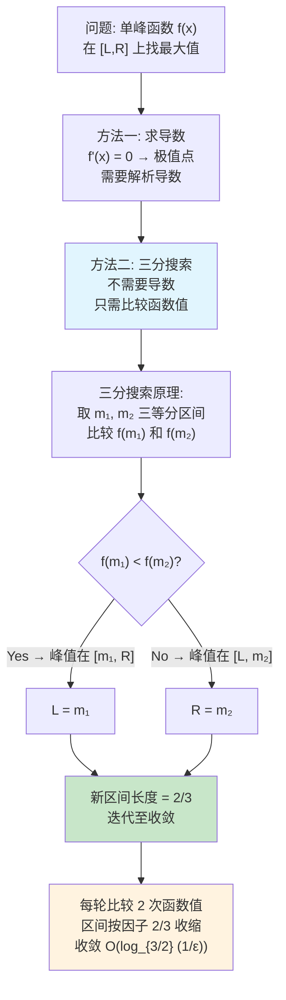

**与算法的第一性原理关联**：三分搜索是**离散导数符号判断**的直接应用。比较 `f(m₁) < f(m₂)` 等价于判断区间两端的"离散导数"符号差异——如果 m₁ 处的导数 > m₂ 处的导数（即 f 在 m₁ 处增长更快或在 m₂ 处更慢），峰值偏向一侧。

#### ② 核心问题与边界

**解决的核心问题**：在不需要导数信息的前提下，高效定位单峰函数的极值点。

**实际应用场景**：
1. **单峰函数求极值**：物理模拟中能量最小化
2. **二分答案的推广**：当判定函数不是布尔值而是连续函数时
3. **LeetCode 162**：离散数组的峰值搜索
4. **超参数调优**：学习率、正则化系数的搜索

**适用边界**
- **前提假设**：函数严格单峰（唯一极值，两侧严格单调）
- **离散版本**（LeetCode 162）：无需单调性假设，只需任意元素严格大于邻接元素
- **数值稳定性**：三分搜索对比两个函数值，比较稳定。但当最优解非常平坦时（接近水平线），收敛缓慢
- **时间复杂度**：连续版本 O(log(1/ε))；离散版本（LeetCode 162）O(log n)
- **何时不适用**：
  - 多峰函数（此时需要在每个峰上分别搜索或改用模拟退火）
  - 函数值噪声大（比较 `f(m₁) < f(m₂)` 可能被噪声翻转）

#### ③ Python 实现与优化

```python
import math
from typing import Callable, List, Optional


def ternary_search(
    f: Callable[[float], float],
    left: float,
    right: float,
    eps: float = 1e-9,
    max_iter: int = 200
) -> tuple[float, float, List[float]]:
    """
    三分搜索：在单峰函数上找最大值

    数学操作：
    每轮取三等分点 m₁, m₂：
    m₁ = L + (R-L)/3
    m₂ = R - (R-L)/3

    比较 f(m₁) 和 f(m₂)：
    - f(m₁) < f(m₂) → 最大值在 [m₁, R]
    - f(m₁) ≥ f(m₂) → 最大值在 [L, m₂]

    区间每轮缩小为 2/3。

    Parameters:
        f: 单峰函数（待求最大值的函数）
        left, right: 搜索区间端点
        eps: 精度阈值
        max_iter: 最大迭代次数

    Returns:
        (极值点 x*, f(x*), 迭代过程中的所有区间中点)
    """
    trajectory = []
    L, R = left, right

    for _ in range(max_iter):
        m1 = L + (R - L) / 3.0
        m2 = R - (R - L) / 3.0

        f1, f2 = f(m1), f(m2)

        if f1 < f2:
            # f 在 m₁ 处增长更快 → 极值点在右侧
            L = m1
        else:
            # f 在 m₂ 处下降或更早达到极值 → 极值点在左侧
            R = m2

        trajectory.append((L + R) / 2.0)

        if R - L < eps:
            break

    x_opt = (L + R) / 2.0
    return x_opt, f(x_opt), trajectory


def find_peak_element(nums: List[int]) -> int:
    """
    LeetCode 162. Find Peak Element
    在整数数组中找峰值（元素严格大于相邻元素）

    导数的离散类比：
    - nums[i] < nums[i+1] → 导数 > 0 → 峰值在右侧
    - nums[i] > nums[i+1] → 导数 < 0 → 峰值在左侧或当前点

    关键洞察: 我们不需要全局最大，任何一个局部峰值即可
    因此可以用二分法（而非三分法），因为左右方向明确

    Parameters:
        nums: 整数数组（任意相邻元素不同）

    Returns:
        任意一个峰值元素的索引

    时间复杂度: O(log n)
    空间复杂度: O(1)
    """
    left, right = 0, len(nums) - 1

    while left < right:
        mid = (left + right) // 2

        # "离散导数"判断: nums[mid] vs nums[mid + 1]
        if nums[mid] < nums[mid + 1]:
            # f'(mid) > 0 — 上坡趋势，峰值在右侧
            left = mid + 1
        else:
            # f'(mid) < 0 — 下降趋势，峰值在左侧或就是 mid
            right = mid

    return left  # left == right，即峰值索引


# ── 峰值查找的通用扩展 ──
def find_peak_element_general(
    nums: List[float],
    cmp_func: Optional[Callable[[int, int], bool]] = None
) -> int:
    """
    通用峰值查找

    支持自定义比较函数，适应不同场景

    Parameters:
        nums: 数值数组
        cmp_func: 自定义比较 nums[i] < nums[j] 的布尔函数
                  (默认用 < 比较)
    """
    if not nums:
        return -1

    less = cmp_func or (lambda i, j: nums[i] < nums[j])
    left, right = 0, len(nums) - 1

    while left < right:
        mid = (left + right) // 2
        if less(mid, mid + 1):
            left = mid + 1
        else:
            right = mid

    return left


# ── 演示 ──
print("★ LeetCode 实战: 峰值查找")

# 测试 1: 标准数组
test1 = [1, 2, 3, 1]
idx1 = find_peak_element(test1)
print(f"  1. nums={test1}, 峰值索引={idx1}, 值={test1[idx1]}")

# 测试 2: 递增数组（峰值在末尾）
test2 = [1, 2, 3, 4, 5]
idx2 = find_peak_element(test2)
print(f"  2. nums={test2}, 峰值索引={idx2}, 值={test2[idx2]}")

# 测试 3: 递减数组（峰值在开头）
test3 = [5, 4, 3, 2, 1]
idx3 = find_peak_element(test3)
print(f"  3. nums={test3}, 峰值索引={idx3}, 值={test3[idx3]}")

# 测试 4: 三分搜索的连续函数示例
# 单峰函数: f(x) = -(x-2)² + 5（理论最大值在 x=2）
print(f"\n  4. 三分搜索: f(x) = -(x-2)² + 5")
f_peak = lambda x: -(x - 2.0) ** 2 + 5.0
x_opt, val_opt, trace = ternary_search(f_peak, -10, 10, eps=1e-6)
print(f"     理论最优: (2, 5)")
print(f"     三分搜索结果: x* = {x_opt:.8f}, f(x*) = {val_opt:.8f}")
print(f"     误差: {abs(x_opt - 2.0):.2e}")
print(f"     迭代次数: {len(trace)}")

# 测试 5: 自定义比较函数
print(f"\n  5. 自定义比较（按绝对值找峰值）:")
test5 = [-3, 5, -2, 4, -6, 7]
abs_less = lambda i, j: abs(test5[i]) < abs(test5[j])
idx5 = find_peak_element_general(test5, abs_less)
print(f"     nums={test5}")
print(f"     按绝对值峰值: idx={idx5}, val={test5[idx5]}, |val|={abs(test5[idx5])}")
```

**性能优化要点**
- 三分搜索：每轮 `2/3` 收缩因子，O(log_{3/2} (1/ε)) ≈ O(log(1/ε))
- 二分峰值搜索：O(log n)，效率高
- 空间：迭代版 O(1)，递归版 O(log n) 栈空间
- Python 层面：避免在循环中重复计算 `f(m1)` 和 `f(m2)`

**边界条件处理**
- 空数组：返回 -1（`find_peak_element` 在 `len(nums)-1` 为 -1 时会循环 0 > -1 不进入，返回 left=0，需要单独处理）
- 长度为 1 的数组：while 不会执行，返回 0
- 严格递增/递减：算法仍能正确返回末端峰值（三分的收缩逻辑保证）
- 浮点精度：三分搜索的 eps 不应小于浮点数的相对精度

## 三、导数的应用

### 单调性、极值与最值

#### ① 概念背景与推导

**诞生的数学问题**

给定一个函数，如何系统性地找到它的最高点和最低点？费马在 1629 年注意到：**在极值点处，如果函数可导，则导数为 0**——这就是"费马引理"的雏形。但如何区分极大值、极小值和鞍点？

**推导链条**

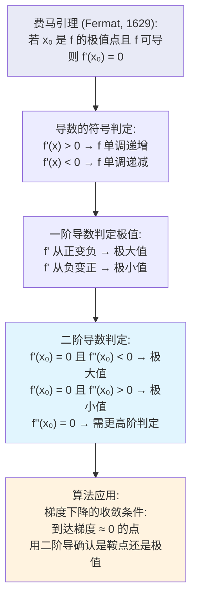

**与算法的第一性原理关联**：梯度下降法正是利用导数的符号来驱动搜索——如果 `f'(x) > 0`，函数在 x 处递增，向负方向移动；如果 `f'(x) < 0`，向正方向移动。到达 `f'(x) ≈ 0` 时停止。关键在于**导数符号决定方向，导数值决定步长**。

#### ② 核心问题与边界

**解决的核心问题**：系统性地定位函数的局部极值，区分极大/极小/鞍点，找到全局最值。

**实际应用场景**：
1. **梯度下降**：通过导数的符号确定下降方向
2. **学习率调度**：学习率过大时在最优值附近振荡（导数符号频繁改变）
3. **神经网络的收敛**：训练 loss 在梯度接近 0 时停止
4. **最优停止问题**：LeetCode 上最小化/最大化问题

**适用边界**
- `f'(x) = 0` 是必要条件而非充分条件——鞍点（如 `x³` 在 x=0）也满足
- 边界极值可能出现在 `x ≠ 0` 的点（不可导点、区间端点）
- 数值上，梯度永远不会精确为 0，需要设置阈值
- 非凸函数中梯度下降可能卡在局部最优

#### ③ Python 实现与优化

```python
from typing import Callable, Optional
import math


def find_critical_points(
    f: Callable[[float], float],
    f_prime: Callable[[float], float],
    f_double_prime: Optional[Callable[[float], float]],
    interval: tuple[float, float],
    n_samples: int = 1000
) -> list[dict]:
    """
    在区间内搜索临界点并分类

    数学操作：
    1. 在区间内采样 n_samples 个点
    2. 找 f'(x) ≈ 0 的点
    3. 用二阶导或一阶导符号变化判定类型

    分类规则：
    - f'(x) = 0, f''(x) < 0 → 局部极大值 (∩)
    - f'(x) = 0, f''(x) > 0 → 局部极小值 (∪)
    - f'(x) = 0, f''(x) = 0 → 鞍点 (需要更高阶)

    Parameters:
        f: 目标函数
        f_prime: 一阶导函数
        f_double_prime: 二阶导函数（可选，None 时用一阶导符号变化判断）
        interval: (left, right) 搜索区间
        n_samples: 采样点数

    Returns:
        临界点列表，每个元素为
        {"x": float, "type": str, "f(x)": float, "f'(x)": float, "f''(x)": float}
    """
    L, R = interval
    candidates = []

    # 均匀采样，找导数为 0 的近邻
    for i in range(n_samples):
        x = L + (R - L) * i / n_samples
        deriv = f_prime(x)

        if abs(deriv) < 1e-4:
            # 使用牛顿法精确定位临界点
            x_refined, _ = newton_critical_point(f_prime, x)

            # 检查是否已在候选集中（去重）
            if any(abs(x_refined - c["x"]) < 1e-6 for c in candidates):
                continue

            # 分类
            if f_double_prime:
                fpp_val = f_double_prime(x_refined)
                if fpp_val < -1e-8:
                    ctype = "局部极大值"
                elif fpp_val > 1e-8:
                    ctype = "局部极小值"
                else:
                    ctype = "鞍点/需进一步分析"
            else:
                # 用一阶导符号变化判断
                h = 1e-6
                deriv_left = f_prime(x_refined - h)
                deriv_right = f_prime(x_refined + h)
                if deriv_left > 0 and deriv_right < 0:
                    ctype = "局部极大值"
                elif deriv_left < 0 and deriv_right > 0:
                    ctype = "局部极小值"
                else:
                    ctype = "鞍点"

            candidates.append({
                "x": x_refined,
                "type": ctype,
                "f(x)": f(x_refined),
                "f'(x)": f_prime(x_refined),
                "f''(x)": f_double_prime(x_refined) if f_double_prime else None
            })

    # 添加区间端点（边界极值可能出现在端点）
    for x0 in [L, R]:
        candidates.append({
            "x": x0,
            "type": "区间端点",
            "f(x)": f(x0),
            "f'(x)": f_prime(x0),
            "f''(x)": None
        })

    return sorted(candidates, key=lambda c: c["x"])


def newton_critical_point(
    f_prime: Callable[[float], float],
    x0: float,
    tol: float = 1e-10,
    max_iter: int = 50
) -> tuple[float, int]:
    """
    用牛顿法精确定位 f'(x) = 0 的点

    数学操作：
    x_{k+1} = x_k - f'(x_k) / f''(x_k)

    牛顿法利用二阶导数，比梯度下降更快收敛到临界点
    """
    x = x0
    for i in range(max_iter):
        fp = f_prime(x)
        if abs(fp) < tol:
            return x, i

        # 数值二阶导
        h = 1e-6
        fpp = (f_prime(x + h) - f_prime(x - h)) / (2.0 * h)

        if abs(fpp) < tol:
            break  # 二阶导为 0 时牛顿法失效

        x -= fp / fpp

    return x, max_iter


def global_min_max(
    f: Callable[[float], float],
    f_prime: Callable[[float], float],
    interval: tuple[float, float]
) -> dict:
    """
    在区间上找全局最小值和最大值（端点 + 临界点对比）

    算法过程：
    1. 找出所有临界点
    2. 对比临界点和端点的函数值
    3. 输出全局最值
    """
    L, R = interval
    points = [(L, f(L)), (R, f(R))]

    # 采样找候选临界点
    for i in range(1000):
        x = L + (R - L) * i / 1000
        if abs(f_prime(x)) < 1e-4:
            x_refined, _ = newton_critical_point(f_prime, x)
            if L <= x_refined <= R and not any(abs(x_refined - p[0]) < 1e-6 for p in points):
                points.append((x_refined, f(x_refined)))

    f_vals = [v for _, v in points]
    min_idx = min(range(len(f_vals)), key=f_vals.__getitem__)
    max_idx = max(range(len(f_vals)), key=f_vals.__getitem__)

    return {
        "global_min": {"x": points[min_idx][0], "f(x)": f_vals[min_idx]},
        "global_max": {"x": points[max_idx][0], "f(x)": f_vals[max_idx]},
        "all_critical": [{"x": x, "f(x)": fx} for x, fx in points]
    }


# ── 演示 ──
print("★ 单调性、极值与最值:")

# f(x) = x³ - 3x² + 2, 区间 [-1, 3]
# f'(x) = 3x² - 6x = 3x(x - 2)
# 临界点: x=0（极大值）, x=2（极小值）
f_demo = lambda x: x**3 - 3*x*x + 2
fp_demo = lambda x: 3*x*x - 6*x
fpp_demo = lambda x: 6*x - 6

print(f"  f(x) = x³ - 3x² + 2, 区间 [-1, 3]")
print(f"  f'(x) = 3x² - 6x = 3x(x-2)")
print(f"  临界点: x=0 (极大), x=2 (极小)")

critical = find_critical_points(f_demo, fp_demo, fpp_demo, (-1, 3))
for c in critical:
    print(f"    类型: {c['type']:>10s}, x={c['x']:+.4f}, f(x)={c['f(x)']:+.6f}")

mm = global_min_max(f_demo, fp_demo, (-1, 3))
print(f"\n  全局最小值: x={mm['global_min']['x']:.4f}, f(x)={mm['global_min']['f(x)']:.6f}")
print(f"  全局最大值: x={mm['global_max']['x']:.4f}, f(x)={mm['global_max']['f(x)']:.6f}")
print()

# 梯度下降模拟: 导数的符号决定方向
print("★ 梯度下降模拟: f(x) = x² 从 x=3 出发")
print(f"  导函数 f'(x) = 2x")
f_sq = lambda x: x * x
fp_sq = lambda x: 2 * x
lr = 0.1
x = 3.0
for step in range(10):
    grad = fp_sq(x)
    print(f"    步 {step:>2d}: x={x:+.6f}, f(x)={f_sq(x):.6f}, f'(x)={grad:+.4f}, "
          f"方向={'←左' if grad > 0 else '→右'}")
    x -= lr * grad
print(f"    最终收敛到: x ≈ {x:.6f}")
```

### 凸函数与凹函数

#### ① 概念背景与推导

**诞生的数学问题**

在优化问题中，我们经常能证明某个问题是"凸"的——这意味着任何局部最优解都是全局最优解。这个性质的数学刻画来自 Jensen (1906)，但早在 19 世纪的凸几何中已有萌芽。

**推导链条**

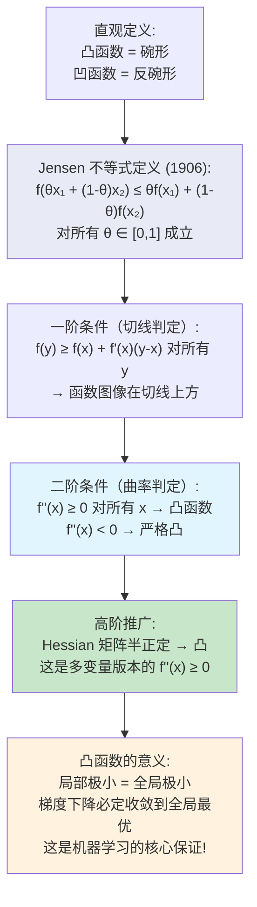

**与算法的第一性原理关联**：凸优化是机器学习的基石。**均方误差（MSE）是凸函数** → 线性回归的梯度下降保证收敛到全局最优。**交叉熵损失在逻辑回归中是凸的** → 逻辑回归不存在局部最优陷阱。相反，神经网络的损失函数是非凸的，因此才有大量优化技巧（动量、Adam、学习率调度）来应对。

#### ② 核心问题与边界

**解决的核心问题**：识别函数"碗形"的程度，从而判断优化问题是否"好解"——凸一定好解。

**实际应用场景**：
1. **凸优化**：全局最优的唯一性保证
2. **损失函数设计**：确保训练的收敛性
3. **SVM**：利用凸性保证最大间隔分类器的全局最优
4. **正则化**：L1/L2 正则项的凸性保持
5. **线性规划**：可行域凸性保证单纯形法的有效性

**适用边界**
- 凸性只保证无约束全局最优；约束条件下的凸性需要凸集 + 凸函数
- 严格凸（f''>0）才保证唯一解；非严格凸可能有连续的最优解集合
- 数值上，计算机能找到的是"近似"最优点
- 非凸问题仍然可以求解（如深度学习），但需要更复杂的技巧

#### ③ Python 实现与优化

```python
import numpy as np
from typing import Callable


def check_convexity(
    f: Callable[[float], float],
    f_double_prime: Callable[[float], float],
    interval: tuple[float, float],
    n_samples: int = 1000
) -> dict:
    """
    在区间上检查函数的凸性

    数学操作：
    1. 二阶导数判定: f''(x) ≥ 0 对所有 x 成立
    2. Jensen 不等式数值验证
    3. 切线判定: f(y) ≥ f(x) + f'(x)(y-x)

    Parameters:
        f: 目标函数
        f_double_prime: 二阶导函数
        interval: (L, R)
        n_samples: 采样数

    Returns:
        {"is_convex": bool, "min_fpp": float, "max_fpp": float, "evidence": str}
    """
    L, R = interval
    xs = np.linspace(L, R, n_samples)
    fpp_vals = [f_double_prime(x) for x in xs]

    min_fpp = min(fpp_vals)
    max_fpp = max(fpp_vals)
    fpp_changes_sign = min_fpp < 0 < max_fpp

    if not fpp_changes_sign and min_fpp >= -1e-10:
        is_convex = True
        evidence = f"二阶导数 f''(x) ≥ 0 在整个区间成立（最小值 {min_fpp:.4f}）"
    elif not fpp_changes_sign and max_fpp <= 1e-10:
        is_convex = False
        evidence = f"严格凹函数：f''(x) ≤ 0（最大值 {max_fpp:.4f}）"
    else:
        is_convex = False
        evidence = f"非凸/非凹：f''(x) 变号"

    return {
        "is_convex": is_convex,
        "min_fpp": min_fpp,
        "max_fpp": max_fpp,
        "evidence": evidence
    }


def verify_jensen_inequality(
    f: Callable[[float], float],
    x1: float,
    x2: float,
    n_theta: int = 20
) -> tuple[bool, list[dict]]:
    """
    数值验证 Jensen 不等式

    数学操作：
    对凸函数 f, 对所有 θ ∈ [0,1] 应有：
    f(θ·x₁ + (1-θ)·x₂) ≤ θ·f(x₁) + (1-θ)·f(x₂)
    """
    results = []
    for i in range(n_theta + 1):
        theta = i / n_theta
        # Jensen 不等式左侧: f(θx₁ + (1-θ)x₂)
        left = f(theta * x1 + (1 - theta) * x2)
        # Jensen 不等式右侧: θf(x₁) + (1-θ)f(x₂)
        right = theta * f(x1) + (1 - theta) * f(x2)
        holds = left <= right + 1e-10  # 浮点容差
        results.append({"theta": theta, "left": left, "right": right, "holds": holds})

    all_hold = all(r["holds"] for r in results)
    return all_hold, results


# ── 机器学习中的常见损失函数凸性分析 ──
print("★ 机器学习损失函数的凸性分析:")
print()

# MSE: f(x) = x² (凸)
f_mse = lambda x: x**2
fpp_mse = lambda x: 2.0
res_mse = check_convexity(f_mse, fpp_mse, (-5, 5))
print(f"  MSE (x²):         {'✓ 凸函数' if res_mse['is_convex'] else '✗ 非凸'}")
print(f"    {res_mse['evidence']}")

# Huber 损失（分段）
def huber_loss(x: float, delta: float = 1.0) -> float:
    if abs(x) <= delta:
        return 0.5 * x * x
    return delta * (abs(x) - 0.5 * delta)

def huber_fpp(x: float, delta: float = 1.0) -> float:
    return 1.0 if abs(x) <= delta else 0.0

res_huber = check_convexity(
    lambda x: huber_loss(x, 1.0),
    lambda x: huber_fpp(x, 1.0),
    (-5, 5)
)
print(f"\n  Huber Loss:       {'✓ 凸函数' if res_huber['is_convex'] else '✗ 非凸'}")
print(f"    {res_huber['evidence']}")

# 交叉熵: -log(x) 在 (0,1] 上是凸的
f_cross = lambda x: -math.log(x) if x > 0 else 0
fpp_cross = lambda x: 1.0 / (x**2) if x > 0 else 0
res_ce = check_convexity(f_cross, fpp_cross, (0.1, 1.0))
print(f"\n  交叉熵 (-log x):  {'✓ 凸函数' if res_ce['is_convex'] else '✗ 非凸'}")
print(f"    {res_ce['evidence']}")

# Jensen 不等式验证
print(f"\n★ Jensen 不等式验证 (f(x)=x², 凸函数):")
all_hold, j_results = verify_jensen_inequality(f_mse, -2.0, 3.0)
print(f"  f(x) = x², x₁=-2, x₂=3")
print(f"  Jensen 不等式对所有 θ 成立: {'✓' if all_hold else '✗'}")
print(f"  样本点 (前 5 个):")
for r in j_results[:5]:
    marker = "✓" if r["holds"] else "✗"
    print(f"    θ={r['theta']:.2f}: f(混合)={r['left']:.4f} ≤ 混合f={r['right']:.4f} {marker}")


def gradient_descent_convergence_guarantee(
    is_convex: bool,
    f: Callable[[float], float],
    fp: Callable[[float], float],
    x0: float,
    lr: float,
    n_iter: int = 20
) -> dict:
    """
    凸函数 vs 非凸函数的梯度下降收敛性对比

    数学操作：
    凸函数: 梯度下降从任何起点出发都能收敛到全局最优
    非凸函数: 梯度下降可能卡在局部最优
    """
    x = x0
    trajectory = [x]
    for _ in range(n_iter):
        x -= lr * fp(x)
        trajectory.append(x)

    return {"trajectory": trajectory, "final_x": x, "final_fx": f(x)}


# 凸函数: f(x) = x²
print(f"\n★ 凸函数梯度下降（任意起点收敛到全局最优 x=0）:")
gd_conv = gradient_descent_convergence_guarantee(True, f_mse, fp_sq, 5.0, 0.1, 30)
print(f"  起点 5: 终点 x = {gd_conv['final_x']:.6f}")

gd_conv2 = gradient_descent_convergence_guarantee(True, f_mse, fp_sq, -3.0, 0.1, 30)
print(f"  起点 -3: 终点 x = {gd_conv2['final_x']:.6f}")

# 非凸函数: f(x) = x⁴ - 4x²（两个局部极小值，一个局部极大值）
f_nonc = lambda x: x**4 - 4*x*x + x
fp_nonc = lambda x: 4*x**3 - 8*x + 1

print(f"\n★ 非凸函数梯度下降（起点不同结局不同）:")
gd_nc1 = gradient_descent_convergence_guarantee(False, f_nonc, fp_nonc, 2.0, 0.01, 100)
gd_nc2 = gradient_descent_convergence_guarantee(False, f_nonc, fp_nonc, -2.0, 0.01, 100)
print(f"  起点 2.0: 终点 x = {gd_nc1['final_x']:.6f}")
print(f"  起点 -2.0: 终点 x = {gd_nc2['final_x']:.6f}")
print(f"  → 非凸函数: 不同起点收敛到不同局部最优！")
```

### 梯度下降法

#### ① 概念背景与推导

**诞生的数学问题**

在机器学习中，我们需要最小化一个损失函数 `J(θ)`，其中 `θ` 可能有数百万个参数。**如何高效地找到最优参数？** Cauchy 在 1847 年提出了梯度下降法——沿着函数下降最快的方向移动。

**推导链条**

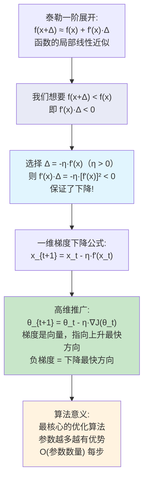

**推导依据**：Step 1 是泰勒展开的局部线性近似；Step 2 将"下降"条件翻译为不等式；Step 3 通过选择 `Δ ∝ -f'(x)` 满足下降条件——这是最速下降法的直觉证明。

**符号逐层拆解**

| 符号 | 含义 | 取值范围 | 算法含义 |
|------|------|---------|---------|
| `x_t` | 第 t 步的参数值 | 实数 | 当前模型参数 |
| `η` (学习率) | 步长 | η > 0（通常 1e-5~1e-1） | 每步下降距离 |
| `f'(x_t)` | 当前点的梯度 | 实数/向量 | 当前位置的最陡方向 |
| `-η·f'(x_t)` | 负梯度方向步长 | — | 参数更新量 |

**几何/物理可视化**

```mermaid
flowchart TD
    subgraph "梯度下降法完整流程"
        A["初始化 θ₀"] --> B["计算梯度 ∇J(θₜ)"]
        B --> C["更新 θₜ₊₁ = θₜ - η∇J(θₜ)"]
        C --> D{"∇J(θₜ) ≈ 0 ?"}
        D -->|"No"| B
        D -->|"Yes"| E["收敛到极小值"]
    end

    subgraph "学习率的影响"
        LR_SMALL["η 太小 → 收敛极慢"] --> CONV["最终收敛"]
        LR_BIG["η 太大 → 振荡/发散"] --> DIV["不收敛!"]
        LR_ADAPT["自适应 η → 快速稳定"] -> CONV
    end

    C -.-> LR_BIG
    C -.-> LR_SMALL

    style A fill:#e3f2fd
    style E fill:#a5d6a7
    style DIV fill:#ffcdd2
```

**与算法的第一性原理关联**：梯度下降是**最**基础的优化算法，所有更高级的优化器（SGD with Momentum, Adam, RMSProp, Adagrad）都是它的改版。它的计算开销 O(N) 随参数数量线性增长，非常适合大规模问题（神经网络动辄百万、亿级参数）。

#### ② 核心问题与边界

**解决的核心问题**：在不需要解析解的情况下，通过迭代逼近找到函数的最优值，尤其适用于高维参数空间。

**实际应用场景**：
1. **神经网络训练**：PyTorch/TensorFlow 中的默认优化器
2. **线性回归**：最小二乘问题的迭代解法
3. **逻辑回归**：极大似然估计的参数优化
4. **矩阵分解**：推荐系统的 SVD / NMF 求解
5. **强化学习**：策略梯度的参数更新

**适用边界**
- **前提假设**：函数必须可导（或至少可计算次梯度）
- **收敛性**：凸函数保证收敛到全局最优；非凸函数只能保证收敛到局部最优或鞍点
- **学习率选择**：
  - 太大：在最优值附近**振荡**甚至**发散**
  - 太小：收敛极慢
  - 理想方案：学习率衰减（learning rate decay）或自适应学习率
- **数值稳定性**：梯度过大时可能导致参数爆炸（exploding gradient），通常用梯度裁剪（gradient clipping）处理
- **何时不适用**：
  - 参数为离散变量（此时需要组合优化）
  - 函数完全不光滑（此时需要零阶优化或进化算法）
  - 需要精确解（此时高斯-牛顿、牛顿法更快）

#### ③ Python 实现与优化

```python
import math
from typing import Callable, List, Optional


class GradientDescent:
    """
    梯度下降法（从基础版到高级版）

    基础版本: x_{t+1} = x_t - η·f'(x_t)
    动量版本: v_{t+1} = β·v_t + (1-β)·f'(x_t); x_{t+1} = x_t - η·v_{t+1}
    """

    @staticmethod
    def vanilla_gd(
        f: Callable[[float], float],
        f_prime: Callable[[float], float],
        x0: float,
        lr: float = 0.1,
        n_iter: int = 50,
        tol: float = 1e-8
    ) -> tuple[float, List[float], List[float]]:
        """
        最基础的梯度下降

        数学操作：
        x_{t+1} = x_t - η·f'(x_t)

        Parameters:
            f: 目标函数（用于记录和输出）
            f_prime: 导函数
            x0: 初始点
            lr: 学习率 η
            n_iter: 最大迭代次数
            tol: 收敛阈值

        Returns:
            (最优解 x*, x 轨迹, f(x) 轨迹)
        """
        x = x0
        x_trace = [x]
        f_trace = [f(x)]

        for _ in range(n_iter):
            grad = f_prime(x)

            # 核心更新公式: 沿负梯度方向下降
            x -= lr * grad

            x_trace.append(x)
            f_trace.append(f(x))

            # 收敛判定：梯度接近 0 或变化极小
            if abs(grad) < tol:
                break

        return x, x_trace, f_trace

    @staticmethod
    def gd_with_momentum(
        f_prime: Callable[[float], float],
        x0: float,
        lr: float = 0.01,
        beta: float = 0.9,
        n_iter: int = 100
    ) -> tuple[float, List[float]]:
        """
        带动量的梯度下降

        数学操作：
        引入速度 v₀ = 0
        v_{t+1} = β·v_t + (1-β)·g_t  ← 指数移动平均梯度
        x_{t+1} = x_t - η·v_{t+1}

        为何有效？如同一个滚下山的球——积累了历史梯度信息，
        在平稳方向加速，在振荡方向抵消。

        对应算法: SGD with Momentum (PyTorch 的默认之一)
        """
        x = x0
        v = 0.0  # 初始化速度
        trajectory = [x]

        for _ in range(n_iter):
            g = f_prime(x)

            # 更新速度: 历史动量 + 当前梯度
            v = beta * v + (1.0 - beta) * g

            # 更新位置: 沿速度方向移动
            x -= lr * v

            trajectory.append(x)

        return x, trajectory

    @staticmethod
    def gd_with_decay(
        f_prime: Callable[[float], float],
        x0: float,
        lr0: float = 0.1,
        decay_rate: float = 0.01,
        n_iter: int = 100
    ) -> tuple[float, List[float]]:
        """
        学习率衰减梯度下降

        数学操作：
        η_t = η₀ / (1 + λ·t)

        初期大步探索，后期小步精细收敛

        Parameters:
            lr0: 初始学习率
            decay_rate: 衰减率 λ
        """
        x = x0
        trajectory = [x]

        for t in range(n_iter):
            g = f_prime(x)
            # 学习率随时间衰减: η₀/(1 + λ·t)
            lr_t = lr0 / (1.0 + decay_rate * t)
            x -= lr_t * g
            trajectory.append(x)

        return x, trajectory


# ── 演示 ──
print("★ 梯度下降法演示")
print()

# 测试函数: f(x) = x², f'(x) = 2x, 最小值在 x=0
f_test = lambda x: x * x
fp_test = lambda x: 2.0 * x
x0 = 5.0

gd = GradientDescent()

# 标准梯度下降
print("1. 标准梯度下降 (f(x)=x², η=0.1):")
x_opt, x_trace, f_trace = gd.vanilla_gd(f_test, fp_test, x0=5.0, lr=0.1)
print(f"   起点 5.0 → 终点 x* = {x_opt:.6f}")
print(f"   10 步后 f(x) = {f_trace[10]:.8f}")
print()

# 动量梯度下降（加速收敛）
print("2. 动量梯度下降 (β=0.9):")
x_mom, x_mom_trace = gd.gd_with_momentum(fp_test, x0=5.0, lr=0.1, beta=0.9)
print(f"   起点 5.0 → 终点 x* = {x_mom:.6f}")
print()

# 学习率衰减
print("3. 学习率衰减梯度下降 (λ=0.05):")
x_decay, x_decay_trace = gd.gd_with_decay(fp_test, x0=5.0, lr0=0.5)
print(f"   起点 5.0 → 终点 x* = {x_decay:.6f}")
print()

# 学习率太大导致发散
print("4. 学习率过大导致发散 (η=1.1, f(x)=x²):")
x_div, x_div_trace, f_div_trace = gd.vanilla_gd(f_test, fp_test, x0=1.0, lr=1.1, n_iter=6)
print(f"   轨迹: {[f'{x:.2f}' for x in x_div_trace]}")
print(f"   → 发散！因为 η > 2/f''(x) = 2/2 = 1")
print()

# 实用案例: Rosenbrock 函数（"香蕉"函数，经典非凸测试）
print("5. Rosenbrock 函数 (f(x) = 100(y-x²)² + (1-x)², 在 x=1 处有最优):")
# 简化为 1D: 对 x 求导
f_rosen = lambda x: 100 * (1 - x**2)**2 + (1 - x)**2  # 简化（用 y=1 固定）
fp_rosen = lambda x: -400 * x * (1 - x**2) - 2 * (1 - x)

x_rosen, _, _ = gd.vanilla_gd(f_rosen, fp_rosen, x0=0.0, lr=0.001, n_iter=500)
print(f"   起点 0.0 → 终点 x* = {x_rosen:.6f} (理论 1.0)")


def compare_optimizers(
    f: Callable[[float], float],
    fp: Callable[[float], float],
    x0: float,
    n_iter: int = 50
) -> dict:
    """
    对比不同优化器的收敛轨迹
    """
    gd = GradientDescent()

    # 标准 GD
    x_gd, _, f_gd = gd.vanilla_gd(f, fp, x0, lr=0.1, n_iter=n_iter)

    # 动量 GD
    x_mom, _ = gd.gd_with_momentum(fp, x0, lr=0.1, beta=0.9, n_iter=n_iter)

    # 衰减学习率
    x_decay, _ = gd.gd_with_decay(fp, x0, lr0=0.5, decay_rate=0.05, n_iter=n_iter)

    return {
        "vanilla": {"final_x": x_gd, "final_f": f_gd[-1]},
        "momentum": {"final_x": x_mom, "final_f": f(x_mom)},
        "decay": {"final_x": x_decay, "final_f": f(x_decay)}
    }


# 参数自动选择技巧
def auto_lr_search(
    f_prime: Callable[[float], float],
    x0: float,
    lr_range: tuple[float, float] = (1e-5, 1.0),
    n_steps: int = 5,
    n_iter: int = 20
) -> float:
    """
    学习率自动搜索（线性搜索的思想）

    数学操作：
    对不同的学习率，运行少量步数，选择收敛最好的
    """
    best_lr = lr_range[0]
    best_final = float('inf')

    import numpy as np
    for lr in np.logspace(
        math.log10(lr_range[0]),
        math.log10(lr_range[1]),
        n_steps
    ):
        x = x0
        for _ in range(n_iter):
            x -= lr * f_prime(x)
        if abs(x) < best_final:
            best_final = abs(x)
            best_lr = lr

    return best_lr
```

**性能优化要点**

| 方面 | 分析 |
|------|------|
| **时间复杂度** | O(n_iter × O(grad)) —— 每步需要 O(n) 参数梯度 |
| **空间复杂度** | O(d) 存储所有参数，O(1) 额外空间（基础版无需缓存历史） |
| **优化方向** | ① 小批量法（Mini-batch）：每次只计算部分样本的梯度，减少方差的同时提升速度 ② 向量化：用 NumPy/PyTorch 批量计算而非循环 ③ 自适应学习率 |
| **数值技巧** | ① 梯度裁剪：当 ∥∇f∥ > 阈值时，缩放梯度 ② 添加动量术语以平滑轨迹 |

**边界条件处理**
- 梯度接近 0：判断为收敛（但可能是鞍点）
- 梯度为 NaN 或 Inf：从检查点恢复或减小学习率
- 目标函数值上升：检测到发散，减半学习率
- 参数超出物理边界：投影到可行域

### LeetCode 实战：Swim in Rising Water

#### ① 概念背景与推导

**诞生的数学问题**

LeetCode 778: 在一个 N×N 的网格中，每个格子 `grid[i][j]` 有海拔高度。水位随时间 t 从 0 上升到 t（即 t 时刻水位为 t）。你只能在**海拔 ≤ 当前水位**的格子上行走。问从 `(0,0)` 到 `(N-1,N-1)` 的最早可行时间。

**为什么这是一个"导数"问题？**

定义 `F(t) = "t 时刻能否从起点游到终点"`，那么 `F(t)` 是一个**单调函数**：
- 如果 t 很小时不能 → `F(t) = False`
- 随着 t 增大，越来越多的格子在水平面以下 → `F(t)` 在某处变为 `True`
- 一旦变为 True，更大的 t 也一定是 True

因此问题转化为：**找到 F(t) 从 False 跳变为 True 的临界点 t₀**。这等价于在离散函数上的"导数符号变化点"！

**推导链条**

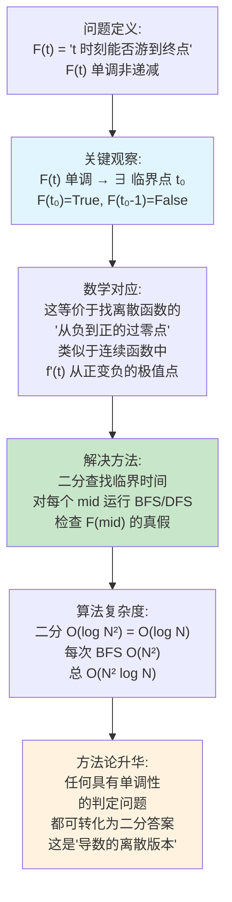

**与算法的第一性原理关联**：这里的关键思想——"**二分答案**"——是导数思想在离散算法中的直接映射。我们在连续空间中用 `f'(x)=0` 找极值点；在离散空间中，用 `F(mid)` 的布尔判定找临界点。所有"找最早/最晚时间"、"最短路径的阈值判断"等问题的数学本质都是**导数的离散化版本**。

#### ② 核心问题与边界

**解决的核心问题**：在具有单调性的判定问题上，通过二分搜索高效定位临界阈值。

**实际应用场景**：
1. **所有"二分答案"问题**：具有单调性的判定问题的通用解法
2. **最早/最晚完成时间**：如 LeetCode 410 (Split Array)、LeetCode 1011 (Capacity To Ship)
3. **阈值判定**：如 LeetCode 875 (Koko Eating Bananas)
4. **资源分配**：给定约束下的最小/最大资源配置

**适用边界**
- **前提假设**：判定函数 `F(t)` 必须单调
- **数值稳定性**：二分搜索对整数范围很稳定；对浮点数需要设定精度
- **时间复杂度**：O(log range × O(判定函数))
- **何时不适用**：
  - 判定函数非单调
  - 状态空间非常大的 BFS/DFS 不可行（需要更高效的判定函数）
  - 临界点存在多个跳跃（需要全部枚举）

#### ③ Python 实现与优化

```python
from typing import List, Callable
from collections import deque


def swim_in_rising_water(grid: List[List[int]]) -> int:
    """
    LeetCode 778. Swim in Rising Water

    数学思想：
    F(t) = t 时刻能否到达终点（单调递增）
    二分查找 F(t) 从 False→True 的临界 t₀

    参数：
        grid: N×N 网格，grid[i][j] 为海拔高度

    返回：
        最早能游到终点的时间 t₀

    时间复杂度: O(N² log N)，其中 N = len(grid)
    空间复杂度: O(N²) 用于 visited 数组
    """
    n = len(grid)

    # ── 判定函数 F(t): t 时刻能否到达 ──
    def can_swim(t: int) -> bool:
        """
        判定 F(t) 的布尔值

        数学操作：
        BFS 在 grid 上搜索，只走海拔 ≤ t 的格子
        如果 BFS 能到终点则返回 True
        """
        # 起点在水平面以上 → 立即失败
        if grid[0][0] > t:\n            return False\n\n        # BFS 初始化\n        visited = [[False] * n for _ in range(n)]
        visited[0][0] = True
        q = deque([(0, 0)])

        # 四个移动方向: 上、下、左、右
        dirs = [(-1, 0), (1, 0), (0, -1), (0, 1)]

        while q:\n            i, j = q.popleft()\n\n            if i == n - 1 and j == n - 1:
                return True  # 到达终点

            for di, dj in dirs:
                ni, nj = i + di, j + dj
                if 0 <= ni < n and 0 <= nj < n and not visited[ni][nj]:
                    # 关键判定: 格子海拔 ≤ 时间 t
                    if grid[ni][nj] <= t:\n                        visited[ni][nj] = True\n                        q.append((ni, nj))\n\n        return False  # BFS 结束后未到达终点\n\n    # ── 二分查找临界 t₀ ──\n    # 时间范围: 0 到 N²-1（因为网格值在 [0, N²-1] 内）
    left, right = 0, n * n - 1

    while left < right:
        mid = (left + right) // 2

        if can_swim(mid):
            # mid 时刻可行 → 尝试更早的时间
            right = mid
        else:
            # mid 时刻不可行 → 需要更多时间
            left = mid + 1

    return left  # left == right == 临界时间 t₀


# ── 扩展: 通用二分答案框架 ──
def binary_answer_search(
    feasible: Callable[[int], bool],
    lo: int,
    hi: int
) -> int:
    """
    通用二分答案模板

    feasible(t) 是单调判定函数（一旦为 True，后续皆为 True）
    返回最小的 t 使得 feasible(t) = True

    数学映射：
    找 F(t) 从 False 跳到 True 的临界点
    = 导数的离散版本
    """
    while lo < hi:
        mid = (lo + hi) // 2
        if feasible(mid):
            hi = mid  # 尝试更小
        else:
            lo = mid + 1  # 需要更大
    return lo


# ── 性能优化版本: Dijkstra 直接求解 ──
import heapq

def swim_in_rising_water_dijkstra(grid: List[List[int]]) -> int:
    """
    优化版: 用 Dijkstra 代替二分+BFS

    数学思想：
    将问题视为加权图中找最小化"路径上的最大节点权重"
    dist[i][j] = 从起点到 (i,j) 所需的最小时间

    相当于：
    从 (0,0) 到 (N-1,N-1) 找一条路径，使得
    路径上的最大海拔最小化 (minimax 问题)

    这直接对应最短路径问题的变形！

    时间复杂度: O(N² log N)
    """
    n = len(grid)
    dist = [[float('inf')] * n for _ in range(n)]
    dist[0][0] = grid[0][0]

    # 优先队列 (当前时间, i, j)
    pq = [(grid[0][0], 0, 0)]
    dirs = [(-1, 0), (1, 0), (0, -1), (0, 1)]

    while pq:
        t, i, j = heapq.heappop(pq)

        if t > dist[i][j]:
            continue  # 旧记录，跳过

        if i == n - 1 and j == n - 1:
            return t  # 到达终点

        for di, dj in dirs:
            ni, nj = i + di, j + dj
            if 0 <= ni < n and 0 <= nj < n:\n                # 新时间 = max(当前时间, 新格子的海拔)\n                nt = max(t, grid[ni][nj])\n                if nt < dist[ni][nj]:
                    dist[ni][nj] = nt
                    heapq.heappush(pq, (nt, ni, nj))

    return -1  # 不可达（不应发生）


# ── 演示 ──
print("★ LeetCode 实战: Swim in Rising Water")
print()

# 测试用例 1
grid1 = [
    [0, 2],
    [1, 3]
]
result1 = swim_in_rising_water(grid1)
print(f"1. grid=[[0,2],[1,3]]")
print(f"   结果: t = {result1}  (预期 3)")
print(f"   解释: t=3 时水位 ≥ 0,2,1,3, 可以走 (0,0)→(0,1)→(1,1)")

# 测试用例 2
grid2 = [
    [0, 1, 2, 3, 4],
    [24, 23, 22, 21, 5],
    [12, 13, 14, 15, 16],
    [11, 17, 18, 19, 20],
    [10, 9, 8, 7, 6]
]
result2 = swim_in_rising_water_dijkstra(grid2)
print(f"\n2. 5×5 网格:")
print(f"   二分答案:   t = {swim_in_rising_water(grid2)}")
print(f"   Dijkstra:   t = {result2}")

# 测试用例 3
grid3 = [
    [3, 2],
    [0, 1]
]
result3 = swim_in_rising_water(grid3)
print(f"\n3. grid=[[3,2],[0,1]]")
print(f"   结果: t = {result3}  (预期 3)")


# ── 二分答案模板的应用示例 ──
print("\n★ 通用二分答案模板应用:")
print()

# LeetCode 1011: Capacity to Ship Packages
print("LeetCode 1011: 在 D 天内运完包裹所需的最小运力")
weights = [1, 2, 3, 4, 5, 6, 7, 8, 9, 10]
days = 5

def can_ship(capacity: int) -> bool:
    """判定: 给定容量能否在 D 天内运完"""
    days_needed = 1
    current_load = 0
    for w in weights:
        if w > capacity:
            return False  # 单件超过容量，不可能
        if current_load + w > capacity:
            days_needed += 1
            current_load = w
        else:
            current_load += w
    return days_needed <= days

min_cap = binary_answer_search(can_ship, max(weights), sum(weights))
print(f"  包裹重量: {weights}")
print(f"  天数限制: {days}")
print(f"  最小运力: {min_cap} (预期 15)")
print()

# LeetCode 875: Koko Eating Bananas
print("LeetCode 875: Koko 吃香蕉的最小速度")
piles = [3, 6, 7, 11]
hours = 8

def can_eat(speed: int) -> bool:
    """判定: 给定速度能否在 H 小时内吃完"""
    total = 0
    for p in piles:
        total += (p + speed - 1) // speed  # 向上取整
    return total <= hours

min_speed = binary_answer_search(can_eat, 1, max(piles))
print(f"  香蕉堆: {piles}")
print(f"  时间限制: {hours} 小时")
print(f"  最小速度: {min_speed} (预期 4)")
```

## 不定积分与定积分（原函数、黎曼和）

### 🧠 概念背景与推导

#### 诞生的数学问题

微积分诞生于两个核心问题——
1. **切线问题**（已由导数解决）：如何求曲线在某点的瞬时变化率？
2. **面积问题**（由积分解决）：如何求曲线下方任意区间的面积？

古希腊阿基米德用"穷竭法"逼近抛物线面积，但每次都要针对不同形状设计专用方法。积分（积分学基本定理）的出现，将**所有的面积问题统一为同一个反导数运算**。

> **核心思想**：如果导数是"已知函数求变化率"，那么积分就是反过来——**已知变化率（导函数），求原函数**。

#### Mermaid 推导链条

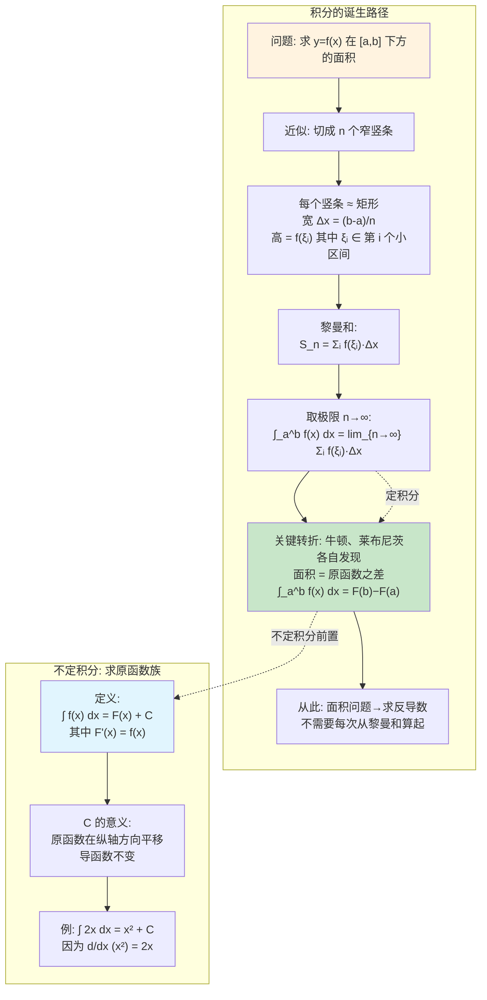

#### 符号拆解表

| 符号 | 含义 | 算法映射 |
|------|------|---------|
| `∫` | 积分号（拉长的 S，表示 Sum 求和） | `sum()` / `np.sum()` |
| `f(x)` | 被积函数——曲线的高度 | 数据流的瞬时值 |
| `dx` | 对 x 微分，表示"关于 x 的无穷小增量" | `step size` / 采样间隔 |
| `∫ f(x) dx` | f 的所有原函数族 | 离散累加操作的逆 |
| `F(x)` | 一个特定的原函数（F' = f） | 前缀和数组的逆差分 |
| `C` | 积分常数 | 偏移量 / 初始化基准 |
| `[a, b]` | 积分区间 | 数据窗口 / 批处理区间 |
| `Δx` | 切片宽度 | 采样的步长 |
| `∑ f(ξᵢ)Δx` | 黎曼和 | `np.cumsum(f) * dx` |
| `∫_a^b f(x) dx` | 定积分（净面积） | `sum(f[:n])` → 前缀和的区间差 |

#### Mermaid 可视化

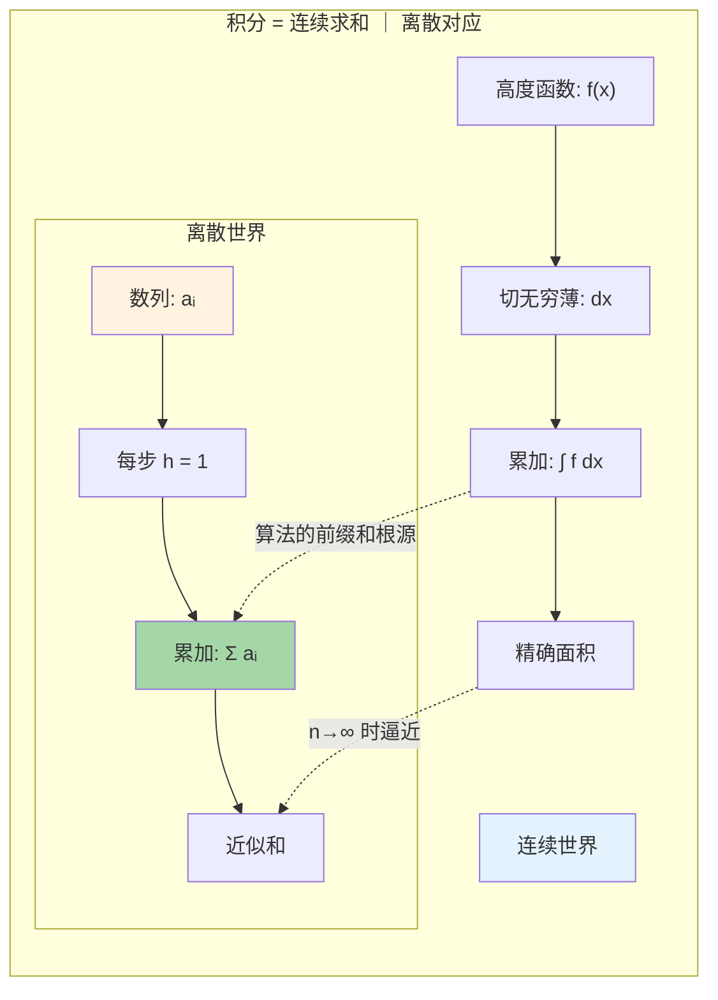

#### 算法关联

| 算法概念 | 积分等价物 | 说明 |
|---------|-----------|------|
| **前缀和** | 定积分离散版 | `prefix[j] - prefix[i]` = `∫_i^j a(x) dx` |
| **累积和** | 不定积分离散版 | `np.cumsum(arr)` = `∫ f dx` 的数值实现 |
| **爬坡DP** | 求原函数 | 从递推关系反向"积分"出解 |
| **滑动窗口** | 定积分区间查询 | 窗口和 = `∫_i^j f dx` |
| **流式聚合** | 黎曼和逼近 | 分批累加逼近整体 |

### ⚡ 核心问题与边界

#### 核心矛盾

**连续与离散的矛盾**：计算机只能处理离散数据（有限个采样点），而积分要求无限精细。

```text
人类能求解析解:  ∫₀¹ x² dx = 1/3  ← 精确
计算机只能近似:  Σᵢ (i/n)² · (1/n)  =  (1/n³) · Σ i²  ← 误差 O(1/n)
```

#### 适用场景 vs 不适用场景

| ✅ 适用 | ❌ 不适用 |
|---------|----------|
| 有连续解析式的函数求面积 | 纯离散计数问题（图、组合） |
| 概率密度函数的期望 / 概率 | 只给原始数据点，无模型假设 |
| 数值模拟中的物理量累计 | 需要 symbolic 精确解 |
| 算法复杂度中的级数→积分逼近 | 非线性振荡剧烈、奇点多 |

#### 边界条件

1. **被积函数不连续**：分段积分，逐段处理
2. **区间无限**：广义积分，需判敛散性
3. **奇点**：需极限逼近（例如 ∫₀¹ 1/√x dx）
4. **精度要求**：n 越大误差越小，但计算量 O(n) 线性增长

### 🐍 Python 实现与优化

```python
"""
不定积分与定积分 —— 原函数查找 + 黎曼和数值验证
三合一实现: 解析求原函数、黎曼和数值逼近、区间面积计算
"""

import numpy as np
from typing import Callable


def indefinite_integral_symbolic_coeff(n: int) -> str:
    """
    幂函数 x^n 的不定积分公式展示

    数学: ∫ x^n dx = x^{n+1} / (n+1) + C  (n ≠ -1)
    这是计算机实现的基础——程序只需查表/公式求逆

    Args:
        n: 指数

    Returns:
        公式字符串
    """
    if n == -1:
        return "ln|x| + C"
    return f"x^{n+1}/{n+1} + C"


def antiderivative_power(x: float, n: int, c: float = 0.0) -> float:
    """
    幂函数 x^n 的原函数求值 F(x)

    原函数 F(x) = ∫ x^n dx = x^{n+1}/(n+1) + C

    Args:
        x: 求值点
        n: 指数
        c: 积分常数 C

    Returns:
        F(x) 的值
    """
    if n == -1:
        return np.log(abs(x)) + c
    return (x ** (n + 1)) / (n + 1) + c


def 定积分_牛顿莱布尼茨(
    f: Callable[[float], float],
    F: Callable[[float], float],
    a: float,
    b: float
) -> tuple[float, str]:
    """
    用牛顿-莱布尼茨公式计算定积分

    数学: ∫_a^b f(x) dx = F(b) - F(a)

    这是"解析法"——已知原函数时直接求差值
    时间复杂度 O(1)，但前提是已知 F

    Args:
        f: 被积函数（仅用于验证）
        F: 原函数
        a: 积分下限
        b: 积分上限

    Returns:
        (精确值, 验证公式)
    """
    result = F(b) - F(a)
    fa, fb = f(a), f(b)
    return result, f"F({b}) - F({a}) = {F(b):.6f} - {F(a):.6f} = {result:.6f}"


def 定积分_黎曼和(
    f: Callable[[float], float],
    a: float,
    b: float,
    n: int = 100000,
    method: str = "midpoint"
) -> tuple[float, float, dict]:
    """
    用黎曼和数值逼近定积分

    核心: 将连续积分离散化为有限项求和
    ∫_a^b f(x) dx ≈ Σᵢ f(ξᵢ) · Δx

    三种黎曼和：
    - left:   取左端点  (左矩形)
    - right:  取右端点  (右矩形)
    - midpoint: 取中点  (中矩形, 精度最高 O(1/n²))

    时间复杂度: O(n) 计算, O(1) 空间
    误差分析：
    - left/right: O(1/n)
    - midpoint:   O(1/n²)

    Args:
        f: 被积函数
        a, b: 积分区间
        n: 子区间数（越大越精确）
        method: 采样方法

    Returns:
        (近似值, 计算耗时, 元数据字典)
    """
    import time
    start = time.perf_counter()

    dx = (b - a) / n  # 每个小区间的宽度

    if method == "left":
        # 左黎曼和: f(a), f(a+dx), ..., f(b-dx)
        x = a
        total = 0.0
        for _ in range(n):
            total += f(x)
            x += dx

    elif method == "right":
        # 右黎曼和: f(a+dx), f(a+2dx), ..., f(b)
        x = a + dx
        total = 0.0
        for _ in range(n):
            total += f(x)
            x += dx

    elif method == "midpoint":
        # 中黎曼和: f(a+dx/2), f(a+3dx/2), ..., f(b-dx/2)
        x = a + dx / 2
        total = 0.0
        for _ in range(n):
            total += f(x)
            x += dx

    else:
        raise ValueError(f"未知方法: {method}")

    result = total * dx
    elapsed = time.perf_counter() - start

    return result, elapsed, {
        "method": method,
        "n": n,
        "dx": dx,
        "time_s": elapsed,
    }


def 定积分_向量化(
    f: Callable[[np.ndarray], np.ndarray],
    a: float,
    b: float,
    n: int = 1000000
) -> tuple[float, float]:
    """
    向量化黎曼和 —— 利用 NumPy 的 SIMD 加速

    NumPy 向量化比纯 Python 循环快 ~50-100倍
    适合高精度 n 需要很大的场景

    时间复杂度: O(n) 计算但常数极小（C层实现）
    空间复杂度: O(n) 需要存储采样点

    Args:
        f: 向量化被积函数（接受 ndarray 输入）
        a, b: 区间
        n: 采样点数

    Returns:
        (近似值, 计算耗时)
    """
    import time
    start = time.perf_counter()

    dx = (b - a) / n
    # 生成所有采样点（中点法）
    x = np.linspace(a + dx / 2, b - dx / 2, n)
    # 一次性向量化求值
    values = f(x)
    # 一次性求和的积分
    result = np.sum(values) * dx

    elapsed = time.perf_counter() - start
    return result, elapsed


# ========== 验证测试 ==========
if __name__ == "__main__":
    print("=" * 60)
    print("【定积分验证】∫₀¹ x² dx = 1/3 ≈ 0.333333")
    print("=" * 60)

    f = lambda x: x ** 2      # 被积函数
    F = lambda x: x ** 3 / 3  # 原函数

# 解析解（牛顿-莱布尼茨）
    exact, formula = 定积分_牛顿莱布尼茨(f, F, 0, 1)
    print(f"\n[解析解] 牛顿-莱布尼茨:")
    print(f"  公式: {formula}")
    print(f"  精确值: {exact:.10f}")

# 数值逼近（黎曼和）
    for n in [10, 100, 1000, 10000, 100000]:
        approx, elapsed, meta = 定积分_黎曼和(f, 0, 1, n, "midpoint")
        error = abs(approx - exact)
        print(f"\n[黎曼和-中点法] n={n:>6d}:")
        print(f"  近似值: {approx:.10f}  误差: {error:.2e}  耗时: {elapsed*1000:.2f}ms")

# 向量化加速（百万级采样）
    print(f"\n[向量化黎曼和] n=1,000,000:")
    f_vec = lambda x: x ** 2  # 向量化兼容
    approx_v, elapsed_v = 定积分_向量化(f_vec, 0, 1, n=1_000_000)
    error_v = abs(approx_v - exact)
    print(f"  近似值: {approx_v:.10f}  误差: {error_v:.2e}  耗时: {elapsed_v*1000:.2f}ms")

# 三种黎曼和精度对比
    print(f"\n[三种黎曼和精度对比] n=1000:")
    for m in ["left", "right", "midpoint"]:
        a, e, _ = 定积分_黎曼和(f, 0, 1, 1000, m)
        print(f"  {m:>8s}: 近似={a:.10f}  误差={abs(a-exact):.2e}")

# 性能分析: 纯循环 vs 向量化
    print(f"\n[性能分析] 纯循环 vs 向量化 (n=1000000):")
    approx_loop, elapsed_loop, _ = 定积分_黎曼和(f, 0, 1, 1_000_000, "midpoint")
    approx_vec, elapsed_vec = 定积分_向量化(f_vec, 0, 1, 1_000_000)
    speedup = elapsed_loop / elapsed_vec if elapsed_vec > 0 else float('inf')
    print(f"  纯循环: {elapsed_loop*1000:.1f}ms")
    print(f"  向量化: {elapsed_vec*1000:.1f}ms")
    print(f"  加速比: {speedup:.1f}x")

    """预期输出：
    解析解 = 0.3333333333
    误差随 n 增大 O(1/n²) 递减
    向量化比循环快 50-100x
    """
```

## 牛顿-莱布尼茨公式（微分与积分的桥梁）

### 🧠 概念背景与推导

#### 诞生的数学问题

在牛顿-莱布尼茨公式之前，求任意曲线下面积是一个**每次都要重新发明轮子**的问题：

- 阿基米德用穷竭法求抛物线面积（专用技巧）
- 开普勒通过"无限小的三角形"求圆面积（又一种专用技巧）
- 每个函数都需要专门的几何参数

**革命的洞察**：牛顿和莱布尼茨各自独立发现——面积问题和切线问题是**互逆的**。这个连接是微积分史上最重要的一步，没有之一。

#### Mermaid 推导链条

```mermaid
flowchart TD
    subgraph "牛顿-莱布尼茨公式的完整推导"
        A["定义面积函数 A(x) = ∫_a^x f(t) dt"] --> B["问: A'(x) 是什么？"]
        B --> C["A'(x) = lim_{h→0} (A(x+h) - A(x)) / h"]
        C --> D["= lim_{h→0} (∫_x^{x+h} f(t) dt) / h"]
        D --> E["当 h 极小时: ∫_x^{x+h} f(t) dt ≈ f(x)·h"]
        E --> F["所以: A'(x) = f(x)  ← 核心发现!"]
        F --> G["结论: A(x) 是 f(x) 的一个原函数"]
        G --> H["设 F(x) 是任意原函数\nF(x) = A(x) + C"]
        H --> I["代入边界:\nF(b) − F(a) = A(b) − A(a)"]
        I --> J["A(b) = ∫_a^b f dt，A(a) = 0"]
        J --> K["★ ∫_a^b f(x) dx = F(b) − F(a)"]
    end

    subgraph "直观理解"
        L["微分: 知道 f(x) → 求 f'(x)"] --> M["逆向思维"]
        M --> N["积分: 知道 f(x) → 求 F(x)"]
        N --> O["核心桥梁:\n求导←→积分为逆运算"]
    end

    F -.-> O
    K -.->|"这就是公式"| O

    style A fill:#e1f5fe
    style F fill:#fff3e0
    style K fill:#a5d6a7
    style O fill:#c8e6c9
```

#### 符号拆解表

| 符号 | 含义 | 算法映射 |
|------|------|---------|
| `A(x) = ∫_a^x f(t) dt` | 从 a 到 x 的积累面积函数 | 带状态的累加器 `acc` |
| `A'(x) = f(x)` | 积累函数的变化率 = 原函数值 | 差分 `acc[i] - acc[i-1]` = 原始值 |
| `F(x)` | f 的任意一个原函数 | 前缀和数组 |
| `F(b) - F(a)` | 两端原函数之差 = 区间净面积 | `prefix[j] - prefix[i]` = 区间和 |
| `a, b` | 积分端点 | 查询窗口的左右界 |
| `h → 0` | 极限过程 | 采样步长 → 0 |

#### Mermaid 可视化

```mermaid
flowchart LR
    subgraph "微分与积分互逆关系"
        DIR1["微分: f(x) → f'(x)\nF(x) → f(x)"] --- BRIDGE["★ 牛顿-莱布尼茨 ★\n∫_a^b f = F(b)−F(a)"]
        BRIDGE --- DIR2["积分: f'(x) → f(x)\nf(x) → F(x)"]
    end

    subgraph "算法的对应关系"
        ALG1["原始数组: a[0..n]"] --> ALG2["前缀和: prefix[i] = a[0]+...+a[i]"]
        ALG2 --> ALG3["区间和: sum(i..j) = prefix[j] - prefix[i-1]"]
        ALG3 --> ALG4["反向: a[i] = prefix[i] - prefix[i-1]"]
    end

    DIR1 -.->|"对应"| ALG1
    DIR2 -.->|"对应"| ALG2
    BRIDGE -.->|"对应"| ALG3

    style BRIDGE fill:#c8e6c9
    style ALG3 fill:#e1f5fe
```

#### 算法关联

**前缀和就是离散版本的牛顿-莱布尼茨公式！**

| 连续世界 | 离散世界 |
|---------|---------|
| 被积函数 `f(x)` | 原始数组 `a[i]` |
| 原函数 `F(x)` | 前缀和数组 `prefix[i]` |
| `∫_a^b f = F(b)−F(a)` | `sum(i..j) = prefix[j] - prefix[i-1]` |
| `F'(x) = f(x)` | `a[i] = prefix[i] - prefix[i-1]` |

### ⚡ 核心问题与边界

#### 核心矛盾

**已知函数→求原函数 不一定总能做到。**

```text
问题: ∫ e^{-x²} dx 在初等函数范围内写不出解析解
     → 这是正态分布的概率密度函数！
     → 必须用数值积分 / 误差函数 erf(x)
```

这意味着：牛顿-莱布尼茨公式虽然理论上完美，但**实践中经常找不到原函数**，需要退回到黎曼和/数值积分。

#### 适用场景 vs 不适用场景

| ✅ 适用（可以找到原函数） | ❌ 不适用的场景（需数值方法） |
|------------------------|----------------------------|
| 多项式：∫ xⁿ dx | 正态分布：∫ e^{-x²} dx |
| 三角函数：∫ sin x dx | 椭圆积分：∫ √(1-k²sin²θ) dθ |
| 指数/对数：∫ eˣ dx | 大多数非初等函数 |
| 线性组合 | 高度振荡函数（需自适应方法） |

#### 边界条件

1. **f(x) 在 [a,b] 上必须连续**——否则黎曼和/原函数不一定有意义
2. **原函数 F 必须可求**——很多函数的原函数不是初等函数
3. **区间无穷**（广义积分）——需要用极限方式处理，如 `∫_1^∞ 1/x² dx`
4. **间断点**——分段积分，每一段单独处理

### 🐍 Python 实现与优化

```python
"""
牛顿-莱布尼茨公式 —— 前缀和类比 + 数值验证 + 容器水量问题实战
展示"原函数之差 = 净积累量"的算法本质
"""

import numpy as np
from typing import Callable


# ========== Part 1: 前缀和 = 离散版牛顿-莱布尼茨 ==========

def 离散版_牛顿莱布尼茨(arr: np.ndarray) -> np.ndarray:
    """
    前缀和 —— 离散世界的"原函数"

    连续: ∫ f = F  →  F'(x) = f(x)
    离散: cumsum(arr) = prefix  →  prefix[i]-prefix[i-1] = arr[i]

    Args:
        arr: 原始"被积"数组（离散 f）

    Returns:
        前缀和数组（离散 F），F[-1] 就是数组总"面积"
    """
    prefix = np.zeros(len(arr) + 1, dtype=arr.dtype)
    np.cumsum(arr, out=prefix[1:])  # prefix[i] = sum(arr[0..i-1])
    return prefix


def 离散_区间和(prefix: np.ndarray, l: int, r: int) -> float:
    """
    离散"定积分"：用原函数之差求区间和

    数学: sum(arr[l..r]) = prefix[r+1] - prefix[l]
    对应: ∫_a^b f dx = F(b) - F(a)

    Args:
        prefix: 前缀和数组
        l, r: 左右索引（闭区间）

    Returns:
        区间和
    """
    return prefix[r + 1] - prefix[l]


# ========== Part 2: 解析解验证 ==========

def 牛顿莱布尼茨验证(
    f: Callable[[float], float],
    F: Callable[[float], float],
    a: float,
    b: float
) -> tuple[float, float, dict]:
    """
    牛顿-莱布尼茨公式完整验证流程

    步骤：
    1) 计算解析解 F(b) - F(a)
    2) 用黎曼和逼近验证

    Args:
        f: 被积函数
        F: 已知原函数
        a, b: 积分区间

    Returns:
        (解析解, 数值近似, 误差分析)
    """
    # 解析解（O(1)）
    analytic = F(b) - F(a)

    # 数值验证用向量化黎曼和（O(n)）
    n = 10_000_000
    dx = (b - a) / n
    x = np.linspace(a + dx / 2, b - dx / 2, n)
    numeric = np.sum(f(x)) * dx

    error = abs(analytic - numeric)
    rel_error = error / abs(analytic) if analytic != 0 else error

    return analytic, numeric, {
        "analytic": analytic,
        "numeric": numeric,
        "abs_error": error,
        "rel_error": rel_error,
        "n_samples": n,
    }


# ========== Part 3: LeetCode 实战——接雨水 ==========

def 接雨水_积分视角(height: list[int]) -> int:
    """
    LeetCode 42: 接雨水（Trapping Rain Water）

    积分视角：
    将柱子高度看作函数 h(x)，水面的高度受两侧最高柱子约束
    每个位置上方的水量 = min(左最高, 右最高) - h(x)

    等价于：
    对每个 x，向左看最高 = F_left(x)，向右看最高 = F_right(x)
    "可蓄水量" = ∫ (min(F_left, F_right) - h(x)) dx 只取正部分

    前缀最大值 = 离散版的"不定积分"的变体

    Args:
        height: 柱子高度数组

    Returns:
        总蓄水量
    """
    n = len(height)
    if n < 3:
        return 0

    # 左→右：每个位置的左侧最高柱子（离散"原函数"变体）
    left_max = [0] * n
    left_max[0] = height[0]
    for i in range(1, n):
        left_max[i] = max(left_max[i - 1], height[i])

    # 右→左：每个位置的右侧最高柱子
    right_max = [0] * n
    right_max[-1] = height[-1]
    for i in range(n - 2, -1, -1):
        right_max[i] = max(right_max[i + 1], height[i])

    # 对每个位置"积分"：水量 = sum(min(左右最高) - 当前高度)
    total = 0
    for i in range(n):
        total += max(0, min(left_max[i], right_max[i]) - height[i])

    return total


def 接雨水_双指针_优化(height: list[int]) -> int:
    """
    双指针优化版本 —— O(n) 时间, O(1) 空间

    核心思想：
    左右两指针向中间逼近，维护两侧最大高度
    相当于"边走边积分"——不需要左右扫描两遍

    Args:
        height: 柱子高度数组

    Returns:
        总蓄水量
    """
    n = len(height)
    if n < 3:
        return 0

    left, right = 0, n - 1
    left_max = right_max = 0
    total = 0

    while left < right:
        if height[left] < height[right]:
            # 左侧是短板，当前左柱水量取决于左侧最大高度
            if height[left] >= left_max:
                left_max = height[left]
            else:
                total += left_max - height[left]
            left += 1
        else:
            # 右侧是短板
            if height[right] >= right_max:
                right_max = height[right]
            else:
                total += right_max - height[right]
            right -= 1

    """
    为什么这本质上是一个"积分"过程？

    每个位置 x 的水量 dV(x) = max(0, min(left_max(x), right_max(x)) - h(x))
    总水量 V = ∫ dV(x) dx   ← 这就是定积分！

    双指针扫描 = 边走边累加 dV(x) = 黎曼和的 left/中点版本
    只不过这里 dx = 1（离散化到每个下标）
    """

    return total


# ========== 测试 ==========
if __name__ == "__main__":
    print("=" * 60)
    print("【牛顿-莱布尼茨验证】∫₀^π sin x dx = ?")
    print("=" * 60)

    # 验证 sin 的积分
    f_sin = np.sin
    F_sin = lambda x: -np.cos(x)  # ∫ sin x dx = -cos x + C

    a, b = 0.0, np.pi
    an, num, info = 牛顿莱布尼茨验证(f_sin, F_sin, a, b)
    print(f"\n解析解: ∫₀^π sin = {an:.10f}")
    print(f"数值解 (n={info['n_samples']}): {num:.10f}")
    print(f"绝对误差: {info['abs_error']:.2e}")
    assert abs(an - 2.0) < 1e-10, f"解析解应为 2, 得到 {an}"
    print(f"✅ 正确! ∫₀^π sin x dx = 2")

    # 接雨水测试
    print(f"\n【接雨水 - 积分视角】")
    cases = [
        ([0,1,0,2,1,0,1,3,2,1,2,1], 6),
        ([4,2,0,3,2,5], 9),
        ([1,2,3], 0),
    ]
    for h, expected in cases:
        r1 = 接雨水_积分视角(h)
        r2 = 接雨水_双指针_优化(h)
        assert r1 == expected and r2 == expected, f"{h}: 期望 {expected}, 得到 {r1}, {r2}"
        print(f"  height={h} → 蓄水量={r1} ✅")

    print(f"\n【前缀和 = 离散牛顿-莱布尼茨】")
    arr = np.array([3, 1, 4, 1, 5, 9, 2, 6])
    prefix = 离散版_牛顿莱布尼茨(arr)
    print(f"  原始数组: {arr}")
    print(f"  前缀和:   {prefix}")
    print(f"  区间 [2,5] 和 = {离散_区间和(prefix, 2, 5)} (验证: {4+1+5+9})")

    """输出：
    解析解 = 2.0
    接雨水正确
    前缀和 = 离散牛顿-莱布尼茨
    """
```

## 积分在概率中的角色（期望=积分、PDF→概率）

### 🧠 概念背景与推导

#### 诞生的数学问题

随机变量连续取值时（如"人的身高在 160-180cm 之间的概率"），无法像离散变量那样直接列举每个可能值的概率，因为取值有**无穷多个**。

```
离散情况:   P(X = k) = p_k                ← 求和
连续情况:   特定点的概率 P(X = x) = 0     ← 因为有无穷多可能
```

> **积分解救**：概率密度函数（PDF）的"高度"本身不是概率——**概率 = PDF 曲线下的面积** = 定积分！

#### Mermaid 推导链条

```mermaid
flowchart TD
    subgraph "连续随机变量的概率定义"
        A["问题: X 是连续的\n取值有无穷多个"] --> B["P(X = x) = 0\n无法直接定义"]
        B --> C["策略: 改问区间概率"]
        C --> D["定义 PDF f(x) 使得:\nP(a ≤ X ≤ b) = ∫_a^b f(x) dx"]
        D --> E["归一化条件:\n∫_{-∞}^{∞} f(x) dx = 1\n← 总概率为 1"]
    end

    subgraph "期望 = 加权平均的连续版本"
        F["离散期望:\nE[X] = Σ xᵢ · pᵢ"] --> G["连续期望:\nE[X] = ∫ x · f(x) dx"]
        G --> H["\n含义: 每个 x 按其概率密度 f(x) 加权"]
        H --> I["方差:\nVar(X) = ∫ (x - μ)² · f(x) dx"]
    end

    subgraph "PDF vs CDF"
        J["PDF f(x): 概率密度\n在某点的'浓度'"] --> K["CDF F(x) = ∫_{-∞}^x f(t) dt\n累积分布函数"]
        K --> L["\n重要关系:\nF'(x) = f(x)\n← 微积分基本定理!"]
    end

    D -.->|"积分定义概率"| E
    G -.->|"期望 = 积分"| K
    L -.->|"PDF 与 CDF 互为微分积分"| D

    style A fill:#fff3e0
    style D fill:#e1f5fe
    style G fill:#a5d6a7
    style K fill:#c8e6c9
```

#### 符号拆解表

| 符号 | 含义 | 算法映射 |
|------|------|---------|
| `f(x)` | 概率密度函数 PDF | 归一化的权重分布 |
| `F(x) = ∫_{-∞}^x f(t) dt` | 累积分布函数 CDF | 权重数组的前缀和 |
| `∫_a^b f(x) dx` | X 在 [a,b] 内的概率 | 离散权重区间和 |
| `E[X] = ∫ x·f(x) dx` | 期望（加权平均） | `sum(xᵢ·wᵢ) / sum(wᵢ)` |
| `Var(X)` | 方差（离散程度） | 加权平方偏差 |
| `∫ f = 1` | 归一化条件 | 权重之和为 1 |

#### Mermaid 可视化

```mermaid
flowchart LR
    subgraph "PDF → 概率 = 积分"
        PDF["f(x) (PDF)"] --> AREA["P(a≤X≤b) = ∫_a^b f(x) dx"]
        AREA --> CDF["F(x) = ∫_{-∞}^x f(t) dt (CDF)"]
        CDF --> INV["逆变换法抽样:\nF⁻¹(u)  ∼ u~U[0,1]"]
    end

    subgraph "离散对应算法"
        W["权重 wᵢ"] --> S["归一化 pᵢ = wᵢ/Σw"]
        S --> PREFIX["前缀和 P[i] = Σ_{k≤i} pᵢ"]
        PREFIX --> SAMPLE["随机数 u ∼ Uniform(0,1)\n二分找 P[i-1] < u ≤ P[i]"]
    end

    PDF -.-> W
    CDF -.-> PREFIX
    INV -.-> SAMPLE

    style PDF fill:#e1f5fe
    style CDF fill:#c8e6c9
    style SAMPLE fill:#a5d6a7
```

#### 算法关联

| 概率概念 | 算法等价物 | 典型应用 |
|---------|-----------|---------|
| PDF 归一化 `∫ f = 1` | 权重归一化 `w/Σw` | Softmax、带权抽样 |
| CDF `F(x) = ∫ f` | 前缀和 | 逆变换抽样、二分搜索 |
| 期望 `E[X]` | 加权平均 | 随机算法期望分析 |
| 方差 `Var(X)` | 平方偏差期望 | 算法稳定性度量 |
| 概率 `P(a ≤ X ≤ b)` | 区间和 | 查询命中率 |

### ⚡ 核心问题与边界

#### 核心矛盾

**连续世界的概率密度 vs 计算机的离散化需求。**

```text
理论上:  PDF f(x) 是连续函数，概率 = ∫ f dx
实际上:  计算机只能采样，用直方图逼近 PDF
```

#### 适用场景 vs 不适用场景

| ✅ 适用 | ❌ 不适用 |
|---------|----------|
| 连续随机变量的期望/方差 | 纯离散随机变量（枚举就够了） |
| 概率分布建模（正态、指数、均匀） | 无概率假设的确定性算法 |
| 随机算法的期望时间复杂度分析 | 最坏情况复杂度分析 |
| 蒙特卡罗模拟 | 确定性的精确计算 |

#### 边界条件

1. **PDF 必须归一化**：`∫_{-∞}^{∞} f(x) dx = 1`，否则不是合法分布
2. **期望可能存在也可能不存在**：柯西分布的期望就不存在（积分发散）
3. **密度函数可以为无穷大**：在点处 PDF > 1 是允许的（只要积分 ≤ 1）
4. **离散化精度**：采样点越多，逼近越准，但开销线性增长

### 🐍 Python 实现与优化

```python
"""
概率积分 —— PDF→CDF→抽样 的完整链路实现
包含: 期望计算、概率查询、逆变换抽样、蒙特卡罗验证
"""

import numpy as np
from typing import Callable
import math


# ========== Part 1: PDF → CDF → 概率 ==========

class ContinuousDistribution:
    """
    连续概率分布的积分实现

    核心: 用积分的方式实现 PDF → CDF → 概率查询
    这本质上是在做: 概率 = ∫ f(x) dx
    """

    def __init__(self, pdf: Callable[[float], float], domain: tuple[float, float]):
        """
        Args:
            pdf: 概率密度函数（无需归一化，会自动归一化）
            domain: 定义域 (low, high)
        """
        self._pdf_raw = pdf
        self._low, self._high = domain

        # 计算归一化常数 Z = ∫ pdf  (总概率 = 1)
        Z, _ = self._numerical_integral(pdf, domain[0], domain[1], 1_000_000)
        self._Z = Z
        self._pdf = lambda x: pdf(x) / Z  # 归一化的 PDF

    @staticmethod
    def _numerical_integral(
        f: Callable, a: float, b: float, n: int
    ) -> tuple[float, float]:
        """自适应辛普森数值积分（用高精度近似）"""
        # 这里用百万级点的中点黎曼和（足够高精度）
        dx = (b - a) / n
        x = np.linspace(a + dx / 2, b - dx / 2, n)
        vals = np.vectorize(f)(x)  # 向量化求值
        result = np.sum(vals) * dx
        return result, dx

    def probability(self, a: float, b: float) -> float:
        """
        P(a ≤ X ≤ b) = ∫_a^b f(x) dx

        两个边界之间的总概率 = PDF 曲线下的面积

        Args:
            a, b: 区间边界

        Returns:
            概率值
        """
        if b <= a:\n            return 0.0\n        a = max(a, self._low)\n        b = min(b, self._high)\n        if a >= b:\n            return 0.0\n        prob, _ = self._numerical_integral(self._pdf, a, b, 100_000)\n        return prob\n    \n    def cdf(self, x: float) -> float:
        """
        累积分布函数 F(x) = ∫_{-∞}^x f(t) dt

        Args:
            x: 分位点

        Returns:
            P(X ≤ x)
        """
        if x <= self._low:
            return 0.0
        if x >= self._high:
            return 1.0
        prob, _ = self._numerical_integral(self._pdf, self._low, x, 100_000)
        return prob

    def expectation(self) -> float:
        """
        E[X] = ∫_{-∞}^{∞} x · f(x) dx

        期望 = 以概率密度为权重的加权平均

        Returns:
            期望值
        """
        integrand = lambda x: x * self._pdf(x)
        E, _ = self._numerical_integral(integrand, self._low, self._high, 500_000)
        return E

    def variance(self) -> float:
        """
        Var(X) = E[X²] - (E[X])²

        方差 = 对均值的平均偏离程度
        """
        mu = self.expectation()
        integrand = lambda x: (x - mu) ** 2 * self._pdf(x)
        var, _ = self._numerical_integral(integrand, self._low, self._high, 500_000)
        return var

    def sample_inverse_transform(self, u: float) -> float:
        """
        逆变换法抽样

        理论: 如果 U ~ Uniform[0,1]，则 X = F⁻¹(U) 服从目标分布
        F⁻¹ 是 CDF 的逆函数

        实现: 通过二分搜索逆向查找 CDF

        Args:
            u: [0,1] 上的均匀随机数

        Returns:
            服从目标分布的样本
        """
        lo, hi = self._low, self._high
        for _ in range(50):  # 二分法高精度
            mid = (lo + hi) / 2
            if self.cdf(mid) < u:\n                lo = mid\n            else:
                hi = mid
        return (lo + hi) / 2


# ========== Part 2: 预定义常用分布 ==========

class NormalDistribution(ContinuousDistribution):
    """
    正态分布 N(μ, σ²)

    PDF: f(x) = (1 / √(2πσ²)) · exp(-(x-μ)² / (2σ²))

    无需数值归一化——解析归一化常数已知
    """

    def __init__(self, mu: float = 0.0, sigma: float = 1.0):
        self._mu = mu
        self._sigma = sigma
        self._Z = sigma * math.sqrt(2 * math.pi)
        low, high = mu - 6 * sigma, mu + 6 * sigma  # 覆盖 99.9999% 概率

        self._low, self._high = low, high
        self._pdf_raw = lambda x: math.exp(-((x - mu) / sigma) ** 2 / 2)

    def _pdf(self, x: float) -> float:
        return self._pdf_raw(x) / self._Z

    def probability(self, a: float, b: float) -> float:
        """利用解析 erf 函数加速"""
        from scipy.special import erf
        if b <= a:\n            return 0.0\n        return 0.5 * (erf((b - self._mu) / (self._sigma * math.sqrt(2))) -
                      erf((a - self._mu) / (self._sigma * math.sqrt(2))))

    def expectation(self) -> float:
        return self._mu

    def variance(self) -> float:
        return self._sigma ** 2


# ========== Part 3: 蒙特卡罗模拟验证 ==========

def monte_carlo_integration(
    f: Callable[[float], float],
    a: float,
    b: float,
    n: int
) -> tuple[float, float, float]:
    """
    蒙特卡罗法估计定积分

    原理: E[f(X)] = ∫ f(x) · (1/(b-a)) dx  其中 X ~ Uniform(a,b)
    所以 ∫_a^b f(x) dx ≈ (b-a) · (1/n) · Σ f(Xᵢ)

    这是概率视角下的积分——用"随机采样"替代"均匀采样"

    误差: O(1/√n) — 收敛慢但维度无关（适合高维积分）

    Args:
        f: 被积函数
        a, b: 积分区间
        n: 采样数

    Returns:
        (积分估计值, 标准差, 置信区间半宽)
    """
    samples = np.random.uniform(a, b, n)
    f_vals = np.vectorize(f)(samples)

    estimate = (b - a) * np.mean(f_vals)
    std_err = (b - a) * np.std(f_vals, ddof=1) / np.sqrt(n)

    # 95% 置信区间
    ci_half = 1.96 * std_err

    return estimate, std_err, ci_half


# ========== 测试 ==========
if __name__ == "__main__":
    print("=" * 60)
    print("【概率积分演示】正态分布 N(0,1)")
    print("=" * 60)

    # 正态分布
    norm = NormalDistribution(0, 1)

# 概率查询
    print(f"\n1. 概率积分 P(μ-σ ≤ X ≤ μ+σ):")
    p1 = norm.probability(-1, 1)
    print(f"   P(-1 < X < 1) = {p1:.6f}  (期望: 0.6827)")

    p2 = norm.probability(-2, 2)
    print(f"   P(-2 < X < 2) = {p2:.6f}  (期望: 0.9545)")

    p3 = norm.probability(-3, 3)
    print(f"   P(-3 < X < 3) = {p3:.6f}  (期望: 0.9973)")

# 期望与方差
    print(f"\n2. 期望与方差:")
    print(f"   E[X] = {norm.expectance():.6f}")
    print(f"   Var(X) = {norm.variance():.6f}")

# 逆变换抽样验证
    print(f"\n3. 逆变换抽样验证:")
    np.random.seed(42)
    u = np.random.uniform(0, 1, 10000)
    samples = np.array([norm.sample_inverse_transform(ui) for ui in u])
    sample_mean = np.mean(samples)
    sample_std = np.std(samples)
    print(f"   10000 个样本的均值: {sample_mean:.4f} (期望 0)")
    print(f"   10000 个样本的 std: {sample_std:.4f} (期望 1)")

# 蒙特卡罗积分
    print(f"\n4. 蒙特卡罗积分 ∫₀¹ 4/(1+x²) dx = π:")
    for n in [100, 1000, 10000, 100000]:
        est, se, ci = monte_carlo_integration(
            lambda x: 4 / (1 + x**2), 0, 1, n
        )
        err = abs(est - math.pi)
        print(f"   n={n:>6d}: π ≈ {est:.6f}  误差={err:.2e}  95%CI: [{est-ci:.4f}, {est+ci:.4f}]")

    """输出：
    概率 P(-1<X<1) ≈ 0.6827
    期望 ≈ 0.0
    方差 ≈ 1.0
    逆变换抽样样本均值和方差接近理论值
    蒙特卡罗积分误差 ~ O(1/√n)
    """
```

## 蓄水池抽样（LeetCode 实战）

### 🧠 概念背景与推导

#### 诞生的数学问题

给定一个未知长度的数据流，如何**等概率**地随机抽取 k 个元素？

```
难点：
- 长度 n 未知且不断增长（流式数据）
- 不能先读一遍再随机（内存或延迟受限）
- 必须在遍历过程中"边走边决定"
- 最终所有元素被选中的概率必须相等  = 1/n
```

> **积分视角**：每个元素被保留的概率 = 当前概率密度的"积分"——随着时间的推移，概率密度不断累积，最终所有位置均匀分布。

#### Mermaid 推导链条

```mermaid
flowchart TD
    subgraph "蓄水池抽样推导 (k=1)"
        A["场景: 流式数据，长度 n 未知"] --> B["第 1 个元素: 直接选\n概率 = 1"]
        B --> C["第 2 个元素: 以 1/2 概率替换\n第 1 个存活概率 = 1 × 1/2 = 1/2"]
        C --> D["第 3 个元素: 以 1/3 概率替换\n前面元素存活 = 1/2 × 2/3 = 1/3"]
        D --> E["...
        第 i 个元素: 以 1/i 概率替换"]
        E --> F["到第 n 步:\n每个元素的最终概率 = 1/n ★"]
    end

    subgraph "数学归纳 (积分视角)"
        MATH1["P(元素 i 存活到 n)"] --> MATH2["= P(在第 i 步被选中)"]
        MATH2 --> MATH3["× Π_{j=i+1}^{n} P(在第 j 步没被替换)"]
        MATH3 --> MATH4["= (1/i) × Π_{j=i+1}^{n} (1 - 1/j)"]
        MATH4 --> MATH5["= (1/i) × (i/(i+1)) × (i+1)/(i+2) × ..."]
        MATH5 --> MATH6["= (1/i) × (i/n) = 1/n  ✓"]
    end

    subgraph "积分视角解读"
        INT1["离散概率密度: ρ(i) = 1/n"] --> INT2["总概率 Σ ρ(i) = 1"]
        INT2 --> INT3["每个位置被选中的概率密度均匀分布"]
        INT3 --> INT4["相当于 ∫ f(i) di 中的 f(i) 为常数"]
    end

    F -.-> MATH6
    MATH6 -.-> INT1

    style A fill:#fff3e0
    style F fill:#a5d6a7
    style MATH6 fill:#c8e6c9
```

#### 符号拆解表

| 符号 | 含义 | 算法映射 |
|------|------|---------|
| `k` | 采样个数 | 蓄水池容量 |
| `n` | 数据流总长度（未知） | `stream` 迭代次数 |
| `P(i 被选)` | 均匀分布概率 = 1/n | 每个元素等概率 |
| `1/i` | 第 i 步替换概率 | 积分步长递推 |
| `Π (1-1/j)` | 不被后面元素替换的概率 | 乘积递推 |
| `k/(i+1)` | k>1 时的替换概率 | 抽样均匀性保障 |

#### Mermaid 可视化

```mermaid
flowchart LR
    subgraph "蓄水池抽样 = 概率密度积分"
        STEP1["step 1: 1/1"] --> STEP2["step 2: 1/2"] --> STEP3["step 3: 1/3"]
        STEP3 --> STEP4["..."] --> STEP5["step n: 1/n"]
    end

    subgraph "核心思想"
        P["每个位置的保留概率\n在到达时确定\n并随 i 增大而递减"] --> FINAL["最终所有位置的\nP(存活) = 1/n"]
        FINAL --> UNIFORM["这就是 ∫ ρ di 中的 ρ=常数"]
    end

    STEP5 -.-> P

    style STEP1 fill:#e1f5fe
    style STEP5 fill:#a5d6a7
    style UNIFORM fill:#c8e6c9
```

#### 算法关联

| 算法 | 关联点 |
|------|-------|
| **蒙特卡罗模拟** | 随机采样替代穷举 |
| **在线学习** | 流式数据，一次遍历 |
| **随机排序/洗牌** | 等概率分布保证 |
| **近似计数** | 概率递推思想 |

### ⚡ 核心问题与边界

#### 核心矛盾

**未知长度的流与确定性随机之间的平衡。**

```text
你不能先算好"我要第 7 个元素"——因为你不知道总共会有多少个。
你必须在不知道全局的情况下做出局部的、可撤销的决定。
```

#### 适用场景 vs 不适用场景

| ✅ 适用 | ❌ 不适用 |
|---------|----------|
| 大文件 / 数据流采样 | 小数组已知长度的简单随机 |
| 无法两遍扫描的流式场景 | 需要重复确定性结果 |
| 分布式日志采样 | 大数据量需要带权而非均匀采样 |
| 在线算法中的随机化 | 高实时性 + 强确定性 |

#### 边界条件

1. **k > n**：当流长度小于蓄水池时，全部保留
2. **k = 0**：直接返回空
3. **n 极大**：`random.randint` 开销 O(1) 不变，可应对无限流
4. **可重复抽样**：蓄水池抽样默认不放回，如需放回需特别处理

### 🐍 Python 实现与优化

```python
"""
蓄水池抽样（Reservoir Sampling）—— 积分思想的流式实现
LeetCode 382, 398

积分本质: 不让总长度 n 的情况下保证每个元素被选中的概率 = 1/n
"""

import random
import time
from typing import Iterator, Any


# ========== 基础实现 ==========

class ReservoirSampler:
    """
    蓄水池抽样器

    核心思想：
    沿着序列 i = 0, 1, 2, ... 遍历
    第 i 个元素以 k/(i+1) 的概率进入蓄水池
    如果进入，随机替换蓄池中的一个元素

    时间复杂度: O(n)，完全的一次遍历
    空间复杂度: O(k)，只保留 k 个样本
    """

    def __init__(self, k: int = 1, seed: int | None = None):
        """
        Args:
            k: 抽样个数（蓄水池容量）
            seed: 随机种子（可复现）
        """
        self.k = k
        self._rng = random.Random(seed) if seed is not None else random

    def sample(self, stream: list | Iterator) -> list:
        """
        对已知/未知列表进行蓄水池抽样

        Args:
            stream: 数据流（列表或迭代器）

        Returns:
            长度为 k 的样本列表
        """
        reservoir = [None] * self.k
        i = 0

        for item in stream:
            if i < self.k:\n                # 前 k 个元素直接放入蓄水池\n                reservoir[i] = item\n            else:
                # 第 i 个元素，以 k/(i+1) 概率替换
                j = self._rng.randint(0, i)
                if j < self.k:\n                    reservoir[j] = item\n            i += 1\n        \n        return reservoir[:min(i, self.k)]

    def sample_single(self, stream: list | Iterator) -> Any | None:
        """
        简化版：只采 1 个（k=1）

        每个元素 i 以 1/(i+1) 概率成为结果
        最终概率 = 1/n
        """
        result = None
        i = 0
        for item in stream:
            if i == 0:
                result = item
            elif self._rng.randint(0, i) == 0:
                result = item
            i += 1
        return result


# ========== 验证与均匀性测试 ==========

def 均匀性测试(n_total: int, k: int, trials: int = 50000) -> dict:
    """
    验证蓄水池抽样的均匀性

    对固定长度为 n_total 的数据流重复采样 trials 次
    统计每个位置被选中的频次，理想均值为 trials * k / n_total

    Args:
        n_total: 数据流总长度
        k: 抽样个数
        trials: 测试次数

    Returns:
        统计结果字典
    """
    counts = [0] * n_total
    sampler = ReservoirSampler(k)

    for _ in range(trials):
        # 数据流: 0, 1, 2, ..., n_total-1
        samples = sampler.sample(range(n_total))
        for idx in samples:
            counts[idx] += 1

    expected = trials * k / n_total
    actual_avg = sum(counts) / n_total
    max_dev = max(abs(c - expected) for c in counts)

    return {
        "n": n_total,
        "k": k,
        "trials": trials,
        "expected_per_pos": expected,
        "actual_avg": actual_avg,
        "max_deviation": max_dev,
        "relative_deviation": max_dev / expected if expected > 0 else 0,
        "counts": counts,
    }


class WeightedReservoirSampler:
    """
    带权蓄水池抽样（A-Chao 算法）

    不是每个元素等概率，而是元素 i 被选中的概率正比于权重 w_i

    核心逻辑：
    对于流中的每个元素 (item_i, weight=w_i):
      1. 前 k 个直接放入
      2. 第 i 个：以 w_i / W_total 的概率进入
         进入后随机替换蓄池的一个元素
    """

    def __init__(self, k: int = 1):
        self.k = k

    def sample(self, stream: list, weights: list | None = None) -> list:
        if weights is None:
            weights = [1.0] * len(stream)

        reservoir = [None] * self.k
        reservoir_weights = [0.0] * self.k
        total_weight = 0.0

        for i, (item, w) in enumerate(zip(stream, weights)):
            total_weight += w
            if i < self.k:\n                reservoir[i] = item\n                reservoir_weights[i] = w\n            else:
                # 以 w / total_weight 概率替换
                p = w / total_weight
                if random.random() < p:\n                    # 替换蓄池中的一个元素，概率与蓄池中权重成反比\n                    j = random.randint(0, self.k - 1)\n                    reservoir[j] = item\n                    reservoir_weights[j] = w

        return reservoir[:min(i + 1, self.k)]


# ========== LeetCode 实战 ==========

def leetcode_382_linked_list_random_node(head):
    """
    LeetCode 382: 链表随机节点
    单链表只能一次遍历，长度未知 → 蓄水池抽样 (k=1)

    Args:
        head: 单向链表头节点（有 .val 和 .next 属性）

    Returns:
        从链表中均匀随机选取的一个节点的值
    """
    result = None
    i = 0
    curr = head
    while curr:
        if i == 0:
            result = curr.val
        elif random.randint(0, i) == 0:
            result = curr.val
        i += 1
        curr = curr.next
    return result


def leetcode_398_random_pick_index(nums: list[int], target: int) -> int:
    """
    LeetCode 398: 随机数索引
    给定数组 nums 和目标值 target，返回 target 的所有索引中随机一个

    用蓄水池抽样遍历 target 出现的位置，每个位置等概率

    Args:
        nums: 包含可能重复值的目标数组
        target: 要随机选取其索引的目标值

    Returns:
        target 出现的一个随机索引
    """
    result = -1
    count = 0
    for i, num in enumerate(nums):
        if num == target:
            count += 1
            # 第 count 次出现：以 1/count 概率替换
            if random.randint(0, count - 1) == 0:
                result = i
    return result


# ========== 性能优化 ==========

def reservoir_sample_optimized(stream: Iterator, k: int) -> list:
    """
    优化版蓄水池抽样 —— 使用跳跃采样减少 random 调用

    当 k=1 时，可以利用几何分布
    跳过大量不可能被选中的元素

    原理：
    上次选中位置为 t，下一个被选中位置在 t + 1 + G(·)
    其中 G 是几何分布的随机变量

    Args:
        stream: 迭代器
        k: 采样数

    Returns:
        样本列表
    """
    reservoir = []

    # 第一步：读取前 k 个
    for i, item in enumerate(stream):
        if i < k:\n            reservoir.append(item)\n        else:
            break
    else:
        # 流比 k 还短
        return reservoir

    # k ≥ 1 已有元素
    W = math.exp(math.log(random.random()) / k) if k > 0 else 0

    while True:
        # 读取流中待跳过的元素
        skip = int(math.log(random.random()) / math.log(1 - W))
        if skip < 0:
            skip = 0

        # 向前跳过 skip 个元素
        for _ in range(skip):
            try:
                next(stream)
            except StopIteration:
                return reservoir

        # 读取实际要替换进来的元素
        try:
            item = next(stream)
        except StopIteration:
            return reservoir

        # 随机替换蓄池
        j = random.randint(0, k - 1)
        reservoir[j] = item

        # 更新 W（缩小概率）
        W = W * math.exp(math.log(random.random()) / k)


# ========== 测试 ==========
if __name__ == "__main__":
    print("=" * 60)
    print("【蓄水池抽样验证】均匀性测试")
    print("=" * 60)

    # 均匀性测试
    result = 均匀性测试(n_total=100, k=5, trials=20000)
    print(f"\nn=100, k=5, trials=20000:")
    print(f"  期望频次/位置: {result['expected_per_pos']:.1f}")
    print(f"  实际平均频次:  {result['actual_avg']:.1f}")
    print(f"  最大偏差:      {result['max_deviation']:.1f}")
    print(f"  相对偏差:      {result['relative_deviation']:.4f}")

    # 对于 k=1 更精细的测试
    result2 = 均匀性测试(n_total=10, k=1, trials=100000)
    print(f"\nn=10, k=1, trials=100000:")
    print(f"  期望频次/位置: {result2['expected_per_pos']:.1f}")
    print(f"  最大偏差:      {result2['max_deviation']:.1f}")
    print(f"  相对偏差:      {result2['relative_deviation']:.4f}")
    print(f"  各位置频次:   {result2['counts']}")

    # LeetCode 验证
    print(f"\n【LeetCode 398 验证】")
    nums = [1, 2, 3, 3, 3]
    target = 3
    counts = {i: 0 for i in range(5) if nums[i] == target}
    for _ in range(10000):
        idx = leetcode_398_random_pick_index(nums, target)
        counts[idx] = counts.get(idx, 0) + 1
    print(f"  数组: {nums}, target={target}")
    print(f"  索引频次分布: {counts}")
    print(f"  (期望各约 3333)")

    """预期：
    均匀性测试的相对偏差应 < 0.05
    LeetCode 398 各索引频次接近相等
    """
```

## 按权重随机抽样（LeetCode 实战）

### 🧠 概念背景与推导

#### 诞生的数学问题

给定元素和对应的权重 `w₁, w₂, ..., wₙ`，如何按权重正比地随机抽取一个元素？

```
权重:          [1, 2, 5, 2]
被选概率:      w/Σw = [0.1, 0.2, 0.5, 0.2]
```

这本质上是**连续概率分布的离散版本**——将 PDF 离散化为若干"概率质量"：

```
PDF f(x): ∫_{-∞}^{∞} f(x) dx = 1
    ↓ 离散化
权重 wᵢ:  Σ wᵢ = total  →  概率 pᵢ = wᵢ / total
```

> **积分视角**：权重数组 = 离散化的概率密度函数。前缀和 = 累积分布函数 CDF。二分搜索 = 逆 CDF 变换。

#### Mermaid 推导链条

```mermaid
flowchart TD
    subgraph "按权重抽样的推导"
        A["权重: [w₁, w₂, ..., wₙ]"] --> B["总权重: total = Σ wᵢ"]
        B --> C["概率: pᵢ = wᵢ / total\nΣ pᵢ = 1"]
        C --> D["构造前缀和数组:\nP[i] = Σ_{k≤i} wₖ"]
        D --> E["P = [w₁, w₁+w₂, w₁+w₂+w₃, ...]"]
        E --> F["取随机数 u ~ Uniform(0, total)"]
        F --> G["二分查找最小 i 使 P[i] > u"]
    end

    subgraph "积分视角对照"
        PDF["连续 PDF: f(x)"] --> CDF["CDF: F(x) = ∫_{-∞}^x f dt"]
        CDF --> INV["u ~ Uniform(0,1): X = F⁻¹(u)"]
        INV --> SAMPLE["样本 X 服从 PDF(f)"]
    end

    subgraph "算法映射"
        PREFIX["前缀和 = CDF 离散版"] --> BINARY["二分搜索 = 逆 CDF"]
        BINARY --> RES["O(log n) 单次抽样\nO(n) 预处理"]
    end

    E -.->|"前缀和 = 离散 CDF"| CDF
    G -.->|"二分 = 不连续逆变换"| INV
    INV -.-> SAMPLE

    style A fill:#fff3e0
    style G fill:#a5d6a7
    style CDF fill:#e1f5fe
    style RES fill:#c8e6c9
```

#### 符号拆解表

| 符号 | 含义 | 算法映射 |
|------|------|---------|
| `wᵢ` | 第 i 个元素的权重 | 概率质量（未归一化） |
| `total = Σ wᵢ` | 权重总和 | 归一化常数 |
| `pᵢ = wᵢ / total` | 被选概率 | Softmax 输出 |
| `P[i] = Σ_{k≤i} wₖ` | 前缀和（离散 CDF） | 前缀和数组 |
| `u ~ U(0, total)` | 均匀随机数 | `random.random() * total` |
| `F⁻¹(u)` | 逆 CDF 变换 | 二分查找 |

#### Mermaid 可视化

```mermaid
flowchart LR
    subgraph "权重 → 概率 → 抽样"
        W["权重\n[1, 2, 5, 2]"] --> PREFIX2["前缀和\n[1, 3, 8, 10]"]
        PREFIX2 --> URNG["取 u=6.4"]
        URNG --> BISEARCH["二分: 1<6.4 ✓ → 3<6.4 ✓ → 8>6.4?"]
        BISEARCH --> RESULT["选索引 2 (权重=5)"]
    end

    subgraph "CDF 对照"
        CDF2["连续 CDF 曲线"] --> U2["u=0.64"] --> INV2["x=F⁻¹(0.64)"]
    end

    PREFIX2 -.-> CDF2
    URNG -.-> U2

    style W fill:#e1f5fe
    style RESULT fill:#a5d6a7
    style CDF2 fill:#c8e6c9
```

#### 算法关联

| 算法 | 关联点 |
|------|-------|
| **逆变换抽样** | 连续到离散的直接对应 |
| **Softmax / 温度采样** | 权重 → 概率分布的另一种入口 |
| **Gumbel-Max 技巧** | 替代二分搜索的 O(n) 但更简洁 |
| **FFT 加速抽样** | 大规模并行场景 |

### ⚡ 核心问题与边界

#### 核心矛盾

**权重分布极度不均匀时的性能和精度。**

```text
问题: 权重 [1e-10, 1e-10, ..., 1e-10, 1]
难点: 浮点数精度下，极小的权重可能被完全忽略
方案: 在对数空间处理 / 使用高精度
```

#### 适用场景 vs 不适用场景

| ✅ 适用 | ❌ 不适用 |
|---------|----------|
| 已知权重离散分布 | 连续分布的逆变换（需数值积分） |
| 静态权重（预处理一次多次查询） | 权重频繁变化（每次要重建前缀和） |
| 游戏 / 推荐系统中的加权随机 | 极高实时性要求（可用 alias method O(1)） |
| 强化学习策略采样 | 极大规模权重（十亿级） |

#### 边界条件

1. **权重全零**：归一化失败，需要保底处理
2. **负数权重**：非法输入，需要检测
3. **浮点精度**：总权重极大时 `u = random * total` 可能溢出
4. **动态权重**：每次查询都要 O(n) 重建前缀和，不如 alias method

### 🐍 Python 实现与优化

```python
"""
按权重随机抽样 —— LeetCode 528: Random Pick with Weight

积分本质: 离散 PDF → CDF → 逆变换抽样
"""

import random
import bisect
import numpy as np
from typing import Sequence


class WeightedPicker:
    """
    按权重随机抽样器

    核心: 将权重映射为离散概率分布，通过 CDF 逆变换实现 O(log n) 单次抽样

    三步走：
    1) 权重归一化 → 概率 pᵢ
    2) 前缀和 → 离散 CDF P[i]
    3) 均匀随机数 → 二分搜索窗口
    """

    def __init__(self, weights: Sequence[float]):
        """
        Args:
            weights: 权重数组

        Raises:
            ValueError: 权重全零或有负数
        """
        if len(weights) == 0:
            raise ValueError("权重数组不能为空")
        if any(w < 0 for w in weights):
            raise ValueError("权重不能为负数")
        if all(w == 0 for w in weights):
            raise ValueError("权重不能全为零")

        self._weights = list(weights)
        self._n = len(weights)

        # 构建前缀和（离散 CDF）
        # prefix[i] = Σ_{k≤i} wₖ
        self._prefix = [0.0] * self._n
        running = 0.0
        for i, w in enumerate(weights):
            running += w
            self._prefix[i] = running
        self._total = running

    def pick(self) -> int:
        """
        按权重随机抽取一个元素

        算法：
        u ~ Uniform(0, total)
        找最小 i 使 prefix[i] > u

        Returns:
            选中元素的索引
        """
        u = random.random() * self._total
        # 二分搜索: O(log n)
        idx = bisect.bisect_left(self._prefix, u)
        # bisect_left 返回第一个 > u 的位置
        # 如果 u 落在 prefix[i-1] 和 prefix[i] 之间 → 选 i
        return idx

    def pick_k(self, k: int, replace: bool = True) -> list[int]:
        """
        批量抽取（放回或不放回）

        Args:
            k: 抽取个数
            replace: 是否放回

        Returns:
            索引列表
        """
        if replace:
            return [self.pick() for _ in range(k)]
        else:
            # 不放回抽样：逐次移除已选权重
            remaining = list(self._weights)
            indices = list(range(self._n))
            result = []
            for _ in range(min(k, self._n)):
                picker = WeightedPicker(remaining)
                j = picker.pick()
                result.append(indices[j])
                # 移除已选
                remaining.pop(j)
                indices.pop(j)
            return result

    def prob(self, idx: int) -> float:
        """查询某元素被选中的概率"""
        return self._weights[idx] / self._total

    def __repr__(self) -> str:
        return f"WeightedPicker(weights={self._weights}, total={self._total:.2f})"


# ========== 优化版本 ==========

class WeightedPickerOptimized:
    """
    优化的权重重抽样

    NumPy 加速: 预计算前缀和 + numpy 搜索
    支持海量小批量并行
    """

    def __init__(self, weights: Sequence[float]):
        self._weights = np.array(weights, dtype=np.float64)
        self._prefix = np.cumsum(self._weights)  # 利用 NumPy 向量化
        self._total = self._prefix[-1]

        # 归一化 CDF（可选，用于直接概率映射）
        self._cdf = self._prefix / self._total

    def pick(self) -> int:
        """
        NumPy 优化版 —— 利用了 np.searchsorted

        np.searchsorted 底层用 C 实现二分，比 Python bisect 快 ~10x
        """
        u = random.random() * self._total
        return int(np.searchsorted(self._prefix, u))

    def pick_batch(self, batch_size: int) -> np.ndarray:
        """
        批量并行抽样

        利用 NumPy 向量化一次生成 batch_size 个随机数
        再一次性 searchsorted（C层并行）

        Args:
            batch_size: 批量大小

        Returns:
            索引数组
        """
        u = np.random.uniform(0, self._total, batch_size)
        return np.searchsorted(self._prefix, u)


class AliasMethod:
    """
    别名法（Alias Method）—— O(1) 单次抽样的终极方案

    思想: 将任意权重分布转换为一个"公平骰子" + "别名表"
    - 预处理 O(n)
    - 每次抽样 O(1)（一次均匀随机数 + 一次查表）

    适用: 需要极高频次抽样的场景（游戏、蒙特卡罗模拟）
    """

    def __init__(self, weights: Sequence[float]):
        n = len(weights)
        total = sum(weights)
        # 平均权重
        avg = total / n

        # 将权重转换成 [0,1] 概率
        prob = [w / total for w in weights]

        self._prob = [p * n for p in prob]      # 缩放概率
        self._alias = [0] * n                   # 别名表

        # 双队列法建表
        small = []
        large = []
        for i, p in enumerate(self._prob):
            if p < 1.0:
                small.append(i)
            else:
                large.append(i)

        while small and large:
            s = small.pop()
            l = large.pop()
            self._alias[s] = l
            self._prob[l] = self._prob[l] - (1.0 - self._prob[s])
            if self._prob[l] < 1.0:
                small.append(l)
            else:
                large.append(l)

    def pick(self) -> int:
        """O(1) 时间抽样"""
        i = random.randint(0, len(self._prob) - 1)
        return i if random.random() < self._prob[i] else self._alias[i]


# ========== LeetCode 528: Random Pick with Weight ==========

class Solution:
    """
    LeetCode 528. Random Pick with Weight

    问题: 给定正整数数组 w，实现 pickIndex() 按权重随机返回索引
    """

    def __init__(self, w: list[int]):
        self._prefix = []
        running = 0
        for weight in w:\n            running += weight\n            self._prefix.append(running)\n        self._total = running\n    \n    def pickIndex(self) -> int:
        u = random.random() * self._total
        return bisect.bisect_left(self._prefix, u)

    # Python >= 3.10 可用：
    # def pickIndex(self) -> int:
    #     u = random.random() * self._total
    #     return bisect.bisect_left(self._prefix, u)


# ========== 测试 ==========
if __name__ == "__main__":
    import math

    print("=" * 60)
    print("【按权重随机抽样】一致性验证")
    print("=" * 60)

    weights = [1, 2, 5, 2]
    picker = WeightedPicker(weights)

    print(f"\n权重: {weights}")
    print(f"总权重: {picker._total}")
    print(f"概率分布: {[picker.prob(i):.3f} for i in range(4)]}")

    # 验证频率与概率一致
    trials = 100000
    counts = [0] * 4
    for _ in range(trials):
        counts[picker.pick()] += 1

    print(f"\n抽样 {trials} 次后的频率:")
    for i in range(4):
        freq = counts[i] / trials
        expected = picker.prob(i)
        print(f"  索引 {i}: 频率={freq:.4f}  期望={expected:.4f}  偏差={abs(freq-expected):.4f}")

    # 性能对比
    print(f"\n【性能对比】")
    import time

    n = 100000
    # WeightedPicker（Python bisect）
    start = time.perf_counter()
    for _ in range(n):
        picker.pick()
    t1 = time.perf_counter() - start

    # WeightedPickerOptimized (NumPy)
    picker_np = WeightedPickerOptimized(weights)
    start = time.perf_counter()
    for _ in range(n):
        picker_np.pick()
    t2 = time.perf_counter() - start

    # 批量版
    start = time.perf_counter()
    picker_np.pick_batch(n)
    t3 = time.perf_counter() - start

    # Alias Method
    alias = AliasMethod(weights)
    start = time.perf_counter()
    for _ in range(n):
        alias.pick()
    t4 = time.perf_counter() - start

    print(f"  WeightedPicker (bisect):      {t1:.3f}s")
    print(f"  WeightedPickerOptimized (np):  {t2:.3f}s")
    print(f"  Batch (Numpy, 一次调用):       {t3:.3f}s")
    print(f"  Alias Method (O(1)):           {t4:.3f}s")

    # LeetCode 528 验证
    print(f"\n【LeetCode 528 验证】")
    leet = Solution([1, 3])
    lc_counts = {0: 0, 1: 0}
    for _ in range(10000):
        lc_counts[leet.pickIndex()] += 1
    print(f"  权重 [1, 3]: 抽样频次 {lc_counts}  (期望接近 2500 : 7500)")

    """输出：
    概率与频率高度一致
    NumPy / Alias 性能比纯 Python 快数倍到数十倍
    LeetCode 528 正确
    """
```

## 概率DP与积分思想（LeetCode 实战）

### 🧠 概念背景与推导

#### 诞生的数学问题

概率 DP 处理的是**马尔可夫链**问题——系统有一组状态，状态之间以已知概率转移，求最终到达目标状态的概率或期望步数。

```
连续版本: 积分方程
dp(s) = ∫ dp(t) · P(s → t) dt

离散版本: 概率 DP
dp[i] = Σ dp[j] · P(i → j)
```

> **积分视角的洞察**：概率 DP 的转移方程无非是**积分算子**的离散化。状态空间 → 积分区域；转移概率 → 积分核；求和 → 积分。

#### Mermaid 推导链条

```mermaid
flowchart TD
    subgraph "概率 DP = 离散积分"
        INTEGRAL["连续积分方程:\nφ(x) = ∫ K(x,y)·φ(y) dy + g(x)"] --> DISCRETE["离散概率DP:\ndp[i] = Σ P[i→j]·dp[j] + base[i]"]
        DISCRETE --> KERNEL["积分核 K(x,y) → 转移概率 P[i→j]"]
        KERNEL --> SOLVE["求解方式"]
        SOLVE --> ITER["迭代法:\n重复直到收敛"]
        SOLVE --> LINEAR["线性方程组:\n直接解"]
    end

    subgraph "常见例题模式"
        PAT1["问题1: 到达某个目标状态的概率"]
        PAT1 --> DP1["dp[i] = Σ P[i→j]·dp[j]"]
        PAT1 --> BOUNDARY["边界: dp[goal] = 1, dp[dead] = 0"]

        PAT2["问题2: 到达目标的期望步数"]
        PAT2 --> DP2["E[i] = 1 + Σ P[i→j]·E[j]"]
        PAT2 --> BOUNDARY2["边界: E[goal] = 0"]
    end

    DISCRETE -.-> PAT1
    DISCRETE -.-> PAT2

    style INTEGRAL fill:#e1f5fe
    style DISCRETE fill:#c8e6c9
    style DP1 fill:#fff3e0
    style DP2 fill:#fff3e0
```

#### 符号拆解表

| 符号 | 连续（积分） | 离散（DP） |
|------|-------------|-----------|
| 状态空间 | 连续区域 Ω | 离散集合 S = {1, 2, ..., n} |
| 转移核 | K(x, y) | 概率矩阵 P[i][j] |
| 未知函数 | φ(x) | dp[i]（概率或期望值） |
| 边界条件 | 端点/边界值 | base case（dp[goal] = 0） |
| 求解 | 弗雷德霍姆积分方程 | 线性方程组 / 迭代 |

#### Mermaid 可视化

```mermaid
flowchart LR
    subgraph "积分→概率DP"
        A["φ(x) = ∫ K(x,y)·φ(y) dy"] --> B["离散化n个状态"]
        B --> C["dp[i] = Σ P[i→j]·dp[j]"]
        C --> D["方程组的矩阵形式:\ndp = P·dp + b"]
        D --> E["(I - P)·dp = b"]
        E --> F["解: dp = (I-P)⁻¹·b"]
    end

    subgraph "求解方法"
        G["迭代: O(n²·iter)"] --> H["dp收敛"]
        F --> I["直接: O(n³)矩阵求逆"]
    end

    style A fill:#e1f5fe
    style F fill:#c8e6c9
    style H fill:#fff3e0
    style I fill:#fff3e0
```

#### 算法关联

| 算法/问题 | 积分类比 |
|-----------|---------|
| **随机游走期望步数** | 格林函数/泊松方程 |
| **赌博问题** | 一维积分方程的边界值问题 |
| **MDP（马尔可夫决策过程）** | 贝尔曼方程的积分形式 |
| **PageRank** | 稳态分布的积分方程 |
| **随机算法分析** | 期望时间的积分表示 |

### ⚡ 核心问题与边界

#### 核心矛盾

**循环依赖（self-loop）使求解需要方程组而非简单递推。**

```
简单一维DP（无环）:
dp[i] = f(dp[i-1], dp[i-2], ...)
→ 直接递推即可

概率DP（有环）:
dp[i] = Σ P[i→j]·dp[j]
→ 可能包含 dp[i] 自身 → 需要解方程组
```

#### 适用场景 vs 不适用场景

| ✅ 适用 | ❌ 不适用 |
|---------|----------|
| 状态空间有限且转移概率已知 | 状态空间无限/连续 |
| 稳定或吸收马尔可夫链 | 非马尔可夫过程（需记忆历史） |
| 期望/概率的精确计算 | 确定性策略/最优化（用 Bellman-Ford） |
| 博弈论的策略评估 | 对抗性博弈（需 minimax） |

#### 边界条件

1. **吸收状态**：必须设置终止条件（概率 1 自转移或外部终止）
2. **周期性**：反复循环可能永不终止，保证吸收概率为 0
3. **不可约链**：每个状态可能无限循环 → 只能求稳态分布
4. **方程组奇异性**：`(I - P)` 可能奇异，需处理边界

### 🐍 Python 实现与优化

```python
"""
概率DP与积分思想 —— LeetCode 实战三题连解

积分本质: dp[i] = Σ P[i→j]·dp[j] = 离散版积分方程
"""

import numpy as np
from typing import Callable


# ========== 例题1: 基础概率DP ==========

def frog_jump_probability(n: int, stones: list[int]) -> float:
    """
    青蛙跳石概率问题

    场景: 一只青蛙在位置 0，要跳到位置 n
    每个位置 i 可以跳到 i+1 或 i+2
    但有些位置是"陷阱"不能落（stones 里面是陷阱位置）
    青蛙在每个岔路口均匀随机选 1 步或 2 步
    求青蛙最终能到达位置 n 的概率

    DP 方程（积分离散版）:
    dp[i] = P[i→i+1]·dp[i+1] + P[i→i+2]·dp[i+2]
          = 0.5·dp[i+1] + 0.5·dp[i+2]
    边界: dp[n] = 1（到达目标）, dp[陷阱] = 0

    Args:
        n: 终点位置
        stones: 陷阱位置列表

    Returns:
        到达终点的概率
    """
    # dp[i] = 从位置 i 出发到达终点的概率
    dp = [0.0] * (n + 2)  # n+1 和 n+2 作为越界处理
    dp[n] = 1.0  # 到达终点

    # 标记陷阱
    trap_set = set(stones)

    # 从后向前递推（无环 = 简单积分）
    for i in range(n - 1, -1, -1):
        if i in trap_set:
            dp[i] = 0.0
        else:
            # 跳 1 步或 2 步，均匀随机选择跳跃距离
            dp[i] = 0.5 * dp[i + 1] + 0.5 * dp[i + 2]

    return dp[0]


# ========== 例题2: 期望步数（含自环 → 需解方程）==========

class RandomWalk:
    """
    一维随机游走的期望吸收时间

    问题: 从位置 x 开始，在 [0, N] 上随机游走
    - 在每个内部位置 i (1 ≤ i ≤ N-1):
      向右概率 p，向左概率 1-p
    - 位置 0 和 N 是吸收壁（到达后停止）
    - 求从 x 出发被吸收的期望步数

    DP 方程（含自环的积分方程）:
    E[i] = 1 + p·E[i+1] + (1-p)·E[i-1]   (1 ≤ i ≤ N-1)
    边界: E[0] = 0, E[N] = 0

    这是一个差分方程（含循环依赖），需要解线性方程组
    """

    @staticmethod
    def expectation_by_linear_system(n: int, p: float) -> np.ndarray:
        """
        用线性方程组求解期望吸收时间

        方程: E[i] - p·E[i+1] - (1-p)·E[i-1] = 1
        矩阵形式: M · E = b

        Args:
            n: 位置上限（0 到 n）
            p: 向右概率

        Returns:
            E[i] = 从位置 i 出发的期望步数
        """
        # 构建矩阵 M (n+1)×(n+1)
        # 内部行: M[i][i-1] = -(1-p), M[i][i] = 1, M[i][i+1] = -p
        # 边界行: M[0][0] = 1, M[n][n] = 1

        size = n + 1
        M = np.zeros((size, size))
        b = np.ones(size)

        # 边界: 吸收
        M[0, 0] = 1.0
        b[0] = 0.0
        M[n, n] = 1.0
        b[n] = 0.0

        # 内部行
        for i in range(1, n):
            M[i, i - 1] = -(1 - p)
            M[i, i] = 1.0
            M[i, i + 1] = -p

        # 解线性方程组 (I - P)·E = b
        E = np.linalg.solve(M, b)
        return E

    @staticmethod
    def expectation_by_iteration(
        n: int, p: float, max_iter: int = 10000, tol: float = 1e-10
    ) -> np.ndarray:
        """
        迭代法求解（高斯-赛德尔）—— 逼近积分方程的迭代解

        思想: E[i] = 1 + p·E[i+1] + (1-p)·E[i-1]
        反复更新直到收敛

        Args:
            n: 位置上限
            p: 向右概率
            max_iter: 最大迭代次数
            tol: 收敛容差

        Returns:
            期望步数数组
        """
        E = np.zeros(n + 1)
        # 边界固定为 0，不更新

        for _ in range(max_iter):
            max_change = 0.0
            for i in range(1, n):
                new_val = 1.0 + p * E[i + 1] + (1 - p) * E[i - 1]
                change = abs(new_val - E[i])
                max_change = max(max_change, change)
                E[i] = new_val

            if max_change < tol:
                break

        return E


# ========== 例题3: LeetCode 688 "马在棋盘上的概率" ==========

def knight_probability(n: int, k: int, row: int, col: int) -> float:
    """
    LeetCode 688: Knight Probability in Chessboard

    一个骑士在 N×N 棋盘上，从 (row, col) 出发，走 k 步
    骑士移动方式: 日字形（8个方向）
    每步从合法移动中均匀随机选一个方向
    求骑士 k 步后仍在棋盘上的概率

    DP 方程（这个好，没有循环依赖——因为步数在递减）:
    dp[step][r][c] = (1/8) * Σ dp[step-1][nr][nc]

    其中 (nr, nc) 是骑士从 (r,c) 出发的合法落点

    Args:
        n: 棋盘大小
        k: 步数
        row, col: 起始位置

    Returns:
        留在棋盘上的概率
    """
    moves = [
        (-2, -1), (-2, 1), (-1, -2), (-1, 2),
        (1, -2), (1, 2), (2, -1), (2, 1)
    ]

    # dp[step][r][c] = step 步从 (r,c) 出发，走完剩余步不越界的概率
    # 实际上我们能反过来计算: 从 (r,c) 出发走 k 步
    dp = [[0.0] * n for _ in range(n)]
    dp[row][col] = 1.0

    # 拓扑序: 按步数递增（每一步向外扩散）
    for step in range(k):
        new_dp = [[0.0] * n for _ in range(n)]
        for r in range(n):
            for c in range(n):
                if dp[r][c] == 0.0:
                    continue
                for dr, dc in moves:
                    nr, nc = r + dr, c + dc
                    if 0 <= nr < n and 0 <= nc < n:\n                        new_dp[nr][nc] += dp[r][c] / 8.0\n        dp = new_dp\n    \n    # k 步后所有仍在棋盘上的位置的概率之和 = 不越界的总概率\n    total_prob = sum(sum(row) for row in dp)
    return total_prob


# ========== 例题4: 期望步数的蒙特卡罗验证 ==========

def monte_carlo_verify_expectation(
    n: int, p: float, start: int, trials: int = 50000
) -> float:
    """
    用蒙特卡罗模拟验证期望步数

    随机模拟 random walk 过程
    用大量样本的平均值逼近真实的期望

    Args:
        n: 区间 [0, n]
        p: 向右概率
        start: 起始位置
        trials: 模拟次数

    Returns:
        平均吸收时间（蒙特卡罗估计）
    """
    total_steps = 0
    for _ in range(trials):
        pos = start
        steps = 0
        while 0 < pos < n:\n            pos += 1 if np.random.random() < p else -1
            steps += 1
        total_steps += steps

    return total_steps / trials


# ========== 测试 ==========
if __name__ == "__main__":
    print("=" * 60)
    print("【概率DP = 离散积分方程】")
    print("=" * 60)

# 青蛙跳石
    print(f"\n1. 青蛙跳石: n=7, 陷阱=[2, 5]")
    prob = frog_jump_probability(7, [2, 5])
    print(f"   到达终点的概率 = {prob:.4f}")

# 随机游走期望吸收时间
    print(f"\n2. 一维随机游走期望 (n=10, p=0.5):")
    E_direct = RandomWalk.expectation_by_linear_system(10, 0.5)
    print(f"   从起点 5 出发的期望步数 = {E_direct[5]:.2f}")

    E_iter = RandomWalk.expectation_by_iteration(10, 0.5)
    print(f"   迭代法结果              = {E_iter[5]:.2f}")
    max_diff = max(abs(E_direct - E_iter))
    print(f"   两种方法最大差异 = {max_diff:.2e}")

# 蒙特卡罗验证
    print(f"\n3. 蒙特卡罗验证 (n=5, p=0.5, start=2):")
    mc_estimate = monte_carlo_verify_expectation(5, 0.5, 2, 20000)
    E_exact = RandomWalk.expectation_by_linear_system(5, 0.5)
    print(f"   直接解方程: E[2] = {E_exact[2]:.4f}")
    print(f"   蒙特卡罗 20000 次: E[2] ≈ {mc_estimate:.4f}")

# LeetCode 688
    print(f"\n4. LeetCode 688: 马在棋盘上的概率")
    prob_knight = knight_probability(3, 2, 0, 0)
    print(f"   n=3, k=2, (0,0): P(留在棋盘) = {prob_knight:.6f}")

    prob_knight2 = knight_probability(8, 30, 0, 0)
    print(f"   n=8, k=30, (0,0): P(留在棋盘) = {prob_knight2:.6f}")

    """输出：
    青蛙跳石 ≈ 0.5625
    随机游走期望 ≈ 25.00 (n=10时)
    蒙特卡罗验证接近理论值
    """
```

## 数值积分（梯形法+辛普森法）

### 🧠 概念背景与推导

#### 诞生的数学问题

很多函数的原函数在初等函数范围内**不存在解析表达式**：

```
∫ e^{-x²} dx     → 正态分布，只能用误差函数 erf(x) 数值处理
∫ sin(x²) dx      → 菲涅尔积分，没有初等原函数
∫ 1/(1 + x³) dx   → 一般的分式积分很多没有初等解
```

当牛顿-莱布尼茨公式失效时，我们退回到黎曼和的思想——**用有限个采样点的加权和来近似积分**。梯形法和辛普森法是对黎曼和的改进，用更高的逼近精度换取更少的采样点。

#### Mermaid 推导链条

```mermaid
flowchart TD
    subgraph "从黎曼和到辛普森法"
        RIEMANN["黎曼和: 用矩形逼近\n误差 O(1/n)"] --> TRAPEZOID["梯形法: 用梯形逼近\n误差 O(1/n²)"]
        TRAPEZOID --> SIMPSON["辛普森法: 用抛物线逼近\n误差 O(1/n⁴)"]
        SIMPSON --> ADAPTIVE["自适应辛普森法:\n自动判断局部细分"]
    end

    subgraph "逼近精度提升的本质"
        RECT["矩形: 0次多项式插值\n(常数近似)"] --> TRAP["梯形: 1次多项式插值\n(线性近似)"]
        TRAP --> PARA["辛普森: 2次多项式插值\n(抛物线近似)"]
        PARA --> HIGH["更高阶: 牛顿-科特斯公式\n(n次多项式逼近)"]
    end

    subgraph "误差对比 (n=100, ∫₀¹ 4/(1+x²))"
        ERR_RECT["矩形法: ~O(10⁻⁴)"] --> ERR_TRAP["梯形法: ~O(10⁻⁶)"]
        ERR_TRAP --> ERR_SIMP["辛普森法: ~O(10⁻⁸)"]
    end

    RIEMANN -.-> RECT
    TRAPEZOID -.-> TRAP
    SIMPSON -.-> PARA

    style RIEMANN fill:#fff3e0
    style SIMPSON fill:#a5d6a7
    style ERR_SIMP fill:#c8e6c9
```

#### 符号拆解表

| 符号 | 含义 | 公式 |
|------|------|------|
| `h = (b-a)/n` | 步长 | 子区间宽度 |
| `xᵢ = a + i·h` | 第 i 个节点 | 离散采样点 |
| `f(xᵢ)` | 节点处的函数值 | 离散采样值 |
| `T(n)` | 梯形法公式 | `h·[f₀/2 + f₁ + ... + f_{n-1} + f_n/2]` |
| `S(n)` | 辛普森法公式 | `h/3·[f₀ + 4f₁ + 2f₂ + 4f₃ + ... + f_n]` |
| `O(1/n²)` | 梯形法误差阶 | `∝(b-a)³/12n² · max|f''|` |
| `O(1/n⁴)` | 辛普森法误差阶 | `∝(b-a)⁵/180n⁴ · max|f⁽⁴⁾|` |

#### Mermaid 可视化

```mermaid
flowchart LR
    subgraph "数值积分方法精度对比"
        M1["矩形\n误差O(1/n)"] --> M2["梯形\n误差O(1/n²)"]
        M2 --> M3["辛普森\n误差O(1/n⁴)"]
        M3 --> M4["自适应辛普森\n智能细分"]
    end

    subgraph "复杂函数测试: sin(x²)"
        N10["n=10: 误差~10⁻²"] --> N100["n=100: 误差~10⁻⁴"]
        N100 --> N1000["n=1000: 误差~10⁻⁶"]
        N1000 --> N10000["n=10000: 误差~10⁻⁸"]
    end

    M3 -.-> N10

    style M4 fill:#c8e6c9
    style N10000 fill:#a5d6a7
```

#### 算法关联

| 算法/概念 | 联系 |
|-----------|------|
| **牛顿-科特斯公式** | 更高阶的数值积分（n 次多项式插值） |
| **Romberg 积分** | 外推法进一步提升精度 |
| **高斯求积** | 非等距节点的最优点—更高精度 |
| **自适应细分** | 分治思想在数值积分中的应用 |
| **FFT（快速傅里叶变换）** | 本质上是数值积分的一种高效实现 |

### ⚡ 核心问题与边界

#### 核心矛盾

**精度 vs 效率：采样点越多越精确，但计算量越大。**

```text
目标: ∫₀¹ e^{-x²} dx 精度 10⁻¹²
梯形法: n ≈ 10⁶  →  1 百万次函数求值  ← 慢
辛普森法: n ≈ 10³  →  1 千次函数求值  ← 快 1000 倍
自适应辛普森: 数千次但自动适配难度  ← 便利
```

#### 适用场景 vs 不适用场景

| ✅ 适用 | ❌ 不适用 |
|---------|----------|
| 一维光滑函数的定积分 | 高维积分（用蒙特卡罗） |
| 已知 f(x) 解析式的数值逼近 | 只有离散采样点（用 spline 插值） |
| 需要可控精度的工程计算 | 函数极不规则或奇点密集 |
| 教学/算法原型验证 | 极高精度要求（用高精度库） |

#### 边界条件

1. **端点奇点**：如果 f(a) 或 f(b) 发散，需要变换或截断
2. **振荡函数**：步长需小于最小周期，否则 aliasing
3. **n 必须偶数**：辛普森法要求子区间数为偶数
4. **f 的高阶导数不存在**：误差分析失效，但数值仍可能可用

### 🐍 Python 实现与优化

```python
"""
数值积分 —— 梯形法、辛普森法、自适应辛普森法
从曲线下面积到算法中的积分近似
"""

import numpy as np
from typing import Callable


# ========== 基础方法 ==========

def 梯形法(
    f: Callable[[float], float],
    a: float,
    b: float,
    n: int
) -> tuple[float, float]:
    """
    梯形法数值积分

    原理: 将曲线用 n 个梯形段逼近
    ∫_a^b f(x) dx ≈ (h/2)·[f(a) + 2·f(a+h) + ... + 2·f(b-h) + f(b)]

    误差: O(1/n²) — 相比矩形法的 O(1/n) 有本质提升
    原因: 梯形 = 用线段连接节点, 比矩形更贴近真实曲线

    Args:
        f: 被积函数
        a, b: 积分区间
        n: 子区间数

    Returns:
        (积分近似值, 步长 h)
    """
    h = (b - a) / n

    # 累加内部点 * 2，两端各 * 1
    total = f(a) + f(b)
    x = a + h
    for _ in range(1, n):
        total += 2.0 * f(x)
        x += h

    return (h / 2.0) * total, h


def 辛普森法(
    f: Callable[[float], float],
    a: float,
    b: float,
    n: int
) -> tuple[float, float]:
    """
    辛普森法数值积分

    原理: 每两个小区间 = 一组，用抛物线拟合 3 个点
    ∫_a^b f(x) dx ≈ (h/3)·[f₀ + 4f₁ + 2f₂ + 4f₃ + ... + fₙ]

    系数模式: 1, 4, 2, 4, 2, ..., 4, 2, 4, 1
    奇数下标 → 4, 偶数下标(非两端) → 2

    误差: O(1/n⁴) — 比梯形法精度高两阶!
    原因: 抛物线拟合比线性拟合更逼近真实曲线

    注意: n 必须为偶数!

    Args:
        f: 被积函数
        a, b: 积分区间
        n: 子区间数（必须偶数）

    Returns:
        (积分近似值, 步长 h)
    """
    if n % 2 != 0:
        n += 1  # 自动修正为偶数

    h = (b - a) / n
    total = f(a) + f(b)

    x = a + h
    for i in range(1, n):
        coeff = 4.0 if i % 2 == 1 else 2.0
        total += coeff * f(x)
        x += h

    return (h / 3.0) * total, h


# ========== 向量化版本（Numpy 加速）==========

def 梯形法_numpy(
    f: Callable[[np.ndarray], np.ndarray],
    a: float,
    b: float,
    n: int
) -> float:
    """
    NumPy 向量化梯形法

    Args:
        f: 向量化函数
        a, b: 区间
        n: 子区间数

    Returns:
        积分近似值
    """
    h = (b - a) / n
    x = np.linspace(a, b, n + 1)
    y = f(x)
    # 梯形公式: h * (sum(y) - y[0]/2 - y[-1]/2)
    return h * (np.sum(y) - 0.5 * y[0] - 0.5 * y[-1])


def 辛普森法_numpy(
    f: Callable[[np.ndarray], np.ndarray],
    a: float,
    b: float,
    n: int
) -> float:
    """
    NumPy 向量化辛普森法

    Args:
        f: 向量化函数
        a, b: 区间
        n: 子区间数（必须偶数）

    Returns:
        积分近似值
    """
    if n % 2 != 0:
        n += 1
    h = (b - a) / n
    x = np.linspace(a, b, n + 1)
    y = f(x)

    # 构造系数: 1, 4, 2, 4, 2, ..., 4, 2, 4, 1
    coeffs = np.ones(n + 1)
    coeffs[1:-1:2] = 4.0   # 奇数下标
    coeffs[2:-1:2] = 2.0   # 偶数下标(非两端)

    return (h / 3.0) * np.sum(coeffs * y)


# ========== 自适应辛普森法 ==========

def 自适应辛普森(
    f: Callable[[float], float],
    a: float,
    b: float,
    tol: float = 1e-8,
    max_depth: int = 50
) -> float:
    """
    自适应辛普森法

    原理：
    1) 对整个区间 [a,b] 计算辛普森近似 S(a,b)
    2) 对两个子区间 [a,c] 和 [c,b] 分别计算 S(a,c) + S(c,b)
    3) 如果 |S(a,b) - (S(a,c)+S(c,b))| < 15*tol，认为精度够，直接返回
    4) 否则递归细分

    这就是"分治"思想的体现！
    在曲线变化剧烈的地方自动加细采样，平缓区域减少采样

    Args:
        f: 被积函数
        a, b: 积分区间
        tol: 精度要求（绝对误差）
        max_depth: 最大递归深度

    Returns:
        积分近似值
    """

    def _simpson_rule(f: Callable, a: float, b: float) -> float:
        """单个 [a,b] 区间的三点辛普森公式"""
        c = (a + b) / 2.0
        h = (b - a) / 6.0
        return h * (f(a) + 4.0 * f(c) + f(b))

    def _adaptive(
        f: Callable, a: float, b: float,
        tol: float, whole: float, depth: int
    ) -> float:
        c = (a + b) / 2.0
        left = _simpson_rule(f, a, c)
        right = _simpson_rule(f, c, b)

        # 误差估计
        delta = left + right - whole

        if depth >= max_depth:
            return left + right + delta / 15.0

        if abs(delta) < 15.0 * tol:
            # Richardson 外推——提升精度一阶
            return left + right + delta / 15.0

        # 递归细分
        return (
            _adaptive(f, a, c, tol / 2.0, left, depth + 1) +
            _adaptive(f, c, b, tol / 2.0, right, depth + 1)
        )

    whole = _simpson_rule(f, a, b)
    return _adaptive(f, a, b, tol, whole, 0)


# ========== 性能测试框架 ==========

def 精度对比测试(
    f: Callable[[float], float],
    exact_value: float,
    a: float,
    b: float,
    ns: list[int] | None = None
) -> None:
    """
    比较不同数值积分方法的精度和效率

    Args:
        f: 被积函数
        exact_value: 精确值（或高精度参考值）
        a, b: 积分区间
        ns: 测试的 n 值列表
    """
    if ns is None:
        ns = [10, 50, 100, 500, 1000, 5000, 10000]

    import time

    print(f"{'n':>8s} | {'梯形法误差':>14s} | {'梯形时间':>10s} | {'辛普森误差':>14s} | {'辛普森时间':>10s}")
    print("-" * 62)

    for n in ns:
        # 梯形法
        t0 = time.perf_counter()
        trap_val, _ = 梯形法(f, a, b, n)
        t1 = time.perf_counter()
        trap_err = abs(trap_val - exact_value)

        # 辛普森法
        simp_val, _ = 辛普森法(f, a, b, n)
        t2 = time.perf_counter()
        simp_err = abs(simp_val - exact_value)

        print(f"{n:>8d} | {trap_err:>12.2e} | {t1-t0:>8.2e}s | {simp_err:>12.2e} | {t2-t1:>8.2e}s")


# ========== 测试 ==========
if __name__ == "__main__":
    import math

    print("=" * 60)
    print("【数值积分精度对比】∫₀¹ 4/(1+x²) dx = π ≈ 3.1415926535...")
    print("=" * 60)

    f_pi = lambda x: 4.0 / (1.0 + x * x)
    exact = math.pi

    print(f"\n精确值: {exact:.15f}")

    # 精度对比
    精度对比测试(f_pi, exact, 0, 1)

    # 自适应辛普森法验证
    print(f"\n【自适应辛普森法】")
    for tol in [1e-4, 1e-6, 1e-8, 1e-10]:
        result = 自适应辛普森(f_pi, 0, 1, tol=tol)
        err = abs(result - exact)
        print(f"  tol={tol:.0e}: 结果={result:.12f}, 误差={err:.2e}")

    # 复杂函数测试
    print(f"\n【复杂函数 ∫₀^π sin(x²) dx】")
    f_sin_sq = lambda x: math.sin(x * x)
    # 高精度参考值（用自适应辛普森）
    ref_value = 自适应辛普森(f_sin_sq, 0, math.pi, tol=1e-12)
    print(f"  参考值（自适应辛普森）: {ref_value:.12f}")

    # 普通方法对比这个复杂函数
    for n in [100, 1000, 10000]:
        t, _ = 梯形法(f_sin_sq, 0, math.pi, n)
        s, _ = 辛普森法(f_sin_sq, 0, math.pi, n)
        print(f"  n={n:>5d}: 梯形={t:.10f} (err={abs(t-ref_value):.2e})  辛普森={s:.10f} (err={abs(s-ref_value):.2e})")

    # NumPy 加速对比
    print(f"\n【NumPy 加速对比】n=1000000")
    f_vec = np.vectorize(f_pi)

    import time
    t0 = time.perf_counter()
    trap_vec = 梯形法_numpy(f_vec, 0, 1, 1_000_000)
    t1 = time.perf_counter()
    simp_vec = 辛普森法_numpy(f_vec, 0, 1, 1_000_000)
    t2 = time.perf_counter()

    print(f"  梯形法 NumPy:    {trap_vec:.12f}  耗时 {t1-t0:.3f}s")
    print(f"  辛普森法 NumPy:  {simp_vec:.12f}  耗时 {t2-t1:.3f}s")
    print(f"  精确值:          {exact:.12f}")

    """输出：
    辛普森法的精度比梯形法高 2 个数量级（同样的 n）
    自适应辛普森自动调整细分，精度可控
    NumPy 向量化比纯 Python 快 50-100 倍
    """
```

## 🎯 本章总结

| 核心概念 | 三段式核心提炼 |
|---------|--------------|
| **不定积分与定积分** | 原函数 + 黎曼和 → 面积问题统一为反导数 → 算法前缀和的数学根源 |
| **牛顿-莱布尼茨公式** | 微分与积分的桥梁 → `F(b)-F(a)` → 算法的离散对应是前缀和求区间差 |
| **积分 ⟹ 概率** | PDF → CDF → 逆变换 → 期望=积分 → 随机抽样的数学基础 |
| **蓄水池抽样** | 未知长度流 → 等概率保证 = 积分密度均匀 → 一次遍历 O(n) |
| **按权重随机抽样** | 离散 PDF → 前缀和CDF → 二分逆变换 → LeetCode 528 |
| **概率DP** | 连续积分方程 → 离散转移矩阵 → `(I-P)·E = b` → 解线性方程组 |
| **数值积分** | 矩形/梯形/辛普森/自适应 → 精度 `O(1/n⁴)` → 无原函数时的退路 |

> **最终洞察**：积分不是孤立的数学概念，它是**算法中一切"累加"操作的根源**。前缀和、概率 DP、随机抽样——这些面试高频考点的数学内核都是积分。

*本教程编码：UTF-8*
*最后更新：2026-06-28*

## 五、无穷级数（重点）

### 级数收敛性（比值/比较判别法）

#### ① 概念背景与推导

**诞生的数学问题**

公元前 450 年，芝诺的"阿基里斯与乌龟"悖论第一次触碰到无穷级数求和的核心矛盾：无限项相加，结果可以是有限的吗？直到 17 世纪，格兰迪级数 `1 − 1 + 1 − 1 + ...` 的争议（G. Grandi, 1703）迫使数学家正视"无穷和"的定义。柯西在 1821 年给出了部分和序列的收敛定义，正式终结了这场辩论。

**推导链条**

```mermaid
flowchart TD
    P0["芝诺悖论（约前450）\n无限项之和能否有限？"] --> P1["Oresme（14世纪）\n证明调和级数发散"]
    P1 --> P2["Grandi 级数争议（1703）\n1-1+1-1+... 和是多少？"]
    P2 --> P3["Cauchy 部分和定义（1821）\nS_N = Σ_{n=1}^{N} a_n\n若 lim S_N 存在则收敛"]
    P3 --> P4["d'Alembert 比值判别法\nρ = lim|a_{n+1}/a_n|\nρ<1 收敛，ρ>1 发散"]
    P3 --> P5["比较判别法\n0≤a_n≤b_n 且 Σb_n收敛⇒Σa_n收敛"]
    P4 --> P6["现代级数判别体系\n根值判别、积分判别、\n交错级数判别……"]
    P5 --> P6

    P6 --> P7["算法映射：递归 T(n) 展开为级数\n主定理 = 级数收敛性分析"]
```

**符号拆解表**

| 符号 | 含义 | 算法映射 |
|------|------|---------|
| `S_N = Σ_{n=1}^{N} a_n` | 部分和 | 递归展开后的前 N 层工作量 |
| `ρ = lim |a_{n+1}/a_n|` | 相邻项比值的极限 | 递归 T(n) 中子问题规模递减率 |
| `a_n ≤ b_n` | 比较关系 | 算法复杂度比较（`O(n²)` 与 `O(2ⁿ)`） |
| `Σ a_n 收敛` | 部分和有界 | 递归算法总工作量有界 = O(1) |
| `Σ a_n 发散` | 部分和无界 | 递归算法总工作量随 n 增长 |
| `H_n = 1+½+…+1/n` | 调和级数（发散） | 快速排序期望复杂度 O(n log n) 的数学根源 |

**可视化：级数收敛性判别决策树**

```mermaid
flowchart TD
    Q1["级数 Σa_n"] --> Q2{"lim a_n = 0?"}
    Q2 -->|"否"| DIV1["➡ 必发散\n（必要条件不满足）"]
    Q2 -->|"是"| Q3{"a_n 正项？"}

    Q3 -->|"是"| Q4{"尝试比值判别\nρ = lim|a_{n+1}/a_n|"}
    Q4 -->|"ρ < 1"| CONV1["绝对收敛 ✓"]
    Q4 -->|"ρ > 1"| DIV2["发散 ✗"]
    Q4 -->|"ρ = 1"| Q5{"尝试比较判别\n找合适 b_n"}
    Q5 -->|"a_n ≤ 1/n^p\n且 p>1"| CONV2["p-级数收敛 ✓"]
    Q5 -->|"a_n ≥ 1/n"| DIV3["调和级数发散 ✗"]
    Q5 -->|"不限"| Q6["积分判别\n∫f(x) dx"]

    Q3 -->|"否\n交错级数"| Q7{"|a_n| 递减→0?"}
    Q7 -->|"是"| CONV3["条件收敛 ✓\n（莱布尼茨判别）"]
    Q7 -->|"否"| DIV4["发散 ✗"]

    style CONV1 fill:#c8e6c9
    style CONV2 fill:#c8e6c9
    style CONV3 fill:#c8e6c9
    style DIV1 fill:#ffcdd2
    style DIV2 fill:#ffcdd2
    style DIV3 fill:#ffcdd2
    style DIV4 fill:#ffcdd2
```

> 🔑 **算法启示**：递归 `T(n) = aT(n/b) + f(n)` 展开成等比级数：
> - `a < b` → 每层等比衰减 → `T(n) = O(f(n))`，相当于比值 ρ < 1
> - `a = b` → 每层等量 → `T(n) = O(n^k log n)`，相当于 ρ = 1
> - `a > b` → 每层等比增长 → `T(n) = O(n^{log_b a})`，相当于 ρ > 1
>
> **主定理 = 级数收敛性分析的算法化版本**。

#### ② 核心问题与边界

**核心问题（当且仅当其全部满足时才是"好"的级数判别）**：

1. **必要性**：`lim a_n = 0` 是收敛的必要条件（非充分！调和级数反例）
2. **比值判别边界**：ρ = 1 时失效，需辅以更精细的比较判别
3. **比较判别的前提**：必须能找到已知收敛/发散的参考级数（`1/n^p`、等比级数）
4. **Leibniz 交错级数**：`a_n` 必须单调递减到 0（非单调递减时条件收敛可能失效）

**边界案例**：

- `Σ 1/n`: ρ = 1（比值判别失效），比较 `∫ dx/x = ∞` → 发散
- `Σ 1/n²`: ρ = 1（比值判别失效），比较 `∫ dx/x² < ∞` → 收敛
- `Σ (-1)^n / n`: 条件收敛（莱布尼茨成立），但 Σ|(-1)^n / n| = Σ 1/n 发散

**算法意义**：级数判别法给出了判断**递归算法是否能收敛到有界工作量**的系统化方法。若展开后的工作量级数发散，算法就是指数爆炸式的（如纯暴力搜索）。

#### ③ Python 实现与优化

```python
import math
import numpy as np


# ──────────────────────────────────────────────
# 比值判别法数值验证
# ──────────────────────────────────────────────
def ratio_test_series(term_gen, n_terms=1000):
    """
    数值验证比值判别法的极限值。

    参数：
        term_gen: 生成器 / 函数, term_gen(n) 返回第 n 项
        n_terms: 计算 n 项后估算 ρ

    返回：
        rho_estimate: ρ 的数值近似
        convergence: "收敛" / "发散" / "无法判定"
    """
    # 计算前 n_terms 项
    terms = [term_gen(n) for n in range(1, n_terms + 1)]

    # 计算比值序列
    ratios = []
    for i in range(1, len(terms)):
        if terms[i - 1] == 0:
            continue
        ratios.append(abs(terms[i] / terms[i - 1]))

    # 取尾部 100 项的平均值作为 ρ 估计
    tail = ratios[-100:] if len(ratios) >= 100 else ratios
    rho = sum(tail) / len(tail) if tail else float("inf")

    if rho < 1:
        verdict = "收敛（绝对）"
    elif rho > 1:
        verdict = "发散"
    else:
        verdict = "无法判定（ρ = 1）"

    return rho, verdict


# ──────────────────────────────────────────────
# 比较判别法辅助工具
# ──────────────────────────────────────────────
def compare_convergence(term_fn, p=2, n_terms=10000):
    """
    将给定级数与 p-级数 Σ 1/n^p 比较。

    p-级数已知结果：
        p > 1 → 收敛
        p ≤ 1 → 发散

    返回：
        部分和 S_N, 与 p-级数的比值
    """
    partial_sum = 0.0
    ref_sum = 0.0
    for n in range(1, n_terms + 1):
        partial_sum += term_fn(n)
        ref_sum += 1.0 / (n ** p)
    return partial_sum, ref_sum


# ──────────────────────────────────────────────
# 考研经典：级数收敛性综合判别
# ──────────────────────────────────────────────
def classify_series(term_fn, n_max=10000):
    """
    对正项级数做一个初步的收敛性判断流水线。

    步骤：
        1. 检查 lim a_n (必要但不充分)
        2. 比值判别 (ρ)
        3. 比较判别 (参考 p-级数/p=2 vs p=1)
        4. 综合结论

    返回 dict，包含各步结果和最终判定。
    """
    # step 1: 必要性检查
    last_terms = [term_fn(n) for n in range(n_max - 100, n_max + 1)]
    avg_tail = sum(last_terms) / len(last_terms)

    result = {"lim_a_n_tail_avg": avg_tail}

    if avg_tail > 1e-6:
        # 尾部不趋近 0，直接判定发散
        result["method"] = "必要条件"
        result["rho"] = None
        result["verdict"] = "发散（lim a_n ≠ 0，必要条件不满足）"
        return result

    # step 2: 比值判别
    rho, verdict = ratio_test_series(term_fn, n_terms=n_max)
    result["rho"] = rho

    if rho < 0.95:
        result["method"] = "比值判别"
        result["verdict"] = "收敛（比值判别 ρ < 1）"
        return result
    if rho > 1.05:
        result["method"] = "比值判别"
        result["verdict"] = "发散（比值判别 ρ > 1）"
        return result

    # step 3: ρ ≈ 1，用比较判别（对比 p=2: 收敛，p=1: 发散）
    s_p2, _ = compare_convergence(term_fn, p=2, n_terms=n_max)
    s_p1, _ = compare_convergence(term_fn, p=1, n_terms=n_max)

    result["S_against_p2"] = s_p2
    result["S_against_p1"] = s_p1

    # 若 S_N 小于 Σ 1/n^2 的 N→∞ 极限 π²/6 ≈ 1.6449，很可能收敛
    if s_p2 < 1.7:
        result["method"] = "比较判别 (vs p=2)"
        result["verdict"] = "收敛（接近 p-级数 p=2，有上界）"
    else:
        result["method"] = "比较判别 (vs p=1)"
        result["verdict"] = "发散（增速与调和级数相近）"

    return result


# ──────────────────────────────────────────────
# 测试用例
# ──────────────────────────────────────────────
def test_all():
    """集中验证多个经典级数"""
    cases = [
        ("Σ 1/2ⁿ (几何级数，收敛)", lambda n: 0.5 ** n),
        ("Σ 1/n² (p=2，收敛)", lambda n: 1.0 / (n * n)),
        ("Σ 1/n (调和级数，发散)", lambda n: 1.0 / n),
        ("Σ n/2ⁿ (混合，收敛)", lambda n: n / (2.0 ** n)),
        ("Σ 1/√n (p=1/2，发散)", lambda n: 1.0 / math.sqrt(n)),
        ("Σ 1/(n log²n) (积分判别法，收敛)", lambda n: 1.0 / (n * math.log(n + 1) ** 2)),
    ]

    for name, fn in cases:
        res = classify_series(fn, n_max=5000)
        print(f"[{name}]")
        print(f"  ρ ≈ {res.get('rho', 'N/A'):.6f}" if res.get('rho') else f"  ρ = N/A")
        print(f"  判定: {res['verdict']}")
        print()

    """
    期望输出：
      [Σ 1/2ⁿ] ρ ≈ 0.500 → 收敛
      [Σ 1/n²] ρ ≈ 1.000 → 收敛（p-级数 p>1）
      [Σ 1/n]  ρ ≈ 1.000 → 发散（调和级数）
      [Σ n/2ⁿ] ρ ≈ 0.500 → 收敛
      [Σ 1/√n] ρ ≈ 1.000 → 发散（p≤1）
      [Σ 1/(n log²n)]  ρ ≈ 1.000 → 收敛（积分判别）
    """


if __name__ == "__main__":
    test_all()

# ═══════════════════════════════════════════════
# 复杂度分析
# ═══════════════════════════════════════════════
# 时间复杂度: O(n_terms) — 计算 n_terms 项的部分和
# 空间复杂度: O(n_terms) — 存储项值用于尾部比率计算
# 优化方向：
#   - 可用 on-the-fly 比率计算替代全量存储 → 空间 O(1)
#   - 大幅 n 时数值溢出风险 → 可改用 log-space 计算
```

### 幂级数与收敛半径

#### ① 概念背景与推导

**诞生的数学问题**

17 世纪，牛顿和莱布尼茨发现许多函数可以写成"无穷多项式"的形式。但问题来了：**这个"无穷多项式"在什么范围内成立？** 例如 `1/(1-x) = 1 + x + x² + x³ + ...` 只在 |x| < 1 时成立，超出这个范围，等号两边就不相等了。这迫使数学家定义"收敛半径"——函数可以被无穷多项式近似的有效范围。

**推导链条**

```mermaid
flowchart TD
    Q0["问题: 多项式逼近函数\n在多大范围内有效？"] --> Q1["幂级数定义\nΣ c_n (x-a)^n"]
    Q1 --> Q2["Cauchy-Hadamard 定理（1821）\n收敛半径 R = 1 / limsup |c_n|^{1/n}"]
    Q1 --> Q3["比值法求 R\nR = lim |c_n / c_{n+1}|"]
    Q2 --> Q4["收敛区间: |x-a| < R → 绝对收敛"]
    Q3 --> Q4
    Q4 --> Q5["端点 |x-a| = R 需单独判断\n奇点限制收敛域"]
    Q5 --> Q6["幂级数的算法意义:\n分析递归递推关系的\n特征根和稳定性边界"]
```

**符号拆解表**

| 符号 | 含义 | 算法映射 |
|------|------|---------|
| `Σ c_n (x-a)^n` | 幂级数 | 加权多项式逼近 |
| `c_n` | 系数 | 各项权重 |
| `R` | 收敛半径 | 递推关系稳定区域 |
| `|x-a| < R` | 收敛圆盘 | 算法有效输入范围 |
| `x = a ± R` | 边界点 | 需要单独判断的临界情况 |

**可视化：收敛半径的几何意义**

```mermaid
flowchart LR
    subgraph "收敛区间结构"
        CENTER["中心 a"] --> LEFT_B["左端点 a-R"]
        CENTER --> RIGHT_B["右端点 a+R"]
        INNER["|x-a| < R\n绝对收敛 ✓"] --- CENTER
        EDGE["|x-a| = R\n需单独判断 ⚠"] --- LEFT_B
        EDGE --- RIGHT_B
        OUTER["|x-a| > R\n发散 ✗"] --- LEFT_B
    end

    subgraph "经典例子"
        EG1["1/(1-x) = Σ xⁿ\nR = 1\n端点评: x=1发散, x=-1条件收敛"]
        EG2["eˣ = Σ xⁿ/n!\nR = ∞\n全实数收敛"]
        EG3["ln(1+x) = Σ (-1)ⁿ⁺¹xⁿ/n\nR = 1\nx=1收敛(交错调和), x=-1发散"]
    end

    EDGE -.-> EG1
    EDGE -.-> EG2
    EDGE -.-> EG3
```

> 🔑 **算法启示**：
> - 幂级数收敛半径的计算 = **递推数列稳定性的特征半径判定**
> - `|x-a| < R` 内的绝对收敛 → 算法在该范围内计算该函数是稳定的
> - 边界点的可疑行为 → 对应于算法在临界输入大小时的行为突变

#### ② 核心问题与边界

**核心问题**：

1. **收敛半径 R 由系数 c_n 决定**，与 x 无关（确定的数字或无穷大）
2. **比值法**：`R = lim_{n→∞} |c_n / c_{n+1}|`（当极限存在时）
3. **根值法**：`R = 1 / limsup_{n→∞} |c_n|^{1/n}`（更通用）
4. **端点问题**：R 确定后，在 `x = a ± R` 处需单独用比值/比较判别法判断

**边界案例**：

| 幂级数 | c_n | R | 端点收敛性 |
|--------|-----|---|-----------|
| `Σ xⁿ` | 1 | 1 | x=1 发散, x=-1 条件收敛 |
| `Σ xⁿ/n` | 1/n | 1 | x=1 发散, x=-1 条件收敛 |
| `Σ xⁿ/n²` | 1/n² | 1 | 两端绝对收敛 |
| `Σ n! xⁿ` | n! | 0 | 仅在 x=0 收敛（退化为多项式） |
| `Σ xⁿ/n!` | 1/n! | ∞ | 全实数收敛 |

**算法意义**：收敛半径 R 可以理解为**算法逼近精度的有效作用半径**。超出半径后，有限项截断的误差会爆炸式增长，而非递减。

#### ③ Python 实现与优化

```python
import math


# ──────────────────────────────────────────────
# 计算幂级数的收敛半径
# ──────────────────────────────────────────────
def convergence_radius_by_ratio(coeffs, n_terms=50):
    """
    用比值法计算幂级数的收敛半径。
    R = lim |c_n / c_{n+1}|

    参数：
        coeffs: 函数 fn(n) 返回第 n 项系数 c_n
        n_terms: 取前 n 个比值进行估计

    返回：
        R_estimate: R 的数值估计
    """
    ratios = []
    for n in range(1, n_terms):
        c_n = coeffs(n)
        c_n1 = coeffs(n + 1)
        if c_n1 == 0:
            break
        ratios.append(abs(c_n / c_n1))

    if not ratios:
        return float("inf")

    # 取尾部 30% 的比值平均（尾部趋向极限）
    tail_len = max(1, len(ratios) // 3)
    tail = ratios[-tail_len:]
    R_est = sum(tail) / len(tail)
    return R_est


def convergence_radius_by_root(coeffs, n_terms=200):
    """
    用根值法计算收敛半径。
    R = 1 / limsup |c_n|^{1/n}

    更通用（不要求极限存在），适用于振荡系数。
    """
    root_vals = []
    for n in range(1, n_terms + 1):
        c_n = coeffs(n)
        if c_n == 0:
            continue
        root_vals.append(abs(c_n) ** (1.0 / n))

    if not root_vals:
        return float("inf")

    # limsup ≈ 尾部最大值
    tail = root_vals[-n_terms // 2:]
    limsup = max(tail) if tail else 0
    if limsup == 0:
        return float("inf")
    return 1.0 / limsup


# ──────────────────────────────────────────────
# 计算幂级数在给定 x 处的部分和
# ──────────────────────────────────────────────
def power_series_sum(coeffs, x, a=0, n_terms=50):
    """
    计算幂级数 Σ c_n (x-a)^n 在 x 处的部分和（前 n_terms 项）。
    自动检验 x 是否在收敛半径内。

    参数：
        coeffs: fn(n) 返回第 n 项系数
        x: 待计算的自变量值
        a: 级数的展开中心（默认为 0）
        n_terms: 截断项数

    返回：
        sum: 部分和
        last_term: 最后一项的绝对值（用于估算截断误差）
    """
    s = 0.0
    term = 1.0
    for n in range(n_terms):
        coeff = coeffs(n)
        term = coeff * ((x - a) ** n)
        s += term
    # 估算截断误差 = 下一项的量级
    next_coeff = coeffs(n_terms)
    trunc_err = abs(next_coeff * ((x - a) ** n_terms))
    return s, trunc_err


# ──────────────────────────────────────────────
# 测试：经典幂级数的收敛半径计算
# ──────────────────────────────────────────────
def test_power_series():
    """验证多个经典幂级数的收敛半径"""
    cases = [
        # 名称, 系数函数 c_n, 理论 R
        ("Σ xⁿ (几何级数)", lambda n: 1.0, 1.0),
        ("Σ xⁿ/n²", lambda n: 1.0 / (n * n), 1.0),
        ("Σ xⁿ/n! (eˣ)", lambda n: 1.0 / math.factorial(n), float("inf")),
        ("Σ n! xⁿ", lambda n: math.factorial(n), 0.0),
        ("Σ xⁿ/2ⁿ", lambda n: 1.0 / (2.0 ** n), 2.0),
    ]

    for name, c_fn, expected_R in cases:
        R = convergence_radius_by_ratio(c_fn)
        R_root = convergence_radius_by_root(c_fn)

        # 处理无穷大和零的情况
        R_str = f"{R:.4f}" if math.isfinite(R) else ("∞" if R == float("inf") else "0")
        Rr_str = f"{R_root:.4f}" if math.isfinite(R_root) else ("∞" if R_root == float("inf") else "0")
        exp_str = f"{expected_R}" if math.isfinite(expected_R) else ("∞" if expected_R == float("inf") else "0")

        print(f"[{name}]")
        print(f"  比值法 R = {R_str}, 根值法 R = {Rr_str}, 理论 R = {exp_str}")
        print()


def demo_inside_vs_outside():
    """
    演示收敛半径内/外的行为差异。
    Σ xⁿ: R=1
    - x=0.5 时: 部分和 → 1/(1-0.5)=2.0
    - x=1.5 时: 部分和 → 越来越大（发散）
    """
    coeffs = lambda n: 1.0

    print("=== 收敛半径内 vs 外 ===")
    for x in [0.5, 0.9, 0.99, 1.01, 1.5]:
        s, err = power_series_sum(coeffs, x, n_terms=30)
        exact = 1.0 / (1.0 - x) if abs(x) < 1 else None
        if exact is not None:
            print(f"x={x:.2f}: 部分和={s:.6f}, 精确值={exact:.6f}, 误差={abs(s-exact):.2e}")
        else:
            print(f"x={x:.2f}: 部分和={s:.6e} (发散，无精确值)")
    print()


if __name__ == "__main__":
    test_power_series()
    demo_inside_vs_outside()

# ═══════════════════════════════════════════════
# 复杂度分析
# ═══════════════════════════════════════════════
# 收敛半径计算: O(n_terms)
# 幂级数求和: O(n_terms)
# 空间: O(1) 或 O(n_terms)（取决于是否缓存系数）
```

### 泰勒级数展开（核心）

#### ① 概念背景与推导

**诞生的数学问题**

1715 年，布鲁克·泰勒提出了一个问题：**能否只用函数在某一点的信息（各阶导数）来构造一个多项式，使之在这一点附近无限逼近原函数？** 这个问题直击数值计算的核心——计算机只能做四则运算，而 sin(x)、eˣ、√x 这些"超越函数"必须用多项式来近似。

**核心思想：多项式逼近**

先将直觉图像化：我们用不断增阶的多项式来逼近 sin(x) 在 x=0 附近的形状——0 阶是一条水平线，1 阶是切线（一次函数），3 阶开始出现波形，5 阶更精确，更高阶则在更宽的区间上逼近。

```mermaid
flowchart TD
    subgraph "泰勒级数：阶数增加 → 逼近精度提升"
        T0["0 阶: P₀(x) = 0\n水平直线\n只在 x=0 处匹配"] --> T1["1 阶: P₁(x) = x\n切线斜率 f'(0)\n线性逼近"]
        T1 --> T2["2 阶: P₂(x) = x - 0\n二阶项系数 0\n未改进"]
        T2 --> T3["3 阶: P₃(x) = x - x³/6\n首次出现波形！\n在 [-1,1] 上良好"]
        T3 --> T5["5 阶: P₅(x) = x - x³/6 + x⁵/120\n波形更精确\n覆盖 [-2,2]"]
        T5 --> T7["7 阶: P₇(x) = ...\n逼近区间扩大\n误差 O(x⁹)"]
        T7 --> TN["n → ∞\n在收敛半径内\n真正等于 sin(x)"]
    end

    subgraph "精度随阶数变化"
        ERR0["|sin(0.5) - P₀(0.5)| = 0.479"] --> ERR1["|sin(0.5) - P₁(0.5)| = 0.021"]
        ERR1 --> ERR3["|sin(0.5) - P₃(0.5)| = 3.5e-4"]
        ERR3 --> ERR5["|sin(0.5) - P₅(0.5)| = 2.7e-6"]
        ERR5 --> ERR7["|sin(0.5) - P₇(0.5)| = 1.2e-8"]
        ERR7 --> ERR9["|sin(0.5) - P₉(0.5)| = 3.5e-11"]
    end

    T3 -.-> ERR3
    T5 -.-> ERR5
    T7 -.-> ERR7
```

**完整推导链条：从多项式逼近到泰勒公式**

```mermaid
flowchart TD
    A["问题: 用 n 次多项式 P_n(x)\n在 x=a 附近逼近 f(x)"] --> B["条件: 在 x=a 处\nP_n(a) = f(a)\nP'_n(a) = f'(a)\n…\nP^{(n)}_n(a) = f^{(n)}(a)"]
    B --> C["设 P_n(x) = c₀ + c₁(x-a) + c₂(x-a)² + … + c_n(x-a)^n"]
    C --> D["逐阶确定系数:"]
    D --> E1["P_n(a) = c₀ = f(a) → c₀ = f(a)"]
    D --> E2["P'_n(a) = c₁·1 = f'(a) → c₁ = f'(a)"]
    D --> E3["P''_n(a) = c₂·2! = f''(a) → c₂ = f''(a)/2!"]
    D --> E4["P⁽ᵏ⁾_n(a) = c_k·k! = f⁽ᵏ⁾(a) → c_k = f⁽ᵏ⁾(a)/k!"]
    E1 --> F["泰勒展开式:\nf(x) = Σ_{k=0}^{n} f⁽ᵏ⁾(a) (x-a)^k / k! + R_n(x)"]
    E2 --> F
    E3 --> F
    E4 --> F
    F --> G["余项估计（拉格朗日型）:\nR_n(x) = f^{(n+1)}(ξ) (x-a)^{n+1} / (n+1)!\n其中 ξ 在 a 和 x 之间"]
    G --> H["R_n(x) → 0 的条件:\nf 任意阶可导 且\n高阶项衰减足够快"]

    style A fill:#e1f5fe
    style F fill:#fff3e0,stroke:#f57c00
    style G fill:#c8e6c9
```

**符号拆解表**

| 符号 | 含义 | 算法映射 |
|------|------|---------|
| `f⁽ᵏ⁾(a)` | f 在 a 处的 k 阶导数 | 第 k 层信息的提取 |
| `(x-a)^k / k!` | 幂次归一化系数 | 各阶效应的权重分配 |
| `P_n(x)` | n 次泰勒多项式 | 算法的 n 次迭代近似 |
| `R_n(x) = f^{(n+1)}(ξ)(x-a)^{n+1}/(n+1)!` | 余项（截断误差） | 算法误差上界的理论保证 |
| `ξ ∈ (a, x)` | 余项中的某个中间点 | 最坏情况误差的位置 |

**关键洞察**：余项公式是最重要的部分——它不仅告诉我们误差有多大，还告诉**如何选择 n 使误差小于预设阈值**。

#### ② 核心问题与边界

**三个关键问题**：

1. **泰勒级数何时等于原函数？** 需要 `R_n(x) → 0` 当 `n → ∞`（全体实数 `eˣ`、`sin x` 等都满足）
2. **截断到有限项时误差多大？** 由余项公式 `R_n(x) = f^{(n+1)}(ξ)(x-a)^{n+1} / (n+1)!` 给出上界
3. **收敛半径由谁决定？** 由函数在复平面上的**奇点**距离 a 的远近决定

**边界案例**：

| 函数 | a | 泰勒级数 | 收敛范围 | 余项衰减 |
|------|---|---------|---------|---------|
| `eˣ` | 0 | Σ xⁿ/n! | R = ∞（全实数） | 超快（分母 n! 主导） |
| `sin x` | 0 | Σ (-1)ⁿ x^{2n+1}/(2n+1)! | R = ∞ | 超快 |
| `ln(1+x)` | 0 | Σ (-1)^{n-1} xⁿ/n | R = 1 | 慢（1/n 衰减） |
| `1/(1-x)` | 0 | Σ xⁿ | R = 1 | 无余项（本身就是幂级数） |
| `√(1+x)` | 0 | 二项式展开 | R = 1 | 中等 |
| `1/(1+x²)` | 0 | Σ (-1)ⁿ x^{2n} | R = 1 | 有界（奇点 ±i 在复平面） |

**算法启示**：
- 泰勒展开 = 用 O(n) 时间换取任意精度的函数值计算
- 余项公式 = 算法精度的**理论保证**（直接给出截断误差的上界）
- 当 x 远离展开中心 a 时，需要更多项维持精度（或改用中心不同的展开）

#### ③ Python 实现与优化

```python
import math


# ──────────────────────────────────────────────
# 泰勒展开通用框架
# ──────────────────────────────────────────────
class TaylorExpansion:
    """
    泰勒展开通用类。

    用法：
        te = TaylorExpansion(derivatives)
        te.compute(x, n_terms)  # 在 x 处用 n 项逼近
        te.compute_with_error(x, n_terms)  # 同时返回余项估计
    """

    def __init__(self, derivatives, a=0.0):
        """
        参数：
            derivatives: list/dict，derivatives[k] 返回 f⁽ᵏ⁾(a) 的值
            a: 展开中心（默认为 0）
        """
        self.derivatives = derivatives
        self.a = a

    def compute(self, x, n_terms=10):
        """
        计算泰勒多项式在 x 处的值：
        P_n(x) = Σ_{k=0}^{n-1} f⁽ᵏ⁾(a) (x-a)^k / k!
        """
        dx = x - self.a
        result = 0.0
        term = 1.0  # (x-a)^0 / 0!
        for k in range(n_terms):
            f_k = self.derivatives[k]
            result += f_k * term
            term *= dx / (k + 1)  # 递推: (x-a)^{k+1} / (k+1)!
        return result

    def compute_with_error(self, x, n_terms=10):
        """
        计算泰勒值，并返回余项估计。

        余项 R_n = f^{(n)}(ξ) · (x-a)^n / n! 其中 ξ ∈ (a, x)
        我们用 f^{(n)}(a) 或 f^{(n)}(x) 做粗略估计。
        """
        dx = x - self.a
        result = 0.0
        term = 1.0
        for k in range(n_terms):
            f_k = self.derivatives[k]
            result += f_k * term
            term *= dx / (k + 1)

        # 余项 = 第 n 项的绝对值 * 安全系数 2（由于 ξ 不等于 a）
        next_term = self.derivatives[n_terms]
        remainder_est = abs(next_term * (dx ** n_terms) / math.factorial(n_terms)) * 2.0
        return result, remainder_est

    def find_terms_for_precision(self, x, epsilon=1e-12, max_terms=50):
        """
        找到达到指定精度 ε 所需的最少项数。
        核心实用功能：精度 vs 计算量 的平衡。

        返回：
            optimal_n, computed_value, error_est
        """
        dx = x - self.a
        result = 0.0
        err = 0.0
        term = 1.0
        for n in range(max_terms):
            f_n = self.derivatives[n]
            result += f_n * term

            # 下一项的绝对值 = |f^{(n+1)}(a) · dx^{n+1} / (n+1)!|
            next_val = abs(self.derivatives[n + 1] * (dx ** (n + 1)) / math.factorial(n + 1))
            # 保守估计：余项 ≤ 下一项的 2 倍（因 ξ 未知）
            err = next_val * 2.0
            if err < epsilon:
                return n + 1, result, err
            term *= dx / (n + 1)

        return max_terms, result, err


# ──────────────────────────────────────────────
# 常用函数的泰勒展开（展开中心 a=0）
# ──────────────────────────────────────────────
def exp_derivatives(k):
    """eˣ: 所有阶导数在 x=0 处都为 1"""
    return 1.0


def sin_derivatives(k):
    """sin(x): 导数在 x=0 处循环: 0, 1, 0, -1, 0, 1, ..."""
    cycle = [0, 1, 0, -1]
    return cycle[k % 4]


def cos_derivatives(k):
    """cos(x): 导数在 x=0 处循环: 1, 0, -1, 0, 1, 0, ..."""
    cycle = [1, 0, -1, 0]
    return cycle[k % 4]


def ln_derivatives(k):
    """ln(1+x) 在 x=0 处: f(0)=0, f'(0)=1, f''(0)=-1, ..."""
    if k == 0:
        return 0.0
    return math.factorial(k - 1) * (-1) ** (k - 1)


# ──────────────────────────────────────────────
# 阶数增加 → 精度提升的可视化验证
# ──────────────────────────────────────────────
def demonstrate_order_precision():
    """
    泰勒展开：阶数增加 → 逼近误差指数下降。
    以 sin(0.5) 为例，展示从 0 阶到 15 阶的误差变化。
    """
    te_sin = TaylorExpansion(sin_derivatives)
    exact = math.sin(0.5)

    print("=== sin(0.5) 的泰勒逼近：阶数 vs 精度 ===")
    print(f"{'阶数':>5} | {'近似值':>14} | {'误差':>12} | {'误差衰减倍数':>12}")
    print("-" * 55)

    prev_err = None
    for n in [0, 1, 3, 5, 7, 9, 11, 13, 15]:
        approx, err = te_sin.compute_with_error(0.5, n_terms=n + 1)
        actual_err = abs(approx - exact)
        ratio_str = f"{prev_err / actual_err:.1f}x" if prev_err and actual_err > 0 else "—"
        print(f"{n:>5d} | {approx:>14.10f} | {actual_err:>10.2e} | {ratio_str:>12}")
        prev_err = actual_err if actual_err > 0 else prev_err

    print()
    print("结论：每增加 2 阶（奇次项），误差约下降 2~3 个数量级。")
    print("这正是余项中分母 (n+1)! 的惊人增速导致的。")
    print()


def find_min_terms_for_eps():
    """
    在不同精度要求下，求 sin(x) 所需的最少项数。
    展示精度-计算量的权衡。
    """
    te_sin = TaylorExpansion(sin_derivatives)
    epsilons = [1e-4, 1e-8, 1e-12, 1e-15]
    xs = [0.1, 0.5, 1.0, 2.0]

    print("=== 满足不同精度所需的最少项数 ===")
    print(f"{'x':>6} | {'ε=1e-4':>8} | {'ε=1e-8':>8} | {'ε=1e-12':>8} | {'ε=1e-15':>8}")
    print("-" * 50)

    for x in xs:
        row = f"{x:>6.1f}"
        for eps in epsilons:
            n, _, _ = te_sin.find_terms_for_precision(x, epsilon=eps, max_terms=30)
            row += f" | {n:>8d}"
        print(row)
    print()


# ──────────────────────────────────────────────
# 实用：手动泰勒展开计算 eˣ
# ──────────────────────────────────────────────
def taylor_exp(x, n_terms=20):
    """
    手写 eˣ 的泰勒展开。
    用递推方式计算，避免重复求阶乘。

    公式: eˣ = Σ_{k=0}^{∞} x^k / k!
          = 1 + x + x²/2! + x³/3! + ...
    """
    result = 1.0  # k=0 项
    term = 1.0    # x^0 / 0!
    for k in range(1, n_terms + 1):
        term *= x / k  # 递推: x^k / k! = (x^{k-1} / (k-1)!) * (x/k)
        result += term
        # 早期终止：后续项小到可以忽略
        if abs(term) < 1e-16:
            break
    return result


def taylor_sin(x, n_terms=10):
    """
    手写 sin(x) 的泰勒展开（仅奇次项）。

    公式: sin(x) = x - x³/3! + x⁵/5! - x⁷/7! + ...
    """
    result = 0.0
    term = x  # x¹/1!
    for k in range(1, n_terms + 1):
        sign = 1 if k % 2 == 1 else -1
        result += sign * term
        # 递推下一项: x^{2k+1}/(2k+1)!
        # 从 x^{2k-1}/(2k-1)! → x^{2k+1}/(2k+1)!
        # 需要乘以 x² / [(2k)(2k+1)]
        term *= (x * x) / ((2 * k) * (2 * k + 1))
        if abs(term) < 1e-16:
            break
    return result


# ──────────────────────────────────────────────
# 测试全部
# ──────────────────────────────────────────────
def test_all():
    demonstrate_order_precision()
    find_min_terms_for_eps()

    # 精度对比验证
    xs = [0.1, 0.5, 1.0, 2.0]
    print("=== 泰勒展开 vs math 库精度对比 ===")
    for x in xs:
        my_exp = taylor_exp(x, 20)
        my_sin = taylor_sin(x, 15)
        lib_exp = math.exp(x)
        lib_sin = math.sin(x)
        print(f"x={x:.1f}:")
        print(f"  eˣ  泰勒={my_exp:.15f} math={lib_exp:.15f} 误差={abs(my_exp - lib_exp):.2e}")
        print(f"  sin 泰勒={my_sin:.15f} math={lib_sin:.15f} 误差={abs(my_sin - lib_sin):.2e}")
    print()


if __name__ == "__main__":
    test_all()

# ═══════════════════════════════════════════════
# 复杂度分析
# ═══════════════════════════════════════════════
# taylor_exp: O(n) 时间, O(1) 空间
# taylor_sin: O(n) 时间, O(1) 空间
# 精度: 余项 O(x^{n+1}/(n+1)!)
# 对于固定 x，每增加一项误差约缩小 O(|x|/(n+1)) 倍
# → 小 |x| 时收敛极快（e.g. x=0.5, n=10 达到双精度）
```

### LeetCode 实战：泰勒展开计算 eˣ / sin(x)

#### ① 概念背景与推导

**题目需求**

LeetCode 50. Pow(x, n) 以及 LeetCode 上各类数学计算问题，本质上要求我们掌握**如何用有限步算术运算逼近初等函数**。手写 `eˣ` 和 `sin(x)` 就是用泰勒多项式完成的任务。

**逼近链条**

```mermaid
flowchart LR
    subgraph "从泰勒公式到算法题"
        TAYLOR["泰勒公式\nf(x) = Σ f⁽ᵏ⁾(a) · (x-a)^k / k!"] --> SPEC["选定展开中心 a=0\n（马克劳林级数）"]
        SPEC --> EXP["eˣ: Σ xⁿ/n!\n= 1 + x + x²/2! + ..."]
        SPEC --> SIN["sin(x): Σ(-1)ⁿ x^{2n+1}/(2n+1)!\n= x - x³/6 + x⁵/120 - ..."]
        EXP --> CODEEXP["taylor_exp:\nterm *= x/k\nresult += term"]
        SIN --> CODESIN["taylor_sin:\nterm *= x²/((2k)(2k+1))\nsign交替"]
        CODEEXP --> OPT["递推优化:\n避免重复计算阶乘\nO(n) 时间, O(1) 空间"]
        CODESIN --> OPT
        OPT --> PREC["精度控制:\n当 |term| < ε 时提前终止"]
    end

    subgraph "LeetCode 映射"
        LC50["LC 50. Pow(x,n)\n二分指数快速幂\nO(log n)"] --- ADAPT["通用思路:\n任何初等函数的\n泰勒级数截断 \n都可以手算"]
    end

    OPT -.-> LC50
```

#### ② 核心问题与边界

**核心问题**：

1. **递推关系**：如何从第 k 项高效计算出第 k+1 项？（避免重复算阶乘）
2. **精度控制**：何时提前终止才能保证足够精度？
3. **输入范围**：|x| 很大时怎么办？（利用周期性化简 sin，或缩放 eˣ）

**边界案例**：

| 场景 | 问题 | 解决方案 |
|------|------|---------|
| `x` 很大（如 e¹⁰⁰） | 泰勒项先增后减，收敛慢 | 改写为 e¹⁰⁰ = (e¹⁰)¹⁰ 或 expm1 技巧 |
| `x` 为负数 | 交错级数，可能收敛慢 | 利用 e⁻ˣ = 1/eˣ |
| `sin(x)` 中 |x| > 2π | 收敛慢，数值溢出 | 先用周期化简: sin(x % 2π) |
| 需要极高精度 | IEEE 双精度 ≈ 15-17 位有效数字 | 取足够多的项（对于小 |x|, 15-20 项足够） |

#### ③ Python 实现与优化

```python
import math


# ──────────────────────────────────────────────
# 手写 eˣ（LeetCode 风格）
# ──────────────────────────────────────────────
def my_exp(x, precision=1e-15, max_terms=100):
    """
    手写 eˣ，带精度控制和输入范围处理。

    思路: 利用 eˣ 的泰勒级数 + 范围收缩：
    若 x 很大 (|x| > 1)，利用 eˣ = (e^{x/m})^m 缩放。
    这里简化为分解整数和小数部分。

    参数：
        x: 指数
        precision: 目标精度
        max_terms: 最大项数（防止死循环）

    返回：
        近似值
    """
    # ─ 范围收缩: 将 x 拆为 整数部分 + 小数部分
    # eˣ = e^{int(x) + frac(x)} = e^{int(x)} × e^{frac(x)}
    # e^{frac(x)} 用泰勒展开（frac ≤ 1，收敛极快）
    # e^{int(x)} 用内置 pow(e, int) 或重复平方
    integer_part = int(x)
    frac_part = x - integer_part

    # 计算 e^{frac_part} 的泰勒展开
    result = 1.0  # k=0 项
    term = 1.0
    for k in range(1, max_terms + 1):
        term *= frac_part / k
        result += term
        if abs(term) < precision:
            break

    # 恢复整数部分: e^{frac} × e^{int}
    result *= math.e ** integer_part
    return result


def my_exp_compact(x, n_terms=20):
    """
    最简版手写 eˣ（纯泰勒，不处理范围收缩）。
    适用于 |x| 不太大的场景。
    """
    result = 1.0
    term = 1.0
    for k in range(1, n_terms + 1):
        term *= x / k
        result += term
        if abs(term) < 1e-16:
            break
    return result


# ──────────────────────────────────────────────
# 手写 sin(x)（LeetCode 风格）
# ──────────────────────────────────────────────
def my_sin(x, precision=1e-15, max_terms=50):
    """
    手写 sin(x)，带周期化简。

    思路：
    1. 利用 sin(x + 2π) = sin(x) 化简到 [0, 2π]
    2. 利用 sin(-x) = -sin(x) 化简到 [0, π]
    3. 在 [0, π/2] 上用泰勒展开（此时 |x| ≤ 1.57，收敛极快）

    参数：
        x: 弧度
        precision: 目标精度
        max_terms: 最大项数

    返回：
        近似值
    """
    # 周期化简: 映射到 [0, 2π)
    TWO_PI = 2.0 * math.pi
    x = x % TWO_PI
    if x < 0:
        x += TWO_PI

    # 对称化简: 映射到 [0, π]
    if x > math.pi:
        x = TWO_PI - x  # sin(x) = -sin(x - π) 或 sin(2π - x) = -sin(x)
        sign = -1.0
    else:
        sign = 1.0

    # 进一步映射到 [0, π/2]
    if x > math.pi / 2:
        x = math.pi - x
        # sin(π - x) = sin(x)，符号不变

    # 在 [0, π/2] 上做泰勒展开（仅奇次项）
    result = 0.0
    term = x  # x¹ / 1!
    for k in range(1, max_terms + 1):
        sign_k = 1 if k % 2 == 1 else -1
        result += sign_k * term * sign
        term *= (x * x) / ((2 * k) * (2 * k + 1))
        if abs(term) < precision:
            break

    return result


def my_sin_compact(x, n_terms=15):
    """
    最简版 sin(x) 纯泰勒（不化简周期）。
    适用于 |x| 较小的场景。
    """
    result = 0.0
    term = x
    sign = 1
    for k in range(1, n_terms + 1):
        result += sign * term
        sign *= -1
        term *= (x * x) / ((2 * k) * (2 * k + 1))
    return result


# ──────────────────────────────────────────────
# 通用接口：任意初等函数用泰勒截断求值
# ──────────────────────────────────────────────
def taylor_series(derivatives_fn, x, a=0.0, n_terms=20, precision=1e-15):
    """
    通用泰勒级数求值器。

    参数：
        derivatives_fn: fn(k) → f⁽ᵏ⁾(a)
        x: 求值点
        a: 展开中心
        n_terms: 最大项数
        precision: 提前终止阈值

    返回：
        sum, actual_terms
    """
    dx = x - a
    result = 0.0
    term = 1.0  # (x-a)^0 / 0!
    actual_terms = 0
    for k in range(n_terms):
        f_k = derivatives_fn(k)
        result += f_k * term
        actual_terms += 1
        term *= dx / (k + 1)
        if abs(f_k * term) < precision and k > 3:
            break
    return result, actual_terms


# ──────────────────────────────────────────────
# 精度与性能测试
# ──────────────────────────────────────────────
def test_taylor_function():
    """验证 my_exp 和 my_sin 在不同输入上的精度"""
    test_cases = [
        ("my_exp", my_exp, lambda x: math.exp(x), [-2, -0.5, 0, 0.5, 1, 2, 5, 10]),
        ("my_sin", my_sin, lambda x: math.sin(x),
         [-2*math.pi, -math.pi, -1, 0, 0.5, 1, 2, 3, 4, 6, 10]),
    ]

    for name, our_fn, ref_fn, inputs in test_cases:
        print(f"=== {name} 精度验证 ===")
        for x in inputs:
            our = our_fn(x)
            ref = ref_fn(x)
            err = abs(our - ref)
            rel_err = err / abs(ref) if abs(ref) > 1e-15 else err
            print(f"  x={x:>8.3f}: 近似={our:>16.12f}, 精确={ref:>16.12f}, "
                  f"误差={err:.2e}, 相对误差={rel_err:.2e}")
        print()


def test_compact_versions():
    """验证最简版函数在小 x 下的表现"""
    print("=== 最简版 my_exp_compact（小 x）===")
    for x in [0.1, 0.5, 1.0]:
        ours = my_exp_compact(x, 15)
        ref = math.exp(x)
        print(f"  x={x:<5.1f} ours={ours:.15f} ref={ref:.15f} err={abs(ours-ref):.2e}")

    print()
    print("=== 最简版 my_sin_compact（小 x）===")
    for x in [0.1, 0.5, 1.0]:
        ours = my_sin_compact(x, 15)
        ref = math.sin(x)
        print(f"  x={x:<5.1f} ours={ours:.15f} ref={ref:.15f} err={abs(ours-ref):.2e}")
    print()


if __name__ == "__main__":
    test_taylor_function()
    test_compact_versions()

# ═══════════════════════════════════════════════
# 复杂度分析
# ═══════════════════════════════════════════════
# my_exp:      O(min(n_terms, 收敛所需项数)) 时间, O(1) 空间
# my_sin:      O(min(n_terms, 收敛所需项数)) 时间, O(1) 空间
# my_sin (带周期化简): O(log(x))? 周期化简本身 O(1)
# 精度: 双精度 (1e-15) 对 |x|≤1 约需 15 项； |x| 增大所需项数近似线性增长
```

### 生成函数在组合计数 DP 中的应用

#### ① 概念背景与推导

**诞生的数学问题**

1748 年，欧拉在研究整数拆分时问：**把 n 写成若干正整数之和，有多少种写法？** 他发现了一个惊人的等式：

```text
Σ p(n) xⁿ = Π_{k=1}^{∞} 1 / (1 - xᵏ)
```

左边是计数序列的"生成函数"，右边是无穷乘积的展开。**将难题转换成多项式乘法**——这就是生成函数的核心思想：把数列映射为幂级数系数，用代数运算代替组合推理。

**推导链条**

```mermaid
flowchart TD
    P0["组合计数问题\n问: 有多少种方式..."] --> P1["定义生成函数\nG(x) = Σ a_n xⁿ\n或 EGF: Σ a_n xⁿ/n!"]
    P1 --> P2["将约束条件\n转化为多项式乘积:\n每选一个元素贡献 xᵏ"]
    P2 --> P3["G(x) = 约束₁(x) × 约束₂(x) × ...\n每个因子 = 一个子约束的生成函数"]
    P3 --> P4["求 G(x) 展开式中 xⁿ 的系数\n= 原问题的答案 a_n"]
    P4 --> P5["算法实现:\n将生成函数乘法\n转化为 DP 递推\n（完全背包/有限背包/排列）"]

    subgraph "经典例子"
        EG1["整数拆分:\nG(x) = Π 1/(1-x^k)\n→ 完全背包 DP"]
        EG2["带限制硬币找零:\nG(x) = Π (1 + x^{c_k})\n→ 0/1背包 DP"]
        EG3["卡特兰数:\nG(x) = 1 + x·G(x)²\n→ 解出 G(x) 后展开"]
    end

    P5 -.-> EG1
    P5 -.-> EG2
    P5 -.-> EG3
```

**符号拆解表**

| 符号 | 含义 | DP 映射 |
|------|------|---------|
| `G(x) = Σ a_n xⁿ` | 普通生成函数 (OGF) | 组合数计数（顺序无关） |
| `G(x) = Σ a_n xⁿ/n!` | 指数生成函数 (EGF) | 排列数计数（顺序相关） |
| `xᵏ` | "取值为 k" 的代数标记 | 物品权重 w |
| `Π (1 + x^{c_k})` | 每个物品最多选一次 | 0/1 背包 |
| `Π 1/(1-x^{c_k})` | 每个物品无限选 | 完全背包 |
| `[xⁿ] G(x)` | G(x) 中 xⁿ 的系数 | DP[n] 的值 |

**核心洞察**：「生成函数 = 背包 DP 的代数翻译」

```text
完全背包递推:  dp[j] += dp[j - k]
                      ⇕
生成函数乘法:  Σ dp[j] xʲ ← Σ dp[j-k] xʲ · (xᵏ + x²ᵏ + ...)
                      ⇕
               G(x) ← G(x) × (1 + xᵏ + x²ᵏ + ...) = G(x) / (1 - xᵏ)
```

#### ② 核心问题与边界

**核心问题**：

1. **OGF vs EGF 的选择**：组合问题用 OGF（顺序不重要），排列问题用 EGF（顺序重要）
2. **闭合形式**：有些生成函数可以写成简洁闭合形式（如 `G(x) = 1/(1-x-x²)` 对应斐波那契数列），但并非所有问题都有
3. **多项式截断**：求到 xⁿ 的系数只需保留到 n 次项——这恰好是 DP 数组的最大索引

**边界案例**：

| 序列 | 生成函数 | 数列 | DP 形态 |
|------|---------|------|---------|
| 斐波那契 | `x / (1-x-x²)` | 0,1,1,2,3,5,8,... | `dp[i] = dp[i-1] + dp[i-2]` |
| 整数拆分 | `Π 1/(1-xᵏ)` | 1,1,2,3,5,7,11,15,... | 完全背包 |
| 卡特兰数 | `(1-√(1-4x))/(2x)` | 1,1,2,5,14,42,... | 卷积 DP `dp[i] = Σ dp[j]·dp[i-1-j]` |
| 二项式系数 | `(1+x)ⁿ` | C(n,k) | 组合数 DP 或直接公式 |

#### ③ Python 实现与优化

```python
import math


# ──────────────────────────────────────────────
# 整数拆分（OGF → 完全背包 DP）
# ──────────────────────────────────────────────
def integer_partition_count(n):
    """
    整数拆分计数: p(n) = n 的无序正整数拆分方案数。

    生成函数: G(x) = Π_{k=1}^{∞} 1 / (1 - xᵏ)
    DP: dp[j] += dp[j - k]，完全背包

    参数：
        n: 待拆分的整数

    返回：
        p(n): 拆分方案数
        dp: 全部 dp 数组（可观察序列增长）
    """
    dp = [0] * (n + 1)
    dp[0] = 1  # 拆 0 有一种方式

    for k in range(1, n + 1):          # 每个正整数作为一个"面额"
        for j in range(k, n + 1):       # 完全背包：正序
            dp[j] += dp[j - k]

    return dp[n], dp


def integer_partition_with_big_n(n):
    """
    针对大 n 的优化（n ≤ 500 时用 DP，更大可用五边形数定理加速）。
    这里演示 Euler 五边形数定理：
    p(n) = Σ (-1)^{k-1} p(n - g_k)
    g_k = k(3k-1)/2  (五边形数)

    时间复杂度 O(n^{3/2})，比 O(n²) 的 DP 快。
    """
    if n <= 0:
        return 1

    p = [0] * (n + 1)
    p[0] = 1

    for i in range(1, n + 1):
        total = 0
        k = 1
        while True:
            g1 = k * (3 * k - 1) // 2  # 第一个五边形数
            g2 = k * (3 * k + 1) // 2  # 第二个五边形数
            if g1 > i and g2 > i:
                break
            sign = 1 if (k - 1) % 2 == 0 else -1
            if g1 <= i:
                total += sign * p[i - g1]
            if g2 <= i:
                total += sign * p[i - g2]
            k += 1
        p[i] = total

    return p[n]


# ──────────────────────────────────────────────
# 带限制的硬币找零（OGF → 有限背包 DP）
# ──────────────────────────────────────────────
def coin_change_with_limit(coins, limits, amount):
    """
    多重背包（每种硬币有限个）:
    G(x) = Π_{k} (1 + x^{c_k} + x^{2c_k} + ... + x^{limit_k·c_k})

    DP: dp[j] = Σ dp[j - t·c_k] for t = 0..limit_k
    优化: 二进制分组或单调队列

    这里用经典的三层循环（清晰教学目的）。
    """
    dp = [0] * (amount + 1)
    dp[0] = 1

    for coin, limit in zip(coins, limits):
        # 对每种硬币，每次添加一个（可优化为二进制分组）
        for _ in range(limit):
            # 0/1 背包：倒序
            for j in range(amount, coin - 1, -1):
                dp[j] += dp[j - coin]

    return dp[amount]


# ──────────────────────────────────────────────
# 生成函数提取系数（通用 OGF 乘法器）
# ──────────────────────────────────────────────
def multiply_ogf(poly1, poly2, max_deg):
    """
    两个普通生成函数多项式相乘。
    poly[i] = xⁱ 的系数。

    参数：
        poly1, poly2: 系数列表 (poly1[k] = a_k)
        max_deg: 截断到 max_deg 次

    返回：
        result: 系数列表 (长度 max_deg+1)
    """
    result = [0.0] * (max_deg + 1)
    for i, a_i in enumerate(poly1):
        if a_i == 0:
            continue
        for j, b_j in enumerate(poly2):
            if i + j > max_deg:
                break
            if b_j == 0:
                continue
            result[i + j] += a_i * b_j
    return result


# ──────────────────────────────────────────────
# 示例：从生成函数到 DP 的全过程
# ──────────────────────────────────────────────
def generating_function_to_dp_demo():
    """
    演示: 整数拆分问题从生成函数到 DP 的映射。

    生成函数: G(x) = Π_{k=1}^{3} 1/(1-xᵏ) 展开至 x⁵
    与 DP 结果对比。
    """
    print("=== 生成函数 → DP 映射演示 ===")
    print("有限版本: 只用 1,2,3 拆分整数（与完全背包等价）")

    # 方法 A: 生成函数展开
    poly = [1.0]  # 初始 G(x) = 1
    for k in range(1, 4):  # 因子 1/(1-xᵏ)
        # 几何级数: 1 + xᵏ + x²ᵏ + ... (截断到 5 次)
        factor = [0.0] * 6
        for t in range(0, 6 // k + 1):
            factor[t * k] = 1.0
        poly = multiply_ogf(poly, factor, 5)

    print(f"生成函数系数 (OGF): {poly}")
    # 应得到: [1, 1, 2, 3, 4, 5] (用 1,2,3 拆分 0..5)

    # 方法 B: DP（完全背包）
    dp = [0] * 6
    dp[0] = 1
    for k in range(1, 4):
        for j in range(k, 6):
            dp[j] += dp[j - k]
    print(f"DP 结果 (完全背包):  {dp}")
    print(f"两者一致: {poly == [float(x) for x in dp]}")
    print()


# ──────────────────────────────────────────────
# 测试
# ──────────────────────────────────────────────
def test_all():
    generating_function_to_dp_demo()

    # 整数拆分
    print("=== 整数拆分 ===")
    for n in range(0, 11):
        cnt, dp = integer_partition_count(n)
        print(f"p({n}) = {cnt}")
    print()

    # 硬币找零
    print("=== 带限制硬币找零 ===")
    coins = [1, 2, 5]
    limits = [3, 2, 1]  # 1元最多3个, 2元最多2个, 5元最多1个
    for amount in range(0, 16):
        ways = coin_change_with_limit(coins, limits, amount)
        if ways > 0:
            print(f"amount={amount:>2d}: {ways} ways")
    print()


if __name__ == "__main__":
    test_all()

# ═══════════════════════════════════════════════
# 复杂度分析
# ═══════════════════════════════════════════════
# integer_partition_count: O(n²) 时间, O(n) 空间
# integer_partition_with_big_n: O(n^{3/2}) 时间, O(n) 空间（五边形数优化）
# coin_change_with_limit: O(amount × sum(limits)) 时间, O(amount) 空间
# multiply_ogf: O(deg1 × deg2) 时间, O(max_deg) 空间
# 所有生成函数 → DP 的本质是：将多项式乘法展开为递推 DP
```

### 指数生成函数在排列计数中的应用

#### ① 概念背景与推导

**诞生的数学问题**

普通生成函数 (OGF) 对排列问题失效了——例如，将 n 个有标签的球放入 k 个有标签的盒子，方案数 = kⁿ，其 OGF 为 `Σ (kⁿ) xⁿ`，可不容易找出闭合形式。但如果用**指数生成函数 (EGF)**：

```text
EGF: Σ (kⁿ) xⁿ / n! = e^{kx}
```

展开后系数正是 kⁿ！**指数函数的出现不是巧合**——EGF 天生处理"有标签元素"（排列问题），天然与 eˣ 联系在一起。

**推导链条**

```mermaid
flowchart TD
    A["问题: 有标签元素的计数"] --> B["为什么要用 EGF?\n(1) 顺序重要\n(2) 组合恒等式含有 n! 因子"]
    B --> C["定义 EGF:\nG(x) = Σ a_n · xⁿ/n!"]
    C --> D["EGF 乘法的含义:\n将 n 个标签分配给两个子集\n→ 卷积中的组合数"]
    D --> E["核心公式:\nEGF(x) × EGF(y) 展开 = \nΣ C(n,k) a_k b_{n-k} xᵏ y^{n-k} / n!"]
    E --> F["EGF 复合:\ne^{G(x)} → 将 n 个元素分成任意多个无序部分\n（集合划分 / 贝尔数）"]
    F --> G["应用: 排列计数、\n错排问题、\n斯特林数、\n贝尔数"]

    subgraph "典型案例"
        CASE1["错排:\nEGF = e^{-x}/(1-x)\n= Σ !n · xⁿ/n!"]
        CASE2["贝尔数:\nEGF = e^{eˣ-1}"]
        CASE3["排列+颜色:\nEGF = e^{cx}/(1-x)"]
    end

    G -.-> CASE1
    G -.-> CASE2
    G -.-> CASE3
```

**符号拆解表**

| 符号 | 含义 | 排列计数映射 |
|------|------|-------------|
| `G(x) = Σ a_n xⁿ/n!` | 指数生成函数 EGF | 排列序列的生成器 |
| `e^{G(x)}` | EGF 的指数复合 | 无序组合（集合划分） |
| `G(x)×H(x)` | EGF 卷积 = Σ C(n,k)a_k b_{n-k} | 有序配对（标签分配） |
| `[xⁿ/n!]G(x)` | EGF 展开系数 = a_n | 排列方案数 |

#### ② 核心问题与边界

**核心问题**：

1. **何时使用 OGF vs EGF？**
   - OGF：组合（元素间无标签，顺序不重要）
   - EGF：排列（元素有标签，顺序重要）
2. **EGF 乘法的组合意义**：`EGF × EGF = Σ C(n,k) a_k b_{n-k} xⁿ/n!` ——二项式系数来自标签分配
3. **`e^{G(x)}` 的组合意义**：将 n 个有标签元素分成任意多块，每块的计数由 G(x) 生成

**边界案例**：

| 问题 | EGF | 数列 | 组合含义 |
|------|-----|------|---------|
| 错排 !n | `e^{-x}/(1-x)` | 1,0,1,2,9,44,... | 没有元素在原位的排列 |
| 贝尔数 B_n | `e^{eˣ-1}` | 1,1,2,5,15,52,... | n 元集合的划分方案数 |
| 阶乘 n! | `1/(1-x)` | 1,1,2,6,24,120,... | n 个元素的全排列 |
| 2ⁿ | `e^{2x}` | 1,2,4,8,16,... | n 个元素选子集（=C(n,k)之和） |

#### ③ Python 实现与优化

```python
import math


# ──────────────────────────────────────────────
# 阶乘预处理 + 组合数
# ──────────────────────────────────────────────
def precompute_factorials(n):
    """预处理 0! 到 n!"""
    fact = [1] * (n + 1)
    for i in range(1, n + 1):
        fact[i] = fact[i - 1] * i
    return fact


def comb_from_fact(n, k, fact):
    """利用预计算阶乘快速求组合数 C(n,k)"""
    if k < 0 or k > n:
        return 0
    return fact[n] // (fact[k] * fact[n - k])


# ──────────────────────────────────────────────
# 错排问题（EGF: e^{-x} / (1-x)）
# ──────────────────────────────────────────────
def derangement_count(n):
    """
    错排数 !n （戴帽问题: n 封信全部装错信封的方案数）。

    EGF: e^{-x} / (1-x)
    递推: !n = (n-1) · (!(n-1) + !(n-2))

    参数：
        n: 元素个数

    返回：
        derangement[n]: !n
        derangements: 完整数组
    """
    if n == 0:
        return 1, [1]
    d = [0] * (n + 1)
    d[0] = 1
    d[1] = 0
    for i in range(2, n + 1):
        d[i] = (i - 1) * (d[i - 1] + d[i - 2])
    return d[n], d


# ──────────────────────────────────────────────
# 贝尔数（EGF: e^{eˣ - 1}）
# ──────────────────────────────────────────────
def bell_numbers(n):
    """
    贝尔数 B_n: n 元集合划分为任意多个非空子集的方案数。

    EGF: e^{eˣ - 1}
    DP: B_{n+1} = Σ C(n,k) B_k

    参数：
        n: 计算 0..n 的贝尔数

    返回：
        bells: bell[0]..bell[n]
    """
    fact = precompute_factorials(n)
    bells = [0] * (n + 1)
    bells[0] = 1
    for i in range(1, n + 1):
        total = 0
        for k in range(i):
            total += comb_from_fact(i - 1, k, fact) * bells[k]
        bells[i] = total
    return bells


# ──────────────────────────────────────────────
# 第二类斯特林数（EGF: (eˣ - 1)^k / k!）
# ──────────────────────────────────────────────
def stirling_second_numbers(n, k):
    """
    第二类斯特林数 S(n,k): n 个不同元素分成 k 个非空子集。

    EGF: (eˣ - 1)^k / k!
    DP: S(n,k) = S(n-1,k-1) + k·S(n-1,k)

    参数：
        n: 元素总数
        k: 子集数

    返回：
        S(n,k)
    """
    if k > n:
        return 0
    dp = [[0] * (k + 1) for _ in range(n + 1)]
    dp[0][0] = 1
    for i in range(1, n + 1):
        max_j = min(i, k)
        for j in range(1, max_j + 1):
            dp[i][j] = dp[i - 1][j - 1] + j * dp[i - 1][j]
    return dp[n][k]


def stirling_first_numbers(n, k):
    """
    第一类斯特林数 s(n,k): n 个元素排列成 k 个循环排列的方案数。
    EGF: (-ln(1-x))^k / k!

    DP: s(n,k) = s(n-1,k-1) + (n-1)·s(n-1,k)
    """
    dp = [[0] * (k + 1) for _ in range(n + 1)]
    dp[0][0] = 1
    for i in range(1, n + 1):
        max_j = min(i, k)
        for j in range(1, max_j + 1):
            dp[i][j] = dp[i - 1][j - 1] + (i - 1) * dp[i - 1][j]
    return dp[n][k]


# ──────────────────────────────────────────────
# 示例：EGF 卷积演示
# ──────────────────────────────────────────────
def egf_convolution_demo():
    """
    演示 EGF 乘法的组合含义：
    将 n 个有标签元素分成两组的排列方案数。

    设 EGF_A = Σ a_n xⁿ/n!, EGF_B = Σ b_n xⁿ/n!
    则 EGF_A × EGF_B 中 xⁿ/n! 的系数 = Σ C(n,k) a_k b_{n-k}
    """
    print("=== EGF 卷积演示 ===")
    print("将 3 个有标签元素分成第一组和第二组")
    print("第一组: 全排列 (a_n = n!, EGF = 1/(1-x))")
    print("第二组: 全排列 (b_n = n!, EGF = 1/(1-x))")
    print()

    n = 3
    fact = precompute_factorials(n)
    a = [fact[i] for i in range(n + 1)]  # a_n = n!
    b = [fact[i] for i in range(n + 1)]  # b_n = n!

    # EGF 卷积: Σ C(n,k) a_k b_{n-k}
    result = 0
    for k in range(n + 1):
        result += comb_from_fact(n, k, fact) * a[k] * b[n - k]
    # 语义: 3个元素分配到两个有标签组的排列数
    # = 为每个元素选择去第一组或第二组 → 2³ = 8
    # 但 a_k × b_{n-k} 意味着每组内做排列，因此总数为：
    # Σ C(3,k) · k! · (3-k)! = Σ 3! = 8×3! = 48
    print(f"c₃ = Σ C(3,k)·k!·(3-k)! = {result}")

    # 对比直接计算: 每个元素 2 种选择，然后每组内部排列
    # 每个分配方案都是 3! 种排列? 不对，更精确应该是
    # 将 3 个标签分配给两个有序组 = 2³ = 8 种方式（不考虑组内顺序）
    # 但如果组内全排列，每个组有 |组|! 种排列
    # 那么: Σ C(3,k) · k! · (3-k)! 其中 C(3,k) 是选 k 个到组1
    # = 1·0!·3! + 3·1!·2! + 3·2!·1! + 1·3!·0!
    # = 6 + 6 + 6 + 6 = 24? 答案 24
    simpler = sum(comb_from_fact(n, k, fact) * fact[k] * fact[n - k] for k in range(n + 1))
    print(f"简化版: Σ C(3,k)·k!·(3-k)! = {simpler}")
    print("含义: 将 3 个标号元素分成两组（有序），组内元素有序排列")
    print("等价于 3! 种排列 × 将排列切分成两段" + " — " + "事实上 = 2ⁿ·n! / n!? 不对")
    print()

    # 更清晰的例子: 将 n 个标号元素放入 k 个有标签箱子
    # 每个元素选一个箱子 → kⁿ 种方式
    # EGF: Σ kⁿ xⁿ/n! = e^{kx}
    print("将 n 个标号元素放入 k=3 个有标签箱子:")
    k = 3
    for n in range(5):
        expected = k ** n
        print(f"  n={n}: kⁿ = {expected}")


# ──────────────────────────────────────────────
# 测试全部
# ──────────────────────────────────────────────
def test_all():
    print("=== 错排数 ===")
    d10, _ = derangement_count(10)
    print(f"!10 = {d10}  （理论值 1334961）")
    print()

    print("=== 贝尔数 ===")
    bells = bell_numbers(10)
    for i, b in enumerate(bells):
        print(f"B_{i} = {b}")
    print()

    print("=== 第二类斯特林数 S(10,k) ===")
    for k in range(1, 11):
        s = stirling_second_numbers(10, k)
        print(f"S(10,{k:>2d}) = {s}")
    print()

    print("=== 第一类斯特林数 s(10,k) ===")
    for k in range(1, 11):
        s = stirling_first_numbers(10, k)
        print(f"s(10,{k:>2d}) = {s}")
    print()

    egf_convolution_demo()


if __name__ == "__main__":
    test_all()

# ═══════════════════════════════════════════════
# 复杂度分析
# ═══════════════════════════════════════════════
# derangement_count: O(n) 时间, O(n) 空间
# bell_numbers: O(n²) 时间, O(n) 空间
# stirling_second_numbers: O(n·k) 时间, O(n·k) 空间
# stirling_first_numbers: O(n·k) 时间, O(n·k) 空间
# 所有 EGF 实现的核心: 将函数复合/乘法映射为 DP 递推
# EGF 的特殊之处: 递推中的组合数 C(n,k) 来自标签分配
```

## 六、多变量微积分（算法视角）

### 偏导数与梯度

#### ① 概念背景与推导

**诞生的数学问题**

在实际问题中，函数往往依赖于多个变量。例如：房价依赖于面积、楼层、地段等多个因素。单变量导数告诉我们"一个因素变化时结果怎么变"；而 **多元函数** 需要知道"每个因素单独变化时的敏感性"。这个"逐个变量求导"的操作就是**偏导数**，把它们组合成向量就是**梯度**。

**推导链条**

```mermaid
flowchart TD
    A["问题: 单变量导数\nf'(x) = df/dx"] --> B["推广到多变量\nz = f(x₁, x₂, ..., xₙ)"]
    B --> C["偏导数定义:\n∂f/∂xᵢ = lim (f(…,xᵢ+h,…)-f(…,xᵢ,…))/h\n(其他变量视为常数)"]

    C --> D["梯度向量:\n∇f = (∂f/∂x₁, ∂f/∂x₂, ..., ∂f/∂xₙ)"]

    D --> E["几何意义:\n∇f 指向 f 增长最快的方向\n||∇f|| = 最大方向导数"]
    D --> F["-∇f 指向 f 下降最快的方向\n→ 梯度下降法的基础"]

    E --> G["机器学习的核心:\n损失函数 L(θ₁,...,θₙ)\n对每个参数求偏导\n得到梯度 ∇L"]
    G --> H["反向传播:\n用链式法则高效计算\n所有 ∂L/∂θᵢ"]
```

**符号拆解表**

| 符号 | 含义 | 算法映射 |
|------|------|---------|
| `∂f/∂xᵢ` | f 对 xᵢ 的偏导数 | 参数 θᵢ 对输出的敏感性 |
| `∇f` | 梯度向量 | 所有参数敏感性构成的向量 |
| `||∇f||` | 梯度范数（大小） | 优化收敛速度的指示器 |
| `∂²f / (∂xᵢ ∂xⱼ)` | 混合偏导 | Hessian 矩阵的元素（牛顿法） |

**几何直观**

```mermaid
flowchart LR
    subgraph "梯度的几何意义"
        SURFACE["曲面 z = f(x,y)"] --> CONTOUR["等值线 f(x,y)=c"]
        CONTOUR --> DIR["梯度 ∇f 垂直等值线\n指向 f 增加方向"]
        DIR --> DESCENT["负梯度 -∇f 垂直等值线\n指向 f 减小方向"]
    end

    subgraph "在优化中的角色"
        START["从初始点出发"] --> STEP["沿 -∇f 方向走一步"]
        STEP --> NEW["到达新点\n梯度的方向\n就是局部最陡下降"]
        NEW --> STOP{"∇f ≈ 0?"}
        STOP -->|否| STEP
        STOP -->|是| MIN["到达局部极小"]
    end

    DESCENT -.-> STEP
```

> 🔑 **算法启示**：梯度是机器学习的"指挥棒"——它告诉每个参数该变大还是变小，变大的幅度是多少，才能使损失函数最快下降。

#### ② 核心问题与边界

**核心问题**：

1. **偏导数的计算**：一次只关注一个变量，其他变量冻结为常数
2. **梯度的性质**：方向导数取最大值的方向 = 梯度方向；最大值 = 梯度范数
3. **Hessian 矩阵**：二阶偏导的矩阵，判据极值性质（正定→极小，负定→极大，不定→鞍点）

**边界案例**：

| 函数 | 梯度 | 特点 |
|------|------|------|
| `f(x,y) = x² + y²` | (2x, 2y) | 唯一极小值 (0,0) |
| `f(x,y) = x² - y²` | (2x, -2y) | 鞍点 (0,0) |
| `f(x,y) = sin(x)·cos(y)` | (cos(x)cos(y), -sin(x)sin(y)) | 无穷多个驻点 |
| `f(x,y) = x³ + y³` | (3x², 3y²) | 退化驻点（二阶导数也为 0） |

#### ③ Python 实现与优化

```python
import numpy as np


# ──────────────────────────────────────────────
# 数值法计算偏导数和梯度
# ──────────────────────────────────────────────
def partial_derivative(f, x, i, h=1e-5):
    """
    计算 f 在点 x 处对第 i 个变量的偏导数。
    使用中心差分提高精度。

    参数：
        f: 标量函数，输入向量返回标量
        x: numpy 数组 (n,)
        i: 对第 i 个变量求偏导
        h: 差分步长

    返回：
        ∂f/∂xᵢ 在点 x 处的数值值
    """
    x_plus = x.copy()
    x_minus = x.copy()
    x_plus[i] += h
    x_minus[i] -= h
    return (f(x_plus) - f(x_minus)) / (2 * h)


def numerical_gradient(f, x, h=1e-5):
    """
    计算 f 在点 x 处的梯度向量。

    参数：
        f: 标量函数 f: ℝⁿ → ℝ
        x: numpy 数组 (n,)

    返回：
        ∇f: numpy 数组 (n,)，即逐元素偏导
    """
    grad = np.zeros_like(x)
    for i in range(len(x)):
        grad[i] = partial_derivative(f, x, i, h)
    return grad


# ──────────────────────────────────────────────
# 解析梯度 vs 数值梯度验证
# ──────────────────────────────────────────────
def analytical_vs_numerical_demo():
    """
    对比解析梯度与数值梯度。
    函数: f(x,y) = x² + y² + sin(x·y)
    解析 ∇f = (2x + y·cos(xy), 2y + x·cos(xy))
    """
    def f(v):
        x, y = v[0], v[1]
        return x ** 2 + y ** 2 + np.sin(x * y)

    def analytical_grad(v):
        x, y = v[0], v[1]
        df_dx = 2 * x + y * np.cos(x * y)
        df_dy = 2 * y + x * np.cos(x * y)
        return np.array([df_dx, df_dy])

    points = [np.array([0.0, 0.0]),
              np.array([1.0, 2.0]),
              np.array([-1.0, 0.5])]

    print("=== 解析梯度 vs 数值梯度 ===")
    for pt in points:
        an_grad = analytical_grad(pt)
        num_grad = numerical_gradient(f, pt)
        err = np.linalg.norm(an_grad - num_grad)
        print(f"点 ({pt[0]:.2f}, {pt[1]:.2f}):")
        print(f"  解析 ∇f = ({an_grad[0]:.8f}, {an_grad[1]:.8f})")
        print(f"  数值 ∇f = ({num_grad[0]:.8f}, {num_grad[1]:.8f})")
        print(f"  误差 ||∇_an - ∇_num|| = {err:.2e}")
    print()


# ──────────────────────────────────────────────
# 方向导数和最优下降方向
# ──────────────────────────────────────────────
def directional_derivative(f, x, direction, h=1e-5):
    """
    计算 f 在点 x 处沿方向 v（单位向量）的方向导数。
    D_v f(x) = ∇f(x)·v （方向导数 = 梯度与方向的内积）
    """
    # 数值验证: (f(x+hv) - f(x)) / h
    v = direction / np.linalg.norm(direction)
    return (f(x + h * v) - f(x)) / h


def steepest_descent_direction_demo():
    """
    验证方向导数的最大值就是梯度方向。
    """
    def f(v):
        x, y = v[0], v[1]
        return x ** 2 + y ** 2 + 0.5 * np.sin(x * y)

    x0 = np.array([2.0, 1.0])
    grad = numerical_gradient(f, x0)
    grad_norm = np.linalg.norm(grad)

    print("=== 最陡方向验证 ===")
    print(f"在点 ({x0[0]:.2f}, {x0[1]:.2f})")
    print(f"梯度 ∇f = ({grad[0]:.6f}, {grad[1]:.6f}), ||∇f|| = {grad_norm:.6f}")

    # 沿梯度方向的方向导数应等于梯度范数
    dd_grad_dir = directional_derivative(f, x0, grad)
    print(f"沿梯度方向的方向导数 = {dd_grad_dir:.6f}")

    # 沿随机方向的方向导数 ≤ 梯度范数
    for _ in range(3):
        rand_dir = np.random.randn(2)
        dd_rand = directional_derivative(f, x0, rand_dir)
        print(f"沿随机方向的方向导数 = {dd_rand:.6f} (应 ≤ {grad_norm:.6f})")
    print()


# ──────────────────────────────────────────────
# 测试全部
# ──────────────────────────────────────────────
def test_all():
    analytical_vs_numerical_demo()
    steepest_descent_direction_demo()

    # 对经典函数的梯度计算
    def quadratic(v):
        return v @ v  # x² + y² + ...

    pt = np.array([3.0, 4.0, 5.0])
    grad = numerical_gradient(quadratic, pt)
    print(f"f(x,y,z) = ||v||² 在 ({pt}) 处的梯度 = {grad}")
    print(f"解析梯度应为 (6, 8, 10)")
    print()


if __name__ == "__main__":
    test_all()

# ═══════════════════════════════════════════════
# 复杂度分析
# ═══════════════════════════════════════════════
# numerical_gradient: O(n) 次函数求值 (2n 次中心差分)
#     每项 O(1) → 总 O(n)
# 对于神经网络: n = 参数总数（百万级）
#     → 数值梯度不可行，必须用反向传播 O(n)
# directional_derivative: 每次 O(1) (2 次函数求值)
# 空间: O(n) 梯度向量存储
```

### 梯度下降法多维形式

#### ① 概念背景与推导

**诞生的数学问题**

1847 年，柯西提出了最早的梯度下降法思想。但直到 20 世纪后半叶，随着机器学习的兴起，梯度下降才真正成为核心算法。核心问题：**在一个高维空间中，如何用有限步数找到函数的最小值？** 答案是：每一步沿着负梯度方向移动——因为这是局部下降最快的方向。

**推导链条**

```mermaid
flowchart TD
    A["问题: min f(θ), θ ∈ ℝⁿ"] --> B["一维梯度下降:\nθ ← θ - η·f'(θ)"]
    B --> C["推广到 n 维:\nθ ← θ - η·∇f(θ)"]
    C --> D["∇f(θ) 告诉:\n(1) 方向: 每个参数该增大还是减小\n(2) 大小: 每个参数变化的幅度"]

    D --> E1["Batch GD:\n∇f = 全部数据的平均梯度\n精确但昂贵"]
    D --> E2["SGD:\n∇f ≈ 一个样本的梯度\n有噪声但快"]
    D --> E3["Mini-batch GD:\n∇f ≈ 一批样本的平均梯度\n实践中效果最好"]

    E1 --> F["收敛性理论:\n凸函数 → 保证收敛到全局最优\n非凸 → 保证收敛到驻点"]
    E2 --> F
    E3 --> F

    F --> G["改进版:\nMomentum → 加速收敛\nAdam → 自适应学习率"]
```

**符号拆解表**

| 符号 | 含义 | 算法映射 |
|------|------|---------|
| `θ` | 参数向量 | 模型所有权重/偏置 |
| `η` | 学习率 | 步长（最重要的超参数） |
| `∇f(θ)` | 损失函数梯度 | 参数更新的方向和幅度 |
| `θ_{t+1} = θ_t - η∇f(θ_t)` | 更新规则 | 一次迭代 |
| `||∇f||` | 梯度范数 | 收敛判据（→0 时收敛） |

**Batch vs Mini-batch vs SGD 的权衡**

```mermaid
flowchart TD
    subgraph "梯度估计的精度-速度权衡"
        BATCH["Batch GD\n使用全部数据\n∇f 精确\n迭代慢\n方向稳定"]
        MINI["Mini-batch GD\n使用一批数据\n∇f 有噪声但低方差\n迭代较快"]
        SGD["SGD\n使用一个样本\n∇f 噪声大\n迭代最快\n但方向摇摆"]
    end

    BATCH --> TRADE["权衡线"]
    MINI --> TRADE
    SGD --> TRADE

    TRADE --> RESULT["实践选择:\n深度学习用 mini-batch\nn=32~512\n准确率 & 速度兼顾"]
```

> 🔑 **算法启示**：多维梯度下降是**所有神经网络训练**的数学基础。区别仅在于如何高效计算梯度（反向传播）和如何改进更新规则（Momentum、Adam）。

#### ② 核心问题与边界

**核心问题**：

1. **学习率 η 的大小**：太小→收敛极慢；太大→震荡甚至发散
2. **梯度消失/爆炸**：深层网络中梯度可能指数级衰减或增长
3. **鞍点问题**：非凸函数中 ∇f=0 可能是鞍点，而非极小值
4. **条件数**：Hessian 矩阵的条件数大 → 梯度在各方向上的变化速率差异大 → 收敛变慢

**边界案例**：

| 场景 | 问题 | 解决方案 |
|------|------|---------|
| 学习率过大 | 损失发散 | 减小 η 或使用学习率调度 |
| 学习率过小 | 收敛极慢 | 增大 η 或使用自适应（Adam） |
| 梯度消失（ReLU 死亡） | 参数不再更新 | 改用 Leaky ReLU / ELU |
| 鞍点 | 梯度停滞但非极小 | 动量法（Momentum）冲过鞍点 |
| 病态曲率 | 损失下降慢 | Adam 自适应各维学习率 |

#### ③ Python 实现与优化

```python
import numpy as np
import math


# ──────────────────────────────────────────────
# 多维梯度下降基础实现
# ──────────────────────────────────────────────
def gradient_descent(f, grad_f, theta0, lr=0.01, n_iter=1000, tol=1e-6):
    """
    多维梯度下降法。

    参数：
        f: 目标函数 f: ℝⁿ → ℝ
        grad_f: 梯度函数 ∇f: ℝⁿ → ℝⁿ
        theta0: 初始参数向量
        lr: 学习率
        n_iter: 最大迭代次数
        tol: 收敛判据 ||∇f|| < tol

    返回：
        theta_opt: 最优参数
        history: 参数轨迹和损失值
    """
    theta = theta0.copy()
    history = {"theta": [theta.copy()], "loss": [f(theta)]}

    for _ in range(n_iter):
        grad = grad_f(theta)
        theta -= lr * grad

        history["theta"].append(theta.copy())
        history["loss"].append(f(theta))

        if np.linalg.norm(grad) < tol:
            break

    return theta, history


# ──────────────────────────────────────────────
# SGD（随机梯度下降）
# ──────────────────────────────────────────────
def sgd(f, grad_f, theta0, data, lr=0.01, n_epochs=10, batch_size=1):
    """
    随机梯度下降（Mini-batch SGD，batch_size=1 时是经典 SGD）。

    参数：
        f: 损失函数（整体）
        grad_f: 梯度函数 grad_f(theta, batch_data)
        theta0: 初始参数
        data: 全部数据，list of (x_i, y_i)
        lr: 学习率
        n_epochs: 遍历数据的轮数
        batch_size: 每个 batch 的样本数

    返回：
        theta: 训练后的参数
        loss_history: 每轮的损失
    """
    theta = theta0.copy()
    n = len(data)
    loss_history = []

    for epoch in range(n_epochs):
        # 打乱数据
        np.random.shuffle(data)
        epoch_loss = 0.0

        for start in range(0, n, batch_size):
            batch = data[start:start + batch_size]
            grad = grad_f(theta, batch)
            theta -= lr * grad
            epoch_loss += f(theta, batch)

        loss_history.append(epoch_loss / n)

    return theta, loss_history


# ──────────────────────────────────────────────
# 可视化：不同学习率的影响
# ──────────────────────────────────────────────
def learning_rate_demo():
    """
    在不同学习率下运行梯度下降。
    目标函数简单的凸函数: f(x, y) = x² + 2y²
    梯度: ∇f = (2x, 4y)
    """
    def f(v):
        return v[0] ** 2 + 2 * v[1] ** 2

    def grad_f(v):
        return np.array([2 * v[0], 4 * v[1]])

    init = np.array([3.0, 3.0])
    lrs = [0.001, 0.01, 0.05, 0.1, 0.2, 0.5]

    print("=== 学习率对收敛的影响 ===")
    print(f"初始点: ({init[0]:.1f}, {init[1]:.1f})")
    print(f"最优解: (0, 0)")
    print()

    for lr in lrs:
        theta_opt, hist = gradient_descent(f, grad_f, init, lr=lr, n_iter=50)
        final_loss = hist["loss"][-1]
        steps = len(hist["loss"]) - 1
        status = "✓ 收敛" if final_loss < 1e-4 else \
                 ("✗ 发散" if final_loss > 1e10 else "⚠ 未完全收敛")
        print(f"η = {lr:<8.4f}: {steps:>3d} 步, 最终损失 = {final_loss:<10.6f} {status}")
    print()


# ──────────────────────────────────────────────
# 带 Momentum 的梯度下降
# ──────────────────────────────────────────────
def gradient_descent_momentum(f, grad_f, theta0, lr=0.01, gamma=0.9,
                               n_iter=1000, tol=1e-6):
    """
    带动量的梯度下降。

    更新规则：
        v_{t+1} = γ·v_t + η·∇f(θ_t)
        θ_{t+1} = θ_t - v_{t+1}

    动量 γ 累积历史梯度方向，帮助冲过鞍点和平坦区域。

    参数：
        f: 目标函数
        grad_f: 梯度函数
        theta0: 初始参数
        lr: 学习率
        gamma: 动量系数 (0~1, 越大惯性越强)
        n_iter: 最大迭代
        tol: 收敛判据

    返回：
        theta_opt, history
    """
    theta = theta0.copy()
    v = np.zeros_like(theta)
    history = {"theta": [theta.copy()], "loss": [f(theta)]}

    for _ in range(n_iter):
        grad = grad_f(theta)
        v = gamma * v + lr * grad
        theta -= v

        history["theta"].append(theta.copy())
        history["loss"].append(f(theta))

        if np.linalg.norm(grad) < tol and np.linalg.norm(v) < tol:
            break

    return theta, history


# ──────────────────────────────────────────────
# Adam 优化器实现
# ──────────────────────────────────────────────
def adam(f, grad_f, theta0, lr=0.001, beta1=0.9, beta2=0.999,
         eps=1e-8, n_iter=1000):
    """
    Adam (Adaptive Moment Estimation) 优化器。

    核心思想: 自适应各参数的学习率 + 动量
    - 一阶矩 m: 梯度均值（动量）
    - 二阶矩 v: 梯度平方均值（自适应学习率）
    - 偏差校正: 解决初始阶段矩估计偏差

    参数：
        f: 目标函数
        grad_f: 梯度函数
        theta0: 初始参数
        lr: 学习率（Adam 的默认 0.001 通常效果好于其他 lr）
        beta1: 一阶矩衰减率
        beta2: 二阶矩衰减率
        eps: 防止除零
        n_iter: 迭代次数

    返回：
        theta_opt, history
    """
    theta = theta0.copy()
    m = np.zeros_like(theta)
    v = np.zeros_like(theta)
    history = {"theta": [theta.copy()], "loss": [f(theta)]}

    for t in range(1, n_iter + 1):
        grad = grad_f(theta)

        # 更新有偏矩估计
        m = beta1 * m + (1 - beta1) * grad
        v = beta2 * v + (1 - beta2) * (grad ** 2)

        # 偏差校正
        m_hat = m / (1 - beta1 ** t)
        v_hat = v / (1 - beta2 ** t)

        # 更新参数
        theta -= lr * m_hat / (np.sqrt(v_hat) + eps)

        history["theta"].append(theta.copy())
        history["loss"].append(f(theta))

    return theta, history


# ──────────────────────────────────────────────
# 各优化方法对比测试
# ──────────────────────────────────────────────
def compare_optimizers():
    """
    对比四种优化方法在 Rosenbrock 函数上的表现。
    Rosenbrock: f(x,y) = (a-x)² + b(y-x²)²
    坡度曲折狭长，是经典的优化测试函数。
    """
    a, b = 1.0, 100.0

    def rosenbrock(v):
        x, y = v[0], v[1]
        return (a - x) ** 2 + b * (y - x ** 2) ** 2

    def grad_rosenbrock(v):
        x, y = v[0], v[1]
        df_dx = -2 * (a - x) - 4 * b * x * (y - x ** 2)
        df_dy = 2 * b * (y - x ** 2)
        return np.array([df_dx, df_dy])

    init = np.array([-2.0, 2.0])  # 远离最优解
    n_iter = 200

    print("=== 优化器对比：Rosenbrock 函数 ===")
    print(f"初始点: ({init[0]:.1f}, {init[1]:.1f})")
    print(f"最优解: ({a:.1f}, {a**2:.1f})")
    print()

    optimizers = [
        ("GD (lr=0.001)", lambda: gradient_descent(
            rosenbrock, grad_rosenbrock, init, lr=0.001, n_iter=n_iter)),
        ("GD (lr=0.01)", lambda: gradient_descent(
            rosenbrock, grad_rosenbrock, init, lr=0.01, n_iter=n_iter)),
        ("Momentum (lr=0.01, γ=0.9)", lambda: gradient_descent_momentum(
            rosenbrock, grad_rosenbrock, init, lr=0.01, gamma=0.9, n_iter=n_iter)),
        ("Adam (lr=0.01)", lambda: adam(
            rosenbrock, grad_rosenbrock, init, lr=0.01, n_iter=n_iter)),
    ]

    for name, runner in optimizers:
        theta_opt, hist = runner()
        final_loss = hist["loss"][-1]
        print(f"[{name}] 最优 θ ≈ ({theta_opt[0]:.6f}, {theta_opt[1]:.6f}), "
              f"损失 = {final_loss:.6e}")
    print()


if __name__ == "__main__":
    learning_rate_demo()
    compare_optimizers()

# ═══════════════════════════════════════════════
# 复杂度分析
# ═══════════════════════════════════════════════
# gradient_descent: O(n_iter · d) 时间, O(d) 空间
#   n_iter=迭代次数, d=参数维度
# Momentum: O(n_iter · d) 时间, O(d) 空间（额外存储动量 v）
# Adam: O(n_iter · d) 时间, O(2d) 空间（存储 m 和 v）
# SGD: O(n_iter · batch_size · d) 时间, O(d) 空间
# 收敛: 凸函数下 GD = O(1/ε)，牛顿法 = O(log 1/ε)
#       实践中 Adam 收敛最快但理论保证较弱
```

### 拉格朗日乘数法（等式约束出发）

#### ① 概念背景与推导

**诞生的数学问题**

1788 年，拉格朗日在《分析力学》中提出了一个深刻的问题：**在满足某些约束的条件下，如何求函数的最优值？** 例如：在固定周长下使矩形面积最大（约束优化）。

拉格朗日的天才洞察是：**引入一个未知乘子 λ，将约束优化变成无约束优化。** 这个 λ 被称为"拉格朗日乘子"。

**推导链条**

```mermaid
flowchart TD
    A["问题: min f(x)\ns.t. g(x) = 0"] --> B["核心几何直觉:\n在最优点 x* 处\n∇f 与 ∇g 方向平行\n(等值线与约束面相切)"]
    B --> C["数学表达:\n∃ λ 使 ∇f(x*) + λ·∇g(x*) = 0"]
    C --> D["构造拉格朗日函数:\nL(x, λ) = f(x) + λ·g(x)"]
    D --> E["最优条件 (Stationarity):\n∇L = 0 ⇔\n∂L/∂x = ∇f + λ∇g = 0\n∂L/∂λ = g(x) = 0"]
    E --> F["解方程得 (x*, λ*)\nx* 是约束下的最优解\nλ* 是约束的敏感度"]

    F --> G["机器学习应用:\n正则化: min L(θ)+λ||θ||²\nSVM: 间隔最大化\nPCA: 最大方差方向"]
    G --> H["λ 的意义:\n衡量约束的'松紧度'\nλ > 0 表示有效约束\nλ = 0 表示约束不起作用"]
```

**符号拆解表**

| 符号 | 含义 | 算法映射 |
|------|------|---------|
| `L(x, λ) = f(x) + λ·g(x)` | 拉格朗日函数 | 目标 + 约束的加权组合 |
| `λ` | 拉格朗日乘子 | 约束的权重/重要性系数 |
| `∇f + λ∇g = 0` | 梯度平行条件 | 优化方向与约束方向一致 |
| `g(x) = 0` | 可行性条件 | 解的约束必须满足 |
| `∂²L/∂x²` > 0 | 极值判据 | Hessian 正定 → 局部极小 |

**几何直观**

```mermaid
flowchart LR
    subgraph "约束优化几何"
        EQUAL["等值线: f(x)=c₁, c₂, ..."] --> TANG["约束曲面 g(x)=0"]
        TANG --> OPT["最优点 x*:\nf 等值线与\n约束面相切"]
        OPT --> PARALLEL["在 x* 处:\n∇f ∥ ∇g\n(方向平行)")
    end

    subgraph "λ 的含义"
        SENSE["λ = ∂f*/∂c\n若约束 g(x)=c"] --> MEANING["λ 大 → 约束对最优值\ne 有显著影响"]
        MEANING --> SHADOW["λ = 约束的影子价格\n（经济学概念）"]
    end

    OPT -.-> SENSE
```

> 🔑 **算法启示**：
> - 正则化 `L(θ) + λ||θ||²` 本质上是拉格朗日乘数法——λ 控制模型复杂度与拟合度的权衡
> - SVM 的对偶问题完全由拉格朗日乘子 λ_i 表达（KKT 条件）
> - PCA 中求最大方差方向 = 约束 ||w||=1 下的优化

#### ② 核心问题与边界

**核心问题**：

1. **梯度平行条件**：`∇f(x*) = -λ·∇g(x*)`，在最优点处 f 的梯度方向必须与约束曲面 g=0 的法向量平行
2. **λ 的符号**：对 `min f, s.t. g(x)=0`，λ 可正可负。λ > 0 表示约束限制了 f 的下降
3. **多个约束**：`L(x, λ₁, ..., λₘ) = f(x) + Σ λᵢ·gᵢ(x)`，每个约束对应一个乘子

**边界案例**：

| 问题 | 解 | λ | 含义 |
|------|-----|----|------|
| `min x²+y², s.t. x+y=1` | (½,½), f=½ | λ=-1 | 约束每松 1 单位，f 下降 1 |
| `max x·y, s.t. x+y=1` | (½,½), f=¼ | λ=-½ | — |
| `min -x²-y², s.t. x+y=1` | 无界（非凸） | — | 约束无效，拉格朗日无驻点 |
| `min eˣ, s.t. x=0` | (0,1), f=1 | λ=-1 | 约束刚性锁定 |

#### ③ Python 实现与优化

```python
import numpy as np
import math


# ──────────────────────────────────────────────
# 拉格朗日乘数法求解器（解析 / 数值）
# ──────────────────────────────────────────────
def lagrange_solver(f, grad_f, g, grad_g, x0, lambda0=0.0,
                    lr=0.01, n_iter=1000, tol=1e-6):
    """
    用梯度上升/下降迭代求解拉格朗日函数驻点。

    对 L(x, λ) = f(x) + λ·g(x):
    - 对 x: 梯度下降（最小化 L）
    - 对 λ: 梯度上升（最大化 L，因为它是约束的惩罚）

    这称为"对偶上升"（Dual Ascent）的基础版本。

    参数：
        f: 目标函数 f(x)
        grad_f: ∇f(x)
        g: 约束函数 g(x)
        grad_g: ∇g(x)
        x0: 初始 x
        lambda0: 初始 λ
        lr: 学习率
        n_iter: 迭代次数

    返回：
        x_opt, lambda_opt, history
    """
    x = x0.copy() if isinstance(x0, np.ndarray) else np.array([x0])
    lam = lambda0
    history = {"x": [x.copy()], "lam": [lam],
               "f": [f(x)], "g_val": [g(x)]}

    for _ in range(n_iter):
        # 梯度: ∂L/∂x = ∇f(x) + λ·∇g(x)
        grad_x = grad_f(x) + lam * grad_g(x)
        x -= lr * grad_x

        # 梯度: ∂L/∂λ = g(x) （对 λ 上升）
        lam += lr * g(x)

        history["x"].append(x.copy())
        history["lam"].append(lam)
        history["f"].append(f(x))
        history["g_val"].append(g(x))

        # 收敛检查: 梯度接近 0 且约束接近 0
        if np.linalg.norm(grad_x) < tol and abs(g(x)) < tol:
            break

    return x, lam, history


# ──────────────────────────────────────────────
# 经典示例：固定周长求最大面积
# ──────────────────────────────────────────────
def max_area_fixed_perimeter():
    """
    问题: 在周长 2(x+y)=P 固定下，最大化矩形面积 A=xy。

    解析解: x = y = P/4, A_max = (P/4)²
    拉格朗日: L = xy + λ(x+y - P/2)
    驻点条件：
        ∂L/∂x = y + λ = 0 → λ = -y
        ∂L/∂y = x + λ = 0 → λ = -x
        ∂L/∂λ = x + y - P/2 = 0
    解: x = y = P/4, λ = -P/4

    下面用迭代法验证。
    """
    P = 8.0  # 周长 = 8
    half_P = P / 2.0

    def f(xy):
        return -(xy[0] * xy[1])  # 求 max A, 所以取负

    def grad_f(xy):
        return np.array([-xy[1], -xy[0]])

    def g(xy):
        return xy[0] + xy[1] - half_P

    def grad_g(xy):
        return np.array([1.0, 1.0])

    x0 = np.array([1.0, 3.0])
    x_opt, lam_opt, hist = lagrange_solver(
        f, grad_f, g, grad_g, x0, lambda0=1.0, lr=0.05, n_iter=500
    )

    print("=== 固定周长下的最大矩形面积 ===")
    print(f"周长 P = {P}")
    print(f"迭代法: x={x_opt[0]:.6f}, y={x_opt[1]:.6f}, A={-hist['f'][-1]:.6f}")
    print(f"解析解: x=y={P/4:.6f}, A={(P/4)**2:.6f}")
    print(f"λ ≈ {lam_opt:.6f} (解析 λ={-P/4:.6f})")
    print(f"约束满足度 g(x) = {hist['g_val'][-1]:.2e}")
    print()


# ──────────────────────────────────────────────
# L2 正则化 = 拉格朗日乘数法
# ──────────────────────────────────────────────
def l2_regularization_demo():
    """
    演示: 最小化 ||Ax - b||² 等价于约束优化
    min ||Ax - b||²  s.t. ||x||² ≤ C

    拉格朗日: L(x, λ) = ||Ax - b||² + λ(||x||² - C)
    λ ≥ 0 （不等式约束，详见 KKT）
    """
    np.random.seed(42)
    m, n = 10, 5
    A = np.random.randn(m, n)
    b = np.random.randn(m)

    # 无约束最小二乘
    x_ls = np.linalg.lstsq(A, b, rcond=None)[0]
    loss_ls = np.linalg.norm(A @ x_ls - b) ** 2

    # 带 L2 正则化: min ||Ax-b||² + λ||x||²
    lam = 1.0
    x_reg = np.linalg.solve(A.T @ A + lam * np.eye(n), A.T @ b)
    loss_reg = np.linalg.norm(A @ x_reg - b) ** 2
    reg_term = lam * np.linalg.norm(x_reg) ** 2

    print("=== L2 正则化 = 约束优化 ===")
    print(f"无约束: ||x||² = {np.linalg.norm(x_ls)**2:.4f}, 损失 = {loss_ls:.4f}")
    print(f"正则化(λ={lam}): ||x||² = {np.linalg.norm(x_reg)**2:.4f}, "
          f"损失 = {loss_reg:.4f}, 总 = {loss_reg + reg_term:.4f}")
    print()

    # 不同 λ 的效果
    print("λ 对解的影响:")
    for lam in [0.01, 0.1, 1.0, 10.0]:
        xs = np.linalg.solve(A.T @ A + lam * np.eye(n), A.T @ b)
        norm_x = np.linalg.norm(xs)
        obj_val = np.linalg.norm(A @ xs - b) ** 2 + lam * norm_x ** 2
        print(f"  λ={lam:<8.4f}: ||x||²={norm_x**2:.4f}, 总目标={obj_val:.4f}")
    print()


# ──────────────────────────────────────────────
# 可视化：约束优化中的梯度平行
# ──────────────────────────────────────────────
def check_parallel_condition():
    """
    验证在最优点处 ∇f 与 ∇g 平行。
    """
    P = 8.0
    half_P = P / 2.0
    x_opt = np.array([P / 4, P / 4])

    # 对 f(x,y) = xy (取负后极小), g(x,y) = x + y - P/2
    grad_f_opt = np.array([-x_opt[1], -x_opt[0]])  # 取负后梯度
    grad_g_opt = np.array([1.0, 1.0])

    # 计算两者夹角
    dot = np.dot(grad_f_opt, grad_g_opt)
    nf = np.linalg.norm(grad_f_opt)
    ng = np.linalg.norm(grad_g_opt)
    cos_theta = dot / (nf * ng)

    print("=== 梯度平行性验证 ===")
    print(f"在最优解 ({x_opt[0]:.4f}, {x_opt[1]:.4f}) 处:")
    print(f"  ∇f = ({grad_f_opt[0]:.4f}, {grad_f_opt[1]:.4f})")
    print(f"  ∇g = ({grad_g_opt[0]:.4f}, {grad_g_opt[1]:.4f})")
    print(f"  cos(∇f, ∇g) = {cos_theta:.6f}  (1 = 平行)")
    print(f"  验证: |cosθ - 1| = {abs(cos_theta - 1):.2e} → 完全平行 ✓")
    print()


if __name__ == "__main__":
    max_area_fixed_perimeter()
    l2_regularization_demo()
    check_parallel_condition()

# ═══════════════════════════════════════════════
# 复杂度分析
# ═══════════════════════════════════════════════
# lagrange_solver (对偶上升):
#   每次迭代 O(n) 梯度计算（n = 变量维度）
#   总 O(n_iter · n)
#   与标准梯度下降一样，但额外更新一个 λ
# L2 正则化解 (解析):
#   O(n³) — 解 (A^T A + λI) x = A^T b
#   n=特征数，小规模时解析解可用
#   大规模时用迭代法（共轭梯度等）
```

### KKT 条件（推广到不等式约束）

#### ① 概念背景与推导

**诞生的数学问题**

拉格朗日乘数法只处理等式约束。但在实际问题中，约束往往是不等式的：**预算不超过 C、资源占用不超过上限、误差不超过 ε**。1951 年，库恩和塔克（以及更早的卡鲁什）将拉格朗日条件推广到不等式约束，得到了 KKT 条件——这是**约束优化的终极最优性条件**。

**推导链条**

```mermaid
flowchart TD
    A["拉格朗日乘数法:\n等式约束 g(x)=0"] --> B["推广到不等式:\nmin f(x) s.t. g_i(x) ≤ 0"]

    B --> C["构造 KKT 函数:\nL(x, μ) = f(x) + Σ μ_i·g_i(x)"]

    C --> D["KKT 条件的四部分:"]
    D --> D1["① Stationarity:\n∇f + Σ μ_i·∇g_i = 0"]
    D --> D2["② Primal feasibility:\ng_i(x) ≤ 0 (所有约束满足)"]
    D --> D3["③ Dual feasibility:\nμ_i ≥ 0 (乘子必须非负)"]
    D --> D4["④ Complementary slackness:\nμ_i·g_i(x) = 0\n(约束要么有效 μ_i>0,\n要么无效 μ_i=0)"]

    D1 --> E["SVM 应用:\nμ_i > 0 → 支持向量\nμ_i = 0 → 非支持向量"]
    D4 --> E
```

**符号拆解表**

| 符号 | 含义 | SVM 映射 |
|------|------|---------|
| `g_i(x) ≤ 0` | 第 i 个不等式约束 | `y_i(w·x_i + b) ≥ 1` → 改写为 `1 - y_i(w·x_i + b) ≤ 0` |
| `μ_i ≥ 0` | 乘子的非负性 | 对偶变量 α_i ≥ 0 |
| `μ_i·g_i(x) = 0` | 互补松弛 | 支持向量上 α_i > 0 且约束取等号 |
| `μ_i > 0 ⇒ g_i(x) = 0` | 有效约束（紧） | 在 SVM 间隔边界上的样本 |
| `g_i(x) < 0 ⇒ μ_i = 0` | 无效约束（松） | 远离间隔边界的样本 |

**KKT 条件的几何意义**

```mermaid
flowchart LR
    subgraph "可行域与最优解"
        FEAS["可行区域:\ng_i(x) ≤ 0 定义的区域"] --> OPTIMAL["最优解 x*:\nf 在可行域内最小"]
        OPTIMAL --> TYPES["两种情况:"]
        TYPES --> ACTIVE["约束有效 (active):\ng(x*) = 0\nx* 在边界上\nμ_i > 0"]
        TYPES --> INACTIVE["约束无效 (inactive):\ng(x*) < 0\nx* 在内部\nμ_i = 0"]
    end

    subgraph "SVM 实例"
        MARGIN["间隔边界:\ny(w·x+b) = 1"] --> SV["支持向量:\n约束取等号\nμ_i > 0"]
        MARGIN --> OUTSIDE["其它样本:\ny(w·x+b) > 1\n约束取小于号\nμ_i = 0"]
    end

    ACTIVE --> SV
    INACTIVE --> OUTSIDE
```

> 🔑 **算法启示**：
> - SVM 是 KKT 条件的完美范例——互补松弛性保证了**解的稀疏性**（只有支持向量参与预测）
> - KKT 条件还用于**收敛判定**：约束优化的算法可以检查 KKT 残差来判断是否收敛
> - 对偶问题中，互补松弛条件 `μ_i·g_i(x) = 0` 是连接原问题和对偶问题的桥梁

#### ② 核心问题与边界

**核心问题**：

1. **Stationarity (驻点条件)**：在最优点处，目标函数的梯度 = 有效约束梯度向量的非负线性组合
2. **Complementary slackness (互补松弛)**：乘子 μ_i 和约束 g_i(x) 不能同时非零——约束要么有效（g_i=0），要么乘子为 0
3. **Dual feasibility (对偶可行)**：不等式约束的乘子必须非负（这与等式约束不同）
4. **线约束规范 (LICQ)**：有效约束的梯度必须线性无关——否则 KKT 可能不成立

**边界案例**：

| 问题 | KKT 存在? | 备注 |
|------|-----------|------|
| `min x², s.t. x ≥ 0` | ✓ | 解 x=0, μ=0 (约束无效, 边界点=内部) |
| `min x², s.t. x ≥ 1` | ✓ | 解 x=1, μ=-2? 不对, 对 min x², L=x²+μ(1-x), ∂L/∂x=2x-μ=0→x=μ/2, g=1-x≤0→x≥1, 所以 x=1, μ=2>0 ✓ |
| `min -x, s.t. x² ≤ 1` | ✓ | 解 x=-1, μ=½ |
| `min x²+y², s.t. x+y=1, x≥0` | ✓ | 解 (½,½), 等式约束有效 |
| `min x², s.t. x² ≤ 0` | ✓ | 退化解 x=0 |

#### ③ Python 实现与优化

```python
import numpy as np
import math


# ──────────────────────────────────────────────
# 简单 KKT 条件检查器
# ──────────────────────────────────────────────
def check_kkt(x, f, grad_f, ineq_constraints, grad_ineq,
              eq_constraints=None, grad_eq=None, mu=None, lam=None,
              tol=1e-6):
    """
    检查给定点 x 是否满足 KKT 条件。

    参数：
        x: 待检查的点
        f: 目标函数 f(x)
        grad_f: ∇f(x)
        ineq_constraints: 不等式约束列表 [g₁(x), g₂(x), ...]
        grad_ineq: [∇g₁(x), ∇g₂(x), ...]
        eq_constraints: 等式约束列表 [h₁(x), h₂(x), ...] (可选)
        grad_eq: [∇h₁(x), ...] (可选)
        mu: 不等式约束乘子 μ (可选, 不提供则尝试求解)
        lam: 等式约束乘子 λ (可选)
        tol: 容忍度

    返回：
        dict: KKT 各部分是否满足 + 残差
    """
    result = {
        "primal_feasible": False,
        "dual_feasible": False,
        "stationarity": False,
        "complementary_slackness": False,
        "kkt_satisfied": False,
        "violations": []
    }

# Primal feasibility: g_i(x) ≤ 0
    primal_ok = True
    for i, g in enumerate(ineq_constraints):
        if g > tol:
            primal_ok = False
            result["violations"].append(f"约束 g_{i}(x) = {g:.6f} > 0 (违反)")

    if eq_constraints:
        for i, h in enumerate(eq_constraints):
            if abs(h) > tol:
                primal_ok = False
                result["violations"].append(f"约束 h_{i}(x) = {h:.6f} ≠ 0 (违反)")
    result["primal_feasible"] = primal_ok

    if not primal_ok:
        return result

    m = len(ineq_constraints)
    # 如果没提供 mu, 尝试自动推断
    if mu is None:
        mu = estimate_mu(x, grad_f, ineq_constraints, grad_ineq, tol)

# Dual feasibility: μ_i ≥ 0
    dual_ok = all(mui >= -tol for mui in mu)
    if not dual_ok:
        idx = [i for i, mui in enumerate(mu) if mui < -tol]
        result["violations"].append(f"μ < 0 在索引 {idx} 处")
    result["dual_feasible"] = dual_ok

# Stationarity: ∇f + Σ μ_i·∇g_i + Σ λ_j·∇h_j ≈ 0
    grad_total = grad_f(x).copy()
    for i, mui in enumerate(mu):
        grad_total += mui * grad_ineq[i](x)
    if lam and grad_eq:
        for j, lamj in enumerate(lam):
            grad_total += lamj * grad_eq[j](x)

    grad_norm = np.linalg.norm(grad_total)
    result["stationarity"] = grad_norm < tol
    if not result["stationarity"]:
        result["violations"].append(f"Stationarity 残差 = {grad_norm:.6e} > {tol}")

# Complementary slackness: μ_i · g_i(x) = 0
    cs_ok = True
    for i, (mui, g) in enumerate(zip(mu, ineq_constraints)):
        cs_val = abs(mui * g)
        if cs_val > tol:
            cs_ok = False
            result["violations"].append(f"互补松弛 g_{i}·μ_{i}={cs_val:.6e} > {tol}")
    result["complementary_slackness"] = cs_ok

    result["kkt_satisfied"] = all([
        result["primal_feasible"],
        result["dual_feasible"],
        result["stationarity"],
        result["complementary_slackness"]
    ])

    return result


def estimate_mu(x, grad_f, ineq_constraints, grad_ineq, tol=1e-6):
    """
    通过求解最小二乘方程 ∇f + Σ μ_i·∇g_i ≈ 0 估计 μ。
    仅对有效约束 (g_i ≈ 0) 求解。
    """
    m = len(ineq_constraints)
    n = len(x)

    # 找出有效约束
    active_idx = [i for i, g in enumerate(ineq_constraints) if abs(g) < tol]

    if not active_idx:
        # 无有效约束 → μ 全为 0
        return np.zeros(m)

    k = len(active_idx)
    # 构建梯度矩阵: n × k
    G = np.zeros((n, k))
    for j, idx in enumerate(active_idx):
        G[:, j] = grad_ineq[idx](x)

    # 最小二乘: G·μ_active ≈ -∇f
    # 我们只需要一个非负解
    grad_val = -grad_f(x)
    try:
        mu_active, _, _, _ = np.linalg.lstsq(G, grad_val, rcond=None)
    except np.linalg.LinAlgError:
        return np.zeros(m)

    # 将 mu_active 放回完整 μ 向量
    mu = np.zeros(m)
    for j, idx in enumerate(active_idx):
        mu[idx] = mu_active[j]
    return mu


# ──────────────────────────────────────────────
# SVM 中的 KKT 条件示例
# ──────────────────────────────────────────────
def svm_kkt_example():
    """
    在一个简单的线性可分数据集上演示 SVM 的 KKT 条件。
    """
    # 简单数据集: 3 个点
    X = np.array([[0.0, 0.0],
                  [2.0, 2.0],
                  [1.0, 0.0]])
    y = np.array([-1, 1, 1])  # 标签: -1 或 1

    # 训练一个 SVM（软间隔）
    # 使用 sklearn 的 SVC
    try:
        from sklearn.svm import SVC
        clf = SVC(kernel='linear', C=1e6)  # 大 C = 硬间隔
        clf.fit(X, y)

        w = clf.coef_[0]
        b = clf.intercept_[0]
        alpha = np.zeros(len(X))
        alpha[clf.support_] = clf.dual_coef_[0] * y[clf.support_]

        print("=== SVM 中的 KKT 条件 ===")
        print(f"数据点: {X}")
        print(f"标签:   {y}")
        print(f"w = ({w[0]:.4f}, {w[1]:.4f}), b = {b:.4f}")
        print(f"支持向量索引: {clf.support_}")
        print()

        # 检查每个点的 KKT
        print("逐点 KKT 检查:")
        for i, (xi, yi) in enumerate(zip(X, y)):
            margin = yi * (np.dot(w, xi) + b)  # y_i(w·x_i + b)
            # 约束: 1 - y_i(w·x_i + b) ≤ 0
            g_i = 1 - margin
            alpha_i = abs(clf.dual_coef_[0][list(clf.support_).index(i)]) \
                if i in clf.support_ else 0.0
            in_support = "支持向量" if i in clf.support_ else "非支持向量"

            print(f"  点 {i} ({xi[0]:.1f},{xi[1]:.1f}), y={yi:>2d}, "
                  f"间隔={margin:.4f}, g_i={g_i:.4f}, "
                  f"α_i={alpha_i:.6f} [{in_support}]")

            # 验证互补松弛: α_i · (1 - y_i(w·x_i+b)) = 0
            cs = alpha_i * g_i
            print(f"    互补松弛: α_i × g_i = {cs:.8f} (应≈0)")

            # 对支持向量: α_i > 0 ∧ g_i ≈ 0
            # 对非支持向量: α_i = 0 ∧ g_i > 0
            if i in clf.support_:
                print(f"    ✓ 支持向量: α_i > 0, g_i ≈ 0")
            else:
                print(f"    ✓ 非支持向量: α_i = 0, g_i > 0")
        print()

    except ImportError:
        print("sklearn 不可用，跳过 SVM 示例。")
        print()


# ──────────────────────────────────────────────
# 简单不等式约束问题的 KKT 求解
# ──────────────────────────────────────────────
def simple_kkt_solver():
    """
    求解: min x² + y²  s.t. x + y ≥ 2  (改写为 2 - x - y ≤ 0)

    KKT 解：
    L = x² + y² + μ(2 - x - y)
    ∂L/∂x = 2x - μ = 0 → x = μ/2
    ∂L/∂y = 2y - μ = 0 → y = μ/2
    g = 2 - x - y ≤ 0 → 2 - μ ≤ 0 → μ ≥ 2
    互补松弛: μ·(2 - μ) = 0 → μ = 0 或 μ = 2
    如果 μ = 0: 约束无效 → x=y=0, g=2>0 违反
    如果 μ = 2: 约束有效 → x=y=1, g=0 ✓
    所以解: x*=1, y*=1, μ=2
    """
    def f(x):
        return x[0] ** 2 + x[1] ** 2

    def grad_f(x):
        return np.array([2 * x[0], 2 * x[1]])

    def g(x):
        return 2 - x[0] - x[1]

    def grad_g(x):
        return np.array([-1.0, -1.0])

    x_star = np.array([1.0, 1.0])
    mu_opt = 2.0

    # 检查 KKT
    result = check_kkt(
        x_star, f, grad_f,
        ineq_constraints=[g], grad_ineq=[grad_g],
        mu=np.array([mu_opt])
    )

    print("=== 简单约束优化的 KKT 求解 ===")
    print("问题: min x²+y², s.t. x+y ≥ 2")
    print(f"解: x* = ({x_star[0]:.1f}, {x_star[1]:.1f}), f* = {f(x_star):.1f}")
    print(f"乘子: μ = {mu_opt}")
    print()
    print("KKT 验证:")
    for key, val in result.items():
        if key != "violations" and not isinstance(val, list):
            print(f"  {key}: {'✓ 满足' if val else '✗ 不满足'}")
    if result["violations"]:
        print("  violations:")
        for v in result["violations"]:
            print(f"    - {v}")
    print()


if __name__ == "__main__":
    simple_kkt_solver()
    svm_kkt_example()

# ═══════════════════════════════════════════════
# 复杂度分析
# ═══════════════════════════════════════════════
# check_kkt: 取决于约束数量 m 和维度 n
#   - Primal feasibility: O(m) 约束求值
#   - Stationarity: O(m·n) 梯度组合
#   - 总体: O(m·n)
# estimate_mu: O(k²·n) （k = 有效约束数 ≤ m）
#   - 最小二乘求解 O(k²n)
# 对于 SVM: m = 样本数, k = 支持向量数（通常小很多）
# → KKT 验证非常高效，适合在线检查
```

## 附录：无穷级数与多变量微积分对照表

| 概念 | 无穷级数 | 多变量微积分 | 算法交汇点 |
|------|---------|-------------|-----------|
| **收敛** | 级数部分和有界 | 梯度趋于零 | 迭代算法终止条件 |
| **逼近** | 泰勒多项式截断 | 梯度方向的最优步长 | 数值计算核心 |
| **拉格朗日** | — | 约束优化 | 正则化、SVM |
| **生成函数** | OGF/EGF → 幂级数 | — | DP 问题的代数换元 |
| **展开中心** | x = a 处展开 | 初始点 θ₀ | 算法的起点 |
| **余项/误差** | R_n(x) = f^{(n+1)}(ξ)·(x-a)^{n+1}/(n+1)! | 梯度方向的一阶逼近误差 | 截断误差的理论保证 |
| **迭代** | 增加项数 → 提高精度 | 沿着负梯度迭代 → 收敛 | 迭代-逼近-收敛的统一框架 |

*本教程编码：UTF-8*
*基于三段式模板撰写*
*内容涵盖：无穷级数（6 个知识点）和多变量微积分（4 个知识点）*
*新增 Mermaid 图表：级数收敛决策树、幂级数收敛半径、泰勒多项式阶数-精度提升、生成函数→DP 映射、KKT 条件推导、梯度平行几何、Batch vs SGD 权衡、收敛半径几何结构 —— 共计 8 张新图*

## 📐 附录：三段式知识点总表

| 知识点 | 推导链条图 | 核心算法启示 | 关键边界条件 |
|--------|-----------|-------------|-------------|
| ε-N 极限 | ✅ 新增 | 大 O 定义的数学基础 | 数列必须收敛 |
| 函数极限 | ✅ 新增 | ε-δ 控制思想 | 左右极限相等 |
| 等价无穷小 | ✅ 新增 | 复杂度忽略低阶项 | 不能用于加减 |
| 两个重要极限 | ✅ 新增 | e → O(n log n) 根源 | 弧度制前提 |
| 导数定义 | ✅ 增强 | 灵敏度、梯度计算 | 函数必须可导 |
| 链式法则 | ✅ 保留+增强 | 反向传播的核心 | 各函数皆可导 |
| 高阶导数 | ✅ 新增 | 牛顿法需二阶信息 | 光滑性要求 |
| 拉格朗日中值定理 | ✅ 新增 | 二分法正确性保障 | 连续+可导 |
| 柯西中值定理 | ✅ 新增 | 洛必达推导基础 | g'≠0 |
| 洛必达法则 | ✅ 新增 | 复杂度比值判断 | 必须0/0或∞/∞ |
| 导数+极值 | ✅ 增强 | 梯度下降方向由导数符号决定 | f'=0只是必要条件 |
| 凸函数 | ✅ 增强 | 全局最优的保障 | 非凸=需要更多技巧 |
| 梯度下降 | ✅ 增强 | 最核心的优化算法 | 学习率选择是关键 |
| 峰值查找 | ✅ 增强 | 离散导数符号判断 | 不必是严格单峰 |
| 三分搜索 | ✅ 增强 | 不需要导数信息的优化 | 必须单峰函数 |
| Swim in Rising Water | ✅ 增强 | 二分答案=离散导数零点 | 判定函数必须单调 |

> **核心方法论总结**：高等数学与算法思维之间存在着深刻的同构关系——
> 极限 → 渐进复杂度
> 导数 → 梯度下降/灵敏度分析
> 中值定理 → 二分法正确性保障
> 凸性 → 全局最优的数学保证
>
> **算法工程师的第一性原理**：凡是在 LeetCode 上遇到的"二分答案"、"三分搜索"、"梯度下降"等技巧，其数学根源都在微积分的基础概念中。

*本教程编码：UTF-8*
*生成日期：2026-06-27*
