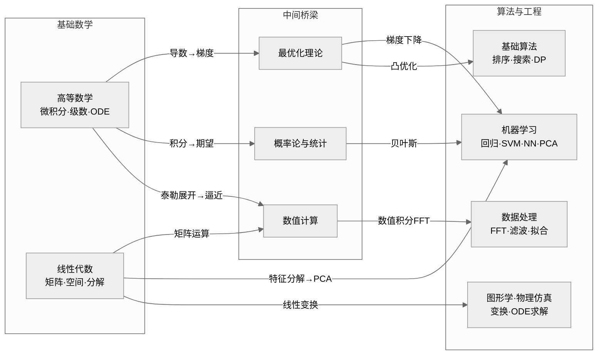

# 核心数学 · 总纲索引

> **从数学到算法实战** —— Python 程序员的数学进阶路线图
>
> 本文档是 `Algorithm and Data Structure/Math/` 目录的总入口，串联高等数学与线性代数两大核心模块，并给出数学概念 → 算法题 / 机器学习模型 的映射关系，帮助你在刷题和工程实践中「知其然，更知其所以然」。

## 📌 全景知识地图



## 📂 模块一：高等数学（微积分与级数）

> 目录：`Math/calculus/`

高等数学为算法分析、机器学习优化、数值计算提供分析基础。

### 文件清单

| 文件 / 目录 | 内容 | 状态 |
|---|---|---|
| `calculus/README.md` | 高等数学分纲 | 待整理 |
| `calculus/01-limits.md` | 极限与连续 | 待整理 |
| `calculus/02-derivatives.md` | 导数与微分 | 待整理 |
| `calculus/03-integrals.md` | 不定积分与定积分 | 待整理 |
| `calculus/04-series.md` | 级数（泰勒展开、傅里叶） | 待整理 |
| `calculus/05-multivariable.md` | 多元微积分（偏导、梯度） | 待整理 |
| `calculus/06-ode.md` | 常微分方程入门 | 待整理 |
| `calculus/numerical/` | 数值微积分（Python 实现） | 待整理 |

### 学习路径

```
先修 ──→  核心 ──→  进阶 ──→  实战
┌────────┐ ┌──────────┐ ┌──────────┐ ┌────────────────┐
│ 极限    │ │ 导数与微分│ │ 多元微积分│ │ 梯度下降调参   │
│ 初等函数│ │ 不定积分  │ │ 泰勒级数  │ │ 数值积分/Fitting│
│ 数列    │ │ 定积分    │ │ 傅里叶级数│ │ ODE 物理仿真   │
│         │ │ 微积分基本│ │ ODE 基础  │ │ 算法复杂度分析 │
│         │ │ 定理      │ │          │ │ 收敛性证明     │
└────────┘ └──────────┘ └──────────┘ └────────────────┘
```

### Python 关联速览

| 数学概念 | Python 库 / 函数 | 算法应用 |
|---|---|---|
| 导数 / 梯度 | `sympy.diff`, `jax.grad`, `torch.autograd` | 梯度下降、反向传播 |
| 定积分 | `scipy.integrate.quad` | 概率密度积分、面积计算 |
| 泰勒展开 | `sympy.series` | 函数逼近、数值稳定性分析 |
| 傅里叶变换 | `numpy.fft`, `scipy.fft` | 信号处理、卷积加速 |
| 拉格朗日乘数法 | `scipy.optimize` | 约束优化、SVM 对偶 |

## 📂 模块二：线性代数

> 目录：`Math/linear-algebra/`

线性代数是机器学习、图算法、计算机视觉的数学基石。

### 文件清单

| 文件 / 目录 | 内容 | 状态 |
|---|---|---|
| `linear-algebra/README.md` | 线性代数分纲 | 待整理 |
| `linear-algebra/01-vectors.md` | 向量基础（内积、模长、正交） | 待整理 |
| `linear-algebra/02-matrices.md` | 矩阵运算（乘法、秩、逆） | 待整理 |
| `linear-algebra/03-linear-systems.md` | 线性方程组与高斯消元 | 待整理 |
| `linear-algebra/04-eigen.md` | 特征值与特征向量 | 待整理 |
| `linear-algebra/05-decompositions.md` | 矩阵分解（LU/QR/SVD） | 待整理 |
| `linear-algebra/06-space.md` | 向量空间与线性变换 | 待整理 |
| `linear-algebra/07-applications.md` | 应用专题（PCA / PageRank / 图） | 待整理 |
| `linear-algebra/numerical/` | 数值线性代数（Python 实现） | 待整理 |

### 学习路径

```
先修 ──→   核心 ──→   进阶 ──→   实战
┌─────────┐ ┌──────────┐ ┌──────────┐ ┌─────────────────┐
│ 向量    │ │ 矩阵乘法  │ │ 特征分解  │ │ PCA 降维        │
│ 坐标系  │ │ 线性方程组│ │ SVD 分解  │ │ 推荐系统 SVD    │
│ 线性组合│ │ 行列式    │ │ QR 分解   │ │ PageRank        │
│         │ │ 向量空间  │ │ 广义逆   │ │ 图神经网络 GCN  │
│         │ │ 秩与零空间│ │ 矩阵微积分│ │ 最小二乘拟合    │
└─────────┘ └──────────┘ └──────────┘ └─────────────────┘
```

### Python 关联速览

| 数学概念 | Python 库 / 函数 | 算法应用 |
|---|---|---|
| 矩阵乘法 | `numpy.dot`, `@` 运算符 | 全连接层、线性回归 |
| 特征分解 | `numpy.linalg.eig` | PCA、谱聚类 |
| SVD | `numpy.linalg.svd`, `scipy.linalg.svd` | 推荐系统、图像压缩 |
| QR 分解 | `numpy.linalg.qr` | 最小二乘、数值稳定性 |
| 伪逆 | `numpy.linalg.pinv` | 线性回归闭式解 |
| Cholesky | `numpy.linalg.cholesky` | 高斯过程、卡尔曼滤波 |

## 🔗 数学概念 ↔ 算法题 映射总览

以下表格将抽象的数学概念映射到 LeetCode / 竞赛中的具体算法题，共 **28 对映射**。

| 模块 | 数学概念 | 对应算法题 / 工程问题 | 难度 | 关键思路 |
|---|---|---|---|---|
| 高数 | 极限 → 时间复杂度 | [LeetCode 50. Pow(x, n) ](https://leetcode.cn/problems/powx-n/) | 🟡 中等 | 二分递推，复杂度 O(log n) |
| 高数 | 导数为零 → 极值点 | [LeetCode 162. 寻找峰值](https://leetcode.cn/problems/find-peak-element/) | 🟡 中等 | 二分搜索判定单调区间 |
| 高数 | 积分 → 面积累加 | [LeetCode 42. 接雨水](https://leetcode.cn/problems/trapping-rain-water/) | 🔴 困难 | 前缀最大值/单调栈/双指针 |
| 高数 | 泰勒展开 → 指数逼近 | [LeetCode 69. x 的平方根](https://leetcode.cn/problems/sqrtx/) | 🟢 简单 | 牛顿迭代法（二阶泰勒） |
| 高数 | 微分 → 变化率 | [LeetCode 53. 最大子数组和](https://leetcode.cn/problems/maximum-subarray/) | 🟡 中等 | Kadane 算法（动态规划） |
| 高数 | 调和级数 → 发散 | [LeetCode 4. 寻找两个正序数组的中位数](https://leetcode.cn/problems/median-of-two-sorted-arrays/) | 🔴 困难 | 分治 + O(log(m+n)) |
| 高数 | 曲率 → 凹凸性 | [LeetCode 11. 盛最多水的容器](https://leetcode.cn/problems/container-with-most-water/) | 🟡 中等 | 双指针，凹函数判定 |
| 高数 | 常微分方程 → 变化模型 | 物理解谜 / 粒子群轨迹模拟 | 🟡 中等 | Euler / RK4 数值积分 |
| 高数 | 傅里叶级数 → 频域 | [LeetCode 136. 只出现一次的数字](https://leetcode.cn/problems/single-number/) | 🟢 简单 | 异或运算（奇偶性） |
| 高数 | 级数收敛 → 递归复杂度 | 分治算法 Master Theorem 推导 | 🟡 中等 | 递归树求解 |
| 高数 | 偏导数 → 梯度方向 | [LeetCode 120. 三角形最小路径和](https://leetcode.cn/problems/triangle/) | 🟡 中等 | 自底向上 DP |
| 高数 | Γ 函数 → 阶乘延拓 | [LeetCode 172. 阶乘后的零](https://leetcode.cn/problems/factorial-trailing-zeroes/) | 🟡 中等 | 数论：因子 5 的个数 |
| 线代 | 矩阵乘法 → 线性变换 | [LeetCode 48. 旋转图像](https://leetcode.cn/problems/rotate-image/) | 🟡 中等 | 转置 → 翻转 OR 矩阵分块 |
| 线代 | 矩阵乘法 → 幂运算 | [LeetCode 70. 爬楼梯 (矩阵快速幂)](https://leetcode.cn/problems/climbing-stairs/) | 🟢 简单 | 斐波那契的矩阵表示 |
| 线代 | 矩阵快速幂 → DP 加速 | [LeetCode 1137. 第 N 个泰波那契数](https://leetcode.cn/problems/n-th-tribonacci-number/) | 🟢 简单 | 矩阵幂加速线性递推 |
| 线代 | 线性方程组 → 消元 | [LeetCode 18. 四数之和 (多变量消元)](https://leetcode.cn/problems/4sum/) | 🟡 中等 | 枚举降维 + 双指针 |
| 线代 | 向量点积 → 相似度 | [LeetCode 1636. 按照频率将数组升序排序](https://leetcode.cn/problems/sort-array-by-increasing-frequency/) | 🟢 简单 | 自定义排序，基于频率向量 |
| 线代 | 高斯消元 → 线性方程组 | [LeetCode 640. 求解方程](https://leetcode.cn/problems/solve-the-equation/) | 🟡 中等 | 符号系数矩阵求解 |
| 线代 | 矩阵秩 → 线性相关 | [LeetCode 41. 缺失的第一个正数](https://leetcode.cn/problems/first-missing-positive/) | 🔴 困难 | 原地哈希，置换思想 |
| 线代 | 特征向量 → 图嵌入 | PageRank / 谱聚类 | 🔴 ML 底层 | 邻接矩阵主特征向量 |
| 线代 | SVD → 低秩近似 | 图像压缩 / 推荐系统协同过滤 | 🔴 工程 | 截断 SVD 降维 |
| 线代 | 行最简形 → 基与秩 | [LeetCode 73. 矩阵置零](https://leetcode.cn/problems/set-matrix-zeroes/) | 🟡 中等 | 常数空间原地标记 |
| 线代 | 向量的线性组合 → 可达 | [LeetCode 39. 组合总和](https://leetcode.cn/problems/combination-sum/) | 🟡 中等 | 回溯搜索组合空间 |
| 线代 | 正定矩阵 → 凸性 | [LeetCode 1514. 概率最大的路径](https://leetcode.cn/problems/path-with-maximum-probability/) | 🟡 中等 | Dijkstra 类堆优化 |
| 线代 | 矩阵转置 → 对称 | [LeetCode 867. 转置矩阵](https://leetcode.cn/problems/transpose-matrix/) | 🟢 简单 | 逐元素行列交换 |
| 线代 | 对角矩阵 → 坐标缩放 | [LeetCode 566. 重塑矩阵](https://leetcode.cn/problems/reshape-the-matrix/) | 🟢 简单 | 行列 ID 映射 |
| 线代 | 正交投影 → 最小二乘 | [LeetCode 1066. 校园自行车分配 II](https://leetcode.cn/problems/campus-bikes-ii/) | 🟡 中等 | DP + 位掩码（向量距离最小化） |
| 线代 | 图拉普拉斯 → 谱聚类 | [LeetCode 399. 除法求值](https://leetcode.cn/problems/evaluate-division/) | 🟡 中等 | 图论 + 带权并查集 / Floyd |

## 🧭 推荐学习资源

### 📖 书籍

| 类别 | 书名 | 作者 | 适合阶段 |
|---|---|---|---|
| 高等数学 | 《高等数学（同济版）》上册+下册 | 同济大学数学系 | 入门 - 基础 |
| 高等数学 | 《普林斯顿微积分读本》 | Adrian Banner | 入门（直观理解） |
| 高等数学 | 《微积分学教程》（菲赫金哥尔茨） | 菲赫金哥尔茨 | 进阶（数理推导） |
| 线性代数 | 《线性代数（同济版）》 | 同济大学数学系 | 入门 - 基础 |
| 线性代数 | 《线性代数及其应用》（Strang） | Gilbert Strang | 入门 + 应用（强烈推荐） |
| 线性代数 | 《矩阵分析》 | Roger Horn | 进阶（研究生） |
| 综合应用 | 《机器学习中的数学》 | 周志华 / 南瓜书 | 算法工程应用 |
| 综合应用 | 《算法导论》（数学章节） | CLRS | 算法复杂度分析 |
| 综合应用 | 《Numerical Recipes》 | Press et al. | 数值计算实战 |

### 🎬 视频课程

| 课程 | 讲师 | 平台 | 说明 |
|---|---|---|---|
| 《微积分（单变量）》 | MIT 18.01 (David Jerison) | MIT OCW / Bilibili | 经典英文课程 |
| 《微积分（多变量）》 | MIT 18.02 (Denis Auroux) | MIT OCW / Bilibili | 多元微积分最佳入门 |
| 《线性代数》（Gilbert Strang） | MIT 18.06 | MIT OCW / B站 | 线代圣经级课程 |
| 《矩阵论》 | 张贤达 | 学堂在线 | 中文进阶 |
| 《高等数学（宋浩）》 | 宋浩 | Bilibili | 中文通俗易懂 |
| 《线性代数（宋浩）》 | 宋浩 | Bilibili | 中文通俗易懂 |
| 《3Blue1Brown 线性代数本质》 | 3B1B | YouTube / B站 | 直观动画讲解 |
| 《3Blue1Brown 微积分本质》 | 3B1B | YouTube / B站 | 直观动画讲解 |

### 🛠 习题与实战平台

| 平台 | 链接 | 用途 |
|---|---|---|
| LeetCode | https://leetcode.cn | 算法题实战验证数学理解 |
| Kaggle | https://www.kaggle.com | 在 ML 数据集中应用线性代数 |
| 3Blue1Brown 互动 | https://www.3blue1brown.com | 交互式可视化教程 |
| MIT Mathlets | https://mathlets.org | 微积分 / 线性代数交互工具 |
| Matrix Calculus (Parr) | https://explained.ai/matrix-calculus/ | 矩阵微积分实战指南 |
| Problem Solvers | https://artofproblemsolving.com | 高阶数学竞赛题库 |

## 🌱 学习建议

1. **先直觉，后严格** —— 先用 3B1B 动画建立直观，再用同济教材掌握推导。
2. **手算 + 代码双写** —— 每一个定理先手动推导关键步骤，再用 NumPy/SciPy 验证。
3. **以题代练** —— 每学完一个新概念，去 LeetCode 找对应的题目（见上表），在实际代码中体会数学。
4. **串联知识链** —— 不要孤立学习：矩阵 → SVD → PCA → 数据降维，这条链路比零散知识点更有价值。
5. **注重数值稳定性** —— 工程中「数学上等价」不等于「数值上稳定」；学完线性代数后务必了解 `numpy.linalg` 和 `scipy.linalg` 在实际数值计算中的差异。

## 📄 目录结构总览

```
Math/
├── README.md               ◀── 本文件（总纲索引）
├── calculus/
│   ├── README.md           （待整理）高等数学分纲
│   ├── 01-limits.md        （待整理）极限与连续
│   ├── 02-derivatives.md   （待整理）导数与微分
│   ├── 03-integrals.md     （待整理）不定积分与定积分
│   ├── 04-series.md        （待整理）级数
│   ├── 05-multivariable.md （待整理）多元微积分
│   ├── 06-ode.md           （待整理）常微分方程
│   └── numerical/          （待整理）数值微积分 Python 实现
│
└── linear-algebra/
    ├── README.md           （待整理）线性代数分纲
    ├── 01-vectors.md       （待整理）向量基础
    ├── 02-matrices.md      （待整理）矩阵运算
    ├── 03-linear-systems.md（待整理）线性方程组
    ├── 04-eigen.md         （待整理）特征值与特征向量
    ├── 05-decompositions.md（待整理）矩阵分解
    ├── 06-space.md         （待整理）向量空间与线性变换
    ├── 07-applications.md  （待整理）应用专题
    └── numerical/          （待整理）数值线性代数 Python 实现
```

> **标签:** `#数学 #高等数学 #线性代数 #算法 #Python #机器学习 #微积分 #矩阵`
