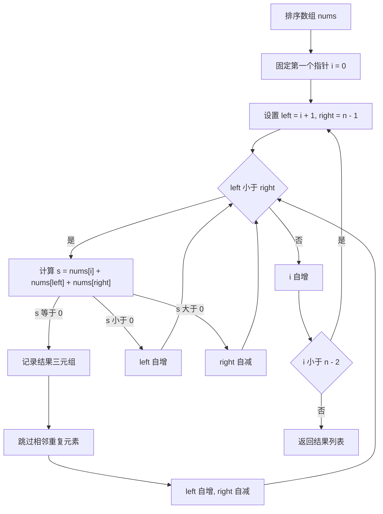
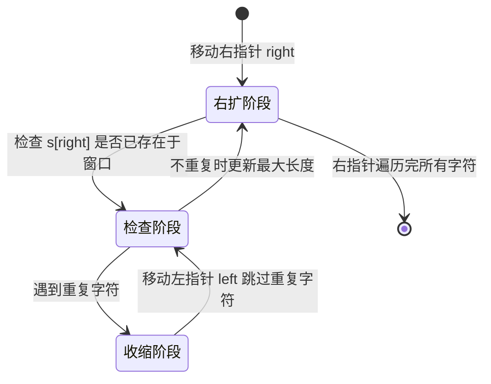
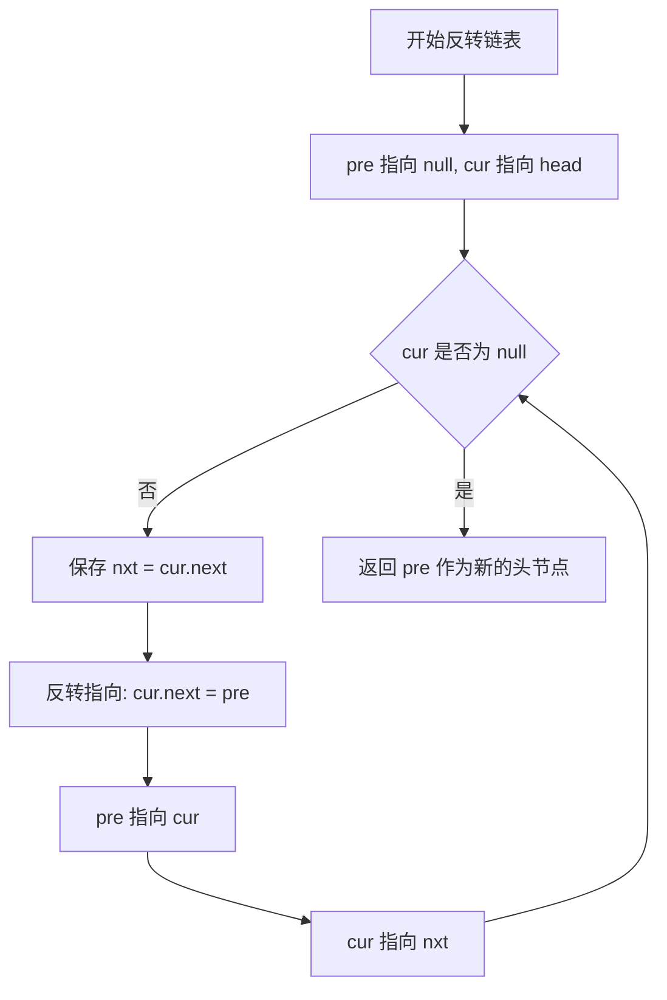
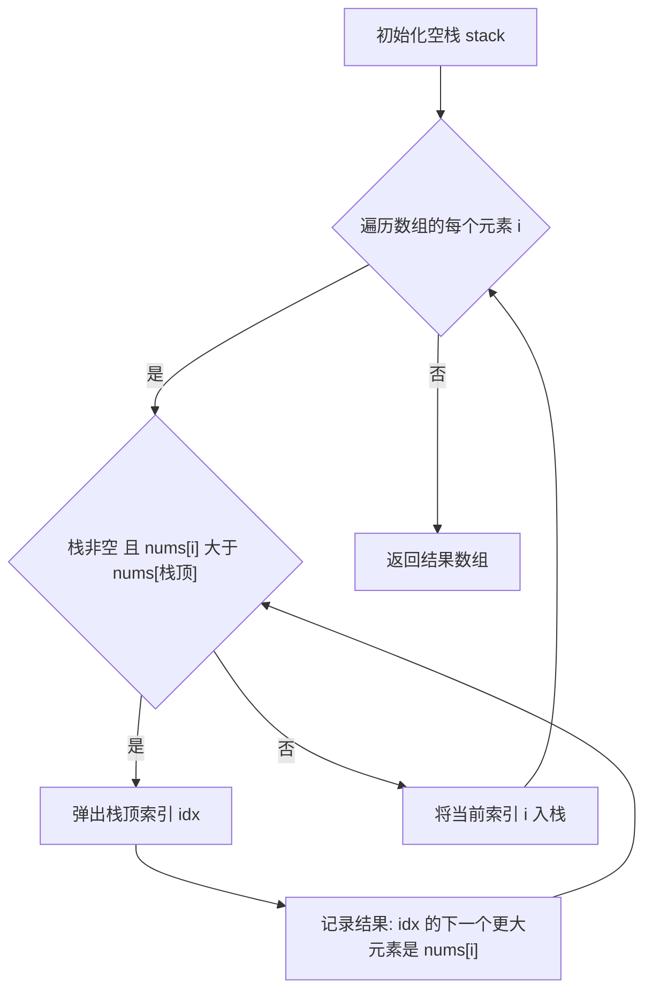

# 线性表与指针操作

> **涵盖题型：** 数组遍历 · 双指针 · 滑动窗口 · 链表操作 · 栈 · 队列 · 单调栈与队列

## 一、数组与双指针

### 🔬 核心原理

双指针的本质是 **用两个下标变量代替单指针的嵌套循环，将 O(n²) 降为 O(n)**。根据指针移动方向分为三类：

| 类型 | 移动方向 | 典型场景 |
|------|---------|---------|
| **左右指针** | 两端向中间 | 有序数组两数之和、反转数组或字符串 |
| **快慢指针** | 同向一快一慢 | 链表环检测、数组去重、中位数查找 |
| **分离双指针** | 各走各的路 | 合并两个有序数组、比较两个序列 |

### 📜 背景与起源

双指针技术并非单一发明，而是从多个经典算法中独立涌现的模式：

- **Floyd 判环算法（1960s）**：Robert W. Floyd 提出的龟兔赛跑算法，用快慢指针检测链表环，是最早的双指针应用之一。
- **快速排序分区（1962）**：C. A. R. Hoare 的快速排序使用了左右两个指针从两端扫描交换，诞生了"左右指针"范式。
- **两数之和 II（有序数组）**：双指针在编程面试中的经典题目。2000 年代后在 LeetCode 等平台推动下成为独立题型类别。

### 🎯 问题域映射

| 适用场景 | 典型题目 | 不适用场景 |
|---------|---------|-----------|
| 有序数组上的约束类问题 | 两数之和、三数之和、四数之和 | 无序数据（需先排序） |
| 链表操作类 | 环检测、找中点、合并有序链表 | 需要全局重排或多次随机访问 |
| 同向移动类 | 移除元素、原地去重、分隔数组 | 需要计数或频率统计的问题 |
| 字符串反转 | 反转字符串、反转单词 | 字符串匹配（需用 KMP 等） |

### 💡 破题直觉

**看到「有序」「去重」「两数之和」「反转」→ 优先想双指针**

```text
何时用双指针替换双循环？
给定一个  → 左指针动
给定另一个 → 右指针动
条件满足  → 更新答案
两个单调  → 双指针
```

### ⚠️ 边界陷阱（命中率 > 80%）

| 陷阱 | 场景 | 解法 |
|------|------|------|
| 指针越界 | while(left < right) 缺等号 | 根据题意决定是否取等（两数之和：不等；反转：相等时原地不用交换） |
| 跳过重复值 | 三数之和 | 移动指针后 while 跳过相邻重复元素；去重必须在找到一个解之后 |
| 窗口缩小方向 | 接雨水、盛水最多容器 | 左右指针中短的那一侧向中间移动，长的一侧不动 |
| 死循环 | 快慢指针相遇 | fast 每次两步，slow 每次一步，保证有限步内相遇 |

### ⚙️ 高效实现指南

- **循环不变量**：始终明确区间语义。例如双指针去重时，维护 `[0, slow)` 为已处理、`[slow, fast)` 为新元素等待区、`[fast, n)` 为未扫描。写出注释明确每个变量的含义。
- **原地算法优先**：当题目允许"原地操作"时，双指针通常能做到 O(1) 额外空间，是最优解。
- **有序是前提**：大多数左右指针题目依赖输入有序或需要先排序。面试时要先问："输入是有序的吗？"
- **边界检查模板**：
    ```python
    # 左右指针通用骨架
    left, right = 0, len(nums) - 1
    while left < right:       # 注意是否取等
        # 条件判断
        if condition:
            left += 1
            right -= 1
        elif condition2:
            left += 1
        else:
            right -= 1
    ```

### 📈 复杂度递进示例

**题目：三数之和 (15)**

| 解法 | 时间复杂度 | 空间复杂度 | 思路 |
|------|-----------|-----------|------|
| 暴力三重循环 | O(n³) | O(1) | 三层 for 枚举所有三元组 |
| 哈希优化 | O(n²) | O(n) | 两重循环加哈希找第三个数 |
| **排序加双指针** | **O(n²)** | **O(1)** | 固定一个数，左右指针找另外两个（最优） |



### ⚡ 应试策略

```text
1. 先排序（O(n log n) — 大部分双指针依赖有序）
2. 固定其中一个指针，另两个用左右指针
3. 每次移动后跳过重复值
4. 注意去重时机：找到解之后，而不是找解之前
```

## 🏷️ 常见题型与解题方案

### ① 两数之和变体（Two Sum II）

**题目特征**
- 给定一个有序数组和一个目标值 target，找出数组中两个数之和等于 target
- 可能存在重复元素
- 返回索引或元素值

**解题思路从暴力到最优**

- **暴力法 O(n²)**：两层循环枚举所有数对
- **哈希法 O(n) O(n)**：遍历时用哈希表存储已访问的元素，检查 target - nums[i] 是否在哈希表中（适用于无序数组）
- **双指针法 O(n) O(1)**（本题最优）：数组已排序，用左右指针相向而行。sum = nums[left] + nums[right]，若 sum > target 则 right--（总和需要减小），若 sum < target 则 left++（总和需要增大），若相等则返回。

**为什么双指针可行？**
数组有序使指针移动有明确方向：和太大时右指针左移减小和，和太小时左指针右移增大和。且每次排除一行或一列，保证 O(n)。

```python
def two_sum_sorted(nums: list[int], target: int) -> list[int]:
    """
    有序数组两数之和，返回 [index1, index2]（1-indexed）
    思路：左右指针向中间逼近，利用有序性确定移动方向
    """
    left, right = 0, len(nums) - 1
    while left < right:                     # 不能取等，否则用同一个元素
        cur_sum = nums[left] + nums[right]
        if cur_sum == target:
            return [left + 1, right + 1]    # 返回 1-indexed 索引
        elif cur_sum < target:
            left += 1                       # 和太小，左指针右移增大
        else:
            right -= 1                      # 和太大，右指针左移减小
    return []                               # 无解

# 如果允许重复，去重技巧：找到一个解后跳过相邻相同值
# while left < right and nums[left] == nums[left - 1]: left += 1
# while left < right and nums[right] == nums[right + 1]: right -= 1
```

**时间复杂度**：O(n) — 每个元素最多被访问一次
**空间复杂度**：O(1) — 只用了两个指针变量

### ② 三数之和 / 四数之和

**题目特征**
- 给定整数数组（可能无序），找出所有和为 target 的 N 元组
- 要求返回所有不重复的组合
- 三数之和 target=0 是最经典变体

**解题思路从暴力到最优**

- **暴力法 O(n³)**：三层循环枚举三元组，用 Set 去重
- **排序 + 哈希 O(n²) O(n)**：固定两个数，用哈希找第三个数
- **排序 + 双指针 O(n²) O(1)**：先排序，固定第一个数 i，对剩下的区间使用左右指针找另外两个数

**去重关键**：找到一个解之后，移动指针并跳过所有重复元素。注意去重的时机与位置：
1. 固定指针 i 跳过重复（当 nums[i] == nums[i-1] 时）
2. 找到一组解后，左右指针各自跳过重复

```python
def three_sum(nums: list[int], target: int = 0) -> list[list[int]]:
    """
    三数之和：找出所有和为 target 的不重复三元组
    核心：排序 + 固定一个数 + 双指针找另外两个
    """
    nums.sort()                              # 排序是双指针的前提
    n = len(nums)
    res = []

    for i in range(n - 2):                   # 固定第一个数
        # 剪枝：如果当前最小数大于 target，后面更大，不可能有解
        if nums[i] > target and nums[i] > 0:
            break
        # 去重：固定指针跳过重复（只在第一个位置去重）
        if i > 0 and nums[i] == nums[i - 1]:
            continue

        left, right = i + 1, n - 1           # 双指针找另外两个
        while left < right:
            total = nums[i] + nums[left] + nums[right]
            if total == target:
                res.append([nums[i], nums[left], nums[right]])
                # 去重：找到解之后才跳过重复
                while left < right and nums[left] == nums[left + 1]:
                    left += 1
                while left < right and nums[right] == nums[right - 1]:
                    right -= 1
                left += 1                     # 移动指针继续找下一组
                right -= 1
            elif total < target:
                left += 1                     # 和太小，左指针右移
            else:
                right -= 1                    # 和太大，右指针左移

    return res


def four_sum(nums: list[int], target: int) -> list[list[int]]:
    """
    四数之和：固定两个数 + 双指针，最外层 O(n³)，但通常 n 小
    也可递归转为 N-2 数之和，但面试中两层循环加双指针最清晰
    """
    nums.sort()
    n = len(nums)
    res = []

    for i in range(n - 3):
        if i > 0 and nums[i] == nums[i - 1]:
            continue
        for j in range(i + 1, n - 2):
            if j > i + 1 and nums[j] == nums[j - 1]:
                continue
            left, right = j + 1, n - 1
            while left < right:
                total = nums[i] + nums[j] + nums[left] + nums[right]
                if total == target:
                    res.append([nums[i], nums[j], nums[left], nums[right]])
                    while left < right and nums[left] == nums[left + 1]:
                        left += 1
                    while left < right and nums[right] == nums[right - 1]:
                        right -= 1
                    left += 1
                    right -= 1
                elif total < target:
                    left += 1
                else:
                    right -= 1
    return res
```

**时间复杂度**：三数 O(n²) / 四数 O(n³)
**空间复杂度**：O(1)（不计输出空间，排序 O(log n)~O(n)）

### ③ 盛水最多的容器

**题目特征**
- 给定 n 个非负整数表示柱子的高度，每对柱子（i, j）形成一个容器
- 容器盛水量 = min(height[i], height[j]) * (j - i)
- 求最大盛水量

**解题思路从暴力到最优**

- **暴力法 O(n²)**：枚举所有 i < j 组合计算面积
- **双指针法 O(n)**：左右指针从两端向中间移动，每次移动**较矮的那根柱子**

**为什么移动较矮的？** 证明：设当前左右柱子为 L 和 R，h[L] < h[R]，当前面积 = h[L] * (R-L)。如果移动较高的 R 向内，新高度 ≤ h[R]，宽度减小，面积必然 ≤ 当前面积。所以 R 不会是更优的边界。因此只有移动较矮的 L 才有可能增大面积。

```python
def max_area(height: list[int]) -> int:
    """
    盛水最多的容器：双指针，每次移动高度较小的那端
    """
    left, right = 0, len(height) - 1
    max_water = 0

    while left < right:
        # 计算当前盛水量
        h = min(height[left], height[right])
        w = right - left
        max_water = max(max_water, h * w)

        # 移动较短的柱子（向内移动才有可能增大面积）
        if height[left] < height[right]:
            left += 1
        else:
            right -= 1

    return max_water
```

**时间复杂度**：O(n) — 每个柱子最多被指针访问一次
**空间复杂度**：O(1)

### ④ 接雨水

**题目特征**
- 给定 n 个非负整数表示柱子的高度，计算下雨后能接多少雨水
- 每个位置上方能接的水量 = max(0, min(left_max, right_max) - height[i])

**解题思路从暴力到最优**

- **暴力按列法 O(n²) O(1)**：对每个位置，向左向右分别找最高柱子
- **前缀最值法 O(n) O(n)**：预处理 left_max[i] 和 right_max[i] 数组
- **双指针法 O(n) O(1)**：左右指针 + left_max 和 right_max 变量（最优）

**双指针核心思路**：不需要一次性知道两边的全局最值，只需确定当前处理的位置较矮的那一侧的最值。因为水的高度由较矮的那一侧决定。

```python
def trap(height: list[int]) -> int:
    """
    接雨水：双指针，每次处理较矮的一侧
    关键：水的高度由较矮的边界决定，因此只需维护已扫描过的边界最值
    """
    if not height:
        return 0

    left, right = 0, len(height) - 1
    left_max = right_max = 0
    total_water = 0

    while left < right:
        if height[left] < height[right]:
            # 左侧较矮，左侧的水量由 left_max 决定
            if height[left] >= left_max:
                left_max = height[left]       # 更新左侧最高
            else:
                total_water += left_max - height[left]  # 积水
            left += 1
        else:
            # 右侧较矮，右侧的水量由 right_max 决定
            if height[right] >= right_max:
                right_max = height[right]      # 更新右侧最高
            else:
                total_water += right_max - height[right]  # 积水
            right -= 1

    return total_water
```

> **对比盛水最多容器 vs 接雨水**：
> - 盛水最多容器：选两根柱子，求框出的矩形面积 — 移动较短的柱子向内
> - 接雨水：每个位置上方能积多少水 — 处理较矮一侧并维护该侧最值
> 两者都利用了「瓶颈由较短一侧决定」的核心思想，但接雨水需要额外维护边界最值。

**时间复杂度**：O(n)
**空间复杂度**：O(1)

### ⑤ 移除元素 / 原地去重

**题目特征**
- 原地删除数组中所有等于某值的元素，或原地删除重复元素
- 要求 O(1) 额外空间
- 返回新长度

**解题思路从暴力到最优**

- **删除后移动 O(n²)**：找到目标元素后，将后面所有元素前移
- **快慢指针 O(n) O(1)**：slow 维护已处理的有效区域尾部，fast 扫描全数组

**快慢指针语义**：`nums[0:slow]` 是已确认的有效元素，`nums[slow:fast]` 是待处理区域，`nums[fast:]` 是未扫描区域。

```python
def remove_element(nums: list[int], val: int) -> int:
    """
    原地移除所有值等于 val 的元素
    快慢指针：slow 指向下一个有效位置，fast 遍历数组
    """
    slow = 0                                   # 有效区域尾部（不包含）
    for fast in range(len(nums)):
        if nums[fast] != val:
            nums[slow] = nums[fast]            # 将有效元素复制到 slow 位置
            slow += 1
    return slow                                # 新长度


def remove_duplicates(nums: list[int]) -> int:
    """
    原地删除有序数组中的重复项
    快慢指针：slow 指向最后一个不重复元素的位置
    """
    if not nums:
        return 0

    slow = 0                                   # 最后一个不重复元素的索引
    for fast in range(1, len(nums)):
        if nums[fast] != nums[slow]:           # 遇到新元素
            slow += 1                          # 扩展有效区域
            nums[slow] = nums[fast]            # 将新元素放到有效区域末尾
    return slow + 1                            # 新长度


def remove_duplicates_k(nums: list[int], k: int = 2) -> int:
    """
    允许最多保留 k 个重复项（通用版）
    适用于「删除有序数组中的重复项 II」
    """
    if len(nums) <= k:
        return len(nums)

    slow = k                                   # 前 k 个直接保留
    for fast in range(k, len(nums)):
        # 如果当前元素与 slow-k 位置的元素不同，说明还没出现 k+1 次
        if nums[fast] != nums[slow - k]:
            nums[slow] = nums[fast]
            slow += 1
    return slow
```

**时间复杂度**：O(n)
**空间复杂度**：O(1)

### ⑥ 颜色分类（荷兰国旗问题）

**题目特征**
- 数组中只有 0、1、2 三种值，要求原地排序
- 不允许使用计数排序（虽然简单，但题目要求一次遍历）

**解题思路**

三指针法（left, mid, right）：
- left 左侧全是 0，right 右侧全是 2
- mid 遍历中间区域，遇到 0 与 left 交换，遇到 2 与 right 交换

```python
def sort_colors(nums: list[int]) -> None:
    """
    荷兰国旗问题：三指针原地排序 0、1、2
    不借助计数排序，一次遍历完成
    """
    left, mid, right = 0, 0, len(nums) - 1

    while mid <= right:
        if nums[mid] == 0:
            # 遇到 0：交换到 left 位置，left 和 mid 都前进
            # 因为 left 指向的只可能是 0 或 1（已处理），交换后 mid 位置不会是 2
            nums[left], nums[mid] = nums[mid], nums[left]
            left += 1
            mid += 1
        elif nums[mid] == 2:
            # 遇到 2：交换到 right 位置，right 后退
            # mid 不前进，因为 right 交换过来的是什么值还不确定
            nums[right], nums[mid] = nums[mid], nums[right]
            right -= 1
            # mid 不前进！需要检查交换来的新值
        else:
            # nums[mid] == 1，正确位置，跳过
            mid += 1

    # 注意：mid 遇到 2 时不前进。
    # 因为交换到 mid 的可能是 0，需要再处理一次。
    # 而交换 0 时 mid 前进是因为从 left 换来的只可能是 0 或 1。
```

**时间复杂度**：O(n) — 每个元素最多被交换两次
**空间复杂度**：O(1)

## 二、滑动窗口

### 🔬 核心原理

滑动窗口维护一个 **左闭右开或左闭右闭** 的连续区间，通过 **右边界扩张（expand）** 和 **左边界收缩（shrink）** 来找到满足条件的子数组或子串，即 **两指针同向移动的变体**。

| 窗口类型 | 特征 | 典型题目 |
|---------|------|---------|
| **固定窗口** | 窗口大小不变 | 大小为 k 的最大平均值 |
| **可变窗口** | 窗口大小变化，求满足条件的最大或最小长度 | 无重复最长子串、最短覆盖子串、长度最小子数组 |

### 📜 背景与起源

- **计算机网络起源**：滑动窗口机制最早出现在 TCP 协议中（Van Jacobson，1988），用于流量控制和拥塞控制。窗口大小决定发送方在收到确认前能发送的数据量。
- **引入算法竞赛**：1990 年代末至 2000 年代初，信息学竞赛（IOI、ACM-ICPC）的选手将这一思想引入字符串和数组问题，用于高效处理连续子区间。
- **面试普及**：2010 年代后，LeetCode 等平台将滑动窗口作为独立题型推广，成为算法面试的必考内容。

### 🎯 问题域映射

| 适用场景 | 典型题目 | 不适用场景 |
|---------|---------|-----------|
| 连续子数组的最大或最小长度 | 长度最小的子数组、最大平均值子数组 | 非连续子序列（需用动态规划） |
| 字符串子串问题 | 无重复字符的最长子串、最小覆盖子串 | 涉及全局排列或子序列匹配 |
| 同向单调性问题 | 字符串排列判断、异位词 | 输入无序或窗口范围无单调性 |
| 区间计数 | 和为 K 的子数组个数（配合前缀和） | 需要频繁重新排列元素 |

### 💡 破题直觉

**看到「连续子数组」「子串」「最大或最小长度」→ 滑动窗口**

```text
什么时候可以滑动窗口？
→ 求的是连续区间
→ 窗口扩大或缩小只影响边界元素
→ 单调性：窗口扩大满足条件，缩小可能不满足（或反之）
```

**关键模式：**

| 问题类型 | 窗口伸缩逻辑 |
|---------|------------|
| 求最小窗口（满足条件） | 右扩直到满足 → 左缩求最小 → 重复 |
| 求最大窗口（满足条件） | 右扩直到不满足 → 左缩恢复满足 → 记录最大 |
| 窗口内条件严格 | 用哈希表或计数器维护窗口内状态 |

### ⚠️ 边界陷阱

| 陷阱 | 场景 | 对策 |
|------|------|------|
| 窗口为空 | length = 0 | 初始化 ans 为 MAX 或 MIN，循环后判断是否更新过 |
| 窗口何时更新结果 | 不同题目时机不同 | 最小类：满足时更新；最大类：每次右扩后或每次满足时 |
| 字符集大小 | 只含小写字母？UNICODE？ | 用 Map 而非固定数组 |
| 窗口收缩到 left > right | 空窗口状态 | 处理前判断 left <= right，重置计数器 |

### ⚙️ 高效实现指南

- **数组比哈希表快**：当字符集可枚举（如 26 个小写字母、128 个 ASCII）时，用固定长度数组 `int[26]` 或 `int[128]` 替代 HashMap，速度提升 3 到 5 倍，且减少哈希冲突的隐式开销。
- **避免重复计算窗口大小**：在 while 循环中不要每次都调用 `len(window)` 或 `right - left + 1`，用一个变量 `size` 缓存或直接用索引计算。
- **need 与 have 双计数器**：对于精确匹配类题目（如最小覆盖子串），用 `need` 表示需要匹配的字符，`have` 表示已匹配的字符数，而非每次全量比较。
- **缩放在外部**：可变窗口模板中，`while` 缩放在循环体内部，`for` 扩张在外层，不要两层颠倒。

### 📈 复杂度递进示例

**题目：无重复字符的最长子串 (3)**

| 解法 | 时间 | 空间 | 思路 |
|------|-----|------|------|
| 暴力 | O(n²) | O(min(n,m)) | 每种子串遍历判断 |
| **滑动窗口加 Set** | **O(n)** | **O(min(n,m))** | 右扩遇重复则左缩，每次记录最大长度 |
| 优化窗口加 Map | O(n) | O(min(n,m)) | Map 存字符最后位置，左指针直接跳到最后出现位置加 1 |



### ⚡ 应试策略

```text
模板代码（可变窗口）：
    left = 0
    ans = 0
    for right in range(n):
        更新窗口状态（加入 s[right]）
        while 窗口不满足条件：
            更新窗口状态（移除 s[left]）
            left += 1
        更新 ans（此时窗口满足条件）
    return ans

注意：
- 最小类问题在 while 内更新 ans（缩到最小还满足时）
- 最大类问题在 while 外更新 ans（缩到刚好满足后）
- 字符匹配类用 need 和 have 两个计数器
- 固定窗口不需要 while 缩进，直接用 if 移除窗口左端
```

## 🏷️ 常见题型与解题方案

### ① 无重复字符的最长子串

**题目特征**
- 求字符串中不含重复字符的最长连续子串的长度
- 子串必须是连续的（不是子序列）

**解题思路从暴力到最优**

- **暴力 O(n³)**：枚举所有子串并检查是否有重复字符
- **滑动窗口 + Set O(2n) O(k)**：右指针每次扩展，遇到重复时左指针逐个右移删除 Set，每次记录最大长度
- **滑动窗口 + Map O(n) O(k)**（最优）：Map 存储每个字符最后出现的位置。遇到重复时，左指针直接跳到重复字符上次位置 + 1，实现 O(n) 一次遍历

```python
def length_of_longest_substring(s: str) -> int:
    """
    无重复字符的最长子串：滑动窗口 + 哈希表记录字符最后出现位置
    """
    char_map = {}          # 字符 -> 最近一次出现的索引
    left = 0               # 窗口左边界
    max_len = 0

    for right, ch in enumerate(s):
        # 若字符已在窗口内，左边界直接跳到上次位置 + 1
        if ch in char_map and char_map[ch] >= left:
            left = char_map[ch] + 1

        char_map[ch] = right          # 更新字符最后一次出现位置
        max_len = max(max_len, right - left + 1)  # 更新最大长度

    return max_len
```

**为什么重复时左指针直接跳到 last+1 而不是逐次移动？**
如果窗口内已有重复字符，在 left 移到 last+1 之前，窗口始终包含重复字符，不可能满足条件。用 Map 直接跳跃可以省去逐次缩小的 O(n) 步骤，将总复杂度降至严格 O(n)。

**时间复杂度**：O(n)
**空间复杂度**：O(min(m, n)) — m 为字符集大小，n 为字符串长度

### ② 长度最小的子数组（和 ≥ target）

**题目特征**
- 正整数数组，找和 ≥ target 的最短连续子数组
- 若不存在返回 0

**解题思路从暴力到最优**

- **暴力 O(n²)**：枚举所有子数组求和
- **前缀和 + 二分 O(n log n)**：计算前缀和数组，对每个位置二分找满足条件的最小结尾
- **滑动窗口 O(n) O(1)**（最优）：右指针扩展求和，当 sum ≥ target 时，左指针收缩求最小长度

```python
def min_sub_array_len(target: int, nums: list[int]) -> int:
    """
    长度最小子数组：滑动窗口，和 ≥ target 时左缩求最小
    注意：nums 中都是正整数（保证 sum 单调递增）
    """
    left = 0
    cur_sum = 0
    min_len = float('inf')

    for right in range(len(nums)):
        cur_sum += nums[right]               # 右指针扩展

        # 当窗口和满足条件时，左缩求最小
        while cur_sum >= target:
            min_len = min(min_len, right - left + 1)
            cur_sum -= nums[left]            # 移除左边界元素
            left += 1                        # 左指针移动

    return min_len if min_len != float('inf') else 0
```

**窗口伸缩逻辑**：求最小窗口 → 右扩直到满足条件 → 左缩求最小（while 内更新答案）

**时间复杂度**：O(n) — 每个元素最多进入和离开窗口各一次
**空间复杂度**：O(1)

### ③ 最小覆盖子串

**题目特征**
- 给定字符串 s 和 t，在 s 中找到包含 t 所有字符（含数量）的最短连续子串
- 返回该子串或空字符串

**解题思路**

- **暴力 O(n² · m)**：枚举所有子串，检查是否包含 t
- **滑动窗口 + need/have 双计数器 O(n + m)**（最优）

**need/have 机制**：
- `need`：需要匹配的**不同字符数**（不是总字符数）
- `have`：已满足条件的**不同字符数**
- 当某个字符的窗口计数 ≥ 需求计数时，该字符已满足，have 加 1
- 当 have == need 时，窗口满足条件，进入收缩阶段

**为什么 need 用不同字符数而不是总字符数？**
因为用不同字符数可以 O(1) 判断是否满足条件，而每次比较两个哈希表需要 O(m)。这是滑动窗口精确匹配类题目的标准优化。

```python
def min_window(s: str, t: str) -> str:
    """
    最小覆盖子串：滑动窗口 + need/have 双计数器
    """
    if not s or not t:
        return ''

    need_map = {}                              # 字符 -> 需要出现的次数
    for ch in t:
        need_map[ch] = need_map.get(ch, 0) + 1

    need = len(need_map)                       # 需要覆盖的不同字符数
    have = 0                                   # 已满足条件的字符数
    window = {}                                # 滑动窗口内字符计数

    left = 0
    min_len = float('inf')
    start = 0                                  # 记录最短子串的起始位置

    for right, ch in enumerate(s):
        # --- 右指针扩展 ---
        window[ch] = window.get(ch, 0) + 1

        # 该字符数量恰好满足条件，have + 1
        if ch in need_map and window[ch] == need_map[ch]:
            have += 1

        # --- 满足条件时左缩 ---
        while have == need:
            # 更新答案（在 left 右移前记录）
            if right - left + 1 < min_len:
                min_len = right - left + 1
                start = left

            # 移出左边的字符
            left_ch = s[left]
            window[left_ch] -= 1
            if left_ch in need_map and window[left_ch] < need_map[left_ch]:
                have -= 1
            left += 1

    return s[start:start + min_len] if min_len != float('inf') else ''
```

**时间复杂度**：O(n + m) — n 是 s 长度，m 是 t 长度
**空间复杂度**：O(m) — 哈希表大小

### ④ 字符串排列 / 异位词

**题目特征**
- 判断 s2 是否包含 s1 的排列（异位词）
- 本质：s2 中是否存在长度为 |s1| 的连续子串，其字符出现次数与 s1 完全一致

**解题思路**

固定窗口大小 = len(s1)，在 s2 上滑动。每次只需比较窗口内字符计数与 s1 的字符计数是否一致。

```python
def check_inclusion(s1: str, s2: str) -> bool:
    """
    字符串排列：固定长度的滑动窗口 + 字符计数
    判断 s2 是否包含 s1 的排列
    """
    if len(s1) > len(s2):
        return False

    # 字符计数数组（假设只含小写字母）
    count_s1 = [0] * 26
    count_window = [0] * 26

    for ch in s1:
        count_s1[ord(ch) - ord('a')] += 1

    k = len(s1)

    # 初始化第一个窗口
    for i in range(k):
        count_window[ord(s2[i]) - ord('a')] += 1

    # 检查第一个窗口
    if count_s1 == count_window:
        return True

    # 滑动窗口
    for i in range(k, len(s2)):
        # 移除左端字符
        count_window[ord(s2[i - k]) - ord('a')] -= 1
        # 加入右端字符
        count_window[ord(s2[i]) - ord('a')] += 1
        # 检查是否匹配
        if count_s1 == count_window:
            return True

    return False
```

**进阶：找到所有异位词的起始索引（LC 438）**
只需将 `return True` 改为 `res.append(i - k + 1)` 即可。

**优化技巧**：当字符集仅限小写字母时，用数组替代 HashMap，比较两个数组是 O(26) 常数时间，而非 O(n)。进一步优化可使用 need/have 双计数器（同最小覆盖子串），实现 O(1) 时间检查。

**时间复杂度**：O(n) — n 为 s2 长度
**空间复杂度**：O(1) — 固定 26 大小的数组

## 三、链表操作

### 🔬 核心原理

链表是 **递推定义的数据结构**，每个节点包含值和指向下一节点的指针。核心操作围绕 **指针重定向**：

| 操作 | 技术 |
|------|------|
| 遍历 | cur = cur.next |
| 插入或删除 | 需找到前驱节点 |
| 反转 | 三指针（pre, cur, nxt） |
| 环检测 | 快慢指针 |
| 找中点 | 快慢指针 |
| 合并 | 虚拟头节点 |

### 📜 背景与起源

- **基础数据结构**：链表的概念最早出现在 1950 年代的 Allen Newell、Cliff Shaw 和 Herbert Simon 的信息处理语言（IPL）中，作为动态内存管理的一种方案。
- **函数式语言传统**：链表反转在 Lisp 和 Scheme 等函数式语言中是递归教学的经典案例。在纯函数式设置中，链表是不可变的，反转操作通过递归构造新链表实现。
- **面试常青树**：由于链表操作涉及指针管理和边界处理，是考察代码严谨性和指针理解的理想题目，在算法面试中经久不衰。

### 🎯 问题域映射

| 适用场景 | 典型题目 | 不适用场景 |
|---------|---------|-----------|
| 链式结构的增删改查 | 反转链表、删除节点、合并链表 | 频繁随机访问（需用数组） |
| 环形结构检测 | 环形链表、环形链表 II | 线性结构上的排序（不如数组快） |
| 双链表操作 | LRU 缓存、设计链表 | 内存受限场景（每个节点有额外指针开销） |
| 多链表合并 | 合并 K 个升序链表 | 需要双向索引或下标操作 |

### 💡 破题直觉

**看到「链表」「环」「反转」「合并」「排序」→ 快慢指针或虚拟头节点**

```text
链表三大思维：
1. 虚拟头节点 → 统一头节点的插入和删除逻辑
2. 快慢指针 → 环检测、找中点、找倒数第 k 个节点
3. 递归反链 → 末尾先行，逐层反转指针
```

### ⚠️ 边界陷阱

| 陷阱 | 场景 | 对策 |
|------|------|------|
| 空链表 | head == null | 所有函数先判空 |
| 单节点 | head.next == null | while 循环条件检查 |
| 头节点被删除 | 删除值为 val 的节点 | 使用虚拟头节点 dummy |
| 成环 | 环形链表 | 快慢指针检测，相遇即死循环 |

### ⚙️ 高效实现指南

- **优先使用 dummy 节点**：虚拟头节点可以统一所有插入和删除操作，避免头节点作为特例处理。几乎所有链表修改操作都可以受益。
- **递归可能栈溢出**：Python 默认递归深度约 1000，对于长链表，递归反转或递归合并会触发 `RecursionError`。面试时首选迭代解法。
- **保存引用再修改**：修改 `cur.next` 前必须先保存 `nxt = cur.next`，否则会丢失原链表后续节点。
- **快慢指针的步长**：快指针走两步、慢指针走一步是最常用的组合。对于"找倒数第 k 个"，让快指针先走 k 步即可。
- **断链与接链**：对链表做区间反转、K 个一组反转等复杂操作时，先用纸笔画出示意图，确认每个指针的最终指向，再写代码。

### 📈 链表反转递进

**题目：反转链表 (206)**

| 解法 | 时间 | 空间 | 思路 |
|------|-----|------|------|
| 迭代三指针 | O(n) | O(1) | pre→cur→nxt 依次反转 |
| 递归 | O(n) | O(n) | 反转 head.next 得到新头，head.next.next = head |
| 头插法 | O(n) | O(1) | 虚拟头节点，遍历插入到 dummy 之后 |



### ⚡ 应试策略

```text
反转链表模板（迭代）：
    pre = None
    cur = head
    while cur:
        nxt = cur.next      # 保存下一节点
        cur.next = pre      # 反转指向
        pre = cur           # pre 前进
        cur = nxt           # cur 前进
    return pre              # 新头

合并有序链表：
    dummy = ListNode(0)
    tail = dummy
    while l1 and l2:
        if l1.val <= l2.val:
            tail.next = l1
            l1 = l1.next
        else:
            tail.next = l2
            l2 = l2.next
        tail = tail.next
    tail.next = l1 or l2
    return dummy.next

找倒数第 k 个：
    fast = slow = dummy
    for _ in range(k):
        fast = fast.next
    while fast:
        fast = fast.next
        slow = slow.next
    return slow
```

## 🏷️ 常见题型与解题方案

### ① 反转链表

**题目特征**
- 给定链表头节点，反转整个链表
- 可能要求反转区间 [left, right]

**解题思路**

**迭代法（三指针）**：pre 指向已反转部分的头，cur 指向当前待处理节点，nxt 保存原链表下一节点。每次将 cur.next 指向 pre，然后三个指针集体前移。

**递归法**：反转 head.next 得到 new_head，然后将 head.next.next 指向 head（让下一节点指向当前节点），head.next 置空。

**区间反转**：先找到 left 的前驱节点，对 left~right 区间做反转，最后接回原链表。

> **面试建议**：迭代法空间 O(1) 更优，建议熟练掌握。递归法用于展示递归思维，可作为补充。

```python
# ---------- 迭代法（三指针，最优）----------
def reverse_list_iter(head: ListNode) -> ListNode:
    """
    反转链表（迭代）：三指针法
    pre 指向已反转部分的头（初始为 None）
    cur 指向待处理节点（初始为 head）
    """
    pre = None
    cur = head

    while cur:
        nxt = cur.next          # 保存下一节点（防止断链）
        cur.next = pre          # 反转当前节点的指向
        pre = cur               # pre 前进到当前节点
        cur = nxt               # cur 前进到下一节点

    return pre                  # pre 成为新的头节点


# ---------- 递归法 ----------
def reverse_list_recursive(head: ListNode) -> ListNode:
    """
    反转链表（递归）：
    先反转 head.next 后的链表，再让 head.next 指向 head
    """
    if not head or not head.next:
        return head              # 递归出口：空链或单节点

    new_head = reverse_list_recursive(head.next)  # 反转剩余部分
    head.next.next = head        # 让下一个节点指向当前节点
    head.next = None             # 当前节点的 next 置空
    return new_head


# ---------- 区间反转（LeetCode 92）----------
def reverse_between(head: ListNode, left: int, right: int) -> ListNode:
    """
    反转链表区间 [left, right]，1-indexed
    思路：找到 left 前驱，再反转区间内的指针
    """
    dummy = ListNode(0, head)
    pre = dummy

# 走到 left 的前一个节点
    for _ in range(left - 1):
        pre = pre.next

# 反转 [left, right] 区间
    rev_start = pre.next          # 区间起始节点
    cur = rev_start
    prev = None

    for _ in range(right - left + 1):
        nxt = cur.next
        cur.next = prev
        prev = cur
        cur = nxt

# 接回原链表
    pre.next = prev               # pre 指向反转后的头
    rev_start.next = cur         # 原起始节点指向 right 后的节点

    return dummy.next
```

**时间复杂度**：O(n) — 每个节点处理一次
**空间复杂度**：O(1) 迭代 / O(n) 递归

### ② K 个一组反转链表

**题目特征**
- 将链表按 K 个一组反转，不足 K 个不反转
- 是区间反转的进阶应用

**解题思路**

1. 遍历链表，用 count 计数到 K 个
2. 找到一组后，先断开前 K 个节点与后面的连接
3. 调用区间反转函数反转这 K 个节点
4. 将反转后的组拼接回原链表
5. 继续下一组

```python
def reverse_k_group(head: ListNode, k: int) -> ListNode:
    """
    K 个一组反转链表
    核心：找到每组 → 断开 → 反转 → 拼接 → 继续
    """
    dummy = ListNode(0, head)
    pre = dummy                  # 当前组的前驱

    while True:
        # 检查剩余节点是否 >= k
        count = 0
        cur = pre
        while cur.next and count < k:
            cur = cur.next
            count += 1

        if count < k:            # 不足 K 个，不处理
            break

        # 标记区间端点
        left = pre.next
        right = cur
        post = right.next        # 保存下一组的起始

        # 断开区间，反转 [left, right]
        right.next = None

        # 反转 left->right 为 right->...->left
        prev = None
        curr = left
        while curr:
            nxt = curr.next
            curr.next = prev
            prev = curr
            curr = nxt
        # 此时 prev 指向反转后的头（原 right），left 指向反转后的尾（原 left）

        # 拼接回原链表
        pre.next = prev          # pre 指向反转后的头
        left.next = post         # 反转后的尾指向下一组

        # pre 移动到下一组的前驱
        pre = left

    return dummy.next
```

**时间复杂度**：O(n) — 每个节点被处理并反转一次
**空间复杂度**：O(1)

### ③ 环形链表检测 + 入环点

**题目特征**
- 判断链表是否有环（LeetCode 141）
- 若有环，返回入环的第一个节点（LeetCode 142）

**解题思路**

**环检测**：快慢指针，快指针每次两步，慢指针每次一步。若相遇则有环。

**数学推导求入环点**：
设头节点到入环点距离为 a，入环点到相遇点距离为 b，相遇点到入环点距离为 c，环长 L = b + c。
- slow 走过的路程：a + b
- fast 走过的路程：a + b + k * L = a + b + (b + c) = a + 2b + c（k=1 时）
- 又 fast = 2 * slow：2(a+b) = a + 2b + c → a = c
- **结论**：从相遇点和头节点同时出发，再次相遇点即为入环点。

```python
def has_cycle(head: ListNode) -> bool:
    """
    环形链表检测（LC 141）
    快慢指针，相遇则有环
    """
    if not head or not head.next:
        return False

    slow = head
    fast = head

    while fast and fast.next:
        slow = slow.next          # 慢指针走一步
        fast = fast.next.next     # 快指针走两步
        if slow == fast:          # 相遇 => 有环
            return True

    return False


def detect_cycle(head: ListNode) -> ListNode:
    """
    入环点检测（LC 142）
    数学推导：从相遇点和头节点同时出发，再次相遇即为入环点
    """
    if not head or not head.next:
        return None

    slow = fast = head

    # 第一步：检测环，记录相遇点
    while fast and fast.next:
        slow = slow.next
        fast = fast.next.next
        if slow == fast:
            break
    else:
        # while 正常结束 => 无环
        return None

    # 第二步：从相遇点和头节点同时出发，相遇点即为入环点
    slow = head
    while slow != fast:
        slow = slow.next
        fast = fast.next

    return slow
```

**时间复杂度**：O(n) — 最多绕环一圈
**空间复杂度**：O(1)

### ④ 合并有序链表（两个 + K 个）

**题目特征**
- 合并两个升序链表为一个升序链表
- 合并 K 个升序链表为一个升序链表

**解题思路**

**合并两个**：dummy 虚拟头节点 + 双指针遍历，每次取较小值接在 tail 后。

**合并 K 个**有多种方法：
1. **逐一合并** O(k²n)：每次合并一个到结果
2. **分治合并** O(nk log k)：类似归并排序，两两配对合并
3. **优先队列（最小堆）** O(nk log k)：将每个链表的头节点入堆，每次弹出最小值，将弹出节点的下一节点入堆

```python
# ---------- 合并两个有序链表 ----------
def merge_two_lists(l1: ListNode, l2: ListNode) -> ListNode:
    """
    合并两个有序链表
    dummy 虚拟头节点避免单独处理头节点特例
    """
    dummy = ListNode(0)
    tail = dummy

    while l1 and l2:
        if l1.val <= l2.val:
            tail.next = l1
            l1 = l1.next
        else:
            tail.next = l2
            l2 = l2.next
        tail = tail.next

    # 接上剩余部分（l1 或 l2 最多一个不为空）
    tail.next = l1 if l1 else l2

    return dummy.next


# ---------- 合并 K 个有序链表（分治法）----------
def merge_k_lists(lists: list[ListNode]) -> ListNode:
    """
    合并 K 个有序链表：分治合并
    类似归并排序的分治思想，两两合并
    """
    if not lists:
        return None
    if len(lists) == 1:
        return lists[0]

    # 分治合并
    mid = len(lists) // 2
    left = merge_k_lists(lists[:mid])
    right = merge_k_lists(lists[mid:])
    return merge_two_lists(left, right)


# ---------- 合并 K 个有序链表（堆方法）----------
import heapq

def merge_k_lists_heap(lists: list[ListNode]) -> ListNode:
    """
    合并 K 个有序链表：最小堆
    每次从堆中弹出最小节点，并将其 next 入堆
    """
    dummy = ListNode(0)
    tail = dummy
    heap = []

    # 将各链表头节点入堆（heapq 需要可比较元素，用 (val, idx, node) 避免 ListNode 比较问题）
    for i, node in enumerate(lists):
        if node:
            heapq.heappush(heap, (node.val, i, node))

    while heap:
        val, idx, node = heapq.heappop(heap)
        tail.next = node
        tail = tail.next

        if node.next:
            heapq.heappush(heap, (node.next.val, idx, node.next))

    return dummy.next
```

**时间复杂度**：
- 合并两个：O(n + m)
- 分治合并 K 个：O(nk log k)
- 堆合并 K 个：O(nk log k)

**空间复杂度**：
- 合并两个：O(1)
- 分治：O(log k) 递归栈
- 堆：O(k)

### ⑤ 链表中点 + 删除倒数第 N 个

**题目特征**
- 找链表中点：快慢指针，慢指针走一步快指针走两步
- 删除倒数第 N 个：快指针先走 N 步，然后快慢同时走，快指针到末尾时慢指针刚好在倒数第 N 个

```python
def middle_node(head: ListNode) -> ListNode:
    """
    链表中点（LC 876）
    快慢指针，快指针到末尾时慢指针在中点
    偶数节点时返回第二个中点
    """
    slow = fast = head

    while fast and fast.next:
        slow = slow.next
        fast = fast.next.next

    return slow


def remove_nth_from_end(head: ListNode, n: int) -> ListNode:
    """
    删除倒数第 N 个节点（LC 19）
    快慢指针 + dummy 防止删除头节点时需要特殊处理
    """
    dummy = ListNode(0, head)
    fast = slow = dummy

    # 快指针先走 N+1 步（这样 slow 会停在待删节点的前驱）
    for _ in range(n + 1):
        fast = fast.next

    # 快慢同时走，fast 到末尾时 slow 在待删节点前驱
    while fast:
        fast = fast.next
        slow = slow.next

    # 删除 slow.next
    slow.next = slow.next.next

    return dummy.next
```

**时间复杂度**：O(n)
**空间复杂度**：O(1)

**注意**：找链表中点常与归并排序配合使用。归并排序在链表上天然适合——先快慢指针找中点分割，递归排序子链表，再合并。

### ⑥ 相交链表

**题目特征**
- 两个链表在某节点之后完全重合，求相交的起始节点
- 即找到两个单链表的第一个公共节点

**解题思路**

**双指针交错遍历**：
1. pA 从 headA 开始，pB 从 headB 开始
2. 各自遍历到最后后，pA 跳到 headB，pB 跳到 headA
3. 这样两指针走过的路程相同（A+B 的长度），必然在相交点相遇

**为什么可行？**
设 A 不相交部分长 a，B 不相交部分长 b，相交部分长 c。
pA 走 a + c + b（A 走完走 B）
pB 走 b + c + a（B 走完走 A）
两指针走过的路程相等，因此会在交点相遇。若不相交，则最后同时为 None。

```python
def get_intersection_node(headA: ListNode, headB: ListNode) -> ListNode:
    """
    相交链表（LC 160）
    双指针交错遍历，使两指针走相同路程
    """
    if not headA or not headB:
        return None

    pA, pB = headA, headB

    while pA != pB:
        # pA 走完 A 走 B
        pA = pA.next if pA else headB
        # pB 走完 B 走 A
        pB = pB.next if pB else headA

    # 相遇时要么是交点，要么都不相交同时为 None
    return pA
```

**时间复杂度**：O(n + m) — 每个指针最多走完两个链表长度
**空间复杂度**：O(1)

## 四、栈与队列

### 🔬 核心原理

| 结构 | 原则 | 本质 | 典型场景 |
|------|------|------|---------|
| **栈** | 先进后出 (FILO) | 保存现场，等会儿回溯 | 括号匹配、表达式求值、单调栈、DFS |
| **队列** | 先进先出 (FIFO) | 按顺序处理，公平调度 | BFS、层序遍历、生产者-消费者 |
| **单调栈** | 栈内元素单调递增或递减 | 找下一个更大或更小元素 | 接雨水、柱状图最大矩形、每日温度 |
| **单调队列** | 队内单调，队首最大或最小 | 滑动窗口最值 | 滑动窗口最大值 |

### 📜 背景与起源

- **栈**：栈的概念可以追溯到 1940 年代的计算机设计（如 Alan Turing 的 ACE 机器），以及 1957 年 Edsger Dijkstra 的调车场算法用于表达式求值。
- **队列**：队列作为调度机制，最早出现在操作系统设计（1960 年代）和网络数据包处理中。
- **单调栈**：单调栈优化技巧在 1970 至 1980 年代的算法竞赛（IOI、NOI、ACM-ICPC）中逐步成形，被用来解决"下一个更大元素"类问题。它在 O(n) 时间内处理原本需要 O(n²) 的问题，是一类经典的"以空间换时间"优化。
- **单调队列**：单调队列在 1990 年代被系统化，用于滑动窗口最小值问题的 O(n) 解法，标志性题目是 Sliding Window Maximum。

### 🎯 问题域映射

| 适用场景 | 典型题目 | 不适用场景 |
|---------|---------|-----------|
| 括号匹配与语法解析 | 有效括号、表达式求值 | 需要随机访问的数据（用数组） |
| 下一个更大或更小元素 | 每日温度、下一个更大元素 | 需要维护全局有序结构（用堆） |
| 滑动窗口最值 | 滑动窗口最大值 | 窗口大小动态变化的不定量最值 |
| 柱状图与接雨水类 | 柱状图最大矩形、接雨水 | 离散值而非连续值的处理 |

### 💡 破题直觉

**栈 → 对称结构或依赖最近匹配或需要回溯**

**单调栈 → 下一个更大或更小元素**

**队列 → 按层或顺序处理**

**单调队列 → 滑动窗口最值**

### ⚠️ 边界陷阱

| 陷阱 | 场景 | 对策 |
|------|------|------|
| 栈空 | peek 或 pop 时栈空 | 先判 isEmpty |
| 单调栈等号处理 | 下一个严格更大 vs 下一个更大或相等 | 确定是 `<` 还是 `<=` |
| 单调队列过期 | 队首元素已出窗口 | 存索引而非值，检查队首索引是否小于 left |

### ⚙️ 高效实现指南

- **存索引而非值**：单调栈和单调队列中，栈或队列里存索引而非值。这样可以同时获取元素值和元素位置，并且能够精确判断元素是否"过期"（如滑出窗口）。
- **入栈时机**：当前元素需要入栈时，先弹出所有不满足单调性的栈顶元素，再将当前索引入栈。顺序不能颠倒。
- **等号处理要明确**：面试时先确认是"严格大于"还是"大于等于"。严格大于用 `>`，非严格用 `>=`。选错会导致结果偏差一个位置。
- **单调队列的双端操作**：使用 `collections.deque`，从尾部 pop 维持单调性，从头部 popleft 移除过期元素。不要用 list 模拟，性能差一个数量级。

### 📈 复杂度和流程

**题目：每日温度 (739)**

| 解法 | 时间 | 空间 | 思路 |
|------|-----|------|------|
| 暴力 | O(n²) | O(1) | 每个元素向右遍历找更高 |
| **单调栈** | **O(n)** | **O(n)** | 维护递减栈，遇到更高时出栈计算结果 |



### ⚡ 应试策略

```text
单调栈模板（找下一个更大元素）：
    stack = []
    res = [0] * n
    for i in range(n):
        while stack and nums[i] > nums[stack[-1]]:
            idx = stack.pop()
            res[idx] = nums[i]   # 下一个更大
        stack.append(i)

单调队列模板（滑动窗口最大值）：
    from collections import deque
    q = deque()          # 存索引
    ans = []
    for i in range(n):
        while q and nums[i] >= nums[q[-1]]:
            q.pop()       # 维持单调递减
        q.append(i)
        if q[0] < i - k + 1:
            q.popleft()   # 过期出队
        if i >= k - 1:
            ans.append(nums[q[0]])
```

## 🏷️ 常见题型与解题方案

### ① 有效括号 / 括号生成

**题目特征**
- 判断括号字符串是否有效：每个左括号必须有对应的右括号且顺序正确
- 可能出现多种括号类型（如 `()`, `{}`, `[]`）
- 括号生成：生成 n 对括号的所有有效组合

**解题思路**

**有效括号判断**：遍历字符串，遇到左括号入栈，遇到右括号检查栈顶是否匹配。

**多括号处理**：用字典映射右括号 → 左括号，遇到右括号时检查栈顶是否匹配当前右括号对应的左括号。

```python
def is_valid(s: str) -> bool:
    """
    有效括号（LC 20）
    栈匹配 + 字典映射
    """
    mapping = {')': '(', ']': '[', '}': '{'}
    stack = []

    for ch in s:
        if ch in mapping:        # 右括号
            # 栈顶必须是对应的左括号
            if not stack or stack[-1] != mapping[ch]:
                return False
            stack.pop()          # 匹配成功，弹出左括号
        else:                    # 左括号
            stack.append(ch)

    return not stack             # 栈空说明全部匹配
```

**时间复杂度**：O(n)
**空间复杂度**：O(n)

**括号生成（LC 22，DFS + 剪枝）**：
```python
def generate_parenthesis(n: int) -> list[str]:
    """
    括号生成：DFS + 剪枝
    约束：任意前缀中左括号数 ≥ 右括号数
    """
    res = []

    def backtrack(s: str, left: int, right: int):
        """left/right 分别为已使用的左/右括号数"""
        if left == n and right == n:
            res.append(s)
            return

        # 剪枝：左括号数不能超过 n
        if left < n:
            backtrack(s + '(', left + 1, right)

        # 剪枝：右括号数不能超过左括号数
        if right < left:
            backtrack(s + ')', left, right + 1)

    backtrack('', 0, 0)
    return res
```

**时间复杂度**：O(4ⁿ / √n) — 卡特兰数 C(n)
**空间复杂度**：O(n) — 递归栈深度

### ② 每日温度 / 下一个更大元素

**题目特征**
- 给定温度数组，计算每个位置后面第一个更高温度出现在几天后
- 没更高的位置为 0
- 本质：找右侧第一个更大的元素及其距离

**解题思路从暴力到最优**

- **暴力 O(n²)**：每个元素向右遍历
- **单调栈 O(n)**：维护一个**递减栈**（存索引），栈内元素从栈底到栈顶严格递减（严格递减是因为要找更大元素，而不是≥）。遍历数组，当遇到比栈顶更大的元素时，栈顶元素找到了下一个更大元素，弹出并计算结果。

**为什么用单调栈？**
目标是找"右侧第一个更大"的线性关系。
- 当前元素 i 比栈顶 j 大时，i 就是 j 右侧第一个更大的
- 栈保存了"还没找到答案"的索引，栈顶是最近的未解决元素
- 每个元素入栈一次、出栈一次，O(n)

```python
def daily_temperatures(temperatures: list[int]) -> list[int]:
    """
    每日温度（LC 739）
    单调递减栈：栈中存索引，栈底到栈顶递减
    """
    n = len(temperatures)
    res = [0] * n
    stack = []                       # 递减栈，存索引

    for i in range(n):
        # 当前温度 > 栈顶温度 → 栈顶找到了下一个更高温度
        while stack and temperatures[i] > temperatures[stack[-1]]:
            idx = stack.pop()
            res[idx] = i - idx       # 天数差
        stack.append(i)

    return res


# 扩展：下一个更大元素 I（LC 496）
# 两个数组 nums1 和 nums2，nums1 是 nums2 的子集
# 用单调栈处理 nums2，同时用哈希表记录每个元素的下一个更大值
# 然后遍历 nums1 查表
```

**时间复杂度**：O(n)
**空间复杂度**：O(n)

### ③ 柱状图中最大矩形

**题目特征**
- 给定 n 个非负整数表示柱状图各柱子的高度，求能在柱状图中勾勒出的最大矩形面积

**解题思路从暴力到最优**

- **暴力 O(n²)**：每个柱子向两侧扩展，直到遇到更矮的柱子，计算以当前柱子为高的最大矩形
- **单调栈 O(n)**：维护一个**递增栈**（存索引），栈内高度从栈底到栈顶递增。遍历时，当遇到比栈顶更矮的柱子时，栈顶就不能再向右扩展了，此时以栈顶为高的最大矩形面积就确定了：宽度 = 当前索引 - 前栈顶索引 - 1。

**为什么要用单调栈？**
每个柱子 i 能形成的最大矩形是 heights[i] * (right_bound - left_bound - 1)，其中 right_bound 是右侧第一个比 heights[i] 矮的柱子索引，left_bound 是左侧第一个比 heights[i] 矮的柱子索引。单调栈正好可以在 O(1) 时间内找到这两个边界。

**哨兵优化**：在高度数组前后各加一个高度为 0 的柱子，可以避免处理栈空和遍历结束后栈中剩余的边界情况。

```python
def largest_rectangle_area(heights: list[int]) -> int:
    """
    柱状图中最大矩形（LC 84）
    单调递增栈 + 左右各加一个高度 0 的哨兵
    """
    # 加哨兵：前后各加一个 0，简化边界处理
    # 左侧哨兵保证栈永远不为空
    # 右侧哨兵保证遍历结束后栈内元素全部被处理
    heights = [0] + heights + [0]
    stack = []                       # 递增栈（严格递增），存索引
    max_area = 0

    for i in range(len(heights)):
        # 遇到比栈顶矮的柱子 → 栈顶的柱子找到了右边界
        while stack and heights[i] < heights[stack[-1]]:
            h = heights[stack.pop()]      # 以当前出栈柱子为高
            left_bound = stack[-1]        # 左侧第一个比 h 矮的柱子
            right_bound = i               # 右侧第一个比 h 矮的柱子
            width = right_bound - left_bound - 1
            max_area = max(max_area, h * width)
        stack.append(i)

    return max_area
```

**思路演进图**：
```text
暴力：for each i → 向左找 left_bound，向右找 right_bound → O(n²)
单调栈：for each i → while 比栈顶矮 → 弹出并计算 → O(n)
栈的作用：自动维护「左右两侧第一个更矮的柱子」信息
```

**时间复杂度**：O(n)
**空间复杂度**：O(n)

### ④ 滑动窗口最大值

**题目特征**
- 给定数组和 k，求每个长度为 k 的滑动窗口中的最大值
- 需要 O(n) 时间

**解题思路从暴力到最优**

- **暴力 O(n·k)**：每个窗口遍历 k 个元素找最大值
- **最大堆 O(n log k)**：维护大小为 k 的堆，但堆顶过期判断需要 O(log k)
- **单调队列 O(n)**（最优）：用双端队列维护窗口内**递减**的候选最大值。

**单调队列核心**：
1. 队列中存索引，队首始终是当前窗口最大值的索引
2. 新元素入队时，从队尾弹出所有比它小的元素（这些元素永远不可能再成为最大值）
3. 队首元素如果滑出窗口，从队首移除

```python
from collections import deque

def max_sliding_window(nums: list[int], k: int) -> list[int]:
    """
    滑动窗口最大值（LC 239）
    单调递减双端队列，队首是当前窗口最大值
    """
    q = deque()                        # 存索引，队内递减（队首最大）
    ans = []

    for i, val in enumerate(nums):
# 维护递减队列：移除队尾所有比当前值小的元素
        #    因为这些元素在新的窗口中不可能再成为最大值
        while q and nums[q[-1]] <= val:
            q.pop()

        q.append(i)                    # 当前索引入队

# 移除过期元素：队首索引已滑出窗口
        if q[0] < i - k + 1:
            q.popleft()

# 窗口满时记录结果
        if i >= k - 1:
            ans.append(nums[q[0]])

    return ans


# 为什么用 <= 而不是 < ？
# 如果新元素等于队尾元素，队尾也被弹出。因为索引更大的相同值
# 存活时间更长，保留它更有利于后面的窗口。弹出旧的不会丢失信息。
```

**时间复杂度**：O(n) — 每个元素最多入队和出队一次
**空间复杂度**：O(k) — 队列最大长度不超过 k

## 面试速查表

| 题型 | 时间复杂度 | 空间复杂度 | 模板大小 | 面试频度 |
|------|-----------|-----------|---------|---------|
| 双指针 | O(n) | O(1) | 约 10 行 | ⭐⭐⭐⭐⭐ |
| 滑动窗口 | O(n) | O(k) 或 O(1) | 约 15 行 | ⭐⭐⭐⭐⭐ |
| 链表反转 | O(n) | O(1) | 约 8 行 | ⭐⭐⭐⭐ |
| 单调栈 | O(n) | O(n) | 约 10 行 | ⭐⭐⭐⭐ |
| 单调队列 | O(n) | O(k) | 约 12 行 | ⭐⭐⭐ |
| 快慢指针 | O(n) | O(1) | 约 5 行 | ⭐⭐⭐ |

### 💬 面试话术

**「请反转链表。」**

> "我用迭代三指针法：pre 指向已反转部分的头，cur 指向待处理节点，nxt 保存原链表下一节点。每次将 cur.next 指向 pre，三个指针集体后移。时间复杂度 O(n)，空间 O(1)。"

**「最长无重复子串。」**

> "滑动窗口加哈希表。右指针扩张并更新字符位置，遇到重复时左指针跳到重复字符上次出现位置加 1，每次更新最大长度。O(n)。"

**「每日温度。」**

> "单调栈：维护一个存储索引的递减栈，遍历每个温度。发现当前温度高于栈顶温度时，弹出栈顶并记录天数差。每个元素入栈一次出栈一次，O(n)。"

**「三数之和。」**

> "先排序，固定第一个数，然后用左右指针找另外两个。关键要处理重复元素：找到一组解之后，同时移动左右指针并跳过重复值。O(n²)。注意去重时机是在找到一个解之后，而不是之前。"
