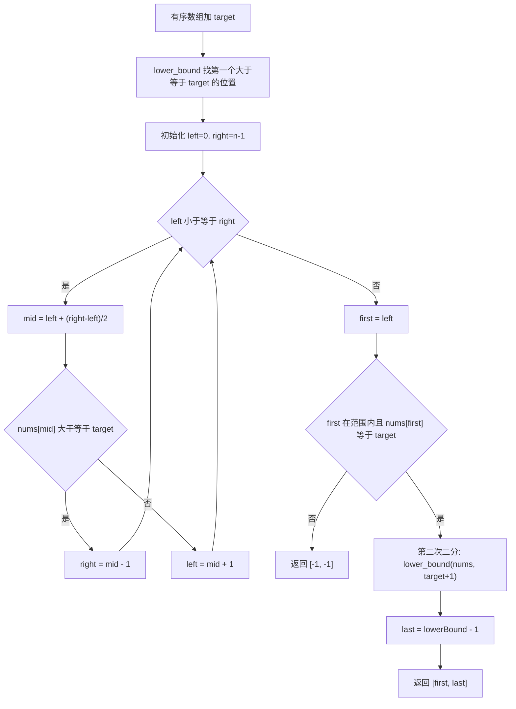
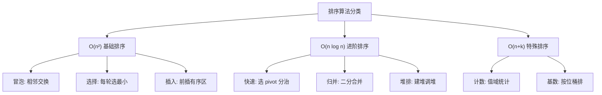
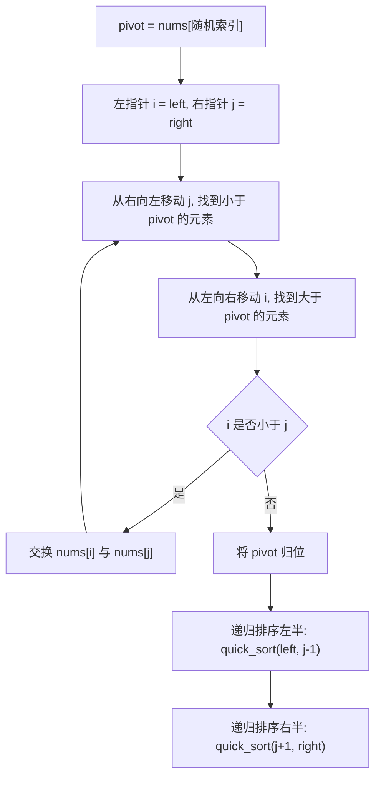
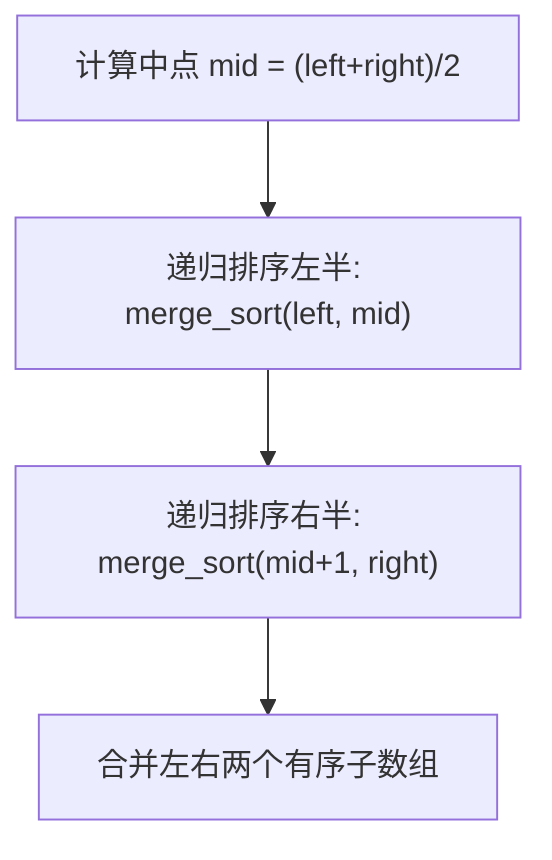
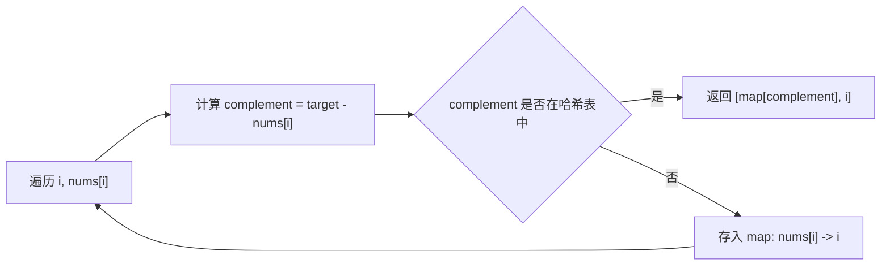

# · 查找与排序

> **涵盖题型：** 二分查找 · 排序算法 · 哈希表

## 一、二分查找

### 🔬 核心原理

二分查找的本质是 **利用有序性，每次排除一半的搜索空间**。它的核心不是"查找某个值"而是 **"查找满足条件的分界点"**。

```text
二分查找三要素：
1. 单调性 —— 搜索空间必须具有单调性质
2. 边界 —— 左闭右开 [L,R) 或 左闭右闭 [L,R]
3. 答案区间 —— 明确答案是 left、right 还是 mid
```

### 📜 背景与起源

二分查找的思想最早可追溯到 **John Mauchly 于 1946 年** 提出（早于第一台通用计算机 ENIAC 的诞生），但第一个 **正确实现** 直到 1960 年代才出现。著名计算机科学家 **Donald Knuth** 曾指出："尽管二分查找的基本思想简单，但写出一个完全正确的二分查找却出奇地困难。"

在《编程珠玑》中，作者 Jon Bentley 让专业程序员手写二分查找，**超过 90% 的人写出了有 bug 的代码**——最常见的错误包括死循环、越界访问以及区间开闭混淆。这一事实有力地说明了：**算法的直观理解与工程实现之间存在着巨大鸿沟**，而这也正是面试中反复考察二分查找的原因所在。

### 💡 破题直觉

**看到「有序数组」「O(log n)」「最小...满足条件」「最大...不超过」→ 二分查找**

```text
什么时候用二分？
1. 显式有序 → 排序数组、旋转数组
2. 隐式单调 → 答案有单调性（如 在 1..max 之间猜答案）
3. "最大值最小化/最小值最大化" 问题
```

**二分查找 10 种变体速查：**

| 变体 | 条件 | 返回值 |
|------|------|--------|
| 标准 | nums[mid] == target | mid |
| 第一个 ≥ target | nums[mid] >= target | left |
| 最后一个 < target | nums[mid] < target → left = mid+1 | left-1 |
| 第一个 > target | nums[mid] > target | left |
| 最后一个 ≤ target | nums[mid] <= target → left = mid+1 | left-1 |
| 第一个 = target | 找第一个 ≥，再验证 | left（需校验） |
| 最后一个 = target | 找最后一个 ≤，再验证 | right（需校验） |
| 旋转数组最小值 | nums[mid] > nums[right] → left=mid+1 | nums[left] |
| 旋转数组找 target | 先找最小值，再在两段中二分 | - |
| 答案二分 | while(left < right) 在值域上二分 | left |

### 🎯 问题域映射

| 适用场景 | 不适用场景 |
|----------|-----------|
| 有序静态数据（排序后不再变化的数组） | 无序数据（无法利用单调性排除） |
| 答案具有单调性的值域二分问题 | 无法定义有序比较的对象（如自定义结构体可能无自然序） |
| 最大化最小值或最小化最大值的判定问题 | 搜索空间非单调（如峰值问题需特殊处理） |
| 在有限比较次数内定位目标 | 数据量极小（n < 4 时线性扫描更优） |

### ⚠️ 边界陷阱

| 陷阱 | 场景 | 对策 |
|------|------|------|
| 死循环 | while(left <= right) | 确保每次循环 left/mid/right 必定有一个变化 |
| mid 计算溢出 | (left+right)/2 | left + (right-left)/2 |
| 区间开闭混淆 | 返回值含义 | 全程用同一套模板，不要混用 |
| 找不到 target | 二分的值不存在 | 先确定返回值是 -1 还是插入位置 |
| 重复元素 | 找第一个/最后一个 | 用 ≥ / ≤ 二分确定边界 |

### ⚙️ 高效实现指南

```text
1. 循环不变量 —— 坚持使用 [left, right) 左闭右开区间，
   确保搜索空间始终包含可能的答案。这一约定比左闭右闭更
   不容易出错，且与 Python 切片习惯一致。

2. mid 防溢出 —— 永远使用 left + (right - left) // 2
   而非 (left + right) // 2。Python 虽不会整数溢出，
   但养成习惯可在迁移到 C++/Java 时避免 bug。

3. mid 取整行为 —— Python 的 // 是向下取整，
   对于 left + (right-left)//2 得到的是 "下中位数"。
   当区间长度为偶数时偏左，不会导致死循环。

4. 统一模板 —— 只记忆 lower_bound（找第一个 ≥ target）
   这一个函数，其他变体通过变换 target 参数推导。
```

### 📈 递进示例

**题目：在排序数组中查找元素的第一个和最后一个位置 (34)**



| 解法 | 时间 | 空间 | 思路 |
|------|-----|------|------|
| 线性扫描 | O(n) | O(1) | 从头到尾扫一遍 |
| 两次二分 | O(log n) | O(1) | 找 first ≥ target，再找 first ≥ target+1 |

### ⚡ 应试策略

```python
# 标准二分模板（找第一个 ≥ target 的位置）
def lower_bound(nums, target):
    left, right = 0, len(nums)
    while left < right:
        mid = left + (right - left) // 2
        if nums[mid] >= target:
            right = mid
        else:
            left = mid + 1
    return left

# 答案二分模板（值域二分）
def can_do(mid):
    # 判断 mid 作为答案是否可行
    pass

left, right = min_val, max_val
while left < right:
    mid = left + (right - left) // 2
    if can_do(mid):
        right = mid   # 找最小可行解
    else:
        left = mid + 1
return left
```

### 🏷️ 常见题型与解题方案

#### ① 经典二分：查找目标值

**题目特征：**
- 有序、无重复的数组，查找 target 是否存在
- 返回 target 的索引或 -1
- 典型题目：[704. 二分查找](https://leetcode.cn/problems/binary-search/)

**解题思路与推导：**

**暴力法 O(n)**：线性扫描，每个元素与 target 比较，最坏情况需遍历整个数组。

**二分法 O(log n)**：利用有序性，每次取中间元素与 target 比较：
- 若 `nums[mid] == target` → 命中，返回 mid
- 若 `nums[mid] < target` → target 在右半区间，`left = mid + 1`
- 若 `nums[mid] > target` → target 在左半区间，`right = mid - 1`

每次搜索空间减半，因此时间复杂度为 O(log n)。

```python
def binary_search(nums: list[int], target: int) -> int:
    """
    经典二分查找（左闭右闭区间）

    参数：
        nums: 升序排列的无重复整数数组
        target: 目标值
    返回：
        target 的索引，不存在返回 -1
    """
    left, right = 0, len(nums) - 1  # 左闭右闭 [left, right]

    while left <= right:  # 区间非空时继续
        mid = left + (right - left) // 2  # 防溢出取中

        if nums[mid] == target:
            return mid          # 命中，直接返回
        elif nums[mid] < target:
            left = mid + 1      # target 在右半
        else:
            right = mid - 1     # target 在左半

    return -1  # 未找到
```

**复杂度分析：**
- 时间复杂度：O(log n) — 每次搜索空间减半
- 空间复杂度：O(1) — 仅用常数变量

#### ② 查找边界：第一个/最后一个等于 target

**题目特征：**
- 有序数组，**存在重复元素**，查找 target 的第一次或最后一次出现位置
- 典型题目：[34. 在排序数组中查找元素的第一个和最后一个位置](https://leetcode.cn/problems/find-first-and-last-position-of-element-in-sorted-array/)

**解题思路与推导：**

**暴力法 O(n)**：线性扫描，记录第一个和最后一个匹配位置。虽然简单，但 n 很大时会超时。

**二分边界 O(log n)**：核心思路是"找到 target 后不立即返回，继续压缩区间"。

- **找左边界（第一个 ≥ target）**：当 `nums[mid] >= target` 时收缩右边界
- **找右边界（第一个 > target）**：找第一个 > target 的位置，然后 -1

这两个操作可以统一为一个 `lower_bound` 函数。

```python
def lower_bound(nums: list[int], target: int) -> int:
    """
    返回第一个 >= target 的位置（左闭右开实现）
    """
    left, right = 0, len(nums)
    while left < right:
        mid = left + (right - left) // 2
        if nums[mid] >= target:
            right = mid       # >= target，收缩右边界
        else:
            left = mid + 1    # < target，收缩左边界
    return left


def search_range(nums: list[int], target: int) -> list[int]:
    """查找 target 的第一个和最后一个位置"""
    first = lower_bound(nums, target)
    # 检查 target 是否存在
    if first == len(nums) or nums[first] != target:
        return [-1, -1]
    # last = 第一个 > target 的位置 - 1
    last = lower_bound(nums, target + 1) - 1
    return [first, last]
```

**复杂度分析：**
- 时间复杂度：O(log n) — 两次二分
- 空间复杂度：O(1)

#### ③ 旋转数组查找

**题目特征：**
- 有序数组在某个未知点旋转（如 `[1,2,3,4,5] → [4,5,1,2,3]`）
- 查找 target 是否存在
- 典型题目：[33. 搜索旋转排序数组](https://leetcode.cn/problems/search-in-rotated-sorted-array/)

**解题思路与推导：**

**暴力法 O(n)**：线性扫描，不利用有序性。

**二分法 O(log n)**：旋转数组的特点是——将数组分成两段，每段内部有序。对于每个 mid：
1. 比较 `nums[mid]` 与 `nums[left]`，判断 mid 落在**左段（较大段）**还是**右段（较小段）**
2. 根据 target 与 `nums[left]`、`nums[mid]` 的关系，决定搜索方向

关键洞察：**nums[left] ≤ nums[mid]** 说明左半段严格有序；否则右半段严格有序。利用这一性质，可以判断 target 在哪一段。

```python
def search_rotated(nums: list[int], target: int) -> int:
    """
    搜索旋转排序数组中的 target

    参数：
        nums: 旋转后的有序数组（元素互不相同）
        target: 目标值
    返回：
        target 的索引，不存在返回 -1
    """
    left, right = 0, len(nums) - 1

    while left <= right:
        mid = left + (right - left) // 2

        if nums[mid] == target:
            return mid

        # 判断 mid 落在左段（较大段）还是右段（较小段）
        if nums[left] <= nums[mid]:
            # mid 在左段（左半部分严格递增）
            if nums[left] <= target < nums[mid]:
                right = mid - 1  # target 在左段中 mid 的左边
            else:
                left = mid + 1   # target 在右段
        else:
            # mid 在右段（右半部分严格递增）
            if nums[mid] < target <= nums[right]:
                left = mid + 1   # target 在右段中 mid 的右边
            else:
                right = mid - 1  # target 在左段

    return -1
```

**复杂度分析：**
- 时间复杂度：O(log n) — 每次排除一半区间
- 空间复杂度：O(1)

**进阶思考（含重复元素）：**
- 当 `nums[left] == nums[mid]` 时无法判断方向，需 `left += 1` 跳过（退化到 O(n)）

#### ④ 搜索插入位置

**题目特征：**
- 有序无重复数组，找到 target 应插入的位置以保持有序性
- 如果 target 存在则返回其索引，否则返回应该插入的位置
- 典型题目：[35. 搜索插入位置](https://leetcode.cn/problems/search-insert-position/)

**解题思路与推导：**

本质就是找**第一个 ≥ target 的位置**，即 `lower_bound` 的直接应用。

```python
def search_insert(nums: list[int], target: int) -> int:
    """
    找到 target 的插入位置

    参数：
        nums: 升序排列的无重复数组
        target: 目标值
    返回：
        插入位置索引（0 到 len(nums)）
    """
    left, right = 0, len(nums)  # 左闭右开

    while left < right:
        mid = left + (right - left) // 2
        if nums[mid] >= target:
            right = mid       # 继续向左搜索
        else:
            left = mid + 1    # 向右搜索

    return left  # left 即为第一个 >= target 的位置
```

**复杂度分析：**
- 时间复杂度：O(log n)
- 空间复杂度：O(1)

#### ⑤ 寻找峰值

**题目特征：**
- 无序数组，相邻元素不等（`nums[i] != nums[i+1]`）
- 峰值定义：`nums[i] > nums[i-1]` 且 `nums[i] > nums[i+1]`（边界处只比较一侧）
- 返回任意一个峰值索引即可
- 典型题目：[162. 寻找峰值](https://leetcode.cn/problems/find-peak-element/)

**解题思路与推导：**

**暴力法 O(n)**：线性扫描，逐个判断是否为峰值。

**二分法 O(log n)**：关键洞察——**往更高的一侧走，一定能找到峰值**。
- 比较 `nums[mid]` 和 `nums[mid+1]`
- 如果 `nums[mid] < nums[mid+1]`：峰值在右侧，`left = mid + 1`
- 否则（`nums[mid] > nums[mid+1]`）：峰值在左侧（含 mid），`right = mid`

为什么可行？因为数组边界外视为 -∞，所以"往上走"的方向一定存在峰值。这本质上是在一个"隐形单调"的空间中搜索。

```python
def find_peak_element(nums: list[int]) -> int:
    """
    寻找峰值元素

    参数：
        nums: 整数数组，相邻元素不等
    返回：
        任意一个峰值的索引
    """
    left, right = 0, len(nums) - 1

    while left < right:
        mid = left + (right - left) // 2

        # 比较 mid 和 mid+1，往较高侧搜索
        if nums[mid] < nums[mid + 1]:
            left = mid + 1    # 峰值在右侧，继续向右
        else:
            right = mid       # 峰值在左侧（含 mid）

    return left  # left == right 时即为峰值
```

**复杂度分析：**
- 时间复杂度：O(log n)
- 空间复杂度：O(1)

#### ⑥ 最大化最小值（二分答案）

**题目特征：**
- 求"可行性"的最优值（最大值的最小值 / 最小值的最大值）
- 答案具有单调性：如果 x 可行，则 > x 或 < x 也一定可行/不可行
- 典型题目：[875. 爱吃香蕉的珂珂](https://leetcode.cn/problems/koko-eating-bananas/)、[410. 分割数组的最大值](https://leetcode.cn/problems/split-array-largest-sum/)

**解题思路与推导：**

**直接搜索 O(n × range)**：在答案值域范围内逐个试探，不可行。

**二分答案 O(log(range) × n)**：
1. 确定答案的值域范围 [left, right]
2. 在值域上做二分，对每个 mid 用 `check(mid)` 判断是否可行
3. 根据 check 结果调整左右边界

核心是设计 `check` 函数，验证 mid 作为答案时是否满足要求。

```python
def min_eating_speed(piles: list[int], h: int) -> int:
    """
    二分答案：在 h 小时内吃完所有香蕉的最小速度

    参数：
        piles: 每堆香蕉数量
        h: 警卫离开的小时数
    返回：
        最小的吃香蕉速度 K
    """
    # check 函数：判断速度 k 是否能在 h 小时内吃完
    def can_finish(k: int) -> bool:
        hours = 0
        for p in piles:
            # 每堆需要 ceil(p / k) 小时
            hours += (p + k - 1) // k
        return hours <= h

    # 值域：[1, max(piles)]，速度至少为 1，最多为最大堆
    left, right = 1, max(piles)

    while left < right:
        mid = left + (right - left) // 2
        if can_finish(mid):
            right = mid   # mid 可行，尝试更小的速度
        else:
            left = mid + 1  # mid 不可行，需要更大的速度

    return left  # 最小可行速度
```

**复杂度分析：**
- 时间复杂度：O(n log M) — n 为数组长度，M 为值域大小
- 空间复杂度：O(1) — 仅用常数空间

**通用二分答案模板：**

```python
def binary_answer(nums, check_func, left, right):
    """
    二分答案通用模板（找最小可行解）

    参数：
        nums: 输入数据
        check_func: 判断 mid 是否可行的函数
        left, right: 答案值域
    返回：
        最小可行值
    """
    while left < right:
        mid = left + (right - left) // 2
        if check_func(mid):
            right = mid   # 找最小可行解
        else:
            left = mid + 1
    return left
```

**题型变体——找最大可行解：**
- 只需修改二分方向：`left = mid`（可行时向右搜索）、`right = mid - 1`（不可行时向左）
- 取中时需用 `mid = (left + right + 1) // 2` 防死循环

## 二、排序算法

### 🔬 核心原理

排序的本质是 **建立元素间全序关系**。八大排序各有所长，面试重点在 **快速排序** 和 **归并排序**（分治思想）以及 **堆排序**（数据结构）。



### 📜 背景与起源

排序算法的历史几乎与计算机本身一样悠久：

- **冒泡排序 / 选择排序 / 插入排序** 起源于 1950 年代 **打孔卡时代**。当时程序员需要反复排序打孔卡以便人工查阅，这些简单直观的算法应运而生。
- **归并排序** 由 **John von Neumann** 于 **1945 年** 在 EDVAC 计算机上首次实现，是第一个现代意义上的 O(n log n) 排序算法。它对后来分治思想的发展产生了深远影响。
- **快速排序** 由 **C. A. R. Hoare** 于 **1962 年** 提出。Hoare 在设计 ALGOL 语言编译器时需要一种高效的排序方法，由此创造了这一至今应用最广泛的排序算法。快排是典型的分治算法，也是许多语言标准库排序函数的底层实现基础（如 C 的 qsort）。
- **希尔排序** 由 **Donald Shell** 于 **1959 年** 发明，是第一个突破 O(n²) 的排序算法，通过引入"间隔"概念改进了插入排序。
- **堆排序** 由 **J. W. J. Williams** 于 **1964 年** 提出，巧妙地利用堆数据结构实现了原地排序。

### 💡 破题直觉

| 排序算法 | 什么时候用 |
|---------|-----------|
| 快速排序 | 通用，in-place，面试最高频 |
| 归并排序 | 需要稳定排序，求逆序对，外部排序 |
| 堆排序 | 需要 O(1) 空间，Top K 问题 |
| 计数排序 | 值域小（如年龄、分数 0-100） |
| 插入排序 | 几乎有序的短数组 |

### 🎯 问题域映射

| 适用场景 | 不适用场景 |
|----------|-----------|
| 可定义全序关系（任何两个元素都能比较大小） | 元素不可比较（如自定义对象无比较器） |
| 需要稳定排序 → 归并排序或插入排序 | 数据规模极大且内存有限时归并排序不可用 |
| 需要原地排序 → 快排或堆排序 | 要求绝对稳定性时快排和堆排不可选 |
| 值域极小的整数排序 → 计数排序 | 值域无限或浮点数时计数排序失效 |
| 几乎有序的数据 → 插入排序 | 完全逆序数据时插入排序退化为 O(n²) |

### ⚠️ 边界陷阱

| 陷阱 | 场景 | 对策 |
|------|------|------|
| 快速排序最坏 O(n²) | 有序数组 + 固定 pivot | 随机选 pivot 或三数取中 |
| 归并空间 O(n) | 原地合并理解 | 用额外数组暂存 |
| 堆排不稳定 | 相同值顺序改变 | 注意是否要求稳定 |
| 计数排序负数 | 值域含负 | 偏移映射到非负索引 |

### ⚙️ 高效实现指南

```text
1. 快排三路分区 —— 当数组中存在大量重复元素时，
   标准两路快排会退化为 O(n²)。三路快排将数组分为
   "小于 pivot | 等于 pivot | 大于 pivot" 三部分，
   让等于 pivot 的区间直接跳过，大幅提升性能。

2. 随机选 pivot —— 每次在 [left, right] 范围内随机
   选择 pivot 索引，可有效避免有序数组导致的退化。
   配合三数取中（取 left, mid, right 的中值）效果更佳。

3. 小数组转插入排序 —— 当子数组长度小于某个阈值
   （通常 16 左右）时，转为插入排序。插入排序在小规模
   数据上常数极小，比继续递归快排更快。这是 C++ STL
   std::sort 的标准优化手段。

4. 归并排序避免频繁分配 —— 预先分配一个全局 tmp 数组
   在合并时复用，避免每次合并都 new 临时数组。
```

### 📈 复杂度对比

| 算法 | 平均 | 最坏 | 最好 | 空间 | 稳定 |
|------|------|------|------|------|------|
| 冒泡 | O(n²) | O(n²) | O(n) | O(1) | ✔ |
| 选择 | O(n²) | O(n²) | O(n²) | O(1) | ✘ |
| 插入 | O(n²) | O(n²) | O(n) | O(1) | ✔ |
| 希尔 | O(n^1.3) | O(n²) | O(n) | O(1) | ✘ |
| **快排** | **O(n log n)** | **O(n²)** | **O(n log n)** | **O(log n)** | **✘** |
| **归并** | **O(n log n)** | **O(n log n)** | **O(n log n)** | **O(n)** | **✔** |
| 堆排 | O(n log n) | O(n log n) | O(n log n) | O(1) | ✘ |
| 计数 | O(n+k) | O(n+k) | O(n+k) | O(k) | ✔ |

**快排分区流程：**



**归并排序流程：**



### ⚡ 应试策略

```python
# 快排（随机 pivot + 三路分区应对大量重复）
import random

def quick_sort(nums, left, right):
    if left >= right:
        return
    # 随机选 pivot
    pivot_idx = random.randint(left, right)
    nums[left], nums[pivot_idx] = nums[pivot_idx], nums[left]

    pivot = nums[left]
    lt = left          # [left+1, lt] < pivot
    gt = right         # [gt, right] > pivot
    i = left + 1
    while i <= gt:
        if nums[i] < pivot:
            nums[lt + 1], nums[i] = nums[i], nums[lt + 1]
            lt += 1
            i += 1
        elif nums[i] > pivot:
            nums[gt], nums[i] = nums[i], nums[gt]
            gt -= 1
        else:
            i += 1
    nums[left], nums[lt] = nums[lt], nums[left]
    quick_sort(nums, left, lt - 1)
    quick_sort(nums, gt + 1, right)


# 归并排序（使用全局 tmp 数组优化）
def merge_sort(nums):
    if len(nums) <= 1:
        return nums
    mid = len(nums) // 2
    left = merge_sort(nums[:mid])
    right = merge_sort(nums[mid:])
    return merge(left, right)


def merge(left, right):
    """双指针合并两个有序数组"""
    i = j = 0
    res = []
    while i < len(left) and j < len(right):
        if left[i] <= right[j]:
            res.append(left[i])
            i += 1
        else:
            res.append(right[j])
            j += 1
    res.extend(left[i:])
    res.extend(right[j:])
    return res
```

### 🏷️ 常见题型与解题方案

#### ① 快速排序：数组排序

**题目特征：**
- 对一个任意数组进行排序
- 要求手写快排实现（面试高频）
- 需要处理大量重复元素的情况
- 典型题目：[912. 排序数组](https://leetcode.cn/problems/sort-an-array/)

**解题思路与推导：**

**标准两路快排的退化问题：**
- 当数组包含大量重复元素时，标准两路快排会让所有等于 pivot 的元素全部偏到一边，导致分区极度不平衡 → O(n²)
- 当数组已有序时，固定选第一个元素做 pivot → O(n²)

**三路快排（Dutch National Flag 分区）：**
将数组分为三个区域：`< pivot`、`== pivot`、`> pivot`，等于 pivot 的区间直接跳过不再递归。

**优化策略链条：**
1. 固定 pivot → 有序数组退化 O(n²)
2. + 随机 pivot → 避免最坏有序情况
3. + 三路分区 → 处理大量重复元素
4. + 小数组转插入排序 → 减少递归开销（工程优化）

```python
import random

def quick_sort(nums: list[int]) -> list[int]:
    """
    三路快排（原地排序，处理重复元素）
    """
    def sort_range(nums: list[int], left: int, right: int) -> None:
        """递归排序 [left, right] 区间"""
        if left >= right:
            return

        # 随机选 pivot，避免有序数组退化
        pivot_idx = random.randint(left, right)
        # 将 pivot 换到最左边
        nums[left], nums[pivot_idx] = nums[pivot_idx], nums[left]
        pivot = nums[left]

        # 三路分区指针
        # lt: [left+1, lt] < pivot
        # i: 当前遍历指针
        # gt: [gt, right] > pivot
        lt, gt = left, right
        i = left + 1

        while i <= gt:
            if nums[i] < pivot:
                # 小于 pivot：交换到小于区
                nums[lt + 1], nums[i] = nums[i], nums[lt + 1]
                lt += 1
                i += 1
            elif nums[i] > pivot:
                # 大于 pivot：交换到大于区
                nums[gt], nums[i] = nums[i], nums[gt]
                gt -= 1   # i 不动，因为换过来的元素还未检查
            else:
                # 等于 pivot：不动，直接跳过
                i += 1

        # 将 pivot 归位到小于区和等于区之间
        nums[left], nums[lt] = nums[lt], nums[left]

        # 递归排序小于区和大于区
        # 等于区 [lt, gt] 已经确定，无需再排序
        sort_range(nums, left, lt - 1)
        sort_range(nums, gt + 1, right)

    sort_range(nums, 0, len(nums) - 1)
    return nums
```

**复杂度分析：**
- 时间复杂度：平均 O(n log n)，最坏 O(n²)（极罕见情况）
- 空间复杂度：O(log n)（递归栈深度）
- 不稳定排序（相等元素可能交换相对顺序）

#### ② 归并排序：排序 + 逆序对

**题目特征：**
- 对数组排序，要求稳定
- **统计数组中逆序对的数量**（i < j 且 nums[i] > nums[j]）
- 外部排序（数据量太大无法加载到内存）
- 典型题目：[剑指 Offer 51. 数组中的逆序对](https://leetcode.cn/problems/shu-zu-zhong-de-ni-xu-dui-lcof/)、[315. 计算右侧小于当前元素的个数](https://leetcode.cn/problems/count-of-smaller-numbers-after-self/)

**解题思路与推导：**

**逆序对 - 暴力法 O(n²)：** 双重遍历枚举所有 (i, j) 对，检查是否满足 `nums[i] > nums[j]`。n=10⁵ 时不可行。

**逆序对 - 归并法 O(n log n)：** 在归并排序的合并过程中，当取右半数组的元素放入结果时，左半数组**剩余的所有元素**都与它构成逆序对。

**核心公式（合并阶段）：**
```text
当 right[j] < left[i] 时：
    逆序对数量 += 左半剩余元素个数 = len(left) - i
```

```python
def count_inversions(nums: list[int]) -> int:
    """
    统计数组中的逆序对数

    参数：
        nums: 整数数组
    返回：
        逆序对总数
    """
    # 辅助数组，避免递归中反复创建
    temp = [0] * len(nums)

    def merge_sort_count(arr: list[int], temp: list[int],
                         left: int, right: int) -> int:
        """归并排序并统计逆序对"""
        if left >= right:
            return 0

        mid = left + (right - left) // 2
        count = 0

        # 分治：分别统计左右两半的逆序对
        count += merge_sort_count(arr, temp, left, mid)
        count += merge_sort_count(arr, temp, mid + 1, right)

        # 合并并统计跨区间的逆序对
        i, j, k = left, mid + 1, left
        while i <= mid and j <= right:
            if arr[i] <= arr[j]:
                temp[k] = arr[i]
                i += 1
            else:
                # arr[j] < arr[i]：arr[i..mid] 都和 arr[j] 构成逆序对
                temp[k] = arr[j]
                count += (mid - i + 1)  # 核心公式
                j += 1
            k += 1

        # 处理剩余元素
        while i <= mid:
            temp[k] = arr[i]
            i += 1
            k += 1
        while j <= right:
            temp[k] = arr[j]
            j += 1
            k += 1

        # 写回原数组
        arr[left:right + 1] = temp[left:right + 1]

        return count

    return merge_sort_count(nums, temp, 0, len(nums) - 1)
```

**使用演示：**
```python
print(count_inversions([7, 5, 6, 4]))  # 输出: 5
# 逆序对: (7,5), (7,6), (7,4), (5,4), (6,4)
```

**复杂度分析：**
- 时间复杂度：O(n log n) — 归并排序的框架
- 空间复杂度：O(n) — 辅助数组
- 稳定排序 ✔

#### ③ 堆排序：TopK 问题

**题目特征：**
- 求数组中第 K 大 / 第 K 小的元素
- 求前 K 大 / 前 K 小的元素（TopK）
- 数据流中的中位数
- 典型题目：[215. 数组中的第K个最大元素](https://leetcode.cn/problems/kth-largest-element-in-an-array/)、[347. 前 K 个高频元素](https://leetcode.cn/problems/top-k-frequent-elements/)

**解题思路与推导：**

**解法链（找第 K 大）：**

| 解法 | 时间复杂度 | 空间 | 说明 |
|------|-----------|------|------|
| 全排序 | O(n log n) | O(1) | 直接排序后取第 K 个 |
| 堆（大小 K） | O(n log K) | O(K) | 小根堆维护最大的 K 个 |
| 快速选择 | O(n) 平均 | O(log n) | 类似快排的 partition |

**堆解法思路：**
- 小根堆（Python 默认最小堆）维护当前最大的 K 个元素
- 遍历数组，加入堆；堆大小 > K 时弹出堆顶（最小的）
- 遍历结束，堆顶即为第 K 大的元素

**快选解法思路（更快但需手写 partition）：**
- 用快排的 partition 确定 pivot 的位置
- 若 pivot 恰好是倒数第 K 个，直接返回
- 否则根据 K 选择只递归一半

```python
import heapq

def find_kth_largest(nums: list[int], k: int) -> int:
    """
    数组中的第 K 个最大元素（堆解法）

    参数：
        nums: 整数数组
        k: 第几大（1-indexed）
    返回：
        第 K 大的元素
    """
    # 小根堆，维护 K 个最大的元素
    min_heap = []

    for num in nums:
        heapq.heappush(min_heap, num)  # 入堆
        if len(min_heap) > k:
            heapq.heappop(min_heap)    # 弹出最小的，保持堆大小为 K

    # 堆顶就是第 K 大的元素
    return min_heap[0]


def find_kth_largest_quickselect(nums: list[int], k: int) -> int:
    """
    数组中的第 K 个最大元素（快速选择解法）
    更优的平均 O(n) 时间复杂度
    """
    # 转换：第 K 大 → 第 (n-K) 小的 index
    target_idx = len(nums) - k

    def partition(left: int, right: int) -> int:
        """标准快排分区，返回 pivot 的最终位置"""
        # 随机选 pivot
        pivot_idx = random.randint(left, right)
        nums[pivot_idx], nums[right] = nums[right], nums[pivot_idx]
        pivot = nums[right]

        # 将所有 <= pivot 的元素移到左边
        store_idx = left
        for i in range(left, right):
            if nums[i] <= pivot:
                nums[store_idx], nums[i] = nums[i], nums[store_idx]
                store_idx += 1

        # pivot 归位
        nums[store_idx], nums[right] = nums[right], nums[store_idx]
        return store_idx

    left, right = 0, len(nums) - 1
    while True:
        pos = partition(left, right)
        if pos == target_idx:
            return nums[pos]
        elif pos < target_idx:
            left = pos + 1    # 在右半继续找
        else:
            right = pos - 1   # 在左半继续找


def top_k_frequent(nums: list[int], k: int) -> list[int]:
    """
    前 K 个高频元素

    参数：
        nums: 整数数组
        k: 返回前 K 个高频元素的数量
    返回：
        前 K 个高频元素列表
    """
# 统计频率
    freq = {}
    for num in nums:
        freq[num] = freq.get(num, 0) + 1

# 用大小为 K 的小根堆，按频率排序
    # 堆中存 (频率, 元素)
    heap = []
    for num, count in freq.items():
        heapq.heappush(heap, (count, num))
        if len(heap) > k:
            heapq.heappop(heap)

# 提取结果（堆中的元素即为前 K 高频）
    return [num for _, num in heap]
```

**复杂度分析：**
- **堆解法：** O(n log K) 时间，O(K) 空间
- **快选解法：** 平均 O(n) 时间，最坏 O(n²)，O(log n) 栈空间
- **TopK 频率（含统计频率）：** O(n log K) 时间，O(n + K) 空间

**什么时候用堆 vs 快选？**
- **堆：** 数据量极大（n 很大但 K 很小），或需要处理数据流（在线算法）
- **快选：** 数据一次性给出，追求理论最优 O(n)，面试时要求手写

#### ④ 桶排序：出现频率

**题目特征：**
- 按元素出现频率排序
- 找出出现频率最高/最低的 K 个元素
- 要求 O(n) 或接近 O(n) 的时间
- 典型题目：[347. 前 K 个高频元素](https://leetcode.cn/problems/top-k-frequent-elements/)（桶排序解法）、[451. 根据字符出现频率排序](https://leetcode.cn/problems/sort-characters-by-frequency/)

**解题思路与推导：**

**解法链（按频率排序）：**

| 解法 | 时间复杂度 | 空间 | 说明 |
|------|-----------|------|------|
| HashMap + 排序 | O(n log n) | O(n) | 统计后直接排序 |
| HashMap + 桶 | **O(n)** | O(n) | 桶的下标 = 频率 |

**桶排序的核心思想：**
- 先统计每个元素的频率
- 桶的**下标表示频率**（1 到 n），桶中的内容是该频率对应的所有元素
- 按频率从高到低遍历桶，收集结果

为什么是 O(n)？因为桶的数量是确定的（最大频率 ≤ n），遍历 HashMap 和桶各一次。

```python
def top_k_frequent_bucket(nums: list[int], k: int) -> list[int]:
    """
    前 K 个高频元素（桶排序解法）

    思路：桶的下标 = 频率，值 = 该频率的所有元素
    遍历桶即可按频率排序

    参数：
        nums: 整数数组
        k: 返回前 K 个高频元素的数量
    返回：
        前 K 个高频元素列表
    """
# 统计频率
    freq = {}
    for num in nums:
        freq[num] = freq.get(num, 0) + 1

# 创建桶，下标为频率
    # 频率范围：1 到 n（最多 n 次），所以桶大小为 n+1
    n = len(nums)
    buckets = [[] for _ in range(n + 1)]

    for num, count in freq.items():
        buckets[count].append(num)

# 从高到低遍历桶，收集结果
    result = []
    for count in range(n, 0, -1):   # 从最大频率开始
        for num in buckets[count]:
            result.append(num)
            if len(result) == k:
                return result

    return result


def frequency_sort(s: str) -> str:
    """
    根据字符出现频率排序

    参数：
        s: 输入字符串
    返回：
        按频率降序排列后的字符串
    """
# 统计字符频率
    freq = {}
    for ch in s:
        freq[ch] = freq.get(ch, 0) + 1

# 桶排序（下标 = 频率）
    max_freq = max(freq.values())
    buckets = [[] for _ in range(max_freq + 1)]
    for ch, count in freq.items():
        buckets[count].append(ch)

# 从高到低拼接结果
    result = []
    for count in range(max_freq, 0, -1):
        for ch in buckets[count]:
            result.append(ch * count)  # 重复字符 count 次

    return ''.join(result)
```

**复杂度分析：**
- 时间复杂度：**O(n)** — 统计 O(n) + 入桶 O(n) + 遍历桶 O(n)
- 空间复杂度：O(n) — 哈希表 + 桶数组

**何时用桶排序代替堆？**
- 追求理论最优 O(n) 时间复杂度
- k 接近 n 时堆的 O(n log k) ≈ O(n log n)，退化明显
- 面试中展示"我知道桶排序" → 加分项

#### ⑤ 排序数组的奇偶分割 / 按颜色分类

**题目特征：**
- 按某种规则将数组分成多个区域
- 每个区域内元素满足特定条件
- 要求**原地**、**一次遍历**
- 典型题目：[75. 颜色分类](https://leetcode.cn/problems/sort-colors/)（三指针）、[905. 按奇偶排序数组](https://leetcode.cn/problems/sort-array-by-parity/)

**解题思路与推导：**

**双指针法（奇偶分割 / 二分法）：**
- 左指针找不符合条件的元素
- 右指针找符合条件的元素
- 交换两者直到指针相遇

**三指针法（三色分类 / Dutch National Flag）：**
- 0 区指针（red）、当前遍历指针（white）、2 区指针（blue）
- 处理三个值 {0, 1, 2} 的分区
- 本质是快排三路分区的特例（pivot = 1）

```python
def sort_array_by_parity(nums: list[int]) -> list[int]:
    """
    按奇偶排序数组（双指针）

    将偶数放在前半部分，奇数放在后半部分
    """
    left, right = 0, len(nums) - 1

    while left < right:
        # 左指针找奇数
        while left < right and nums[left] % 2 == 0:
            left += 1
        # 右指针找偶数
        while left < right and nums[right] % 2 == 1:
            right -= 1

        # 交换
        if left < right:
            nums[left], nums[right] = nums[right], nums[left]
            left += 1
            right -= 1

    return nums


def sort_colors(nums: list[int]) -> None:
    """
    颜色分类（荷兰国旗问题）

    将数组分成三段：0（红色）、1（白色）、2（蓝色）
    使用三指针，原地一次遍历

    参数：
        nums: 包含 0、1、2 的数组（原地修改）
    """
    # 三指针：
    # p0: 0 区右边界（[0, p0) 全是 0）
    # p2: 2 区左边界（(p2, n-1] 全是 2）
    # i: 当前遍历指针
    p0, i, p2 = 0, 0, len(nums) - 1

    while i <= p2:
        if nums[i] == 0:
            # 遇到 0：交换到 0 区
            nums[p0], nums[i] = nums[i], nums[p0]
            p0 += 1
            i += 1   # 换过来的一定是 1（因为 2 已被处理），直接推进
        elif nums[i] == 2:
            # 遇到 2：交换到 2 区
            nums[p2], nums[i] = nums[i], nums[p2]
            p2 -= 1   # i 不动，因为换过来的可能是 0
        else:
            # 遇到 1：直接跳过
            i += 1
```

**复杂度分析：**
- **奇偶分割：** O(n) 时间，O(1) 空间
- **颜色分类：** O(n) 时间，O(1) 空间，一次遍历

**与快排分区的关系：**
- 双指针奇偶分割 ≈ 快排两路分区
- 三指针颜色分类 ≈ 快排三路分区（pivot = 1）

## 三、哈希表

### 🔬 核心原理

哈希表（Hash Table）将查询的 **比较查找** 转化为 **直接寻址**，平均 O(1) 的查询时间，用空间换时间。

| 组件 | 说明 |
|------|------|
| **哈希函数** | key → 索引映射，要求均匀分布 |
| **冲突解决** | 链地址法（常用）/ 开放定址法 |
| **负载因子** | 元素/桶数，> 阈值时扩容重哈希 |

### 📜 背景与起源

哈希表的概念由 **Peter Luhn** 于 **1953 年** 发明，最初用于 **信息检索系统** 中的快速关键词匹配。Luhn 还因发明了 **TF-IDF** 和 **自动摘要** 等方法，被誉为"信息检索之父"。

- 1955 年，IBM 的 **H. P. Luhn**（与 Peter Luhn 为同一人）首次正式提出哈希思想。
- 1957 年，**Arnold Dumey** 出版了第一本讨论哈希的书籍，定义了现代哈希表的许多基础概念。
- 1968 年，**Robert Morris** 在 CACM 上发表论文，系统总结了链地址法和开放定址法，奠定了冲突解决的两种主流方向。
- Python 的字典（dict）是哈希表在工业界最成功的实现之一，其设计融合了 **随机探测**、**牺牲空间换速度** 和 **动态扩容** 等精妙策略。

### 💡 破题直觉

**看到「O(1) 查询」「统计频率」「去重」「映射」「缓存」→ 哈希表**

**在算法中的经典角色：**

| 角色 | 场景 | 说明 |
|------|------|------|
| 查表 | 两数之和 | 遍历时把 target - nums[i] 存入表 |
| 计数 | 众数、字母异位词 | 统计每个元素/字符出现次数 |
| 去重 | 无重复子串 | Set 维护窗口内字符 |
| 缓存 | 复杂中间结果 | 记忆化搜索的基础 |
| 索引 | 最长连续序列 | 用 Set 快速判断值是否存在 |

### 🎯 问题域映射

| 适用场景 | 不适用场景 |
|----------|-----------|
| 需要快速查找、插入、删除（平均 O(1)） | 需要有序遍历或范围查询（用平衡树） |
| 统计频率、去重、缓存等经典场景 | 大量冲突风险高时（如恶意构造的哈希碰撞攻击） |
| key 值分布较均匀 | 内存极度受限的场景（哈希表有额外开销） |
| 无需关心元素顺序 | 需要稳定的迭代顺序（用 OrderedDict 或 LinkedHashMap） |

### ⚠️ 边界陷阱

| 陷阱 | 场景 | 对策 |
|------|------|------|
| 哈希碰撞 | 大量冲突导致退化到 O(n) | 自定义 hashCode |
| 遍历时修改 | 遍历 map 过程中增删元素 | 用 iterator 的 remove 或先收集 key 再处理 |
| 自定义 key | 对象作为 key 时 hashCode 和 equals | 用不可变对象或字符串化 |
| 未显式指定初始容量 | 频繁扩容耗时 | 预计 size 后指定 initialCapacity |

### ⚙️ 高效实现指南

```text
1. 预先指定容量 —— 如果预知数据量，在构建 HashMap 时
   指定 initialCapacity，避免频繁扩容和 rehash。
   Python dict 虽无法直接指定，但可预填充占位元素来触发扩容。

2. 容量为 2 的幂 —— 当容量为 2 的幂时，取模运算
   hash % capacity 可优化为 hash & (capacity - 1)，
   位运算比除法快一个数量级。JDK 的 HashMap 强制容量为 2 的幂。

3. 避免使用可变对象作为 key —— 如果 key 的 hashCode 会变，
   将永远无法从哈希表中找到它。用不可变对象（字符串、整数、
   元组）或对可变对象做不可变包装。

4. 选择正确的冲突解决策略 —— Python dict 和 Java HashMap
   使用链地址法（拉链法），适合读多写少；开放定址法适合
   缓存友好场景，但删除操作复杂。不要自己实现哈希表。

5. 哈希函数的均匀性 —— 如果自定义 hashCode，确保均匀分布。
   简单的做法是将对象的多个字段组合成整数并乘以大质数：
   result = 31 * result + field1.hashCode()
```

### 📈 递进示例

**题目：两数之和 (1)**

| 解法 | 时间 | 空间 | 思路 |
|------|-----|------|------|
| 暴力 | O(n²) | O(1) | 双重遍历 |
| 哈希 | O(n) | O(n) | 边遍历边查表 |



### ⚡ 应试策略

```text
两数之和 → 哈希表（用空间换时间）
字母异位词 → 排序后作为 key 或计数后比较
最长连续序列 → Set 加只从连续序列起点开始找
频率相关 → HashMap 统计
```

### 🏷️ 常见题型与解题方案

#### ① 两数之和

**题目特征：**
- 无序整数数组，找到两个数的下标使得它们的和等于 target
- 每个输入只对应一个答案，且不重复使用同一元素
- 扩展题型：三数之和、四数之和
- 典型题目：[1. 两数之和](https://leetcode.cn/problems/two-sum/)

**解题思路与推导：**

**暴力法 O(n²)：** 双重遍历穷举所有组合，检查是否和为 target。n=10⁵ 时不可行。

**哈希法 O(n)：** 遍历数组时，用哈希表记录已访问元素的值→索引映射。对每个 `nums[i]`，检查 `target - nums[i]` 是否已在哈希表中。如果在，直接返回两个索引。

**为什么不先排序再用双指针？** 因为题目要求返回原始索引（不是值），排序会破坏索引信息。如果只需判断是否存在，排序后双指针是可行的替代方案。

```python
def two_sum(nums: list[int], target: int) -> list[int]:
    """
    两数之和

    参数：
        nums: 整数数组
        target: 目标和
    返回：
        两个数的索引 [i, j]，使得 nums[i] + nums[j] == target
    """
    # 哈希表：val -> index
    seen = {}  # key: 元素值, value: 索引

    for i, num in enumerate(nums):
        complement = target - num

        # 检查 complement 是否已在表中
        if complement in seen:
            return [seen[complement], i]

        # 将当前元素存入哈希表
        seen[num] = i

    return []  # 理论上不会走到这里（题目保证有解）
```

**复杂度分析：**
- 时间复杂度：O(n) — 一次遍历
- 空间复杂度：O(n) — 哈希表最多存储 n 个元素

**进阶：三数之和（15. 3Sum）**
```python
def three_sum(nums: list[int]) -> list[list[int]]:
    """
    三数之和：找出所有和为 0 的三元组（不重复）

    思路：排序 + 双指针，固定一个数后，用双指针找两数之和
    """
    nums.sort()
    n = len(nums)
    result = []

    for i in range(n - 2):
        # 跳过重复的固定元素
        if i > 0 and nums[i] == nums[i - 1]:
            continue

        left, right = i + 1, n - 1
        target = -nums[i]  # 需要找到两个数的和为 -nums[i]

        while left < right:
            s = nums[left] + nums[right]
            if s == target:
                result.append([nums[i], nums[left], nums[right]])
                # 跳过重复
                while left < right and nums[left] == nums[left + 1]:
                    left += 1
                while left < right and nums[right] == nums[right - 1]:
                    right -= 1
                left += 1
                right -= 1
            elif s < target:
                left += 1
            else:
                right -= 1

    return result
```

#### ② 最长连续序列

**题目特征：**
- 未排序的整数数组，找出数字连续的最长序列的长度
- 要求算法时间复杂度为 O(n)
- 典型题目：[128. 最长连续序列](https://leetcode.cn/problems/longest-consecutive-sequence/)

**解题思路与推导：**

**排序法 O(n log n)：** 先排序，然后遍历找连续段。简单但达不到 O(n) 要求。

**哈希集法 O(n)：** 两个关键洞察：
1. 用 Set 去重，实现 O(1) 的成员判断
2. **只从连续序列的最小值开始数**——如果 `num - 1` 存在，说明当前 num 不是连续序列的起点，跳过

为什么只从最小值开始？这样每个连续序列只被统计一次，整体 O(n)。

```python
def longest_consecutive(nums: list[int]) -> int:
    """
    最长连续序列

    参数：
        nums: 未排序的整数数组
    返回：
        最长连续序列的长度
    """
# 去重，构建 O(1) 查找表
    num_set = set(nums)
    max_len = 0

    for num in num_set:
# 核心优化：只从连续序列的最小值开始找
        if num - 1 not in num_set:   # 是序列起点
            current = num
            length = 1

# 向大方向查找连续值
            while current + 1 in num_set:
                current += 1
                length += 1

# 更新最大长度
            max_len = max(max_len, length)

    return max_len
```

**复杂度分析：**
- 时间复杂度：**O(n)** — 每个元素最多被访问两次（外层循环一次，while 循环一次）
- 空间复杂度：O(n) — 哈希集存储所有元素

**推导过程：**
```text
输入: [100, 4, 200, 1, 3, 2]
Set: {100, 4, 200, 1, 3, 2}

遍历 num=100:  100-1=99 不在 set → 起点，100+1=101 不在 → len=1
遍历 num=4:    4-1=3 在 set → 不是起点，跳过
遍历 num=200:  200-1=199 不在 set → 起点，200+1=201 不在 → len=1
遍历 num=1:    1-1=0 不在 set → 起点，1→2→3→4 都有 → len=4 ✅
遍历 num=3:    3-1=2 在 set → 跳过
遍历 num=2:    2-1=1 在 set → 跳过

结果: 4
```

#### ③ 字母异位词分组

**题目特征：**
- 给定一组字符串，将字母异位词（相同字母组成，排列不同）分到同一组
- 输出的分组顺序不限，组内顺序不限
- 典型题目：[49. 字母异位词分组](https://leetcode.cn/problems/group-anagrams/)

**解题思路与推导：**

**核心观察：** 两个字符串是字母异位词 ⇔ 排序后结果相同

**解法一（排序 key）：** 每个字符串排序后作为哈希表的 key，value 为原字符串列表。

**解法二（计数 key）：** 用每个字母的计数元组作为 key（如 `(1,0,0,0,1,0,0,0,0,0,...)`）。更适合频繁做字母异位词判断的场景。

**推导：** 暴力法对每对字符串比较（O(k)），共 O(n² × k) → 哈希分组 O(n × k log k)

```python
from collections import defaultdict

def group_anagrams(strs: list[str]) -> list[list[str]]:
    """
    字母异位词分组（排序 key 法）

    参数：
        strs: 字符串数组
    返回：
        分组结果，每组内的字符串互为字母异位词
    """
    # key: 排序后的字符串
    # value: 原字符串列表
    groups = defaultdict(list)

    for s in strs:
        # 将字符串排序后作为 key
        sorted_s = ''.join(sorted(s))
        groups[sorted_s].append(s)

    return list(groups.values())


def group_anagrams_count_key(strs: list[str]) -> list[list[str]]:
    """
    字母异位词分组（计数 key 法）

    对于长字符串场景更高效，避免排序的 O(k log k) 开销
    """
    groups = defaultdict(list)

    for s in strs:
        # 统计每个字母的出现次数作为 key
        count = [0] * 26  # 仅含小写字母
        for ch in s:
            count[ord(ch) - ord('a')] += 1
        # 用元组作为 key（列表不可哈希）
        key = tuple(count)
        groups[key].append(s)

    return list(groups.values())
```

**复杂度分析：**
- **排序 key 法：** O(n × k log k) 时间，O(n × k) 空间（k = 字符串平均长度）
- **计数 key 法：** O(n × k) 时间，O(n × k) 空间
- 实际面试中排序法更常用（代码简洁易写）

#### ④ 重复元素 / 重复元素 II

**题目特征：**
- 判断数组中是否存在重复元素
- 扩展：是否存在间距 ≤ k 的重复元素（滑动窗口 + 哈希）
- 典型题目：[217. 存在重复元素](https://leetcode.cn/problems/contains-duplicate/)、[219. 存在重复元素 II](https://leetcode.cn/problems/contains-duplicate-ii/)

**解题思路与推导：**

**基础题型（217）：Set 去重**
遍历数组，用 Set 记录已访问元素，若当前元素已在 Set 中 → 返回 true。

**进阶题型（219）：滑动窗口 + Set**
- 维护一个大小为 k 的滑动窗口
- 窗口内使用 Set 检查重复
- 窗口滑动时移除最左边的元素

```python
def contains_duplicate(nums: list[int]) -> bool:
    """
    存在重复元素

    参数：
        nums: 整数数组
    返回：
        是否存在至少两个相同的元素
    """
    seen = set()
    for num in nums:
        if num in seen:
            return True
        seen.add(num)
    return False


def contains_nearby_duplicate(nums: list[int], k: int) -> bool:
    """
    存在重复元素 II：是否存在间距 ≤ k 的重复元素

    参数：
        nums: 整数数组
        k: 最大间距
    返回：
        是否存在两个相同元素且下标差 ≤ k
    """
    # 滑动窗口 + Set
    # 窗口维护最近 k 个元素
    window = set()

    for i, num in enumerate(nums):
        # 检查当前元素是否在窗口中
        if num in window:
            return True

        # 将当前元素加入窗口
        window.add(num)

        # 窗口大小超过 k 时，移除最左元素
        if len(window) > k:
            window.remove(nums[i - k])

    return False


def contains_nearby_duplicate_map(nums: list[int], k: int) -> bool:
    """
    存在重复元素 II（Map 解法）

    用哈希表记录每个元素最后出现的下标
    遍历时检查下标差 ≤ k
    """
    last_index = {}  # val -> 最近一次出现的下标

    for i, num in enumerate(nums):
        if num in last_index and i - last_index[num] <= k:
            return True
        last_index[num] = i  # 更新最近下标

    return False
```

**复杂度分析：**
- **217（基础）：** O(n) 时间，O(n) 空间
- **219（Map 解法）：** O(n) 时间，O(n) 空间
- **219（滑动窗口解法）：** O(n) 时间，O(k) 空间（窗口大小）

**两种 219 解法对比：**
| 解法 | 空间 | 优点 |
|------|------|------|
| Map | O(n) | 判断间距 ≤ k 更直观 |
| 滑动窗口 Set | O(k) | 空间更优，适合 k 远小于 n 的场景 |

## 面试速查表

| 技巧 | 时间复杂度 | 空间复杂度 | 面试频度 |
|------|-----------|-----------|---------|
| 二分查找 | O(log n) | O(1) | ⭐⭐⭐⭐⭐ |
| 快排（手写） | O(n log n) | O(log n) | ⭐⭐⭐⭐⭐ |
| 归并排序 | O(n log n) | O(n) | ⭐⭐⭐⭐ |
| 哈希表排查 | O(n) | O(n) | ⭐⭐⭐⭐⭐ |
| 排序衍生（求逆序对） | O(n log n) | O(n) | ⭐⭐⭐ |
