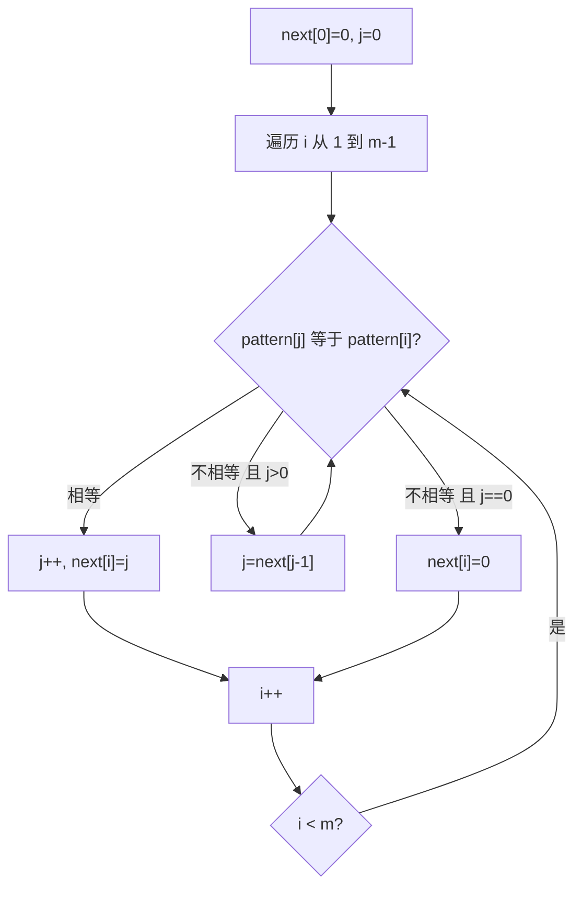
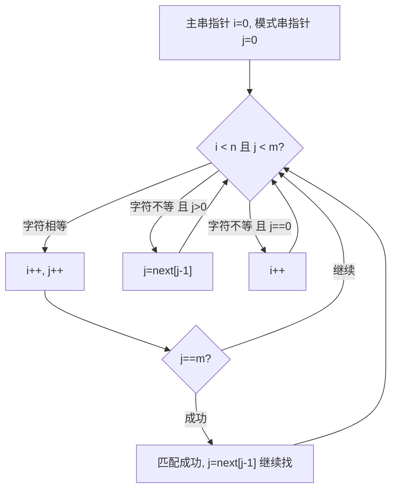
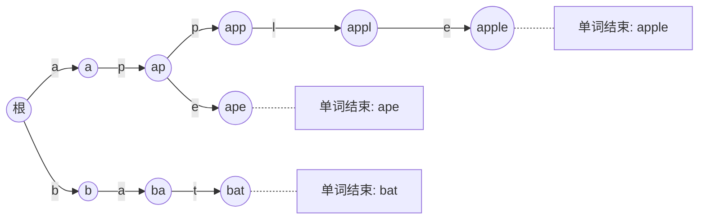
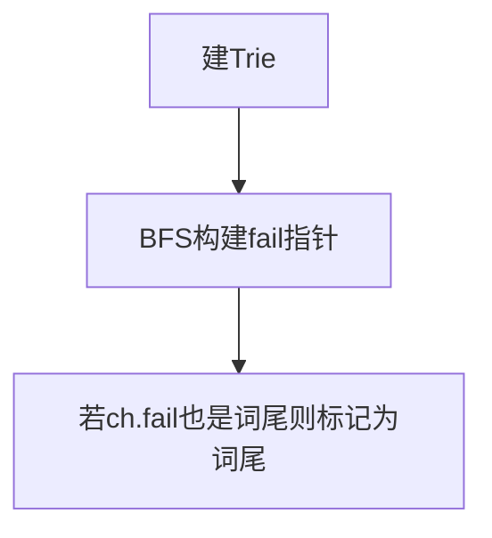
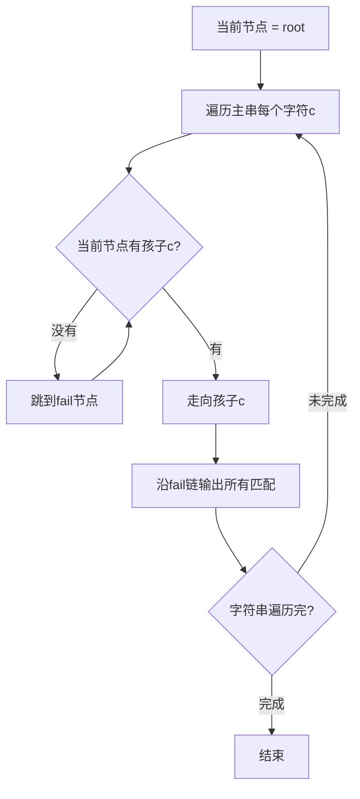

# · 字符串与匹配算法

> **涵盖题型：** 字符串基础 · KMP · Trie（字典树）· AC 自动机

## 一、字符串基础操作

### 🔬 核心原理

字符串是 **字符数组**，但不可变性的限制和模式匹配需求使其自成题型体系。

| 操作 | 本质 | 技巧 |
|------|------|------|
| 子串判断 | 模式匹配 | 双指针 / 哈希 |
| 回文 | 对称检查 | 中心扩展 / DP |
| 子序列 | 顺序保持 | 双指针 / LCS DP |
| 编辑距离 | 最小操作次数 | DP 状态转移 |
| 字符串哈希 | O(1) 子串比较 | 前缀哈希 |

### 💡 破题直觉

**回文 → 中心扩展法（O(n²) → O(n) Manacher）**
**子串匹配 → KMP / RK 哈希**
**前缀匹配 → Trie**
**多模式匹配 → AC 自动机**

### ⚠️ 边界陷阱

| 陷阱 | 场景 | 对策 |
|------|------|------|
| 空字符串 | "" | 单独处理 |
| 大小写 | 是否区分大小写 | 统一 toLowerCase 或按题目要求 |
| 空格/标点 | 是否忽略 | 明确题目要求后过滤 |
| 子串越界 | i + len > s.length() | 循环条件加长度校验 |
| UNICODE 字符 | char 不够用 | 用 code points |

### ⚡ 面试速查

```python
# 子串查询（暴力勿用，面试至少写 RK 或 KMP）
# 字符串哈希 → 用于快速比较子串
# 中心扩展 → 回文最简形式
def expand(s, l, r):
    while l >= 0 and r < len(s) and s[l] == s[r]:
        l -= 1; r += 1
    return s[l+1:r]
```

## 二、背景与起源

> 了解算法诞生背景有助于理解其设计动机和适用边界。

### KMP 算法

由 **Donald Knuth、Vaughan Pratt** 和 **James H. Morris** 于 1977 年共同提出。核心贡献在于解决了字符串模式匹配中**主串指针回溯**问题。在 KMP 之前，暴力匹配在主串指针失配时需要回退，导致最坏 O(n*m) 时间复杂度。KMP 通过 **前缀函数**（prefix function）预处理模式串的自身结构，让主串指针始终向前，达到 O(n+m) 的线性时间。

### Trie（字典树）

名称来源于 **retrieval**（检索）的中间三个字母，由 **Ed Fredkin** 于 1960 年命名。是一棵多叉树，用 **边表示字符、节点表示前缀**，共享公共前缀的字符串共用同一条路径。最早应用于字典自动补全系统，是信息检索领域的核心数据结构。

### AC 自动机

由 **Alfred Aho** 和 **Margaret Corasick** 于 1975 年提出，经典的多模式匹配算法。它将 KMP 的失配思想应用于 Trie 上，通过 **fail 指针** 实现多个模式串的并行匹配。该算法最著名的落地案例是 Unix 的 `fgrep` 命令，其单次扫描找出文本中所有目标模式串，时间复杂度为 O(n + ΣL)。

## 三、KMP 算法

### 🔬 核心原理

KMP 的精髓在于 **利用已匹配部分的信息避免回溯主串指针**，通过预处理模式串构建 **next 数组**（也称为 fail 数组 / 部分匹配表）。

```text
next[i] = 模式串 [0..i] 的最长相等前后缀长度
```

匹配过程中，主串指针永不后退，模式串根据 next 数组跳跃。

将 KMP 的流程拆分为两个独立阶段：

**阶段一：构建 next 数组**



**阶段二：KMP 匹配过程**



### 💡 破题直觉

**看到「在主串中找子串」「O(n+m) 时间」→ KMP**

但面试中 KMP 不常考手写，更常考思想：**利用前缀函数避免重复匹配**。

### ⚠️ 边界陷阱

| 陷阱 | 场景 | 对策 |
|------|------|------|
| next 数组含义混淆 | 求最大公共前后缀 | 背熟是"前面字符的前后缀长度"，不是当前字符 |
| 匹配成功后继续 | 需要所有匹配位置 | j = next[j-1] 继续 |
| 模式串比主串长 | 不可能匹配 | 提前判断返回 |

### ⚙️ 高效实现指南

- **next 数组构建是核心**：理解 `i`（后缀末尾）和 `j`（前缀末尾）的双指针含义。`i` 从 1 开始不断右移，`j` 根据已匹配的前后缀信息跳跃。
- **匹配成功后的延续**：找到一次匹配后，通过 `j = next[j-1]` 让模式串回退到已匹配的最长前后缀位置，继续扫描剩余主串，从而找到所有匹配位置。
- **优化点**：next 数组可以进一步优化为 nextval（禁止 `pattern[j] == pattern[next[j]]` 的无效跳转），但面试中先写出标准版本。

### ⚡ 应试策略

```python
# 构建 next 数组（面试最高频考点）
def build_next(pattern):
    m = len(pattern)
    next_arr = [0] * m
    j = 0
    for i in range(1, m):
        while j > 0 and pattern[i] != pattern[j]:
            j = next_arr[j-1]
        if pattern[i] == pattern[j]:
            j += 1
            next_arr[i] = j
    return next_arr

# KMP 匹配
def kmp(text, pattern):
    if not pattern: return 0
    n, m = len(text), len(pattern)
    next_arr = build_next(pattern)
    j = 0
    for i in range(n):
        while j > 0 and text[i] != pattern[j]:
            j = next_arr[j-1]
        if text[i] == pattern[j]:
            j += 1
        if j == m:
            return i - m + 1  # 找到即返回
    return -1
```

### 🏷️ 常见题型与解题方案

#### ① 实现 strStr() / 在文本中找模式串

**题目特征：**
- 给定文本串 `text` 和模式串 `pattern`
- 在 `text` 中查找 `pattern` 第一次出现的位置
- 若不存在返回 `-1`（LeetCode 28）

**解题思路：**
暴力法每次失配时主串指针回退到 `i - j + 1`，模式串指针归零，最坏 O(n×m)。KMP 通过 next 数组利用"已匹配部分"的信息，主串指针永不回退，达到 O(n+m)。

**推导过程（暴力 → 最优）：**

暴力匹配：
```text
text:    a b a b c a b a b d
         ^i (从0开始)
pattern: a b a b d
         ^j (从0开始)
```
第 4 位失配时，暴力法将 i 回退到 1，j 归零，重新比较。而 KMP 知道前面 `aba` 已经是匹配的，其最长公共前后缀长度为 1（前缀 `a` = 后缀 `a`），所以保持 i 不动，将 j 跳到 next[j-1] = next[2] = 1，继续从 pattern[1] = 'b' 开始。

**完整 Python 代码：**

```python
def strStr(text: str, pattern: str) -> int:
    """在 text 中查找 pattern 第一次出现的位置"""
    if not pattern:
        return 0

    # ---------- 1. 构建 next 数组 ----------
    # i: 后缀末尾指针（当前处理的字符）
    # j: 前缀末尾指针（已匹配的前缀长度）
    m = len(pattern)
    nxt = [0] * m
    j = 0
    for i in range(1, m):
        # 当字符不匹配时，j 跳到前一个位置的 next 值
        while j > 0 and pattern[i] != pattern[j]:
            j = nxt[j - 1]
        # 字符匹配，j 前进
        if pattern[i] == pattern[j]:
            j += 1
            nxt[i] = j
        # 注意：当 j == 0 且 pattern[i] != pattern[0] 时，
        # nxt[i] 保持为 0，不需要显式赋值

    # ---------- 2. 匹配 ----------
    j = 0
    for i in range(len(text)):
        # 失配时利用 next 数组跳跃
        while j > 0 and text[i] != pattern[j]:
            j = nxt[j - 1]
        if text[i] == pattern[j]:
            j += 1
        if j == m:
            return i - m + 1  # 返回起始位置
    return -1
```

**复杂度分析：**
- 时间复杂度：O(n + m)，n 为 text 长度，m 为 pattern 长度。每个字符最多被比较常数次。
- 空间复杂度：O(m)，用于存储 next 数组。

#### ② 最短回文串（在头部添加最少字符使其回文）

**题目特征：**
- 给定一个字符串 `s`
- 只能在字符串 **前面** 添加字符
- 求得到回文串所需添加的 **最少字符数**
- 返回添加后的最短回文串（LeetCode 214）

**解题思路：**
核心是找到 `s` 的 **最长回文前缀**（从开头开始的最长回文子串），然后将剩余部分反转后拼到前面。

KMP 解法：构造 `s + '#' + reverse(s)`，用 KMP 的 next 数组求该新串的 **最长公共前后缀**。这个长度就是原串中最长回文前缀的长度。

**推导过程：**
```text
原串 s = "abcbabcab"
最长回文前缀: "abcba"（长度 5）
剩余部分: "bcab"
答案: reverse("bcab") + s = "bacb" + "abcbabcab" = "bacbabcbabcab"
```

用 KMP 构造 `s + '#' + rev(s)` 求 next：
```text
组合串: a b c b a b c a b # b a c b a b c b a
                                         ↑ next[m-1] = 5 → 最长回文前缀长度
```

**完整 Python 代码：**

```python
def shortest_palindrome(s: str) -> str:
    """在字符串前面添加最少字符使其成为回文串"""
    if not s:
        return ""

    # 构造模式串: s + '#' + reverse(s)
    rev = s[::-1]
    combined = s + '#' + rev
    m = len(combined)

    # 构建 next 数组
    nxt = [0] * m
    j = 0
    for i in range(1, m):
        while j > 0 and combined[i] != combined[j]:
            j = nxt[j - 1]
        if combined[i] == combined[j]:
            j += 1
            nxt[i] = j

    # nxt[-1] 是 s 的最长回文前缀长度
    longest_pal_prefix_len = nxt[-1]

    # 需要添加的是剩余部分的反转
    suffix = s[longest_pal_prefix_len:]  # 不是回文前缀的部分
    return suffix[::-1] + s  # 反转后拼到前面


# ========== 另一种易懂的思路：双指针 + 递归 ==========
def shortest_palindrome_two_pointer(s: str) -> str:
    """双指针找最长回文前缀，递归构造"""
    n = len(s)
    # 找到第一个使 s[:i] 是回文的最大 i
    i = 0
    for j in range(n - 1, -1, -1):
        if s[i] == s[j]:
            i += 1
    # 如果整个串已经是回文
    if i == n:
        return s
    # 剩余部分反转 + 递归处理前缀
    suffix = s[i:]
    return suffix[::-1] + shortest_palindrome_two_pointer(s[:i]) + suffix
```

**复杂度分析：**
- 时间复杂度：O(n)，KMP 构建 next 数组线性时间
- 空间复杂度：O(n)，存储 combined 串和 next 数组

#### ③ 重复子字符串

**题目特征：**
- 给定一个非空字符串 `s`
- 判断是否由它的 **一个子串重复多次** 构成
- 例如 `"abcabcabc"` 由 `"abc"` 重复 3 次构成（LeetCode 459）

**解题思路：**
KMP 的 next 数组天然适合此题。核心结论：
- 令 `n = len(s)`，`周期长度 = n - nxt[n-1]`
- 当 `n % 周期长度 == 0` 且 `nxt[n-1] > 0` 时，`s` 由重复子串构成

**推导过程：**
```text
s = "ababab"
next: [0, 0, 1, 2, 3, 4]
nxt[n-1] = 4 (最长公共前后缀)
周期 = 6 - 4 = 2 ("ab")
6 % 2 == 0 → 是由 "ab" 重复构成的

s = "abcab"
next: [0, 0, 0, 1, 2]
nxt[n-1] = 2
周期 = 5 - 2 = 3 ("abc")
5 % 3 != 0 → 不是由重复子串构成
```

**为什么成立？** 如果 `s` 由重复子串 `p` 构成（s = p^k），那么 s 的最长相等前后缀必然去掉一个 `p`（即 s 的前后缀有 k-1 个 p），所以 `nxt[n-1] = (k-1) * len(p)`，则 `n - nxt[n-1] = len(p)` 正好是周期长度。

**完整 Python 代码：**

```python
def repeated_substring_pattern(s: str) -> bool:
    """判断字符串是否由重复子串构成"""
    n = len(s)
    if n == 0:
        return False

    # 构建 next 数组
    nxt = [0] * n
    j = 0
    for i in range(1, n):
        while j > 0 and s[i] != s[j]:
            j = nxt[j - 1]
        if s[i] == s[j]:
            j += 1
            nxt[i] = j

    # 最后一个位置的 next 值
    max_match = nxt[-1]
    # 周期长度 = n - 最长公共前后缀长度
    period = n - max_match
    # 当最长公共前后缀 > 0 且 n 能被周期整除时，说明是重复子串
    return max_match > 0 and n % period == 0
```

**复杂度分析：**
- 时间复杂度：O(n)，一次 next 数组构建
- 空间复杂度：O(n)，next 数组

## 四、Trie（字典树 / 前缀树）

### 🔬 核心原理

Trie 用 **树的边表示字符**，**节点表示前缀**。所有共享前缀的字符串共用一条路径，空间高效且支持前缀查询。

```text
root
 ├── a → p → p → l → e (apple)
 └── a → p → p → l → y (apply)
            ↑共享前缀 "app"
```

| 操作 | 时间复杂度 | 说明 |
|------|-----------|------|
| 插入 | O(L) | L 为字符串长度 |
| 查询 | O(L) | 是否存在某个字符串 |
| 前缀查询 | O(L) | 是否存在某前缀 |
| 删除 | O(L) | 标记法（用计数器） |

### 💡 破题直觉

**看到「前缀匹配」「自动补全」「单词搜索」「字典中查找」→ Trie**

### 📈 结构图



### ⚠️ 边界陷阱

| 陷阱 | 场景 | 对策 |
|------|------|------|
| 节点回收 | 删除单词 | 用 count 标记（pass count + end count） |
| 空字符串 "" | 空字符串是否算单词 | 确定根节点是否标记结束 |
| 大小写/字符集 | 只含小写字母？ | 孩子数组大小为 26 或 256 |
| 前缀是完整单词 | 前缀查询和完整查询的区别 | isEnd 标记区分 |

### ⚙️ 高效实现指南

- **数组 vs 哈希表**：当字符集较小且确定（如仅 26 个小写字母）时，用长度为 26 的数组实现 children 比 HashMap 快 3-5 倍，因为数组是连续内存访问，无哈希计算开销。**Python 中推荐用字典**，兼顾灵活性与可读性，但竞赛/嵌入式场景倾向于数组。
- **内存优化**：对于稀疏 Trie（字符集大但实际使用少），使用哈希表可节省内存；对于密集型 Trie（如全部 26 字母都有子节点），数组更优。
- **删除操作**：不必真正释放节点，使用 `count`（经过次数）和 `is_end` 标记的计数法，惰性删除可避免悬空指针。

### ⚡ 应试策略

```python
class TrieNode:
    def __init__(self):
        self.children = {}
        self.is_end = False
        self.count = 0  # 经过该节点的单词数（用于删除）

class Trie:
    def __init__(self):
        self.root = TrieNode()

    def insert(self, word):
        node = self.root
        for ch in word:
            if ch not in node.children:
                node.children[ch] = TrieNode()
            node = node.children[ch]
            node.count += 1
        node.is_end = True

    def search(self, word):
        node = self.root
        for ch in word:
            if ch not in node.children:
                return False
            node = node.children[ch]
        return node.is_end

    def starts_with(self, prefix):
        node = self.root
        for ch in prefix:
            if ch not in node.children:
                return False
            node = node.children[ch]
        return True
```

### 🏷️ 常见题型与解题方案

#### ① 实现 Trie（前缀树）

**题目特征：**
- 实现一个 Trie 类，支持 `insert`（插入单词）、`search`（搜索完整单词）、`startsWith`（搜索前缀）三个操作
- 核心要求：前缀搜索效率高于暴力遍历（LeetCode 208）

**解题思路：**
标准 Trie 节点设计：`children` 字典（或数组）存子节点 + `is_end` 标示是否为一个完整单词。

**推导过程（暴力 → Trie）：**

暴力法：用集合 `set` 存单词，`search` O(1) 但 `startsWith` 需要遍历所有单词 O(N×L)。Trie 将 `search` 和 `startsWith` 都优化到 O(L)，本质是用空间换时间，共享前缀节省比较成本。

```text
暴力: insert O(1), search O(1), startsWith O(N×L)
Trie: insert O(L), search O(L), startsWith O(L)
```

当 N 很大且前缀查询频繁时，Trie 优势明显。

**完整 Python 代码：**

```python
class TrieNode:
    """Trie 节点"""
    __slots__ = ('children', 'is_end')  # 减少内存开销
    def __init__(self):
        self.children = {}      # 子节点映射：字符 → TrieNode
        self.is_end = False     # 是否为一个完整单词的结尾

class Trie:
    def __init__(self):
        self.root = TrieNode()

    def insert(self, word: str) -> None:
        """插入一个单词到 Trie 中"""
        node = self.root
        for ch in word:
            if ch not in node.children:
                node.children[ch] = TrieNode()
            node = node.children[ch]
        node.is_end = True  # 标记单词结尾

    def search(self, word: str) -> bool:
        """搜索单词是否完整存在"""
        node = self.root
        for ch in word:
            if ch not in node.children:
                return False
            node = node.children[ch]
        return node.is_end  # 必须是完整单词

    def starts_with(self, prefix: str) -> bool:
        """判断是否存在以 prefix 为前缀的单词"""
        node = self.root
        for ch in prefix:
            if ch not in node.children:
                return False
            node = node.children[ch]
        return True  # 只要路径存在
```

**复杂度分析：**
- 时间复杂度：插入、搜索、前缀查询均为 O(L)，L 为单词/前缀长度
- 空间复杂度：O(ΣL)，所有插入字符串的字符总数。最坏情况下无共享前缀时等于各字符串长度之和

#### ② 单词搜索 II

**题目特征：**
- 给定一个 m×n 的字符矩阵和一个单词列表 `words`
- 找出矩阵中所有能由 **相邻字符**（上下左右）组成的单词
- 同一个单元格在 **一个单词内不能重复使用**（LeetCode 212）

**解题思路：**
暴力 DFS 对每个单词做一次矩阵搜索，复杂度 O(N × M × 4^L)。用 Trie 存储所有单词，在 DFS 过程中同时检查 Trie 中的路径，实现剪枝：**只有当前路径是某个单词的前缀时才继续搜索**。

**推导过程（暴力 → Trie 剪枝）：**

暴力：对 word_list 中每个单词，在矩阵中 DFS 回溯 → O(N × m × n × 4^L)
Trie 优化：将单词列表构建成 Trie，一次 DFS 遍历矩阵，同时检查 Trie 路径 → O(m × n × 4^L)
```text
当 N 很大时（数百个单词），Trie 剪枝效果极其明显：
- 暴力：每个单词都需要整矩阵 DFS
- Trie：一次 DFS 检查所有路径是否匹配任一单词
```

**完整 Python 代码：**

```python
class TrieNode:
    def __init__(self):
        self.children = {}
        self.word = None  # 存储完整单词，避免重复收集

def find_words(board: list[list[str]], words: list[str]) -> list[str]:
    """在字符矩阵中找出所有存在于 words 中的单词"""
    # ---------- 1. 构建 Trie ----------
    root = TrieNode()
    for w in words:
        node = root
        for ch in w:
            if ch not in node.children:
                node.children[ch] = TrieNode()
            node = node.children[ch]
        node.word = w  # 单词结尾节点存储完整单词

    m, n = len(board), len(board[0])
    res = []
    dirs = [(-1, 0), (1, 0), (0, -1), (0, 1)]  # 上下左右

    def dfs(r: int, c: int, node: TrieNode) -> None:
        """DFS 回溯搜索矩阵"""
        ch = board[r][c]
        # 剪枝：该字符不在 Trie 路径中
        if ch not in node.children:
            return

        child = node.children[ch]

        # 找到一个单词
        if child.word is not None:
            res.append(child.word)
            child.word = None  # 去重：一个单词只收集一次

        # 标记已访问（回溯）
        board[r][c] = '#'
        for dr, dc in dirs:
            nr, nc = r + dr, c + dc
            if 0 <= nr < m and 0 <= nc < n and board[nr][nc] != '#':
                dfs(nr, nc, child)
        # 恢复
        board[r][c] = ch

        # 优化：如果 child 没有子节点了，从父节点删除它（减小 Trie 大小）
        if not child.children:
            del node.children[ch]

    # 从每个格子出发搜索
    for r in range(m):
        for c in range(n):
            dfs(r, c, root)

    return res
```

**复杂度分析：**
- 时间复杂度：O(m × n × 4^L)，但 Trie 剪枝使实际复杂度远低于暴力。当大量单词共享前缀时优势更明显
- 空间复杂度：O(ΣL + L)，Trie 存储所有单词 + 递归栈深度
- **关键优化**：找到单词后移除 `child.word` 避免重复；子节点为空时删除减少后续遍历

#### ③ 替换单词 / 单词替换

**题目特征：**
- 给定一个词根列表 `dictionary` 和一个句子 `sentence`
- 将句子中的每个单词替换为它在字典中的 **最短词根**（前缀）
- 若无匹配词根，则保留原单词（LeetCode 648）

**解题思路：**
构建 Trie 存所有词根，遍历句子每个单词时在 Trie 中查找最短前缀路径。

**推导过程：**

```text
词根: ["cat", "bat", "rat"]
句子: "the cattle was rattled by the battery"

处理 "cattle":
  c → a → t → tle → Trie 匹配到 "cat" → 替换为 "cat"

处理 "rattled":
  r → a → t → t → l → e → d → Trie 匹配到 "rat" → 替换为 "rat"

结果: "the cat was rat by the bat"
```

**完整 Python 代码：**

```python
class TrieNode:
    def __init__(self):
        self.children = {}
        self.is_end = False

def replace_words(dictionary: list[str], sentence: str) -> str:
    """用最短词根替换句子中的单词"""
    # ---------- 1. 构建 Trie ----------
    root = TrieNode()
    for word in dictionary:
        node = root
        for ch in word:
            if ch not in node.children:
                node.children[ch] = TrieNode()
            node = node.children[ch]
        node.is_end = True

    # ---------- 2. 查找词根 ----------
    def find_root(word: str) -> str:
        """返回 word 的最短词根，若无则返回原单词"""
        node = root
        for i, ch in enumerate(word):
            if ch not in node.children:
                return word       # Trie 中无匹配前缀
            node = node.children[ch]
            if node.is_end:
                return word[:i+1] # 找到最短词根
        return word  # 完整单词本身就是词根（如 dictionary 中有该单词）

    # ---------- 3. 替换句子 ----------
    return ' '.join(find_root(w) for w in sentence.split())


# ========== 更简洁的写法（用 set + 枚举前缀） ==========
def replace_words_with_set(dictionary: list[str], sentence: str) -> str:
    """用集合枚举所有前缀"""
    roots = set(dictionary)

    def find_root(word: str) -> str:
        # 枚举所有可能的前缀（从短到长）
        for i in range(1, len(word) + 1):
            if word[:i] in roots:
                return word[:i]
        return word

    return ' '.join(find_root(w) for w in sentence.split())
```

**复杂度分析：**
- Trie 方法：O(N×L + M×L)，N 为词根数量，M 为句子单词数，L 为平均长度
- Set 方法：O(N + M×L²)，枚举前缀时每次切片 O(L)，当单词长时性能差
- **Trie 方法优势**：单词越长，Trie 优势越明显，因为只需一次遍历

#### ④ 单词频率 / 自动补全

**题目特征：**
- 给定单词列表和对应的频率（或使用频率自动统计）
- 输入前缀时，返回频率最高的 K 个匹配单词
- 通常需要支持数据库级别的快速响应（LeetCode 692 / 面试高频题）

**解题思路：**
Trie 节点中存储以该节点为前缀的 **所有单词及其频率**，或懒加载方式：DFS 收集所有匹配单词后排序。面试中更常见的是：Trie + DFS + 排序/堆。

**推导过程：**
```text
方法一：Trie 节点存频率+单词列表
  - 每个节点存 "以该前缀开头的所有单词及其频率"
  - 优点：查询 O(L + KlogK)，极快
  - 缺点：空间大，插入时需向上更新所有父节点

方法二：Trie 查前缀 + DFS 收集 + 排序
  - 先走到前缀对应节点，再 DFS 收集所有单词
  - 优点：实现简单，空间小
  - 缺点：查询需遍历子树，单词量大时慢
```

**完整 Python 代码：**

```python
from collections import defaultdict

class TrieNode:
    def __init__(self):
        self.children = {}
        self.is_end = False
        self.freq = 0  # 单词频率（以该节点结尾的单词频率）

class AutoComplete:
    """自动补全系统：返回频率最高的 K 个匹配"""
    def __init__(self, words: list[str], freqs: list[int]):
        self.root = TrieNode()
        # 构建 Trie
        for word, freq in zip(words, freqs):
            self._insert(word, freq)

    def _insert(self, word: str, freq: int) -> None:
        node = self.root
        for ch in word:
            if ch not in node.children:
                node.children[ch] = TrieNode()
            node = node.children[ch]
        node.is_end = True
        node.freq = freq  # 单词结尾存储频率

    def _dfs_collect(self, node: TrieNode, prefix: str,
                     results: list[tuple[int, str]]) -> None:
        """DFS 遍历子树，收集所有单词及频率"""
        if node.is_end:
            results.append((node.freq, prefix))
        for ch, child in node.children.items():
            self._dfs_collect(child, prefix + ch, results)

    def search(self, prefix: str, k: int) -> list[str]:
        """返回匹配前缀的频率最高的 K 个单词"""
        # 找到前缀对应节点
        node = self.root
        for ch in prefix:
            if ch not in node.children:
                return []
            node = node.children[ch]

        # DFS 收集所有匹配单词
        results = []
        self._dfs_collect(node, prefix, results)

        # 按频率降序排序，取前 K 个
        results.sort(key=lambda x: (-x[0], x[1]))  # 频率高优先，字典序次之
        return [word for _, word in results[:k]]


# ========== 进阶：Trie + 堆（适合海量数据） ==========
import heapq

class AutoCompleteWithHeap:
    """Trie + 堆：避免全量排序，只保留 Top K"""
    def __init__(self, words: list[str], freqs: list[int]):
        self.root = TrieNode()
        for word, freq in zip(words, freqs):
            self._insert(word, freq)

    def _insert(self, word: str, freq: int) -> None:
        node = self.root
        for ch in word:
            if ch not in node.children:
                node.children[ch] = TrieNode()
            node = node.children[ch]
        node.is_end = True
        node.freq = freq

    def _dfs_heap(self, node: TrieNode, prefix: str,
                  heap: list[tuple[int, str]], k: int) -> None:
        """DFS + 最小堆：只维护 Top K"""
        if node.is_end:
            # 最小堆，堆顶是最小的频率
            heapq.heappush(heap, (node.freq, prefix))
            if len(heap) > k:
                heapq.heappop(heap)  # 移除最小频率
        for ch, child in node.children.items():
            self._dfs_heap(child, prefix + ch, heap, k)

    def search(self, prefix: str, k: int) -> list[str]:
        node = self.root
        for ch in prefix:
            if ch not in node.children:
                return []
            node = node.children[ch]

        heap = []
        self._dfs_heap(node, prefix, heap, k)

        # 堆中是频率最小的在顶，反转得到从高到低
        result = []
        while heap:
            result.append(heapq.heappop(heap)[1])
        return result[::-1]
```

**复杂度分析：**
- **基础版**：查询 O(L + N' + N'logN')，N' 为匹配前缀的单词数。适合 N' 较小时
- **堆优化版**：查询 O(L + N'logK)，只保留前 K 个。适合 N' 很大而 K 较小（如 Top 3/5）时
- 空间复杂度：O(ΣL)，所有插入单词的总字符数

## 五、AC 自动机

### 🔬 核心原理

AC 自动机 = **Trie + KMP 的失配指针**。它在 Trie 的每个节点上添加一个 **fail 指针**，指向当前状态失配时应跳转的状态，从而实现多模式串的并行匹配（O(n + sum(len(pattern)))）。

```text
fail 指针构建规则：
1. 根节点的直接子节点 fail = root
2. BFS 遍历：若节点 p 的孩子 c 存在其 fail 节点有同样孩子
   → 则 ch.fail = p.fail.children[c]
   → 否则 ch.fail = root
```

将 AC 自动机的流程拆分为两个独立阶段：

**阶段一：构建 AC 自动机**



**阶段二：匹配过程**



### 💡 破题直觉

**看到「多个模式串」「全文匹配敏感词」「词频统计」→ AC 自动机**

### ⚠️ 边界陷阱

| 陷阱 | 场景 | 对策 |
|------|------|------|
| fail 链未合并 | 需要找到所有匹配 | 沿 fail 链遍历输出（或用 last 优化） |
| 模式串互为前缀 | "he" 和 "hers" | is_end 需向上传递 |
| 构造 fail 时子节点不存在 | BFS 时补全跳转 | 在构建时补充虚拟的子节点 |

### ⚡ 应试策略

AC 自动机在面试中通常作为"高级解法"出现，建议用 Trie + KMP 解释思想，手写 AC 自动机通常只在竞赛/笔试中出现。

## 六、字符串哈希

### 🔬 核心原理

字符串哈希（也叫 **滚动哈希** / Rabin-Karp 哈希）将字符串映射为一个整数，从而实现 O(1) 的子串比较。其核心思想是将字符串看作 **base 进制数**，取模一个大质数防止溢出。

```text
        n-1
hash =  Σ  s[i] * base^(n-1-i)   (mod MOD)
        i=0

子串 s[l:r] 的哈希 = pre[r] - pre[l] * base^(r-l)  (mod MOD)
```

### 💡 破题直觉

**看到「O(1) 比较子串」「匹配所有子串」「找重复子串」→ 字符串哈希**

Hash 是一个 **概率算法**，但用大质数（10^9+7、10^9+9）后碰撞概率极低，面试中可视为确定算法。若要求绝对正确，可用双哈希（两个不同的模数）或结合 Trie。

### ⚙️ 核心模板

```python
class StringHash:
    """字符串哈希（前缀哈希 + 滚动哈希）"""
    def __init__(self, s: str, base: int = 131, mod: int = 10**9 + 7):
        n = len(s)
        self.mod = mod
        self.pre = [0] * (n + 1)   # pre[i] = s[0..i) 的哈希值
        self.pow = [1] * (n + 1)   # pow[i] = base^i % mod
        for i, ch in enumerate(s):
            self.pre[i + 1] = (self.pre[i] * base + ord(ch)) % mod
            self.pow[i + 1] = (self.pow[i] * base) % mod

    def get_hash(self, l: int, r: int) -> int:
        """获取子串 s[l:r] 的哈希值（左闭右开，O(1)）"""
        return (self.pre[r] - self.pre[l] * self.pow[r - l]) % self.mod
```

### ⚠️ 边界陷阱

| 陷阱 | 场景 | 对策 |
|------|------|------|
| 负数取模 | pre[r] - pre[l] * pow | 加 mod 再取模 |
| 哈希碰撞 | 不同子串映射到同一值 | 双哈希（两个 mod） |
| 基数选择 | base=10 与十进制混淆 | 选大质数如 131/1313131 |
| 模数溢出 | Python 无溢出但大模数安全 | 用 10^9+7 或 2^64 |

### 🏷️ 常见题型与解题方案

#### ① 重复子串长度（Rabin-Karp 二分查找）

**题目特征：**
- 给定一个字符串 `s`
- 找出至少出现两次的 **最长子串** 的长度
- 子串可重叠（LeetCode 1044 / 718）

**解题思路：**
暴力枚举所有子串 O(n³)。Rabin-Karp + 二分查找将复杂度降到 O(nlogn)：
1. **二分枚举长度 L**：判断是否存在长度为 L 的重复子串
2. **滑动窗口哈希**：计算所有长度为 L 的子串的哈希值，用 set 检测重复

**推导过程：**

```text
s = "banana"

二分长度：
  L = 3 → 子串: "ban", "ana", "nan", "ana" → "ana" 重复 → L 可以更大
  L = 4 → 子串: "bana", "anan", "nana" → 无重复 → L 应减小

答案为 3（"ana" 长度为 3）
```

**完整 Python 代码：**

```python
def longest_repeating_substring(s: str) -> int:
    """返回字符串中最长重复子串的长度"""
    n = len(s)
    base, mod = 131, 10**9 + 7

    def has_duplicate(length: int) -> bool:
        """判断是否存在长度为 length 的重复子串"""
        if length == 0:
            return True

        # 计算第一个窗口的哈希值
        h = 0
        for i in range(length):
            h = (h * base + ord(s[i])) % mod

        seen = {h}
        # 预处理 base^(length-1)
        power = pow(base, length - 1, mod)

        # 滑动窗口
        for i in range(1, n - length + 1):
            # 窗口右移：减去左边字符 + 加上右边字符
            h = (h - ord(s[i - 1]) * power) % mod
            h = (h * base + ord(s[i + length - 1])) % mod

            if h in seen:
                return True
            seen.add(h)

        return False

    # 二分查找最大长度
    left, right = 0, n - 1
    while left < right:
        mid = (left + right + 1) // 2
        if has_duplicate(mid):
            left = mid   # 存在长度为 mid 的重复子串，尝试更大的
        else:
            right = mid - 1  # 不存在，减小长度

    return left


# ========== 如果需要返回具体的子串 ==========
def longest_repeating_substring_detail(s: str) -> str:
    """返回最长重复子串（若存在）"""
    n = len(s)
    base, mod = 131, 10**9 + 7

    def find_duplicate(length: int) -> str:
        """找到长度为 length 的重复子串，若不存在返回 ''"""
        if length == 0:
            return ''

        h = 0
        for i in range(length):
            h = (h * base + ord(s[i])) % mod

        seen = {h: s[:length]}
        power = pow(base, length - 1, mod)

        for i in range(1, n - length + 1):
            h = (h - ord(s[i - 1]) * power) % mod
            h = (h * base + ord(s[i + length - 1])) % mod
            substring = s[i:i + length]

            if h in seen:
                if seen[h] == substring:  # 双保险：哈希碰撞时验证
                    return substring
            else:
                seen[h] = substring

        return ''

    # 二分查找
    left, right = 0, n - 1
    result = ''
    while left <= right:
        mid = (left + right) // 2
        dup = find_duplicate(mid)
        if dup:
            result = dup
            left = mid + 1   # 更长
        else:
            right = mid - 1  # 更短

    return result
```

**复杂度分析：**
- 时间复杂度：O(n log n)，二分 log n 轮，每轮 O(n) 滑动窗口
- 空间复杂度：O(n)，存储哈希值的 set
- **注意事项**：单哈希在极端情况下可能有碰撞。竞赛/生产环境建议使用双哈希或直接返回布尔值而非具体子串（不需要验证）

#### ② 最长回文子串（Manacher 算法）

**题目特征：**
- 给定一个字符串 `s`
- 找到最长的 **回文子串**
- 返回该子串或其长度（LeetCode 5）

**解题思路：**

从暴力到最优的演进路径：

| 方法 | 时间复杂度 | 空间复杂度 | 核心思想 |
|------|-----------|-----------|---------|
| 中心扩展 | O(n²) | O(1) | 枚举每个中心向两边扩展 |
| 动态规划 | O(n²) | O(n²) | dp[i][j] 表示 s[i..j] 是否回文 |
| Manacher | **O(n)** | O(n) | 利用回文对称性减少重复计算 |

**Manacher 推导过程：**

**第一步：奇偶统一**
回文分奇偶（"aba" 奇数中心，"abba" 偶数中心），处理起来麻烦。Manacher 在字符间插入 `#`，将两类统一为奇数回文：

```text
原始:    a   b   a   b   b   a
插入#:  # a # b # a # b # b # a #
索引:   0 1 2 3 4 5 6 7 8 9 10 ...
```

处理后，**任何回文的长度都是奇数**，中心总是 `#` 或原字符。原串回文半径 = 新串回文半径 - 1。

**第二步：d 数组与对称性**

定义 `d[i]` = 以 i 为中心的回文半径（含中心本身）。

核心观察：当已知 `d[0..i-1]`，要计算 `d[i]` 时：
- 如果 i 在已知最右回文的范围内（i ≤ r），可以利用 **对称性**：
  `d[i]` 至少等于 `min(d[l + r - i], r - i + 1)`，其中 l 和 r 是已知最右回文的左右边界
- 再在此基础上中心扩展，避免无效扩展

```text
# a # b # a # b # b # a #
0 1 2 3 4 5 6 7 8 9 10 ...

d[2] = 2 (#a# → 半径 2)
最右回文边界 r = 2 + 2 - 1 = 3

计算 d[4]（对应 'b'）：
  i=4 ≤ r=3? 不，i > r → 从 d[4]=1 开始中心扩展
  扩展后 d[4]=4 (#a#b#a#)
  更新 l=2, r=6

计算 d[6]（对应 'b'）：
  i=6 ≤ r=6 → 对称点 j = 2+6-6 = 2
  d[2] = 2, r-i+1 = 1 → min = 1
  所以 d[6] ≥ 1，在此基础上扩展
  d[6] = 2 (#b#)
```

**完整 Python 代码：**

```python
def manacher(s: str) -> str:
    """Manacher 算法求最长回文子串 O(n)"""
    # ---------- 1. 插入分隔符统一奇偶 ----------
    # 在原串字符间插入 '#'，使所有回文长度变为奇数
    t = '#' + '#'.join(s) + '#'
    n = len(t)
    d = [0] * n      # d[i] = 以 t[i] 为中心的回文半径

    # ---------- 2. 中心扩展 + 对称性优化 ----------
    l = 0            # 已知最右回文的左边界
    r = -1           # 已知最右回文的右边界（维护右边界最右的）
    for i in range(n):
        # 利用对称性：如果 i 在已有回文范围内，可借用对称点的半径
        if i <= r:
            # 对称点 j = l + r - i
            # d[i] 至少是 min(对称点的半径, 到右边界的距离)
            mirror_j = l + r - i
            d[i] = min(d[mirror_j], r - i + 1)
        else:
            d[i] = 1

        # 中心扩展（尝试向两边扩展）
        while i - d[i] >= 0 and i + d[i] < n and t[i - d[i]] == t[i + d[i]]:
            d[i] += 1

        # 更新最右回文边界
        if i + d[i] - 1 > r:
            l = i - d[i] + 1
            r = i + d[i] - 1

    # ---------- 3. 从 d 数组中恢复结果 ----------
    max_radius = 0
    center_idx = 0
    for i in range(n):
        if d[i] > max_radius:
            max_radius = d[i]
            center_idx = i

    # 转换回原串：去掉 '#'，取回文部分
    start = (center_idx - max_radius + 1) // 2  # 原串中的起始位置
    length = max_radius - 1                      # 原串回文长度
    return s[start:start + length]


# ========== 只求长度，更简洁 ==========
def longest_palindrome_length(s: str) -> int:
    """Manacher 算法求最长回文子串长度 O(n)"""
    t = '#' + '#'.join(s) + '#'
    n = len(t)
    d = [0] * n
    l, r = 0, -1
    max_len = 0

    for i in range(n):
        if i <= r:
            mirror = l + r - i
            d[i] = min(d[mirror], r - i + 1)
        else:
            d[i] = 1

        while i - d[i] >= 0 and i + d[i] < n and t[i - d[i]] == t[i + d[i]]:
            d[i] += 1

        if i + d[i] - 1 > r:
            l = i - d[i] + 1
            r = i + d[i] - 1

        max_len = max(max_len, d[i] - 1)  # 原串回文长度 = 新串半径 - 1

    return max_len
```

**Manacher vs 中心扩展对比：**

```text
s = "a" * 100000 (十万个 'a')

中心扩展 O(n²):
  i=0: 扩展 1 次
  i=1: 扩展 2 次
  i=2: 扩展 3 次
  ...
  i=50000: 扩展 50001 次 → 总共 ~O(n²)

Manacher O(n):
  每轮扩展次数被 d 数组缓存限制
  总扩展次数 = O(n)，每个位置最多被扩展一次
```

**复杂度分析：**
- 时间复杂度：O(n)，每个字符的扩展操作累计不超过 n 次（因为每次扩展都更新最右边界，而 r 是单调递增的）
- 空间复杂度：O(n)，d 数组

## 七、问题域映射

> 每种匹配算法都有其最佳适用场景，选错工具会导致性能劣化或实现复杂度徒增。

| 算法 | 适用场景 | 不适合场景 | 替代方案 |
|------|---------|-----------|---------|
| **KMP** | 单模式串精确匹配 | 多模式串同时查找（退化为逐个匹配） | AC 自动机 |
| **Trie** | 前缀匹配 / 单词存在性查询 | 后缀模式查询（如 "\*.txt"） | 后缀树 / 后缀数组 |
| **AC 自动机** | 多模式串同时匹配 / 敏感词过滤 | 仅需匹配单个模式串（杀鸡用牛刀） | KMP |

**决策流程：**

```text
只有一个模式串? ──→ KMP
多个模式串且前缀相关? ──→ Trie
多个模式串且在字符串中同时查找? ──→ AC 自动机
只需 O(1) 子串比较? ──→ 字符串哈希
求最长回文子串? ──→ Manacher（本质是特殊的字符串哈希/中心扩展优化）
```

## 八、高效实现指南

### KMP 实现要点

- **next 数组含义**：`next[i]` 表示 `pattern[0..i]` 中最长相等前后缀的长度。构建时 `i` 是后缀指针，`j` 是前缀指针。
- **匹配成功后的延续**：`j = next[j-1]` 让模式串回退到已匹配前后缀位置，继续找下一个匹配。
- **nextval 优化**（进阶）：当 `pattern[j] == pattern[next[j]]` 时，继续递归 next 避免无效跳转。

### Trie 实现要点

- **字符集固定时用数组**：26 个小写字母 → `children = [None] * 26`，通过 `ord(ch) - ord('a')` 索引，连续内存访问快 3-5 倍。
- **Python 推荐用字典**：对于灵活字符集（Unicode、大小写混合），字典更简洁且易于扩展到任意字符。
- **计数删除法**：不真正释放节点，用 `pass_count` 记录经过次数，用 `end_count` 记录以此为结尾的单词数。

### 字符串哈希要点

- **基数选择**：选取大质数基，如 131、13131 或 1313131，抵抗哈希碰撞。
- **模数选择**：
  - **C++** 常用 `unsigned long long` 自然溢出（MOD = 2^64 自动溢出），运算快但碰撞概率比双 MOD 高。
  - **安全方案**：使用两个不同的大质数作模数（如 10^9+7 和 10^9+9），双哈希可有效避免碰撞。
- **前缀哈希公式**：`hash[l..r] = pre[r] - pre[l-1] * base^(r-l+1)`，预处理幂次数组。
- **Rabin-Karp 滚动哈希**：在滑动窗口 + 哈希的场景下使用，平均 O(n) 匹配。

### Manacher 实现要点

- **奇偶统一**：在原串中插入 `#` 使所有回文变为奇数长度，避免分情况讨论。
- **对称性利用**：维护当前最右回文边界 `r`，当新中心 i ≤ r 时，d[i] 可以利用对称点的 d 值初始化，避免无效扩展。
- **半径转长度**：最终最长回文子串长度 = `max(d[i]) - 1`。
- **面试策略**：Manacher 是竞赛/大厂 hard 题常见解法，如果面试中遇到，先写中心扩展（O(n²)）再优化到 Manacher，展示演进思维。

```python
# 字符串哈希模板
class StringHash:
    def __init__(self, s, base=131, mod=10**9+7):
        n = len(s)
        self.mod = mod
        self.pre = [0] * (n + 1)
        self.pow = [1] * (n + 1)
        for i, ch in enumerate(s):
            self.pre[i+1] = (self.pre[i] * base + ord(ch)) % mod
            self.pow[i+1] = (self.pow[i] * base) % mod

    def get_hash(self, l, r):
        """获取子串 s[l:r] 的哈希值（左闭右开）"""
        return (self.pre[r] - self.pre[l] * self.pow[r-l]) % self.mod
```

## 面试速查表

| 题型 | 时间复杂度 | 空间复杂度 | 面试频度 | 手写概率 |
|------|-----------|-----------|---------|---------|
| 回文（中心扩展） | O(n²) | O(1) | ⭐⭐⭐⭐ | 高 |
| 子序列（双指针） | O(n) | O(1) | ⭐⭐⭐⭐ | 高 |
| 字符串哈希 | O(n) | O(n) | ⭐⭐⭐ | 中 |
| KMP | O(n+m) | O(m) | ⭐⭐⭐ | 中（大厂常见） |
| Trie | O(L) | O(ΣL) | ⭐⭐⭐ | 高 |
| AC 自动机 | O(n+ΣL) | O(ΣL) | ⭐⭐ | 低（竞赛向） |
| Manacher | O(n) | O(n) | ⭐⭐ | 低（竞赛/Hard 题） |
| 最长重复子串（RK+二分） | O(n log n) | O(n) | ⭐⭐⭐ | 中 |
| 单词搜索 II（Trie+DFS） | O(m×n×4^L) | O(ΣL+L) | ⭐⭐⭐ | 中 |
