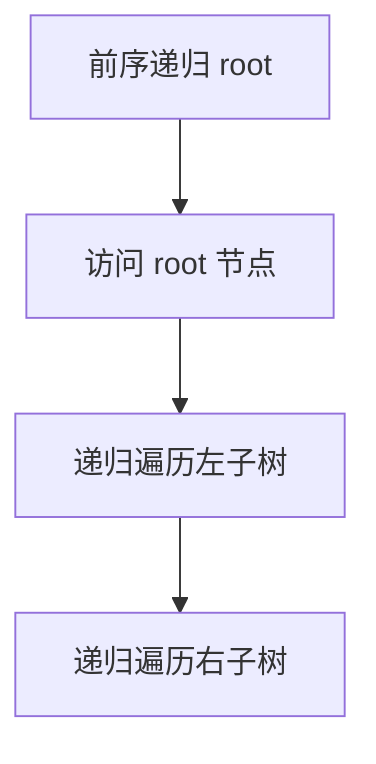
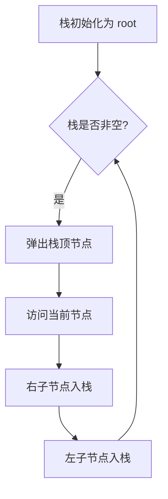
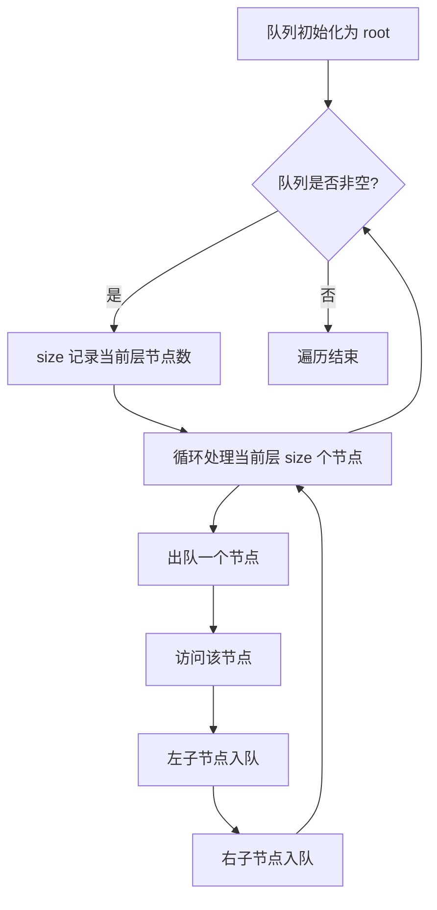
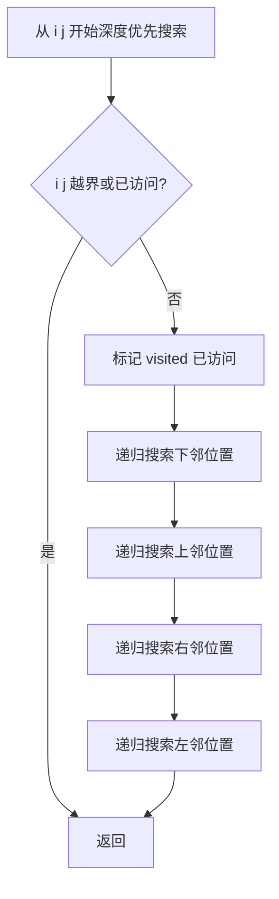
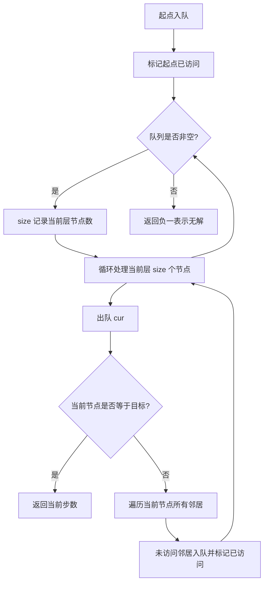
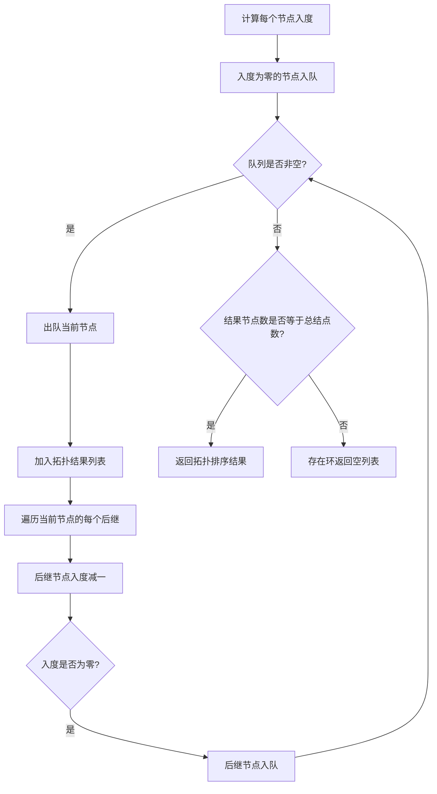

# · 树与图遍历

> **涵盖题型：** 二叉树 · DFS · BFS · 拓扑排序 · 图论基础

## 📜 背景与起源

### 二叉树遍历

二叉树的前序、中序、后序遍历由 **高德纳（Donald E. Knuth）** 在《计算机程序设计艺术》（TAOCP）中系统化定义，成为递归算法的经典范例。层序遍历（BFS 在树上的应用）最早可追溯到迷宫的逐层搜索，由 Moore 在 1959 年形式化。

### 深度优先搜索（DFS）

DFS 的思想萌芽于 19 世纪的迷宫求解算法——**Trémaux 算法**，其核心策略是"沿未走过的路径前进，遇到死胡同则沿原路返回"。在计算机科学中，DFS 由 **Tarjan** 等人在图连通性、双连通分量和强连通分量（SCC）等问题的研究中得到系统化。

### 广度优先搜索（BFS）

BFS 由 **Edward F. Moore** 于 1959 年提出，最初用于在迷宫中寻找最短路径。其核心思想是逐层扩展搜索范围，首次抵达目标即得最短路径。**E. W. Dijkstra** 提出的 Dijkstra 算法可视作 BFS 在加权图上的推广——将普通队列替换为优先队列，即可处理带权图的最短路径问题。

### 拓扑排序

拓扑排序的概念源自项目管理中的 **PERT 图（计划评审技术）**，用于表示任务的依赖关系和关键路径。**Kahn 在 1962 年**提出基于 BFS 的拓扑排序算法（Kahn 算法），通过统计入度并逐层移除入度为 0 的节点来获得有效的任务执行顺序。而 DFS 版本的拓扑排序（后序逆序输出）则源于图论中的完成时间分析。

## 一、二叉树

### 🔬 核心原理

二叉树的核心在于 **递归结构**：每个节点本身又是一棵二叉树的根。所有二叉树遍历都基于这个"根-左-右"的递归分解。

```text
二叉树的遍历分类：

深度优先（DFS）：
├── 前序：根 → 左 → 右（拷贝/序列化）
├── 中序：左 → 根 → 右（BST 有序序列）
├── 后序：左 → 右 → 根（释放节点/依赖计算）
└── 迭代（用栈模拟递归）

广度优先（BFS）：
└── 层序：逐层遍历（用队列）
```

### 💡 破题直觉

**树的递归 → 大部分二叉树问题 = 递归函数的返回值设计**

```text
递归三问：
1. 期望从子树获得什么信息？（返回值类型）
2. 当前节点如何处理来自子树的信息？（组合逻辑）
3. 空节点/叶子节点如何处理？（base case）
```

| 典型题目 | 返回值类型 | 核心逻辑 |
|---------|-----------|---------|
| 最大深度 | int | 左右子树最大深度 + 1 |
| 判断平衡 | bool/辅助 int | 左右高度差 ≤ 1 |
| 最近公共祖先 | TreeNode* | 左右找 p、q，返回找到的节点 |
| 路径总和 | bool | targetSum - val 传入子树 |
| 二叉搜索树验证 | bool + min/max | 左子树最大值 < root < 右子树最小值 |

### ⚠️ 边界陷阱

| 陷阱 | 场景 | 对策 |
|------|------|------|
| 空树（null） | root == null | 在所有递归前判断 |
| 只有左/右子树 | 不平衡树 | base case 确保左右都处理 |
| 溢出 | 路径和 | 用 long 或提前 return |
| 子树返回的信息不足 | 需要多种信息 | 用 Pair/数组返回多个值 |
| 递归栈溢出 | 退化树深度 10⁵ | 改用迭代遍历 |

### 📈 遍历可视化







### ⚙️ 高效实现指南

**二叉树迭代中序**——这是面试中的高频考点，核心逻辑是双循环结构：

```python
def inorder_iterative(root):
    stack, res = [], []
    cur = root
    while stack or cur:
        # 内层循环：将当前节点的所有左子节点入栈
        while cur:
            stack.append(cur)
            cur = cur.left
        # 弹出栈顶访问
        cur = stack.pop()
        res.append(cur.val)
        # 转向右子树
        cur = cur.right
    return res
```

关键点在于 **外层 while 的条件是 `stack or cur`**，第一个 `while cur` 内层循环负责将所有左子节点压入栈中。只有掌握了"一直向左走到尽头→弹出访问→切到右子树"这个循环节奏，才能真正理解迭代中序的实现原理。前序与后序的迭代相对简单——前序在入栈时访问，后序则需要借助双栈或反转结果。

### ⚡ 应试策略

```python
# 前序迭代
def preorder(root):
    if not root: return []
    stack, res = [root], []
    while stack:
        node = stack.pop()
        res.append(node.val)
        if node.right: stack.append(node.right)
        if node.left:  stack.append(node.left)
    return res

# 中序迭代（重点）
def inorder(root):
    stack, res = [], []
    cur = root
    while stack or cur:
        while cur:
            stack.append(cur)
            cur = cur.left
        cur = stack.pop()
        res.append(cur.val)
        cur = cur.right
    return res

# 层序迭代
def level_order(root):
    if not root: return []
    q, res = deque([root]), []
    while q:
        level = []
        for _ in range(len(q)):
            node = q.popleft()
            level.append(node.val)
            if node.left:  q.append(node.left)
            if node.right: q.append(node.right)
        res.append(level)
    return res
```

### 🏷️ 常见题型与解题方案

#### ① 前序/中序/后序遍历（递归 + 迭代）

**题目特征：**
- 要求按特定顺序输出二叉树节点的值
- 前序：根 → 左 → 右（用于序列化、复制树）
- 中序：左 → 根 → 右（BST 输出有序序列）
- 后序：左 → 右 → 根（依赖计算、释放节点）
- 面试常考迭代实现，特别是中序迭代

**解题思路与推导：**

**递归版（暴力→最优）：** 递归是最直观的解法，直接按顺序访问根节点和左右子树，代码极简，时间复杂度 O(n)，空间复杂度 O(h)（h 为树高，为递归栈深度）。这是最优解之一，面试时优先给出。

**迭代版：**
- **前序迭代：** 用栈模拟递归，先将根入栈。每次弹出栈顶访问，然后**先右后左**入栈（这样出栈时是先左后右）。为什么先右后左？因为栈是 LIFO，后入栈的先出栈，想让左子树先被访问，就必须让右子树先入栈。
- **中序迭代（重点）：** 核心是"一路向左走到尽头"。外层 while 条件 `stack or cur` 确保遍历完整。内层 while 将当前 cur 的所有左子孙压栈，弹出一个访问后转向右子树——因为右子树的处理方式和当前节点完全一致（同样是"一路向左"的循环）。这是面试最高频考点，比递归更容易被考到。
- **后序迭代：** 方法较多，最简单的技巧是仿照前序（根右左）然后反转结果。或者用双栈法：栈 1 按根左右压入，出栈时压入栈 2，最后栈 2 弹出即得后序。或者用 Morris 后序。

**完整 Python 代码：**

```python
# ---------- 前序遍历 ----------
def preorder_recursive(root):
    """递归前序：根 -> 左 -> 右"""
    if not root:
        return []
    return [root.val] + preorder_recursive(root.left) + preorder_recursive(root.right)

def preorder_iterative(root):
    """迭代前序：栈，先右后左入栈"""
    if not root:
        return []
    stack, res = [root], []
    while stack:
        node = stack.pop()
        res.append(node.val)            # 访问根
        if node.right:
            stack.append(node.right)    # 右子树先入栈（后出）
        if node.left:
            stack.append(node.left)     # 左子树后入栈（先出）
    return res

# ---------- 中序遍历 ----------
def inorder_recursive(root):
    """递归中序：左 -> 根 -> 右"""
    if not root:
        return []
    return inorder_recursive(root.left) + [root.val] + inorder_recursive(root.right)

def inorder_iterative(root):
    """迭代中序：一路向左走到尽头，弹出访问，切到右子树"""
    stack, res = [], []
    cur = root
    while stack or cur:
        # 一直向左，将路径上的节点全部压栈
        while cur:
            stack.append(cur)
            cur = cur.left
        # 弹出栈顶（最左节点），访问它
        cur = stack.pop()
        res.append(cur.val)
        # 转向右子树
        cur = cur.right
    return res

# ---------- 后序遍历 ----------
def postorder_recursive(root):
    """递归后序：左 -> 右 -> 根"""
    if not root:
        return []
    return postorder_recursive(root.left) + postorder_recursive(root.right) + [root.val]

def postorder_iterative(root):
    """迭代后序：仿前序（根右左）再反转"""
    if not root:
        return []
    stack, res = [root], []
    while stack:
        node = stack.pop()
        res.append(node.val)            # 根 -> 右 -> 左 顺序
        if node.left:
            stack.append(node.left)     # 注意：先左入栈，后出
        if node.right:
            stack.append(node.right)    # 后右入栈，先出
    return res[::-1]                    # 反转得左 -> 右 -> 根
```

**复杂度分析：**
- 时间复杂度：O(n)，每个节点恰好访问一次
- 空间复杂度：递归 O(h)（系统调用栈），迭代 O(n)（显式栈的最坏情况是单链表，h = n）

#### ② 层序遍历（BFS）

**题目特征：**
- 逐层从上到下输出二叉树节点
- 每层输出为一个子列表（二维结果）
- 变形：锯齿形层序（之字形）、自底向上层序、右视图（每层最右节点）

**解题思路：**
- 核心是用队列逐层处理
- 每轮先记录当前队列长度 `size`，这是**当前层的节点数**，然后循环 `size` 次弹出并访问
- 为什么需要 `size`？因为队列中同时混有当前层和下一层的节点，必须先记下当前层有多少个，处理完这些后才算处理完一层
- **锯齿形（之字形）：** 加一个 `left_to_right` 布尔标志，每层切换一次，在插入 level 结果前判断方向
- **右视图：** 层序遍历时，只保留每层最后一个节点

**完整 Python 代码：**

```python
from collections import deque

def level_order(root):
    """层序遍历：队列 + 每层 size 控制"""
    if not root:
        return []
    q, res = deque([root]), []
    while q:
        level = []                      # 当前层的节点值列表
        size = len(q)                   # 关键：先记下当前层节点数
        for _ in range(size):
            node = q.popleft()
            level.append(node.val)
            if node.left:
                q.append(node.left)
            if node.right:
                q.append(node.right)
        res.append(level)
    return res

def zigzag_level_order(root):
    """锯齿形（之字形）层序遍历"""
    if not root:
        return []
    q, res = deque([root]), []
    left_to_right = True                # 方向标志
    while q:
        level = []
        size = len(q)
        for _ in range(size):
            node = q.popleft()
            level.append(node.val)
            if node.left:
                q.append(node.left)
            if node.right:
                q.append(node.right)
        if not left_to_right:
            level.reverse()             # 反向插入
        res.append(level)
        left_to_right = not left_to_right  # 切换方向
    return res

def right_side_view(root):
    """二叉树的右视图：层序遍历，每层只取最后一个"""
    if not root:
        return []
    q, res = deque([root]), []
    while q:
        size = len(q)
        for i in range(size):
            node = q.popleft()
            if i == size - 1:           # 当前层最后一个节点
                res.append(node.val)
            if node.left:
                q.append(node.left)
            if node.right:
                q.append(node.right)
    return res
```

**复杂度分析：**
- 时间复杂度：O(n)，每个节点入队出队各一次
- 空间复杂度：O(n)，队列最多同时容纳最宽层的节点数（满二叉树最宽 O(n/2) ≈ O(n)）

#### ③ 构建二叉树（前+中 / 中+后）

**题目特征：**
- 给定两个遍历结果（如前序+中序，或中序+后序），重建原二叉树
- 前序 + 中序：前序第一个元素是根，在中序中找到根的位置，左侧为左子树、右侧为右子树
- 中序 + 后序：后序最后一个元素是根
- 前提是所有节点值唯一（不重复）

**解题思路与推导：**

**前序+中序（LeetCode 105）：**
1. 前序 `[根, 左子树前序, 右子树前序]`，前序第一个元素一定是根
2. 在中序中找到根值的位置，左侧所有元素构成左子树的中序，右侧构成右子树的中序
3. 根据左子树中序的长度，可以从前序中切分出左子树的前序和右子树的前序
4. 递归构建左右子树

**关键优化：** 每次在中序中找根的位置如果每次都线性扫描，总时间复杂度 O(n²)。用哈希表预存中序中值和索引的映射，将每次查找降为 O(1)，整体降至 O(n)。

```python
def build_tree(preorder, inorder):
    """
    从前序与中序构造二叉树
    前序：[根, 左子树前序, 右子树前序]
    中序：[左子树中序, 根, 右子树中序]
    """
    # 哈希表优化：值 → 中序索引
    val2idx = {val: i for i, val in enumerate(inorder)}

    def _build(pre_l, pre_r, in_l, in_r):
        """闭区间 [pre_l, pre_r], [in_l, in_r]"""
        if pre_l > pre_r:
            return None
        # 前序第一个是根
        root_val = preorder[pre_l]
        root = TreeNode(root_val)

        # 在中序中找到根的位置
        idx = val2idx[root_val]
        left_size = idx - in_l          # 左子树的节点数

        # 左子树：前序范围 [pre_l+1, pre_l+left_size]，中序范围 [in_l, idx-1]
        root.left = _build(pre_l + 1, pre_l + left_size, in_l, idx - 1)
        # 右子树：前序范围 [pre_l+left_size+1, pre_r]，中序范围 [idx+1, in_r]
        root.right = _build(pre_l + left_size + 1, pre_r, idx + 1, in_r)

        return root

    return _build(0, len(preorder) - 1, 0, len(inorder) - 1)
```

**中序+后序（LeetCode 106）：**

```python
def build_tree_inorder_postorder(inorder, postorder):
    """
    从中序与后序构造二叉树
    后序：[左子树后序, 右子树后序, 根]
    """
    val2idx = {val: i for i, val in enumerate(inorder)}

    def _build(in_l, in_r, post_l, post_r):
        if in_l > in_r:
            return None
        # 后序最后一个是根
        root_val = postorder[post_r]
        root = TreeNode(root_val)

        idx = val2idx[root_val]
        left_size = idx - in_l

        # 左子树：后序范围 [post_l, post_l+left_size-1]
        root.left = _build(in_l, idx - 1, post_l, post_l + left_size - 1)
        # 右子树：后序范围 [post_l+left_size, post_r-1]
        root.right = _build(idx + 1, in_r, post_l + left_size, post_r - 1)

        return root

    return _build(0, len(inorder) - 1, 0, len(postorder) - 1)
```

**复杂度分析：**
- 时间复杂度：O(n)，每个节点构建一次，哈希表 O(1) 定位
- 空间复杂度：O(n)，哈希表 O(n) + 递归栈 O(h)

#### ④ 二叉搜索树（BST）相关

**题目特征：**
- BST 性质：左子树所有节点 < 根 < 右子树所有节点
- BST 的中序遍历是严格递增序列——这是解决问题的核心线索
- 常见题型：验证 BST（是否合法）、BST 中第 K 小的节点、BST 的最近公共祖先

**解题思路与推导：**

**验证 BST（LeetCode 98）：**

暴力思路：中序遍历 BST，检查结果是否严格递增。O(n) 时间，O(n) 空间。

最优思路：递归时传递上下界（范围约束）。根节点的范围是 (-∞, +∞)；左子节点的范围是 (-∞, 根值)；右子节点的范围是 (根值, +∞)。一旦发现节点值超出当前允许的范围，即非法。为什么不能只检查左子 < 根 < 右子？因为 BST 要求整个左子树的所有节点都小于根，仅检查局部的父子关系不够。例如 `[5, 4, 6, None, None, 3, 7]`，3 在 6 的左子树中，但 3 < 5，不满足整树约束。

**第 K 小节点（LeetCode 230）：**
中序遍历到第 K 个即为答案。O(n) 时间，O(h) 空间（递归栈）。

**BST 的 LCA（LeetCode 235）：**
利用 BST 的有序性可以 O(h) 解决：如果 p 和 q 的值都 < 根，LCA 在左子树；如果都 > 根，LCA 在右子树；否则当前节点就是 LCA（一个在左一个在右，或当前为 p/q 之一）。

**完整 Python 代码：**

```python
# ---------- 验证BST ----------
def is_valid_bst(root):
    """利用上下界（-inf, +inf）递归验证"""
    def _check(node, low, high):
        if not node:
            return True
        # 当前节点必须在 (low, high) 范围内
        if node.val <= low or node.val >= high:
            return False
        # 左子树：上界收紧为当前节点值
        # 右子树：下界收紧为当前节点值
        return (_check(node.left, low, node.val) and
                _check(node.right, node.val, high))

    return _check(root, float('-inf'), float('inf'))

# ---------- BST中第K小 ----------
def kth_smallest(root, k):
    """中序遍历到第 k 个即可"""
    stack, cur = [], root
    count = 0
    while stack or cur:
        while cur:
            stack.append(cur)
            cur = cur.left
        cur = stack.pop()
        count += 1
        if count == k:
            return cur.val
        cur = cur.right
    return -1

# ---------- BST的最近公共祖先 ----------
def lowest_common_ancestor_bst(root, p, q):
    """利用 BST 有序性，O(h) 时间"""
    while root:
        # p 和 q 都在左子树
        if p.val < root.val and q.val < root.val:
            root = root.left
        # p 和 q 都在右子树
        elif p.val > root.val and q.val > root.val:
            root = root.right
        else:
            # 当前节点在 p 和 q 之间，或当前节点就是 p/q
            return root
    return None
```

**复杂度分析：**

| 题目 | 时间 | 空间 | 说明 |
|------|------|------|------|
| 验证 BST（递归上下界） | O(n) | O(h) | 最优解法 |
| 验证 BST（中序遍历） | O(n) | O(n) | 简单但空间差 |
| 第 K 小节点 | O(n) | O(h) | 需遍历到第 K 个 |
| BST 的 LCA | O(h) | O(1) | 利用有序性比一般 LCA 快 |

#### ⑤ 路径总和（I, II, III）

**题目特征：**
- 路径总和 I：判断是否存在一条从根到叶子的路径，其节点和等于 targetSum（LeetCode 112）
- 路径总和 II：找出所有从根到叶子的路径，其节点和等于 targetSum（LeetCode 113）
- 路径总和 III：路径不需要从根到叶子，可以从任意节点到任意节点（向下方向）（LeetCode 437）

**解题思路与推导：**

**路径总和 I（简单版）：**
DFS 递归，每进入下一层将 targetSum 减去当前节点值，到达叶子时判断是否减到 0。
时间复杂度 O(n)，空间 O(h)。

**路径总和 II（输出所有路径）：**
DFS + 回溯。维护一个当前路径列表，每访问一个节点加入列表，递归返回前弹出（回溯）。到达叶子且满足条件时，将当前路径的**深拷贝**加入结果。为什么需要深拷贝？因为后续回溯会修改 path 列表，不拷贝的话最终结果中的所有路径都指向同一个列表的最终状态（空列表）。

**路径总和 III（任意起点，向下）：**
暴力方法：对每个节点作为起点，DFS 向下累加，O(n²)。
最优方法：前缀和 + 哈希表。在 DFS 过程中，维护从根到当前节点的累加和（prefix sum）。目标 sum 表示为 `当前前缀和 - target = 之前出现过的前缀和`。用哈希表记录每个前缀和出现的次数。这是一种类似"两数之和"的思路，在树上做路径计数。

```python
# ---------- 路径总和 I ----------
def has_path_sum(root, target_sum):
    """判断是否存在根到叶子路径和为 target"""
    if not root:
        return False
    # 到达叶子节点
    if not root.left and not root.right:
        return root.val == target_sum
    # 递归：targetSum 减去当前节点值传入子树
    return (has_path_sum(root.left, target_sum - root.val) or
            has_path_sum(root.right, target_sum - root.val))

# ---------- 路径总和 II ----------
def path_sum_ii(root, target_sum):
    """找出所有根到叶子路径和为 target 的路径"""
    res, path = [], []

    def _dfs(node, remaining):
        if not node:
            return
        path.append(node.val)
        remaining -= node.val
        # 到叶子且满足条件
        if not node.left and not node.right and remaining == 0:
            res.append(path[:])          # 深拷贝，否则后面回溯会修改
        _dfs(node.left, remaining)
        _dfs(node.right, remaining)
        path.pop()                       # 回溯：移除当前节点

    _dfs(root, target_sum)
    return res

# ---------- 路径总和 III ----------
def path_sum_iii(root, target_sum):
    """任意节点向下（不必根到叶子）的路径和为 target 的数量"""
    prefix = {0: 1}                      # 前缀和 → 出现次数，初始有 0

    def _dfs(node, cur_sum):
        if not node:
            return 0
        cur_sum += node.val
        # cur_sum - target_sum = 之前某处的前缀和
        # 以当前节点结尾的路径数 = 之前该前缀和出现次数
        count = prefix.get(cur_sum - target_sum, 0)

        # 将当前前缀和加入哈希表，继续 DFS
        prefix[cur_sum] = prefix.get(cur_sum, 0) + 1
        count += _dfs(node.left, cur_sum)
        count += _dfs(node.right, cur_sum)
        # 回溯：移除当前前缀和（因为其他分支不经过当前节点）
        prefix[cur_sum] -= 1

        return count

    return _dfs(root, 0)
```

**复杂度分析：**

| 题目 | 时间 | 空间 | 说明 |
|------|------|------|------|
| 路径总和 I | O(n) | O(h) | 简单递归 |
| 路径总和 II | O(n²) 最坏 | O(h) | 输出所有路径，每加深一次拷贝 |
| 路径总和 III | O(n) | O(n) | 前缀和哈希表 |

#### ⑥ 二叉树的最大/最小深度

**题目特征：**
- 最大深度：根到最远叶子节点的最长路径上的节点数（LeetCode 104）
- 最小深度：根到最近叶子节点的最短路径上的节点数（LeetCode 111）
- 注意最小深度必须到达叶子节点，不能只到空子节点就返回（即如果根只有左子树，最小深度不能是 1，必须继续深入）

**解题思路：**

**最大深度（DFS 后序）：** 递归计算左右子树的最大深度，取较大值 + 1。层序 BFS 也可以，但 DFS 更短。

**最小深度（DFS）：** 需要区分三种情况：
1. 左右子树都为空 → 叶子节点，返回 1
2. 左子树为空 → 只能走右子树
3. 右子树为空 → 只能走左子树
4. 左右都不为空 → 取较小值 + 1

**BFS 法求最小深度：** 层序遍历，遇到第一个叶子节点就返回当前深度，效率更高（提前终止）。

```python
# ---------- 最大深度 ----------
def max_depth(root):
    """DFS 后序：左右子树最大深度 + 1"""
    if not root:
        return 0
    left_depth = max_depth(root.left)
    right_depth = max_depth(root.right)
    return max(left_depth, right_depth) + 1

# ---------- 最小深度 ----------
def min_depth(root):
    """DFS：注意必须到叶子节点"""
    if not root:
        return 0
    # 左右都为空 → 叶子节点
    if not root.left and not root.right:
        return 1
    # 左为空，只能走右
    if not root.left:
        return min_depth(root.right) + 1
    # 右为空，只能走左
    if not root.right:
        return min_depth(root.left) + 1
    # 左右都不为空，取较小值
    return min(min_depth(root.left), min_depth(root.right)) + 1

def min_depth_bfs(root):
    """BFS 求最小深度：遇到第一个叶子节点立即返回"""
    if not root:
        return 0
    q = deque([(root, 1)])
    while q:
        node, depth = q.popleft()
        # 第一个遇到的叶子节点就是最小深度
        if not node.left and not node.right:
            return depth
        if node.left:
            q.append((node.left, depth + 1))
        if node.right:
            q.append((node.right, depth + 1))
    return 0
```

**复杂度分析：**
- 最大深度（DFS）：时间 O(n)，空间 O(h)
- 最小深度（DFS）：时间 O(n)，空间 O(h)
- 最小深度（BFS）：时间 O(n)（最坏遍历所有节点），空间 O(n)，但平均比 DFS 快（遇到叶子就停）

#### ⑦ 最近公共祖先 LCA

**题目特征：**
- 给定二叉树（非 BST）和两个节点 p、q，找到它们的最近公共祖先（LeetCode 236）
- p 和 q 存在于树中（保证存在）
- LCA 定义：p 和 q 的公共祖先中离它们最近的那个，p 或 q 本身也可以作为自己的 LCA

**解题思路：**

**DFS 后序法（最优）：**
递归遍历二叉树，对每个节点返回"是否在其子树中找到 p 或 q"。

- 如果当前节点是 p 或 q，直接返回当前节点
- 递归在左右子树中查找
- 如果左右子树都找到了（一个找到 p，一个找到 q），则当前节点就是 LCA
- 如果只有左子树找到了，返回左子树的结果
- 如果只有右子树找到了，返回右子树的结果

**推导过程：** 暴力方法（记录从根到 p 和 q 的两条路径，找最后一个公共节点）需要 O(n) 空间存储路径。DFS 后序法只需要 O(h) 空间（递归栈），在回溯过程中自然获得 LCA。

**边界情况：**
- p 是 q 的祖先：DFS 到 p 时直接返回 p（因为 p 在 q 的路径上）
- 反之亦然
- p = q：返回 p

```python
def lowest_common_ancestor(root, p, q):
    """
    DFS 后序查找 LCA
    返回：如果在当前子树中找到 p 或 q 或 LCA，则返回对应节点；否则返回 None
    """
    if not root:
        return None
    # 当前节点是 p 或 q，直接返回
    if root == p or root == q:
        return root

    # 在左右子树中查找
    left = lowest_common_ancestor(root.left, p, q)
    right = lowest_common_ancestor(root.right, p, q)

    # 左右都找到了 → p 和 q 分别在左右子树 → 当前节点是 LCA
    if left and right:
        return root

    # 只在一侧找到 → LCA 在那侧
    return left if left else right
```

**复杂度分析：**
- 时间复杂度：O(n)，每个节点恰好访问一次
- 空间复杂度：O(h)，递归栈深度（最坏 O(n) 为链状树）

## 二、深度优先搜索 (DFS)

### 🔬 核心原理

DFS 的本质是 **沿着一条路走到黑，走不通了再回头**。它用栈（递归的调用栈）来保存回溯点。在树上做 DFS 就是树遍历，在图上做 DFS 要标记已访问节点。

```text
DFS 框架三要素：
1. 终止条件：何时返回/停止搜索
2. 访问标记：防止重复访问（图/矩阵）
3. 回溯操作：探索完一个分支后恢复状态（部分问题需要）
```

### 💡 破题直觉

**看到「所有路径」「连通分量」「岛屿问题」「排列组合」→ DFS**

| 场景 | 是否回溯 | 原因 |
|------|---------|------|
| 图中找路径的回溯问题 | ✅ 需要 | 路径探索完回退到上一节点 |
| 图中求连通分量 | ❌ 不需要 | 只检查连通性 |
| 矩阵中单词搜索 | ✅ 需要 | 不能重复用同一格子 |
| 二叉树路径和 | ❌ 不需要 | 树天然无环 |

### ⚙️ 高效实现指南

**递归 vs 迭代选择：**

- **递归实现** 代码最简洁，但在 Python 中默认递归深度限制为 1000。对于二叉树深度 < 1000 的场景问题不大，但对于大型矩阵的 DFS（如 1000×1000 网格），递归极易栈溢出
- **迭代实现** 用显式栈（直接使用 Python `list` 作为栈），完全不受递归深度限制，且性能通常优于递归
- 如果确定需要用递归且深度可能超过 1000，可先调用 `sys.setrecursionlimit(10000)` 提升限制，但仍不如迭代稳妥

```python
# 迭代 DFS 模板（矩阵岛屿问题）
def dfs_iterative(grid, i, j):
    stack = [(i, j)]
    visited = set()
    while stack:
        x, y = stack.pop()
        if (x, y) in visited:
            continue
        visited.add((x, y))
        for dx, dy in [(1,0), (-1,0), (0,1), (0,-1)]:
            nx, ny = x + dx, y + dy
            if 0 <= nx < len(grid) and 0 <= ny < len(grid[0]):
                if grid[nx][ny] == '1' and (nx, ny) not in visited:
                    stack.append((nx, ny))
```

### ⚠️ 边界陷阱

| 陷阱 | 场景 | 对策 |
|------|------|------|
| 无限递归 | 图上未标记已访问 | 必须用 visited 集合/数组 |
| 状态混用 | 共享的可变状态 | 每次递归前拷贝或回溯恢复 |
| 过早返回 | 找到第一个解就返回 | 明确是找"一个解"还是"全部解" |
| 栈溢出 | 深度过大（10⁵ 级） | 改用迭代 DFS 或 BFS |
| 矩阵边界 | x, y 越界 | 先判断 m,n 范围再递归 |

### 📈 流程示例



## 三、广度优先搜索 (BFS)

### 🔬 核心原理

BFS 用 **队列** 逐层扩展，保证 **首次到达目标节点的路径就是最短路径**（边的权值相等时）。

```text
BFS 模板四步：
1. 初始化队列，起点入队
2. 标记起点已访问
3. 当队列非空 → 取出节点 → 访问 → 邻居入队
4. 如需最短步数 → 按层遍历（在每层开始前记录 size）
```

### 💡 破题直觉

**看到「最短路径」「最少步数」「逐层扩散」「拓扑排序」→ BFS**

| BFS vs DFS | BFS | DFS |
|-----------|-----|-----|
| 数据结构 | 队列 | 栈/递归 |
| 空间复杂度 | 最宽层（可能 O(n)） | 最深路径（可能 O(n)） |
| 最短路径 | ✅ 保证 | ❌ 不保证 |
| 全部解 | 也可以 | ✅ 更自然 |

### ⚙️ 高效实现指南

**队列选型：** 务必使用 `collections.deque`，**绝对不要用 `list` + `pop(0)`**。`list.pop(0)` 的时间复杂度是 O(n)——每次移除头部元素都会导致所有后续元素向前移位，而 `deque.popleft()` 是 O(1)。在大规模图遍历中，这可能是"超时"和"通过"之间的区别。

**入队即标记：** 在将邻居加入队列的 **同一时刻** 就标记为已访问，而不是出队时才标记。否则同一个节点可能会被多个邻居重复加入队列，导致大量冗余计算甚至内存溢出。

```python
# 正确做法：入队时标记 visited
for neighbor in graph[cur]:
    if neighbor not in visited:
        visited.add(neighbor)   # 入队时立即标记
        queue.append(neighbor)

# 错误做法：出队时才标记
for neighbor in graph[cur]:
    if neighbor not in visited:
        queue.append(neighbor)  # 可能被多个父节点重复入队！
...
node = queue.popleft()
visited.add(node)               # 此时标记为时已晚！
```

### ⚠️ 边界陷阱

| 陷阱 | 场景 | 对策 |
|------|------|------|
| 同一节点重复入队 | 双向图 | 入队时立即标记 visited |
| 起点等于终点 | 原地不动 | BFS 前就判断 |
| 多层同时标记 | 同时从多个起点 BFS | 多源 BFS（拓扑排序） |
| 步数计算 | 需要多少步走到 | 按层遍历，每层步数加一 |

### 📈 流程示例



### 🏷️ 常见题型与解题方案

#### ① 岛屿数量（Connected Components）

**题目特征：**
- 给定一个 m×n 的二维网格，'1' 表示陆地，'0' 表示水域
- 求相连（上下左右四个方向）的陆地块数（LeetCode 200）
- 是求网格中的连通分量数量
- 变形：最大岛屿面积（统计面积）、岛屿周长、不同岛屿数量（考虑形状）

**解题思路与推导：**

**暴力→最优推导：**
- **暴力：** 对每个陆地，DFS 遍历并标记已访问。遍历所有格子 O(m×n)，每个格子最多被 DFS 访问一次，总 O(m×n)
- **关键优化——沉没法（in-place 标记）：** 不需要额外 visited 二维数组，直接将访问过的 '1' 改成 '0'（沉没）。节省 O(m×n) 空间
- 为什么用 DFS 而非 BFS？DFS 代码更短，且这里只需求数量不需求最短路径。但注意大矩阵递归可能栈溢出，此时改用迭代 DFS 或 BFS

```python
def num_islands(grid):
    """沉没法 DFS：遍历每个格子，遇到 '1' 就 DFS 沉没"""
    if not grid:
        return 0

    m, n = len(grid), len(grid[0])
    count = 0

    def dfs(x, y):
        """递归沉没整个岛屿"""
        # 边界检查 + 水域/已访问检查
        if x < 0 or x >= m or y < 0 or y >= n or grid[x][y] == '0':
            return
        grid[x][y] = '0'               # 沉没：标记为已访问
        # 向四个方向扩散
        dfs(x + 1, y)
        dfs(x - 1, y)
        dfs(x, y + 1)
        dfs(x, y - 1)

    for i in range(m):
        for j in range(n):
            if grid[i][j] == '1':
                count += 1
                dfs(i, j)              # DFS 沉没整个岛屿

    return count

# 最大岛屿面积变种
def max_area_of_island(grid):
    """最大岛屿面积：DFS 返回面积"""
    if not grid:
        return 0

    m, n = len(grid), len(grid[0])

    def dfs(x, y):
        if x < 0 or x >= m or y < 0 or y >= n or grid[x][y] == 0:
            return 0
        grid[x][y] = 0                  # 沉没
        area = 1
        area += dfs(x + 1, y)
        area += dfs(x - 1, y)
        area += dfs(x, y + 1)
        area += dfs(x, y - 1)
        return area

    max_area = 0
    for i in range(m):
        for j in range(n):
            if grid[i][j] == 1:
                max_area = max(max_area, dfs(i, j))
    return max_area
```

**复杂度分析：**
- 时间复杂度：O(m×n)，每个格子最多被访问一次
- 空间复杂度：最坏 O(m×n)（递归栈，全部为陆地时），迭代 DFS/BFS 空间 O(min(m,n)) 更好

#### ② 省份数量（并查集/DFS）

**题目特征：**
- 给定 n 个城市之间的连通关系矩阵 `isConnected[i][j] = 1` 表示 i 和 j 直接相连
- 求"省份"（连通分量）的数量（LeetCode 547）
- 与岛屿数量不同的是，这里的图是用邻接矩阵表示的，且是对称矩阵

**解题思路：**

**方法一：DFS 标记（简单直接）：**
将每个城市看作节点，DFS 遍历所有与其相连的城市并标记已访问。统计需要多少次 DFS（即连通分量数）。

**方法二：并查集（更通用）：**
并查集适合动态添加边的场景。初始化每个城市自己是一个集合，遍历所有相连关系进行合并，最后统计不同的根节点数量。

**推导：** 邻接矩阵的 DFS 遍历是图的 DFS——每个节点的邻居就是矩阵中该行所有值为 1 的列。DFS 标记已访问的城市。

```python
# ---------- 方法一：DFS ----------
def find_circle_num_dfs(is_connected):
    """DFS 标记已访问的城市"""
    n = len(is_connected)
    visited = [False] * n
    count = 0

    def dfs(city):
        visited[city] = True
        for neighbor in range(n):
            if is_connected[city][neighbor] == 1 and not visited[neighbor]:
                dfs(neighbor)

    for i in range(n):
        if not visited[i]:
            count += 1
            dfs(i)

    return count

# ---------- 方法二：并查集 ----------
class UnionFind:
    def __init__(self, n):
        self.parent = list(range(n))
        self.rank = [0] * n
        self.count = n                  # 初始连通分量数

    def find(self, x):
        """路径压缩：查找根节点"""
        if self.parent[x] != x:
            self.parent[x] = self.find(self.parent[x])
        return self.parent[x]

    def union(self, x, y):
        """按秩合并"""
        root_x, root_y = self.find(x), self.find(y)
        if root_x == root_y:
            return
        if self.rank[root_x] < self.rank[root_y]:
            self.parent[root_x] = root_y
        elif self.rank[root_x] > self.rank[root_y]:
            self.parent[root_y] = root_x
        else:
            self.parent[root_y] = root_x
            self.rank[root_x] += 1
        self.count -= 1                 # 合并一个，连通分量减一

def find_circle_num_union(is_connected):
    n = len(is_connected)
    uf = UnionFind(n)
    for i in range(n):
        for j in range(i + 1, n):       # 只遍历上三角，利用对称性
            if is_connected[i][j] == 1:
                uf.union(i, j)
    return uf.count
```

**复杂度分析：**

| 方法 | 时间 | 空间 | 说明 |
|------|------|------|------|
| DFS | O(n²) | O(n) | visited 数组 + 递归栈 |
| 并查集 | O(n² α(n)) | O(n) | α(n) 为阿克曼反函数，接近常数 |

#### ③ 克隆图

**题目特征：**
- 给定一个无向连通图的引用，要求实现深拷贝（LeetCode 133）
- 每个节点包含值 `val` 和邻居列表 `neighbors`
- 深拷贝要求：新图的节点是新创建的对象，与原图节点完全独立
- 不能直接复制引用，否则克隆图和原图共享节点

**解题思路：**

**核心思路：DFS + 哈希表缓存**
- 使用哈希表 `old2new` 记录原图节点到克隆节点的映射
- 从给定节点开始 DFS：
  1. 如果当前节点已克隆（在哈希表中），直接返回克隆节点
  2. 否则创建新节点，加入哈希表
  3. 递归克隆所有邻居，将克隆后的邻居加入新节点的邻居列表
- 为什么需要哈希表？因为图可能有环。如果 A→B→C→A，没有哈希表会无限递归。哈希表保证了每个节点只被克隆一次

**推导过程：**
- 暴力：每次 DFS 遇到新节点就创建，但不记录已创建的节点 → 有环图时会死循环
- 优化：DFS + HashMap 缓存 → 每个节点只克隆一次，O(V+E)
- BFS 也可以（逐层克隆邻居），思路类似

```python
def clone_graph(node):
    """DFS 深拷贝图"""
    if not node:
        return None

    old2new = {}  # 原图节点 → 克隆节点

    def _clone(original):
        """递归克隆节点"""
        if original in old2new:
            return old2new[original]   # 已克隆，直接返回

        # 创建新节点（先不填邻居）
        cloned = Node(original.val, [])
        old2new[original] = cloned     # 先加入哈希表，避免环导致死循环

        # 递归克隆所有邻居
        for neighbor in original.neighbors:
            cloned.neighbors.append(_clone(neighbor))

        return cloned

    return _clone(node)
```

**复杂度分析：**
- 时间复杂度：O(V + E)，遍历所有节点和边（每个节点的邻居列表）
- 空间复杂度：O(V)，哈希表存储 V 个节点的映射关系 + 递归栈深度

#### ④ 单词接龙

**题目特征：**
- 给定 beginWord、endWord 和一个单词列表 wordList
- 每次只能改变一个字母，且变换后的单词必须在 wordList 中
- 求从 beginWord 到 endWord 的**最短**变换路径长度（LeetCode 127）
- 变形：输出所有最短路径（LeetCode 126，难度更高）

**解题思路与推导：**

**暴力→最优推导：**

**思路一：DFS 找所有路径（指数级，不可行）**
DFS 探索所有可能的单词变换，找到所有路径再取最短。但分支因子很大（每个单词有 L 个字母，每个字母可替换成 25 个其他字母 = 25L 种可能），指数爆炸。

**思路二：BFS 层序遍历（最优）**
将单词视为图的节点，能相互变换的单词之间有一条边。BFS 层数就是最短变换长度。

关键问题是：如何高效找出当前单词的所有邻居（可变换一个字母的单词）？

**方法 A：逐位替换法（推荐）**
对当前单词的每个位置 i，尝试替换成 a-z（26 个字母，排除自身），检查替换后的单词是否在 wordList 中。复杂度 O(L × 26)，L 为单词长度（通常较短，如 10 以内）。这是常见的最优方法。

**方法 B：生成通用模式**
对每个单词生成其"通用模式"（如 "hit" 可生成 "\*it", "h\*t", "hi\*"），用哈希表建立通用模式到单词列表的映射。每个单词有 L 个通用模式键，BFS 时通过通用模式查找邻居。适合单词列表很大（N 很大）的场景。

```python
from collections import deque

def ladder_length(begin_word, end_word, word_list):
    """
    BFS 求最短变换路径长度
    """
    word_set = set(word_list)            # O(1) 查询
    if end_word not in word_set:
        return 0

    q = deque([(begin_word, 1)])         # (当前单词, 当前步数)
    visited = {begin_word}

    while q:
        word, steps = q.popleft()

        # 对每个位置尝试替换所有字母
        for i in range(len(word)):
            for c in 'abcdefghijklmnopqrstuvwxyz':
                if c == word[i]:
                    continue            # 替换成自身，跳过
                new_word = word[:i] + c + word[i+1:]

                if new_word == end_word:
                    return steps + 1

                if new_word in word_set and new_word not in visited:
                    visited.add(new_word)
                    q.append((new_word, steps + 1))

    return 0                             # 不可达

# ---------- 双向 BFS 优化版本 ----------
def ladder_length_bidirectional(begin_word, end_word, word_list):
    """
    双向 BFS：从 beginWord 和 endWord 同时搜索，相遇即最短
    平均减少搜索空间 50% 以上
    """
    word_set = set(word_list)
    if end_word not in word_set:
        return 0

    begin_set = {begin_word}             # 从起点出发的搜索前沿
    end_set = {end_word}                 # 从终点出发的搜索前沿
    visited = {begin_word, end_word}
    steps = 1

    while begin_set and end_set:
        # 每次扩展较小的集合（平衡搜索空间）
        if len(begin_set) > len(end_set):
            begin_set, end_set = end_set, begin_set

        next_set = set()
        for word in begin_set:
            for i in range(len(word)):
                for c in 'abcdefghijklmnopqrstuvwxyz':
                    if c == word[i]:
                        continue
                    new_word = word[:i] + c + word[i+1:]

                    if new_word in end_set:          # 双向相遇
                        return steps + 1
                    if new_word in word_set and new_word not in visited:
                        visited.add(new_word)
                        next_set.add(new_word)

        begin_set = next_set
        steps += 1

    return 0
```

**复杂度分析：**
- 时间复杂度：O(N × L² × 26)（标准 BFS），其中 N 为单词表大小，L 为单词长度
  通常简化为 O(N × L × 26)——每个单词入队一次
- 空间复杂度：O(N)，visited 和队列
- 双向 BFS 可将搜索空间减少约 50%，是最优工程实践

## 四、拓扑排序

### 🔬 核心原理

拓扑排序是对 **有向无环图（DAG）** 的顶点排序，使得对每条有向边 u→v，u 在排序中都出现在 v 之前。

**两种实现：**

1. **Kahn 算法（BFS）**：统计每个节点的入度，从入度为 0 的节点开始逐层移除，每移除一个节点就将其后继节点的入度减一
2. **DFS 后序**：对图进行 DFS，在访问完一个节点的所有后继后将其加入结果列表，最后反转列表即为拓扑序

### 💡 破题直觉

**看到「依赖关系」「课程表」「构建顺序」「任务调度」→ 拓扑排序**

### ⚠️ 边界陷阱

| 陷阱 | 场景 | 对策 |
|------|------|------|
| 环检测 | 存在循环依赖 | Kahn: 最终节点数 < 总节点数 |
| 不连通图 | 多个独立 DAG | 所有入度为 0 的节点都入队 |
| 没有依赖的节点 | 入度为 0 | 可以放在任何位置 |

### 📈 流程



### 🏷️ 常见题型与解题方案

#### ① 课程表（I, II）

**题目特征：**
- 给定 numCourses 门课程（编号 0 到 numCourses-1）和一系列先修关系 `[ai, bi]` 表示"学 ai 前必须先学 bi"
- 课程表 I（LeetCode 207）：判断是否能完成所有课程（是否有环）
- 课程表 II（LeetCode 210）：返回一种可行的学习顺序（拓扑序）

**解题思路：**

**Kahn 算法（BFS 入度法）：**
1. 根据先修关系构建邻接表（图）和入度数组
2. 将所有入度为 0 的节点入队（这些课程没有前置依赖，可以直接学）
3. 每次从队列中取出一个节点，将其加入结果列表，并将其所有后继的入度减 1
4. 若后继入度变为 0，则入队
5. 最终若结果列表长度等于课程总数，说明可以完成（无环）；否则存在环

**为什么入度法能检测环？**
如果存在环，环上的节点入度永远不可能变为 0（因为环中每个节点都被其他节点依赖），最终结果列表长度 < 总节点数。

```python
from collections import deque

# ---------- 课程表 I（判断是否能完成） ----------
def can_finish(num_courses, prerequisites):
    """
    Kahn 算法检测是否有环
    prerequisites: [[ai, bi], ...] 学 ai 前先学 bi
    """
    # 建图：依赖关系 bi → ai（先学 bi 才能学 ai）
    graph = [[] for _ in range(num_courses)]
    in_degree = [0] * num_courses

    for ai, bi in prerequisites:
        graph[bi].append(ai)            # bi → ai
        in_degree[ai] += 1              # ai 的入度 + 1

    # 入度为 0 的节点入队
    q = deque([i for i in range(num_courses) if in_degree[i] == 0])
    count = 0                           # 记录已处理的节点数

    while q:
        node = q.popleft()
        count += 1
        for neighbor in graph[node]:
            in_degree[neighbor] -= 1
            if in_degree[neighbor] == 0:
                q.append(neighbor)

    return count == num_courses         # 无环则全部处理完

# ---------- 课程表 II（返回一种拓扑序） ----------
def find_order(num_courses, prerequisites):
    """
    返回一种可行的课程顺序
    """
    graph = [[] for _ in range(num_courses)]
    in_degree = [0] * num_courses

    for ai, bi in prerequisites:
        graph[bi].append(ai)
        in_degree[ai] += 1

    q = deque([i for i in range(num_courses) if in_degree[i] == 0])
    order = []                          # 拓扑序结果

    while q:
        node = q.popleft()
        order.append(node)
        for neighbor in graph[node]:
            in_degree[neighbor] -= 1
            if in_degree[neighbor] == 0:
                q.append(neighbor)

    return order if len(order) == num_courses else []
```

**复杂度分析：**
- 时间复杂度：O(V + E)，V = numCourses，E = len(prerequisites)，建图 + 遍历各一次
- 空间复杂度：O(V + E)，邻接表存储

#### ② 外星人字典

**题目特征：**
- 给定一个按照某种未知字母顺序排序的外星单词列表（LeetCode 269, 面试高频）
- 要求从这些单词中推断出该外星语言的字母顺序
- 不保证每个字母都出现，且可能有多个合法排序

**解题思路：**

**核心思路：比较相邻单词，找出字符之间的相对顺序，建图后拓扑排序**

**推导过程：**
1. 比较相邻单词 `words[i]` 和 `words[i+1]`，找到第一个不同的字符位置 j
   - 例如 "wrt" 和 "wrf"：在 j=2 处不同，t 在 f 之前 → 边 t → f
   - 如果 `words[i]` 是 `words[i+1]` 的前缀且更长（如 "abc" 和 "ab"），说明顺序非法，返回 ""
2. 根据所有找到的边构建有向图（每个字母是一个节点）
3. 对图进行拓扑排序（Kahn 算法）
4. 如果拓扑节点数 < 图中所有出现字母的总数，说明存在环 → 非法

**为什么比较相邻单词就够了？**
如果 A < B < C 在字典序中，A 和 B 的比较给出了某些字母的相对顺序，B 和 C 的比较给出了另一些。不相邻的比较不会提供额外信息——这种比较捕捉了字典序的传递性。

```python
from collections import deque, defaultdict

def alien_order(words):
    """
    外星人字典：比较相邻单词建图 + 拓扑排序
    """
    # 收集所有出现的字母
    chars = set()
    for word in words:
        for c in word:
            chars.add(c)

    # 建图：邻接表和入度
    graph = defaultdict(list)
    in_degree = {c: 0 for c in chars}

    # 比较相邻单词找出字符顺序
    for i in range(len(words) - 1):
        w1, w2 = words[i], words[i + 1]
        # 找到第一个不同的字符
        min_len = min(len(w1), len(w2))
        j = 0
        while j < min_len and w1[j] == w2[j]:
            j += 1
        # w1 是 w2 的前缀但 w1 更长 → 非法顺序
        if j == min_len and len(w1) > len(w2):
            return ""
        # 找到了不同字符
        if j < min_len:
            c1, c2 = w1[j], w2[j]
            graph[c1].append(c2)
            in_degree[c2] += 1

    # Kahn 拓扑排序
    q = deque([c for c in chars if in_degree[c] == 0])
    result = []

    while q:
        c = q.popleft()
        result.append(c)
        for neighbor in graph[c]:
            in_degree[neighbor] -= 1
            if in_degree[neighbor] == 0:
                q.append(neighbor)

    # 检测环：存在未处理的节点
    if len(result) != len(chars):
        return ""

    return "".join(result)
```

**复杂度分析：**
- 时间复杂度：O(C)，C 为所有单词的总字符数（扫描相邻单词 + 拓扑排序）。最坏 O(N × L)，N 为单词数，L 为平均长度
- 空间复杂度：O(U + E)，U 为不同字母数（最多 26），E 为图中边的数量

## 五、图论基础

### 🔬 核心原理

图的表示方式决定了算法的复杂度：

| 表示法 | 空间 | 查边 | 遍历邻居 | 适用场景 |
|-------|------|------|---------|---------|
| 邻接矩阵 | O(V²) | O(1) | O(V) | 稠密图、Floyd |
| 邻接表 | O(V+E) | O(deg(v)) | O(deg(v)) | 稀疏图、DFS/BFS |
| 边列表 | O(E) | O(E) | O(E) | 最小生成树 |

**最短路径算法：**

| 算法 | 适用 | 复杂度 | 说明 |
|------|------|--------|------|
| BFS | 无权重 | O(V+E) | 最简单 |
| Dijkstra | 非负权重 | O((V+E)logV) | 优先队列优化 |
| Bellman-Ford | 可有负权 | O(VE) | 可检测负环 |
| Floyd-Warshall | 全源 | O(V³) | DP 思想 |

### ⚙️ 高效实现指南

**Dijkstra 优先队列实现：**

核心要点是优先队列中存储 `(distance, node)` 元组，使用 `dist[u] + w < dist[v]` 进行松弛操作。当从优先队列中取出的距离大于当前已知最短距离时跳过（惰性删除），避免重复处理过期条目。

```python
import heapq

def dijkstra(graph, n, start):
    dist = [float('inf')] * n
    dist[start] = 0
    pq = [(0, start)]  # (distance, node)
    while pq:
        d, u = heapq.heappop(pq)
        if d > dist[u]:          # 惰性删除：跳过过期条目
            continue
        for v, w in graph[u]:
            if dist[u] + w < dist[v]:  # 松弛操作
                dist[v] = dist[u] + w
                heapq.heappush(pq, (dist[v], v))
    return dist
```

### ⚡ 应试策略

```python
# Dijkstra 模板
def dijkstra(graph, n, start):
    dist = [float('inf')] * n
    dist[start] = 0
    pq = [(0, start)]  # (distance, node)
    while pq:
        d, u = heapq.heappop(pq)
        if d > dist[u]: continue
        for v, w in graph[u]:
            if dist[u] + w < dist[v]:
                dist[v] = dist[u] + w
                heapq.heappush(pq, (dist[v], v))
    return dist

# 并查集见 06 专题
```

### 🏷️ 常见题型与解题方案

#### ① Dijkstra：单源最短路径（无权/非负权）

**题目特征：**
- 给定一个图（可能有向/无向）和起点，求起点到所有其他节点的最短路径长度
- 所有边权非负
- 返回距离数组或具体最短路径

**解题思路与推导：**

**推导过程（暴力→最优）：**

1. **无权图 → BFS：** 如果边权都是 1，直接 BFS（队列）即可，O(V+E)

2. **非负权 → Dijkstra 朴素版：** 每次从 dist 数组中选最小距离的未访问节点，松弛其邻居。找最小值需要 O(V) 扫描，总 O(V²)。适合稠密图。

3. **非负权 → Dijkstra 优先队列版：** 用最小堆（优先队列）维护当前已知的最小距离节点。每次从堆顶取最小值 O(logV)。总 O((V+E)logV)。适合稀疏图，是面试中最常见的版本。

4. **负权 → Bellman-Ford：** 当存在负权边时，Dijkstra 不适用（已确定的最小距离可能被负权边减小）。需要 Bellman-Ford（所有边松弛 V-1 轮）或 SPFA。

**Dijkstra 正确性核心（贪心证明）：**
Dijkstra 每次从优先队列取出最小距离的节点 u，此距离 `dist[u]` 一定是起点到 u 的最短距离。为什么？因为所有边权非负，后续经过其他节点的路径一定 ≥ `dist[其他节点]` ≥ `dist[u]`，不可能更短。这个贪心选择有效性依赖于**边权非负**。

**能否记录路径？** 可以维护 `prev` 数组，每次松弛时记录前驱节点，最后从终点反向遍历即可得到最短路径。

```python
import heapq

def dijkstra_path(graph, n, start, end=None):
    """
    Dijkstra 优先队列实现
    graph: 邻接表，graph[u] = [(v1, w1), (v2, w2), ...]
    n: 节点数
    start: 起点
    end: 终点（可选，指定时可在找到终点后提前终止）
    返回: dist 数组
    """
    dist = [float('inf')] * n
    prev = [-1] * n                    # 记录前驱节点，用于还原路径
    dist[start] = 0
    pq = [(0, start)]

    while pq:
        d, u = heapq.heappop(pq)

        # 惰性删除：跳过已过期的条目
        if d > dist[u]:
            continue

        # 提前终止：如果只需求到某个终点的最短距离
        if end is not None and u == end:
            break

        for v, w in graph[u]:
            new_dist = dist[u] + w
            if new_dist < dist[v]:
                dist[v] = new_dist
                prev[v] = u
                heapq.heappush(pq, (new_dist, v))

    return dist, prev

def reconstruct_path(prev, end):
    """根据 prev 数组还原路径"""
    path = []
    cur = end
    while cur != -1:
        path.append(cur)
        cur = prev[cur]
    return path[::-1]                  # 反转得到从起点到终点的路径
```

**复杂度分析：**
- 时间复杂度：O((V+E)logV)，每个节点入堆一次（最坏 E 次 push/pop）
- 空间复杂度：O(V + E)，邻接表 + dist 数组 + 堆

#### ② 网络延迟时间

**题目特征：**
- 给定一个加权有向图，从节点 k 发出信号，信号沿边传播（边权为传播时间）
- 求所有节点都收到信号所需的最短时间（LeetCode 743）
- 等价于求从 k 出发到所有节点的最短路径的最大值

**解题思路：**

**核心：Dijkstra 求 k 到各节点的最短距离 → 取最大值**

如果某个节点不可达（距离为无穷大），则返回 -1。

这是 Dijkstra 的直接应用，也是面试中 Dijkstra 的典型练习题。

**边界情况：**
- 图可能不连通，有些节点无法收到信号 → 返回 -1
- n 个节点，但 only 少量边 → 稀疏图，Dijkstra 优先队列版最合适
- k 本身也收到信号，时间为 0

```python
import heapq
from collections import defaultdict

def network_delay_time(times, n, k):
    """
    网络延迟时间
    times: [[u, v, w], ...] 有向边 u→v 权重 w
    n: 节点数（1-indexed）
    k: 出发点
    返回: 所有节点收到信号的最短时间，不可达返回 -1
    """
    # 建图（1-indexed 转 0-indexed）
    graph = [[] for _ in range(n)]
    for u, v, w in times:
        graph[u - 1].append((v - 1, w))

    # Dijkstra
    dist = [float('inf')] * n
    dist[k - 1] = 0
    pq = [(0, k - 1)]

    while pq:
        d, u = heapq.heappop(pq)
        if d > dist[u]:
            continue
        for v, w in graph[u]:
            nd = d + w
            if nd < dist[v]:
                dist[v] = nd
                heapq.heappush(pq, (nd, v))

    # 取最大距离
    max_dist = max(dist)
    return -1 if max_dist == float('inf') else max_dist

# ---------- 带路径输出的增强版 ----------
def network_delay_time_with_path(times, n, k):
    """
    除了返回最大延迟时间，还返回每个节点的最短路径
    """
    graph = [[] for _ in range(n)]
    for u, v, w in times:
        graph[u - 1].append((v - 1, w))

    dist = [float('inf')] * n
    prev = [-1] * n
    dist[k - 1] = 0
    pq = [(0, k - 1)]

    while pq:
        d, u = heapq.heappop(pq)
        if d > dist[u]:
            continue
        for v, w in graph[u]:
            nd = d + w
            if nd < dist[v]:
                dist[v] = nd
                prev[v] = u
                heapq.heappush(pq, (nd, v))

    max_dist = max(dist)
    if max_dist == float('inf'):
        return -1, dist, prev

    return int(max_dist), dist, prev   # 1024ms 内可能返回 float，需要转换
```

**复杂度分析：**
- 时间复杂度：O(E log V)，标准 Dijkstra 复杂度
- 空间复杂度：O(V + E)，邻接表 + dist 数组 + 堆

## 🎯 问题域映射

| 算法 | 适用场景 | 不适用场景 |
|------|---------|-----------|
| **二叉树遍历** | 层次结构数据、表达式树求值、决策树分类、二叉搜索树有序输出 | 网状结构（图）不适用；需要频繁插入删除时不适用 |
| **DFS** | 全路径枚举（排列/组合）、连通性检查（岛屿问题）、二分图判定、拓扑排序（后序版）、回溯搜索 | **最短路径不保证**（无权图用 BFS 更优）；深度过大时递归栈易溢出 |
| **BFS** | **无权图最短路径**（最短单词路径、迷宫最短步数）、逐层扩散、拓扑排序（Kahn 算法）、多源扩散 | **边带权时不可用**（需 Dijkstra / Bellman-Ford）；状态空间爆炸时内存消耗大 |
| **拓扑排序** | DAG 依赖排序（课程安排、构建系统、任务调度）、检测循环依赖 | **有环图不适用**（存在循环依赖时无合法拓扑序） |

## 面试速查表

| 题型 | 时间复杂度 | 空间复杂度 | 面试频度 |
|------|-----------|-----------|---------|
| 二叉树遍历（递归） | O(n) | O(h) | ⭐⭐⭐⭐⭐ |
| 二叉树遍历（迭代） | O(n) | O(n) | ⭐⭐⭐⭐ |
| 二叉树公共祖先 | O(n) | O(h) | ⭐⭐⭐⭐ |
| 岛屿连通分量 | O(m×n) | O(m×n) | ⭐⭐⭐⭐⭐ |
| 最短路径 BFS | O(V+E) | O(V) | ⭐⭐⭐⭐ |
| 拓扑排序 | O(V+E) | O(V) | ⭐⭐⭐ |
| Dijkstra | O(E log V) | O(V) | ⭐⭐⭐ |
