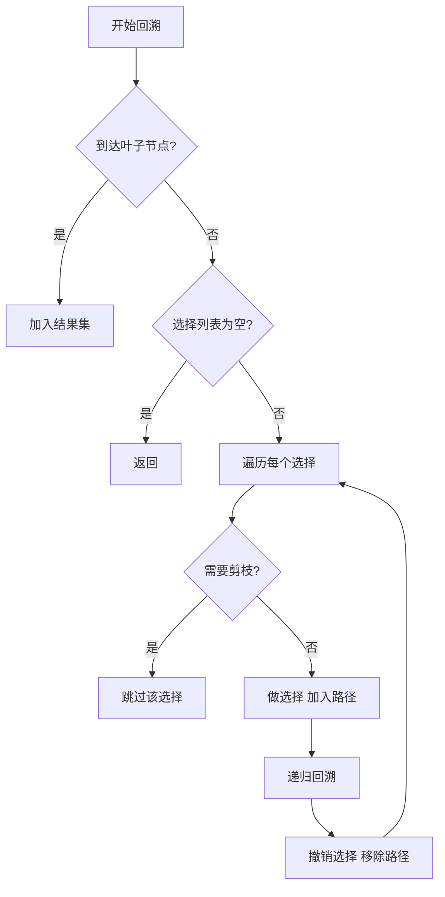
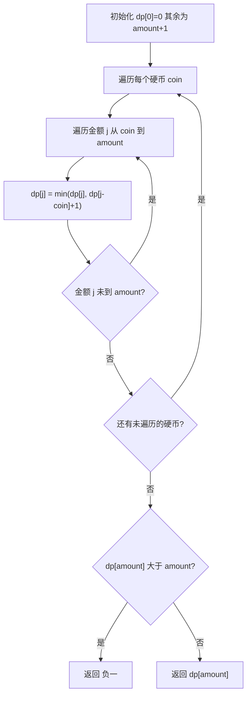
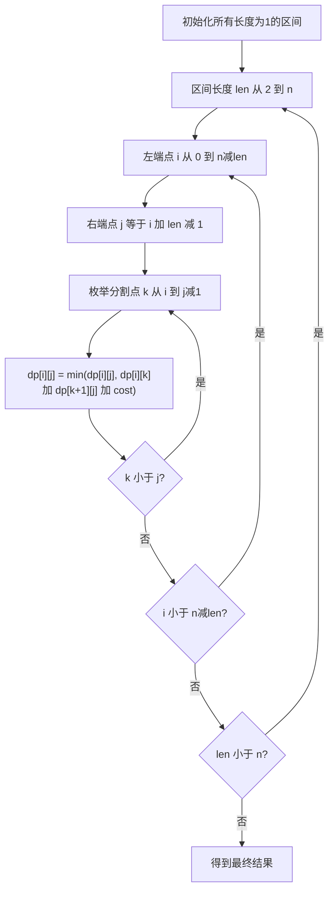
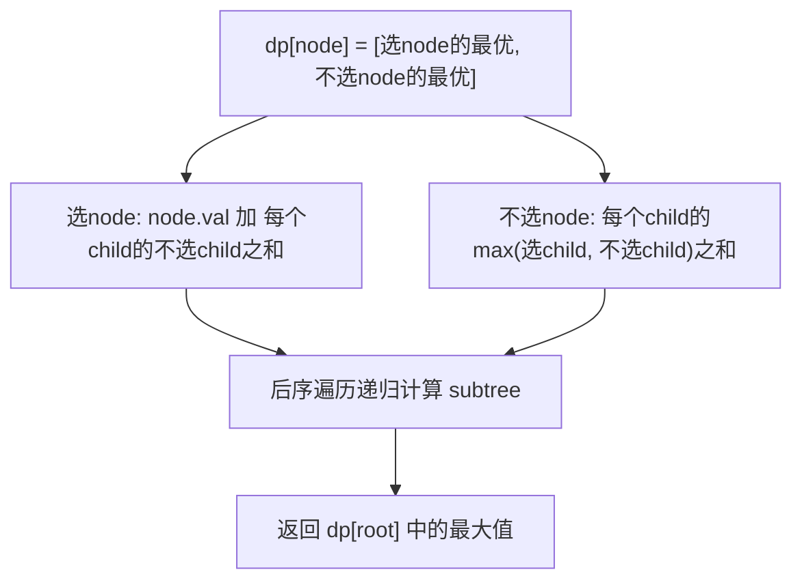
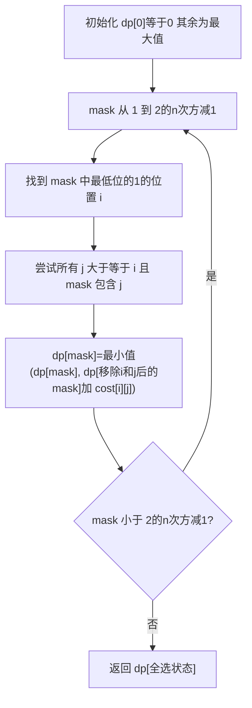

# · 回溯与动态规划

> **涵盖题型：** 回溯（子集/排列/组合/棋盘）· 经典 DP · 背包 · 区间 DP · 树形 DP · 数位 DP · 状态压缩 DP

## 📜 背景与起源

### 回溯法（Backtracking）

回溯法最早可追溯到 **Derrick Lehmer** 在 1950 年代的研究。最经典的应用是 **N 皇后问题**（N-Queens）和 **迷宫求解**（Maze Solving）。Lehmer 将回溯描述为一种系统地遍历解空间树的方法——沿着一条路径走到底，走不通就退回到上一个分岔口尝试另一条路。今天，回溯已广泛应用于约束满足问题（CSP）、数独求解、图着色等场景。

### 动态规划（Dynamic Programming）

动态规划由 **Richard Bellman** 在 1950 年代正式提出。"Dynamic"一词的选择有段轶事：Bellman 当时为美国空军（USAF）资助的 RAND 公司工作，他使用 `Dynamic` 这个模糊而积极的词来掩盖研究的数学性质，让国防部资助方不起疑。Bellman 提出 **最优性原理**（Principle of Optimality）：一个最优决策序列中的任何子序列也必须是相应子问题的最优解。这一原理奠定了 DP 的理论基石。

### 背包问题（Knapsack）

背包问题的起源可追溯到 **George Dantzig**（单纯形法的发明者）在 1950 年代的研究。最早的动因是军事物资装载问题——如何在有限的运输容量下选择最有价值的物资。Dantzig 给出了 0-1 背包的贪心非最优性证明，为后续的 DP 解法铺平了道路。

### 区间 DP

区间 DP 的经典原型是 **矩阵链乘法**（Matrix Chain Multiplication），由 Godbole 在 1973 年率先研究，后由 Cormen 等人的经典教材系统化。在区间 [i, j] 上定义状态、枚举分割点 k 进行合并的模式，是区间 DP 的标志性特征。

### 状态压缩 DP

状压 DP 的原型是 **Held-Karp 算法**（1962 年），由 Michael Held 和 Richard M. Karp 提出用于解决 **旅行商问题（TSP）**。他们用 `dp[mask][v]` 表示已访问过 mask 中的城市且当前在 v 的最短路径，这是最早也是最经典的状压 DP 应用。

## 🎯 问题域映射

| 类型 | 适用场景 | 不适用场景 |
|------|---------|-----------|
| **回溯** | 组合枚举、约束满足问题（数独、N皇后、排列生成） | 解空间过大时（n > 30），指数爆炸不可接受 |
| **动态规划** | 最优子结构 + 重叠子问题（最值/计数/可行性） | 不满足无后效性（当前决策影响未来约束）时不能用 |
| **背包** | 资源分配类、预算约束下的最优选择 | 容量过大（W > 10^7）时 DP 数组空间爆炸 |
| **区间 DP** | 回文分割、石子合并、矩阵链乘 | 区间不独立、相互影响时无法 O(n³) 处理 |
| **数位 DP** | [L,R] 范围内统计满足某种性质的数字个数 | 位数过长（>10⁵）时记忆化状态数失控 |
| **状压 DP** | n ≤ 20 的集合划分、TSP、匹配 | n > 20 时 2ⁿ 不可行，需换贪心/近似算法 |

## 一、回溯（Backtracking）

### 🔬 核心原理

回溯 = **DFS + 剪枝**。在解空间树上进行深度优先遍历，遇到不符合条件的分支立即剪掉，走不通时撤回选择回到上一状态。

```text
回溯三部曲：
1. 路径（path）：已做出的选择
2. 选择列表（choices）：当前可选的元素
3. 结束条件（base case）：到达叶子节点
```

```text
void backtrack(路径, 选择列表) {
    if (满足结束条件) {
        保存结果；
        return;
    }
    for (选择 in 选择列表) {
        做选择 → 路径.add;
        剪枝判断；
        backtrack(路径, 新选择列表);
        撤销选择 → 路径.remove;
    }
}
```

### 💡 破题直觉

**看到「所有可能」「所有组合」「所有排列」「矩阵中的路径」「N 皇后」→ 回溯**

| 问题 | 解空间 | 剪枝策略 |
|------|--------|---------|
| 子集 | 2ⁿ | 按顺序遍历，不回头 |
| 组合 | C(n,k) | 顺序遍历 + 剩余元素不足时剪枝 |
| 排列 | n! | used 数组标记已选 |
| N 皇后 | nⁿ | 列 + 对角线的攻击检测 |

### ⚠️ 边界陷阱

| 陷阱 | 场景 | 对策 |
|------|------|------|
| 结果重复 | [1,2] 和 [2,1] 在组合中重复 | 排序后按顺序选，选过的不能回头 |
| 引用共享 | 所有结果都是同一个 path | res.append(path[:]) 拷贝 |
| 剪枝不足 | 超时 | 排序 + 剩余元素判断 + 提前 break |
| 恢复状态不全 | 回溯后 path 没复原 | 确保每层做选择和撤销成对出现 |
| 重复元素 | [1,2,2] 的组合 | 排序后 used[i-1]==false 时跳过 |

### 📈 流程



### ⚡ 应试策略

```python
# 子集模板
def subsets(nums):
    res, path = [], []
    def backtrack(start):
        res.append(path[:])  # 每次进入都记录
        for i in range(start, len(nums)):
            path.append(nums[i])
            backtrack(i + 1)   # 不回头
            path.pop()
    backtrack(0)
    return res

# 有重复元素的子集
def subsets_with_dup(nums):
    nums.sort()
    res, path = [], []
    def backtrack(start):
        res.append(path[:])
        for i in range(start, len(nums)):
            if i > start and nums[i] == nums[i-1]:
                continue  # 同一层重复值跳过
            path.append(nums[i])
            backtrack(i + 1)
            path.pop()
    backtrack(0)
    return res

# 排列（无重复）
def permute(nums):
    res, path, used = [], [], [False]*len(nums)
    def backtrack():
        if len(path) == len(nums):
            res.append(path[:])
            return
        for i in range(len(nums)):
            if used[i]: continue
            used[i] = True
            path.append(nums[i])
            backtrack()
            path.pop()
            used[i] = False
    backtrack()
    return res
```

### 🏷️ 常见题型与解题方案

**① 全排列 / 排列 II**

**题目特征：** 给定 n 个不重复（或含重复）元素，返回所有可能的排列。

**解题思路：**
- 排列问题用 `used` 数组标记元素是否已被使用
- 每层遍历所有未使用的元素，递归到下一层
- 含重复元素时先排序，剪枝条件 `i > 0 and nums[i] == nums[i-1] and not used[i-1]` 保证相同值在同一层只使用一次

**推导过程：**
- 暴力解：n 个元素全排列有 n! 种，枚举所有排列 O(n!)
- 回溯树深度为 n，每层分支数递减，总节点数约为 n!，加上 path 复制 O(n)，总复杂度 O(n·n!)
- 去重剪枝：排序后，同一层中重复元素只有在首个被选中时才进入递归，后续同值直接跳过

```python
def permute(nums):
    """无重复元素的全排列"""
    res, path, used = [], [], [False] * len(nums)

    def backtrack():
        if len(path) == len(nums):
            res.append(path[:])  # ★ 拷贝，防止引用共享
            return
        for i in range(len(nums)):
            if used[i]:
                continue
            # 做选择
            used[i] = True
            path.append(nums[i])
            backtrack()
            # 撤销选择
            path.pop()
            used[i] = False

    backtrack()
    return res

def permute_unique(nums):
    """含重复元素的全排列（去重）"""
    nums.sort()
    res, path, used = [], [], [False] * len(nums)

    def backtrack():
        if len(path) == len(nums):
            res.append(path[:])
            return
        for i in range(len(nums)):
            # 剪枝：同一层中重复元素只取第一个
            if used[i] or (i > 0 and nums[i] == nums[i-1] and not used[i-1]):
                continue
            used[i] = True
            path.append(nums[i])
            backtrack()
            path.pop()
            used[i] = False

    backtrack()
    return res
```

**复杂度分析：**
- 时间：O(n·n!)，n! 个排列，每个复制 path 需要 O(n)
- 空间：O(n)，递归深度 n 加上 path 和 used 数组

**② 子集 / 子集 II**

**题目特征：** 给定 n 个元素（可能含重复），返回所有可能的子集（幂集）。

**解题思路：**
- 每个元素有"选"和"不选"两种决策，子集总数 2ⁿ
- 用回溯顺序遍历，每层进入时记录当前 path 到结果集
- 子集模板中 `backtrack(i+1)` 保证不回头（组合序而非排列序）
- 有重复元素时排序 + `i > start and nums[i] == nums[i-1]` 同层剪枝

**推导过程：**
- 暴力解：2ⁿ 个子集全部枚举
- 回溯树每一层对应一个元素，左分支选、右分支不选
- 相比排列，子集的核心区别是"按序号顺序遍历"，已选过的元素不再回头
- 时间复杂度 O(n·2ⁿ)，每个节点复制 path O(n)

```python
def subsets(nums):
    """无重复元素的子集"""
    res, path = [], []

    def backtrack(start):
        res.append(path[:])  # 每层进入时记录当前子集
        for i in range(start, len(nums)):
            path.append(nums[i])
            backtrack(i + 1)  # 不回头：下一层从 i+1 开始
            path.pop()

    backtrack(0)
    return res

def subsets_with_dup(nums):
    """含重复元素的子集（去重）"""
    nums.sort()
    res, path = [], []

    def backtrack(start):
        res.append(path[:])
        for i in range(start, len(nums)):
            # 同一层遇到相同值跳过（排序保证相邻）
            if i > start and nums[i] == nums[i - 1]:
                continue
            path.append(nums[i])
            backtrack(i + 1)
            path.pop()

    backtrack(0)
    return res
```

**复杂度分析：**
- 时间：O(n·2ⁿ)，2ⁿ 个子集，每个 path 复制 O(n)
- 空间：O(n)，递归深度 n，path 数组 O(n)

**③ 组合总和（I, II, III）**

**题目特征：** 给定候选数集合，找出所有和为 target 的组合。
- I：可重复选取
- II：不可重复选取 + 候选有重复元素
- III：从 1~9 中选 k 个数和为 n

**解题思路：**
- 排序后按顺序遍历，用 remain 跟踪还需凑多少
- 剪枝：`candidates[i] > remain` 时直接 break（排序的意义）
- I：可重复选 → `backtrack(i, remain - c[i])` 传递 i 而非 i+1
- II：不可重复选 + 去重 → `backtrack(i+1, ...)` + `i > start` 剪枝
- III：限定个数 k + 数字范围 1~9

```python
def combination_sum(candidates, target):
    """可重复选取，求所有和为 target 的组合"""
    res, path = [], []
    candidates.sort()

    def backtrack(start, remain):
        if remain == 0:
            res.append(path[:])
            return
        for i in range(start, len(candidates)):
            if candidates[i] > remain:
                break  # ★ 核心剪枝：排序后后面的更大，直接跳出
            path.append(candidates[i])
            backtrack(i, remain - candidates[i])  # 可重复选，传递 i
            path.pop()

    backtrack(0, target)
    return res

def combination_sum2(candidates, target):
    """不可重复选取，含重复元素"""
    candidates.sort()
    res, path = [], []

    def backtrack(start, remain):
        if remain == 0:
            res.append(path[:])
            return
        for i in range(start, len(candidates)):
            if candidates[i] > remain:
                break
            if i > start and candidates[i] == candidates[i - 1]:
                continue  # 同层去重
            path.append(candidates[i])
            backtrack(i + 1, remain - candidates[i])  # 不可重复选
            path.pop()

    backtrack(0, target)
    return res
```

**复杂度分析：**
- 时间：O(2ⁿ)，最坏情况下每个子集都检查一次
- 空间：O(target)，递归深度最多 target（最小硬币为 1 的情况）

**④ N 皇后**

**题目特征：** 在 n×n 棋盘上放置 n 个皇后，任意两个不能在同一行、同一列或同一对角线上。

**解题思路：**
- 每行放一个皇后（降低一维），只需检查列和对角线冲突
- 用三个集合记录已占用的列、主对角线（`row - col`）、副对角线（`row + col`）
- 主对角线特征：同一主对角线上 `row - col` 为常数；副对角线：`row + col` 为常数
- 回溯到第 n 行即找到一个解

**推导过程：**
- 暴力解选格子：C(n², n) 不可行
- 逐行优化：每行只放一个 → nⁿ 种放置方式
- 回溯剪枝：列和对角线冲突检测 → 实际远小于 nⁿ，经验约为 O(n!)
- 优化点：用集合 O(1) 查冲突 vs 数组遍历 O(n)

```python
def solve_n_queens(n):
    cols, diag1, diag2 = set(), set(), set()  # 列、主对角、副对角
    board = [['.'] * n for _ in range(n)]
    res = []

    def backtrack(row):
        if row == n:
            res.append([''.join(r) for r in board])
            return
        for col in range(n):
            if col in cols or (row - col) in diag1 or (row + col) in diag2:
                continue
            # 放置皇后
            board[row][col] = 'Q'
            cols.add(col)
            diag1.add(row - col)
            diag2.add(row + col)
            backtrack(row + 1)
            # 撤销
            board[row][col] = '.'
            cols.remove(col)
            diag1.remove(row - col)
            diag2.remove(row + col)

    backtrack(0)
    return res
```

**复杂度分析：**
- 时间：O(n!)，最坏接近 n!，远小于 nⁿ
- 空间：O(n²)，棋盘 n×n，递归深度 n

**⑤ 括号生成**

**题目特征：** 输入 n，生成所有有效的 n 对括号组合。

**解题思路：**
- DFS 过程中维护左右括号计数
- 保证在任何前缀中，右括号数量 ≤ 左括号数量
- `left < n` 时可放左括号，`right < left` 时可放右括号

```python
def generate_parenthesis(n):
    res = []

    def backtrack(s, left, right):
        """s:当前字符串 left:已用左括号数 right:已用右括号数"""
        if len(s) == 2 * n:
            res.append(s)
            return
        if left < n:
            backtrack(s + '(', left + 1, right)
        if right < left:  # ★ 关键：右括号不能超过左括号
            backtrack(s + ')', left, right + 1)

    backtrack('', 0, 0)
    return res
```

**复杂度分析：**
- 时间：O(4ⁿ/√n)，精确值为卡特兰数 C(2n,n)/(n+1)
- 空间：O(n)，递归深度 2n

**⑥ 单词搜索**

**题目特征：** 在 m×n 字符矩阵中查找给定单词是否存在（相邻格子 4 方向移动）。

**解题思路：**
- DFS + 标记（直接修改原矩阵省 visited 数组空间）
- 从每个格子出发，匹配第一个字符后开始 4 方向深度搜索
- 剪枝：越界、字符不匹配、已访问

```python
def exist(board, word):
    m, n = len(board), len(board[0])

    def dfs(i, j, k):
        if k == len(word):
            return True
        if (i < 0 or i >= m or j < 0 or j >= n
                or board[i][j] != word[k]):
            return False

        # 标记已访问（临时修改原矩阵）
        tmp, board[i][j] = board[i][j], '/'
        found = (dfs(i + 1, j, k + 1) or dfs(i - 1, j, k + 1)
                 or dfs(i, j + 1, k + 1) or dfs(i, j - 1, k + 1))
        board[i][j] = tmp  # 恢复
        return found

    for i in range(m):
        for j in range(n):
            if board[i][j] == word[0] and dfs(i, j, 0):
                return True
    return False
```

**复杂度分析：**
- 时间：O(m·n·3^L)，L 为单词长度，每步 3 个方向（回头路被 visited 标记剪掉）
- 空间：O(L)，递归深度

## 二、动态规划（Dynamic Programming）

### 🔬 核心原理

DP 解决的是一类 **具有最优子结构 + 重叠子问题** 的问题。核心是 **状态定义 + 转移方程 + base case**。

```text
DP 五步法：
1. 确定状态（dp[i] / dp[i][j] 表示什么）
2. 推导转移方程（如何从已知状态推导）
3. 确定初始条件（base case）
4. 确认遍历顺序（正序/倒序）
5. 返回最终结果（dp[n] / dp[m][n]）
```

### 💡 破题直觉

**看到「最大/最小/最优」「多少种方案」「可行性判断」「子数组/子序列」→ DP**

**如何区分 DP 与回溯？**

| DP | 回溯 |
|----|------|
| 求最优值 / 计数 | 求所有具体方案 |
| 最优子结构 | 穷举搜索 |
| O(poly(n)) | O(指数级) |
| 迭代填表 | 递归 + 剪枝 |

### 状态设计秘籍

| 问题类型 | 状态维度 | 例子 |
|---------|---------|------|
| 一维简单 | dp[i] | 斐波那契、爬楼梯 |
| 一维优化 | dp[i] 选或不选 | 最大子数组和、打家劫舍 |
| 二维 | dp[i][j] 双序列/区间 | LCS、编辑距离 |
| 三维 | dp[i][j][k] | 三维背包、含限制 |
| 滚动数组 | 空间 O(k) | 背包、斐波那契 |

### 🏷️ 常见题型与解题方案

**① 斐波那契 / 爬楼梯 / 打家劫舍 I**

**题目特征：** 线性递推结构，当前状态仅依赖前一个或前两个状态。

**解题思路：**
- 斐波那契：`f(n) = f(n-1) + f(n-2)`，爬楼梯同理
- 打家劫舍：`dp[i] = max(dp[i-1], dp[i-2] + nums[i])`，每家选或不选

**推导过程（以爬楼梯为例）：**
- 暴力递归：`f(n) = f(n-1) + f(n-2)`，O(2ⁿ) 指数爆炸 ❌
- 记忆化递归：用字典缓存已计算值，O(n) ✅
- 自底向上 DP：`dp[i] = dp[i-1] + dp[i-2]`，O(n) O(n)
- 滚动变量优化：只保留前两个值 `a, b = b, a+b`，O(n) O(1) ✅ 最优

```python
def climb_stairs(n):
    """爬楼梯：滚动变量 O(1) 空间"""
    if n <= 2:
        return n
    a, b = 1, 2  # f(1), f(2)
    for _ in range(3, n + 1):
        a, b = b, a + b
    return b

def rob(nums):
    """打家劫舍 I：相邻不可同时偷"""
    prev, curr = 0, 0
    for num in nums:
        prev, curr = curr, max(curr, prev + num)
    return curr
```

**复杂度分析：**
- 时间：O(n)
- 空间：O(1)（滚动变量）

**② 最大子数组和（Kadane 算法）**

**题目特征：** 连续子数组的最大和。

**解题思路：**
- 核心思想：`curr_max = max(num, curr_max + num)`——要么抛弃前面重新开始，要么延续当前子数组
- 全局 max 维护历史最大值

**推导过程：**
- 暴力 O(n³)：枚举所有子数组 [i,j]，求和比较 ❌
- 前缀和 O(n²)：`sum[i..j] = prefix[j] - prefix[i-1]`，枚举 i,j ❌
- **Kadane O(n)**：线性扫描，`dp[i] = max(nums[i], dp[i-1] + nums[i])`，表示以 i 结尾的最大子数组和 ✅

```python
def max_subarray(nums):
    """Kadane 算法：最大子数组和"""
    curr_max = global_max = nums[0]
    for num in nums[1:]:
        curr_max = max(num, curr_max + num)  # 延续 or 重新开始
        global_max = max(global_max, curr_max)
    return global_max
```

**复杂度分析：**
- 时间：O(n)
- 空间：O(1)

**③ 最长递增子序列（LIS）**

**题目特征：** 求最长严格递增的子序列（不一定连续）。

**解题思路（两种方法）：**

**方法一：O(n²) DP**
- `dp[i] = max(dp[j] + 1)` 对所有 `j < i` 且 `nums[j] < nums[i]`
- 返回 `max(dp)`

**方法二：O(n log n) 贪心+二分（最优）**
- 维护数组 `tails`，`tails[k]` 表示长度为 k+1 的递增子序列的最小末尾值
- 用二分查找找到第一个 `≥ nums[i]` 的位置并替换
- 本质是让末尾值尽可能小，给后续元素留空间

**推导过程：**
- 暴力：枚举所有子序列 2ⁿ ❌
- DP O(n²)：n=2000 勉强可用，n=10⁵ 不可行 ❌
- 贪心+二分 O(n log n)：n=10⁵ 可接受 ✅

```python
def length_of_lis_dp(nums):
    """O(n²) DP 实现"""
    if not nums:
        return 0
    dp = [1] * len(nums)
    for i in range(len(nums)):
        for j in range(i):
            if nums[j] < nums[i]:
                dp[i] = max(dp[i], dp[j] + 1)
    return max(dp)

def length_of_lis(nums):
    """O(n log n) 贪心 + 二分"""
    tails = []
    for num in nums:
        # 二分查找第一个 >= num 的位置
        lo, hi = 0, len(tails)
        while lo < hi:
            mid = (lo + hi) // 2
            if tails[mid] < num:
                lo = mid + 1
            else:
                hi = mid
        if lo == len(tails):
            tails.append(num)
        else:
            tails[lo] = num
    return len(tails)
```

**复杂度分析：**
- DP 法：时间 O(n²)，空间 O(n)
- 贪心+二分法：时间 O(n log n)，空间 O(n)

**④ 最长公共子序列（LCS）**

**题目特征：** 求两个字符串的最长公共子序列（不要求连续）。

**解题思路：**
- 二维 DP：`dp[i][j]` 表示 `s1[0..i-1]` 和 `s2[0..j-1]` 的 LCS 长度
- 转移：`s1[i-1] == s2[j-1]` → `dp[i][j] = dp[i-1][j-1] + 1`
- 不等：`dp[i][j] = max(dp[i-1][j], dp[i][j-1])`

**推导过程：**
- 暴力枚举 s1 的子序列（2^m），检查是否在 s2 中 → O(2^m·n) ❌
- DP O(mn)：两个子问题重叠，递推填表 ✅

```python
def longest_common_subsequence(text1, text2):
    m, n = len(text1), len(text2)
    dp = [[0] * (n + 1) for _ in range(m + 1)]

    for i in range(1, m + 1):
        for j in range(1, n + 1):
            if text1[i - 1] == text2[j - 1]:
                dp[i][j] = dp[i - 1][j - 1] + 1
            else:
                dp[i][j] = max(dp[i - 1][j], dp[i][j - 1])

    return dp[m][n]
```

**复杂度分析：**
- 时间：O(mn)
- 空间：O(mn)，可优化至 O(min(m,n)) 滚动数组

**⑤ 编辑距离**

**题目特征：** 将字符串 A 通过插入/删除/替换变为字符串 B 的最少操作次数。

**解题思路：**
- 二维 DP：`dp[i][j]` 表示 word1[0..i-1] → word2[0..j-1] 的最少操作数
- 转移：
  - 末尾字符相同：`dp[i][j] = dp[i-1][j-1]`
  - 不相同：取三类操作最小值 + 1
    - 删除：`dp[i-1][j] + 1`（删 word1[i-1]）
    - 插入：`dp[i][j-1] + 1`（向 word1 插入 word2[j-1]）
    - 替换：`dp[i-1][j-1] + 1`

```python
def min_distance(word1, word2):
    m, n = len(word1), len(word2)
    dp = [[0] * (n + 1) for _ in range(m + 1)]

    # base case：空串的编辑距离
    for i in range(m + 1):
        dp[i][0] = i
    for j in range(n + 1):
        dp[0][j] = j

    for i in range(1, m + 1):
        for j in range(1, n + 1):
            if word1[i - 1] == word2[j - 1]:
                dp[i][j] = dp[i - 1][j - 1]
            else:
                dp[i][j] = min(
                    dp[i - 1][j],     # 删除
                    dp[i][j - 1],     # 插入
                    dp[i - 1][j - 1]  # 替换
                ) + 1

    return dp[m][n]
```

**复杂度分析：**
- 时间：O(mn)
- 空间：O(mn)，可优化至 O(min(m,n)) 滚动数组

## 三、背包问题

### 🔬 核心原理

背包问题的本质是 **有限资源下选择物品的最优组合**，是所有 DP 中最经典的类型。

```python
0-1 背包：
  每件物品选或不选 → dp[i][j] = max(dp[i-1][j], dp[i-1][j-w[i]] + v[i])
  空间优化 → 一维数组，j 从大到小遍历

完全背包：
  每件物品无限选 → dp[i][j] = max(dp[i-1][j], dp[i][j-w[i]] + v[i])
  空间优化 → 一维数组，j 从小到大遍历

多重背包：
  每件物品有限个 → 二进制拆分转化为 0-1 背包
```

### 💡 破题直觉

```python
0-1 背包 ← "每个物品选一次"
完全背包 ← "每个物品可以选无限次"
多重背包 ← "每个物品最多选 k 次"
分组背包 ← "每组只能选一个"
```

**状态：** `dp[j]` = 容量为 j 的背包能装的最大价值
**初始化：** `dp[0] = 0`，其余 `-∞`（恰好装满）或 `0`（不超过容量）

### ⚠️ 边界陷阱

| 陷阱 | 场景 | 对策 |
|------|------|------|
| 恰好装满 | 要求恰好装满 | dp 初始化为 MIN，dp[0]=0，检查 dp[W]!=MIN |
| 至多装 | 不超过容量 | dp 初始化为 0 |
| 物品重量为 0 | 循环顺序影响 | 0-1 背包先遍历物品再逆序遍历容量 |

### 📈 递进示例

**题目：零钱兑换（完全背包，求最少硬币数）**

| 解法 | 时间 | 空间 | 思路 |
|------|-----|------|------|
| 贪心（错误） | — | — | 用大面额优先，无法保证最优 |
| 暴力回溯 | O(Sᵏ) | O(k) | 枚举所有组合 |
| BFS 剪枝 | O(S×n) | O(S) | 从 0 到 amount 最短路径 |
| **DP（最优）** | **O(S×n)** | **O(S)** | dp[i] = min(dp[i], dp[i-coin] + 1) |



### ⚡ 应试策略

```python
# 0-1 背包（一维优化）
def knapsack_01(weights, values, W):
    dp = [0] * (W + 1)
    for i in range(len(weights)):
        for j in range(W, weights[i] - 1, -1):
            dp[j] = max(dp[j], dp[j - weights[i]] + values[i])
    return dp[W]

# 完全背包
def knapsack_complete(weights, values, W):
    dp = [0] * (W + 1)
    for i in range(len(weights)):
        for j in range(weights[i], W + 1):
            dp[j] = max(dp[j], dp[j - weights[i]] + values[i])
    return dp[W]

# 零钱兑换（求最少数量）
def coin_change(coins, amount):
    dp = [amount + 1] * (amount + 1)
    dp[0] = 0
    for coin in coins:
        for j in range(coin, amount + 1):
            dp[j] = min(dp[j], dp[j - coin] + 1)
    return -1 if dp[amount] > amount else dp[amount]
```

### 🏷️ 常见题型与解题方案

**① 分割等和子集**

**题目特征：** 给定非空数组，判断能否将其分割成两个子集，使两子集元素和相等。

**解题思路：**
- 总和不可能是奇数 → 直接返回 False
- 问题转化为：能否选出若干元素使其和为 `sum(nums) // 2`
- 0-1 背包：`dp[j]` 表示能否凑出和为 j
- 转移：`dp[j] = dp[j] or dp[j - nums[i]]`

**推导过程：**
- 回溯 O(2ⁿ)：每个元素选或不选，n=20 以上不可行 ❌
- 0-1 背包 O(n·sum)：sum ≤ 10⁴ × 200 = 2×10⁶，可接受 ✅

```python
def can_partition(nums):
    total = sum(nums)
    if total % 2 == 1:
        return False
    target = total // 2
    dp = [False] * (target + 1)
    dp[0] = True

    for num in nums:
        for j in range(target, num - 1, -1):  # 倒序 0-1 背包
            if dp[j - num]:
                dp[j] = True
        if dp[target]:  # 提前返回
            return True

    return dp[target]
```

**复杂度分析：**
- 时间：O(n·target) = O(n·sum/2)
- 空间：O(target)

**② 目标和（加减凑数）**

**题目特征：** 给每个数前面加 `+` 或 `-`，使运算结果等于 target，求方案数。

**解题思路：**
- 数学转化：设添加 `+` 的和为 P，`-` 的和为 N → P - N = target, P + N = sum → P = (sum + target) / 2
- 问题转化为：从数组中选出若干元素使其和为 P
- 必须满足 `(sum + target) % 2 == 0` 且 `target ≤ sum`
- 0-1 背包计数：`dp[j] = dp[j] + dp[j - nums[i]]`

```python
def find_target_sum_ways(nums, target):
    total = sum(nums)
    if (total + target) % 2 == 1 or abs(target) > total:
        return 0
    P = (total + target) // 2
    dp = [0] * (P + 1)
    dp[0] = 1

    for num in nums:
        for j in range(P, num - 1, -1):
            dp[j] += dp[j - num]

    return dp[P]
```

**复杂度分析：**
- 时间：O(n·P) = O(n·(sum+target)/2)
- 空间：O(P)

**③ 零钱兑换 / 零钱兑换 II**

**题目特征：** 给定不同面额的硬币和总金额，求最少硬币数（I）或组合方案数（II）。

**解题思路：**
- I（求最少）：完全背包，`dp[j] = min(dp[j], dp[j-coin] + 1)`
- II（求方案数）：完全背包计数，`dp[j] = dp[j] + dp[j - coin]`
- 完全背包容量正序遍历（同一物品可多次使用）

**推导过程：**
- 贪心（先大后小）❌ 反例：coins=[1,3,4], amount=6，贪心得 4+1+1=3 枚，最优 3+3=2 枚
- 回溯 O(Sᵏ) ❌ 指数爆炸
- BFS 最短路 O(S·n)，但 DP 更简洁 ✅
- 完全背包 O(S·n) ✅ 最优

```python
def coin_change(coins, amount):
    """零钱兑换 I：求最少硬币数"""
    dp = [amount + 1] * (amount + 1)
    dp[0] = 0

    for coin in coins:
        for j in range(coin, amount + 1):  # 正序 -> 完全背包
            dp[j] = min(dp[j], dp[j - coin] + 1)

    return -1 if dp[amount] > amount else dp[amount]

def change(amount, coins):
    """零钱兑换 II：求方案数（完全背包计数）"""
    dp = [0] * (amount + 1)
    dp[0] = 1

    for coin in coins:
        for j in range(coin, amount + 1):
            dp[j] += dp[j - coin]

    return dp[amount]
```

**复杂度分析：**
- 时间：O(n·amount)
- 空间：O(amount)

## 四、区间 DP

### 🔬 核心原理

区间 DP 在 **区间 [i, j] 上定义状态**，通过枚举中间分割点 k 来合并左右区间。

```python
状态：dp[i][j] = 区间 [i, j] 上的最优解
枚举：k = i .. j-1, dp[i][j] = combine(dp[i][k], dp[k+1][j])
遍历顺序：按区间长度从小到大（len = 1 → 2 → ... → n）
```

### 💡 破题直觉

**看到「回文串分割」「石子合并」「戳气球」「括号生成」→ 区间 DP**

### ⚠️ 边界陷阱

| 陷阱 | 场景 | 对策 |
|------|------|------|
| 遍历顺序 | 用到子区间时子区间必须已计算 | 按长度从小到大遍历 |
| 越界 | j > n-1 | 遍历时控制 j < n |
| 初始化 | 长度为 1 的区间 | 先初始化所有 len=1 的情况 |

### 📈 流程



### 🏷️ 常见题型与解题方案

**① 最长回文子串 / 回文子串数**

**题目特征：** 求字符串中的最长回文子串（连续），或统计回文子串的总个数。

**解题思路：**
- `dp[i][j]` 表示 `s[i..j]` 是否为回文串
- 转移：`s[i] == s[j]` 且 `(j - i <= 2 or dp[i+1][j-1])` → `dp[i][j] = True`
- j - i ≤ 2 时直接判断（长度为 1,2,3 的边界情况）
- 按子串长度从小到大遍历

**推导过程：**
- 暴力 O(n³)：枚举所有子串 [i,j]，逐个检查是否回文 ❌
- 中心扩展 O(n²)：以每个字符为中心向两边扩展，比 DP 省空间 ✅
- 区间 DP O(n²)：代码统一，扩展性好 ✅

```python
def longest_palindrome(s):
    """最长回文子串（区间 DP）"""
    n = len(s)
    if n < 2:
        return s
    dp = [[False] * n for _ in range(n)]
    start, max_len = 0, 1

    # 所有长度为 1 的回文
    for i in range(n):
        dp[i][i] = True

    # 按长度遍历
    for length in range(2, n + 1):
        for i in range(n - length + 1):
            j = i + length - 1
            if s[i] == s[j]:
                if length <= 3:
                    dp[i][j] = True  # 长度 2 或 3
                else:
                    dp[i][j] = dp[i + 1][j - 1]
            if dp[i][j] and length > max_len:
                start, max_len = i, length

    return s[start:start + max_len]

def count_substrings(s):
    """回文子串总数"""
    n = len(s)
    dp = [[False] * n for _ in range(n)]
    count = 0

    for length in range(1, n + 1):
        for i in range(n - length + 1):
            j = i + length - 1
            if s[i] == s[j]:
                if length <= 3:
                    dp[i][j] = True
                else:
                    dp[i][j] = dp[i + 1][j - 1]
            if dp[i][j]:
                count += 1

    return count
```

**复杂度分析：**
- 时间：O(n²)
- 空间：O(n²)，可优化至 O(n) 滚动数组（回文子串数）

**② 戳气球**

**题目特征：** 戳破所有气球获得分数，每次戳第 i 个气球得 `nums[i-1] × nums[i] × nums[i+1]` 分，相邻气球被戳后两侧变紧挨。求最大分数。

**解题思路：**
- **反向思考**：将过程反转——不是"戳气球"而是"放气球"
- 最后戳破的气球作为区间分割点
- 先在数组两端补 1，方便处理边界
- `dp[i][j]` 表示开区间 (i, j) 内所有气球被戳破的最大得分（不含 i 和 j）
- 转移：`dp[i][j] = max(dp[i][k] + dp[k][j] + nums[i]*nums[k]*nums[j])`，k 是 (i,j) 中最后被戳破的气球

**推导过程：**
- 暴力全排列 O(n!)：n 个气球 n! 种戳法 ❌
- 回溯+剪枝仍为指数级 ❌
- 区间 DP O(n³)：反向思考后，每个区间枚举分割点 k，n ≤ 300 可接受 ✅

```python
def max_coins(nums):
    n = len(nums)
    # 补 1 便于处理边界
    nums = [1] + nums + [1]
    dp = [[0] * (n + 2) for _ in range(n + 2)]

    # 按区间长度遍历
    for length in range(1, n + 1):
        for i in range(1, n - length + 2):
            j = i + length - 1
            # 枚举 (i,j) 中最后被戳破的气球 k
            for k in range(i, j + 1):
                dp[i][j] = max(
                    dp[i][j],
                    dp[i][k - 1] + dp[k + 1][j] + nums[i - 1] * nums[k] * nums[j + 1]
                )

    return dp[1][n]
```

**复杂度分析：**
- 时间：O(n³)，n ≤ 300 可接受
- 空间：O(n²)

**③ 石子合并**

**题目特征：** 一排石子，每次合并相邻两堆，代价为两堆重量之和，求合并成一堆的最小总代价。

**解题思路：**
- `dp[i][j]` 表示合并区间 [i, j] 的最小代价
- 转移：`dp[i][j] = min(dp[i][k] + dp[k+1][j]) + sum[i..j]`，枚举分割点 k
- `sum[i..j]` 为合并区间 [i,j] 最后一步的代价，用前缀和 O(1) 计算

```python
def merge_stones(stones):
    n = len(stones)
    if n == 1:
        return 0

    # 前缀和
    prefix = [0] * (n + 1)
    for i in range(n):
        prefix[i + 1] = prefix[i] + stones[i]

    # 区间和快速计算
    def range_sum(i, j):
        return prefix[j + 1] - prefix[i]

    dp = [[0] * n for _ in range(n)]

    # 按长度遍历
    for length in range(2, n + 1):
        for i in range(n - length + 1):
            j = i + length - 1
            dp[i][j] = float('inf')
            for k in range(i, j):
                dp[i][j] = min(dp[i][j], dp[i][k] + dp[k + 1][j])
            dp[i][j] += range_sum(i, j)

    return dp[0][n - 1]
```

**复杂度分析：**
- 时间：O(n³)，经典三重循环
- 空间：O(n²)
- 优化：四边形不等式可优化到 O(n²)

## 五、树形 DP

### 🔬 核心原理

在树上做 DP，**子树的 DP 值组合成当前节点的 DP 值**。后序遍历（子 → 父）是最自然的计算顺序。

**经典模式：** `dp[node][0/1]` 表示 node 选或不选的子树最优值。

### 💡 破题直觉

**看到「树上的最大/最小」「选择节点」「树上独立集」→ 树形 DP**

```python
树形 DP 模板：
def dfs(node):
    处理 base case
    for child in node.children:
        dfs(child)  # 先计算子树
        用 child 的 dp 值更新 node 的 dp 值
```

### 📈 示例：打家劫舍 III



### 🏷️ 常见题型与解题方案

**① 打家劫舍 III**

**题目特征：** 二叉树结构的打家劫舍——相邻节点（父子）不能同时偷。

**解题思路：**
- 后序遍历（子 → 父）：先计算左右子树的 DP 值，再计算当前节点
- 每个节点返回二维数组 `[不选当前节点的最大收益，选当前节点的最大收益]`
- `不选当前` = 左子树 max + 右子树 max
- `选当前` = node.val + 左子树不选 + 右子树不选

```python
def rob_iii(root):
    def dfs(node):
        if not node:
            return [0, 0]  # [不选, 选]

        left = dfs(node.left)
        right = dfs(node.right)

        # 不选当前节点：左右子树可任选
        not_rob = max(left) + max(right)
        # 选当前节点：左右子树都不能选
        rob = node.val + left[0] + right[0]

        return [not_rob, rob]

    return max(dfs(root))
```

**复杂度分析：**
- 时间：O(n)，每个节点遍历一次
- 空间：O(h)，递归栈深度为树高

**② 二叉树中的最大路径和**

**题目特征：** 二叉树中任意节点到任意节点的一条路径（不一定经过根），求路径上节点值之和的最大值。

**解题思路：**
- 后序遍历：先计算左右子树的最大"单边贡献"
- 每个节点返回 `max(0, 左子树贡献) + node.val + max(0, 右子树贡献)` 作为经过当前节点的路径和
- 全局变量维护最大值
- 函数返回值是当前节点**向父节点**能提供的最大路径（只能选一条边往上走，不能分叉）

```python
def max_path_sum(root):
    max_sum = float('-inf')

    def dfs(node):
        nonlocal max_sum
        if not node:
            return 0

        # 计算左右子树的最大单边贡献（负贡献取 0 抛弃）
        left_gain = max(dfs(node.left), 0)
        right_gain = max(dfs(node.right), 0)

        # 经过当前节点的路径和 = 左+右+当前
        current_sum = left_gain + node.val + right_gain
        max_sum = max(max_sum, current_sum)

        # 返回给父节点：只能选一边 + 当前节点
        return node.val + max(left_gain, right_gain)

    dfs(root)
    return max_sum
```

**复杂度分析：**
- 时间：O(n)，每个节点遍历一次
- 空间：O(h)，递归栈深度

## 六、数位 DP

### 🔬 核心原理

数位 DP = **按位枚举 + 记忆化搜索**，解决"在 [L, R] 范围内满足某种数字性质的数的个数"。

```python
状态：dp[pos][tight][leading_zero][state]
pos: 当前处理到第几位
tight: 是否被上界约束（prefix matched）
leading_zero: 前导零状态
state: 题目特定状态（数字和、是否含某数字等）
```

### 💡 破题直觉

**看到「区间内有多少个数字满足...」「数字的各位之和」→ 数位 DP**

### ⚠️ 边界陷阱

| 陷阱 | 场景 | 对策 |
|------|------|------|
| 前导零 | 数字 012 不是 12 | 用 leading_zero 标记分开处理 |
| 上下界 | [L, R] 区间 | count(R) - count(L-1) |
| 状态膨胀 | 记忆化 key 太多 | 只有 !tight && !lead_zero 时才缓存 |

### ⚡ 应试策略

```python
# 数位 DP 模板（记忆化搜索）
def count(n):
    digits = list(map(int, str(n)))
    @lru_cache(None)
    def dfs(pos, tight, ...):
        if pos == len(digits): return 1 if 满足条件 else 0
        limit = digits[pos] if tight else 9
        total = 0
        for d in range(limit + 1):
            total += dfs(pos+1, tight and d==limit, ...)
        return total
    return dfs(0, True, ...)
```

### 🏷️ 常见题型与解题方案

**① 数字 1 的个数**

**题目特征：** 统计 1 到 n 的所有整数中，数字 1 出现的总次数。

**解题思路（两种方法）：**

**方法一：逐位统计法 O(log n)**
- 对每一位，计算该位上 1 出现的次数
- 当前位 cur、高位 high、低位 low、因子 factor
- cur == 0：次数 = high × factor
- cur == 1：次数 = high × factor + low + 1
- cur > 1：次数 = (high + 1) × factor

**方法二：数位 DP（通用模板）**
- `dp[pos][count][tight]` 记忆化搜索
- pos 为当前位，count 为已出现的 1 的个数，tight 为上界约束

```python
def count_digit_one(n):
    """逐位统计法 O(log n)"""
    if n <= 0:
        return 0
    count = 0
    factor = 1
    while factor <= n:
        high = n // (factor * 10)
        cur = (n // factor) % 10
        low = n % factor

        if cur == 0:
            count += high * factor
        elif cur == 1:
            count += high * factor + low + 1
        else:
            count += (high + 1) * factor

        factor *= 10

    return count

def count_digit_one_digit_dp(n):
    """数位 DP 通用解法"""
    digits = list(map(int, str(n)))

    from functools import lru_cache

    @lru_cache(None)
    def dfs(pos, count, tight):
        if pos == len(digits):
            return count
        limit = digits[pos] if tight else 9
        total = 0
        for d in range(limit + 1):
            total += dfs(pos + 1, count + (d == 1), tight and d == limit)
        return total

    return dfs(0, 0, True)
```

**复杂度分析：**
- 逐位法：时间 O(log n)，空间 O(1)
- 数位 DP：时间 O(位数 × 10 × 状态数) ≈ O(log n × 10 × 2)，通用但常数稍大

## 七、状态压缩 DP

### 🔬 核心原理

用一个 **整数的二进制位** 表示集合中元素的选择状态，常用于 n ≤ 20 的场景。

```python
状态：dp[mask] = 在 mask 集合下的最优解
转移：dp[mask | (1<<i)] = min(dp[mask | (1<<i)], dp[mask] + cost)
mask 经过: 0 → 1 → 2 → ... → (1<<n)-1
```

### 💡 破题直觉

**看到「n ≤ 16」「集合划分」「旅行商问题 TSP」「匹配问题」→ 状压 DP**

### 📈 示例



### 🏷️ 常见题型与解题方案

**① 旅行商问题（TSP）**

**题目特征：** 给定 n 个城市和两两之间的距离，从起点出发访问每个城市恰好一次并返回起点，求最短路径长度。

**解题思路：**
- `dp[mask][v]` 表示已访问过 mask 中的城市，当前在 v 的最短路径
- 转移：从 u 到 v，`new_mask = mask | (1 << v)` → 尝试更新 `dp[new_mask][v]`
- 起点固定为 0，最终答案为 `min(dp[(1<<n)-1][v] + dist[v][0])` 回到起点

**推导过程：**
- 暴力全排列 O(n!)：n=12 就接近 4.8 亿 ❌
- Held-Karp 算法 O(n²·2ⁿ)：n ≤ 20 可接受 ✅

```python
def tsp(dist):
    """旅行商问题，dist[i][j] 为 i 到 j 的距离，n 为城市数"""
    n = len(dist)
    INF = float('inf')
    dp = [[INF] * n for _ in range(1 << n)]
    dp[1][0] = 0  # 从城市 0 出发，mask=1

    for mask in range(1, 1 << n):
        # 如果 mask 不包含起点 0，跳过
        if not (mask & 1):
            continue
        for u in range(n):
            if not (mask >> u) & 1:
                continue
            if dp[mask][u] == INF:
                continue
            for v in range(n):
                if (mask >> v) & 1:
                    continue  # v 已访问
                new_mask = mask | (1 << v)
                dp[new_mask][v] = min(
                    dp[new_mask][v],
                    dp[mask][u] + dist[u][v]
                )

    # 从各城市回到起点 0
    full_mask = (1 << n) - 1
    ans = INF
    for v in range(1, n):
        ans = min(ans, dp[full_mask][v] + dist[v][0])

    return ans
```

**复杂度分析：**
- 时间：O(n²·2ⁿ)
- 空间：O(n·2ⁿ)，可优化至 O(n·2ⁿ⁻¹)

**② 最短路径 / 匹配问题（位运算状态表示）**

**题目特征：** n 个元素需要两两配对（n 为偶数），每对的代价已知，求最小总代价。或类似的需要在集合上做划分/匹配的状态压缩问题。

**解题思路：**
- 用 mask 的二进制位表示哪些元素已被匹配
- `dp[mask]` 表示在 mask 状态下的最小总代价
- 每次找到 mask 中最低位的 1，将其与另一个未匹配元素配对
- lowbit 优化：`i = (mask & -mask).bit_length() - 1` 快速取出最低位索引

```python
def min_cost_pairing(cost):
    """最小代价配对，cost[i][j] 为 i 和 j 配对的代价，n 为偶数"""
    n = len(cost)
    INF = float('inf')
    dp = [INF] * (1 << n)
    dp[0] = 0

    for mask in range(1 << n):
        if dp[mask] == INF:
            continue
        # 找到第一个未配对的元素
        for i in range(n):
            if not (mask >> i) & 1:
                break
        # 为 i 找一个未配对的 j
        for j in range(i + 1, n):
            if not (mask >> j) & 1:
                new_mask = mask | (1 << i) | (1 << j)
                dp[new_mask] = min(dp[new_mask], dp[mask] + cost[i][j])

    return dp[(1 << n) - 1]

def min_cost_pairing_lowbit(cost):
    """用 lowbit 优化找第一个未配对元素"""
    n = len(cost)
    INF = float('inf')
    dp = [INF] * (1 << n)
    dp[0] = 0

    for mask in range(1 << n):
        if dp[mask] == INF:
            continue
        # lowbit 找到最低位的 0（第一个未配对元素）
        filled = mask
        i = None
        for bit in range(n):
            if not (filled >> bit) & 1:
                i = bit
                break
        if i is None:
            continue
        for j in range(i + 1, n):
            if not (filled >> j) & 1:
                new_mask = filled | (1 << i) | (1 << j)
                dp[new_mask] = min(dp[new_mask], dp[mask] + cost[i][j])

    return dp[(1 << n) - 1]
```

**复杂度分析：**
- 时间：O(n²·2ⁿ)
- 空间：O(2ⁿ)，n ≤ 20 时 2ⁿ ≈ 10⁶，可接受

## ⚙️ 高效实现指南

### 回溯

- **先排序再剪枝**：排序让剪枝更有效——同一层遇到相同值可以直接跳过，提前 break 终止后续无用分支
- **使用 yield 生成器**：对于结果集合巨大的场景，用 `yield` 替代列表收集，节省大量内存
- **重复元素去重**：必须先排序，然后在同一层用 `used[i-1] == False`（或 `i > start and nums[i] == nums[i-1]`）判断跳过
- **path 拷贝**：务必用 `path[:]` 浅拷贝保存结果，而不是直接 `res.append(path)`（引用陷阱）

### 经典 DP

- **空间优化首选滚动数组**：一维 DP 可降为 O(1) 变量，二维可降为一维数组
- **Python 记忆化**：`@lru_cache(None)` 是最简单的 DP 实现方式，尤其适合递归型 DP（树形 DP、数位 DP）
- **无后效性检查**：写转移方程前问自己——当前状态决策时，是否依赖于"如何到达这个状态"的细节？如果是，需要扩维

### 背包

- **0-1 背包容量逆序**：`for j in range(W, w-1, -1)`——从大到小保证每件物品只被选一次（一维数组尚未更新 `dp[j-w]` 表示上一轮的值）
- **完全背包容量正序**：`for j in range(w, W+1)`——从小到大允许同一物品被多次选择（已更新的 `dp[j-w]` 表示本轮也敢选该物品）
- **多重背包二进制优化**：将 k 个同类物品拆成 1, 2, 4, ..., 剩余组的组合，转化为 O(log k) 个 0-1 背包物品

### 区间 DP

- **三重循环顺序不能错**：先枚举区间长度 len，再枚举起点 i，再枚举分割点 k。顺序错了子区间尚未计算，结果全错
- **初始化关键**：len=1 的区间必须先初始化（一般 cost=0），否则 len=2 的区间计算时会引用未定义值

### 数位 DP

- **缓存条件严格**：记忆化 `@lru_cache` 仅在 `!tight` 且 `!lead_zero` 时才缓存结果。tight 或 lead_zero 为 True 时，不同数字的枚举范围不同，缓存会污染
- **状态压缩**：最少需要两个参数 `(pos, state)`，其中 state 根据题意定义（数字和、模数、是否出现过某数字等）

### 状压 DP

- **n 的硬约束**：n ≤ 20 是状压的安全边界，超过 20 时 2ⁿ 超过百万级，需考虑折半搜索或近似算法
- **lowbit 优化**：用 `mask & -mask` 快速取出最低位的 1，比逐位遍历更快
- **预处理 cost 矩阵**：将费用/距离等提前算好存入二维数组，避免在 DP 循环中重复计算

## 面试速查表

| 题型 | 状态维度 | 典型复杂度 | 面试频度 |
|------|---------|-----------|---------|
| 回溯（子集/排列/组合） | — | O(n·2ⁿ) | ⭐⭐⭐⭐⭐ |
| 线性 DP | 1维 | O(n) | ⭐⭐⭐⭐⭐ |
| 0-1 背包 | 2维→1维 | O(nW) | ⭐⭐⭐⭐⭐ |
| 完全背包 | 2维→1维 | O(nW) | ⭐⭐⭐⭐ |
| 区间 DP | 2维 | O(n³) | ⭐⭐⭐ |
| 树形 DP | 2维×节点 | O(n) | ⭐⭐⭐ |
| 数位 DP | 记忆化 | O(#digits×10) | ⭐⭐ |
| 状压 DP | 2^ⁿ | O(n²·2ⁿ) | ⭐⭐ |
| LCS | 2维 | O(mn) | ⭐⭐⭐⭐ |
| 编辑距离 | 2维 | O(mn) | ⭐⭐⭐⭐ |

### 💬 面试话术

**「请讲讲 0-1 背包。」**
> *"定义 dp[i][j] 为前 i 个物品、容量 j 的最大价值。转移方程：dp[i][j] = max(dp[i-1][j], dp[i-1][j-w[i]] + v[i])。空间优化到一维后容量要倒序遍历。完全背包是正序。"*

**「最长公共子序列。」**
> *"dp[i][j] 表示 s1[0..i-1] 和 s2[0..j-1] 的 LCS 长度。s1[i-1]==s2[j-1] 时加 1，不等时取 max(dp[i-1][j], dp[i][j-1])。O(mn)。"*
