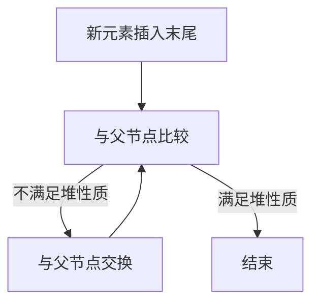
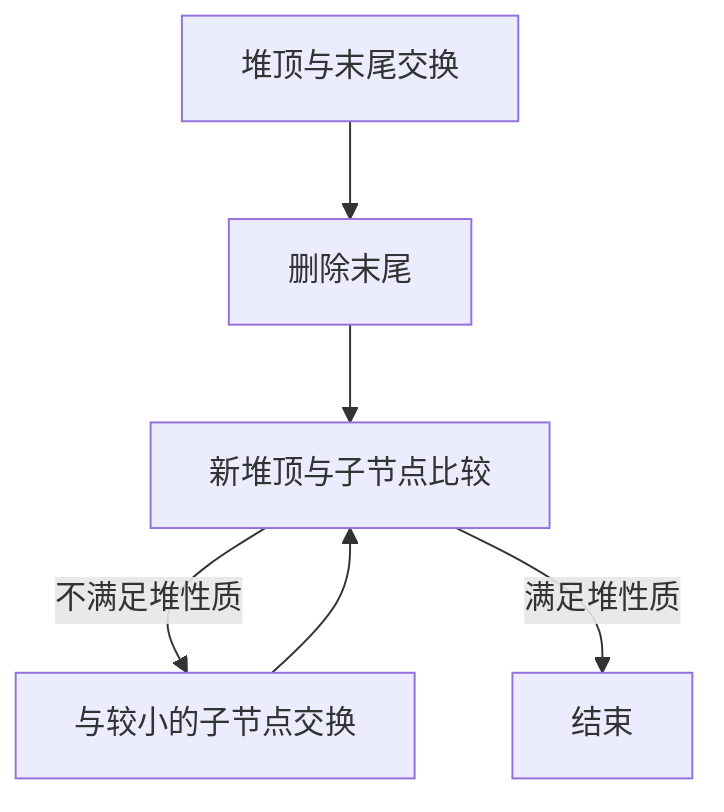
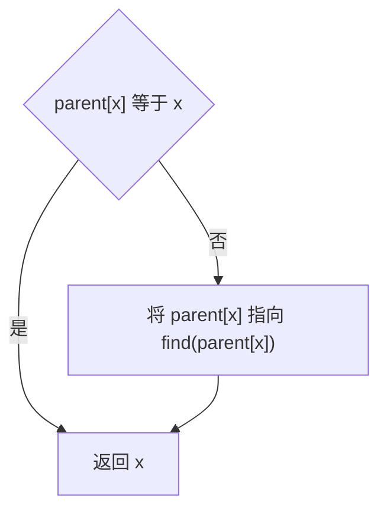
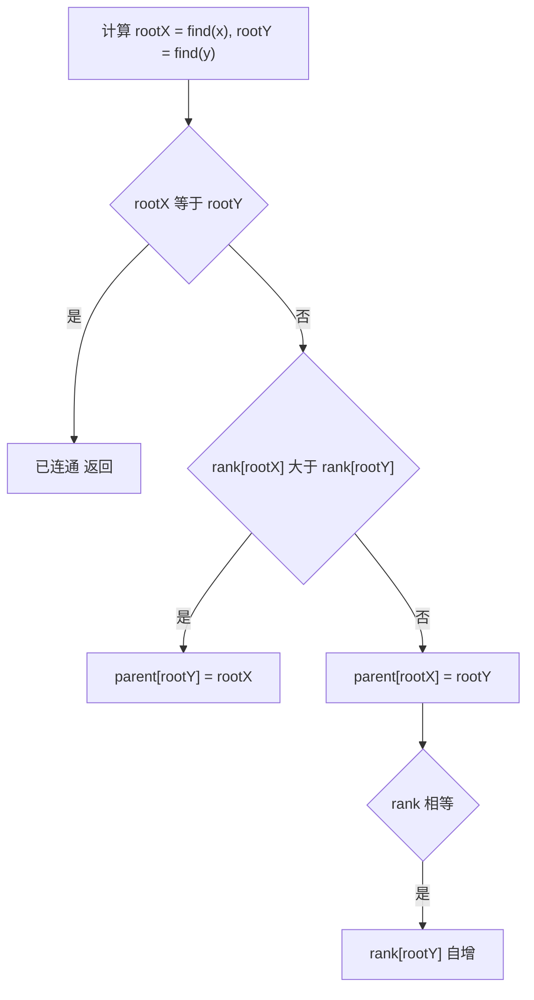
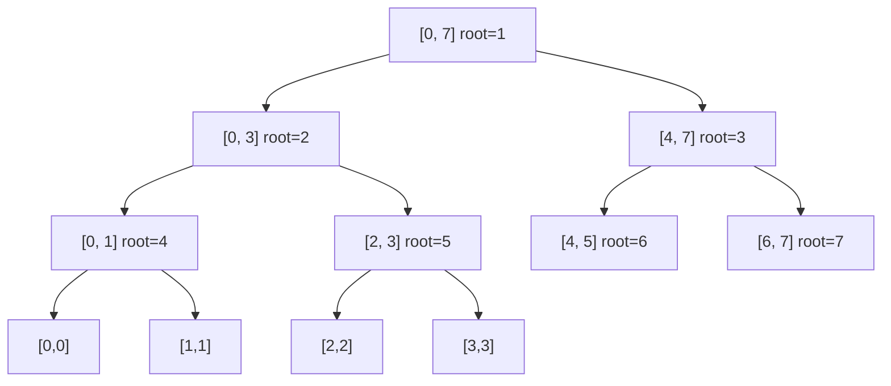

# · 进阶数据结构

> **涵盖题型：** 堆（优先队列）· 并查集（Union-Find）· 线段树 · 树状数组 · 字典树（见 03）

## 📜 背景与起源

**堆（优先队列）**
1964 年，J.W.J. Williams 在提出**堆排序（Heapsort）**算法时发明了二叉堆（Binary Heap）这一数据结构。同年，Robert W. Floyd 提出了从无序数组建堆的 O(n) 算法（buildHeap / heapify），成为后续优先队列实现的基石。堆也是第一个同时支持 O(log n) 插入与 O(1) 获取最小/最大元素的数据结构。

**并查集（Union-Find / Disjoint Set）**
1964 年，Bernard Galler 和 Michael Fischer 在《An Improved Equivalence Algorithm》一文中首次提出并查集。1975 年，Robert Tarjan 证明了带路径压缩和按秩合并的并查集时间复杂度为**逆 Ackermann 函数** O(α(n))，在现实数据规模下几乎等于常数时间，是理论上最优的连通性维护结构。

**线段树（Segment Tree）**
1977 年，Jon Louis Bentley 在论文《Multidimensional Binary Search Trees Used for Associative Searching》中提出了线段树的早期思想（多维二分树）。线段树在信息学竞赛（ACM/ICPC、NOI/IOI）中得到广泛应用，是解决动态区间统计问题的标准方案。其延迟标记（Lazy Propagation）技术进一步将区间更新的复杂度降为 O(log n)。

**树状数组（Fenwick Tree / Binary Indexed Tree）**
1994 年，Peter M. Fenwick 在论文《A New Data Structure for Cumulative Frequency Tables》中正式提出树状数组（Fenwick Tree / BIT），用于数据压缩领域的频率统计。它以极少的代码行数和极小的常数实现前缀和维护，成为树状数据结构中最简洁的实现之一。

## 一、堆 / 优先队列

### 🔬 核心原理

堆是一棵 **完全二叉树**，满足父节点值 ≤ 子节点（小根堆）或 ≥ 子节点（大根堆）。核心操作在 O(log n) 内完成。

| 操作 | 时间复杂度 | 说明 |
|------|-----------|------|
| push | O(log n) | 上浮（swim） |
| pop | O(log n) | 下沉（sink） |
| peek | O(1) | 堆顶元素 |
| buildHeap | O(n) | 从数组建堆 |

### 💡 破题直觉

**看到「Top K」「第 K 大/小」「中位数」「任务调度」「合并 K 个有序链表」→ 堆**

| 问题 | 堆策略 |
|------|--------|
| 第 K 大 | 小根堆容量 K，堆顶即第 K 大 |
| 第 K 小 | 大根堆容量 K，堆顶即第 K 小 |
| 中位数 | 两个堆：大根堆放左半，小根堆放右半 |
| 合并 K 个有序链表 | 每个链表头入堆，每次 pop 后再 push 该链表下一节点 |

### 🎯 问题域映射

| 适用场景 | 不适用场景 |
|----------|-----------|
| 动态 TopK、第 K 大/小 | 需要严格顺序遍历的场合 |
| 数据流中位数 | 需要随机访问堆中任意元素 |
| 任务调度与优先级管理 | 数据量极小时（暴力排序更简单） |
| 合并 K 个有序链表 | 需要同时支持删除任意元素 |

**典型例子：** 实时排行榜、Dijkstra 算法的距离维护、Huffman 编码树的构建。

### ⚠️ 边界陷阱

| 陷阱 | 场景 | 对策 |
|------|------|------|
| 大根堆 vs 小根堆 | Java 默认小根堆，Python 默认小根堆 | Python 存负数模拟大根堆 |
| 自定义比较器 | 复杂对象排序 | 明确比较规则 |
| 堆内存被修改 | 堆中元素在外部被修改 | 用不可变对象或重新 push |
| 容量限制 | 数据流不断涌入 | 定期清理无效元素 |
| 惰性删除 | 需要删除堆中任意元素 | 标记-删除法：正常 push，pop 时跳过已删除 |

### ⚙️ 高效实现指南

- **Python heapq 只有小根堆**，大根堆用负数模拟；自定义对象时存储 `(priority, id, obj)` 三元组，避免因 `priority` 相等导致的对象比较歧义
- **建堆用 `heapify`** 而非逐个 push，前者 O(n) 后者 O(n log n)
- **惰性删除（Lazy Deletion）**：当需要删除堆中任意元素时，不直接删除（O(n)），而是维护一个延迟删除字典，pop 时跳过已删除元素
- **双堆维护中位数**：在数据流不断涌入时，保证两个堆的大小差不超过 1，即可实时获取中位数

### 📈 流程

**上浮（插入）**



**下沉（删除堆顶）**



### ⚡ 应试策略

```python
# Python heapq 默认小根堆
import heapq

# 大根堆 → 存负数
heap = []
heapq.heappush(heap, -x)          # 插入
max_val = -heapq.heappop(heap)    # 弹出最大值

# Top K 大（用小根堆）
def top_k(nums, k):
    heap = []
    for num in nums:
        heapq.heappush(heap, num)
        if len(heap) > k:
            heapq.heappop(heap)
    return heap[0]   # 第 K 大（堆顶）

# 中位数（双堆）
class MedianFinder:
    def __init__(self):
        self.left = []   # 大根堆（存负数）
        self.right = []  # 小根堆

    def addNum(self, num):
        if not self.left or num <= -self.left[0]:
            heapq.heappush(self.left, -num)
        else:
            heapq.heappush(self.right, num)
        # 平衡
        if len(self.left) > len(self.right) + 1:
            heapq.heappush(self.right, -heapq.heappop(self.left))
        elif len(self.right) > len(self.left):
            heapq.heappush(self.left, -heapq.heappop(self.right))

    def findMedian(self):
        if len(self.left) > len(self.right):
            return -self.left[0]
        return (-self.left[0] + self.right[0]) / 2
```

### 🏷️ 常见题型与解题方案

#### ① 数组中的第 K 大元素

**题目特征**：给定一个整数数组 `nums` 和一个整数 `k`，返回数组中第 `k` 个最大的元素（非第 k 个不同的元素）。要求不改变原数组顺序，不能全局排序。

**解题思路 - 三步推导：**

**Step 1：暴力排序（O(n log n)）**
对整个数组排序，返回 `nums[-k]`（或 `nums[n-k]`）。思路最简单，但做了大量无用功——我们只需要第 K 大，不需要知道所有元素的精确顺序。

**Step 2：小根堆容量 K（O(n log k)）**
维护一个容量为 K 的小根堆，遍历数组：
- push 元素进堆
- 如果堆大小超过 K，弹出堆顶（当前堆中最小的）
遍历结束后，堆中存储的就是**最大的 K 个元素**，堆顶就是这 K 个中的最小值，即**第 K 大元素**。

为什么？堆顶是当前最小的，堆中永远保留当前最大的 K 个数。当遍历完数组，堆中就是全局最大的 K 个数，堆顶是第 K 大。

**Step 3：快速选择 partition（O(n) 平均）**
类似快速排序的 partition 思想。每次选一个 pivot，将数组分为大于 pivot 和小于 pivot 两部分。根据 pivot 的排名决定去左边还是右边搜索，每次只递归一边。

**完整代码：**

```python
import heapq
import random
from typing import List

# ========== 方法一：小根堆（推荐，代码简短）==========
def findKthLargest_heap(nums: List[int], k: int) -> int:
    """
    小根堆维护最大的 K 个数，堆顶即第 K 大
    时间 O(n log k)，空间 O(k)
    """
    min_heap = []
    for num in nums:
        heapq.heappush(min_heap, num)   # 入堆
        if len(min_heap) > k:
            heapq.heappop(min_heap)     # 超出容量，弹出最小
    return min_heap[0]                   # 堆顶就是第 K 大


# ========== 方法二：快速选择 partition（最优理论复杂度）==========
def findKthLargest_quickselect(nums: List[int], k: int) -> int:
    """
    快速选择：每次 partition 后判断 pivot 是第几大
    时间 O(n) 平均 / O(n²) 最坏，空间 O(log n) 递归栈
    """

    def partition(left: int, right: int) -> int:
        """将 [left, right] 按随机 pivot 分区，返回 pivot 最终下标"""
        pivot_idx = random.randint(left, right)          # 随机选 pivot 避免最坏情况
        pivot_val = nums[pivot_idx]
        # 把 pivot 换到最右边
        nums[pivot_idx], nums[right] = nums[right], nums[pivot_idx]

        store_idx = left
        for i in range(left, right):
            # 将大于 pivot 的元素换到左边（降序排列）
            if nums[i] > pivot_val:
                nums[store_idx], nums[i] = nums[i], nums[store_idx]
                store_idx += 1

        # 将 pivot 放回最终位置
        nums[store_idx], nums[right] = nums[right], nums[store_idx]
        return store_idx

    n = len(nums)
    target = k - 1           # 第 K 大在降序排列中下标为 k-1
    left, right = 0, n - 1

    while left <= right:
        pivot_pos = partition(left, right)
        if pivot_pos == target:
            return nums[pivot_pos]
        elif pivot_pos < target:
            left = pivot_pos + 1      # 在右侧继续找
        else:
            right = pivot_pos - 1     # 在左侧继续找

    return -1  # 不会执行到这里


# ========== 测试 ==========
if __name__ == "__main__":
    nums = [3, 2, 1, 5, 6, 4]
    k = 2
    print(f"堆方法：第 {k} 大 =", findKthLargest_heap(nums, k))           # 输出 5
    print(f"快选方法：第 {k} 大 =", findKthLargest_quickselect(nums, k)) # 输出 5
```

**复杂度分析：**
| 方法 | 时间复杂度 | 空间复杂度 | 特点 |
|------|-----------|-----------|------|
| 排序 | O(n log n) | O(1) 或 O(n) | 最简单，但做了无用功 |
| 小根堆 | O(n log k) | O(k) | 代码短，适合 k << n 场景 |
| 快速选择 | O(n) 平均 / O(n²) 最坏 | O(log n) | 理论最优，数据流场景不适用 |

**面试建议：** 先说排序法（最易理解），再优化到堆法（推荐作答），最后提快选（展示深度）。

#### ② 前 K 高频元素

**题目特征**：给定一个整数数组 `nums` 和一个整数 `k`，返回出现频率最高的 k 个元素（无需按顺序）。元素取值范围可能很大，且可能有重复。

**解题思路：**

**Step 1：频率统计（HashMap）**
先遍历一遍数组，用哈希表统计每个元素出现的频率。

**Step 2：小根堆按频率排序**
将 (频率, 元素) 入小根堆，堆容量保持为 k。遍历所有频率键值对：
- 入堆
- 堆大小超过 k 时弹出堆顶（频率最小的）
遍历结束后，堆中剩下的就是频率最高的 k 个元素。

**为什么用小根堆而不是大根堆？** 小根堆容量固定为 k，每次弹出的是当前最小频率，最终保留的就是 k 个最大频率。如果用大根堆，需要把 n 个元素全部入堆才能得到 k 个最大。

**完整代码：**

```python
import heapq
from collections import Counter
from typing import List

def topKFrequent(nums: List[int], k: int) -> List[int]:
    """
    返回数组中频率最高的 k 个元素
    时间 O(n log k)，空间 O(n)
    """
    # Step 1: 频率统计
    freq = Counter(nums)                     # {元素: 出现次数}

    # Step 2: 小根堆容量 k
    heap = []
    for num, count in freq.items():
        heapq.heappush(heap, (count, num))   # 按频率排序
        if len(heap) > k:
            heapq.heappop(heap)              # 弹出频率最小的

    # Step 3: 提取结果
    return [num for _, num in heap]


# ========== 测试 ==========
if __name__ == "__main__":
    nums = [1, 1, 1, 2, 2, 3]
    k = 2
    print(topKFrequent(nums, k))  # 输出 [1, 2]（或 [2, 1]，顺序无关）
    # 解释：1 出现 3 次，2 出现 2 次，3 出现 1 次，前 2 高频是 [1, 2]
```

**复杂度分析：**
| 步骤 | 时间复杂度 | 空间复杂度 |
|------|-----------|-----------|
| 频率统计 | O(n) | O(n) |
| 堆操作 | O(n log k) | O(k) |
| 总计 | **O(n log k)** | **O(n)** |

**进阶思考：** 如果 n 极大但 k 很小（k << n），堆法非常高效。如果需要严格的 O(n) 解法，可以用**桶排序**（以频率为桶下标，将元素放入对应桶中），适用于 k 较大且频率范围有限的情况。

#### ③ 数据流的中位数

**题目特征**：数据不断加入，要求随时能够获取当前所有元素的中位数。数据量可能很大，无法每次都排序。

**解题思路：**

**核心思想：双堆 + 平衡**
将数据分为两半：
- **大根堆（左半）**：存储较小的一半数字，堆顶是左半的最大值
- **小根堆（右半）**：存储较大的一半数字，堆顶是右半的最小值

**两条规则：**
1. **所有左半元素 ≤ 所有右半元素**：新元素先入左堆，再将左堆最大移到右堆
   （或者反过来，关键是要保证左堆所有值 ≤ 右堆所有值）
2. **两堆大小平衡**：左堆大小 ≥ 右堆、且差值 ≤ 1。这样中位数始终在堆顶位置。

**推导过程：**
- 暴力法：每次插入 O(1)，获取中位数 O(n log n) 排序 → 总 O(n² log n)
- 有序数组 + 二分插入：插入 O(n)，获取 O(1) → 总 O(n²)
- **双堆法：插入 O(log n)，获取 O(1) → 总 O(n log n)**

**插入流程详解：**
```
1. 元素 num 加入
2. 如果左堆为空 或 num ≤ 左堆顶 → num 入左堆
   否则 → num 入右堆
3. 平衡：如果左堆比右堆多 2 个以上 → 左堆顶移到右堆
         如果右堆比左堆多 → 右堆顶移到左堆
4. 中位数 = 左堆顶（奇数个时）或 (左堆顶 + 右堆顶)/2（偶数个时）
```

**完整代码：**

```python
import heapq

class MedianFinder:
    """
    数据流中位数求解器

    思路：双堆维护
    - left: 大根堆（用负数模拟），存较小的一半
    - right: 小根堆，存较大的一半
    """

    def __init__(self):
        self.left = []   # 大根堆：Python 通过存负数模拟
        self.right = []  # 小根堆

    def addNum(self, num: int) -> None:
        """
        添加一个数字到数据流
        时间 O(log n)
        """
        # Step 1: 决定放入哪个堆
        if not self.left or num <= -self.left[0]:
            heapq.heappush(self.left, -num)          # 左堆存负数模拟大根堆
        else:
            heapq.heappush(self.right, num)

        # Step 2: 平衡两堆大小
        # 左堆最多比右堆多 1 个元素
        if len(self.left) > len(self.right) + 1:
            # 左堆最大移到右堆
            val = -heapq.heappop(self.left)
            heapq.heappush(self.right, val)
        elif len(self.right) > len(self.left):
            # 右堆最小移到左堆
            val = heapq.heappop(self.right)
            heapq.heappush(self.left, -val)

    def findMedian(self) -> float:
        """
        获取当前中位数
        时间 O(1)
        """
        if len(self.left) > len(self.right):
            # 奇数个元素，中位数在左堆堆顶
            return float(-self.left[0])
        else:
            # 偶数个元素，中位数为两堆顶平均值
            return (-self.left[0] + self.right[0]) / 2.0


# ========== 测试 ==========
if __name__ == "__main__":
    mf = MedianFinder()
    for num in [1, 2, 3, 4, 5]:
        mf.addNum(num)
        print(f"添加 {num} 后中位数 = {mf.findMedian()}")
    # 输出：
    # 添加 1 后中位数 = 1.0
    # 添加 2 后中位数 = 1.5
    # 添加 3 后中位数 = 2.0
    # 添加 4 后中位数 = 2.5
    # 添加 5 后中位数 = 3.0
```

**复杂度分析：**
| 操作 | 时间复杂度 | 空间复杂度 |
|------|-----------|-----------|
| addNum | **O(log n)** | O(n) |
| findMedian | **O(1)** | O(1) |

**面试要点：**
- 核心：两个堆的角色要清晰——左堆放较小的一半（大根堆），右堆放较大的一半（小根堆）
- Python 模拟大根堆用负数，面试时一定要讲清楚
- 平衡条件可以有两种写法：上面用的是"左堆至多比右堆多 1"，也可以写成"左堆大小 ≥ 右堆大小且差值 ≤ 1"

#### ④ 合并 K 个升序链表

**题目特征**：给定 k 个升序链表，将它们合并成一个升序链表。链表节点定义通常为 `ListNode(val, next)`。

**解题思路 - 三步推导：**

**Step 1：逐一合并（O(Nk)）**
每次合并两个链表（类似 21. 合并两个有序链表），总共合并 k-1 次。每次合并耗时 O(两个链表长度和)，最坏情况 O(Nk)，其中 N 是所有节点总数。

**Step 2：分治合并（O(N log k)）**
将 k 个链表两两分组，每组内部先合并，再逐层向上合并。类似归并排序的思路。

**Step 3：小根堆（O(N log k)，推荐）**
将每个链表的头节点入堆（同时记录所属链表），每次弹出最小值，然后将该链表的下一个节点入堆。循环直到堆空。

为什么小根堆能行？堆中最多同时有 k 个节点（每个链表一个），每次 O(log k) 弹出最小值，总 N 个节点，总 O(N log k)。

**完整代码：**

```python
import heapq
from typing import List, Optional

# 链表节点定义
class ListNode:
    def __init__(self, val=0, next=None):
        self.val = val
        self.next = next


def mergeKLists(lists: List[Optional[ListNode]]) -> Optional[ListNode]:
    """
    使用小根堆合并 K 个升序链表
    时间 O(N log k)，空间 O(k)
    """
    # Step 1: 初始化小根堆，将所有非空链表头入堆
    # 堆中存 (val, idx, node) —— idx 用于 val 相同时避免比较 node
    heap = []
    for i, node in enumerate(lists):
        if node:
            heapq.heappush(heap, (node.val, i, node))

    # Step 2: 建虚拟头节点，方便返回
    dummy = ListNode(0)
    curr = dummy

    # Step 3: 不断从堆中弹出最小值
    while heap:
        val, idx, node = heapq.heappop(heap)   # 弹出最小节点
        curr.next = node                        # 接到结果链表中
        curr = curr.next

        # 如果这个链表还有下一个节点，入堆
        if node.next:
            heapq.heappush(heap, (node.next.val, idx, node.next))

    return dummy.next


# ========== 测试辅助函数 ==========
def list_to_linked(arr):
    """数组转链表"""
    dummy = ListNode(0)
    curr = dummy
    for val in arr:
        curr.next = ListNode(val)
        curr = curr.next
    return dummy.next

def linked_to_list(head):
    """链表转数组"""
    res = []
    while head:
        res.append(head.val)
        head = head.next
    return res


# ========== 测试 ==========
if __name__ == "__main__":
    lists = [
        list_to_linked([1, 4, 5]),
        list_to_linked([1, 3, 4]),
        list_to_linked([2, 6]),
    ]
    merged = mergeKLists(lists)
    print(linked_to_list(merged))  # 输出 [1, 1, 2, 3, 4, 4, 5, 6]
```

**复杂度分析：**
| 方法 | 时间复杂度 | 空间复杂度 | 说明 |
|------|-----------|-----------|------|
| 逐一合并 | O(Nk) | O(1) | 最差，面试中不要用 |
| 分治合并 | O(N log k) | O(log k) | 递归栈空间，无需额外堆 |
| 小根堆 | **O(N log k)** | **O(k)** | 面试中最推荐，代码简洁直观 |

**面试要点：**
- 堆中存三元组 `(val, idx, node)` 是为了 Python 在 val 相等时比较元组第二元素（idx 是整数），避免比较 ListNode 对象导致的 TypeError
- 虚拟头节点 `dummy` 是链表题的经典技巧，避免单独处理头节点为空的情况
- 如果 k 巨大但每个链表都很短，堆法的优势更加明显

## 二、并查集（Union-Find / Disjoint Set）

### 🔬 核心原理

并查集维护 **不相交集合的合并与查询**，核心是两个操作：

```
find(x)  ：查找 x 所在集合的根（代表元）
union(x,y)：合并 x 和 y 所在的集合
```

**两大优化（缺一不可）：**

| 优化 | 思想 | 效果 |
|------|------|------|
| **路径压缩** | find 时让路径上的节点直接指向根 | 均摊 O(α(n)) |
| **按秩合并** | 小树挂到大树上 | 树高 ≤ log n |

### 💡 破题直觉

**看到「连通分量」「图的动态连通性」「相同的组/类」「冗余连接」「朋友圈」→ 并查集**

| 题目 | 怎么用 |
|------|--------|
| 岛屿数量 | 每个陆地与上下左右 union |
| 冗余连接 | 遍历边，两个端点已在同一集合则当前边为冗余 |
| 账户合并 | 相同邮箱集合合并 |
| 判断二分图 | 并查集维护对立关系 |

### 🎯 问题域映射

| 适用场景 | 不适用场景 |
|----------|-----------|
| 动态连通性判断 | 需要**删除**集合中元素的操作 |
| 图论中的集合维护（朋友圈、冗余连接、账户合并） | 需要获取集合内部具体元素的场合 |
| 最小生成树（Kruskal 算法） | 数据规模极小（数组标记法更快） |
| 离线算法中的连通分量查询 | 需要频繁查询元素所属集合的统计信息 |

**典型例子：** Kruskal 最小生成树、社交网络中的连通群组、图像处理的连通区域标记。

### ⚠️ 边界陷阱

| 陷阱 | 场景 | 对策 |
|------|------|------|
| 初始化忘记 parent[i] = i | 开始时每个元素独立集合 | 构造时设置全部 parent[i] = i |
| 路径压缩递归栈溢出 | n 过大 | 用迭代实现 find |
| union 后未更新 size | 按秩合并失效 | union 时同时更新 size |
| 0-index vs 1-index | 题目索引方式 | 统一偏移或初始化 n+1 |

### ⚙️ 高效实现指南

- **路径压缩用迭代**：递归在 n 极大时可能导致栈溢出，使用 `while` 循环配合祖父节点跳跃实现迭代压缩
- **find 的同时更新 parent 是压缩的关键**：无论是递归还是迭代，每次 find 都要将当前节点的 parent 指向根节点
- **按秩合并和路径压缩缺一不可**：只用路径压缩可达到 O(log n)，结合按秩合并才是 O(α(n))
- **连通分量计数**：初始化连通分量数为 n，每次成功 union 时减一，即可实时获取剩余集合数量

### 📈 流程

**find(x)**



**union(x, y)**



### ⚡ 应试策略

```python
class UnionFind:
    def __init__(self, n):
        self.parent = list(range(n))
        self.rank = [0] * n
        self.size = n  # 集合数量

    def find(self, x):
        # 迭代路径压缩
        while self.parent[x] != x:
            self.parent[x] = self.parent[self.parent[x]]
            x = self.parent[x]
        return x

    def union(self, x, y):
        root_x, root_y = self.find(x), self.find(y)
        if root_x == root_y: return False  # 已连通
        # 按秩合并
        if self.rank[root_x] > self.rank[root_y]:
            self.parent[root_y] = root_x
        elif self.rank[root_x] < self.rank[root_y]:
            self.parent[root_x] = root_y
        else:
            self.parent[root_y] = root_x
            self.rank[root_x] += 1
        self.size -= 1
        return True

    def is_connected(self, x, y):
        return self.find(x) == self.find(y)
```

### 🏷️ 常见题型与解题方案

#### ① 省份数量（并查集模板）

**题目特征**：给定一个 n × n 的矩阵 `isConnected`，其中 `isConnected[i][j] = 1` 表示城市 i 和城市 j 直接相连，求**省份数量**（即连通分量的数量）。这是并查集最直接的模板题。

**解题思路：**
遍历矩阵的上三角（i < j），如果 `isConnected[i][j] == 1`，就 union(i, j)。最后返回连通分量数量。

**完整代码：**

```python
from typing import List

class UnionFind:
    """
    并查集完整模板（含路径压缩 + 按秩合并）
    """

    def __init__(self, n: int):
        self.parent = list(range(n))   # 每个节点的父节点，初始为自己
        self.rank = [1] * n            # 树的高度（秩）
        self.count = n                 # 连通分量数量

    def find(self, x: int) -> int:
        """
        查找 x 所在集合的根
        迭代路径压缩：沿途所有节点直接指向根
        """
        while self.parent[x] != x:
            # 祖父节点跳跃（路径压缩）
            self.parent[x] = self.parent[self.parent[x]]
            x = self.parent[x]
        return x

    def find_recursive(self, x: int) -> int:
        """
        递归版路径压缩（代码更优雅，但可能栈溢出）
        """
        if self.parent[x] != x:
            self.parent[x] = self.find_recursive(self.parent[x])
        return self.parent[x]

    def union(self, x: int, y: int) -> bool:
        """
        合并 x 和 y 所在集合
        返回是否发生了真正的合并
        """
        root_x = self.find(x)
        root_y = self.find(y)

        if root_x == root_y:
            return False  # 已经在同一集合

        # 按秩合并：树矮的接到树高的上面
        if self.rank[root_x] < self.rank[root_y]:
            self.parent[root_x] = root_y
        elif self.rank[root_x] > self.rank[root_y]:
            self.parent[root_y] = root_x
        else:
            self.parent[root_y] = root_x
            self.rank[root_x] += 1

        self.count -= 1  # 合并后连通分量减一
        return True


def findCircleNum(isConnected: List[List[int]]) -> int:
    """
    计算省份数量（连通分量）
    时间 O(n² * α(n))，空间 O(n)
    """
    n = len(isConnected)
    uf = UnionFind(n)

    for i in range(n):
        for j in range(i + 1, n):    # 上三角遍历，避免重复
            if isConnected[i][j] == 1:
                uf.union(i, j)

    return uf.count


# ========== 测试 ==========
if __name__ == "__main__":
    isConnected = [
        [1, 1, 0],
        [1, 1, 0],
        [0, 0, 1]
    ]
    print(findCircleNum(isConnected))  # 输出 2
    # 城市 0-1 相连为一个省；城市 2 独立为一个省
```

**复杂度分析：**
| 操作 | 时间复杂度 | 空间复杂度 |
|------|-----------|-----------|
| 初始化 | O(n) | O(n) |
| 每个 find/union | **O(α(n))** ≈ O(1) | O(1) |
| 整体 | **O(n² × α(n))** | **O(n)** |

**面试要点：** 这道题是并查集最基础的应用，面试中如果时间紧，可以用它来默写并查集模板。

#### ② 账户合并

**题目特征**：给定一组账户，每个账户包含用户名和一个或多个邮箱地址。同一个人的邮箱地址可能会有重叠。需要将所有属于同一个人的邮箱合并，并按照一定格式输出。

**解题思路：**

**核心难点：** 如何判断两个邮箱属于同一个人？当两个账户共享至少一个邮箱时，它们属于同一个人。但一个账户内部可能有多个邮箱，形成了一个连通关系网络。

**解法推导：**
1. 为每个邮箱分配一个唯一的 ID（下标）
2. 遍历每个账户，账户内的所有邮箱合并到同一个集合（同一个账户内的邮箱一定属于同一个人）
3. 建立邮箱 → 集合 ID 的映射
4. 遍历完成后，同一集合内的所有邮箱属于同一个人
5. 收集结果

**完整代码：**

```python
from typing import List
from collections import defaultdict

class UnionFind:
    """并查集（复用前面模板的等价类）"""

    def __init__(self, n: int):
        self.parent = list(range(n))
        self.rank = [0] * n

    def find(self, x: int) -> int:
        while self.parent[x] != x:
            self.parent[x] = self.parent[self.parent[x]]
            x = self.parent[x]
        return x

    def union(self, x: int, y: int) -> None:
        root_x, root_y = self.find(x), self.find(y)
        if root_x == root_y:
            return
        if self.rank[root_x] < self.rank[root_y]:
            self.parent[root_x] = root_y
        elif self.rank[root_x] > self.rank[root_y]:
            self.parent[root_y] = root_x
        else:
            self.parent[root_y] = root_x
            self.rank[root_x] += 1


def accountsMerge(accounts: List[List[str]]) -> List[List[str]]:
    """
    合并相同用户的账户

    思路：邮箱 → ID 映射 + 并查集
    时间 O(N · α(N))，空间 O(N)  N 为邮箱总数
    """
    uf = UnionFind(len(accounts))

    # Step 1: 建立邮箱到账户索引的映射
    # 关键逻辑：如果某个邮箱已经在映射中，说明两个账户属于同一个人
    email_to_idx = {}  # 邮箱 → 首次出现的账户下标

    for i, acc in enumerate(accounts):
        name = acc[0]
        for email in acc[1:]:
            if email in email_to_idx:
                # 当前账户与已有账户共享该邮箱 → 合并
                uf.union(i, email_to_idx[email])
            else:
                # 新邮箱，记录归属
                email_to_idx[email] = i

    # Step 2: 收集每个根节点下的所有邮箱
    root_to_emails = defaultdict(list)
    for email, idx in email_to_idx.items():
        root = uf.find(idx)
        root_to_emails[root].append(email)

    # Step 3: 整理输出格式
    result = []
    for root, emails in root_to_emails.items():
        # 邮箱按字典序排序
        emails.sort()
        # 账户名放在第一个位置
        result.append([accounts[root][0]] + emails)

    return result


# ========== 测试 ==========
if __name__ == "__main__":
    accounts = [
        ["John", "johnsmith@mail.com", "john00@mail.com"],
        ["John", "johnnybravo@mail.com"],
        ["John", "johnsmith@mail.com", "john_newyork@mail.com"],
        ["Mary", "mary@mail.com"]
    ]
    result = accountsMerge(accounts)
    for acc in result:
        print(acc)
    # 输出：
    # ['John', 'john00@mail.com', 'john_newyork@mail.com', 'johnsmith@mail.com']
    # ['John', 'johnnybravo@mail.com']
    # ['Mary', 'mary@mail.com']
```

**复杂度分析：**
| 步骤 | 时间复杂度 | 空间复杂度 |
|------|-----------|-----------|
| 邮箱映射 + union | O(N · α(N)) | O(N) |
| 收集结果 | O(N log N) 排序 | O(N) |
| 总计 | **O(N log N)** | **O(N)** |

**面试要点：**
- 核心：**邮箱是连接不同账户的桥梁**——同一邮箱出现在不同账户中，是两个人属于同一个人的唯一证据
- 邮箱排序不是必须的，但题目通常要求输出时邮箱按字典序排列
- 注意最后输出格式：每个元素第一个位置是用户名

#### ③ 冗余连接

**题目特征**：给定一个 n 个节点的图（无向，节点编号 1~n），初始图是一棵树，现在额外添加了一条边导致图中出现环。找到并返回这条多余的边（如果有多个，返回最后出现的那条）。

**解题思路：**

**推理过程：**
树有 n 个节点、n-1 条边。现在有 n 条边，说明恰好多了一条边，且一定会形成环。

**并查集解法：**
遍历每条边 [u, v]：
- 如果 u 和 v 不在同一个集合 → union，继续
- 如果 u 和 v 已经在同一个集合 → 说明当前边导致成环，这条边就是答案

因为题目要求"如果有多个答案则返回最后出现的边"，遍历顺序保证了第一次检测到已经连通的边就是最后被添加的那条冗余边（唯一冗余边只有一条，第一次检测到成环即可返回）。

**完整代码：**

```python
from typing import List

class UnionFind:
    """并查集"""

    def __init__(self, n: int):
        self.parent = list(range(n + 1))  # 1-indexed
        self.rank = [0] * (n + 1)

    def find(self, x: int) -> int:
        while self.parent[x] != x:
            self.parent[x] = self.parent[self.parent[x]]
            x = self.parent[x]
        return x

    def union(self, x: int, y: int) -> bool:
        """合并，返回是否已连通"""
        root_x, root_y = self.find(x), self.find(y)
        if root_x == root_y:
            return False  # 已连通，当前边是冗余
        if self.rank[root_x] < self.rank[root_y]:
            self.parent[root_x] = root_y
        elif self.rank[root_x] > self.rank[root_y]:
            self.parent[root_y] = root_x
        else:
            self.parent[root_y] = root_x
            self.rank[root_x] += 1
        return True


def findRedundantConnection(edges: List[List[int]]) -> List[int]:
    """
    找到图中的冗余边（唯一的一条导致环的边）
    时间 O(n · α(n))，空间 O(n)
    """
    n = len(edges)
    uf = UnionFind(n)

    for u, v in edges:
        if not uf.union(u, v):
            # 如果 u 和 v 已经连通，当前边就是冗余边
            return [u, v]

    return []  # 理论上不会执行到这里


# ========== 测试 ==========
if __name__ == "__main__":
    edges1 = [[1, 2], [1, 3], [2, 3]]
    print(findRedundantConnection(edges1))  # 输出 [2, 3]

    edges2 = [[1, 2], [2, 3], [3, 4], [1, 4], [1, 5]]
    print(findRedundantConnection(edges2))  # 输出 [1, 4]
```

**复杂度分析：**
| 操作 | 时间复杂度 | 空间复杂度 |
|------|-----------|-----------|
| 遍历所有边 | O(n) | O(1) |
| 每次 union | **O(α(n))** | O(1) |
| 总计 | **O(n · α(n))** | **O(n)** |

**面试要点：**
- 这是并查集在**图论**中的经典应用——在动态加边的过程中检测环
- 注意节点编号从 1 开始，所以 parent 数组大小为 n+1
- 进阶变体：LeetCode 685（冗余连接 II）是**有向图**版本，需要结合入度分析

#### ④ 岛屿数量（并查集版）

**题目特征**：给定一个由 '1'（陆地）和 '0'（水域）组成的二维网格，计算网格中岛屿的数量（相连的 1 组成一个岛屿，相邻方向为上下左右四方向）。

**解题思路：**

这道题的标准解法是 DFS/BFS（见 02-搜索回溯专题），这里用并查集来做，展示并查集在二维网格上的应用。

**思路：**
1. 将二维网格展平为一维：位置 (i, j) → ID = i * n + j
2. 初始化并查集，每个 '1' 是一个独立集合
3. 遍历每个 '1'，检查其右侧和下侧的邻居是否也是 '1'，如果是则 union
4. 最后统计有多少个 '1' 的集合（即 parent[i] == i 的陆地的数量）

**完整代码：**

```python
from typing import List

class UnionFind:
    """并查集"""

    def __init__(self, n: int):
        self.parent = list(range(n))
        self.rank = [0] * n
        self.count = 0   # 当前集合数量

    def find(self, x: int) -> int:
        while self.parent[x] != x:
            self.parent[x] = self.parent[self.parent[x]]
            x = self.parent[x]
        return x

    def union(self, x: int, y: int) -> None:
        root_x, root_y = self.find(x), self.find(y)
        if root_x == root_y:
            return
        if self.rank[root_x] < self.rank[root_y]:
            self.parent[root_x] = root_y
        elif self.rank[root_x] > self.rank[root_y]:
            self.parent[root_y] = root_x
        else:
            self.parent[root_y] = root_x
            self.rank[root_x] += 1
        self.count -= 1  # 合并后集合数减一

    def add_land(self, idx: int) -> None:
        """增加一个新的陆地集合"""
        self.parent[idx] = idx
        self.count += 1


def numIslands(grid: List[List[str]]) -> int:
    """
    并查集版求岛屿数量
    时间 O(mn · α(mn))，空间 O(mn)
    """
    if not grid:
        return 0

    m, n = len(grid), len(grid[0])
    uf = UnionFind(m * n)

    # 方向数组：右、下
    directions = [(0, 1), (1, 0)]

    for i in range(m):
        for j in range(n):
            if grid[i][j] == '1':
                idx = i * n + j
                uf.add_land(idx)  # 标记这个位置是陆地

                # 检查右和下邻居
                for di, dj in directions:
                    ni, nj = i + di, j + dj
                    if 0 <= ni < m and 0 <= nj < n and grid[ni][nj] == '1':
                        nidx = ni * n + nj
                        uf.union(idx, nidx)

    return uf.count


# ========== 测试 ==========
if __name__ == "__main__":
    grid = [
        ['1', '1', '1', '1', '0'],
        ['1', '1', '0', '1', '0'],
        ['1', '1', '0', '0', '0'],
        ['0', '0', '0', '0', '0']
    ]
    print(numIslands(grid))  # 输出 1

    grid2 = [
        ['1', '1', '0', '0', '0'],
        ['1', '1', '0', '0', '0'],
        ['0', '0', '1', '0', '0'],
        ['0', '0', '0', '1', '1']
    ]
    print(numIslands(grid2))  # 输出 3
```

**复杂度分析：**
| 方法 | 时间复杂度 | 空间复杂度 | 说明 |
|------|-----------|-----------|------|
| DFS/BFS | O(mn) | O(mn) | 最坏递归栈 / 队列 |
| 并查集 | **O(mn · α(mn))** | **O(mn)** | 无递归栈溢出风险 |

**面试要点：**
- 两种方法都应掌握：面试中通常先说 DFS/BFS（更直观），再说可以用并查集
- 并查集版的优点是避免递归栈溢出（当网格非常大时，DFS 递归可能导致栈溢出）
- 展平 ID = i * n + j 是二维网格转一维的通用技巧

## 三、线段树（Segment Tree）

### 🔬 核心原理

线段树将区间分成 **O(log n)** 层，支持 **区间查询（求和/最值）** 和 **单点/区间更新**，均为 O(log n)。

```
数组 [0, 1, 2, ..., n-1]
构建 → 二叉树
每个节点代表一个区间
叶子节点：长度为 1 的区间
内部节点：合并子节点的信息
```

### 💡 破题直觉

**看到「区间求和」「区间最值」「区间更新」「多次查询与更新」→ 线段树**

```
何时用线段树？
1. 需要 O(log n) 的区间查询 + 更新
2. 区间需要 lazy propagation（延迟更新）
3. 树状数组的功能不够（如需要区间更新+区间查询的 范围组合）
```

### 🎯 问题域映射

| 适用场景 | 不适用场景 |
|----------|-----------|
| 区间求和、区间最值查询 | n 较小（< 10³）时，暴力法更快 |
| 区间更新（加/赋值）搭配区间查询 | 只有单点更新 + 前缀查询的场景（树状数组更好） |
| 数据量 n 在 10⁵ ~ 10⁶ 级别 | 无需动态更新，只需离线查询 |
| 区间覆盖、区间翻转等复杂操作 | 需要同时维护区间内多种性质（考虑分块或平衡树） |

**典型例子：** 动态数组区间和、区间最大值、矩形面积并、区间染色问题。

### ⚠️ 边界陷阱

| 陷阱 | 场景 | 对策 |
|------|------|------|
| 数组大小 4n | 线段树需要 4 倍空间 | 确定 n 后分配 tree = [0] * (4*n) |
| 区间查询范围 | query(l, r) 的 l > r | 返回 identity value |
| lazy 标记传导 | 区间更新未下推 | update 和 query 都要 pushDown |
| 0-index vs 1-index | 根节点 1 号 | 左右子树 2×i 和 2×i+1 |

### ⚙️ 高效实现指南

- **数组大小开 4n**：标准线段树需要 4 倍原始数组空间，最坏情况为 4n - 1
- **递归函数传 node 索引**：避免在递归过程中创建 Node 对象，用 `node*2` 和 `node*2+1` 计算左右子节点下标
- **lazy 标记下推是性能关键**：`update` 和 `query` 中都要调用 `pushDown`，确保在访问子节点之前将当前节点的标记下传
- **查询时若完全覆盖则直接返回**：如果不完全覆盖，先 pushDown，再递归左右子树汇总结果
- **Python 中适当使用 `__slots__`**：对于大量线段树节点，使用 `__slots__` 可以显著减少内存开销

### 📈 结构



### ⚡ 应试策略

```python
# 线段树模板（区间求和 + 区间更新 lazy）
class SegmentTree:
    def __init__(self, nums):
        n = len(nums)
        self.n = n
        self.tree = [0] * (4 * n)
        self.lazy = [0] * (4 * n)
        self.build(1, 0, n - 1, nums)

    def build(self, node, l, r, nums):
        if l == r:
            self.tree[node] = nums[l]
            return
        mid = (l + r) // 2
        self.build(node*2, l, mid, nums)
        self.build(node*2+1, mid+1, r, nums)
        self.tree[node] = self.tree[node*2] + self.tree[node*2+1]

    def push_down(self, node, l, r):
        if self.lazy[node] != 0:
            mid = (l + r) // 2
            self.tree[node*2] += self.lazy[node] * (mid - l + 1)
            self.tree[node*2+1] += self.lazy[node] * (r - mid)
            self.lazy[node*2] += self.lazy[node]
            self.lazy[node*2+1] += self.lazy[node]
            self.lazy[node] = 0

    def update_range(self, node, l, r, ql, qr, val):
        if ql <= l and r <= qr:
            self.tree[node] += val * (r - l + 1)
            self.lazy[node] += val
            return
        self.push_down(node, l, r)
        mid = (l + r) // 2
        if ql <= mid:
            self.update_range(node*2, l, mid, ql, qr, val)
        if qr > mid:
            self.update_range(node*2+1, mid+1, r, ql, qr, val)
        self.tree[node] = self.tree[node*2] + self.tree[node*2+1]

    def query_range(self, node, l, r, ql, qr):
        if ql <= l and r <= qr:
            return self.tree[node]
        self.push_down(node, l, r)
        mid = (l + r) // 2
        ans = 0
        if ql <= mid:
            ans += self.query_range(node*2, l, mid, ql, qr)
        if qr > mid:
            ans += self.query_range(node*2+1, mid+1, r, ql, qr)
        return ans
```

### 🏷️ 常见题型与解题方案

#### ① 区间和 + 单点更新（Segment Tree 模板）

**题目特征**：给定一个整数数组 `nums`，支持两个操作：
1. **更新**：将 `nums[index]` 的值修改为 `val`
2. **查询**：返回区间 `[left, right]` 的和

要求在频繁更新和查询的场景下高效执行（LeetCode 307. Range Sum Query - Mutable）。

**解题思路 - 三步推导：**

**Step 1：暴力法（O(n) 更新 / O(1) 查询）**
直接维护原数组：更新 O(1)，区间查询 O(n)。
每次查询都要遍历区间求和，大量查询时极慢。

**Step 2：前缀和法（O(n) 更新 / O(1) 查询）**
维护前缀和数组 `prefix[i] = sum(nums[0..i])`，查询时 `prefix[r] - prefix[l-1]` 为 O(1)。
但单点更新时需要重建从该点到结尾的所有前缀和，最坏 O(n)。

**Step 3：线段树（O(log n) 更新 / O(log n) 查询）**
用线段树维护区间和，两者都是 O(log n)，综合性能最优。

**完整代码：**

```python
from typing import List

class NumArray:
    """
    线段树实现区间和 + 单点更新
    """

    def __init__(self, nums: List[int]):
        """构建线段树"""
        self.n = len(nums)
        if self.n == 0:
            return
        self.tree = [0] * (4 * self.n)   # 4 倍空间
        self._build(1, 0, self.n - 1, nums)

    def _build(self, node: int, l: int, r: int, nums: List[int]) -> None:
        """
        构建线段树
        node: 当前节点下标
        [l, r]: 当前节点代表的区间
        """
        if l == r:
            # 叶子节点：直接存储数组元素
            self.tree[node] = nums[l]
            return

        mid = (l + r) // 2
        self._build(node * 2, l, mid, nums)         # 左子树
        self._build(node * 2 + 1, mid + 1, r, nums) # 右子树
        self.tree[node] = self.tree[node * 2] + self.tree[node * 2 + 1]

    def update(self, index: int, val: int) -> None:
        """
        单点更新：将 nums[index] 修改为 val
        时间 O(log n)
        """
        self._update(1, 0, self.n - 1, index, val)

    def _update(self, node: int, l: int, r: int, idx: int, val: int) -> None:
        """递归更新叶子节点"""
        if l == r:
            self.tree[node] = val
            return

        mid = (l + r) // 2
        if idx <= mid:
            self._update(node * 2, l, mid, idx, val)
        else:
            self._update(node * 2 + 1, mid + 1, r, idx, val)

        # 回溯时更新当前节点
        self.tree[node] = self.tree[node * 2] + self.tree[node * 2 + 1]

    def sumRange(self, left: int, right: int) -> int:
        """
        查询区间 [left, right] 的和
        时间 O(log n)
        """
        return self._query(1, 0, self.n - 1, left, right)

    def _query(self, node: int, l: int, r: int, ql: int, qr: int) -> int:
        """递归查询区间和"""
        # 完全覆盖：当前节点区间完全在查询范围内
        if ql <= l and r <= qr:
            return self.tree[node]

        mid = (l + r) // 2
        ans = 0
        if ql <= mid:
            ans += self._query(node * 2, l, mid, ql, qr)
        if qr > mid:
            ans += self._query(node * 2 + 1, mid + 1, r, ql, qr)
        return ans


# ========== 测试 ==========
if __name__ == "__main__":
    nums = [1, 3, 5]
    obj = NumArray(nums)
    print(obj.sumRange(0, 2))  # 输出 9 (1+3+5)
    obj.update(1, 2)           # nums[1] = 2
    print(obj.sumRange(0, 2))  # 输出 8 (1+2+5)
```

**复杂度分析：**
| 方法 | 更新 | 查询 | 构建 |
|------|------|------|------|
| 暴力 | O(1) | O(n) | O(1) |
| 前缀和 | O(n) | O(1) | O(n) |
| 线段树 | **O(log n)** | **O(log n)** | **O(n)** |

**面试要点：**
- 线段树的空间开销是 4n，面试时解释清楚为什么是 4n（最坏情况下满二叉树节点数）
- build 时用分治思想：拆分 → 递归 → 合并
- 没有 lazy propagation 是因为单点更新不需要延迟标记

#### ② 区间和 + 区间更新（Lazy Propagation）

**题目特征**：给定一个整数数组，支持两个操作：
1. **区间更新**：对区间 [left, right] 的每个元素加上一个值 val
2. **区间查询**：查询区间 [left, right] 的和

核心难点是区间更新不能逐个元素更新（那样会退化为 O(n)），需要用 **lazy propagation（延迟标记）** 优化到 O(log n)。

**解题思路：**

**lazy 传播的核心思想：**
- 当更新范围完全覆盖当前节点区间时，**不向下递归**，只更新当前节点并记录 lazy 标记
- 后续查询或部分更新时，**在需要时**才将 lazy 标记推送到子节点
- 这样每个操作都只触及 O(log n) 个节点

**完整代码：**

```python
from typing import List

class SegmentTree:
    """
    带 Lazy Propagation 的线段树
    支持区间加值 + 区间求和
    """

    def __init__(self, nums: List[int]):
        self.n = len(nums)
        if self.n == 0:
            return
        self.tree = [0] * (4 * self.n)   # 区间和
        self.lazy = [0] * (4 * self.n)   # 延迟标记
        self._build(1, 0, self.n - 1, nums)

    def _build(self, node: int, l: int, r: int, nums: List[int]) -> None:
        """构建线段树"""
        if l == r:
            self.tree[node] = nums[l]
            return
        mid = (l + r) // 2
        self._build(node * 2, l, mid, nums)
        self._build(node * 2 + 1, mid + 1, r, nums)
        self.tree[node] = self.tree[node * 2] + self.tree[node * 2 + 1]

    def _push_down(self, node: int, l: int, r: int) -> None:
        """
        向下传递 lazy 标记
        将当前节点的标记推送到两个子节点
        """
        if self.lazy[node] != 0:
            mid = (l + r) // 2
            val = self.lazy[node]

            # 左子节点更新
            self.tree[node * 2] += val * (mid - l + 1)
            self.lazy[node * 2] += val  # 标记下传，不是覆盖

            # 右子节点更新
            self.tree[node * 2 + 1] += val * (r - mid)
            self.lazy[node * 2 + 1] += val

            # 当前节点标记清除
            self.lazy[node] = 0

    def update_range(self, ql: int, qr: int, val: int) -> None:
        """
        区间更新：对 [ql, qr] 内所有元素加上 val
        时间 O(log n)
        """
        self._update_range(1, 0, self.n - 1, ql, qr, val)

    def _update_range(self, node: int, l: int, r: int,
                      ql: int, qr: int, val: int) -> None:
        """递归区间更新"""
        # 完全覆盖
        if ql <= l and r <= qr:
            self.tree[node] += val * (r - l + 1)
            self.lazy[node] += val
            return

        # 部分覆盖：先下推标记
        self._push_down(node, l, r)
        mid = (l + r) // 2

        if ql <= mid:
            self._update_range(node * 2, l, mid, ql, qr, val)
        if qr > mid:
            self._update_range(node * 2 + 1, mid + 1, r, ql, qr, val)

        # 回溯更新当前节点
        self.tree[node] = self.tree[node * 2] + self.tree[node * 2 + 1]

    def query_range(self, ql: int, qr: int) -> int:
        """
        区间查询：返回 [ql, qr] 的和
        时间 O(log n)
        """
        return self._query_range(1, 0, self.n - 1, ql, qr)

    def _query_range(self, node: int, l: int, r: int,
                     ql: int, qr: int) -> int:
        """递归区间查询"""
        if ql <= l and r <= qr:
            return self.tree[node]

        # 查询也要 pushDown！子节点可能有未下传的标记
        self._push_down(node, l, r)
        mid = (l + r) // 2
        ans = 0

        if ql <= mid:
            ans += self._query_range(node * 2, l, mid, ql, qr)
        if qr > mid:
            ans += self._query_range(node * 2 + 1, mid + 1, r, ql, qr)

        return ans


# ========== 测试 ==========
if __name__ == "__main__":
    nums = [1, 3, 5, 7, 9, 11]
    seg = SegmentTree(nums)

    print("初始区间和 [1, 4]:", seg.query_range(1, 4))   # 3+5+7+9 = 24

    seg.update_range(1, 3, 10)   # 对 [1,3] 每个元素 +10
    # nums 变为 [1, 13, 15, 17, 9, 11]

    print("更新后 [1, 4]:", seg.query_range(1, 4))      # 13+15+17+9 = 54
    print("更新后 [0, 5]:", seg.query_range(0, 5))      # 1+13+15+17+9+11 = 66
```

**复杂度分析：**
| 操作 | 时间复杂度 | 空间复杂度 |
|------|-----------|-----------|
| 构建 | O(n) | O(n) |
| 区间更新 | **O(log n)** | O(log n) 递归栈 |
| 区间查询 | **O(log n)** | O(log n) 递归栈 |

**核心要点（面试必答）：**
1. **为什么要有 lazy propagation？** 如果没有 lazy，区间更新复杂度是 O(n log n)（每个叶子都 update），lazy 将区间更新降为 O(log n)
2. **pushDown 什么时候调用？** update 和 query 两个操作都需要，只要当前节点不是完全覆盖就需要 pushDown
3. **lazy 标记的含义？** "当前节点已经更新，但子节点还没更新"——查询或更新子节点之前必须 pushDown
4. **标记是累加还是覆盖？** 对于区间加值，标记是累加（+=）；对于区间赋值，标记是覆盖（=）

#### ③ 我的日程安排

**题目特征：** 实现一个日程安排系统，支持 `book(start, end)` 操作，返回是否能成功预订。当一个新日程与原有任意日程有重叠时，预订失败。

这是经典的区间插入冲突检测问题。LeetCode 上有三个版本：
- 729. **我的日程安排表 I**：不能有重叠（简单冲突检测）
- 731. **我的日程安排表 II**：允许一次重叠，但两次重叠不行
- 732. **我的日程安排表 III**：返回最大重叠次数

**解题思路：**

**解法一：暴力遍历（适合版本 I，O(n²)）**
维护一个已预订的区间列表，每次新插入时遍历检查是否有重叠。

**解法二：有序集合 + 二分（适合版本 I，O(n log n)）**
用有序集合（如 `SortedList`）存储区间，用二分查找找到相邻区间并检测冲突。

**解法三：线段树 + 差分（适合版本 III，O(log C) 其中 C 是时间范围）**
时间范围有限（0 ~ 10⁹），但 n 只有 10³~10⁴，可以用**动态开点线段树**节省空间。每个节点存储当前区间的最大重叠数。

下面以 **732. 我的日程安排 III**（返回最大重叠次数）为例，展示线段树的解法。

**完整代码：**

```python
class MyCalendarThree:
    """
    我的日程安排表 III
    返回当前日程安排的最大重叠次数

    思路：动态开点线段树（区间更新 + 全局最大值查询）
    时间 O(n log C)，空间 O(n log C)，C = 10⁹
    """

    def __init__(self):
        # 每个节点：0 表示未创建
        self.tree = {}      # node -> 当前区间最大重叠数
        self.lazy = {}      # node -> 待更新的重叠数

    def _update(self, node: int, l: int, r: int,
                ql: int, qr: int, val: int) -> None:
        """
        区间更新：对 [ql, qr] 全部 +val
        动态开点：遇到未创建的节点才创建
        """
        if node not in self.tree:
            self.tree[node] = 0
        if node not in self.lazy:
            self.lazy[node] = 0

        if ql <= l and r <= qr:
            # 完全覆盖
            self.tree[node] += val
            self.lazy[node] += val
            return

        mid = (l + r) // 2
        # 动态开点：确保子节点存在
        left = node * 2
        right = node * 2 + 1

        if ql <= mid:
            self._update(left, l, mid, ql, qr, val)
        if qr > mid:
            self._update(right, mid + 1, r, ql, qr, val)

        # 当前节点的值 = max(左子树, 右子树) + lazy 标记
        left_val = self.tree.get(left, 0)
        right_val = self.tree.get(right, 0)
        self.tree[node] = max(left_val, right_val) + self.lazy[node]

    def book(self, start: int, end: int) -> int:
        """
        预订 [start, end) 区间
        返回当前全局最大重叠次数
        """
        # 在 [start, end-1] 区间上增加一次预订
        self._update(1, 0, 10**9, start, end - 1, 1)
        return self.tree[1]   # 根节点 = 全局最大重叠


# ========== 测试 ==========
if __name__ == "__main__":
    cal = MyCalendarThree()
    print(cal.book(10, 20))  # 输出 1
    print(cal.book(50, 60))  # 输出 1
    print(cal.book(10, 40))  # 输出 2
    print(cal.book(5, 15))   # 输出 3
    print(cal.book(5, 10))   # 输出 3
    print(cal.book(25, 55))  # 输出 3

    # 解释：
    # 5-15 与 10-20、10-40 重叠 → 3 段重叠
```

**进阶解法：差分数组 + 有序映射**

对于版本 III，还可以用**差分 + 有序映射（TreeMap）**来实现，更加简洁：

```python
from sortedcontainers import SortedDict

class MyCalendarThreeDiff:
    """
    差分数组 + 有序映射解法
    每次 book 记录两个差分事件：start +1, end -1
    遍历所有事件计算最大重叠次数
    """

    def __init__(self):
        self.diff = SortedDict()  # 时间点 -> 差分值

    def book(self, start: int, end: int) -> int:
        # 记录差分
        self.diff[start] = self.diff.get(start, 0) + 1
        self.diff[end] = self.diff.get(end, 0) - 1

        # 前缀和求当前最大重叠
        cur = 0
        max_overlap = 0
        for val in self.diff.values():
            cur += val
            max_overlap = max(max_overlap, cur)

        return max_overlap
```

**复杂度分析：**
| 解法 | 时间复杂度 | 空间复杂度 | 适用版本 |
|------|-----------|-----------|---------|
| 暴力遍历 | O(n²) | O(n) | I |
| 有序集合 + 二分 | O(n log n) | O(n) | I, II |
| 线段树（动态开点） | O(n log C) | O(n log C) | **III 最佳** |
| 差分 + 有序映射 | O(n log n) | O(n) | III 简洁 |

**面试要点：**
- 动态开点线段树在 Python 中用字典实现，只创建实际访问的节点
- 差分法最适合版本 III（只需要最大重叠次数），不需要线段树
- 版本 II（允许一次重叠）可以用两个列表实现：一个存已预订区间，一个存重叠区间

## 四、树状数组（Fenwick Tree / BIT）

### 🔬 核心原理

树状数组用 **数组 + lowbit 运算** 维护前缀和，支持单点更新 + 区间查询 O(log n)。

```
核心操作：
add(idx, delta): 从 idx 开始，每步加 lowbit，更新所有节点
sum(idx): 从 idx 开始，每步减 lowbit，累加所有值
lowbit(x) = x & (-x) → 取 x 最低位的 1
```

**树状数组 vs 线段树：**

| 特性 | 树状数组 | 线段树 |
|------|---------|--------|
| 实现难度 | ⭐（简单） | ⭐⭐⭐ |
| 常数 | 小 | 大 |
| 区间更新+区间查询 | ❌ 需要额外技巧 | ✅ 原生支持 |
| 空间 | O(n) | O(4n) |

### 💡 破题直觉

**看到「单点更新 + 前缀和查询」「逆序对」「区间频率统计」→ 树状数组**

**应用举例：**
- 逆序对：从左到右遍历，每次 query 统计已出现的更大元素个数
- 区间和：前缀和差值 `sum(r) - sum(l-1)`
- 动态排名（第 K 大）：BIT 上二分查找

### 🎯 问题域映射

| 适用场景 | 不适用场景 |
|----------|-----------|
| 单点更新 + 前缀和查询 | 需要区间更新 + 区间查询（需额外差分技巧） |
| 逆序对计数、区间频率统计 | 数据需要离散化时仍可用，但需额外步骤 |
| 动态排名（BIT 上二分） | 需要复杂区间合并操作（线段树更适合） |
| 离线查询预处理 | 数据规模极大时，常数会大于平衡树 |

**典型例子：** 求逆序对数量、数组元素频率统计、动态求第 K 小元素。

### ⚙️ 高效实现指南

- **下标从 1 开始**：BIT 的典型实现要求下标从 1 到 n，0 号位置留空作为哨兵，初始化 tree[0..n]
- **离散化是常见预处理**：当数值范围大但数量有限时，先将元素排序去重映射到 1..m，再以 BIT 统计频率
- **lowbit 计算注意数值范围**：`x & -x` 在 Python 中无溢出问题，但在 C++/Java 中注意 int 范围
- **BIT 上二分求第 K 小**：从最高位向下尝试，类似倍增法，单次查询 O(log n)
- **差分 BIT 实现区间更新 + 单点查询**：用 BIT 维护差分数组，区间更新时 add(l, delta) + add(r+1, -delta)

### ⚡ 应试策略

```python
class BIT:
    def __init__(self, n):
        self.n = n
        self.tree = [0] * (n + 1)

    def lowbit(self, x):
        return x & (-x)

    def add(self, idx, delta):
        while idx <= self.n:
            self.tree[idx] += delta
            idx += self.lowbit(idx)

    def sum(self, idx):
        res = 0
        while idx > 0:
            res += self.tree[idx]
            idx -= self.lowbit(idx)
        return res

    def range_sum(self, l, r):
        return self.sum(r) - self.sum(l - 1)

# 逆序对
def reverse_pairs(nums):
    # 离散化
    sorted_nums = sorted(set(nums))
    rank = {v: i+1 for i, v in enumerate(sorted_nums)}
    bit = BIT(len(sorted_nums))
    ans = 0
    for num in reversed(nums):
        ans += bit.sum(rank[num] - 1)  # 比当前小的已出现
        bit.add(rank[num], 1)
    return ans
```

### 🏷️ 常见题型与解题方案

#### ① 逆序对统计

**题目特征**：给定一个整数数组 `nums`，统计其中**逆序对**的数量。逆序对定义：`i < j` 且 `nums[i] > nums[j]`。

**解题思路 - 三步推导：**

**Step 1：暴力枚举（O(n²)）**
两层循环枚举所有 `(i, j)` 对。数据量大时超时。

**Step 2：归并排序（O(n log n)）**
在归并排序的过程中统计逆序对。当合并两个有序子数组时，如果右子数组的元素小于左子数组的当前元素，则产生 `mid - left + 1` 个逆序对。

**Step 3：树状数组 / BIT（O(n log n)）**
从左到右遍历数组（或者从右到左），对每个元素：
1. 查询 BIT 中**比当前元素大**的元素数量（逆向遍历）或**比当前元素小**的元素数量
2. 将当前元素插入 BIT
由于数值范围可能很大，需要先**离散化**。

**思路对比：**
- 从右向左遍历：统计已遍历元素中比当前元素小的个数
- 从左向右遍历：统计已遍历元素中比当前元素大的个数

**完整代码：**

```python
from typing import List

class BIT:
    """树状数组（Fenwick Tree）"""

    def __init__(self, n: int):
        self.n = n
        self.tree = [0] * (n + 1)  # 下标从 1 开始

    def lowbit(self, x: int) -> int:
        return x & (-x)

    def add(self, idx: int, delta: int) -> None:
        """在 idx 位置 +delta，同时更新所有相关节点"""
        while idx <= self.n:
            self.tree[idx] += delta
            idx += self.lowbit(idx)

    def sum(self, idx: int) -> int:
        """前缀和 sum[1..idx]"""
        res = 0
        while idx > 0:
            res += self.tree[idx]
            idx -= self.lowbit(idx)
        return res


def reversePairs(nums: List[int]) -> int:
    """
    统计逆序对数量
    时间 O(n log n)，空间 O(n)
    """
    # Step 1: 离散化
    # 将元素值映射到 1..m 的排名
    sorted_unique = sorted(set(nums))                # 排序去重
    rank = {val: i + 1 for i, val in enumerate(sorted_unique)}  # 1-indexed

    m = len(sorted_unique)
    bit = BIT(m)
    ans = 0

    # Step 2: 从右向左遍历
    # 每遇到一个元素，查询已遍历元素中比它小的个数（即逆序对中右边的元素）
    for num in reversed(nums):
        r = rank[num]
        # 比当前元素小的已出现数量 = 逆序对数量（因为当前元素在左边）
        ans += bit.sum(r - 1)
        # 将当前元素插入 BIT
        bit.add(r, 1)

    return ans


# ========== 测试 ==========
if __name__ == "__main__":
    nums = [7, 5, 6, 4]
    print(reversePairs(nums))  # 输出 5
    # 解释所有逆序对：
    # (7,5) (7,6) (7,4) (5,4) (6,4)

    nums2 = [2, 4, 1, 3, 5]
    print(reversePairs(nums2))  # 输出 3
    # (2,1) (4,1) (4,3)
```

**复杂度分析：**
| 方法 | 时间复杂度 | 空间复杂度 | 说明 |
|------|-----------|-----------|------|
| 暴力 | O(n²) | O(1) | 只能用于小数据 |
| 归并排序 | **O(n log n)** | O(n) | 面试较优解 |
| 树状数组 | **O(n log n)** | **O(n)** | 代码简洁，推荐 |

**面试要点：**
- 离散化的目的是将任意数值范围映射到连续的 1..m，满足 BIT 的下标要求
- BIT 的「从右向左」遍历方式：`bit.sum(r-1)` 统计的是已遍历元素（右边元素）中小于当前元素的个数，正好构成逆序对
- 也可以从左向右遍历：`bit.sum(m) - bit.sum(r)` 统计已遍历元素中大于当前元素的个数

#### ② 区域和检索（Fenwick 模板）

**题目特征**：与线段树第一题相同（LeetCode 307），给定数组，支持**单点更新**和**区间查询**。这里用树状数组实现。

**解题思路：**
树状数组天然支持单点更新 + 前缀和查询。区间和 = `sum(r) - sum(l-1)`。

与线段树相比，BIT 代码更短、常数更小。

**完整代码：**

```python
from typing import List

class NumArray:
    """
    用树状数组实现区域和检索（单点更新 + 区间查询）
    时间 O(log n)，空间 O(n)
    """

    def __init__(self, nums: List[int]):
        self.n = len(nums)
        self.nums = nums              # 保留原数组，便于计算 delta
        self.tree = [0] * (self.n + 1)

        # 建树：通过 add 逐个插入
        for i, val in enumerate(nums):
            self._add(i + 1, val)     # BIT 下标从 1 开始

    def _lowbit(self, x: int) -> int:
        return x & (-x)

    def _add(self, idx: int, delta: int) -> None:
        """内部：在 BIT 下标 idx 处 +delta"""
        while idx <= self.n:
            self.tree[idx] += delta
            idx += self._lowbit(idx)

    def _prefix_sum(self, idx: int) -> int:
        """内部：前缀和 sum[1..idx]"""
        res = 0
        while idx > 0:
            res += self.tree[idx]
            idx -= self._lowbit(idx)
        return res

    def update(self, index: int, val: int) -> None:
        """
        单点更新：将 nums[index] 修改为 val
        时间 O(log n)
        """
        delta = val - self.nums[index]         # 变化量
        self.nums[index] = val
        self._add(index + 1, delta)            # 更新 BIT

    def sumRange(self, left: int, right: int) -> int:
        """
        区间查询：返回 [left, right] 的和
        时间 O(log n)
        """
        return self._prefix_sum(right + 1) - self._prefix_sum(left)


# ========== 测试 ==========
if __name__ == "__main__":
    nums = [1, 3, 5]
    obj = NumArray(nums)
    print(obj.sumRange(0, 2))  # 输出 9
    obj.update(1, 2)
    print(obj.sumRange(0, 2))  # 输出 8
```

**复杂度分析：**
| 操作 | 树状数组 | 线段树 |
|------|---------|--------|
| 构建 | O(n log n) | O(n) |
| 单点更新 | **O(log n)** | **O(log n)** |
| 区间查询 | **O(log n)** | **O(log n)** |
| 空间 | **O(n)** | O(4n) |
| 代码量 | ⭐（~15 行） | ⭐⭐⭐（~40 行） |

**面试要点：**
- 树状数组在**单点更新 + 区间查询**场景下是线段树的**完美替代品**——代码更短、常数更小
- BIT 的构建实际是 O(n log n)（逐个 add），但可以用 O(n) 方式构建（`tree[i] = sum of range` 的技巧）
- 注意 BIT 下标从 1 开始，与输入的下标有一个偏移

#### ③ 区间和 + 区间更新（双 BIT）

**题目特征**：同时支持两种操作：
1. **区间加值**：对 [left, right] 每个元素加上 val
2. **区间求和**：查询 [left, right] 的和

传统 BIT 只支持单点更新 + 区间查询。但通过**两个 BIT（差分思想）**可以实现区间更新 + 区间查询，常数比线段树更小。

**解题思路：**

**利用差分数组：**
维护差分数组 `diff[i] = arr[i] - arr[i-1]`，则区间 `[l, r]` 加 val 等价于：
- `diff[l] += val`
- `diff[r+1] -= val`

前缀和 `sum[1..k]` 可以通过两个 BIT 求出：

设数组为 `a[1..n]`，差分数组为 `d[i] = a[i] - a[i-1]`（其中 a[0] = 0）。

那么 `a[k] = sum(d[1..k])`

前缀和 `prefixSum(k) = sum(a[1..k])`
```
= sum_{i=1..k} sum_{j=1..i} d[j]
= sum_{j=1..k} d[j] * (k - j + 1)
= (k+1) * sum_{j=1..k} d[j] - sum_{j=1..k} d[j] * j
```

因此，同时维护两个 BIT：
- `bit1`：维护 `sum(d[i])`
- `bit2`：维护 `sum(d[i] * i)`

**完整代码：**

```python
from typing import List

class BIT:
    """树状数组基类"""

    def __init__(self, n: int):
        self.n = n
        self.tree = [0] * (n + 2)  # 多一个位置防止 r+1 越界

    def lowbit(self, x: int) -> int:
        return x & (-x)

    def add(self, idx: int, delta: int) -> None:
        while idx <= self.n:
            self.tree[idx] += delta
            idx += self.lowbit(idx)

    def sum(self, idx: int) -> int:
        res = 0
        while idx > 0:
            res += self.tree[idx]
            idx -= self.lowbit(idx)
        return res


class RangeUpdateRangeQuery:
    """
    双 BIT 实现区间加值 + 区间求和
    时间 O(log n)，空间 O(n)
    """

    def __init__(self, nums: List[int]):
        self.n = len(nums)
        self.bit1 = BIT(self.n)  # 维护 d[i]
        self.bit2 = BIT(self.n)  # 维护 d[i] * i

        # 初始化：用差分从原数组建树
        diff = [0] * (self.n + 1)
        for i in range(1, self.n + 1):
            diff[i] = nums[i - 1] - nums[i - 2] if i >= 2 else nums[i - 1]

        for i in range(1, self.n + 1):
            self.bit1.add(i, diff[i])
            self.bit2.add(i, diff[i] * i)

    def _add_range(self, l: int, r: int, val: int) -> None:
        """
        区间加值：对 [l, r] 每个元素 +val
        下标 l, r 是 1-indexed
        """
        self.bit1.add(l, val)
        self.bit2.add(l, val * l)
        if r + 1 <= self.n:
            self.bit1.add(r + 1, -val)
            self.bit2.add(r + 1, -val * (r + 1))

    def _prefix_sum(self, k: int) -> int:
        """
        前缀和 sum[1..k]
        公式：(k+1) * sum_d[1..k] - sum_dj[1..k]
        """
        return (k + 1) * self.bit1.sum(k) - self.bit2.sum(k)

    def add_range(self, l: int, r: int, val: int) -> None:
        """
        对外：区间 [l, r] + val（0-indexed）
        """
        self._add_range(l + 1, r + 1, val)

    def query_range(self, l: int, r: int) -> int:
        """
        对外：查询 [l, r] 的区间和（0-indexed）
        """
        return self._prefix_sum(r + 1) - self._prefix_sum(l)


# ========== 测试 ==========
if __name__ == "__main__":
    nums = [1, 3, 5, 7, 9]
    rurq = RangeUpdateRangeQuery(nums)

    print("初始 [0, 4]:", rurq.query_range(0, 4))   # 1+3+5+7+9 = 25
    print("初始 [1, 3]:", rurq.query_range(1, 3))   # 3+5+7 = 15

    # 对 [1, 3] 每个元素 +10
    rurq.add_range(1, 3, 10)
    # nums 变为 [1, 13, 15, 17, 9]

    print("更新后 [0, 4]:", rurq.query_range(0, 4))  # 1+13+15+17+9 = 55
    print("更新后 [1, 3]:", rurq.query_range(1, 3))  # 13+15+17 = 45
```

**复杂度分析：**
| 方法 | 区间更新 | 区间查询 | 空间 |
|------|---------|---------|------|
| 线段树（lazy） | O(log n) | O(log n) | O(4n) |
| 双 BIT | **O(log n)** | **O(log n)** | **O(2n)** |

**双 BIT vs 线段树对比：**
| 对比项 | 双 BIT | 线段树（lazy） |
|-------|-------|--------------|
| 代码量 | ⭐⭐（~30 行） | ⭐⭐⭐（~50 行） |
| 常数 | 小 | 大 |
| 适用性 | 仅限**加法**类区间更新 | 通用（加法、赋值、最值等） |
| 空间 | 2n | 4n |

**面试要点：**
- 双 BIT 的原理推导是面试的高频考点，建议掌握推导公式
- 双 BIT 常数优秀，但**仅适用于区间加值的场景**，不能用于区间赋值（set value）
- 如果需要同时支持区间加值和区间赋值（带顺序），必须用线段树
- BIT 的操作是 4 个（两个 BIT 各 2 个），常数比线段树小很多

## 面试速查表

| 数据结构 | 插入 | 查询 | 删除 | 空间 | 面试频度 |
|---------|------|------|------|------|---------|
| 堆 | O(log n) | O(1) | O(log n) | O(n) | ⭐⭐⭐⭐⭐ |
| 并查集 | — | O(α(n)) | — | O(n) | ⭐⭐⭐⭐ |
| 线段树 | O(n) | O(log n) | O(log n) | O(4n) | ⭐⭐⭐ |
| 树状数组 | O(n) | O(log n) | O(log n) | O(n) | ⭐⭐⭐ |
| 字典树 | O(L) | O(L) | O(L) | O(ΣL) | ⭐⭐⭐ |

### 💬 面试话术

**「说说并查集。」**
> *"并查集维护不相交集合的合并和查询。find 带路径压缩，union 按秩合并，保证树高控制在 α(n) 内，几乎是常数时间。"*

**「Top K 元素怎么处理？」**
> *"小根堆容量 K，遍历时堆大小超过 K 就弹出最小。堆顶就是第 K 大。时间 O(n log K)，空间 O(K)。"*

**「线段树如何区间更新？」**
> *"用 lazy propagation 延迟更新。当前节点完全在更新范围就直接打标记并更新当前节点值，查询或部分更新时再下推标记。保证 O(log n) 的区间操作。"*
