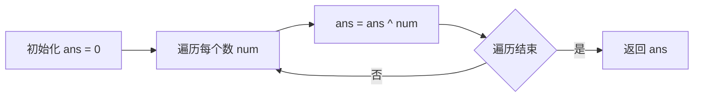
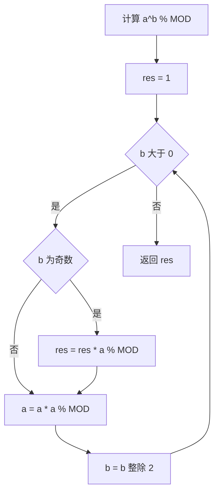
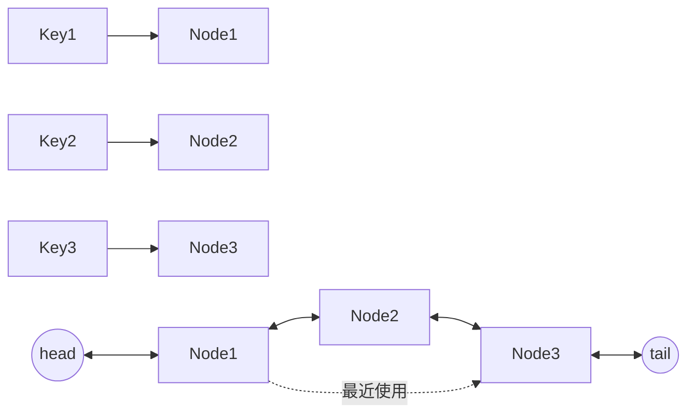

# · 位运算与数学

> **涵盖题型：** 位运算技巧 · 数学题 · 数论 · 设计题

## 📜 背景与起源

### 位运算
计算机底层运算，直接映射到 CPU 指令（AND、OR、XOR、NOT、SHL、SHR）。CPU 在寄存器级别以单个时钟周期完成位操作，远快于算术运算。

`n & (n-1)` 技巧由 **HAKMEM**（MIT AI Lab 备忘录，1972 年）推广。HAKMEM 是 MIT 人工智能实验室的"黑客回忆录"，收录了大量巧妙的位运算技巧和数学小算法，成为后来算法竞赛和面试"奇技淫巧"的源头之一。

### 快速幂
中国古籍中就有记载（"幂"即乘方，源自《九章算术》），现代二进制分解版本的快速幂是 **RSA 加密算法**的理论基础——RSA 需要计算 `c = m^e mod n`，其中 e 是极大指数，直接乘法的复杂度不可接受。

### LRU Cache
1960s 虚拟内存页面置换算法。Least Recently Used（最久未使用）策略是最常用的缓存淘汰策略，广泛应用于数据库 Buffer Pool、CPU Cache、Redis、操作系统页面置换等场景。在工程面试中，LRU 已成为考察数据结构选型和系统设计能力的必考题。

## 一、位运算

### 🔬 核心原理

位运算直接操作二进制位，速度极快，是很多看似复杂的算法问题的本质解法。

| 运算 | 符号 | 规则 |
|------|------|------|
| 与 | & | 全 1 则 1 |
| 或 | \| | 有 1 则 1 |
| 异或 | ^ | 不同则 1 |
| 取反 | ~ | 0↔1 |
| 左移 | << | 乘以 2ᵏ |
| 右移 | >> | 除以 2ᵏ（向下取整） |

### 💡 破题直觉

**看到"只出现一次的数""2 的幂""状态压缩""集合操作""奇偶判断"→ 位运算**

**最常用的位运算技巧：**

```text
n & (n-1)  → 去掉最低位的 1 → 判断 2 的幂、数二进制 1 的个数
n & (-n)   → 取最低位的 1（lowbit）
n & 1      → 判断奇偶
x ^ x = 0  → 相同数异或为 0
x ^ 0 = x  → 任何数与 0 异或不变
x ^ y ^ y = x  → 两次异或恢复原值
```

| 技巧 | 用途 | 示例 |
|------|------|------|
| `n & (n-1) == 0` | 判断 2 的幂 | 4 & 3 = 0 |
| `n = n & (n-1)` | 统计 1 的个数 | while(n) {n &= n-1; cnt++;} |
| `x = i & -i` | 树状数组 lowbit | 取最低位 1 |
| `mask \| (1<<k)` | 设置第 k 位 | 状态压缩 DP |
| `mask & (1<<k)` | 检查第 k 位 | 判断元素是否在集合中 |
| `a ^ b` | 不使用临时变量交换 | a ^= b; b ^= a; b ^= b 不对！a ^= b; b ^= a; a ^= b |

### ⚠️ 边界陷阱

| 陷阱 | 场景 | 对策 |
|------|------|------|
| 有符号右移 | Java >> 补符号位 | 用 >>> 无符号右移或 Python（无限精度） |
| 负数取模 | -1 % 2 = -1 | `(n % 2 + 2) % 2` 或 `n & 1` |
| 溢出 | 左移 31 位（int） | 用 1L << k 或 Python 无溢出 |
| 优先级 | x & 1 == 0 → x & (1 == 0) | 加括号：(x & 1) == 0 |

### 📈 递进示例

**题目：只出现一次的数字 (136)**



| 解法 | 时间 | 空间 | 思路 |
|------|-----|------|------|
| 哈希表 | O(n) | O(n) | 统计频率 |
| 排序后扫描 | O(n log n) | O(1) | 相邻元素两两比较 |
| 数学公式 | O(n) | O(n) | 2×sum(Set) - sum(nums) |
| **异或（最优）** | **O(n)** | **O(1)** | 所有数异或，相同抵消 |

### ⚡ 应试策略

```python
# 只出现一次的数字（其他出现 2 次）
def single_number(nums):
    ans = 0
    for num in nums:
        ans ^= num
    return ans

# 只出现一次的数字 II（其他出现 3 次）
# 用两个 int 模拟 3 进制位运算
def single_number_ii(nums):
    ones = twos = 0
    for num in nums:
        ones = (ones ^ num) & ~twos
        twos = (twos ^ num) & ~ones
    return ones

# 只出现一次的数字 III（有两个出现一次的数）
def single_number_iii(nums):
    xor_all = 0
    for num in nums:
        xor_all ^= num
    lowbit = xor_all & (-xor_all)  # 分组依据
    a = b = 0
    for num in nums:
        if num & lowbit:
            a ^= num
        else:
            b ^= num
    return [a, b]
```

### 🏷️ 常见题型与解题方案

#### ① 只出现一次的数字 I（LeetCode 136）

**题目特征：**
- 数组中除一个元素只出现一次外，其余每个元素均出现 **两次**
- 要求线性时间 + 常数空间

**解题思路：**
利用异或运算的"自消性"：`a ^ a = 0`、`a ^ 0 = a`。将所有数依次异或，出现两次的数会相互抵消，最后剩下的就是只出现一次的数字。

> 从暴力到最优的推导：
> 1. **暴力哈希表**：O(n) 时间，O(n) 空间——用字典统计每个数的出现次数
> 2. **排序后扫描**：O(n log n) 时间，O(1) 空间——排序后相邻元素两两比较
> 3. **数学公式**：O(n) 时间，O(n) 空间——`2 × sum(set) - sum(nums)`
> 4. **✅ 异或（最优）**：O(n) 时间，O(1) 空间——利用 `x ^ x = 0` 的性质

```python
def singleNumber(nums):
    """
    只出现一次的数字 I
    利用异或的自消性：a ^ a = 0, a ^ 0 = a
    """
    ans = 0
    for num in nums:
        ans ^= num  # 出现两次的抵消，出现一次的被保留
    return ans
```

**复杂度分析：**
- 时间复杂度：O(n)，只需遍历一次
- 空间复杂度：O(1)，只用一个变量

#### ② 只出现一次的数字 II（LeetCode 137）

**题目特征：**
- 数组中除一个元素只出现一次外，其余每个元素均出现 **三次**
- 要求线性时间 + 常数空间

**解题思路：**
用两个变量 `ones` 和 `twos` 模拟三进制位运算，记录每个二进制位上出现 1 的次数（模 3）。

- `ones`：记录出现 1 次的位（mod 3 = 1）
- `twos`：记录出现 2 次的位（mod 3 = 2）
- 当出现 3 次时，该位清 0

> 从暴力到最优的推导：
> 1. **暴力哈希表**：O(n) 时间，O(n) 空间——统计每个数的频率
> 2. **位计数数组**：O(n) 时间，O(1) 空间——32 位整数，每位计数模 3
> 3. **✅ 三进制状态机**：O(n) 时间，O(1) 空间——用两个变量模拟有限状态自动机

```python
def singleNumber(nums):
    """
    只出现一次的数字 II
    用两个变量模拟三进制状态机：
    ones 记录 mod 3 = 1 的位，twos 记录 mod 3 = 2 的位
    """
    ones = twos = 0
    for num in nums:
        # 先更新 ones：与当前数异或，但去掉 twos 中已出现两次的位
        ones = (ones ^ num) & ~twos
        # 再更新 twos：同上，但去掉 ones 中已出现一次的位
        twos = (twos ^ num) & ~ones
    return ones  # 最终只出现一次的数的二进制位在 ones 中
```

**复杂度分析：**
- 时间复杂度：O(n)，只需遍历一次
- 空间复杂度：O(1)，只用了两个变量

#### ③ 只出现一次的数字 III（LeetCode 260）

**题目特征：**
- 数组中恰好有两个元素只出现一次，其余元素均出现 **两次**
- 要求线性时间 + 常数空间

**解题思路：**
1. 所有数异或得到 `xor_all = x ^ y`（x 和 y 是那两个数）
2. 由于 x ≠ y，`xor_all` 必定至少有一位是 1
3. 取 `lowbit = xor_all & (-xor_all)` 得到最低位的 1，作为分组依据
4. 根据 `num & lowbit` 是否为 0 将数组分成两组，分别异或得到 x 和 y

> 推导过程：
> - 全部异或 → x ^ y（其他出现两次的数全部抵消）
> - x ^ y 的二进制中，某位为 1 表示 x 和 y 在该位不同
> - 用这一位将原数组分成两组：该位为 0 和该位为 1
> - 相同的数一定会被分到同一组，而 x 和 y 被分开
> - 两组分别异或即得到两个结果

```python
def singleNumber(nums):
    """
    只出现一次的数字 III
    异或 -> lowbit 分组 -> 分别异或
    """
    # 第一步：全部异或得到 x ^ y
    xor_all = 0
    for num in nums:
        xor_all ^= num

    # 第二步：取最低位的 1 作为分组依据
    lowbit = xor_all & (-xor_all)

    # 第三步：根据 lowbit 分组，分别异或
    a = b = 0
    for num in nums:
        if num & lowbit:   # 该位为 1 的一组
            a ^= num
        else:              # 该位为 0 的一组
            b ^= num

    return [a, b]
```

**复杂度分析：**
- 时间复杂度：O(n)，遍历两次
- 空间复杂度：O(1)

#### ④ 2 的幂 / 4 的幂（LeetCode 231 / 342）

**题目特征：**
- 判断一个整数 n 是否为 2 的幂（或 4 的幂）
- 不用循环/递归

**解题思路：**
- **2 的幂**：`n & (n-1) == 0` 且 `n > 0`。2 的幂的二进制形式只有一个 1，`n-1` 把所有低位变为 1，两者与运算为 0
- **4 的幂**：先判断是否为 2 的幂，再判断"唯一的 1"是否在奇数位上（即 `n & 0x55555555 != 0`）。因为 4^k = 2^{2k}，唯一 1 的位置在偶数索引（从 0 开始计）

```python
def isPowerOfTwo(n):
    """判断是否为 2 的幂"""
    return n > 0 and (n & (n - 1)) == 0

def isPowerOfFour(n):
    """判断是否为 4 的幂"""
    # 首先必须是 2 的幂
    # 然后检查唯一的 1 是否在奇数位（从 0 开始数，偶数索引）
    return n > 0 and (n & (n - 1)) == 0 and (n & 0x55555555) != 0
```

**复杂度分析：**
- 时间复杂度：O(1)
- 空间复杂度：O(1)

#### ⑤ 二进制中 1 的个数（LeetCode 191）

**题目特征：**
- 统计一个无符号整数的二进制表示中 1 的个数
- 又称 popcount / Hamming weight

**解题思路：**
利用 `n & (n-1)` 每次消除最低位的 1，统计消除次数即为 1 的个数。

> 推导过程：
> - `n & (n-1)` 的效果：将 n 的最低位的 1 变为 0
> - 例：n = 12 (1100)，n-1 = 11 (1011)，n & (n-1) = 8 (1000)
> - 每执行一次就消去一个 1，循环次数就是原数中 1 的个数
> - O(1) 版本：Python 3.10+ 可用 `int.bit_count()` 内置函数

```python
def hammingWeight(n):
    """
    二进制中 1 的个数
    n & (n-1) 每次消去最低位的 1
    """
    count = 0
    while n:
        n &= (n - 1)  # 消去最低位的 1
        count += 1
    return count

# Python 3.10+ 内置方法（最快）
def hammingWeightBuiltin(n):
    return n.bit_count()
```

**复杂度分析：**
- 时间复杂度：O(k)，k 为二进制中 1 的个数（最坏 O(log n)）
- 空间复杂度：O(1)

#### ⑥ 两整数之和（LeetCode 371）

**题目特征：**
- 不允许使用 `+` 和 `-` 运算符，计算两个整数的和

**解题思路：**
用位运算模拟加法器：
- **异或** `a ^ b`：计算无进位和（不考虑进位的加法）
- **与运算左移** `(a & b) << 1`：计算进位
- 反复迭代直到进位为 0

> 推导过程：
> - 二进制加法 = 无进位和 + 进位
> - 无进位和 = a ^ b
> - 进位 = (a & b) << 1
> - 例：a=2 (010), b=3 (011)
>   - 无进位和 = 001 (1)
>   - 进位 = (010 & 011) << 1 = 100 (4)
>   - 下一轮：a=1 (001), b=4 (100)
>   - 无进位和 = 101 (5)，进位 = 0 → 返回 5

```python
def getSum(a, b):
    """
    两整数之和（不用 + 和 -）
    异或 = 无进位和，与左移 = 进位
    """
    # Python 整数无限精度，需要手动掩码模拟 32 位
    MASK = 0xFFFFFFFF
    MAX_INT = 0x7FFFFFFF

    while b != 0:
        # 无进位和
        a_sum = (a ^ b) & MASK
        # 进位（左移 1 位）
        carry = ((a & b) << 1) & MASK
        a, b = a_sum, carry

    # 如果是负数（> MAX_INT），取补码
    return a if a <= MAX_INT else ~(a ^ MASK)
```

**复杂度分析：**
- 时间复杂度：O(1)，最多循环 32 次（32 位整数）
- 空间复杂度：O(1)

#### ⑦ 子集枚举（状态压缩）（LeetCode 78）

**题目特征：**
- 给定一个不含重复元素的整数数组，返回所有可能的子集
- 子集不能包含重复的子集

**解题思路：**
用二进制掩码（mask）枚举所有子集。数组有 n 个元素，子集数量为 2^n，每个 mask 对应一个子集。

> 推导过程：
> - 从 0 到 (1<<n)-1 遍历所有 mask
> - 对于每个 mask，检查其二进制位的每一位
> - 第 k 位为 1 表示选取 nums[k]，为 0 表示不选
> - mask=0 对应空集，mask=(1<<n)-1 对应全集
>
> 例：nums = [1, 2, 3]（n=3）
> - mask=0 (000) → []
> - mask=1 (001) → [1]
> - mask=2 (010) → [2]
> - mask=3 (011) → [1, 2]
> - mask=4 (100) → [3]
> - ... → 共 2^3 = 8 个子集

```python
def subsets(nums):
    """
    子集枚举（状态压缩）
    用 mask 从 0 到 (1<<n)-1 遍历所有子集
    """
    n = len(nums)
    result = []

    for mask in range(1 << n):  # 0 ~ 2^n - 1
        subset = []
        for i in range(n):
            if mask & (1 << i):  # 第 i 位为 1 则选取 nums[i]
                subset.append(nums[i])
        result.append(subset)

    return result
```

**复杂度分析：**
- 时间复杂度：O(n × 2^n)，每个 mask 需要 O(n) 构建子集
- 空间复杂度：O(n × 2^n)，输出所有子集（不计入则可忽略）

#### ⑧ 找不同（LeetCode 389）

**题目特征：**
- 给定两个字符串 s 和 t，t 由 s 随机打乱后在某一位置添加一个字符生成
- 找出 t 中被添加的那个字符

**解题思路：**
将两个字符串的所有字符异或在一起，相同的字符会互相抵消，最后剩下的就是被添加的字符。

> 推导过程：
> - s = "abcd", t = "abcde"
> - 全部异或：a ^ b ^ c ^ d ^ a ^ b ^ c ^ d ^ e
> - 成对抵消：a^a = 0, b^b = 0, c^c = 0, d^d = 0
> - 剩下：e → 答案
> - 这本质和"只出现一次的数字 I"是同一类问题

```python
def findTheDifference(s, t):
    """
    找不同
    全部字符异或，成对抵消后剩下的就是答案
    """
    ans = 0
    # 将 s 中所有字符异或
    for ch in s:
        ans ^= ord(ch)
    # 再将 t 中所有字符异或
    for ch in t:
        ans ^= ord(ch)
    # 成对抵消后剩下的就是多出的字符
    return chr(ans)

# 简写版
def findTheDifference(s, t):
    ans = 0
    for ch in s + t:
        ans ^= ord(ch)
    return chr(ans)
```

**复杂度分析：**
- 时间复杂度：O(n)，只需遍历一次
- 空间复杂度：O(1)

## 二、数学题与数论

### 🔬 核心原理

算法中的数学题通常利用数学规律大幅度降低时间复杂度，而非暴力的数值计算。

| 题型 | 核心方法 | 复杂度 |
|------|---------|--------|
| 质数判断 | 试除到 √n | O(√n) |
| 质数筛（埃氏） | 每发现质数标记其倍数 | O(n log log n) |
| 质数筛（欧拉） | 每个合数只被最小质因子筛一次 | O(n) |
| 最大公约数 | 辗转相除法 | O(log min(a,b)) |
| 最小公倍数 | a × b / gcd(a,b) | O(log min(a,b)) |
| 快速幂 | 二进制分解 | O(log n) |
| 模运算 | 取模性质 + 逆元 | O(log MOD) |

### 💡 破题直觉

| 场景 | 思路 |
|------|------|
| "大数幂 % MOD" | 快速幂 |
| "排列组合数 % MOD" | 预处理阶乘 + 逆元 |
| "判断质数""计数质数" | 埃氏筛/欧拉筛 |
| "分数加减" | 统一分母求 gcd |
| "找规律题" | 数学归纳 + 打表找规律 |

### ⚠️ 边界陷阱

| 陷阱 | 场景 | 对策 |
|------|------|------|
| 整数溢出 | 乘法结果超 int 范围 | 用 Python 任意精度，或用 long，取模前转 long |
| 除零 | 求 gcd(0, n) | gcd(0, n) = n 是合法输入 |
| 负数的 gcd | gcd(-4, 6) | gcd(abs(a), abs(b)) |
| 模的除法 | (a/b) % MOD | 用乘法逆元，不能直接除 |
| 精度丢失 | 浮点数比较 | 用分数或转换为整数比较 |

### 📈 快速幂流程



### ⚡ 应试策略

```python
# 快速幂
def pow_mod(a, b, mod):
    res = 1
    while b:
        if b & 1:  # b % 2 == 1
            res = res * a % mod
        a = a * a % mod
        b >>= 1
    return res

# 最大公约数
def gcd(a, b):
    while b:
        a, b = b, a % b
    return a

# 埃氏筛
def sieve(n):
    is_prime = [True] * (n + 1)
    is_prime[0] = is_prime[1] = False
    for i in range(2, int(n ** 0.5) + 1):
        if is_prime[i]:
            for j in range(i * i, n + 1, i):
                is_prime[j] = False
    return [i for i, p in enumerate(is_prime) if p]

# 乘法逆元（费马小定理，MOD 为质数时）
def mod_inverse(a, mod):
    return pow_mod(a, mod - 2, mod)
```

### 🏷️ 常见题型与解题方案

#### ① 快速幂（LeetCode 50 / Pow(x, n)）

**题目特征：**
- 计算 a^b % MOD（或 pow(x, n)），其中 b 可能非常大（如 10^9 以上）
- 直接循环乘法会超时

**解题思路：**
将指数 b 按二进制分解，利用 `a^(2^k) = (a^(2^(k-1)))^2` 的倍增性质，将 O(b) 降到 O(log b)。

> 从暴力到最优的推导：
> 1. **直接循环**：O(b)，每次乘 a，b=10^9 时不可行
> 2. **✅ 二进制分解（快速幂）**：O(log b)
>
> **核心原理：**
> - b 可以写为二进制：b = (b_k b_{k-1} ... b_0)_2
> - 则 a^b = a^(b_0 × 2^0) × a^(b_1 × 2^1) × ... × a^(b_k × 2^k)
> - 而 a^(2^(i+1)) = (a^(2^i))^2，可以递推得到
>
> **例：** a=3, b=13 (1101₂)
> - 3^13 = 3^8 × 3^4 × 3^1（跳过 3^2，因为 b 的第 2 位为 0）
> - 从最低位开始：b 为奇数则乘 a，a 自乘（平方），b 右移

```python
def myPow(x, n):
    """
    快速幂 (LeetCode 50)
    支持正负指数，二进制分解法
    """
    if n < 0:          # 负指数：取倒数
        x = 1 / x
        n = -n

    res = 1.0
    while n:
        if n & 1:      # 当前二进制位为 1
            res *= x
        x *= x         # 基数自乘（平方）
        n >>= 1        # 右移一位
    return res


def pow_mod(a, b, mod):
    """
    快速幂取模（二进制分解 + 取模）
    常用于大数幂运算，如 RSA 加密
    """
    res = 1
    a %= mod           # 防止 a 本身过大
    while b:
        if b & 1:
            res = (res * a) % mod
        a = (a * a) % mod
        b >>= 1
    return res
```

**复杂度分析：**
- 时间复杂度：O(log n)
- 空间复杂度：O(1)

#### ② 质数计数——埃氏筛 + 欧拉筛（LeetCode 204）

**题目特征：**
- 统计小于非负整数 n 的所有质数的数量
- n 可能很大（如 5×10^6），需要高效筛法

**解题思路：**

**埃氏筛（Eratosthenes 筛法）：**
从 2 开始，每遇到一个质数就将其所有倍数标记为合数。优化：从 i² 开始标记（因为小于 i² 的倍数已被更小的质数标记过）。

**欧拉筛（线性筛）：**
每个合数只被其最小质因子筛一次，避免重复标记，达到严格 O(n)。

> 推导过程：
> - **暴力法**：对每个数判断质数 O(n√n)，n=5×10⁶ 时不可接受
> - **埃氏筛**：标记倍数的总次数 ≈ n/2 + n/3 + n/5 + ... = n log log n
> - **✅ 欧拉筛**：每个合数只被标记一次 → O(n)
>
> 欧拉筛 vs 埃氏筛的核心区别：
> - 埃氏筛：i=2 标记 4,6,8,10,...；i=3 标记 6,9,12,...（6 被标记两次）
> - 欧拉筛：用 `i % primes[j] == 0` 保证每个合数只被最小质因子标记

```python
def countPrimes(n):
    """
    埃氏筛法统计质数数量
    时间复杂度 O(n log log n)
    """
    if n < 2:
        return 0

    is_prime = [True] * n
    is_prime[0] = is_prime[1] = False

    for i in range(2, int(n ** 0.5) + 1):
        if is_prime[i]:
            # 从 i*i 开始标记，因为小于 i*i 的已被更小的质数标记过
            for j in range(i * i, n, i):
                is_prime[j] = False

    return sum(is_prime)


def countPrimes_linear(n):
    """
    欧拉筛（线性筛）统计质数数量
    每个合数只被最小质因子筛一次，严格 O(n)
    """
    if n < 2:
        return 0

    is_prime = [True] * n
    primes = []
    is_prime[0] = is_prime[1] = False

    for i in range(2, n):
        if is_prime[i]:
            primes.append(i)
        for p in primes:
            if i * p >= n:
                break
            is_prime[i * p] = False
            # 核心：当 i 能被 p 整除时，p 就是 i*p 的最小质因子
            # 继续用更大的质数筛会产生重复，所以 break
            if i % p == 0:
                break

    return len(primes)
```

**复杂度分析：**
| 方法 | 时间复杂度 | 空间复杂度 |
|------|-----------|-----------|
| 埃氏筛 | O(n log log n) | O(n) |
| 欧拉筛 | O(n) | O(n) |

**面试提示：** 埃氏筛是面试常考版本，代码简短好记。欧拉筛用于 n 极大（如 10^7+）的压轴场景。

#### ③ 最大公约数（辗转相除法 / 欧几里得算法）

**题目特征：**
- 求两个整数的最大公约数
- 常用于分数化简、求最小公倍数、模运算等场景

**解题思路：**
辗转相除法（欧几里得算法）：`gcd(a, b) = gcd(b, a % b)`，直到余数为 0。

> 推导过程：
> - 若 a = b × q + r（0 ≤ r < b），则 gcd(a, b) = gcd(b, r)
> - 因为任何整除 a 和 b 的数也必然整除 r = a - bq
> - 反复辗转相除，b 和 r 越来越小，最终 r=0 时，b 就是最大公约数
>
> 例：gcd(48, 18)
> - 48 = 18×2 + 12 → gcd(48, 18) = gcd(18, 12)
> - 18 = 12×1 + 6  → gcd(18, 12) = gcd(12, 6)
> - 12 = 6×2 + 0   → gcd(12, 6) = 6
> - 返回 6

```python
def gcd(a, b):
    """
    辗转相除法求最大公约数
    处理负数和零的情况
    """
    a, b = abs(a), abs(b)
    while b:
        a, b = b, a % b
    return a


def lcm(a, b):
    """最小公倍数 = a * b / gcd(a, b)"""
    return abs(a * b) // gcd(a, b)


def gcd_recursive(a, b):
    """递归版本"""
    return a if b == 0 else gcd_recursive(b, a % b)
```

**复杂度分析：**
- 时间复杂度：O(log min(a, b))
- 空间复杂度：O(1)（迭代版本）

#### ④ 阶乘后的零（LeetCode 172）

**题目特征：**
- 给定一个整数 n，返回 n! 结果中尾随零的数量
- 要求对数时间复杂度

**解题思路：**
尾随零由因子 2 × 5 = 10 产生。在阶乘中，因子 2 的数量远多于因子 5 的数量，所以只需统计因子 5 的个数。

> 从暴力到最优的推导：
> 1. **暴力计算 n!**：n! 可能极大，超出整数范围，不可行
> 2. **遍历计数**：从 1 到 n，对每个数分解因数 5 → O(n log n)
> 3. **✅ 数学规律**：n/5 + n/25 + n/125 + ... → O(log n)
>
> **为什么是 n/5 + n/25 + n/125 + ...？**
> - 每 5 个数贡献一个因子 5（5, 10, 15, 20, 25...）
> - 每 25 个数多贡献一个因子 5（25=5×5, 50=5×5×2...）
> - 每 125 个数再多贡献一个...以此类推
> - n=25：5 的倍数有 5 个，但 25 贡献了两个 5，所以 n/5=5, n/25=1，总和=6

```python
def trailingZeroes(n):
    """
    阶乘后的零——统计因子 5 的个数
    n! 中因子 5 的个数 = n/5 + n/25 + n/125 + ...
    """
    count = 0
    while n:
        n //= 5        # 每轮除以 5
        count += n     # 累加贡献
    return count
```

**复杂度分析：**
- 时间复杂度：O(log₅ n)，约 log₅(n) 次迭代
- 空间复杂度：O(1)

#### ⑤ 快乐数（LeetCode 202）

**题目特征：**
- 对一个数反复执行"各位数字的平方和"，判断最终是否会回到 1
- 如果是快乐数则最终 → 1；如果不是则会进入循环

**解题思路：**
把"各位平方和"看作一个映射 f(x)，问题转化为判断是否存在环——可以用快慢指针法（Floyd 判圈算法）。

> 从暴力到最优的推导：
> 1. **哈希表**：用 set 记录所有出现过的数，遇到重复则判定有环 → O(log n) 空间
> 2. **✅ 快慢指针**：慢指针每次算一次 f(x)，快指针算两次 f(x)，相遇则有环 → O(1) 空间
>
> 为什么用链表判圈思路？
> - 定义 next = f(x)（各位平方和）
> - 快乐数：链走到达 1 后停在 1（1 的平方和还是 1）
> - 不快乐数：链会进入一个循环（永远不会到达 1）
> - 快慢指针：快慢指针相遇则说明有环，如果慢指针到达 1 则是快乐数

```python
def isHappy(n):
    """
    快乐数——快慢指针判圈
    各位平方和作为链表 next 指针
    """
    def get_next(num):
        """计算各位数字的平方和"""
        total = 0
        while num:
            digit = num % 10
            total += digit * digit
            num //= 10
        return total

    slow = n          # 慢指针，一次一步
    fast = get_next(n)  # 快指针，一次两步

    while fast != 1 and slow != fast:
        slow = get_next(slow)
        fast = get_next(get_next(fast))

    return fast == 1
```

**复杂度分析：**
- 时间复杂度：O(log n)（实际上最坏 O(243 × 3 + ...)，平方和最大不超过 9²×位数，有上界）
- 空间复杂度：O(1)

**面试提示：** 也可以用哈希表实现，更直观易懂。快慢指针版本适合展示对 Floyd 判圈法的掌握。

## 三、设计题

### 🔬 核心原理

设计题考察数据结构选型、时间空间权衡、实际的工程思维。面试中常见的有：LRU Cache、LFU Cache、线程安全单例等。

| 设计题 | 核心数据结构 | 重点 |
|-------|------------|------|
| **LRU Cache** | 双向链表 + HashMap | get/set 均 O(1) |
| **LFU Cache** | HashMap + 频率桶 | 最小频率淘汰 |
| **栈实现队列** | 两个栈（入栈+出栈） | 出栈为空时倒入 |
| **队列实现栈** | 两个队列 | push 时倒腾 |
| **常数时间插入删除随机** | 数组 + HashMap | 删除时与末尾交换 |

### 💡 破题直觉

**"缓存淘汰"→ LRU（双向链表+HashMap）**
**"只记录最近/最少"→ 双端队列 / 栈**
**"线程安全"→ 加锁 / CAS / 不可变对象**
**"大量的读、少量的写"→ 读写分离 / CopyOnWrite**

### ⚠️ 边界陷阱

| 陷阱 | 场景 | 对策 |
|------|------|------|
| LRU 的容量为 1 | 只有一条数据 | get 后移到头部，淘汰时尾节点=头节点 |
| 缓存中的数据被外部修改 | 引用可变对象 | 存不可变对象或深拷贝 |
| 线程安全 | 并发读写 | 明确是否要求线程安全 |
| LRU 更新 | get 后要更新位置 | get 时先删除再添加到头部 |

### 📈 LRU 结构



### ⚡ 应试策略

```python
class LRUCache:
    class Node:
        def __init__(self, key=0, val=0):
            self.key = key
            self.val = val
            self.prev = None
            self.next = None

    def __init__(self, capacity: int):
        self.cap = capacity
        self.cache = {}
        self.head = self.Node()
        self.tail = self.Node()
        self.head.next = self.tail
        self.tail.prev = self.head

    def _remove(self, node):
        node.prev.next = node.next
        node.next.prev = node.prev

    def _add_to_head(self, node):
        node.next = self.head.next
        node.prev = self.head
        self.head.next.prev = node
        self.head.next = node

    def get(self, key: int) -> int:
        if key not in self.cache: return -1
        node = self.cache[key]
        self._remove(node)
        self._add_to_head(node)
        return node.val

    def put(self, key: int, value: int) -> None:
        if key in self.cache:
            node = self.cache[key]
            node.val = value
            self._remove(node)
            self._add_to_head(node)
        else:
            node = self.Node(key, value)
            self.cache[key] = node
            self._add_to_head(node)
            if len(self.cache) > self.cap:
                lru = self.tail.prev
                self._remove(lru)
                del self.cache[lru.key]
```

### 🏷️ 常见题型与解题方案

#### ① LRU Cache（LeetCode 146）

**题目特征：**
- 实现一个最近最少使用（LRU）缓存
- `get(key)` 和 `put(key, value)` 均 O(1) 时间复杂度
- 容量满时淘汰最久未使用的键值对

**解题思路：**
**双向链表 + HashMap。**

- **HashMap**：保存 key → 节点的映射，实现 O(1) 查找
- **双向链表**：维护访问顺序，最近使用的在头部，最久未使用的在尾部

> 从暴力到最优的推导：
> 1. **数组/列表**：get O(n)，put O(n)——需要遍历查找和移动
> 2. **单向链表 + 前驱指针**：移动节点到头部需要 O(n) 找前驱
> 3. **✅ 双向链表 + HashMap**：get/put 均 O(1)
>
> **核心操作：**
> - get：从 HashMap 获取节点，将其移到链表头部
> - put：已存在则更新值并移到头部；不存在则创建新节点放到头部，容量超限则删除尾部节点
> - 使用 dummy head/tail 避免空指针判断

```python
class LRUCache:
    """
    LRU 缓存——双向链表 + HashMap
    get/put 均 O(1)
    """

    class _Node:
        """双向链表节点"""
        __slots__ = ('key', 'val', 'prev', 'next')

        def __init__(self, key=0, val=0):
            self.key = key
            self.val = val
            self.prev = None
            self.next = None

    def __init__(self, capacity: int):
        self.cap = capacity
        self.cache = {}  # key -> node
        # Dummy 头尾节点，避免空指针判断
        self.head = self._Node()
        self.tail = self._Node()
        self.head.next = self.tail
        self.tail.prev = self.head

    def _remove(self, node):
        """从链表中删除节点"""
        node.prev.next = node.next
        node.next.prev = node.prev

    def _add_to_head(self, node):
        """将节点添加到链表头部"""
        node.next = self.head.next
        node.prev = self.head
        self.head.next.prev = node
        self.head.next = node

    def get(self, key: int) -> int:
        """获取值，并将对应节点移到头部"""
        if key not in self.cache:
            return -1
        node = self.cache[key]
        self._remove(node)
        self._add_to_head(node)
        return node.val

    def put(self, key: int, value: int) -> None:
        """写入键值对，超容量时淘汰最久未使用的"""
        if key in self.cache:
            # 已存在：更新值并移到头部
            node = self.cache[key]
            node.val = value
            self._remove(node)
            self._add_to_head(node)
        else:
            # 不存在：创建新节点
            node = self._Node(key, value)
            self.cache[key] = node
            self._add_to_head(node)
            # 超容量：淘汰尾节点（最久未使用）
            if len(self.cache) > self.cap:
                lru = self.tail.prev
                self._remove(lru)
                del self.cache[lru.key]
```

**复杂度分析：**
- 时间复杂度：get O(1)，put O(1)
- 空间复杂度：O(capacity)

#### ② LFU Cache（LeetCode 460）

**题目特征：**
- 实现最不经常使用（LFU）缓存淘汰策略
- 访问频率最低的键被淘汰；频率相同时淘汰最久未使用的（LRU 兜底）
- get 和 put 均 O(1) 时间复杂度

**解题思路：**
**频率分桶 + HashMap + 双向链表。**

三层映射结构：
1. **key → value、freq、节点在链表中的位置**
2. **freq → 该频率对应的双向链表**（同频节点按 LRU 排序）
3. **min_freq**：记录当前的最小频率

> 从暴力到最优的推导：
> 1. **简单计数器**：记录每个 key 的频率，淘汰时扫描找最小值 → O(n)
> 2. **优先级队列**：频率作为优先级 → put O(log n)
> 3. **✅ 频率分桶**：O(1) get/put
>
> **核心操作：**
> - get：频率 +1，从当前频率桶移到下一个频率桶
> - put：同理，更新频率；频率桶为空则删除该桶

```python
class LFUCache:
    """
    LFU 缓存——频率分桶 + HashMap
    每个频率对应一个双向链表（同频节点内按 LRU 排序）
    get/put 均 O(1)
    """

    class _Node:
        __slots__ = ('key', 'val', 'freq', 'prev', 'next')

        def __init__(self, key=0, val=0, freq=0):
            self.key = key
            self.val = val
            self.freq = freq
            self.prev = None
            self.next = None

    class _DLL:
        """双向链表（带 dummy 头尾）"""
        def __init__(self):
            self.head = LFUCache._Node()
            self.tail = LFUCache._Node()
            self.head.next = self.tail
            self.tail.prev = self.head
            self.size = 0

        def add_to_head(self, node):
            node.next = self.head.next
            node.prev = self.head
            self.head.next.prev = node
            self.head.next = node
            self.size += 1

        def remove(self, node):
            node.prev.next = node.next
            node.next.prev = node.prev
            self.size -= 1

        def remove_tail(self):
            if self.size == 0:
                return None
            node = self.tail.prev
            self.remove(node)
            return node

    def __init__(self, capacity: int):
        self.cap = capacity
        self.cache = {}           # key -> node
        self.freq_map = {}        # freq -> DLL
        self.min_freq = 0

    def _update_freq(self, node):
        """将节点从当前频率桶移到下一个频率桶"""
        freq = node.freq
        # 从当前桶移除
        dll = self.freq_map.get(freq)
        if dll:
            dll.remove(node)
            # 当前桶空了就删除
            if dll.size == 0:
                del self.freq_map[freq]
                if self.min_freq == freq:
                    self.min_freq += 1

        # 放入下一频率桶
        node.freq += 1
        new_freq = node.freq
        if new_freq not in self.freq_map:
            self.freq_map[new_freq] = self._DLL()
        self.freq_map[new_freq].add_to_head(node)

    def get(self, key: int) -> int:
        if key not in self.cache:
            return -1
        node = self.cache[key]
        self._update_freq(node)
        return node.val

    def put(self, key: int, value: int) -> None:
        if self.cap == 0:
            return

        if key in self.cache:
            node = self.cache[key]
            node.val = value
            self._update_freq(node)
        else:
            if len(self.cache) >= self.cap:
                # 淘汰最小频率桶中的最久未使用节点
                dll = self.freq_map[self.min_freq]
                evict = dll.remove_tail()
                if evict:
                    del self.cache[evict.key]

            node = self._Node(key, value, 0)
            self.cache[key] = node
            self.min_freq = 0
            if 0 not in self.freq_map:
                self.freq_map[0] = self._DLL()
            self.freq_map[0].add_to_head(node)
```

**复杂度分析：**
- 时间复杂度：get O(1)，put O(1)
- 空间复杂度：O(capacity)

**面试提示：** LFU 比 LRU 复杂，面试中通常要求手写 LRU，LFU 考察设计理解即可。

#### ③ 用栈实现队列（LeetCode 232）

**题目特征：**
- 仅使用两个栈实现一个先入先出（FIFO）队列
- 支持 push、pop、peek、empty 操作，均摊 O(1)

**解题思路：**
一个输入栈 + 一个输出栈：
- **push**：直接压入输入栈
- **pop/peek**：如果输出栈为空，把输入栈全部倒到输出栈（此时顺序反转），再从输出栈弹出

> 从暴力到最优的推导：
> 1. **单栈**：无法实现 FIFO
> 2. **两个栈 + 每次操作都倒腾**：每次 pop 都把全部元素倒一遍 → 最坏 O(n)
> 3. **✅ 两个栈 + 惰性倒腾**：只有输出栈为空时才倒 → 均摊 O(1)

```python
class MyQueue:
    """
    用两个栈实现队列
    输入栈（push） + 输出栈（pop/peek）
    输出栈为空时才从输入栈倒入
    """

    def __init__(self):
        self.stack_in = []   # 用于 push
        self.stack_out = []  # 用于 pop 和 peek

    def push(self, x: int) -> None:
        self.stack_in.append(x)

    def _transfer(self):
        """将输入栈全部倒到输出栈（反转顺序）"""
        if not self.stack_out:
            while self.stack_in:
                self.stack_out.append(self.stack_in.pop())

    def pop(self) -> int:
        self._transfer()
        return self.stack_out.pop()

    def peek(self) -> int:
        self._transfer()
        return self.stack_out[-1]

    def empty(self) -> bool:
        return not self.stack_in and not self.stack_out
```

**复杂度分析：**
- 时间复杂度：push O(1)，pop/peek 均摊 O(1)（每个元素最多入栈两次、出栈两次）
- 空间复杂度：O(n)

#### ④ 常数时间插入、删除和获取随机元素（LeetCode 380）

**题目特征：**
- 设计一个支持以下操作的数据结构：
  - `insert(val)`：O(1) 插入
  - `remove(val)`：O(1) 删除（存在则删除并返回 True）
  - `getRandom()`：O(1) 等概率随机返回一个元素
- 要求所有操作均为常数时间

**解题思路：**
**数组 + HashMap（val → index）。**

- **数组**：支持 O(1) 随机访问（getRandom）
- **HashMap**：支持 O(1) 查找位置
- **删除技巧**：不直接删除数组中的元素，而是将要删除的元素与数组末尾元素交换位置，再 pop 末尾

> 推导过程：
> - 光用数组：insert O(1)（append），getRandom O(1)，但 remove O(n)（需要查找）
> - 光用 HashMap：insert O(1)，remove O(1)，但 getRandom 无法 O(1)
> - **✅ 数组 + HashMap**：集合两者优势
>
> 删除为什么用"与末尾交换再 pop"？
> - 数组中间删除是 O(n)（需要移动后续元素）
> - 交换到末尾后再 pop 是 O(1)
> - HashMap 中记录每个值在数组中的下标，交换后别忘了更新末尾元素的映射

```python
import random

class RandomizedSet:
    """
    常数时间插入、删除和获取随机元素
    数组 + HashMap（val → index）
    删除时与末尾元素交换再 pop
    """

    def __init__(self):
        self.nums = []           # 存储元素
        self.val_to_idx = {}     # val -> index in nums

    def insert(self, val: int) -> bool:
        if val in self.val_to_idx:
            return False         # 已存在
        self.val_to_idx[val] = len(self.nums)
        self.nums.append(val)
        return True

    def remove(self, val: int) -> bool:
        if val not in self.val_to_idx:
            return False         # 不存在

        idx = self.val_to_idx[val]
        last_val = self.nums[-1]

        # 将要删除的元素与末尾元素交换
        self.nums[idx] = last_val
        self.val_to_idx[last_val] = idx

        # 删除末尾元素
        self.nums.pop()
        del self.val_to_idx[val]

        return True

    def getRandom(self) -> int:
        """等概率返回一个随机元素"""
        return random.choice(self.nums)
```

**复杂度分析：**
- 时间复杂度：insert O(1)，remove O(1)，getRandom O(1)
- 空间复杂度：O(n)

**面试提示：** `remove` 时要考虑待删除元素恰好在末尾的特殊情况（交换操作依然正确，只是多了一次 val_to_idx 更新）。

## 🎯 问题域映射

### 位运算
- **适用场景：** 集合操作（状态压缩）、奇偶性判断、2 的幂判断、只出现一次的数、子集枚举
- **不适用：** 浮点数运算、大数精确计算、需要多位连续操作的业务逻辑
- **优势：** O(1) 的 CPU 指令级操作，无需访存
- **面试提示：** 熟记 `n & (n-1)`、`a ^ b`、`mask & (1<<k)` 三种技巧基本覆盖 90% 的位运算面试题

### 快速幂
- **适用场景：** 大数幂模运算（RSA 加密）、模运算组合数、矩阵快速幂
- **优势：** 指数极大时有优势，小指数（指数 < 10）时直接乘更快
- **注意：** 通常配合取模使用，避免大数溢出
- **扩展：** 矩阵快速幂 → 斐波那契数列 O(log n) 解法

### 设计题
- **适用场景：** 缓存/队列互转/随机存取、线程安全包装
- **关注点：** 工程实践中的封装、锁粒度、并发安全
- **面试提示：** 手写 LRU 时，先用伪代码梳理结构，再写细节；`get` 和 `put` 都要更新节点位置，不可遗漏

## ⚙️ 高效实现指南

### 位运算
- **优先级陷阱：** `==` 优先级高于 `&`，`x & 1 == 0` 等价于 `x & (1 == 0)`。**务必加括号**：`(x & 1) == 0`
- **右移规则：** 有符号数右移是算术右移（补符号位），Python 无限精度无此问题；Java 用 `>>>` 做无符号右移
- **n & (n-1)：** 每次吃掉最低位的 1，循环次数即二进制中 1 的个数
- **lowbit：** `n & (-n)` 取最低位的 1，在树状数组、状态压缩 DP 中极其常用
- **性能：** 位运算在主流 CPU 上只需 1 个时钟周期，比乘除快一个数量级

### 快速幂
- **循环优先：** 指数 b 用 `while` 循环而非递归（避免递归栈溢出 + 函数调用开销）
- **取模时机：** 每次乘法记得 `% MOD`，不要等最终结果再取模——中间结果可能已溢出
- **扩展：** 矩阵快速幂将标量乘法改为矩阵乘法，可解斐波那契、线性递推等问题
- **模板记忆：** 记住"res 初始 1，b 为奇数时乘 a，a 自乘，b 右移"四步口诀

### LRU
- **Dummy 节点：** 双向链表用 dummy head 和 dummy tail 避免判空，简化代码
- **更新时机：** `get` 和 `put` 都更新节点位置——这是 LRU 的核心语义
- **同步删除：** 删除节点时一定记得从 HashMap 中也同步删除，否则出现悬空引用
- **容量检查：** `put` 时先检查容量是否超限，超限则删除 tail.prev（最久未使用）

## 面试速查表

| 题型 | 核心技巧 | 时间复杂度 | 空间 | 面试频度 |
|------|---------|-----------|------|---------|
| 异或性质 | x ^ x = 0 | O(n) | O(1) | ⭐⭐⭐⭐⭐ |
| n & (n-1) | 去掉最低位 1 | O(#bits) | O(1) | ⭐⭐⭐⭐ |
| 快速幂 | 二进制分解 | O(log n) | O(1) | ⭐⭐⭐⭐ |
| 质数筛 | 埃氏筛/欧拉筛 | O(n log log n) | O(n) | ⭐⭐⭐ |
| LRU Cache | 双向链表+Map | O(1) | O(cap) | ⭐⭐⭐⭐⭐ |
| 最大公约数 | 辗转相除法 | O(log n) | O(1) | ⭐⭐⭐ |
