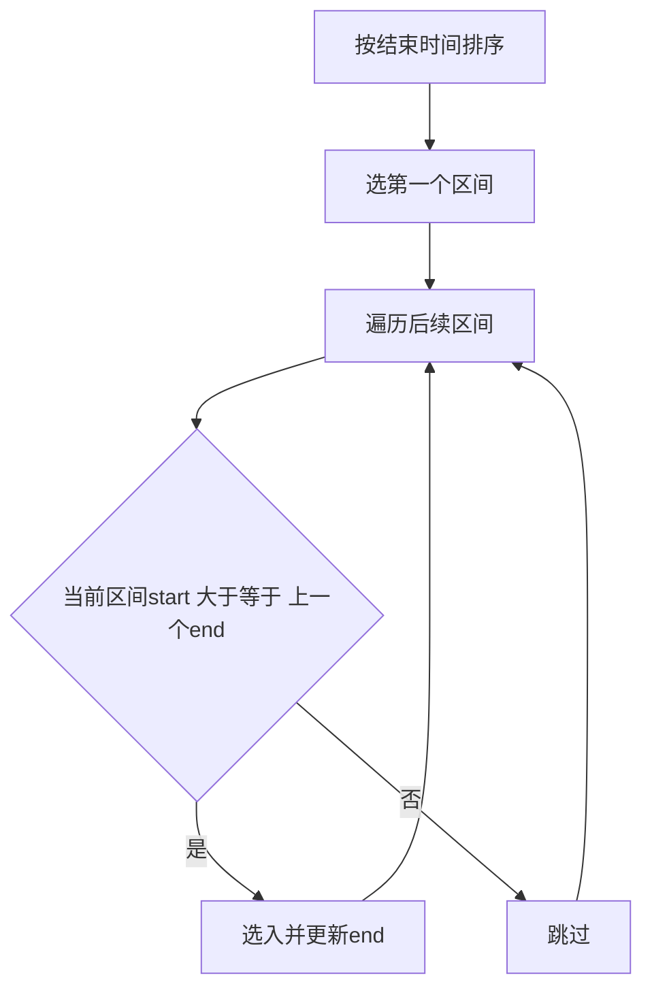
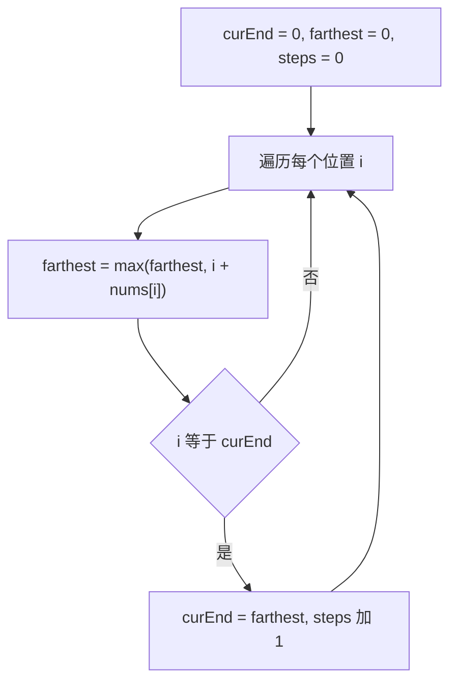
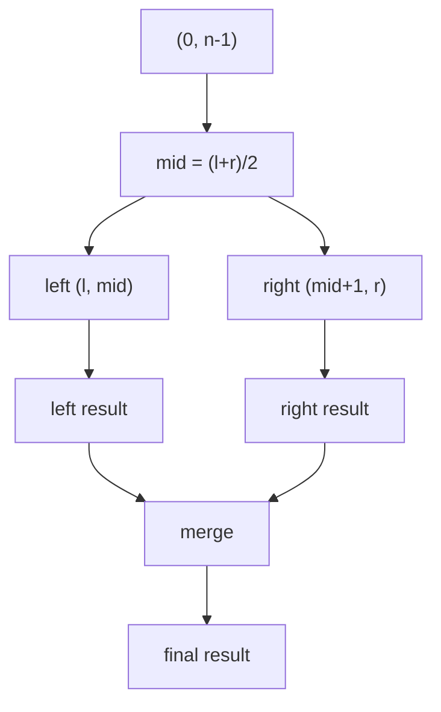
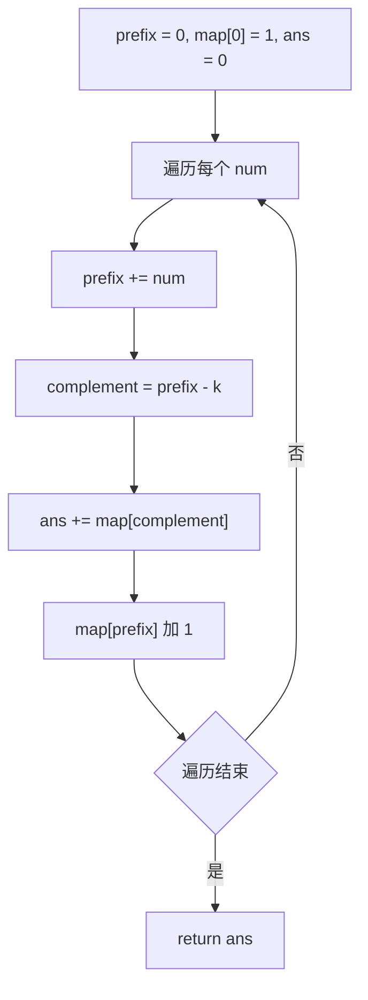
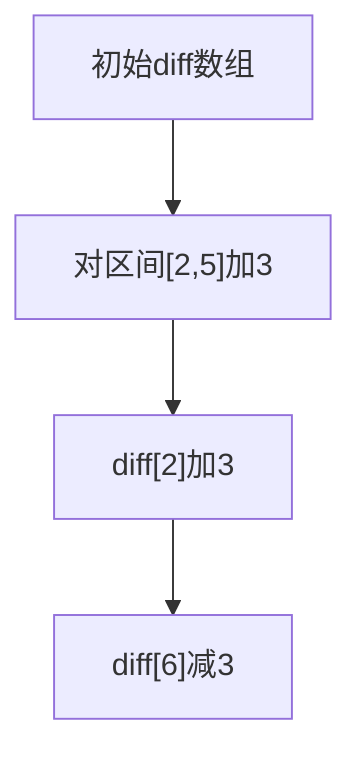
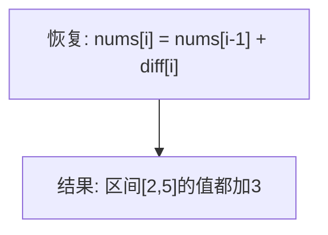

# · 贪心与分治

> **涵盖题型：** 贪心 · 分治 · 前缀和 · 差分数组

## 一、贪心（Greedy）

### 📜 背景与起源

贪心思想的历史可追溯到古希腊。**欧几里得算法**（辗转相除法，约公元前 300 年）是最早的贪心算法实例——每一步用较大数除以较小数取余，将较大数替换为余数，直至余数为零，每步都是「当前最优」地缩小问题规模。现代计算机科学中，贪心算法的严格理论分析在 1970 年代通过**拟阵（Matroid）理论**正式建立：如果一个问题的可行解集合构成拟阵结构，贪心算法必然得到全局最优解。如今，贪心算法在区间调度、最小生成树（Kruskal、Prim）、Dijkstra最短路、哈夫曼编码等领域均有经典应用。

### 🔬 核心原理

贪心算法 **每步做出当前最优选择**，期望得到全局最优解。不回溯、不保存所有可能，只走一条路。

```text
贪心的正确性需要证明：
1. 贪心选择性质：局部最优能推出全局最优
2. 最优子结构：问题的最优解包含子问题的最优解
```
### 🎯 问题域映射

| 适用场景 | 不适用场景 |
|---------|-----------|
| 局部最优能推出全局最优的问题（区间调度、作业调度、最小生成树、哈夫曼编码、Dijkstra最短路） | 需要穷举所有可能才能确定最优解的场景（如 0/1 背包问题、旅行商问题），此时应使用 DP 或搜索 |
| 问题具有拟阵结构（Matroid），贪心必然最优 | 贪心性质未满足时使用贪心会导致错误答案（如特定币值的零钱兑换） |

### ⚙️ 高效实现指南

贪心策略的正确性**必须证明**，面试中常用的证明方法包括**交换论证法（Exchange Argument）**和**数学归纳法**。典型的面试表达：「直觉认为按结束时间最早排序最优，可以用交换论证证明——假设最优解中第一个区间不是当前最早结束的区间，可将其替换为最早结束的区间而不影响解的优劣。」注意：不要在未证明的情况下盲目使用贪心，尤其是当题目暗示可能存在多解时。

### 💡 破题直觉

**看到「最少/最多」「区间调度」「最优安排」「最小生成树」「哈夫曼编码」→ 贪心**

**贪心 vs DP：**

| 对比项 | 贪心 | DP |
|-------|------|-----|
| 决策方式 | 每步选当前最优，不回头 | 考虑所有可能，利用子问题 |
| 复杂度 | O(n) / O(n log n) | 常为 O(n²) 或以上 |
| 适用条件 | 局部最优=全局最优 | 最优子结构+重叠子问题 |
| 正确性 | 需要严格证明 | 对定义转移方程 |
| 例子 | 区间调度、硬币（特定） | 背包、编辑距离 |

**经典贪心类型：**

| 类型 | 贪心策略 | 典型题目 |
|------|---------|---------|
| 区间调度 | 按结束时间最早排序 | 无重叠区间 |
| 区间覆盖 | 按开始时间排序，选覆盖当前终点最远的 | 跳跃游戏 II |
| 最小等待 | 耗时短的先做 | 排队打水、最小化总等待 |
| 哈夫曼编码 | 合并权值最小的两个 | 文件压缩 |
| Kruskal MST | 按边权从小到大选 | 最小生成树 |
| Dijkstra | 选当前距源点最短的节点 | 最短路 |

### ⚠️ 边界陷阱

| 陷阱 | 场景 | 对策 |
|------|------|------|
| 贪心不成立 | 误用贪心（如零钱兑换某些币值） | 先判断是否具备贪心性质 |
| 排序依据错误 | 区间覆盖用 end 排序 | 明确是 start 还是 end |
| 边界值漏算 | 最后一个区间 | 处理完所有区间后检查 |
| 跳跃游戏的"最远" | 跳的步数不是当前位置 | 维护当前能到达的最远位置 |

### 📈 流程

**区间调度：**


**跳跃游戏 II：**


### ⚡ 应试策略

```python
# 区间调度（最多不重叠区间）
def erase_overlap_intervals(intervals):
    if not intervals: return 0
    intervals.sort(key=lambda x: x[1])  # 按 end 排序
    end = intervals[0][1]
    count = 1  # 选的最新区间数
    for s, e in intervals[1:]:
        if s >= end:
            count += 1
            end = e
    return len(intervals) - count  # 需要移除的

# 跳跃游戏 II（最少步数）
def jump(nums):
    n = len(nums)
    cur_end = farthest = steps = 0
    for i in range(n - 1):
        farthest = max(farthest, i + nums[i])
        if i == cur_end:
            steps += 1
            cur_end = farthest
    return steps

# 加油站（经典贪心）
def can_complete_circuit(gas, cost):
    total = cur = start = 0
    for i in range(len(gas)):
        total += gas[i] - cost[i]
        cur += gas[i] - cost[i]
        if cur < 0:
            start = i + 1
            cur = 0
    return -1 if total < 0 else start
```
### 🏷️ 常见题型与解题方案

#### ① 区间调度（无重叠区间 / 用最少的箭射气球）

**题目特征**
- 给定一组区间 `[start, end]`，求最大不重叠数量，或求最少需要移除多少个区间才能使其互不重叠
- 变体：用最少的箭射爆所有气球——每个气球是一个区间，一支箭从某个 x 坐标垂直向上射，可以射穿所有包含该坐标的气球，求最少箭数

**解题思路与推导**

暴力回溯（O(2ⁿ)）：每个区间选或不选，枚举所有子集→检查是否冲突→取最大不重叠数。

动态规划（O(n²)）：按开始时间排序，`dp[i]` 表示以第 i 个区间为结尾的最大不重叠子集长度，`dp[i] = max(dp[i], dp[j] + 1) for all j where end[j] <= start[i]`。

**贪心（O(n log n)）**：按结束时间升序排序，遍历区间，若当前区间开始时间 ≥ 上一个选中区间的结束时间，则选中。**证明（交换论证）**：设最优解的第一个区间为 A，贪心选的第一个区间为 B（最早结束的）。若 A ≠ B，则 B 的结束时间 ≤ A 的结束时间，故可将 A 替换为 B 而不影响后续区间的选择，所以贪心解不劣于任意最优解。

```python
def erase_overlap_intervals(intervals):
    """
    给定区间列表，返回需要移除区间的最小数量，使剩余区间互不重叠。
    LeetCode 435. 无重叠区间
    """
    if not intervals:
        return 0
    # 按结束时间升序排序——贪心选择最早结束的区间
    intervals.sort(key=lambda x: x[1])

    # 第一个区间必选
    end = intervals[0][1]
    count = 1  # 选中的不重叠区间数

    for s, e in intervals[1:]:
        if s >= end:
            # 当前区间与上一个选中区间不冲突
            count += 1
            end = e

    # 总区间数 - 最大不重叠区间数 = 需要移除的最少数量
    return len(intervals) - count

def find_min_arrow_shots(points):
    """
    用最少的箭射爆所有气球。
    LeetCode 452. 用最少数量的箭引爆气球
    实质：区间不重叠问题——每支箭射一个重叠区间组，
          最少箭数 = 每个不重叠区间组都需要一支箭
    """
    if not points:
        return 0
    # 按结束坐标排序
    points.sort(key=lambda x: x[1])

    arrows = 1          # 至少需要一支箭
    end = points[0][1]  # 第一支箭射在第一个气球的最右端

    for s, e in points[1:]:
        if s > end:
            # 当前气球不重叠，需要新一支箭
            arrows += 1
            end = e
        # 否则当前气球与之前的气球重叠，同一支箭可以射爆

    return arrows
```
**复杂度分析**
- 时间复杂度：O(n log n) — 排序 O(n log n)，遍历 O(n)
- 空间复杂度：O(1) — 除返回值外仅常数额外空间（语言排序原地）

#### ② 跳跃游戏（I, II）

**题目特征**
- I：给定非负整数数组 `nums`，每个数表示该位置能跳的最大步数，判断能否到达最后一个下标
- II：在上述基础上求**最少跳跃次数**（题目保证可达）

**解题思路与推导**

**跳跃游戏 I：**
- 暴力回溯 O(2ⁿ)：每个位置枚举所有跳法，直达末尾
- DP O(n²)：用 `dp[i]` 表示能否从 i 到达末尾，从后往前递推 `dp[i] = any(dp[i+1...i+nums[i]])`
- **贪心 O(n)**：维护当前能到达的**最远位置** `farthest`，若当前位置 i ≤ farthest 则可达，更新 farthest，若 farthest ≥ n-1 则返回 True

**跳跃游戏 II：**
- 暴力 O(2ⁿ)：枚举所有跳法，取最少步数
- DP O(n²)：`dp[i]` 表示到 i 的最小步数，`dp[i] = min(dp[i], dp[j] + 1)` for all j 可达 i
- **贪心 O(n)（BFS 视角）**：维护当前"步"能到达的边界 `curEnd`，以及在这一步触达范围内的位置中能到达的最远位置 `farthest`；每抵达当前步的边界，步数 +1，curEnd 更新为 farthest

```python
def can_jump(nums):
    """
    判断能否到达最后一个下标。
    LeetCode 55. 跳跃游戏
    思路：维护最远可达位置，若当前位置已超过最远位置则不可达
    """
    farthest = 0
    n = len(nums)
    for i in range(n):
        if i > farthest:
            # 当前位置已经无法到达
            return False
        # 更新最远可达位置
        farthest = max(farthest, i + nums[i])
        if farthest >= n - 1:
            return True  # 已到终点，提前返回
    return True

def jump(nums):
    """
    求到达最后一个下标的最少跳跃次数。
    LeetCode 45. 跳跃游戏 II
    思路：BFS 层次遍历——当前步数内的所有位置中，能跳出的最远距离
          每跨过当前步数的边界，步数加一
    """
    n = len(nums)
    if n == 1:
        return 0

    cur_end = 0       # 当前步数能到达的最远边界
    farthest = 0      # 遍历过程中能到达的最远位置
    steps = 0

    for i in range(n - 1):
        # 从当前位置能跳到的最远地方
        farthest = max(farthest, i + nums[i])

        if i == cur_end:
            # 到达当前步数的边界，必须跳一步
            steps += 1
            cur_end = farthest
            if cur_end >= n - 1:
                # 已经能跳到末尾了
                break

    return steps
```
**复杂度分析**
- 时间复杂度：O(n) — 单次遍历
- 空间复杂度：O(1) — 仅常数额外变量

#### ③ 买卖股票最佳时机（I, II）

**题目特征**
- I：只能买卖一次，求最大利润
- II：可以多次买卖（但必须在卖出后才能再次买入），求最大总利润

**解题思路**

**股票 I：**
- 暴力 O(n²)：枚举买入日和卖出日，取最大差值
- **贪心 O(n)**：遍历过程中记录历史最低价，每天计算"如果今天卖出能赚多少"，取最大值。实质是"最低买入，最高卖出"思想的单次扫描实现

**股票 II：**
- **贪心 O(n)**：把所有正向的价差累加起来——只要今天比昨天贵，就在昨天买入今天卖出。严谨一点的解释：任何一段连续上升的价格曲线，拆分每天买卖与在最低点买最高点卖的利润是一样的。如 `[1,3,5]`：分段利润 `(3-1)+(5-3)=4`，整段 `(5-1)=4`，结果相同

```python
def max_profit_one_transaction(prices):
    """
    只能买卖一次，求最大利润。
    LeetCode 121. 买卖股票的最佳时机
    """
    min_price = float('inf')
    max_profit = 0

    for price in prices:
        # 更新历史最低价
        if price < min_price:
            min_price = price
        # 计算今天卖出能赚多少，取最大利润
        profit = price - min_price
        if profit > max_profit:
            max_profit = profit

    return max_profit

def max_profit_multiple_transactions(prices):
    """
    可以多次买卖，求最大总利润。
    LeetCode 122. 买卖股票的最佳时机 II
    思路：每次价格上涨都吃满——今天比昨天贵就昨天买入今天卖出
    """
    total_profit = 0

    for i in range(1, len(prices)):
        if prices[i] > prices[i - 1]:
            # 有上涨空间，利润落袋
            total_profit += prices[i] - prices[i - 1]

    return total_profit
```
**复杂度分析**
- 时间复杂度：O(n) — 单次遍历
- 空间复杂度：O(1) — 仅常数额外变量

#### ④ 分发饼干

**题目特征**
- 每个孩子有胃口值 `g[i]`，每块饼干有尺寸 `s[j]`
- 一个孩子只能拿一块饼干，且饼干尺寸需 ≥ 胃口值
- 求最多能满足多少个孩子

**解题思路**
- **贪心 O(n log n)**：将胃口和饼干都排序，用最小的饼干满足最小胃口的孩子（尽量不浪费大饼干），双指针同步遍历

```python
def find_content_children(g, s):
    """
    分发饼干，尽可能满足更多孩子。
    LeetCode 455. 分发饼干
    思路：小饼干喂小胃口，双指针同时推进
    """
    g.sort()  # 孩子的胃口排序
    s.sort()  # 饼干尺寸排序

    i = 0  # 孩子指针
    j = 0  # 饼干指针

    while i < len(g) and j < len(s):
        if s[j] >= g[i]:
            # 这块饼干能满足当前孩子
            i += 1
        # 无论是否满足，饼干都消耗掉了
        j += 1

    return i
```
**复杂度分析**
- 时间复杂度：O(n log n) — 排序两个数组
- 空间复杂度：O(1) — 原地排序

#### ⑤ 加油站

**题目特征**
- 环形路线，每个站有 `gas[i]` 汽油，到下一站需要 `cost[i]` 汽油
- 油箱初始为空，求能否走完一圈，能则返回起点编号

**解题思路与推导**
- 暴力 O(n²)：枚举每个起点模拟剩余油量
- **贪心 O(n)**：
  1. 若总汽油 < 总消耗，必定无法完成
  2. 若总汽油 ≥ 总消耗，必定存在唯一可行起点
  3. 从 0 开始遍历，维护当前油量 cur，若 cur 在某站 < 0，说明从当前起点到该站之间的任何一站都不能作为起点（因为从这些站出发时油量只会更少），故将起点设为 i+1，cur 归零
  - 核心思想：**从累积和降到最低点的下一站开始**，这是环状最值问题的通用技巧

```python
def can_complete_circuit(gas, cost):
    """
    环形加油站，找能完成一圈的起点。
    LeetCode 134. 加油站
    思路：
        total 记录全程净油量，< 0 则不可能
        cur 记录当前路线净油量，< 0 则从下一站重新开始
    """
    total = 0       # 全程净油量
    cur = 0         # 当前路段的净油量
    start = 0       # 起点

    for i in range(len(gas)):
        net = gas[i] - cost[i]
        total += net
        cur += net

        if cur < 0:
            # 从 start 到 i 都不能作为起点
            start = i + 1
            cur = 0

    return -1 if total < 0 else start
```
**复杂度分析**
- 时间复杂度：O(n) — 单次遍历
- 空间复杂度：O(1) — 仅常数额外变量

#### ⑥ 最大子数组和（贪心 / Kadane 算法）

**题目特征**
- 给定整数数组，求**连续子数组**的最大和
- 子数组至少包含一个元素

**解题思路与推导**
- 暴力 O(n³)：枚举所有子数组 `[i, j]`，求和取最大
- 前缀和 O(n²)：`prefix[j+1] - prefix[i]` 快速求子数组和，仍需枚举
- 分治 O(n log n)：跨中点问题分别求最大，见分治部分
- **Kadane 算法（贪心/DP）O(n)**：遍历数组，`cur = max(num, cur + num)`——若之前的累计和 cur 是负数（即加上 cur 会拖累当前元素），则丢弃从当前元素重新开始；全局维护最大值

```python
def max_sub_array(nums):
    """
    连续子数组的最大和。
    LeetCode 53. 最大子数组和
    思路：Kadane 算法——当前和小于 0 时丢弃重新开始
    """
    cur_sum = 0
    max_sum = nums[0]  # 至少包含一个元素

    for num in nums:
        # 若 cur_sum < 0，则 cur_sum + num < num，丢弃重新开始
        cur_sum = max(num, cur_sum + num)
        max_sum = max(max_sum, cur_sum)

    return max_sum
```
**复杂度分析**
- 时间复杂度：O(n) — 单次遍历
- 空间复杂度：O(1) — 仅常数额外变量

#### ⑦ 柠檬水找零

**题目特征**
- 柠檬水 5 美元一杯，顾客排队买单，可能支付 5、10、20 美元
- 初始没有零钱，判断能否给每位顾客正确找零

**解题思路**
- **贪心策略**：收到 10 元时，优先用 10 元+5 元组合找零（而不是 3 张 5 元），因为保留更多 5 元有利于后续找零
- 收到 20 元时，优先用一张 10 元 + 一张 5 元找零（因为 5 元更通用）

```python
def lemonade_change(bills):
    """
    判断能否给每位顾客正确找零。
    LeetCode 860. 柠檬水找零
    思路：记录手头 5 元和 10 元的数量
          收到 20 时优先用 10+5 组合，保留 5 元纸币
    """
    five = ten = 0

    for bill in bills:
        if bill == 5:
            five += 1
        elif bill == 10:
            # 需要找零 5 元
            if five == 0:
                return False
            five -= 1
            ten += 1
        else:  # bill == 20
            # 优先用 10 + 5 组合找零
            if ten > 0 and five > 0:
                ten -= 1
                five -= 1
            elif five >= 3:
                five -= 3
            else:
                return False

    return True
```
**复杂度分析**
- 时间复杂度：O(n) — 单次遍历
- 空间复杂度：O(1) — 仅常数额外变量

## 二、分治（Divide & Conquer）

### 📜 背景与起源

分治思想可追溯至古代（如汉诺塔问题），但现代计算机科学中的首次重大突破是 **Karatsuba 算法**（1962年）。传统小学乘法复杂度为 O(n²)，Karatsuba 通过将大数拆分为高低位，将乘法次数从4次减为3次，达到 O(n^1.585)，这是分治加速的经典示范。同年，归并排序（Merge Sort）由 John von Neumann 提出，它将数组一分为二，分别排序后合并，复杂度稳定 O(n log n)。如今，分治法在并行计算、大规模数据处理（MapReduce）、快速傅里叶变换（FFT）等领域扮演核心角色。

### 🔬 核心原理

分治法将大问题 **拆分为若干个同类型的子问题**，分别求解后 **合并结果**。

```text
分治三步：
1. 分（Divide）：将问题分成若干规模较小的子问题
2. 治（Conquer）：递归解决子问题
3. 合（Combine）：将子问题的解合并为原问题的解
```
### 🎯 问题域映射

| 适用场景 | 不适用场景 |
|---------|-----------|
| 子问题相互独立，可以分别求解后合并（归并排序、逆序对、最大子数组、快速幂） | 子问题重叠严重时，分治会导致重复计算，此时应使用 DP（如 Fibonacci 数列、矩阵链乘） |
| 适用于并行计算场景，子问题可分配到不同处理器 | 递归深度过大时可能导致栈溢出，数组规模极大时需改用迭代实现 |

### ⚙️ 高效实现指南

归并排序统计**逆序对**是面试高频题，核心逻辑在合并步骤中：左半部分指针 i 从 l 遍历到 mid，右半部分指针 j 从 mid+1 遍历到 r。当 `nums[i] > nums[j]` 时，说明左半边从 i 到 mid 的所有元素都比 nums[j] 大，因此 `cnt += mid - i + 1`。这个技巧在"翻转对"（LeetCode 493）和"区间和的个数"（LeetCode 327）等题目中也有变体应用。注意合并后的数组需要写回原数组，以保证后续递归步骤的排序性质。

### 💡 破题直觉

**看到「归并排序」「快速排序」「最大子数组」「求逆序对」「数组中的第 K 大」→ 分治**

**分治的经典应用：**

| 算法 | 分的方式 | 合的方式 | 复杂度 |
|------|---------|---------|--------|
| 归并排序 | 按位置二分 | 合并两有序数组 | O(n log n) |
| 快速排序 | 按值分 | 拼接三段 | O(n log n) avg |
| 最大子数组 | 按位置二分 | 跨中点的情况单独处理 | O(n log n) |
| 逆序对 | 按位置二分 + merge | 统计跨左右的大于 | O(n log n) |
| 快速选择 | 按 pivot 分 | 根据 k 选择一边 | O(n) avg |

### ⚠️ 边界陷阱

| 陷阱 | 场景 | 对策 |
|------|------|------|
| 子问题重叠 | 分治和 DP 搞混 | 子问题独立？→ 分治；重叠？→ DP |
| 合并复杂度 | 合并耗时超过分的时间 | 保证合并 O(n)，总 O(n log n) |
| 递归深度 | 数组过大 | 改用迭代或尾递归 |
| 边界情况 | 长度为 0 或 1 | base case 处理 |

### 📈 流程


### ⚡ 应试策略

```python
# 求逆序对（分治+归并）
def reverse_pairs(nums):
    def merge_sort(l, r):
        if l >= r: return 0
        mid = (l + r) // 2
        cnt = merge_sort(l, mid) + merge_sort(mid + 1, r)
        # 统计跨中点的逆序对
        i, j = l, mid + 1
        while i <= mid and j <= r:
            if nums[i] > nums[j]:
                cnt += mid - i + 1
                j += 1
            else:
                i += 1
        # 合并排序
        nums[l:r+1] = sorted(nums[l:r+1])
        return cnt
    return merge_sort(0, len(nums) - 1)

# 快速选择（第 K 大）
def find_kth_largest(nums, k):
    def quick_select(l, r, k):
        if l == r: return nums[l]
        # 随机选 pivot
        p = random.randint(l, r)
        nums[p], nums[l] = nums[l], nums[p]
        pivot = nums[l]
        lt, gt = l, r
        i = l + 1
        while i <= gt:
            if nums[i] < pivot:
                nums[i], nums[lt+1] = nums[lt+1], nums[i]
                lt += 1; i += 1
            elif nums[i] > pivot:
                nums[i], nums[gt] = nums[gt], nums[i]
                gt -= 1
            else:
                i += 1
        nums[l], nums[lt] = nums[lt], nums[l]
        # lt 是 pivot 的索引
        if r - gt >= k:  # 在大的区域
            return quick_select(gt+1, r, k)
        elif r - lt + 1 >= k:  # 等于 pivot 的区域
            return pivot
        else:  # 在小的区域
            return quick_select(l, lt-1, k - (r - lt + 1))
    return quick_select(0, len(nums)-1, k)
```
### 🏷️ 常见题型与解题方案

#### ① 归并排序

**题目特征**
- 将无序数组排序，特别适合需要稳定排序的场景
- 是许多分治问题的基础工具（逆序对、外部排序）

**解题思路**
- 分：将数组二分为左右两个子数组
- 治：递归对左右子数组排序
- 合：合并两个有序子数组——双指针依次取较小元素放入临时数组

```python
def merge_sort(nums):
    """
    归并排序，对数组原地排序。
    返回排序后的有序数组。
    思路：分治——二分→递归排序→合并有序数组
    """
    if len(nums) <= 1:
        return nums

    # 分：找到中点，拆成左右两部分
    mid = len(nums) // 2
    left = merge_sort(nums[:mid])
    right = merge_sort(nums[mid:])

    # 合：合并两个有序数组
    merged = []
    i = j = 0

    while i < len(left) and j < len(right):
        # 取较小的元素放入结果
        if left[i] <= right[j]:
            merged.append(left[i])
            i += 1
        else:
            merged.append(right[j])
            j += 1

    # 剩余元素直接追加
    if i < len(left):
        merged.extend(left[i:])
    if j < len(right):
        merged.extend(right[j:])

    return merged

# 原地归并排序版本（面试更常考）
def merge_sort_inplace(nums, l=None, r=None):
    """原地归并排序，直接在原数组上操作"""
    if l is None:
        l = 0
    if r is None:
        r = len(nums) - 1
    if l >= r:
        return

    mid = (l + r) // 2
    merge_sort_inplace(nums, l, mid)
    merge_sort_inplace(nums, mid + 1, r)

    # 合并 [l, mid] 和 [mid+1, r]
    temp = []
    i, j = l, mid + 1
    while i <= mid and j <= r:
        if nums[i] <= nums[j]:
            temp.append(nums[i])
            i += 1
        else:
            temp.append(nums[j])
            j += 1
    while i <= mid:
        temp.append(nums[i])
        i += 1
    while j <= r:
        temp.append(nums[j])
        j += 1

    nums[l:r+1] = temp
```
**复杂度分析**
- 时间复杂度：O(n log n) — 每层 O(n)，共 log n 层
- 空间复杂度：O(n) — 需要临时数组合并

#### ② 快速排序

**题目特征**
- 原地排序算法，期望性能优秀

**解题思路**
- 选 pivot，将数组分为 < pivot、= pivot、> pivot 三部分
- 递归排序左右两部分（= pivot 的部分已在最终位置）
- 三路快排能很好地处理大量重复元素，避免退化

```python
import random

def quick_sort(nums, l=None, r=None):
    """
    快速排序（三路快排），原地排序。
    思路：选 pivot → 三分数组 → 递归排序左右
    三路快排优化：将等于 pivot 的元素聚在中间，避免重复元素导致 O(n²)
    """
    if l is None:
        l = 0
    if r is None:
        r = len(nums) - 1
    if l >= r:
        return

    # 随机选择 pivot 并与左边界交换，避免最坏情况
    p = random.randint(l, r)
    nums[l], nums[p] = nums[p], nums[l]
    pivot = nums[l]

    # 三路划分
    # lt: < pivot 区域的右边界（不含）
    # gt: > pivot 区域的左边界（不含）
    lt = l       # nums[l+1...lt] < pivot
    gt = r       # nums[gt...r] > pivot
    i = l + 1    # 当前遍历位置

    while i <= gt:
        if nums[i] < pivot:
            nums[i], nums[lt] = nums[lt], nums[i]
            lt += 1
            i += 1
        elif nums[i] > pivot:
            nums[i], nums[gt] = nums[gt], nums[i]
            gt -= 1
            # i 不自增，因为换过来的元素尚未处理
        else:
            i += 1

    # 此时 [l, lt-1] < pivot, [lt, gt] == pivot, [gt+1, r] > pivot

    quick_sort(nums, l, lt - 1)   # 排小于 pivot 的部分
    quick_sort(nums, gt + 1, r)   # 排大于 pivot 的部分
```
**复杂度分析**
- 时间复杂度：平均 O(n log n)，最坏 O(n²)（已排序且每次选到最小/最大 pivot），随机化后最坏概率极低
- 空间复杂度：O(log n) — 递归调用栈深度

#### ③ 数组中的逆序对

**题目特征**
- 对数组中满足 `i < j` 且 `nums[i] > nums[j]` 的数对 `(i, j)` 计数
- 常见于海量数据的排序程度分析

**解题思路与推导**
- 暴力 O(n²)：枚举所有数对检查是否满足条件
- 归并统计 O(n log n)：在归并排序的合并过程中，当左半部分 `nums[i] > nums[j]` 时，左半部分从 i 到 mid 的所有元素都大于 `nums[j]`，所以 `cnt += mid - i + 1`

```python
def reverse_pairs(nums):
    """
    统计逆序对的数量。
    LeetCode 剑指 Offer 51. 数组中的逆序对
    思路：归并排序过程中统计跨左右半区的逆序对
    """
    if not nums:
        return 0

    # 辅助数组，避免频繁分配新内存
    temp = [0] * len(nums)

    def merge_sort(l, r):
        """返回 [l, r] 区间内的逆序对数量，并完成区间内排序"""
        if l >= r:
            return 0

        mid = (l + r) // 2
        cnt = merge_sort(l, mid) + merge_sort(mid + 1, r)

        # 统计跨越中点的逆序对
        i, j = l, mid + 1
        while i <= mid and j <= r:
            if nums[i] > nums[j]:
                # 左半部分的 [i, mid] 全部 > nums[j]
                cnt += mid - i + 1
                j += 1
            else:
                i += 1

        # 合并排序 [l, r]
        # 先复制到临时数组
        temp[l:r + 1] = nums[l:r + 1]
        i, j, k = l, mid + 1, l
        while i <= mid and j <= r:
            if temp[i] <= temp[j]:
                nums[k] = temp[i]
                i += 1
            else:
                nums[k] = temp[j]
                j += 1
            k += 1
        while i <= mid:
            nums[k] = temp[i]
            i += 1
            k += 1
        while j <= r:
            nums[k] = temp[j]
            j += 1
            k += 1

        return cnt

    return merge_sort(0, len(nums) - 1)
```
**复杂度分析**
- 时间复杂度：O(n log n) — 归并排序的复杂度
- 空间复杂度：O(n) — 辅助数组 temp

#### ④ 多数元素（摩尔投票法）

**题目特征**
- 给定大小为 n 的数组，找出出现次数 > ⌊n/2⌋ 的**多数元素**
- 题目保证一定存在多数元素

**解题思路与推导**
- 排序 O(n log n)：排序后中间元素一定是多数元素
- 哈希表 O(n)：统计出现次数
- 分治 O(n log n)：将数组二分，若左右多数元素相同则直接返回，否则分别统计两个候选出现的次数
- **摩尔投票法 O(n)**：核心思想——不同元素相互抵消。遍历数组，维护候选元素 candidate 和计数器 count：遇到相同元素 count++，不同元素 count--；count = 0 时更换候选。因为多数元素出现次数超过一半，最终留下的候选一定是多数元素

```python
def majority_element(nums):
    """
    寻找多数元素（出现次数 > n/2）。
    LeetCode 169. 多数元素
    思路：摩尔投票法——不同元素相互抵消
    """
    candidate = nums[0]
    count = 1

    for num in nums[1:]:
        if count == 0:
            # 当前候选被完全抵消，更换候选
            candidate = num
            count = 1
        elif num == candidate:
            count += 1
        else:
            count -= 1

    return candidate

# 分治版本
def majority_element_divide(nums, l=None, r=None):
    """分治法找多数元素"""
    if l is None:
        l = 0
    if r is None:
        r = len(nums) - 1
    if l == r:
        return nums[l]

    mid = (l + r) // 2
    left_major = majority_element_divide(nums, l, mid)
    right_major = majority_element_divide(nums, mid + 1, r)

    if left_major == right_major:
        return left_major

    # 分别统计左右候选在完整的 [l, r] 中出现的次数
    left_count = sum(1 for i in range(l, r + 1) if nums[i] == left_major)
    right_count = sum(1 for i in range(l, r + 1) if nums[i] == right_major)

    return left_major if left_count > right_count else right_major
```
**复杂度分析**
- 摩尔投票法：时间复杂度 O(n)，空间复杂度 O(1)
- 分治法：时间复杂度 O(n log n)，空间复杂度 O(log n)（递归栈）

#### ⑤ 最大子数组和（分治版）

**题目特征**
- 与贪心部分的 Kadane 算法相同的问题
- 分治视角可以处理更复杂的变体

**解题思路**
- 分治 O(n log n)：
  1. 分：将数组二分，最大子数组要么全在左半、要么全在右半、要么跨中点
  2. 治：递归求左右半的最大子数组和
  3. 合：从中心向左右扩展，求跨中点的最大子数组和 → 最大值 = max(左, 右, 跨中点)

```python
def max_sub_array_divide(nums, l=None, r=None):
    """
    最大子数组和（分治版）。
    LeetCode 53. 最大子数组和
    思路：分治三情况——左半、右半、跨中点
    """
    if l is None:
        l = 0
    if r is None:
        r = len(nums) - 1
    if l == r:
        return nums[l]

    mid = (l + r) // 2

    # 求跨中点的最大子数组和
    # 从中点向左扩展
    left_sum = float('-inf')
    cur = 0
    for i in range(mid, l - 1, -1):
        cur += nums[i]
        left_sum = max(left_sum, cur)

    # 从中点向右扩展
    right_sum = float('-inf')
    cur = 0
    for i in range(mid + 1, r + 1):
        cur += nums[i]
        right_sum = max(right_sum, cur)

    # 跨中点的最大和 = 左半最大后缀 + 右半最大前缀
    cross_sum = left_sum + right_sum

    # 递归求左右半的最大子数组和
    left_max = max_sub_array_divide(nums, l, mid)
    right_max = max_sub_array_divide(nums, mid + 1, r)

    return max(left_max, right_max, cross_sum)
```
**复杂度分析**
- 时间复杂度：O(n log n) — 每层合并 O(n)，共 log n 层
- 空间复杂度：O(log n) — 递归栈深度

## 三、前缀和（Prefix Sum）

### 📜 背景与起源

前缀和是最基础的数学预处理技巧之一，早在手动算术时代就有应用。在计算机科学中，前缀和在**图像处理**领域有深远影响——称为**积分图（Integral Image）**。Viola 和 Jones 在 2001 年提出的**实时人脸检测算法（Viola-Jones 算法）**中的核心加速技术就是积分图，它将矩形区域的特征计算从 O(n²) 降至 O(1)，使人脸检测从实验室走向实时应用。此外，前缀和在数据库聚合查询、图像滤波、动态规划优化（如 Kadane 算法）中均有广泛应用。

### 🔬 核心原理

前缀和将 **区间求和** 转化为 **两个前缀和的差**，使区间和查询降至 O(1)。

```text
prefix[0] = 0
prefix[i] = nums[0] + nums[1] + ... + nums[i-1]
sum(l, r) = prefix[r+1] - prefix[l]
```
### 🎯 问题域映射

| 适用场景 | 不适用场景 |
|---------|-----------|
| 静态数组上的频繁区间和/子矩阵和查询（多次查询，数组不变） | 数据频繁更新时，每次更新都需重建前缀和（O(n)），此时应改用线段树或树状数组（BIT）实现 O(log n) 更新 + O(log n) 查询 |
| 前缀和 + 哈希表可在 O(n) 时间内统计和为 K 的子数组个数 | 需要同时支持更新与查询的场景不适合纯前缀和 |

### ⚙️ 高效实现指南

prefix 数组通常开 **n+1** 长度，`prefix[0] = 0`，从而避免 i=0 时的越界问题。对于 `sum(l, r)`，直接使用 `prefix[r+1] - prefix[l]`。**二维前缀和**公式可以通过画图理解：`sum(r1,c1,r2,c2) = P[r2+1][c2+1] - P[r1][c2+1] - P[r2+1][c1] + P[r1][c1]`，其中 P 是二维前缀和矩阵。画图时明确每个坐标的含义（代表左上角矩形和）可避免 Off-by-One 错误。

### 💡 破题直觉

**看到「子数组的和」「区间查询」「连续子数组和为 k」「二维矩阵子矩阵和」→ 前缀和**

**一维前缀和 → 区间和 O(1)**
**二维前缀和 → 子矩阵和 O(1)**
**前缀和 + 哈希表 → 统计和为 k 的子数组个数**

### ⚠️ 边界陷阱

| 陷阱 | 场景 | 对策 |
|------|------|------|
| prefix[0] = 0 | 方便 sum(0, i) = prefix[i+1] | 数组长度 n+1 |
| 二维前缀和的公式 | sum = p[r2+1][c2+1] - p[r1][c2+1] - p[r2+1][c1] + p[r1][c1] | 画图理解 |
| 前缀和元素顺序 | prefix 是"到当前位置之前"的和 | 明确定义避免 Off-by-one |

### 📈 递进示例

**题目：和为 K 的子数组 (560)**

| 解法 | 时间 | 空间 | 思路 |
|------|-----|------|------|
| 暴力 | O(n²) | O(1) | 枚举所有子数组 |
| 前缀和 + 两层循环 | O(n²) | O(n) | 前缀和后仍需枚举 |
| **前缀和 + 哈希表** | **O(n)** | **O(n)** | 记录前缀和频率，边遍历边差 |


### ⚡ 应试策略

```python
# 一维前缀和
class PrefixSum:
    def __init__(self, nums):
        n = len(nums)
        self.prefix = [0] * (n + 1)
        for i in range(n):
            self.prefix[i + 1] = self.prefix[i] + nums[i]
    def query(self, l, r):
        return self.prefix[r + 1] - self.prefix[l]

# 和为 K 的子数组个数
def subarray_sum(nums, k):
    prefix = ans = 0
    count = {0: 1}
    for num in nums:
        prefix += num
        ans += count.get(prefix - k, 0)
        count[prefix] = count.get(prefix, 0) + 1
    return ans

# 二维前缀和
class NumMatrix:
    def __init__(self, matrix):
        m, n = len(matrix), len(matrix[0])
        self.prefix = [[0] * (n + 1) for _ in range(m + 1)]
        for i in range(m):
            for j in range(n):
                self.prefix[i+1][j+1] = (self.prefix[i][j+1]
                    + self.prefix[i+1][j]
                    - self.prefix[i][j] + matrix[i][j])
    def sum_region(self, r1, c1, r2, c2):
        return (self.prefix[r2+1][c2+1]
            - self.prefix[r1][c2+1]
            - self.prefix[r2+1][c1]
            + self.prefix[r1][c1])
```
### 🏷️ 常见题型与解题方案

#### ① 和为 K 的子数组

**题目特征**
- 给定整数数组 `nums` 和整数 `k`
- 求**连续子数组**的和等于 `k` 的个数

**解题思路与推导**
- 暴力 O(n³)：枚举所有 `[i, j]`，对每个区间求和比较
- 前缀和 O(n²)：枚举 `[i, j]`，利用 `prefix[j+1] - prefix[i]` O(1) 求区间和
- **前缀和 + 哈希表 O(n)**：核心等式 `prefix[j] - prefix[i] = k` ⇒ `prefix[i] = prefix[j] - k`。遍历过程中用哈希表记录每个前缀和出现的次数，对于当前位置 j，只需知道之前有多少个前缀和等于 `prefix[j] - k`，累加即可

```python
def subarray_sum(nums, k):
    """
    统计和为 K 的连续子数组个数。
    LeetCode 560. 和为 K 的子数组
    思路：前缀和 + 哈希表
          pre[j] - pre[i-1] = k  →  pre[i-1] = pre[j] - k
    """
    prefix_sum = 0
    ans = 0
    # key: 前缀和, value: 出现次数
    # prefix[0] = 0 对应空数组，初始化 count[0] = 1
    count = {0: 1}

    for num in nums:
        prefix_sum += num

        # 查找有多少个之前的前缀和 = prefix_sum - k
        # 这些位置到当前元素之间的子数组和就是 k
        ans += count.get(prefix_sum - k, 0)

        # 记录当前前缀和，供后续使用
        count[prefix_sum] = count.get(prefix_sum, 0) + 1

    return ans
```
**复杂度分析**
- 时间复杂度：O(n) — 单次遍历，哈希表查询 O(1)
- 空间复杂度：O(n) — 哈希表最多存储 n+1 个前缀和

#### ② 二维区域和检索

**题目特征**
- 给定二维矩阵，多次查询任意子矩阵 `(r1, c1, r2, c2)` 的元素和
- 矩阵大小和查询数量都可能很大

**解题思路**
- 暴力 O(mn) 每次查询不可取
- **二维前缀和 O(1) 查询**：预先计算二维前缀和矩阵 `pre[i+1][j+1]` 表示从 `(0,0)` 到 `(i,j)` 的矩形和
  - 构建公式（画图关键）：
```text
    pre[i+1][j+1] = pre[i][j+1] + pre[i+1][j] - pre[i][j] + matrix[i][j]
    ```
  - 查询公式：
```text
    sum(r1,c1,r2,c2) = pre[r2+1][c2+1]
                      - pre[r1][c2+1]
                      - pre[r2+1][c1]
                      + pre[r1][c1]
    ```

**图解公式推导**

```text
matrix:
  ┌─────────────┐
  │ (0,0)  (r1,c1)│
  │       ┌───────┤
  │       │查询区域│ (r2,c2)
  └───────┴───────┘

pre[i+1][j+1] = 从 (0,0) 到 (i,j) 的矩形和

查询区域 = 大矩形 - 左矩形 - 上矩形 + 左上角小矩形
         = pre[r2+1][c2+1] - pre[r1][c2+1] - pre[r2+1][c1] + pre[r1][c1]
```
```python
class NumMatrix:
    """
    二维区域和检索——矩阵不可变。
    LeetCode 304. 二维区域和检索 - 矩阵不可变
    用法：
        obj = NumMatrix(matrix)
        result = obj.sum_region(r1, c1, r2, c2)
    """
    def __init__(self, matrix):
        m = len(matrix)
        if m == 0:
            self.prefix = []
            return
        n = len(matrix[0])
        if n == 0:
            self.prefix = []
            return

        # 构建二维前缀和矩阵，(m+1)×(n+1) 避免边界判断
        self.prefix = [[0] * (n + 1) for _ in range(m + 1)]

        for i in range(m):
            row_sum = 0  # 行累计和，优化性能
            for j in range(n):
                # pre[i+1][j+1] = 左 + 上 - 左上 + matrix[i][j]
                # 行累计和可代替上方的 pre[i+1][j]，但为了可读性保留标准公式
                self.prefix[i + 1][j + 1] = (
                    self.prefix[i][j + 1]       # 上方矩形
                    + self.prefix[i + 1][j]     # 左方矩形
                    - self.prefix[i][j]         # 左上角被重复加了两次，减去一次
                    + matrix[i][j]              # 加上当前元素
                )

    def sum_region(self, r1, c1, r2, c2):
        """
        查询子矩阵 (r1,c1) 到 (r2,c2) 的元素和。
        O(1) 时间
        """
        return (
            self.prefix[r2 + 1][c2 + 1]      # 大矩形
            - self.prefix[r1][c2 + 1]          # 上方矩形
            - self.prefix[r2 + 1][c1]          # 左方矩形
            + self.prefix[r1][c1]              # 左上方被多减了两次，加回一次
        )
```
**复杂度分析**
- 构建：O(mn) — 遍历整个矩阵一次
- 查询：O(1) — 常数次数组访问
- 空间：O(mn) — 前缀和矩阵

#### ③ 航班预订统计（差分）

**题目特征**
- n 个航班（1-indexed），若干预订记录 `[first, last, seats]` 表示从 first 到 last 航班每个增加 seats
- 求所有预订完成后每个航班的座位总数

**解题思路**
- 暴力 O(m × n)：每条记录从 first 到 last 逐个累加
- **差分数组 O(m + n)**：arr 初始全 0，对每条记录 `[l, r, val]` 执行 `diff[l] += val`、`diff[r+1] -= val`，最后对 diff 求前缀和即得最终数组
- 注意 1-indexed，diff 数组长度需为 n+2 避免 r+1 越界

```python
def corp_flight_bookings(bookings, n):
    """
    航班预订统计。
    LeetCode 1109. 航班预订统计
    思路：差分数组——区间增量 O(1) 记录，最后前缀和恢复
    注意：航班编号 1-indexed
    """
    # diff[1...n+1]，diff[n+1] 用于 r=n 时不越界
    diff = [0] * (n + 2)

    for l, r, seats in bookings:
        diff[l] += seats
        diff[r + 1] -= seats

    # 对 diff 求前缀和得到最终结果
    res = []
    cur = 0  # 当前航班座位数
    for i in range(1, n + 1):
        cur += diff[i]
        res.append(cur)

    return res
```
**复杂度分析**
- 时间复杂度：O(m + n) — m 条预订更新 O(m)，前缀和恢复 O(n)
- 空间复杂度：O(n) — 差分数组

#### ④ 拼车

**题目特征**
- 车辆有容量限制 capacity
- 若干乘客记录 `[num_passengers, start_location, end_location]`
- 判断车辆是否能在整个行程中不超载

**解题思路**
- 差分数组：将上下车地点看作差分区间——start 处 +num，end 处 -num（因为 end 时乘客已下车），然后在时间轴上求前缀和，检查是否任何时候超过 capacity

```python
def car_pooling(trips, capacity):
    """
    判断是否能在整个行程中不超载。
    LeetCode 1094. 拼车
    思路：差分数组——上车点 +人数，下车点 -人数，求前缀和
    注意：下车位置乘客已经不在车上，所以在 end 处减
    """
    max_location = 0
    for _, _, end in trips:
        max_location = max(max_location, end)

    # 差分数组，下标表示里程点
    diff = [0] * (max_location + 2)

    for passengers, start, end in trips:
        diff[start] += passengers
        diff[end] -= passengers  # end 处乘客已下车，不占用容量

    # 检查是否超载
    cur = 0
    for i in range(max_location + 1):
        cur += diff[i]
        if cur > capacity:
            return False

    return True


# 更简洁的写法（不事先确定最大里程，用字典压缩）
def car_pooling_compact(trips, capacity):
    """
    拼车——字典版差分（适合里程跨度大但站点少的场景）
    """
    diff = {}  # 地点 → 人数变化
    for passengers, start, end in trips:
        diff[start] = diff.get(start, 0) + passengers
        diff[end] = diff.get(end, 0) - passengers

    cur = 0
    # 按地点升序遍历
    for loc in sorted(diff.keys()):
        cur += diff[loc]
        if cur > capacity:
            return False

    return True
```
**复杂度分析**
- 时间复杂度：O(m + L) — m 条记录，L 最大里程值（或 O(m + k log k) 字典版，k 为不同地点数）
- 空间复杂度：O(L) — 差分数组（或 O(k) 字典版）

## 四、差分数组（Difference Array）

### 📜 背景与起源

差分是**前缀和的逆运算**，其思想可追溯到数学中的**差分算子（Difference Operator）**。在计算机算法中，差分数组专门处理区间批量更新问题：当需要对数组的连续区间反复进行统一加/减操作时，差分数组将每次更新的复杂度从 O(n) 降至 O(1)，最后一次性恢复。这种"先记录变更、再统一应用"的离线思想，与数据库中的**事务日志（Write-Ahead Logging）**、版本管理中的**增量存储**、图形学中的**累积缓冲区**等有异曲同工之妙。

### 🔬 核心原理

差分数组是前缀和的 **逆运算**，专门处理 **区间同时加/减一个值** 的场景。

```text
diff[0] = nums[0]
diff[i] = nums[i] - nums[i-1]   (i >= 1)

对区间 [l, r] + val:
    diff[l] += val
    if r+1 < n: diff[r+1] -= val
然后对 diff 求前缀和即可恢复 nums
```
### 🎯 问题域映射

| 适用场景 | 不适用场景 |
|---------|-----------|
| 多次区间修改后，只需一次性查询最终结果（航班预订统计、车辆行程安排、公交车载客量变化） | 需要实时查询每次修改后的数组状态时，应使用线段树或树状数组 |
| 离线场景：收集所有操作后统一处理 | 在线场景：每次操作后都需要立即读取修改结果 |

### ⚙️ 高效实现指南

差分数组适用于**离线**的区间操作场景。关键点：当对区间 [l, r] 加 val 时，`diff[l] += val`；若 `r+1 < n` 则 `diff[r+1] -= val`，否则忽略越界（超出数组范围的部分不需要修正，因为没有元素需要减回来）。恢复数组时对 diff 求前缀和即可。性能上，m 次区间更新 + 一次恢复的复杂度为 O(m + n)，远优于暴力更新的 O(m * n)。**注意**：如果区间更新是 1-indexed（如航班预订），则 diff 数组长度应为 n+2 以避免 `r+1` 越界。

### 💡 破题直觉

**看到「多次区间更新」「区间内同时加/减」「航班预订统计」「车辆行程」→ 差分数组**

**核心优势：** O(1) 的区间更新，最后 O(n) 恢复。

### ⚠️ 边界陷阱

| 陷阱 | 场景 | 对策 |
|------|------|------|
| 更新时 r+1 越界 | r == n-1 | 判断 r+1 < n 后再减 |
| 多次差分嵌套 | 复杂区间操作 | 先收集所有操作再统一恢复 |
| 差分数组初始化 | 从原数构造 | diff[0] = arr[0], diff[i] = arr[i]-arr[i-1] |

### 📈 流程

**差分更新：**


**恢复原数组：**


### ⚡ 应试策略

```python
# 差分数组模板
class Difference:
    def __init__(self, nums):
        n = len(nums)
        self.diff = [0] * n
        self.diff[0] = nums[0]
        for i in range(1, n):
            self.diff[i] = nums[i] - nums[i-1]

    def increment(self, l, r, val):
        self.diff[l] += val
        if r + 1 < len(self.diff):
            self.diff[r + 1] -= val

    def result(self):
        res = [0] * len(self.diff)
        res[0] = self.diff[0]
        for i in range(1, len(self.diff)):
            res[i] = res[i-1] + self.diff[i]
        return res

# 航班预订统计
def corp_flight_bookings(bookings, n):
    diff = [0] * (n + 1)  # 1-index
    for l, r, seats in bookings:
        diff[l] += seats
        diff[r + 1] -= seats
    res = []
    cur = 0
    for i in range(1, n + 1):
        cur += diff[i]
        res.append(cur)
    return res
```
### 🏷️ 常见题型与解题方案

> 差分数组的常见题型已在前缀和部分的 "常见题型与解题方案" 中详细讨论（因为前缀和和差分是互为逆运算，典型题目如航班预订统计和拼车在前缀和部分已完整覆盖）。核心题型回顾：
>
> - **航班预订统计**：差分数组模板题，区间增量 → 前缀和恢复 → 得到每个位置最终值
> - **拼车（超载检测）**：差分数组中每个点加/减乘客数，遍历检查是否超过容量
>
> 两道题的全套解题方案（含推导、代码、注释、复杂度分析）详见上文的 **「三、前缀和」→「🏷️ 常见题型与解题方案」** 第③④题。

## 面试速查表

| 题型 | 时间复杂度 | 空间复杂度 | 面试频度 |
|------|-----------|-----------|---------|
| 区间调度贪心 | O(n log n) | O(1) | ⭐⭐⭐⭐⭐ |
| 跳跃游戏 | O(n) | O(1) | ⭐⭐⭐⭐ |
| 分治（逆序对） | O(n log n) | O(n) | ⭐⭐⭐ |
| 快速选择 | O(n) avg | O(log n) | ⭐⭐⭐ |
| 一维前缀和 | O(n) 构建, O(1) 查询 | O(n) | ⭐⭐⭐⭐⭐ |
| 二维前缀和 | O(mn) 构建, O(1) 查询 | O(mn) | ⭐⭐⭐ |
| 差分数组 | O(n) 构建, O(1) 更新 | O(n) | ⭐⭐⭐⭐ |
| 和为 K 的子数组 | O(n) | O(n) | ⭐⭐⭐⭐⭐ |

### 💬 面试话术

**「区间调度为什么按结束时间排序？」**
> *"按结束时间最早排序可以给后面的区间留出最大空间。这是贪心选择性质——最早结束的区间一定属于某个最优解。"*

**「和为 K 的子数组。」**
> *"维护前缀和，用哈希表记录每个前缀和出现的次数。遍历时用当前前缀和减去 K，看是否存在于哈希表中。O(n)。"*

**「差分数组能处理什么场景？」**
> *"当需要频繁对数组的某个区间进行统一加/减操作时，差分数组将每次更新的复杂度从 O(n) 降到 O(1)。最后一次性恢复原数组。"*
