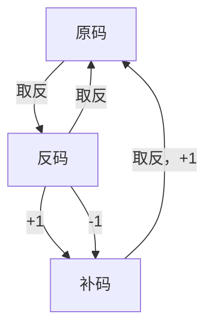

# 原码、反码、补码

在计算机科学的世界里，数据的表示和运算都离不开原码、反码和补码这三种编码方式。它们是计算机处理整数的基础，对于理解计算机的底层工作原理至关重要。本文将带你深入了解这三种编码方式的原理、转换方法以及它们在计算机运算中的应用。

## 原码：最直观的表示方法

### 原码的定义

原码是一种直接表示数值大小和符号的编码方式。在二进制数中，最高位作为符号位（0表示正数，1表示负数），其余位表示数值的大小。

原码是最直观的表示方法，它由两部分组成：

-   **符号位**：最高位表示数的正负，0代表正数，1代表负数。
-   **数值位**：剩余的位表示数值的大小。

### 原码的特点

**优点**：

-   直观：容易理解，直接表示数值和符号。
-   简单：实现简单，无需额外的处理。

**缺点**：

-   减法复杂：在进行减法运算时，需要将减数的符号位取反，然后再进行加法运算。
-   两种零表示：存在正零和负零两种表示，可能会导致混淆。

### 原码的示例

以32位为例：

```v
+5的原码表示为：00000000 00000000 00000000 00000101
-5的原码表示为：10000000 00000000 00000000 00000101
```

##  反码：原码的变形

### 反码的定义

反码用于简化计算机中的减法运算。对于正数，反码与原码相同；对于负数，反码是将原码的数值位取反。

反码是在原码的基础上对数值位进行取反操作（符号位不变）：对于正数，反码与原码相同。对于负数，反码是原码除符号位外其他位取反。

### 反码的特点

**优点**：

-   简化减法：负数的反码可以通过加法直接得到。

**缺点**：

-   两种零表示：与原码类似，存在正零和负零两种表示。
-   减法需要额外处理：在进行负数减法时，需要对结果进行取反。

### 反码的示例

以32位为例：

```v
+5的反码表示为：00000000 00000000 00000000 00000101 //与原码相同
-5的反码表示为：11111111 11111111 11111111 11111010 //按位取反
```

## 补码：运算的统一

### 补码的定义

补码是现代计算机中最常用的整数编码方式。补码是在反码的基础上再加1（符号位不变）：对于正数，补码与原码相同；对于负数，补码是反码的最低位加1。

### 补码的特点

**优点**：

-   统一加减法：加法和减法可以统一处理，无需区分正负数。
-   简化电路设计：逻辑电路可以简化，因为加法和减法运算规则相同。
-   唯一零表示：不存在正零和负零的混淆。

**缺点**：

-   实现稍复杂：需要额外的步骤来生成补码。

为什么计算机偏爱补码？

-   简化电路设计：补码的运算规则简化了计算机内部的逻辑电路，提高了运算效率。
-   避免减法：补码使得减法运算可以通过加法来实现，减少了硬件的复杂性。
-   消除歧义：补码中只有一个0的表示，避免了原码和反码中的+0和-0的歧义。

### 补码的示例

以32位为例：

```v
+5的补码表示为：00000000 00000000 00000000 00000101 //与原码相同
-5的补码表示为：11111111 11111111 11111111 11111011 //反码＋1
```

##  编码的转换

### 正数的转换

对于正数，原码、反码和补码是相同的。

### 负数的转换

-   原码转反码：符号位不变，数值位取反。
-   反码转补码：反码最低位加1。
-   补码转原码：先减1得到反码，再将数值位取反得到原码。


