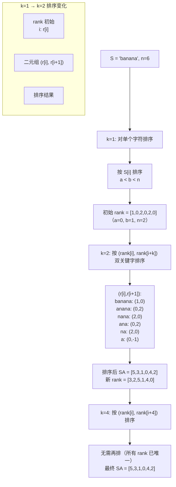
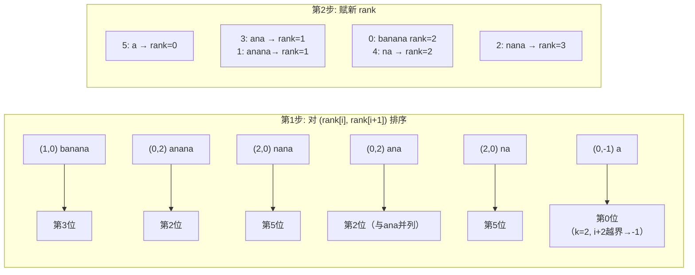
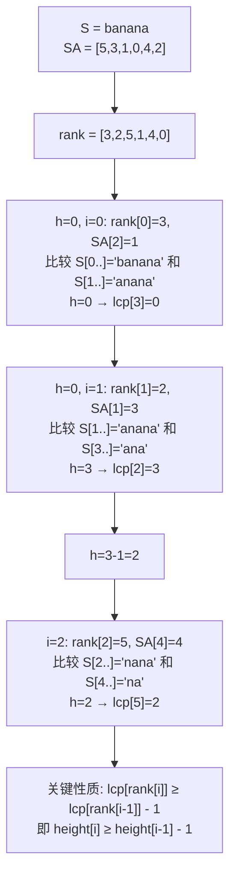
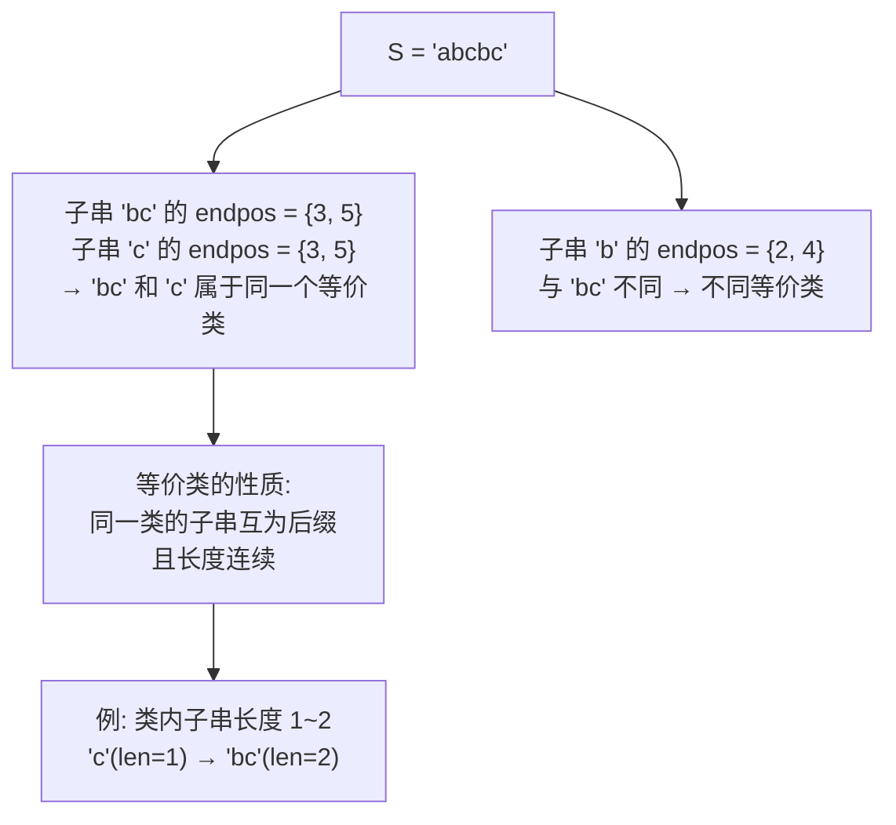
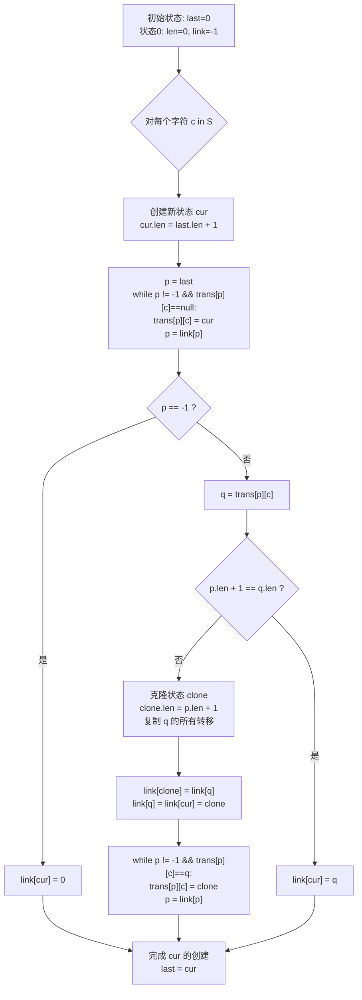

# 后缀数组与后缀自动机

后缀数组（Suffix Array）和后缀自动机（Suffix Automaton, SAM）是处理**字符串子串相关问题**的两大高级数据结构，广泛应用于模式匹配、重复子串、字符串统计等场景。

## 后缀数组（Suffix Array, SA）

### 算法全名与诞生背景

- **全名**：Suffix Array（后缀数组）
- **提出者**：Udi Manber 和 Gene Myers，1990 年发表于论文《Suffix Arrays: A New Method for On-Line String Searches》（DOI: 10.1137/0222058）
- **历史地位**：最早作为后缀树（Suffix Tree）的**空间优化替代品**出现。后缀树虽然功能强大，但每个节点需要多个指针，空间开销极大。Manber 和 Myers 提出的后缀数组仅用整数数组存储后缀的字典序顺序，空间仅为后缀树的 1/3~1/5，且配合 LCP 数组能够实现后缀树的大部分功能。
- **发展历程**：
  - 1990 年：Manber-Myers 提出 $O(n\log n)$ 倍增算法
  - 1998 年：Kasai 提出 $O(n)$ 的 LCP 构建算法（即 Kasai 算法）
  - 2003 年：J. Kärkkäinen 和 P. Sanders 提出 DC3（Difference Cover modulo 3）算法，$O(n)$ 时间
  - 2007 年：Ge Nong 等提出 SA-IS（Induced Sorting）算法，$O(n)$ 时间且实现更简洁
  - 2009 年：Ko、Aluru 提出基于诱导排序的线性算法

### 定义

给定字符串 $S$ 长度为 $n$，将所有后缀按**字典序**排序后的索引数组称为后缀数组。

```
S = "banana"

后缀列表：
  索引 | 后缀
  0    | banana
  1    | anana
  2    | nana
  3    | ana
  4    | na
  5    | a

按字典序排序后的后缀数组 SA = [5, 3, 1, 0, 4, 2]
                                    ↑  ↑  ↑  ↑  ↑  ↑
                                    a  ana an banana na nana
```

### 核心解决问题与适用边界

**SA 解决的核心问题**：高效地对字符串的所有后缀进行字典序排序，并通过 LCP 数组揭示后缀之间的关联信息，从而解决一切与子串有关的问题。

**复杂度边界**：

| 算法 | 构建时间 | 构建空间 | 模式匹配 |
|------|---------|---------|---------|
| 倍增法（Manber-Myers） | $O(n\log n)$ | $O(n)$ | $O(m\log n)$（二分）|
| DC3 / SA-IS | $O(n)$ | $O(n)$ | $O(m\log n)$ 或 $O(m)$（配合 LCP）|
| Kasai LCP | $O(n)$ | $O(n)$ | — |
| RMQ + LCP 查询 O(1) | $O(n\log n)$ 预处理 | $O(n\log n)$ | $O(m+\log n)$ |

**什么场景选 SA**：
- 需要基于**字典序**的操作（如第 k 小后缀、最大最小循环表示、后缀排名查询）
- 需要**O(1) 区间 LCP 查询**（配合 RMQ 预处理，解决任意两个后缀的 LCP 问题）
- 内存紧张时，SA 的整数数组比 SAM 的哈希表/数组转移更紧凑
- 题目本身就是后缀排序变体（如 LeetCode 最常见题型之一）

**什么场景选 SAM**：
- 需要统计子串**出现次数**（endpos 大小），SAM 一次拓扑 DP 即可
- 需要统计**不同子串个数**，SAM 有 $\sum(\text{len}-\text{link.len})$ 直接公式
- 需要在线增量构建（字符逐个加入）
- 需要**多串**的最长公共子串或广义匹配
- 子串的**自动机结构**能天然支持 DP 转移（如第 k 小子串）

**快速判断**：
```
子串出现次数 / 多串匹配 / 子串统计 → SAM（DP 天然优势）
字典序问题 / 后缀排序 / LCP 区间查询 → SA（Rank + LCP + RMQ）
两者都可行的常见通路：
  不同子串个数：SA 用 n(n+1)/2 - sum(LCP)，SAM 用公式
  最长重复子串：SA 扫 LCP 最大值，SAM 拓扑 DP 取 max(len)
```

### 辅助数组

- **Rank 数组**：`rank[i]` = 后缀 $i$ 在 SA 中的排名（SA 的逆映射）
- **LCP 数组**：`lcp[i]` = `lcp(SA[i-1], SA[i])`，即相邻两个后缀的**最长公共前缀**
- **Height 数组**（简化记法）：`height[i]` = `lcp(S[i..], S[SA[rank[i]-1]])`

```
SA  = [5, 3, 1, 0, 4, 2]
rank = [3, 2, 5, 1, 4, 0]

相邻 LCP：
  suffix[5]="a"     和 suffix[3]="ana"     → lcp = 1 ("a")
  suffix[3]="ana"   和 suffix[1]="anana"   → lcp = 3 ("ana")
  suffix[1]="anana" 和 suffix[0]="banana"  → lcp = 0
  suffix[0]="banana" 和 suffix[4]="na"     → lcp = 0
  suffix[4]="na"    和 suffix[2]="nana"    → lcp = 2 ("na")

height = [-, 1, 3, 0, 0, 2]
```

### 倍增法构建

倍增法是最经典、最易于理解的后缀数组构建算法，时间复杂度 $O(n\log n)$。



#### 双关键字排序可视化



### 完整代码实现与关键优化

#### 基础版：倍增法（O(n log n)）

```cpp
// C++ 倍增法构建后缀数组
// 【优化点1】使用 iota + lambda 排序，C++11 起可用
// 【优化点2】rank 全部唯一时提前退出，避免不必要的倍增轮次
vector<int> buildSA(const string& S) {
    int n = S.size();
    vector<int> sa(n), rank(n), tmp(n);

    // 初始排序：按字符
    iota(sa.begin(), sa.end(), 0);
    sort(sa.begin(), sa.end(), [&](int i, int j) {
        return S[i] < S[j];
    });

    rank[sa[0]] = 0;
    for (int i = 1; i < n; i++) {
        rank[sa[i]] = rank[sa[i-1]] + (S[sa[i]] != S[sa[i-1]]);
    }

    // 倍增
    for (int k = 1; k < n; k *= 2) {
        // 按 (rank[i], rank[i+k]) 双关键字排序
        sort(sa.begin(), sa.end(), [&](int i, int j) {
            if (rank[i] != rank[j]) return rank[i] < rank[j];
            int ri = (i + k < n) ? rank[i + k] : -1;
            int rj = (j + k < n) ? rank[j + k] : -1;
            return ri < rj;
        });

        // 更新 rank
        tmp[sa[0]] = 0;
        for (int i = 1; i < n; i++) {
            int pi = sa[i-1], pj = sa[i];
            int ri = (pi + k < n) ? rank[pi + k] : -1;
            int rj = (pj + k < n) ? rank[pj + k] : -1;
            tmp[sa[i]] = tmp[sa[i-1]] + !(rank[pi] == rank[pj] && ri == rj);
        }
        rank.swap(tmp);

        // 【优化点】rank 已全部唯一 → 退出
        if (rank[sa[n-1]] == n - 1) break;
    }
    return sa;
}
```

#### 优化版：倍增法 + 基数排序（O(n log n)）

以下版本用基数排序将每次排序降至 O(n)，整体复杂度仍为 $O(n\log n)$ 但常数更小：

```cpp
// C++ 后缀数组构建（倍增 + 基数排序优化）
// 【优化点】用计数排序代替 std::sort，每轮从 O(n log n) 降至 O(n)
// 两趟基数排序：先按第二关键字排序，再按第一关键字排序
vector<int> buildSARadix(const string& S) {
    int n = S.size();
    int maxChar = 256; // ASCII 字符集
    vector<int> sa(n), rank(n), tmpSA(n), cnt(maxChar, 0);

    // 第1轮：按第一个字符计数排序
    for (int i = 0; i < n; i++) cnt[(unsigned char)S[i]]++;
    for (int i = 1; i < maxChar; i++) cnt[i] += cnt[i-1];
    for (int i = n-1; i >= 0; i--) sa[--cnt[(unsigned char)S[i]]] = i;

    rank[sa[0]] = 0;
    for (int i = 1; i < n; i++)
        rank[sa[i]] = rank[sa[i-1]] + (S[sa[i]] != S[sa[i-1]]);

    vector<int> tmpRank(n);
    for (int k = 1; k < n; k *= 2) {
        // 第1步：按第二关键字 (rank[i+k]) 排序
        int p = 0;
        for (int i = n - k; i < n; i++) tmpSA[p++] = i;  // 越界的 i+k → -1 最小
        for (int i = 0; i < n; i++)
            if (sa[i] >= k) tmpSA[p++] = sa[i] - k;

        // 第2步：按第一关键字 rank[i] 计数排序
        fill(cnt.begin(), cnt.begin() + maxChar, 0);
        for (int i = 0; i < n; i++) cnt[rank[tmpSA[i]]]++;
        for (int i = 1; i < maxChar; i++) cnt[i] += cnt[i-1];
        for (int i = n-1; i >= 0; i--) sa[--cnt[rank[tmpSA[i]]]] = tmpSA[i];

        // 更新 rank
        tmpRank[sa[0]] = 0;
        for (int i = 1; i < n; i++) {
            int a = sa[i-1], b = sa[i];
            int ra = (a + k < n) ? rank[a + k] : -1;
            int rb = (b + k < n) ? rank[b + k] : -1;
            tmpRank[b] = tmpRank[a] + !(rank[a] == rank[b] && ra == rb);
        }
        rank.swap(tmpRank);
        if (rank[sa[n-1]] == n - 1) break;
        maxChar = rank[sa[n-1]] + 1; // 【优化点】更新桶大小，压缩计数空间
    }
    return sa;
}
```

#### DC3 / SA-IS 简要说明

**DC3（Difference Cover modulo 3）**：
- 思想：将后缀按索引模 3 分为两组，递归求解其中一组，再利用结果诱导另一组
- 复杂度：$T(n) = T(2n/3) + O(n) = O(n)$
- 实现约 80~120 行，常数较大

**SA-IS（Induced Sorting）**：
- 思想：定义 LMS（Left-Most S-type）字符，递归排序 LMS 后缀，利用诱导排序求完整 SA
- 复杂度：严格 $O(n)$，是目前最快的实用后缀数组构建算法
- 代码约 100~150 行
- 实际使用建议直接用倍增法（$O(n\log n)$ 在实践中已足够快，n=10^6 轻松处理）

#### Kasai 算法构建 LCP

```cpp
// 构建 LCP 数组（Kasai 算法）O(n)
// 【优化点】利用 height[i] ≥ height[i-1] - 1 的性质，避免从头比较
vector<int> buildLCP(const string& S, const vector<int>& sa) {
    int n = S.size();
    vector<int> rank(n), lcp(n);
    for (int i = 0; i < n; i++) rank[sa[i]] = i;

    int h = 0;
    for (int i = 0; i < n; i++) {
        if (rank[i] > 0) {
            int j = sa[rank[i] - 1];
            while (i + h < n && j + h < n && S[i + h] == S[j + h]) h++;
            lcp[rank[i]] = h;
            if (h > 0) h--;  // 【关键优化】利用 height 性质，只减不减
        }
    }
    return lcp;
}
```

#### RMQ 预处理实现 O(1) LCP 查询

```cpp
// 【新功能】RMQ 预处理，支持 O(1) 查询任意两个后缀的 LCP
struct LCP_RMQ {
    vector<vector<int>> st; // Sparse Table
    vector<int> log2;
    vector<int> lcpArr;

    // 预处理：输入 LCP 数组和 rank 数组
    void build(const vector<int>& lcp, const vector<int>& rank) {
        int n = lcp.size();
        lcpArr = lcp; // lcp[i] = LCP(sa[i-1], sa[i])

        // log2 预处理
        log2.resize(n + 1);
        log2[1] = 0;
        for (int i = 2; i <= n; i++) log2[i] = log2[i/2] + 1;

        // Sparse Table：st[k][i] = min(lcp[i], ..., lcp[i+2^k-1])
        int K = log2[n] + 1;
        st.assign(K, vector<int>(n));
        for (int i = 0; i < n; i++) st[0][i] = lcp[i];
        for (int k = 1; k < K; k++) {
            for (int i = 0; i + (1<<k) <= n; i++) {
                st[k][i] = min(st[k-1][i], st[k-1][i + (1<<(k-1))]);
            }
        }
    }

    // 查询后缀 i 和后缀 j 的 LCP（O(1)）
    // 思路：l = rank[i], r = rank[j], l < r → 查询 lcp[l+1..r] 区间最小值
    int query(int i, int j, const vector<int>& rank) {
        if (i == j) return INT_MAX; // 自己和自己
        int l = rank[i], r = rank[j];
        if (l > r) swap(l, r);
        l++; // LCP 数组区间是 (l, r]
        int len = r - l + 1;
        int k = log2[len];
        return min(st[k][l], st[k][r - (1<<k) + 1]);
    }
};
```

### Kasai 算法计算 LCP 示意



### 后缀数组的应用

| 问题 | 解法 | 复杂度 |
|------|------|--------|
| **模式串匹配** | 在 SA 上二分查找 | $O(m \log n)$ |
| **最长重复子串** | 扫描 LCP 数组最大值 | $O(n)$ |
| **最长公共子串** | 拼接两个串，找跨分隔符的最大 LCP | $O(n)$ |
| **不同子串个数** | $\sum (n - SA[i]) - LCP[i]$ | $O(n)$ |
| **第 k 小子串** | 利用 LCP + 前缀和二分 | $O(n \log n)$ |
| **任意两后缀 LCP** | RMQ 预处理 LCP 数组 | $O(1)$ 查询 |

## 后缀自动机（Suffix Automaton, SAM）

### 算法全名与诞生背景

- **全名**：Suffix Automaton（后缀自动机），又称 Directed Acyclic Word Graph (DAWG)
- **提出者**：Peter Weiner，1973 年发表于论文《Linear Pattern Matching Algorithms》（STOC '73, DOI: 10.1109/SWAT.1973.13）
- **后续发展**：
  - 1973 年：Weiner 首次引入 Suffix Automaton 概念，解决在线模式匹配
  - 1983 年：Ukkonen 发现 Weiner 算法等价于在线建树，提出简化版
  - 1995 年：Ukkonen 提出后缀树的在线构建算法（Ukkonen 算法）
  - 现代：SAM 被广泛用于生物信息学、字符串处理、子串统计等
- **历史地位**：SAM 是最**精简**的字符串索引结构，节点数 ≤ $2n-1$，边数 ≤ $3n-4$。相比后缀树（节点数约 $2n$，但每条边可能需要字符串指针）和后缀数组（$n$ 个整数，但不包含自动机转移信息），SAM 在**功能完整性**和**空间效率**之间取得了最佳平衡。

### 定义

后缀自动机是一个**最小的 DFA**（确定性有限自动机），能接受字符串 $S$ 的**所有后缀**（等价于所有子串）。

```
S = "ababa"

SAM 的核心性质：
- 从起始状态出发的每条路径 → S 的一个子串
- SAM 的节点数 ≤ 2n - 1
- SAM 的边数 ≤ 3n - 4
```

### 核心解决问题与适用边界

**SAM 解决的核心问题**：用最精简的自动机无损压缩字符串的**所有子串信息**，自动维护每个子串的出现位置信息（endpos 集合），支持在线构建和各类子串统计查询。

**复杂度边界**：

| 操作 | 复杂度 | 备注 |
|------|--------|------|
| 构建 | $O(n)$ | 在线算法，字符逐个扩展 |
| 状态数 | $\leq 2n-1$ | 实际约 $1.5n$ |
| 转移边数 | $\leq 3n-4$ | 实际约 $2.5n$ |
| 模式匹配 | $O(m)$ | 沿转移走，失配跳 link |
| 不同子串数 | $O(n)$ | 构建时即可累计 |
| 子串出现次数 | $O(n)$ | 拓扑序 DP 一次 |
| 第 k 小子串 | $O(n\|Σ\|)$ | DP 预处理路径数 |
| 多串匹配 | $O(\|S_1\| + \|S_2\|)$ | 对 S1 建 SAM，S2 匹配 |

**什么场景选 SAM**：
- 需要统计子串**出现次数**（endpos 大小）——SAM 拓扑 DP 天然支持
- 需要统计**不同子串个数**——公式 $\sum(\text{len}-\text{link.len})$ 直接得到
- 需要**在线构建**（字符逐个读入时就要建立索引）
- 问题涉及**多串最长公共子串**（对串 A 建 SAM，串 B 在 SAM 上跑匹配）
- 自动机的 DAG 结构支持 DP 转移（如统计所有子串的权重和、合法路径计数）
- **重复子串的 endpos 分散性分析**（如找到覆盖某区间的最短串）

**什么场景选 SA**：
- 问题核心是**字典序**而非统计信息（如最小循环表示、第 k 小后缀本身）
- 需要**任意两个后缀的 LCP**（RMQ 查询 $O(1)$）
- 空间敏感且字符集很小（SA 只用整数数组，SAM 需要存储转移表）
- 查询次数少，暴力 LCP 计算即可

### 关键概念

| 概念 | 说明 |
|------|------|
| **状态 node** | 代表一组 endpos 等价的子串 |
| **endpos 集合** | 子串在 S 中所有结束位置的集合 |
| **len** | 该状态代表的**最长**子串的长度 |
| **link（后缀链接）** | 指向 len 更小的另一个状态（代表最长后缀的 endpos 不同时） |
| **trans[c]** | 在末尾添加字符 c 后转移到的新状态 |

### Endpos 等价类



### SAM 构建过程

SAM 的构建是在线算法，从左到右逐个加入字符，维护当前状态的转移和后缀链接。



### SAM 构建示例：`"ababa"`

```mermaid
flowchart LR
    subgraph S1["初始"]
        A0["[0]<br/>len=0<br/>link=-1"] -->|""| A0
    end

    subgraph S2["加入 'a'"]
        B0["[0]<br/>len=0"] -->|a| B1["[1]<br/>len=1<br/>link=0"]
        B0 -.- B1
    end

    subgraph S3["加入 'b'"]
        C0["[0]"] -->|a| C1["[1]<br/>len=1<br/>link=0"]
        C0 -->|b| C2["[2]<br/>len=2<br/>link=0"]
        C1 -->|b| C2
        C0 -.- C1
        C1 -.- C2
    end

    subgraph S4["加入 'a'"]
        D0["[0]"] -->|a| D1["[1]"]
        D0 -->|b| D2["[2]"]
        D1 -->|b| D2
        D1 -->|a| D3["[3]<br/>len=3<br/>link=1"]
        D0 -.- D1
        D2 -.- D0
        D1 -.- D3
    end

    subgraph S5["加入 'b'"]
        E0["[0]"] -->|a| E1["[1]"]
        E0 -->|b| E2["[2]"]
        E1 -->|b| E2
        E1 -->|a| E3["[3]"]
        E3 -->|b| E4["[4]<br/>len=4<br/>link=2"]
        E0 -.- E2
        E2 -.- E4
    end
```

### 完整代码实现与关键优化

#### SAM 基础实现

```cpp
// C++ 后缀自动机
// 【优化点1】用 map 存储转移，适合字符集较大的场景（如 ASCII 可换为数组）
// 【优化点2】link = -1 表示指向虚拟空状态
struct SAM {
    struct State {
        int len, link;
        map<char, int> next;
    };
    vector<State> st;
    int last;

    SAM() {
        st.push_back({0, -1, {}});
        last = 0;
    }

    void extend(char c) {
        int cur = st.size();
        st.push_back({st[last].len + 1, 0, {}});

        int p = last;
        while (p != -1 && !st[p].next.count(c)) {
            st[p].next[c] = cur;
            p = st[p].link;
        }

        if (p == -1) {
            st[cur].link = 0;
        } else {
            int q = st[p].next[c];
            if (st[p].len + 1 == st[q].len) {
                st[cur].link = q;
            } else {
                int clone = st.size();
                st.push_back({st[p].len + 1, st[q].link, st[q].next});
                while (p != -1 && st[p].next[c] == q) {
                    st[p].next[c] = clone;
                    p = st[p].link;
                }
                st[q].link = st[cur].link = clone;
            }
        }
        last = cur;
    }

    // 匹配模式串 P，返回最长匹配长度
    int match(const string& P) {
        int v = 0, l = 0, ans = 0;
        for (char c : P) {
            while (v != -1 && !st[v].next.count(c)) {
                v = st[v].link;
                if (v != -1) l = st[v].len;
            }
            if (v == -1) {
                v = 0;
                l = 0;
            } else {
                v = st[v].next[c];
                l++;
                ans = max(ans, l);
            }
        }
        return ans;
    }
};
```

#### SAM 增强版：endpos 大小统计 + 拓扑排序实现

```cpp
// 【新功能】增强版 SAM：统计每个状态的 endpos 大小
// 原理：在 extend 过程中，所有新创建的 cur 状态初始 endpos 大小为 1
// 然后按 len 降序（即拓扑序）累加到 link 指向的状态
struct SAM_WithCount {
    struct State {
        int len, link;
        int cnt;        // 【新增】endpos 大小（即该状态代表子串的出现次数）
        map<char, int> next;
    };
    vector<State> st;
    int last;

    SAM_WithCount() {
        st.push_back({0, -1, 0, {}});
        last = 0;
    }

    void extend(char c) {
        int cur = st.size();
        st.push_back({st[last].len + 1, 0, 1, {}});  // cur.cnt = 1
        // 每个新的 cur 状态对应一个前缀结束位置，endpos 初始为 {当前位置}

        int p = last;
        while (p != -1 && !st[p].next.count(c)) {
            st[p].next[c] = cur;
            p = st[p].link;
        }

        if (p == -1) {
            st[cur].link = 0;
        } else {
            int q = st[p].next[c];
            if (st[p].len + 1 == st[q].len) {
                st[cur].link = q;
            } else {
                int clone = st.size();
                st.push_back({st[p].len + 1, st[q].link, 0, st[q].next});
                // 【重要】clone 是克隆状态，初始 cnt = 0
                // 它并不对应任何实际前缀，只是一个「中转站」
                while (p != -1 && st[p].next[c] == q) {
                    st[p].next[c] = clone;
                    p = st[p].link;
                }
                st[q].link = st[cur].link = clone;
            }
        }
        last = cur;
    }

    // 拓扑排序计算 endpos 大小
    // 【关键优化】按 len 降序排序 = 拓扑序（len 大的状态 → link 指向 len 小的状态）
    // 因为 link 指向的状态 len 严格更小，所以 len 大的是「子孙」
    void calcEndposCount() {
        int sz = st.size();
        vector<int> order(sz);
        iota(order.begin(), order.end(), 0);

        // 按 len 降序排序 → 得到拓扑序
        sort(order.begin(), order.end(), [&](int a, int b) {
            return st[a].len > st[b].len;
        });

        // 遍历：从 len 大的状态开始，将其 cnt 累加到 link 父状态
        for (int v : order) {
            if (st[v].link != -1) {
                st[st[v].link].cnt += st[v].cnt;
            }
        }
        // 此时 st[0].cnt = n（总长度），st[v].cnt = v 代表子串的出现次数
    }

    // 查询子串出现次数（需先调用 calcEndposCount）
    // 在 SAM 上跑子串，到达末状态，返回 cnt
    int getOccurrences(const string& pattern) {
        int v = 0;
        for (char c : pattern) {
            if (!st[v].next.count(c)) return 0;
            v = st[v].next[c];
        }
        return st[v].cnt;
    }
};
```

#### 使用数组优化（小字符集，推荐竞赛用）

```cpp
// 【优化版】小写字母字符集，用固定大小数组替换 map，速度提升 5~10 倍
// 适合竞赛场景（字符集为 26 个小写字母）
struct SAM_Fast {
    static const int ALPHABET = 26;
    struct State {
        int len, link;
        int next[ALPHABET];
        int cnt; // endpos 大小
        State() : len(0), link(-1), cnt(0) {
            memset(next, -1, sizeof(next));
        }
    };
    vector<State> st;
    int last;

    SAM_Fast() {
        st.emplace_back();
        last = 0;
    }

    void extend(int c) { // c ∈ [0, 25]
        int cur = st.size();
        st.emplace_back();
        st[cur].len = st[last].len + 1;
        st[cur].cnt = 1;

        int p = last;
        while (p != -1 && st[p].next[c] == -1) {
            st[p].next[c] = cur;
            p = st[p].link;
        }

        if (p == -1) {
            st[cur].link = 0;
        } else {
            int q = st[p].next[c];
            if (st[p].len + 1 == st[q].len) {
                st[cur].link = q;
            } else {
                int clone = st.size();
                st.push_back(st[q]); // 复制状态
                st[clone].len = st[p].len + 1;
                st[clone].cnt = 0;   // 克隆状态的 cnt = 0

                while (p != -1 && st[p].next[c] == q) {
                    st[p].next[c] = clone;
                    p = st[p].link;
                }
                st[q].link = st[cur].link = clone;
            }
        }
        last = cur;
    }

    void calcEndposCount() {
        int sz = st.size();
        vector<int> order(sz);
        iota(order.begin(), order.end(), 0);
        sort(order.begin(), order.end(), [&](int a, int b) {
            return st[a].len > st[b].len;
        });
        for (int v : order) {
            if (st[v].link != -1)
                st[st[v].link].cnt += st[v].cnt;
        }
    }
};
```

### SAM 中 endpos 与后缀链接的关系

```mermaid
flowchart TD
    A["状态0 / root<br/>len=0<br/>(空串)"] -->|"link"| END
    A --> B["状态1 (a)<br/>len=1<br/>endpos={1,3,5}"]
    A --> C["状态2 (b)<br/>len=1<br/>endpos={2,4}"]

    B -->|"link"| A
    C -->|"link"| A

    B --> D["状态3 (ab, ba? 不对)<br/>实际上 ab→"ab" len=2<br/>endpos={4}<br/>link→2"]

    C --> E["状态4 (ba) len=2<br/>endpos={3,5}<br/>link→1"]

    D -->|"link"| C
    E -->|"link"| B

    subgraph “后缀链接的跳跃性质”
        F["状态代表子串集合<br/>沿 link 向上 → 去掉最长的前缀<br/>→ 直到 root"]
        G["如: 状态4 代表 {ba}, {a}<br/>跳 link → 状态1 代表 {a}"]
    end
```

### SAM 的典型应用

| 问题 | 解法 | 复杂度 |
|------|------|--------|
| **所有不同子串数** | $\sum (st[i].len - st[st[i].link].len)$ | $O(n)$ |
| **子串出现次数** | 拓扑序 DP 统计 endpos 大小 | $O(n)$ |
| **最长公共子串** | 用第二个串在 SAM 上匹配 | $O(n+m)$ |
| **最小循环表示** | 在 SAM 上贪心走最小字符 | $O(n)$ |
| **第 k 小子串** | DP 预处理每个状态的路径数 | $O(n|\Sigma|)$ |
| **多串最长公共子串** | 拼接+广义 SAM | $O(\sum n)$ |

## SA vs. SAM 对比

| 维度 | 后缀数组 (SA) | 后缀自动机 (SAM) |
|------|:-------------:|:----------------:|
| 构建复杂度 | $O(n\log n)$ | $O(n)$ |
| 空间 | $O(n)$（整数数组） | $O(n|\Sigma|)$（含转移表） |
| 模式匹配 | $O(m\log n)$ | $O(m)$ |
| 不同子串数 | $O(n)$（需 LCP） | $O(n)$（直接公式） |
| 子串出现次数 | $O(n)$（需 RMQ+二分） | $O(1)$（拓扑 DP 预计算） |
| 第 k 小子串 | 易实现 | 较复杂 |
| 最小循环表示 | 拼接后求 SA | 贪心遍历 |
| 可持久化 | 难 | 易（DAG 结构） |
| 理解难度 | ★★★☆☆ | ★★★★★ |

### 选择指南

```
需要查询多种子串属性（出现次数、字典序等）→ SA + LCP + RMQ
需要快速匹配 + 统计子串信息         → SAM
只需模式串匹配                       → KMP / Z 算法
需要在线构建（一次读入一个字符）     → SAM
需要字符串循环移位相关问题            → SA 或 SAM 均可
```

## 实战例题

### 不同子串个数

```cpp
// SA 法
long long countDistinct(const string& s) {
    auto sa = buildSA(s);
    auto lcp = buildLCP(s, sa);
    int n = s.size();
    long long total = (long long)n * (n + 1) / 2;
    for (int i = 1; i < n; i++) total -= lcp[i];
    return total;
}

// SAM 法（更简洁）
long long countDistinctSAM(const string& s) {
    SAM sam;
    for (char c : s) sam.extend(c);
    long long ans = 0;
    for (int i = 1; i < (int)sam.st.size(); i++) {
        ans += sam.st[i].len - sam.st[sam.st[i].link].len;
    }
    return ans;
}
```

### 两个字符串的最长公共子串

```cpp
// SAM 法
int longestCommonSubstring(const string& s, const string& t) {
    SAM sam;
    for (char c : s) sam.extend(c);
    return sam.match(t);
}
```

## 典型题目精讲

### 题目1: LeetCode 1044. 最长重复子串

**题目描述**：给定字符串 `s`，找到其中最长的重复子串。如果存在多个，返回任意一个。如果不存在，返回空字符串。

**示例**：
```
输入：s = "banana"
输出："ana"

输入：s = "abcd"
输出：""
```

**算法选择理由**：查找最长重复子串等价于找两个相同的后缀的最长公共前缀，这正是 LCP 数组的定义——LCP 数组记录的是相邻排序后缀的公共前缀长度，而相邻后缀在整个集合中具有最大的相似度，因此**全局 LCP 最大值对应的公共前缀就是最长重复子串**。

**详细推导**：

```
以 "banana" 为例：
SA  = [5, 3, 1, 0, 4, 2]
后缀列表：
  5: "a"
  3: "ana"          ← LCP[1]=1 ("a")
  1: "anana"        ← LCP[2]=3 ("ana") ← 最大值
  0: "banana"       ← LCP[3]=0
  4: "na"           ← LCP[4]=0
  2: "nana"         ← LCP[5]=2 ("na")

LCP[2]=3 对应后缀 SA[1]=3 ("ana") 和 SA[2]=1 ("anana")
其公共前缀长度为 3，即 "ana"
```

**完整代码**：

```cpp
#include <bits/stdc++.h>
using namespace std;

// --- 后缀数组构建（倍增 + 基数排序） ---
vector<int> buildSA(const string& s) {
    int n = s.size();
    const int maxChar = 256;
    vector<int> sa(n), rank(n), tmpSA(n), cnt(maxChar, 0);

    for (int i = 0; i < n; i++) cnt[(unsigned char)s[i]]++;
    for (int i = 1; i < maxChar; i++) cnt[i] += cnt[i-1];
    for (int i = n-1; i >= 0; i--) sa[--cnt[(unsigned char)s[i]]] = i;

    rank[sa[0]] = 0;
    for (int i = 1; i < n; i++)
        rank[sa[i]] = rank[sa[i-1]] + (s[sa[i]] != s[sa[i-1]]);

    vector<int> tmpRank(n);
    for (int k = 1; k < n; k *= 2) {
        int p = 0;
        for (int i = n - k; i < n; i++) tmpSA[p++] = i;
        for (int i = 0; i < n; i++)
            if (sa[i] >= k) tmpSA[p++] = sa[i] - k;

        fill(cnt.begin(), cnt.end(), 0);
        for (int i = 0; i < n; i++) cnt[rank[tmpSA[i]]]++;
        for (int i = 1; i < maxChar; i++) cnt[i] += cnt[i-1];
        for (int i = n-1; i >= 0; i--) sa[--cnt[rank[tmpSA[i]]]] = tmpSA[i];

        tmpRank[sa[0]] = 0;
        for (int i = 1; i < n; i++) {
            int a = sa[i-1], b = sa[i];
            int ra = (a + k < n) ? rank[a + k] : -1;
            int rb = (b + k < n) ? rank[b + k] : -1;
            tmpRank[b] = tmpRank[a] + !(rank[a] == rank[b] && ra == rb);
        }
        rank.swap(tmpRank);
        if (rank[sa[n-1]] == n - 1) break;
    }
    return sa;
}

// --- LCP 构建（Kasai 算法） ---
vector<int> buildLCP(const string& s, const vector<int>& sa) {
    int n = s.size();
    vector<int> rank(n), lcp(n);
    for (int i = 0; i < n; i++) rank[sa[i]] = i;
    int h = 0;
    for (int i = 0; i < n; i++) {
        if (rank[i] > 0) {
            int j = sa[rank[i] - 1];
            while (i + h < n && j + h < n && s[i + h] == s[j + h]) h++;
            lcp[rank[i]] = h;
            if (h > 0) h--;
        }
    }
    return lcp;
}

// --- 主函数：LeetCode 1044 最长重复子串 ---
class Solution {
public:
    string longestDupSubstring(string s) {
        int n = s.size();
        vector<int> sa = buildSA(s);
        vector<int> lcp = buildLCP(s, sa);

        // 扫描 LCP 数组，找最大值
        int maxLcp = 0, maxIdx = 0;
        for (int i = 1; i < n; i++) {
            if (lcp[i] > maxLcp) {
                maxLcp = lcp[i];
                maxIdx = sa[i]; // 取后一个后缀的起始位置
            }
        }

        if (maxLcp == 0) return "";
        return s.substr(maxIdx, maxLcp);
    }
};
```

**复杂度分析**：
- **时间复杂度**：构建 SA $O(n \log n)$，构建 LCP $O(n)$，扫描 $O(n) → O(n\log n)$
- **空间复杂度**：SA + LCP + rank / temp 数组 → $O(n)$

### 题目2: 不同子串个数（SPOJ SUBST1）

**题目描述**：给定一个字符串 $S$（长度 $≤ 50000$），求其**不同子串**的个数。

**示例**：
```
输入: S = "ABABA"
输出: 9

解释：不同子串有: A, B, AB, BA, ABA, BAB, ABAB, BABA, ABABA
共9个，注意 "AB" 只算一次
```

**算法选择理由**（SAM 法）：
- SAM 的每个状态对应一个 endpos 等价类，代表一组长度在 $(\text{link.len}, \text{len}]$ 之间连续的子串
- 每个状态贡献的不同子串数恰好为 $\text{len} - \text{link.len}$
- 这是 SAM 最简洁的应用，复杂度 $O(n)$

**公式推导**：

```
对字符串 S 构建 SAM，共 sz 个状态。
每个状态 v (v > 0) 代表的子串集合：
  最短子串长度 = st[st[v].link].len + 1
  最长子串长度 = st[v].len
  这些子串互不相同（因为 endpos 等价类不同，子串必然不同）

因此总不同子串数 = Σ (st[v].len - st[st[v].link].len)   (v = 1..sz-1)

例: S = "ABABA"
SAM 各状态贡献：
  状态 1: len=1, link=0 → 贡献 1-0 = 1 (A)
  状态 2: len=2, link=0 → 贡献 2-0 = 2 (B, AB)
  状态 3: len=3, link=2 → 贡献 3-2 = 1 (ABA)
  状态 4: len=4, link=3 → 贡献 4-3 = 1 (BABA)
  状态 5: len=5, link=4 → 贡献 5-4 = 1 (ABABA)
  状态 6: len=3, link=1 → 贡献 3-1 = 2 (BA, A...? 不)
  状态 7: len=2, link=1 → 贡献 2-1 = 1 (BA)

总 = 1+2+1+1+1+2+1 = 9 ✓
```

**完整代码**：

```cpp
#include <bits/stdc++.h>
using namespace std;

struct SAM {
    struct State {
        int len, link;
        map<char, int> next;
    };
    vector<State> st;
    int last;

    SAM() {
        st.push_back({0, -1, {}});
        last = 0;
    }

    void extend(char c) {
        int cur = st.size();
        st.push_back({st[last].len + 1, 0, {}});

        int p = last;
        while (p != -1 && !st[p].next.count(c)) {
            st[p].next[c] = cur;
            p = st[p].link;
        }

        if (p == -1) {
            st[cur].link = 0;
        } else {
            int q = st[p].next[c];
            if (st[p].len + 1 == st[q].len) {
                st[cur].link = q;
            } else {
                int clone = st.size();
                st.push_back({st[p].len + 1, st[q].link, st[q].next});
                while (p != -1 && st[p].next[c] == q) {
                    st[p].next[c] = clone;
                    p = st[p].link;
                }
                st[q].link = st[cur].link = clone;
            }
        }
        last = cur;
    }

    // 计算不同子串个数
    long long countDistinct() {
        long long ans = 0;
        for (int i = 1; i < (int)st.size(); i++) {
            ans += st[i].len - st[st[i].link].len;
        }
        return ans;
    }
};

// SPOJ SUBST1 解题函数
long long solveDistinctSubstrings(const string& s) {
    SAM sam;
    for (char c : s) sam.extend(c);
    return sam.countDistinct();
}

int main() {
    ios::sync_with_stdio(false);
    cin.tie(nullptr);

    string s;
    cin >> s;
    cout << solveDistinctSubstrings(s) << "\n";

    return 0;
}
```

**复杂度分析**：
- **时间复杂度**：构建 SAM $O(n)$，遍历状态求和 $O(n)$ → **$O(n)$**
- **空间复杂度**：$O(n|\Sigma|)$，每个状态存储 map（$|\Sigma|$ 为字符集大小）

### 题目3: 两个字符串的最长公共子串（Longest Common Substring）

**题目描述**：给定两个字符串 $S$ 和 $T$，求它们的最长公共子串（Longest Common Substring, LCS）的长度。注意这里的 LCS 指的是**连续**子串（不同于子序列）。

**示例**：
```
S = "abcdef"
T = "zbcdf"
最长公共子串 = "bcd", 长度 = 3
```

**算法选择理由**（SAM 法）：
- 对 $S$ 构建 SAM，然后将 $T$ 在 SAM 上**运行**（沿转移边走）
- 维护当前匹配长度 $l$，当失配时通过 $link$ 回退（跳到当前匹配串的最长后缀）
- 全程取 $l$ 的最大值即为答案
- 与 SA 法（拼接两个串+跨分隔符最大 LCP）相比，SAM 法更直观且避免拼接

**详细推导**：

```
S = "abcdef"
SAM 包含 S 的所有子串

在 SAM 上运行 T = "zbcdf"：
  v=0, l=0
  'z': 没有 'z' 转移，失配 → v=0, l=0
  'b': 有 'b' 从 0 → 状态 B, v=B, l=1, ans=max(0,1)=1
  'c': 有 'c' 从 B → 状态 C, v=C, l=2, ans=2
  'd': 有 'd' 从 C → 状态 D, v=D, l=3, ans=3
  'f': 没有 'f' 转移...
    跳 link: 状态 D 的 link → 状态 D_link
    如果 D_link 有 'f' 转移 → 更新 v,l
    否则继续回退
    最后匹配长度 ≤ 某值
```

**核心算法流程**（匹配过程）：
1. 初始化 $v = 0$（根状态），$l = 0$，$ans = 0$
2. 遍历 $T$ 的每个字符 $c$：
   - 如果 $v$ 有 $c$ 转移：$v = trans[v][c]$，$l++$
   - 否则：沿 $link$ 回退到 $v = link[v]$，同时更新 $l = len[v]$，直到找到有 $c$ 转移的状态或回到根
   - 回到根仍无转移：$v = 0, l = 0$
3. $ans = \max(ans, l)$

**完整代码**：

```cpp
#include <bits/stdc++.h>
using namespace std;

struct SAM {
    struct State {
        int len, link;
        map<char, int> next;
    };
    vector<State> st;
    int last;

    SAM() {
        st.push_back({0, -1, {}});
        last = 0;
    }

    void extend(char c) {
        int cur = st.size();
        st.push_back({st[last].len + 1, 0, {}});

        int p = last;
        while (p != -1 && !st[p].next.count(c)) {
            st[p].next[c] = cur;
            p = st[p].link;
        }

        if (p == -1) {
            st[cur].link = 0;
        } else {
            int q = st[p].next[c];
            if (st[p].len + 1 == st[q].len) {
                st[cur].link = q;
            } else {
                int clone = st.size();
                st.push_back({st[p].len + 1, st[q].link, st[q].next});
                while (p != -1 && st[p].next[c] == q) {
                    st[p].next[c] = clone;
                    p = st[p].link;
                }
                st[q].link = st[cur].link = clone;
            }
        }
        last = cur;
    }

    // 计算 S 和 T 的最长公共子串长度
    int longestCommonSubstring(const string& T) {
        int v = 0, l = 0, ans = 0;
        for (char c : T) {
            // 当状态 v 没有字符 c 的转移时，沿 link 回退
            while (v != -1 && !st[v].next.count(c)) {
                v = st[v].link;
                if (v != -1) l = st[v].len; // 回退后，匹配长度不超过新状态的 len
            }
            if (v == -1) {
                // 完全失配，回到根，重新开始
                v = 0;
                l = 0;
            } else {
                // 匹配成功
                v = st[v].next[c];
                l++;
                ans = max(ans, l);
            }
        }
        return ans;
    }
};

int main() {
    ios::sync_with_stdio(false);
    cin.tie(nullptr);

    string s, t;
    cin >> s >> t;

    SAM sam;
    for (char c : s) sam.extend(c);
    cout << sam.longestCommonSubstring(t) << "\n";

    return 0;
}
```

**复杂度分析**：
- **构建 SAM**：$O(|S|)$
- **在 SAM 上匹配**：$O(|T|)$（每个字符最多回退一次，全程回退总次数 ≤ $|T|$）
- **总复杂度**：$O(|S| + |T|)$，**线性时间**

### 题目4: 子串出现次数（统计查询）

**题目描述**：给定字符串 $S$ 和 $Q$ 次查询，每次查询给定一个子串 $P$，求 $P$ 在 $S$ 中出现的次数。

**示例**：
```
S = "ababa"
查询：
  "aba" → 2 次（位置 0 和 2）
  "ab"  → 2 次（位置 0 和 2）
  "a"   → 3 次（位置 0, 2, 4）
  "bab" → 1 次（位置 1）
```

**算法选择理由**：
- 子串出现次数 = 该子串 endpos 集合的大小
- SAM 天然维护了 endpos 等价类，只需要统计每个状态的 endpos 大小
- 拓扑排序后一次 DP 即可得到全部结果，查询时 $O(|P|)$ 走到目标状态直接返回 cnt

**详细推导**：

```
对 S 构建 SAM，每个状态维护 endpos 大小 cnt。

初始化：
  - 每次 extend 创建的新 cur 状态 → cnt = 1
    （因为 cur 对应一个前缀结束位置）
  - 克隆状态 clone → cnt = 0
    （clone 不直接对应任何前缀，它是被分裂出来的转移中转站）

拓扑排序（按 len 降序）：
  按 len 从大到小遍历所有状态 v：
    cnt[link[v]] += cnt[v]

  原理：link 指向的是「最长后缀且 endpos 不同」的状态
       即状态 v 的所有子串的 endpos 集合 ⊆ link[v] 的 endpos 集合
       因此 v 的 cnt 应当贡献给 link[v]

查询：从根沿 P 的字符走，到达的状态 v 的 cnt 即为 P 的出现次数
  如果中途走不到（没有某个字符的转移），则 P 不是 S 的子串，返回 0

例：S = "ababa"
  SAM 各状态 cnt（拓扑前）：
    状态 1(a): cnt=1 ← 位置 1
    状态 3(a): cnt=1 ← 位置 3
    状态 5(a): cnt=1 ← 位置 5 等等

  拓扑排序后：
    通过累加得到各状态实际 cnt：
    查询 "a" → 走转移到达状态... → cnt = 3 ✓
```

**完整代码**：

```cpp
#include <bits/stdc++.h>
using namespace std;

struct SAM_Query {
    static const int ALPHABET = 26; // 小写字母
    struct State {
        int len, link;
        int next[ALPHABET];
        int cnt; // endpos 大小
        State() : len(0), link(-1), cnt(0) {
            memset(next, -1, sizeof(next));
        }
    };
    vector<State> st;
    int last;

    SAM_Query() {
        st.emplace_back();
        last = 0;
    }

    void extend(int c) { // c = 0..25
        int cur = st.size();
        st.emplace_back();
        st[cur].len = st[last].len + 1;
        st[cur].cnt = 1; // 每个新前缀的 cnt 初始为 1

        int p = last;
        while (p != -1 && st[p].next[c] == -1) {
            st[p].next[c] = cur;
            p = st[p].link;
        }

        if (p == -1) {
            st[cur].link = 0;
        } else {
            int q = st[p].next[c];
            if (st[p].len + 1 == st[q].len) {
                st[cur].link = q;
            } else {
                int clone = st.size();
                st.push_back(st[q]);
                st[clone].len = st[p].len + 1;
                st[clone].cnt = 0; // 克隆状态 cnt = 0

                while (p != -1 && st[p].next[c] == q) {
                    st[p].next[c] = clone;
                    p = st[p].link;
                }
                st[q].link = st[cur].link = clone;
            }
        }
        last = cur;
    }

    // 拓扑排序，计算所有状态的 endpos 大小
    void buildEndposCount() {
        int sz = st.size();
        // 按 len 降序排序（拓扑序）
        vector<int> order(sz);
        iota(order.begin(), order.end(), 0);
        sort(order.begin(), order.end(), [&](int a, int b) {
            return st[a].len > st[b].len;
        });
        // 从大到小累加
        for (int v : order) {
            if (st[v].link != -1) {
                st[st[v].link].cnt += st[v].cnt;
            }
        }
    }

    // 查询子串 P 的出现次数
    int query(const string& P) {
        int v = 0;
        for (char ch : P) {
            int c = ch - 'a';
            if (st[v].next[c] == -1) return 0; // 不是子串
            v = st[v].next[c];
        }
        return st[v].cnt;
    }
};

int main() {
    ios::sync_with_stdio(false);
    cin.tie(nullptr);

    string S;
    cin >> S;

    SAM_Query sam;
    for (char ch : S) sam.extend(ch - 'a');
    sam.buildEndposCount();

    int Q;
    cin >> Q;
    while (Q--) {
        string P;
        cin >> P;
        cout << sam.query(P) << "\n";
    }

    return 0;
}
```

**复杂度分析**：
- **构建 SAM**：$O(|S|)$
- **拓扑统计**：$O(|S| \log |S|)$ 排序（可优化为桶排序 $O(|S|)$）
- **每次查询**：$O(|P|)$
- **总复杂度**：$O(|S| \log |S| + \sum|P_i|)$，其中排序可以优化为 $O(|S|)$

**桶排序优化版**（拓扑排序加速到严格 $O(n)$）：

```cpp
void buildEndposCount() {
    int sz = st.size();
    int maxLen = 0;
    for (int i = 0; i < sz; i++)
        maxLen = max(maxLen, st[i].len);

    // 桶排序：按 len 分组
    vector<vector<int>> bucket(maxLen + 1);
    for (int i = 0; i < sz; i++)
        bucket[st[i].len].push_back(i);

    // 从大到小遍历
    for (int l = maxLen; l > 0; l--) {
        for (int v : bucket[l]) {
            if (st[v].link != -1) {
                st[st[v].link].cnt += st[v].cnt;
            }
        }
    }
}
```

### 题目5: 旋转字符串的最小表示（LeetCode 796 变体 / 求最小循环位移）

**题目描述**：给定一个字符串 $S$，求其所有循环同构字符串中字典序最小的一个（最小表示）。

**示例**：
```
S = "ababa"
循环位移结果：
  "ababa"  (起点 0)
  "babaa"  (起点 1)
  "abaab"  (起点 2)
  "baaba"  (起点 3)
  "aabab"  (起点 4)
最小表示 = "aabab"（起点 4）

S = "cabcab"
循环位移：
  "cabcab" / "abcabc" / "bcabca" / "cabcab" / "abcabc" / "bcabca"
最小表示 = "abcabc"
```

**算法选择理由**（SA 法）：
- 将 $S$ 复制一份得到 $SS$，长度 $2n$
- 构建 $SS$ 的后缀数组 SA
- 遍历 SA，找到第一个起点在 $[0, n-1]$ 范围内的后缀，取其前 $n$ 个字符
- 这是因为最短的字典序后缀一定对应最小表示（所有长度为 $n$ 的循环位移都出现在 $SS$ 的长度 $≥ n$ 的后缀中）
- 复杂度 $O(n \log n)$

**详细推导**：

```
S = "ababa", SS = "ababaababa" (n=5, 2n=10)

SS 的所有后缀排序（部分）：
  SA[0]: "a"                    [起点=8]  ← 但长度<5, 不考虑
  SA[1]: "aababa"               [起点=4]  ← 起点在[0,4], 取前5="aabab" ✓
  SA[2]: "ababa"                [起点=0]
  SA[3]: "ababaababa"           [起点=0]
  SA[4]: "abaababa"             [起点=3]
  SA[5]: "ababa"                [起点=5]
  ...

SA 中第一个起点在[0, n-1] = [0,4] 的后缀是
  "aababa" (起点 4), 取前 5 个字符 "aabab" → 即最小表示 ✓
```

**与 SAM 法的对比**：
- SAM 法：在 SAM 上每次贪心走最小的字符转移，走 $n$ 步即可。复杂度 $O(n)$
- SA 法：更直观，但需要 $O(n \log n)$

**完整代码**（SA 法）：

```cpp
#include <bits/stdc++.h>
using namespace std;

vector<int> buildSARadix(const string& s) {
    int n = s.size();
    const int maxChar = 256;
    vector<int> sa(n), rank(n), tmpSA(n), cnt(maxChar, 0);

    for (int i = 0; i < n; i++) cnt[(unsigned char)s[i]]++;
    for (int i = 1; i < maxChar; i++) cnt[i] += cnt[i-1];
    for (int i = n-1; i >= 0; i--) sa[--cnt[(unsigned char)s[i]]] = i;

    rank[sa[0]] = 0;
    for (int i = 1; i < n; i++)
        rank[sa[i]] = rank[sa[i-1]] + (s[sa[i]] != s[sa[i-1]]);

    vector<int> tmpRank(n);
    for (int k = 1; k < n; k *= 2) {
        int p = 0;
        for (int i = n - k; i < n; i++) tmpSA[p++] = i;
        for (int i = 0; i < n; i++)
            if (sa[i] >= k) tmpSA[p++] = sa[i] - k;

        fill(cnt.begin(), cnt.end(), 0);
        for (int i = 0; i < n; i++) cnt[rank[tmpSA[i]]]++;
        for (int i = 1; i < maxChar; i++) cnt[i] += cnt[i-1];
        for (int i = n-1; i >= 0; i--) sa[--cnt[rank[tmpSA[i]]]] = tmpSA[i];

        tmpRank[sa[0]] = 0;
        for (int i = 1; i < n; i++) {
            int a = sa[i-1], b = sa[i];
            int ra = (a + k < n) ? rank[a + k] : -1;
            int rb = (b + k < n) ? rank[b + k] : -1;
            tmpRank[b] = tmpRank[a] + !(rank[a] == rank[b] && ra == rb);
        }
        rank.swap(tmpRank);
        if (rank[sa[n-1]] == n - 1) break;
    }
    return sa;
}

// SA 法求解最小循环表示
string minRotationSA(const string& s) {
    int n = s.size();
    string ss = s + s; // 复制一份
    vector<int> sa = buildSARadix(ss); // SA 长度 2n

    // 找到第一个起点在 [0, n-1] 的后缀
    for (int i = 0; i < (int)sa.size(); i++) {
        if (sa[i] < n) {
            return ss.substr(sa[i], n);
        }
    }
    return s; // 不会到达这里
}

// 简单的 O(n^2) 验证函数（用于小数据测试）
string minRotationBrute(const string& s) {
    int n = s.size();
    string best = s;
    for (int i = 1; i < n; i++) {
        string cur = s.substr(i) + s.substr(0, i);
        if (cur < best) best = cur;
    }
    return best;
}

// 经典 O(n) 最小表示法（双指针，又名 Booth 算法）
// 作为 SA 法的对比——实际竞赛中更推荐此法
string minRotationBooth(const string& s) {
    int n = s.size();
    string ss = s + s;
    int i = 0, j = 1, k = 0;
    while (i < n && j < n && k < n) {
        char a = ss[i + k], b = ss[j + k];
        if (a == b) {
            k++;
        } else {
            if (a > b) i = i + k + 1;
            else       j = j + k + 1;
            if (i == j) j++;
            k = 0;
        }
    }
    int start = min(i, j);
    return ss.substr(start, n);
}

int main() {
    ios::sync_with_stdio(false);
    cin.tie(nullptr);

    string s;
    cin >> s;
    cout << "最小表示（SA法）: " << minRotationSA(s) << "\n";
    cout << "最小表示（Booth法）: " << minRotationBooth(s) << "\n";

    return 0;
}
```

**复杂度分析**：
- **SA 法**：构建后缀数组 $O(n \log n)$，遍历 SA 找第一个有效后缀 $O(n) → O(n \log n)$
- **Booth 算法**（经典双指针）：严格 $O(n)$，空间 $O(n)$
- **空间复杂度**：$O(n)$

### 题目6: 不同子串的第 K 小子串

**题目描述**：给定字符串 $S$，求其所有**不同子串**中字典序第 $K$ 小的子串。

**示例**：
```
S = "aab"
所有不同子串（按字典序排序）：
  1: "a"
  2: "aa"
  3: "aab"
  4: "ab"
  5: "b"
K = 3 → 输出 "aab"
```

**算法选择理由**（SAM 法）：
- SAM 是一个 DAG（有向无环图），从根状态出发的每条路径对应 S 的一个不同子串
- 我们可以在 SAM 上 DP 预处理每个状态出发能到达的不同子串数量（即路径数）
- 然后从根开始贪心走：按字符从小到大尝试，如果该字符转移的目标状态的路径数 ≥ K，就走这条边；否则 K 减去该路径数，尝试下一个字符
- 最终构造出的路径即为第 K 小子串

**详细推导**：

```
S = "aab" 的 SAM（简化表示）：
  状态 0 (root): len=0
    → 'a' → 状态 1
    → 'b' → 状态 3
  状态 1: len=1, link=0
    → 'a' → 状态 2
    → 'b' → 状态 3
  状态 2: len=2, link=1
    → 'b' → 状态 3
  状态 3: len=3, link=0

DP 定义：dp[v] = 从状态 v 出发能到达的不同子串数（包括空串？通常不包括）

递推：dp[v] = 1（仅空串）+ Σ dp[next(v, c)]，对所有 c ∈ Σ

或者按常规（不包括空串）：dp[v] = Σ (1 + dp[next(v, c)])，对所有 c ∈ Σ

更准确的说，SAM 中每条路径对应一个子串（不包括空串），
我们需要的是从 v 出发的所有路径数。

dp[v] = 1（v 本身代表一个子串终点）+ Σ dp[next(v, c)]

但由于空串的问题，根状态不能贡献空串。

标准做法：
  dp[v] = Σ (1 + dp[son]) 对每个转移 son
  即每个转移贡献：自己 + 从自己出发能走到的所有路径

但对本题（不同子串的第 K 小），我们只考虑非空的不同子串。

因此更简单的定义：
  dp[v] = 1 + Σ dp[next(v, c)] 对所有存在的转移 c
  但是根的 dp 不需要包含空串。

标准算法：
  dp[v] = 1   （每个状态本身作为一个子串（即停在 v 的路径））
  dp[v] += Σ dp[next(v, c)]

  除了根：dp[root] = Σ dp[next(root, c)]（不包含空串）

贪心构造过程（从根出发，找第 K 小子串，K ≥ 1）：
  v = 0
  while K > 0:
    遍历 c = 'a'..'z':
      if 存在 next(v, c):
        if dp[next(v,c)] >= K:
          输出字符 c
          v = next(v, c)
          K--  // 消耗了「当前字符本身」这一条路径
          break
        else:
          K -= dp[next(v,c)]  // 跳过该字符开头的所有子串
```

**更准确的处理**：
实际上，dp[v] 应该包括「停在这个状态」而不继续往下走的情况。但因为在 SAM 中，停在根状态对应空串，我们排除空的。

所以标准实现中，dp[v] = 1 + sum(dp[to])，且当我们从根出发时，K 从 1 开始，实际处理是：

```
对于状态 v 的转移 ch → to：
  if K == 1, 我们停在这里?
  else if dp[to] >= K-1, 走 to, K减去1?
```

更清晰的方式：

```
定义 dp[v] = 从 v 出发能到达的所有不同子串数（包括空串）
  则 dp[v] = 1 (空串) + Σ dp[st[v].next[c]]，对所有存在的转移

初始化：SAM 的拓扑序（按 len 降序）DP

对于根状态，排除空串：
  要第 K 小（K≥1，非空子串）：

  递归构造：
  function dfs(v, K):
    for each c from 'a' to 'z':
      if !next[v][c]: continue
      to = next[v][c]
      if dp[to] < K:   // 以 c 开头的所有子串都不够 K 个
        K -= dp[to]
      else:
        ans.push_back(c)
        dfs(to, K - 1)   // 减去当前字符本身那条路径
        return

  这里 dp[to] 包含了从 to 出发的所有路径数，包括"停在 to"（即完整子串为前缀）这条路径。
```

**完整代码**：

```cpp
#include <bits/stdc++.h>
using namespace std;

struct SAM_Kth {
    static const int ALPHABET = 26;
    struct State {
        int len, link;
        int next[ALPHABET];
        long long dp; // 从该状态出发的不同子串数（包含自身）
        State() : len(0), link(-1), dp(0) {
            memset(next, -1, sizeof(next));
        }
    };
    vector<State> st;
    int last;

    SAM_Kth() {
        st.emplace_back();
        last = 0;
    }

    void extend(int c) {
        int cur = st.size();
        st.emplace_back();
        st[cur].len = st[last].len + 1;

        int p = last;
        while (p != -1 && st[p].next[c] == -1) {
            st[p].next[c] = cur;
            p = st[p].link;
        }

        if (p == -1) {
            st[cur].link = 0;
        } else {
            int q = st[p].next[c];
            if (st[p].len + 1 == st[q].len) {
                st[cur].link = q;
            } else {
                int clone = st.size();
                st.push_back(st[q]);
                st[clone].len = st[p].len + 1;
                st[clone].dp = 0;

                while (p != -1 && st[p].next[c] == q) {
                    st[p].next[c] = clone;
                    p = st[p].link;
                }
                st[q].link = st[cur].link = clone;
            }
        }
        last = cur;
    }

    // DP 预处理：按 len 降序拓扑序
    // dp[v] = 1（自身作为子串终点）+ Σ dp[st[v].next[c]] (对所有存在的转移 c)
    void buildDP() {
        int sz = st.size();
        vector<int> order(sz);
        iota(order.begin(), order.end(), 0);
        sort(order.begin(), order.end(), [&](int a, int b) {
            return st[a].len > st[b].len;
        });

        for (int v : order) {
            st[v].dp = 1; // 自身作为终点（一个子串）
            for (int c = 0; c < ALPHABET; c++) {
                if (st[v].next[c] != -1) {
                    st[v].dp += st[st[v].next[c]].dp;
                }
            }
        }
        // 注意：根状态的 dp 包含空串，取出时要去掉
        // 由于公式 dp[v] = 1 + Σ dp[next]，根也包含 1（空串）
        // 所以我们从根寻路时，要减去空串的 1
    }

    // 求第 K 小子串（K 从 1 开始，不同非空子串）
    string kthSubstring(long long K) {
        string ans;
        int v = 0;
        long long remaining = K;

        // 根状态的 dp 包含空串，所以子串总数 = dp[0] - 1
        if (K > st[0].dp - 1) return ""; // K 超出范围

        while (remaining > 0) {
            for (int c = 0; c < ALPHABET; c++) {
                if (st[v].next[c] == -1) continue;
                int to = st[v].next[c];

                if (st[to].dp < remaining) {
                    // 以 c 开头的所有子串都不够
                    remaining -= st[to].dp;
                } else {
                    // 第 K 个在以 c 开头的子串中
                    ans.push_back('a' + c);
                    v = to;
                    remaining--; // 减去「当前字符本身」这条路径
                    break;
                }
            }
        }
        return ans;
    }
};

int main() {
    ios::sync_with_stdio(false);
    cin.tie(nullptr);

    string S;
    cin >> S;

    SAM_Kth sam;
    for (char ch : S) sam.extend(ch - 'a');
    sam.buildDP();

    int Q;
    cin >> Q;
    while (Q--) {
        long long K;
        cin >> K;
        cout << sam.kthSubstring(K) << "\n";
    }

    return 0;
}
```

**复杂度分析**：
- **构建 SAM**：$O(|S|)$
- **DP 预处理**：$O(|S| \cdot |\Sigma|)$，每个状态需要遍历 26 个字符检查转移存在性
- **单次查询**：最坏 $O(|S| \cdot |\Sigma|)$ 走完整棵树，但通常远小于此
- **总复杂度**：$O(|S| \cdot |\Sigma| + Q \cdot |S|)$

**优化提示**：
- 可以预处理每个状态的所有转移列表，避免每次遍历 26 个字符
- dp 值可能很大，需要用 `long long`（子串数最多 $O(n^2)$，如 $n=10^5$ 时不同子串数约为 $n(n+1)/2$，远超 32-bit 范围）

> **后缀自动机核心一句话**：用最精简的 DFA 无损压缩字符串的所有子串信息，每个子串对应从起始状态出发的唯一路径。

> **后缀数组核心一句话**：将字符串的所有后缀按字典序排成一行，配合 LCP 的 height 性质，一切子串问题均可转化为后缀排名和相邻 LCP 的组合操作。
