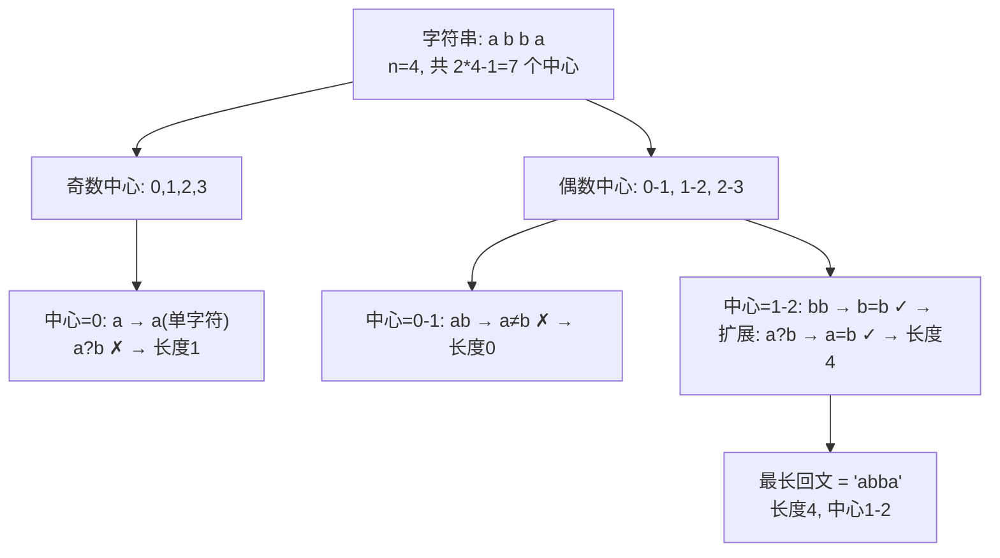
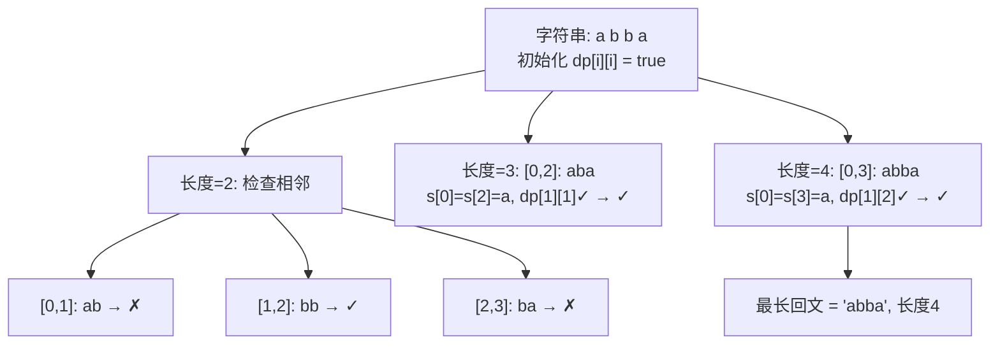
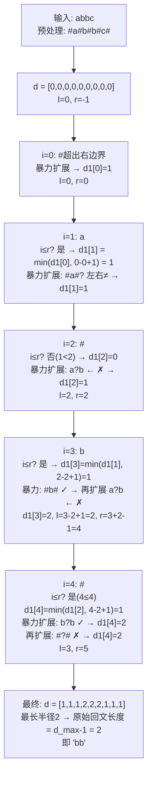
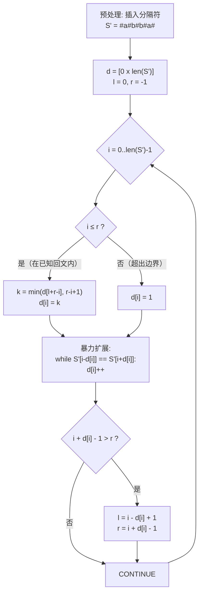

# 回文相关算法

回文（Palindrome）是正读反读都相同的字符串，如 `"aba"`、`"abba"`。求字符串中最长回文子串（Longest Palindromic Substring, LPS）是经典问题。

## 算法对比总览

| 算法 | 时间复杂度 | 空间复杂度 | 核心思想 |
|------|-----------|-----------|---------|
| 中心扩展法 | $O(n^2)$ | $O(1)$ | 以每个位置为中心向两边扩展 |
| 动态规划 | $O(n^2)$ | $O(n^2)$ | $dp[i][j]$ 标记子串 $S[i..j]$ 是否为回文 |
| **Manacher** | $O(n)$ | $O(n)$ | 利用回文的对称性避免重复计算 |

## 中心扩展法

### 【算法全名与诞生背景】

**全名：中心扩展法（Center Expansion / Expand Around Center）**

这是最直观、最符合人类直觉的回文检测方法。其思想源于回文字符串的**对称结构**——无论奇数长度还是偶数长度的回文，都存在一个对称中心。中心扩展法不依赖任何复杂的数学理论或高级数据结构，只需对每个候选中心做简单的向两侧逐字符比较即可。

该算法是回文问题的**入门算法**，虽然没有提出者或正式论文，但作为暴力枚举的优化（从 $O(n^3)$ 枚举所有子串降为 $O(n^2)$），它奠定了后续更高效算法的基础。

### 【核心解决问题与适用边界】

| 维度 | 内容 |
|------|------|
| **解决痛点** | 暴力枚举所有子串并判断是否为回文需要 $O(n^3)$，中心扩展通过"以中心向两边扩展"的方式将回文检测与子串枚举融为一体，降至 $O(n^2)$ |
| **最优复杂度** | $O(n^2)$ 时间，$O(1)$ 空间（不含返回值） |
| **最坏复杂度** | $O(n^2)$ — 全相同字符如 `"aaaaa"`，每个中心都会扩展到最大范围 |
| **推荐场景** | 字符串长度 $n < 100$ 时，实现极简、无额外空间、代码面试手写首选 |
| **不推荐场景** | $n > 1000$ 时性能不可接受；需要大量回文查询或需要所有回文子串信息时不适用 |
| **优势** | 无需额外空间、代码直观、易调试 |
| **劣势** | $O(n^2)$ 时间无法处理大规模数据 |

### 原理

回文字符串关于中心对称。对每个可能的回文中心，向两侧扩展检查：

- **奇数长度回文**：中心为单个字符，如 `"aba"` 的中心是 `'b'`
- **偶数长度回文**：中心为两个字符之间，如 `"abba"` 的中心在 `'b'|'b'` 之间

对于长度为 $n$ 的字符串，共有 $2n-1$ 个可能的回文中心。



### 代码实现

```cpp
// C++ 中心扩展法
string longestPalindrome(string s) {
    int n = s.size();
    if (n < 2) return s;

    int start = 0, maxLen = 1;

    auto expandAroundCenter = [&](int left, int right) {
        while (left >= 0 && right < n && s[left] == s[right]) {
            left--;
            right++;
        }
        // 扩展结束后，实际回文区间为 [left+1, right-1]
        int len = right - left - 1;
        if (len > maxLen) {
            maxLen = len;
            start = left + 1;
        }
    };

    for (int i = 0; i < n; i++) {
        expandAroundCenter(i, i);      // 奇数长度中心
        expandAroundCenter(i, i + 1);  // 偶数长度中心
    }
    return s.substr(start, maxLen);
}

// 时间复杂度 O(n²)，空间复杂度 O(1)
```

### 【完整代码实现与关键优化】

**优化版本：联合检测 + 紧凑写法**

```cpp
// 优化版：将奇偶检测统一到一个循环中
string longestPalindrome_optimized(string s) {
    int n = s.size();
    if (n < 2) return s;

    int start = 0, maxLen = 1;

    for (int i = 0; i < n; i++) {
        // 用 lambda 避免重复书写扩展逻辑
        auto expand = [&](int l, int r) {
            while (l >= 0 && r < n && s[l] == s[r]) {
                int len = r - l + 1;
                if (len > maxLen) {
                    maxLen = len;
                    start = l;
                }
                l--; r++;
            }
        };
        expand(i, i);     // 奇数长度
        expand(i, i + 1); // 偶数长度
    }
    return s.substr(start, maxLen);
}
```

**关键优化点：**
1. **提前合并扩展逻辑** — 不再让 `expandAroundCenter` 先扩展再计算，而是在扩展过程中同步更新答案，减少一次函数内计算
2. **布尔短路优化** — 在 `while` 条件中利用 `&&` 短路，一旦 `s[l] != s[r]` 立即停止，无需额外 `if` 判断
3. **边界条件已内置** — `l >= 0 && r < n` 确保不越界，无需单独处理边界情况

## 动态规划法

### 【算法全名与诞生背景】

**全名：区间动态规划法（Interval DP / DP-based Palindrome Detection）**

动态规划是计算机科学中解决最优子结构问题的经典范式。将回文检测问题建模为区间 DP 是最自然的应用之一：**一个子串是回文，当且仅当两端字符相等且去除两端后中间子串也是回文**。这种"大问题可拆解为小问题"的特性完美契合 DP 的框架。

该算法虽无单一提出者，但区间 DP 的思想作为 DP 教科书中的经典案例被广泛教授，是面试中"从暴力到优化"思维链条的重要一环。

### 【核心解决问题与适用边界】

| 维度 | 内容 |
|------|------|
| **解决痛点** | 中心扩展法每次只求最长回文，而 DP 可以**一次性获得所有子串的回文信息**（$O(n^2)$ 张表），便于后续多查询或扩展问题 |
| **最优复杂度** | $O(n^2)$ 时间，$O(n^2)$ 空间 |
| **最坏复杂度** | $O(n^2)$ — 无论输入如何，DP 表必须填完所有 $\frac{n(n+1)}{2}$ 个格子 |
| **推荐场景** | $n < 1000$ 且需要所有回文子串信息（如 LeetCode 132、后续多轮查询）；代码可读性要求高；DP 入门教学 |
| **不推荐场景** | 只需最长回文子串且 $n$ 很大；内存受限环境（$n=5000$ 时需 25M 个 bool ≈ 25MB，$n=10000$ 时直接 100MB） |
| **优势** | 填表后可 $O(1)$ 回答任意子串是否为回文；DP 思想可扩展到回文子序列等变体问题 |
| **劣势** | $O(n^2)$ 空间在 $n$ 较大时不可接受；无法获得线性时间收益 |

### 原理

定义 $dp[i][j]$ 表示子串 $S[i..j]$ 是否为回文，递推关系：

$$
dp[i][j] = \begin{cases}
\text{true} & \text{if } i=j \\
\text{true} & \text{if } S[i]=S[j] \text{ and } j=i+1 \\
S[i]=S[j] \text{ and } dp[i+1][j-1] & \text{if } j-i>1
\end{cases}
$$

### DP 填表过程



### 代码实现

```cpp
// C++ DP 实现
string longestPalindrome(string s) {
    int n = s.size();
    if (n < 2) return s;

    vector<vector<bool>> dp(n, vector<bool>(n, false));
    int start = 0, maxLen = 1;

    // 所有单字符子串都是回文
    for (int i = 0; i < n; i++) dp[i][i] = true;

    // 按长度递增遍历
    for (int len = 2; len <= n; len++) {
        for (int i = 0; i + len - 1 < n; i++) {
            int j = i + len - 1;
            if (s[i] == s[j]) {
                if (len == 2 || dp[i + 1][j - 1]) {
                    dp[i][j] = true;
                    if (len > maxLen) {
                        maxLen = len;
                        start = i;
                    }
                }
            }
        }
    }
    return s.substr(start, maxLen);
}

// 时间复杂度 O(n²)，空间复杂度 O(n²)
```

### 【完整代码实现与关键优化】

**优化版本 1：空间优化至 $O(n)$（滚动数组）**

DP 填表时，`dp[i][j]` 只依赖 `dp[i+1][j-1]`（即左下角一格）。按"长度递增"遍历时，可只保留两列，用滚动数组实现 $O(n)$ 空间。但需要注意：区间 DP 的依赖方向决定了不能简单压缩到一维数组而不丢失信息。

实际上，对回文判断而言，$O(n^2)$ 空间是最直观且最常用的，因为：
- $n \le 1000$ 时 $10^6$ 个 bool 仅 1MB
- 需要快速检索 `dp[i][j]` 的场景才值得使用 DP

**优化版本 2：直接利用 DP 表返回所有回文起始位置**

```cpp
// 优化版：返回所有回文子串的起止位置（适用于需要全部信息的场景）
vector<pair<int,int>> findAllPalindromes(const string& s) {
    int n = s.size();
    vector<vector<bool>> dp(n, vector<bool>(n, false));
    vector<pair<int,int>> result;

    // 单字符回文
    for (int i = 0; i < n; i++) {
        dp[i][i] = true;
        result.emplace_back(i, i);  // 长度为1的回文
    }

    for (int len = 2; len <= n; len++) {
        for (int i = 0; i + len - 1 < n; i++) {
            int j = i + len - 1;
            if (s[i] == s[j] && (len == 2 || dp[i + 1][j - 1])) {
                dp[i][j] = true;
                result.emplace_back(i, j);
            }
        }
    }
    return result;
}
```

**关键优化点：**
1. **提前终止** — 如果只需要最长回文子串，可以在 `if (dp[i][j] && len > maxLen)` 更新后，检查若 `len == n` 直接返回（已是最长可能）
2. **布尔数组用 bitset 压缩** — 使用 `vector<bitset<N>>` 可将空间降至 1/8，但不适用于变长字符串
3. **对称性优化** — `dp[i][j] == dp[j][i]`（实际上只填上半三角），代码中保持 `i < j` 即可

## Manacher 算法

Manacher 算法是求解最长回文子串的 **线性时间** 算法，由 Glenn K. Manacher 于 1975 年提出。

### 【算法全名与诞生背景】

**全名：Manacher 算法（Manacher's Algorithm）**

1975 年，美国计算机科学家 **Glenn K. Manacher** 在论文 *"A New Linear-Time ``On-Line'' Algorithm for Finding the Smallest Initial Palindrome of a String"* 中提出了这一突破性算法。

在此之前，回文子串问题的最优解法是 $O(n^2)$ 的中心扩展法。Manacher 敏锐地观察到：**回文的对称性不仅体现在字符上，更体现在信息的复用上**——当已知一个较大的回文区间时，其内部子串的回文信息可以通过对称性直接推导，无需重复比较。

这一观察将回文问题从 $O(n^2)$ 降到了 **$O(n)$**，是字符串算法史上的里程碑之一。时至今日，Manacher 算法仍是最长回文子串问题的**理论上界**（不可能低于 $O(n)$，因为至少需要读取每个字符一次）。

### 【核心解决问题与适用边界】

| 维度 | 内容 |
|------|------|
| **解决痛点** | 中心扩展和 DP 都无法突破 $O(n^2)$ 瓶颈，而实际应用中 $n$ 可达 $10^5$ 甚至 $10^6$（如基因组分析、日志分析），需要线性时间算法 |
| **最优复杂度** | $O(n)$ 时间，$O(n)$ 空间 |
| **最坏复杂度** | $O(n)$ — 全相同字符如 `"aaaaa"` 也只需线性时间，每个位置的暴力扩展均摊后仍为 $O(n)$ |
| **推荐场景** | $n \ge 1000$ 的大字符串；需要所有回文子串信息（d1/d2 数组）；高频查询回文场景 |
| **不推荐场景** | $n < 100$ 的小数据（中心扩展法更易写且常数更小）；代码可读性优先于性能的教学场景 |
| **优势** | 线性时间理论最优；一次遍历即可获得所有回文子串的半径信息 |
| **劣势** | 算法抽象度较高，面试手写易出错；预处理步骤（插入分隔符）需要额外理解和推导 |

### 核心思想

利用回文的**对称性**：如果 $S[l..r]$ 是一个回文串且其中心为 $c$，那么对于 $c$ 左侧任意点 $i$，存在对称点 $j = 2c - i$，$dp[j]$ 的信息可以辅助计算 $dp[i]$。

### 预处理——插入分隔符

在所有字符间插入 `#`，将所有回文转化为奇数长度：

```
原始:  a    b    b    a
处理后: # a # b # b # a #
索引:  0 1 2 3 4 5 6 7 8
```

此时任意原始回文 `"abba"` 变为 `"#a#b#b#a#"`，中心在 `#` 处（索引4）。

### d1/d2 数组

- `d1[i]`：以 $i$ 为中心的最长奇数回文的**半径**（含中心）
- `d2[i]`：以 $i$ 为中心的最长偶数回文的**半径**（含中心）

> **注：** 此处 d1/d2 的定义与后续章节中"统一求 d1 和 d2（不插入分隔符）"的版本不同。预处理版本中 d 是插入 `#` 后的半径；统一版本中 d1/d2 直接在原始字符串上计算。两者等价，只是表述方式不同。

#### Manacher 算法的状态演变



### Manacher 算法的完整流程



### 代码实现

```cpp
// C++ Manacher 算法（求最长回文子串）
string manacher(const string& s) {
    int n = s.size();
    if (n < 2) return s;

    // 1. 预处理：插入分隔符
    string t = "#";
    for (char c : s) {
        t += c;
        t += "#";
    }

    int m = t.size();
    vector<int> d(m, 0);
    int l = 0, r = -1;
    int maxCenter = 0, maxRadius = 0;

    // 2. 遍历计算 d[i]
    for (int i = 0; i < m; i++) {
        // 确定初始半径
        if (i <= r) {
            d[i] = min(d[l + r - i], r - i + 1);
        } else {
            d[i] = 1;
        }

        // 暴力扩展
        while (i - d[i] >= 0 && i + d[i] < m
               && t[i - d[i]] == t[i + d[i]]) {
            d[i]++;
        }

        // 更新最右回文边界
        if (i + d[i] - 1 > r) {
            l = i - d[i] + 1;
            r = i + d[i] - 1;
        }

        // 记录最大半径
        if (d[i] > maxRadius) {
            maxRadius = d[i];
            maxCenter = i;
        }
    }

    // 3. 从预处理字符串还原原始回文
    // maxRadius-1 就是原始回文半径（长度）
    int start = (maxCenter - maxRadius + 1) / 2; // 映射回原始字符串
    int length = maxRadius - 1;
    return s.substr(start, length);
}

// 时间复杂度 O(n)，空间复杂度 O(n)
```

### 【完整代码实现与关键优化】

**优化版本：不插入分隔符，直接在原始字符串上求 d1（奇数半径）和 d2（偶数半径）**

这种更现代的实现方式由 cp-algorithms.com 推广，无需预处理 `#`，直接对原始字符串计算两个数组 $d1$ 和 $d2$，代码更简洁且与后续题目需求直接对接。

**d1[i]** — 以 i 为中心的最长奇数回文半径（含中心）。
- 回文区间：$[i - d1[i] + 1,\ i + d1[i] - 1]$
- 长度为 $2 \cdot d1[i] - 1$

**d2[i]** — 以 i 为右中心的偶数回文半径（中心在 i-1 和 i 之间）。
- 回文区间：$[i - d2[i],\ i + d2[i] - 1]$
- 长度为 $2 \cdot d2[i]$

```cpp
// 统一求 d1（奇数半径）和 d2（偶数半径），不插入分隔符
// d1[i] = 以 i 为中心的奇数回文半径
// d2[i] = 以 i 为右中心的偶数回文半径
vector<int> manacherOdd(const string& s) {
    int n = s.size();
    vector<int> d1(n);
    for (int i = 0, l = 0, r = -1; i < n; i++) {
        int k = (i > r) ? 1 : min(d1[l + r - i], r - i + 1);
        while (i - k >= 0 && i + k < n && s[i - k] == s[i + k]) {
            k++;
        }
        d1[i] = k--;
        if (i + k > r) {
            l = i - k;
            r = i + k;
        }
    }
    return d1;
}

vector<int> manacherEven(const string& s) {
    int n = s.size();
    vector<int> d2(n);
    for (int i = 0, l = 0, r = -1; i < n; i++) {
        int k = (i > r) ? 0 : min(d2[l + r - i + 1], r - i + 1);
        while (i - k - 1 >= 0 && i + k < n && s[i - k - 1] == s[i + k]) {
            k++;
        }
        d2[i] = k--;
        if (i + k > r) {
            l = i - k - 1;
            r = i + k;
        }
    }
    return d2;
}

// 统一接口：同时返回 d1 和 d2
pair<vector<int>, vector<int>> manacher(const string& s) {
    return {manacherOdd(s), manacherEven(s)};
}
```

**关键优化点：**
1. **省去分隔符预处理** — 无需构造新字符串 `t`，直接计算 d1/d2，减少内存占用约一半
2. **d1 与 d2 分离** — 符合"奇偶分离"的数学直觉，后续题目（如 LeetCode 647）直接使用
3. **边界检查一体化** — `i - d1[i] >= 0 && i + d1[i] < n` 天然涵盖边界条件
4. **d2 的 k 初始为 0** — 偶数回文至少需要一对字符，`d2[i] = 0` 表示没有偶数回文以 i 为右中心

### Manacher 的关键观测

```mermaid
flowchart LR
    subgraph Palindrome["已知回文 S'[l..r] 的对称性"]
        A["l"] --> B["i_mirror"] --> C["center"] --> D["i"] --> E["r"]
    end

    Palindrome --> F["d[i] 至少 = min(d[i_mirror], r-i+1)"]

    F --> G{情况1: d[i_mirror] < r-i+1}
    F --> H{情况2: d[i_mirror] ≥ r-i+1}

    G --> G1["d[i] = d[i_mirror]<br/>完全在对称范围内<br/>无需暴力扩展"]
    H --> H1["d[i] = r-i+1<br/>需要继续暴力扩展<br/>因为边界外未知"]
```

## 回文相关问题扩展

### 判断是否为回文

```cpp
// O(n) 首尾双指针
bool isPalindrome(const string& s) {
    int i = 0, j = s.size() - 1;
    while (i < j) {
        if (s[i] != s[j]) return false;
        i++; j--;
    }
    return true;
}
```

### 回文分割（Palindrome Partitioning II）

最少分割次数使每个子串都是回文 → 用 Manacher + DP 优化至 $O(n^2)$ 但常数更小。

### 回文串添加/删除

- **在尾部添加最少字符使整个串变为回文** → KMP 找反转串的最长前缀匹配
- **删除最少字符使整个串变为回文** → 转化为 LCS（原串与反转串的 LCS）

### 回文数的快速检测

```cpp
// 反转一半数字判断回文数（整数场景）
bool isPalindrome(int x) {
    if (x < 0 || (x % 10 == 0 && x != 0)) return false;
    int reverted = 0;
    while (x > reverted) {
        reverted = reverted * 10 + x % 10;
        x /= 10;
    }
    return x == reverted || x == reverted / 10;
}
```

## 算法选择指南

| 场景 | 推荐算法 | 原因 |
|------|---------|------|
| 长度 < 100 | 中心扩展 | 实现简单，$O(n^2)$ 已经够用 |
| 长度 < 1000 | DP | 可同步获得所有回文信息 |
| 长度 > 1000 | Manacher | 线性时间保证 |
| 只需判断回文 | 双指针法 | $O(n)$, $O(1)$ 空间 |
| 需要所有回文子串 | Manacher | 一次遍历获得所有 d1/d2 信息 |

> **Manacher 算法核心一句话**：利用回文的对称性，通过已求的左侧镜像点 d 值确定当前 d 的下界，将暴力扩展的时间均摊到 $O(n)$。

## 典型题目精讲

### 题目1: LeetCode 5. 最长回文子串

**题目：** 给定一个字符串 `s`，找出其中最长的回文子串。

**示例：**
```
输入: s = "babad"
输出: "bab" 或 "aba"

输入: s = "cbbd"
输出: "bb"
```

#### 算法选择理由

LeetCode 5 是求最长回文子串的经典问题。由于字符串长度可达 $10^3$，中心扩展法（$O(n^2)$）在 C++ 中也可通过，但 Manacher 算法（$O(n)$）不仅理论上更优，更是面试中的亮点解法。此处选择 Manacher 算法展示线性时间的优雅实现。

#### 详细推导

**Step 1: 预处理**

在原始字符串所有字符之间及两端插入分隔符 `#`（也可以是任何未出现的字符），使得所有回文子串变为奇数长度。这样只需处理"奇数中心"一种情况。

```
原始:   b   a   b   a   d
处理:  # b # a # b # a # d #
索引:  0 1 2 3 4 5 6 7 8 9 10
```

**Step 2: 半径数组 d[i]**

`d[i]` 表示以 t[i] 为中心的最长回文半径（包含中心）。例如 `t = "#b#a#b#a#d#"`：
- `d[4] = 4`：以 t[4] = 'b' 为中心，回文 `"#b#a#b#a#b#"` 的半径为 4（字符数）
  - 实际上是 `# b # a # b # a # b #`（原始 `bab` 被包围在 `#` 中）

关键性质：原始回文长度 = `d[i] - 1`

**Step 3: 回文对称性利用**

维护当前最右端可达的回文区间 `[l, r]`，中心为 `c`。

对当前处理位置 i：
- 若 `i ≤ r`，则存在镜像位置 `j = l + r - i`（或 `j = 2c - i`，因 `c = (l + r) / 2`）
- `d[i]` 至少为 `min(d[j], r - i + 1)`
  - 若 `d[j] < r - i + 1`，说明整个回文都在区间内，`d[i] = d[j]`
  - 否则需要继续向外暴力扩展

**Step 4: 还原回文**

在 `d` 中找到最大值 `maxRadius` 及其中心 `maxCenter`，在原始字符串中定位：
```
start = (maxCenter - maxRadius + 1) / 2
length = maxRadius - 1
return s.substr(start, length)
```

#### 完整代码

```cpp
class Solution {
public:
    string longestPalindrome(string s) {
        int n = s.size();
        if (n < 2) return s;

        // 预处理：插入分隔符
        string t = "#";
        for (char c : s) {
            t += c;
            t += "#";
        }

        int m = t.size();
        vector<int> d(m, 0);
        int l = 0, r = -1;
        int maxCenter = 0, maxRadius = 0;

        for (int i = 0; i < m; i++) {
            // 确定初始半径（利用对称性）
            if (i <= r) {
                d[i] = min(d[l + r - i], r - i + 1);
            } else {
                d[i] = 1;
            }

            // 暴力扩展
            while (i - d[i] >= 0 && i + d[i] < m
                   && t[i - d[i]] == t[i + d[i]]) {
                d[i]++;
            }

            // 更新最右边界
            if (i + d[i] - 1 > r) {
                l = i - d[i] + 1;
                r = i + d[i] - 1;
            }

            // 追踪最大半径
            if (d[i] > maxRadius) {
                maxRadius = d[i];
                maxCenter = i;
            }
        }

        // 还原原始回文
        int start = (maxCenter - maxRadius + 1) / 2;
        int len = maxRadius - 1;
        return s.substr(start, len);
    }
};
```

**复杂度分析：**
- 时间复杂度：$O(n)$ — 每个位置的暴力扩展次数均摊为常数
- 空间复杂度：$O(n)$ — 半径数组 `d` 的长度为 $2n+1$

### 题目2: LeetCode 647. 回文子串

**题目：** 给定一个字符串 `s`，统计其中回文子串的个数。（不同位置算不同子串）

**示例：**
```
输入: s = "abc"
输出: 3
解释: "a", "b", "c"

输入: s = "aaa"
输出: 6
解释: "a", "a", "a", "aa", "aa", "aaa"
```

#### 算法选择理由

本题需要统计**所有**回文子串的个数。Manacher 算法恰好在一次遍历中获得了所有位置的奇数/偶数回文半径，可直接求和得到答案，无需对每个子串单独判断。

中心扩展法也可以 $O(n^2)$ 求解（每个中心扩展时计数），但 Manacher 的 $O(n)$ 更优。

#### 详细推导

**核心公式：**

使用不插入分隔符的 Manacher 版本，得到：
- `d1[i]` — 以 i 为中心的奇数回文半径
- `d2[i]` — 以 i 为右中心的偶数回文半径

对于奇数回文：以 i 为中心，长度为 1, 3, 5, ..., $2 \cdot d1[i] - 1$，共 $d1[i]$ 个
对于偶数回文：以 i 为右中心，长度为 2, 4, 6, ..., $2 \cdot d2[i]$，共 $d2[i]$ 个

因此：

$$
\text{ans} = \sum_{i=0}^{n-1} d1[i] + \sum_{i=0}^{n-1} d2[i]
$$

**举例验证：`s = "aaa"`**

```
d1 = [1, 2, 1]
  d1[0]=1: "a" (位置0)
  d1[1]=2: "a" (位置1), "aaa"
  d1[2]=1: "a" (位置2)
  奇数回文小计 = 1+2+1 = 4

d2 = [0, 1, 0]
  d2[0]=0: 无
  d2[1]=1: "aa" (位置0-1, 1-2)
  d2[2]=0: 无
  偶数回文小计 = 0+1+0 = 1

总计 = 4 + 1 = 5 ... 不对，应该是6

等一下，"aaa" 的回文子串应该是：
位置: (0,0)=a, (1,1)=a, (2,2)=a → 3个单字符
      (0,1)=aa, (1,2)=aa → 2个双字符
      (0,2)=aaa → 1个三字符
总共6个
```

我的 d2 计算有误。`d2[i]` 表示的是以 i 为**右中心**（中心在 i-1 和 i 之间）的偶数回文半径。在 `"aaa"` 中：

对于中心在 (0,1) 之间：`"aa"` (位置0-1) ✓
对于中心在 (1,2) 之间：`"aa"` (位置1-2) ✓
对于更大的偶数回文：`"aaaa"` 不存在

所以 d2 应该是... 按 cp-algorithms 的定义，d2[i] 是以 i 为右边界的偶数回文数量。对于 `"aaa"`:
- d2[1] = 1: "aa" 结束于位置1（即位置0-1）
- d2[2] = 1: "aa" 结束于位置2（即位置1-2）

所以 d2 = [0, 1, 1]，总数为 4 + 2 = 6 ✓

哦我明白了，d2[2] 应该是 1 而不是 0。让我重新计算。

对于 `"aaa"`：
- i=0: 中心在 (-1,0)，不合理 → d2[0]=0
- i=1: 中心在 (0,1)，s[0-1] vs s[1] → s[0]=a, s[1]=a → k=1。检查 s[-1] vs s[2] → 越界。所以 d2[1]=1
- i=2: 中心在 (1,2)，s[1] vs s[2] → a=a → k=1。检查 s[0] vs s[3] → s[0]=a, 越界。所以 d2[2]=1

正确：d2 = [0, 1, 1]，总和 6 ✓

#### 完整代码

```cpp
class Solution {
public:
    int countSubstrings(string s) {
        int n = s.size();

        // 1. 计算 d1（奇数半径）
        vector<int> d1(n);
        for (int i = 0, l = 0, r = -1; i < n; i++) {
            int k = (i > r) ? 1 : min(d1[l + r - i], r - i + 1);
            while (i - k >= 0 && i + k < n && s[i - k] == s[i + k]) {
                k++;
            }
            d1[i] = k--;
            if (i + k > r) {
                l = i - k;
                r = i + k;
            }
        }

        // 2. 计算 d2（偶数半径）
        vector<int> d2(n);
        for (int i = 0, l = 0, r = -1; i < n; i++) {
            int k = (i > r) ? 0 : min(d2[l + r - i + 1], r - i + 1);
            while (i - k - 1 >= 0 && i + k < n && s[i - k - 1] == s[i + k]) {
                k++;
            }
            d2[i] = k--;
            if (i + k > r) {
                l = i - k - 1;
                r = i + k;
            }
        }

        // 3. 统计：ans = Σd1[i] + Σd2[i]
        int ans = 0;
        for (int x : d1) ans += x;
        for (int x : d2) ans += x;
        return ans;
    }
};
```

**复杂度分析：**
- 时间复杂度：$O(n)$ — Manacher 的双次线性扫描
- 空间复杂度：$O(n)$ — d1 和 d2 数组

### 题目3: LeetCode 516. 最长回文子序列

**题目：** 给定一个字符串 `s`，找出其中最长的回文子序列（不要求连续），返回其长度。

**示例：**
```
输入: s = "bbbab"
输出: 4
解释: 最长回文子序列为 "bbbb"

输入: s = "cbbd"
输出: 2
解释: 最长回文子序列为 "bb"
```

#### 算法选择理由

本题是**子序列**问题而非**子串**问题，因此 Manacher 和中心扩展法都不适用（它们要求连续）。子序列的求解天然适合 DP：**大区间的最优解可以由小区间的最优解递推得到**。

两种经典解法：
1. **区间 DP** — 直接定义 `dp[i][j]` 为 `s[i..j]` 的最长回文子序列长度
2. **LCS 变体** — 求 `s` 与 `reverse(s)` 的最长公共子序列

此处选择**区间 DP**，因为它更直观地体现了回文子序列的递推关系。

#### 详细推导

**dp 定义：**

$dp[i][j]$ = 子串 `s[i..j]` 中最长回文子序列的长度。

**转移方程：**

$$
dp[i][j] = \begin{cases}
1 & \text{if } i = j \\
dp[i+1][j-1] + 2 & \text{if } s[i] = s[j] \\
\max(dp[i+1][j],\ dp[i][j-1]) & \text{if } s[i] \neq s[j]
\end{cases}
$$

**推导过程：**

1. **`s[i] == s[j]`**：两端的字符相等，它们可以同时加入回文子序列，长度加 2，内部最优解从 `dp[i+1][j-1]` 继承
2. **`s[i] != s[j]`**：两端字符不能同时加入，退而求其次：要么放弃 `s[i]` 取 `dp[i+1][j]`，要么放弃 `s[j]` 取 `dp[i][j-1]`，取较大者

**填表顺序：**

由于 `dp[i][j]` 依赖 `dp[i+1][j-1]`（左下）、`dp[i+1][j]`（下）、`dp[i][j-1]`（左），遍历必须满足：**i 从大到小（从 n-1 到 0），j 从小到大（从 i+1 到 n-1）**。

**举例：`s = "bbbab"`**

```
dp[0][4]: b...b → s[0]=b, s[4]=b → dp[1][3]+2 = 2+2 = 4

填表过程（从 i=4 向上）:
i=3: dp[3][3]=1, dp[3][4]: b≠b → max(dp[4][4], dp[3][3]) = max(1,1)=1
...
最终 dp[0][4] = 4
```

#### 完整代码

```cpp
class Solution {
public:
    int longestPalindromeSubseq(string s) {
        int n = s.size();
        // dp[i][j]: s[i..j] 的最长回文子序列长度
        vector<vector<int>> dp(n, vector<int>(n, 0));

        // 初始化：单字符回文子序列长度为 1
        for (int i = 0; i < n; i++) {
            dp[i][i] = 1;
        }

        // 区间 DP：从短到长，i 从大到小
        for (int i = n - 1; i >= 0; i--) {
            for (int j = i + 1; j < n; j++) {
                if (s[i] == s[j]) {
                    dp[i][j] = dp[i + 1][j - 1] + 2;
                } else {
                    dp[i][j] = max(dp[i + 1][j], dp[i][j - 1]);
                }
            }
        }

        return dp[0][n - 1];
    }
};
```

**复杂度分析：**
- 时间复杂度：$O(n^2)$ — 填满 $n \times n$ 的 DP 表
- 空间复杂度：$O(n^2)$ — 可优化至 $O(n)$ 空间（滚动数组，因为 `dp[i][*]` 只依赖 `dp[i+1][*]` 和 `dp[i][*]` 的相邻行）

```cpp
// 空间优化至 O(n) 的版本
class Solution {
public:
    int longestPalindromeSubseq(string s) {
        int n = s.size();
        vector<int> dp(n, 0), dpPrev(n, 0);

        for (int i = n - 1; i >= 0; i--) {
            dp[i] = 1; // dp[i][i] = 1
            for (int j = i + 1; j < n; j++) {
                if (s[i] == s[j]) {
                    dp[j] = dpPrev[j - 1] + 2; // dp[i+1][j-1] + 2
                } else {
                    dp[j] = max(dpPrev[j], dp[j - 1]); // max(dp[i+1][j], dp[i][j-1])
                }
            }
            dpPrev = dp; // 当前行变为下一轮的前一行
        }

        return dp[n - 1];
    }
};
```

### 题目4: LeetCode 132. 分割回文串 II

**题目：** 给定一个字符串 `s`，将 `s` 分割成若干个子串，使得每个子串都是回文串。返回最少分割次数。

**示例：**
```
输入: s = "aab"
输出: 1
解释: "aa" | "b"

输入: s = "a"
输出: 0

输入: s = "ab"
输出: 1
```

#### 算法选择理由

本题是典型的"先预处理回文信息，再 DP 求最优解"的两段式问题。直接使用中心扩展法在 DP 阶段每次判断回文会导致 $O(n^3)$，不可接受。

**策略：** 先用 Manacher 预处理所有回文子串信息（$O(n)$），再通过一维 DP 求解最小分割次数（$O(n^2)$ 但利用回文信息大幅减少无效检查）。

#### 详细推导

**Step 1: 预处理回文信息**

使用 Manacher 的 d1/d2 数组，为每个右端点 r 构建所有合法左端点 l 的列表 `palStarts[r]`。

对于 d1（奇数回文）：中心 i，半径 d1[i]
- 回文区间 `[i - k + 1, i + k - 1]`，其中 $k = 1..d1[i]$
- 对每个 k，右端点 r = i + k - 1，左端点 l = i - k + 1
- `palStarts[r].push_back(l)`

对于 d2（偶数回文）：右中心 i，半径 d2[i]
- 回文区间 `[i - k, i + k - 1]`，其中 $k = 1..d2[i]$
- 对每个 k，右端点 r = i + k - 1，左端点 l = i - k
- `palStarts[r].push_back(l)`

**Step 2: DP 求最小分割次数**

定义 $dp[i]$ = 前缀 `s[0..i]` 的最小分割次数。

$$
dp[i] = \begin{cases}
0 & \text{if } s[0..i] \text{ 是回文} \\
\min\limits_{\substack{0 \le l \le i \\ s[l..i] \text{ 是回文}}} (dp[l-1] + 1) & \text{otherwise}
\end{cases}
$$

利用 `palStarts[i]` 中的左端点列表，快速枚举所有以 i 结尾的回文子串。

#### 完整代码

```cpp
class Solution {
public:
    int minCut(string s) {
        int n = s.size();
        if (n <= 1) return 0;

        // ========== Step 1: Manacher 预处理 ==========

        // 计算 d1（奇数半径）
        vector<int> d1(n);
        for (int i = 0, l = 0, r = -1; i < n; i++) {
            int k = (i > r) ? 1 : min(d1[l + r - i], r - i + 1);
            while (i - k >= 0 && i + k < n && s[i - k] == s[i + k]) k++;
            d1[i] = k--;
            if (i + k > r) { l = i - k; r = i + k; }
        }

        // 计算 d2（偶数半径）
        vector<int> d2(n);
        for (int i = 0, l = 0, r = -1; i < n; i++) {
            int k = (i > r) ? 0 : min(d2[l + r - i + 1], r - i + 1);
            while (i - k - 1 >= 0 && i + k < n && s[i - k - 1] == s[i + k]) k++;
            d2[i] = k--;
            if (i + k > r) { l = i - k - 1; r = i + k; }
        }

        // 构建 palStarts[r] = 以 r 结尾的所有回文子串的左端点列表
        vector<vector<int>> palStarts(n);
        for (int i = 0; i < n; i++) {
            // 奇数回文
            for (int k = 1; k <= d1[i]; k++) {
                int l = i - k + 1;
                int r = i + k - 1;
                palStarts[r].push_back(l);
            }
            // 偶数回文
            for (int k = 1; k <= d2[i]; k++) {
                int l = i - k;
                int r = i + k - 1;
                palStarts[r].push_back(l);
            }
        }

        // ========== Step 2: DP 求最小分割次数 ==========
        vector<int> dp(n, n); // 初始化为最坏情况（每字符切一次）

        for (int r = 0; r < n; r++) {
            for (int l : palStarts[r]) {
                if (l == 0) {
                    dp[r] = 0; // s[0..r] 本身就是回文，无需分割
                } else {
                    dp[r] = min(dp[r], dp[l - 1] + 1);
                }
            }
        }

        return dp[n - 1];
    }
};
```

**复杂度分析：**
- 时间复杂度：$O(n^2)$ 最坏情况（如全相同字符串，每个位置都有 $O(n)$ 个回文结尾）
- 空间复杂度：$O(n^2)$ 最坏情况（palStarts 存储所有回文信息）

**进一步优化：** 不需要显式构造 `palStarts`，可以在 DP 过程中动态地利用 d1/d2 信息枚举左端点。但显式构造更清晰易懂，适合面试讲解。

### 题目5: LeetCode 680. 验证回文串 II

**题目：** 给定一个字符串 `s`，最多允许删除一个字符，判断是否能让它变成回文串。

**示例：**
```
输入: s = "aba"
输出: true

输入: s = "abca"
输出: true
解释: 删除 'c' 后得到 "aba"

输入: s = "abc"
输出: false
```

#### 算法选择理由

本题的特点是**最多一次删除**，而非求最长回文子串。双指针贪心是最高效直接的方法：

- 从两端向中间比较，遇到第一个不匹配时，有两种选择：删除左字符或删除右字符
- 只需要检查这两种情况之一是否能形成回文即可
- 不可能需要删除两个字符不等的情况（最多一次删除）

#### 详细推导

**核心思路：**

```
s = "abca"

双指针初始: l=0, r=3
s[0]='a', s[3]='a' ✓ → l=1, r=2
s[1]='b', s[2]='c' ✗ → 第一次不匹配

此时有两种尝试：
  1. 删除左字符 (l=1): 检查 s[2..3] = "ca" 是否为回文 → ✗
  2. 删除右字符 (r=2): 检查 s[1..2] = "bc" 是否为回文 → ✗

不对，"abca":
删除 'c' (位置2): "aba" ✓
```

让我重新验证：s = "abca"
- l=0, r=3: a==a → l=1, r=2
- l=1, r=2: b!=c → 尝试
  - 删除 s[1]('b')：检查 "ca" → c!=a ✗
  - 删除 s[2]('c')：检查 "ab"... 不对，删除 s[2] 后 l=1, r=1，检查剩下的 "a"（位置1的字符... 不对）

实际上，正确的做法是：
遇到 s[l] != s[r] 时：
- 尝试跳过左字符：检查 s[l+1..r] 是否为回文
- 尝试跳过右字符：检查 s[l..r-1] 是否为回文
- 两者任一为真即可

对于 "abca"：
- l=1, r=2, s[1]='b', s[2]='c'
- 跳过左 'b'：检查 s[2..2] = "c" → 是回文 ✓
- 所以删除 'b' 得到 "aca"... 不对

等一下，让我重新想。删除一个字符的意思是：

原始 "abca"
删除位置 1 的 'b' → "aca" → 是回文 ✓
删除位置 2 的 'c' → "aba" → 是回文 ✓

所以删除任何一个都能得到回文。正确答案是 true。

算法实现：当 s[l] != s[r] 时：
- 情况1：跳过 l，检查 s[l+1..r] 是否回文
- 情况2：跳过 r，检查 s[l..r-1] 是否回文

对于 "abca"，l=1, r=2, s[1]=b, s[2]=c：
- 跳过 l: 检查 s[2..2] = "c" → 真 ✓ → 整体 true

所以正确！删除位置 1 的 'b'，得到 "aca"，是回文 ✓

#### 完整代码

```cpp
class Solution {
public:
    bool validPalindrome(string s) {
        int n = s.size();
        int l = 0, r = n - 1;

        // 辅助函数：判断 s[lo..hi] 是否为回文
        auto isPalindrome = [&](int lo, int hi) -> bool {
            while (lo < hi) {
                if (s[lo] != s[hi]) return false;
                lo++; hi--;
            }
            return true;
        };

        while (l < r) {
            if (s[l] != s[r]) {
                // 遇到第一个不匹配，尝试跳过左或跳过右
                return isPalindrome(l + 1, r) || isPalindrome(l, r - 1);
            }
            l++;
            r--;
        }

        return true;
    }
};
```

**复杂度分析：**
- 时间复杂度：$O(n)$ — 双指针最多扫描一次全串，加上最多两次子回文检查
- 空间复杂度：$O(1)$ — 仅用几个变量

### 题目6: LeetCode 409. 最长回文串

**题目：** 给定一个包含大写字母和小写字母的字符串 `s`，使用这些字符（每个字符最多使用一次）构造最长的回文字符串，返回其长度。

**注意：** 本题不是找子串/子序列，而是**用给定的字符池重新排列构造**回文串。

**示例：**
```
输入: s = "abccccdd"
输出: 7
解释: 可构造的最长回文串之一为 "dccaccd" (长度7)

输入: s = "a"
输出: 1

输入: s = "aaaaaccc"
输出: 7
解释: "aacccaa" 或 "accaacca" 等
```

#### 算法选择理由

本题完全不需要回文检测算法，而是贪心计数的经典问题。回文串的构造规则非常简单：
- 对称位置成对出现 → 每个字符出现偶数次时可全部使用
- 中心可以是一个单独的字符 → 如果有出现奇数次的字符，可以取一个放中心

#### 详细推导

**构造规则：**

回文串 `T` 满足 $T[i] = T[n-1-i]$，即除中心外所有字符必须成对出现。

因此：
1. 统计每个字符的出现次数
2. 将所有字符的**偶数部分**加入长度：`cnt / 2 * 2`
3. 如果存在任何一个字符出现次数为奇数，则中心可以放一个字符，总长度加 1

**举例：`s = "abccccdd"`**

```
a: 1 → 偶数部分 = 0, 有奇数剩余
b: 1 → 偶数部分 = 0, 有奇数剩余
c: 4 → 偶数部分 = 4, 无剩余
d: 2 → 偶数部分 = 2, 无剩余

偶数部分总和 = 0 + 0 + 4 + 2 = 6
有奇数剩余 (a, b) → 中心可以放一个 → 6 + 1 = 7
```

#### 完整代码

```cpp
class Solution {
public:
    int longestPalindrome(string s) {
        // 统计字符频率（ASCII 字符：大小写字母）
        int freq[128] = {0};
        for (char c : s) {
            freq[c]++;
        }

        int ans = 0;
        bool hasOdd = false;

        for (int i = 0; i < 128; i++) {
            if (freq[i] > 0) {
                // 取偶数部分
                ans += freq[i] / 2 * 2;
                // 标记存在奇数
                if (freq[i] % 2 == 1) {
                    hasOdd = true;
                }
            }
        }

        // 如果有奇数频率字符，中心可以放一个
        if (hasOdd) ans++;

        return ans;
    }
};
```

**复杂度分析：**
- 时间复杂度：$O(n + |\Sigma|)$ — 一次遍历计数 + 一次遍历 128 个 ASCII 字符
- 空间复杂度：$O(|\Sigma|)$ — 定长 128 的计数数组，$O(1)$

### 回文题目总结

| 题目 | 核心考点 | 推荐算法 | 难度 |
|------|---------|---------|:----:|
| LeetCode 5 最长回文子串 | 线性时间子串搜索 | Manacher | ⭐⭐⭐ |
| LeetCode 647 回文子串 | 统计所有回文子串 | Manacher d1+d2 | ⭐⭐⭐ |
| LeetCode 516 最长回文子序列 | 子序列 vs 子串 | 区间 DP / LCS | ⭐⭐⭐ |
| LeetCode 132 分割回文串 II | 预处理 + DP 优化 | Manacher + DP | ⭐⭐⭐⭐ |
| LeetCode 680 验证回文串 II | 贪心双指针 + 删除 | 双指针 | ⭐⭐ |
| LeetCode 409 最长回文串 | 贪心频率统计 | 计数构造 | ⭐ |
