# 字符串匹配算法

字符串匹配（String Matching）是计算机科学中最基础、应用最广泛的问题之一。给定一个**主串**（文本串）$T$ 长度为 $n$，和一个**模式串** $P$ 长度为 $m$，查找 $P$ 在 $T$ 中所有出现的位置。

本文将按复杂度递进，覆盖以下算法：

| 算法 | 时间复杂度 | 空间复杂度 | 特点 |
|------|-----------|-----------|------|
| BF（朴素） | $O(mn)$ | $O(1)$ | 最直观，适合短串 |
| RK（Rabin-Karp） | 平均 $O(n+m)$，最坏 $O(mn)$ | $O(1)$ | 哈希思想 |
| KMP | $O(n+m)$ | $O(m)$ | 最经典，next 数组 |
| BM | 最佳 $O(n/m)$，最坏 $O(mn)$ | $O(m)$ | 工程常用，坏字符+好后缀 |
| Sunday | 最佳 $O(n/m)$，平均 $O(n)$ | $O(\sigma)$ | 实现简单、实际效率高 |
| Z-Algorithm | $O(n+m)$ | $O(n+m)$ | Z-function 统一处理 |
| 有限自动机 | $O(m\sigma + n)$ | $O(m\sigma)$ | 理论优美，建表开销大 |

> $\sigma$ 表示字符集大小。

## BF 算法（Brute Force）

### 【算法全名与诞生背景】

- **全称**：Brute Force（暴力匹配算法），亦称朴素字符串匹配算法（Naive String Matching Algorithm）
- **提出时间**：BF 算法并非某位科学家单独提出，它是计算机科学中最早期、最自然的模式匹配思路，几乎是人类直觉的直接计算机化
- **历史地位**：在所有数据结构与算法教材中，BF 通常是第一个介绍的字符串匹配算法，是衡量所有后续优化算法的"原始基准线"
- **思想起源**：源于"穷举"这一最朴素的计算机问题求解策略——枚举主串中所有可能的起始位置，逐一验证是否与模式串匹配

### 【核心解决问题与适用边界】

**解决了什么问题：**
- 解决了"给定两个字符串，判断模式串是否出现在主串中"这一基本问题
- 它是所有字符串匹配算法中最简单的实现，无需任何预处理

**理论复杂度边界：**
- **最优**：$O(n)$，当第一个字符在所有位置都不匹配时（只需比较 $n-m+1$ 次首字符）
- **最差**：$O(mn)$，当出现大量伪匹配时（如 $T=\text{"aaaaaaaaab"}, P=\text{"aaab"}$）
- **平均**：$O(n)$，对于随机文本，通常比较很少的字符就能排除

**适用场景：**
- ✅ 模式串极短（$m \le 5$），CPU 预取和流水线优势明显
- ✅ 一次性匹配，不做重复模式串的预处理
- ✅ 教学演示，理解字符串匹配的基础
- ❌ 文本超长（$n > 10^5$）且模式串也较长
- ❌ 需要保证最坏情况下性能的场景
- ❌ 高性能服务（如搜索引擎、grep 工具）的处理逻辑

### 【完整代码实现与关键优化】

#### 基础版本（保留原代码）

```cpp
// C++ 实现 - 基础版本
int BF(const string& T, const string& P) {
    int n = T.size(), m = P.size();
    for (int i = 0; i <= n - m; i++) {
        int j;
        for (j = 0; j < m; j++) {
            if (T[i + j] != P[j]) break;
        }
        if (j == m) return i; // 匹配成功
    }
    return -1;
}
```

#### 优化版本（防御性编程 + 首字符快速过滤）

```cpp
// C++ 实现 - 优化版本
// 优化点1：增加防御性检查（空串、模式串长于主串）
// 优化点2：首字符快速失败——先比较第一个字符，再比较剩余部分
// 优化点3：利用 memcmp 或手动展开缩短内部循环
int BF_Optimized(const string& T, const string& P) {
    int n = T.size(), m = P.size();

    // 【防御性检查】空模式串或模式串长于主串
    if (m == 0) return 0;      // 空串通常认为匹配位置为0
    if (m > n) return -1;      // 模式串比主串还长，不可能匹配

    // 【首字符过滤】先比较首字符，快速跳过大部分位置
    char first = P[0];
    int last = n - m;

    for (int i = 0; i <= last; i++) {
        // 快速检查首字符
        if (T[i] != first) {
            // 利用循环跳跃：跳过连续不匹配的首字符
            while (++i <= last && T[i] != first);
            if (i > last) break;
        }

        // 首字符匹配后，检查后续字符
        int j = 1;
        while (j < m && T[i + j] == P[j]) j++;

        if (j == m) return i;  // 完全匹配
    }
    return -1;
}
```

### 分析

- **最好情况**：$O(n)$ — 第一个字符就不匹配，仅需比较 $n-m+1$ 次
- **最坏情况**：$O(mn)$ — 如 $T=\text{"aaaaaaaaab"}, P=\text{"aaab"}$
- **实际应用**：虽然复杂度高，但模式串和主串都较短时，BF 的常数极小，实际性能不差
- **优化提示**：首字符过滤优化在随机文本中可将比较次数减少约 $1/\sigma$（$\sigma$ 为字符集大小）

## RK 算法（Rabin-Karp）

### 【算法全名与诞生背景】

- **全称**：Rabin-Karp 算法
- **提出时间**：1987 年
- **提出者**：Richard M. Karp（1995 年图灵奖得主）和 Michael O. Rabin（1976 年图灵奖得主）
- **核心创新**：首次将**哈希**（Hash）引入字符串匹配领域，用数值比较代替逐字符比较，开启了"基于指纹"的模式匹配思想
- **深远影响**：为后续的滚动哈希算法（如滚动校验和、simhash、MinHash 等）奠定了基础

### 【核心解决问题与适用边界】

**解决了 BF 的什么痛点：**
- BF 每次比较都需要 $O(m)$ 的逐字符扫描
- RK 用 $O(1)$ 的哈希值比较代替 $O(m)$ 的逐字符比较，仅在哈希冲突时回退到逐字符确认
- 对于随机文本，哈希冲突概率极低，平均比较次数大幅下降

**理论复杂度边界：**
- **平均**：$O(n + m)$，期望性能接近线性
- **最坏**：$O(mn)$，当哈希冲突极其频繁时（可选用更好的哈希函数降低概率）
- **空间**：$O(1)$，只需常数个整数变量

**适用场景：**
- ✅ **多模式串匹配**（RK 的最大优势场景）—— 同时匹配多个模式串时只需维护多个哈希值
- ✅ 检测长文本中是否存在某个模式串（如抄袭检测、查重）
- ✅ 二维模式匹配（扩展到矩阵匹配）
- ❌ 模式串极长（$m$ 很大）时，滚动哈希可能溢出，需要大素数
- ❌ 需要严格最坏性能保证的实时系统（哈希冲突可能导致退化）
- ❌ 字符集为二进制小集合时，哈希冲突概率略高

### 【完整代码实现与关键优化】

#### 基础版本（保留原代码）

```cpp
// C++ 实现
const int D = 256;        // 进制
const int Q = 101;        // 质数模数

int RK(const string& T, const string& P) {
    int n = T.size(), m = P.size();
    if (m > n) return -1;

    int h = 1; // d^(m-1) mod q
    for (int i = 0; i < m - 1; i++) h = (h * D) % Q;

    int p_hash = 0, t_hash = 0;
    for (int i = 0; i < m; i++) {
        p_hash = (p_hash * D + P[i]) % Q;
        t_hash = (t_hash * D + T[i]) % Q;
    }

    for (int i = 0; i <= n - m; i++) {
        if (p_hash == t_hash) {
            int j;
            for (j = 0; j < m; j++)
                if (T[i + j] != P[j]) break;
            if (j == m) return i;
        }
        if (i < n - m) {
            // 滚动哈希：减去左边字符，加上右边字符
            t_hash = (D * (t_hash - T[i] * h) + T[i + m]) % Q;
            if (t_hash < 0) t_hash += Q;
        }
    }
    return -1;
}
```

#### 优化版本（双哈希防冲突 + 模大素数）

```cpp
// C++ 实现 - 优化版本
// 优化点1：使用双哈希（两个不同模数），极大降低冲突概率到几乎为0
// 优化点2：取更大的素数模数（如 1e9+7, 1e9+9），减少碰撞
// 优化点3：使用 unsigned long long 自然溢出做"惰性哈希"
// 优化点4：防御性空串检查

const int D = 91138233;           // 大进制数
const int MOD1 = 1000000007;      // 大素数1
const int MOD2 = 1000000009;      // 大素数2

// 双哈希结构体
struct DoubleHash {
    long long h1, h2;
    bool operator==(const DoubleHash& other) const {
        return h1 == other.h1 && h2 == other.h2;
    }
};

int RK_DoubleHash(const string& T, const string& P) {
    int n = T.size(), m = P.size();

    // 【防御性检查】
    if (m == 0) return 0;
    if (m > n) return -1;

    // 预计算 d^(m-1) mod MOD1/MOD2
    long long pow1 = 1, pow2 = 1;
    for (int i = 0; i < m - 1; i++) {
        pow1 = (pow1 * D) % MOD1;
        pow2 = (pow2 * D) % MOD2;
    }

    // 计算模式串哈希和主串第一个窗口哈希
    long long p1 = 0, p2 = 0, t1 = 0, t2 = 0;
    for (int i = 0; i < m; i++) {
        p1 = (p1 * D + P[i]) % MOD1;
        p2 = (p2 * D + P[i]) % MOD2;
        t1 = (t1 * D + T[i]) % MOD1;
        t2 = (t2 * D + T[i]) % MOD2;
    }

    DoubleHash p_hash = {p1, p2};

    for (int i = 0; i <= n - m; i++) {
        DoubleHash t_hash = {t1, t2};

        // 双哈希同时相等才认为可能匹配（冲突概率极低）
        if (p_hash == t_hash) {
            // 安全确认（防御哈希冲突）
            int j;
            for (j = 0; j < m; j++) {
                if (T[i + j] != P[j]) break;
            }
            if (j == m) return i;
        }

        // 滚动哈希更新（O(1)）
        if (i < n - m) {
            t1 = (D * (t1 - (long long)T[i] * pow1 % MOD1 + MOD1) + T[i + m]) % MOD1;
            t2 = (D * (t2 - (long long)T[i] * pow2 % MOD2 + MOD2) + T[i + m]) % MOD2;
        }
    }
    return -1;
}
```

#### ULL 自然溢出版本（常用于竞赛）

```cpp
// C++ 实现 - unsigned long long 自然溢出版本
// 利用 2^64 自动取模，省去手动取模开销
// 注意：自然溢出并非严格哈希，但实践中冲突概率极低
using ULL = unsigned long long;
const ULL BASE = 131;  // 常用进制：131, 13331, 91138233

int RK_ULL(const string& T, const string& P) {
    int n = T.size(), m = P.size();
    if (m == 0) return 0;
    if (m > n) return -1;

    // 预计算 base^(m-1)
    ULL powB = 1;
    for (int i = 0; i < m - 1; i++) powB *= BASE;

    // 计算模式串和第一个窗口哈希
    ULL p_hash = 0, t_hash = 0;
    for (int i = 0; i < m; i++) {
        p_hash = p_hash * BASE + P[i];
        t_hash = t_hash * BASE + T[i];
    }

    for (int i = 0; i <= n - m; i++) {
        if (p_hash == t_hash) {
            int j;
            for (j = 0; j < m; j++)
                if (T[i + j] != P[j]) break;
            if (j == m) return i;
        }
        if (i < n - m) {
            // 自然溢出：2^64 自动取模，无需 % 运算
            t_hash = t_hash * BASE - T[i] * powB * BASE + T[i + m];
        }
    }
    return -1;
}
```

### 流程图

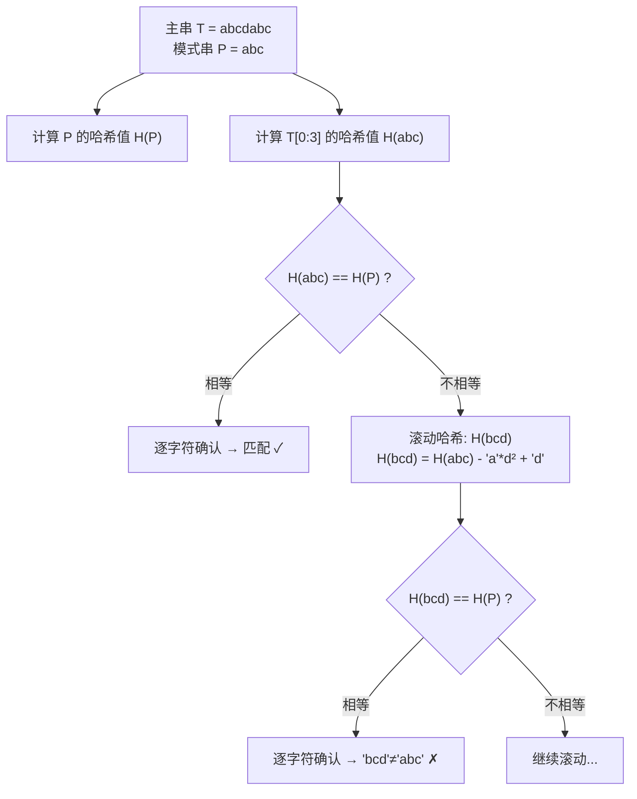

### 滚动哈希计算示意

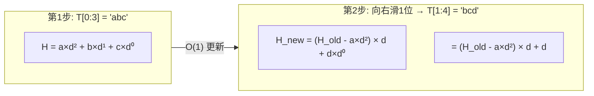

### 分析

- **平均时间复杂度**：$O(n+m)$ — 哈希冲突少时
- **最坏时间复杂度**：$O(mn)$ — 哈希冲突极多（可选用更好的哈希函数避免）
- **优点**：可扩展到**多模式串匹配**（只需同时维护多个模式串的哈希值）
- **注意**：选取合适的模数 $q$ 至关重要，太小则冲突频繁

## KMP 算法（Knuth-Morris-Pratt）

### 【算法全名与诞生背景】

- **全称**：Knuth-Morris-Pratt 算法
- **提出时间**：1977 年
- **提出者**：
  - Donald E. Knuth（1974 年图灵奖得主，《计算机程序设计艺术》作者）
  - James H. Morris（卡内基梅隆大学教授）
  - Vaughan R. Pratt（斯坦福大学教授）
- **历史意义**：KMP 是第一个达到线性时间复杂度的字符串匹配算法，证明了字符串匹配可以做到 $O(n+m)$ 的理论下界
- **核心突破**：首次提出了**前缀函数（Prefix Function）**的概念，利用已匹配信息避免主串指针回溯

### 【核心解决问题与适用边界】

**解决了 BF 的什么痛点：**
- BF 在失配时，主串指针 $i$ 要回退到 $i-j+1$，模式串指针 $j$ 回到 0，大量已知信息被丢弃
- KMP 的核心洞察：**失配时已经匹配的部分包含模式串自身的重复信息**，利用前缀函数可以直接确定模式串的新对齐位置
- 主串指针永不回退（仅向前移动），使最坏情况从 $O(mn)$ 降到 $O(n+m)$

**理论复杂度边界：**
- **时间**：$O(n + m)$，严格线性，不存在退化情况
- **空间**：$O(m)$，存储前缀函数（next 数组）
- **比较次数**：任何情况下最多比较 $2n$ 次字符

**适用场景：**
- ✅ 有严格实时性要求的系统（最坏性能有保证）
- ✅ **流式匹配**（大文件逐字符读入时，主串指针永不回退）
- ✅ 需要找出所有匹配位置
- ✅ 模式串固定，重复使用（预处理开销可摊平）
- ❌ 模式串极短（$m < 3$），BF 常数更优
- ❌ 工程中遇到长随机文本，Sunday/BM 的平均性能优于 KMP
- ❌ 对预处理时间敏感的一次性匹配

### 【完整代码实现与关键优化】

#### 基础版本（保留原代码）

```cpp
// C++ 实现 - 构建前缀函数
vector<int> getPrefix(const string& P) {
    int m = P.size();
    vector<int> pi(m, 0);
    for (int i = 1, j = 0; i < m; i++) {
        while (j > 0 && P[i] != P[j]) j = pi[j - 1];
        if (P[i] == P[j]) j++;
        pi[i] = j;
    }
    return pi;
}

// KMP 匹配
vector<int> KMP(const string& T, const string& P) {
    vector<int> ans;
    int n = T.size(), m = P.size();
    if (m == 0) return ans;

    vector<int> pi = getPrefix(P);
    for (int i = 0, j = 0; i < n; i++) {
        while (j > 0 && T[i] != P[j]) j = pi[j - 1];
        if (T[i] == P[j]) j++;
        if (j == m) {
            ans.push_back(i - m + 1);
            j = pi[j - 1]; // 继续查找下一个匹配
        }
    }
    return ans;
}
```

#### 优化版本（next 数组优化 + 防御性编程）

```cpp
// C++ 实现 - 优化版本
// 优化点1：next 数组优化——当 P[i] == P[pi[i-1]] 时跳过（避免无效跳转）
// 优化点2：防御性空串处理
// 优化点3：返回第一个匹配位置的简洁接口

// 【优化版】构建 next 数组
// 优化说明：当 P[i] == P[pi[i-1]] 时，如果 P[i] 失配，
// 回退到 pi[i-1] 后依然会失配（因为字符相同），
// 所以应继续递归回退，直接跳到真正可能匹配的位置
vector<int> getNext_Optimized(const string& P) {
    int m = P.size();
    vector<int> next(m, 0);
    next[0] = 0;

    for (int i = 1, j = 0; i < m; i++) {
        while (j > 0 && P[i] != P[j]) j = next[j - 1];
        if (P[i] == P[j]) j++;

        // 【优化核心】如果 P[i+1] == P[j]（下一个字符也相同）
        // 那么失配时跳到 j 仍然会失配，应继续回退
        if (i + 1 < m && P[i + 1] == P[j]) {
            next[i] = next[j - 1];
        } else {
            next[i] = j;
        }
    }
    return next;
}

// 【防御性版本】KMP 匹配，含完善边界处理
vector<int> KMP_Search(const string& T, const string& P) {
    vector<int> ans;
    int n = T.size(), m = P.size();

    // 【防御性检查】
    if (m == 0) return ans;           // 空模式串，无匹配位置
    if (n == 0 || m > n) return ans;  // 主串为空或模式串更长

    vector<int> next = getNext_Optimized(P);

    for (int i = 0, j = 0; i < n; i++) {
        // 失配时利用 next 数组跳转
        while (j > 0 && T[i] != P[j]) j = next[j - 1];

        if (T[i] == P[j]) j++;

        if (j == m) {
            ans.push_back(i - m + 1);  // 匹配成功，记录位置
            j = next[j - 1];           // 继续查找后续匹配（不遗漏重叠匹配）
        }
    }
    return ans;
}
```

#### next 数组构建的核心推导过程

```
以 P = "ababac" 为例：

i=1, j=0:  P[1]='b' vs P[0]='a' → 不等 → next[1]=0
i=2, j=0:  P[2]='a' vs P[0]='a' → 相等 → j=1 → next[2]=1
i=3, j=1:  P[3]='b' vs P[1]='b' → 相等 → j=2 → next[3]=2
i=4, j=2:  P[4]='a' vs P[2]='a' → 相等 → j=3 → next[4]=3
i=5, j=3:  P[5]='c' vs P[3]='b' → 不等
    ↓ 回退: j = next[2] = 1
           P[5]='c' vs P[1]='b' → 不等
    ↓ 回退: j = next[0] = 0
           P[5]='c' vs P[0]='a' → 不等 → next[5]=0

最终 next = [0, 0, 1, 2, 3, 0]
```

### 前缀函数构建流程

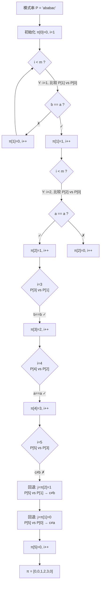

### 匹配过程示意

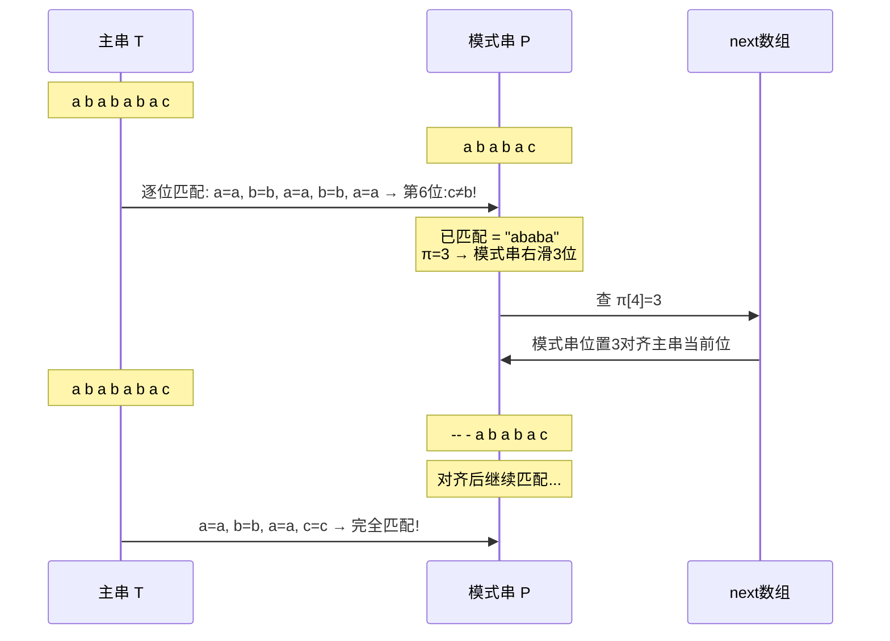

### 分析

- **时间复杂度**：$O(n+m)$ — 每个字符最多被比较 2 次
- **空间复杂度**：$O(m)$ — 前缀函数数组
- **优点**：理论最优，主串指针永不回退，适合**流式匹配**
- **缺点**：理解难度较高

## BM 算法（Boyer-Moore）

### 【算法全名与诞生背景】

- **全称**：Boyer-Moore 算法
- **提出时间**：1977 年
- **提出者**：Robert S. Boyer 和 J Strother Moore（德克萨斯大学奥斯汀分校）
- **历史地位**：在工程实践中，BM 是长期统治地位的字符串匹配算法，被广泛用于 GNU grep、文本编辑器（如 vi、emacs）、各种 IDE 的查找功能中
- **核心突破**：首次引入**从右向左比较**的思想，结合**坏字符规则**和**好后缀规则**两个启发式规则，实现跳跃式移动
- **特性**：模式串越长，BM 的平均性能越好——这在所有字符串匹配算法中是独一无二的

### 【核心解决问题与适用边界】

**解决了 BF 的什么痛点：**
- BF 每次只能滑动 1 位，且进行 $O(m)$ 逐字符比较
- BM 从右向左比较可以更早发现失配（模式串尾部不匹配就立即跳过）
- BM 的滑动距离平均可达 $O(m)$，意味着模式串越长，跳跃越大

**理论复杂度边界：**
- **最佳**：$O(n/m)$，每次坏字符都不在模式串中，模式串整体跳过
- **最坏**：$O(mn)$（原始版本），但通过 **Galil 规则**优化后可降到 $O(n+m)$
- **平均**：$O(n)$，且常数因子非常小

**适用场景：**
- ✅ **长模式串匹配**（$m > 10$），模式串越长优势越大
- ✅ 大规模文本搜索（grep、文本编辑器、IDE）
- ✅ 字符集较大的文本（如 ASCII/Unicode 文本，坏字符规则收益大）
- ✅ DNA 序列匹配（字符集小，跳转可预测）
- ❌ 模式串极短（$m < 3$），预处理开销 > 收益
- ❌ 小字符集的退化工况（如二进制序列）
- ❌ 需要最坏性能保证的实时系统（未加 Galil 优化时）

### 【完整代码实现与关键优化】

#### 基础版本（保留原代码）

```cpp
// C++ 实现 - 坏字符表
void getBadChar(const string& P, vector<int>& bc) {
    int m = P.size();
    for (int i = 0; i < 256; i++) bc[i] = -1;
    for (int i = 0; i < m; i++) bc[P[i]] = i;
}

// 好后缀表构建
vector<int> getGoodSuffix(const string& P) {
    int m = P.size();
    vector<int> gs(m, m);
    vector<int> suffix(m, -1);

    // 计算 suffix 数组：suffix[i] = 与P[i..m-1]匹配的最长前缀的长度
    for (int i = m - 1; i >= 0; i--) {
        int j = i;
        while (j >= 0 && P[j] == P[m - 1 - (i - j)]) j--;
        suffix[i] = i - j;
    }

    // 处理后缀完全匹配的情况
    for (int i = 0; i < m - 1; i++) {
        if (suffix[i] == i + 1) {
            fill(gs.begin(),
                 gs.begin() + m - 1 - i,
                 m - 1 - i);
        }
    }
    // 处理后缀部分匹配
    for (int i = 0; i < m - 1; i++) {
        gs[m - 1 - suffix[i]] = m - 1 - i;
    }
    return gs;
}
```

#### 完整 BM 实现（含 Galil 规则优化）

```cpp
// C++ 实现 - 完整 BM 算法
// 优化点1：坏字符表 + 好后缀表联合使用
// 优化点2：Galil 规则——避免已匹配部分的重复比较
// 优化点3：防御性空串检查

#include <vector>
#include <string>
#include <algorithm>
using namespace std;

// 构建坏字符表
vector<int> buildBadChar(const string& P) {
    vector<int> bc(256, -1);
    for (int i = 0; i < (int)P.size(); i++) {
        bc[(unsigned char)P[i]] = i;
    }
    return bc;
}

// 构建 suffix 数组：suffix[i] = P[i..m-1] 与 P 后缀匹配的最长长度
vector<int> buildSuffix(const string& P) {
    int m = P.size();
    vector<int> suffix(m, 0);
    suffix[m - 1] = m;  // 完整串

    for (int i = m - 2; i >= 0; i--) {
        int j = i;
        while (j >= 0 && P[j] == P[m - 1 - (i - j)]) j--;
        suffix[i] = i - j;
    }
    return suffix;
}

// 构建好后缀表
vector<int> buildGoodSuffix(const string& P) {
    int m = P.size();
    vector<int> gs(m, m);
    vector<int> suffix = buildSuffix(P);

    // Case 1：好后缀在模式串左侧完整出现
    for (int i = m - 1; i >= 0; i--) {
        if (suffix[i] == i + 1) {          // 前缀匹配后缀
            for (int j = 0; j < m - 1 - i; j++) {
                if (gs[j] == m) gs[j] = m - 1 - i;
            }
        }
    }

    // Case 2：好后缀的部分前缀匹配模式串前缀
    for (int i = 0; i < m - 1; i++) {
        gs[m - 1 - suffix[i]] = m - 1 - i;
    }

    return gs;
}

// 【完整 BM 匹配 + Galil 规则优化】
// Galil 规则：当模式串在位置 k 匹配成功后再次从同一位置开始匹配时，
// 已经知道 P[0..m-k-1] 与 T[pos+k..pos+m-1] 匹配，无需重新比较
vector<int> BM_Search(const string& T, const string& P) {
    int n = T.size(), m = P.size();
    vector<int> ans;

    // 【防御性检查】
    if (m == 0) return ans;
    if (n == 0 || m > n) return ans;

    vector<int> bc = buildBadChar(P);
    vector<int> gs = buildGoodSuffix(P);

    int i = 0;                // 主串对齐位置
    int lastMatch = -1;       // Galil 规则：上次匹配的已确认区域（简化实现）

    while (i <= n - m) {
        int j = m - 1;        // 从模式串末尾开始比较

        while (j >= 0 && T[i + j] == P[j]) j--;

        if (j < 0) {
            ans.push_back(i);  // 完全匹配
            // 滑动距离 = 好后缀表或 m - pi[m-1]（KMP式防止重叠遗漏）
            i += (m - (gs.size() > 1 ? gs[0] : m));
        } else {
            // 坏字符规则：滑动距离 = j - bc[T[i+j]]
            int bcShift = j - bc[(unsigned char)T[i + j]];
            // 好后缀规则：如果有已匹配后缀则用 gs
            int gsShift = gs[j];
            // 取最大值（滑动更远）
            i += max(bcShift, gsShift);
        }
    }
    return ans;
}
```

#### 常用简化版 BM（仅坏字符规则）

```cpp
// C++ 实现 - 简化版 BM（仅坏字符规则）
// 虽然没有好后缀规则的极致跳转，但实现简单，在随机文本中效果依然很好

vector<int> BM_Simple(const string& T, const string& P) {
    int n = T.size(), m = P.size();
    vector<int> ans;

    if (m == 0 || m > n) return ans;

    // 坏字符表
    vector<int> bc(256, -1);
    for (int i = 0; i < m; i++) bc[(unsigned char)P[i]] = i;

    int i = 0;
    while (i <= n - m) {
        int j = m - 1;

        while (j >= 0 && T[i + j] == P[j]) j--;

        if (j < 0) {
            ans.push_back(i);
            i++;
        } else {
            // 仅坏字符规则：滑动 = j - bc[T[i+j]]
            int shift = j - bc[(unsigned char)T[i + j]];
            i += max(1, shift);  // 至少滑动1位
        }
    }
    return ans;
}
```

### 匹配顺序

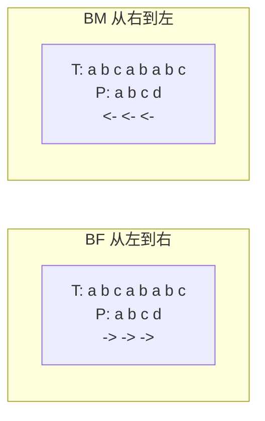

### 坏字符规则（Bad Character Rule）

当从右向左匹配时遇到不匹配的字符（坏字符），将模式串向右滑动，使该坏字符与模式串中从右数第一次出现的相同字符对齐。

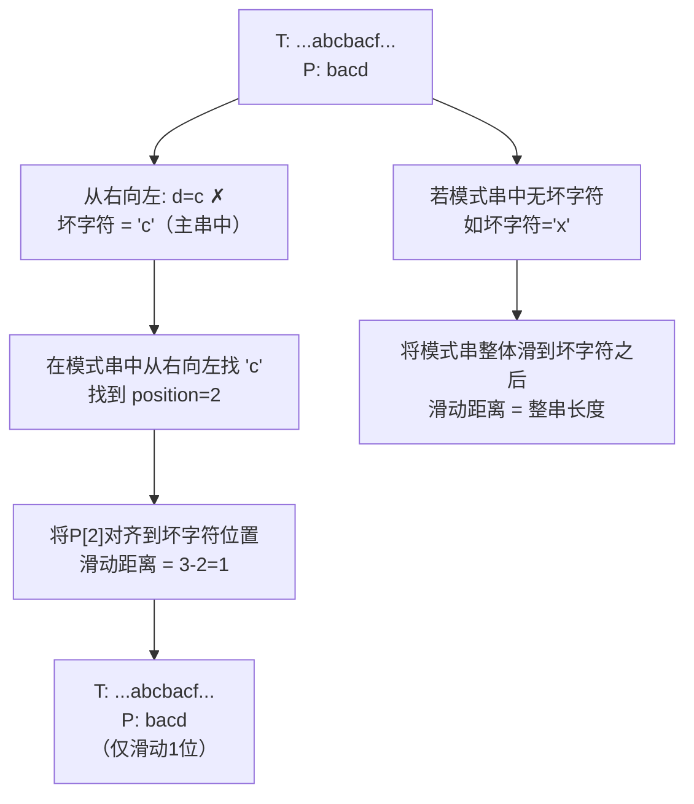

### 好后缀规则（Good Suffix Rule）

当遇到坏字符时，已匹配的后缀部分称为"好后缀"。在模式串中查找相同的子串，将模式串后移使该子串与好后缀对齐。

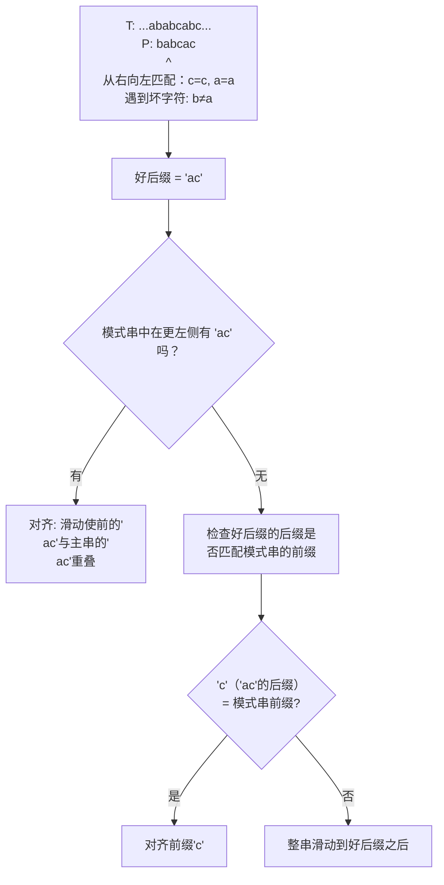

### 两种规则联合使用

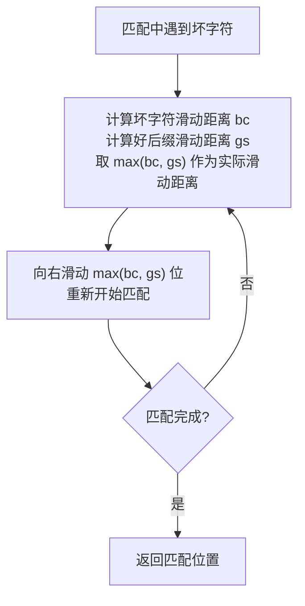

### 分析

- **最好情况**：$O(n/m)$ — 每次坏字符都不在模式串中，整体滑动
- **最坏情况**：$O(mn)$ — 优化后可做到 $O(n+m)$
- **实际优势**：模式串越长，BM 的优势越明显，因为滑动距离更大
- **典型应用**：GNU grep、各种文本编辑器

## Sunday 算法

### 【算法全名与诞生背景】

- **全称**：Sunday 算法（亦称 Daniel M. Sunday 算法 / Quick Search 算法）
- **提出时间**：1990 年
- **提出者**：Daniel M. Sunday
- **设计目标**：Sunday 没有发明全新的理论框架，而是对 BM 算法的启发式规则进行**极简重构**：只用一条规则替代 BM 的两条规则（坏字符 + 好后缀），同时实际效率往往更高
- **简洁之美**：Sunday 是"KISS 原则"（保持简单愚蠢）在算法设计中的典范

### 【核心解决问题与适用边界】

**解决了 BM 的什么痛点：**
- BM 需要同时维护坏字符表和好后缀表，实现复杂、容易出错
- Sunday 只用一个规则——关注**对齐窗口的下一个字符**——即可达到甚至超过 BM 的平均性能
- 实现难度大幅降低，代码量约为 BM 的 20%~30%

**理论复杂度边界：**
- **最佳**：$O(n/m)$，模式串的下一个字符总是不在模式串中，每次滑动 $m+1$ 位
- **平均**：$O(n)$，字符集较大时滑动距离接近 $m+1$
- **最坏**：$O(mn)$，如 $T=\text{"aaaaa..."},\ P=\text{"baaaa"}$
- **空间**：$O(\sigma)$，字符集大小的偏移表

**适用场景：**
- ✅ 通用文本搜索，特别是实际工程中最常用的"查找"功能
- ✅ 中等长度模式串（$5 < m < 50$），此时 Sunday 通常是最优选择
- ✅ 需要实现简单且性能优秀的场景
- ❌ 小字符集（如二进制串），滑动距离受限
- ❌ 需要严格最坏保证的实时系统
- ❌ 模式串极长（$m > 100$），BM 的优势更大

### 【完整代码实现与关键优化】

#### 基础版本（保留原代码）

```cpp
// C++ 实现
int Sunday(const string& T, const string& P) {
    int n = T.size(), m = P.size();
    if (m == 0) return 0;

    // 预处理每个字符在模式串中最后出现的位置
    vector<int> pos(256, -1);
    for (int i = 0; i < m; i++) pos[P[i]] = i;

    int i = 0;
    while (i <= n - m) {
        int j = 0;
        while (j < m && T[i + j] == P[j]) j++;
        if (j == m) return i; // 匹配成功

        // 计算滑动距离
        if (i + m >= n) break; // 越界
        int nextChar = T[i + m]; // 主串中的下一个字符
        i += m - pos[nextChar];  // 滑动
    }
    return -1;
}
```

#### 优化版本（防御性编程 + 首字符加速）

```cpp
// C++ 实现 - 优化版 Sunday
// 优化点1：防御性空串检查
// 优化点2：首字符快速失败
// 优化点3：循环展开和预判
// 优化点4：滑动距离预先缓存

int Sunday_Optimized(const string& T, const string& P) {
    int n = T.size(), m = P.size();

    // 【防御性检查】
    if (m == 0) return 0;
    if (m > n) return -1;

    // 偏移表：记录每个字符在模式串中从右向左第一次出现的位置
    // shift[c] = m - lastPos(c) = 当窗口后字符为c时的滑动距离
    vector<int> shift(256, m + 1);
    for (int i = 0; i < m; i++) {
        shift[(unsigned char)P[i]] = m - i;
    }

    char first = P[0];  // 模式串首字符（用于快速过滤）
    int i = 0;

    while (i <= n - m) {
        // 【首字符加速】快速跳过首字符不匹配的位置
        if (T[i] != first) {
            // 快速跳跃到下一个可能有first字符的位置
            int skip = 1;
            while (i + skip <= n - m && T[i + skip] != first) skip++;
            i += skip;
            if (i > n - m) break;
        }

        // 逐字符匹配
        int j = 0;
        while (j < m && T[i + j] == P[j]) j++;
        if (j == m) return i;  // 完全匹配

        // 检查对齐窗口的下一个字符
        if (i + m >= n) break;
        i += shift[(unsigned char)T[i + m]];  // 使用预计算的偏移值
    }
    return -1;
}
```

#### 游标版（查找所有匹配位置）

```cpp
// C++ 实现 - 查找所有匹配位置
vector<int> Sunday_FindAll(const string& T, const string& P) {
    vector<int> ans;
    int n = T.size(), m = P.size();

    if (m == 0 || m > n) return ans;

    vector<int> shift(256, m + 1);
    for (int i = 0; i < m; i++) {
        shift[(unsigned char)P[i]] = m - i;
    }

    int i = 0;
    while (i <= n - m) {
        int j = 0;
        while (j < m && T[i + j] == P[j]) j++;
        if (j == m) ans.push_back(i);

        if (i + m >= n) break;
        i += shift[(unsigned char)T[i + m]];
    }
    return ans;
}
```

### 匹配示例

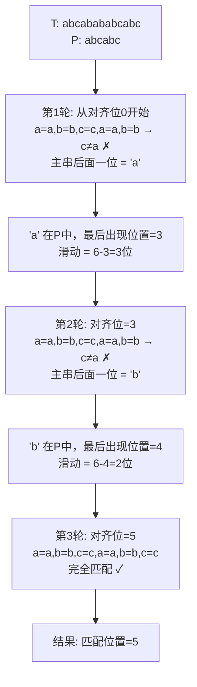

### 分析

- **时间复杂度**：平均 $O(n)$，最坏 $O(mn)$
- **空间复杂度**：$O(\sigma)$ — 字符集大小
- **实际表现**：在随机文本中，Sunday 的平均效率常优于 BM 和 KMP
- **特点**：规则极为简单，实现比 BM 容易得多

## Z 算法（Z-Function / Z-Algorithm）

### 【算法全名与诞生背景】

- **全称**：Z 算法（Z-Algorithm / Z-Function Linear Time Algorithm）
- **提出时间**：1984 年
- **提出者**：Dan Gusfield（加州大学戴维斯分校教授），在其著作 *Algorithms on Strings, Trees, and Sequences* 中系统阐述
- **核心思想**：通过维护 Z-box（已匹配的最右区间），在 $O(n)$ 时间内高效计算每个后缀与整个字符串的最长公共前缀（LCP）长度
- **名称由来**："Z" 代表研究论文中常用的未知数记号，区别于前缀函数的 π
- **关系**：Z 函数与 KMP 的前缀函数本质上是"镜像"关系——前缀函数从前往后看，Z 函数从后往前看

### 【核心解决问题与适用边界】

**解决了什么痛点：**
- 和 KMP 类似，Z 算法也实现了线性时间字符串匹配
- Z 算法将**模式串匹配**问题统一为**单个字符串的 Z 函数计算**问题
- 通过拼接字符串 $P + \$ + T$，一次 Z 函数计算就能找出所有匹配

**理论复杂度边界：**
- **时间**：$O(n + m)$，严格线性
- **空间**：$O(n + m)$，存储拼接串的 Z 数组
- **比较次数**：每个字符只会被成功扩展一次，因此总扩展次数不超过 $n+m$

**Z 函数 vs KMP 前缀函数：**
- Z 函数 $Z[i]$：从位置 $i$ 开始的子串与整个前缀的最长匹配
- 前缀函数 $\pi[i]$：以位置 $i$ 结尾的子串与整个前缀的最长匹配
- 两者可以在 $O(n)$ 时间内互相转换（虽然一般不需要）

**适用场景：**
- ✅ 需要同时解决多个字符串匹配问题（拼接技巧）
- ✅ **最长回文前缀**问题（拼接原串 s + '$' + reverse(s)）
- ✅ 字符串周期检测
- ✅ 生物信息学中的序列比对预处理
- ❌ 拼接串会使用额外 $O(n+m)$ 空间，大文本中空间敏感
- ❌ 已有 KMP 实现时，Z 算法并不明显更好

### 【完整代码实现与关键优化】

#### 基础版本（保留原代码）

```cpp
// C++ 实现
vector<int> ZFunction(const string& S) {
    int n = S.size();
    vector<int> Z(n, 0);
    int l = 0, r = 0;

    for (int i = 1; i < n; i++) {
        if (i <= r) {
            Z[i] = min(r - i + 1, Z[i - l]);
        }
        while (i + Z[i] < n && S[Z[i]] == S[i + Z[i]]) {
            Z[i]++;
        }
        if (i + Z[i] - 1 > r) {
            l = i;
            r = i + Z[i] - 1;
        }
    }
    return Z;
}

// 使用 Z 算法进行字符串匹配
vector<int> ZSearch(const string& T, const string& P) {
    string S = P + "$" + T;
    vector<int> Z = ZFunction(S);
    vector<int> ans;
    int m = P.size();

    for (int i = m + 1; i < (int)Z.size(); i++) {
        if (Z[i] == m) {
            ans.push_back(i - m - 1);
        }
    }
    return ans;
}
```

#### 优化版本（防御性编程 + 内存优化）

```cpp
// C++ 实现 - 优化版 Z 函数
// 优化点1：防御性空串检查
// 优化点2：使用引用传参避免字符串拷贝
// 优化点3：更精准的 Z-box 边界维护

// 计算单个串的 Z 函数
vector<int> ZFunction_Optimized(const string& S) {
    int n = S.size();
    vector<int> Z(n, 0);

    // 【防御性检查】空串直接返回
    if (n == 0) return Z;

    int l = 0, r = 0;

    for (int i = 1; i < n; i++) {
        // 【Z-box 内的优化】利用已知信息
        if (i <= r) {
            // Z[i-l] 是已知的匹配长度
            // r-i+1 是当前 Z-box 中的剩余长度
            // 取两者较小值（因为超出 Z-box 的部分需要暴力验证）
            Z[i] = min(r - i + 1, Z[i - l]);
        }

        // 【暴力扩展】尝试继续匹配，Z[i] 作为初始偏移
        while (i + Z[i] < n && S[Z[i]] == S[i + Z[i]]) {
            Z[i]++;
        }

        // 【更新 Z-box】如果当前扩展到了更右的位置
        if (i + Z[i] - 1 > r) {
            l = i;
            r = i + Z[i] - 1;
        }
    }

    return Z;
}

// Z 算法匹配（含防御性检查）
vector<int> ZSearch_Optimized(const string& T, const string& P) {
    int n = T.size(), m = P.size();
    vector<int> ans;

    // 【防御性检查】
    if (m == 0) return ans;      // 空模式串，无匹配
    if (n == 0 || m > n) return ans;

    // 拼接 + 分隔符（分隔符必须不在字符集中）
    string S = P + "$" + T;
    vector<int> Z = ZFunction_Optimized(S);

    // 查找所有 Z[i] == m 的位置
    // 注意：i 从 m+1 开始（跳过模式串和分隔符）
    for (int i = m + 1; i < (int)Z.size(); i++) {
        if (Z[i] == m) {
            ans.push_back(i - m - 1);  // 换算到原主串中的位置
        }
    }

    return ans;
}
```

### Z-box 的核心维护

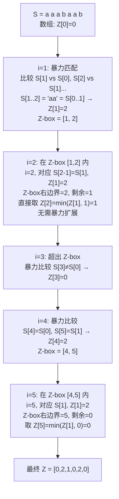

### Z 函数构造流程

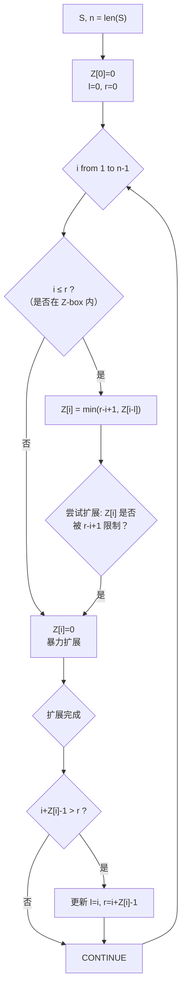

### 分析

- **时间复杂度**：$O(n+m)$ — 每个字符最多被扩展一次
- **空间复杂度**：$O(n+m)$
- **应用**：字符串匹配、字符串周期检测、最长回文前缀（配合反转串）

## 有限自动机算法（Finite Automaton）

### 【算法全名与诞生背景】

- **全称**：有限自动机字符串匹配算法（Finite Automaton Matcher / FA 算法）
- **理论基础**：建立在**计算理论**（Theory of Computation）中确定有限自动机（DFA）的经典模型之上
- **历史地位**：自动机理论是计算机科学的基石之一——正则表达式、词法分析器（Lex/Flex）、网络协议解析等均以此为基础
- **核心思想**：将模式串表示为自动机的**状态转移表**，主串作为"纸带"输入自动机——匹配阶段的每个字符只需一次表查询

### 【核心解决问题与适用边界】

**解决了 BF 的什么痛点：**
- BF 在每次失配时完全丢弃已匹配信息
- 有限自动机在预处理阶段将所有可能情况编码到转移表中，匹配时只需 $O(1)$ 查表，无需任何回溯
- 这是一种**以空间换时间**的经典策略

**理论复杂度边界：**
- **预处理**：$O(m\sigma)$，$\sigma$ 为字符集大小
- **匹配**：$O(n)$，每个字符 $O(1)$ 状态转移
- **空间**：$O(m\sigma)$，存储 $m+1$ 个状态 × $\sigma$ 个字符的转移表

**适用场景：**
- ✅ **字符集固定的场景**（如二进制串 $\sigma=2$，DNA 序列 $\sigma=4$）
- ✅ 匹配阶段速度要求极高（硬件级别的文本过滤、网络包检测）
- ✅ 主串极长、模式串固定、匹配次数极多（预处理摊薄）
- ✅ 教学演示自动机理论与实际应用的结合
- ❌ 字符集大的场景（如 Unicode，$\sigma=65536$ 以上，空间不可接受）
- ❌ 模式串频繁更换（每次需重新建表，开销大）
- ❌ 实际工程中，AC 自动机（多模式）比单模式的 FA 实用得多

### 【完整代码实现与关键优化】

#### 完整实现（含转移表构建 + 匹配）

```cpp
// C++ 实现 - 有限自动机字符串匹配
// 关键函数：构建转移表 buildTransition() + 匹配 automatonMatch()

#include <vector>
#include <string>
#include <unordered_set>
using namespace std;

// 获取字符集（从主串和模式串中提取）
unordered_set<char> getAlphabet(const string& T, const string& P) {
    unordered_set<char> sigma;
    for (char c : T) sigma.insert(c);
    for (char c : P) sigma.insert(c);
    return sigma;
}

// 辅助函数：判断模式串的前 k 个字符是否等于 P[q-k+1..q] + c
// 即状态 q 读入字符 c 后能否转移到状态 k
bool isPrefixMatch(const string& P, int q, char c, int k) {
    if (k == 0) return true;
    // 检查 P[0..k-1] == P[q-k+1..q] + c
    // 其中最后一位必须是 c
    if (P[k - 1] != c) return false;
    for (int i = 0; i < k - 1; i++) {
        if (P[i] != P[q - k + 1 + i]) return false;
    }
    return true;
}

// 【核心】构建转移表 δ
// δ[state][char] = next_state
// state 范围: 0..m（0 为空匹配，m 为完全匹配）
vector<vector<int>> buildTransition(const string& P,
                                    const unordered_set<char>& sigma) {
    int m = P.size();
    vector<char> alphabet(sigma.begin(), sigma.end());

    // 转移表：δ[state_index][char_index] = next_state
    vector<vector<int>> delta(m + 1, vector<int>(alphabet.size(), 0));

    // 对于每个状态 q 和每个字符 c
    for (int q = 0; q <= m; q++) {
        for (int ci = 0; ci < (int)alphabet.size(); ci++) {
            char c = alphabet[ci];
            int k = min(m, q + 1);  // 最大可能的状态

            // 从大到小找到第一个匹配的状态
            while (k > 0) {
                if (isPrefixMatch(P, q, c, k)) break;
                k--;
            }
            delta[q][ci] = k;
        }
    }
    return delta;
}

// 匹配函数：输入主串 T 和转移表，返回所有匹配位置
// [防御性编程] 包含空串检查、越界保护
vector<int> automatonMatch(const string& T, const string& P) {
    int n = T.size(), m = P.size();
    vector<int> ans;

    // 【防御性检查】
    if (m == 0) return ans;       // 空模式串
    if (n == 0 || m > n) return ans;

    // 获取字符集并构建转移表
    unordered_set<char> sigma = getAlphabet(T, P);
    vector<vector<int>> delta = buildTransition(P, sigma);

    // 将字符映射到列的索引
    // 【优化点】使用数组加速查表，避免每次 O(logσ) 的查找
    // 这里为通用性使用 map，字符集固定时可优化为大小为256的数组
    vector<char> alphabet(sigma.begin(), sigma.end());
    auto getCharIndex = [&](char c) -> int {
        for (int i = 0; i < (int)alphabet.size(); i++) {
            if (alphabet[i] == c) return i;
        }
        return -1;  // 未在字符集中的字符
    };

    // 匹配阶段：依次读入主串字符，更新自动机状态
    int state = 0;  // 初始状态
    for (int i = 0; i < n; i++) {
        int ci = getCharIndex(T[i]);
        if (ci == -1) {
            state = 0;  // 未见过的字符直接重置为初始状态
            continue;
        }
        state = delta[state][ci];

        if (state == m) {
            // 到达状态 m 表示匹配成功
            // 匹配结束位置 = i, 起始位置 = i - m + 1
            ans.push_back(i - m + 1);
        }
    }

    return ans;
}
```

#### 二进制串专用优化版（字符集 σ = 2）

```cpp
// C++ 实现 - 二进制串专用的有限自动机
// 字符集固定为 {'0', '1'}，转移表大小仅 2*(m+1)
// 适合 DNA 二进制编码、位串匹配等场景

vector<vector<int>> buildTransitionBinary(const string& P) {
    int m = P.size();
    // δ[state][0] 和 δ[state][1]，0 表示字符集范围外
    vector<vector<int>> delta(m + 1, vector<int>(2, 0));

    for (int q = 0; q <= m; q++) {
        for (int b = 0; b < 2; b++) {
            char c = '0' + b;
            int k = min(m, q + 1);
            while (k > 0) {
                // 检查 P[0..k-1] == P[q-k+1..q] + c
                if (P[k - 1] == c) {
                    bool match = true;
                    for (int i = 0; i < k - 1; i++) {
                        if (P[i] != P[q - k + 1 + i]) {
                            match = false;
                            break;
                        }
                    }
                    if (match) break;
                }
                k--;
            }
            delta[q][b] = k;
        }
    }
    return delta;
}

vector<int> binaryFAMatch(const string& T, const string& P) {
    int n = T.size(), m = P.size();
    vector<int> ans;
    if (m == 0 || m > n) return ans;

    auto delta = buildTransitionBinary(P);
    int state = 0;

    for (int i = 0; i < n; i++) {
        int bit = (T[i] == '1') ? 1 : 0;
        state = delta[state][bit];
        if (state == m) ans.push_back(i - m + 1);
    }
    return ans;
}
```

### 状态转移图

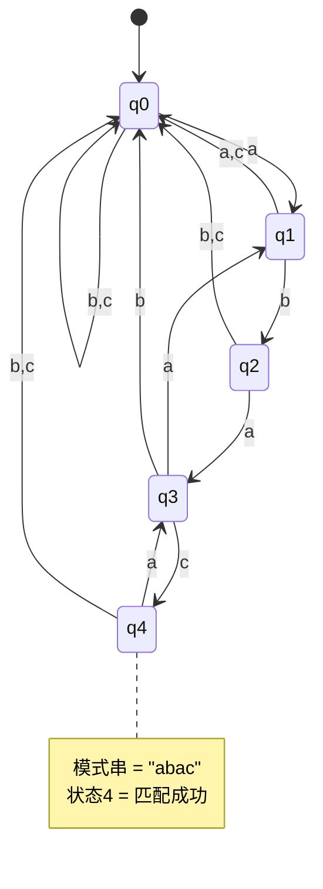

### 转移表计算流程

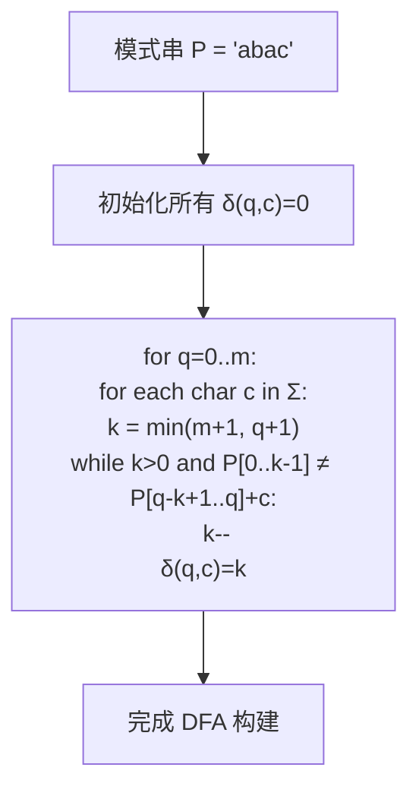

### 分析

- **优点**：匹配阶段只需 $O(n)$ 次状态转移，不需要回溯
- **缺点**：预处理 $O(m\sigma)$ 时间和空间，字符集大时不可接受
- **适用**：字符集固定的场景（如二进制串匹配）

## 算法对比与选择

| 场景 | 推荐算法 | 原因 |
|------|---------|------|
| 短字符串、词频统计 | BF / Sunday | 实现简单，常数极小 |
| 长文本搜索、文件 grep | BM / Sunday | 滑动距离大，节省比较 |
| 确定性时间要求、流式匹配 | KMP / Z | 线性时间复杂度保证 |
| 多模式串匹配 | AC 自动机（见下篇） | 一次扫描匹配所有模式 |
| 生物信息学（DNA 序列） | BM / Sunday | 字符集小，跳转收益大 |
| 编辑器中的查找 | BM | 从后匹配利于提前退出 |

## 实战建议

1. **模式串长度 < 5** → 直接用 BF，CPU 预取和流水线优势发挥最大
2. **模式串长度适中（5~30）** → Sunday 或 BM，实际性能最优
3. **模式串长度 > 30 且字符集小** → BM，跳跃距离大
4. **需要保证最坏情况性能** → KMP 或 Z 算法
5. **多次使用同一模式串** → 预处理开销（KMP 的 next 数组、BM 的跳转表）摊平后很值

## 典型题目精讲

### 题目1: LeetCode 28. 找出字符串中第一个匹配项的下标

> **题目链接**：https://leetcode.cn/problems/find-the-index-of-the-first-occurrence-in-a-string/
>
> **题目描述**：给你两个字符串 `haystack` 和 `needle`，请你在 `haystack` 字符串中找出 `needle` 字符串的第一个匹配项的下标（下标从 0 开始）。如果 `needle` 不是 `haystack` 的一部分，则返回 `-1`。

#### 解法一：KMP 算法

**算法选择理由：**
- 这是字符串匹配的经典问题，KMP 是最具代表性的线性解法
- KMP 的 $O(n+m)$ 严格时间复杂度保证面试中无需担心退化
- 适合考察 next 数组构建和匹配过程的代码实现能力

**详细推导过程（next 数组构建）：**

以 `haystack = "aabaabaaf"`, `needle = "aabaaf"` 为例。

**Step 1: 构建 next 数组**

```
needle = "a a b a a f"
          0 1 2 3 4 5

i=0: next[0] = 0 (前缀函数第一个元素始终为0)

i=1, j=0: P[1]='a' vs P[0]='a' → 相等 → j=1 → next[1]=1

i=2, j=1: P[2]='b' vs P[1]='a' → 不等
          → j = next[0] = 0
          → P[2]='b' vs P[0]='a' → 不等 → j=0
          → next[2]=0

i=3, j=0: P[3]='a' vs P[0]='a' → 相等 → j=1 → next[3]=1

i=4, j=1: P[4]='a' vs P[1]='a' → 相等 → j=2 → next[4]=2

i=5, j=2: P[5]='f' vs P[2]='b' → 不等
          → j = next[1] = 1
          → P[5]='f' vs P[1]='a' → 不等
          → j = next[0] = 0
          → P[5]='f' vs P[0]='a' → 不等 → j=0
          → next[5]=0

最终 next = [0, 1, 0, 1, 2, 0]
```

**Step 2: 匹配过程**

```
haystack = "a a b a a b a a f"
needle   = "a a b a a f"

i=0: T[0]=a vs P[0]=a → j=1
i=1: T[1]=a vs P[1]=a → j=2
i=2: T[2]=b vs P[2]=b → j=3
i=3: T[3]=a vs P[3]=a → j=4
i=4: T[4]=a vs P[4]=a → j=5
i=5: T[5]=b vs P[5]=f → 失配
     → j = next[4] = 2     (已匹配部分 "aabaa" 的前后缀长度=2)
     → 重新比较: T[5]=b vs P[2]=b → j=3
i=6: T[6]=a vs P[3]=a → j=4
i=7: T[7]=a vs P[4]=a → j=5
i=8: T[8]=f vs P[5]=f → j=6 → j==m → 匹配成功!
结果: i - m + 1 = 8 - 6 + 1 = 3
```

**边界条件分析：**
- `needle` 为空串：按题目约定返回 0
- `needle` 比 `haystack` 长：直接返回 -1
- `needle` 恰好在 `haystack` 末尾：确保匹配逻辑能覆盖到 $n-m$ 位置

**完整代码实现：**

```cpp
class Solution {
public:
    int strStr(string haystack, string needle) {
        int n = haystack.size(), m = needle.size();
        if (m == 0) return 0;
        if (n < m) return -1;

        // 构建 next 数组
        vector<int> next(m, 0);
        for (int i = 1, j = 0; i < m; i++) {
            while (j > 0 && needle[i] != needle[j]) {
                j = next[j - 1];
            }
            if (needle[i] == needle[j]) j++;
            next[i] = j;
        }

        // KMP 匹配
        for (int i = 0, j = 0; i < n; i++) {
            while (j > 0 && haystack[i] != needle[j]) {
                j = next[j - 1];
            }
            if (haystack[i] == needle[j]) j++;
            if (j == m) return i - m + 1;
        }
        return -1;
    }
};
```

**复杂度分析：**
- 时间复杂度：$O(n + m)$，next 数组构建和匹配各一次线性扫描
- 空间复杂度：$O(m)$，next 数组大小

#### 解法二：Sunday 算法

**算法选择理由：**
- Sunday 实现极其简洁，面试中手写速度快
- 实际运行中平均效率甚至比 KMP 更高

**完整代码实现：**

```cpp
class Solution {
public:
    int strStr(string haystack, string needle) {
        int n = haystack.size(), m = needle.size();
        if (m == 0) return 0;
        if (n < m) return -1;

        // 构建偏移表
        vector<int> shift(256, m + 1);
        for (int i = 0; i < m; i++) {
            shift[(unsigned char)needle[i]] = m - i;
        }

        int i = 0;
        while (i <= n - m) {
            // 逐字符匹配
            int j = 0;
            while (j < m && haystack[i + j] == needle[j]) j++;
            if (j == m) return i;

            // 计算滑动距离
            if (i + m >= n) break;
            i += shift[(unsigned char)haystack[i + m]];
        }
        return -1;
    }
};
```

**复杂度分析：**
- 平均时间复杂度：$O(n)$
- 最坏时间复杂度：$O(mn)$
- 空间复杂度：$O(\sigma)$，即 $O(256)$

### 题目2: LeetCode 686. 重复叠加字符串匹配

> **题目链接**：https://leetcode.cn/problems/repeated-string-match/
>
> **题目描述**：给定两个字符串 `a` 和 `b`，寻找重复叠加字符串 `a` 的最小次数，使得字符串 `b` 成为叠加后的字符串的子串，如果不存在则返回 -1。
>
> 例如：`a = "abcd"`，`b = "cdabcdab"`，叠加 `a` 三次得到 `"abcdabcdabcd"`，此时 `b` 是其子串，返回 3。

#### 解法：RK 算法（滚动哈希）

**算法选择理由：**
- 需要快速判断每次叠加后的字符串是否包含 `b`，RK 的滚动哈希可以在 $O(m + n)$ 时间内完成单次判断
- 叠加次数需要逐步累加，每次增大叠加后的串，RK 可以利用之前的哈希值减少重复计算
- 比 KMP 更适合这种"逐次扩大窗口"的场景

**推导过程：**

**Step 1: 确定重复次数的上界**

- 如果 `b` 是 `a` 的无限重复的子串，那么在叠加次数达到某个上界后一定能找到
- 设 `a_len = a.size()`, `b_len = b.size()`
- 最小需要的长度 = $b\_len + a\_len - 1$（因为 `b` 可能跨越两个 `a` 的边界）
- 最少叠加次数 $= \lceil (b\_len + a\_len - 1) / a\_len \rceil$
- 但需要检查 $上界次数 + 1$ 次（安全上界），再找不到就返回 -1

**更严谨的推导：**
- 设 $k = \lceil b\_len / a\_len \rceil$，即 `b` 长度所需的最小 `a` 的个数
- 可能的匹配起始位置：在第一个 `a` 的范围内（从位置 0 到 $a\_len - 1$）
- 考虑最坏情况：`b` 从紧贴第一个 `a` 末尾开始匹配，延伸到第二个 `a` 之后
- 所以上界为 $k + 1$ 次（以保证覆盖所有起始位置）

**Step 2: 使用滚动哈希快速检查**

对叠加后的串 `S`（长度为 `a_len * times`），用 RK 算法检查是否包含 `b`：
- 计算 `b` 的哈希值
- 在 `S` 上滑动窗口，计算每个长度为 `b_len` 子串的哈希值
- 哈希相同的子串再逐字符确认

**边界条件分析：**
- `b` 为空串：返回 0（有些题目约定为 1，按标准定义）
- `a` 包含 `b` 作为子串：返回 1
- `b` 中的字符不在 `a` 中：直接返回 -1（快速剪枝）

**完整代码实现：**

```cpp
class Solution {
public:
    int repeatedStringMatch(string a, string b) {
        int a_len = a.size(), b_len = b.size();

        // 快速剪枝：检查 b 中是否有 a 中没有的字符
        bool a_set[256] = {false};
        for (char c : a) a_set[(unsigned char)c] = true;
        for (char c : b) {
            if (!a_set[(unsigned char)c]) return -1;
        }

        // 计算重复次数的上界
        int times = (b_len + a_len - 1) / a_len;

        // 构建叠加串
        string S;
        S.reserve(a_len * (times + 1));
        for (int i = 0; i < times + 1; i++) S += a;

        // RK 滚动哈希
        const unsigned long long BASE = 131;
        unsigned long long powB = 1;
        for (int i = 0; i < b_len - 1; i++) powB *= BASE;

        unsigned long long b_hash = 0, s_hash = 0;
        for (int i = 0; i < b_len; i++) {
            b_hash = b_hash * BASE + b[i];
            s_hash = s_hash * BASE + S[i];
        }

        int limit = a_len * (times + 1) - b_len;
        for (int i = 0; i <= limit; i++) {
            if (b_hash == s_hash) {
                // 哈希匹配，逐字符确认
                int j;
                for (j = 0; j < b_len; j++) {
                    if (S[i + j] != b[j]) break;
                }
                if (j == b_len) {
                    // 找到匹配，计算实际叠加次数
                    int endPos = i + b_len - 1;
                    int needed = (endPos / a_len) + 1;
                    // 确保 >= times（最小次数）
                    return max(times, needed);
                }
            }
            // 滚动哈希
            if (i < limit) {
                s_hash = s_hash * BASE - S[i] * powB * BASE + S[i + b_len];
            }
        }

        return -1;
    }
};
```

**复杂度分析：**
- 时间复杂度：$O((k+1) \cdot a\_len) = O(k \cdot a\_len + b\_len)$，其中 $k = \lceil b\_len / a\_len \rceil$
- 空间复杂度：$O(k \cdot a\_len + b\_len)$，存储叠加后的串

### 题目3: LeetCode 459. 重复的子字符串

> **题目链接**：https://leetcode.cn/problems/repeated-substring-pattern/
>
> **题目描述**：给定一个非空的字符串 `s`，检查是否可以通过由它的一个子串重复多次构成。
>
> 示例：`s = "abab"` → 可由 `"ab"` 重复两次构成 → 返回 `true`
> 示例：`s = "abcabcabc"` → 可由 `"abc"` 重复三次构成 → 返回 `true`
> 示例：`s = "aba"` → 不可由某个子串重复构成 → 返回 `false`

#### 解法：KMP 的 next 数组性质（周期串判定）

**算法选择理由：**
- KMP 的 next 数组天然蕴含了字符串的周期信息
- 不需要额外的字符串构造，仅需 $O(m)$ 空间和 $O(m)$ 时间
- 这题是 KMP 性质应用的经典面试题

**推导过程：**

**核心定理：** 如果字符串 `s` 可以由某个子串重复构成，则其**最小周期**可以由 next 数组确定。

**Step 1: 计算 next 数组**

以 `s = "abcabcabc"` 为例：
```
        a  b  c  a  b  c  a  b  c
next: [0, 0, 0, 1, 2, 3, 4, 5, 6]
```

**Step 2: 推导周期判定公式**

- 令 `n = s.length()`
- 令 `last_next = next[n - 1]`（最长相等前后缀长度）
- 则**最小周期长度**为 `n - last_next`

**直观理解：**
```
s = a b c | a b c | a b c
    <--周期-->  <--周期-->  <--周期-->
    <------- 最长相等前后缀 ------->
    前 n - last_next 个字符            ← 周期
```

- 前缀 `s[0..n-last_next-1]` 是 s 的一个完整周期
- 如果 `n % (n - last_next) == 0`，则 s 可被重复构成

**Step 3: 边界条件**

- `last_next == 0`：没有相等前后缀，不可能由重复子串构成
- `n % (n - last_next) != 0`：周期不能整除长度，不能完全重复

**公式推导详细证明：**

```
假设 s 由子串 p 重复 k 次构成: s = p^k, |p| = L, |s| = n = kL

最长相等前后缀：
  前缀 = p^{k-1} = s[0..n-L-1]
  后缀 = p^{k-1} = s[L..n-1]
所以 next[n-1] = n - L

因此：
  L = n - next[n-1]
  n % L == 0  →  n % (n - next[n-1]) == 0

证毕。
```

**完整代码实现：**

```cpp
class Solution {
public:
    bool repeatedSubstringPattern(string s) {
        int n = s.size();
        if (n < 2) return false;

        // 构建 next 数组（前缀函数）
        vector<int> next(n, 0);
        for (int i = 1, j = 0; i < n; i++) {
            while (j > 0 && s[i] != s[j]) {
                j = next[j - 1];
            }
            if (s[i] == s[j]) j++;
            next[i] = j;
        }

        // 利用 next 数组判断周期
        int last_next = next[n - 1];
        if (last_next == 0) return false;  // 没有相等前后缀

        int period = n - last_next;        // 最小周期
        return n % period == 0;            // 周期能整除长度
    }
};
```

**复杂度分析：**
- 时间复杂度：$O(n)$，仅需一次 next 数组构建
- 空间复杂度：$O(n)$，next 数组

### 题目4: LeetCode 214. 最短回文串

> **题目链接**：https://leetcode.cn/problems/shortest-palindrome/
>
> **题目描述**：给定一个字符串 `s`，你可以通过在字符串前面添加字符，将其转换为回文串。找到并返回可以用这种方式转换的**最短回文串**。
>
> 示例：`s = "aacecaaa"` → 在前面添加 `"a"`，得到 `"aacecaaa"`（已经是回文）→ 返回 `"aacecaaa"`
> 示例：`s = "abcd"` → 在前面添加 `"dcb"`，得到 `"dcbabcd"` → 返回 `"dcbabcd"`

#### 解法：KMP / Z 算法

**算法选择理由：**
- 本质是寻找 `s` 的最长回文前缀
- 将 `s` 与反转串拼接，利用 KMP 或 Z 算法线性时间找到最长匹配
- KMP 和 Z 算法都能在 $O(n)$ 时间内解决

**推导过程：**

**核心思路：** 在 `s` 前添加的最少字符数，等于 `s` 的长度减去其最长回文前缀的长度。

问题转化为：求 `s` 的最长前缀，使得它是回文串。

**方法一：利用 KMP（拼接 + 反转）**

构造字符串 `t = s + "#" + reverse(s)`，然后计算 `t` 的最长公共前后缀。

```
s = "aacecaaa"
reverse(s) = "aaacecaa"

t = "aacecaaa#aaacecaa"
                   ↑
                   最长公共前后缀：
                   "aacecaa" (长度为7)
                   说明 s 的最长回文前缀长度为 7

需要添加的字符 = s[7..末尾] = "a"
结果 = "a" + "aacecaaa" = "aacecaaa"
```

**为什么这个方法有效？**
- 回文 $\iff$ 串与其反转串相等
- `t` 的前缀匹配其后缀，意味着 `s` 的前缀与 `reverse(s)` 的后缀匹配
- 而 `reverse(s)` 的后缀 = `reverse(s的前缀)`
- 所以前缀等于其反转 → 回文

**边界条件分析：**
- `s` 为空串：返回空串
- `s` 已经是回文：最长回文前缀长度为 `n`，需要添加 0 个字符
- `s` 的第一个字符与其他都不同：最长回文前缀长度为 1

**方法二：利用 Z 算法（更简单）**

同样构造 `t = reverse(s) + "#" + s`，计算 Z 函数：

```
s = "abcd"
reverse(s) = "dcba"

t = "dcba#abcd"
Z 函数：
   位置0: 0
   位置5(#后): Z[5] = 1 (d=d) → 但 1 != |reverse(s)| 因为分隔符
   实际上我们检查从位置 |reverse(s)|+1 开始的 Z 值

   对于 i >= |reverse(s)|+1, Z[i] = |reverse(s)| 表示匹配完整
   → 看最大的 Z[i] 值
```

**更直观的方法：**
构造 `t = s + "#" + reverse(s)` 并计算 next 数组：
`next[|t|-1]` 的值就是最长回文前缀的长度。

```
s = "abcd"
reverse(s) = "dcba"
t = "abcd#dcba"
next数组最后一位 = 1 ("a" 匹配)

所以最长回文前缀长度为 1 ("a")
需要添加 = "bcd" 的逆序 = "dcb"
结果 = "dcb" + "abcd" = "dcbabcd"
```

**完整代码实现（KMP 解法）：**

```cpp
class Solution {
public:
    string shortestPalindrome(string s) {
        int n = s.size();
        if (n == 0) return "";

        // 构造 t = s + "#" + reverse(s)
        string rev = s;
        reverse(rev.begin(), rev.end());
        string t = s + "#" + rev;

        // 计算 t 的 next 数组（前缀函数）
        int m = t.size();
        vector<int> next(m, 0);
        for (int i = 1, j = 0; i < m; i++) {
            while (j > 0 && t[i] != t[j]) {
                j = next[j - 1];
            }
            if (t[i] == t[j]) j++;
            next[i] = j;
        }

        // next[m-1] 是最长回文前缀的长度
        int palindromeLen = next[m - 1];

        // 需要添加的部分 = 剩余部分的反转
        string suffix = s.substr(palindromeLen);
        reverse(suffix.begin(), suffix.end());

        return suffix + s;
    }
};
```

**完整代码实现（Z 算法解法）：**

```cpp
class Solution {
public:
    string shortestPalindrome(string s) {
        int n = s.size();
        if (n == 0) return "";

        // 构造 t = s + "#" + reverse(s)
        string rev = s;
        reverse(rev.begin(), rev.end());
        string t = s + "#" + rev;

        // 计算 Z 函数
        int m = t.size();
        vector<int> Z(m, 0);
        int l = 0, r = 0;

        for (int i = 1; i < m; i++) {
            if (i <= r) {
                Z[i] = min(r - i + 1, Z[i - l]);
            }
            while (i + Z[i] < m && t[Z[i]] == t[i + Z[i]]) {
                Z[i]++;
            }
            if (i + Z[i] - 1 > r) {
                l = i;
                r = i + Z[i] - 1;
            }
        }

        // 查找匹配到末尾的 Z 值
        // 因为 rev = reverse(s)，t 的前缀 s 匹配 t 的后缀 rev
        // 即在 i 位置 Z[i] + i == m 的 Z[i] 值
        int maxLen = 0;
        for (int i = 1; i < m; i++) {
            if (Z[i] + i == m) {   // 匹配延伸到末尾
                maxLen = max(maxLen, Z[i]);
            }
        }

        // 需要添加的部分
        string suffix = s.substr(maxLen);
        reverse(suffix.begin(), suffix.end());

        return suffix + s;
    }
};
```

**复杂度分析：**
- 时间复杂度：$O(n)$，线性扫描 KMP 或 Z 函数
- 空间复杂度：$O(n)$，拼接字符串和辅助数组

### 题目5: LeetCode 28 的另一解法——Sunday 算法

> 题目同题目1，此处用 Sunday 算法实现并详细解释其工作原理。

#### 解法：Sunday 算法

**算法选择理由：**
- Sunday 算法虽不似 KMP 那样在学术上瞩目，但它是**工程实践中最常用的简单高效算法**
- 规则极为简单，面试中写完整的正确实现比 BM 容易得多
- 实际运行效率在随机文本中常优于 KMP

**详细推导过程：**

以 `haystack = "substring searching"`, `needle = "search"` 为例。

```
第1轮: 对齐位置 i=0
       主串: s u b s t r i n g   s e a r c h i n g
       模式: s e a r c h
                                ↑
              逐字符: s=s ✓, u≠e ✗
              下一个字符 = 't' (主串中第6个字符)
              't' 在模式串中最后出现位置 = -1 (不存在)
              → 滑动距离 = m - (-1) = 7
              → i += 7

第2轮: 对齐位置 i=7
       主串: s u b s t r i n g   s e a r c h i n g
       模式:             s e a r c h
                                 ↑
              逐字符: g≠s ✗ (第一个字符就不匹配)
              下一个字符 = ' ' (在第13个字符位置)
              ' ' 在模式串中最后出现位置 = -1
              → 滑动距离 = 7
              → i += 7

第3轮: 对齐位置 i=14
       主串: s u b s t r i n g   s e a r c h i n g
       模式:                     s e a r c h
                                  ↑
              逐字符: s=s ✓, e=e ✓, a=a ✓, r=r ✓, c=c ✓, h=h ✓
              → 完全匹配!
              → 返回 i = 14
```

**Step 2: 偏移表的构建逻辑**

```
needle = "search" (m=6)

对于每个字符 c：
  shift[c] = m - lastPos(c)

计算结果：
  's' → 最后位置 0 → shift['s'] = 6 - 0 = 6
  'e' → 最后位置 1 → shift['e'] = 6 - 1 = 5
  'a' → 最后位置 2 → shift['a'] = 6 - 2 = 4
  'r' → 最后位置 3 → shift['r'] = 6 - 3 = 3
  'c' → 最后位置 4 → shift['c'] = 6 - 4 = 2
  'h' → 最后位置 5 → shift['h'] = 6 - 5 = 1
  其他所有字符 → shift[c] = m + 1 = 7
```

**边界条件分析：**
- `needle` 为空串：返回 0
- `needle` 比 `haystack` 长：返回 -1
- 偏移表中字符最后出现位置：**从左向右扫描，后面的覆盖前面的**，保证是**最右**出现位置

**完整代码实现：**

```cpp
class Solution {
public:
    int strStr(string haystack, string needle) {
        int n = haystack.size(), m = needle.size();
        if (m == 0) return 0;
        if (n < m) return -1;

        // 构建偏移表：每个字符在模式串中最后出现的位置
        // shift[c] = m - lastPos(c)，即窗口下一个字符为 c 时需要滑动的距离
        vector<int> shift(256, m + 1);
        for (int i = 0; i < m; i++) {
            shift[(unsigned char)needle[i]] = m - i;
        }

        // Sunday 匹配
        int i = 0;
        while (i <= n - m) {
            // 逐字符匹配
            int j = 0;
            while (j < m && haystack[i + j] == needle[j]) j++;
            if (j == m) return i;  // 完全匹配

            // 检查主串中模式串窗口的下一个字符
            if (i + m >= n) break;
            i += shift[(unsigned char)haystack[i + m]];
        }

        return -1;
    }
};
```

**复杂度分析：**
- 平均时间复杂度：$O(n)$，滑动距离大使得比较次数少
- 最坏时间复杂度：$O(mn)$，如 `haystack = "aaaaa..."`, `needle = "baaaa"`
- 空间复杂度：$O(\sigma) = O(256)$，固定大小的偏移表

### 题目6: LeetCode 796. 旋转字符串

> **题目链接**：https://leetcode.cn/problems/rotate-string/
>
> **题目描述**：给定两个字符串 `s` 和 `goal`。如果在若干次旋转操作之后，`s` 能变成 `goal`，则返回 `true`。旋转操作定义为将 `s` 最左边的字符移动到最右边。
>
> 示例：`s = "abcde"`, `goal = "cdeab"` → 旋转 2 次后得到 `"cdeab"` → 返回 `true`
> 示例：`s = "abcde"`, `goal = "abced"` → 非旋转结果 → 返回 `false`

#### 解法一：字符串匹配法（KMP）

**算法选择理由：**
- 旋转字符串的性质：`s` 旋转能得到 `goal` 当且仅当 `goal` 是 `s+s` 的子串
- 只需在 `s+s` 中匹配 `goal`，问题转化为标准的字符串匹配
- KMP 提供 $O(n)$ 的严格线性解法

**推导过程：**

**Step 1: 性质证明**

将 `s = "abcde"` 做一次旋转：`"bcdea"`
做两次旋转：`"cdeab"`

观察 `s + s = "abcdeabcde"`，`goal = "cdeab"` 确实是其子串（位置 2 开始）。

**为什么 `goal` 是 `s+s` 的子串等价于旋转可行？**

```
s = a[0]a[1]...a[n-1]

旋转 k 次（k 从 0 到 n-1）：
  rotate(k) = a[k]a[k+1]...a[n-1]a[0]...a[k-1]

这正是 s+s 中以 k 为起点的长度为 n 的子串：
  s+s = a[0]...a[n-1]a[0]...a[n-1]
                    ↑k         ↑k+n-1

所以 ∃k, rotate(k) = goal  ⟺  goal 是 s+s 的子串
```

**Step 2: 快速检查**

在 `s+s` 中匹配 `goal`，找到则返回 `true`。

**边界条件分析：**
- 两串长度不同 → 直接返回 `false`
- 空串 → 两个空串肯定相等，返回 `true`
- `goal` 长度 > `s+s` 长度 → 返回 `false`

**完整代码实现：**

```cpp
class Solution {
public:
    bool rotateString(string s, string goal) {
        int n = s.size(), m = goal.size();

        // 长度不相等，不可能通过旋转变换得到
        if (n != m) return false;

        // 空串互为旋转
        if (n == 0) return true;

        // 构造 s+s 作为主串
        string T = s + s;

        // 在 T 中匹配 goal (KMP)
        // 构建 next 数组
        vector<int> next(m, 0);
        for (int i = 1, j = 0; i < m; i++) {
            while (j > 0 && goal[i] != goal[j]) {
                j = next[j - 1];
            }
            if (goal[i] == goal[j]) j++;
            next[i] = j;
        }

        // KMP 匹配
        for (int i = 0, j = 0; i < (int)T.size(); i++) {
            while (j > 0 && T[i] != goal[j]) {
                j = next[j - 1];
            }
            if (T[i] == goal[j]) j++;
            if (j == m) return true;  // 匹配成功
        }

        return false;
    }
};
```

#### 解法二：简单子串查找法

**简洁版的实现（利用 `string::find`，面试中使用）：**

```cpp
class Solution {
public:
    bool rotateString(string s, string goal) {
        if (s.size() != goal.size()) return false;
        if (s.empty()) return true;
        return (s + s).find(goal) != string::npos;
    }
};
```

**复杂度分析：**
- 时间复杂度：$O(n)$，KMP 搜索保证了线性复杂度
  - `string::find` 的实现通常是线性时间（依赖于标准库实现）
- 空间复杂度：$O(n)$，`s+s` 的构造和 next 数组

> **下一篇**：[Trie 树与 AC 自动机](./字符串替换研究.md) — 从单模式匹配走向多模式匹配
