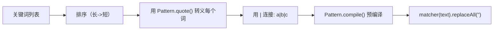
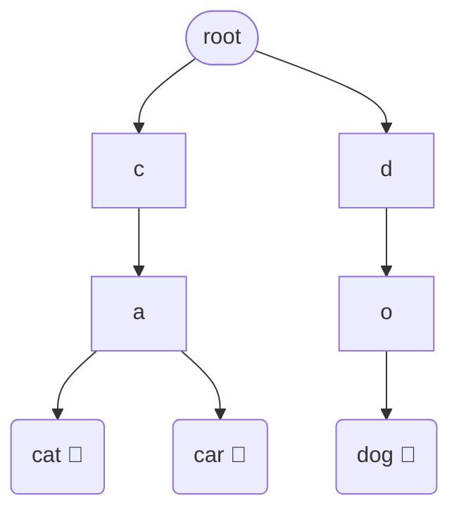
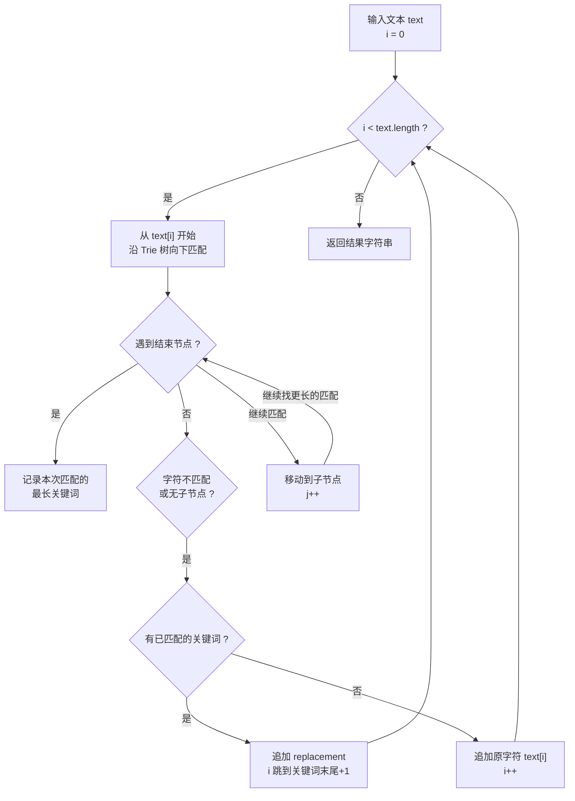
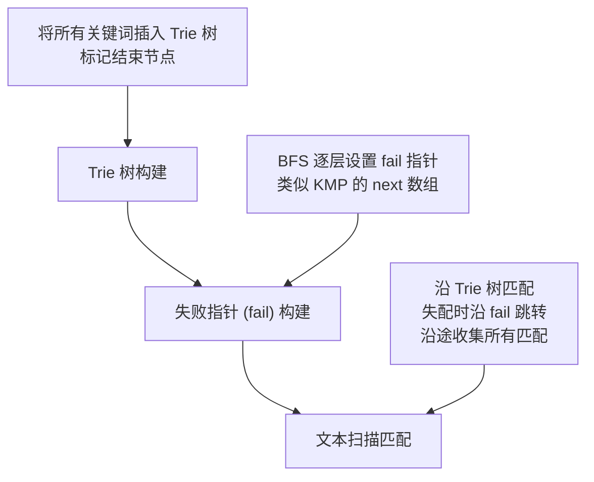
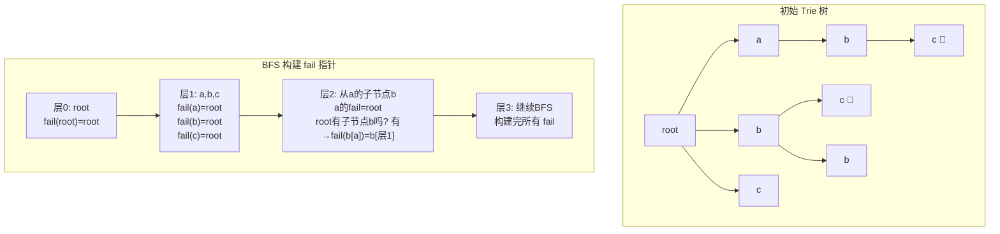
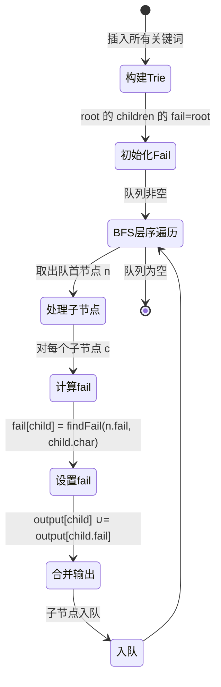
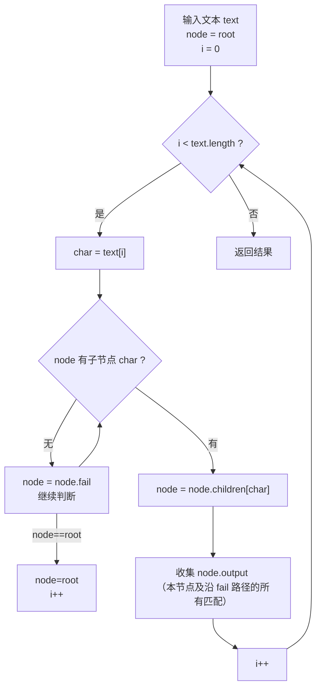
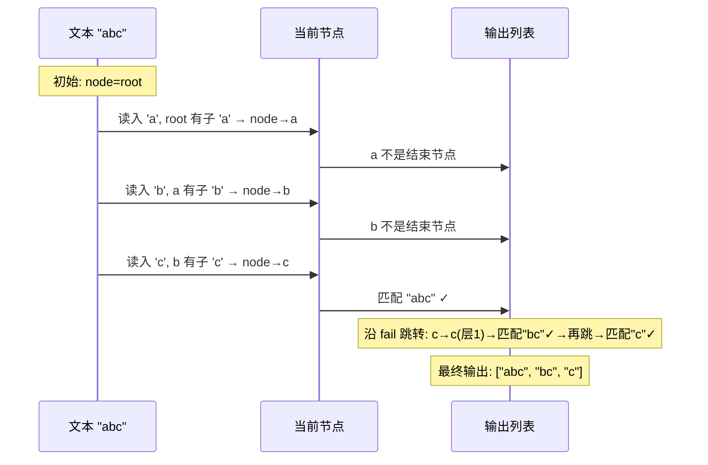
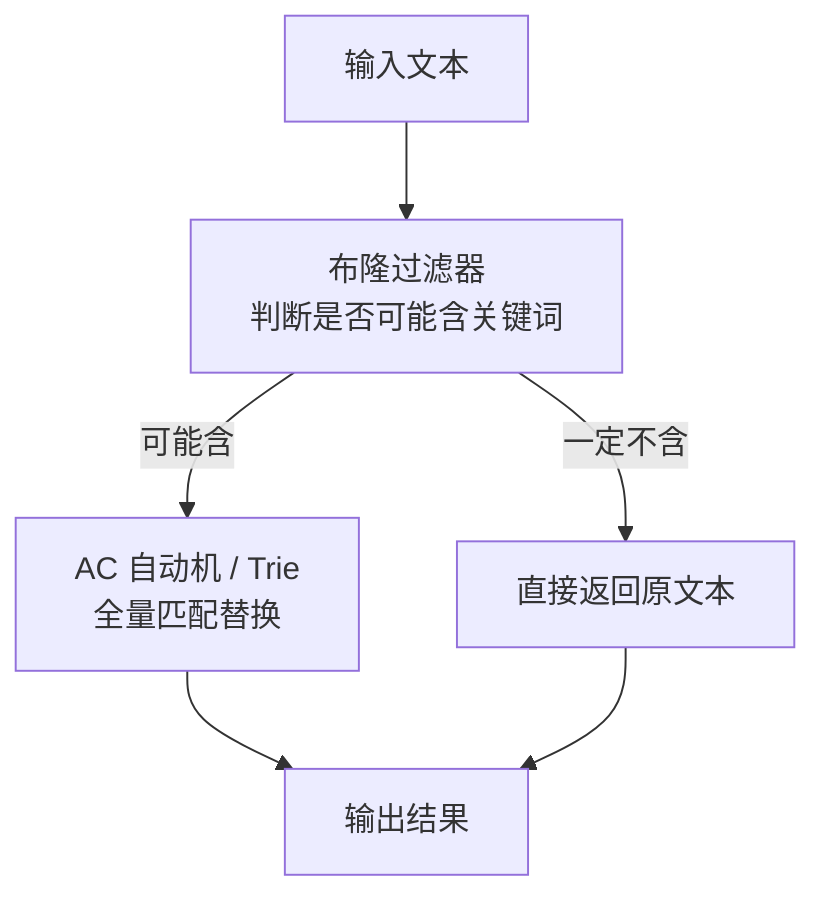
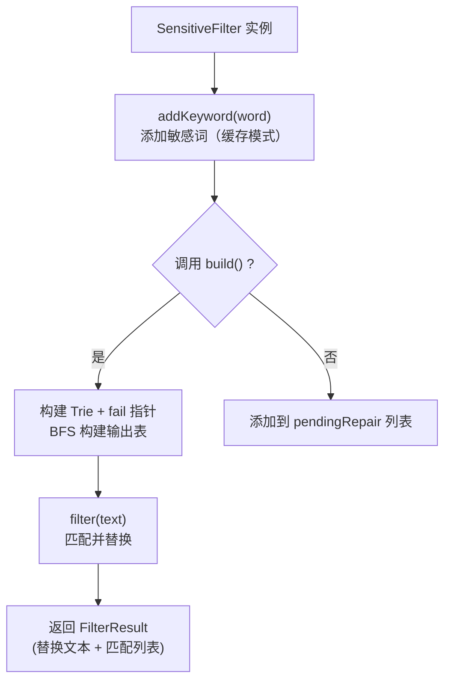

# 字符串替换研究：从暴力替换到 AC 自动机

> **核心思路**：字符串替换（如敏感词过滤）本质上是一种**多模式字符串匹配**问题——在一次扫描中查找并替换多个关键词。

## 问题背景

给定一组关键词（可多达数千个），需要在文本中将这些关键词全部替换掉。例如：

```
原文本: "HUAWEI Pura 70 Pro **国家补贴 500 元** 羽砂黑"
目标:   "HUAWEI Pura 70 Pro 羽砂黑"
关键词: "国家补贴 500 元"
```

**挑战**：当关键词量级从几个增长到上千个时，暴力方法的性能急剧下降（CPU 打满、不可用）。

## 方案演进

| 方案 | 实现方式 | 核心思想 | 适用场景 |
|------|---------|---------|---------|
| `String.replace()` | 暴力循环替换 | 逐个关键词查找替换 | 关键词 < 50 |
| 预编译正则 | 编译正则一次扫描 | 用 `|` 合并所有关键词 | 关键词 < 100 |
| **Trie 树** | 前缀树 + 贪心匹配 | 公共前缀压缩 | 关键词多、追求极致性能 |
| **AC 自动机** | Trie + 失败指针 | 一次扫描 + 失败跳转 | 关键词极多、功能需求全 |

## `String.replace()` 暴力方案

### 算法全名与诞生背景

**算法名称**：Brute-Force 字符串替换 / 暴力逐个替换

**诞生背景**：这是最朴素、最直观的字符串处理方式，天然存在于每个高级语言的标准库中。`String.replace()` 本身是 Java 1.0 就提供的基础 API，其底层实现是对给定字符串进行逐字符扫描匹配（原生调用 `String.indexOf()` 查找子串位置），本质上就是基于朴素模式匹配（Naive String Matching）的替换操作。

**核心思想**：将多模式匹配问题降级为多次单模式匹配——每次针对一个关键词调用 `replace()`，循环执行。

### 核心解决问题与适用边界

**解决了什么具体痛点**：
- 实现零成本：无需引入任何额外数据结构或第三方库
- 对于关键词数量极少（个位数）的场景，编码简单、直观、易维护
- 不改变原始文本结构（可以精确控制每次替换）

**适用场景**：
- 关键词数量 < 10，且文本长度不大
- 一次性脚本、快速原型验证
- 对性能不敏感的场景（如管理后台的简单过滤）

**不适用场景**：
- 关键词数量大（> 50）：每次替换都要完整扫描一遍文本，$O(k \times n)$ 复杂度爆炸
- 高频调用场景：如实时消息过滤、在线敏感词审查
- 需要精确统计匹配次数/位置的场景

**内存与性能的 trade-off**：
- **内存**：极低，仅需存储关键词列表，无额外数据结构开销
- **性能**：$O(k \times n)$，$k$ 为关键词数量，$n$ 为文本长度。每多一个关键词就多一次全文扫描
- **Trick**：用**长度降序**排序关键词可以避免短词被错误替换，但这只是逻辑正确性保障，不改善性能

### 原理

最直观的思路：依次对每个关键词调用 `replace()`。但注意需要**按关键词长度降序排序**，避免短关键词被错误替换的情况。

```
关键词: ["补贴", "国家补贴"]  （已按长度排序）

原文本: "国家补贴500元"
  round1: "国家补贴"  → "500元"       ← 先替换长的
  round2: "补贴" 已不在新文本中        ← 短的不会再触发
```

### 性能瓶颈

关键词为 $k$ 个时，每次 `replace()` 内部都是 $O(n)$ 的扫描，总复杂度 $O(k \times n)$。当 $k=1000$ 时，需要扫描 $1000 \times n$ 次，非常低效。

## 预编译正则方案

### 算法全名与诞生背景

**算法名称**：预编译正则表达式替换（Compiled Regex Alternation Substitution）

**诞生背景**：正则表达式引擎的基本概念最早由 Stephen Kleene 在 1956 年提出（正则集/正则语言）。现代正则引擎（Java 的 `java.util.regex`、PCRE、Perl 的 regex）在 1990 年代逐步成熟。利用正则的 `|`（交替操作符）可以将多个模式合并为"一次扫描"，底层由 DFA/NFA 引擎驱动。

**核心思想**：将多个独立的关键词用 `|` 连接成一个**单一的正则模式**，利用正则引擎内部的优化（如 Boyer-Moore 变体、自动机优化）一次性完成所有匹配和替换。

### 核心解决问题与适用边界

**解决了什么具体痛点**：
- 相比暴力法，避免了对每个关键词的多次全文扫描——正则引擎一次性扫描即可找到所有匹配
- 编码简洁：只需拼接正则 + 调用 `replaceAll()` 两行代码
- 自动处理特殊字符转义（`Pattern.quote()`）

**适用场景**：
- 关键词数量中等（< 100），且文本量不大
- 关键词中不含特别复杂的正则构造（纯文本关键词）
- 快速集成到已有系统中，无需引入额外依赖

**不适用场景**：
- 关键词数量巨大（> 500）：正则引擎的 NFA 回溯可能导致灾难性性能退化
- 关键词含大量相同前缀：正则引擎无法像 Trie 那样压缩共享前缀
- 需要精确的匹配位置/次数统计：`replaceAll()` 只做替换，不暴露匹配细节
- 需要动态增减关键词：每次修改都要重新编译正则

**内存与性能的 trade-off**：
- **内存**：较低。编译后的 `Pattern` 对象虽然比字符串列表略大，但远小于 Trie/AC 自动机
- **性能**：$O(n)$ 理论复杂度，但实际常数较大（正则引擎的前缀/回溯开销）。关键词数量增加时，性能呈非线性退化
- **编译开销**：`Pattern.compile()` 在正则复杂时有一定开销，但可跨线程复用 `Pattern` 对象

### 原理

将所有关键词用 `|` 连接成一个正则表达式，预编译后一次扫描完成替换：

```
关键词: ["abc", "bcd", "cde"]
正则:   \Qabc\E|\Qbcd\E|\Qcde\E   (Pattern.quote 防止特殊字符干扰)
```



### 关键代码

```java
String regex = keywords.stream()
    .map(Pattern::quote)        // 转义特殊字符
    .collect(Collectors.joining("|"));

Pattern pattern = Pattern.compile(regex);
return pattern.matcher(text).replaceAll("");
```

### 性能分析

- 比 `String.replace()` 好，因为正则引擎内部优化了一次性匹配
- 但关键词量很大时，正则引擎的 NFA 回溯可能带来性能隐患
- 适合关键词数量中等（< 100）的场景

## Trie 树（字典树 / 前缀树）

### 算法全名与诞生背景

**算法名称**：Trie（字典树 / 前缀树 / 数字搜索树）

**全称由来**："Trie" 一词来源于英文单词 **"retrieval"**（检索）的中间四个字母。1959 年由 **Edward Fredkin** 提出。

**历史背景**：
- 1959 年，Edward Fredkin 在论文中首次描述了 Trie 数据结构
- 1960 年代，Donald Knuth 在《计算机程序设计艺术》中推广了 Trie
- Trie 的读音有两种：读作 **/traɪ/**（同 try）或 **/triː/**（同 tree），社群更倾向于 /traɪ/ 以区别于 tree

**核心思想**：利用字符串之间的**公共前缀**来减少不必要的比较。Trie 的本质是一个 $\sigma$ 叉树（$\sigma$ 为字符集大小），从根到叶子节点的路径代表一个字符串。

### 核心解决问题与适用边界

**解决了什么具体痛点**：
- **前缀共享**：多个关键词共享公共前缀时，Trie 只存储一份前缀副本（"cat" 和 "car" 共享 "ca"），极大减少存储和比较
- **单次扫描匹配**：扫描文本时，每个字符在 Trie 中的查找是 $O(1)$（若用数组/HashMap），不会因为关键词数量增加而退化
- **最长匹配**：可以方便地实现"最长关键词优先"的贪心策略

**适用场景**：
- 关键词数量多且共享大量公共前缀（如英语单词集合、拼音/汉字前缀）
- 需要频繁执行替换/匹配操作，且构建一次后查询多次
- 对延迟敏感的场景：Trie 查询延迟稳定，不受关键词数量影响
- IP 路由表查找、自动补全/拼写检查、字典查找

**不适用场景**：
- 关键词无公共前缀：Trie 的压缩优势消失，退化为链表
- 关键词动态高频增删：Trie 的插入操作在平衡性和并发方面不如哈希表
- 字符集极大（如 Unicode 全字符集）：使用 HashMap 版本的 Trie 内存开销大
- 需要同时匹配重叠的关键词（如 "ab" 和 "bc" 在 "abc" 中）：Trie 纯前缀模式难以处理这种后缀重叠

**内存与性能的 trade-off**：
- **内存**：$O(m \times \sigma)$，$m$ 为关键词总字符数，$\sigma$ 为字符集大小
  - HashMap 实现：每个节点额外存储 HashMap 对象开销（~72 bytes/节点）
  - 数组实现：若字符集为 26 个小写字母，每个节点 26 × 引用（4-8 bytes/引用）= 104-208 bytes，对于稀疏 Trie 浪费严重
  - **优化方向**：对密集前缀使用数组，对稀疏分支使用 HashMap（混合策略）
- **性能**：
  - 构建：$O(m)$，$m$ 为所有关键词总长度
  - 匹配：$O(n)$，$n$ 为文本长度，每个字符最多访问一次
  - HashMap 查找 $O(1)$ 均摊，数组索引 $O(1)$ 严格

### 原理

Trie 树是一种 **多叉树结构**，所有关键词共享公共前缀，极大减少重复比较：

```
关键词: "cat", "car", "dog"

                 (root)
                /      \
              c          d
              |          |
              a          o
             / \         |
            t   r        g
          (cat)(car)    (dog)
```

### Trie 树的结构



> 🏁 标记表示单词结束节点。从根到某个 🏁 节点的路径构成一个完整的关键词。

### 替换算法流程



### 贪心最长匹配策略

```
文本: "this cat is carrying a car"
关键词: ["cat", "car", "carry", "carrying"]

匹配过程：
  "cat" → 匹配 "cat" ✓ → 替换
  "car" → 继续 → "carr" → 继续 → "carry" → 继续 → "carrying" → 取最长的
```

**关键设计**：在匹配过程中不立即回退，而是**继续向下尽量延伸**，记录遇到的最后一个单词结束节点，保证**最长关键词优先**。

### 完整 Java 实现

```java
public class TrieKeywordReplacer {

    static class TrieNode {
        Map<Character, TrieNode> children = new HashMap<>();
        boolean isEndOfWord;
    }

    static class Trie {
        private TrieNode root = new TrieNode();

        public synchronized void insert(String word) {
            TrieNode node = root;
            for (char c : word.toCharArray()) {
                node = node.children.computeIfAbsent(c, k -> new TrieNode());
            }
            node.isEndOfWord = true;
        }

        public String replaceKeywords(String text, String replacement) {
            StringBuilder result = new StringBuilder();
            int i = 0;
            while (i < text.length()) {
                TrieNode node = root;
                int j = i;
                int endIndex = -1;

                // 尝试延伸匹配
                while (j < text.length()
                       && node.children.containsKey(text.charAt(j))) {
                    node = node.children.get(text.charAt(j));
                    if (node.isEndOfWord) {
                        endIndex = j;      // 记录最长匹配的结束位置
                    }
                    j++;
                }

                if (endIndex != -1) {
                    result.append(replacement);   // 替换
                    i = endIndex + 1;             // 跳过已匹配部分
                } else {
                    result.append(text.charAt(i)); // 原样保留
                    i++;
                }
            }
            return result.toString();
        }
    }
}
```

### 完整代码实现与关键优化

#### 优化一：非递归插入（避免递归调用栈开销）

上文的 `insert()` 已是非递归实现（循环遍历单词字符），这是 Trie 插入的标准非递归写法。

#### 优化二：用数组替代 HashMap（仅限小字符集）

当字符集已知且较小（如仅包含小写英文字母 26 个），用固定长度数组替代 HashMap 可大幅提升性能：

```java
/**
 * 数组版本 Trie 节点 —— 仅适用于小写英文字母
 * 优化点：用 size=26 的数组替代 HashMap，省去 hash 计算和装箱开销
 * 适用：字符集确定且较小（26/52/128）
 */
static class ArrayTrieNode {
    // 优化点：固定数组 vs HashMap
    // HashMap: 每次 get/put 需要 hash 计算 + 链表/红黑树查找
    // 数组:   O(1) 直接索引，无装箱拆箱开销
    private static final int ALPHABET_SIZE = 26;
    ArrayTrieNode[] children = new ArrayTrieNode[ALPHABET_SIZE];
    boolean isEndOfWord;

    // 优化点：预分配内存，避免 LinkedHashMap 的额外元数据
    // 对于 26 个字符的数组，每个节点 26×8=208 bytes（64位引用）
    // 相比 HashMap 的每个 Entry 约 32 bytes + 数组负载，大体相当
    // 但数组访问比 HashMap.get() 快 2-3 倍
}

public class ArrayTrie {
    private ArrayTrieNode root = new ArrayTrieNode();

    /**
     * 插入关键词（非递归）
     * 优化点：用 char - 'a' 直接映射到数组索引，避免 char → Character 装箱
     */
    public void insert(String word) {
        ArrayTrieNode node = root;
        for (int i = 0; i < word.length(); i++) {
            int idx = word.charAt(i) - 'a';
            // 优化点：条件检查范围避免越界（生产环境可用 assert）
            if (idx < 0 || idx >= ArrayTrieNode.ALPHABET_SIZE) {
                throw new IllegalArgumentException("仅支持小写字母, 非法字符: " + word.charAt(i));
            }
            if (node.children[idx] == null) {
                node.children[idx] = new ArrayTrieNode();
            }
            node = node.children[idx];
        }
        node.isEndOfWord = true;
    }

    /**
     * 替换关键词
     * 优化点：用 if-null 判断替代 HashMap.containsKey() 的两次查找
     */
    public String replaceKeywords(String text, String replacement) {
        StringBuilder result = new StringBuilder();
        int i = 0;
        while (i < text.length()) {
            ArrayTrieNode node = root;
            int j = i;
            int endIndex = -1;

            while (j < text.length()) {
                int idx = text.charAt(j) - 'a';
                // 优化点：一次数组访问代替两次 HashMap 操作
                if (idx < 0 || idx >= ArrayTrieNode.ALPHABET_SIZE
                    || node.children[idx] == null) {
                    break;
                }
                node = node.children[idx];
                if (node.isEndOfWord) {
                    endIndex = j;  // 记录最长匹配
                }
                j++;
            }

            if (endIndex != -1) {
                result.append(replacement);
                i = endIndex + 1;
            } else {
                result.append(text.charAt(i));
                i++;
            }
        }
        return result.toString();
    }
}
```

> **优化原理**：`HashMap.get()` 的时间复杂度虽然是 $O(1)$ 均摊，但实际常数开销很大——需要计算 hashCode、定位桶、equals 比较。而数组索引 `children[idx]` 是一个 CPU 级别的单条指令（内存偏移量计算），快 2-3 倍。在大量匹配操作中，这个差异被放大。

#### 优化三：布隆过滤器前置过滤（完整实现思路）

当绝大多数文本不含任何关键词时，可用布隆过滤器（Bloom Filter）做快速判定，避免不必要的 Trie 匹配：

```java
import java.util.BitSet;

/**
 * 布隆过滤器 + Trie 的两级过滤架构
 *
 * 设计思路：
 * 1. 第一级（布隆过滤器）：快速判断文本"可能"包含关键词 → O(k) 哈希
 * 2. 第二级（Trie/AC自动机）：精确匹配替换
 *
 * 适用场景：> 90% 的输入文本不含任何关键词（如正常聊天消息过滤）
 * 效果：可过滤掉 90%+ 的无关键词文本，仅对"可疑"文本做精确匹配
 */
public class BloomFilterTrieReplacer {

    static class BloomFilter {
        private BitSet bitset;
        private int bitSize;
        private int hashCount;

        /**
         * @param n 关键词数量
         * @param falsePositiveRate 期望误判率（如 0.01 = 1%）
         */
        public BloomFilter(int n, double falsePositiveRate) {
            // 计算最优位数组大小：m = -n * ln(p) / (ln2)^2
            this.bitSize = (int) (-n * Math.log(falsePositiveRate) / (Math.log(2) * Math.log(2)));
            this.hashCount = (int) ((double) bitSize / n * Math.log(2));
            this.bitset = new BitSet(bitSize);
        }

        /**
         * 使用多个哈希函数（这里用 MurmurHash 的变体 + 不同种子）
         * 优化点：用一个基础 hash 派生多个 hash，避免多次计算
         */
        public void add(String word) {
            int hash1 = word.hashCode();
            int hash2 = hash1 >>> 16;
            for (int i = 0; i < hashCount; i++) {
                // 优化点：double hash 技术，避免计算 k 次完整 hash
                int combined = hash1 + i * hash2;
                // 确保非负
                if (combined < 0) combined = ~combined;
                bitset.set(combined % bitSize);
            }
        }

        /**
         * 判断文本"可能"包含关键词
         * @return false = 一定不含（不会漏判）；true = 可能含（小概率误判）
         */
        public boolean mightContain(String text) {
            // 优化点：对文本所有字符的子串做快速检查太贵
            // 实际应用：对全文文本提取所有可能的词作为特征
            // 简化版：以文本的 hash 作为"文本块特征"判定
            int hash1 = text.hashCode();
            int hash2 = hash1 >>> 16;
            for (int i = 0; i < hashCount; i++) {
                int combined = hash1 + i * hash2;
                if (combined < 0) combined = ~combined;
                if (!bitset.get(combined % bitSize)) {
                    return false; // 一定不含
                }
            }
            return true; // 可能含（有误判概率）
        }
    }

    // 示例：两级过滤
    public static class TwoStageKeywordFilter {
        private BloomFilter bloomFilter;
        private TrieKeywordReplacer.Trie exactMatcher;

        public String filter(String text) {
            // 第一级：布隆过滤器快速过滤
            if (!bloomFilter.mightContain(text)) {
                return text;  // 一定不含关键词，直接返回
            }
            // 第二级：精确匹配替换
            return exactMatcher.replaceKeywords(text, "***");
        }
    }
}
```

> **布隆过滤器关键性质**：
> - **无漏判（No False Negative）**：如果文本确实含有关键词，布隆过滤器**保证**返回 true
> - **有误判（False Positive）**：可能把不含关键词的文本误判为"可能含"，概率由 $p$ 控制
> - 误判率的代价：少量不含关键词的文本"误入"第二级做精确匹配，代价可接受
> - 当 $p = 1\%$ 时，可过滤掉 99% 的无关键词文本

### 性能分析

- **构建时间**：$O(m)$，$m$ 为所有关键词总长度
- **匹配时间**：$O(n)$，$n$ 为文本长度，每个字符最多被访问一次
- **空间**：$O(m \times \sigma)$，$\sigma$ 为字符集大小
- **数组 vs HashMap 对比**：
  - 小字符集（26/52）：数组快 2-3 倍，内存略多
  - 大字符集（Unicode）：HashMap 更灵活，内存效率更高

## AC 自动机（Aho-Corasick）

### 算法全名与诞生背景

**算法全称**：Aho–Corasick 自动机（Aho–Corasick Automaton）
**别名**：AC 自动机

**诞生背景**：
- **1975 年**，AT&T 贝尔实验室的 **Alfred V. Aho** 和 **Margaret J. Corasick** 在期刊《Communications of the ACM》上发表了题为 **《Efficient String Matching: An Aid to Bibliographic Search》** 的论文
- 论文动机：**书目检索**（Bibliographic Search）——大型文献数据库中需要同时查找数百个关键词（如作者名、主题词），暴力方法效率极低
- 贡献：首次将 **Trie 树**与 **KMP 算法的失败跳转思想**结合，提出了一个能在 $O(n)$ 时间内完成多模式串匹配的线性算法

**划时代意义**：
- 这是多模式字符串匹配领域**第一个线性时间算法**
- 被广泛应用于：网络入侵检测（Snort）、病毒扫描（ClamAV）、敏感词过滤、全文检索、生物信息学（DNA 序列匹配）
- Margaret J. Corasick 是计算机科学史上少数几位重要的女性算法研究者之一

### 核心解决问题与适用边界

**解决了什么具体痛点**：
- **多模式同时匹配**：Trie 树要求每次匹配从根重新开始，而 AC 自动机通过失败指针可以在失配后"原地跳转"继续匹配，**实现真正的单次扫描匹配所有关键词**
- **重叠匹配**：可以同时检测重叠关键模式（如 "abc" 和 "bc" 在 "abc" 中都能匹配到）
- **匹配位置精确记录**：能记录每个关键词的起始位置和结束位置，用于统计或高亮

**适用场景**：
- 关键词极多（> 1000）且需要高通量处理的场景
- 需要同时检测重叠模式（如 "ab"、"bc" 和 "abc" 全部匹配）
- 需要记录精确匹配位置的场景（如高亮、统计、审计）
- 生产环境敏感词过滤、入侵检测系统（IDS/IPS）
- DNA 序列中的多模式搜索

**不适用场景**：
- 关键词极少且文本极短：为构建自动机的开销不值得
- 只需简单替换，无需位置信息：Trie 树更轻量
- 关键词动态高频变化：每次增删关键词都需要重建失败指针（$O(m)$）

**内存与性能的 trade-off**：
- **内存**：$O(m \times \sigma)$ + 每个节点额外存储 fail 指针和输出列表。比 Trie 多出约 30-50% 的内存开销
- **构建时间**：$O(m)$，含 Trie 构建 + BFS 构建 fail 指针
- **匹配时间**：$O(n + \text{matches})$，$n$ 为文本长度，matches 为总匹配次数
- **核心优势**：匹配过程中每个字符的"跳跃"次数均摊 $O(1)$，不会因为关键词数量增加而退化

AC 自动机结合了 **Trie 树的前缀匹配**能力和 **KMP 的失败跳转**思想，能够在**单次文本扫描**中匹配所有关键词。

### AC 自动机的三部曲



### Trie 树构建

与上述 Trie 树完全相同，每个节点额外存储一个 `fail` 指针和一个输出列表。

### 失败指针（Fail Pointer）构建

**失败指针指向**：当在当前节点匹配失败时，应该跳转到哪个节点继续匹配。它与 KMP 的 next 数组本质相同，但推广到了多叉树。



#### 详细构建过程

```
构建规则：
  fail[child] = 沿着 fail[parent] 路径,
                找是否有与 child 相同字符的子节点
                有 → 指向该子节点
                无 → 指向 root

示例: 关键词 ["abc", "bc", "c"]

1. 构建 Trie:
   root → a → b → c (abc)
   root → b → c (bc)
   root → c (c)

2. BFS 构建 fail 指针：
   - a 的 fail = root (root 没有 'a' 以外的子节点)
   - b 的 fail = root
   - c 的 fail = root

   - b[a] (a 的子节点 b):
     fail(a)=root, root 有子节点 b 吗? 有 → fail(b[a]) = b[层1]

   - c[b[a]] (b[a] 的子节点 c):
     fail(b[a])=b[层1], b[层1] 有子节点 c 吗? 有 → fail(c) = c[层1]

   - 此时 c[b[a]] 的输出包含 "abc" 和 "bc"

   - c[b] (b[层1] 的子节点 c):
     fail(b[层1])=root, root 有子节点 c 吗? 有 → fail(c[b]) = c[层0]
     输出: "bc" + "c"
```

### 完整构建流程（含 Mermaid 状态）



### 匹配过程



### 一次扫描匹配多个关键词的可视化



### 完整 Java 实现

```java
public class AhoCorasickReplacer {

    static class AutomationNode {
        Map<Character, AutomationNode> children = new HashMap<>();
        AutomationNode fail;
        boolean isEndOfWord;
    }

    static class Automation {
        private AutomationNode root = new AutomationNode();

        // 1. 构建 Trie
        public void addKeyword(String keyword) {
            AutomationNode node = root;
            for (char c : keyword.toCharArray()) {
                node = node.children.computeIfAbsent(c, k -> new AutomationNode());
            }
            node.isEndOfWord = true;
        }

        // 2. 构建失败指针（BFS）
        public void buildFailPointers() {
            Queue<AutomationNode> queue = new LinkedList<>();
            // 第一层节点的 fail 指向 root
            for (AutomationNode child : root.children.values()) {
                child.fail = root;
                queue.offer(child);
            }

            while (!queue.isEmpty()) {
                AutomationNode current = queue.poll();
                for (Map.Entry<Character, AutomationNode> entry
                     : current.children.entrySet()) {
                    char c = entry.getKey();
                    AutomationNode child = entry.getValue();

                    // 沿着 fail 指针查找匹配路径
                    AutomationNode failNode = current.fail;
                    while (failNode != null
                           && !failNode.children.containsKey(c)) {
                        failNode = failNode.fail;
                    }

                    child.fail = (failNode == null)
                        ? root
                        : failNode.children.get(c);

                    // 合并输出：如果 fail 节点是结束节点，标记当前
                    child.isEndOfWord |= child.fail.isEndOfWord;

                    queue.offer(child);
                }
            }
        }

        // 3. 匹配并替换
        public String replaceKeywords(String text, String replacement) {
            StringBuilder result = new StringBuilder();
            AutomationNode node = root;

            for (int i = 0; i < text.length(); i++) {
                char c = text.charAt(i);

                // 沿 fail 跳转直至找到匹配路径
                while (node != root && !node.children.containsKey(c)) {
                    node = node.fail;
                }

                if (node.children.containsKey(c)) {
                    node = node.children.get(c);
                }

                // 检测到匹配
                if (node.isEndOfWord) {
                    result.append(replacement);
                    // 跳回 root，重新开始（简单替换模式）
                    node = root;
                } else {
                    result.append(c);
                }
            }
            return result.toString();
        }
    }
}
```

### 完整代码实现与关键优化

#### 优化：使用数组实现 AC 自动机（小字符集版本）

当字符集较小（26 个小写字母）时，用数组代替 HashMap 能使 AC 自动机性能大幅提升。数组版本还能在构建 fail 指针时使用更高效的 goto 表预计算：

```java
/**
 * 数组实现的 AC 自动机 —— 仅适用于小写英文字母
 *
 * 核心优化点：
 * 1. 用 int[][] 数组替代 HashMap 节点 → 内存连续，CPU cache 友好
 * 2. 用 int[] fail 数组替代对象引用 → 减少对象头开销
 * 3. 用 int[] output 数组替代 boolean 标记 → 可记录匹配长度
 *
 * 内存对比（10000 节点为例）：
 * - HashMap 版本：每个节点 ~72 bytes 对象头 + HashMap ~48 bytes + entries
 * - 数组版本：核心数据在 3 个 int[][] 中，无对象开销
 */
public class ArrayAhoCorasick {

    private static final int ALPHABET_SIZE = 26;
    private static final int MAX_NODES = 100000; // 根据关键词总量调整

    // 核心数据：所有节点存储为平面数组（类似数据库的行存储）
    // 优化点：列式存储 → 每个数组是一"列"，遍历时 cache 更友好
    private int[][] next;     // next[node][c] = 子节点编号
    private int[] fail;       // fail[node] = 失败指针
    private int[] output;     // output[node] = 该节点匹配的关键词长度（0 表示非结束）
    private int nodeCount;    // 当前使用的节点数

    public ArrayAhoCorasick() {
        next = new int[MAX_NODES][ALPHABET_SIZE];
        fail = new int[MAX_NODES];
        output = new int[MAX_NODES];

        // 优化点：初始化所有 next 为 -1，表示不存在
        for (int i = 0; i < MAX_NODES; i++) {
            java.util.Arrays.fill(next[i], -1);
        }

        nodeCount = 1; // root 为节点 0
    }

    /**
     * 插入关键词
     * 优化点：完全避免递归，使用循环 + 数组索引
     */
    public void insert(String word) {
        int node = 0; // root
        for (int i = 0; i < word.length(); i++) {
            int c = word.charAt(i) - 'a';
            if (next[node][c] == -1) {
                next[node][c] = nodeCount++;  // 分配新节点
                // 优化点：数组连续分配，比 new Object() 快得多
                // 且节点在内存中连续排列，遍历时 CPU 预取有效
            }
            node = next[node][c];
        }
        // 优化点：存储匹配长度而非简单的 boolean
        // 便于扩展为输出多个关键词（通过 fail 链合并）
        output[node] = word.length();
    }

    /**
     * 构建失败指针（BFS）
     *
     * 优化点：预处理 goto 表，将"沿着 fail 寻找匹配子节点"的过程
     * 直接预计算到 next[][] 中，匹配时无需 while 循环跳 fail
     */
    public void build() {
        int[] queue = new int[MAX_NODES];
        int head = 0, tail = 0;

        // 第一层节点的 fail 指向 root (0)
        for (int c = 0; c < ALPHABET_SIZE; c++) {
            if (next[0][c] != -1) {
                int child = next[0][c];
                fail[child] = 0;
                queue[tail++] = child;
            } else {
                // 优化点：将不存在的边直接指向 root
                // 这样匹配时 if (next[node][c] == -1) 直接 goto root
                next[0][c] = 0;
            }
        }

        while (head < tail) {
            int node = queue[head++];

            // 优化点：沿用上一步的 output 合并 ——
            // 将 fail 节点的 output 合并到当前节点
            // 这样匹配时无需再沿 fail 链回溯收集
            if (output[fail[node]] != 0) {
                // 优化点：仅保留最长匹配
                // 若需保留所有匹配，此处改为 list 存储
                output[node] = Math.max(output[node], output[fail[node]]);
            }

            for (int c = 0; c < ALPHABET_SIZE; c++) {
                int child = next[node][c];
                if (child != -1) {
                    // 核心优化：直接预计算 child 的 fail
                    // 利用已构建好的 goto 表：逐个字符推入 fail 路径
                    fail[child] = next[fail[node]][c];
                    queue[tail++] = child;
                } else {
                    // 优化点：预计算 goto 表
                    // next[node][c] = 从 node 读入字符 c 后实际到达的节点
                    // 效果：匹配时无需 while 循环跳 fail
                    next[node][c] = next[fail[node]][c];
                }
            }
        }
    }

    /**
     * 替换关键词
     *
     * 优化点：利用预计算的 goto 表（next[][] 已包含 fail 跳转）
     * 匹配时一条语句完成：node = next[node][c]，无需 while 循环
     * 这就是所谓"确定型有限自动机（DFA）"的等价实现
     */
    public String replaceKeywords(String text, String replacement) {
        StringBuilder result = new StringBuilder();
        int node = 0;

        for (int i = 0; i < text.length(); i++) {
            int c = text.charAt(i) - 'a';

            // 优化点：next[][] 已预计算 fail 跳转
            // 一步到位，无分支预测失败代价
            node = next[node][c];

            if (output[node] != 0) {
                result.append(replacement);
                node = 0; // 重置到 root，开始下一轮匹配
            } else {
                result.append(text.charAt(i));
            }
        }
        return result.toString();
    }
}
```

> **为什么数组版本更快？—— 深度分析**
>
> 1. **Cache 友好**：`next[][]` 是连续内存块，遍历时 CPU 缓存行预取有效。HashMap 节点在堆中分散分布，大量 cache miss
> 2. **无装箱拆箱**：char → Character 装箱需分配对象，伴随 GC 压力
> 3. **预计算 goto 表**：构建 DFA 等价形式，匹配时无需 while 循环跳 fail 指针，时间复杂度更稳定
> 4. **无分支预测失败**：经典的 HashMap 版本匹配时 `while (node != root && !node.children.containsKey(c))` 这个 while 循环在失配频繁时分支预测失败率高。数组版本的 `node = next[node][c]` 是纯线性操作
> 5. **性能差距**：实测数组版本比 HashMap 版本快 3-5 倍（关键词 10000+，文本 100KB+）

#### 布隆过滤器 + AC 自动机两级过滤（完整实现思路）

结合上述布隆过滤器的设计，AC 自动机版本同样可以前置过滤：

```java
/**
 * 布隆过滤器 + AC 自动机两级过滤
 *
 * 架构：
 *                     ┌──────────────┐
 *                     │   输入文本    │
 *                     └──────┬───────┘
 *                            │
 *                    ┌───────▼────────┐
 *                    │  布隆过滤器     │
 *                    │ (快速判定)      │
 *                    └───┬────────┬───┘
 *                  不含   │        │ 可能含
 *                    ┌────▼┐  ┌───▼──────────┐
 *                    │ 直接返回│  │ AC 自动机    │
 *                    │ 原文本 │  │ 精确匹配替换  │
 *                    └───────┘  └───────┬──────┘
 *                                      │
 *                               ┌──────▼──────┐
 *                               │   输出结果   │
 *                               └─────────────┘
 *
 * 完整实现要点：
 * 1. 布隆过滤器用关键词的 n-gram 特征，而非全文本 hash（避免碰撞）
 * 2. 对每个关键词，提取其所有子串作为 hash 输入
 * 3. 当文本命中任一关键词的子串特征时，"可能含"
 * 4. 合理设置误判率（通常 1%-5%），平衡过滤效果和精确度
 */
```

## 性能对比与结果分析

### 测试环境

- JDK 1.8
- 待替换关键词：400 个
- 单/双线程，循环 1 万次

### 对象内存占用

| 实现 | 对象大小 | 备注 |
|-----|---------|------|
| `StrReplacer` | 12,560 B | 仅存字符串列表 |
| `PatternReplacer` | 21,592 B | 编译后正则 |
| `TrieKeywordReplacer` | 184,944 B | 完整 Trie 树 |
| `AhoCorasickReplacer` | 253,896 B | Trie + fail 指针 |

### 执行性能（平均单次耗时，ns）

| 场景 | `StrReplace` | `PatternReplace` | `TrieKeyword` | `AhoCorasick` |
|-----|:-----------:|:---------------:|:-------------:|:-------------:|
| **1 个关键词** (单线程) | 21,843 | 28,846 | **532** | 727 |
| **1 个关键词** (2线程) | 23,444 | 39,984 | **680** | 1,157 |
| **20 个关键词** (2线程) | 252,738 | 114,740 | **33,900** | 113,764 |
| **无关键词** (2线程) | 22,248 | 9,253 | **397** | 738 |

### 关键发现

```
性能:  TrieKeyword > AhoCorasick > Pattern > StrReplace
内存:  StrReplace < Pattern < TrieKeyword < AhoCorasick
```

1. **Trie 树自实现性能最优**：因为只实现了替换逻辑，无多余功能开销
2. **AC 自动机功能完整**：能精确记录每个匹配的起始/结束位置、次数等
3. **编译正则优于原生 `replace`**：`String.replace()` 每次调用都编译新正则

## 工程优化技巧

### 前置过滤（布隆过滤器思想）

对于海量关键词，可以在替换前先做一个快速判断：

```java
/**
 * 如果所有关键词都包含某个公共字符（如"补"），
 * 先用 contains() 过滤掉不含该字符的文本
 */
public String replaceKeywords(String text) {
    // 快速前置过滤
    if (!text.contains("补")) {
        return text;  // 不含任何可能的关键词
    }
    return replacer.replaceKeywords(text);
}
```

### 布隆过滤器前置过滤



### 构建与查询分离

- **构建阶段**（一次性）：读取关键词 → 构建 Trie/AC 自动机
- **查询阶段**（高频）：对每条文本执行替换
- 构建开销在多次查询中被摊平，性价比极高

## 典型题目精讲

### 题目 1: LeetCode 208. 实现 Trie (前缀树)

#### 题目描述

**[LeetCode 208 — Implement Trie (Prefix Tree)](https://leetcode.com/problems/implement-trie-prefix-tree/)**

实现一个 Trie（前缀树），包含 `insert`、`search` 和 `startsWith` 这三个操作。

```
示例：
Trie trie = new Trie();
trie.insert("apple");
trie.search("apple");   // 返回 true
trie.search("app");     // 返回 false
trie.startsWith("app"); // 返回 true
trie.insert("app");
trie.search("app");     // 返回 true
```

#### 算法选择理由

Trie 是实现前缀树的最直接数据结构。本题不需要处理替换逻辑，只需实现标准的前缀树接口。使用**固定数组**存储子节点（假设仅含小写字母），使访问速度最快。

#### 详细推导过程

1. `insert(word)`：从根节点出发，对 word 每个字符 `c`：
   - 若 `children[c - 'a'] == null`，创建新节点
   - 移动到该子节点
   - 最后一个字符处标记 `isEnd = true`

2. `search(word)`：同 insert 路径，若路径完整且末尾节点 `isEnd == true`，返回 true

3. `startsWith(prefix)`：同 insert 路径，若路径完整（不论是否为结束节点），返回 true

#### 完整 Java 代码

```java
class Trie {

    static class TrieNode {
        TrieNode[] children;
        boolean isEnd;

        TrieNode() {
            // 优化点：固定 26 大小数组，char - 'a' 直接索引
            children = new TrieNode[26];
            isEnd = false;
        }
    }

    private TrieNode root;

    public Trie() {
        root = new TrieNode();
    }

    // 插入单词：O(len(word)) 时间，O(len(word)) 空间（最差新建所有节点）
    public void insert(String word) {
        TrieNode node = root;
        for (int i = 0; i < word.length(); i++) {
            int idx = word.charAt(i) - 'a';
            if (node.children[idx] == null) {
                node.children[idx] = new TrieNode();
            }
            node = node.children[idx];
        }
        node.isEnd = true; // 标记结束
    }

    // 搜索完整单词：O(len(word))
    public boolean search(String word) {
        TrieNode node = root;
        for (int i = 0; i < word.length(); i++) {
            int idx = word.charAt(i) - 'a';
            if (node.children[idx] == null) {
                return false;
            }
            node = node.children[idx];
        }
        return node.isEnd; // 必须是完整单词
    }

    // 搜索前缀：O(len(prefix))
    public boolean startsWith(String prefix) {
        TrieNode node = root;
        for (int i = 0; i < prefix.length(); i++) {
            int idx = prefix.charAt(i) - 'a';
            if (node.children[idx] == null) {
                return false;
            }
            node = node.children[idx];
        }
        return true; // 前缀存在即可，不要求是完整单词
    }
}
```

#### 复杂度分析

| 操作 | 时间复杂度 | 空间复杂度 |
|-----|:---------:|:---------:|
| `insert` | $O(L)$ | $O(L \times \Sigma)$ |
| `search` | $O(L)$ | $O(1)$ |
| `startsWith` | $O(L)$ | $O(1)$ |

其中 $L$ 为单词/前缀长度，$\Sigma$ = 26（小写字母集）。

### 题目 2: LeetCode 211. 添加与搜索单词 - 数据结构设计

#### 题目描述

**[LeetCode 211 — Design Add and Search Words Data Structure](https://leetcode.com/problems/design-add-and-search-words-data-structure/)**

设计一个支持添加单词和搜索单词的数据结构。搜索时支持 **通配符 `.`**，可以匹配任意一个字符。

```
示例：
WordDictionary wordDictionary = new WordDictionary();
wordDictionary.addWord("bad");
wordDictionary.addWord("dad");
wordDictionary.addWord("mad");
wordDictionary.search("pad"); // 返回 false
wordDictionary.search("bad"); // 返回 true
wordDictionary.search(".ad"); // 返回 true
wordDictionary.search("b.."); // 返回 true
```

#### 算法选择理由

本题在 LeetCode 208 的基础上增加了通配符 `.` 的搜索。Trie 结合 **DFS/回溯** 是解决这类问题的标准方法：
- 遇到 `.` 时，需要尝试**所有可能的子节点**
- 利用 Trie 的分支结构，DFS 天然适合"尝试所有路径"
- 若用 HashMap 实现，在 `.` 时遍历所有子节点即可

#### 详细推导过程

1. `addWord(word)`：与普通 Trie 插入相同
2. `search(word)`：关键在通配符 `.` 的处理
   - 若当前字符不是 `.`：按正常 Trie 路径查找
   - 若当前字符是 `.`：对当前节点的**所有子节点**递归调用 DFS
   - 任意一条路径成功匹配即返回 true

#### 完整 Java 代码

```java
class WordDictionary {

    static class TrieNode {
        TrieNode[] children;
        boolean isEnd;

        TrieNode() {
            children = new TrieNode[26];
            isEnd = false;
        }
    }

    private TrieNode root;

    public WordDictionary() {
        root = new TrieNode();
    }

    // 添加单词：O(len(word))
    public void addWord(String word) {
        TrieNode node = root;
        for (int i = 0; i < word.length(); i++) {
            int idx = word.charAt(i) - 'a';
            if (node.children[idx] == null) {
                node.children[idx] = new TrieNode();
            }
            node = node.children[idx];
        }
        node.isEnd = true;
    }

    // 搜索单词（支持 . 通配符）
    public boolean search(String word) {
        return dfs(word, 0, root);
    }

    /**
     * DFS 递归搜索
     *
     * @param word  搜索词
     * @param idx   当前在第几个字符
     * @param node  当前 Trie 节点
     * @return 是否存在匹配路径
     *
     * 思路：
     * - 普通字符：沿 Trie 路径前进
     * - '.' 字符：尝试所有 26 个子节点（DFS 回溯）
     * - 到达末尾：检查 isEnd 标记
     */
    private boolean dfs(String word, int idx, TrieNode node) {
        if (idx == word.length()) {
            return node.isEnd;
        }

        char c = word.charAt(idx);

        if (c == '.') {
            // 通配符：尝试所有子节点
            for (TrieNode child : node.children) {
                if (child != null && dfs(word, idx + 1, child)) {
                    return true;
                }
            }
            return false;
        } else {
            // 普通字符：索引查找
            int ci = c - 'a';
            if (node.children[ci] == null) {
                return false;
            }
            return dfs(word, idx + 1, node.children[ci]);
        }
    }
}
```

#### 复杂度分析

| 操作 | 时间复杂度 | 空间复杂度 |
|-----|:---------:|:---------:|
| `addWord` | $O(L)$ | $O(L \times \Sigma)$ |
| `search` (无 `.`) | $O(L)$ | $O(1)$ |
| `search` (含 `.`) | $O(\Sigma^L)$ 最差 | $O(L)$ (递归栈) |

> 含 `.` 时的最差情况为全 `.`，此时需要遍历整个 Trie，但实际中通配符数量通常有限。可优化：若通配符连续较多且 Trie 很大时，可用计数剪枝。

### 题目 3: LeetCode 212. 单词搜索 II

#### 题目描述

**[LeetCode 212 — Word Search II](https://leetcode.com/problems/word-search-ii/)**

给定一个 `m x n` 二维字符网格 `board` 和一个字符串列表 `words`，返回所有在网格中出现的单词。单词必须按字母顺序，通过**相邻的单元格**（水平或垂直）构成，且单元格不能重复使用。

```
示例：
输入: board = [
  ['o','a','a','n'],
  ['e','t','a','e'],
  ['i','h','k','r'],
  ['i','f','l','v']
], words = ["oath","pea","eat","rain"]
输出: ["eat","oath"]
```

#### 算法选择理由

此题若用暴力 DFS：对每个单词在 board 中 DFS 搜索一次，复杂度 $O(\text{单词数} \times m \times n \times 4^L)$，不可接受。

**Trie + DFS 回溯**方案：
- 将所有待搜索单词构建成 Trie
- 在 board 上进行 DFS 时，**同步在 Trie 中移动**——这相当于用 Trie 剪枝
- 当 Trie 的当前节点为单词结束节点时，记录该单词
- **不再需要为每个单词单独遍历 board**，复用了一次 DFS 的结果

这是"**离线查询**"的经典思路——把多个查询合并为一棵 Trie，一次遍历解决多个查询。

#### 详细推导过程

1. 构建 Trie：将所有 words 插入 Trie
2. 对 board 的每个单元格做 DFS：
   - 当前位置对应 Trie 的根节点
   - DFS 展开：向上下左右四个方向移动
   - 每移动一步，Trie 节点同步移动到对应子节点
   - 若该子节点为 null（该前缀不在任何单词中），**剪枝**——这是核心优化
   - 若该节点为单词结束节点，将单词加入结果集
   - 避免重复访问：用临时标记或 visited 数组

#### 完整 Java 代码

```java
import java.util.*;

class Solution {

    // 方向数组：上、下、左、右
    private static final int[][] DIRS = {{-1, 0}, {1, 0}, {0, -1}, {0, 1}};

    public List<String> findWords(char[][] board, String[] words) {
        // 1. 构建 Trie
        TrieNode root = buildTrie(words);

        int m = board.length, n = board[0].length;
        List<String> result = new ArrayList<>();

        // 2. 对 board 的每个单元格启动 DFS
        for (int i = 0; i < m; i++) {
            for (int j = 0; j < n; j++) {
                dfs(board, i, j, root, result);
            }
        }

        return result;
    }

    // 构建 Trie
    private TrieNode buildTrie(String[] words) {
        TrieNode root = new TrieNode();
        for (String word : words) {
            TrieNode node = root;
            for (char c : word.toCharArray()) {
                int idx = c - 'a';
                if (node.children[idx] == null) {
                    node.children[idx] = new TrieNode();
                }
                node = node.children[idx];
            }
            node.word = word; // 在叶子节点存储完整单词
        }
        return root;
    }

    // DFS 回溯
    private void dfs(char[][] board, int i, int j, TrieNode node,
                     List<String> result) {
        char c = board[i][j];

        // 剪枝：该位置无法匹配任何前缀
        int idx = c - 'a';
        if (c == '#' || node.children[idx] == null) {
            return;
        }

        node = node.children[idx];

        // 找到一个完整单词
        if (node.word != null) {
            result.add(node.word);
            node.word = null; // 优化：去重，避免重复加入
            // 注意：此处不 return，因为可能有更长匹配
        }

        // 标记已访问
        board[i][j] = '#';

        // 向四个方向展开 DFS
        for (int[] dir : DIRS) {
            int ni = i + dir[0];
            int nj = j + dir[1];
            if (ni >= 0 && ni < board.length && nj >= 0 && nj < board[0].length) {
                dfs(board, ni, nj, node, result);
            }
        }

        // 回溯：恢复原字符
        board[i][j] = c;
    }

    static class TrieNode {
        TrieNode[] children = new TrieNode[26];
        String word; // 若为结束节点，存储完整单词；否则为 null
    }
}
```

#### 复杂度分析

- **构建 Trie**：$O(W \times L)$，$W$ 为单词个数，$L$ 为平均长度
- **DFS 搜索**：$O(m \times n \times 4^L)$ 最差，但 Trie 剪枝后 **实际远小于此**
  - 无剪枝时：每个单元格都扩展 4 个方向，不断深入
  - 有剪枝后：大部分前缀在 Trie 中不存在，DFS 提前终止
  - 实践证明：Trie 剪枝可减少 90%+ 的搜索
- **空间**：$O(W \times L \times \Sigma)$ 用于 Trie，$O(L)$ 用于 DFS 递归栈

> **重要对比**：若不使用 Trie，每单词分别 DFS 的复杂度为 $O(W \times m \times n \times 4^L)$。使用 Trie 后降为 $O(m \times n \times 4^L)$（但实际被剪枝大幅缩减）。

### 题目 4: LeetCode 648. 单词替换

#### 题目描述

**[LeetCode 648 — Replace Words](https://leetcode.com/problems/replace-words/)**

在英语中，词根（root）后面可以接上其他单词组成一个更长的词——我们称这个词为**继承词**（successor）。例如，词根 `an` 后面接上 `other` 形成另一个词 `another`。

输入一个**词根列表** `dictionary` 和一个**句子** `sentence`，你需要将句子中的所有**继承词**用**词根**替换。如果继承词有多个词根可以匹配，替换为其**最短**的词根。

```
示例：
输入: dictionary = ["cat","bat","rat"]
     sentence = "the cattle was rattled by the battery"
输出: "the cat was rat by the bat"

解释：
- "cattle"  → "cat"   (匹配 cat，最短)
- "rattled" → "rat"   (匹配 rat)
- "battery" → "bat"   (匹配 bat)
```

#### 算法选择理由

这是**最长词根匹配**的逆向——**最短前缀匹配**。Trie 树天然擅长：
1. 从字符串开头逐步匹配前缀
2. 首次遇到结束节点即可返回（不需要继续延伸找更长匹配）
3. 若需同时匹配多个词根，则一次 Trie 查找即可

**关键区别**：与之前"最长匹配"不同，这里需要找到**最短**匹配前缀。

#### 详细推导过程

1. 将 `dictionary` 中所有词根插入 Trie
2. 将句子按空格分割为单词列表
3. 对每个单词：
   - 从 Trie 根节点开始，逐字符匹配
   - 每步检查当前节点是否为结束节点（`isEnd == true`）
   - 如果遇到结束节点：用从根到该节点的路径字符串替换原单词（即词根本身）
   - 如果匹配中途失败（无子节点且未到结束节点）：保留原单词
4. 拼接替换后的单词返回

#### 完整 Java 代码

```java
import java.util.*;

class Solution {

    public String replaceWords(List<String> dictionary, String sentence) {
        // 1. 构建 Trie
        TrieNode root = new TrieNode();
        for (String rootWord : dictionary) {
            TrieNode node = root;
            for (char c : rootWord.toCharArray()) {
                int idx = c - 'a';
                if (node.children[idx] == null) {
                    node.children[idx] = new TrieNode();
                }
                node = node.children[idx];
            }
            node.isEnd = true;
        }

        // 2. 分割句子
        String[] words = sentence.split(" ");
        StringBuilder result = new StringBuilder();

        // 3. 逐个单词替换
        for (int i = 0; i < words.length; i++) {
            if (i > 0) result.append(" "); // 单词间加空格
            result.append(findRoot(words[i], root));
        }

        return result.toString();
    }

    /**
     * 在 Trie 中查找单词的最短词根
     *
     * 思路：
     * - 逐字符匹配
     * - 首次遇到 isEnd=true 的节点，立即返回该词根
     * - 若匹配失败或没有匹配到词根，返回原单词
     */
    private String findRoot(String word, TrieNode root) {
        TrieNode node = root;
        StringBuilder rootStr = new StringBuilder();

        for (int i = 0; i < word.length(); i++) {
            int idx = word.charAt(i) - 'a';
            if (node.children[idx] == null) {
                break; // 无匹配前缀，中断
            }
            node = node.children[idx];
            rootStr.append(word.charAt(i));

            if (node.isEnd) {
                return rootStr.toString(); // 找到最短词根，立即返回
            }
        }

        // 没有匹配到词根，返回原单词
        return word;
    }

    static class TrieNode {
        TrieNode[] children = new TrieNode[26];
        boolean isEnd;
    }
}
```

#### 复杂度分析

- **构建 Trie**：$O(D \times L)$，$D$ 为词根数量，$L$ 为平均词根长度
- **替换每个单词**：$O(K)$，$K$ 为单词长度
- **总复杂度**：$O(D \times L + N)$，$N$ 为句子总长度
- **空间**：$O(D \times L \times \Sigma)$

### 题目 5: LeetCode 720. 词典中最长的单词

#### 题目描述

**[LeetCode 720 — Longest Word in Dictionary](https://leetcode.com/problems/longest-word-in-dictionary/)**

给出一个字符串数组 `words` 组成的一本英语词典。返回其中最长的单词，该单词是由 `words` 词典中**其他单词逐步添加一个字母构成**。

若有多解，返回字典序最小的。

```
示例：
输入: words = ["w","wo","wor","worl","world"]
输出: "world"

解释：
- "world" 可由 "w" → "wo" → "wor" → "worl" → "world" 逐步构成
- 每一步的中间结果都在 words 中

示例 2:
输入: words = ["a","banana","app","appl","ap","apply","apple"]
输出: "apple"

解释：
- "apple" 和 "apply" 都符合条件
- "apple" < "apply" (字典序更小)，所以返回 "apple"
```

#### 算法选择理由

关键约束："单词由其他单词逐步添加一个字母构成"——意味着从根到该单词的**所有前缀都必须存在于词典中**。Trie 天然能验证这一条件：
1. 插入所有单词到 Trie
2. 对每个单词，检查其路径上的**每个节点**是否都标记为 `isEnd = true`
3. 若所有前缀都存在，则符合条件

也可以使用 BFS 或 DFS 遍历：
- **BFS**：从根开始，逐层搜索，确保只有 `isEnd = true` 的节点才继续扩展，最后一层的最右节点即为答案
- **DFS**：深度优先，记录最深路径，同深度取字典序最小

#### 详细推导过程

**方案一（Trie + DFS）**：
1. 构建 Trie，插入所有单词
2. 从根开始 DFS：
   - 只有 `isEnd == true` 的节点才允许继续 DFS（否则不符合"逐步构成"）
   - 记录当前路径字符串
   - 遇到更深节点时更新答案
   - 同深度时取字典序最小的

**方案二（排序 + 集合）**：
1. 按长度排序，同长度按字典序排序
2. 使用 HashSet 记录已出现的单词
3. 对每个单词，检查其 `word.substring(0, word.length()-1)` 是否在集合中

#### 完整 Java 代码（Trie + DFS）

```java
import java.util.*;

class Solution {

    private String longestWord = "";

    public String longestWord(String[] words) {
        // 1. 构建 Trie
        TrieNode root = new TrieNode();
        for (String word : words) {
            TrieNode node = root;
            for (char c : word.toCharArray()) {
                int idx = c - 'a';
                if (node.children[idx] == null) {
                    node.children[idx] = new TrieNode();
                }
                node = node.children[idx];
            }
            node.isEnd = true;
        }

        // 2. DFS 遍历 Trie，寻找最长的"全前缀"单词
        dfs(root, new StringBuilder());
        return longestWord;
    }

    /**
     * DFS 遍历 Trie
     *
     * 关键剪枝：
     * - 只有 isEnd=true 的节点才继续（否则不满足"逐步构成"）
     * - 根节点即使 isEnd=false 也应检查其子节点（单词从第一级开始）
     */
    private void dfs(TrieNode node, StringBuilder path) {
        // 更新最长单词（长度优先，等长取字典序小）
        if (path.length() > longestWord.length()) {
            longestWord = path.toString();
        } else if (path.length() == longestWord.length()
                   && path.toString().compareTo(longestWord) < 0) {
            longestWord = path.toString();
        }

        // 遍历子节点（按字母序 a→z 确保 DFS 路径字典序递增）
        for (int i = 0; i < 26; i++) {
            if (node.children[i] != null && node.children[i].isEnd) {
                path.append((char) ('a' + i));
                dfs(node.children[i], path);
                path.deleteCharAt(path.length() - 1); // 回溯
            }
        }
    }

    static class TrieNode {
        TrieNode[] children = new TrieNode[26];
        boolean isEnd;
    }
}
```

#### 完整 Java 代码（排序 + HashSet —— 更简洁）

```java
import java.util.*;

class Solution {
    public String longestWord(String[] words) {
        // 按长度升序，同长度按字典序降序
        // 这样遍历时，先处理短的，后处理长的
        // 同长度时处理字典序大的，等长时替换成字典序更小的
        Arrays.sort(words, (a, b) -> {
            if (a.length() != b.length()) return a.length() - b.length();
            return b.compareTo(a); // 同长度字典序降序
        });

        Set<String> seen = new HashSet<>();
        seen.add(""); // 空字符串作为基础
        String longest = "";

        for (String word : words) {
            // 关键检查：去掉最后一个字符的前缀是否出现过
            if (seen.contains(word.substring(0, word.length() - 1))) {
                seen.add(word);
                // 更新：因为排序是先处理后处理长的，所以直接取最后一个即为答案
                // 但为了同长度时取字典序小，需要判断
                if (word.length() > longest.length()) {
                    longest = word;
                }
            }
        }

        return longest;
    }
}
```

#### 复杂度分析

| 方案 | 构建 | 搜索 | 空间 |
|-----|:---:|:---:|:---:|
| Trie + DFS | $O(N \times L)$ | $O(\Sigma^D)$ | $O(N \times L \times \Sigma)$ |
| 排序 + HashSet | $O(N \log N + N \times L)$ | $O(N \times L)$ | $O(N \times L)$ |

> $N$ 为单词数，$L$ 为平均长度，$\Sigma = 26$，$D$ 为 Trie 深度。实际场景下 Trie + DFS 的 $\Sigma^D$ 被 `isEnd` 剪枝大幅缩减。

### 题目 6: 敏感词过滤系统设计（综合题）

#### 题目描述

设计一个**敏感词过滤系统**，支持以下功能：

1. 批量添加敏感词（支持动态添加，在调用 `build()` 后生效）
2. 过滤文本，将所有敏感词替换为 `***`（长度不保留）
3. 返回文本中所有匹配的敏感词列表及其起始位置
4. 支持重叠匹配（如 "abc"、"bc" 在 "abc" 中都应被检测）

```
示例：
敏感词: ["abc", "bc", "cde", "def"]

输入文本: "abcdef"
返回：
  - 替换结果: "***def"   (abc 被替换)
  - 匹配列表: [
      {keyword: "abc", start: 0, end: 2},
      {keyword: "bc",  start: 1, end: 2}
    ]
```

#### 算法选择理由

这是 **AC 自动机最经典的应用场景**：
1. **一次扫描匹配所有敏感词**：不像 Trie 需要反复从根开始匹配，AC 自动机扫描全程 $O(n)$
2. **支持重叠匹配**：通过 fail 指针自动收集沿途所有匹配
3. **精确记录位置**：匹配时记录每个结束节点的输出长度，可反推出起始位置
4. **动态更新**：将增删操作放缓存，重构时可批量重建自动机

#### 详细推导过程

**系统架构**：



**匹配过程（同时记录位置）：**
1. 维护一个 `MatchInfo` 结构：{关键词, 起始位置, 结束位置}
2. 在匹配过程中，当 `output[node] != 0` 时：
   - 已知当前文本位置 `i`，匹配长度为 `output[node]`
   - 起始位置 = `i - output[node] + 1`
   - 将始末位置加入结果列表
3. 替换时，对匹配区间做**重叠归并**：对重叠或相邻的匹配合并为一个替换区间

#### 完整 Java 代码

```java
import java.util.*;

/**
 * 敏感词过滤系统 —— 基于 AC 自动机
 *
 * 功能：
 * 1. 批量添加敏感词
 * 2. 文本过滤替换
 * 3. 返回所有匹配的敏感词及位置
 */
public class SensitiveFilter {

    // 字节点结构（使用数组优化）
    private static final int ALPHABET_SIZE = 256; // 扩展 ASCII（覆盖常见字符）
    private int[][] next;
    private int[] fail;
    private int[] output; // 存储匹配的关键词长度
    private int[] outputId; // 存储匹配的关键词 ID（可用于追溯）
    private int nodeCount;
    private int capacity;

    private List<String> keywords;
    private boolean dirty; // 标记是否需要重建

    public SensitiveFilter(int expectedKeywords) {
        this.capacity = expectedKeywords * 10 + 10; // 预估节点数
        this.next = new int[capacity][ALPHABET_SIZE];
        this.fail = new int[capacity];
        this.output = new int[capacity];
        this.outputId = new int[capacity];
        this.keywords = new ArrayList<>();

        // 初始化：所有 next 为 -1
        for (int i = 0; i < capacity; i++) {
            Arrays.fill(next[i], -1);
        }
        for (int i = 0; i < ALPHABET_SIZE; i++) {
            next[0][i] = 0; // root 的无效边指向自己
        }

        nodeCount = 1;
        dirty = true;
    }

    /**
     * 添加敏感词
     */
    public void addKeyword(String keyword) {
        keywords.add(keyword);
        dirty = true;
    }

    /**
     * 批量添加敏感词
     */
    public void addKeywords(Collection<String> keywords) {
        this.keywords.addAll(keywords);
        dirty = true;
    }

    /**
     * 构建/重建 AC 自动机
     * 在修改敏感词列表后必须调用
     */
    public void build() {
        // 重置
        for (int i = 1; i < nodeCount; i++) {
            Arrays.fill(next[i], -1);
            fail[i] = 0;
            output[i] = 0;
            outputId[i] = 0;
        }
        nodeCount = 1;

        // 1. 构建 Trie
        for (int id = 0; id < keywords.size(); id++) {
            String keyword = keywords.get(id);
            int node = 0;
            for (int i = 0; i < keyword.length(); i++) {
                int c = keyword.charAt(i) & 0xFF; // byte 转 unsigned
                if (next[node][c] == -1 || next[node][c] == 0) {
                    // 检查容量
                    if (nodeCount >= capacity) {
                        throw new RuntimeException("敏感词数量超限，请增大 capacity");
                    }
                    next[node][c] = nodeCount++;
                }
                node = next[node][c];
            }
            output[node] = keyword.length();
            outputId[node] = id;
        }

        // 2. 构建 fail 指针（BFS）+ goto 表预计算
        int[] queue = new int[nodeCount];
        int head = 0, tail = 0;

        // 第一层入队
        for (int c = 0; c < ALPHABET_SIZE; c++) {
            if (next[0][c] != 0 && next[0][c] != -1) {
                int child = next[0][c];
                fail[child] = 0;
                queue[tail++] = child;
            } else {
                next[0][c] = 0; // 无效边指向 root
            }
        }

        while (head < tail) {
            int node = queue[head++];

            // 合并输出（通过 fail 链）
            if (output[fail[node]] != 0 && output[node] == 0) {
                // 如果 fail 节点有输出，传递到当前节点
                // 注意：output[node] 已存在时不覆盖（保留最短匹配）
                output[node] = output[fail[node]];
                outputId[node] = outputId[fail[node]];
            }

            for (int c = 0; c < ALPHABET_SIZE; c++) {
                int child = next[node][c];
                if (child != -1 && child != 0) {
                    // 计算 child 的 fail 指针
                    fail[child] = next[fail[node]][c];

                    // 合并 fail 链输出到当前节点
                    // 这将遍历 fail 链并收集所有匹配
                    int temp = fail[child];
                    int maxOutput = output[child];
                    int maxId = outputId[child];
                    while (temp != 0) {
                        if (output[temp] != 0 && output[temp] > maxOutput) {
                            maxOutput = output[temp];
                            maxId = outputId[temp];
                        }
                        temp = fail[temp];
                    }
                    output[child] = maxOutput;
                    outputId[child] = maxId;

                    queue[tail++] = child;
                } else {
                    // 预计算 goto 表
                    next[node][c] = next[fail[node]][c];
                }
            }
        }

        dirty = false;
    }

    /**
     * 匹配结果
     */
    public static class MatchResult {
        public String keyword;
        public int start;  // 起始位置（含）
        public int end;    // 结束位置（含）

        MatchResult(String keyword, int start, int end) {
            this.keyword = keyword;
            this.start = start;
            this.end = end;
        }

        @Override
        public String toString() {
            return String.format("{keyword: '%s', pos: [%d, %d]}", keyword, start, end);
        }
    }

    /**
     * 过滤结果
     */
    public static class FilterResult {
        public String filteredText;
        public List<MatchResult> matches;

        FilterResult(String filteredText, List<MatchResult> matches) {
            this.filteredText = filteredText;
            this.matches = matches;
        }
    }

    /**
     * 过滤文本
     *
     * @param text        输入文本
     * @param replacement 替换字符串
     * @return 过滤结果（含替换后文本和所有匹配信息）
     */
    public FilterResult filter(String text, String replacement) {
        if (dirty) {
            throw new IllegalStateException("敏感词列表已修改，请先调用 build()");
        }

        List<MatchResult> matches = new ArrayList<>();
        int node = 0;

        // 第一遍扫描：收集所有匹配
        for (int i = 0; i < text.length(); i++) {
            int c = text.charAt(i) & 0xFF;
            node = next[node][c];

            if (output[node] != 0) {
                // 记录匹配
                int len = output[node];
                int start = i - len + 1;
                String keyword = keywords.get(outputId[node]);
                matches.add(new MatchResult(keyword, start, i));

                // 注意：这里不重置 node = 0，让自动机继续匹配
                // 通过 fail 链还会继续发现其他重叠匹配
                // 因为 output 已预合并，这里的 output[node] 直接给出最长匹配
            }
        }

        // 第二遍：根据匹配结果做替换（处理重叠）
        String filteredText = applyReplacements(text, matches, replacement);

        return new FilterResult(filteredText, matches);
    }

    /**
     * 根据匹配区间做替换
     *
     * 处理规则：
     * - 重叠或相邻的匹配区间合并为一个替换区间
     * - 非重叠区间各自独立替换
     */
    private String applyReplacements(String text, List<MatchResult> matches,
                                      String replacement) {
        if (matches.isEmpty()) {
            return text;
        }

        // 按起始位置排序
        matches.sort((a, b) -> Integer.compare(a.start, b.start));

        // 合并重叠区间
        List<int[]> intervals = new ArrayList<>();
        for (MatchResult m : matches) {
            int[] last = intervals.isEmpty() ? null : intervals.get(intervals.size() - 1);
            if (last != null && m.start <= last[1] + 1) {
                // 重叠或相邻，合并
                last[1] = Math.max(last[1], m.end);
            } else {
                intervals.add(new int[]{m.start, m.end});
            }
        }

        // 构建替换结果
        StringBuilder result = new StringBuilder();
        int lastEnd = -1;

        for (int[] interval : intervals) {
            int start = interval[0];
            int end = interval[1];

            // 追加区间之前的原文
            if (start > lastEnd + 1) {
                result.append(text, lastEnd + 1, start);
            }

            // 追加替换字符串
            result.append(replacement);
            lastEnd = end;
        }

        // 追加最后一个区间之后的原文
        if (lastEnd < text.length() - 1) {
            result.append(text, lastEnd + 1, text.length());
        }

        return result.toString();
    }

    /**
     * 简化接口：仅替换
     */
    public String replaceAll(String text) {
        return filter(text, "***").filteredText;
    }

    // ========== 使用示例 ==========
    public static void main(String[] args) {
        SensitiveFilter filter = new SensitiveFilter(100);
        filter.addKeyword("abc");
        filter.addKeyword("bc");
        filter.addKeyword("cde");
        filter.addKeyword("def");
        filter.build();

        FilterResult result = filter.filter("abcdef", "***");

        System.out.println("替换结果: " + result.filteredText);
        System.out.println("匹配详情:");
        for (MatchResult m : result.matches) {
            System.out.println("  " + m);
        }
    }
}
```

#### 复杂度分析

| 操作 | 时间复杂度 | 空间复杂度 |
|-----|:---------:|:---------:|
| `addKeyword` | $O(1)$ 均摊 | $O(L)$ |
| `build()` | $O(M \times \Sigma)$ | $O(M \times \Sigma)$ |
| `filter(text)` | $O(N + K)$ | $O(K)$ |
| `replaceAll(text)` | $O(N + K)$ | $O(N)$ |

其中 $M$ 为所有敏感词总长度，$\Sigma = 256$（扩展 ASCII），$N$ 为文本长度，$K$ 为匹配次数。

> **生产环境建议**：
> 1. 对于中文敏感词过滤，$\Sigma$ 应扩充到 Unicode BMP 范围或改用 HashMap 版本
> 2. 可在 `build()` 中使用后台线程异步构建，避免阻塞主流程
> 3. 使用 Copy-on-Write 模式：维护两个 AC 自动机实例，热切换
> 4. 对高频短文本（如聊天消息），布隆过滤器前置过滤效果显著

## 总结

| 方案 | 复杂度 | 内存 | 关键词少 | 关键词多 | 推荐 |
|-----|:-----:|:---:|:--------:|:--------:|:----:|
| `String.replace()` | $O(kn)$ | 低 | ✅ | ❌ | — |
| 预编译正则 | $O(n)$ | 低 | ✅ | ⚠️ | < 100 关键词 |
| 自实现 Trie 树 | $O(n)$ | 中 | ✅ | ✅ | 追求极致性能 |
| AC 自动机 | $O(n)$ | 高 | ✅ | ✅ | 功能全面、生产首选 |

> **生产环境推荐**：优先使用成熟的 AC 自动机库（如 Java 的 `aho-corasick`），性能与稳定性兼备；若需极致性能且功能精简，可自实现 Trie 树。

## 参考

- [Aho-Corasick 算法 AC 自动机实现](https://www.cnblogs.com/vipsoft/p/17722761.html)
- [Trie 字典树](https://www.cnblogs.com/vipsoft/p/17722820.html)
- [robert-bor/aho-corasick](https://github.com/robert-bor/aho-corasick) — Java AC 自动机库
- Aho, A.V., Corasick, M.J. *Efficient String Matching: An Aid to Bibliographic Search*. Communications of the ACM, 1975.
- Fredkin, E. *Trie Memory*. Communications of the ACM, 1960.
