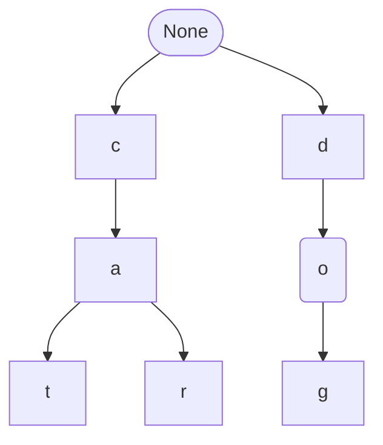

# 字符串替换研究

>   原文：https://my.oschina.net/u/4090830/blog/18059068

# 背景

需求非常简单，给定一组关键词，需要将商品名称中出现过的关键字替换掉；如：==skuName="HUAWEI Pura 70 Pro **国家补贴 500 元** 羽砂黑 12GB+512GB 超高速风驰闪拍 华为鸿蒙智能手机 "== 需要替换成 ==skuName="HUAWEI Pura 70 Pro 羽砂黑 12GB+512GB 超高速风驰闪拍 华为鸿蒙智能手机"== 这里的关键字==" 国家补贴 500 元 "==; 直接==skuName.replace ("国家补贴 500 元", "")==不就可以了吗？如果是一组，那就循环替换就完了嘛，再考虑到关键字前缀问题，对这一组关键词，按字符长度进行排序，先替换长的关键词，再替换短的就 ok 了；

如果这一组关键词非常多，上千个怎么办？真实场景也是这样的，一般需要替换的关键词都是比较多，并且使用 String.replace 上线后，直接CPU 打满，基本不可用；

这个字段替换本质上与敏感词过滤是一样的原理，针对敏感词的深入研究，出现了 Aho-Corasick（AC 自动机） 算法；

Aho-Corasick（AC 自动机）是一种多模式字符串匹配算法，结合了 Trie 树的前缀匹配能力和 KMP 算法的失败跳转思想，能够在单次文本扫描中高效匹配多个模式串。其核心优势在于时间复杂度为O (n + m + z)（n 为文本长度，m 为模式串总长度，z 为匹配次数），适用于敏感词过滤、基因序列分析等场景。

# 方案

针对这几种算法进行对比；

字符串替换，定义一个接口，通过 4 个不同的方案实现，进行性能对比

```java
public interface Replacer {
    String replaceKeywords(String text);
}
```

## String.replace 方案

这种方案最简单，也是关键词少的时候，最有效，最好用的；

```java
public class StrReplacer implements Replacer {
    private final List<String> keyWordList;
    public StrReplacer(String keyWords) {
        this.keyWordList = Lists.newArrayList(keyWords.split(";"));
        // 按关键字长度降序排序，确保长关键字优先匹配
        keyWordList.sort((a, b) -> Integer.compare(b.length(), a.length()));
    }
    /**
    * 替换文本中所有匹配的关键字为空字符串
    */
    @Override
    public String replaceKeywords(String text) {
        String newTxt = text;
        for (String s : keyWordList) {
            newTxt = newTxt.replace(s, "");
        }
        return newTxt;
    }
}
```

## 使用正则替换

String.replace 本质，还是使用正则进行替换的，通过代码实现使用编译好的正则进行替换性能会好于直接使用 replace；

String.replace 的实现

```java
public String replace(CharSequence target, CharSequence replacement) {
    return Pattern.compile(target.toString(), Pattern.LITERAL).matcher(
            this).replaceAll(Matcher.quoteReplacement(replacement.toString()));
}
```

使用正则替换的实现

```java
public class PatternReplacer implements Replacer {
    // 预编译正则表达式模式
    private final Pattern pattern;
    public PatternReplacer(String keyWords) {
        List<String> keywords = Lists.newArrayList(keyWords.split(";"));
        // 按关键字长度降序排序，确保长关键字优先匹配
        keywords.sort((a, b) -> Integer.compare(b.length(), a.length()));
        // 转义每个关键字并用|连接
        String regex = keywords.stream()
                .map(Pattern::quote)
                .collect(Collectors.joining("|"));
        this.pattern = Pattern.compile(regex);
    }

    // 替换方法
    @Override
    public String replaceKeywords(String skuName) {
        return pattern.matcher(skuName).replaceAll("");
    }
}
```

## 使用 Aho-Corasick（AC 自动机） 算法实现

在 java 中已有现成的算法实现，源代码[robert-bor/aho-corasick](https://github.com/robert-bor/aho-corasick)

引入 jar 包

```xml
<dependency>
    <groupId>org.ahocorasick</groupId>
    <artifactId>ahocorasick</artifactId>
    <version>0.6.3</version>
</dependency>
```

基于 Aho-Corasick 算法的字符串替换实现

```java
public class AhoCorasickReplacer implements Replacer {
    private final Trie trie;
    public AhoCorasickReplacer(String keyWords) {
        // 构建Aho-Corasick自动机
        Trie.TrieBuilder builder = Trie.builder().ignoreOverlaps().onlyWholeWords();
        //trie.caseInsensitive();
        //trie.onlyWholeWords();
        for (String s : keyWords.split(";")) {
            builder.addKeyword(s);
        }
        this.trie = builder.build();
    }
    /**
     * 替换文本中所有匹配的关键字为空字符串
     */
    @Override
    public String replaceKeywords(String text) {
        if (text == null || text.isEmpty()) {
            return text;
        }
        StringBuilder result = new StringBuilder();
        Collection<Emit> emits = trie.parseText(text); // 获取所有匹配结果
        int lastEnd = 0;
        for (Emit emit : emits) {
            int start = emit.getStart();
            int end = emit.getEnd();

            // 添加未匹配的前缀部分
            if (start > lastEnd) {
                result.append(text, lastEnd, start);
            }
            // 跳过匹配的关键字（即替换为空）
            lastEnd = end + 1; // 注意：end是闭区间，需+1移动到下一个字符
        }
        // 添加剩余未匹配的后缀部分
        if (lastEnd <= text.length() - 1) {
            result.append(text.substring(lastEnd));
        }
        return result.toString();
    }
}
```

## 自己实现 Trie 树算法实现

通过 deepseek 等人工智能，是非常容易自己实现一个 Trie 树，我们就只实现字符串替换的功能，其他的就不使用了；

Trie 树，又叫字典树，前缀树 (Prefix Tree)，单词查找树，是一种多叉树的结构。



结构说明：表示根节点（空节点）

每个节点表示一个字符

粉色节点表示单词结束标记（使用 CSS class 实现）

路径示例：

root → c → a → t 组成 "cat"

root → c → a → r 组成 "car"

root → d → o → g 组成 "dog"

```java
public class TrieKeywordReplacer implements Replacer {

    private final Trie trie;

    @Override
    public String replaceKeywords(String text) {
        return trie.replaceKeywords(text, "");
    }

    public TrieKeywordReplacer(String keyWords) {
        Trie trie = new Trie();
        for (String s : keyWords.split(";")) {
            trie.insert(s);
        }
        this.trie = trie;
    }

    static class TrieNode {
        Map<Character,TrieNode> children;
        boolean isEndOfWord;

        public TrieNode() {
            children = new HashMap<>();
            isEndOfWord = false;
        }
    }

    static class Trie {
        private TrieNode root;

        public Trie() {
            root = new TrieNode();
        }

        private synchronized void insert(String word) {
            TrieNode node = root;
            for (char c : word.toCharArray()) {
                if (node.children.get(c) == null) {
                    node.children.put(c, new TrieNode());
                }
                node = node.children.get(c);
            }
            node.isEndOfWord = true;
        }

        public String replaceKeywords(String text, String replacement) {
            StringBuilder result = new StringBuilder();
            int i = 0;
            while (i < text.length()) {
                TrieNode node = root;
                int j = i;
                TrieNode endNode = null;
                int endIndex = -1;
                while (j < text.length() && node.children.get(text.charAt(j)) != null) {
                    node = node.children.get(text.charAt(j));
                    if (node.isEndOfWord) {
                        endNode = node;
                        endIndex = j;
                    }
                    j++;
                }
                if (endNode != null) {
                    result.append(replacement);
                    i = endIndex + 1;
                } else {
                    result.append(text.charAt(i));
                    i++;
                }
            }
            return result.toString();
        }
    }
}
```

4 个实现类对象的大小对比

| 类                  | 对象大小 |
| ------------------- | -------- |
| StrReplacer         | 12560    |
| PatternReplacer     | 21592    |
| TrieKeywordReplacer | 184944   |
| AhoCorasickReplacer | 253896   |

性能对比

说明：待替换一组关键词共 400 个；JDK1.8

|                                                              | StrReplacer | PatternReplacer | TrieKeywordReplacer | AhoCorasickReplacer |
| ------------------------------------------------------------ | ----------- | --------------- | ------------------- | ------------------- |
| 单线程循环 1w 次，平均单次性能 (ns)                          | 21843ns     | 28846ns         | 532ns               | 727ns               |
| 名称中只有 1 个待替换的关键词，2 个并发线程，循环 1w 次，平均单次性能 (ns)，机器 CPU 30% 左右 | 23444ns     | 39984ns         | 680ns               | 1157ns              |
| 名称中只有 20 待替换的关键词，2 个并发线程，循环 1w 次，平均单次性能 (ns)，机器 CPU 30% 左右 | 252738ns    | 114740ns        | 33900ns             | 113764ns            |
| 名称中只有无待替换的关键词，2 个并发线程，循环 1w 次，平均单次性能 (ns)，机器 CPU 30% 左右 | 22248ns     | 9253ns          | 397ns               | 738ns               |

通过性能对比，自己实现的 Trie 树的性能是最好的，因为只做了替换的逻辑，没有实现其他功能，其次是使用 AhoCorasick 算法，因为使用 AhoCorasick 算法，实现字符串替换是最基本的功能，AhoCorasick 算法，还能精准的匹配到在什么地方，出现过多少次等信息，功能非常强大；

通过对比编译好的正则性能确实是比使用原生 String.replace;

```java
public class ReplacerTest {

    @Test
    public void testTrieKeywordReplacer(){
        //String name = skuName;
        //String expected = v2;
        //String name = "三星Samsung Galaxy S25+ 超拟人AI助理 骁龙8至尊版 AI拍照 翻译手机 游戏手机 12GB+256GB 冷川蓝";
        //String expected = name;

        String name = keyWords;
        String expected = v1;
        int cnt = 2;
        Replacer replacer = new TrieKeywordReplacer(keyWords);
        check(replacer, name, expected);
        for (int i = 0; i < cnt; i++) {
            checkExec(replacer, name);
        }
    }

    @Test
    public void 替换所有关键字() throws InterruptedException {
        //String name = skuName;
        //String expected = v2;
        //String name = "三星Samsung Galaxy S25+ 超拟人AI助理 骁龙8至尊版 AI拍照 翻译手机 游戏手机 12GB+256GB 冷川蓝";
        //String expected = name;

        String name = keyWords;
        String expected = v1;

        int cnt = 2;
        System.out.println("替换：" + name);
        Replacer replacer = new StrReplacer(keyWords);
        check(replacer, name, expected);
        for (int i = 0; i < cnt; i++) {
            checkExec(replacer, name);
        }

        replacer = new PatternReplacer(keyWords);
        check(replacer, name, expected);
        for (int i = 0; i < cnt; i++) {
            checkExec(replacer, name);
        }

        replacer = new TrieKeywordReplacer(keyWords);
        check(replacer, name, expected);
        for (int i = 0; i < cnt; i++) {
            checkExec(replacer, name);
        }

        replacer = new AhoCorasickReplacer(keyWords);
        check(replacer, name, expected);
        for (int i = 0; i < cnt; i++) {
            checkExec(replacer, name);
        }
    }


    @Test
    public void 无关键字替换() throws InterruptedException {
        //String name = skuName;
        //String expected = v2;
        String name = "三星Samsung Galaxy S25+ 超拟人AI助理 骁龙8至尊版 AI拍照 翻译手机 游戏手机 12GB+256GB 冷川蓝";
        String expected = name;

        //String name = keyWords;
        //String expected = v1;

        int cnt = 1;
        System.out.println("替换：" + name);
        Replacer replacer = new StrReplacer(keyWords);
        check(replacer, name, expected);
        for (int i = 0; i < cnt; i++) {
            checkExec(replacer, name);
        }

        replacer = new PatternReplacer(keyWords);
        check(replacer, name, expected);
        for (int i = 0; i < cnt; i++) {
            checkExec(replacer, name);
        }

        replacer = new TrieKeywordReplacer(keyWords);
        check(replacer, name, expected);
        for (int i = 0; i < cnt; i++) {
            checkExec(replacer, name);
        }

        replacer = new AhoCorasickReplacer(keyWords);
        check(replacer, name, expected);
        for (int i = 0; i < cnt; i++) {
            checkExec(replacer, name);
        }
    }

    @Test
    public void 有1个关键字替换() throws InterruptedException {
        //String name = skuName;
        //String expected = v2;
        //String name = "三星Samsung Galaxy S25+ 超拟人AI助理 骁龙8至尊版 AI拍照 翻译手机 游戏手机 12GB+256GB 冷川蓝";
        //String expected = name;

        //String name = keyWords;
        //String expected = v1;

        String name = "HUAWEI Pura 70 Pro 国家补贴500元 羽砂黑 12GB+512GB 超高速风驰闪拍 华为鸿蒙智能手机";
        String expected = "HUAWEI Pura 70 Pro 500元 羽砂黑 12GB+512GB 超高速风驰闪拍 华为鸿蒙智能手机";

        int cnt = 1;
        System.out.println("替换：" + name);
        Replacer replacer = new StrReplacer(keyWords);
        check(replacer, name, expected);
        for (int i = 0; i < cnt; i++) {
            checkExec(replacer, name);
        }

        replacer = new PatternReplacer(keyWords);
        check(replacer, name, expected);
        for (int i = 0; i < cnt; i++) {
            checkExec(replacer, name);
        }

        replacer = new TrieKeywordReplacer(keyWords);
        check(replacer, name, expected);
        for (int i = 0; i < cnt; i++) {
            checkExec(replacer, name);
        }

        replacer = new AhoCorasickReplacer(keyWords);
        check(replacer, name, expected);
        for (int i = 0; i < cnt; i++) {
            checkExec(replacer, name);
        }
    }

    static void check(Replacer replacer, String name, String expected) {
        System.out.println(replacer.getClass().getName()+"，对象大小："+ObjectSizeCalculator.getObjectSize(replacer));
        String newTxt = replacer.replaceKeywords(name);
        //System.out.println(newTxt);
        Assert.assertEquals(replacer.getClass().getName() + ",对比不一致!", expected, newTxt);
    }

    void checkExec(Replacer replacer, String name) {
        String newTxt = replacer.replaceKeywords(name);
        int nThreads  = 2;
        ExecutorService executorService = Executors.newFixedThreadPool(nThreads);
        CountDownLatch downLatch = new CountDownLatch(nThreads);
        int i = 0;
        while (i++ < nThreads) {
            executorService.submit(new Runnable() {
                @Override
                public void run() {
                    int i = 0;
                    long ns = System.nanoTime();
                    while (i++ < 100000) {
                        replacer.replaceKeywords(name);
                    }
                    String name = replacer.getClass().getName();
                    downLatch.countDown();
                    System.out.println(StringUtils.substring(name, name.length() - 50, name.length()) + "\ti=" + i + ", \t耗时：" + (System.nanoTime() - ns) / i + "ns");
                }
            });
        }
        executorService.shutdown();
        try {
            downLatch.await();
        } catch (InterruptedException e) {
            e.printStackTrace();
        }
    }
```

# 最后

1、使用现成的 AhoCorasick 算法进行实现，是性能与稳定性最优的选择，非常强调性能，还是可以自己实现 Trie 树来实现；

2、在真实的使用过程中，因为大部分的商品名称最多出现几个关键词，并且待替换的关键词往往都是比较多的，可以将这么关键词找出找出几个有代表性能的词，做前置判断，商品名称中是否存在；再进行全量替换；

如待替换的关键词有：政府补贴、国补、支持国补；那么我们并不是直接就循环这个待替换的关键词组，而是找出这么关键词中都有的关键字” 补” 先判断商品名称中是否存在 “补” 字后，再做处理；这里的前置判断，还可以使用布隆过滤器实现；

```java
public String replaceKeywords (String skuName){
    Replacer replacer = new AhoCorasickReplacer(keyWords);
    if(skuName.contains("补")){
        return  replacer.replaceKeywords(skuName);
    } else {
        return skuName;
    }
}
```

# 参考

1.  [Aho-Corasick 算法 AC自动机实现](https://www.cnblogs.com/vipsoft/p/17722761.html)
2.  [Trie字典树](https://www.cnblogs.com/vipsoft/p/17722820.html)
