# 搜索引擎中的拼写纠错功能该如何实现？

拼写纠错（Spell Correction / Spelling Check）是搜索引擎、编辑器、输入法等场景的核心功能之一。当用户输入拼写错误的关键词时，系统自动推测并返回正确的候选词。

## 【核心算法全名与诞生背景】

拼写纠错背后依赖的核心算法有着深厚的学术渊源：

| 算法 | 提出者 | 提出时间 | 原始出处 |
|------|--------|---------|---------|
| **Levenshtein 距离（编辑距离）** | Vladimir Levenshtein | 1965 | 《Binary codes capable of correcting deletions, insertions, and reversals》— 苏联科学院报告 |
| **N-Gram 模型** | Claude Shannon | 1948 | 《A Mathematical Theory of Communication》— 信息论奠基之作 |
| **BK 树（Burkhard-Keller Tree）** | W. A. Burkhard & R. M. Keller | 1973 | 《Some approaches to best-match file searching》— CACM |

- **Levenshtein 距离**的诞生背景是编码理论：研究二进制码在传输过程中发生删除、插入、反转时的纠错能力。它后来被广泛引入计算语言学、生物信息学（DNA序列比对）和搜索引擎领域。
- **N-Gram** 源自香农对英文文本的统计建模——给定前 n-1 个字符预测第 n 个字符的概率，开创了统计语言模型的先河。
- **BK 树**解决的是度量空间中的最近邻搜索问题：当词典规模达到百万级，每次查询都做完整编辑距离计算不可行，BK 树通过三角不等式实现高效剪枝。

## 【核心解决问题与适用边界】

### 编辑距离（Levenshtein Distance）

**解决的问题**：衡量字符串之间的"差异程度"，找到从输入词到词典词所需的最少编辑操作次数。

**适用场景**：
- 拼写纠错（用户输入了近似词）
- DNA/RNA 序列比对
- 自然语言处理中的近似字符串匹配
- OCR 纠错

**局限性**：
1. **不考虑语义**：`"color"` 和 `"colour"` 编辑距离为 1，但语义完全相同；`"cat"` 和 `"dog"` 编辑距离为 3，但语义不同。
2. **不考虑词频**：`"teh"`→`"the"`（高频）和 `"teh"`→`"tea"`（低频）可能编辑距离相同，但应优先推荐高频词。
3. **字符顺序敏感**：`"ab"`→`"ba"` 需要 2 步替换（或 1 步移位操作，但经典 Levenshtein 不包含移位），而人眼一看就知道"把两个字符交换就行"。
4. **O(mn) 时间复杂度**：对长字符串或超大词典时，暴力计算代价高昂。

### N-Gram 过滤

**解决的问题**：快速缩小候选集，避免对词典中每个词都计算编辑距离。

**精度与召回权衡**：

| Gram 大小 | 召回率 | 精度 | 性能 |
|-----------|:------:|:----:|:----:|
| 2-gram（bigram） | 最高 | 最低 | 较慢（候选多） |
| 3-gram（trigram） | 中 | 中 | 中 |
| 4-gram | 较低 | 较高 | 最快（候选少） |

- **Gram 越小**，召回越高（不容易漏词），但候选集大、性能下降。
- **Gram 越大**，精度越高（候选更精准），但可能漏掉实际正确的词。
- **实际选择**：英文一般用 2-gram 或 3-gram；中文通常用 2-gram（字粒度高）。
- **重叠度阈值**：通常要求输入词与词典词有 60%~80% 的 N-Gram 重叠，低于此阈值则直接剪枝。

### BK 树

**解决的问题**：在度量空间中高效搜索编辑距离在阈值 $t$ 以内的所有词。

**适用边界**：
- 词典规模 ≥ 10 万时优势明显
- 查询阈值 $t$ 通常取 1~3（超出此范围候选过多，剪枝效果减弱）
- 仅支持**精确编辑距离**查询，不能直接用于 N-Gram 这类近似匹配
- 构造时间复杂度 $O(n^2)$，适合静态词典（建树后少修改）
- 空间复杂度 $O(n)$，每个节点记录到子节点的距离

## 问题定义

给定用户输入的单词 $q$ 和一个正确词典 $D$，找到 $D$ 中与 $q$ 最相似的单词作为纠错建议。

### 核心思路

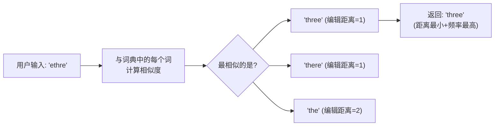

## 字符串相似度衡量

字符串相似度的衡量是拼写纠错的数学基础。常用的方法有两种。

### 莱文斯坦距离（Levenshtein Distance）

又称**编辑距离（Edit Distance）**，指从一个字符串变换为另一个字符串所需的**最少编辑操作次数**。允许三种操作：

| 操作 | 示例 | 说明 |
|------|------|------|
| **插入** | `thre` → `three` | 末尾加 `e` |
| **删除** | `threee` → `three` | 去掉多余 `e` |
| **替换** | `threw` → `three` | `w` → `e` |

> **计算示例**：`ethre` → `three` 只需 1 次操作（移动首字母 e 到末尾），编辑距离 = 1。

#### DP 表计算方法

编辑距离的经典解法是**动态规划**，构建一个 $(m+1) \times (n+1)$ 的二维表：

```
DP[i][j] = 将 string1[0..i-1] 转换为 string2[0..j-1] 的最小编辑距离

转移方程：
DP[i][j] = DP[i-1][j-1],                if s1[i-1] == s2[j-1]
DP[i][j] = 1 + min(
    DP[i-1][j],     删除
    DP[i][j-1],     插入
    DP[i-1][j-1]    替换
),                                  otherwise
```

#### DP 演变过程可视化

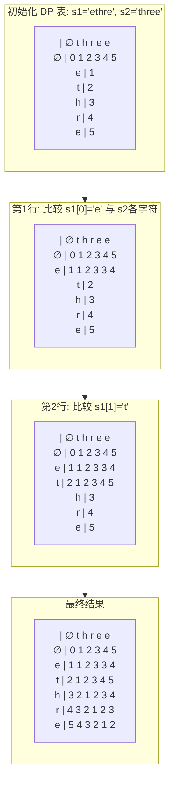

> **结果**: `ethre` → `three` 的编辑距离 = DP[5][5] = **1**

#### 转移矩阵详解

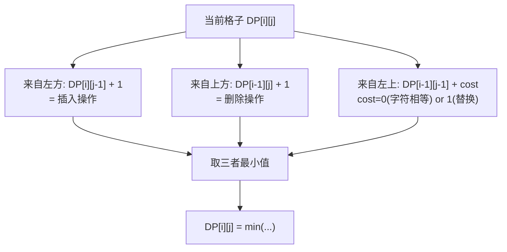

### 最长公共子序列（LCS）

LCS 衡量两个字符串的公共子序列的最大长度，它**只允许插入和删除操作，不允许替换**。

```
s1 = "ethre", s2 = "three"
LCS = "the" (或 "tre")，长度 = 3

相似度 = LCS长度 / max(len(s1), len(s2)) = 3/5 = 0.6
```

### 莱文斯坦 vs. LCS

| 维度 | 莱文斯坦距离 | 最长公共子序列 |
|------|------------|--------------|
| 允许操作 | 插入、删除、替换 | 插入、删除 |
| 数值含义 | **差异大小**（越小越相似） | **相似程度**（越大越相似） |
| 典型范围 | 0 ~ max(m, n) | 0 ~ max(m, n) |
| 适合场景 | 拼写纠错、DNA 序列比对 | 文件 diff、版本比较 |

## 【完整代码实现与关键优化】

### Levenshtein 距离：经典二维 DP 实现

```java
public class LevenshteinDistance {

    public static int compute(String s1, String s2) {
        int m = s1.length(), n = s2.length();
        int[][] dp = new int[m + 1][n + 1];

        // 初始化边界
        for (int i = 0; i <= m; i++) dp[i][0] = i;
        for (int j = 0; j <= n; j++) dp[0][j] = j;

        for (int i = 1; i <= m; i++) {
            for (int j = 1; j <= n; j++) {
                int cost = (s1.charAt(i - 1) == s2.charAt(j - 1)) ? 0 : 1;
                dp[i][j] = Math.min(
                    Math.min(
                        dp[i - 1][j] + 1,      // 删除
                        dp[i][j - 1] + 1),     // 插入
                    dp[i - 1][j - 1] + cost    // 替换
                );
            }
        }
        return dp[m][n];
    }
}
```

### Levenshtein 距离：空间优化版（一维滚动数组）

核心优化思路：DP 表第 i 行只依赖第 i-1 行，因此只需两个一维数组（prev 和 curr）即可。空间复杂度从 $O(mn)$ 降为 $O(\min(m,n))$。

```java
public class LevenshteinDistanceOptimized {

    /**
     * 一维滚动数组优化版 — 空间复杂度 O(min(m,n))
     * 思路：只保留「上一行」数组，边滚动边更新
     */
    public static int compute(String s1, String s2) {
        // 保证 s1 是较短的字符串，进一步压缩空间
        if (s1.length() > s2.length()) {
            String tmp = s1;
            s1 = s2;
            s2 = tmp;
        }

        int m = s1.length(), n = s2.length();
        // dp[j] 表示当前行的第 j 列
        int[] dp = new int[n + 1];

        // 初始化第 0 行：dp[j] = j  (将空串变为 s2[0..j-1] 需要 j 次插入)
        for (int j = 0; j <= n; j++) {
            dp[j] = j;
        }

        for (int i = 1; i <= m; i++) {
            int prev = dp[0];     // prev = dp[i-1][0]
            dp[0] = i;            // dp[i][0] = i (将 s1[0..i-1] 变为空串需要 i 次删除)

            for (int j = 1; j <= n; j++) {
                int temp = dp[j];   // 保存即将被覆盖的 dp[j] (即 dp[i-1][j])

                int cost = (s1.charAt(i - 1) == s2.charAt(j - 1)) ? 0 : 1;
                // dp[i][j] = min(dp[i-1][j] + 1, dp[i][j-1] + 1, dp[i-1][j-1] + cost)
                dp[j] = Math.min(
                    Math.min(
                        temp + 1,           // dp[i-1][j] + 1  (删除)
                        dp[j - 1] + 1        // dp[i][j-1] + 1  (插入)
                    ),
                    prev + cost              // dp[i-1][j-1] + cost (替换)
                );

                prev = temp;  // 更新 prev 为下一轮准备的 dp[i-1][j]
            }
        }

        return dp[n];
    }
}
```

**一维滚动数组关键图解：**

```
s1 = "sun", s2 = "sum"
初始化: dp = [0, 1, 2, 3]   (第 0 行)

i=1, s1[0]='s':
  prev=0, dp[0]=1
  j=1: s1[0]='s' vs s2[0]='s' → cost=0
       temp=1, dp[1] = min(1+1, dp[0]+1, 0+0) = 0
  j=2: s1[0]='s' vs s2[1]='u' → cost=1
       temp=2, dp[2] = min(2+1, dp[1]+1, 0+1) = 1
  j=3: s1[0]='s' vs s2[2]='m' → cost=1
       temp=3, dp[3] = min(3+1, dp[2]+1, 0+1) = 1
  dp = [1, 0, 1, 1]

i=2, s1[1]='u':
  ...
最终 dp[3] = 1 (sun→sum 编辑距离为 1)
```

### 编辑距离 + 操作回溯（输出具体编辑操作序列）

有时候我们不仅要知道"编辑距离是多少"，还想知道"具体是怎么一步步编辑的"。通过**记录回溯指针（backtrace）**，可以从 DP 表的右下角倒推到左上角，还原完整的编辑操作序列。

```java
public class LevenshteinWithBacktrace {

    // 操作类型枚举
    enum Operation { NONE, INSERT, DELETE, REPLACE, KEEP }

    static class EditStep {
        int fromI, fromJ;   // 源字符串位置
        int toI, toJ;       // 目标字符串位置
        Operation op;
        char ch;            // 涉及的字符

        EditStep(int fromI, int fromJ, int toI, int toJ, Operation op, char ch) {
            this.fromI = fromI; this.fromJ = fromJ;
            this.toI = toI; this.toJ = toJ;
            this.op = op; this.ch = ch;
        }

        @Override
        public String toString() {
            switch (op) {
                case INSERT: return String.format("在位置 %d 插入 '%c'", toJ, ch);
                case DELETE: return String.format("删除位置 %d 的 '%c'", fromI, ch);
                case REPLACE: return String.format("将 '%c' 替换为 '%c'", ch,
                    /* 从上下文获取目标字符需要额外参数，简化处理 */ ch);
                case KEEP: return String.format("保留 '%c'", ch);
                default: return "";
            }
        }
    }

    /**
     * 计算编辑距离并回溯编辑操作序列
     * @param s1 源字符串
     * @param s2 目标字符串
     * @return 包含距离和操作序列的结果对象
     */
    public static EditResult computeWithOps(String s1, String s2) {
        int m = s1.length(), n = s2.length();
        int[][] dp = new int[m + 1][n + 1];
        // 记录每个格子是从哪个方向来的
        // 0: 左上 (替换/保持), 1: 上方 (删除), 2: 左方 (插入)
        int[][] from = new int[m + 1][n + 1];

        // 初始化
        for (int i = 0; i <= m; i++) {
            dp[i][0] = i;
            if (i > 0) from[i][0] = 1; // 从上方来（删除）
        }
        for (int j = 0; j <= n; j++) {
            dp[0][j] = j;
            if (j > 0) from[0][j] = 2; // 从左方来（插入）
        }

        for (int i = 1; i <= m; i++) {
            for (int j = 1; j <= n; j++) {
                int cost = (s1.charAt(i - 1) == s2.charAt(j - 1)) ? 0 : 1;

                int delete = dp[i - 1][j] + 1;
                int insert = dp[i][j - 1] + 1;
                int replace = dp[i - 1][j - 1] + cost;

                dp[i][j] = replace;
                from[i][j] = 0; // 默认左上

                if (delete < dp[i][j]) {
                    dp[i][j] = delete;
                    from[i][j] = 1; // 上方
                }
                if (insert < dp[i][j]) {
                    dp[i][j] = insert;
                    from[i][j] = 2; // 左方
                }
            }
        }

        // 回溯操作序列（从右下角到左上角）
        java.util.List<String> ops = new java.util.ArrayList<>();
        int i = m, j = n;
        while (i > 0 || j > 0) {
            if (from[i][j] == 0) { // 左上
                if (s1.charAt(i - 1) == s2.charAt(j - 1)) {
                    ops.add(String.format("  保留 s1[%d]='%c'", i-1, s1.charAt(i-1)));
                } else {
                    ops.add(String.format("  替换 s1[%d]='%c' → '%c'", i-1, s1.charAt(i-1), s2.charAt(j-1)));
                }
                i--; j--;
            } else if (from[i][j] == 1) { // 上方 → 删除
                ops.add(String.format("  删除 s1[%d]='%c'", i-1, s1.charAt(i-1)));
                i--;
            } else { // 左方 → 插入
                ops.add(String.format("  插入 '%c' 到位置 %d", s2.charAt(j-1), j-1));
                j--;
            }
        }
        java.util.Collections.reverse(ops);

        return new EditResult(dp[m][n], ops);
    }

    static class EditResult {
        int distance;
        java.util.List<String> operations;

        EditResult(int distance, java.util.List<String> operations) {
            this.distance = distance;
            this.operations = operations;
        }

        void print() {
            System.out.println("编辑距离 = " + distance);
            System.out.println("操作序列:");
            for (String op : operations) {
                System.out.println(op);
            }
        }
    }

    // 示例
    public static void main(String[] args) {
        EditResult result = computeWithOps("sun", "sum");
        result.print();
        // 输出：
        // 编辑距离 = 1
        // 操作序列：
        //   保留 s1[0]='s'
        //   保留 s1[1]='u'
        //   替换 s1[2]='n' → 'm'

        System.out.println();
        EditResult result2 = computeWithOps("kitten", "sitting");
        result2.print();
        // 输出：
        // 编辑距离 = 3
        // 操作序列：
        //   替换 s1[0]='k' → 's'
        //   保留 s1[1]='i'
        //   保留 s1[2]='t'
        //   保留 s1[3]='t'
        //   替换 s1[4]='e' → 'i'
        //   保留 s1[5]='n'
        //   插入 'g' 到位置 6
    }
}
```

### Lucene 风格相似度计算

```java
public class LuceneStyleSimilarity {

    /**
     * 优化版：用三个一维数组代替二维数组
     * Lucene 内部的实现方式
     */
    public static float getSimilarity(String target, String other) {
        char[] sa = target.toCharArray();
        int n = sa.length;
        int m = other.length();

        if (n == 0 || m == 0) return (n == m) ? 1.0f : 0.0f;

        int[] p = new int[n + 1]; // 上一行
        int[] d = new int[n + 1]; // 当前行

        for (int i = 0; i <= n; i++) p[i] = i;

        for (int j = 1; j <= m; j++) {
            char t_j = other.charAt(j - 1);
            d[0] = j;

            for (int i = 1; i <= n; i++) {
                int cost = (sa[i - 1] == t_j) ? 0 : 1;
                d[i] = Math.min(
                    Math.min(d[i - 1] + 1, p[i] + 1),
                    p[i - 1] + cost
                );
            }

            // 交换行引用
            int[] _d = p;
            p = d;
            d = _d;
        }

        int distance = p[n];
        return 1.0f - (float) distance / Math.max(m, n);
    }
}
```

### BK 树完整实现

```java
public class BKTree {

    static class Node {
        String word;
        Map<Integer, Node> children = new HashMap<>();

        Node(String word) { this.word = word; }
    }

    private Node root;
    private int editDistanceLimit;

    public BKTree(int editDistanceLimit) {
        this.editDistanceLimit = editDistanceLimit;
    }

    /** 向 BK 树中添加一个词 */
    public void add(String word) {
        if (root == null) {
            root = new Node(word);
            return;
        }

        Node cur = root;
        while (true) {
            int dist = LevenshteinDistanceOptimized.compute(cur.word, word);
            if (!cur.children.containsKey(dist)) {
                cur.children.put(dist, new Node(word));
                break;
            }
            cur = cur.children.get(dist);
        }
    }

    /** 查询编辑距离在阈值内的所有词 */
    public List<String> search(String query) {
        List<String> results = new ArrayList<>();
        if (root == null) return results;
        searchRecursive(root, query, results);
        return results;
    }

    private void searchRecursive(Node node, String query, List<String> results) {
        int dist = LevenshteinDistanceOptimized.compute(node.word, query);
        if (dist <= editDistanceLimit) {
            results.add(node.word);
        }

        // 利用三角不等式剪枝：d(q, u) - t ≤ d(u, child) ≤ d(q, u) + t
        int start = Math.max(0, dist - editDistanceLimit);
        int end = dist + editDistanceLimit;

        for (Map.Entry<Integer, Node> entry : node.children.entrySet()) {
            if (entry.getKey() >= start && entry.getKey() <= end) {
                searchRecursive(entry.getValue(), query, results);
            }
        }
    }

    // 使用示例
    public static void main(String[] args) {
        BKTree tree = new BKTree(2);
        String[] dict = {"book", "cook", "look", "books", "cooker", "boo", "bootstrap", "cake"};
        for (String w : dict) tree.add(w);

        List<String> suggestions = tree.search("copk");
        System.out.println("'copk' 的建议: " + suggestions);
        // 可能输出: [cook, book, look]
    }
}
```

## 工程实现方案

根据业务场景不同，拼写纠错有多种实现路径。

### 数据预处理——N-Gram 索引

直接对词典中每个词全量计算编辑距离是不可行的。通过 N-Gram 分词加速：

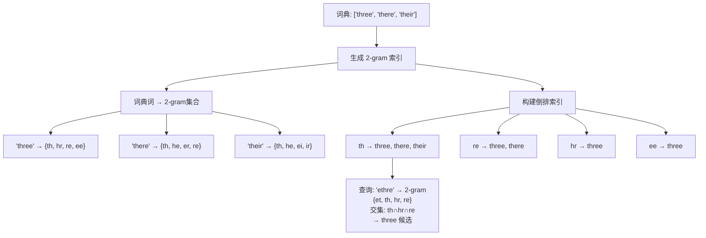

### 编辑距离 + N-Gram 过滤（经典 Pipeline）

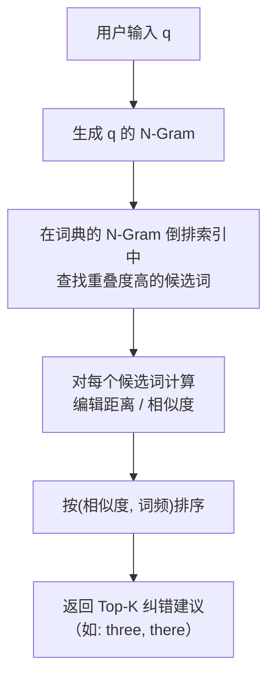

### Lucene / Solr / ES 中的实现

#### Lucene SpellChecker

Lucene 的 `SpellChecker` 模块使用 **N-Gram + 编辑距离** 的经典方案：

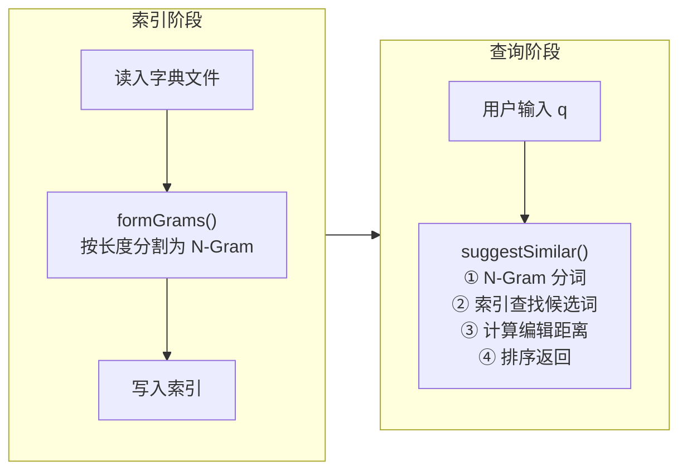

核心参数：

| 参数 | 默认值 | 作用 |
|------|-------|------|
| `accuracy` | 0.5 | 最小相似度分数（0~1） |
| `bStart` | 2.0 | 前缀匹配权重（高于后缀） |
| `bEnd` | 1.0 | 后缀匹配权重 |
| `suggestMode` | SUGGEST_WHEN_NOT_IN_INDEX | 建议触发条件 |

#### 三种 Suggest 模式

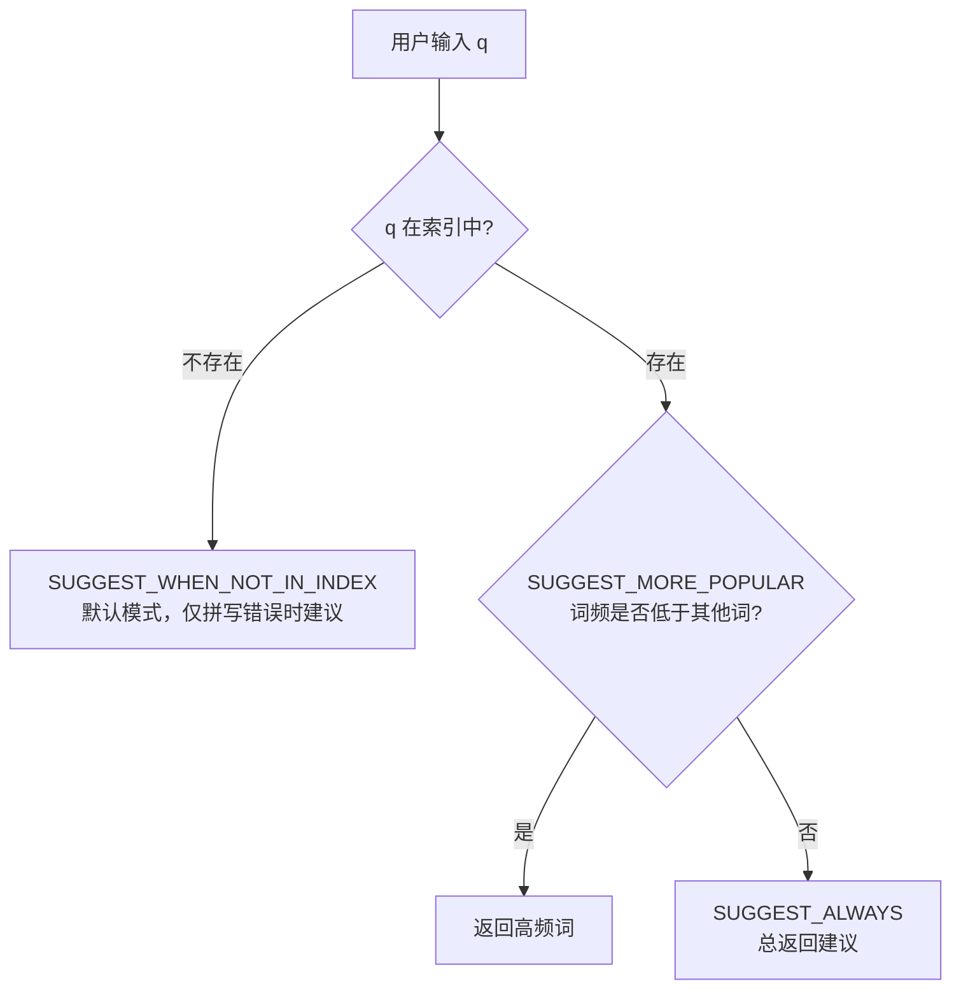

#### Elasticsearch 的 4 种 Suggester

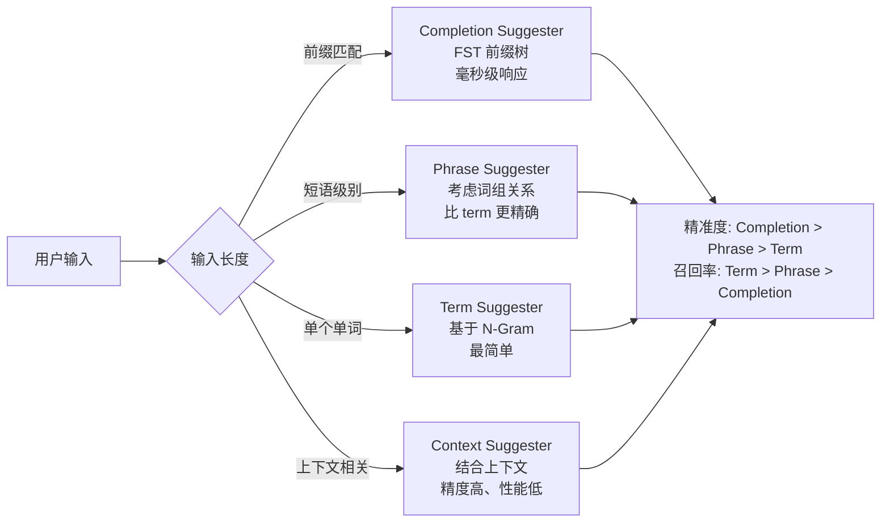

**精度 vs 召回率权衡**：

| Suggester | 精准度 | 召回率 | 性能 |
|-----------|:-----:|:-----:|:----:|
| Completion | 最高 | 最低 | 最快（FST 内存） |
| Phrase | 中 | 中 | 中（倒排索引） |
| Term | 最低 | 最高 | 较慢（遍历候选） |

## 实际工作中的优化策略

### 分层纠错策略（Google 式猜想）

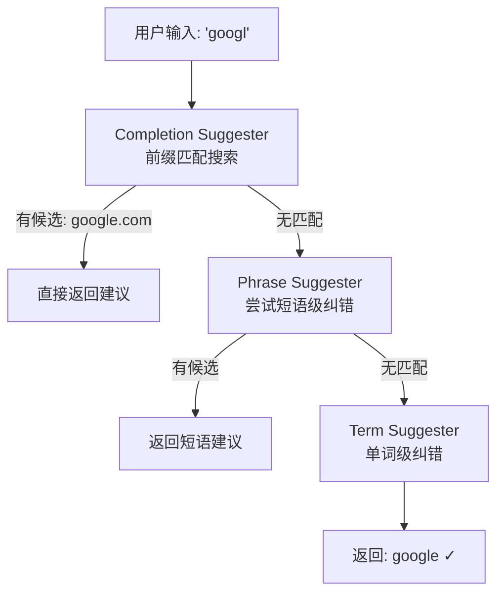

### 常用优化手段

| 技术 | 效果 | 实现 |
|------|------|------|
| **N-Gram 过滤** | 减少 90%+ 的编辑距离计算 | 提前缩小候选集 |
| **词频加权** | 低频词不排在首位 | 编辑距离相同时按频率降序 |
| **前缀加权** | 前缀相同的词优先 | `bStart > bEnd` |
| **Top-N 截断** | 控制计算量 | 只保留相似度最高的 N 个 |
| **分词缓存** | 避免重复计算 | 缓存热点查询的 N-Gram |

### BK 树（Burkhard-Keller Tree）加速

对于需要精确编辑距离的场景，BK 树是一种度量空间索引结构，能在 $O(\log n)$ 时间内找到编辑距离在阈值内的所有词。

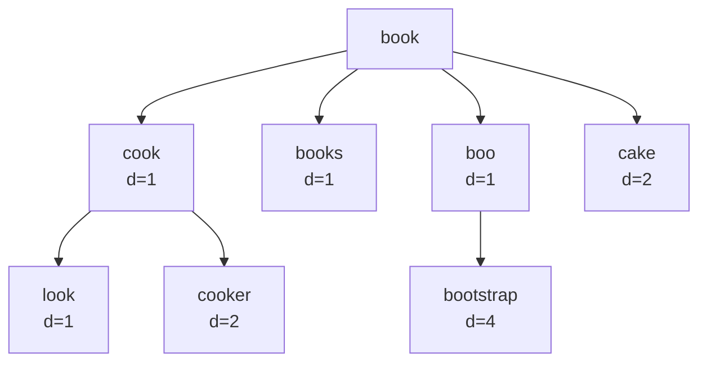

**查询原理**：给定查询词 $q$ 和阈值 $t$，在节点 $u$ 处，只遍历满足 $|d(q, u) - t| \leq d(u.edge, child)$ 的子节点，剪枝效果显著。

## 【总结】

```
核心公式： 编辑距离(q, 词典词) → 最小距离词 → 频率加权排序 → Top-K
加速策略： N-Gram 预过滤 → 仅对候选词计算编辑距离 → BK 树 / FST 空间加速
工程实现： Lucene SpellChecker / ES Suggester / 自实现 Pipeline
```

| 场景 | 推荐方案 |
|------|---------|
| 中小规模词典（< 10 万） | N-Gram + 编辑距离 |
| 大规模词典 | BK 树 + 编辑距离 |
| 实时前缀补全 | Completion Suggester (FST) |
| 全文搜索引擎集成 | Elasticsearch Phrase/Term Suggester |
| 在线协同编辑 | 客户端本地 N-Gram + 服务端纠错 |

### 进一步阅读

- [ES Phrase Suggester 官方文档](https://www.elastic.co/guide/en/elasticsearch/reference/current/search-suggesters-phrase.html)
- Levenshtein, V. I. (1966). Binary codes capable of correcting deletions, insertions, and reversals.
- Burkhard, W. A., & Keller, R. M. (1973). Some approaches to best-match file searching.

## 【典型题目精讲】

### 题目1: LeetCode 161. 相隔为1的编辑距离

> **题目描述**：给定两个字符串 s 和 t，判断它们的编辑距离是否为 1。

**注意**：这里编辑距离定义为"一次编辑"——包括插入一个字符、删除一个字符或替换一个字符。要求返回 boolean。

#### 算法选择理由

- 题目限定编辑距离 = 1，属于**特判**问题，无需完整 DP（$O(mn)$）。
- 直接用**双指针扫描**可以在 $O(m+n)$ 时间内解决。
- 核心思路：当发现第一个不同的字符时，根据长度关系决定是尝试替换、插入还是删除，然后验证剩余部分是否一致。

#### 推导过程

**三种情况**：

1. **长度相等**：最多只能有 1 个位置字符不同（替换操作）。从头扫描两字符串，遇到不同时计数+1，超过 1 则返回 false。
2. **长度差 1**：假设 s 比 t 短 1，说明 t 比 s 多了一个字符（s 需要在某位置插入一个字符）。扫描时若发现 s[i] != t[j]，则让 t 指针前进 1（视为删除 t 的多余字符），然后继续比较。
3. **长度差 > 1**：不可能在 1 次编辑内完成，直接返回 false。

#### 完整代码（Java）

```java
class Solution {
    public boolean isOneEditDistance(String s, String t) {
        int m = s.length(), n = t.length();

        // 长度差大于 1，不可能一次编辑完成
        if (Math.abs(m - n) > 1) return false;

        // 长度相等 → 检查替换
        if (m == n) {
            int diff = 0;
            for (int i = 0; i < m; i++) {
                if (s.charAt(i) != t.charAt(i)) diff++;
                if (diff > 1) return false;
            }
            return diff == 1;  // 完全相等时返回 false（编辑距离为 0 ≠ 1）
        }

        // 长度差 1 → 检查插入/删除（本质相同）
        // 确保 s 是较短的字符串
        if (m > n) return isOneEditDistance(t, s);

        // 此时 m = n - 1, s 比 t 短 1
        int i = 0, j = 0;
        while (i < m && j < n) {
            if (s.charAt(i) != t.charAt(j)) {
                // 跳过 t[j]（视为在 s 中插入一个字符）
                // 然后继续比较剩下的
                return s.substring(i).equals(t.substring(j + 1));
            }
            i++;
            j++;
        }

        // 所有字符都匹配了，但 t 还剩一个字符（在末尾插入）
        return true;
    }
}
```

#### 完整代码（C++）

```cpp
class Solution {
public:
    bool isOneEditDistance(string s, string t) {
        int m = s.size(), n = t.size();
        if (abs(m - n) > 1) return false;

        if (m == n) {
            int diff = 0;
            for (int i = 0; i < m; i++) {
                if (s[i] != t[i]) diff++;
                if (diff > 1) return false;
            }
            return diff == 1;
        }

        if (m > n) return isOneEditDistance(t, s);

        // m = n - 1
        for (int i = 0; i < m; i++) {
            if (s[i] != t[i]) {
                return s.substr(i) == t.substr(i + 1);
            }
        }
        return true;
    }
};
```

#### 复杂度分析

| 维度 | 值 |
|------|-------|
| 时间复杂度 | $O(\min(m, n))$ — 双指针最多扫描短串的长度 |
| 空间复杂度 | $O(1)$ — 只需几个指针变量 |

### 题目2: LeetCode 72. 编辑距离

> **题目描述**：给你两个单词 word1 和 word2，请返回将 word1 转换成 word2 所使用的最少操作数。你可以对一个单词进行如下三种操作：插入一个字符、删除一个字符、替换一个字符。

#### 算法选择理由

- 这是**编辑距离的经典原型题**，也是 Levenshtein Distance 的直接体现。
- 采用**二维 DP** 是最直观、最标准的解法，DP 表就是文章的 "DP 演变过程可视化"。
- 对于大规模字符串可用一维滚动数组优化（见前述代码）。

#### DP 转移推导过程

定义 $dp[i][j]$ = word1[0..i-1] 转换为 word2[0..j-1] 的最小编辑距离。

**初始化**：
- $dp[0][j] = j$：空串 → word2[0..j-1] 需要 j 次插入
- $dp[i][0] = i$：word1[0..i-1] → 空串需要 i 次删除

**转移方程**：
```
if word1[i-1] == word2[j-1]:
    dp[i][j] = dp[i-1][j-1]                    // 字符相同，无需操作
else:
    dp[i][j] = 1 + min(
        dp[i-1][j],     // 删除 word1[i-1]（相当于从 word1[0..i-2] 开始转换）
        dp[i][j-1],     // 插入 word2[j-1]（相当于已转换好 word1[0..i-1]→word2[0..j-2]，再插入）
        dp[i-1][j-1]    // 替换 word1[i-1] 为 word2[j-1]
    )
```

**直观理解三种操作**：
1. **删除**：我们已经知道 word1[0..i-2] → word2[0..j-1] 的距离为 dp[i-1][j]，那么多余的 word1[i-1] 删除即可，+1
2. **插入**：我们已经知道 word1[0..i-1] → word2[0..j-2] 的距离为 dp[i][j-1]，再插入 word2[j-1] 即可，+1
3. **替换**：我们已经知道 word1[0..i-2] → word2[0..j-2] 的距离为 dp[i-1][j-1]，再把 word1[i-1] 替换为 word2[j-1]，+1

#### 完整代码（Java）

```java
class Solution {
    public int minDistance(String word1, String word2) {
        int m = word1.length(), n = word2.length();
        int[][] dp = new int[m + 1][n + 1];

        // 初始化边界
        for (int i = 0; i <= m; i++) dp[i][0] = i;
        for (int j = 0; j <= n; j++) dp[0][j] = j;

        // 填 DP 表
        for (int i = 1; i <= m; i++) {
            for (int j = 1; j <= n; j++) {
                if (word1.charAt(i - 1) == word2.charAt(j - 1)) {
                    dp[i][j] = dp[i - 1][j - 1];
                } else {
                    dp[i][j] = 1 + Math.min(
                        Math.min(dp[i - 1][j],     // 删除
                                 dp[i][j - 1]),    // 插入
                        dp[i - 1][j - 1]           // 替换
                    );
                }
            }
        }

        return dp[m][n];
    }
}
```

#### 完整代码（C++，一维滚动数组优化）

```cpp
class Solution {
public:
    int minDistance(string word1, string word2) {
        int m = word1.size(), n = word2.size();
        if (m < n) return minDistance(word2, word1); // 确保 word1 更短

        vector<int> dp(n + 1);
        for (int j = 0; j <= n; j++) dp[j] = j;

        for (int i = 1; i <= m; i++) {
            int prev = dp[0];
            dp[0] = i;
            for (int j = 1; j <= n; j++) {
                int temp = dp[j];
                if (word1[i - 1] == word2[j - 1]) {
                    dp[j] = prev;
                } else {
                    dp[j] = 1 + min({prev, dp[j] + 1, dp[j - 1] + 1}) - 1;
                    // 等价于: dp[j] = 1 + min(prev, dp[j], dp[j-1])
                }
                // 修正：
                prev = temp;
            }
        }
        return dp[n];
    }
};
```

**C++ 正确版**：

```cpp
class Solution {
public:
    int minDistance(string word1, string word2) {
        int m = word1.size(), n = word2.size();
        if (m < n) return minDistance(word2, word1);

        vector<int> dp(n + 1);
        iota(dp.begin(), dp.end(), 0);  // dp[j] = j

        for (int i = 1; i <= m; i++) {
            int prev = dp[0];  // prev = dp[i-1][0]
            dp[0] = i;         // dp[i][0] = i
            for (int j = 1; j <= n; j++) {
                int temp = dp[j];  // 保存 dp[i-1][j]
                int cost = (word1[i - 1] == word2[j - 1]) ? 0 : 1;
                dp[j] = min({prev + cost, temp + 1, dp[j - 1] + 1});
                prev = temp;
            }
        }
        return dp[n];
    }
};
```

#### 复杂度分析

| 维度 | 值 |
|------|-------|
| 时间复杂度 | $O(mn)$ |
| 空间复杂度（二维） | $O(mn)$ |
| 空间复杂度（优化） | $O(\min(m, n))$ |

### 题目3: LeetCode 583. 两个字符串的删除操作

> **题目描述**：给定两个单词 word1 和 word2，找到使 word1 和 word2 **相同**所需的最小步数，每步可以删除任意一个字符串中的一个字符。

#### 算法选择理由

- 本题只允许**删除**操作（不允许插入和替换）。
- 这等价于：删除到两个字符串完全相同时，保留的部分一定是两个字符串的**最长公共子序列（LCS）**。
- 因此：**最小删除次数 = (len1 - LCS_len) + (len2 - LCS_len) = len1 + len2 - 2 × LCS_len**。

#### DP 推导过程

求 LCS 长度的 DP 转移方程：

定义 $dp[i][j] = word1[0..i-1]$ 和 $word2[0..j-1]$ 的最长公共子序列长度。

```
if word1[i-1] == word2[j-1]:
    dp[i][j] = dp[i-1][j-1] + 1
else:
    dp[i][j] = max(dp[i-1][j], dp[i][j-1])
```

求出 LCS 长度后，答案 = m + n - 2 × LCS。

#### 完整代码（Java）

```java
class Solution {
    public int minDistance(String word1, String word2) {
        int m = word1.length(), n = word2.length();

        // 求 LCS 长度
        int[][] dp = new int[m + 1][n + 1];
        for (int i = 1; i <= m; i++) {
            for (int j = 1; j <= n; j++) {
                if (word1.charAt(i - 1) == word2.charAt(j - 1)) {
                    dp[i][j] = dp[i - 1][j - 1] + 1;
                } else {
                    dp[i][j] = Math.max(dp[i - 1][j], dp[i][j - 1]);
                }
            }
        }

        int lcs = dp[m][n];
        return m + n - 2 * lcs;
    }
}
```

#### 完整代码（C++）

```cpp
class Solution {
public:
    int minDistance(string word1, string word2) {
        int m = word1.size(), n = word2.size();

        // 一维滚动数组求 LCS
        vector<int> dp(n + 1, 0);
        for (int i = 1; i <= m; i++) {
            int prev = 0;  // dp[i-1][j-1]
            for (int j = 1; j <= n; j++) {
                int temp = dp[j];  // 旧的 dp[j] 是 dp[i-1][j]
                if (word1[i - 1] == word2[j - 1]) {
                    dp[j] = prev + 1;
                } else {
                    dp[j] = max(dp[j], dp[j - 1]);
                }
                prev = temp;
            }
        }

        return m + n - 2 * dp[n];
    }
};
```

#### 复杂度分析

| 维度 | 值 |
|------|-------|
| 时间复杂度 | $O(mn)$ |
| 空间复杂度（二维） | $O(mn)$ |
| 空间复杂度（优化） | $O(n)$ |

### 题目4: LeetCode 115. 不同的子序列

> **题目描述**：给定一个字符串 s 和一个字符串 t，计算在 s 的子序列中 t 出现的个数。
>
> 题目保证答案符合 32 位带符号整数范围。

#### 算法选择理由

- 这是编辑距离的一个**变体**：统计 s → t 的**不同转换路径数**（只允许删除操作）。
- 经典 DP 求的是**最少步数**，而本题求的是**方案总数**。
- DP 转移思路和编辑距离类似，只不过把 min/+1 换成了 count 累加。

#### DP 推导过程

定义 $dp[i][j] = s[0..i-1]$ 的子序列中 $t[0..j-1]$ 出现的次数。

**初始化**：
- $dp[0][0] = 1$：两个空串，1 种匹配方式
- $dp[i][0] = 1$：s 的任意前缀中，空串总是恰好出现 1 次
- $dp[0][j] = 0$（j > 0）：空串 s 无法匹配非空串 t

**转移方程**：
```
if s[i-1] == t[j-1]:
    // 两种选择：
    // 1) 用 s[i-1] 匹配 t[j-1] → dp[i-1][j-1]
    // 2) 不用 s[i-1]（删除 s[i-1]）→ dp[i-1][j]
    dp[i][j] = dp[i-1][j-1] + dp[i-1][j]
else:
    // s[i-1] 无法匹配，只能删除 s[i-1]
    dp[i][j] = dp[i-1][j]
```

#### 完整代码（Java）

```java
class Solution {
    public int numDistinct(String s, String t) {
        int m = s.length(), n = t.length();
        int[][] dp = new int[m + 1][n + 1];

        // 初始化
        for (int i = 0; i <= m; i++) {
            dp[i][0] = 1;  // 空串总是 1 种方式匹配
        }

        for (int i = 1; i <= m; i++) {
            for (int j = 1; j <= n; j++) {
                if (s.charAt(i - 1) == t.charAt(j - 1)) {
                    dp[i][j] = dp[i - 1][j - 1] + dp[i - 1][j];
                } else {
                    dp[i][j] = dp[i - 1][j];
                }
            }
        }

        return dp[m][n];
    }
}
```

#### 完整代码（C++，一维滚动数组）

```cpp
class Solution {
public:
    int numDistinct(string s, string t) {
        int m = s.size(), n = t.size();
        // 使用 long long 防止中间结果溢出（题目保证最终答案在 int 范围）
        vector<unsigned long long> dp(n + 1, 0);
        dp[0] = 1;

        for (int i = 1; i <= m; i++) {
            // 从后往前更新，避免覆盖上一行的值
            for (int j = n; j >= 1; j--) {
                if (s[i - 1] == t[j - 1]) {
                    dp[j] += dp[j - 1];  // dp[j] 是旧的 dp[i-1][j]，dp[j-1] 是旧的 dp[i-1][j-1]
                }
                // 不相等时 dp[j] 保持不变（继承旧值 dp[i-1][j]）
            }
        }

        return (int)dp[n];
    }
};
```

#### 复杂度分析

| 维度 | 值 |
|------|-------|
| 时间复杂度 | $O(mn)$ |
| 空间复杂度（二维） | $O(mn)$ |
| 空间复杂度（优化） | $O(n)$ |

### 题目5: LeetCode 712. 两个字符串的最小ASCII删除和

> **题目描述**：给定两个字符串 s1 和 s2，返回使两个字符串相等所需删除字符的 **ASCII 值的最小和**。

#### 算法选择理由

- 本题是 LeetCode 583（删除操作）的**加权版本**：583 每步代价为 1，本题每步代价为字符的 ASCII 值。
- 等价于：找到两个字符串的**最大公共子序列（按 ASCII 和最大化）**，然后总 ASCII 和减去 LCS ASCII 和。
- DP 转移框架与编辑距离/583 一致，只是将 count/1 替换为 ASCII 值。

#### DP 推导过程

定义 $dp[i][j]$ = s1[0..i-1] 和 s2[0..j-1] 的最小 ASCII 删除和。

**初始化**：
- $dp[0][0] = 0$
- $dp[i][0] = dp[i-1][0] + \text{ASCII}(s1[i-1])$：s1 的前 i 个字符全部删除
- $dp[0][j] = dp[0][j-1] + \text{ASCII}(s2[j-1])$：s2 的前 j 个字符全部删除

**转移方程**：
```
if s1[i-1] == s2[j-1]:
    // 字符相同，无需删除
    dp[i][j] = dp[i-1][j-1]
else:
    // 要么删除 s1[i-1]，要么删除 s2[j-1]（或者都删，但取最小值）
    dp[i][j] = min(
        dp[i-1][j] + ASCII(s1[i-1]),   // 删除 s1[i-1]
        dp[i][j-1] + ASCII(s2[j-1])    // 删除 s2[j-1]
    )
```

#### 完整代码（Java）

```java
class Solution {
    public int minimumDeleteSum(String s1, String s2) {
        int m = s1.length(), n = s2.length();
        int[][] dp = new int[m + 1][n + 1];

        // 初始化
        for (int i = 1; i <= m; i++) {
            dp[i][0] = dp[i - 1][0] + s1.charAt(i - 1);
        }
        for (int j = 1; j <= n; j++) {
            dp[0][j] = dp[0][j - 1] + s2.charAt(j - 1);
        }

        // 填 DP 表
        for (int i = 1; i <= m; i++) {
            for (int j = 1; j <= n; j++) {
                if (s1.charAt(i - 1) == s2.charAt(j - 1)) {
                    dp[i][j] = dp[i - 1][j - 1];
                } else {
                    dp[i][j] = Math.min(
                        dp[i - 1][j] + s1.charAt(i - 1),
                        dp[i][j - 1] + s2.charAt(j - 1)
                    );
                }
            }
        }

        return dp[m][n];
    }
}
```

#### 完整代码（C++，一维滚动数组）

```cpp
class Solution {
public:
    int minimumDeleteSum(string s1, string s2) {
        int m = s1.size(), n = s2.size();
        vector<int> dp(n + 1, 0);

        // 初始化第一行：空 s1 → s2[0..j-1] 需要删除 s2 的所有字符
        for (int j = 1; j <= n; j++) {
            dp[j] = dp[j - 1] + s2[j - 1];
        }

        for (int i = 1; i <= m; i++) {
            int prev = dp[0];  // dp[i-1][0]
            dp[0] = dp[0] + s1[i - 1];  // 删除 s1[0..i-1] 全部字符

            for (int j = 1; j <= n; j++) {
                int temp = dp[j];  // 旧 dp[j] = dp[i-1][j]
                if (s1[i - 1] == s2[j - 1]) {
                    dp[j] = prev;  // dp[i-1][j-1]
                } else {
                    dp[j] = min(
                        temp + s1[i - 1],   // 删除 s1[i-1]
                        dp[j - 1] + s2[j - 1]  // 删除 s2[j-1]
                    );
                }
                prev = temp;  // 更新下一轮的 dp[i-1][j-1]
            }
        }

        return dp[n];
    }
};
```

#### 复杂度分析

| 维度 | 值 |
|------|-------|
| 时间复杂度 | $O(mn)$ |
| 空间复杂度（二维） | $O(mn)$ |
| 空间复杂度（优化） | $O(n)$ |

#### 题目对比总结

| 题目 | 操作类型 | 代价 | 核心思想 |
|------|---------|------|---------|
| 161. 相隔为1的编辑距离 | 插入/删除/替换 | 均为 1 | 双指针特判 |
| 72. 编辑距离 | 插入/删除/替换 | 均为 1 | 经典 Levenshtein DP |
| 583. 两个字符串的删除操作 | 仅删除 | 均为 1 | 转化为 LCS |
| 115. 不同的子序列 | 仅删除 | 方案数 | DP 计数（变体） |
| 712. 最小 ASCII 删除和 | 仅删除 | ASCII 值 | 加权 LCS |

### 题目6: 搜索引擎中的自动补全与纠错设计（综合设计题）

> **题目描述**：设计一个搜索引擎的**自动补全（Auto-Complete）与拼写纠错（Spell Check）系统**，要求在用户输入过程中：
> 1. 实时返回前缀匹配的补全建议（如输入 "appl"，返回 "apple", "application"）
> 2. 当输入可能有拼写错误时，返回编辑距离 ≤ 2 的纠错建议
> 3. 结果按（相关性、词频）排序

#### 系统架构

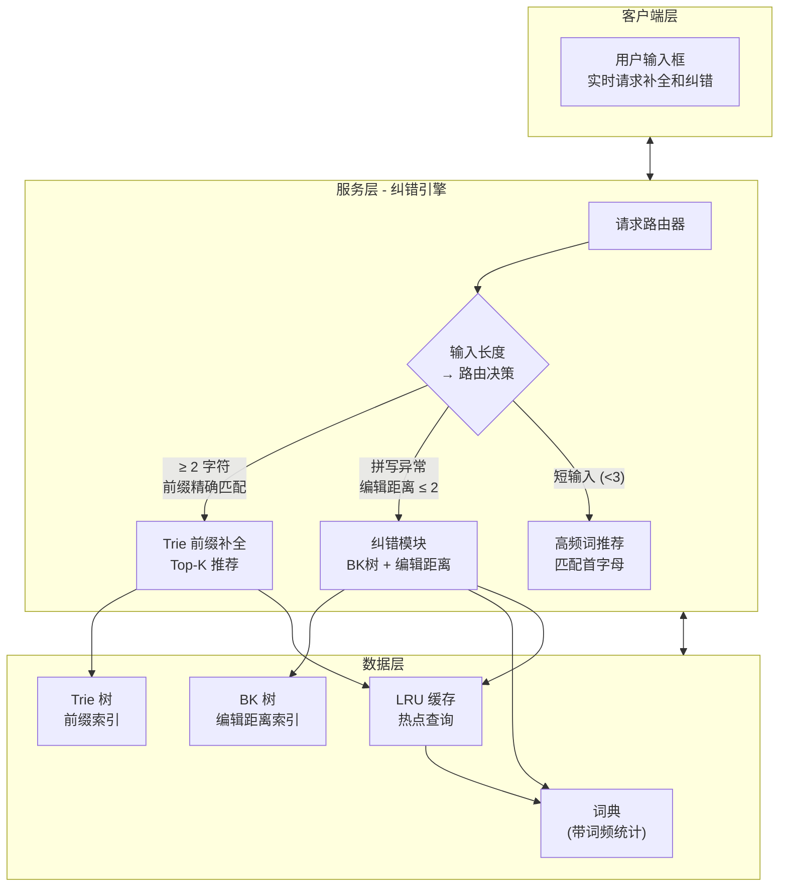

**工作流程**：

1. 用户每输入一个字符，前端发送请求到纠错引擎
2. 引擎根据输入长度和内容，决定走哪条路径
3. **前缀匹配路径**：Trie 树查询所有以输入为前缀的词，按词频取 Top-K
4. **纠错路径**：BK 树查找编辑距离 ≤ 2 的候选词，按（距离，词频）排序
5. **短输入路径**：当输入 < 3 个字符时，直接推荐高频词（前缀精确匹配 + 热度排序）
6. 结果合并、去重后返回给前端

#### 类图设计

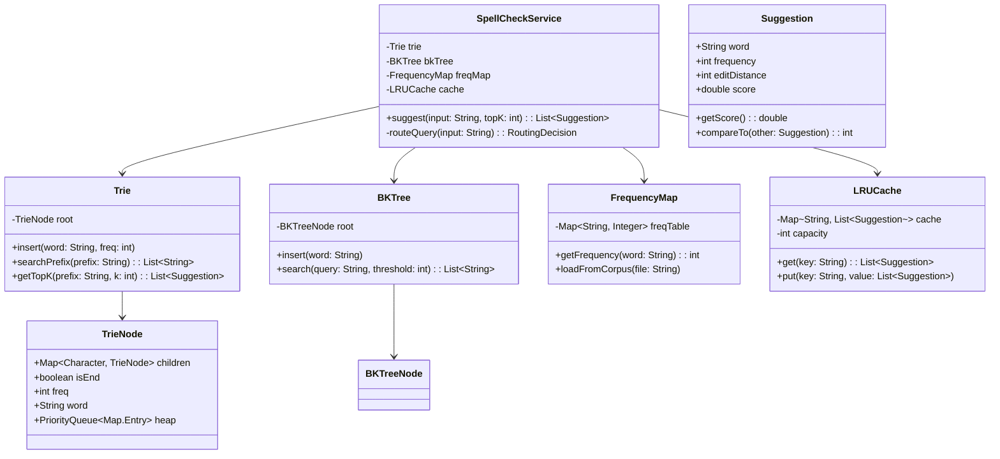

#### 核心代码实现

##### Trie 树（带词频排序）

```java
import java.util.*;

/**
 * 带词频统计的 Trie 树，支持前缀搜索 + Top-K 排序
 */
class Trie {

    static class TrieNode {
        Map<Character, TrieNode> children = new HashMap<>();
        boolean isEnd;
        int freq;         // 词频
        String word;      // 完整单词（仅在 isEnd = true 时有意义）
    }

    private TrieNode root;

    public Trie() {
        root = new TrieNode();
    }

    /** 插入单词及词频 */
    public void insert(String word, int frequency) {
        TrieNode cur = root;
        for (char c : word.toCharArray()) {
            cur.children.putIfAbsent(c, new TrieNode());
            cur = cur.children.get(c);
        }
        cur.isEnd = true;
        cur.word = word;
        cur.freq = frequency;
    }

    /** 获取前缀节点（DFS 起点） */
    private TrieNode getPrefixNode(String prefix) {
        TrieNode cur = root;
        for (char c : prefix.toCharArray()) {
            if (!cur.children.containsKey(c)) return null;
            cur = cur.children.get(c);
        }
        return cur;
    }

    /** 从前缀节点开始 DFS，收集所有完整单词 */
    private void collectWords(TrieNode node, List<Suggestion> results) {
        if (node.isEnd) {
            results.add(new Suggestion(node.word, node.freq, 0));
        }
        for (TrieNode child : node.children.values()) {
            collectWords(child, results);
        }
    }

    /** 返回前缀匹配的 Top-K 建议 */
    public List<Suggestion> getTopK(String prefix, int k) {
        TrieNode node = getPrefixNode(prefix);
        if (node == null) return Collections.emptyList();

        List<Suggestion> candidates = new ArrayList<>();
        collectWords(node, candidates);

        // 按词频降序排序
        candidates.sort((a, b) -> Integer.compare(b.frequency, a.frequency));

        return candidates.size() <= k
            ? candidates
            : candidates.subList(0, k);
    }
}
```

##### BK 树（纠错模块）

```java
import java.util.*;

/**
 * BK 树 — 用于编辑距离 ≤ 2 的拼写纠错
 */
class BKTree {

    static class BKTreeNode {
        String word;
        Map<Integer, BKTreeNode> children = new HashMap<>();

        BKTreeNode(String word) { this.word = word; }
    }

    private BKTreeNode root;
    private FrequencyMap freqMap;

    public BKTree(FrequencyMap freqMap) {
        this.freqMap = freqMap;
    }

    public void insert(String word) {
        BKTreeNode node = new BKTreeNode(word);
        if (root == null) {
            root = node;
            return;
        }
        BKTreeNode cur = root;
        while (true) {
            int dist = editDistance(cur.word, word);
            if (!cur.children.containsKey(dist)) {
                cur.children.put(dist, node);
                break;
            }
            cur = cur.children.get(dist);
        }
    }

    /** 查询编辑距离在阈值内的词，按相关性排序 */
    public List<Suggestion> search(String query, int threshold, int topK) {
        List<Suggestion> results = new ArrayList<>();
        if (root == null) return results;

        searchRecursive(root, query, threshold, results);

        // 按编辑距离升序, 词频降序排序
        results.sort((a, b) -> {
            if (a.editDistance != b.editDistance)
                return Integer.compare(a.editDistance, b.editDistance);
            return Integer.compare(b.frequency, a.frequency);
        });

        return results.size() <= topK
            ? results
            : results.subList(0, topK);
    }

    private void searchRecursive(BKTreeNode node, String query,
                                  int threshold, List<Suggestion> results) {
        int dist = editDistance(node.word, query);
        if (dist <= threshold) {
            int freq = freqMap.getFrequency(node.word);
            results.add(new Suggestion(node.word, freq, dist));
        }

        // 三角不等式剪枝
        int start = Math.max(0, dist - threshold);
        int end = dist + threshold;

        for (Map.Entry<Integer, BKTreeNode> entry : node.children.entrySet()) {
            if (entry.getKey() >= start && entry.getKey() <= end) {
                searchRecursive(entry.getValue(), query, threshold, results);
            }
        }
    }

    /** 优化的编辑距离（一维滚动数组） */
    private int editDistance(String s1, String s2) {
        if (s1.length() > s2.length()) {
            String tmp = s1; s1 = s2; s2 = tmp;
        }
        int m = s1.length(), n = s2.length();
        int[] dp = new int[n + 1];
        for (int j = 0; j <= n; j++) dp[j] = j;

        for (int i = 1; i <= m; i++) {
            int prev = dp[0];
            dp[0] = i;
            for (int j = 1; j <= n; j++) {
                int temp = dp[j];
                int cost = (s1.charAt(i - 1) == s2.charAt(j - 1)) ? 0 : 1;
                dp[j] = Math.min(Math.min(temp + 1, dp[j - 1] + 1), prev + cost);
                prev = temp;
            }
        }
        return dp[n];
    }
}
```

##### 结果评分模型

```java
/**
 * 建议结果的数据模型，包含评分逻辑
 */
class Suggestion {
    String word;
    int frequency;
    int editDistance;

    public Suggestion(String word, int frequency, int editDistance) {
        this.word = word;
        this.frequency = frequency;
        this.editDistance = editDistance;
    }

    /**
     * 综合评分：编辑距离越小越好，词频越高越好
     * score = α * (1 / (1 + editDistance)) + β * normalizedFrequency
     * 权重可调，实际线上 A/B 测试决定
     */
    public double getScore() {
        double alpha = 0.7;  // 编辑距离权重
        double beta = 0.3;   // 词频权重

        double distScore = 1.0 / (1.0 + editDistance);
        double freqScore = Math.log(1 + frequency) / 100.0;  // 对数归一化

        return alpha * distScore + beta * freqScore;
    }

    @Override
    public String toString() {
        return String.format("%s (freq=%d, dist=%d, score=%.2f)",
                             word, frequency, editDistance, getScore());
    }
}
```

##### 主服务入口

```java
import java.util.*;

/**
 * 拼写纠错与自动补全主服务
 */
class SpellCheckService {
    private Trie trie;
    private BKTree bkTree;
    private FrequencyMap freqMap;
    private Map<String, List<Suggestion>> cache;
    private static final int CACHE_CAPACITY = 10000;

    public SpellCheckService(String dictionaryFile) {
        this.freqMap = new FrequencyMap();
        this.freqMap.loadFromCorpus(dictionaryFile);

        this.trie = new Trie();
        this.bkTree = new BKTree(freqMap);

        // 加载词典到 Trie 和 BK 树
        for (Map.Entry<String, Integer> entry : freqMap.getAll().entrySet()) {
            trie.insert(entry.getKey(), entry.getValue());
            bkTree.insert(entry.getKey());
        }

        // LRU 缓存（用 LinkedHashMap 简化实现）
        this.cache = new LinkedHashMap<String, List<Suggestion>>(
            CACHE_CAPACITY, 0.75f, true) {
            @Override
            protected boolean removeEldestEntry(
                    Map.Entry<String, List<Suggestion>> eldest) {
                return size() > CACHE_CAPACITY;
            }
        };
    }

    /**
     * 主入口：根据输入返回自动补全与纠错建议
     */
    public List<Suggestion> suggest(String input, int topK) {
        if (input == null || input.isEmpty()) {
            return Collections.emptyList();
        }

        String key = input + ":" + topK;

        // 缓存命中
        synchronized (cache) {
            if (cache.containsKey(key)) {
                return cache.get(key);
            }
        }

        List<Suggestion> results = new ArrayList<>();
        String lowerInput = input.toLowerCase();

        // 路由决策
        if (lowerInput.length() < 3) {
            // 短输入：精确前缀匹配 + 高频词
            results.addAll(trie.getTopK(lowerInput, topK * 2));
        } else {
            // 前缀精确匹配
            List<Suggestion> prefixMatches = trie.getTopK(lowerInput, topK);
            results.addAll(prefixMatches);

            // 如果前缀匹配结果少于 topK，补充纠错建议
            if (prefixMatches.size() < topK) {
                List<Suggestion> corrections = bkTree.search(lowerInput, 2, topK);
                // 去重
                Set<String> existing = new HashSet<>();
                for (Suggestion s : results) existing.add(s.word);
                for (Suggestion s : corrections) {
                    if (!existing.contains(s.word)) {
                        results.add(s);
                        existing.add(s.word);
                    }
                }
            }
        }

        // 按综合评分排序、截断
        results.sort((a, b) -> Double.compare(b.getScore(), a.getScore()));
        if (results.size() > topK) {
            results = results.subList(0, topK);
        }

        // 写入缓存
        synchronized (cache) {
            cache.put(key, results);
        }

        return results;
    }

    // 简单测试
    public static void main(String[] args) {
        // 模拟字典加载
        FrequencyMap fm = new FrequencyMap();
        fm.getFreqTable().put("apple", 1000);
        fm.getFreqTable().put("application", 800);
        fm.getFreqTable().put("appetite", 300);
        fm.getFreqTable().put("appliance", 200);
        fm.getFreqTable().put("apply", 500);
        fm.getFreqTable().put("aple", 10);
        fm.getFreqTable().put("banana", 900);

        SpellCheckService service = new SpellCheckService(fm);

        System.out.println("输入 'appl':");
        for (Suggestion s : service.suggest("appl", 3)) {
            System.out.println("  " + s);
        }
        // 期望: application, apple, apply

        System.out.println("\n输入 'aple':");
        for (Suggestion s : service.suggest("aple", 3)) {
            System.out.println("  " + s);
        }
        // 期望: apple (编辑距离 1, 高频), apply (编辑距离 1), appetite (编辑距离 2)
    }
}

/**
 * 简化版词频表（生产环境应从语料库统计或查询日志加载）
 */
class FrequencyMap {
    private Map<String, Integer> freqTable = new HashMap<>();

    public Map<String, Integer> getFreqTable() { return freqTable; }

    public void loadFromCorpus(String file) {
        // 生产环境从文件加载
    }

    public void loadFromCorpus(FrequencyMap fm) {
        this.freqTable.putAll(fm.getFreqTable());
    }

    public int getFrequency(String word) {
        return freqTable.getOrDefault(word, 0);
    }

    public Set<Map.Entry<String, Integer>> getAll() {
        return freqTable.entrySet();
    }
}
```

#### 复杂度与性能分析

| 模块 | 操作 | 时间复杂度 | 说明 |
|------|------|-----------|------|
| **Trie 插入** | 索引构建 | $O(L)$ | L = 单词长度 |
| **Trie 前缀查询** | 在线请求 | $O(P + R)$ | P = 前缀长度, R = 结果集大小 |
| **BK 树插入** | 索引构建 | $O(L \cdot \log N)$ | L = 平均长度, N = 词典规模 |
| **BK 树查询** | 在线请求 | $O(\log N)$（平均） | 三角不等式剪枝效果好 |
| **LRU 缓存** | 热点命中 | $O(1)$ | 避免重复计算 |

**总体性能目标**：
- 单次建议请求延迟 < **20ms**（含缓存命中 < 1ms）
- 支持 QPS ≥ **10,000**（单机）
- 词典规模支持 **百万级** 词汇

#### 工程层面的进阶优化

1. **索引分片**：按首字母或词长对 BK 树分片，降低单树规模
2. **预热缓存**：加载 Top 10,000 高频查询到缓存
3. **异步建索引**：词典更新时异步重建 BK 树，避免阻塞线上请求
4. **前缀 + N-Gram 混合**：对于超大规模词典（千万级），先 N-Gram 预过滤再编辑距离精确计算
5. **Ray 关键词纠错**：结合音近（soundex）提升拼写相近但字母差异大的召回（如 `"knight"` ↔ `"night"`）
6. **埋点与 A/B 测试**：对建议点击率（CTR）持续跟踪，动态调整评分权重
