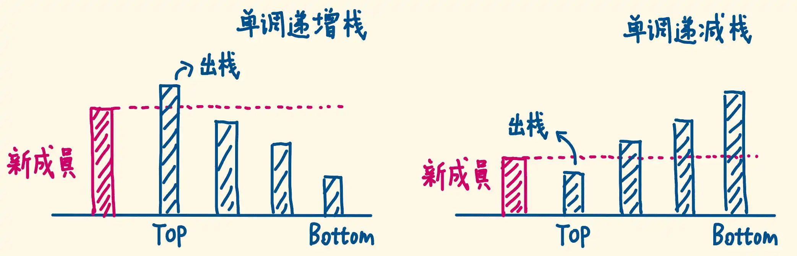
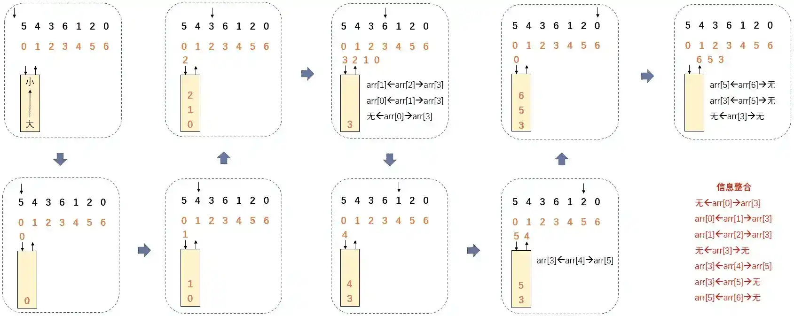
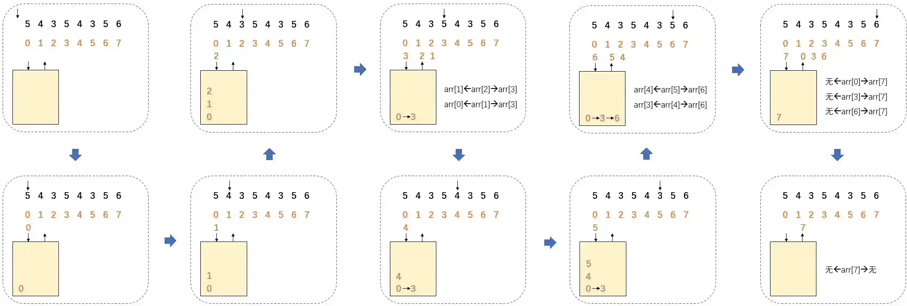

# 单调栈

## 介绍

>   栈（stack）是很简单的一种数据结构，先进后出的逻辑顺序，符合某些问题的特点，比如说函数调用栈。
>
>   单调栈实际上就是栈，只是利用了一些巧妙的逻辑，使得每次新元素入栈后，栈内的元素都保持有序（单调递增或单调递减）。
>
>   用简洁的话来说就是：单调栈就是栈内元素单调递增或者单调递减的栈，单调栈只能在栈顶操作。

单调栈：栈内的元素按照某种方式排序下单调递增或单调递减，如果新入栈的元素破坏的单调性，就弹出栈内元素，直到满足单调性。

单调栈分为单调递增栈和单调递减栈：

-   单调递增栈：栈中数据出栈的序列为单调递减序列；
-   单调递减栈：栈中数据出栈的序列为单调递增序列。



听起来有点像堆（heap）？不是的，单调栈用途不太广泛，只处理一种典型的问题，叫做 Next Greater Element。本文用讲解单调队列的算法模版解决这类问题，并且探讨处理「循环数组」的策略。

比如说给一个数组 `arr = { 5，4，6，7，2，3，0，1 }`，我想知道每一个元素左边比该元素大且离得最近的元素和右边比该元素大且离得最近的元素都是什么。

如果数组有N个元素，经典解法就是来到 i 位置，左边遍历直到比 arr[i] 大的元素为止，右边遍历直到比 arr[i] 大的元素为止。确定一个位置的时间复杂度为 O(N)，确定 N 个位置的时间复杂度就是$O(N^2)$。

## 流程（无重复）

单调栈本身是支持数组中有重复值的，但是我们为了讲清原理，举得例子中数组是没有重复值的。

首先，准备一个栈。

==栈中存储的是数组中元素的下标。为什么不存储元素？是因为下标不仅仅能够表示元素，还能表示元素在数组中的位置，携带的信息更多。==

-   如果要找到数组中每一个元素左右两边比该元素**大**且**离得最近**的元素，那么单调栈要保证从栈底到栈顶存储的下标对应的元素是**从大到小**的。

-   如果要找到数组中每一个元素左右两边比该元素**小**且**离得最近**的元素，那么单调栈要保证从栈底到栈顶存储的下标对应的元素是**从小到大**的。

本案例只找比该元素大且离得最近的元素。



从头开始遍历数组：

-   如果栈中没有元素，直接将元素的下标压栈。
-   如果栈中有元素，当前元素和栈顶的下标所指向的元素进行比较：
    -   当前元素比栈顶的下标所指向的元素小，将当前元素的下标压栈。
    -   当前元素比栈顶的下标所指向的元素大，栈顶的下标弹栈，同时记录原栈顶下标对应的元素的信息。
    -   原栈顶下标对应的元素左边比该元素大且离得最近的元素就是在栈中原栈顶下标压在下面的相邻下标对应的元素；
    -   原栈顶下标对应的元素右边比该元素大且离得最近的元素就是让它的下标弹栈的下标对应的元素。
    -   记录完之后，当前元素继续和新栈顶下标对应的元素进行比较。
    -   如果栈中只有一个下标，则该下标左边没有比该下标对应的元素大且离得最近的元素，右边正常。

当数组遍历完后，如果栈中还有下标，则进入清算阶段：

-   如果不是最后一个下标，依次弹出栈顶下标，原栈顶下标对应的元素左边比该元素大的且离得最近的元素就是在栈中原栈顶下标压在下面的相邻下标；原栈顶下标对应的元素右边没有比该元素大的且离得最近的元素。
-   是最后一个下标，弹出该下标，该下标对应的元素没有左边比该元素大的且离得最近的元素，也没有右边没有比该元素大的且离得最近的元素。

>   设计这种规则实际上就是在严格维护单调栈的单调性。

## 流程（有重复）

假设数组中有重复值，那么单调栈中存储的元素就不能只是一个下标了，可能会存储多个下标，这多个下标对应的数组中的值是一样的。

因此在实现上，我们偏向去使用一个链表来作为单调栈的元素类型，同一个链表中所有下标指向的元素值是一样的。

这种结构可以处理有重复值的数组，也可以处理无重复值的数组，是万能的。



流程上和无重复的大致相同，区别在于：

-   当前元素比栈顶的下标链表所指向的元素大，栈顶的下标链表弹栈，同时记录原栈顶下标链表中每一个下标对应的元素的信息。
-   原栈顶下标链表中每一个下标对应的元素左边比该元素大且离得最近的元素都是在栈中原栈顶下标链表压在下边的相邻下标链表的最后一个下标对应的元素；
-   原栈顶下标链表中每一个下标对应的元素有右边比该元素大且离得最近的元素就是让它的下标链表弹栈的下标链表中的下标对应的元素（此时下标链表中只会有一个元素）。
-   如果栈中只有一个下标链表，则该链表中所有下标左边没有比该下标对应的元素大且离得最近的元素，右边正常。
-   当前元素与栈顶的下标链表所指向的元素相等，将该元素对应的下标连接到栈顶的下标链表的末尾。

为什么说使用单调栈可以将时间复杂度降低至O(N)？

假设有数组中有 N 个元素，在我们计算出了所有元素的左右边比该元素大或者小且离得最近的元素的整个过程中，无论是使用有重复的模型还是无重复的模型，每一个元素都只进栈一次，出栈一次。

## 应用

单调栈最经典的应用，就是在一个数列里寻找距离元素最近的比其大/小的元素位置。

比如以下问题：对数列中的每个元素，寻找其左侧第一个比它大的元素位置。

显而易见的，我们可以遍历每个元素，然后从其位置往左寻找，这样的暴力做法时间复杂度是$O(n^2)$。

但单调栈可以将时间复杂度降到$O(n)$：我们只需从右往左遍历数列，依次将元素加入单调栈中，维护一个从栈底到栈顶递减的单调栈；

当某个元素被从栈内弹出时，代表它遇到了一个比它更大的元素，因为是从右往左遍历，所以该元素就是第一个比它大的元素，即所求。

如果最后仍在栈内，则说明该元素左侧没有比它更大的元素。

遍历的时间复杂度是O(n)，每个元素最多被加入单调栈一次、弹出来一次，所以总时间复杂度是O(n)。

对于要求解的这类问题，我们可以列一个简单的表格：

| 求解的问题     | 遍历方向 | 维护单调性（栈底->栈顶） |
| -------------- | -------- | ------------------------ |
| 左侧第一个更大 | 从右到左 | 单调递减                 |
| 左侧第一个更小 | 从右到左 | 单调递增                 |
| 右侧第一个更大 | 从左到右 | 单调递减                 |
| 右侧第一个更小 | 从左到右 | 单调递增                 |

## 维护单调栈

### 维护单调递增栈

-   遍历数组中每一个元素，执行入栈：每次入栈前先检验栈顶元素和进栈元素的大小。
-   如果栈空或进栈元素大于栈顶元素则直接入栈；如果进栈元素小于等于栈顶元素，则出栈，直至进栈元素大于栈顶元素。

```python
class Solution:
    def monostoneStack(self, arr: List[int]) -> List[int]:
        stack = []
        ans = 定义一个长度和 arr 一样长的数组，并初始化为 -1
        循环 i in  arr:
            while stack and arr[i] < arr[栈顶元素]:
                peek = 弹出栈顶元素
                ans[peek] = i - peek
            stack.append(i)
        return ans
```

### 维护单调递减栈

-   遍历数组中每一个元素，执行入栈：每次入栈前先检验栈顶元素和进栈元素的大小。
-   如果栈空或进栈元素小于栈顶元素则直接入栈；如果进栈元素大于等于栈顶元素，则出栈，直至进栈元素小于栈顶元素。

```python
class Solution:
    def monostoneStack(self, arr: List[int]) -> List[int]:
        stack = []
        ans = 定义一个长度和 arr 一样长的数组，并初始化为 -1
        循环 i in  arr:
            while stack and arr[i] > arr[栈顶元素]:
                peek = 弹出栈顶元素
                ans[peek] = i - peek
            stack.append(i)
        return ans
```

## 真题演练

| 题号 | 链接                                                         |
| ---- | ------------------------------------------------------------ |
| 496  | [下一个更大元素 I](https://leetcode.cn/problems/next-greater-element-i)（简单） |
| 503  | [下一个更大元素 II](https://leetcode.cn/problems/next-greater-element-ii/description/)（中等） |
| 739  | [每日温度](https://leetcode.cn/problems/daily-temperatures/)（中等） |
| 901  | [股票价格跨度](https://leetcode.cn/problems/online-stock-span)（中等） |
| 962  | [最大宽度坡](https://leetcode.cn/problems/online-stock-span)（中等） |
| 1019 | [链表中的下一个更大节点](https://leetcode.cn/problems/next-greater-node-in-linked-list/description/)（中等） |
| 42   | [接雨水](https://leetcode.cn/problems/trapping-rain-water/)（困难） |
| 84   | [柱状图中最大的矩形](https://leetcode.cn/problems/largest-rectangle-in-histogram/)（困难） |
| 402  | [移掉 K 位数字](https://leetcode.cn/problems/remove-k-digits/)（中等） |
| 316  | [去除重复字母](https://leetcode.cn/problems/remove-duplicate-letters/)（中等） |
| 321  | [拼接最大数](https://leetcode.cn/problems/create-maximum-number/)（困难） |
