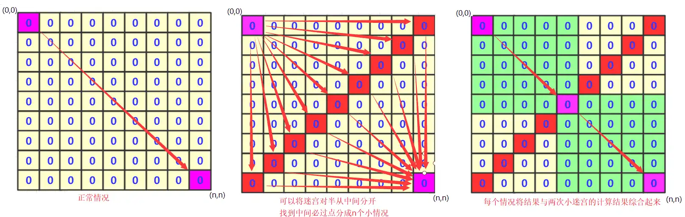

# 图论之双向BFS

当数据达到一定程度，我们使用简单的BFS肯定会爆炸的。就可能需要一些特殊的巧妙方法处理，比如剪枝优化、优先队列、A*、DFS套BFS，又或者利用一些非常厉害的数学方法比如康托展开(逆展开)等等。而今天在这里，我们谈谈**双向BFS**，体验一下算法的奥妙！

**适用场景**：

双向BFS适用于一些问题的拆分，比如在一个迷宫中从左上角到右下角有多少种路径。正常情况下，对整个迷宫进行搜索的复杂度是指数级别的。而通过双向BFS，我们可以将问题拆分为两部分，减少搜索的次数。

**原理**：

对于一个n x n的迷宫，我们可以将其按照对角线拆分为两个部分。即从左上角到中点的次数为n1，从中点到右下角的次数为n2。总的次数就是n1 * n2。通过这种方式，我们通过乘法减少了加法的运算次数，从而提高了效率。



**简单示例**：

考虑一个18 x 18的迷宫。如果直接进行全图搜索，复杂度大约是$2^{18}$。而使用双向BFS，我们将迷宫拆分成两个9 x 9的部分，总复杂度为$2^9$，大约是前者的平方根。

**优化效果**：

从搜索次数的角度来看，如果直接搜索全图的次数是n1 * n2，而使用双向BFS的次数是n1 + n2。如果n1和n2在1000左右，那么两者之间的差距就是平方根级别的。从搜索图形的角度来看，一次全图搜索相当于将一个n x n大小的迷宫转化为n次搜索，每次搜索大约是(n/2) x (n/2)大小的迷宫。因此，如果使用双向BFS，大约是n次搜索，每次搜索是(n/2) x (n/2)大小的迷宫。

**总结**：

双向BFS通过问题的拆分，减少了搜索的次数，从而提高了搜索效率。在一些大规模问题中，这种优化方法能够显著降低时间复杂度。

**例题实战**一下，就拿一道经典双向BFS问题**对称迷宫 25'**给大家展示一下吧！

>   题目描述

用EXCEL求解迷宫真香~

wlxsq有一个 N ∗ N 的网格迷宫，每一个网格都有一个字母编号。

他要从左上角 (1,1)出发，走到右下角(n,n)，由于wlxsq很懒，所以他每次只会往右或者往下走一格。

由于最后到终点的路径方案太多太多了，所以wlxsq想让你计算出所有不同的对称的路径个数。

例如：N=3

```
ABA
BBB
ABA
```

对称路径6条：有A B A B A(2条)、A B B B A(4条)

不同的对称路径有: 有A B A B A、A B B B A

>   输入描述

第一行输入一个数 N，表示迷宫的大小。

接下来输入 N ∗ N 的字母迷宫

>   输出描述

输出对称路径的数量

>   样例

输入3

```
ABA
BBB
ABA
```

输出

```
2
```

>   提示

【评测用例规模与约定】

-   对于 40% 的数据，2 < = N < = 11
-   对于 100% 的数据，2 < = N < = 18

**分析**：对于题目的要求还是很容易理解的，就是找到所有的**路径种类**，再判断其中是**对称路径**的有几个输出即可！

对于一个普通思考是这样的，首先是进行DFS，然后动态维护一个字符串，每次跑到最后判断这个路径字符串是否满足对称要求，如果满足那么就添加到容器中进行判断。可惜很遗憾这样是超时的，仅能通过40%的样例。

接着用普通BFS进行尝试，维护一个node节点，每次走的时候路径储存起来其实这个效率跟DFS差不多依然超时。只能通过40%数据。

**接下来就开始双向BFS进行分析**！

(1) 既然只能右下，那么对角线的那个位置的肯定是中间的那个字符串的！**它的存在不影响是否对称的**(n*n的迷宫路径长度为`n-1 + n`为奇数).

(2) 我们判断路径是否对称，只需要判断从`(1,1)到对角节点k`(设为k节点)的路径**有没有和**从`(n,n)到k`相同的。**如果有路径相同的那么就说明这一对构成对称路径**

(3) **在具体实现上**，我们对**每个对角线节点**可以进行两次BFS(一次左上到(1,1),一次右下到(n,n)).并且将路径放到两个hashset(set1,set2)中，跑完之后用遍历其中一个hashset中的路径，看看另一个set是否存在该路径，如果存在就说明这个是对称路径放到 **总的hashset(set) 中**。对角线每个位置都这样判断完最后只需要输出总的hashset(set)的集合大小即可！

ac代码如下：

```java
import java.util.ArrayDeque;
import java.util.HashSet;
import java.util.Queue;
import java.util.Scanner;
import java.util.Set;

public class test2 {
    static class node {
        int x;
        int y;
        String path = "";

        public node() {
        }

        public node(int x, int y, String team) {
            this.x = x;
            this.y = y;
            this.path = team;
        }
    }

    public static void main(String[] args) {
        Scanner sc = new Scanner(System.in);
        Set<String> set = new HashSet<String>();//储存最终结果
        int n = Integer.parseInt(sc.nextLine());
        char map[][] = new char[n][n];
        for (int i = 0; i < n; i++) {
            String string = sc.nextLine();
            map[i] = string.toCharArray();
        }
        Queue<node> q1 = new ArrayDeque<node>();//左上的队列
        Queue<node> q2 = new ArrayDeque<node>();//右下的队列
        for (int i = 0; i < n; i++) {
            q1.clear();
            q2.clear();
            Set<String> set1 = new HashSet<String>();//储存zuoshang
            Set<String> set2 = new HashSet<String>();//储右下
            q1.add(new node(i, n - 1 - i, "" + map[i][n - 1 - i]));
            q2.add(new node(i, n - 1 - i, "" + map[i][n - 1 - i]));
            while (!q1.isEmpty() && !q2.isEmpty()) {
                node team = q1.poll();
                node team2 = q2.poll();
                if (team.x == n - 1 && team.y == n - 1)//到终点，将路径储存
                {
                    //System.out.println(team2.path);
                    set1.add(team.path);
                    set2.add(team2.path);
                } else {
                    if (team.x < n - 1)//可以向下
                    {
                        q1.add(new node(team.x + 1, team.y, team.path + map[team.x + 1][team.y]));
                    }
                    if (team.y < n - 1)//可以向右
                    {
                        q1.add(new node(team.x, team.y + 1, team.path + map[team.x][team.y + 1]));
                    }
                    if (team2.x > 0)//上
                    {
                        q2.add(new node(team2.x - 1, team2.y, team2.path + map[team2.x - 1][team2.y]));
                    }
                    if (team2.y > 0)//左
                    {
                        q2.add(new node(team2.x, team2.y - 1, team2.path + map[team2.x][team2.y - 1]));
                    }
                }

            }
            for (String va : set1) {
                if (set2.contains(va)) {
                    set.add(va);
                }
            }

        }
        System.out.println(set.size());
    }
}
```

