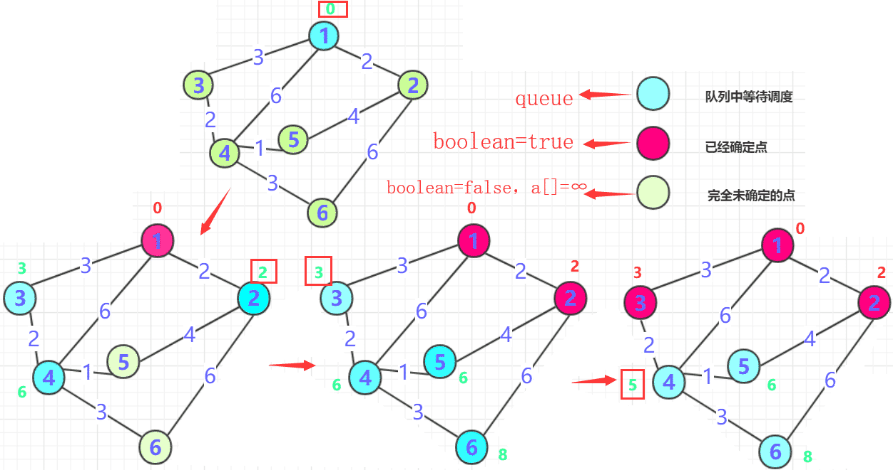
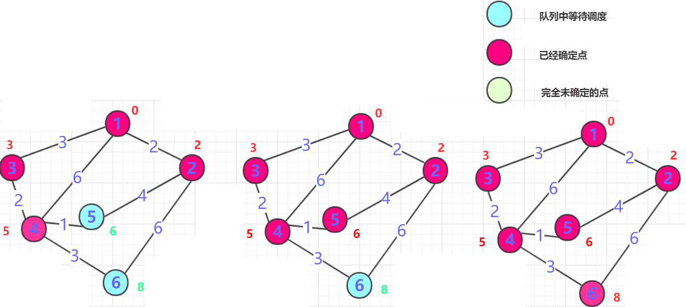

# dijkstra算法

**Dijkstra算法干啥的？**

Dijkstra是用来**求单源最短路径**的，也就是在一个图中，从一个点计算到达其他点的最短距离。

**单源**什么意思？

一个源头，从一个顶点出发，Dijkstra算法只能求一个顶点到其他点的最短距离而**不能任意两点**。

和**bfs**求的最短路径有什么区别？

bfs求的与其说是路径，不如说是**次数**。因为bfs他是按照队列一次一次进行加入相邻的点，而两点之间**没有权值或者权值相等**(代价相同)。bfs求最短路径一般无权值路径(只代表联通新)或者权值相等，仅仅用次数就能表示路径长短的情况，最典型的就是迷宫问题bfs搜索移动一次路径为1就加一次。

Dijkstra在处理具体实例的应用还是很多的，因为具体的问题其实带权更多一些。

## 算法分析

对于一个算法，首先要理解它的**运行流程**，对于Dijkstra算法而言，首先要知道其适用条件和环境：

一个连通图，若干节点(节点可能有数值)，但是路径一定有权值并且**不能为负**(否则Dijkstra就不适用)。

Dijkstra的核心思想是贪心算法的思想，那么我们的Dijkstra是如何贪心的呢？对于一个点，求图中所有点的最短路径，如果没有正确的方法胡乱想确实很难算出来，并且如果暴力匹配复杂度呈指数级上升不适合解决实际问题。那么我们该怎么想呢？

首先，**Dijkstra算法实现上需要这些前提**：

- Dijkstra处理的是带正权值的有权图，那么就需要一个**二维数组**（如果空间大用List数组）存储各个点到点之间边的权值大小**(邻接矩阵或者邻接表存储)** 。

- 需要一个**boolean数组**判断哪些点已经确定最短长度路径，那些点没有确定。用一个 **int数组**记录距离(**在算法执行过程有些点最短路径可能被多次更新**)。

- 需要**优先队列**加入**已经确定点的周围点**。每次抛出从起点最短路径的那个点()，直到所有点路径确定最短为止。

**简单的概括流程为**：

 -  一般从选定点开始抛入优先队列。（路径一般为0），`boolean数组`标记0的位置(最短为0) , 然后0`周围连通的点`抛入优先队列中（可能是node类），并把各个点的距离记录到对应数组内(**如果小于就更新，大于就不动，初始第一次是无穷肯定会更新**)，第一次就结束了
-  从队列中抛出`距离最近`的那个点`B`（**第一次就是0周围邻居**）。这个点距离一定是最近的（所有权值都是正的，点的距离只能越来越长。）标记这个点为`true`，**并且将这个点的邻居加入队列**(下一次确定的最短点在前面未确定和这个点邻居中产生),并更新通过`B`点计算各个位置的长度，如果小于则更新！

-  重复二的操作，直到所有点都确定。


## 算法实现

```java
import java.util.Comparator;
import java.util.PriorityQueue;
import java.util.Queue;

public class dijkstra {
    static class node {
        int x; //节点编号
        int length;//长度

        public node(int x, int length) {
            this.x = x;
            this.length = length;
        }
    }


    static Comparator<node> com = (o1, o2) -> o1.length - o2.length;

    private static void init_map(int[][] map) {
        map[0][1] = 2;
        map[0][2] = 3;
        map[0][3] = 6;
        map[1][0] = 2;
        map[1][4] = 4;
        map[1][5] = 6;
        map[2][0] = 3;
        map[2][3] = 2;
        map[3][0] = 6;
        map[3][2] = 2;
        map[3][4] = 1;
        map[3][5] = 3;
        map[4][1] = 4;
        map[4][3] = 1;
        map[5][1] = 6;
        map[5][3] = 3;
    }


    public static void main(String[] args) {
        int[][] map = new int[6][6];//记录权值，顺便记录链接情况，可以考虑附加邻接表
        init_map(map);//初始化
        boolean[] bool = new boolean[6];//判断是否已经确定
        int[] len = new int[6];//长度
        for (int i = 0; i < 6; i++) {
            len[i] = Integer.MAX_VALUE;
        }
        Queue<node> q1 = new PriorityQueue<>(com);
        len[0] = 0;//从0这个点开始
        q1.add(new node(0, 0));
        int count = 0;//计算执行了几次dijkstra
        while (!q1.isEmpty()) {
            node t1 = q1.poll();
            int index = t1.x;//节点编号
            int length = t1.length;//节点当前点距离
            bool[index] = true;//抛出的点确定
            count++;//其实执行了6次就可以确定就不需要继续执行了  这句可有可无，有了减少计算次数
            for (int i = 0; i < map[index].length; i++) {
                if (map[index][i] > 0 && !bool[i]) {
                    node node = new node(i, length + map[index][i]);
                    if (len[i] > node.length)//需要更新节点的时候更新节点并加入队列
                    {
                        len[i] = node.length;
                        q1.add(node);
                    }
                }
            }
        }
        for (int i = 0; i < 6; i++) {
            System.out.println(len[i]);
        }
    }
}
```

执行结果：

```
0
2
3
5
6
8
```

当然，dijkstra算法比较灵活，实现方式也可能有点区别，但是思想是不变的：一个贪心思路。dijkstra执行一次就能够确定一个点，所以只需要执行点的总和次数即可完成整个算法。

