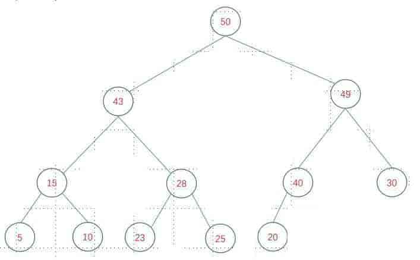
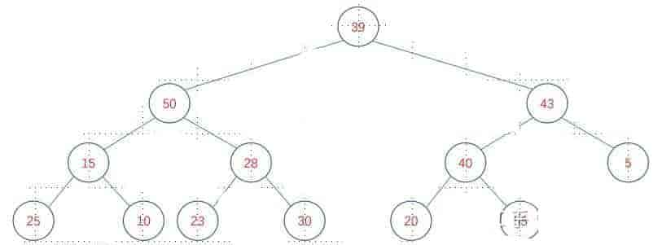
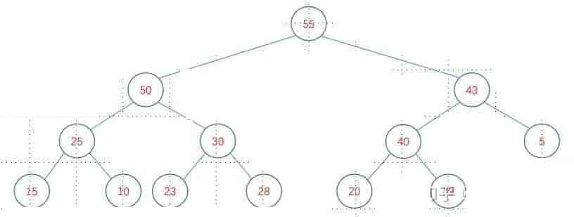
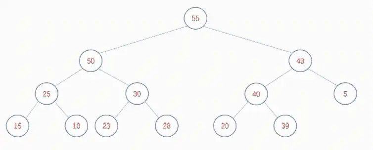
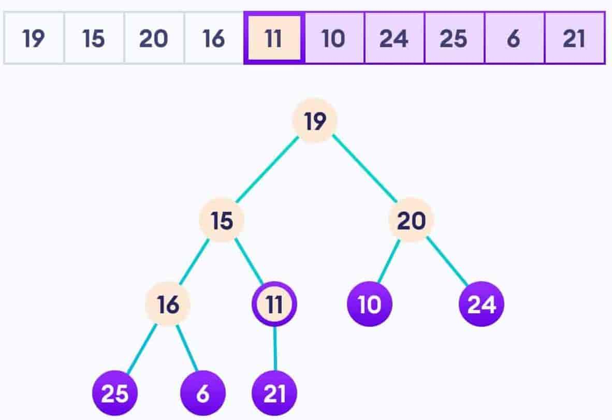

# 堆

## 堆简介

堆（Heap）是一种特殊的树形数据结构，它满足以下两个条件：

-   堆是一棵完全二叉树，即除了最后一层，其他层都是满的，最后一层从左到右填满。

-   堆中每个节点的值都大于等于（或小于等于）其子节点的值，这种性质称为堆序性。

根据堆序性，堆可以分为两种类型：

- 大根堆（Max Heap）：每个节点的值都大于等于其子节点的值。
- 小根堆（Min Heap）：每个节点的值都小于等于其子节点的值。

## 堆的性质

堆可以使用数组来实现。

>   要注意的是，索引0没有存放任何值！ 数组是从索引1开始存放的。

可以根据任意节点的下标，通过公式计算出子节点的下标。假设节点P的下标为i，

- 它的左子节点为2i+1，右子节点为2i+2
- 它的父节点为(i-1)/2

例如，数组 data = [50 43 49 15 28 40 30 5 10 23 15 20] 可以表示上面的堆。数组中元素的排放顺序表示节点按照从顶到底、每一层从左到右的顺序放置。堆之所以可以放到数组中，是因为它是一颗完全二叉树。



## 堆实现

### 创建

堆的创建有两种方式。第一种是自上向下从一个空数组中创建堆，第二种是自下向上将已有的数组调整为堆。

#### 自上向下

从一个空数组开始，每一个新节点都放到当前堆的末尾，如果发现插入节点之后破坏了堆的特性，那么将新节点与其父节点进行交换，直至重新调整为堆。假如现在有一段数据流：

```
49 50 43 15 28 40 5 25 10 23 30 20 55
```

自上向下的过程：

<video src="./assets/img-wwoy-w.mp4"></video>

核心逻辑在于每次插入新节点之后，如果破坏了堆的结构，只要和父节点进行交换，直至调整为堆即可。该算法的时间复杂度有O(nlgn)，不是很理想，数据量比较大时不适合这种方案。

#### 自下向上

一颗完整的二叉树可以分解成根节点，左子树，右子树。对于左右子树又可以分解成更多的子树。如果我们将树中的每个节点都看做一颗树，只要每棵树符合堆的特性，那么整棵树也是符合堆的特性的。基于以上思想，前人提出了一种自下向上的创建堆地方式。树中最小的子树其实是叶子节点，由于叶子节点没有子树，可以认为是符合堆的特性的。所以，我们就从最后一个非叶子节点开始，按照从下向上，从右到左的顺序，调整每个子树符合堆的特性，直到根节点，那么整棵树就成了堆。

假设一共有n的元素，最后一个非叶子节点的下标是多少呢？答案是n/2 -1。

>   证明如下：
>
>   假设堆中度为0、度为1、度为2的节点分别有n0、n1、n2个，那么n = n0 + n1 + n2，又知道n0 = n2 +1，那么n = 2*n2 + n1 +1。
>
>   （1）n1如果为0：最后一个非叶子节点的下标为n2 - 1，即(n - n1 - 1)/2 - 1= n/2 - 3/2，由于n = 2*n2 + 1是奇数，所以n/2 - 1向下取整等于n/2 - 3/2。
>
>   （2）n1如果为1：那么最后一个非叶子节点的下标为n2，即(n - n1 -1)/2 = n/2 - 1。
>
>   对于完全二叉树来讲，n1要么为0要么为1。因此，综上所述，最后一个非叶子节点的下标为n/2 - 1。

既然找到了最后一个非叶子节点P，那就从P节点开始自下向上，自右向左的调整每一个遇到的子树为堆，最终整棵树成为堆。

假设现在存在数组data = [39 50 43 15 28 40 5 25 10 23 30 20 55]，展开之后是这样的：



按照自下向上的算法调整是这样的：

<video src="./assets/img-wwoy-r.mp4"></video>

该算法的时间复杂度是O(n)，通常情况下优于自上向下创建堆的方式。

### 添加

在堆中插入一个新的元素，通常会放入到数组的末尾，如果插入到头部或者中间某个位置，有两个缺陷。第一，会移动数组里大量数据，第二，严重破坏堆结构，只能依靠自下向上的方式调整所有子树，才能保持整棵树的堆结构，得不偿失。

如果将新元素插入到数组末尾，仅仅有可能破坏少量子树的堆结构，也能在短时间内调整完毕。假如有以下堆结构：



在末尾插入60节点，调整方式如下：



可以发现，无论是自上向下创建堆还是自下向上调整堆，又或者在堆中插入新的元素，核心逻辑总是调整堆的过程。关键在于，二叉树中每个节点总是有两个身份，既是某颗子树(P子树)的根节点，也是其父节点所在树(Q子树)的子节点。调整堆的过程其实就是既要保证P子树是堆，也要保证Q子树是堆。

### 删除

在堆中删除某个元素，通常我们会删除堆的根节点，因为它是有价值的，要么是最大值要么是最小值。为了避免删除头结点之后数组元素大量移动，前人想出一个巧妙的方式。那就是将最后一个叶子节点和根结点进行交换。最后一个叶子节点成了根节点，根节点成了最后一个叶子节点。这时，我们删除元素不必移动数组数据，但是破坏了堆结构，怎么办呢？老样子，调整堆，调整方式和上面介绍的方法一致，就不多说了。

我们当然可以删除数组中任一元素，方法和删除根节点是一致的。但是，我们往往不会这么做，因为在堆中除了根节点，其他元素没有特别的地方，价值不大。

### 堆化

重新排列堆中结点的过程，以确保满足堆属性，可以将一个不符合堆属性的列表调整为堆。实现堆功能。

堆化通常**从堆底部**开始，因为它在满足堆属性所需的比较和交换次数方面更有效率。

堆化的工作原理，要对数组进行堆化，首先要假设所有叶结点都满足堆属性。这是因为所有叶结点都没有子结点可以比较，仅需要和父节点进行比较即可！也就是需要找到最后一个父节点。一种方法是判断是否有子节点，没有放弃，有说明是父节点。二种方法是用公式直接计算最后一个父节点位置。



上图，最后一个父节点时11。可以从21开始，逐个判断是否有子节点，找到11。或者通过公式：数量10，索引号是9,；(9-1)//2=4,求得索引号是4，循环数是5。range(5)。或者range(10)。两种方法。

### 示例

以下是一个简单的Python示例代码，演示了如何使用数组实现大根堆：

```python
class MaxHeap:
    def __init__(self):
        self.heap = []

    def push(self, value):
        self.heap.append(value)
        self._sift_up(len(self.heap) - 1)

    def pop(self):
        if len(self.heap) == 0:
            raise ValueError("Heap is empty")
        value = self.heap[0]
        last_value = self.heap.pop()
        if len(self.heap) > 0:
            self.heap[0] = last_value
            self._sift_down(0)
        return value

    def _sift_up(self, index):
        parent_index = (index - 1) // 2
        while index > 0 and self.heap[index] > self.heap[parent_index]:
            self.heap[index], self.heap[parent_index] = self.heap[parent_index], self.heap[index]
            index = parent_index
            parent_index = (index - 1) // 2

    def _sift_down(self, index):
        left_child_index = 2 * index + 1
        right_child_index = 2 * index + 2
        largest_index = index
        if left_child_index < len(self.heap) and self.heap[left_child_index] > self.heap[largest_index]:
            largest_index = left_child_index
        if right_child_index < len(self.heap) and self.heap[right_child_index
```

## Python中的heapq模块

Python中的heapq模块提供了一些堆操作的函数，包括将列表转换为堆、将元素添加到堆、从堆中删除元素、获取堆中的最小值或最大值等。heapq模块使用的是小根堆，即堆中的最小值在堆顶。

常用的heapq函数：

- heapify(iterable)：将可迭代对象转换为堆。
- heappush(heap, item)：将元素添加到堆中。
- heappop(heap)：从堆中删除并返回最小值。
- heappushpop(heap, item)：将元素添加到堆中，并返回堆中的最小值。
- heapreplace(heap, item)：从堆中删除并返回最小值，并将元素添加到堆中。
- nlargest(n, iterable[, key])：返回可迭代对象中最大的n个元素。
- nsmallest(n, iterable[, key])：返回可迭代对象中最小的n个元素。

使用示例：

```python
import heapq

# 将列表转换为堆
heap = [3, 1, 4, 1, 5, 9, 2, 6, 5, 3

# 将列表转换为堆
heap = [3, 1, 4, 1, 5, 9, 2, 6, 5, 3]
heapq.heapify(heap)
print(heap)

# 将元素添加到堆中
heapq.heappush(heap, 0)
print(heap)

# 从堆中删除并返回最小值
min_value = heapq.heappop(heap)
print(min_value)
print(heap)

# 将元素添加到堆中，并返回堆中的最小值
min_value = heapq.heappushpop(heap, 7)
print(min_value)
print(heap)

# 从堆中删除并返回最小值，并将元素添加到堆中
min_value = heapq.heapreplace(heap, 8)
print(min_value)
print(heap)

# 返回可迭代对象中最大的n个元素
largest = heapq.nlargest(3, heap)
print(largest)

# 返回可迭代对象中最小的n个元素
smallest = heapq.nsmallest(3, heap)
print(smallest)
```

## 堆的应用

堆的主要应用是在排序算法中，例如**堆排序（Heap Sort）**和**优先队列（Priority Queue）**。堆排序是一种基于堆的排序算法，它的时间复杂度为O(nlogn)，空间复杂度为O(1)。优先队列是一种数据结构，它可以用堆来实现，用于维护一组元素中的最大值或最小值。

### 优先队列

堆常用于实现优先队列，其中元素按照优先级顺序排列。在每次插入元素时，堆会自动调整以确保最高（或最低）优先级的元素位于堆的根部。

```
import heapq

class PriorityQueue:
    def __init__(self):
        self.heap = []

    def push(self, item, priority):
        heapq.heappush(self.heap, (priority, item))

    def pop(self):
        _, item = heapq.heappop(self.heap)
        return item

# 示例
priority_queue = PriorityQueue()
priority_queue.push("Task 1", 3)
priority_queue.push("Task 2", 1)
priority_queue.push("Task 3", 2)

print("Priority Queue:")
while len(priority_queue.heap) > 0:
    print(priority_queue.pop())
```

### 堆排序

堆排序是一种原地排序算法，使用堆来进行排序操作。

```
import heapq

def heap_sort(arr):
    heapq.heapify(arr)
    sorted_arr = [heapq.heappop(arr) for _ in range(len(arr))]
    return sorted_arr

# 示例
unsorted_array = [3, 1, 4, 1, 5, 9, 2, 6, 5, 3, 5]
sorted_array = heap_sort(unsorted_array)

print("Unsorted Array:", unsorted_array)
print("Sorted Array:", sorted_array)
```

## 参考文档

-   [数据结构与算法-堆](https://zhuanlan.zhihu.com/p/53985750)
-   [小白的算法笔记：堆排序](https://zhuanlan.zhihu.com/p/31440467)
-   [python 数据结构 堆](https://zhuanlan.zhihu.com/p/1837303547)
