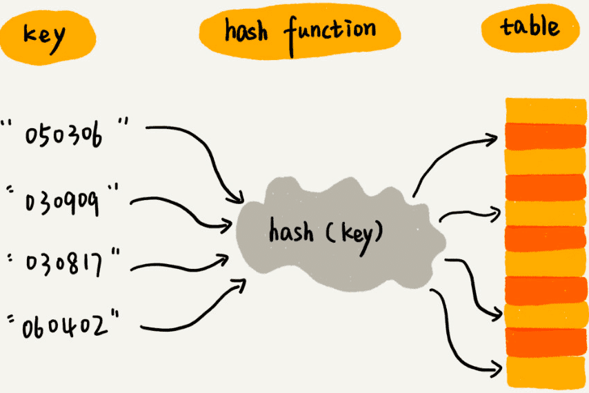
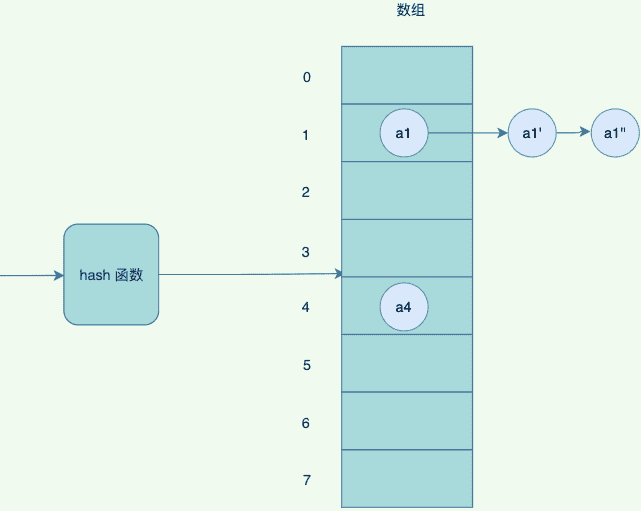
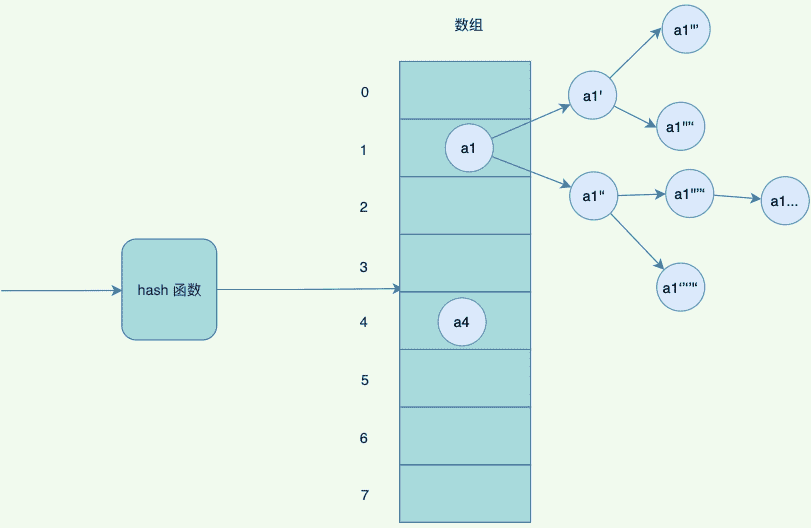
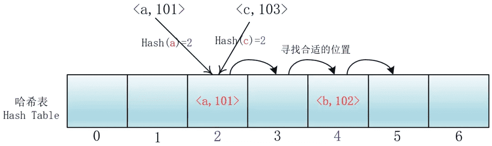
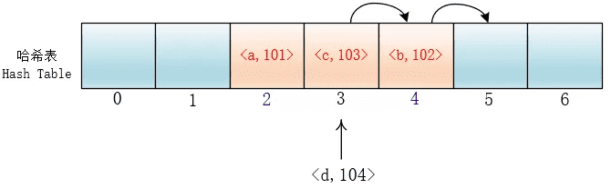
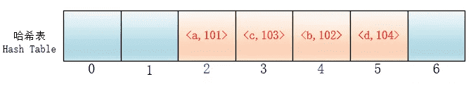
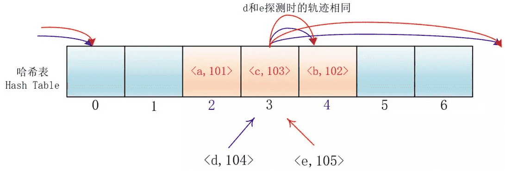
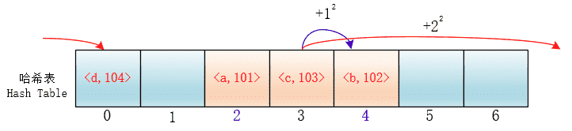

# 哈希表

## 散列表

散列表（Hash Table），也称为哈希表，是一种基于哈希函数（Hash Function）实现的数据结构，它支持快速的插入、删除和查找操作。

散列表将每个元素的关键字（Key）通过哈希函数映射到一个固定的位置，称为散列值（Hash Value），然后将元素存储在该位置上。



## 哈希函数

散列表的核心是哈希函数，它将任意长度的输入（例如字符串、数字等）映射为固定长度的输出，通常是一个整数。

哈希函数应该满足以下要求：

- 一致性：对于相同的输入，哈希函数应该产生相同的输出。
- 均匀性：哈希函数应该将输入均匀地映射到输出空间中的不同位置。
- 高效性：哈希函数应该能够在常数时间内计算出输出。

⼀般常⽤的`hash`函数有：

- 直接定址法：取出关键字或者关键字的某个线性函数的值为哈希函数，⽐如H(key) = key 或者H(key) = a * key + b
- 数字分析法：对于可能出现的数值全部了解，取关键字的若⼲数位组成哈希地址
- 平⽅取中法：取关键字平⽅后的中间几位作为哈希地址
- 折叠法：将关键字分割成为位数相同的几部分（最后⼀部分的位数可以不同），取这几部分的叠加和（舍去进位），作为哈希地址。
- 除留余数法：取关键字被某个不⼤于散列表表⻓m 的数p 除后所得的余数为散列地址。即h ash(k)=k mod p，p< =m 。不仅可以对关键字直接取模，也可在折叠法、平⽅取中法等运算之后取模。对p 的选择很重要，⼀般取素数或m，若p 选择不好，容易产⽣冲突。
- 随机数法：取关键字的随机函数值作为它的哈希地址。

但是这些⽅法，都⽆法避免哈希冲突，只能有意识的减少。那处理hash 冲突，⼀般有哪些⽅法呢？

## 解决哈希冲突的方法

散列表的冲突（Collision）是指不同的元素映射到了同一个位置上，这时需要解决冲突的方法。

常见的解决冲突的方法有以下几种：

### 拉链法

链接法（Chaining）：将散列值相同的元素存储在同一个链表中。

HashMap，HashSet其实都是采用的拉链法来解决哈希冲突的，就是在每个位桶实现的时候，采用链表的数据结构来去存取发生哈希冲突的输入域的关键字（也就是被哈希函数映射到同一个位桶上的关键字）



但是如果hash 冲突⽐较严重，链表会⽐较⻓，查询的时候，需要遍历后⾯的链表，因此JDK优化了⼀版，链表的⻓度超过阈值的时候，会变成红⿊树，红⿊树有⼀定的规则去平衡⼦树，避免退化成为链表，影响查询效率。



但是你肯定会想到，如果数组太小了，放了比较较多数据了，怎么办？再放冲突的概率会越来越⾼，其实这个时候会触发⼀个扩容机制，将数组扩容成为 2 倍⼤⼩，重新hash 以前的数据，哈希到不同的数组中。

hash 表的优点是查找速度快，但是如果不断触发重新 hash , 响应速度也会变慢。同时，如果希望范围查询，hash 表不是好的选择。

拉链法的装载因子为n/m（n为输入域的关键字个数，m为位桶的数目）

### 开放地址法

所谓开放地址法就是发生冲突时在散列表（也就是数组里）里去寻找合适的位置存取对应的元素，就是所有输入的元素全部存放在哈希表里。也就是说，位桶的实现是不需要任何的链表来实现的，换句话说，也就是这个哈希表的装载因子不会超过1。

它的实现是在插入一个元素的时候，先通过哈希函数进行判断，若是发生哈希冲突，就以当前地址为基准，根据再寻址的方法（探查序列），去寻找下一个地址，若发生冲突再去寻找，直至找到一个为空的地址为止。

开放地址法（Open Addressing）：将冲突的元素存储在散列表中的其他位置，例如线性探测、二次探测、双重散列等。

探查序列的方法：

- 线性探查

- 平方探测

- 伪随机探测

- 再散列法

#### 线性探查

di =1，2，3，…，m-1；这种方法的特点是：冲突发生时，顺序查看表中下一单元，直到找出一个空单元或查遍全表。



但是这样会有一个问题，就是随着键值对的增多，会在哈希表里形成连续的键值对。当插入元素时，任意一个落入这个区间的元素都要一直探测到区间末尾，并且最终将自己加入到这个区间内。这样就会导致落在区间内的关键字Key要进行多次探测才能找到合适的位置，并且还会继续增大这个连续区间，使探测时间变得更长，这样的现象被称为“一次聚集（primary clustering）”。





#### 平方探测

在探测时不一个挨着一个地向后探测，可以跳跃着探测，这样就避免了一次聚集。

di=12，-12，22，-22，…，k2，-k2；这种方法的特点是：冲突发生时，在表的左右进行跳跃式探测，比较灵活。虽然平方探测法解决了线性探测法的一次聚集，但是它也有一个小问题，就是关键字key散列到同一位置后探测时的路径是一样的。这样对于许多落在同一位置的关键字而言，越是后面插入的元素，探测的时间就越长。





这种现象被称作“二次聚集(secondary clustering)”,其实这个在线性探测法里也有。

#### 伪随机探测

di=伪随机数序列；具体实现时，应建立一个伪随机数发生器，（如i=(i+p) % m），生成一个位随机序列，并给定一个随机数做起点，每次去加上这个伪随机数++就可以了。

#### 再散列法

再散列法其实很简单，就是再使用哈希函数去散列一个输入的时候，输出是同一个位置就再次散列，直至不发生冲突位置

缺点：每次冲突都要重新散列，计算时间增加。一般不用这种方式

## 实现示例

以下是Python实现一个散列表的示例：

```python
class HashTable:
    def __init__(self):
        self.size = 10
        self.table = [[] for _ in range(self.size)]

    def hash_function(self, key):
        return key % self.size

    def insert(self, key, value):
        hash_value = self.hash_function(key)
        for pair in self.table[hash_value]:
            if pair[0] == key:
                pair[1] = value
                return
        self.table[hash_value].append([key, value])

    def search(self, key):
        hash_value = self.hash_function(key)
        for pair in self.table[hash_value]:
            if pair[0] == key:
                return pair[1]
        return None

    def delete(self, key):
        hash_value = self.hash_function(key)
        for i, pair in enumerate(self.table[hash_value]):
            if pair[0] == key:
                del self.table[hash_value][i]
                return
```

这个散列表使用一个列表来存储元素，每个元素是一个键值对，包括键和值。散列表使用一个哈希函数将键映射为散列值，然后将键值对存储在散列表的对应位置上。散列表支持插入元素、查找元素、删除元素等操作，其中插入和查找操作的时间复杂度为O(1)。

## 复杂度

散列表的时间复杂度取决于哈希函数的均匀性和解决冲突的方法。如果哈希函数和解决冲突的方法都很好，散列表的插入、删除和查找操作的平均时间复杂度可以达到O(1)。

### Python集合操作的时间复杂度

| 操作                 | 时间复杂度               |
| :------------------- | :----------------------- |
| 添加元素             | O(1)                     |
| 删除元素             | O(1)                     |
| 判断元素是否在集合中 | O(1)                     |
| 集合并集             | O(len(s1) + len(s2))     |
| 集合交集             | O(min(len(s1), len(s2))) |
| 集合差集             | O(len(s1))               |
| 集合对称差集         | O(len(s1))               |

### Python字典操作的时间复杂度

| 操作     | 时间复杂度 |
| :------- | :--------- |
| 获取元素 | O(1)       |
| 添加元素 | O(1)       |
| 删除元素 | O(1)       |
| 遍历字典 | O(n)       |
