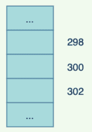
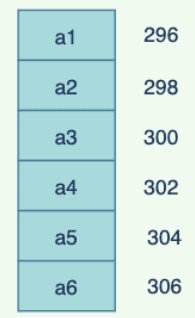
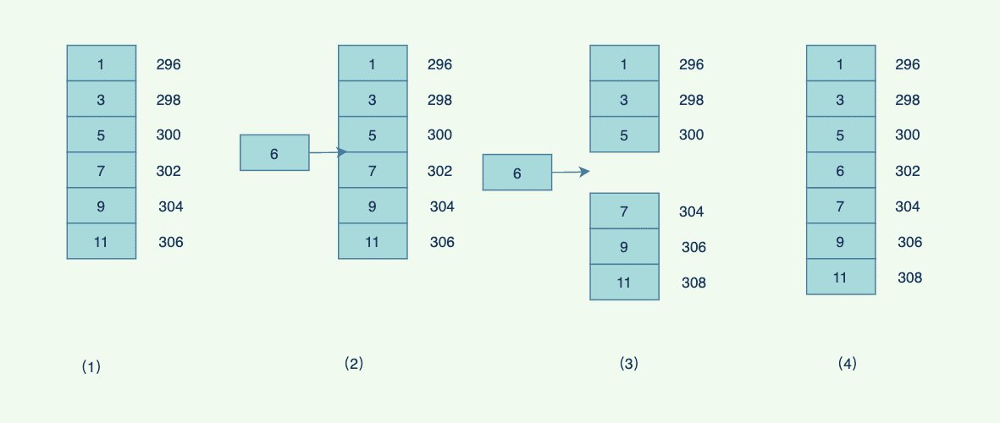
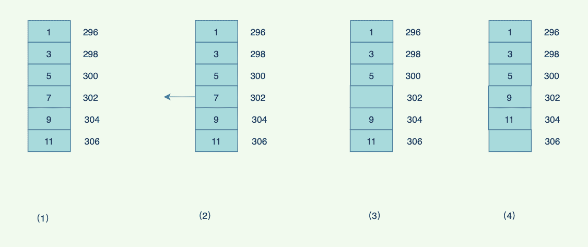

# 数组

## 数组简介

**数组（Array）** 是一种很常见的数据结构。它由相同类型的元素（element）组成，并且是使用一块连续的内存来存储。



在Java 中表示为：

```java
int[] nums = new int[100];
int[] nums = {1,2,3,4,5};
Object[] Objects = new Object[100];
```

数组是⼀种线性的结构，⼀般在底层是连续的空间，存储相同类型的数据，由于连续紧凑结构以及天然索引⽀持，查询数据效率⾼。

更新的本质也是查找，先查找到该元素，就可以动⼿更新了：



但是如果期望插⼊数据的话，需要移动后⾯的数据，⽐如下⾯的数组，插⼊元素6，最差的是移动所有的元素，时间复杂度为O(n)



⽽删除元素则需要把后⾯的数据移动到前⾯，最差的时间复杂度同样为O(n)



总结：数组的特点是：**提供随机访问** 并且容量有限。

## 时间复杂度

假如数组的长度为 n。

- 访问：O（1）//访问特定位置的元素
- 插入：O（n ）//最坏的情况发生在插入发生在数组的首部并需要移动所有元素时
- 删除：O（n）//最坏的情况发生在删除数组的开头发生并需要移动第一元素后面所有的元素时

## 数组的增删改查实现

```java
import java.util.Arrays;
public class MyArray {
    private int[] data;
    private int elementCount;
    private int length;

    public MyArray(int max) {
        length = max;
        data = new int[max];
        elementCount = 0;
    }

    public void add(int value) {
        if (elementCount == length) {
            length = 2 * length;
            data = Arrays.copyOf(data, length);
        }
        data[elementCount] = value;
        elementCount++;
    }

    public int find(int searchKey) {
        int i;
        for (i = 0; i < elementCount; i++) {
            if (data[i] == searchKey)
            break;
        }
        if (i == elementCount) {
            return -1;
        }
        return i;
    }

    public boolean delete(int value) {
        int i = find(value);
        if (i == -1) {
        	return false;
        }
        for (int j = i; j < elementCount - 1; j++) {
        	data[j] = data[j + 1];
        }
        elementCount--;
        return true;
    }

    public boolean update(int oldValue, int newValue) {
        int i = find(oldValue);
        if (i == -1) {
        	return false;
        }
        data[i] = newValue;
        return true;
    }
}

// 测试类
public class Test {
    public static void main(String[] args) {
        MyArray myArray = new MyArray(2);
        myArray.add(1);
        myArray.add(2);
        myArray.add(3);
        myArray.delete(2);
        System.out.println(myArray);
    }
}
```

