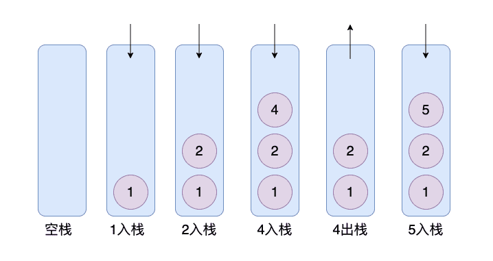

# 栈

## 栈简介

**栈 (Stack)** 只允许在有序的线性数据集合的一端（称为栈顶 top）进行加入数据（push）和移除数据（pop）。因而按照 **后进先出（LIFO, Last In First Out）** 的原理运作。**在栈中，push 和 pop 的操作都发生在栈顶。**就像是⼀个桶，只能不断的放在上⾯，取出来的时候，也只能不断的取出最上⾯的数据。

- 后进者先出，先进者后出
- 是一种“操作受限”的线性表，只允许在端插入和删除数据。



栈常用一维数组或链表来实现，用数组实现的栈叫作**顺序栈**，用链表实现的栈叫作 **链式栈** 。

-   顺序栈的实现只需要一个数组和一个指针来表示栈即可。栈顶指针指向栈顶元素的位置，入栈操作将元素插入到栈顶指针指向的位置，栈顶指针加1；出栈操作将栈顶指针减1，返回栈顶元素。

-   链式栈的实现只需要一个链表和一个指针来表示栈即可。栈顶指针指向链表的头节点，入栈操作将元素插入到链表的头部，栈顶指针指向新的头节点；出栈操作将链表的头节点删除，栈顶指针指向新的头节点。

元素加⼊称之为⼊栈（压栈），取出元素，称之为出栈，栈顶元素则是最后⼀次放进去的元素。

## 什么时候使用?

当某个数据集合只涉及在某端插入和删除数据，且满足后进者先出，先进者后出的操作特性时，我们应该首选栈这种数据结构。

## 栈的实现

### 基于数组实现的栈

时间复杂度分析：根据均摊复杂度的定义，可以用数组实现（自动扩容）符合大多数情况是O(1)级别复杂度，个别情况是O(n)级别复杂度，比如自动扩容时，会进行完整数据的拷贝。

空间复杂度分析：在入栈和出栈的过程中，只需要一两个临时变量存储空间，所以O(1)级别。

注意：我们说空间复杂度的时候，是指除了原本的数据存储空间外，算法运行还需要额外的存储空间。

```python
class Stack(object):
    def __init__(self):
        self.__list = []

    def push(self, item):
        self.__list.append(item)

    def pop(self):
        return self.__list.pop()

    def peek(self):
        if self.__list:
            return self.__list[-1]
        else:
            return None

    def is_empoty(self):
        return self.size == 0

    def size(self):
        return len(self.__list)
```

### 基于链表实现的栈

时间复杂度分析：压栈和弹栈的时间复杂度均为O(1)级别，因为只需更改单个节点的索引即可。

空间复杂度分析：在入栈和出栈的过程中，只需要一两个临时变量存储空间，所以O(1)级别。我们说空间复杂度的时候，是指除了原本的数据存储空间外，算法运行还需要额外的存储空间。

```python
"""基于链表实现的栈"""


class Node:
    def __init__(self, data, next = None):
        self.data = data
        self.next = next


class LinkedStack:
    def __init__(self):
        # 定义栈顶指针
        self.top = None

    def push(self, data):
        node = Node(data)
        if self.top:
            node.next = self.top
            self.top = node
        else:
            self.top = node

    def pop(self):
        if self.top:
            data = self.top.data
            self.top = self.top.next
            return data
        else:
            return False

    def __repr__(self):
        data = []
        current = self.top
        while current:
            data.append(current.data)
            current = current.next

        return "->".join(value for value in data)


if __name__ == "__main__":
    stack = LinkedStack()
    for i in range(6):
        stack.push(str(i))

    print(stack)
    for i in range(7):
        print("弹出" + str(stack.pop()))
        print(stack)
```

## 栈的常见应用场景

当我们我们要处理的数据只涉及在一端插入和删除数据，并且满足 **后进先出（LIFO, Last In First Out）** 的特性时，我们就可以使用栈这个数据结构。

1. 栈在函数调用中的应用：操作系统给每个线程分配了一块独立的内存空间，这块内存被组织成“栈”这种结构，用来存储函数调用时的临时变量。每进入一个函数，就会将其中的临时变量作为栈帧入栈，当被调用函数执行完成，返回之后，将这个函数对应的栈帧出栈。
2. 栈在表达式求值中的应用（比如：34+13*9+44-12/3）：利用两个栈，其中一个用来保存操作数，另一个用来保存运算符。我们从左向右遍历表达式，当遇到数字，我们就直接压入操作数栈；当遇到运算符，就与运算符栈的栈顶元素进行比较，若比运算符栈顶元素优先级高，就将当前运算符压入栈，若比运算符栈顶元素的优先级低或者相同，从运算符栈中取出栈顶运算符，从操作数栈顶取出2个操作数，然后进行计算，把计算完的结果压入操作数栈，继续比较。
3. 栈在括号匹配中的应用（比如：{}{()}）：用栈保存为匹配的左括号，从左到右一次扫描字符串，当扫描到左括号时，则将其压入栈中；当扫描到右括号时，从栈顶取出一个左括号，如果能匹配上，则继续扫描剩下的字符串。如果扫描过程中，遇到不能配对的右括号，或者栈中没有数据，则说明为非法格式。
   当所有的括号都扫描完成之后，如果栈为空，则说明字符串为合法格式；否则，说明未匹配的左括号为非法格式。
4. 实现浏览器的前进后退功能：我们使用两个栈X和Y，我们把首次浏览的页面依次压如栈X，当点击后退按钮时，再依次从栈X中出栈，并将出栈的数据一次放入Y栈。当点击前进按钮时，我们依次从栈Y中取出数据，放入栈X中。当栈X中没有数据时，说明没有页面可以继续后退浏览了。当Y栈没有数据，那就说明没有页面可以点击前进浏览了。

### 括号匹配

栈可以用来实现括号匹配的原因是，括号匹配的过程可以看作是将左括号入栈，遇到右括号时出栈，判断是否匹配。如果栈为空或者栈顶元素与当前右括号不匹配，则括号匹配不正确。

以下是一个简单的Python示例代码，演示了如何使用栈实现括号匹配：

```python
def is_balanced(expression):
    stack = Stack()
    for char in expression:
        if char in "([{":
            stack.push(char)
        elif char in ")]}":
            if stack.is_empty():
                return False
            elif char == ")" and stack.peek() == "(":
                stack.pop()
            elif char == "]" and stack.peek() == "[":
                stack.pop()
            elif char == "}" and stack.peek() == "{":
                stack.pop()
            else:
                return False
    return stack.is_empty()

print(is_balanced("()"))
print(is_balanced("()[]{}"))
print(is_balanced("(]"))
print(is_balanced("([)]"))
print(is_balanced("{[]}"))
```

在这个示例代码中，首先定义了一个栈类Stack，包含了push、pop、is_empty和peek等方法。然后定义了一个is_balanced函数，用于判断括号匹配是否正确。在is_balanced函数中，遍历字符串中的每个字符，如果是左括号，则入栈；如果是右括号，则出栈并判断是否匹配。如果栈为空或者栈顶元素与当前右括号不匹配，则括号匹配不正确。最后判断栈是否为空，如果为空则括号匹配正确，否则不正确。

### 表达式求值

栈可以用来实现表达式求值，主要是因为表达式求值的过程可以看作是将操作数入栈，遇到操作符时出栈进行计算，将计算结果入栈。最终栈中只剩下一个元素，即为表达式的值。

以下是一个简单的Python示例代码，演示了如何使用栈实现表达式求值：

```python
def evaluate(expression):
    stack = Stack()
    for char in expression:
        if char.isdigit():
            stack.push(int(char))
        else:
            operand2 = stack.pop()
            operand1 = stack.pop()
            if char == "+":
                result = operand1 + operand2
            elif char == "-":
                result = operand1 - operand2
            elif char == "*":
                result = operand1 * operand2
            elif char == "/":
                result = operand1 / operand2
            else:
                raise ValueError("Invalid operator")
            stack.push(result)
    return stack.pop()

print(evaluate("3+4*5"))
print(evaluate("3*4+5"))
print(evaluate("4-2+3"))
print(evaluate("5/2"))
```

在这个示例代码中，首先定义了一个栈类Stack，包含了push、pop、is_empty和peek等方法。然后定义了一个evaluate函数，用于求解表达式的值。在evaluate函数中，遍历字符串中的每个字符，如果是数字，则入栈；如果是操作符，则出栈两个操作数进行计算，并将计算结果入栈。最终栈中只剩下一个元素，即为表达式的值。

### 实现浏览器的回退和前进功能

我们只需要使用两个栈(Stack1 和 Stack2)和就能实现这个功能。比如你按顺序查看了 1,2,3,4 这四个页面，我们依次把 1,2,3,4 这四个页面压入 Stack1 中。当你想回头看 2 这个页面的时候，你点击回退按钮，我们依次把 4,3 这两个页面从 Stack1 弹出，然后压入 Stack2 中。假如你又想回到页面 3，你点击前进按钮，我们将 3 页面从 Stack2 弹出，然后压入到 Stack1 中。

### 检查符号是否成对出现

> 给定一个只包括 `'('`，`')'`，`'{'`，`'}'`，`'['`，`']'` 的字符串，判断该字符串是否有效。
>
> 有效字符串需满足：
>
> 1. 左括号必须用相同类型的右括号闭合。
> 2. 左括号必须以正确的顺序闭合。
>
> 比如 "()"、"()[]{}"、"{[]}" 都是有效字符串，而 "(]"、"([)]" 则不是。

这个问题实际是 Leetcode 的一道题目，我们可以利用栈 `Stack` 来解决这个问题。

1. 首先我们将括号间的对应规则存放在 `Map` 中，这一点应该毋容置疑；
2. 创建一个栈。遍历字符串，如果字符是左括号就直接加入`stack`中，否则将`stack` 的栈顶元素与这个括号做比较，如果不相等就直接返回 false。遍历结束，如果`stack`为空，返回 `true`。

```java
public boolean isValid(String s){
    // 括号之间的对应规则
    HashMap<Character, Character> mappings = new HashMap<Character, Character>();
    mappings.put(')', '(');
    mappings.put('}', '{');
    mappings.put(']', '[');
    Stack<Character> stack = new Stack<Character>();
    char[] chars = s.toCharArray();
    for (int i = 0; i < chars.length; i++) {
        if (mappings.containsKey(chars[i])) {
            char topElement = stack.empty() ? '#' : stack.pop();
            if (topElement != mappings.get(chars[i])) {
                return false;
            }
        } else {
            stack.push(chars[i]);
        }
    }
    return stack.isEmpty();
}
```

### 反转字符串

将字符串中的每个字符先入栈再出栈就可以了。

### 维护函数调用

最后一个被调用的函数必须先完成执行，符合栈的 **后进先出（LIFO, Last In First Out）** 特性。例如递归函数调用可以通过栈来实现，每次递归调用都会将参数和返回地址压栈。

>   思考?

我们在讲栈的应用时，讲到用函数调用栈来保存临时变量，为什么函数调用要用“栈”来保存临时变量呢？用其他数据结构不行吗？

因为函数调用的执行顺序符合后进者先出，先进者后出的特点。比如函数中的局部变量的生命周期的长短是先定义的生命周期长，后定义的生命周期短；还有函数中调用函数也是这样，先开始执行的函数只有等到内部调用的其他函数执行完毕，该函数才能执行结束。

正是由于函数调用的这些特点，根据数据结构是特定应用场景的抽象的原则，我们优先考虑栈结构。

### 深度优先遍历（DFS）

在深度优先搜索过程中，栈被用来保存搜索路径，以便回溯到上一层。

