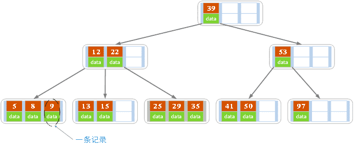

# B+树

## B+树

B+树是一种多路搜索树，它是B树的一种变体，常用于数据库和文件系统中。B+树的特点是：


- 所有数据都存储在叶子节点中，非叶子节点只存储索引信息。
- 所有叶子节点都按照顺序连接成一个链表，便于范围查询。
- 非叶子节点的子节点数目可以大于2，通常为M路，其中M为一个固定的正整数。
- 所有叶子节点的深度相同，可以通过非叶子节点的指针快速定位。

B+树的插入和删除操作与B树类似，也需要进行节点分裂和合并等操作，以保持树的平衡。B+树的查找操作也与B树类似，从根节点开始逐层搜索，直到找到目标节点或者到达叶子节点。B+树的时间复杂度与B树类似，插入、删除和查找操作的时间复杂度均为O(
log n)。

### B+树的优点

- 叶子节点的顺序连接可以提高范围查询的效率。
- 非叶子节点的子节点数目可以大于2，可以减少树的高度，提高查找效率。
- 所有数据都存储在叶子节点中，可以减少磁盘I/O操作，提高数据访问效率。

B+树广泛应用于数据库和文件系统中，例如MySQL、Oracle、MongoDB等数据库系统，以及Linux文件系统中的Ext4、XFS等。

以下是Python实现一个B+树的示例代码：

```python
M = 10


class Node:
    def __init__(self, is_leaf = False):
        self.keys = []
        self.values = []
        self.children = []
        self.is_leaf = is_leaf

    def is_full(self):
        return len(self.keys) == M - 1


class BPlusTree:
    def __init__(self):
        self.root = Node(is_leaf = True)

    def search(self, key):
        node = self.root
        while not node.is_leaf:
            i = bisect_left(node.keys, key)
            if i < len(node.keys) and node.keys[i] == key:
                return node.values[i]
            node = node.children[i]
        i = bisect_left(node.keys, key)
        if i < len(node.keys) and node.keys[i] == key:
            return node.values[i]
        return None

    def insert(self, key, value):
        node = self.root
        path = []
        while not node.is_leaf:
            i = bisect_left(node.keys, key)
            path.append((node, i))
            node = node.children[i]
        i = bisect_left(node.keys, key)
        node.keys.insert(i, key)
        node.values.insert(i, value)
        if node.is_full():
            self._split(node, path)

    def _split(self, node, path):
        parent = None
        while path:
            node, i = path.pop()
            if not node.is_full():
                return
            new_node = Node(is_leaf = node.is_leaf)
            mid = len(node.keys) // 2
            new_node.keys = node.keys[mid:]
            new_node.values = node.values[mid:]
            node.keys = node.keys[:mid]
            node.values = node.values[:mid]
            if not node.is_leaf:
                new_node.children = node.children[mid:]
                node.children = node.children[:mid]
            i = bisect_left(parent.keys, new_node.keys[0]) if parent else 0
            parent.keys.insert(i, new_node.keys[0])
            parent.children.insert(i + 1, new_node)
            node = parent
            parent = path.pop()[0] if path else None
        if not parent:
            parent = Node()
            parent.keys = [node.keys[0]]
            parent.children = [node, new_node]
            self.root = parent
        else:
            i = bisect_left(parent.keys, new_node.keys[0])
            parent.keys.insert(i, new_node.keys[0])
            parent.children.insert(i + 1, new_node)

    def delete(self, key):
        node = self.root
        path = []
        while not node.is_leaf:
            i = bisect_left(node.keys, key)
            path.append((node, i))
            node = node.children[i]
        i = bisect_left(node.keys, key)
        if i < len(node.keys) and node.keys[i] == key:
            node.keys.pop(i)
            node.values.pop(i)
            if node.is_leaf:
                self._delete_leaf(node, path)
            else:
                self._delete_internal(node, path)
        else:
            return

    def _delete_leaf(self, node, path):
        while len(node.keys) < M // 2 and path:
            parent, i = path.pop()
            if i == len(parent.children) - 1:
                sibling = parent.children[i - 1]
                if len(sibling.keys) > M // 2:
                    node.keys.insert(0, sibling.keys.pop())
                    node.values.insert(0, sibling.values.pop())
                    parent.keys[i - 1] = sibling.keys[-1]
                    break
                else:
                    sibling.keys.extend(node.keys)
                    sibling.values.extend(node.values)
                    sibling.children.extend(node.children)
                    node = sibling
            else:
                sibling = parent.children[i + 1]
                if len(sibling.keys) > M // 2:
                    node.keys.append(sibling.keys.pop(0))
                    node.values.append(sibling.values.pop(0))
                    parent.keys[i] = sibling.keys[0]
                    break
                else:
                    node.keys.extend(sibling.keys)
                    node.values.extend(sibling.values)
                    node.children.extend(sibling.children)
                    parent.keys.pop(i)
                    parent.children.pop(i + 1)
                    node = parent
        if not node.keys and path:
            parent, i = path.pop()
            parent.children.pop(i)
            if len(parent.children) < M // 2 and path:
                self._delete_internal(parent, path)

    def _delete_internal(self, node, path):
        while len(node.keys) < M // 2 and path:
            parent, i = path.pop()
            if i == len(parent.children) - 1:
                sibling = parent.children[i - 1]
                if len(sibling.keys) > M // 2:
                    node.keys.insert(0, parent.keys[i - 1])
                    parent.keys[i - 1] = sibling.keys.pop()
                    node.children.insert(0, sibling.children.pop())
                    break
                else:
                    sibling.keys.append(parent.keys.pop(i - 1))
                    sibling.keys.extend(node.keys)
                    sibling.children.extend(node.children)
                    node = sibling
            else:
                sibling = parent.children[i + 1]
                if len(sibling.keys) > M // 2:
                    node.keys.append(parent.keys[i])
                    parent.keys[i] = sibling.keys.pop(0)
                    node.children.append(sibling.children.pop(0))
                    break
                else:
                    sibling.keys.insert(0, parent.keys.pop(i))
                    sibling.keys[:0] = node.keys
                    sibling.children[:0] = node.children
                    node = sibling
        if not node.keys and path:
            parent, i = path.pop()
            parent.children.pop(i)
            if len(parent.children) < M // 2 and path:
                self._delete_internal(parent, path)
```

这个B+树使用Node类来表示树中的节点，每个节点包括键、值、子节点和是否为叶子节点等信息。B+树支持插入、查找和删除操作，其中插入和删除操作会改变树的结构，需要进行节点分裂和合并等操作
