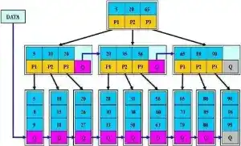

# B*树

## 规则

`B*`树是B+树的变种，在B+树的非根和非叶子结点再增加指向兄弟的指针，区别如下：

1.  首先是关键字个数限制问题，`B+`树初始化的关键字初始化个数是`cei(m/2)`，`B*`树的初始化个数为`cei(2/3*m)`。
2.  `B+`树节点满时就会分裂，而`B*`树节点满时会检查兄弟节点是否满(因为每个节点都有指向兄弟的指针)，如果兄弟节点未满则向兄弟节点转移关键字，如果兄弟节点已满，则从当前节点和兄弟节点各拿出1/3的数据创建一个新的节点出来。

## 特点

在B+树的基础上因其初始化的容量变大，使得节点空间使用率更高，而又存有兄弟节点的指针，可以向兄弟节点转移关键字的特性使得B*树额分解次数变得更少；

`B*`树定义了非叶子结点关键字个数至少为(2/3)*M，即块的最低使用率为2/3（代替B+树的1/2）；

-   `B+树`的分裂：当一个结点满时，分配一个新的结点，并将原结点中1/2的数据复制到新结点，最后在父结点中增加新结点的指针；B+树的分裂只影响原结点和父结点，而不会影响兄弟结点，所以它不需要指向兄弟的指针；
-   `B*`树的分裂：当一个结点满时，如果它的下一个兄弟结点未满，那么将一部分数据移到兄弟结点中，再在原结点插入关键字，最后修改父结点中兄弟结点的关键字（因为兄弟结点的关键字范围改变了）；如果兄弟也满了，则在原结点与兄弟结点之间增加新结点，并各复制1/3的数据到新结点，最后在父结点增加新结点的指针；

所以，`B*`树分配新结点的概率比B+树要低，空间使用率更高。
