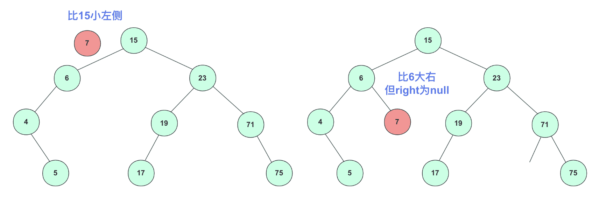
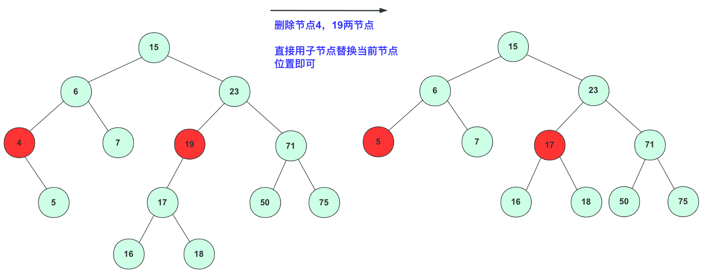
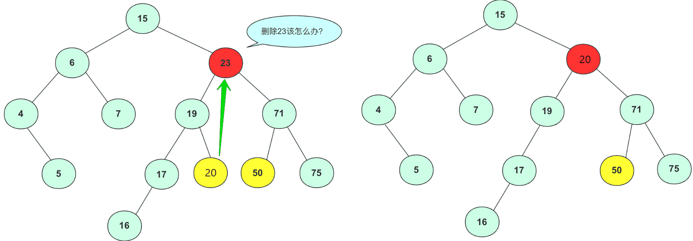

# 二叉搜索树

## 概念

二叉排序树的规则：**从任意节点开始，节点左侧节点值总比节点右侧值要小。**

## 实现详解

### 构造

二叉排序树是由若干节点(node)构成的，对于node需要这些属性：left、right和value。其中left和right是左右指针指向左右孩子子树，而value是储存的数据，一般二叉树存储数字类型比较多，这里就用int不用泛型了。

`TreeNode`类构造为：

```java
class TreeNode {
    int value;          // 节点的值
    TreeNode left;    // 左子节点的引用
    TreeNode right;   // 右子节点的引用

    public TreeNode(int value) {
        this.value = value;
        this.left = null;
        this.right = null;
    }
}
```

既然已经构造好一棵树，那么就需要实现主要的方法，因为二叉排序树中**每个节点都能看作一棵树**。所以我们创建方法的是时候加上节点参数(方便一些递归调用)，下面讲解插入、查找、删除操作，其实插入、查找操作很像但有点区别，这里就不封装到一起了。

### 插入操作

插入操作用于将新的节点添加到二叉排序树中，以保持树的有序性。下面是插入操作的详细流程：

1. 从根节点开始，将要插入的值与当前节点的值进行比较。

2. 如果要插入的值小于当前节点的值，移动到当前节点的左子树；如果要插入的值大于当前节点的值，移动到当前节点的右子树。

3. 重复步骤 2，直到找到一个空的位置，即当前节点的左子树或右子树为空。

4. 在这个空位置插入新节点，其值为要插入的值。

5. 插入完成，树的有序性仍然保持。



这里给一个非递归的方法可以对照流程参考：

```java
class Solution {
    public void insert(int value) {
        TreeNode newNode = new TreeNode(value);
        //如果root为null的特殊情况还是要尊重一下
        if (root == null) {
            root = newNode;
            return;
        }
        //开始表演
        TreeNode current = root;
        while (true) {
            if (value < current.value) {
                if (current.left == null) {//插在左侧
                    current.left = newNode;
                    return;
                }
                current = current.left;
            } else if (value > current.value) {
                if (current.right == null) {//插入右侧
                    current.right = newNode;
                    return;
                }
                current = current.right;
            } else {
                // 一般不存在这种情况 相同的没法插。
            }
        }
    }
}
```

### 查找操作

查找操作用于在二叉排序树中查找特定值是否存在。以下是查找操作的详细流程：

1. 从根节点开始，将要查找的值与当前节点的值进行比较。

2. 如果要查找的值等于当前节点的值，返回 true，表示找到了目标值。

3. 如果要查找的值小于当前节点的值，移动到当前节点的左子树。

4. 如果要查找的值大于当前节点的值，移动到当前节点的右子树。

5. 重复步骤 2、3、4，直到找到等于目标值的节点或遍历到一个空节点。

6. 如果遍历到一个空节点，返回 false，表示未找到目标值。

7. 查找完成，树的结构不变。

这里提供一个非递归的方法提供结合学习：

```java
public boolean search(int value) {
    TreeNode current = root;
    while (current != null) {
        if (value == current.value) {
            return true;
        } else if (value < current.value) {
            current = current.left;
        } else {
            current = current.right;
        }
    }
    // while 一直到null说明不存在
    return false;
}
```

### 删除操作

删除操作用于从二叉排序树中移除特定值。以下是删除操作的详细流程：

1. 从根节点开始，将要删除的值与当前节点的值进行比较。

2. 如果要删除的值等于当前节点的值，有以下情况：

    a. 如果当前节点是叶子节点（没有子节点），直接删除该节点。

    b. 如果当前节点有一个子节点，用子节点替换当前节点。

    c. 如果当前节点有两个子节点，找到当前节点右子树的最小值（或左子树的最大值）来替代当前节点的值，然后删除那个最小值节点。

3. 如果要删除的值小于当前节点的值，移动到当前节点的左子树。

4. 如果要删除的值大于当前节点的值，移动到当前节点的右子树。

5. 重复步骤 2、3、4，直到找到等于目标值的节点或遍历到一个空节点。

6. 如果遍历到一个空节点，说明目标值不在树中，删除操作无效。

删除完成，树的有序性仍然保持。

这里面还要详细讲一下，不然估计很多人不明白，尤其是其中相等时候的b和c两种情况。

情况b的时候很好理解，删除节点只有一个孩子节点，直接给孩子节点**提上来**。



情况c稍微复杂一点，左右孩子都不为空。

左右孩子节点都不为空这种情况是相对比较复杂的，因为不能直接用其中一个孩子节点替代当前节点(放不下，如果2个子节点都2个子节点那么会有一个节点没法放)

例如删除23拿19或者71节点填补，会引起合并的混乱。比如你若用71替代23节点，那么你需要考虑三个节点`(19, 50, 75)`之间如何处理，还要考虑他们是否满，是否有子女，这是个复杂的过程，不适合考虑。



所以，我们要分析我们要的这个点的属性：删除这个点后这依然是一个二叉搜索树！那个点能在这个位置呢？肯定在**左子树中最右侧**或者**右子树中最左侧**节点。我们可以选一个节点将待删除节点值替换掉(这里替换成**左子树最右侧节点**)，这个点替换之后该怎么办呢？

很简单啊，二叉树用**递归思路**解决问题，再次调用删除函数在左子树中删除替换的节点即可(其实变成删除叶子节点了)。

### 完整代码

二叉排序树完整代码为：

```java
class TreeNode {
    int value;          // 节点的值
    TreeNode left;    // 左子节点的引用
    TreeNode right;   // 右子节点的引用

    public TreeNode(int value) {
        this.value = value;
        this.left = null;
        this.right = null;
    }
}

public class BinarySearchTree {
    private TreeNode root;

    public BinarySearchTree() {
        root = null;
    }

    // 插入操作
    public void insert(int value) {
        root = insertRec(root, value);
    }

    private TreeNode insertRec(TreeNode root, int value) {
        if (root == null) {
            root = new TreeNode(value);
            return root;
        }

        if (value < root.value) {
            root.left = insertRec(root.left, value);
        } else if (value > root.value) {
            root.right = insertRec(root.right, value);
        }
        return root;
    }

    // 查找操作
    public boolean search(int value) {
        return searchNode(root, value);
    }

    private boolean searchNode(TreeNode root, int value) {
        if (root == null) {
            return false;
        }

        if (value == root.value) {
            return true;
        }

        if (value < root.value) {
            return searchNode(root.left, value);
        } else {
            return searchNode(root.right, value);
        }
    }

    // 删除操作
    public void delete(int value) {
        root = deleteNode(root, value);
    }

    private TreeNode deleteNode(TreeNode root, int value) {
        if (root == null) {
            return null;
        }

        if (value < root.value) {//向左
            root.left = deleteNode(root.left, value);
        } else if (value > root.value) {//向右
            root.right = deleteNode(root.right, value);
        } else {//等于时候
            //想象链表删除，跳过当前节点root.right = root.right.right
            if (root.left == null) {
                return root.right;
            } else if (root.right == null) {
                return root.left;
            }
            //替换
            root.value = maxValue(root.left);
            //删除叶子节点了
            root.right = deleteNode(root.left, root.value);
        }
        return root;
    }

    private int minValue(TreeNode node) {
        int minValue = node.value;
        while (node.left != null) {
            minValue = node.left.value;
            node = node.left;
        }
        return minValue;
    }

    private int maxValue(TreeNode node) {
        int minValue = node.value;
        while (node.right != null) {
            minValue = node.right.value;
            node = node.right;
        }
        return minValue;
    }
}
```

## 算法题

### 序列化和反序列化

参考：https://leetcode.cn/problems/serialize-and-deserialize-bst/description/?envType=problem-list-v2&envId=binary-search-tree

前言：二叉搜索树是一种特殊的二叉树，特殊之处在于其中序遍历是有序的，可以利用这一点来优化时间和空间复杂度。

方法一：后序遍历

思路

给定一棵二叉树的「先序遍历」和「中序遍历」可以恢复这颗二叉树。给定一棵二叉树的「后序遍历」和「中序遍历」也可以恢复这颗二叉树。而对于二叉搜索树，给定「先序遍历」或者「后序遍历」，对其经过排序即可得到「中序遍历」。因此，仅对二叉搜索树做「先序遍历」或者「后序遍历」，即可达到序列化和反序列化的要求。此题解采用「后序遍历」的方法。

序列化时，只需要对二叉搜索树进行后序遍历，再将数组编码成字符串即可。

反序列化时，需要先将字符串解码成后序遍历的数组。在将后序遍历的数组恢复成二叉搜索树时，不需要先排序得到中序遍历的数组再根据中序和后序遍历的数组来恢复二叉树，而可以根据有序性直接由后序遍历的数组恢复二叉搜索树。后序遍历得到的数组中，根结点的值位于数组末尾，左子树的节点均小于根节点的值，右子树的节点均大于根节点的值，可以根据这些性质设计递归函数恢复二叉搜索树。

```python
class Codec:
    def serialize(self, root: TreeNode) -> str:
        arr = []
        def postOrder(root: TreeNode) -> None:
            if root is None:
                return
            postOrder(root.left)
            postOrder(root.right)
            arr.append(root.val)
        postOrder(root)
        return ' '.join(map(str, arr))

    def deserialize(self, data: str) -> TreeNode:
        arr = list(map(int, data.split()))
        def construct(lower: int, upper: int) -> TreeNode:
            if arr == [] or arr[-1] < lower or arr[-1] > upper:
                return None
            val = arr.pop()
            root = TreeNode(val)
            root.right = construct(val, upper)
            root.left = construct(lower, val)
            return root
        return construct(-inf, inf)
```

复杂度分析

- 时间复杂度：O(n)，其中 n 是树的节点数。serialize 需要 O(n) 时间遍历每个点。deserialize 需要 O(n) 时间恢复每个点。

- 空间复杂度：O(n)，其中 n 是树的节点数。serialize 需要 O(n) 空间用数组保存每个点的值，递归的深度最深也为 O(n)。deserialize 需要 O(n)
  空间用数组保存每个点的值，递归的深度最深也为 O(n)。

> 关注点：通过后序遍历恢复二叉搜索树
