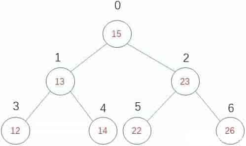
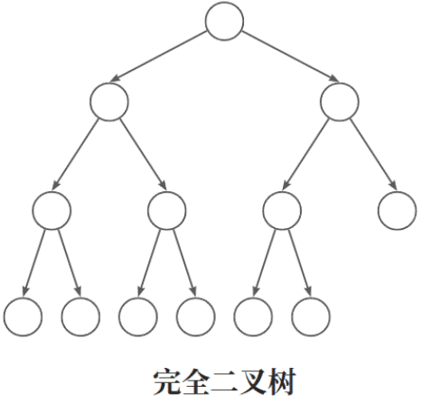
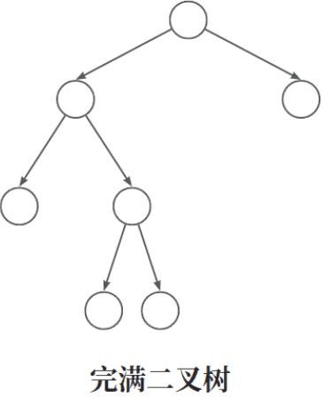
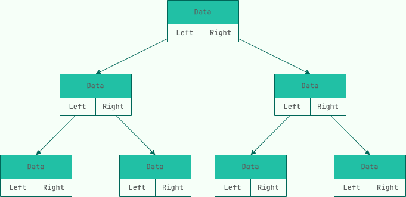
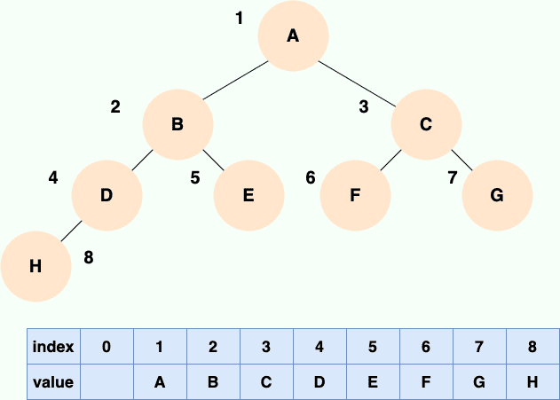
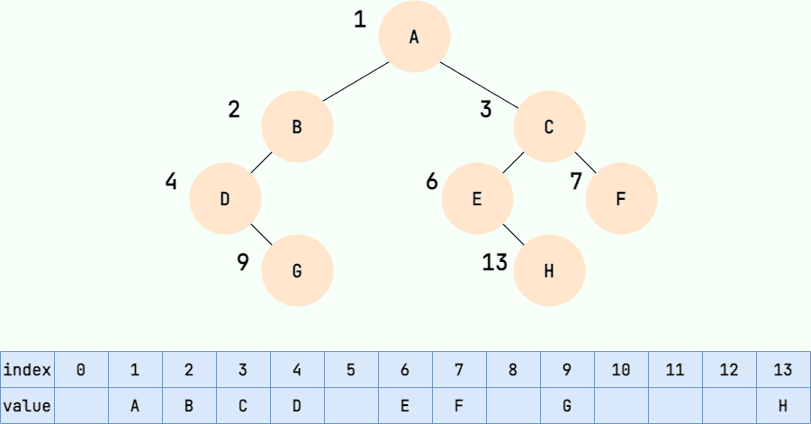
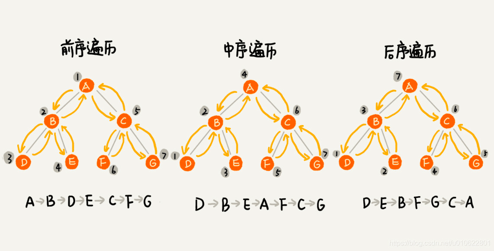
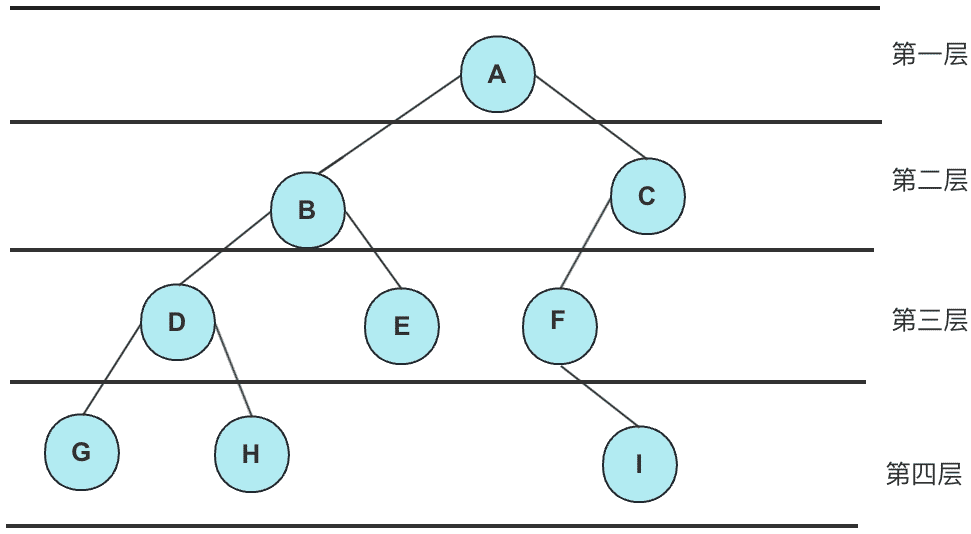
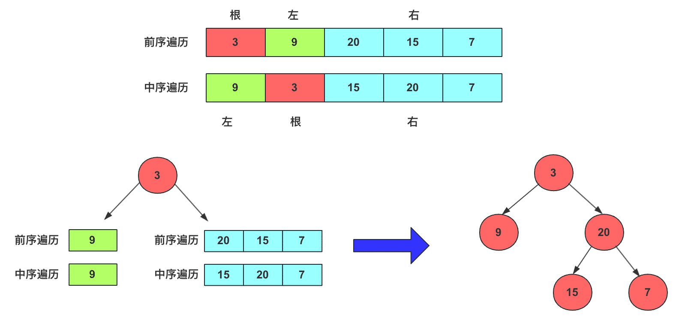
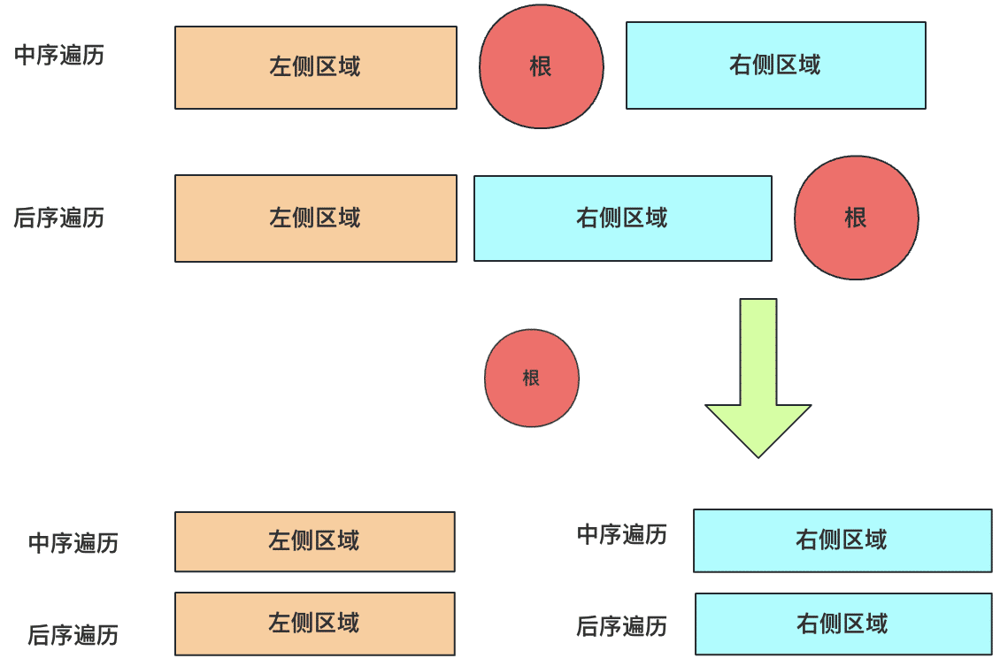

# 二叉树

二叉树（Binary Tree）是一种特殊的树形结构，它的每个节点最多有两个子节点，分别称为左子节点和右子节点。二叉树的子树也是二叉树。二叉树可以用来实现搜索、排序、编译等算法。

## 二叉树的特点

1. 在二叉树的第i层上至多有$2^{(i-1)}$个结点
2. 深度为k的二叉树至多有$2^{k-1}$个结点
3. 对于任意一颗二叉树, 如果其叶结点数为N, 则度数为2的节点总数为N+1

## 二叉树的分类

- 满二叉树（Full Binary Tree）：每个节点都有两个子节点，除了叶子节点外没有空缺节点（每一层都满了）。
- 完全二叉树（Complete Binary Tree）：最后一层节点可以不满，但是所有节点都集中在左侧（除了最下层,每一层都满了）。
- 平衡二叉树（Balanced Binary Tree）：左子树和右子树的高度差不超过1（任意两个节点的高度差不大于1）。
- 二叉搜索树（Binary Search Tree）：左子树的所有节点的值都小于根节点的值，右子树的所有节点的值都大于根节点的值。
- 红黑树（Red-Black Tree）：一种自平衡的二叉搜索树，保证了树的高度不超过2log(n+1)。
- B树（B-Tree）：一种多路搜索树，每个节点可以有多个子节点，用于磁盘和数据库等应用。
- Trie树（Trie Tree）：一种前缀树，用于字符串的匹配和搜索。
- Huffman树（Huffman Tree）：一种用于数据压缩的树形结构，将出现频率高的字符编码为短的二进制码。

### 完美二叉树

在一棵二叉树中，如果每个非终端节点都有两个子节点，并且所有叶子节点位于同一层次，那么称之为完美二叉树。

就像这样：



其中非终端节点包括15/13/23，它们都有两个子节点，并且所有叶子节点都位于第3层。可以看到，完美二叉树左右子树是完美对称的。对于完美二叉树，有以下特性：

1.  第$i+1$层的节点数为$2^i$
2.  如果完美二叉树高度为$n$，那么总的节点数为$2^n - 1$
3.  如果完美二叉树中叶子节点为$m$，非终端节点为$k$，那么$m=k+1$
4.  如果完美二叉树中某节点下标为$n$，那么它的左节点下标为$2n+1$，右节点下标为$2n+2$

证明：

1.  性质1可以用数学归纳法来证明，假设完美二叉树中第i层节点数为$2^(i-1)$，我们只要推导出第$i+1$层节点数为$2^i$即可。从定义出发，已知第$i$层的节点都有两个左右子节点，那么第$i+1$层的节点数为$(2^(i-1))*2$，也就是$2^i$，证明完毕
2.  性质2由性质1衍生出来，对于高度为n的完美二叉树，节点总数为$2^0+2^1+......+2^(n-1)$，也就是$2^n - 1$，证明完毕
3.  性质3也是由数学归纳法证明的，假设高度为n的完美二叉树中非终端节点数为k，叶子节点为m，并且$m=k+1$，只要推导出高度为$n+1$的完美二叉树也符合这种情况即可。假设该树非终端节点数为$k1$，叶子节点数为$m1$，可以计算出$k1=k+m$，$m1=2*m$，那么$m1-k1=2*m-(k+m)=m-k=1$，即$m1=k1+1$，证明完毕
4.  性质4的证明比较麻烦，假设完美二叉树第n层存在一个节点下标为i，那么第n层剩余节点个数(包括i节点)为$(2^n-1)-i$,即$2^n-i-1$，我们记为k，假设i节点左节点下标为j，那么在第$n+1$层中j节点之前(不包括j节点)节点数为$2^(n+1-1)-2*k=2^n-2*k$，我们记为$m$，那么$j-i=m+k=2^n-2*k+k=2^n-k=2^n-(2^n-i-1)=i+1$，即$j-i=i+1$，那么$j=2i+1$，证明完毕

### 完全二叉树

对于高度为K的，有n个结点的二叉树，当且仅当其每一个结点都与高度为K的完美二叉树中编号从0至n-1的结点一一对应时称之为完全二叉树。



1. 具有n个节点的完全二叉树的深度必为log2(n+1)
2. 对于完全二叉树, i节点的左孩子变化为2i, 右孩子为2i+1

### 完满二叉树

在一棵二叉树中，只存在度为0或者2的节点，称该树为完满二叉树



在二叉树中只存在度为0或1或2的节点，记为n0,n1,n2，那么二叉树中节点总数n可以记为n=n0+n1+n2。在所有二叉树中存在一个重要的性质：n0=n2+1。该性质可以用数学归纳法证明，假设在一棵二叉树p中，度为2的节点个数为n2，那么n0=n2+1，我们只要证明在度为2的节点个数为n2+1的二叉树q中，该性质不变即可。想象在二叉树p中，我们为某个叶子节点添加左右节点，那么该二叉树变为q，并且度为2的节点个数增加了1，而叶子节点也增加了1，n0依然比n2大1。想象在二叉树p中，为某个度为1的节点添加一个子节点，那么该二叉树变为q，并且度为2的节点个数增加了1，而叶子节点也增加了1，n0依然比n2大1。证明完毕

## 二叉树的存储

二叉树的存储主要分为**链式存储**和**顺序存储**两种：

### 链式存储

和链表类似，二叉树的链式存储依靠指针将各个节点串联起来，不需要连续的存储空间。

每个节点包括三个属性：

- 数据 data。data 不一定是单一的数据，根据不同情况，可以是多个具有不同类型的数据。
- 左节点指针 left
- 右节点指针 right。



以下是Python实现一个二叉树的示例代码：

```python
class Node(object):
    def __init__(self, item):
        self.elem = item
        self.lchild = lchild
        self.rchild = rchild

class BinaryTree(object):
    def __init__(self, root = None):
        self.root = root

    def add(self, item):
        node = Node(item)
        if self.root is None
            self.root = node
            return
        else:
        queue = [self.root]
        while queue:
            cur_node = queue.pop(0)
            if cur_node.lchild is None:
                cur_node.lchild = node
                return
            else:
                queue.append(cur_node.lchild)
            if cur_node.rchild is None:
                cur_node.rchild = node
                return
            else:
                queue.append(cur_node.rchild)
```

### 顺序存储

顺序存储就是利用数组进行存储，数组中的每一个位置仅存储节点的 data，不存储左右子节点的指针，子节点的索引通过数组下标完成。根结点的序号为 1，对于每个节点 Node，假设它存储在数组中下标为 i 的位置，那么它的左子节点就存储在 2i 的位置，它的右子节点存储在下标为 2i+1 的位置。

一棵完全二叉树的数组顺序存储如下图所示：



大家可以试着填写一下存储如下二叉树的数组，比较一下和完全二叉树的顺序存储有何区别：



可以看到，如果我们要存储的二叉树不是完全二叉树，在数组中就会出现空隙，导致内存利用率降低

## 二叉树遍历

二叉树的遍历有三种方式：

-   前序遍历是先访问根节点，然后访问左子树，最后访问右子树
-   中序遍历是先访问左子树，然后访问根节点，最后访问右子树
-   后序遍历是先访问左子树，然后访问右子树，最后访问根节点。

根据 先序遍历+中序遍历 或 后序+中序 推导出一颗树

1. 先从先序/后序中找出root节点
2. 在中序中找到root节点 分成两半
3. 先序中 安装中序中的两半 分开
4. 左右子树分别重复前三步操作



```python
class BinaryTree(object):
    # ...
    # 广度优先遍历
    def breadth_travel(self):
        if self.root is None:
            return
        queue = [self.root]
        while queue:
            cur_node = queuq.pop(0)
            print(cur_node.elem)
            if cur_node.lchild is not None:
                quequ.append(cur_node.lchild)
            if cur_node.rchild is not None:
                queue.append(rchild)
    # 先序遍历
    def preorder(self, node):
        if node is None:
            return
        print(node.elem)
        self.preorder(node.lchild)
        self.preorder(node.rchild)

    # 中序遍历
    def inorder(self, node):
        if node is None:
            return
        self.inorder(node.lchild)
        print(node.elem)
        self.inorder(node.rchild)

    # 后序遍历
    def postorder(self, node):
        if node is None:
            return
        self.postorder(node.lchild)
        self.postorder(node.rchild)
        print(self.elem)
```

### 二叉树的中序遍历

题目链接：[二叉树的中序遍历](https://leetcode.cn/problems/binary-tree-inorder-traversal/description/?envType=problem-list-v2&envId=tree)

给定一个二叉树的根节点 `root`，返回 *它的 **中序** 遍历* 。

#### 方法一：递归

思路与算法

首先我们需要了解什么是二叉树的中序遍历：按照访问左子树——根节点——右子树的方式遍历这棵树，而在访问左子树或者右子树的时候我们按照同样的方式遍历，直到遍历完整棵树。因此整个遍历过程天然具有递归的性质，我们可以直接用递归函数来模拟这一过程。

定义 inorder(root) 表示当前遍历到 root 节点的答案，那么按照定义，我们只要递归调用 inorder(root.left) 来遍历 root 节点的左子树，然后将 root
节点的值加入答案，再递归调用inorder(root.right) 来遍历 root 节点的右子树即可，递归终止的条件为碰到空节点。

代码：

```python
class TreeNode:
    def __init__(self, val = 0, left = None, right = None):
        self.val = val
        self.left = left
        self.right = right


class Solution:
    def __init__(self):
        self.data = []

    def show(self, node: Optional[TreeNode]):
        if node is None:
            return
        self.show(node.left)
        self.data.append(node.val)
        self.show(node.right)

    def inorderTraversal(self, root: Optional[TreeNode]) -> List[int]:
        self.show(root)
        return self.data
```

复杂度分析：

- 时间复杂度：O(n)，其中 n 为二叉树节点的个数。二叉树的遍历中每个节点会被访问一次且只会被访问一次。

- 空间复杂度：O(n)。空间复杂度取决于递归的栈深度，而栈深度在二叉树为一条链的情况下会达到 O(n) 的级别。

#### 方法二：迭代

思路与算法：

方法一的递归函数我们也可以用迭代的方式实现，两种方式是等价的，区别在于递归的时候隐式地维护了一个栈，而我们在迭代的时候需要显式地将这个栈模拟出来，其他都相同，具体实现可以看下面的代码。

```python
class Solution:
    def inorderTraversal(self, root: Optional[TreeNode]) -> List[int]:
        ### 采用迭代写法，需要借助栈结构来实现
        ### 前序遍历；出栈顺序：根 - 左 - 右；入栈顺序：右 - 左 - 根
        ### 中序遍历；出栈顺序：左 - 根 - 右；入栈顺序：右 - 根 - 左
        ### 后序遍历；出栈顺序：左 - 右 - 根；入栈顺序：根 - 右 - 左
        res = []
        stk = []
        ### 当current为空或者栈为空时，结束循环
        while root or stk:
            """
            从单个节点视角来看，每个节点所做的事情都是一样的。
            1.首先先将自己压入栈底，然后不断将左子节点压入栈中，直到左子节点为空。
            2.然后弹出栈顶元素，也就是左子树为空的节点，将该节点的值添加到结果中；
            3.最后将当前节点赋值为该节点的右子节点，然后重复外层循环；
            """

            ### 1.先将当前节点的根和其左子树的所有左子节点压入栈中
            while root:
                stk.append(root)
                root = root.left
            ### 代码执行到此处，current为空，说明步骤1的current必定没有左子树；
            ### 2.此时弹出的栈顶元素，也就是左子树为空的节点，我们暂且叫做：节点t；
            root = stk.pop()
            ### 3.将节点t的值添加到结果中；
            res.append(root.val)
            ### 4.将当前节点赋值为节点t的右子节点，然后重复外层循环；
            root = root.right
        return res
```

复杂度分析

- 时间复杂度：O(n)，其中 n 为二叉树节点的个数。二叉树的遍历中每个节点会被访问一次且只会被访问一次。

- 空间复杂度：O(n)。空间复杂度取决于栈深度，而栈深度在二叉树为一条链的情况下会达到 O(n) 的级别。

#### Morris 中序遍历

思路与算法

Morris 遍历算法是另一种遍历二叉树的方法，它能将非递归的中序遍历空间复杂度降为 O(1)。

Morris 遍历算法整体步骤如下（假设当前遍历到的节点为 x）：

- 如果 x 无左孩子，先将 x 的值加入答案数组，再访问 x 的右孩子，即 x=x.right。
- 如果 x 有左孩子，则找到 x 左子树上最右的节点（即左子树中序遍历的最后一个节点，x 在中序遍历中的前驱节点），我们记为 predecessor。根据 predecessor
    的右孩子是否为空，进行如下操作。
      - 如果 predecessor 的右孩子为空，则将其右孩子指向 x，然后访问 x 的左孩子，即 x=x.left。
      - 如果 predecessor 的右孩子不为空，则此时其右孩子指向 x，说明我们已经遍历完 x 的左子树，我们将 predecessor 的右孩子置空，将 x 的值加入答案数组，然后访问
        x 的右孩子，即 x=x.right。
- 重复上述操作，直至访问完整棵树。

其实整个过程我们就多做一步：假设当前遍历到的节点为 x，将 x 的左子树中最右边的节点的右孩子指向 x，这样在左子树遍历完成后我们通过这个指向走回了
x，且能通过这个指向知晓我们已经遍历完成了左子树，而不用再通过栈来维护，省去了栈的空间复杂度。

复杂度分析

- 时间复杂度：O(n)，其中 n 为二叉树的节点个数。Morris 遍历中每个节点会被访问两次，因此总时间复杂度为 O(2n)=O(n)。

- 空间复杂度：O(1)。

##### Morris遍历的详细解释+注释版

一些前置知识：

- 前驱节点，如果按照中序遍历访问树，访问的结果为ABC，则称A为B的前驱节点，B为C的前驱节点。
- 前驱节点pre是curr左子树的最右子树（按照中序遍历走一遍就知道了）。
- 由此可知，前驱节点的右子节点一定为空。

主要思想：

树的链接是单向的，从根节点出发，只有通往子节点的单向路程。

中序遍历迭代法的难点就在于，需要先访问当前节点的左子树，才能访问当前节点。

但是只有通往左子树的单向路程，而没有回程路，因此无法进行下去，除非用额外的数据结构记录下回程的路。

在这里可以利用当前节点的前驱节点，建立回程的路，也不需要消耗额外的空间。

根据前置知识的分析，当前节点的前驱节点的右子节点是为空的，因此可以用其保存回程的路。

但是要注意，这是建立在破坏了树的结构的基础上的，因此我们最后还有一步“消除链接”’的步骤，将树的结构还原。

重点过程：当遍历到当前节点curr时，使用cuur的前驱节点pre

- 标记当前节点是否访问过
- 记录回溯到curr的路径（访问完pre以后，就应该访问curr了）

以下为我们访问curr节点需要做的事儿：

1. 访问curr的节点时候，先找其前驱节点pre
2. 找到前驱节点pre以后，我们根据其右指针的值，来判断curr的访问状态：

- pre的右子节点为空，说明curr第一次访问，其左子树还没有访问，此时我们应该将其指向curr，并访问curr的左子树
- pre的右子节点指向curr，那么说明这是第二次访问curr了，也就是说其左子树已经访问完了，此时将curr.val加入结果集中

更加细节的逻辑请参考代码：

```java
public List<Integer> method3(TreeNode root) {
    List<Integer> ans = new LinkedList<>();
    while (root != null) {
        //没有左子树，直接访问该节点，再访问右子树
        if (root.left == null) {
            ans.add(root.val);
            root = root.right;
        } else {
            //有左子树，找前驱节点，判断是第一次访问还是第二次访问
            TreeNode pre = root.left;
            while (pre.right != null && pre.right != root)
                pre = pre.right;
            //是第一次访问，访问左子树
            if (pre.right == null) {
                pre.right = root;
                root = root.left;
            }
            //第二次访问了，那么应当消除链接
            //该节点访问完了，接下来应该访问其右子树
            else {
                pre.right = null;
                ans.add(root.val);
                root = root.right;
            }
        }
    }
    return ans;
}
```

### 二叉树的层序遍历



#### 层序遍历

层次遍历：按照从左到右，从上到下的过程

遍历结果：

```
A--B--C--D--E--F--G--H--I
```

层序遍历，听名字也知道是按层遍历。一个节点有左右孩子节点，按层处理就是当前层兄弟节点的优先级要大于子节点处理的优先级，所以就是要将子节点放到后面处理，这就适合队列这个数据结构用来存储。

对于队列，先进先出。从root节点push到队列，那么队列中先出来的顺序是第二层的左右节点(假设都有)，第二层每个节点执行的时候按照左右顺序添加到队列，第三层的节点就会有序的放到最后面……按照这样的规则就能得到一个层序遍历的顺序。

实现的代码也很容易理解：

```java
public int[] levelOrder(TreeNode root) {
    int[] arr = new int[10000];
    int index = 0;
    Queue<TreeNode> queue = new ArrayDeque<>();
    if (root != null) {
        queue.add(root);
    }
    while (!queue.isEmpty()) {
        TreeNode node = queue.poll();
        arr[index++] = node.val;
        if (node.left != null)
            queue.add(node.left);
        if (node.right != null)
            queue.add(node.right);
    }
    return Arrays.copyOf(arr, index);
}
```

#### 分层存储

但是在具体笔试他可能要求你分层存储，例如力扣的102二叉树的层序遍历，要求返回一个`List<List<Integer>>`类型。

层次遍历：按照从左到右，从上到下的过程
遍历结果：

```
A
B--C
D--E--F
G--H--I
```

这种相比上面一个多了一层逻辑就是每一层数据放到一块，这个也很容易，最好想到的就是两个队列(容器)一层一层遍历存储，然后交替，但是两个队列(容器)的写法常常会被面试官嫌弃，很多面试官让你想想怎么不用两个容器实现？

不用双队列去枚举结果也很容易，重要的就是先记录队列大小size(当前层节点数量)，然后执行size次数的枚举即可，具体代码为：

```java
public List<List<Integer>> levelOrder(TreeNode root) {
    List<List<Integer>> list = new ArrayList<List<Integer>>();
    if (root == null) return list;
    Queue<TreeNode> q1 = new ArrayDeque<TreeNode>();
    q1.add(root);
    while (!q1.isEmpty()) {
        int size = q1.size();
        List<Integer> value = new ArrayList<Integer>();
        for (int i = 0; i < size; i++) {
            TreeNode pNode = q1.poll();
            if (pNode.left != null)
                q1.add(pNode.left);
            if (pNode.right != null)
                q1.add(pNode.right);
            value.add(pNode.val);
        }
        list.add(value);
    }
    return list;
}
```

#### 之字形打印

除了这个直接层序遍历，二叉树还有很高频的就是之字形遍历，例如剑指offer32和力扣103 二叉树的锯齿形层序遍历，它的题目要求为：

> 请实现一个函数按照之字形顺序打印二叉树，即第一行按照从左到右的顺序打印，第二层按照从右到左的顺序打印，第三行再按照从左到右的顺序打印，其他行以此类推。

这道题虽然不是难题，但是有点绕，本来队列这玩意我们就要大脑想一下什么顺序，又出来一个之字形，属实增加的思维逻辑，有不少小伙伴反映当时面试官让手撕这道题，自己以前明明写过，但是太紧张自己给自己绕进去了！

层次遍历：按照从左到右，从上到下的过程
之字形遍历结果：

```
A
C--B
D--E--F
I--H--G
```

其实这个问题也很容易转化，因为值只是存储，我们按照老样子去进行层序遍历，只不过在遍历时候通过当前层奇偶数来给它判断是从左往右存储到结果中还是从右往左放到结果中。当然，判断奇数偶数也很容易，可以用变量，也可以用结果List的size()都可。

个人实现的一个朴素代码为：

```java
public List<List<Integer>> levelOrder(TreeNode root) {
    List<List<Integer>> value = new ArrayList<>();//存储到的最终结果
    if (root == null)
        return value;
    int index = 0;//判断
    Queue<TreeNode> queue = new ArrayDeque<>();
    queue.add(root);
    while (!queue.isEmpty()) {
        List<Integer> va = new ArrayList<>();//临时 用于存储到value中
        int len = queue.size();//当前层的数量
        for (int i = 0; i < len; i++) {
            TreeNode node = queue.poll();
            if (index % 2 == 0) {
                va.add(node.val);
            } else {
                va.add(0, node.val);
            }
            if (node.left != null) {
                queue.add(node.left);
            }
            if (node.right != null) {
                queue.add(node.right);
            }
        }
        value.add(va);
        index++;
    }
    return value;
}
```

上面实现代码也仅使用一个队列，不过这个问题可能有很多更巧妙的解法需要大家自己去挖掘。

## 给两个序列如何构造一棵二叉树

经常会遇到给两个序列确定一个二叉树，当然这个序列其中之一**必须包含中序遍历序列**。前序、中序确定二叉树和后序、中序确定一个二叉树的原理一致。

### 前序中序确定一棵二叉树

根据一棵树的前序遍历与中序遍历构造二叉树，当然也是[力扣105的原题](https://leetcode.cn/problems/construct-binary-tree-from-preorder-and-inorder-traversal/description/)。

注意：你可以假设**树中没有重复的元素**。

**分析：**给定一个前序序列和一个中序序列，且里面没有重复的元素，如何构造一和二叉树呢？我们可以先单独观察两个序列的特征：

-   前序遍历：遍历规则为(根，[左侧区域]，[右侧区域])。
-   中序遍历：遍历规则为([左侧区域]，根，[右侧区域])。

其中前序遍历的左侧区域和中序遍历的左侧区域包含元素的范围相同，根也是相同的。所以可以进行这样的操作：

1. 根据前序遍历的第一个找到根节点，可以**确定根**。
 2. 通过中序遍历找到根节点的值，这样可以知道左侧区域和右侧区域节点个数多少。
 3. 根节点左侧区域由前中序列确定的左侧区域确定，根节点的右侧节点由前中序序列的右侧区域确定。

一些操作可以借助这张图进行理解：



具体的实现上，可以使用一个HashMap存储中序存储的序列，避免重复计算。实现的代码为：

```java
class Solution {
    public TreeNode buildTree(int[] preorder, int[] inorder) {
        if (preorder.length == 0)
            return null;
        TreeNode root = new TreeNode(preorder[0]);
        Map<Integer, Integer> map = new HashMap<Integer, Integer>();
        for (int i = 0; i < inorder.length; i++) {
            map.put(inorder[i], i);
        }
        return buildTree(preorder, 0, preorder.length - 1, map, 0, inorder.length - 1);
    }

    private TreeNode buildTree(int[] preorder, int preStart, int preEnd, Map<Integer, Integer> map, int inStart, int inEnd) {
        // TODO Auto-generated method stub
        if (preEnd < preStart || inEnd < inStart)
            return null;
        TreeNode node = new TreeNode(preorder[preStart]);
        int i = map.get(preorder[preStart]);//节点的值

        int leftlen = i - inStart;//左面的长度
        node.left = buildTree(preorder, preStart + 1, preStart + 1 + leftlen, map, inStart, i - 1);
        node.right = buildTree(preorder, preStart + leftlen + 1, preEnd, map, i + 1, inEnd);
        return node;
    }
}
```

### 中序后序确定一个二叉树

[1从中序与后序遍历序列构造二叉树](https://leetcode.cn/problems/construct-binary-tree-from-inorder-and-postorder-traversal/description/)

注意：你可以假设树中没有重复的元素。

例如，给出

>中序遍历 inorder = [9,3,15,20,7]
>
>后序遍历 postorder = [9,15,7,20,3]

返回如下的二叉树：

```
    3
   / \
  9  20
    /  \
   15   7
```

**分析：**有了上面的分析，那么通过一个后序遍历和中序遍历去构造一棵二叉树，其实原理和前面的也是一样的。

-   **后序遍历**：遍历规则为([左侧区域]，[右侧区域]，根)。
-   **中序遍历**：遍历规则为([左侧区域]，根，[右侧区域])。

然后递归构造就可以了！



具体实现的代码为：

```java
import java.util.HashMap;
import java.util.Map;

class Solution {
    public TreeNode buildTree(int[] inorder, int[] postorder) {
        if (postorder.length == 0)
            return null;
        Map<Integer, Integer> map = new HashMap<>();
        for (int i = 0; i < inorder.length; i++) {
            map.put(inorder[i], i);
        }
        return buildTree(postorder, 0, postorder.length - 1, map, 0, inorder.length - 1);
    }

    private TreeNode buildTree(int[] postorder, int postStart, int postEnd, Map<Integer, Integer> map, int inStart, int inEnd) {
        if (postEnd < postStart || inEnd < inStart)
            return null;
        TreeNode node = new TreeNode(postorder[postEnd]);
        int i = map.get(postorder[postEnd]);
        int left_len = i - inStart;
        node.left = buildTree(postorder, postStart, postStart + left_len - 1, map, inStart, i - 1);
        node.right = buildTree(postorder, postStart + left_len, postEnd - 1, map, i + 1, inEnd);
        return node;
    }
}
```

