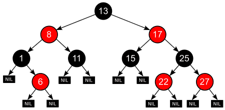

# 红黑树

红黑树（Red-Black Tree）是一种自平衡的二叉搜索树，它保证了树的高度不超过2log(n+1)，其中n是树中节点的数量。红黑树的每个节点都有一个颜色，可以是红色或黑色。红黑树满足以下性质：



- 每个节点要么是红色，要么是黑色。
- 根节点是黑色的。
- 每个叶子节点（NIL节点）是黑色的。
- 如果一个节点是红色的，则它的两个子节点都是黑色的。

对于每个节点，从该节点到其所有后代叶子节点的简单路径上，均包含相同数目的黑色节点。

红黑树的插入和删除操作都会改变树的结构，因此需要进行自平衡操作，以保证树的高度不超过2log(n+1)。红黑树的自平衡操作包括左旋、右旋、变色等操作，这些操作可以保证树的性质不被破坏。

红黑树的时间复杂度比普通的二叉搜索树更稳定，插入、删除和查找操作的时间复杂度均为O(log n)。红黑树广泛应用于C++ STL中的map和set等容器，以及Java中的TreeMap和TreeSet等容器。

以下是Python实现一个红黑树的示例代码：

```python
RED = True
BLACK = False


class Node:
    def __init__(self, key, value, color = RED):
        self.key = key
        self.value = value
        self.color = color
        self.left = None
        self.right = None


class RedBlackTree:
    def __init__(self):
        self.root = None

    def is_red(self, node):
        if node is None:
            return False
        return node.color == RED

    def rotate_left(self, node):
        x = node.right
        node.right = x.left
        x.left = node
        x.color = node.color
        node.color = RED
        return x

    def rotate_right(self, node):
        x = node.left
        node.left = x.right
        x.right = node
        x.color = node.color
        node.color = RED
        return x

    def flip_colors(self, node):
        node.color = RED
        node.left.color = BLACK
        node.right.color = BLACK

    def insert(self, key, value):
        self.root = self._insert(self.root, key, value)
        self.root.color = BLACK

    def _insert(self, node, key, value):
        if node is None:
            return Node(key, value)
        if key < node.key:
            node.left = self._insert(node.left, key, value)
        elif key > node.key:
            node.right = self._insert(node.right, key, value)
        else:
            node.value = value

        if self.is_red(node.right) and not self.is_red(node.left):
            node = self.rotate_left(node)
        if self.is_red(node.left) and self.is_red(node.left.left):
            node = self.rotate_right(node)
        if self.is_red(node.left) and self.is_red(node.right):
            self.flip_colors(node)

        return node

    def search(self, key):
        node = self.root
        while node is not None:
            if key == node.key:
                return node.value
            elif key < node.key:
                node = node.left
            else:
                node = node.right
        return None

    def delete(self, key):
        self.root = self._delete(self.root, key)

    def _delete(self, node, key):
        if node is None:
            return None
        if key < node.key:
            node.left = self._delete(node.left, key)
        elif key > node.key:
            node.right = self._delete(node.right, key)
        else:
            if node.left is None:
                return node.right
            elif node.right is None:
                return node.left
            else:
                min_node = self._min(node.right)
                node.key = min_node.key
                node.value = min_node.value
                node.right = self._delete(node.right, min_node.key)

        if self.is_red(node.right) and not self.is_red(node.left):
            node = self.rotate_left(node)
        if self.is_red(node.left) and self.is_red(node.left.left):
            node = self.rotate_right(node)
        if self.is_red(node.left) and self.is_red(node.right):
            self.flip_colors(node)

        return node

    def _min(self, node):
        while node.left is not None:
            node = node.left
        return node
```

这个红黑树使用Node类来表示树中的节点，每个节点包括键、值、颜色、左子节点和右子节点。红黑树支持插入、查找和删除操作，其中插入和删除操作会改变树的结构，需要进行自平衡操作。红黑树的自平衡操作包括左旋、右旋、变色等操作，这些操作可以保证树的性质不被破坏。红黑树的时间复杂度比普通的二叉搜索树更稳定，插入、删除和查找操作的时间复杂度均为O(logn)。你可以根据自己的需求对这个示例代码进行修改和扩展。
