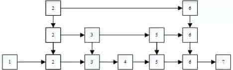
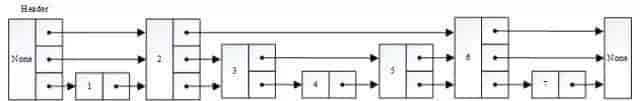

# 跳表

跳表（Skip List）是一种基于链表的数据结构，用于快速查找有序链表中的元素。跳表广泛应用于Redis等内存数据库中，以及一些高性能的网络库中，例如Nginx等。

-   跳表是一种随机化的数据结构，可以被看做二叉树的一个变种，它在性能上和红黑树、AVL 树不相上下，但是跳表的原理非常简单。
-   跳表实际为一种多层的有序链表，跳表的每一层都为一个有序链表，且满足每个位于第i层的节点有 p 的概率出现在第 i+1层，其中 p 为常数。
-   跳表中的元素按照升序排列。
-   跳表中的每个节点包含多个指针，可以跨越多个节点进行快速查找。
-   跳表中的每个节点包含一个随机数，用于决定该节点的指针数量。
-   最底层的有序链表包含所有节点；
-   跳跃表是为了解决平衡树插入或者删除操作过于复杂而进行设计的，采用了随机的思想简化了维持平衡的过程。
-   跳表的查找、插入和删除操作可看：[设计跳表](https://leetcode.cn/problems/design-skiplist/description/)

其中，网上有部分文章是按照如下方式描述跳跃表的：



这种描述便于理解，很容易让人理解到跳跃表是建立了类似索引的东西，从而提高效率的。但是，这样描述给人的感觉是，数据有多份存储，每份数据有两个指针，指向下层数据的指针和指向右面数据的指针。然而实际并不是这样的，实际的数据结构如下：



即：并非由多份数据，而是每份数据有多层指针。

从上面的结构也可以看出，跳跃表的核心思想就是，每一个节点既包含指向下一个节点的指针，也可能包含很多个指向后续节点的指针，这样在查找、插入、删除某个节点的过程中，可以避免一些不必要的节点，从而提高效率。

## 复杂度证明

-   跳表的空间复杂度较低，只需要额外存储每个节点的指针信息，跳表的期望空间复杂度为 O(n)。
-   跳表的插入、删除和查找操作的时间复杂度均为O(logn)，与平衡树类似。

### 空间复杂度

对于一个节点而言，节点的层数为 i 的概率为$p^{i-1}(1-p)$，则该节点的期望层数为：

$\sum_{i\geq1,p<1}ip^{i-1}(1-p)=\frac{1}{1-p}$

则跳表的期望空间为$\frac{n}{1-p}$，且因为 p 为常数，所以跳表的**期望空间复杂度**为 O(n)。在最坏的情况下，每一层有序链表等于初始有序链表，即跳表的**最差空间复杂度**为 O(nlogn)。

### 时间复杂度

从后向前分析查找路径，这个过程可以分为从最底层爬到第 L(n) 层和后续操作两个部分。在分析时，假设一个节点的具体信息在它被访问之前是未知的。

假设当前我们处于一个第 i 层的节点 x，我们并不知道 x 的最大层数和 x 左侧节点的最大层数，只知道 x 的最大层数至少为 i。如果 x 的最大层数大于 i，那么下一步应该是向上走，这种情况的概率为 p；如果 x 的最大层数等于 i，那么下一步应该是向左走，这种情况概率为 1−p。

令 C(i) 为在一个无限长度的跳表中向上爬 i 层的期望代价，定义 C(0)=0，那么有：

$C(i)=(1-p)(1+C(i))+p(1+C(i-1))$

解得 $C(i)=\frac{i}{p}$，由此可以得出：在长度为 n 的跳表中，从最底层爬到第 L(n) 层的期望步数存在上界 $C(i)=\frac{ L(n)−1}{p}$。现在只需要分析爬到第 L(n) 层后还要再走多少步。易得，到了第 L(n) 层后，向左走的步数不会超过第 L(n) 层及更高层的节点数总和，而这个总和的期望为 $\frac{1}{p}$。所以到了第 L(n) 层后向左走的期望步数存在上界 $\frac{1}{p}$。同理，到了第 L(n) 层后向上走的期望步数存在上界 $\frac{1}{p}$。

所以，跳表查询的期望查找步数为 $\frac{L(n)-1}{p}+\frac{2}{p}$，又因为$L(n)=log_{\frac{1}{p}}n$，所以跳表查询的**期望时间复杂度**为 O(logn)。在最坏的情况下，每一层有序链表等于初始有序链表，查找过程相当于对最高层的有序链表进行查询，即跳表查询操作的**最差时间复杂度**为 O(n)。插入操作和删除操作就是进行一遍查询的过程，途中记录需要修改的节点，最后完成修改。易得每一层至多只需要修改一个节点，又因为跳表期望层数为$log_{\frac{1}{p}}n$，所以插入和修改的**期望时间复杂度**也为 O(logn)。

## 要点说明

1.  跳表的每一个节点都有设置的**level<=MAX_LEVEL**长度的数组（forward）用于存储该节点各层指向的下一个节点（向右的），每一个节点的层数由随机化概率判定
2.  跳表的层数是随着**数据的插入**逐渐增加的（向上创建节点），最大为MAX_LEVEL，是否增加由随机化的概率判定，**P_FACTOR**一般设置为0.25，小于P_FACTOR才会向上创建节点，避免层数添加过快过多（下面的实现中，只做了一次判断，即确认创建节点所到的最高层，并设置插入节点的层数）也正因为这个，跳表实际运用中的索引是比较“乱”的，不会完全向下层逐层二分（理想状态）。
3.  跳表在插入数据时，需要记录每一次的向下节点（实际为了方便操作，记录的是**向下节点的前一个节点**，因为链表的前一个节点能让我们很方便地处理下一个和下下个节点），**最底层必然是要建立插入节点的**，然后依次向上层创建节点（根据P_FACTOR判断创建与否）
4.  删除的时候，要确保待删除节点在**各层都被删除掉**
5.  要维护level的变化，插入数时，level可能变大，删除数据时，level可能变小

>   为什么 redis 使用跳表而不使用红黑树：
>
>   1.  红黑树在查找区间元素的效率没有跳表高，其他操作时间复杂度一致。
>   2.  相比红黑树，跳表的实现还是简单的，简单就意味着不容易出错，bug 少，稳定，易读，易维护。
>   3.  跳表更加灵活，通过改变索引构建策略，有效平衡效率和内存消耗。

>   p的选择对于性能的影响是非常重要的，p 越小，节点拥有更高层级的概率越小，跳表的空间利用率越高，但搜索效率可能略有下降。

## 跳表实现

跳表的查找操作与二分查找类似，从顶层开始逐层查找，直到找到目标元素或者到达底层。跳表的插入和删除操作也与链表类似，需要进行节点的插入和删除操作，同时需要更新节点的指针信息，以保持跳表的平衡。

### 示例1

以下是Python实现一个跳表的示例代码：

```python
import random


class Node:
    def __init__(self, key = None, value = None, level = 0):
        self.key = key
        self.value = value
        self.forward = [None] * (level + 1)


class SkipList:
    def __init__(self):
        self.head = Node()
        self.level = 0

    def _random_level(self):
        level = 0
        while random.random() < 0.5 and level < 16:
            level += 1
        return level

    def search(self, key):
        node = self.head
        for i in range(self.level, -1, -1):
            while node.forward[i] and node.forward[i].key < key:
                node = node.forward[i]
        node = node.forward[0]
        if node and node.key == key:
            return node.value
        return None

    def insert(self, key, value):
        update = [None] * (self.level + 1)
        node = self.head
        for i in range(self.level, -1, -1):
            while node.forward[i] and node.forward[i].key < key:
                node = node.forward[i]
            update[i] = node
        node = node.forward[0]
        if node and node.key == key:
            node.value = value
        else:
            level = self._random_level()
            if level > self.level:
                for i in range(self.level + 1, level + 1):
                    update[i] = self.head
                self.level = level
            node = Node(key, value, level)
            for i in range(level + 1):
                node.forward[i] = update[i].forward[i]
                update[i].forward[i] = node

    def delete(self, key):
        update = [None] * (self.level + 1)
        node = self.head
        for i in range(self.level, -1, -1):
            while node.forward[i] and node.forward[i].key < key:
                node = node.forward[i]
            update[i] = node
        node = node.forward[0]
        if node and node.key == key:
            for i in range(self.level + 1):
                if update[i].forward[i] != node:
                    break
                update[i].forward[i] = node.forward[i]
            while self.level > 0 and not self.head.forward[self.level]:
                self.level -= 1
```

### 示例2

```python
class Node:
    def __init__(self, val = -1, next = None, down = None):
        self.val = val
        self.next = next
        self.down = down

class Skiplist:
    """动态拓展
    depth : factor ** 0 -> factor ** 1 -> factor ** 2 -> factor ** 3 -> factor ** 4 -> max_range
    部分区间节点过多，将数据抽出一个新的节点
    """

    def __init__(self):
        self.factor = 6
        self.head = Node()
        self.head.down = Node()

    def search(self, target: int) -> bool:
        cur = self.head.down
        while cur:
            if cur.val == target:
                return True
            if cur.val < target and (cur.next is None or target < cur.next.val):
                cur = cur.down
            else:
                cur = cur.next
        return False

    def add_child(self, prev: Node, cur: Node) -> None:
        if prev.val == cur.val or (prev.next is not None and prev.next.val == cur.val):
            return
        if prev.val == self.head.val and prev.next is None:
            prev.down = Node(self.head.val, down = prev.down)
            prev = prev.down
        prev.next = Node(cur.val, next = prev.next, down = cur)

    def add(self, num: int) -> None:
        prev = self.head
        cur = self.head.down
        count = 0
        while cur:
            if cur.val <= num and (cur.next is None or num < cur.next.val):
                if count != 0 and count % self.factor == 0:
                    self.add_child(prev, cur)
                    count = 0
                if cur.down is None:
                    break
                prev = cur
                cur = cur.down
                count = 0
            else:
                if cur.next is None:
                    break
                cur = cur.next
                count += 1

        # 进行值的插入
        node = Node(num, next = cur.next)
        cur.next = node
        if count < self.factor:
            return
        self.add_child(prev, node)

    def erase(self, num: int) -> bool:
        cur = self.head.down
        prev = None
        while cur:
            if cur.val >= num:
                break
            if cur.val < num and (cur.next is None or num < cur.next.val):
                cur = cur.down
            else:
                prev = cur
                cur = cur.next
        if cur is None or cur.val != num:
            return False
        if cur.down is None:
            prev.next = cur.next
        else:
            tail = cur.down
            while tail.down:
                tail = tail.down
            # 判断是否包含多个val
            if tail.next and tail.val == tail.next.val:
                tail.next = tail.next.next
            else:
                cur = prev
                while cur and cur.val <= num:
                    if cur.next and cur.next.val == num:
                        cur.next = cur.next.next
                        cur = cur.down
                    else:
                        cur = cur.next
        return True
```

### 示例3

```python
import random

MAX_LEVEL = 32
P_FACTOR = 0.25


def random_level() -> int:
    lv = 1
    while lv < MAX_LEVEL and random.random() < P_FACTOR:
        lv += 1
    return lv


class SkiplistNode:
    __slots__ = 'val', 'forward'

    def __init__(self, val: int, max_level = MAX_LEVEL):
        self.val = val
        self.forward = [None] * max_level


class Skiplist:
    def __init__(self):
        self.head = SkiplistNode(-1)
        self.level = 0

    def search(self, target: int) -> bool:
        curr = self.head
        for i in range(self.level - 1, -1, -1):
            # 找到第 i 层小于且最接近 target 的元素
            while curr.forward[i] and curr.forward[i].val < target:
                curr = curr.forward[i]
        curr = curr.forward[0]
        # 检测当前元素的值是否等于 target
        return curr is not None and curr.val == target

    def add(self, num: int) -> None:
        update = [self.head] * MAX_LEVEL
        curr = self.head
        for i in range(self.level - 1, -1, -1):
            # 找到第 i 层小于且最接近 num 的元素
            while curr.forward[i] and curr.forward[i].val < num:
                curr = curr.forward[i]
            update[i] = curr
        # 随机获取创建节点的最大层数
        lv = random_level()
        self.level = max(self.level, lv)
        new_node = SkiplistNode(num, lv)
        for i in range(lv):
            # 对第 i 层的状态进行更新，将当前元素的 forward 指向新的节点
            new_node.forward[i] = update[i].forward[i]
            update[i].forward[i] = new_node

    def erase(self, num: int) -> bool:
        update = [None] * MAX_LEVEL
        curr = self.head
        for i in range(self.level - 1, -1, -1):
            # 找到第 i 层小于且最接近 num 的元素
            while curr.forward[i] and curr.forward[i].val < num:
                curr = curr.forward[i]
            update[i] = curr
        # 获取待删除节点
        curr = curr.forward[0]
        if curr is None or curr.val != num:  # 值不存在
            return False
        for i in range(self.level):
            # 如果不等于，说明低层的等于num，从当前层开始不会再有等于num的，因为跳表每次向下，下一层的可能向下节点只可能大于等于上一层的节点
            if update[i].forward[i] != curr:
                break
            # 对第 i 层的状态进行更新，将 forward 指向被删除节点的下一跳
            update[i].forward[i] = curr.forward[i]
        # 更新当前的 level 从上往下进行更新，头节点右节点没有说明该层没有其他节点，故直接level-1
        while self.level > 1 and self.head.forward[self.level - 1] is None:
            self.level -= 1
        return True
```

## 其它一些有用的操作

### 跳表指定层元素输出

将跳表指定层转换为字符串以便进行打印，编写 print_level 方法打印指定层中数据元素：

```python
def get_level(self, level):
    """辅助函数，用于根据给定层构造结果字符串"""
    node = self.head.next[level]
    result = ''
    while node:
        result = result + str(node.data) + '-->'
        node = node.next[level]
    result += 'None'
    return result

def print_level(self, level):
    print('level {}'.format(level))
    result = self.get_level(level)
    print(result)
```

### 跳表各层元素输出

可以借助上述辅助函数 get_level，使用 str 函数调用对象上的 `__str__` 方法可以创建适合打印的字符串表示：

```python
def __str__(self):
    result = ''
    for i in list(range(self.max_level))[self.max_level-1:0:-1]:
        result = result + self.get_level(i) + '\n'
    result += self.get_level(0)
    return result
```

## 跳表的随机访问优化

访问跳表中第 k个节点，相当于访问初始有序链表中的第k个节点，很明显这个操作的时间复杂度是O(n)的，并不足够优秀。

跳表的随机访问优化就是对每一个前向指针，再多维护这个前向指针的长度。假设A和B都是跳表中的节点，其中A为跳表的第a个节点，B为跳表的第b个节点a < b，且在跳表的某一层中A的前向指针指向B，那么这个前向指针的长度为b - a。

现在访问跳表中的第k个节点，就可以从顶层开始，水平地遍历该层的链表，直到当前节点的位置加上当前节点在该层的前向指针长度大于等于k，然后移动至下一层。重复这个过程直至到达第一层且无法继续行操作。此时，当前节点就是跳表中第k个节点。

这样，就可以快速地访问到跳表的第k个元素。可以证明，这个操作的时间复杂度为$O(\log n)$。

## 跳表 vs 平衡树、红黑树或者 B+ 树

-   平衡树 vs 跳表：平衡树的插入、删除和查询的时间复杂度和跳表一样都是$O(logN)$。对于范围查询来说，平衡树也可以通过中序遍历的方式达到和跳表一样的效果。但是它的每一次插入或者删除操作都需要保证整颗树左右节点的绝对平衡，只要不平衡就要通过旋转操作来保持平衡，这个过程是比较耗时的。跳表诞生的初衷就是为了克服平衡树的一些缺点。跳表使用概率平衡而不是严格强制的平衡，因此，跳表中的插入和删除算法比平衡树的等效算法简单得多，速度也快得多。
    - 平衡树的插入和删除操作可能引发子树的调整，逻辑复杂，而skiplist的插入和删除只需要修改相邻节点的指针，操作简单又快速。
    - 从内存占用上来说，skiplist 比平衡树更灵活一些。一般来说，平衡树每个节点包含2个指针（分别指向左右子树），而 skiplist 每个节点包含的指针数目平均为$\frac{1}{1-p}$，具体取决于参数 p 的大小。如果像 Redis 里的实现一样，取 p=1/4，那么平均每个节点包含 1.33 个指针，比平衡树更有优势。
-   红黑树 vs 跳表：相比较于红黑树来说，跳表的实现也更简单一些，不需要通过旋转和染色（红黑变换）来保证黑平衡。并且，按照区间来查找数据这个操作，红黑树的效率没有跳表高。
-   B+ 树 vs 跳表：B+ 树更适合作为数据库和文件系统中常用的索引结构之一，它的核心思想是通过可能少的 IO 定位到尽可能多的索引来获得查询数据。对于 Redis 这种内存数据库来说，它对这些并不感冒，因为 Redis 作为内存数据库它不可能存储大量的数据，所以对于索引不需要通过 B+ 树这种方式进行维护，只需按照概率进行随机维护即可，节约内存。而且使用跳表实现 zset 时相较前者来说更简单一些，在进行插入时只需通过索引将数据插入到链表中合适的位置再随机维护一定高度的索引即可，也不需要像 B+ 树那样插入时发现失衡时还需要对节点分裂与合并。

## 参考

-    [pugh-skiplists-cacm1990.pdf](assets\pugh-skiplists-cacm1990.pdf)
-   [跳表(SkipList)设计与实现(Java)](https://www.cnblogs.com/bigsai/p/14193225.html)
-   [用Python深入理解跳跃表原理及实现](https://cloud.tencent.com/developer/news/387722)
-   [跳表这种高效的数据结构，值得每一个程序员掌握](https://zhuanlan.zhihu.com/p/54869087)
-   [解读跳表（Skip Lists）：一种平衡树的简单高效替代数据结构](https://zhuanlan.zhihu.com/p/707734900)
-   [跳跃表数据结构与算法分析](https://www.modb.pro/db/606902)
-   [java 实现跳表（skiplist）及论文解读跳表](https://juejin.cn/post/6890522597302206471)
-   [[Redis](数据结构)跳转表](https://blog.csdn.net/SMUEvian/article/details/72846919)
-   [java 实现跳表（skiplist）及论文解读](https://blog.csdn.net/ryo1060732496/article/details/109458405)
-   [Skip Lists: A Probabilistic Alternative to Balanced Trees 跳表论文阅读笔记](https://www.cnblogs.com/elaron/p/13977536.html)
-   [[外文翻译\] 跳表（Skip List）](https://www.cnblogs.com/hezhiqiangTS/p/11412777.html)
