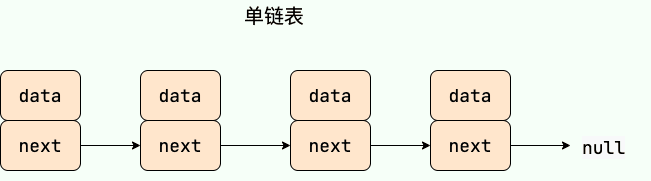
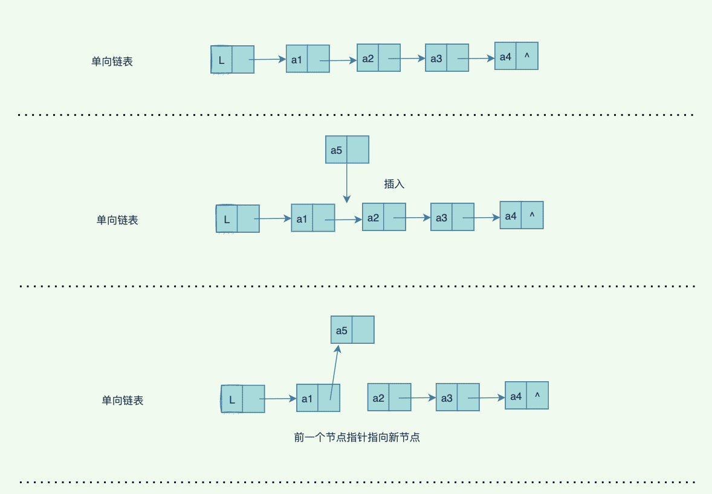
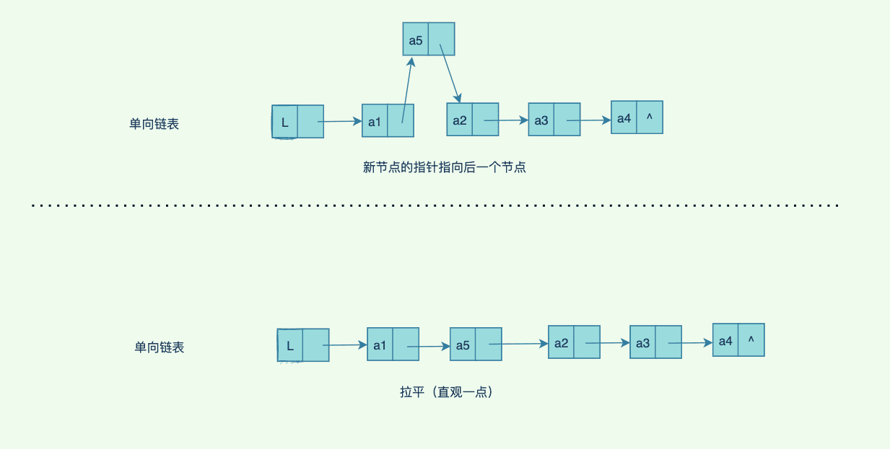
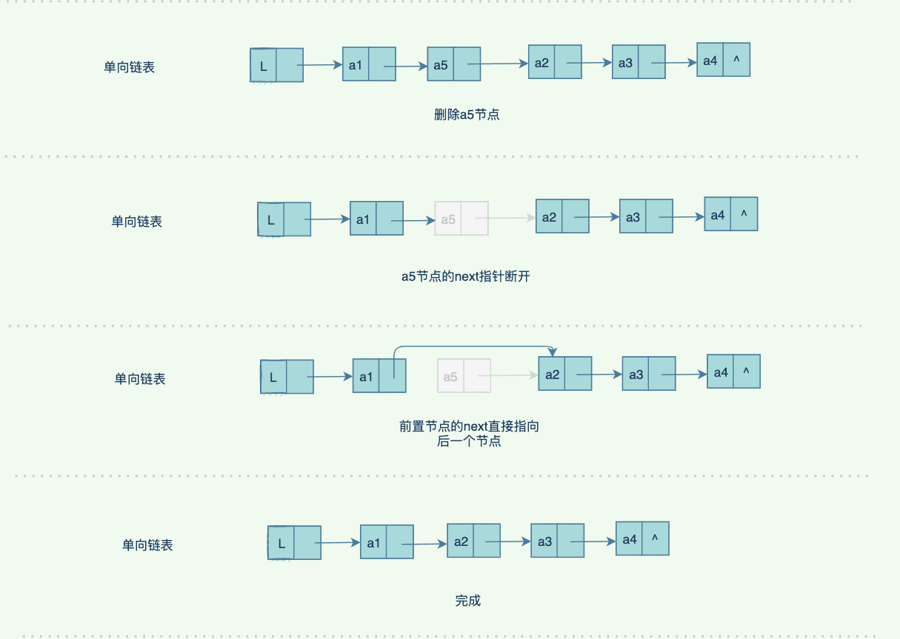
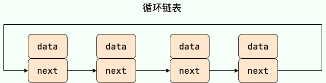
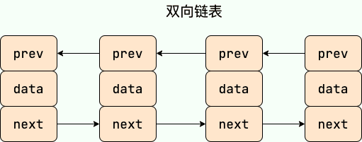
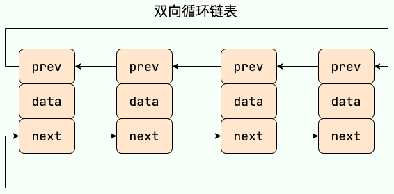
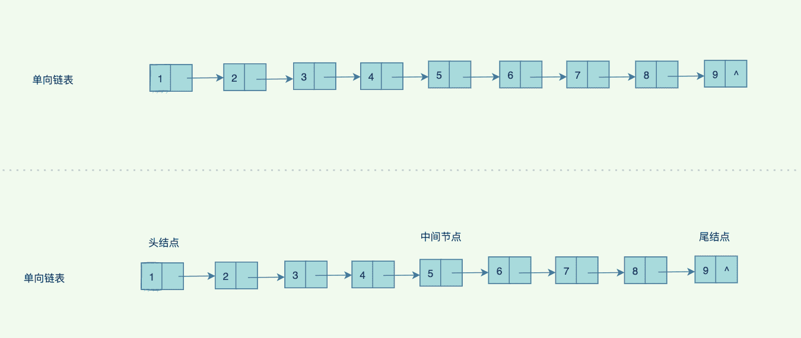
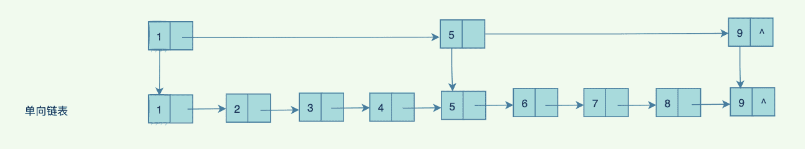
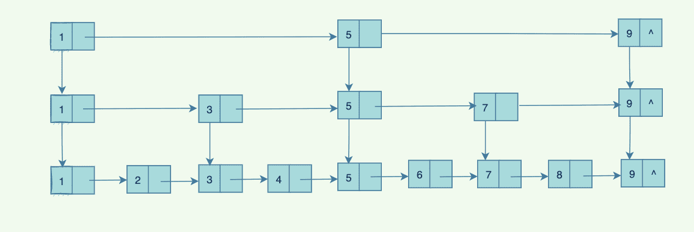

# 链表

## 链表简介

**链表（LinkedList）** 虽然是一种线性表，但是并不会按线性的顺序存储数据，使用的不是连续的内存空间来存储数据。

我们可以看到数组是需要连续的空间，这⾥⾯如果空间⼤⼩只有 2，放到第 3 个元素的时候，就不得不扩容，不仅如此，还得拷⻉元素。⼀些删除，插⼊操作会引起较多的数据移动的操作。

链表，也就是链式数据结构，由于它不要求逻辑上相邻的数据元素在物理位置上也相邻，所以它没有顺序存储结构所具有的缺点，但是同时也失去了通过索引下标直接查找元素的优点。

链表的插入和删除操作的复杂度为 O(1)，只需要知道目标位置元素的上一个元素即可。但是，在查找一个节点或者访问特定位置的节点的时候复杂度为 O(n) 。

使用链表结构可以克服数组需要预先知道数据大小的缺点，链表结构可以充分利用计算机内存空间，实现灵活的内存动态管理。但链表不会节省空间，相比于数组会占用更多的空间，因为链表中每个节点存放的还有指向其他节点的指针。除此之外，链表不具有数组随机读取的优点。

## 时间复杂度

- 查询：O(n)，需要遍历链表
- 插⼊：O(1)，修改前后指针即可
- 删除：O(1)，同样是修改前后指针即可
- 修改：不需要查询则为O(1)，需要查询则为O(n)

## 链表分类

**常见链表分类：**

1. 单链表：链表中的每⼀个结点，都有且只有⼀个指针指向下⼀个结点，并且最后⼀个节点指向空。
2. 双向链表：每个节点都有两个指针（为⽅便，我们称之为前指针，后指针），分别指向上⼀个节点和下⼀个节点，第⼀个节点的前指针指向NULL，最后⼀个节点的后指针指向NULL
3. 循环链表：每⼀个节点的指针指向下⼀个节点，并且最后⼀个节点的指针指向第⼀个节点（虽然是循环链表，但是必要的时候还需要标识头结点或者尾节点，避免死循环）
4. 双向循环链表：同时满足双向链表和循环链表的能力

### 单链表

单向链表只有一个方向，结点只有一个后继指针 next 指向后面的节点。因此，链表这种数据结构通常在物理内存上是不连续的。我们习惯性地把第一个结点叫作头结点，链表通常有一个不保存任何值的 head 节点(头结点)，通过头结点我们可以遍历整个链表。尾结点通常指向 null。



单向链表的查找更新⽐较简单，我们看看插⼊新节点的具体过程（这⾥只展示中间位置的插⼊，头尾插⼊⽐较简单）：





那如何删除⼀个中间的节点呢？下⾯是具体的过程：



或许你会好奇，a5 节点只是指针没有了，那它去哪⾥了？

如果是Java 程序，垃圾回收器会收集这种没有被引⽤的节点，帮我们回收掉了这部分内存，但是为了加快垃圾回收的速度，⼀般不需要的节点我们会置空，⽐如 node = null , 如果在C++ 程序中，那么就需要⼿动回收了，否则容易造成内存泄漏等问题。

python版本单项链表的实现：

```python
"""单项链表的实现"""
class Node(object):
    def __init__(self, elem):
        self.elem = elem
        self.next = None
    def __repr__(self):
        return "<Node: {}>".format(self.elem)

class SingleLinkList(object):
    def __init__(self, node=None):
        self.__head = node

    def add(self, item):
        node = Node(item)
        if self.__head:
            self.__head, node.next = node, self.__head
        else:
            self.__head = node

    def append(self, item):
        node = Node(item)
        if self.__head:
            cur = self.__head
            while cur.next is not None:
                cur = cur.next
            cur.next = node
        else:
            self.__head = node

    def travel(self):
        if self.__head:
            cur = self.__head
            while cur is not None:
                print(cur.elem)
                cur = cur.next

    def remove(self, item):
        if self.__head:
            cur = self.__head
            while cur.next is not None:
                if cur.next.elem == item:
                    cur.next = cur.next.next
                    break
                cur = cur.next
            else:
                print("Not Exist")
        else:
            print("Not Exist")

    def insert(self, pos, item):
        i = 0
        cur = self.__head
        if pos == 0:
            self.add(item)
        elif pos + 1 > self.length:
            raise ValueError
        else:
            while cur.next is not None:
                i += 1
                if i == pos:
                    new_node = Node(item)
                    cur.next, new_node.next = new_node, cur.next
                    break
                elif i > pos:
                    raise ValueError
                cur = cur.next

    def search(self, item):
        if self.__head:
            cur = self.__head
            while cur is not None:
                if cur.elem == item:
                    print(cur.elem)
                    break
                cur = cur.next

    @property
    def length(self):
        count = 0
        if self.__head:
            cur = self.__head
            while cur is not None:
                count += 1
                cur = cur.next
        return count

    def is_empty(self):
        return self.__head is None
```

### 循环链表

**循环链表**其实是一种特殊的单链表，和单链表不同的是循环链表的尾结点不是指向 null，而是指向链表的头结点，形成一个环。



循环链表可以从任意一个节点开始遍历，因此比单向链表和双向链表更加灵活。

循环链表的节点通常包含两个部分：数据元素和指向下一个节点的指针。循环链表的头节点可以是任意一个节点，因为从任意一个节点开始遍历都可以遍历整个链表。

循环链表的插入和删除操作与单向链表和双向链表类似，但是需要特别处理最后一个节点指向第一个节点的情况。循环链表的访问效率与单向链表和双向链表类似，但是需要特别处理从最后一个节点到第一个节点的情况。

循环链表的实现：

```python
"""循环链表的实现"""
class Node(object):
    def __init__(self, elem):
        self.elem = elem
        self.next = None
    def __repr__(self):
        return "<Node: {}>".format(self.elem)

class CircleLinkList(object):
    def __init__(self, node=None):
        if node is None:
            self._head = None
        else:
            self._head = node.next = node

    def add(self, item):
        node = Node(item)
        if self._head:
            cur = self._head
            while cur.next != self._head:
                cur = cur.next
            last = cur
            node.next, self._head = self._head, node
            last.next = self._head
        else:
            self._head = node.next = node

    def append(self, item):
        node = Node(item)
        if self._head:
            cur = self._head
            while cur.next != self._head:
                cur = cur.next
            last = cur
            last.next, node.next = node, self._head
        else:
            self._head = node.next = node

    def travel(self):
        if self._head:
            cur = self._head
            while cur.next != self._head:
                print(cur.elem, end=" ")
                cur = cur.next
            print(cur.elem)

    def remove(self, item):   # 单节点remove
        if self._head:
            cur = self._head
            while cur.next != self._head:
                cur = cur.next
            last = cur

            cur = self._head
            if cur.elem == item:
                self._head = last.next = cur.next
            else:
                while cur.next != self._head:
                    if cur.next.elem == item:
                        cur.next = cur.next.next
                        break
                    cur = cur.next
                else:
                    print("Not Exist")
        else:
            print("Not Exist")

    def insert(self, pos, item):
        length = self.length
        if pos == 0:
            self.add(item)
        elif pos == length:
            self.append(item)
        elif pos > length:
            raise ValueError
        else:
            i = 0
            cur = self._head
            while cur.next != self._head :
                i += 1
                if i == pos:
                    node = Node(item)
                    cur.next, node.next = node, cur.next
                    break
                cur = cur.next

    def search(self, item):
        if self._head:
            cur = self._head
            while cur.next != self._head:
                if cur.elem == item:
                    print(cur.elem)
                    break
                cur = cur.next
            else:
                if cur.elem == item:
                    print(cur.elem)

    @property
    def length(self):
        count = 0
        if self._head:
            cur = self._head
            while cur.next != self._head:
                count += 1
                cur = cur.next
            count += 1
        return count

    def is_empty(self):
        return self._head is None

if __name__ == '__main__':
    s = CircleLinkList()
    s.append(0)
    s.append(1)
    s.append(2)
    s.append(3)
    s.remove(0)
    s.insert(3, 4)
    s.search(1)
    s.travel()
```

### 双向链表

**双向链表** 包含两个指针，一个 prev 指向前一个节点，一个 next 指向后一个节点。



双向链表可以从前往后遍历，也可以从后往前遍历，因此比单向链表更加灵活。

双向链表的插入和删除操作比较方便，因为可以通过前一个节点和后一个节点的指针来修改节点的连接关系。双向链表的访问效率比单向链表高，因为可以从前往后或者从后往前遍历，但是双向链表需要额外的存储空间来存储前一个节点的指针，因此占用的内存比单向链表更大。

双向链表的实现

```python
"""双项链表的实现"""
class Node(object):
    def __init__(self, elem):
        self.pre = None
        self.elem = elem
        self.next = None
    def __repr__(self):
        return "<Node: {}>".format(self.elem)

class DoubleLinkList(object):
    def __init__(self, node=None):
        self.__head = node

    def add(self, item):
        node = Node(item)
        if self.__head:
            self.__head, self.__head.pre, node.next = node, node, self.__head
        else:
            self.__head = node

    def append(self, item):
        node = Node(item)
        if self.__head:
            cur = self.__head
            while cur.next is not None:
                cur = cur.next
            cur.next, node.pre = node, cur
        else:
            self.__head = node

    def travel(self):
        if self.__head:
            cur = self.__head
            while cur is not None:
                print(cur.elem, end=" ")
                cur = cur.next

    def remove(self, item):
        if self.__head:
            cur = self.__head
            while cur.next is not None:
                if cur.next.elem == item:
                    cur.next, cur.next.next.pre = cur.next.next, cur
                    break
                cur = cur.next
            else:
                print("Not Exist")
        else:
            print("Not Exist")

    def insert(self, pos, item):
        i = 0
        cur = self.__head
        if pos == 0:
            self.add(item)
        elif pos + 1 > self.length:
            raise ValueError
        else:
            while cur.next is not None:
                i += 1
                if i == pos:
                    new_node = Node(item)
                    cur.next, new_node.next, new_node.pre = new_node, cur.next, cur
                    break
                elif i > pos:
                    raise ValueError
                cur = cur.next

    def search(self, item):
        if self.__head:
            cur = self.__head
            while cur is not None:
                if cur.elem == item:
                    print(cur.elem)
                    break
                cur = cur.next

    @property
    def length(self):
        count = 0
        if self.__head:
            cur = self.__head
            while cur is not None:
                count += 1
                cur = cur.next
        return count

    def is_empty(self):
        return self.__head is None
```

### 双向循环链表

**双向循环链表** 最后一个节点的 next 指向 head，而 head 的 prev 指向最后一个节点，构成一个环。



## 应用场景

- 如果需要支持随机访问的话，链表没办法做到。
- 如果需要存储的数据元素的个数不确定，并且需要经常添加和删除数据的话，使用链表比较合适。
- 如果需要存储的数据元素的个数确定，并且不需要经常添加和删除数据的话，使用数组比较合适。

## 数组 vs 链表

- 数组支持随机访问，而链表不支持。
- 数组使用的是连续内存空间对 CPU 的缓存机制友好，链表则相反。
- 数组的大小固定，而链表则天然支持动态扩容。如果声明的数组过小，需要另外申请一个更大的内存空间存放数组元素，然后将原数组拷贝进去，这个操作是比较耗时的！

## 单向链表的增删改查实现

```java
public class ListNode {
    int val;
    ListNode next = null;
    ListNode(int val) {
    	this.val = val;
    }
}
```

```java
public class MyList<T> {
    private ListNode<T> head;
    private ListNode<T> tail;
    private int size;

    public MyList() {
        this.head = null;
        this.tail = null;
        this.size = 0;
    }

    public void add(T element) {
    	add(size, element);
    }

    public void add(int index, T element) {
        if (index < 0 || index > size) {
        	throw new IndexOutOfBoundsException("超出链表⻓度范围");
        }
        ListNode current = new ListNode(element);
        if (index == 0) {
        	if (head == null) {
            	head = current;
        		tail = current;
        	} else {
                current.next = head;
                head = current;
            }
        } else if (index == size) {
            tail.next = current;
            tail = current;
        } else {
            ListNode preNode = get(index - 1);
            current.next = preNode.next;
            preNode.next = current;
        }
        size++;
    }

    public ListNode get(int index) {
        if (index < 0 || index >= size) {
        	throw new IndexOutOfBoundsException("超出链表⻓度");
        }
        ListNode temp = head;
        for (int i = 0; i < index; i++) {
        	temp = temp.next;
        }
        return temp;
    }

    public ListNode delete(int index) {
        if (index < 0 || index >= size) {
        	throw new IndexOutOfBoundsException("超出链表节点范围");
        }
        ListNode node = null;
        if (index == 0) {
            node = head;
            head = head.next;
        } else if (index == size - 1) {
            ListNode preNode = get(index - 1);
            node = tail;
            preNode.next = null;
            tail = preNode;
        } else {
            ListNode pre = get(index - 1);
            pre.next = pre.next.next;
            node = pre.next;
        }
        size--;
        return node;
    }

    public void update(int index, T element) {
        if (index < 0 || index >= size) {
            throw new IndexOutOfBoundsException("超出链表节点范围");
        }
        ListNode node = get(index);
        node.val = element;
    }

    public void display() {
        ListNode temp = head;
        while (temp != null) {
            System.out.print(temp.val + " -> ");
            temp = temp.next;
        }
        System.out.println("");
    }
}
```

## 扩展：跳表

链表如果搜索，是很麻烦的，如果这个节点在最后，需要遍历所有的节点，才能找到，查找效率实在太低，有没有什么好的办法呢？

办法总⽐问题多，但是想要绝对的” 多快好省“是不存在的，有舍有得，计算机的世界⾥，充满哲学的味道。既然搜索效率有问题，那么我们不如给链表排个序。排序后的链表，还是只能知道头尾节点，知道中间的范围，但是要找到中间的节点，还是得⾛遍历的⽼路。如果我们把中间节点存储起来呢？存起来，确实我们就知道数据在前⼀半，还是在后⼀半。⽐如找7，肯定就从中间节点开始找。如果查找4 ,就得从头开始找，最差到中间节点，就停⽌查找。



但是如此，还是没有彻底解决问题，因为链表很⻓的情况，只能通过前后两部分查找。不如回到原则：空间和时间，我们选择时间，那就要舍弃⼀部分空间,我们每个节点再加⼀个指针，现在有 2 层指针（注意：节点只有⼀份，都是同⼀个节点，只是为了好看，弄了两份，实际上是同⼀个节点，有两个指针，⽐如 1，既指向2，也指向5）：



两层指针，问题依然存在，那就不断加层，⽐如每两个节点，就加⼀层：



这就是跳表了，跳表的定义如下：

跳表(SkipList，全称跳跃表)是⽤于有序元素序列快速搜索查找的⼀个数据结构，跳表是⼀个随机化的数据结构，实质就是⼀种可以进⾏⼆分查找的有序链表。跳表在原有的有序链表上⾯增加了多级索引，通过索引来实现快速查找。跳表不仅能提⾼搜索性能，同时也可以提⾼插⼊和删除操作的性能。它在性能上和红⿊树，AVL树不相上下，但是跳表的原理⾮常简单，实现也⽐红⿊树简单很多。

主要的原理是⽤空间换时间，可以实现近乎⼆分查找的效率，实际上消耗的空间，假设每两个加⼀层，1 + 2 + 4 + ... + n = 2n-1 ,多出了差不多⼀倍的空间。你看它像不像书的⽬录，⼀级⽬录，⼆级，三级 ...

如果我们不断往跳表中插⼊数据，可能出现某⼀段节点会特别多的情况，这个时候就需要动态更新索引，除了插⼊数据，还要插⼊到上⼀层的链表中，保证查询效率。redis 中使⽤了[跳表来实现zset](https://www.seven97.top/database/redis/02-basement1-datastructure.html#跳表) , redis 中使⽤⼀个随机算法来计算层级，计算出每个节点到底多少层索引，虽然不能绝对保证⽐较平衡，但是基本保证了效率，实现起来⽐那些平衡树，红⿊树的算法简单⼀点。
