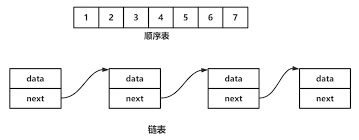

## 顺序表

顺序表是一种线性表，它使用一段连续的存储空间来存储元素，每个元素占用一个固定大小的存储单元。顺序表支持随机访问，可以通过下标来访问任意位置的元素，因此它的访问效率很高。但是，顺序表的插入和删除操作比较耗时，因为需要移动

大量元素。

顺序表通常使用数组来实现，数组的下标就是元素在顺序表中的位置。顺序表的长度可以动态增长或缩小，但是需要重新分配存储空间，并将原有元素复制到新的存储空间中。

顺序表的优点是访问效率高，适合于随机访问和元素数量不太频繁变化的场景。缺点是插入和删除操作比较耗时，适合于元素数量较少或者插入删除操作不太频繁的场景。



### 顺序表的特点

- 用连续单元存储数据(地址连续)
- 变量名指向起始地址
- 索引实际是从起始位置的偏移量

### 顺序表存储方式

1. 一体存储 元素内置
2. 分离存储 元素外置
3. 动态顺序表(可以数据扩充)

### 顺序表的操作

- 添加元素
    - 末尾添加 O(1)
    - 中间插入O(n)
    - 插入非保序O(1)
- 删除元素
    - 末尾删除 O(1)
    - 中间删除O(n)

### Python中的顺序表

Python中的list和tuple两种类型采用了顺序表的实现技术，具有前面讨论的顺序表的所有性质。

tuple是不可变类型，即不变的顺产表，因此不支持改变其内部状态的任何換作，而其他方面，则与list的性质类似。

### 顺序表实现

```python
class ArrayList:
    def __init__(self, size):
        self.size = size
        self.array = [None] * size
        self.length = 0

    def is_empty(self):
        return self.length == 0

    def is_full(self):
        return self.length == self.size

    def append(self, value):
        if self.is_full():
            raise Exception("List is full")
        self.array[self.length] = value
        self.length += 1

    def insert(self, index, value):
        if self.is_full():
            raise Exception("List is full")
        if index < 0 or index > self.length:
            raise Exception("Index out of range")
        for i in range(self.length, index, -1):
            self.array[i] = self.array[i-1]
        self.array[index] = value
        self.length += 1

    def delete(self, index):
        if self.is_empty():
            raise Exception("List is empty")
        if index < 0 or index >= self.length:
            raise Exception("Index out of range")
        for i in range(index, self.length-1):
            self.array[i] = self.array[i+1]
        self.array[self.length-1] = None
        self.length -= 1

    def get(self, index):
        if self.is_empty():
            raise Exception("List is empty")
        if index < 0 or index >= self.length:
            raise Exception("Index out of range")
        return self.array[index]

    def set(self, index, value):
        if self.is_empty():
            raise Exception("List is empty")
        if index < 0 or index >= self.length:
            raise Exception("Index out of range")
        self.array[index] = value

    def __str__(self):
        return str(self.array[:self.length])
```

### Python的list的基本实现

Python标准类型list就是一种元素个数可变的顺序表，可以加入和删除元素，井在各种操作中维持已有元素的顺序（即保序），而且还具有以下行为特征：

- 基于下标（位置）的有效元素访问和更新，时间复杂度应该是O(1);
  为满足该特征，应该采用顺序表技术，表中元泰保存在一块连续的存储区中。
- 允许任意加入元素，而且在不断加入元素的过程中，表对象的标识（函数id得到的值）不麥。

为满足该特征，就必须能更换元素存储区，并且为保证更换存储区时list对象的标识id不变，只能采用分离式实现技术。
在Python的官方实现中，list就是一种采用分离式技术安现的**动态顺序表**。这就是为什么用`list.append`(或 `list.insert(lenlist)，×）`，即尾部插入）
比在指定位置插入元素效率高的原因。

在Python的官方实现中，list实现采用了如下的策路：

- 在建立空表（或者很小的表）时，系统分配一块能容纳8个元素的存储区；
- 在执行插入操作(insert或append) 时，如果元素存储区满就换一块4倍大的存储区。
- 但如果此时的表已经很大（目前的院值为50000），则改变策路，采用加一倍的成法。引1入这种改变策路的方式，是为了避免出现过多空闲的存储位置。

### Python中列表操作的时间复杂度

| 操作                          | 时间复杂度       | 描述               |
|:----------------------------|:------------|:-----------------|
| lst[2]                      | O(1)        | 访问元素             |
| lst.pop()                   | O(1)        | 弹出最后一个值          |
| lst.append(l1)              | O(1)        | 在末尾添加元素          |
| lst.extend(l1)              | O(K)        | 在末尾逐个添加元素        |
| lst.clear()                 | O(1)        | 清空list           |
| lst.copy()                  | O(N)        | 列表拷贝             |
| lst.count(15)               | O(N)        | 元素计数             |
| lst.remove(15)              | O(N)        | 删除一个元素           |
| lst.reverse()               | O(N)        | 反序               |
| lst.sort()                  | O(N*log(N)) | 排序               |
| lst.insert(1,200)           | O(N)        | 在某一位置插入元素        |
| del lst[0]                  | O(N)        | 删除某个位置的元素        |
| lst.index(15)               | O(N)        | 查找元素，并返回元素位置     |
| bisect.bisect_left(lst, 15) | O(log(N))   | 有序列表使用bisect查找元素 |
