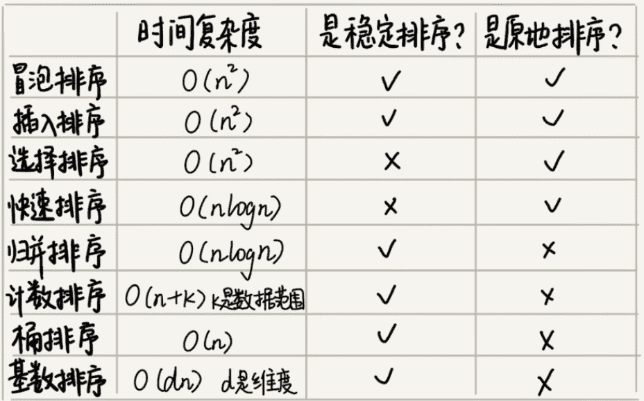

# 排序优化

## 如何选择合适的排序算法？

各种算法是时间复杂度的对比图：

如果我们要选择一个通用的排序算法，线性排序算法显然是不合适的，因为它的适用场景非常有限，尽管他是速度最快的。

如果对于小规模数据可以选择时间复杂度$O(n^2)$的算法，但是对于大规模数据，则应该选择时间复杂度为O(nlogn)的算法更加高效。所以为了兼容任意规模的数据的排序，我们一般选择时间复杂度为O(nlogn)的算法。时间复杂度为O(nlogn)的算法有两个，一个是快排，一个是归并，但是我们更多的是选择快排，为什么呢？因为归并排序并不是原地排序，它的空间复杂度是O(n)，比如我们要排序200M的数据，除了数据本身占用的内存外，还需要另外200M的数据储存空间，空间耗费就翻倍了，这对于空间有限的机器来说，就完成不了。而快排本身是原地排序，不会占用额外的储存空间，是比较理想的选择。

## 如何解决快排在最坏情况下时间复杂度为$O(n^2)$的问题？（优化快排）

先说下为什么最坏情况下快速排序的时间复杂度是$O(n^2)$呢？

如果数据原来就是有序的或者接近有序的，每次分区点都选择最后一个数据，那快速排序算法就会变得非常糟糕，时间复杂度就会退化为O($n^2$)。其实就是我们的分区节点选得不合理。

解决办法就是选择合适的节点

最理想的分区节点就是，被节点分开的两个分区中，数据的数量差不多。

**1.三数取中法**

-   从区间的首、中、尾分别取一个数，然后比较大小，取中间值作为分区点。
-   如果要排序的数组比较大，那“三数取中”可能就不够用了，可能要“5数取中”或者“10数取中”。

**2.随机法：**

每次从要排序的区间中，随机选择一个元素作为分区点。

特别注意：使用快排还要注意一个问题，快排是通过递归实现的，我们知道递归有堆栈溢出的风险，所以使用快排要警惕这个问题的出现。为了防止递归过深而堆栈过小，而导致堆栈溢出，我们有两种解决办法：

1.  限制递归深度。一旦递归过深，超过了我们事先设定的阈值，就停止递归
2.  在堆上模拟实现一个函数调用栈，手动模拟递归压栈、出栈过程，这样就没有系统栈大小的限制。

通用排序函数实现技巧

1.  数据量不大时，可以采取用时间换空间的思路
2.  数据量大时，优化快排分区点的选择
3.  防止堆栈溢出，可以选择在堆上手动模拟调用栈解决
4.  在排序区间中，当元素个数小于某个常数是，可以考虑使用$O(n^2)$级别的插入排序
5.  用哨兵简化代码，每次排序都减少一次判断，尽可能把性能优化到极致

快排中为避免递归调用过深，所以在堆上模拟了栈。这是什么意思呢？其实就是将递归调用，改写为循环非递归方式。
