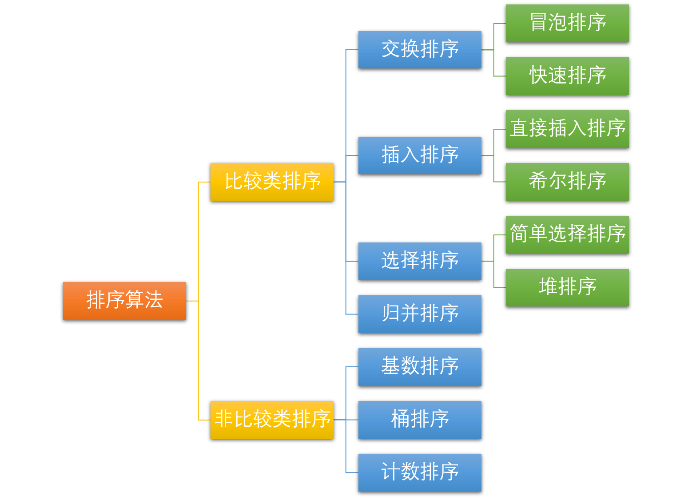

# 十大经典排序算法

## 引言

所谓排序，就是使一串记录，按照其中的某个或某些关键字的大小，递增或递减的排列起来的操作。排序算法，就是如何使得记录按照要求排列的方法。排序算法在很多领域得到相当地重视，尤其是在大量数据的处理方面。一个优秀的算法可以节省大量的资源。在各个领域中考虑到数据的各种限制和规范，要得到一个符合实际的优秀算法，得经过大量的推理和分析。

## 简介

### 术语说明

- **稳定**：如果 A 原本在 B 前面，而 $A=B$，排序之后 A 仍然在 B 的前面。
- **不稳定**：如果 A 原本在 B 的前面，而 $A=B$，排序之后 A 可能会出现在 B 的后面。
- **时间复杂度**：定性描述一个算法执行所耗费的时间。
- **空间复杂度**：定性描述一个算法执行所需内存的大小。

### 算法分类

十种常见排序算法可以分类两大类别：**比较类排序**和**非比较类排序**。

常见的**快速排序**、**归并排序**、**堆排序**以及**冒泡排序**等都属于**比较类排序算法**。比较类排序是通过比较来决定元素间的相对次序，由于其时间复杂度不能突破 `O(nlogn)`，因此也称为非线性时间比较类排序。在冒泡排序之类的排序中，问题规模为 `n`，又因为需要比较 `n` 次，所以平均时间复杂度为 `O(n²)`。在**归并排序**、**快速排序**之类的排序中，问题规模通过**分治法**消减为 `logn` 次，所以时间复杂度平均 `O(nlogn)`。

比较类排序的优势是，适用于各种规模的数据，也不在乎数据的分布，都能进行排序。可以说，比较排序适用于一切需要排序的情况。

而**计数排序**、**基数排序**、**桶排序**则属于**非比较类排序算法**。非比较排序不通过比较来决定元素间的相对次序，而是通过确定每个元素之前，应该有多少个元素来排序。由于它可以突破基于比较排序的时间下界，以线性时间运行，因此称为线性时间非比较类排序。非比较排序只要确定每个元素之前的已有的元素个数即可，所有一次遍历即可解决。算法时间复杂度 $O(n)$。

非比较排序时间复杂度底，但由于非比较排序需要占用空间来确定唯一位置。所以对数据规模和数据分布有一定的要求。

## 常见算法复杂度

| 排序算法 | 平均时间复杂度 | 最好     | 最坏      | 空间复杂度 | 稳定性 |
| -------- | -------------- | -------- | --------- | ---------- | ------ |
| 冒泡排序 | $O(n^2)$       | O(n)     | $O(n^2)$  | O(1)       | 稳定   |
| 快速排序 | O(nlogn)       | O(nlogn) | $O(n^2)$  | O(logn)    | 不稳定 |
| 插入排序 | $O(n^2)$       | O(n)     | $O(n^2)$  | O(1)       | 稳定   |
| 希尔排序 | O(n^1.3)       | O(n)     | O(nlog2n) | O(1)       | 不稳定 |
| 选择排序 | $O(n^2)$       | $O(n^2)$ | $O(n^2)$  | O(1)       | 不稳定 |
| 堆排序   | O(nlogn)       | O(nlogn) | O(nlogn)  | O(1)       | 不稳定 |
| 归并排序 | O(nlogn)       | O(nlogn) | O(nlogn)  | O(n)       | 稳定   |
| 桶排序   | O(n+k)         | O(n+k)   | O(n+k)    | O(n+k)     | 稳定   |
| 计数排序 | O(n+k)         | O(n+k)   | O(n+k)    | O(k)       | 稳定   |
| 基数排序 | O(n*k)         | O(n*k)   | O(n*k)    | O(n+k)     | 稳定   |
