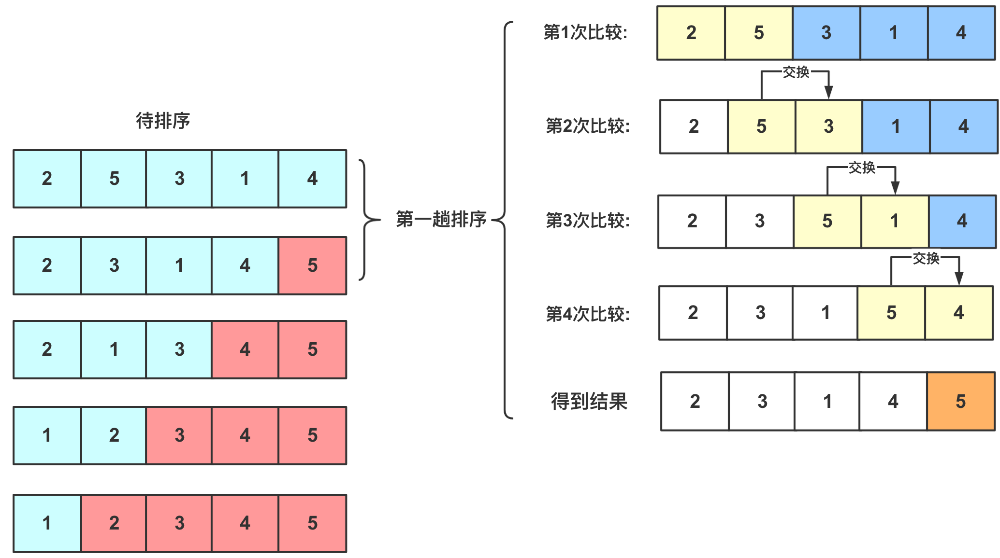

# 冒泡排序

冒泡排序，又称起泡排序，它是一种基于交换的排序典型，也是快排思想的基础，冒泡排序是一种稳定排序算法，时间复杂度为$O(n^2)$。基本思想是：**循环遍历多次每次从前往后把大元素往后调，每次确定一个最大(最小)元素，多次后达到排序序列**，(或者从后向前把小元素往前调)。

具体思想为(把大元素往后调)：

-  从第一个元素开始往后遍历，每到一个位置判断是否比后面的元素大，如果比后面元素大，那么就交换两者大小，然后继续向后，这样的话进行一轮之后就可以保证**最大的那个数被交换交换到最末的位置可以确定**。
-  第二次同样从开始起向后判断着前进，如果当前位置比后面一个位置更大的那么就和他后面的那个数交换。但是有点注意的是，这次并不需要判断到最后，只需要判断到倒数第二个位置就行(因为第一次我们已经确定最大的在倒数第一，这次的目的是确定倒数第二)
-  同理，后面的遍历长度每次减一，直到第一个元素使得整个元素有序。

## 图解算法

例如`2 5 3 1 4`排序过程如下：



实现代码为：

###

```java
/**
 * 冒泡排序
 * @param arr
 * @return arr
 */
public static int[] bubbleSort(int[] arr) {
    for (int i = 1; i < arr.length; i++) {
        // Set a flag, if true, that means the loop has not been swapped,
        // that is, the sequence has been ordered, the sorting has been completed.
        boolean flag = true;
        for (int j = 0; j < arr.length - i; j++) {
            if (arr[j] > arr[j + 1]) {
                int tmp = arr[j];
                arr[j] = arr[j + 1];
                arr[j + 1] = tmp;
       // Change flag
                flag = false;
            }
        }
        if (flag) {
            break;
        }
    }
    return arr;
}
```

此处对代码做了一个小优化，加入了 `is_sorted` Flag，目的是将算法的最佳时间复杂度优化为 `O(n)`，即当原输入序列就是排序好的情况下，该算法的时间复杂度就是 `O(n)`。

## 算法分析

- **稳定性**：稳定
- **时间复杂度**：最佳：$O(n)$，最差：$O(n^2)$，平均：$O(n^2)$
- **空间复杂度**：$O(1)$
- **排序方式**：In-place
