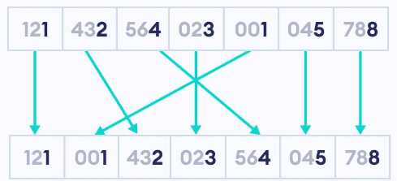
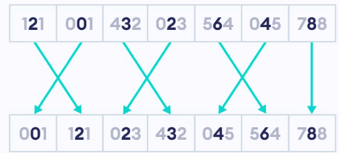
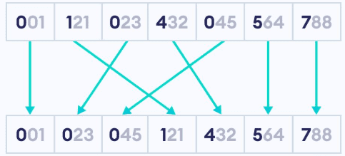

# 基数排序

## 基数排序简介

基数排序(Radix Sort)是一种非比较型的排序算法，与桶排序的思想相似，对数据进行分桶和合并。

基数排序将数据按位进行分桶，然后将桶中的数据合并。每次分桶只关注其中一位数据，其他位的数据不管，最大的数据有多少位，就进行多少次分桶和合并。基数排序除了用于对整数进行排序，也可以用于对浮点数、字符串进行排序。

基数排序可以分为最高位优先法和最低位优先法，两种方法的结果相同。

-   最高位优先(Most Significant Digit first)法，简称MSD法。先按最高位进行分桶，合并，一直到最低位，依次进行分桶和合并，便得到一个有序序列。
-   最低位优先(Least Significant Digit first)法，简称LSD法。先按最低位进行分桶，合并，一直到最高位，依次进行分桶和合并，便得到一个有序序列。

## 基数排序原理

基数排序的原理如下：

1.   求出待排序列表中的最大值，并求出最大值的位(个十百千...)数，有多少位就需要进行多少轮分桶和合并。
2.   开辟内存空间，创建用于分配数据的桶。整数排序时，每一位的范围都在0~9之间，所以需要创建10个桶。
3.   从数据的个位开始(从最高位开始也可以，结果一样)，按个位数对数据进行分桶，不考虑其它位的数据大小。
4.   待排序列表中的所有数据都分桶完成后，将所有桶中的数据进行合并，合并时按先进先出的原则取出桶中的数据。
5.   重复步骤3,4，继续按其他位对前面处理过的数据进行分桶和合并。一直到对每一位数据都进行分桶和合并完成，最终得到一个有序序列，列表排序完成。

以列表 [121, 432, 564, 23, 45, 788, 1] 进行升序排列为例。

1、要对数字逐位排序，首先需要知道一个数字有多少位。因此，第一步是找到最大的数字，然后计算该数字的位数。

我们先判断最大数字是788。是三位数。我们需要按个位数，十位数，百位数字分别大小进行排序。

2、按个位数大小排序。看个位，摒弃十位，百位：1,1,2,3,4,5,8



3、按十位数字排序。因个位以排序，十位排序后会形成按十位，个位排序。

我们摒弃百位：01,21,23,32,45,64,88。



4、按百位数字排序。使用基数排序完成对数字列表的升序排序。



## Python实现基数排序

1、找出最大数字。

找出列表中最大的数字，这决定需要按多少位数排序。

```python
max_element = max(lst)
```

2、求最大数 (L) 的位数。

```python
L = len(str(max_element))
```

3、对个位数字进行计数排序。

```python
place = 1
counting_sort(lst, place)
```

4、修改后计数排序。计数排序是基数排序中最常用的子排序算法。它适用于整数排序，并且在处理每一位时非常高效。(理解该部分是难点，重点。）

```python
def counting_sort(lst, place):
    size = len(lst)
    output = [0] * size
    count = [0] * 10
    for i in range(0, size):
        index = lst[i] // place
        count[index % 10] += 1
    for i in range(1, 10):
        count[i] += count[i - 1]
    i = size - 1
    while i >= 0:
        index = lst[i] // place
        output[count[index % 10] - 1] = lst[i]
        count[index % 10] -= 1
        i -= 1
    for i in range(0, size):
        lst[i] = output[i]
```

5、完整的基数排序程序

```python
def radix_sort(lst):
    # 获取最大元素
    max_element = max(lst)
    L = len(str(max_element))
    # 调用4所显示的计数程序。
    place = 1
    for i in range(L):
        counting_sort(lst, place)
        place *= 10
```

## 基数排序的时间复杂度和稳定性

- **稳定性**：稳定
- **时间复杂度**：最佳：$O(n×k)$ 最差：$O(n×k)$ 平均：$O(n×k)$
- **空间复杂度**：$O(n+k)$

1、时间复杂度

在基数排序中，需要走访待排序列表中的每一个元素进行分桶，列表长度为 n , 然后将每个桶中的数据取出进行合并，一共有 k 个桶，所以进行一轮基数排序的时间复杂度为T(n)=n+k，再乘分桶和合并的步骤数(常数，不影响大O记法)，得出进行一轮基数排序的时间复杂度为 O(n+k) 。当待排序列表中的最大值有 d 位时，需要进行 d 轮基数排序，时间复杂度为 O(d*(n+k)) 。

2、稳定性

在基数排序中，需要将待排序列表中的数据进行分桶和合并。在分桶时，如果有相等的数据，它们一定会被分到同一个桶中，是按先后顺序进入桶中的，在合并桶时，按先进先出的原则，先进桶的数据先出桶，相等数据的相对次序不会发生变化。所以基数排序是一种稳定的排序算法。
