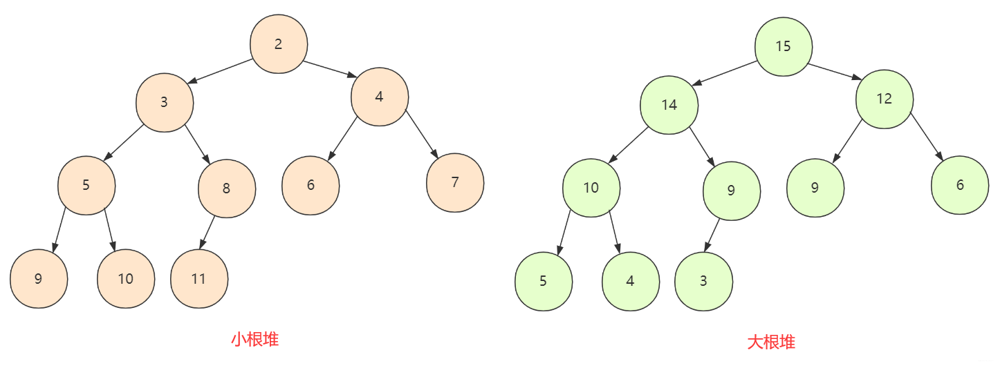
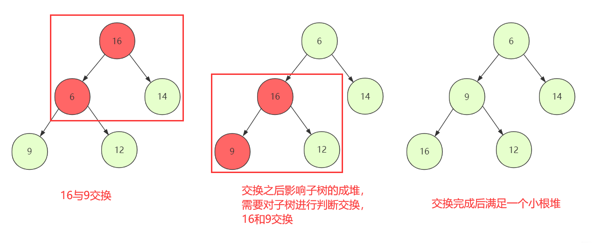
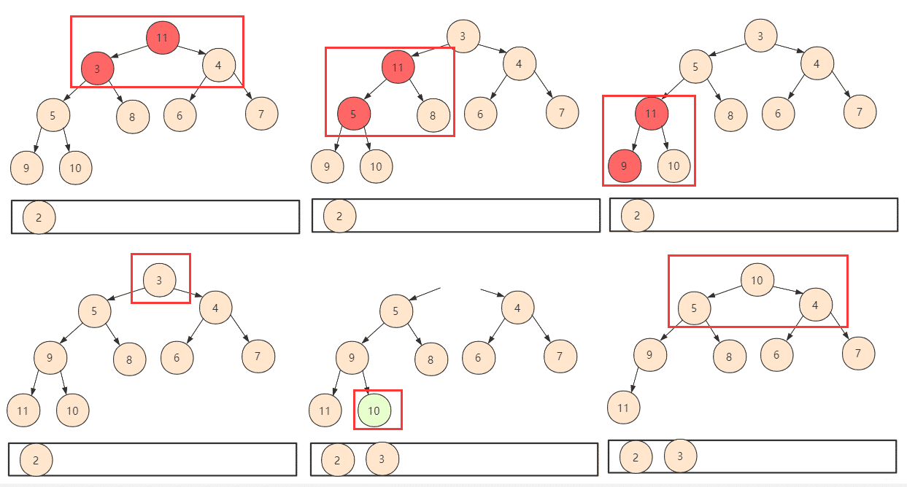

# 堆排序

堆排序是一种树形选择排序方法，它的特点是：在排序的过程中，将array[0，...，n-1]看成是一颗完全二叉树的顺序存储结构，利用完全二叉树中双亲节点和孩子结点之间的内在关系，在当前无序区中选择关键字最大（最小）的元素。

## 创建二叉树

若array[0，...，n-1]表示一颗完全二叉树的顺序存储模式，则双亲节点指针和孩子结点指针之间的内在关系如下：

任意一节点指针 i：

-   父节点：`i==0 ? null : (i-1)/2`
-   左孩子：`2*i + 1`
-   右孩子：`2*i + 2`

## 大根堆和小根堆的定义

- 如果所有节点**大于**孩子节点值，那么这个堆叫做**大根堆**，堆的最大值在根节点。
- 如果所有节点**小于**孩子节点值，那么这个堆叫做**小根堆**，堆的最小值在根节点。



对于n个数组序列array[0，...，n-1]，当且仅当满足下列要求：`(0 <= i <= (n-1)/2)`

-   `array[i] <= array[2*i + 1] `且 `array[i] <= array[2*i + 2]`；称为小根堆；
-   `array[i] >= array[2*i + 1] `且 `array[i] >= array[2*i + 2]`；称为大根堆；

## 大根堆

堆排序首先就是**建堆**，然后再是调整。

### 建立大根堆

n个节点的完全二叉树array[0，...，n-1]，最后一个节点n-1的父节点是第(n-1-1)/2个节点，对第(n-1-1)/2个节点为根的子树调整，使该子树称为堆。

对于大根堆，调整方法为：若【根节点的关键字】小于【左右子女中关键字较大者】，则交换。（需要注意的是二叉树最后一个根节点可能没有右孩子）

之后向前依次对各节点`((n-2)/2 - 1) ~ 0`为根的子树进行调整，看该节点值是否大于其左右子节点的值，若不是，将左右子节点中较大值与之交换，交换后可能会破坏下一级堆，于是继续采用上述方法构建下一级的堆，直到以该节点为根的子树构成堆为止。

反复利用上述调整堆的方法建堆，直到根节点。

创建大根堆：

```java
//创建大根堆
public static int[] buildMaxHeap(int[] arr) {
    //从最后一个父节点开始
    for (int i = arr.length / 2 - 1; i >= 0; i--) {
        adjustDownToTop(arr, i, arr.length);
    }
    return arr;
}

public static void adjustDownToTop(int[] arr, int k, int length) {
    //提取该父节点的值存入temp中
    int temp = arr[k];
    //初始化k节点的左孩子节点为i
    for (int i = 2 * k + 1; i <= length - 1; i = 2 * i + 1) {
        //选取值最大的子节点的下标(注意该节点可能没有右子节点，所以判断条件为i+1<length.不能等于)
        if (i + 1 < length && arr[i] < arr[i + 1]) {
            //如果右节点值大于左节点
            i++;
        }
        //如果比父节点打，和父节点交换位置
        if (arr[i] <= temp) {
            break;
        } else {
            arr[k] = arr[i];
            k = i;//用于最后的赋值
        }
    }
    arr[k] = temp;
}
```

### 堆排序：（大根堆）

1.  将存放在array[0，...，n-1]中的n个元素建成初始堆；
2.  将堆顶元素与堆底元素进行交换，则序列的最大值即已放到正确的位置；
3.  但此时堆被破坏，将堆顶元素向下调整使其继续保持大根堆的性质，再重复第②③步，直到堆中仅剩下一个元素为止。

我们下来来利用大根堆进行排序。

然后进行堆排序：

思想：创建大根堆之后，第一个元素是最大的，那么我们将其和堆的最后一个元素交换，然后重新调整堆结构。这次调整堆结构的length为length-1，每次提取出一个元素都重新调整堆结构，长度-1。

```java
//堆排序
public static void heapSort(int[] arr) {
    arr = buildMaxHeap(arr); //堆创建,第一个元素是最大的
    for (int i = arr.length - 1; i > 0; i--) {
        int temp = arr[0]; //将堆顶元素和堆底元素进行交换
        arr[0] = arr[i];
        arr[i] = temp;
        adjustDownToTop(arr, 0, i);
    }
    System.out.println(Arrays.toString(arr));
}
```

## 小根堆

建堆是一个O(n)的时间复杂度过程，建堆完成后就需要进行删除头排序。

对于二叉树(数组表示)，我们从下往上进行调整，从**第一个非叶子节点**开始向前调整，对于调整的规则如下：

1.  从第一个非叶子节点开始判断交换下移(shiftDown)，使得当前节点和子孩子能够保持堆的性质

2.  但是普通节点替换可能没问题，对如果交换打破子孩子堆结构性质，那么就要重新下移(shiftDown)被交换的节点一直到停止。



堆构造完成，取第一个堆顶元素为最小(最大)，剩下左右孩子依然满足堆的性值，但是缺个堆顶元素，如果给孩子调上来，可能会调动太多并且可能破坏堆结构。

①所以索性把最后一个元素放到第一位。这样只需要判断交换下移(shiftDown），不过需要注意此时整个堆的大小已经发生了变化，我们在逻辑上不会使用被抛弃的位置，所以在设计函数的时候需要附带一个堆大小的参数。

②重复以上操作，一直堆中所有元素都被取得停止。



而堆算法复杂度的分析上，之前建堆时间复杂度是O(n)。而每次删除堆顶然后需要向下交换，每个个数最坏为logn个。这样复杂度就为O(nlogn)，总的时间复杂度为O(n)+O(nlogn)=O(nlogn)。

实现代码为：

```java
static void swap(int[] arr, int m, int n) {
    int team = arr[m];
    arr[m] = arr[n];
    arr[n] = team;
}

//下移交换 把当前节点有效变换成一个堆(小根)
static void shiftDown(int[] arr, int index, int len)//0 号位置不用
{
    int leftChild = index * 2 + 1;//左孩子
    int rightChild = index * 2 + 2;//右孩子
    if (leftChild >= len)
        return;
    else if (rightChild < len && arr[rightChild] < arr[index] && arr[rightChild] < arr[leftChild])//右孩子在范围内并且应该交换
    {
        swap(arr, index, rightChild);//交换节点值
        shiftDown(arr, rightChild, len);//可能会对孩子节点的堆有影响，向下重构
    } else if (arr[leftChild] < arr[index])//交换左孩子
    {
        swap(arr, index, leftChild);
        shiftDown(arr, leftChild, len);
    }
}

//将数组创建成堆
static void creatHeap(int[] arr) {
    for (int i = arr.length / 2; i >= 0; i--) {
        shiftDown(arr, i, arr.length);
    }
}

static void heapSort(int[] arr) {
    System.out.println("原始数组为         ：" + Arrays.toString(arr));
    int[] val = new int[arr.length]; //临时储存结果
    //step1建堆
    creatHeap(arr);
    System.out.println("建堆后的序列为  ：" + Arrays.toString(arr));
    //step2 进行n次取值建堆，每次取堆顶元素放到val数组中，最终结果即为一个递增排序的序列
    for (int i = 0; i < arr.length; i++) {
        val[i] = arr[0];//将堆顶放入结果中
        arr[0] = arr[arr.length - 1 - i];//删除堆顶元素，将末尾元素放到堆顶
        shiftDown(arr, 0, arr.length - i);//将这个堆调整为合法的小根堆，注意(逻辑上的)长度有变化
    }
    // 数值克隆复制
    System.arraycopy(val, 0, arr, 0, arr.length);
    System.out.println("堆排序后的序列为:" + Arrays.toString(arr));
}
```

## 复杂度分析

堆排序算法的性能分析：

-   空间复杂度：O(1)；
-   时间复杂度：建堆：O(n)，每次调整O(logn)，故最好、最坏、平均情况下：O(nlogn);
-   稳定性：不稳定
