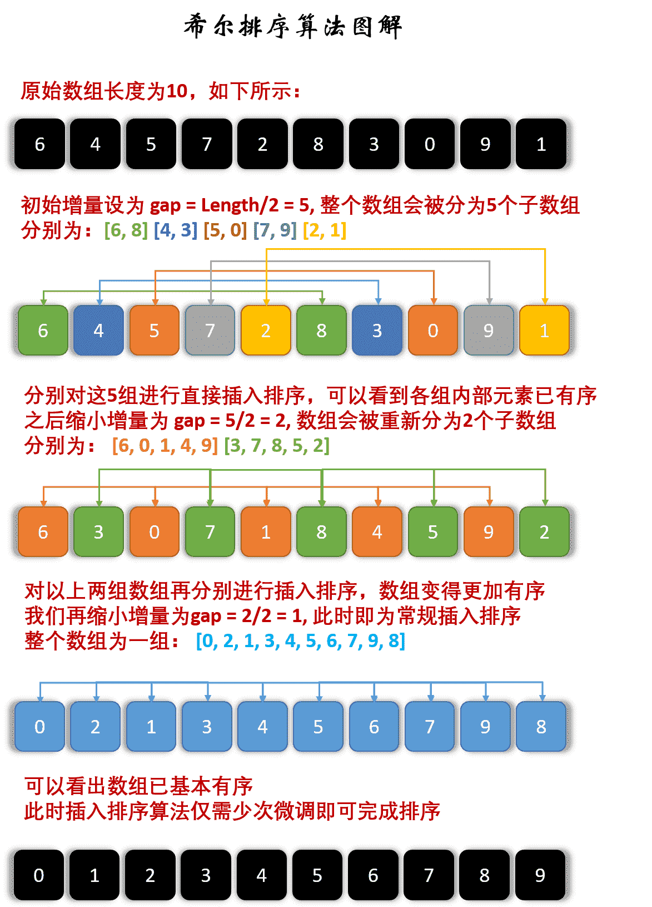

# 希尔排序

直接插入排序因为是$O(n^2)$，在数据量很大或者数据移动位次太多会导致效率太低。很多排序都会想办法拆分序列，然后组合，希尔排序就是以一种特殊的方式进行预处理，考虑到了**数据量和有序性**两个方面纬度来设计算法。使得序列前后之间小的尽量在前面，大的尽量在后面，进行若干次的分组别计算，最后一组即是一趟完整的直接插入排序。

对于一个`长串`，希尔首先将序列分割(非线性分割)而是**按照某个数模**`取余`(这个类似报数1、2、3、4、1、2、3、4)这样形式上，在一组的分割先**各组分别进行直接插入排序**，这样**很小的数在后面**可以通过**较少的次数移动到相对靠前**的位置。然后慢慢合并变长，再稍稍移动。

因为每次这样插入都会使得序列变得更加有序，稍微有序序列执行直接插入排序成本并不高。所以这样能够在合并到最终的时候基本小的在前，大的在后，代价越来越小。这样希尔排序相比插入排序还是能节省不少时间的。

## 算法步骤

我们来看下希尔排序的基本步骤，在此我们选择增量 $gap=length/2$，缩小增量继续以 $gap = gap/2$ 的方式，这种增量选择我们可以用一个序列来表示，$\lbrace \frac{n}{2}, \frac{(n/2)}{2}, \dots, 1 \rbrace$，称为**增量序列**。希尔排序的增量序列的选择与证明是个数学难题，我们选择的这个增量序列是比较常用的，也是希尔建议的增量，称为希尔增量，但其实这个增量序列不是最优的。此处我们做示例使用希尔增量。

先将整个待排序的记录序列分割成为若干子序列分别进行直接插入排序，具体算法描述：

- 选择一个增量序列 $\lbrace t_1, t_2, \dots, t_k \rbrace$，其中 $t_i \gt t_j, i \lt j, t_k = 1$；
- 按增量序列个数 k，对序列进行 k 趟排序；
- 每趟排序，根据对应的增量 $t$，将待排序列分割成若干长度为 $m$ 的子序列，分别对各子表进行直接插入排序。仅增量因子为 1 时，整个序列作为一个表来处理，表长度即为整个序列的长度。

## 图解算法



## 代码实现

```java
public void shellsort(int[] a) {
    int d = a.length;
    int team = 0;//临时变量
    for (; d >= 1; d /= 2)//共分成d组
        for (int i = d; i < a.length; i++)//到那个元素就看这个元素在的那个组即可
        {
            team = a[i];
            for (int j = i - d; j >= 0; j -= d) {
                if (a[j] > team) {
                    a[j + d] = a[j];
                    a[j] = team;
                } else {
                    break;
                }
            }
        }
}
```

## 算法分析

- **稳定性**：不稳定
- **时间复杂度**：最佳：$O(nlogn)$，最差：$O(n^2)$ 平均：$O(nlogn)$
- **空间复杂度**：$O(1)$
