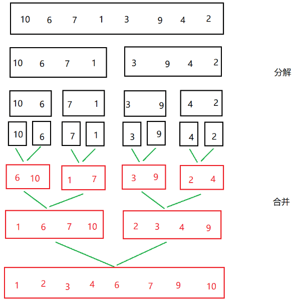

# 归并排序

归并排序是一种排序算法，它通过将待排序的数组或列表递归分割成较小的子数组，然后将这些子数组合并以生成一个有序的数组。

操作：

-   分割（Divide）：将待排序的数组分成两个大致相等的子数组，这个过程是递归的，直到每个子数组只包含一个元素为止。
-   合并（Merge）：逐个合并两个有序的子数组），以生成一个新的有序数组。在合并过程中，通过比较两个子数组中的元素，将较小的元素放入新的有序数组，并继续这个过程，直到所有元素都合并为止。
-   递归：重复上述分割和合并过程，直到整个数组都被排序为止。

归并排序就是先将问题分解成代价较小的子问题，子问题再采取代价较小的合并方式完成一个排序。



>   所谓归并，就是将两组有序的数据合成为一组有序的数据。若将两个有序表合并成一个有序表，称为二路归并。
>

## 归并实现

>   归并排序的实现方式有`递归形式`和`非递归形式`。

递归形式的实现：

```c
private static void mergesort(int[] array, int left, int right) {
    int mid = (left + right) / 2;
    if (left < right) {
        mergesort(array, left, mid);
        mergesort(array, mid + 1, right);
        merge(array, left, mid, right);
    }
}

private static void merge(int[] array, int l, int mid, int r) {
    int lindex = l;
    int rindex = mid + 1;
    int team[] = new int[r - l + 1];
    int teamindex = 0;
    while (lindex <= mid && rindex <= r) {//先左右比较合并
        if (array[lindex] <= array[rindex]) {
            team[teamindex++] = array[lindex++];
        } else {
            team[teamindex++] = array[rindex++];
        }
    }
    while (lindex <= mid)//当一个越界后剩余按序列添加即可
    {
        team[teamindex++] = array[lindex++];

    }
    while (rindex <= r) {
        team[teamindex++] = array[rindex++];
    }
    if (teamindex >= 0) System.arraycopy(team, 0, array, l, teamindex);
}
```

## 复杂度分析

归并排序的时间复杂度为O(N * log2N)，因为向下递归的复杂度为O(log2N)，然后遍历一遍数组的复杂度为O(N)，所以总的时间复杂度为O(N * log2N)。

归并排序的空间复杂度为O(N)，因为需要创建一个tmp辅助数组用来存归并后的序列。

- **稳定性**：稳定
- **时间复杂度**：最佳：$O(nlogn)$，最差：$O(nlogn)$，平均：$O(nlogn)$
- **空间复杂度**：$O(n)$
