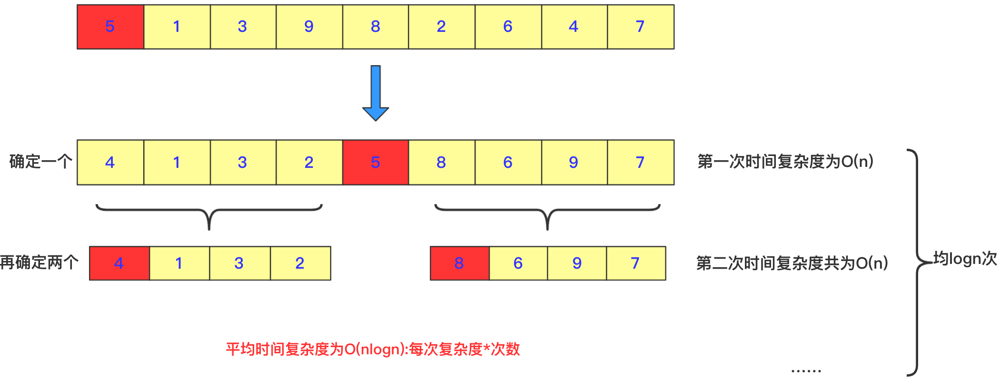

# 快速排序

快速排序是对冒泡排序的一种改进，采用递归分治的方法进行求解。

>   乍看起来快速排序和归并排序非常相似，都是将问题变小，先排序子串，最后合并。不同的是快速排序在划分子问题的时候经过多一步处理，将划分的两组数据划分为一大一小，这样在最后合并的时候就不必像归并排序那样再进行比较。但也正因为如此，划分的不定性使得快速排序的时间复杂度并不稳定。

对于快排来说，**基本思想**是这样的

- 快排需要将序列变成两个部分，就是**序列左边全部小于一个数**，**序列右面全部大于一个数**，然后利用递归的思想再将左序列当成一个完整的序列再进行排序，同样把序列的右侧也当成一个完整的序列进行排序。
- 这个数在这个序列中是可以随机取的，可以取最左边，可以取最右边，当然也可以取随机数。但是**通常**不优化情况我们取最左边的那个数。



实现代码为：

```java
public void quicksort(int[] a, int left, int right) {
    int low = left;
    int high = right;
    //下面两句的顺序一定不能混，否则会产生数组越界
    if (low > high) //作为判断是否截止条件
        return;
    int k = a[low]; //额外空间k，取最左侧的一个作为衡量，最后要求左侧都比它小，右侧都比它大。
    while (low < high)//这一轮要求把左侧小于a[low],右侧大于a[low]。
    {
        while (low < high && a[high] >= k)//右侧找到第一个小于k的停止
        {
            high--;
        }
        //这样就找到第一个比它小的了
        a[low] = a[high];//放到low位置
        while (low < high && a[low] <= k)//在low往右找到第一个大于k的，放到右侧a[high]位置
        {
            low++;
        }
        a[high] = a[low];
    }
    a[low] = k;//赋值然后左右递归分治求之
    quicksort(a, left, low - 1);
    quicksort(a, low + 1, right);
}
```

## 算法分析

- **稳定性**：不稳定
- **时间复杂度**：最佳：$O(nlogn)$，最差：$O(n^2)$，平均：$O(nlogn)$
- **空间复杂度**：$O(logn)$

由于可能在数组已经有序或基本有序的情况下，最差的时间复杂度。为了避免最坏情况发生，可以通过随机选择基准元素或者使用三数取中法等策略来提高快速排序的性能；或者可以先使用洗牌算法shuffle，将数据打乱。

推荐阅读：[使用 Java 实现快速排序（详解）](https://segmentfault.com/a/1190000040022056)
