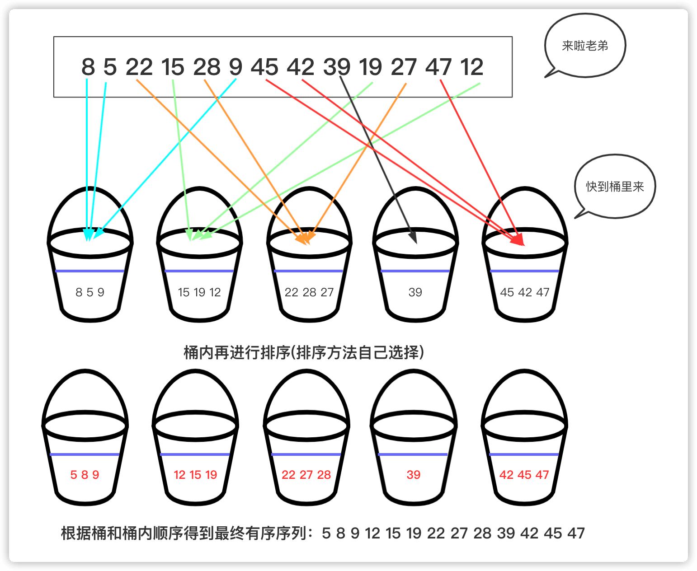

# 桶排序

桶排序（Bucket Sort）是一种排序算法，其工作原理是将数组分到有限数量的桶子中，每个桶子再个别进行排序。这个算法是鸽巢排序的一种归纳结果，当要被排序的数组内的数值是均匀分配的时候，桶排序可以使用线性时间（O(n)）进行排序。

桶排序是一种用空间换取时间的排序，桶排序重要的是它的思想，而不是具体实现，时间复杂度最好可能是线性O(n)，桶排序不是基于比较的排序而是一种分配式的。

桶排序从字面的意思上看：

- 桶：若干个桶，说明此类排序将数据放入若干个桶中。
- 桶：每个桶有容量，桶是有一定容积的容器，所以每个桶中可能有多个元素。
- 桶：从整体来看，整个排序更希望桶能够更匀称，即既不溢出(太多)又不太少。

桶排序的思想为：将待排序的序列分到若干个桶中，每个桶内的元素再进行个别排序。当然桶排序选择的方案跟具体的数据有关系，桶排序是一个比较广泛的概念，并且计数排序是一种特殊的桶排序，基数排序也是建立在桶排序的基础上。在数据分布均匀且每个桶元素趋近一个时间复杂度能达到O(n)，但是如果数据范围较大且相对集中就不太适合使用桶排序。

## 图解展示过程

桶排序的步骤通常包括：

1.  确定桶的数量和区间范围：根据待排序数据的大小范围和数量，确定需要多少个桶，并且确定每个桶所能存放的数据的大小范围。
2.  将数据分配到对应的桶中：遍历待排序数据，根据数值与桶范围的对应关系，将数据分配到对应的桶中。
3.  对每个桶进行排序：使用快排、归并等排序算法，对每个桶中的数据进行排序。
4.  合并各个桶中的数据：将各个桶中的数据按照顺序依次取出，即为排序后的结果。



桶排序的优点是简单且易于实现，但是它并不是比较排序，因此不受O(nlogn)下限的影响。然而，桶排序并不适用于所有情况，特别是当数据分布不均匀时，可能会导致某些桶中数据量过大或过小，影响排序效率。此外，桶排序的空间复杂度相对较高，因为需要额外的空间来存储桶。

实现一个简单桶排序：

```java
int[] a = {1, 8, 7, 44, 42, 46, 38, 34, 33, 17, 15, 16, 27, 28, 24};
List[] buckets = new ArrayList[5];
for (int i = 0; i < buckets.length; i++)//初始化
{
    buckets[i] = new ArrayList<Integer>();
}
//将待排序序列放入对应桶中
for (int k : a) {
    int index = k / 10;//对应的桶号
    buckets[index].add(k);
}
//每个桶内进行排序(使用系统自带快排)
for (List bucket : buckets) {
    bucket.sort(null);
    for (int j = 0; j < bucket.size(); j++)//顺便打印输出
    {
        System.out.print(bucket.get(j) + " ");
    }
}
```

## 复杂度

桶排序（Bucket Sort）是一种非比较型整数排序算法，其时间复杂度取决于输入数据的分布情况和桶的数量等因素。如果数据分布均匀，桶排序可以达到线性时间复杂度O(n)。但如果数据分布不均匀，可能会导致实际运行时间接近O(nlogn)。

- **稳定性**：稳定
- **时间复杂度**：最佳：$O(n+k)$ 最差：$O(n^2)$ 平均：$O(n+k)$
- **空间复杂度**：$O(n+k)$

以下是桶排序在不同情况下的时间复杂度分析：

### A.时间复杂度：

最好情况：当输入数据均匀且随机分布在各个桶中，并且每个桶内的元素数量较少时，桶内排序的时间复杂度可以较小（例如使用插入排序，对于近乎有序的数据，插入排序接近线性）。假设共有n个待排序元素，m个桶，平均每个桶里有$k=\frac{n}{m}$个元素，如果桶内排序能以$O(k)$或更优（如计数排序等线性时间复杂度排序）完成，则整个桶排序的时间复杂度近似为$O(n+mO(k))$ 。当m接近于n，即每个桶里的元素非常少时，桶排序的整体时间复杂度可以达到理想的线性级别，即$O(n)$。

平均情况：桶排序的平均时间复杂度同样依赖于数据分布的均匀性和桶内排序的效率。理想情况下，若每个桶的大小相近且内部排序时间复杂度为$O(klog_{2}k)$，则桶排序的平均时间复杂度大约是$O(n+n*(log_{2}n-log_{2}m))$ 或简化为$O(n+C)$，其中$O(n*(log_{2}n-log_{2}m))$表示桶内排序所需的时间。

最坏情况：当所有元素都集中在同一个桶中，或者桶内排序算法退化到$O(nlog_{2}n)$的情况时，桶排序的时间复杂度退化为桶内排序的时间复杂度，即$O(nlog_{2}n)$。

### B.空间复杂度：

桶排序的空间复杂度主要由存储桶以及桶内元素所需的额外空间决定。假设每个桶最多存储个元素，并且有个桶，则空间复杂度为$O(m+nk)$。在实际应用中，通常假设远小于，所以空间复杂度近似为$O(m+n)$。

## 优缺点

优点：

-   线性时间复杂度（理想情况）：当输入数据均匀分布且桶的个数足够多时，每个桶内的元素数量较少，可以使用简单排序算法对桶内元素进行排序。在这种情况下，桶排序可以达到线性的平均时间复杂度 O(n + k log k)，其中 n 是待排序数组的大小，k 是桶的数量。当桶的数量接近于待排序数据的数量时，k log k项趋于常数，整个排序的时间复杂度接近 O(n)。
-   稳定性：桶排序在处理过程中不会改变相等元素之间的相对顺序，因此它是稳定的排序算法。
-   并行化潜力：桶排序中的各个桶可以独立地进行排序操作，这意味着它具有良好的并行计算能力。在多核或者分布式环境下，可以同时对多个桶进行排序以提高整体性能。
-   适用特定场景：对于值域范围已知并且数据比较集中、分布规律可预测的问题，如年龄、成绩或一定范围内的整数，桶排序能高效工作。

缺点：

-   空间消耗大：桶排序需要额外的空间来存储桶以及桶内元素。如果待排序的数据量非常大，为了保持较好的效率可能需要创建大量桶，这会显著增加空间复杂度，通常为O(n + m)，m是所需桶的数量。
-   依赖于数据分布：桶排序的效果很大程度上取决于输入数据的分布情况。如果数据分布不均匀，某些桶可能会包含过多的元素，导致桶内排序的时间复杂度变高，从而影响整体排序效率。
-   不适合大规模无界范围数据：对于值域范围不确定或很大的数据集，确定合适的桶数量和策略变得困难，并且可能导致大量的小桶或少数的大桶，无法有效利用算法的优势。
-   非通用性：桶排序适用于整数排序或其他易于划分到桶的情况，对于浮点数或者其他无法直接划分成固定桶的数据类型，需要进行预处理，增加了实现的复杂度。
-   桶内排序成本：每个桶内部还需要使用其他排序算法进行排序，如果桶内元素过多，则这部分排序的成本也会影响总体性能。

## 现实中的应用

-   整数或有限范围的数值排序：当数据集中元素是整数且值域相对较小或者有已知上限时，例如对大量年龄、学生成绩、邮政编码等整数值进行排序。由于这些数据可以均匀地分配到各个“桶”中，再对每个桶内的数据采用插入排序、计数排序等简单算法进行排序，因此效率较高。
-   大数据预处理阶段：在大规模数据分析之前，桶排序可以作为一种初步的局部排序手段。通过将大量数据分割成多个桶并分别处理，能够减少后续全局排序的成本，特别是在分布式计算环境中，桶排序便于实现并行化操作。
-   数据统计与分析：桶排序可以用于快速统计数据的分布情况和频率，例如在数据库查询优化、性能监控等领域中，需要快速统计某一时间段内不同数量级的事件次数时，可以使用桶排序来高效完成。
-   流式数据处理：在实时数据流处理系统中，桶排序可以用于实时聚合数据，比如实时计算某个时间段内用户访问量分段统计结果。
-   图像处理：在某些图像处理算法中，如直方图均衡化，会用到类似于桶排序的思想，把像素值按照一定的区间分布归入不同的桶，然后重新映射为新的连续灰度值。
-   机器学习与数据挖掘：在部分机器学习模型训练前的特征工程阶段，可能需要对特征数据进行离散化或标准化处理，此时桶排序可以作为构建哈希表或者B树等数据结构的基础步骤，用于特征索引或快速查找。
-   高性能科学计算：在数值模拟和科学计算领域，有时需要对大量的数值型数据进行排序以便于进一步分析，如果数据分布具有某种规律性，桶排序能有效地减少排序所需时间。
-   去重和计数问题：桶排序可以通过创建一个足够多的桶数组来解决海量数据的去重任务，将相同值放入同一个桶中，从而快速获取不重复元素的数量和分布情况。
