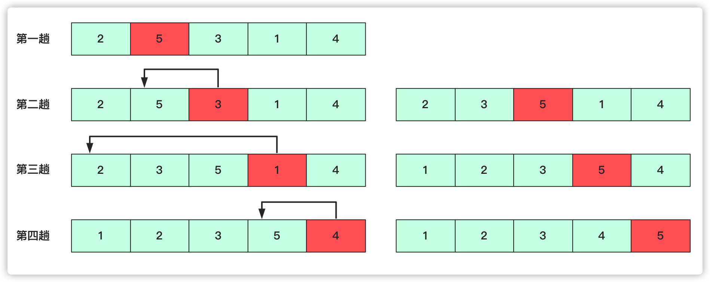

# 直接插入排序

直接插入排序在所有排序算法中的是最简单排序方式之一。和我们上学时候从前往后、按高矮顺序排序，那么一堆高低无序的人群中，从第一个开始，如果前面有比自己高的，就直接插入到合适的位置。**一直到队伍的最后一个完成插入**整个队列才能满足有序。

## 算法步骤

插入排序的具体步骤：

- 选取当前位置(当前位置前面已经有序) 目标就是将当前位置数据插入到前面合适位置。
- 向前枚举或者二分查找，找到待插入的位置。
- 移动数组，赋值交换，达到插入效果。



实现代码为：

```java
public void insertsort(int[] a) {
    int team = 0;
    for (int i = 1; i < a.length; i++) {
        System.out.println(Arrays.toString(a));
        team = a[i];
        for (int j = i - 1; j >= 0; j--) {
            if (a[j] > team) {
                a[j + 1] = a[j];
                a[j] = team;
            } else {
                break;
            }
        }
    }
}
```

## 算法分析

直接插入排序遍历比较时间复杂度是每次O(n)，交换的时间复杂度每次也是O(n)，那么n次总共的时间复杂度就是$O(n^2)$。

>   插入排序和冒泡排序一样，也有一种优化算法，叫做拆半插入。

有人会问折半(二分)插入能否优化成O(nlogn)，答案是不能的。因为二分只能减少查找复杂度每次为O(logn)，而插入的时间复杂度每次为O(n)级别，这样总的时间复杂度级别还是$O(n^2)$。

- **稳定性**：稳定
- **时间复杂度**：最佳：$O(n)$，最差：$O(n^2)$，平均：$O($n^2$)$
- **空间复杂度**：$O(1)$
- **排序方式**：In-place
