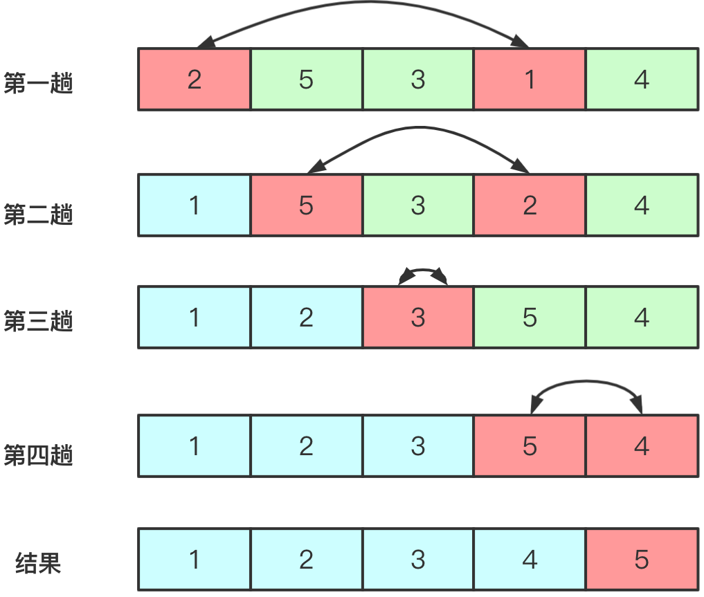

# 简单选择排序

简单选择排序（Selection sort）是一种简单直观的排序算法。它的工作原理：首先在未排序序列中找到最小（大）元素，存放到排序序列的起始位置，然后，再从剩余未排序元素中继续寻找最小（大）元素，然后放到**已排序序列的末尾**。以此类推，直到所有元素均排序完毕。



实现代码为：

```java
public void selectSort(int[] arr) {
    for (int i = 0; i < arr.length - 1; i++) {
        int min = i; // 最小位置
        for (int j = i + 1; j < arr.length; j++) {
            if (arr[j] < arr[min]) {
                min = j; // 更换最小位置
            }
        }
        if (min != i) {
            swap(arr, i, min); // 与第i个位置进行交换
        }
    }
}

private void swap(int[] arr, int i, int j) {
    int temp = arr[i];
    arr[i] = arr[j];
    arr[j] = temp;
}
```

## 算法分析

选择排序是一种简单直观的排序算法，无论什么数据进去都是 $O(n^2)$ 的时间复杂度。所以用到它的时候，数据规模越小越好。唯一的好处可能就是不占用额外的内存空间了吧。

- **稳定性**：不稳定
- **时间复杂度**：最佳：$O(n^2)$，最差：$O(n^2)$，平均：$O(n^2)$
- **空间复杂度**：$O(1)$
- **排序方式**：In-place
