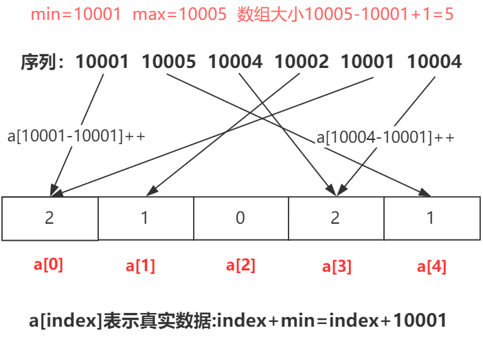

# 计数排序

计数排序是一种特殊的桶排序，每个桶的大小为1，每个桶不在用List表示，而通常用一个值用来计数。

在**设计具体算法的时候**，先找到最小值min，再找最大值max。然后创建这个区间大小的数组，从min的位置开始计数，这样就可以最大程度的压缩空间，提高空间的使用效率。



```java
public static void countSort(int[] a) {
    int min = Integer.MAX_VALUE;
    int max = Integer.MIN_VALUE;
    //找到max和min
    for (int j : a) {
        if (j < min)
            min = j;
        if (j > max)
            max = j;
    }
    int[] count = new int[max - min + 1];//对元素进行计数
    for (int j : a) {
        count[j - min]++;
    }
    //排序取值
    int index = 0;
    for (int i = 0; i < count.length; i++) {
        while (count[i]-- > 0) {
            a[index++] = i + min;//有min才是真正值
        }
    }
}
```

## 算法分析

当输入的元素是n个0到k之间的整数时，它的运行时间是 O(n + k)。计数排序不是比较排序，排序的速度快于任何比较排序算法。

由于用来计数的数组的长度取决于待排序数组中数据的范围（等于待排序数组的最大值与最小值的差加上1），这使得计数排序对于数据范围很大的数组，需要大量时间和内存。

-   最佳情况：T(n) = O(n+k)
-   最差情况：T(n) = O(n+k)
-   平均情况：T(n) = O(n+k)
