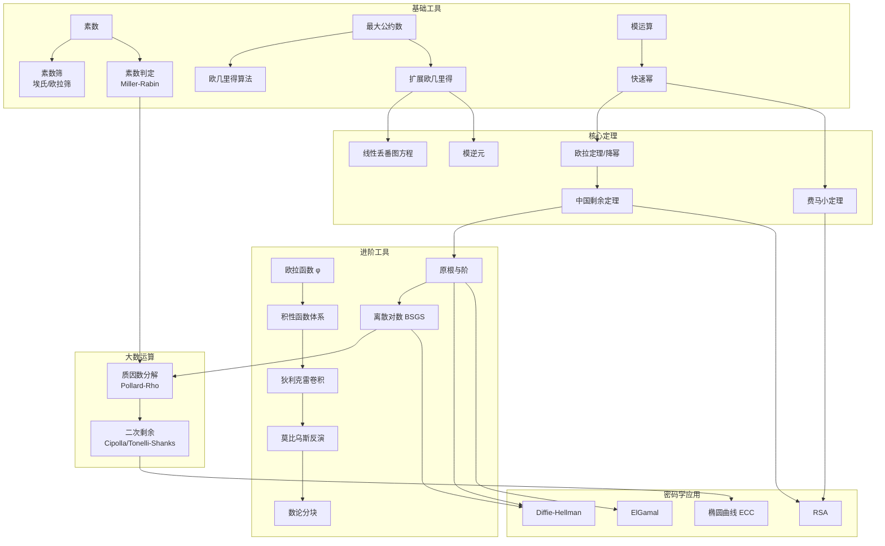

# 数论索引

本目录包含数论相关算法的详细讲解，每个文件包含原理说明、实现代码、Mermaid 可视化图表。

## 算法关系总图



## 学习路径

### 路径一：基础入门（数论常识）

```
素数筛 → GCD/扩展欧几里得 → 快速幂 → 欧拉函数
```

### 路径二：进阶必备（算法竞赛）

```
路径一 → 中国剩余定理 → 莫比乌斯反演 → 原根 → 二次剩余
```

### 路径三：密码学方向（安全/加密）

```
路径一 → 费马小定理 → Miller-Rabin → Pollard-Rho → 离散对数 → 原根
```

## 符号说明

| 符号 | 含义 |
|------|------|
| gcd(a,b) | 最大公约数 |
| lcm(a,b) | 最小公倍数 |
| φ(n) | 欧拉函数 |
| μ(n) | 莫比乌斯函数 |
| τ(n) | 约数个数 |
| σ(n) | 约数和 |
| ord_m(a) | a 的阶 |
| (a/p) | Legendre 符号 |
| a ≡ b (mod m) | a 与 b 模 m 同余 |
| ⌊x⌋ | 向下取整 |
| [P] | Iverson 括号（P 真为 1） |
