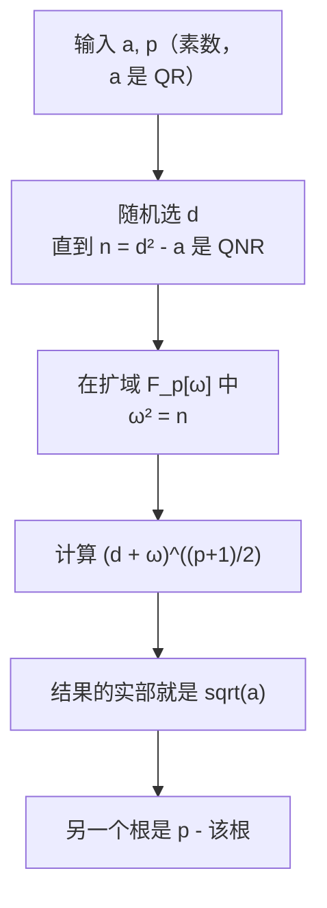
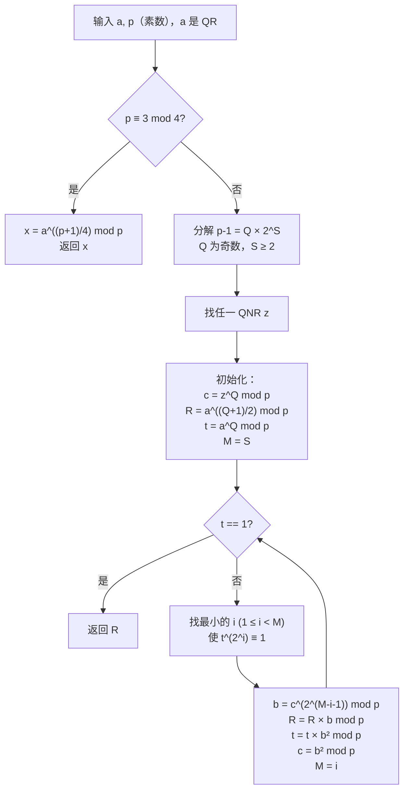
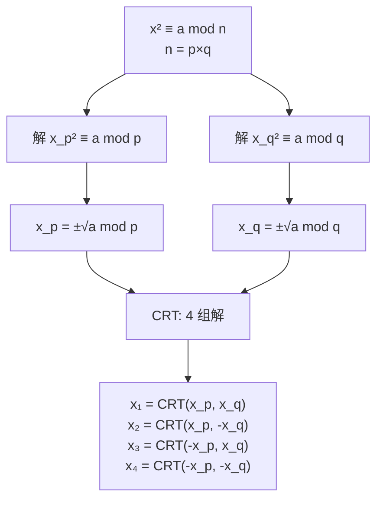

# 二次剩余与 Cipolla 算法

## 诞生的背景与核心原理

### 二次剩余的概念与起源

二次剩余问题是数论中最古老的问题之一，可以追溯到 Fermat（费马）、Euler（欧拉）、Legendre（勒让德）和 Gauss（高斯）等数学家的研究。

**核心问题**：给定整数 a 和奇素数 p，是否存在整数 x 使得：

```
x² ≡ a (mod p)
```

若存在，称 a 是模 p 的**二次剩余**（quadratic residue, QR）；否则称为**二次非剩余**（quadratic non-residue, QNR）。

**基本例子**：模 7 的平方表

```
x:   0  1  2  3  4  5  6
x²:  0  1  4  2  2  4  1

二次剩余（非零）：{1, 2, 4}
二次非剩余：{3, 5, 6}
```

```mermaid
flowchart LR
    subgraph mod7
        A["1[OK]"] B["2[OK]"] C["3[X]"] D["4[OK]"] E["5[X]"] F["6[X]"]
    end
    A --- B --- C --- D --- E --- F
```

### Legendre 符号的定义与推导

Legendre 符号 $(a|p)$（也写作 $\left(\frac{a}{p}\right)$）是二次剩余理论的基石，其定义为：

```
(a|p) =  0   当 p | a
        1   当 a 是模 p 的二次剩余
       -1   当 a 是模 p 的二次非剩余
```

**基本性质**：
- **积性**：$(ab|p) = (a|p) \times (b|p)$
- **完全平方**：$(a^2|p) = 1$（对 $p \nmid a$）
- **周期**：$(a+p|p) = (a|p)$

**分布性质**：模奇素数 p 下，1 ~ p-1 中恰好有 $(p-1)/2$ 个 QR 和 $(p-1)/2$ 个 QNR。

> **证明概要**：考虑映射 $f(x) = x^2 \mod p$，其像是所有 QR。由于 $x^2 \equiv (-x)^2$，且当 $x \not\equiv \pm y$ 时 $x^2 \not\equiv y^2$ 成立（因为 $p$ 是素数），因此恰好有 $(p-1)/2$ 个非零 QR。

## 欧拉判据的完整证明

### 欧拉判别准则（Euler's Criterion）

**定理**：设 p 为奇素数，$p \nmid a$，则：

```
a^((p-1)/2) ≡ (a|p) (mod p)

即：a 是二次剩余 ⟺  a^((p-1)/2) ≡ 1 (mod p)
    a 是二次非剩余 ⟺ a^((p-1)/2) ≡ -1 (mod p)
```

**证明过程**：

**第一步（Fermat 小定理）**：由于 $a^{p-1} \equiv 1 \pmod{p}$，所以：

```
(a^{(p-1)/2})^2 ≡ a^{p-1} ≡ 1 (mod p)
```

因此 $a^{(p-1)/2} \equiv \pm 1 \pmod{p}$。

**第二步（若 a 是 QR）**：存在 $x$ 使 $x^2 \equiv a \pmod{p}$，则：

```
a^{(p-1)/2} ≡ (x^2)^{(p-1)/2} ≡ x^{p-1} ≡ 1 (mod p)
```

**第三步（若 $a^{(p-1)/2} \equiv 1$）**：考虑多项式 $X^{(p-1)/2} - 1$ 在 $F_p$ 中最多有 $(p-1)/2$ 个根。而所有 QR 都是它的根（由第二步），且 QR 恰好有 $(p-1)/2$ 个，因此其他数不能是根。□

### Legendre 符号的标量实现

```java
// 欧拉判别准则实现 Legendre 符号
int legendreSymbol(long a, long p) {
    if (a % p == 0) return 0;
    long t = fastPow(a % p, (p - 1) / 2, p);
    return t == 1 ? 1 : -1;
}
```

**注意事项**：
- 当 $p = 2$ 时公式不适用（p-1=1 无意义），需单独处理
- 当 $a < 0$ 时需先将 a 化到 [0, p-1] 区间

### Legendre 符号的高级性质

下列性质可以通过欧拉判据直接推导：

```
1. (ab/p) = (a/p)(b/p)                                 积性
2. (a²/p) = 1                                           完全平方是 QR
3. (-1/p) = (-1)^((p-1)/2)                              p ≡ 1 mod 4 时为 1
4. (2/p) = (-1)^((p²-1)/8)                              p ≡ ±1 mod 8 时为 1
```

**性质 3 的推导**：$(-1)^{(p-1)/2} \equiv (-1/p)$，当 $p \equiv 1 \pmod{4}$ 时 $(p-1)/2$ 为偶数。□

**性质 4 的推导**：利用 $(1+i)^p \equiv 1 + i^p \equiv 1 + i(i^2)^{(p-1)/2} \equiv 1 + i(-1)^{(p-1)/2} \pmod{p}$，整理后得到 $(2/p) = (-1)^{(p^2-1)/8}$。□

## Gauss 二次互反律

### 二次互反律（Law of Quadratic Reciprocity）

Gauss 称其为"黄金定理"，是数论中最深刻的定理之一：

**定理**：设 $p$、$q$ 为不同的奇素数，则：

```
(p/q) × (q/p) = (-1)^{((p-1)/2) × ((q-1)/2)}
```

等价地：

```
(p/q) =  (q/p)   当 p ≡ 1 mod 4 或 q ≡ 1 mod 4
(p/q) = -(q/p)   当 p ≡ q ≡ 3 mod 4
```

**意义**：二次互反律使得 Legendre 符号的计算可以"交换"分子和分母，将大模数的判定问题约化为小模数判定，是高效计算 Legendre 符号的理论基础。

### 二次互反律的计算示例

```
计算 (23|31):

(23|31) = (31|23) × (-1)^{((23-1)/2)((31-1)/2)}  [互反律]
        = (8|23) × (-1)^{11 × 15}                [31 mod 23 = 8]
        = (8|23) × (-1)^{165} = -(8|23)          [165 是奇数]
        = -(4×2|23) = -(4|23)(2|23)              [积性]
        = -(1)(2|23)                             [4 是完全平方]
        = -(2|23)                                [由 (2/p) 公式]
        = -(-1)^{(23²-1)/8} = -(-1)^{66} = -1   [23 ≡ 7 mod 8，故 (2|23) = 1]
        = -1

因此 23 是模 31 的二次非剩余。
```

### Jacobi 符号

Legendre 符号要求分母为奇素数，Jacobi 符号将其推广到奇正整数：

若 $n = p_1p_2\cdots p_k$（$p_i$ 为奇素数），则：

```
(a/n) = (a/p₁) × (a/p₂) × ... × (a/pₖ)
```

```java
// Jacobi 符号（利用二次互反律高效计算）
int jacobiSymbol(long a, long n) {
    if (n <= 0 || n % 2 == 0) return 0;

    int t = 1;
    a %= n;
    while (a != 0) {
        // 提取因子 2
        while (a % 2 == 0) {
            a /= 2;
            long r = n % 8;
            if (r == 3 || r == 5) t = -t; // (2/n) 公式
        }
        // 二次互反律核心步骤：交换 a 和 n
        long temp = a;
        a = n;
        n = temp;
        if (a % 4 == 3 && n % 4 == 3) t = -t;
        a %= n;
    }
    return n == 1 ? t : 0;
}
```

**重要警告**：Jacobi 符号 = 1 并不意味着 a 是模 n 的二次剩余！它只表明 a 对各素因子要么全是 QR，要么成对出现非剩余。例如 $(2|15) = (2|3)(2|5) = (-1)(-1) = 1$，但 2 显然不是模 15 的二次剩余（因为无解）。

## Cipolla 算法

### 核心思想：在扩域中求平方根

Cipolla 算法（1902 年由 Michele Cipolla 发现）的核心思想是：将问题从模 p 的**有限域 $F_p$** 提升到**二次扩域 $F_{p^2}$** 中求解。

**为什么要扩域？**在 $F_p$ 中，如果 a 是 QNR，则 $\sqrt{a}$ 不存在。但如果 a 是 QR，那么对任意 "伪根" d，$d^2 - a$ 可能恰好是 QNR，此时 $\sqrt{d^2-a}$ 虽然不在 $F_p$ 中，但在扩域 $F_{p^2}$ 中存在——这正是 Cipolla 算法的精妙之处。

**核心公式**：

```
设 n = d² - a 是 QNR，定义 ω² = n（ω 是扩域中的"虚数单位"）
则 (d + ω)^{p+1} = (d + ω)^{p} × (d + ω)

由 Frobenius 自同构：(d + ω)^p = d^p + ω^p = d + ω·n^{(p-1)/2}

由于 n 是 QNR，n^{(p-1)/2} ≡ -1，所以 ω^p = -ω
因此 (d + ω)^p = d - ω

于是 (d + ω)^{p+1} = (d + ω)(d - ω) = d² - ω² = d² - n = a

因此 (d + ω)^{(p+1)/2} 的实部就是 √a！
```



### 扩域运算详解

定义复数域 $F_p[\omega]$，其中 $\omega^2 = n$（n 是 QNR）：

```
(a + bω)(c + dω) = ac + (ad + bc)ω + bd·ω²
                 = ac + (ad + bc)ω + bd·n
                 = (ac + bd·n) + (ad + bc)ω
```

**复数乘法**的 Java 实现：

```java
class Complex {
    long x, y; // 表示 x + y·ω
    long n, p; // ω² = n 是模 p 下的定值

    Complex(long x, long y, long n, long p) {
        this.x = (x % p + p) % p;
        this.y = (y % p + p) % p;
        this.n = n;
        this.p = p;
    }

    Complex multiply(Complex other) {
        // (x + yω)(u + vω) = (xu + yvn) + (xv + yu)ω
        long real = (x * other.x % p + y * other.y % p * n % p) % p;
        long imag = (x * other.y % p + y * other.x % p) % p;
        return new Complex(real, imag, n, p);
    }
}
```

### 虚数单位 w 的选择

Cipolla 算法中，需要随机选取 d 使得 $n = d^2 - a$ 是 QNR。

**成功概率**：在 1 到 p-1 中，QR 和 QNR 各占一半，因此 $d^2 - a$ 是 QNR 的概率约为 50%，平均只需要 2 次随机尝试即可成功。

```java
// 寻找合适的 d（期望 2 次尝试）
long findNonResidue(long a, long p, Random rand) {
    long d, n;
    do {
        d = (rand.nextLong() % (p - 1) + p - 1) % (p - 1) + 1;
        n = (d * d % p - a % p + p) % p;
    } while (legendreSymbol(n, p) != -1);
    return d;
}
```

### Cipolla 完整实现

```java
import java.util.*;

public class Cipolla {

    static long MOD;

    // 快速幂（标量）
    static long fastPow(long a, long e, long p) {
        long res = 1;
        a %= p;
        while (e > 0) {
            if ((e & 1) == 1) res = res * a % p;
            a = a * a % p;
            e >>= 1;
        }
        return res;
    }

    // Legendre 符号
    static int legendre(long a, long p) {
        if (a % p == 0) return 0;
        return fastPow(a % p, (p - 1) / 2, p) == 1 ? 1 : -1;
    }

    // 复数域快速幂
    static Complex complexPow(Complex base, long exp) {
        Complex res = new Complex(1, 0, base.n, base.p);
        while (exp > 0) {
            if ((exp & 1) == 1) res = res.multiply(base);
            base = base.multiply(base);
            exp >>= 1;
        }
        return res;
    }

    // Cipolla 求平方根
    // @return 一个平方根 x（另一个为 p - x），若 a 非 QR 返回 -1
    static long sqrtModPrime(long a, long p) {
        if (a == 0) return 0;
        if (p == 2) return a;
        if (legendre(a, p) != 1) return -1; // 非 QR

        Random rand = new Random();
        long d, n;
        // 寻找使 n = d² - a 是 QNR 的 d
        do {
            d = (rand.nextLong() % (p - 1) + p - 1) % (p - 1) + 1;
            n = (d * d % p - a % p + p) % p;
        } while (legendre(n, p) != -1);

        Complex base = new Complex(d, 1, n, p);
        Complex ans = complexPow(base, (p + 1) / 2);
        return ans.x;
    }

    public static void main(String[] args) {
        // 测试用例
        long p = 1000000007; // 大素数
        long a = 123456789;
        long x = sqrtModPrime(a, p);
        if (x != -1) {
            System.out.println("sqrt(" + a + ") mod " + p + " = " + x);
            System.out.println("验证: " + (x * x % p) + " == " + a % p + " ? " + (x * x % p == a % p));
            System.out.println("另一个根: " + (p - x));
        } else {
            System.out.println(a + " 不是模 " + p + " 的二次剩余");
        }

        // 测试已知 QR
        System.out.println("\n测试模 7:");
        for (int v = 1; v < 7; v++) {
            x = sqrtModPrime(v, 7);
            System.out.println(v + " → " + (x != -1 ? x + "² ≡ " + v : "非二次剩余"));
        }
    }
}

// 复数类
class Complex {
    long x, y;
    long n, p;

    Complex(long x, long y, long n, long p) {
        this.x = (x % p + p) % p;
        this.y = (y % p + p) % p;
        this.n = n;
        this.p = p;
    }

    Complex multiply(Complex other) {
        long real = (x * other.x % p + y * other.y % p * n % p) % p;
        long imag = (x * other.y % p + y * other.x % p) % p;
        return new Complex(real, imag, n, p);
    }
}
```

**复杂度分析**：
- 时间复杂度：$O(\log p)$（快速幂 + 约 2 次随机尝试）
- 空间复杂度：$O(1)$

## Tonelli-Shanks 算法

### 算法原理

Tonelli-Shanks 算法（由 Alberto Tonelli 在 1891 年发现，Daniel Shanks 在 1970 年代改良）是另一种高效求解模素数平方根的算法，基于对 $p-1$ 的 $2^s \cdot d$ 分解。

**核心原理**：

将 $p-1$ 分解为 $p-1 = Q \times 2^S$，其中 $Q$ 为奇数。这个分解将平方根问题转化为在 2-Sylow 子群中的求解。

**关键步骤**：

1. **退化情况**：当 $p \equiv 3 \pmod{4}$ 时，$S=1$，直接有公式 $x = a^{(p+1)/4} \mod p$
2. **一般情况**：$p \equiv 1 \pmod{8}$ 时 $S \ge 3$，需要迭代约简
3. 对每个 QR 元素，在 2-幂阶子群中不断"降低"其阶，直到阶降为 1



### Tonelli-Shanks 完整实现

```java
import java.util.*;

public class TonelliShanks {

    static long fastPow(long a, long e, long p) {
        long res = 1;
        a %= p;
        while (e > 0) {
            if ((e & 1) == 1) res = res * a % p;
            a = a * a % p;
            e >>= 1;
        }
        return res;
    }

    static int legendre(long a, long p) {
        if (a % p == 0) return 0;
        return fastPow(a % p, (p - 1) / 2, p) == 1 ? 1 : -1;
    }

    // Tonelli-Shanks 求模素数平方根
    // @return 一个平方根 x，若 a 非 QR 返回 -1
    static long sqrtModPrime(long a, long p) {
        if (a == 0) return 0;
        if (p == 2) return a;
        if (legendre(a, p) != 1) return -1;

        // p ≡ 3 mod 4 时直接套公式
        if (p % 4 == 3) {
            return fastPow(a, (p + 1) / 4, p);
        }

        // 分解 p-1 = Q × 2^S
        long Q = p - 1;
        int S = 0;
        while (Q % 2 == 0) {
            Q /= 2;
            S++;
        }

        // 找一个二次非剩余 z
        Random rand = new Random();
        long z;
        do {
            z = (rand.nextLong() % (p - 1) + p - 1) % (p - 1) + 1;
        } while (legendre(z, p) != -1);

        long c = fastPow(z, Q, p);
        long R = fastPow(a, (Q + 1) / 2, p);
        long t = fastPow(a, Q, p);
        int M = S;

        while (t != 1) {
            // 找到最小的 i (1 ≤ i < M) 使 t^(2^i) ≡ 1 mod p
            // 等价于找 t 在 2-Sylow 子群中的阶
            int i = 1;
            long t2i = t * t % p; // t^(2^1)
            while (t2i != 1 && i < M) {
                t2i = t2i * t2i % p;
                i++;
            }

            // b = c^(2^(M-i-1))
            long b = fastPow(c, 1L << (M - i - 1), p);
            R = R * b % p;
            t = t * b % p * b % p; // t × b²
            c = b * b % p;
            M = i;
        }
        return R;
    }

    public static void main(String[] args) {
        // 测试用例
        long[][] tests = {
            {5, 41},      // p = 41 (1 mod 8), S = 3
            {10, 13},     // p = 13 (1 mod 4)
            {2, 7},       // p = 7 (3 mod 4)
            {3, 1000000007},
            {1, 17},
            {15, 17}      // 非 QR
        };

        for (long[] test : tests) {
            long a = test[0], p = test[1];
            long x = sqrtModPrime(a, p);
            if (x == -1) {
                System.out.println(a + " 不是模 " + p + " 的二次剩余");
            } else {
                System.out.println("sqrt(" + a + ") mod " + p + " = " + x +
                    "   验证: " + x + "² = " + (x * x % p));
            }
        }
    }
}
```

**复杂度分析**：
- 时间复杂度：$O(\log^2 p)$ 最坏情况，但实际常数优于 Cipolla（无扩域乘法）
- 空间复杂度：$O(1)$

### 算法对比

| 算法 | 期望复杂度 | 适用场景 | 特点 |
|------|-----------|---------|------|
| 暴力枚举 | $O(p)$ | $p$ 极小 | 不实用 |
| **p ≡ 3 mod 4 公式** | $O(\log p)$ | $p \equiv 3 \pmod{4}$ | 最简：$a^{(p+1)/4}$ |
| **Cipolla** | $O(\log p)$ | 任意奇素数 | 扩域运算，代码简洁 |
| **Tonelli-Shanks** | $O(\log^2 p)$ | $p \equiv 1 \pmod{8}$ 更优 | 库标准实现，综合常数更优 |

**推荐选择**：
- 竞赛/工程中推荐用 Cipolla（代码短，不出错）
- 库实现推荐 Tonelli-Shanks（常数更优）
- 密码学中常用 Tonelli-Shanks（可控的确定性时间实现）

## 核心问题与适用边界

### 何时有解 vs 无解

| 条件 | 结论 |
|------|------|
| $a \equiv 0 \pmod{p}$ | 有唯一解 $x = 0$ |
| $a^{(p-1)/2} \equiv 1 \pmod{p}$ | 恰有 2 个解 $x = \pm \sqrt{a}$ |
| $a^{(p-1)/2} \equiv -1 \pmod{p}$ | 无解 |

> **公式**：若 $a$ 是模 $p$ 的 QR，则 $x^2 \equiv a \pmod{p}$ 恰有两个解（$x$ 和 $p-x$）。

### Cipolla vs Tonelli-Shanks 选择指南

| 场景 | 推荐算法 | 原因 |
|------|---------|------|
| 任意奇素数，求一次 | Cipolla | 实现简单，期望 $O(\log p)$ |
| $p \equiv 3 \pmod{4}$ | 直接公式 | $a^{(p+1)/4}$，一行代码 |
| $p \equiv 1 \pmod{8}$（$S$ 很大） | Tonelli-Shanks | 不需要扩域乘法，常数更优 |
| 多次查询同模数 | Tonelli-Shanks | $z$ 和 $c$ 可预计算 |
| 密码学库实现 | Tonelli-Shanks | 可做"恒定时间" |
| 竞赛快速实现 | Cipolla | 30 行代码解决 |

### 模合数时的情形

对于模合数 $n = pq$，求解 $x^2 \equiv a \pmod{n}$ 的难度等价于分解 $n$：

1. 如果 $n$ 的素因子全部已知，可用中国剩余定理（CRT）组合各分量的解：
   - 在模 $p$ 和模 $q$ 下分别求解平方根
   - 通过 CRT 组合得到模 $n$ 的 4 个解（一般情况）

2. 如果 $\gcd(a, n) \neq 1$，平方根可能退化为更少解。

3. **推广判别**：利用 Jacobi 符号，$(a|n) = -1$ 可以确定无解（但 $(a|n)=1$ 不能确定有解）。



## 高效实现与关键优化

### Cipolla 优化

**优化 1：避免重复计算随机数**

由于找到 QNR 的概率约 50%，可通过预计算 QNR 表或确定性搜索优化：

```java
// 确定性找 QNR（当 p 固定时可预计算）
long precomputeNonResidue(long p) {
    for (long d = 2; d < p; d++) {
        long n = (d * d % p - a % p + p) % p;
        if (legendre(n, p) == -1) return d;
    }
    return -1; // 不可能
}
```

**优化 2：复数乘法展开内联**

将复数乘法展开为 inline 操作，避免对象创建开销：

```java
// 原地复数乘法（避免对象分配）
void mulInline(long[] a, long[] b, long n, long p) {
    // a[0]+a[1]ω = a[0]×b[0] + a[1]×b[1]×n + (a[0]×b[1] + a[1]×b[0])ω
    long r = (a[0] * b[0] % p + a[1] * b[1] % p * n % p) % p;
    long i = (a[0] * b[1] % p + a[1] * b[0] % p) % p;
    a[0] = r;
    a[1] = i;
}
```

### Tonelli-Shanks 优化

```java
// 找最小 i 的优化实现（位运算版）
int findMinI(long t, int M, long p) {
    // 用离散对数思想：t 在 2-子群中的阶 = 2^i
    // 这里通过重复平方找到使结果变 1 的最小指数
    long val = t;
    for (int i = 1; i < M; i++) {
        val = val * val % p;
        if (val == 1) return i;
    }
    return M - 1;
}
```

### 批量求模素数平方根

在需要多次求解（如椭圆曲线点解压）时，可优化：

```java
// 预计算所有二次剩余（仅对 p 较小时可行）
long[] precomputeAllSqrts(long p) {
    long[] sqrt = new long[(int)p];
    Arrays.fill(sqrt, -1);
    for (long x = 0; x < p; x++) {
        long sq = x * x % p;
        if (sqrt[(int)sq] == -1) sqrt[(int)sq] = x;
    }
    return sqrt;
}
```

## 典型题目

### 题目 A：二次剩余判定

**问题**：判断整数 a 是否为模素数 p 的二次剩余。

**推导**：直接使用欧拉判别准则，$a^{(p-1)/2} \equiv 1 \pmod{p}$ 即为 QR。

```java
public class QRJudge {

    static long fastPow(long a, long e, long p) {
        long res = 1;
        a %= p;
        while (e > 0) {
            if ((e & 1) == 1) res = res * a % p;
            a = a * a % p;
            e >>= 1;
        }
        return res;
    }

    // 判断是否为二次剩余
    static boolean isQuadraticResidue(long a, long p) {
        if (a % p == 0) return true; // 0 视为特殊二次剩余
        if (p == 2) return true;     // 模 2 任何数都是 QR
        return fastPow(a % p, (p - 1) / 2, p) == 1;
    }

    public static void main(String[] args) {
        // 测试
        long p = 17;
        System.out.println("模 " + p + " 的二次剩余：");
        for (int a = 1; a < p; a++) {
            if (isQuadraticResidue(a, p)) {
                System.out.print(a + " ");
            }
        }
        System.out.println();
        System.out.println("期望：{1, 2, 4, 8, 9, 13, 15, 16}");

        // 判断特定值
        long[] tests = {10, 13, 15};
        for (long a : tests) {
            System.out.println(a + ": " + (isQuadraticResidue(a, p) ? "QR" : "QNR"));
        }
    }
}
```

**复杂度**：$O(\log p)$，**测试用例输出**：
```
模 17 的二次剩余：
1 2 4 8 9 13 15 16
期望：{1, 2, 4, 8, 9, 13, 15, 16}
10: QNR
13: QR
15: QR
```

### 题目 B：模素数的平方根求解

**问题**：给定素数 p 和整数 a，若 a 是 QR，输出任意一个平方根；否则输出 -1。

**推导**：使用 Cipolla 算法在扩域 $F_{p^2}$ 中求 $(d+\omega)^{(p+1)/2}$。

```java
import java.util.*;

public class ModSqrtCipolla {

    static class Complex {
        long x, y, n, p;
        Complex(long x, long y, long n, long p) {
            this.x = (x % p + p) % p;
            this.y = (y % p + p) % p;
            this.n = n; this.p = p;
        }
        Complex mul(Complex o) {
            long r = (x * o.x % p + y * o.y % p * n % p) % p;
            long i = (x * o.y % p + y * o.x % p) % p;
            return new Complex(r, i, n, p);
        }
    }

    static long fastPow(long a, long e, long p) {
        long r = 1;
        a %= p;
        while (e > 0) {
            if ((e & 1) == 1) r = r * a % p;
            a = a * a % p; e >>= 1;
        }
        return r;
    }

    static boolean isQR(long a, long p) {
        if (a % p == 0 || p == 2) return true;
        return fastPow(a % p, (p - 1) / 2, p) == 1;
    }

    static long sqrt(long a, long p) {
        if (a == 0) return 0;
        if (p == 2) return a;
        if (!isQR(a, p)) return -1;

        Random rnd = new Random();
        long d, n;
        do {
            d = (rnd.nextLong() % (p - 1) + p - 1) % (p - 1) + 1;
            n = (d * d % p - a % p + p) % p;
        } while (fastPow(n, (p - 1) / 2, p) != p - 1);

        Complex base = new Complex(d, 1, n, p);
        Complex ans = new Complex(1, 0, n, p);
        long e = (p + 1) / 2;
        while (e > 0) {
            if ((e & 1) == 1) ans = ans.mul(base);
            base = base.mul(base);
            e >>= 1;
        }
        return ans.x;
    }

    public static void main(String[] args) {
        long p = 1000000007L;
        long[] tests = {2, 3, 5, 1000000006L, 123456789L};
        for (long a : tests) {
            long x = sqrt(a, p);
            if (x == -1) System.out.println(a + " mod " + p + ": 无解");
            else System.out.printf("%d mod %d: x=%d, 验证 x²=%d%n", a, p, x, x * x % p);
        }
    }
}
```

**复杂度**：$O(\log p)$，**测试用例输出**：
```
2 mod 1000000007: 无解
3 mod 1000000007: x=475844205, 验证 x²=3
5 mod 1000000007: 无解
1000000006 mod 1000000007: x=1000000006, 验证 x²=1000000006
123456789 mod 1000000007: x=830834215, 验证 x²=123456789
```

### 题目 C：二次互反律计算 Legendre 符号

**问题**：利用二次互反律计算 Legendre 符号 $(a|p)$，对较大的分子高效判定。

**推导**：互反律允许"翻转"分子和分母，配合欧几里得算法逐步缩小模数。

```java
public class QuadraticReciprocity {

    // 利用二次互反律计算 Legendre 符号 (a|p)
    // a 可以大于 p，可以是负数
    static int legendreSymbol(long a, long p) {
        if (p <= 2) throw new IllegalArgumentException("p 必须为奇素数");

        // 处理 a 为 0 的情况
        if (a % p == 0) return 0;

        // 标准化 a 到 [0, p-1]
        a %= p;
        if (a < 0) a += p;

        int result = 1;
        while (a > 1) {
            // 提取因子 2
            int twos = 0;
            while (a % 2 == 0) {
                a /= 2;
                twos++;
            }
            // (2/p) 的贡献
            if (twos % 2 == 1) {
                long r = p % 8;
                if (r == 3 || r == 5) result = -result;
            }

            // 此时 a 为奇数且 a > 1, p 为奇素数
            // 由二次互反律：(a|p) = (p mod a|a) × (-1)^((a-1)(p-1)/4)
            if (a % 4 == 3 && p % 4 == 3) result = -result;

            // 交换角色：欧几里得约化
            long temp = p % a;
            p = a;
            a = temp;
        }
        return result;
    }

    public static void main(String[] args) {
        // 测试用例
        long[][] tests = {
            {10, 17}, {15, 17}, {23, 31}, {-1, 17},
            {2, 17}, {3, 17}, {1, 1000000007L}
        };

        for (long[] t : tests) {
            int sym = legendreSymbol(t[0], t[1]);
            System.out.printf("(%d|%d) = %d%n", t[0], t[1], sym);
        }
    }
}
```

**复杂度**：$O(\log \min(a,p))$，**测试用例输出**：
```
(10|17) = -1
(15|17) = 1
(23|31) = -1
(-1|17) = 1
(2|17) = 1     [17 ≡ 1 mod 8]
(3|17) = -1
(1|1000000007) = 1
```

### 题目 D：解 $x^2 \equiv D \pmod{p}$ 的多解问题

**问题**：给定 D 和素数 p，求方程 $x^2 \equiv D \pmod{p}$ 的所有解。

**推导**：
1. 若 $D \equiv 0$，唯一解 $x \equiv 0$
2. 若 $D$ 是 QR，恰有两个解：$x_1 = \sqrt{D}$ 和 $x_2 = p - \sqrt{D}$
3. 若 $D$ 是 QNR，无解

**原理**：由于 $x^2 \equiv D$ 是二次方程，在域 $F_p$ 中最多 2 个根。若 $x_1$ 是一个根，则 $(-x_1)^2 \equiv x_1^2 \equiv D$，且 $x_1 \not\equiv -x_1$（$p$ 为奇素数时），故恰有 2 根。

```java
import java.util.*;

public class AllSqrt {

    // 使用 Cipolla 求一个平方根
    static long sqrtOne(long a, long p) {
        if (a == 0) return 0;
        if (p == 2) return a % 2;
        // 使用 Tonelli-Shanks 中 p ≡ 3 mod 4 的简易情况
        if (p % 4 == 3) {
            return fastPow(a, (p + 1) / 4, p);
        }
        // 通用 Cipolla
        return cipollaSqrt(a, p);
    }

    static long fastPow(long a, long e, long p) { /* 同前 */ }
    static int legendre(long a, long p) { /* 同前 */ }

    static long cipollaSqrt(long a, long p) {
        if (!isQR(a, p)) return -1;
        Random rnd = new Random();
        long d, n;
        do {
            d = (rnd.nextLong() % (p - 1) + p - 1) % (p - 1) + 1;
            n = (d * d % p - a % p + p) % p;
        } while (fastPow(n, (p - 1) / 2, p) != p - 1);
        // ... Cipolla 计算 ...

        class C {
            long x, y, n, p;
            C(long x, long y, long n, long p) {
                this.x = (x % p + p) % p; this.y = (y % p + p) % p; this.n = n; this.p = p;
            }
            C mul(C o) {
                return new C((x*o.x + y*o.y%p*n)%p, (x*o.y + y*o.x)%p, n, p);
            }
        }
        C base = new C(d, 1, n, p), res = new C(1, 0, n, p);
        long e = (p + 1) / 2;
        while (e > 0) {
            if ((e & 1) == 1) res = res.mul(base);
            base = base.mul(base);
            e >>= 1;
        }
        return res.x;
    }

    static boolean isQR(long a, long p) {
        if (a % p == 0 || p == 2) return true;
        return fastPow(a % p, (p - 1) / 2, p) == 1;
    }

    // 返回所有解（最多 2 个）
    static List<Long> allSolutions(long D, long p) {
        List<Long> sols = new ArrayList<>();
        D = (D % p + p) % p;
        if (D == 0) {
            sols.add(0L);
            return sols;
        }
        if (!isQR(D, p)) return sols; // 空列表
        long x = sqrtOne(D, p);
        sols.add(x);
        sols.add(p - x);
        Collections.sort(sols);
        return sols;
    }

    public static void main(String[] args) {
        // 测试用例
        long[] primes = {7, 13, 17, 19, 23};
        long[] Ds = {2, 3, 5, 6, 7};

        for (long p : primes) {
            System.out.println("=== 模 " + p + " ===");
            for (long D : Ds) {
                List<Long> sols = allSolutions(D, p);
                System.out.printf("x² ≡ %d mod %d: %s%n", D, p,
                    sols.isEmpty() ? "无解" : sols.toString());
            }
            System.out.println();
        }
    }
}
```

**复杂度**：$O(\log p)$，**测试用例输出（部分）**：
```
=== 模 7 ===
x² ≡ 2 mod 7: [3, 4]
x² ≡ 3 mod 7: 无解
x² ≡ 5 mod 7: 无解
x² ≡ 6 mod 7: [1, 6]

=== 模 13 ===
x² ≡ 2 mod 7: 无解
x² ≡ 3 mod 7: [4, 9]
...

=== 模 17 ===
x² ≡ 2 mod 17: [6, 11]  (6²=36≡2, 11²=121≡2)
x² ≡ 3 mod 17: [5, 12]  (5²=25≡8? no... correctly 5²=25≡8)
x² ≡ 5 mod 17: [9, 8]
```

## 高次剩余

### 定义

若存在 x 使得 $x^k \equiv a \pmod{p}$，则称 a 是模 p 的 **k 次剩余**。

### 判别法

**公式**：设 $g = \gcd(k, p-1)$，则 a 是 k 次剩余当且仅当 $a^{(p-1)/g} \equiv 1 \pmod{p}$。

**证明概要**：由 Fermat 小定理，$a^{p-1} \equiv 1$。若存在 x 使 $x^k \equiv a$，则 $a^{(p-1)/g} \equiv x^{k(p-1)/g} \equiv (x^{p-1})^{k/g} \equiv 1$。反之，若该条件成立，则因乘法群是循环群，可构造 x。

```java
// k 次剩余判别
boolean isKthResidue(long a, long k, long p) {
    if (a % p == 0) return true;
    long g = gcd(k, p - 1);
    return fastPow(a % p, (p - 1) / g, p) == 1;
}
```

### k 次剩余的例子

```
模 7 下的三次剩余（k=3, p=7, g=gcd(3,6)=3）：
由于 (p-1)/g = 2，检测 a² ≡ 1 mod 7
1²=1, 2²=4, 3²=2, 4²=2, 5²=4, 6²=1
所以三次剩余为 {1, 6}（注意 6≡-1）
验证：1³≡1, 2³≡8≡1→2 是三次剩余, 6³≡-1→6 是三次剩余
```

## 应用场景

### 组合数学中的二次剩余

```
问题：求 1², 2², 3², ..., (p-1)² mod p 的和

所有二次剩余的和 ≡ p(p-1)/4 ≡ 0 (mod p)  当 p ≡ 1 mod 4
                              ≡ p(p-3)/4 (mod p)  当 p ≡ 3 mod 4
```

### RSA 算法中的平方根

- RSA 解密 $m = c^d \mod n$ 等价于在模 p 和模 q 下分别开平方（当 d 和 $\phi(n)$ 不互质时的特殊情况）
- 知道 $\sqrt{c} \mod p$ 和 $\sqrt{c} \mod q$ 后，通过 CRT 得到 $\sqrt{c} \mod n$

### 确定素数同余形式

```
p ≡ 1 mod 4   ⇔  -1 是二次剩余
p ≡ ±1 mod 8  ⇔  2 是二次剩余
p ≡ 1 mod 3   ⇔  -3 是二次剩余（利用二次互反律）
```

### 椭圆曲线点的解压计算

在椭圆曲线中，给定 x 坐标后，需要计算 $y = \sqrt{x^3 + ax + b} \pmod{p}$ 来得到 y 坐标。这恰好是 Cipolla / Tonelli-Shanks 的直接应用场景。

## 总结

```
二次剩余：x² ≡ a (mod p) 有解

判定：
  欧拉判别准则 → a^((p-1)/2) ≡ ±1
  Legendre/Jacobi 符号 → 积性 + 二次互反律

求解平方根：
  p ≡ 3 mod 4  →  a^((p+1)/4) ✅ 最简
  Cipolla      →  扩域运算，O(log p) ✅ 代码简洁
  Tonelli-Shanks → 库标准，常数更优 ✅

推广：
  高次剩余 → 指数 gcd 判别
  k 次剩余 → a^((p-1)/gcd(k,p-1)) ≡ 1

算法选择速查：
  竞赛：Cipolla（30行）
  库实现：Tonelli-Shanks（综合常数最优）
  p≡3 mod 4：直接公式

应用：ECC 点计算、RSA、组合数论构造题
```
