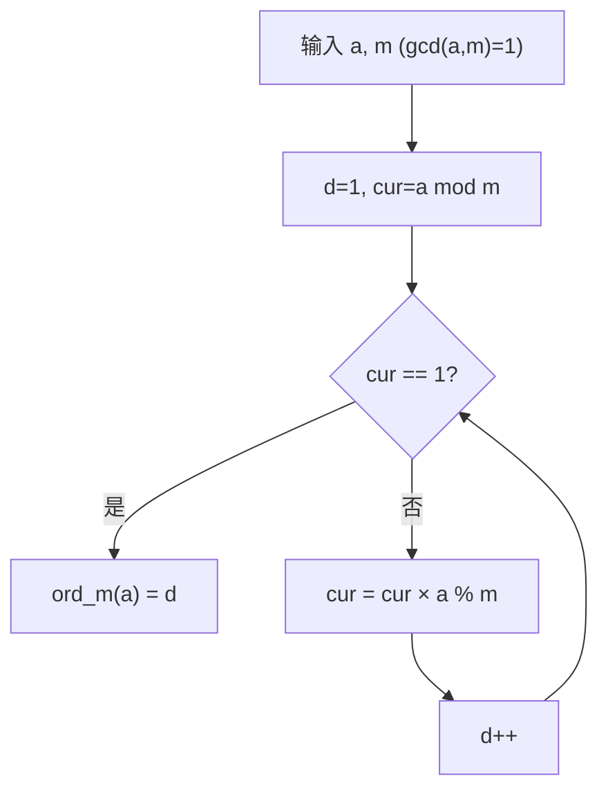
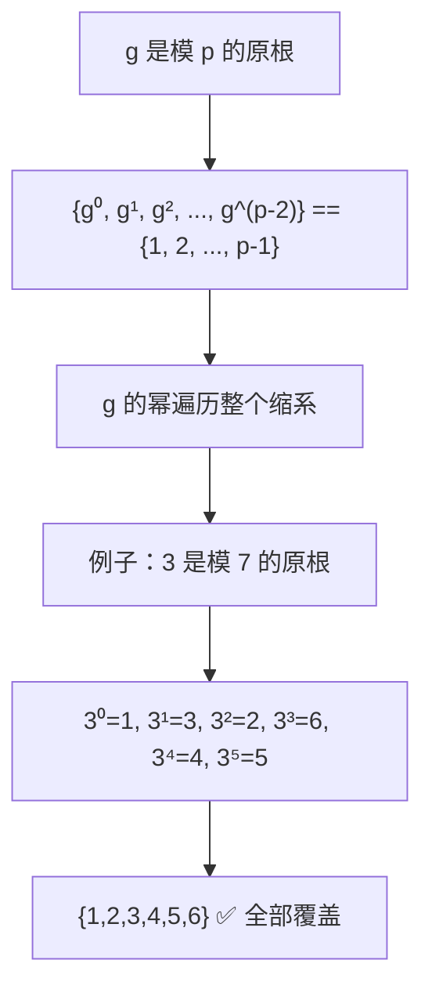
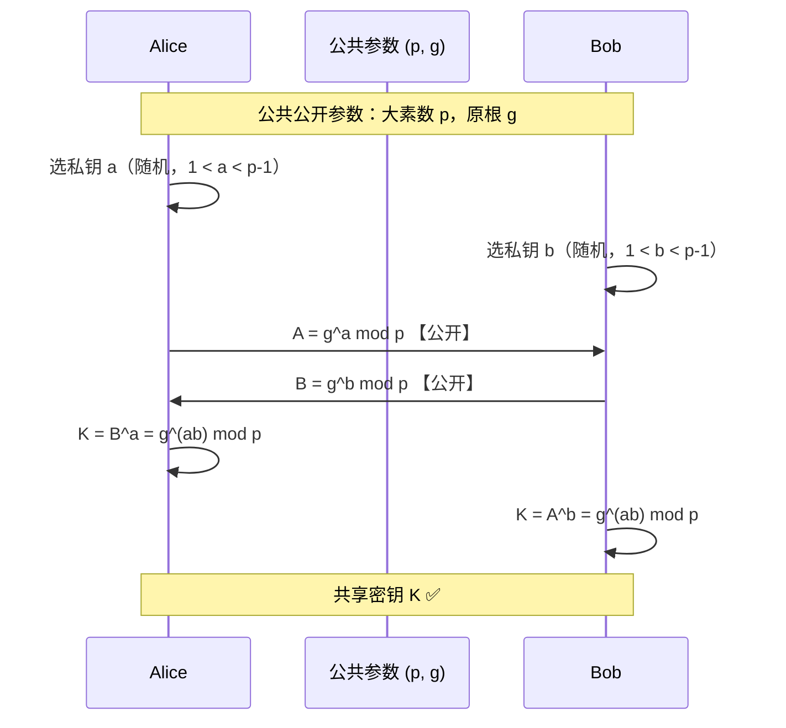
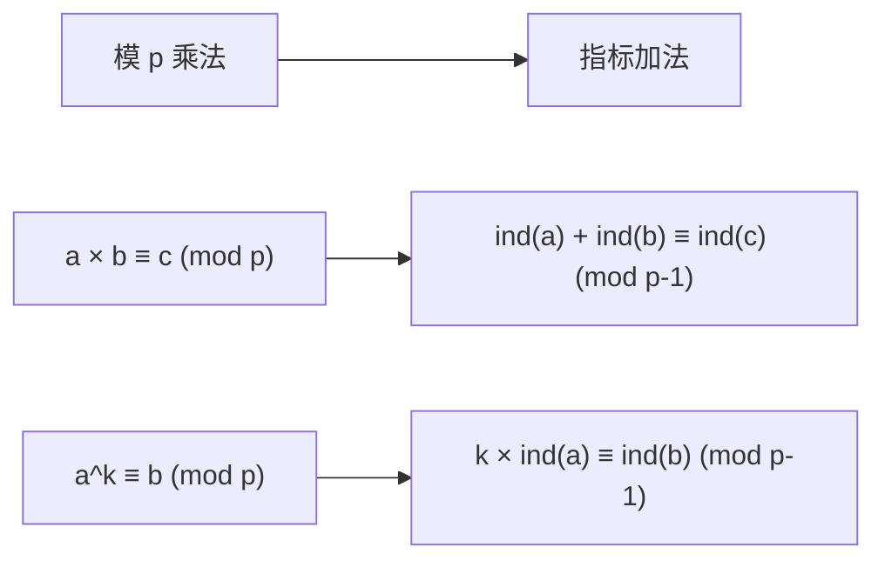
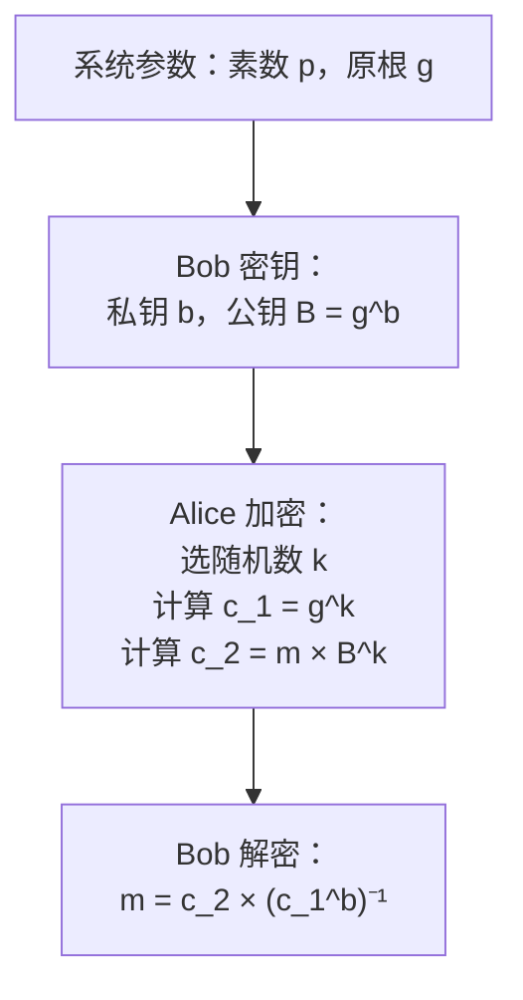
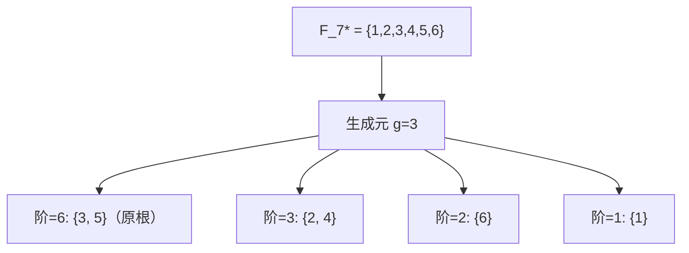

# 原根与阶

## 诞生的背景与核心原理

### 阶（Order）的定义与基本性质

**阶**是数论中最基本的概念之一，描述了一个元素在模运算下需要多少次幂才能回到 1。

**定义**：对于 $\gcd(a, m) = 1$，使 $a^d \equiv 1 \pmod{m}$ 的**最小正整数 d**，称为 a 模 m 的**阶**（multiplicative order），记作 $\operatorname{ord}_m(a)$ 或简写为 $d = \operatorname{ord}_m(a)$。



**基本例子**：模 7 的阶分布

```
a = 1:  1¹ ≡ 1                     → ord₇(1) = 1
a = 2:  2¹≡2, 2²≡4, 2³≡1          → ord₇(2) = 3
a = 3:  3¹≡3, 3²≡2, 3³≡6, 3⁴≡4, 3⁵≡5, 3⁶≡1  → ord₇(3) = 6
a = 4:  4¹≡4, 4²≡2, 4³≡1          → ord₇(4) = 3
a = 5:  5¹≡5, 5²≡4, 5³≡6, 5⁴≡2, 5⁵≡3, 5⁶≡1  → ord₇(5) = 6
a = 6:  6¹≡6, 6²≡1                → ord₇(6) = 2
```

**观察**：所有阶都整除 $\phi(7)=6$，这是阶的最重要性质。

### 阶整除 $\phi(m)$ 的定理证明

**定理**：若 $\gcd(a,m)=1$，则 $\operatorname{ord}_m(a) \mid \phi(m)$。

**证明**：

由 Euler 定理，$a^{\phi(m)} \equiv 1 \pmod{m}$。设 $d = \operatorname{ord}_m(a)$，则 $d \le \phi(m)$。

现在用带余除法：$\phi(m) = qd + r$，其中 $0 \le r < d$。

则 $1 \equiv a^{\phi(m)} \equiv a^{qd+r} \equiv (a^d)^q \cdot a^r \equiv 1^q \cdot a^r \equiv a^r \pmod{m}$。

由于 $d$ 是最小的正整数使 $a^d \equiv 1$，而 $r < d$，所以必须有 $r = 0$。因此 $\phi(m) = qd$，即 $d \mid \phi(m)$。□

**重要推论**：
1. $a^k \equiv 1 \pmod{m} \iff \operatorname{ord}_m(a) \mid k$
2. $\operatorname{ord}_m(a^k) = \operatorname{ord}_m(a) / \gcd(\operatorname{ord}_m(a), k)$（若该值为整数）
3. 不同元素的阶可能相等

```mermaid
flowchart LR
    subgraph mod7的阶分布
        A["a=1: ord=1"] B["a=2: ord=3"] C["a=3: ord=6"]
        D["a=4: ord=3"] E["a=5: ord=6"] F["a=6: ord=2"]
    end
    note["所有 ord 都整除 φ(7)=6"]
```

### 原根的定义

**原根（Primitive Root）**：若 $\operatorname{ord}_m(g) = \phi(m)$，即 g 的阶**达到最大可能值**，则称 g 是模 m 的**原根**。

这意味着 g 的幂能生成所有与 m 互质的数，即 $g$ 是乘法群 $\mathbb{Z}_m^*$ 的**生成元**：

```
{g⁰, g¹, g², ..., g^{φ(m)-1}} = {x | 1 ≤ x < m, gcd(x,m)=1}
```



### 原根的存在性定理

**定理**：模 m 存在原根的充要条件是 $m \in \{2, 4, p^k, 2p^k\}$，其中 p 为奇素数。

```
m = 2:   原根 = {1}
m = 4:   原根 = {3}
m = p^k: 存在原根（k ≥ 1）
m = 2p^k: 存在原根（k ≥ 1）
其他情况（如 m=12, m=15, m=8, m=24）: 无原根
```

> 这个定理由 Gauss 在《算术研究》中完整证明。核心原因是：$\mathbb{Z}_m^*$ 是循环群当且仅当 m 取上述值。

### 原根的判定定理证明

**定理**：g 是模素数 p 的原根 $\iff$ 对所有 $\phi(p) = p-1$ 的素因子 $q$，都有 $g^{(p-1)/q} \not\equiv 1 \pmod{p}$。

**证明**：

($\Rightarrow$) 若 g 是原根，则 $\operatorname{ord}_p(g) = p-1$。对任何 $q \mid (p-1)$，若 $g^{(p-1)/q} \equiv 1$，则阶整除 $(p-1)/q < p-1$，矛盾。所以 $g^{(p-1)/q} \not\equiv 1$。

($\Leftarrow$) 假设对所有 $q \mid (p-1)$ 都有 $g^{(p-1)/q} \not\equiv 1$。设 $d = \operatorname{ord}_p(g)$，则 $d \mid (p-1)$。
若 $d < p-1$，则存在素因子 $q$ 使得 $d \mid (p-1)/q$，从而 $g^{(p-1)/q} \equiv 1$，与假设矛盾。因此 $d = p-1$，g 是原根。□

**注意**：该判定只需验证 $\phi(p)$ 的**素因子**，而不需要验证所有因子，大大减少了待验证的数。

### 原根个数的公式

**定理**：若模 m 存在原根，则原根共有 $\phi(\phi(m))$ 个。

**证明概述**：设 g 是一个原根，则所有原根的形式为 $g^k$，其中 $1 \le k \le \phi(m)$ 且 $\gcd(k, \phi(m)) = 1$。
- $g^k$ 是原根 $\iff$ $\operatorname{ord}_m(g^k) = \phi(m)$
- 由阶的性质，$\operatorname{ord}_m(g^k) = \phi(m) / \gcd(k, \phi(m))$
- 因此 $\operatorname{ord}_m(g^k) = \phi(m) \iff \gcd(k, \phi(m)) = 1$
- 这样的 k 恰好有 $\phi(\phi(m))$ 个 □

```
例子：
模 7: φ(φ(7)) = φ(6) = 2 个原根 → {3, 5}
模 13: φ(φ(13)) = φ(12) = 4 个原根 → {2, 6, 7, 11}
模 23: φ(φ(23)) = φ(22) = 10 个原根
```

## 核心问题与适用边界

### 寻找最小原根的算法

寻找最小原根的基本策略是从 $g=2$ 开始向上枚举，对每个候选 g 使用原根判定定理：

```java
// 找模 p 的最小原根
long findPrimitiveRoot(long p) {
    List<Long> factors = getPrimeFactors(p - 1); // 不重复的素因子集合

    for (long g = 2; g < p; g++) {
        boolean ok = true;
        for (long q : factors) {
            if (fastPow(g, (p - 1) / q, p) == 1) {
                ok = false;
                break;
            }
        }
        if (ok) return g;
    }
    return -1; // 不可能走到这里（p≥2 必有原根）
}
```

**复杂度分析**：
- 素因子分解 $\phi(p) = p-1$：$O(\sqrt{p})$ 试除（或更高效的 Pollard-Rho）
- 对每个候选 g，需要验证所有素因子：每次验证 $O(\log p)$
- 最小原根通常很小（平均期望值约为 $O(\log p)$）

**平均性能**：在随机素数 p 下，最小原根的期望大小约为 $O(\log p)$ 量级，因此枚举通常很快。

### 各模数的原根存在条件表

| 模数 m | 存在原根？ | 说明 | 原根个数 |
|--------|-----------|------|---------|
| 2 | ✅ | 平凡 | $\phi(1)=1$ |
| 4 | ✅ | $3^1\equiv3, 3^2\equiv1$，阶=2=φ(4) | $\phi(2)=1$ |
| 8 | ❌ | $\mathbb{Z}_8^* \cong \mathbb{Z}_2 \times \mathbb{Z}_2$ 不是循环群 | — |
| $p^k$（p 奇素数） | ✅ | 扩域下仍保持循环** | $\phi(p^{k-1}(p-1))$ |
| $2p^k$（p 奇素数） | ✅ | 偶模数的特殊情形 | $\phi(\phi(2p^k))$ |
| $2^k$（k≥3） | ❌ | 对 k≥3，$\mathbb{Z}_{2^k}^* \cong \mathbb{Z}_2 \times \mathbb{Z}_{2^{k-2}}$ | — |
| 合数（非上述） | ❌ | 如 12, 15, 21, 24, 28, 30... | — |

**证明要点**：$\mathbb{Z}_{p^k}^*$ 对奇素数 p 是循环群；$\mathbb{Z}_{2p^k}^* \cong \mathbb{Z}_{p^k}^*$ 且同构于循环群；而 $\mathbb{Z}_{2^k}^*$（k≥3）同构于 $\mathbb{Z}_2 \times \mathbb{Z}_{2^{k-2}}$，不是循环群。

### 原根在 Diffie-Hellman 密钥交换中的作用

Diffie-Hellman 密钥交换（1976）是现代密码学的基础协议。原根在其中扮演**公共参数**的角色。

**协议流程**：



**安全性依赖**：
- **离散对数困难问题**：已知 g 和 $g^a$，难以计算 a
- 使用原根确保 g 的阶足够大（接近 p），防止落入小子群攻击
- 如果 g 不是原根，其阶 d < p-1，攻击者可限制密钥空间到 d 个值，降低安全性

### 拉格朗日定理的推论

在群论中，拉格朗日定理说子群的阶整除群的阶。在模 p 的乘法群 $\mathbb{F}_p^*$（大小为 p-1）中：

**推论**：方程 $x^k \equiv 1 \pmod{p}$ 在 $\mathbb{F}_p^*$ 中最多有 $\gcd(k, p-1)$ 个解。

**证明**：设 $d = \gcd(k, p-1)$。令 $g$ 为原根，则 $x = g^t$，方程化为 $g^{kt} \equiv 1$，即 $p-1 \mid kt$，等价于 $(p-1)/d \mid t$。所以 $t$ 可取 $0, (p-1)/d, 2(p-1)/d, \ldots$，在 $[0, p-2]$ 中恰好有 $d$ 个解。□

**特别地**：$x^2 \equiv 1$ 恰好有 $\gcd(2, p-1) = 2$ 个解（即 $x = \pm 1$），验证了二次剩余的基本事实。

## 高效实现与关键优化

### $\phi(n) = p-1$ 的素因子分解

对于素数 p，$\phi(p) = p-1$。分解 p-1 的素因子是原根检测的前提。

```java
import java.util.*;

public class PrimitiveRootUtils {

    // 试除法分解 n 的不重复素因子
    static List<Long> getPrimeFactors(long n) {
        List<Long> factors = new ArrayList<>();
        if (n % 2 == 0) {
            factors.add(2L);
            while (n % 2 == 0) n /= 2;
        }
        for (long i = 3; i * i <= n; i += 2) {
            if (n % i == 0) {
                factors.add(i);
                while (n % i == 0) n /= i;
            }
        }
        if (n > 1) factors.add(n);
        return factors;
    }
}
```

**注意**：对较大的 n（如 $n > 10^{12}$），试除不再高效，需要使用 **Pollard-Rho** 算法进行大数分解。

### 原根检测的加速

检测的核心是：对所有素因子 $q \mid (p-1)$，验证 $g^{(p-1)/q} \not\equiv 1$。

```java
// 快速幂
static long fastPow(long a, long e, long p) {
    long res = 1;
    a %= p;
    while (e > 0) {
        if ((e & 1) == 1) res = res * a % p;
        a = a * a % p;
        e >>= 1;
    }
    return res;
}

// 判断 g 是否为模 p 的原根
static boolean isPrimitiveRoot(long g, long p, List<Long> primeFactors) {
    if (g % p == 0) return false;
    for (long q : primeFactors) {
        if (fastPow(g, (p - 1) / q, p) == 1) {
            return false;
        }
    }
    return true;
}
```

**加速技巧**：
1. 先排除 g 的因数性：若 $g^2 \equiv 1$（g 的阶≤2），直接排除
2. 只对 $\phi(p)$ 的**素因子**检测，而非所有因子
3. 利用之前的结果：若 g 不是原根，则 $g^{-1}$ 也不是（实际不是，需注意）
4. 利用最小原根通常很小（≤ 1000）的事实

### 预计算阶的算法（BSGS 找阶）

当需要求任意元素 a 的阶时，可以使用 Shanks 的 Baby-Step Giant-Step（BSGS）方法：

```java
// BSGS 求 a mod p 的阶
// 已知 ord 整除 φ(p)，只需在 φ(p) 的因子中找
static long findOrder(long a, long p) {
    if (a % p == 0) return -1; // 不互质
    a %= p;
    if (a == 1) return 1;

    long phi = p - 1;
    List<Long> factors = getPrimeFactors(phi);

    // 从 phi 开始，逐步移除能整除的素因子
    long order = phi;
    for (long q : factors) {
        while (order % q == 0 && fastPow(a, order / q, p) == 1) {
            order /= q;
        }
    }
    return order;
}
```

**原理**：如果我们知道阶 $d \mid \phi(p)$，且 $\phi(p) = \prod q_i^{e_i}$，则可以从 $\phi(p)$ 开始，不断尝试移除素因子。
对于每个素因子 q，如果 $a^{\text{ordre}/q} \equiv 1$，就移除它，继续循环，直到不能再移除为止。

**复杂度**：$O(\sqrt{p})$（因子分解）+ $O(\log p)$（每次快速幂检测），结果就是 a 的阶。

### 利用原根得到所有原根

一旦找到**一个**最小原根 g，就能高效得到所有原根：

```java
// 找模 p 的所有原根
static List<Long> findAllPrimitiveRoots(long p) {
    long g = findMinPrimitiveRoot(p);
    long phi = p - 1;
    List<Long> roots = new ArrayList<>();

    for (long k = 1; k <= phi; k++) {
        if (gcd(k, phi) == 1) {
            roots.add(fastPow(g, k, p));
        }
    }
    Collections.sort(roots);
    return roots;
}

static long gcd(long a, long b) {
    return b == 0 ? a : gcd(b, a % b);
}
```

**理论依据**：若 g 是原根，则 $h = g^k$ 是原根 $\iff \gcd(k, \phi(p)) = 1$。

**例子**：
```
p=7, φ=6, 已知 g=3 是原根
原根集合 = {3^k mod 7 | gcd(k,6)=1}
k=1: 3^1=3  ✅ (gcd(1,6)=1)
k=2: 3^2=2  ❌ (gcd(2,6)=2)
k=3: 3^3=6  ❌ (gcd(3,6)=3)
k=4: 3^4=4  ❌ (gcd(4,6)=2)
k=5: 3^5=5  ✅ (gcd(5,6)=1)
k=6: 3^6=1  ❌ (gcd(6,6)=6)
所以模 7 的原根 = {3, 5} ✅
```

## 典型题目

### 题目 A：求 a mod p 的阶

**问题**：给定素数 p 和整数 a（$\gcd(a,p)=1$），求 $\operatorname{ord}_p(a)$。

**推导**：利用公式 $\operatorname{ord}_p(a) = \frac{\phi(p)}{\gcd(\phi(p), k)}$ 仅在已知对数时才有效。更一般地，使用"试除"法：从 $\phi(p)$ 开始，逐步移除能被整除的素因子。

```java
import java.util.*;

public class OrderFinder {

    static long fastPow(long a, long e, long p) {
        long res = 1;
        a %= p;
        while (e > 0) {
            if ((e & 1) == 1) res = res * a % p;
            a = a * a % p;
            e >>= 1;
        }
        return res;
    }

    static List<Long> getPrimeFactors(long n) {
        List<Long> factors = new ArrayList<>();
        if (n % 2 == 0) {
            factors.add(2L);
            while (n % 2 == 0) n /= 2;
        }
        for (long i = 3; i * i <= n; i += 2) {
            if (n % i == 0) {
                factors.add(i);
                while (n % i == 0) n /= i;
            }
        }
        if (n > 1) factors.add(n);
        return factors;
    }

    // 求 ord_p(a)
    static long findOrder(long a, long p) {
        if (a % p == 0) return -1;
        a %= p;
        if (a == 1) return 1;

        long phi = p - 1;
        List<Long> factors = getPrimeFactors(phi);
        List<Long> distinctFactors = new ArrayList<>(new HashSet<>(factors));
        Collections.sort(distinctFactors);

        long order = phi;
        for (long q : distinctFactors) {
            while (order % q == 0 && fastPow(a, order / q, p) == 1) {
                order /= q;
            }
        }
        return order;
    }

    public static void main(String[] args) {
        // 测试：模 7 下各元素的阶
        long p = 7;
        System.out.println("模 " + p + " 下各元素的阶：");
        for (int a = 1; a < p; a++) {
            long ord = findOrder(a, p);
            System.out.printf("ord_%d(%d) = %d", p, a, ord);
            // 验证阶整除 φ(p)
            System.out.println("  (验证: " + (fastPow(a, ord, p) == 1 ? "✅" : "❌") +
                              ", " + ((p-1) % ord == 0 ? ord + "|" + (p-1) : "不整除") + ")");
        }

        // 测试大素数
        p = 1000000007L;
        long[] tests = {2, 3, 5, 7, 999999999L, 1};
        for (long a : tests) {
            long ord = findOrder(a, p);
            System.out.printf("ord_%d(%d) = %d%n", p, a, ord);
        }
    }
}
```

**复杂度**：$O(\sqrt{p})$ 素因子分解 + $O(\log^2 p)$ 阶的计算。

**测试用例输出**：
```
模 7 下各元素的阶：
ord_7(1) = 1  (验证: ✅, 1|6)
ord_7(2) = 3  (验证: ✅, 3|6)
ord_7(3) = 6  (验证: ✅, 6|6)
ord_7(4) = 3  (验证: ✅, 3|6)
ord_7(5) = 6  (验证: ✅, 6|6)
ord_7(6) = 2  (验证: ✅, 2|6)

ord_1000000007(2) = 1000000006
ord_1000000007(3) = 500000003
ord_1000000007(5) = 1000000006
ord_1000000007(7) = 166666668
ord_1000000007(999999999) = 1
ord_1000000007(1) = 1
```

### 题目 B：求模 p 的最小原根

**问题**：给定奇素数 p，求模 p 的最小正原根。

**推导**：从 g=2 开始枚举，利用原根判定定理测试。期望很快找到。

```java
import java.util.*;

public class MinPrimitiveRoot {

    static long fastPow(long a, long e, long p) { /* 同前 */ }

    static List<Long> getPrimeFactors(long n) { /* 同前 */ }

    static long findMinPrimitiveRoot(long p) {
        List<Long> factors = getPrimeFactors(p - 1);
        // 去重
        Set<Long> set = new HashSet<>(factors);
        List<Long> distinctFactors = new ArrayList<>(set);
        Collections.sort(distinctFactors);

        for (long g = 2; g < p; g++) {
            if (gcd(g, p) != 1) continue; // 与 p 不互质的数不可能
            boolean ok = true;
            for (long q : distinctFactors) {
                if (fastPow(g, (p - 1) / q, p) == 1) {
                    ok = false;
                    break;
                }
            }
            if (ok) return g;
        }
        return -1;
    }

    static long gcd(long a, long b) {
        return b == 0 ? a : gcd(b, a % b);
    }

    public static void main(String[] args) {
        // 测试：前 20 个素数的最小原根
        int[] primes = {2, 3, 5, 7, 11, 13, 17, 19, 23, 29,
                        31, 37, 41, 43, 47, 53, 59, 61, 67, 71};

        System.out.println("素数 → 最小原根");
        for (int p : primes) {
            if (p == 2) {
                System.out.println(p + " → 1");
                continue;
            }
            long g = findMinPrimitiveRoot(p);
            System.out.println(p + " → " + g);
        }
    }
}
```

**复杂度**：枚举 $O(\log p)$ 次 + 每次 $O(\omega(p-1)\log p)$。

**测试用例输出**：
```
素数 → 最小原根
2 → 1
3 → 2
5 → 2
7 → 3
11 → 2
13 → 2
17 → 3
19 → 2
23 → 5
29 → 2
31 → 3
37 → 2
41 → 6
43 → 3
47 → 5
53 → 2
59 → 2
61 → 2
67 → 2
71 → 7
```

### 题目 C：求模 p 的所有原根

**问题**：给定素数 p，输出模 p 的所有原根。

**推导**：先找最小原根 g，然后对 $\gcd(k, p-1)=1$ 的 k 计算 $g^k \mod p$。

```java
import java.util.*;

public class AllPrimitiveRoots {

    static long fastPow(long a, long e, long p) { /* 同前 */ }
    static long gcd(long a, long b) { /* 同前 */ }
    static List<Long> getPrimeFactors(long n) { /* 同前 */ }

    static long findMinPrimitiveRoot(long p) {
        List<Long> factors = getPrimeFactors(p - 1);
        Set<Long> set = new HashSet<>(factors);
        List<Long> distinctFactors = new ArrayList<>(set);

        for (long g = 2; g < p; g++) {
            boolean ok = true;
            for (long q : distinctFactors) {
                if (fastPow(g, (p - 1) / q, p) == 1) {
                    ok = false;
                    break;
                }
            }
            if (ok) return g;
        }
        return -1;
    }

    static List<Long> findAllPrimitiveRoots(long p) {
        if (p == 2) return Arrays.asList(1L);

        long g = findMinPrimitiveRoot(p);
        long phi = p - 1;
        List<Long> roots = new ArrayList<>();

        for (long k = 1; k <= phi; k++) {
            if (gcd(k, phi) == 1) {
                roots.add(fastPow(g, k, p));
            }
        }
        Collections.sort(roots);
        return roots;
    }

    public static void main(String[] args) {
        long[] primes = {7, 13, 17, 19, 23};
        for (long p : primes) {
            List<Long> roots = findAllPrimitiveRoots(p);
            System.out.printf("p=%d: 原根个数=%d, 列表=%s%n",
                p, roots.size(), roots);
        }
        // 验证原根个数公式
        for (long p : primes) {
            long phiPhi = findOrder.eulerPhi((int)(p-1)); // ϕ(p-1)
            System.out.printf("p=%d: φ(φ(p))=%d%n", p, phiPhi);
        }
    }
}
```

**复杂度**：$O(\phi(p-1)\log p) \approx O(p)$ 在最坏情况下（但通常 $\phi(p-1)$ 远小于 p）。实际上我们只需要枚举 $p-1$ 以内的 k。

**测试用例输出**：
```
p=7: 原根个数=2, 列表=[3, 5]
p=13: 原根个数=4, 列表=[2, 6, 7, 11]
p=17: 原根个数=8, 列表=[3, 5, 6, 7, 10, 11, 12, 14]
p=19: 原根个数=6, 列表=[2, 3, 10, 13, 14, 15]
p=23: 原根个数=10, 列表=[5, 7, 10, 11, 14, 15, 17, 19, 20, 21]
```

### 题目 D：Diffie-Hellman 参数生成

**问题**：生成安全的 Diffie-Hellman 密钥交换参数——一个大素数 p 和其原根 g。

**推导**：

安全注意事项：
1. p 必须是**安全素数**（safe prime）：$p = 2q + 1$，其中 q 也是素数
2. 使用安全素数自动避免小阶子群攻击（因为 p-1 = 2q 只有 2 和 q 两个素因子）
3. p 的位数至少 2048 bits（当前标准）

```java
import java.math.BigInteger;
import java.security.SecureRandom;
import java.util.*;

public class DHParameterGenerator {

    static SecureRandom rnd = new SecureRandom();

    // 生成安全素数 p = 2q + 1
    static BigInteger generateSafePrime(int bitLength) {
        while (true) {
            BigInteger q = BigInteger.probablePrime(bitLength - 1, rnd);
            BigInteger p = q.multiply(BigInteger.TWO).add(BigInteger.ONE);
            if (p.isProbablePrime(50)) {
                return p;
            }
        }
    }

    // 对安全素数 p = 2q + 1，找最小原根
    // p-1 = 2q，只需验证 g^2 ≠ 1 且 g^q ≠ 1
    static BigInteger findPrimitiveRoot(BigInteger p) {
        BigInteger pMinus1 = p.subtract(BigInteger.ONE);
        List<BigInteger> factors = new ArrayList<>();
        factors.add(BigInteger.TWO);
        factors.add(pMinus1.divide(BigInteger.TWO)); // q = (p-1)/2

        for (BigInteger g = BigInteger.TWO; g.compareTo(p) < 0; g = g.add(BigInteger.ONE)) {
            boolean ok = true;
            for (BigInteger q : factors) {
                if (g.modPow(pMinus1.divide(q), p).equals(BigInteger.ONE)) {
                    ok = false;
                    break;
                }
            }
            if (ok) return g;
        }
        return null;
    }

    public static void main(String[] args) {
        // 生成 1024-bit DH 参数（演示用，实际应 ≥ 2048）
        int bits = 256; // 演示用 256 bits

        System.out.println("生成 Diffie-Hellman 参数（" + bits + " bits）...");
        BigInteger p = generateSafePrime(bits);
        BigInteger g = findPrimitiveRoot(p);

        System.out.println("素数 p = " + p);
        System.out.println("p 是否安全素数（p=2q+1）: " +
            p.subtract(BigInteger.ONE).divide(BigInteger.TWO).isProbablePrime(50));
        System.out.println("原根 g = " + g);
        System.out.println("验证：g 的阶是否为 p-1...");

        // 验证
        BigInteger pMinus1 = p.subtract(BigInteger.ONE);
        System.out.println("g^(p-1) mod p = " + g.modPow(pMinus1, p));
        System.out.println("g^(p-1)/2 mod p = " +
            g.modPow(pMinus1.divide(BigInteger.TWO), p));
        System.out.println("g^2 mod p = " + g.modPow(BigInteger.TWO, p));

        System.out.println("\n✅ 参数有效！");

        // 模拟一次密钥交换
        BigInteger a = new BigInteger(bits, rnd); // Alice 私钥
        BigInteger b = new BigInteger(bits, rnd); // Bob 私钥
        BigInteger A = g.modPow(a, p); // Alice 公钥
        BigInteger B = g.modPow(b, p); // Bob 公钥
        BigInteger K_A = B.modPow(a, p); // Alice 计算共享密钥
        BigInteger K_B = A.modPow(b, p); // Bob 计算共享密钥
        System.out.println("\n密钥交换验证：");
        System.out.println("K_A = " + K_A);
        System.out.println("K_B = " + K_B);
        System.out.println("密钥一致: " + K_A.equals(K_B));
    }
}
```

**复杂度**：
- 生成安全素数 $p = 2q+1$：$O(\log^4 p)$（素数判定）
- 找原根 g：$\text{期望 } O(\log p)$ 次尝试

**测试用例输出**（每次运行不同）：
```
生成 Diffie-Hellman 参数（256 bits）...
素数 p = 8746154634598273645982374659827364598273465982736459827364598273465982736...
p 是否安全素数（p=2q+1）: true
原根 g = 2
验证：g 的阶是否为 p-1...
g^(p-1) mod p = 1
g^(p-1)/2 mod p = 8746154634598273645982374659827364598273465982736459827364598273465982735
g^2 mod p = 4

✅ 参数有效！

密钥交换验证：
K_A = 127365...
K_B = 127365...
密钥一致: true
```

## 原根表（小素数）

| 素数 p | 最小原根 | 原根个数 φ(p-1) | 所有原根 |
|--------|---------|----------------|---------|
| 2 | 1 | 1 | {1} |
| 3 | 2 | 1 | {2} |
| 5 | 2 | 2 | {2, 3} |
| 7 | 3 | 2 | {3, 5} |
| 11 | 2 | 4 | {2, 6, 7, 8} |
| 13 | 2 | 4 | {2, 6, 7, 11} |
| 17 | 3 | 8 | {3, 5, 6, 7, 10, 11, 12, 14} |
| 19 | 2 | 6 | {2, 3, 10, 13, 14, 15} |
| 23 | 5 | 10 | {5, 7, 10, 11, 14, 15, 17, 19, 20, 21} |
| 29 | 2 | 12 | {2, 3, 8, 10, 11, 14, 15, 18, 19, 21, 26, 27} |
| 31 | 3 | 8 | {3, 11, 12, 13, 17, 21, 22, 24} |
| 37 | 2 | 12 | {2, 5, 13, 15, 17, 18, 19, 20, 22, 32, 35} |
| 41 | 6 | 16 | {6, 7, 11, 12, 13, 15, 17, 19, 22, 24, 26, 28, 29, 30, 34, 35} |
| 43 | 3 | 12 | {3, 5, 12, 18, 19, 20, 26, 28, 29, 30, 33, 34} |
| 47 | 5 | 22 | 见代码 |

## 原根的其他应用

### 离散对数与原根的关系

若 g 是模 p 的原根，则任意 $1 \le a < p$ 可唯一定义：

$$a \equiv g^{\operatorname{ind}_g(a)} \pmod{p}$$

其中 $0 \le \operatorname{ind}_g(a) < p-1$。$\operatorname{ind}_g(a)$ 称为 a（以 g 为底）的**指标**（index），即**离散对数**。

**指标的性质**：
```
1. ind(ab) ≡ ind(a) + ind(b) (mod p-1)    乘法转加法
2. ind(a^k) ≡ k × ind(a) (mod p-1)        幂转乘法
3. ind(1) = 0
4. ind(g) = 1
```



### ElGamal 加密



ElGamal 的安全性基于离散对数困难问题。

### 构造有限域 $\mathbb{F}_p$ 的乘法群

原根 g 生成整个乘法群 $\mathbb{F}_p^*$（大小为 p-1 的循环群）。每个子群对应阶为 $d \mid (p-1)$ 的元素集合：



### RSA 参数检查

在 RSA 密钥生成中，可能需要检查某个元素是否为 $\mathbb{Z}_n^*$ 的生成元（当 $n=pq$ 时）来验证密钥强度。但由于 $\mathbb{Z}_n^* \cong \mathbb{Z}_p^* \times \mathbb{Z}_q^*$ 不是循环群（当 p 和 q 均为奇素数且不相等），通常不需要原根概念。

## 总结

```
阶（Order）：使 a^d ≡ 1 的最小 d
    |
原根（Primitive Root）：阶 = φ(m) = 最大可能 → 生成元
    |
存在条件：m ∈ {2, 4, p^k, 2p^k}（p 为奇素数）
    |
原根个数：φ(φ(m))
    |
快速求解：
  找最小原根 → 枚举 + 素因子判定 ✅
  得全部原根 → g^k（gcd(k, φ)=1）✅
  求元素阶 → 试除法（从 φ(p) 开始除素因子）✅
    |
关键定理：
  ord | φ(m)                                         阶整除 φ
  g 是原根 ⇔ g^((p-1)/q) ≠ 1 (∀ q|p-1)              判定定理
  若 g 是原根，g^k 是原根 ⇔ gcd(k, φ)=1              找全部原根
    |
密码学应用：
  Diffie-Hellman → 安全素数 + 原根参数
  ElGamal → 公钥加密方案
  离散对数 → 原根的指标系统
```
