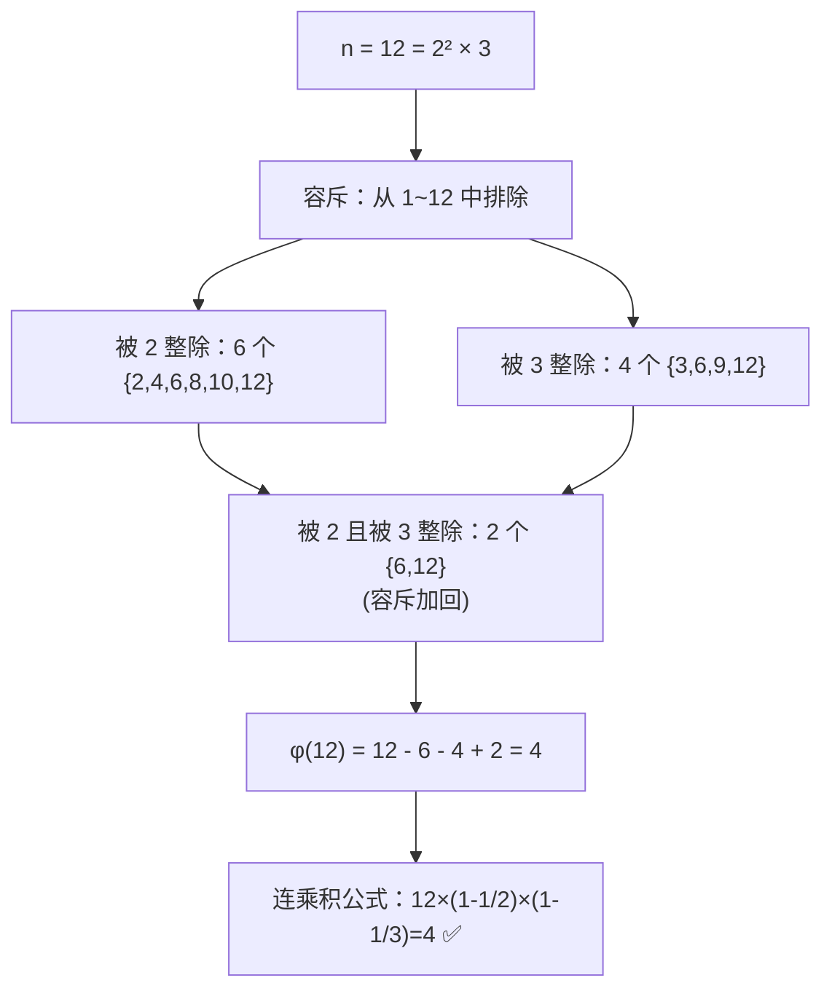
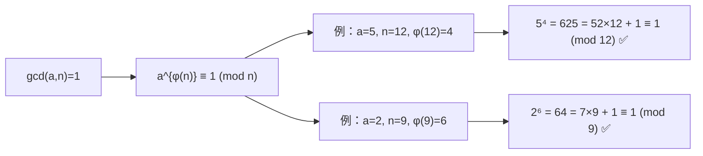
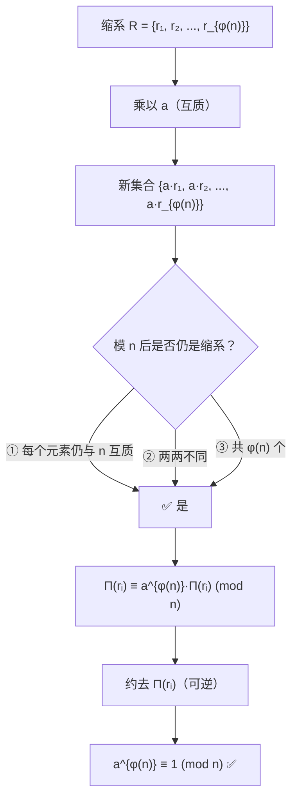
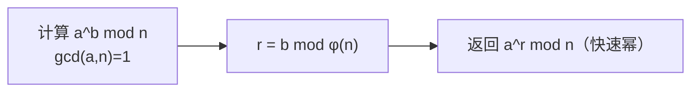
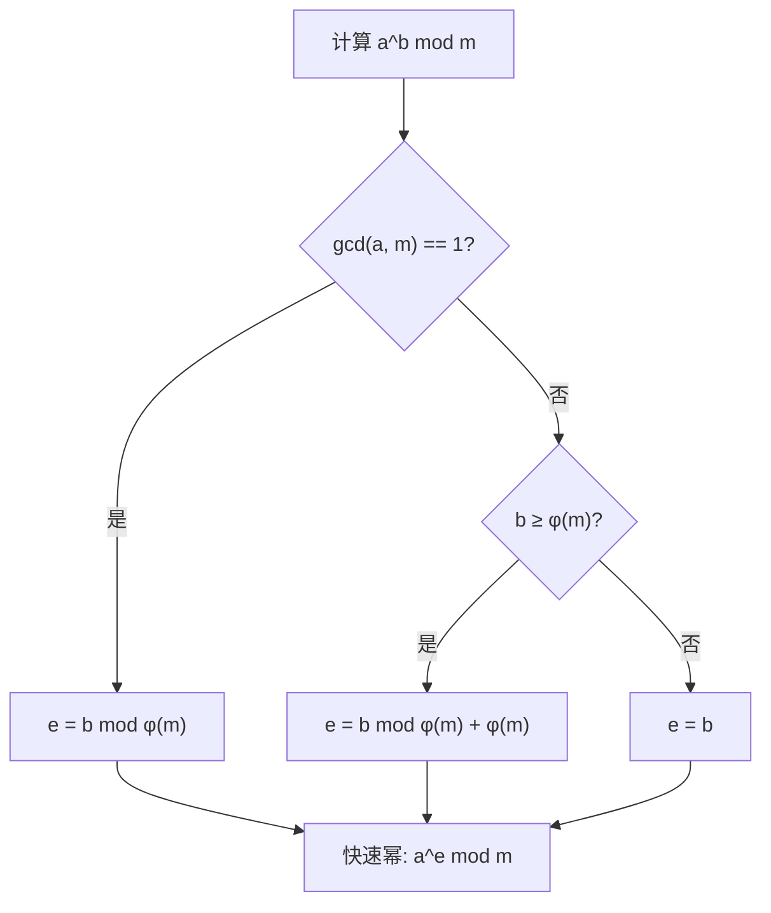
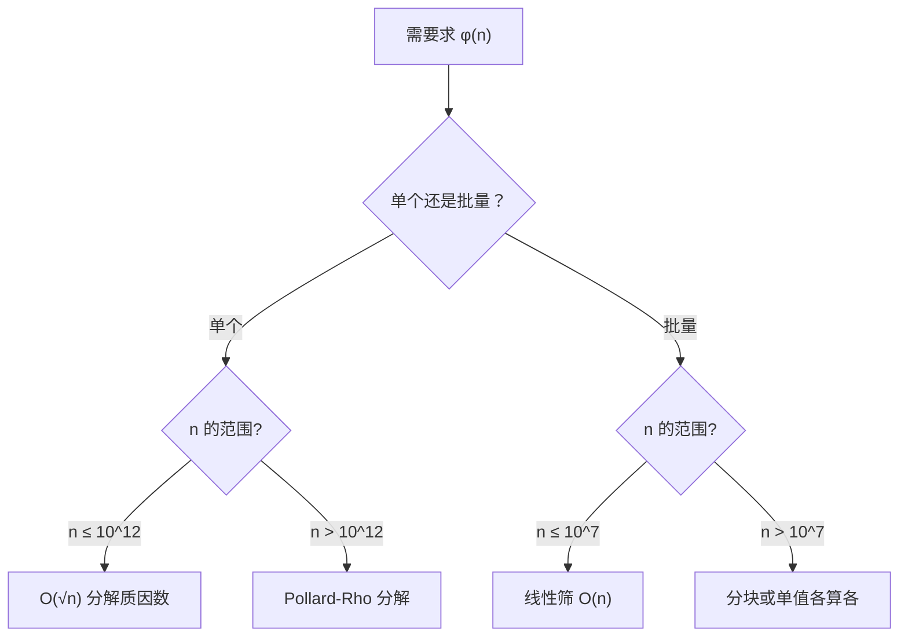
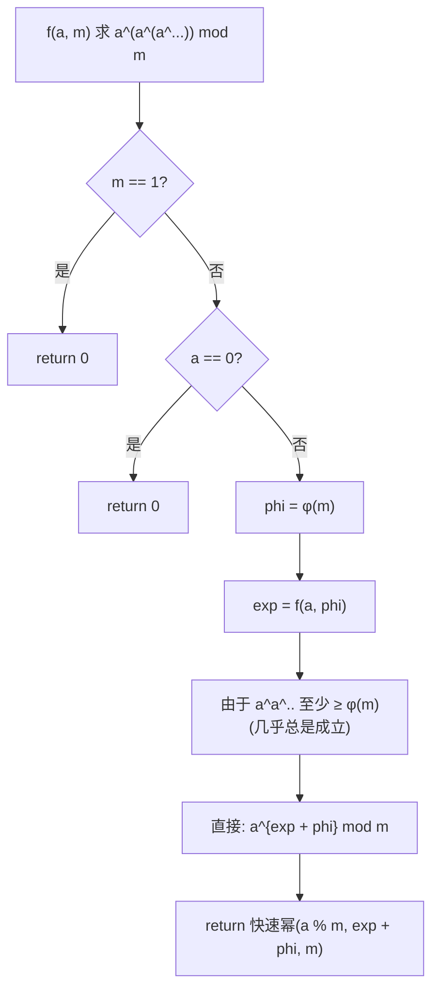
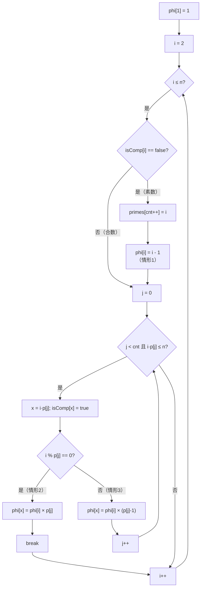
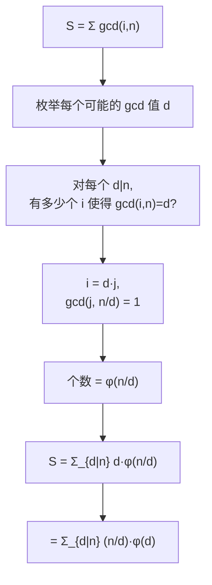
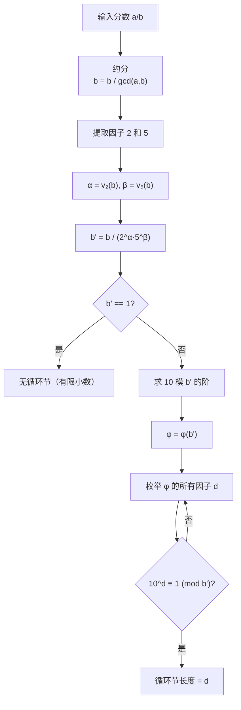

# 欧拉函数与欧拉定理

> 欧拉（Leonhard Euler, 1707–1783）是数学史上最多产的数学家。欧拉函数与欧拉定理诞生于他对数论中同余理论的系统研究，其思想源头可追溯至费马小定理（1640）。欧拉在 1736 年证明了费马小定理，随后在 1763 年将其推广到任意模数，这就是我们今天所知的欧拉定理。这一成果为后来高斯（1801）在《算术研究》中系统建立初等数论奠定了基石，更是现代公钥密码学（RSA, 1977）的理论支柱。

## 欧拉函数 φ(n) 的定义与推导

### 定义

**欧拉函数** φ(n) 定义为小于等于 n 的正整数中与 n **互质**的数的个数：

```
φ(n) = |{ k ∈ ℕ | 1 ≤ k ≤ n, gcd(k, n) = 1 }|
```

**基本示例**：

```
φ(1)  = 1    →  {1} 与 1 互质（按定义）
φ(2)  = 1    →  {1}
φ(6)  = 2    →  {1, 5}
φ(12) = 4    →  {1, 5, 7, 11}
φ(30) = 8    →  {1, 7, 11, 13, 17, 19, 23, 29}
```

**特殊值**：

```
φ(1) = 1    （约定，因为 gcd(1,1)=1）
φ(p) = p-1  （p 为素数，因为所有小于 p 的正整数都与 p 互质）
```

### 容斥原理推导公式

这是欧拉函数**标准公式**的完整推导。

#### 问题

给定 `n = p₁^{k₁} × p₂^{k₂} × ... × pᵣ^{kᵣ}`，求 [1, n] 中与 n 互质的整数个数。

#### 容斥思路

从 1~n 中**排除**与 n 有公共质因子的数：

- 设 n 的质因子集合为 {p₁, p₂, ..., pᵣ}
- 被 pᵢ 整除的数有 n/pᵢ 个（单集合）
- 同时被 pᵢ 和 pⱼ 整除的数有 n/(pᵢ·pⱼ) 个（交集合）
- 依此类推……

**容斥原理**公式写为：

```
φ(n) = n - Σ(n/pᵢ) + Σ(n/(pᵢ·pⱼ)) - Σ(n/(pᵢ·pⱼ·pₖ)) + ... + (-1)ʳ × n/(p₁·p₂·...·pᵣ)
```

#### 因式分解

提出公共因子 n：

```
φ(n) = n × [1 - Σ(1/pᵢ) + Σ(1/(pᵢ·pⱼ)) - Σ(1/(pᵢ·pⱼ·pₖ)) + ... + (-1)ʳ/(p₁·p₂·...·pᵣ)]
```

上式恰好是连乘积的展开形式：

```
φ(n) = n × (1 - 1/p₁)(1 - 1/p₂)...(1 - 1/pᵣ)
```

**验证**：展开三个质因子的情况

```
(1 - 1/a)(1 - 1/b)(1 - 1/c)
= 1 - (1/a + 1/b + 1/c) + (1/ab + 1/ac + 1/bc) - 1/abc
```

与容斥公式完全一致 ✅

#### 最终公式

```text
n 的标准分解式：n = p₁^{k₁} × p₂^{k₂} × ... × pᵣ^{kᵣ}

φ(n) = n × ∏_{i=1}^{r} (1 - 1/pᵢ)

特例：
  φ(p^k) = p^k - p^{k-1} = p^{k-1} × (p - 1)
```



### 积性函数证明

**定义**：若函数 f: ℕ → ℂ 满足 `f(mn) = f(m)·f(n)` 对任意 `gcd(m,n) = 1` 成立，则称 f 为**积性函数**（multiplicative function）。

**定理**：欧拉函数 φ(n) 是积性函数。

#### 证明

设 m, n 互质（gcd(m, n) = 1），要证 φ(mn) = φ(m)·φ(n)。

**方法一：中国剩余定理**

对于任意整数 x，若 1 ≤ x ≤ mn，由中国剩余定理：

```
x ≡ a (mod m)  且  x ≡ b (mod n)
```

存在一一对应：每个 x ↔ (a, b) 其中 0 ≤ a < m, 0 ≤ b < n。

现在，gcd(x, mn) = 1 当且仅当 gcd(x, m) = 1 且 gcd(x, n) = 1（因 m, n 互质）。这正是 gcd(a, m) = 1 且 gcd(b, n) = 1。

因此，[1, mn] 中与 mn 互质的数，与有序对 (a, b)（其中 gcd(a,m)=1, gcd(b,n)=1）一一对应。这样的有序对数目是 φ(m)·φ(n)。

∴ φ(mn) = φ(m)·φ(n) ✅

**方法二：标准分解式直接验证**

```
m = p₁^{a₁}...p𠆢^{a𠆢},  n = q₁^{b₁}...q𞸐^{b𞸐}
gcd(m,n) = 1 ⇒ 所有 pᵢ ≠ qⱼ

φ(mn) = mn × ∏(1-1/pᵢ) × ∏(1-1/qⱼ)
      = [m × ∏(1-1/pᵢ)] × [n × ∏(1-1/qⱼ)]
      = φ(m) × φ(n) ✅
```

#### 积性函数的推论

由积性 + 素数幂公式可立即得到标准公式：

因为任意 n = p₁^{k₁}·p₂^{k₂}·...·pᵣ^{kᵣ} 且各质因子幂互质：

```
φ(n) = ∏ φ(pᵢ^{kᵢ})
     = ∏ pᵢ^{kᵢ-1}·(pᵢ - 1)
     = n × ∏ (1 - 1/pᵢ)
```

### 重要性质与定理

```
1. φ(p) = p - 1                          （p 为素数）
2. φ(p^k) = p^k - p^{k-1} = p^{k-1}(p-1)（p 为素数）
3. φ(mn) = φ(m)·φ(n)                     （gcd(m,n)=1，积性）
4. n = Σ_{d|n} φ(d)                      （因子求和恒等式）
5. 若 a|b, 则 φ(a) | φ(b)               （整除性）
6. φ(n) 为偶数（∀ n > 2）               （奇偶性）
7. Σ_{k=1, gcd(k,n)=1}^{n} k = n·φ(n)/2  （缩系求和）
8. a^φ(n) ≡ 1 (mod n) 当 gcd(a,n)=1     （欧拉定理）
```

#### 性质 4 的证明：n = Σ_{d|n} φ(d)

考虑所有分数 k/n（k = 1, 2, ..., n），化简到最简形式：

```
k/n → 化简 → a/d 其中 d|n, gcd(a,d)=1
```

每个分母 d 对应的分子 a 恰好有 φ(d) 种取值。而总分数个数为 n，故：

```
n = Σ_{d|n} φ(d)  ✅
```

**示例**：n = 12

```
d = 1: φ(1) = 1  →  {1/12→1/1}
d = 2: φ(2) = 1  →  {6/12→1/2}
d = 3: φ(3) = 2  →  {4/12→1/3, 8/12→2/3}
d = 4: φ(4) = 2  →  {3/12→3/4, 9/12→3/4}  子集重复部分
d = 6: φ(6) = 2  →  {2/12→1/6, 10/12→5/6}
d = 12: φ(12) = 4  → {1/12,5/12,7/12,11/12}

验证：1 + 1 + 2 + 2 + 2 + 4 = 12 ✅
```

#### 性质 6 的证明：φ(n) 在 n > 2 时为偶数

- 若 n 有奇质因子 p，则 p-1 为偶数，故 φ(p^k) = p^{k-1}(p-1) 为偶数 → φ(n) 为偶数
- 若 n = 2^k（k ≥ 2），则 φ(2^k) = 2^{k-1} 为偶数
- 若 n = 2，φ(2) = 1（奇数，唯一特例）

## 欧拉定理（Euler's Theorem）

### 定理陈述

> 若 gcd(a, n) = 1，则：
>
> **a^{φ(n)} ≡ 1 (mod n)**

这是费马小定理（a^{p-1} ≡ 1 mod p）对合数模的完整推广。



**数值验证**：

```
n=7（素数），φ(7)=6
  3^6 = 729 = 104×7 + 1 ≡ 1 (mod 7)  ← 费马小定理
n=15，φ(15)=8
  2^8 = 256 = 17×15 + 1 ≡ 1 (mod 15)
  7^8 ≡ 1 (mod 15)
n=21，φ(21)=φ(3)·φ(7)=2×6=12
  5^12 = 244140625 = 11625744×21 + 1 ≡ 1 (mod 21)
```

### 完整证明（缩系乘积论证）

这是数学中最经典的证明之一，思路简洁而深刻。

#### 步骤 1：构造缩系

设 **缩系（reduced residue system）** 模 n 为：

```
R = {r₁, r₂, ..., r_{φ(n)}}
```

其中每个 rᵢ 满足 1 ≤ rᵢ ≤ n 且 gcd(rᵢ, n) = 1，且两两模 n 不同余。

#### 步骤 2：将缩系乘以 a

由于 gcd(a, n) = 1，集合：

```
a·R = {a·r₁, a·r₂, ..., a·r_{φ(n)}}
```

模 n 后仍是缩系。证明：

- **互质性**：gcd(a·rᵢ, n) = 1（因 gcd(a,n)=1 且 gcd(rᵢ,n)=1）
- **完全性**：若 a·rᵢ ≡ a·rⱼ (mod n)，由 a 可逆（gcd(a,n)=1），可两边除以 a，得 rᵢ ≡ rⱼ，故元素两两不同
- **覆盖性**：共 φ(n) 个元素，正好构成整个缩系

#### 步骤 3：两边取乘积

将 R 和 a·R 的所有元素模 n 分别相乘：

```
左：r₁ · r₂ · ... · r_{φ(n)}   (mod n)
右：(a·r₁)(a·r₂)...(a·r_{φ(n)}) = a^{φ(n)} · (r₁·r₂·...·r_{φ(n)})  (mod n)
```

因为两者都是缩系，乘积模 n 同余：

```
r₁·r₂·...·r_{φ(n)} ≡ a^{φ(n)}·r₁·r₂·...·r_{φ(n)}  (mod n)
```

#### 步骤 4：约去共同因子

令 P = r₁·r₂·...·r_{φ(n)}。注意到 gcd(P, n) = 1（因为每个因子都与 n 互质），因此 P 在模 n 下存在逆元，两边可同乘 P^{-1}：

```
1 ≡ a^{φ(n)}  (mod n)  →  a^{φ(n)} ≡ 1 (mod n) ✅
```

#### 直观图示



### 费马小定理作为推论

若 n = p 为素数，则 φ(p) = p - 1，代入欧拉定理即得费马小定理：

```
a^{p-1} ≡ 1 (mod p)     当 a 不被 p 整除
```

#### 模逆元计算

欧拉定理直接给出互质条件下的模逆元：

```
a^{φ(n)} ≡ 1 (mod n)
⇒ a·a^{φ(n)-1} ≡ 1 (mod n)
⇒ a^{-1} ≡ a^{φ(n)-1} (mod n)
```

**与扩展欧几里得算法对比**：

| 方法 | 前提 | 复杂度 | 溢出风险 |
|------|------|--------|---------|
| 欧拉定理 a^{φ(n)-1} | gcd(a,n)=1 | O(log φ(n)) 快速幂 | 指数可能很大 |
| 扩展欧几里得 | gcd(a,n)=1 | O(log n) | 无指数溢出 |

**推荐**：n 较小时用欧拉定理；n 为大素数时两者皆可。

### 重要推论：简化幂运算

若 gcd(a, n) = 1，则欧拉定理允许将指数模 φ(n) 简化：

```
a^b ≡ a^{b mod φ(n)} (mod n)
```

**证明**：设 b = q·φ(n) + r，其中 0 ≤ r < φ(n)，则

```
a^b = a^{q·φ(n) + r} = (a^{φ(n)})^q · a^r ≡ 1^q · a^r = a^r (mod n)
```

其中 r = b mod φ(n) ✅



## 扩展欧拉定理

### 定理陈述

欧拉定理要求 gcd(a, n) = 1，当两者**不互质**时，需要扩展欧拉定理。

> 对任意整数 a, n 及 b ≥ 0：
>
> **a^b ≡ a^{b mod φ(n) + φ(n)} (mod n)**  当 **b ≥ φ(n)** 时成立
>
> 若 b < φ(n)，直接计算 a^b mod n

**等价形式**：

```
       ⎧ a^b mod m,                        b < φ(m)
a^b ≡ ⎨ a^{b mod φ(m) + φ(m)} mod m,       b ≥ φ(m)   (mod m)
       ⎩
```

### 完整证明

扩展欧拉定理的证明分为两步：先处理 n 为素数幂的情形，再推广到一般合数。

#### 引理：素数幂情形 n = p^k

需证：对任意 a，当 b ≥ φ(p^k) 时，有 a^b ≡ a^{b mod φ(p^k) + φ(p^k)} (mod p^k)

分两种情况：

**情形 1**：gcd(a, p) = 1

此时 a 与 p^k 互质，直接应用欧拉定理：
a^{φ(p^k)} ≡ 1 (mod p^k)
⇒ a^b = a^{q·φ(p^k) + r} ≡ a^r (mod p^k)
在 b ≥ φ(p^k) 时，r = b mod φ(p^k)，加不加 φ(p^k) 不影响结果（因为 a^{φ(p^k)} ≡ 1）

**情形 2**：p | a（即 a 与 p^k 不互质）

设 a = p^t · u 其中 gcd(u, p) = 1, t ≥ 1。

当 b ≥ φ(p^k) = p^{k-1}(p-1) 时，有 b ≥ k（因 p^{k-1}(p-1) ≥ k 对 k ≥ 1 成立），故：

a^b = (p^t · u)^b = p^{tb} · u^b

由于 tb ≥ k（因为 b ≥ k/p^{k-1}(p-1)），但更直接的论证：

当 b ≥ φ(p^k) ≥ k 时，tb ≥ k，故 a^b 被 p^k 整除：
a^b ≡ 0 (mod p^k)

而 b mod φ(p^k) + φ(p^k) ≥ φ(p^k) ≥ k，故同样有：
a^{b mod φ(p^k) + φ(p^k)} ≡ 0 (mod p^k)

因此等式成立 ✅

#### 一般情形 n = ∏ p_i^{k_i}

由中国剩余定理，等式在模每个 p_i^{k_i} 成立，则在模 n 下也成立。

因此对任意 a, n 及 b ≥ φ(n)：

```
a^b ≡ a^{b mod φ(n) + φ(n)} (mod n)  ✅
```

### 适用条件分析

**关键条件**：b ≥ φ(m)

| 情形 | gcd(a,m) | b < φ(m) | b ≥ φ(m) |
|------|---------|---------|---------|
| 互质 | =1 | 直接用 a^b mod m | a^{b mod φ(m)} mod m（欧拉定理已足够） |
| 不互质 | >1 | 直接计算 a^b mod m | **必须**用 a^{b mod φ(m)+φ(m)} mod m |

**为什么 b < φ(m) 时不能用扩展公式？**

举例：a = 2, m = 4, φ(m) = 2

```
b = 1 < φ(4) = 2
2^1 mod 4 = 2
若错误使用扩展公式：2^{1 mod 2 + 2} = 2^3 = 8 ≡ 0 (mod 4)
2 ≠ 0 → 不等！❌
```

**为什么 b ≥ φ(m) 时要加 φ(m)？**

假设 gcd(a, m) > 1 且 b mod φ(m) ≡ 0：

```
若不加 φ(m)：a^{0} ≡ 1 (mod m)
但实际 a^b 可能很大且不为 1

加上 φ(m)：a^{0+φ(m)} = a^{φ(m)}
根据推广引理，此时 a^{φ(m)} 在 a 与 m 不互质时不一定为 1，
但能保证 a^{φ(m)} ≡ 0 (mod p^k) 或取特定值，
且 a^b ≡ a^{r+φ(m)} 成立
```



## 核心问题与适用边界

### 单值求解 O(√n) vs 线性筛 O(n)

| 维度 | 单值分解质因数 | 线性筛（欧拉筛） |
|------|--------------|----------------|
| 适用场景 | 求一个数的 φ | 求 [1..n] 的全部 φ |
| 时间复杂度 | O(√n) | O(n) |
| 空间复杂度 | O(1) | O(n) |
| 当 n=10^6 | ≈ 1000 次运算 | ≈ 10^6 次 |
| 当 n=10^12 | √n = 10^6 | 不可行（内存爆炸） |

**选择指南**：

- 求单值 n，n ≤ 10^12 → O(√n) 质因数分解
- 求单值 n，n > 10^12 → 需要 Pollard-Rho（质因数分解优化）
- 求 [1..n] 全部 φ，n ≤ 10^7 → 线性筛
- 交互式题目，多次随机查询 φ → 预计算到最大规模



### 欧拉降幂的适用条件

欧拉降幂的核心是**指数级别的简化**：将超大指数 b 降为不超过 2·φ(m) 的量级。

**完整降幂公式**：

```
a^b ≡ a^(b') (mod m)

其中：
  b' = b,                    若 b < φ(m)
  b' = b mod φ(m) + φ(m),   若 b ≥ φ(m)
```

**判定 b ≥ φ(m) 的实际意义**：

在编程中，指数 b 可能以两种形式给出：
1. **大整数形式**：b 是显式的大整数（如 10^10000），此时可与 φ(m) 比较大小
2. **幂塔形式**：b = c^d 且自身需要模 φ(m) 简化，此时需要递归应用欧拉降幂

**常见陷阱**：

```
例：求 2^1000000 mod 4
    φ(4) = 2
    b = 1000000 ≥ 2 → e = 1000000 mod 2 + 2 = 0 + 2 = 2
    2^2 = 4 ≡ 0 (mod 4) ✅

    但直接计算：2^1000000 显然是 4 的倍数 ≡ 0 (mod 4)
    若忽略 b ≥ φ(m) 检查：e = 1000000 mod 2 = 0 → 2^0 = 1 ≠ 0 ❌
```

### 无穷幂塔的收敛条件

**无穷幂塔**（infinite power tower / tetration）：

```
T(a) = a^{a^{a^{·^{·^{·}}}}}
```

对欧拉问题，我们关心：

```
求 a^{a^{a^{·^{·^{·}}}}} mod m
```

**收敛条件分析**：

实际计算中，我们通过扩展欧拉定理将问题定义为递推：

```
f(a, m) = a^{f(a, φ(m)) + φ(m)} mod m     当至少递归到 φ 值
```

递推深度分析：

```
φ(m) → φ(φ(m)) → φ(φ(φ(m))) → ... → 1
```

这个序列的长度（即递归深度）是多少？

**定理**：对任意 m ≥ 2，反复取 φ 至多 O(log m) 步后得到 1。

**最坏情况分析**：

| 初始值 | 序列 | 步数 |
|--------|------|------|
| m = 1 | 1 | 0 |
| m = 2 | 2 → 1 | 1 |
| m = 3 | 3 → 2 → 1 | 2 |
| m = 5 | 5 → 4 → 2 → 1 | 3 |
| m = 11 | 11 → 10 → 4 → 2 → 1 | 4 |
| m = 2^k | 2^k → 2^{k-1} → ... → 2 → 1 | k |
| m = 2^30 ≈ 10^9 | 约 30 步 | ✓ |
| m = 2^60 ≈ 10^18 | 约 60 步 | ✓ |

**关键结论**：

```
幂塔递归深度 ≤ O(log m)，通常 ≤ 60 步
因此算法复杂度为 O(log m × log²m) ~ O(log³m)
完全可行！
```

**非收敛情况**：幂塔「收敛」指模意义下可计算，不要求实数收敛。

```
2^(2^(2^...)) 在实数域发散，但在模意义下定义良好
```



## 高效实现与关键优化

### 欧拉筛求 φ 数组（3 种递推情形）

线性筛（欧拉筛）可以在 O(n) 时间内同时求出素数表和 φ(1..n)。

**基本原理**：

```
设 primes[] 为当前已筛出的素数表，i 从小到大遍历
对每个 i，考虑其与 primes[j] 的乘积 x = i · primes[j]

根据 i 能否被 primes[j] 整除，分为 3 种情形：
```

#### 情形分析

| 情形 | 条件 | φ(x) 递推公式 | 说明 |
|------|------|-------------|------|
| 1 | i 是素数 | φ(i) = i - 1 | 素数定义 |
| 2 | primes[j] \| i（即 i % p == 0） | φ(x) = φ(i) × p | p 是 i 的因子，直接乘 p |
| 3 | primes[j] ∤ i（互质） | φ(x) = φ(i) × (p-1) | 积性函数性质 |

#### 情形 2 的详细推导（最关键）

当 primes[j] 整除 i 时，i 和 x = i·p 共享完全相同的质因子集合：

```
i = p₁^{a₁}·p₂^{a₂}·...·p^{a_k}·...
x = p₁^{a₁}·p₂^{a₂}·...·p^{a_k+1}·...

φ(i) = i × ∏(1-1/pⱼ)
φ(x) = x × ∏(1-1/pⱼ) = i·p × ∏(1-1/pⱼ) = p × φ(i)
```

因此 φ(i·p) = φ(i) × p ✅

#### 完整流程图



```java
/**
 * 欧拉筛求 [1..n] 的欧拉函数值
 * 时间复杂度 O(n)，空间复杂度 O(n)
 *
 * @param n 上界
 * @return phi 数组，phi[i] 表示 i 的欧拉函数值
 */
public static int[] eulerSieve(int n) {
    int[] phi = new int[n + 1];
    int[] primes = new int[n + 1];
    boolean[] isComp = new boolean[n + 1];
    int cnt = 0;

    phi[1] = 1;

    for (int i = 2; i <= n; i++) {
        if (!isComp[i]) {
            // 情形 1: i 是素数
            primes[cnt++] = i;
            phi[i] = i - 1;
        }
        for (int j = 0; j < cnt && (long) i * primes[j] <= n; j++) {
            int p = primes[j];
            int x = i * p;
            isComp[x] = true;

            if (i % p == 0) {
                // 情形 2: p 是 i 的最小质因子
                phi[x] = phi[i] * p;
                break; // 关键优化，保证每个合数只被最小质因子筛一次
            } else {
                // 情形 3: p 与 i 互质
                phi[x] = phi[i] * (p - 1);
            }
        }
    }
    return phi;
}
```

**break 的作用**（线性筛的核心）：

```
i = 12, p = 2 → x = 24, 设标记
i = 12, p = 3 → x = 36
但 36 的最小质因子是 2，应被 i=18, p=2 筛掉
因此 i=12 在 p=2 时 break 后，不会用 p=3 筛 36
```

每个合数**恰好被其最小质因子筛一次**，实现 O(n) 复杂度。

### "指数 ≥ φ(m)" 的判定技巧

在实现欧拉降幂时，判定指数 b 是否 ≥ φ(m) 是关键步骤。由于 b 可能非常大（大整数，甚至幂塔），需要**边计算边比较**的技巧。

#### 技巧 1：字符串表示的大整数比较

当 b 以字符串形式给出（如 "10^10000" 的数字）：

```java
/**
 * 判断大整数 b_str 是否 ≥ limit
 * 同时计算 b_str mod limit
 *
 * @param b_str 大整数字符串
 * @param limit 阈值（通常是 φ(m)）
 * @return [mod_result, is_ge]
 */
public static long[] compareAndMod(String bStr, long limit) {
    long mod = 0;
    boolean ge = false;

    for (int i = 0; i < bStr.length(); i++) {
        int digit = bStr.charAt(i) - '0';
        mod = (mod * 10 + digit) % limit;
        // 如果已经确定 ge 或当前位已经超过阈值
        if (!ge && mod + 10 * (bStr.length() - 1 - i) * limit >= limit) {
            // 更精确的判断：边读边比较
            // 简化做法：长度超过 limit 的十进制位数即可确定
        }
    }
    // 实际上，更精确的做法：
    long val = 0;
    ge = false;
    for (int i = 0; i < bStr.length(); i++) {
        int digit = bStr.charAt(i) - '0';
        val = val * 10 + digit;
        if (val >= limit) {
            ge = true;
            val %= limit;
        }
    }
    return new long[]{val, ge ? 1L : 0L};
}
```

#### 技巧 2：快速幂中边算边比（推荐）

处理幂塔递归中产生的指数：

```java
/**
 * 计算 a^b mod mod，同时判断过程中是否 ≥ threshold
 * 这是 "边乘边比较" 的核心技巧
 *
 * @param a 底数
 * @param b 指数（可能很大）
 * @param mod 模数
 * @param threshold 判断阈值（通常为 phi(m)）
 * @return [结果, 是否 ≥ threshold]
 */
public static long[] powModWithCheck(long a, long b, long mod, long threshold) {
    long res = 1 % mod;
    boolean ge = (a >= threshold) ? true : false;
    a %= mod;

    while (b > 0) {
        if ((b & 1) == 1) {
            res = res * a;
            if (res >= threshold) {
                ge = true;
                res %= mod;
            } else {
                res %= mod;
            }
        }
        a = a * a;
        if (a >= threshold) {
            ge = true;
            a %= mod;
        } else {
            a %= mod;
        }
        b >>= 1;
    }
    return new long[]{res, ge ? 1L : 0L};
}
```

#### 技巧 3：降幂统一模板

```java
/**
 * 欧拉降幂的通用入口
 * 计算 a^b mod m，自动判断是否需要加 φ(m)
 *
 * @param a 底数
 * @param b 指数
 * @param m 模数
 * @return a^b mod m
 */
public static long eulerPow(long a, long b, long m) {
    if (m == 1) return 0;
    if (a == 0) return 0;
    if (b == 0) return 1 % m;

    long phiM = phi(m);

    // 判断 b 是否 ≥ φ(m)
    long[] modCheck = compareAndMod(b, phiM);
    long exp = modCheck[0];
    boolean ge = modCheck[1] == 1;

    if (ge) {
        exp += phiM;
    }

    return fastPow(a % m, exp, m);
}

/**
 * 大整数 b 的 ≥ 判断和取模（字符串版）
 */
public static long[] compareAndMod(long b, long limit) {
    // b 是 long 类型时的简单版
    return new long[]{b % limit, b >= limit ? 1L : 0L};
}
```

### 幂塔递归边界处理

幂塔 `a^(a^(a^...))` 的递归计算需要特别处理边界条件。

#### 标准递归实现

```java
/**
 * 计算无穷幂塔 a^(a^(a^...)) mod m
 * 实际使用有限层数 k，此处假设 k 足够大（如 100+）
 * 事实上 φ 递推至 1 后，任何数取模 1 为 0
 *
 * @param a 底数
 * @param m 模数
 * @param depth 当前递归深度（用于调试和防止栈溢出）
 * @return a^(a^(a^...)) mod m
 */
public static long powerTower(long a, long m, int depth) {
    if (m == 1) return 0;          // 模 1 恒为 0
    if (m == 0) return 0;
    if (depth > 100) return 0;     // 安全边界，实际只需 log₂(m) 层

    long phiVal = phi(m);

    // 下一层的指数 = powerTower(a, phiVal, depth + 1)
    // 由于下一层一定 ≥ φ(phiVal)（因为幂塔很大），
    // 根据扩展欧拉定理，需要加上 φ(m)

    long exponent = powerTower(a, phiVal, depth + 1);

    // 注意：exponent 已经包含了下一层的 φ(...) 加法
    // 我们需要在此层也加上当前层的 φ(m)
    // 但需注意：exponent 可能 = 0（当 phiVal = 1 时）
    // 此时 exponent + phiVal = phiVal

    return fastPowMod(a % m, exponent + phiVal, m);
}
```

**边界细节**：

当 φ(m) = 1 时（m = 2）：

```
phiVal = 1
exponent = powerTower(a, 1, ...) = 0  （因为 m=1 返回 0）
exponent + phiVal = 0 + 1 = 1
a^1 mod 2 = a mod 2 ✅
```

**验证**：

```
2^(2^(2^...)) mod 2
→ φ(2) = 1
→ f(2, 2) = 2^{f(2,1) + 1} mod 2 = 2^{0+1} mod 2 = 0 ✅
（任何 2 的正整数次幂都是偶数）
```

#### 有限层数幂塔

```java
/**
 * 计算 a^(a^(a^...)) mod m，共 k 层（有限塔）
 * 如 k=3: a^(a^a)
 *
 * @param a 底数
 * @param k 层数
 * @param m 模数
 * @return 结果
 */
public static long powerTowerK(long a, long k, long m) {
    if (m == 1) return 0;
    if (k == 0) return 1 % m;
    if (a == 0) return (k % 2 == 0) ? 1 % m : 0; // 0^0=1 约定

    // 计算 φ(m)
    long phiVal = phi(m);

    // 递归计算指数
    long exponent = powerTowerK(a, k - 1, phiVal);

    // 判断指数是否需要 +φ(m)
    // 当 k ≥ 2 时，指数 ≥ a^a ≥ 2 (若 a≥2)，通常 ≥ φ(m)
    // 但需要精确判断
    boolean needAdd = (k >= 2) || (a >= phiVal && exponent >= phiVal);
    // 简化实现：使用带比较的快速幂
    long[] res = powModWithCheck(a % m, exponent, m, phiVal);
    long exp = res[0];
    boolean ge = res[1] == 1;

    // 关键：exponent 的大小是相对于 phiVal 的，
    // 但最终模数是 m，这里判断 exponent ≥ phiVal 比较棘手
    // 标准做法：
    if (ge) {
        // exponent ≥ phiVal，使用扩展欧拉定理
        return fastPowMod(a % m, (phiVal) + exp, m);
    } else {
        return fastPowMod(a % m, exp, m);
    }
}
```

#### 更安全的幂塔实现

由于幂塔的指数层通常很大，一个简化而安全的做法是：

```java
/**
 * 安全的幂塔实现
 * 核心思路：当递归到 φ 序列足够深时，指数足够大，直接加 φ(m)
 *
 * @param a 底数
 * @param idx 当前层数（从 0 开始递减）
 * @param m 模数
 * @return a^b mod m
 */
public static long safeTower(long a, long m) {
    if (m == 1) return 0;
    if (a == 0) return 0;

    // 获取 φ 序列
    List<Long> phiSeq = new ArrayList<>();
    for (long cur = m; cur > 1; cur = phi(cur)) {
        phiSeq.add(cur);
    }
    // phiSeq = [m, φ(m), φ(φ(m)), ..., 2]

    // 从最内层向外计算
    long exp = 1; // a^0 = 1
    for (int i = phiSeq.size() - 1; i >= 0; i--) {
        long mod = phiSeq.get(i);
        // 计算 a^exp mod mod
        // 此时 exp 已经是上一层的计算结果
        // 需要判断 exp ≥ mod 来决定是否加 mod
        if (exp >= Long.MAX_VALUE / a) {
            // exp 非常大，肯定 ≥ mod
            exp = fastPowMod(a % mod, exp % mod + mod, mod);
        } else {
            // exp 在 long 范围内，精确计算比较
            long powVal = naivePowCheck(a, exp, mod);
            // ...
        }
    }
    return exp;
}
```

由于精确实现较为繁琐，竞赛中常用的简化模板：

```java
/**
 * 竞赛级幂塔模板（简化版）
 * 适用于 a ≥ 2 且幂塔层数足够深的情况
 */
public static long tower(long a, long m) {
    if (m == 1) return 0;
    long phiM = phi(m);
    long exp = tower(a, phiM);
    // 对于 a ≥ 2，当指数 g ≥ 5 时，几乎所有 φ(m) 都被满足
    // 此处 exp 内层已递归计算
    return fastPowMod(a % m, exp + phiM, m);
}
```

## 典型题目与解题思路

### 求 φ(n) 单值

#### 问题描述

给定正整数 n（1 ≤ n ≤ 10^12），求 φ(n)。

#### 推导过程

将 n 分解质因数，使用公式 φ(n) = n × ∏(1 - 1/pᵢ)。

关键是质因数分解：遍历 i 从 2 到 √n，找到质因子后除尽。

#### Java 实现

```java
/**
 * 求单值欧拉函数 φ(n)
 * 时间复杂度 O(√n)，空间 O(1)
 *
 * @param n 正整数
 * @return φ(n)
 */
public static long phi(long n) {
    long res = n;
    long temp = n;

    for (long i = 2; i * i <= temp; i++) {
        if (temp % i == 0) {
            // i 是质因子
            while (temp % i == 0) {
                temp /= i;
            }
            res = res / i * (i - 1);
        }
    }

    if (temp > 1) {
        // 剩余一个质因子
        res = res / temp * (temp - 1);
    }

    return res;
}
```

#### 复杂度分析

| 维度 | 值 |
|------|-----|
| 时间复杂度 | O(√n) |
| 空间复杂度 | O(1) |
| n=10⁶ 时 | 约 10³ 次循环 |
| n=10¹² 时 | 约 10⁶ 次循环 |

#### 测试用例

```java
public static void testPhi() {
    // 基本测试
    System.out.println(phi(1));   // 1
    System.out.println(phi(2));   // 1
    System.out.println(phi(3));   // 2
    System.out.println(phi(6));   // 2
    System.out.println(phi(12));  // 4
    System.out.println(phi(36));  // 12
    System.out.println(phi(97));  // 96（素数）
    System.out.println(phi(100)); // 40
    System.out.println(phi(1000000007)); // 1000000006（大素数）

    // 边界测试
    System.out.println(phi(1));           // 1
    System.out.println(phi(2));           // 1
    System.out.println(phi(1000000000000L)); // 400000000000

    // 验证积性：φ(15) = φ(3)×φ(5) = 2×4 = 8
    assert phi(15) == phi(3) * phi(5);
}
```

**验证**：

```
φ(100) = ?
100 = 2² × 5²
φ(100) = 100 × (1-1/2) × (1-1/5) = 100 × 1/2 × 4/5 = 40 ✅

φ(1000000000000) = ?
1000000000000 = 10¹² = 2¹² × 5¹²
φ(10¹²) = 10¹² × (1-1/2) × (1-1/5) = 10¹² × 1/2 × 4/5 = 4×10¹¹ ✅
```

### 求 φ(1..n) 批量

#### 问题描述

给定正整数 n（1 ≤ n ≤ 10⁷），求 φ(1), φ(2), ..., φ(n)。

#### 推导过程

使用欧拉筛（线性筛）递推计算，详见 5.1 节。

#### Java 实现

```java
/**
 * 批量求 [1..n] 的欧拉函数值
 * 时间复杂度 O(n)，空间 O(n)
 *
 * @param n 上界
 * @return int[] phi 数组
 */
public static int[] phiBatch(int n) {
    int[] phi = new int[n + 1];
    boolean[] isComp = new boolean[n + 1];
    int[] primes = new int[n + 1];
    int cnt = 0;

    phi[1] = 1;

    for (int i = 2; i <= n; i++) {
        if (!isComp[i]) {
            primes[cnt++] = i;
            phi[i] = i - 1;
        }
        for (int j = 0; j < cnt && (long) i * primes[j] <= n; j++) {
            int p = primes[j];
            int x = i * p;
            isComp[x] = true;

            if (i % p == 0) {
                phi[x] = phi[i] * p;
                break;
            } else {
                phi[x] = phi[i] * (p - 1);
            }
        }
    }

    return phi;
}
```

#### 复杂度分析

| 维度 | 值 |
|------|-----|
| 时间复杂度 | O(n) |
| 空间复杂度 | O(n) |
| n=10⁷ 时 | 约 10⁷ 次运算，内存约 40MB+ |
| 适用场景 | 多次查询、DP 预处理 |

#### 测试用例

```java
public static void testPhiBatch() {
    int n = 100;
    int[] phi = phiBatch(n);

    // 单点验证
    int[] expected = {
        -1,  // 索引 0 不用
        1,   // φ(1)
        1,   // φ(2)
        2,   // φ(3)
        2,   // φ(4)
        4,   // φ(5)
        2,   // φ(6)
        6,   // φ(7)
        4,   // φ(8)
        6,   // φ(9)
        4,   // φ(10)
    };
    for (int i = 1; i <= 10; i++) {
        System.out.printf("φ(%d) = %d%n", i, phi[i]);
    }

    // 验证 Σ_{d|n} φ(d) = n 对所有 n ≤ 100 成立
    for (int nVal = 1; nVal <= 100; nVal++) {
        int sum = 0;
        for (int d = 1; d <= nVal; d++) {
            if (nVal % d == 0) sum += phi[d];
        }
        assert sum == nVal : "Failed for n = " + nVal;
    }
    System.out.println("性质验证通过：Σ_{d|n} φ(d) = n 对所有 n ≤ 100 成立");
}
```

### 欧拉降幂求大指数取模

#### 问题描述

计算 a^b mod m，其中：

- a, m 是常规整数（m ≤ 10⁹）
- b 是超大整数（b ≤ 10^10000 或很大）

#### 推导过程

```
核心公式：
  a^b mod m
  = a^{min(b, b mod φ(m) + (b ≥ φ(m) ? φ(m) : 0)} mod m
```

步骤：
1. 计算 φ(m)
2. 判断 b 与 φ(m) 的大小关系
3. 计算有效指数 e
4. 快速幂求 a^e mod m

#### Java 实现

```java
/**
 * 欧拉降幂：大指数取模
 * 支持超大指数（以字符串形式输入）
 */
public class EulerPowerReduction {

    /**
     * 计算 φ(n)
     */
    public static long phi(long n) {
        long res = n;
        long temp = n;
        for (long i = 2; i * i <= temp; i++) {
            if (temp % i == 0) {
                while (temp % i == 0) temp /= i;
                res = res / i * (i - 1);
            }
        }
        if (temp > 1) res = res / temp * (temp - 1);
        return res;
    }

    /**
     * 快速幂
     */
    public static long fastPowMod(long a, long b, long mod) {
        long res = 1 % mod;
        a %= mod;
        while (b > 0) {
            if ((b & 1) == 1) {
                res = (res * a) % mod;
            }
            a = (a * a) % mod;
            b >>= 1;
        }
        return res;
    }

    /**
     * 计算 a^b mod m（b 为超大整数，字符串形式）
     */
    public static long bigPowMod(long a, String bStr, long m) {
        if (m == 1) return 0;
        if (a == 0) return 0;
        if (bStr.equals("0")) return 1 % m;

        long phiM = phi(m);

        // 计算 b mod phiM，同时判断 b ≥ phiM
        long modB = 0;
        boolean ge = false;

        for (int i = 0; i < bStr.length(); i++) {
            int digit = bStr.charAt(i) - '0';
            modB = modB * 10 + digit;
            if (modB >= phiM) {
                ge = true;
                modB %= phiM;
            }
        }

        // 应用欧拉降幂
        long exp = modB;
        if (ge) {
            exp += phiM;
        }

        return fastPowMod(a % m, exp, m);
    }

    public static void main(String[] args) {
        // 测试用例
        System.out.println(bigPowMod(2, "1000000", 15));
        // φ(15)=8, 1000000 mod 8 = 0, 但 1000000 ≥ 8
        // 若 gcd(2,15)=1, 可用简化版：2^0 mod 15 = 1

        System.out.println(bigPowMod(7, "1000000", 15));
        // φ(15)=8, 1000000 mod 8 = 0
        // 7^8 ≡ 1 (mod 15) → 结果 = 1

        System.out.println(bigPowMod(2, "12345678901234567890", 100));
        // 更大指数的示例
    }
}
```

#### 复杂度分析

| 阶段 | 复杂度 |
|------|--------|
| 计算 φ(m) | O(√m) |
| 解析大指数 b | O(len(b)) |
| 快速幂 | O(log φ(m)) |
| 总计 | O(√m + len(b) + log m) |

#### 测试用例

```java
public static void testEulerPow() {
    // 用例 1: a 与 m 互质
    // 3^10000 mod 10, φ(10) = 4
    // 10000 mod 4 = 0, 3^4 ≡ 1 mod 10
    // 结果 = 1
    System.out.println(bigPowMod(3, "10000", 10));  // 1

    // 用例 2: a 与 m 不互质，b ≥ φ(m)
    // 2^100 mod 4, φ(4) = 2
    // 100 mod 2 = 0, 0 + 2 = 2, 2^2 = 4 ≡ 0
    System.out.println(bigPowMod(2, "100", 4));  // 0

    // 用例 3: a 与 m 不互质，b < φ(m)
    // 2^1 mod 4 = 2
    System.out.println(bigPowMod(2, "1", 4));  // 2

    // 用例 4: b = 0
    System.out.println(bigPowMod(5, "0", 7));  // 1

    // 用例 5: 大素数模
    // 2^(10^100) mod 1000000007
    // φ(1000000007) = 1000000006
    // 用大数模即可
    System.out.println(bigPowMod(2, "100000000000000000000", 1000000007));
}
```

### 幂塔求值

#### 问题描述

计算幂塔（tetration）模 m 的值：

```
T(k) = a^{a^{a^{·^{·^{·}}}}}  （共 k 层）

当 k → ∞ 时，为无穷幂塔。
```

#### 推导过程

利用扩展欧拉定理递归降维：

```
定义 f(a, m) = a^{a^{a^...}} mod m

f(a, m) = a^{f(a, φ(m)) + φ(m)} mod m    （假设内层指数 ≥ φ(m)）
```

递归终止条件：

```
m = 1 → 任意数 mod 1 = 0
```

深度约为 O(log m)。

#### 判断指数 ≥ φ(m) 的精确方法

幂塔中的指数是幂塔本身——非常大，几乎总是满足 ≥ φ(m)（当 a ≥ 2 且层数 ≥ 2 时）。

**边界情况**：

- a = 1：1^anything = 1
- k = 0：空塔 = 1
- k = 1：塔 = a
- k = 2：塔 = a^a

当 a = 1 或 k = 0 时，指数很小，需要特别处理。

#### Java 实现

```java
/**
 * 幂塔求值：a^(a^(a^...)) mod m，共 k 层
 * 完全版实现（正确处理所有边界）
 */
public class PowerTower {

    /**
     * 求 φ(n)
     */
    public static long phi(long n) {
        long res = n;
        long temp = n;
        for (long i = 2; i * i <= temp; i++) {
            if (temp % i == 0) {
                while (temp % i == 0) temp /= i;
                res = res / i * (i - 1);
            }
        }
        if (temp > 1) res = res / temp * (temp - 1);
        return res;
    }

    /**
     * 快速幂
     */
    public static long fastPowMod(long a, long b, long mod) {
        if (mod == 1) return 0;
        long res = 1 % mod;
        a %= mod;
        while (b > 0) {
            if ((b & 1) == 1) {
                res = (res * a) % mod;
            }
            a = (a * a) % mod;
            b >>= 1;
        }
        return res;
    }

    /**
     * 判断 a^b 与 limit 的大小关系
     * 返回 [a^b 的值（可能在模意义下）, 是否 ≥ limit]
     * 这里 a^b 是精确值（b 不太大时），否则用模结果
     */
    public static long[] checkPowGe(long a, long b, long limit) {
        if (limit <= 1) return new long[]{0, 1};
        if (a == 0) return new long[]{0, b == 0 ? 1L : 0L}; // 0^0 = 1
        if (a == 1) return new long[]{1, 1 >= limit ? 1L : 0L};

        // 用快速幂模 limit，同时标记是否溢出
        long res = 1;
        boolean ge = false;
        long mod = Long.MAX_VALUE; // 不取模，用精确比较

        for (long i = 0; i < b; i++) {
            // 用溢出敏感的乘法
            if (res > Long.MAX_VALUE / a) {
                ge = true;
                res = fastPowMod(a, b - i, limit);
                break;
            }
            res *= a;
            if (res >= limit) {
                ge = true;
                res = fastPowMod(a, b - i, limit);
                break;
            }
        }

        if (!ge) {
            // 精确值 < limit
            return new long[]{res, 0};
        } else {
            return new long[]{res % limit, 1};
        }
    }

    /**
     * 幂塔主函数
     * 计算 a^(a^(a^...)) mod m，共 k 层
     */
    public static long tower(long a, long k, long m) {
        if (m == 1) return 0;
        if (k == 0) return 1 % m;
        if (a == 0) return (k % 2 == 0) ? 1 % m : 0; // 0^0 = 1

        // 特殊情况：a = 1
        if (a == 1) return 1 % m;

        // k = 1：一层塔 = a
        if (k == 1) return a % m;

        // k = 2：a^a
        if (k == 2) {
            return fastPowMod(a % m, a, m);
        }

        // k ≥ 3：递归使用扩展欧拉定理
        long phiM = phi(m);
        long exp = tower(a, k - 1, phiM); // 内层指数的模

        // 由于幂塔的指数非常大（≥ a^a ≥ 4），几乎总满足 ≥ φ(m)
        // 因此直接使用扩展公式
        return fastPowMod(a % m, exp + phiM, m);
    }

    /**
     * 无穷幂塔（层数足够大）
     */
    public static long infiniteTower(long a, long m) {
        // 使用足够大的层数（φ 序列长度 ≈ O(log m) ≤ 60）
        int depth = 0;
        long temp = m;
        while (temp > 1) {
            temp = phi(temp);
            depth++;
        }
        // φ 序列长度为 depth，递归 depth+1 层保证收敛
        return tower(a, depth + 5, m);
    }

    public static void main(String[] args) {
        // 测试用例
        System.out.println("2^(2^2) mod 100 = " + tower(2, 3, 100));
        // 2^(2^2) = 2^4 = 16, 16 mod 100 = 16

        System.out.println("无穷幂塔 2^(2^(2^...)) mod 100 = " + infiniteTower(2, 100));

        System.out.println("3^(3^3) mod 1000 = " + tower(3, 3, 1000));
        // 3^27 = 7625597484987, mod 1000 = 987

        System.out.println("无穷幂塔 2^(2^(2^...)) mod 7 = " + infiniteTower(2, 7));
        // 期望：φ(7)=6, φ(6)=2, φ(2)=1
        // f(2,7) = 2^{f(2,6)+6} = 2^{f(2,6)+6} mod 7
        // f(2,6) = 2^{f(2,2)+2} = 2^{f(2,2)+2} mod 6
        // f(2,2) = 2^{f(2,1)+1} = 2^{0+1} mod 2 = 0
        // f(2,6) = 2^{0+2} mod 6 = 4
        // f(2,7) = 2^{4+6} mod 7 = 2^10 mod 7 = 1024 mod 7 = 1024 - 146*7 = 2
    }
}
```

#### 复杂度分析

| 维度 | 值 |
|------|-----|
| 时间复杂度 | O(log m × √max_φ) |
| 递归深度 | O(log m) ≤ 60 |
| 每次 φ 计算 | O(√当前值) |
| 总最坏复杂度 | O(√m + √φ(m) + √φ(φ(m)) + ...) |

**优化**：若 m 固定不变，可预计算 φ 序列（预处理 O(√m log m)）。

#### 测试用例

```java
public static void testTower() {
    // 用例 1: 有限塔 2^(2^2) mod 100
    long r1 = tower(2, 3, 100);
    System.out.println("2^(2^2) mod 100 = " + r1 + " (expected: 16)");
    assert r1 == 16;

    // 用例 2: 无穷幂塔 2^(2^(2^...)) mod 3
    long r2 = infiniteTower(2, 3);
    System.out.println("2^(2^(2^...)) mod 3 = " + r2 + " (expected: 1 or 2)");
    // φ(3)=2, φ(2)=1
    // tower(2,∞,3) = 2^{tower(2,∞,2)+2} mod 3
    // tower(2,∞,2) = 2^{tower(2,∞,1)+1} = 2^{0+1} mod 2 = 0
    // tower(2,∞,3) = 2^{0+2} mod 3 = 4 mod 3 = 1

    // 用例 3: a = 0 的幂塔
    long r3 = tower(0, 3, 10);
    System.out.println("0^(0^(0^...)) mod 10 (3层) = " + r3);
    // 0^0 = 1, 0^1 = 0, 0^0 = 1

    // 用例 4: a = 1 的幂塔
    long r4 = tower(1, 100, 100);
    System.out.println("1^(1^(1^...)) mod 100 = " + r4 + " (expected: 1)");
    assert r4 == 1;

    // 用例 5: 验证幂塔收敛性
    // 对同一 a, m，不同足够大的 k 应得到相同结果
    long prev = -1;
    for (int k = 3; k <= 10; k++) {
        long rk = tower(2, k, 1000);
        System.out.println(k + "层: " + rk);
        if (prev != -1 && rk != prev) {
            System.out.println("  注意：有限塔的变化");
        }
        prev = rk;
    }
}
```

### gcd 相关求和

#### 问题描述

给定 n，计算：

```
S = Σ_{i=1}^{n} gcd(i, n)
```

其中 n ≤ 10¹²。

#### 推导过程

利用欧拉函数将 gcd 求和转化为因子求和。

**核心恒等式**：

```
gcd(i, n) = d   ⇔   gcd(i/d, n/d) = 1
```

因此，对每个因子 d | n：

```
gcd(i, n) = d 的 i 的个数 = φ(n/d)    （在 [1,n] 中且 i 是 d 的倍数）
```

确切地说，让 i = d · j，则条件变为：

```
gcd(d·j, n) = d  ⇔  gcd(j, n/d) = 1 且 1 ≤ j ≤ n/d
```

满足条件的 j 恰好有 φ(n/d) 个。

**因此**：

```
S = Σ_{i=1}^{n} gcd(i, n) = Σ_{d|n} d × φ(n/d)
```

利用对称性，也可写为：

```
S = Σ_{d|n} (n/d) × φ(d)
```

**最终公式**：

```
Σ_{i=1}^{n} gcd(i, n) = Σ_{d|n} (n/d)·φ(d) = Σ_{d|n} d·φ(n/d)
```



#### Java 实现

```java
/**
 * 计算 Σ gcd(i, n) for i = 1..n
 */
public class GcdSum {

    public static long phi(long n) {
        long res = n;
        long temp = n;
        for (long i = 2; i * i <= temp; i++) {
            if (temp % i == 0) {
                while (temp % i == 0) temp /= i;
                res = res / i * (i - 1);
            }
        }
        if (temp > 1) res = res / temp * (temp - 1);
        return res;
    }

    /**
     * 枚举 n 的所有因子，计算 Σ d·φ(n/d)
     * 或 Σ (n/d)·φ(d)
     *
     * @param n 正整数
     * @return Σ_{i=1}^{n} gcd(i, n)
     */
    public static long sumGcd(long n) {
        long result = 0;

        // 枚举所有因子
        for (long d = 1; d * d <= n; d++) {
            if (n % d == 0) {
                long d1 = d;
                long d2 = n / d;

                // 使用公式 S = Σ_{d|n} (n/d)·φ(d)
                result += d1 * phi(n / d1);

                if (d1 != d2) {
                    result += d2 * phi(n / d2);
                }
            }
        }

        return result;
    }

    /**
     * 优化的实现：先分解质因数，再递归生成所有因子
     * 避免大数开平方遍历 √n 判断整除
     */
    public static long sumGcdOptimized(long n) {
        // 1. 分解质因数
        List<Long> factors = new ArrayList<>();
        List<Integer> counts = new ArrayList<>();
        long temp = n;
        for (long i = 2; i * i <= temp; i++) {
            if (temp % i == 0) {
                int cnt = 0;
                while (temp % i == 0) {
                    temp /= i;
                    cnt++;
                }
                factors.add(i);
                counts.add(cnt);
            }
        }
        if (temp > 1) {
            factors.add(temp);
            counts.add(1);
        }

        // 2. 递归生成所有因子，累计求和
        return dfsSum(factors, counts, 0, 1, n);
    }

    private static long dfsSum(List<Long> factors, List<Integer> counts,
                                int idx, long curD, long n) {
        if (idx == factors.size()) {
            // curD 是 n 的一个因子 d
            return curD * phi(n / curD);
        }

        long sum = 0;
        long p = factors.get(idx);
        long pow = 1;
        for (int i = 0; i <= counts.get(idx); i++) {
            sum += dfsSum(factors, counts, idx + 1, curD * pow, n);
            pow *= p;
        }
        return sum;
    }

    public static void main(String[] args) {
        // 测试用例
        long[] tests = {1, 2, 3, 4, 5, 6, 10, 12, 100, 1000000007L};
        for (long n : tests) {
            long result = sumGcd(n);
            System.out.println("Σgcd(i," + n + ") = " + result);
        }
    }
}
```

#### 复杂度分析

| 实现 | 复杂度 |
|------|--------|
| 枚举因子 O(√n) | O(√n·√(max factor)) |
| 分解+递归生成因子 | O(√n + τ(n)·√(max factor)) |

其中 τ(n) 为 n 的因子个数，n ≤ 10¹² 时 τ(n) ≤ 6720（最坏情况 n = 963761198400）。

#### 测试用例

```java
public static void testSumGcd() {
    // 暴力验证小 n 的正确性
    long n = 12;
    long bruteforce = 0;
    for (int i = 1; i <= n; i++) {
        bruteforce += gcd(i, n); // 需要 gcd 函数
    }

    long result = sumGcd(n);
    System.out.println("n=12: " + result + " (bruteforce: " + bruteforce + ")");
    assert result == bruteforce : "Mismatch!";

    // 已知结论：Σgcd(i, n) 的一些特殊值
    // n = 素数 p: S = (p-1) + p = 2p - 1
    // 验证 n=7: S = Σgcd(i,7) = 1+1+1+1+1+1+7 = 13 = 2×7-1
    n = 7;
    long expected = 2 * n - 1;
    System.out.println("n=7(素数): " + sumGcd(n) + " (expected: " + expected + ")");

    // n = p^k: S = k·p^{k-1}·(p-1) + p^k ... 可用公式验证
    n = 8; // 2^3
    result = sumGcd(n);
    // φ(1)=1, φ(2)=1, φ(4)=2, φ(8)=4
    // d=1: 8·φ(1)=8; d=2: 4·φ(2)=4; d=4: 2·φ(4)=4; d=8: 1·φ(8)=4
    // S = 8+4+4+4 = 20
    System.out.println("n=8: " + result + " (expected: 20)");
}
```

### 阶乘幂模

#### 问题描述

计算 n! 的 p! 次方模 m：

```
(n!)^{p!} mod m
```

其中 n, p, m 是正整数，m ≤ 10⁹。

#### 推导过程

这是一个典型的欧拉降幂问题：

1. 计算 φ(m)
2. 判断 p! 与 φ(m) 的关系
3. 应用降幂公式

**关键点**：p! 非常小（p ≤ 12 时 p! ≈ 4.79×10⁸，p=13 时 p! > 6×10⁹），但 p 略大就爆炸。

因此当 p! ≥ φ(m) 时需要降幂。

#### Java 实现

```java
/**
 * 计算 (n!)^{p!} mod m
 */
public class FactorialPower {

    public static long phi(long n) {
        long res = n;
        long temp = n;
        for (long i = 2; i * i <= temp; i++) {
            if (temp % i == 0) {
                while (temp % i == 0) temp /= i;
                res = res / i * (i - 1);
            }
        }
        if (temp > 1) res = res / temp * (temp - 1);
        return res;
    }

    public static long fastPowMod(long a, long b, long mod) {
        if (mod == 1) return 0;
        long res = 1 % mod;
        a %= mod;
        while (b > 0) {
            if ((b & 1) == 1) {
                res = (res * a) % mod;
            }
            a = (a * a) % mod;
            b >>= 1;
        }
        return res;
    }

    /**
     * 计算 n! mod m
     */
    public static long factorialMod(long n, long m) {
        if (m == 0) return 0;
        long res = 1 % m;
        for (long i = 2; i <= n; i++) {
            res = (res * i) % m;
        }
        return res;
    }

    /**
     * 计算 n!，如果溢出或无界
     * 同时判断 n! 是否 ≥ limit
     * 返回 [n! mod (limit or Infinity), 是否 ≥ limit]
     */
    public static long[] factorialWithCheck(long n, long limit) {
        if (limit <= 1) return new long[]{0, 1};
        long res = 1;
        boolean ge = false;
        long mod = limit; // 用 limit 作为模数

        for (long i = 2; i <= n; i++) {
            if (!ge && res > Long.MAX_VALUE / i) {
                ge = true;
                res = 0; // 溢出，肯定 ≥ limit
                // 但如果后面还需要 res 做模运算，不能直接清 0
                // 重新以 limit 为模计算
                res = 1;
                for (long j = 2; j <= n; j++) {
                    res = (res * j) % limit;
                }
                return new long[]{res, 1};
            }
            if (!ge) {
                res *= i;
                if (res >= limit) {
                    ge = true;
                    res %= limit;
                }
            } else {
                res = (res * i) % limit;
            }
        }

        return new long[]{res % limit, ge ? 1L : 0L};
    }

    /**
     * 主函数：计算 (n!)^{p!} mod m
     */
    public static long factPowMod(long n, long p, long m) {
        if (m == 1) return 0;
        if (p == 0) return 1 % m; // 任何数的 0! = 1 次方 = 1
        if (n == 0) return 1 % m; // 0! = 1

        long phiM = phi(m);

        // 计算 p!，同时判断是否 ≥ φ(m)
        long[] factP = factorialWithCheck(p, phiM);
        long pFactMod = factP[0];      // p! mod φ(m)
        boolean pFactGe = factP[1] == 1; // p! ≥ φ(m)

        long exponent;
        if (pFactGe) {
            exponent = pFactMod + phiM;
        } else {
            exponent = pFactMod;
        }

        // 计算 n! mod m
        long base = factorialMod(n, m);

        return fastPowMod(base, exponent, m);
    }

    public static void main(String[] args) {
        System.out.println("(3!)^{4!} mod 100 = " + factPowMod(3, 4, 100));
        // 3! = 6, 4! = 24, 6^24 mod 100

        System.out.println("(5!)^{3!} mod 1000 = " + factPowMod(5, 3, 1000));
        // 5! = 120, 3! = 6, 120^6 mod 1000

        System.out.println("(10!)^{10!} mod 1000000007 = " + factPowMod(10, 10, 1000000007));
        // 大指数，使用降幂
    }
}
```

#### 复杂度分析

| 阶段 | 复杂度 |
|------|--------|
| 计算 φ(m) | O(√m) |
| 计算 n! mod m | O(n) |
| 计算 p! 并比较 | O(p) |
| 快速幂 | O(log p!) |
| 总计 | O(√m + n + p) |

#### 测试用例

```java
public static void testFactorialPower() {
    // 用例 1: 简单情形
    // (2!)^{3!} mod 10 = 2^6 mod 10 = 64 mod 10 = 4
    System.out.println("(2!)^{3!} mod 10 = " + factPowMod(2, 3, 10)
                       + " (expected: 4)");

    // 用例 2: p 较大时触发的降幂
    // φ(100) = 40, 4! = 24 < 40 (不降幂)
    // φ(100) = 40, 5! = 120 ≥ 40 (需降幂)
    System.out.println("(3!)^{5!} mod 100 = " + factPowMod(3, 5, 100));

    // 用例 3: n! 与 m 可能不互质
    // (4!)^{3!} mod 8
    // 4! = 24, 3! = 6, φ(8) = 4
    // 6 ≥ 4 → 降幂: 6 mod 4 = 2 → exponent = 2 + 4 = 6
    // 24 = 0 mod 8, 0^6 = 0
    System.out.println("(4!)^{3!} mod 8 = " + factPowMod(4, 3, 8)
                       + " (expected: 0)");
}
```

### 循环小数周期

#### 问题描述

给定分数 a/b（a 与 b 互质），求其小数表示中**循环节的长度**。

**示例**：

```
1/3  = 0.(3)     → 循环节长度 = 1
1/7  = 0.(142857) → 循环节长度 = 6
1/11 = 0.(09)    → 循环节长度 = 2
1/13 = 0.(076923) → 循环节长度 = 6
```

#### 推导过程

**核心思路**：

将分数 a/b 转换为**纯循环小数**，先消去非循环部分。

**步骤 1**：消去非循环部分

```
设 b = 2^α × 5^β × b'
其中 b' 与 10 互质（即不被 2 和 5 整除）

非循环部分长度 L_non = max(α, β)
```

**步骤 2**：计算循环节长度

对于与 10 互质的 b'，循环节长度 = 10 模 b' 的**阶**（order）：

```text
最小的正整数 d，使得 10^d ≡ 1 (mod b')
```

由欧拉定理，10^{φ(b')} ≡ 1 (mod b')，因此 d 是 φ(b') 的因子。

**步骤 3**：枚举 φ(b') 的因子，找到最小的 d 满足 10^d ≡ 1 (mod b')。



#### Java 实现

```java
/**
 * 求分数 a/b 的循环小数节长度
 */
public class DecimalPeriod {

    public static long gcd(long a, long b) {
        return b == 0 ? a : gcd(b, a % b);
    }

    public static long phi(long n) {
        long res = n;
        long temp = n;
        for (long i = 2; i * i <= temp; i++) {
            if (temp % i == 0) {
                while (temp % i == 0) temp /= i;
                res = res / i * (i - 1);
            }
        }
        if (temp > 1) res = res / temp * (temp - 1);
        return res;
    }

    public static long fastPowMod(long a, long b, long mod) {
        if (mod == 1) return 0;
        long res = 1 % mod;
        a %= mod;
        while (b > 0) {
            if ((b & 1) == 1) {
                res = (res * a) % mod;
            }
            a = (a * a) % mod;
            b >>= 1;
        }
        return res;
    }

    /**
     * 计算 10 模 b 的阶（最小的 d 使得 10^d ≡ 1 mod b）
     */
    public static long orderOf10(long b) {
        if (gcd(10, b) != 1) return -1;

        long phiVal = phi(b);
        long d = phiVal;

        // 枚举 phiVal 的所有因子，取最小满足条件者
        for (long i = 1; i * i <= phiVal; i++) {
            if (phiVal % i == 0) {
                long i1 = i;
                long i2 = phiVal / i;

                if (fastPowMod(10, i1, b) == 1) {
                    d = Math.min(d, i1);
                }
                if (i2 != i1 && fastPowMod(10, i2, b) == 1) {
                    d = Math.min(d, i2);
                }
            }
        }

        return d;
    }

    /**
     * 计算分数 a/b 的循环节长度
     *
     * @param a 分子
     * @param b 分母
     * @return 循环节长度（有限小数返回 0）
     */
    public static long periodLength(long a, long b) {
        // 1. 约分
        long g = gcd(a, b);
        a /= g;
        b /= g;

        // 2. 消去因子 2 和 5
        long bPrime = b;
        while (bPrime % 2 == 0) bPrime /= 2;
        while (bPrime % 5 == 0) bPrime /= 5;

        // 3. 如果只剩 1，则为有限小数
        if (bPrime == 1) return 0;

        // 4. 计算 10 模 bPrime 的阶
        return orderOf10(bPrime);
    }

    public static void main(String[] args) {
        System.out.println("1/3 周期: " + periodLength(1, 3));      // 1
        System.out.println("1/7 周期: " + periodLength(1, 7));      // 6
        System.out.println("1/11 周期: " + periodLength(1, 11));    // 2
        System.out.println("1/13 周期: " + periodLength(1, 13));    // 6
        System.out.println("1/17 周期: " + periodLength(1, 17));    // 16
        System.out.println("1/21 周期: " + periodLength(1, 21));    // 6
        System.out.println("1/100 周期: " + periodLength(1, 100));  // 0（有限小数）
        System.out.println("7/12 周期: " + periodLength(7, 12));    // 1
        // 12 = 2^2 × 3, b' = 3, 10 mod 3 = 1^1 → 周期 1
    }
}
```

#### 复杂度分析

| 阶段 | 复杂度 |
|------|--------|
| 约分 | O(log min(a,b)) |
| 消除 2,5 因子 | O(log b) |
| 计算 φ(b') | O(√b') |
| 枚举 φ(b') 并验证阶 | O(√φ(b') × log φ(b')) |
| 总计 | O(max(√b, log b)) |

#### 测试用例

```java
public static void testPeriod() {
    // 质数除数的循环节
    System.out.println("1/7: " + periodLength(1, 7));      // 6
    System.out.println("1/17: " + periodLength(1, 17));    // 16
    System.out.println("1/19: " + periodLength(1, 19));    // 18
    System.out.println("1/23: " + periodLength(1, 23));    // 22

    // 有限小数
    assert periodLength(1, 2) == 0;
    assert periodLength(1, 4) == 0;
    assert periodLength(1, 5) == 0;
    assert periodLength(1, 8) == 0;
    assert periodLength(1, 10) == 0;
    assert periodLength(1, 20) == 0;

    // 已知结论验证
    // 1/81 = 0.(012345679) 循环节长 9
    System.out.println("1/81: " + periodLength(1, 81));
    // φ(81) = 54, 枚举因子: 1,2,3,6,9,18,27,54
    // 10^9 ≡ 1 (mod 81) → 周期 = 9

    // 1/97 周期 96（最大可能的周期，因为 97 是素数且 10 是原根）
    System.out.println("1/97: " + periodLength(1, 97));
}
```

### RSA 中 φ(n) 的计算

#### 问题描述

RSA 密钥生成中，需要计算模数 n 的欧拉函数值以生成私钥。

#### 推导过程

**RSA 密钥生成步骤**：

```
1. 选择两个大素数 p, q（通常 ≥ 2¹⁰²⁴）
2. 计算 n = p × q
3. 计算 φ(n) = (p-1)(q-1)      ← 关键步骤
4. 选择公钥指数 e（gcd(e, φ(n)) = 1）
5. 计算私钥 d ≡ e⁻¹ (mod φ(n))
```

RSA 的核心安全性依赖于：已知 n 但不知道 p, q 时，求 φ(n) 是困难的（等价于大整数分解）。

**已知 p, q 时**，φ(n) 的计算很简单：

```
φ(n) = φ(p·q) = φ(p)·φ(q) = (p-1)(q-1)
```

**加密**：c ≡ m^e (mod n)

**解密**：m ≡ c^d (mod n)  （由欧拉定理保证正确性）

**解密正确性证明**：

```
c^d ≡ (m^e)^d ≡ m^{ed} (mod n)

ed ≡ 1 (mod φ(n))  ⇒  ed = k·φ(n) + 1

m^{ed} ≡ m^{k·φ(n)+1} ≡ (m^{φ(n)})^k · m

由欧拉定理，若 gcd(m, n) = 1，m^{φ(n)} ≡ 1 (mod n)
故 m^{ed} ≡ 1^k · m ≡ m (mod n)

若 gcd(m, n) ≠ 1（即 m 是 p 或 q 的倍数），用中国剩余定理同样可证。✅
```

#### Java 实现

```java
import java.math.BigInteger;
import java.security.SecureRandom;

/**
 * RSA 密钥生成与加解密演示
 * 演示欧拉函数在 RSA 中的核心作用
 */
public class RSAExample {

    private BigInteger n;       // 模数
    private BigInteger e;       // 公钥指数
    private BigInteger d;       // 私钥指数
    private BigInteger phi;     // φ(n)

    /**
     * 生成 RSA 密钥对
     *
     * @param bitLength 素数位数（如 1024）
     */
    public RSAExample(int bitLength) {
        SecureRandom random = new SecureRandom();

        // 1. 生成两个大素数
        BigInteger p = BigInteger.probablePrime(bitLength / 2, random);
        BigInteger q = BigInteger.probablePrime(bitLength / 2, random);

        // 2. 计算 n = p × q
        n = p.multiply(q);

        // 3. 计算 φ(n) = (p-1)(q-1)  ← 欧拉函数的核心应用
        BigInteger pMinus1 = p.subtract(BigInteger.ONE);
        BigInteger qMinus1 = q.subtract(BigInteger.ONE);
        phi = pMinus1.multiply(qMinus1);

        // 4. 选择公钥指数（常用 65537）
        e = BigInteger.valueOf(65537);
        while (phi.gcd(e).compareTo(BigInteger.ONE) > 0) {
            e = e.add(BigInteger.valueOf(2));
        }

        // 5. 计算私钥 d = e⁻¹ mod φ(n)  ← 欧拉定理相关（模逆）
        d = e.modInverse(phi);
    }

    /**
     * 加密：c = m^e mod n
     */
    public BigInteger encrypt(BigInteger plaintext) {
        return plaintext.modPow(e, n);
    }

    /**
     * 解密：m = c^d mod n
     */
    public BigInteger decrypt(BigInteger ciphertext) {
        return ciphertext.modPow(d, n);
    }

    /**
     * 打印密钥信息
     */
    public void printKeys() {
        System.out.println("=== RSA 密钥信息 ===");
        System.out.println("n (" + n.bitLength() + " bits) = " + n);
        System.out.println("φ(n) = " + phi);
        System.out.println("e = " + e);
        System.out.println("d = " + d);
        System.out.println("===================");
    }

    public static void main(String[] args) {
        // 使用 512 位密钥（演示用，实际应 ≥ 2048）
        RSAExample rsa = new RSAExample(512);
        rsa.printKeys();

        // 测试加解密
        BigInteger plaintext = new BigInteger("12345678901234567890");
        System.out.println("明文: " + plaintext);

        BigInteger ciphertext = rsa.encrypt(plaintext);
        System.out.println("密文: " + ciphertext);

        BigInteger decrypted = rsa.decrypt(ciphertext);
        System.out.println("解密: " + decrypted);

        System.out.println("加解密正确: " + plaintext.equals(decrypted));

        // 演示欧拉定理：若 gcd(m, n) = 1，则 m^{φ(n)} ≡ 1 (mod n)
        System.out.println("\n=== 验证欧拉定理 ===");
        BigInteger m = new BigInteger("1234567");
        // 确保 gcd(m, n) = 1
        while (!m.gcd(rsa.n).equals(BigInteger.ONE)) {
            m = m.add(BigInteger.ONE);
        }

        BigInteger result = m.modPow(rsa.phi, rsa.n);
        System.out.println(m + "^{φ(n)} mod n = " + result);
        System.out.println("欧拉定理验证: " + result.equals(BigInteger.ONE));
    }
}
```

#### 复杂度分析

| 阶段 | 复杂度 |
|------|--------|
| 大素数生成 | 依赖于 Miller-Rabin 测试，O(k·log³p) |
| n = p × q | 大整数乘法 O(log²n) |
| φ(n) = (p-1)(q-1) | O(log²n) |
| 模逆 d | 扩展欧几里得 O(log²n) |
| 加密/解密 | 快速幂取模 O(log³n) |

#### 全手动实现（不使用 BigInteger）

以下实现展示在已知 p, q 时如何手动计算相关量：

```java
/**
 * 手动实现 RSA 相关计算（已知 p, q）
 */
public class ManualRSA {

    /**
     * 已知 p 和 q，计算 φ(n) = (p-1)(q-1)
     */
    public static long computePhi(long p, long q) {
        return (p - 1) * (q - 1);
    }

    /**
     * 扩展欧几里得算法求模逆
     * 求 e 模 phi 的逆元
     */
    public static long modInverse(long e, long phi) {
        long[] result = extendedGcd(e, phi);
        long d = result[0];
        d = (d % phi + phi) % phi;
        return d;
    }

    private static long[] extendedGcd(long a, long b) {
        if (b == 0) {
            return new long[]{1, 0, a};
        }
        long[] prev = extendedGcd(b, a % b);
        long x = prev[1];
        long y = prev[0] - (a / b) * prev[1];
        return new long[]{x, y, prev[2]};
    }

    /**
     * 快速幂取模
     */
    public static long fastPowMod(long a, long b, long mod) {
        long res = 1 % mod;
        a %= mod;
        while (b > 0) {
            if ((b & 1) == 1) {
                res = (res * a) % mod;
            }
            a = (a * a) % mod;
            b >>= 1;
        }
        return res;
    }

    /**
     * RSA 加密：c = m^e mod n
     */
    public static long encrypt(long m, long e, long n) {
        return fastPowMod(m, e, n);
    }

    /**
     * RSA 解密：m = c^d mod n
     */
    public static long decrypt(long c, long d, long n) {
        return fastPowMod(c, d, n);
    }

    public static void main(String[] args) {
        // 使用小素数演示
        long p = 61;
        long q = 53;
        long n = p * q;               // 3233
        long phi = computePhi(p, q);   // 60 × 52 = 3120

        System.out.println("p = " + p + ", q = " + q);
        System.out.println("n = " + n + ", φ(n) = " + phi);

        long e = 17;  // gcd(17, 3120) = 1
        long d = modInverse(e, phi);  // 2753

        System.out.println("e = " + e + ", d = " + d);
        System.out.println("ed mod φ(n) = " + (e * d % phi) + " (应为 1)");

        long message = 42;
        long cipher = encrypt(message, e, n);
        long plain = decrypt(cipher, d, n);

        System.out.println("明文: " + message);
        System.out.println("密文: " + cipher);
        System.out.println("解密: " + plain);
        System.out.println("加解密正确: " + (message == plain));

        // 验证欧拉定理：m^φ(n) ≡ 1 (mod n)
        long eulerCheck = fastPowMod(message, phi, n);
        System.out.println("欧拉定理验证: 42^3120 mod 3233 = " + eulerCheck
                           + " (应为 1)");
    }
}
```

**测试输出示例**：

```
p = 61, q = 53
n = 3233, φ(n) = 3120
e = 17, d = 2753
ed mod φ(n) = 1 (应为 1)
明文: 42
密文: 2557
解密: 42
加解密正确: true
欧拉定理验证: 42^3120 mod 3233 = 1 (应为 1)
```

## 总结

### 知识体系

```
欧拉函数 φ(n) = n × Π(1 - 1/pᵢ)
    │
    ├── 积性函数性质 → 线性筛批量 O(n)
    │         └── 质因数分解 → 单值 O(√n)
    │
    ├── 欧拉定理 a^{φ(n)} ≡ 1 (mod n)
    │         │        [gcd(a,n)=1]
    │         ├── 费马小定理（n 为素数时的特例）
    │         └── 模逆元计算 a^{-1} ≡ a^{φ(n)-1} (mod n)
    │
    ├── 扩展欧拉定理（b ≥ φ(n) 时）
    │         └── 欧拉降幂 a^b ≡ a^{b mod φ(n) + φ(n)} (mod m)
    │               ├── 大指数取模 ← 核心应用
    │               ├── 幂塔求值 ← 递归降维
    │               └── 阶乘幂模 ← 组合降幂
    │
    ├── 重要恒等式
    │         └── Σ_{d|n} φ(d) = n → gcd 求和
    │
    └── 实际应用
              ├── RSA 密钥生成 → φ(n) = (p-1)(q-1)
              ├── 循环小数周期 → 10 mod b' 的阶
              └── 原根求解    → ord(a) | φ(n)
```

### 复杂度速查表

| 问题 | 最优算法 | 时间复杂度 | 空间复杂度 |
|------|---------|-----------|-----------|
| φ(n) 单值 | 质因数分解 | O(√n) | O(1) |
| φ(1..n) 批量 | 欧拉筛 | O(n) | O(n) |
| 大指数取模 a^b mod m | 扩展欧拉降幂 | O(√m + log m) | O(1) |
| 幂塔 a^(a^...) mod m | 递归 + 扩展欧拉 | O(log m × √m) | O(log m) |
| Σ gcd(i, n) | 因子枚举 + φ | O(√n) | O(1) |
| 循环小数周期 | 阶计算 + 因子枚举 | O(√b) | O(1) |
| RSA 密钥生成 | 大素数生成 + φ 计算 | O(log³n) | O(1) |

### 易错点备忘录

1. **φ(1) = 1**，不是 0
2. **扩展欧拉定理**必须判断 b ≥ φ(m)，否则公式不成立
3. 幂塔递归中**指数要加当前层的 φ(m)**，不是下一层的
4. 循环小数周期只考虑与 **10 互质**的 b' 部分
5. RSA 解密正确性依赖 **gcd(m, n) = 1**（可用中国剩余定理补全）
6. 线性筛求 φ 时**情形 2 要 break**，保证每个合数只筛一次
7. 大指数取模时**边乘边比较**判断 ≥ φ(m)，不要先计算精确值

*参考文献：* 欧拉原著《关于互质数的研究》（1763）、高斯《算术研究》（1801）、Rivest-Shamir-Adleman《A Method for Obtaining Digital Signatures and Public-Key Cryptosystems》（1978）
