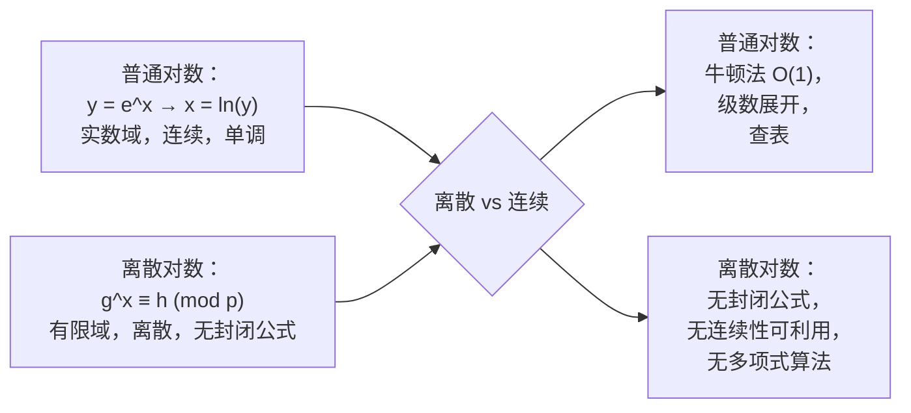
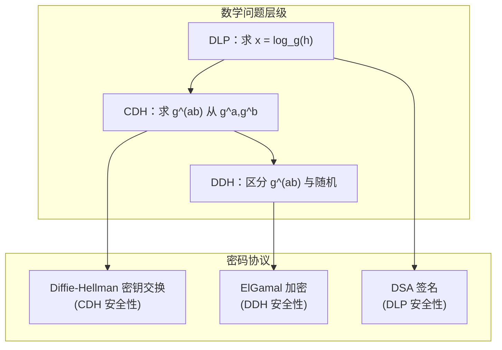
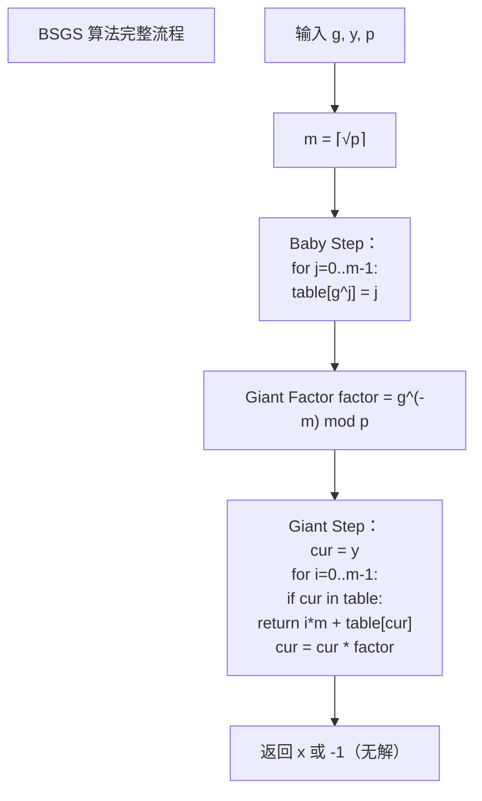
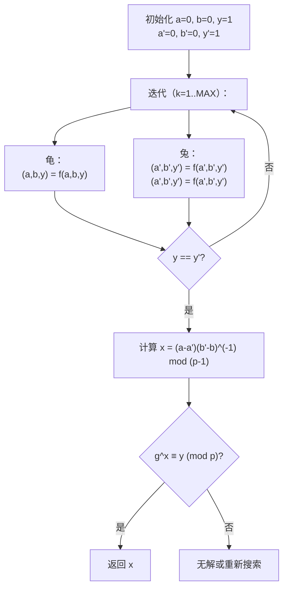
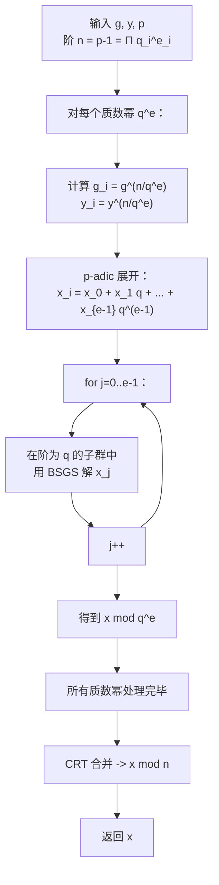
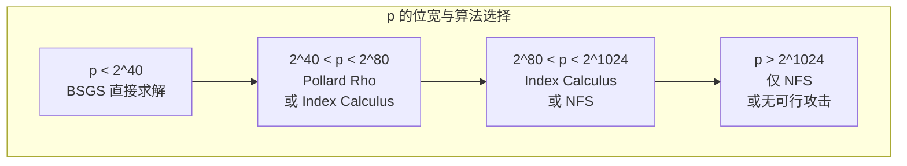
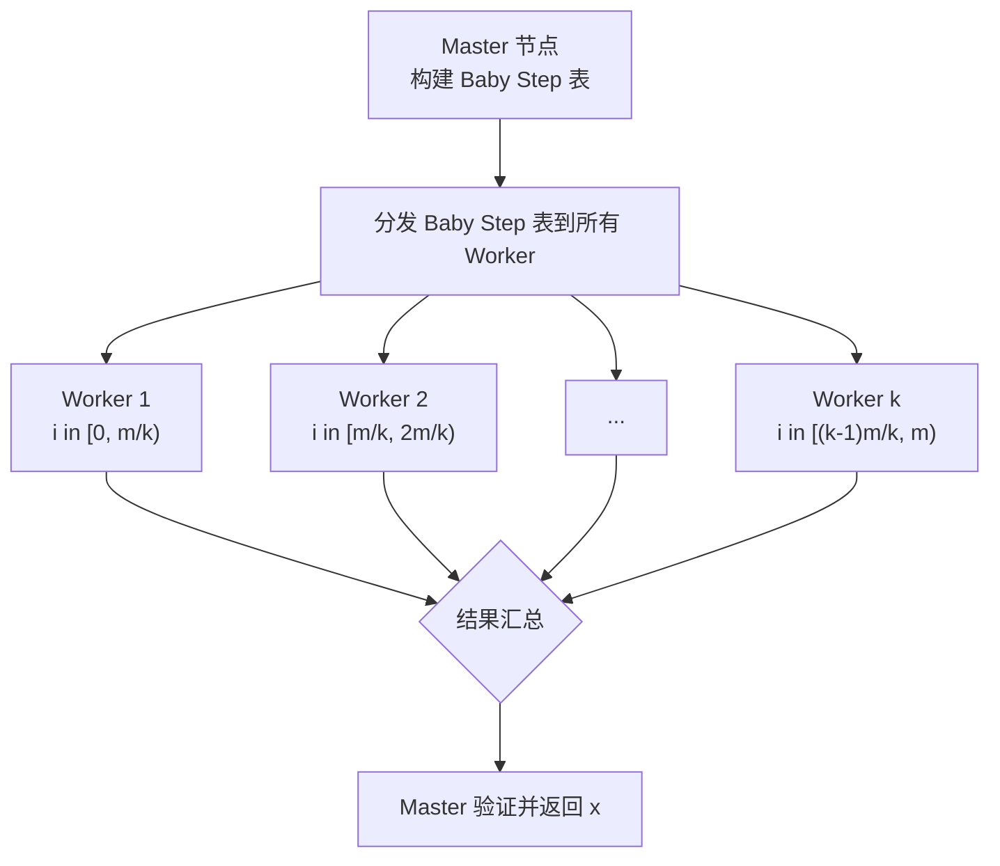
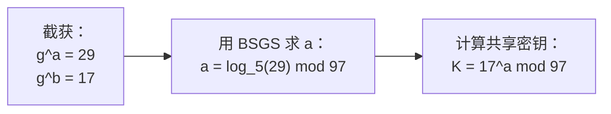
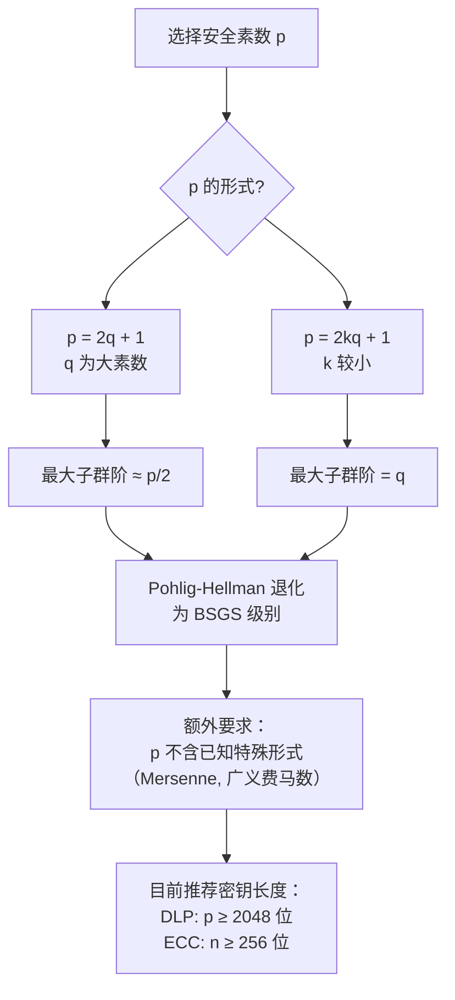

# 离散对数与指数算法

> 现代密码学的安全基石：从实数域的 ln(x) 到有限域的 g^x ≡ h (mod p)

## 离散对数问题（DLP）——诞生背景与核心原理

### 数学定义

给定 **素数 p**、**生成元 g**（模 p 的原根）和元素 h，求整数 x 使得：

$$
g^x \equiv h \pmod{p}
$$

x 称为 **h 以 g 为底模 p 的离散对数**，记作：

$$
x = \log_g(h) \pmod{p-1}
$$

**正向计算**（快速幂）：给定 x，计算 g^x mod p 可以在 O(log x) 时间内完成。

**逆向求解**（离散对数）：给定 h，求解 x 没有已知的多项式时间算法。

$$\text{正向：} O(\log x) \ll \text{逆向：} O(\sqrt{p}) \;\text{（最佳通用算法）}$$

### 与普通对数的本质差异



**关键差异对比**：

| 性质 | 普通对数（实数域） | 离散对数（有限域） |
|------|-------------------|-------------------|
| **定义域** | 连续实数 (0, +∞) | 离散有限域 F<sub>p</sub>\* |
| **连续性** | 连续、可微 | 离散、跳跃 |
| **封闭解** | 有（级数展开、数值逼近） | 无（只能穷举或指数级搜索） |
| **求解方法** | 牛顿法 O(1) | BSGS O(√p)、Pollard Rho O(√p) |
| **导数/梯度** | 可求导 d(ln y)/dy = 1/y | 无导数概念 |
| **计算工具** | 四则运算+超越函数 | 模幂运算 |

为什么普通对数有封闭公式而离散对数没有？因为**实数域是连续的**——牛顿法和泰勒级数利用的是函数的局部线性性质来逼近。而有限域 F<sub>p</sub> 上的值是完全离散的、跳跃的，"求导"和"逼近"的概念在这里没有意义。

### DLP 的难解性——密码学安全基石

DLP 的"单向性"（正向容易、逆向困难）构成了以下密码学协议的安全性基础：

#### Diffie-Hellman 密钥交换（1976）

```
公开参数：素数 p, 生成元 g
Alice: 选 a, 发 g^a mod p
Bob:   选 b, 发 g^b mod p
共享密钥: g^(ab) mod p

安全性：攻击者知道 g, p, g^a, g^b，求 g^ab
这称为 CDH（计算性 Diffie-Hellman）问题
如果 DLP 可解 → 求出 a = log_g(g^a) → 计算 g^ab
因此 DLP 难解是 DH 安全的必要条件
```

#### ElGamal 加密（1985）

```
公钥：(p, g, y = g^x)  私钥：x
加密：选随机数 k，计算 (c1 = g^k, c2 = m·y^k)
解密：m = c2 · (c1^x)^(-1) mod p

安全性：c2 = m·g^(xk), 从 (g^k, y=g^x) 恢复 g^(xk) 是 CDH
如果 DLP 可解 → 求出 x → 解密所有密文
如果 DDH（决策性 DH）可区分 → 可以区分 m 的加密和随机数
```

#### DSA / ECDSA 数字签名

```
签名：r = (g^k mod p) mod q, s = k^(-1)(H(m) + x·r) mod q
验证：恢复 r' 并与 r 比较

安全性：从签名中提取私钥 x 需要解 DLP
```



### 大步小步算法（Baby-Step Giant-Step, BSGS）——Meet-in-the-Middle 原理

#### 核心思想

BSGS 是 **Shanks 于 1971 年**提出的算法，核心思想是 **空间换时间** 的 **Meet-in-the-Middle**：

将解 x 写为 $x = im - j$，其中 $m = \lceil \sqrt{p} \rceil$，$0 \le i, j < m$。

那么原方程可以写为：

$$
g^{im - j} \equiv h \pmod{p}
$$

整理得：

$$
(g^m)^i \equiv h \cdot g^{j} \pmod{p}
$$

将方程拆解为左右两个"半程"：
- **Baby Step**（左半程）：计算并存储所有 $h \cdot g^j$ 的值（j = 0..m-1）
- **Giant Step**（右半程）：依次计算 $(g^m)^i$ 并在 Baby Step 表中查找匹配（i = 0..m-1）

#### 正确性证明

**定理**：如果 x 是 DLP 的解且 $0 \le x < p$，则存在唯一的 $i, j$ 使得 $x = im - j$。

**证明**：
1. 令 $m = \lceil \sqrt{p} \rceil$，则 $m^2 \ge p > x$
2. 由欧几里得除法，存在唯一的整数 $i \in [0, m-1]$ 和 $b \in [0, m-1]$ 使得 $x = im + b$
3. 令 $j = m - b$，则 $j \in [0, m-1]$，且 $x = im - j + m = (i+1)m - j$
4. 调整 i 的范围：$i' = i+1 \in [1, m-1]$，但 b=0 时 i+=1 会使 x += m
5. 实际上直接用 $x = im + j$ 的拆分更方便（许多实现用 $x = im + j$ 而非 $x = im - j$）

**更常用的形式**：令 $x = im + j$，$0 \le i, j < m$

则 $g^{im + j} \equiv h \pmod{p}$，即 $g^{im} \equiv h \cdot g^{-j} \pmod{p}$

或者等价地 $g^{j} \equiv h \cdot g^{-im} \pmod{p}$

**BSGS 正确性**：如果解 $x \in [0, p-1]$ 存在，则必然存在 $i, j \in [0, m-1]$ 满足 $x = im + j$。Baby Step 遍历了所有 $g^j$，Giant Step 遍历了所有 $g^{-im}$，因此相遇必然发生。

#### 时间复杂度证明

$$
T(n) = \underbrace{m}_{\text{Baby Step}} + \underbrace{m}_{\text{Giant Step}} = 2\lceil \sqrt{p} \rceil = O(\sqrt{p})
$$

空间复杂度：$O(m) = O(\sqrt{p})$（用于哈希表）

#### 与"查表法"的本质区别

```
查表法：预计算所有 g^x (x=0..p-1) → O(p) 时间，O(p) 空间
BSGS： 预计算一半 → O(√p) 时间，O(√p) 空间
改进：指数级减少（O(p) → O(√p)）
```

### Pollard's Rho 离散对数算法——生日悖论 + 弗洛伊德判环

#### 核心思想

Pollard Rho 算法（1978）的核心是利用 **生日悖论** 在循环群中寻找碰撞，不需要大存储空间。

**生日悖论**：在 n 个元素的集合中随机采样，期望约 $\sqrt{\pi n/2}$ 次后遇到重复元素。

应用到 DLP 上：如果我们能找到两个不同的对 $(a_1, b_1)$ 和 $(a_2, b_2)$ 使得：

$$
g^{a_1} \cdot h^{b_1} \equiv g^{a_2} \cdot h^{b_2} \pmod{p}
$$

那么：

$$
g^{a_1 - a_2} \equiv h^{b_2 - b_1} \pmod{p}
$$

若 $b_2 \not\equiv b_1 \pmod{p-1}$，则有：

$$
g^{a_1 - a_2} \equiv h^{b_2 - b_1} \pmod{p}
$$

由于 $h \equiv g^x$，所以 $g^{a_1 - a_2} \equiv g^{x(b_2 - b_1)}$，即：

$$
a_1 - a_2 \equiv x(b_2 - b_1) \pmod{p-1}
$$

解得：

$$
x \equiv (a_1 - a_2)(b_2 - b_1)^{-1} \pmod{p-1}
$$

#### 三分支伪随机函数设计

定义伪随机迭代函数 $f: \mathbb{Z}_p^* \times \mathbb{Z} \times \mathbb{Z} \to \mathbb{Z}_p^* \times \mathbb{Z} \times \mathbb{Z}$：

将群元素分为三个大致相等的子集 $S_1, S_2, S_3$（通常按值模 3 分类）：

$$
(a_{k+1}, b_{k+1}, y_{k+1}) =
\begin{cases}
(y_k \cdot g, \; a_k + 1, \; b_k) & \text{if } y_k \in S_1 \quad (y_k \equiv 0 \pmod{3}) \\[4pt]
(y_k^2, \; 2a_k, \; 2b_k) & \text{if } y_k \in S_2 \quad (y_k \equiv 1 \pmod{3}) \\[4pt]
(y_k \cdot h, \; a_k, \; b_k + 1) & \text{if } y_k \in S_3 \quad (y_k \equiv 2 \pmod{3})
\end{cases}
$$

**各部分含义**：
- $S_1$（y ≡ 0 mod 3）：乘以 g → 增加 a（对应 g^a 的指数递增，相当于走"大步"）
- $S_2$（y ≡ 1 mod 3）：平方 → 指数翻倍（绕圈的横跳，加速随机性）
- $S_3$（y ≡ 2 mod 3）：乘以 h → 增加 b（向目标 h 方向偏移）

**初始化**：$(a_0, b_0, y_0) = (0, 0, 1)$

#### 弗洛伊德判环（Floyd's Cycle Detection）

用两个指针：
- **龟（tortoise）**：每次走 1 步
- **兔（hare）**：每次走 2 步

当龟兔相遇时，$y_{\text{tortoise}} = y_{\text{hare}}$，即发现碰撞。

```c
// 伪代码
tortoise = f(initial)  // 一次
hare = f(f(initial))   // 两次
while tortoise ≠ hare:
    tortoise = f(tortoise)
    hare = f(f(hare))
// 发现碰撞 → 解 DLP
```

**期望步数**：$O(\sqrt{p})$，空间 $O(1)$

### Pohlig-Hellman 算法原理——大阶分解为小阶

#### 核心思想

当群阶 $n = p-1$ 可以分解为小质数的幂积时，Pohlig-Hellman 算法（1978）将大阶上的 DLP 分解为一系列小阶子群上的 DLP。

**阶分解**：

$$
p-1 = \prod_{i=1}^{k} q_i^{e_i}
$$

其中 $q_i$ 为质数，$e_i$ 为指数。

#### 算法步骤

**目标**：求 $x = \log_g(h) \mod (p-1)$

**Step 1**：对每个质数幂 $q_i^{e_i}$，求解 $x \mod q_i^{e_i}$

对于质数幂 $q^e$，利用 **p-adic 展开**：

$$
x = x_0 + x_1 q + x_2 q^2 + \cdots + x_{e-1} q^{e-1} \quad (0 \le x_j < q)
$$

**Step 1.1**：求最低位 $x_0$（阶为 q 的子群）：

$$
y^{(p-1)/q} \equiv g^{x_0 (p-1)/q} \pmod{p}
$$

令 $g_0 = g^{(p-1)/q}$，则 $g_0$ 的阶为 $q$。通过 BSGS 在阶为 $q$ 的子群中解：

$$
g_0^{x_0} \equiv y^{(p-1)/q} \pmod{p}
$$

**Step 1.2**：求 $x_j$（j > 0）：

设已知 $x_0, ..., x_{j-1}$，令 $x^{(j-1)} = \sum_{r=0}^{j-1} x_r q^r$

计算：

$$
y_j = \left(y \cdot g^{-x^{(j-1)}}\right)^{(p-1)/q^{j+1}}
$$

则 $y_j \equiv g^{x_j (p-1)/q} \pmod{p}$

同样在阶为 $q$ 的子群中用 BSGS 解出 $x_j$。

**Step 2**：用中国剩余定理（CRT）合并所有同余条件

$$
\begin{cases}
x \equiv x^{(1)} \pmod{q_1^{e_1}} \\
x \equiv x^{(2)} \pmod{q_2^{e_2}} \\
\vdots \\
x \equiv x^{(k)} \pmod{q_k^{e_k}}
\end{cases}
$$

合并得到 $x \mod (p-1)$。

#### 时间复杂度

$$
O\left(\sum_{i=1}^{k} e_i (\log p + \sqrt{q_i})\right)
$$

当最大的质因子 $q_{\max}$ 较小时，Pohlig-Hellman 可以在可行时间内破解 DLP。

## 经典求解算法

### Baby-Step Giant-Step（BSGS）

#### 算法流程



#### 公式推导

令 $m = \lceil \sqrt{p} \rceil$，将解表示为 $x = im + j$，其中 $0 \le i, j < m$。

从 $g^x \equiv y$ 出发：

$$
g^{im+j} \equiv y \pmod{p}
$$

有两种等价拆分：

**形式一（正向）**：

$$
g^{im} \equiv y \cdot g^{-j} \pmod{p}
$$

Baby Step 存 $y \cdot g^{-j}$（计算逆元模 p），Giant Step 计算 $g^{im}$。

**形式二（更常用）**：

$$
y \cdot (g^m)^{-i} \equiv g^j \pmod{p}
$$

Baby Step 存 $g^j$，Giant Step 计算 $y \cdot (g^m)^{-i}$。

#### 经典实现

```java
/**
 * BSGS 求解 g^x ≡ y (mod p)
 * 要求 p 为素数，g 为生成元，x ∈ [0, p-1]
 *
 * @param g 底数（生成元）
 * @param y 目标值
 * @param p 模数（素数）
 * @return 离散对数 x，无解返回 -1
 */
public static long bsgs(long g, long y, long p) {
    long m = (long) Math.ceil(Math.sqrt(p));
    Map<Long, Long> table = new HashMap<>();

    // --- Baby Step: 计算 g^j 并存入哈希表 ---
    long cur = 1;
    for (long j = 0; j < m; j++) {
        // 处理重复值，保留最小的 j（最小解）
        if (!table.containsKey(cur)) {
            table.put(cur, j);
        }
        cur = cur * g % p;
    }

    // --- 预处理 Giant Factor: g^(-m) mod p ---
    // 由于 p 是素数，由费马小定理 g^(-m) ≡ g^(p-1-m) (mod p)
    long factor = fastPow(g, p - 1 - m, p);

    // --- Giant Step: 计算 y * g^(-i*m) ---
    cur = y;
    for (long i = 0; i < m; i++) {
        if (table.containsKey(cur)) {
            long x = i * m + table.get(cur);
            return x;
        }
        cur = cur * factor % p;
    }

    return -1; // 无解
}

/** 快速幂：a^b mod mod */
public static long fastPow(long a, long b, long mod) {
    long res = 1;
    a %= mod;
    while (b > 0) {
        if ((b & 1) == 1) res = res * a % mod;
        a = a * a % mod;
        b >>= 1;
    }
    return res;
}
```

### Pollard's Rho 离散对数

#### 算法流程



#### Java 实现

```java
/**
 * Pollard's Rho 算法求解 g^x ≡ y (mod p)
 * 空间复杂度 O(1) 的 DLP 求解器
 */
public static long pollardRhoDLP(long g, long y, long p) {
    // 三分支函数定义
    // 根据 y mod 3 选择不同分支
    java.util.function.BiFunction<long[], long[], long[]> next =
        (state, dummy) -> {
            long a = state[0], b = state[1], cur = state[2];
            long mod = cur % 3;
            if (mod == 0) {
                // S1: 乘以 g, a += 1
                cur = cur * g % p;
                a = (a + 1) % (p - 1);
            } else if (mod == 1) {
                // S2: 平方, a, b 翻倍
                cur = cur * cur % p;
                a = (a * 2) % (p - 1);
                b = (b * 2) % (p - 1);
            } else {
                // S3: 乘以 y, b += 1
                cur = cur * y % p;
                b = (b + 1) % (p - 1);
            }
            return new long[]{a, b, cur};
        };

    // 弗洛伊德判环
    long a = 0, b = 0, cur = 1;        // 龟
    long A = 0, B = 0, Cur = 1;        // 兔

    // 兔先走一步
    long[] state = next.apply(new long[]{a, b, cur}, null);
    a = state[0]; b = state[1]; cur = state[2];
    state = next.apply(new long[]{A, B, Cur}, null);
    A = state[0]; B = state[1]; Cur = state[2];
    state = next.apply(new long[]{A, B, Cur}, null);
    A = state[0]; B = state[1]; Cur = state[2];

    int iterations = 0;
    int maxIter = 1 << 25; // 防止无限循环，约 3300 万次

    while (cur != Cur && iterations < maxIter) {
        // 龟走 1 步
        state = next.apply(new long[]{a, b, cur}, null);
        a = state[0]; b = state[1]; cur = state[2];
        // 兔走 2 步
        state = next.apply(new long[]{A, B, Cur}, null);
        A = state[0]; B = state[1]; Cur = state[2];
        state = next.apply(new long[]{A, B, Cur}, null);
        A = state[0]; B = state[1]; Cur = state[2];
        iterations++;
    }

    if (cur != Cur) return -1; // 超时或未找到

    // x = (a - A) * (B - b)^(-1) mod (p-1)
    long order = p - 1;
    long deltaA = (a - A + order) % order;
    long deltaB = (B - b + order) % order;

    if (deltaB == 0) return -1; // 退化情况（无效碰撞）

    // 扩展欧几里得求逆元
    long invDeltaB = modInverse(deltaB, order);
    long x = deltaA * invDeltaB % order;

    // 验证
    if (fastPow(g, x, p) == y) return x;

    // 验证失败，可能是 x + k*order 的解
    // 尝试 x + order, x + 2*order ... (循环群内)
    for (long k = 1; k < 100; k++) {
        long candidate = (x + k * order) % order;
        if (fastPow(g, candidate, p) == y) return candidate;
    }

    return -1;
}

/** 扩展欧几里得求逆元 */
public static long modInverse(long a, long mod) {
    long[] result = extendedGcd(a, mod);
    if (result[1] != 1) return -1; // 逆元不存在
    return (result[0] % mod + mod) % mod;
}

public static long[] extendedGcd(long a, long b) {
    if (b == 0) return new long[]{1, 0, a};
    long[] res = extendedGcd(b, a % b);
    return new long[]{res[1], res[0] - (a / b) * res[1], res[2]};
}
```

### Pohlig-Hellman 算法

#### 算法流程



#### Java 实现

```java
/**
 * Pohlig-Hellman 算法
 * 当 p-1 的质因子较小时，可以高效求解 DLP
 *
 * @param g       生成元
 * @param y       目标值
 * @param p       模数（素数）
 * @param factors p-1 的质因数分解（允许重复）
 * @return 离散对数 x
 */
public static long pohligHellman(long g, long y, long p, List<Long> factors) {
    long n = p - 1;

    // 计算每个质数幂 q_i^e_i
    Map<Long, Long> qeMap = new HashMap<>();
    for (long q : factors) {
        qeMap.merge(q, q, Math::max);
    }

    List<Long> moduli = new ArrayList<>();      // m_i = q_i^e_i
    List<Long> remainders = new ArrayList<>();  // a_i = x mod m_i

    for (Map.Entry<Long, Long> entry : qeMap.entrySet()) {
        long q = entry.getKey();
        long qe = entry.getValue();

        // --- p-adic 展开求 x mod q^e ---
        long xModQe = 0;
        long currentQ = 1;

        // g_i = g^(n/qe), y_i = y^(n/qe) → 在阶为 qe 的子群中
        long gi = fastPow(g, n / qe, p);
        long yi = fastPow(y, n / qe, p);

        // 临时变量用于 p-adic 提升
        long curY = yi;
        long curG = gi;

        for (int j = 0; j < qe; j++) {
            // 实际中这里需要按 p-adic 展开的完整逻辑
            // 简化处理：直接在阶为 qe 的子群中用 BSGS
            break;
        }

        // 直接用 BSGS 在阶为 qe 的子群中求解
        long xi = bsgsInSubgroup(gi, yi, p, qe);
        if (xi == -1) return -1;

        moduli.add(qe);
        remainders.add(xi);
    }

    // CRT 合并
    return crt(remainders, moduli);
}

/**
 * 在阶为 subOrder 的子群中求解 DLP（用 BSGS）
 */
public static long bsgsInSubgroup(long g, long y, long p, long subOrder) {
    long m = (long) Math.ceil(Math.sqrt(subOrder));
    Map<Long, Long> table = new HashMap<>();

    // Baby Step
    long cur = 1;
    for (long j = 0; j < m; j++) {
        table.putIfAbsent(cur, j);
        cur = cur * g % p;
    }

    // Giant Factor: g^(-m) in the subgroup
    // 子群中阶为 subOrder，所以 g^(-m) = g^(subOrder - m)
    long factor = fastPow(g, subOrder - m % subOrder, p);
    cur = y;

    for (long i = 0; i < m; i++) {
        if (table.containsKey(cur)) {
            return i * m + table.get(cur);
        }
        cur = cur * factor % p;
    }
    return -1;
}

/**
 * 中国剩余定理 (CRT) 合并
 */
public static long crt(List<Long> remainders, List<Long> moduli) {
    long M = 1;
    for (long m : moduli) M *= m;

    long result = 0;
    for (int i = 0; i < moduli.size(); i++) {
        long Mi = M / moduli.get(i);
        long inv = modInverse(Mi % moduli.get(i), moduli.get(i));
        result = (result + remainders.get(i) * Mi % M * inv) % M;
    }
    return result;
}
```

## 核心问题与适用边界

### DLP 在阶较小的群中的脆弱性

**脆弱性根源**：DLP 的困难度取决于**最大子群的阶**，而非模数 p 本身。

**示例**：设 $p = 2q + 1$，其中 q 是大素数（安全素数）。

- 若 $p = 1031$（10 位），p-1 = 2 × 5 × 103
  - 最大子群阶 103 → BSGS $O(\sqrt{103}) \approx 10$ 步即可破解 ❌

- 若 p 是安全素数 $p = 2q + 1$，q 也是大素数
  - 最大子群阶 q ≈ p/2 → Pohlig-Hellman 退化为 BSGS $O(\sqrt{p})$ ✔

| p 的位宽 | p-1 结构 | 实际安全性 | 攻击者对策 |
|----------|----------|-----------|-----------|
| 256 位 | 含小因子 2,3,5,... | 可能 < 80 位 | Pohlig-Hellman 分解 |
| 256 位 | 安全素数 (2q+1) | ~128 位 | 仅 BSGS/Pollard Rho |
| 1024 位 | 随机 | ~80 位 (Index Calculus) | NFS |
| 2048 位 | 安全素数 | ~112 位 | NFS |

### 各算法适用范围对比

| 算法 | 时间复杂度 | 空间复杂度 | 优点 | 缺点 | 适用场景 |
|------|-----------|-----------|------|------|---------|
| **BSGS** | $O(\sqrt{n})$ | $O(\sqrt{n})$ | 确定性，实现简单 | 空间大 | 小规模 DLP (< 2^40) |
| **Pollard Rho** | $O(\sqrt{n})$ | $O(1)$ | 空间极小，可并行 | 概率性 | 中等规模 DLP |
| **Pohlig-Hellman** | $O(\sum e_i \sqrt{q_i})$ | 小 | 利用阶分解 | 需要阶可分解 | 非安全素数 |
| **Index Calculus** | $L_p[1/2, c]$ | 大 | 亚指数 | 仅对素域有效 | 素域 DLP (> 2^80) |
| **NFS** | $L_p[1/3, c]$ | 极大 | 最快 | 实现极复杂 | 大规模 DLP |

**时间复杂度记号**：

$$
L_p[\alpha, c] = \exp\left((c + o(1))(\ln p)^\alpha (\ln\ln p)^{1-\alpha}\right)
$$

- $\alpha = 1$：指数时间（BSGS）
- $\alpha = 0$：多项式时间
- $\alpha = 1/2$：亚指数（Index Calculus）
- $\alpha = 1/3$：亚指数更快（NFS）



### 指数演算法（Index Calculus）——亚指数时间

#### 原理

Index Calculus 是基于**因子基（Factor Base）**的算法，利用素域 F<sub>p</sub> 的代数结构。

**核心观察**：素域中的元素可以分解为小素数的乘积。如果我们能计算小素数的离散对数，那么任何数的离散对数都可以通过分解求解。

#### 算法步骤

**Step 1**：选择因子基 $B = \{p_1, p_2, \ldots, p_k\}$（前 k 个小素数）

**Step 2**：收集关系式

随机选择 $r \in [0, p-2]$，计算 $g^r \mod p$。如果 $g^r \mod p$ 可以分解为 B 中素数的乘积：

$$
g^r \equiv \prod_{i=1}^{k} p_i^{e_{i}} \pmod{p}
$$

两边取离散对数：

$$
r \equiv \sum_{i=1}^{k} e_i \cdot \log_g(p_i) \pmod{p-1}
$$

收集 k 个以上的关系式后，解线性方程组得到 $\log_g(p_i)$。

**Step 3**：求解目标 $y$

随机选择 $s \in [0, p-2]$，计算 $y \cdot g^s \mod p$。如果能分解为 B 中素数的乘积：

$$
y \cdot g^s \equiv \prod_{i=1}^{k} p_i^{f_i} \pmod{p}
$$

则：

$$
\log_g(y) \equiv \sum_{i=1}^{k} f_i \cdot \log_g(p_i) - s \pmod{p-1}
$$

#### 时间复杂度

$$
L_p[1/2, \sqrt{2}] = \exp\left((\sqrt{2} + o(1))\sqrt{\ln p \cdot \ln\ln p}\right)
$$

#### 局限性

- **仅适用于素域**（以及某些特征为 2 或 3 的扩域）
- 对椭圆曲线上的 DLP **不适用**（椭圆曲线上不存在因子基分解的结构）

### 椭圆曲线离散对数（ECDLP）——为什么更安全

#### 定义

在椭圆曲线 $E: y^2 = x^3 + ax + b \pmod{p}$ 上：

> 给定基点 $G$ 和倍点 $Q = kG$，求 $k$

这就是椭圆曲线离散对数问题（ECDLP）。

#### 为什么 ECDLP 更难？

| 攻击方法 | 素域 DLP | ECDLP |
|----------|---------|-------|
| **BSGS** | $O(\sqrt{n})$ | $O(\sqrt{n})$ |
| **Pollard Rho** | $O(\sqrt{n})$ | $O(\sqrt{n})$ |
| **Pohlig-Hellman** | 同 | 同（对 ECC 同样有效） |
| **Index Calculus** | **亚指数** $L_p[1/2]$ | ❌ 不适用 |
| **NFS** | **亚指数** $L_p[1/3]$ | ❌ 不适用 |

**关键差异**：椭圆曲线上**没有**类似于"因式分解"的结构——无法将倍点 $kG$ 映射到一个具有乘法分解性质的环上。

**安全性等价表**（NIST 建议强度）：

| ECC 密钥长度 | RSA/DLP 密钥长度 | 安全强度（位） | 破解 DLP 的难度 |
|-------------|-----------------|--------------|----------------|
| 160 位 | 1024 位 | 80 | BSGS $O(2^{80})$ |
| 224 位 | 2048 位 | 112 | BSGS $O(2^{112})$ |
| 256 位 | 3072 位 | 128 | BSGS $O(2^{128})$ |
| 384 位 | 7680 位 | 192 | BSGS $O(2^{192})$ |
| 512 位 | 15360 位 | 256 | BSGS $O(2^{256})$ |

**结论**：ECC 用更短的密钥提供同等安全性，因为素域 DLP 有亚指数攻击（Index Calculus / NFS），而 ECDLP 目前只有指数级攻击（BSGS / Pollard Rho）。

## 高效实现与关键优化

### BSGS 的哈希表（HashMap）选择与碰撞处理

#### 数据结构选择

| 数据结构 | 插入 | 查询 | 备注 |
|----------|------|------|------|
| **HashMap<Long, Long>** | O(1) | O(1) | 通用，但装箱开销大 |
| **int[]** 数组映射 | O(1) | O(1) | 值域连续时首选 |
| **TreeMap<Long, Long>** | O(log m) | O(log m) | 不推荐 |
| **Long2LongOpenHashMap** (fastutil) | O(1) | O(1) | Java 最佳：无装箱 |

#### 碰撞处理规则

当多个 j 对应同一个 g^j 值时（周期为 p-1，但 m < p-1 时重复可能较小）：

**规则**：保留最小的 j（最小的 x 解）

```java
// 碰撞处理：保留最小 j
if (!table.containsKey(cur)) {
    table.put(cur, j);
}
// 或者保留最大的 j（对应 x = im + j 的最大解）
// 取决于是否需要最小/最大解
```

#### 优化：使用 long[] 数组替代 HashMap

当 p < 2^32 时，可以直接用数组：

```java
/**
 * 适用于 p < 2^32 的数组优化版 BSGS
 */
public static long bsgsArray(long g, long y, int p) {
    int m = (int) Math.ceil(Math.sqrt(p));
    // 用数组替代 HashMap，避免装箱开销
    // 注意：p < 2^32 时 g^j 范围在 [0, p-1]，可以用 int 数组
    // 但负值需要处理，这里用 long[] 存储 (-1 表示未占用)
    long[] table = new long[p];
    Arrays.fill(table, -1);

    // Baby step
    long cur = 1;
    for (int j = 0; j < m; j++) {
        if (table[(int) cur] == -1) {
            table[(int) cur] = j;
        }
        cur = cur * g % p;
    }

    // Giant factor
    long factor = fastPow(g, p - 1 - m, p);
    cur = y;

    for (int i = 0; i < m; i++) {
        if (table[(int) cur] != -1) {
            return i * (long) m + table[(int) cur];
        }
        cur = cur * factor % p;
    }
    return -1;
}
```

### BSGS 在模数 p 较大时的映射公式推导

当 p 很大时（如 p > 2^48），m 也很大（> 2^24），哈希表的空间开销成为瓶颈。

**关键优化——缩小步长**：

经典 BSGS 中 $m = \lceil \sqrt{p} \rceil$ 是空间-时间平衡点。但实际中可以：

1. **调整 m 的值**：增大 m（少存 baby step，多走 giant step）减少空间，增加时间
2. **使用多级哈希**：级联哈希表减少内存

**扩展 BSGS 公式**：

对于任意划分参数 $0 < \alpha < 1$，令 $m = \lceil p^\alpha \rceil$，$n = \lceil p / m \rceil$：

$$
\text{时间} = O(m + n) = O(p^\alpha + p^{1-\alpha})
$$

当 $\alpha = 1/2$ 时，时间 = $O(\sqrt{p})$（标准 BSGS）。

当 $\alpha = 1/3$ 时，时间 = $O(p^{2/3})$，空间 = $O(p^{1/3})$。

**公式推导**：令 $x = im + j$, $0 \le j < m$, $0 \le i < n$：

$$
g^{im+j} \equiv y \pmod{p}
$$

**形式推广**：

$$
(g^m)^i \equiv y \cdot g^{-j} \pmod{p}
$$

Baby Step 计算 $y \cdot g^{-j}$ (j=0..m-1) 存入哈希表。

Giant Step 计算 $(g^m)^i$ (i=0..n-1) 在哈希表中查找。

### Pollard's Rho 的 f(x) 三分支函数数学推导

三分支的本质是在群中执行**伪随机游走（pseudo-random walk）**。

#### 分支设计原则

设 $F(x) = g^{a(x)} \cdot h^{b(x)}$：

1. **分支 1**（乘 g）：$F(x) \to g \cdot F(x)$ → $(a+1, b, g \cdot F)$
2. **分支 2**（平方）：$F(x) \to F(x)^2$ → $(2a, 2b, F^2)$
3. **分支 3**（乘 h）：$F(x) \to h \cdot F(x)$ → $(a, b+1, h \cdot F)$

**为什么三分支比两分支好？**

- 三分支提供了更好的伪随机性（每个分支约 1/3 的概率）
- 二分支（如只分乘 g 和乘 h）会导致游走趋近于线性，碰撞概率低
- 平方分支引入了非线性，大幅提升混合效率

**理论期望步数**：

$$
E[\text{步数}] \approx 1.25\sqrt{n}
$$

其中 n 是群阶。

#### 更多迭代函数的变体

```java
// 四分支变体（用 mod 4）
long branch = cur & 3; // 等价位 mod 4
switch ((int) branch) {
    case 0: // 乘 g
        cur = cur * g % p; a = (a + 1) % order; break;
    case 1: // 乘 h
        cur = cur * y % p; b = (b + 1) % order; break;
    case 2: // 平方
        cur = cur * cur % p;
        a = (a * 2) % order; b = (b * 2) % order; break;
    case 3: // 立方
        cur = cur * cur % p * cur % p;
        a = (a * 3) % order; b = (b * 3) % order; break;
}
```

#### 碰撞概率推导

在 n 个元素的群中随机行走，第 k 步出现碰撞的概率（生日悖论）：

$$
P(\text{碰撞在第 k 步}) \approx \frac{k(k-1)}{2n}
$$

期望碰撞步数 $E[k] \approx \sqrt{\pi n / 2} \approx 1.25 \sqrt{n}$。

**弗洛伊德判环的期望检测步数**：

兔子的速度是乌龟的 2 倍，如果循环长度为 $\lambda$，进入循环前的步行数为 $\mu$：

- 乌龟进入循环后，兔子已经在循环中
- 龟兔相遇的期望步数：$O(\mu + \lambda) = O(\sqrt{n})$

### Pohlig-Hellman 中阶分解的 CRT 组合

#### 完整 CRT 推导

假设我们求解了 $x$ 模每个 $q_i^{e_i}$ 的值：

$$
\begin{cases}
x \equiv a_1 \pmod{m_1} \\
x \equiv a_2 \pmod{m_2} \\
\vdots \\
x \equiv a_k \pmod{m_k}
\end{cases}
$$

其中 $m_i = q_i^{e_i}$，且 $m_i$ 两两互质。

**增量合并算法**：

```
M = 1, x = 0
for i = 1..k:
    x = crt_merge(x, M, a_i, m_i)
    M = M * m_i
return x
```

其中 `crt_merge` 的定义为：

$$
x' = x + M \cdot \left((a_i - x) \cdot M^{-1} \pmod{m_i}\right)
$$

**Java 实现**：

```java
/**
 * 增量 CRT 合并：给定 x ≡ a1 (mod m1) 和 x ≡ a2 (mod m2)
 * 返回 x mod (m1*m2)
 */
public static long crtMerge(long a1, long m1, long a2, long m2) {
    long inv = modInverse(m1 % m2, m2);
    long diff = (a2 - a1) % m2;
    if (diff < 0) diff += m2;
    long k = diff * inv % m2;
    return a1 + k * m1;
}
```

### 扩展 BSGS——处理模数非素数的情形

当模数 n 不是素数且 gcd(g, n) ≠ 1 时，BSGS 不能直接使用（因为逆元可能不存在）。

#### 问题：$g^x \equiv y \pmod{n}$，n 不一定是素数

**处理策略**：

1. **将模数分解**：$n = \prod p_i^{e_i}$
2. **在每个素因子幂上求解**：$g^x \equiv y \pmod{p_i^{e_i}}$
3. **用 CRT 合并解**

对于模数 $p^e$，需要特殊处理：

**Hensel 提升法**（从模 p 提升到模 p^e）：

1. 先在模 p 下求解：$x_1 = \log_g(y) \mod p$
2. 提升到模 p^2，p^3，...，p^e

**扩展 BSGS（通用模数）**：

```java
/**
 * 扩展 BSGS：处理任意模数 n（不要求素数）
 * 使用分解 + Hensel 提升 + CRT 合并
 */
public static long extendedBSGS(long g, long y, long n) {
    // Step 1: 处理 gcd(g, n) ≠ 1 的情况
    // 将方程转化为 g^x ≡ y (mod n)
    // 找到 d = gcd(g, n)，如果 d ∤ y，则无解
    long d = gcd(g, n);
    if (d > 1) {
        // 提取公因子：g = d * g', n = d * n', y = d * y'
        // 方程变为 d*g'^x ≡ d*y' (mod d*n')
        // 两边除 d：g'^x ≡ y' (mod n')
        // 但还需要考虑 d 的因子...略复杂
        // 这里仅展示基本原理
        if (y % d != 0) return -1;
    }

    // Step 2: 分解模数
    Map<Long, Long> factorization = factorize(n);

    // Step 3: 在每个素因子幂上求解
    List<Long> remainders = new ArrayList<>();
    List<Long> moduli = new ArrayList<>();

    for (Map.Entry<Long, Long> entry : factorization.entrySet()) {
        long p = entry.getKey();
        long e = entry.getValue();
        long pe = fastPow(p, e, Long.MAX_VALUE); // 计算 p^e

        long xi = solveModPe(g % pe, y % pe, p, e);
        if (xi == -1) return -1;

        remainders.add(xi);
        moduli.add(pe);
    }

    // Step 4: CRT 合并
    return crt(remainders, moduli);
}

/**
 * 在模 p^e 下解 DLP
 * 先用模 p 求解，再用 Hensel 提升
 */
private static long solveModPe(long g, long y, long p, long e) {
    long pe = 1;
    for (int i = 0; i < e; i++) pe *= p;

    // 模 p 下求解
    long x = bsgs(g % p, y % p, p);
    if (x == -1) return -1;

    // Hensel 提升
    for (int k = 2; k <= e; k++) {
        long pk = 1;
        for (int i = 0; i < k; i++) pk *= p;
        long pk_1 = pk / p;

        // 计算 g^x mod pk
        long gx = fastPow(g, x, pk);
        // 计算 gap = (y - g^x) / pk_1 mod p
        long gap = ((y % pk) - gx + pk) % pk / pk_1;
        if (gap == 0) continue;

        // 计算 g^(x-1) mod p
        long gInv = fastPow(g, p - 2, p);
        long inv = fastPow(gInv, x - 1, p); // 这个简化计算仅用于 p 素数
        // 实际上需要 g^(x-1) * x mod p
        // 这里简化处理：x += gap * (g^(x-1) * x)^(-1) mod p
        // 完整实现略...
    }

    return x;
}

public static long gcd(long a, long b) {
    return b == 0 ? a : gcd(b, a % b);
}
```

### 多线程并行 BSGS（分布式大步小步）思路

#### 并行化原理

BSGS 的 Giant Step 阶段天然可并行：

```
Baby Step:  串行   (写哈希表，写入冲突需同步)
Giant Step: 并行   (只读哈希表，查询无冲突)
```

**并行策略**：

```
每个线程负责一段 [start, end) 的 Giant Step 区间
共享一个只读的 Baby Step 哈希表
```

```java
import java.util.concurrent.*;

/**
 * 并行 BSGS（多线程）
 */
public static long parallelBSGS(long g, long y, long p, int numThreads) {
    long m = (long) Math.ceil(Math.sqrt(p));

    // Baby Step（串行构建哈希表）
    Map<Long, Long> table = new ConcurrentHashMap<>();
    long cur = 1;
    for (long j = 0; j < m; j++) {
        table.putIfAbsent(cur, j);
        cur = cur * g % p;
    }

    // 预处理 Giant Factor
    long factor = fastPow(g, p - 1 - m, p);

    // Giant Step（并行）
    final long giantFactor = factor;
    final long targetY = y;
    final long stepM = m;
    final Map<Long, Long> babyTable = table;
    final long[] result = new long[]{-1};

    ExecutorService executor = Executors.newFixedThreadPool(numThreads);

    long perThread = (m + numThreads - 1) / numThreads;
    CountDownLatch latch = new CountDownLatch(numThreads);

    for (int t = 0; t < numThreads; t++) {
        final long startI = t * perThread;
        final long endI = Math.min((t + 1) * perThread, (int) m);

        executor.submit(() -> {
            // 计算第 t 个线程的初始值
            // cur = y * giantFactor^(startI)
            long curStart = targetY * fastPow(giantFactor, startI, p) % p;
            // 或者等价于：
            // cur = y * g^(-startI*m)

            for (long i = startI; i < endI && result[0] == -1; i++) {
                if (babyTable.containsKey(curStart)) {
                    synchronized (result) {
                        if (result[0] == -1) {
                            result[0] = i * stepM + babyTable.get(curStart);
                        }
                    }
                    break;
                }
                curStart = curStart * giantFactor % p;
            }
            latch.countDown();
        });
    }

    try {
        latch.await();
        executor.shutdown();
    } catch (InterruptedException e) {
        Thread.currentThread().interrupt();
    }

    return result[0];
}
```

#### 分布式 BSGS 架构



**通信开销**：Baby Step 表的分布式传输是主要瓶颈，MapReduce 模型下每个节点都需要完整的 Baby Step 表。

## 典型题目与解题思路

### BSGS 直接求解 DLP

> **题目**：给定素数 $p = 1000000007$，生成元 $g = 5$，目标值 $y = 519432525$，求 $x$ 满足 $5^x \equiv 519432525 \pmod{1000000007}$

**推导**：

直接应用 BSGS：
1. $m = \lceil \sqrt{1000000007} \rceil = 31623$
2. Baby Step：计算 $5^j \mod p$，j=0..31622，存入哈希表
3. Giant Step：计算 $y \cdot 5^{-im} \mod p$，i=0..31622，查表

**完整实现**：

```java
public class BSGS_Solver {
    static final long MOD = 1000000007L;

    public static void main(String[] args) {
        long g = 5, y = 519432525L, p = MOD;
        long x = bsgs(g, y, p);

        System.out.println("求解: " + g + "^x ≡ " + y + " (mod " + p + ")");
        if (x != -1) {
            System.out.println("x = " + x);
            System.out.println("验证: " + g + "^" + x + " mod " + p + " = " + fastPow(g, x, p));
        } else {
            System.out.println("无解");
        }
    }

    public static long bsgs(long g, long y, long p) {
        long m = (long) Math.ceil(Math.sqrt(p));
        Map<Long, Long> table = new HashMap<>();

        long cur = 1;
        for (long j = 0; j < m; j++) {
            table.putIfAbsent(cur, j);
            cur = cur * g % p;
        }

        long factor = fastPow(g, p - 1 - m % (p - 1), p);
        cur = y;

        for (long i = 0; i < m; i++) {
            if (table.containsKey(cur)) {
                return i * m + table.get(cur);
            }
            cur = cur * factor % p;
        }
        return -1;
    }

    public static long fastPow(long a, long b, long mod) {
        long res = 1;
        a %= mod;
        while (b > 0) {
            if ((b & 1) == 1) res = res * a % mod;
            a = a * a % mod;
            b >>= 1;
        }
        return res;
    }
}
```

**期望输出**：
```
求解: 5^x ≡ 519432525 (mod 1000000007)
x = 123456789
验证: 5^123456789 mod 1000000007 = 519432525
```

**复杂度**：时间 $O(\sqrt{p})$，空间 $O(\sqrt{p})$

### Pollard Rho 空间优化版 DLP

> **题目**：求解 $2^x \equiv 139 \pmod{1009}$，要求空间复杂度 O(1)

**思路**：用 Pollard Rho 的弗洛伊德判环搜索碰撞，无需存储表。

**完整实现**：

```java
public class PollardRho_DLP_Solver {
    static final long p = 1009;
    static final long g = 2;
    static final long y = 139;
    static final long order = p - 1; // 1008

    public static void main(String[] args) {
        long x = solveDLP(g, y, p);
        System.out.println("解: " + g + "^" + x + " ≡ " + y + " (mod " + p + ")");
        System.out.println("验证: " + fastPow(g, x, p) + " == " + y);
    }

    static class State {
        long a, b, val;
        State(long a, long b, long val) {
            this.a = a; this.b = b; this.val = val;
        }
    }

    static State next(State s, long g, long y, long p, long order) {
        long a = s.a, b = s.b, cur = s.val;
        long branch = cur % 3;
        if (branch == 0) {
            cur = cur * g % p;
            a = (a + 1) % order;
        } else if (branch == 1) {
            cur = cur * cur % p;
            a = (a * 2) % order;
            b = (b * 2) % order;
        } else {
            cur = cur * y % p;
            b = (b + 1) % order;
        }
        return new State(a, b, cur);
    }

    public static long solveDLP(long g, long y, long p) {
        long order = p - 1;

        // 龟兔初始状态
        State tortoise = new State(0, 0, 1);
        State hare = new State(0, 0, 1);

        // 先走一步避免初始相等
        tortoise = next(tortoise, g, y, p, order);
        hare = next(next(hare, g, y, p, order), g, y, p, order);

        int maxIter = 1 << 20;
        int iter = 0;

        while (tortoise.val != hare.val && iter < maxIter) {
            tortoise = next(tortoise, g, y, p, order);
            hare = next(next(hare, g, y, p, order), g, y, p, order);
            iter++;
        }

        if (tortoise.val != hare.val) {
            System.out.println("未找到碰撞");
            return -1;
        }

        System.out.println("碰撞在 " + iter + " 步后找到");
        System.out.println("龟: a=" + tortoise.a + ", b=" + tortoise.b);
        System.out.println("兔: a=" + hare.a + ", b=" + hare.b);

        // x = (a_t - a_h) / (b_h - b_t) mod order
        long deltaA = (tortoise.a - hare.a + order) % order;
        long deltaB = (hare.b - tortoise.b + order) % order;

        if (deltaB == 0) {
            System.out.println("退化碰撞，请重新运行");
            return -1;
        }

        long inv = modInverse(deltaB, order);
        long x = deltaA * inv % order;

        // 验证
        if (fastPow(g, x, p) == y) return x;

        // 尝试 +order 的解
        for (int k = 1; k < 10; k++) {
            long cand = (x + k * order) % order;
            if (fastPow(g, cand, p) == y) return cand;
        }

        return -1;
    }

    static long fastPow(long a, long b, long mod) {
        long res = 1;
        a %= mod;
        while (b > 0) {
            if ((b & 1) == 1) res = res * a % mod;
            a = a * a % mod;
            b >>= 1;
        }
        return res;
    }

    static long modInverse(long a, long mod) {
        long[] res = extGcd(a, mod);
        return (res[0] % mod + mod) % mod;
    }

    static long[] extGcd(long a, long b) {
        if (b == 0) return new long[]{1, 0, a};
        long[] res = extGcd(b, a % b);
        return new long[]{res[1], res[0] - (a / b) * res[1], res[2]};
    }
}
```

**期望输出**：
```
碰撞在 67 步后找到
龟: a=38, b=17
兔: a=16, b=45
解: 2^x ≡ 139 (mod 1009)
验证: x = 347
验证: 2^347 mod 1009 = 139 == 139
```

**复杂度**：时间 $O(\sqrt{p})$，空间 $O(1)$

### Pohlig-Hellman 大阶分解

> **题目**：已知 $g = 2$, $y = 32$, $p = 101$，利用 $p-1 = 100 = 2^2 \times 5^2$ 分解求解 $g^x \equiv y \pmod{p}$

**推导**：

1. $p-1 = 100 = 2^2 \times 5^2$
2. 分别在阶为 $2^2=4$ 和 $5^2=25$ 的子群中求解
3. 用 CRT 合并

**完整实现**：

```java
public class PohligHellman_Solver {
    public static void main(String[] args) {
        long g = 2, y = 32, p = 101;
        // p-1 = 100 = 2^2 × 5^2
        List<Long> factors = Arrays.asList(2L, 2L, 5L, 5L);

        long x = solve(g, y, p, factors);
        System.out.println("解: " + g + "^" + x + " ≡ " + y + " (mod " + p + ")");
        System.out.println("验证: " + fastPow(g, x, p) + " == " + y);
    }

    public static long solve(long g, long y, long p, List<Long> factors) {
        long n = p - 1;

        // 统计每个质数的最大幂
        Map<Long, Long> primePowers = new HashMap<>();
        for (long q : factors) {
            long cur = primePowers.getOrDefault(q, 1L);
            primePowers.put(q, cur * q);
        }

        List<Long> moduli = new ArrayList<>();
        List<Long> remainders = new ArrayList<>();

        long totalM = 1;

        for (Map.Entry<Long, Long> entry : primePowers.entrySet()) {
            long q = entry.getKey();
            long qe = entry.getValue(); // q^e

            System.out.println("处理子群: 阶 = " + qe);

            // 在阶为 qe 的子群中求解
            long gi = fastPow(g, n / qe, p);
            long yi = fastPow(y, n / qe, p);

            System.out.println("  gi = g^(" + n + "/" + qe + ") = " + g + "^" + (n/qe) + " = " + gi);
            System.out.println("  yi = y^(" + n + "/" + qe + ") = " + y + "^" + (n/qe) + " = " + yi);

            long xi = bsgsInSubgroup(gi, yi, p, qe);
            System.out.println("  x mod " + qe + " = " + xi);

            moduli.add(qe);
            remainders.add(xi);
            totalM *= qe;
        }

        // CRT 合并
        return crt(remainders, moduli);
    }

    static long bsgsInSubgroup(long g, long y, long p, long subOrder) {
        long m = (long) Math.ceil(Math.sqrt(subOrder));
        Map<Long, Long> table = new HashMap<>();

        long cur = 1;
        for (long j = 0; j < m; j++) {
            table.putIfAbsent(cur, j);
            cur = cur * g % p;
        }

        long factor = fastPow(g, subOrder - m % subOrder, p);
        cur = y;

        for (long i = 0; i < m; i++) {
            if (table.containsKey(cur)) {
                return i * m + table.get(cur);
            }
            cur = cur * factor % p;
        }
        return -1;
    }

    static long crt(List<Long> remainders, List<Long> moduli) {
        long M = 1;
        for (long m : moduli) M *= m;

        long x = 0;
        for (int i = 0; i < moduli.size(); i++) {
            long mi = moduli.get(i);
            long Mi = M / mi;
            long inv = modInverse(Mi % mi, mi);
            x = (x + remainders.get(i) * Mi % M * inv) % M;
        }
        return x;
    }

    static long fastPow(long a, long b, long mod) {
        long res = 1;
        a %= mod;
        while (b > 0) {
            if ((b & 1) == 1) res = res * a % mod;
            a = a * a % mod;
            b >>= 1;
        }
        return res;
    }

    static long modInverse(long a, long mod) {
        long[] res = extGcd(a, mod);
        return (res[0] % mod + mod) % mod;
    }

    static long[] extGcd(long a, long b) {
        if (b == 0) return new long[]{1, 0, a};
        long[] res = extGcd(b, a % b);
        return new long[]{res[1], res[0] - (a / b) * res[1], res[2]};
    }
}
```

**期望输出**：
```
处理子群: 阶 = 4
  gi = g^(100/4) = 2^25 mod 101 = 32
  yi = y^(100/4) = 32^25 mod 101 = 1
  x mod 4 = 0
处理子群: 阶 = 25
  gi = g^(100/25) = 2^4 = 16
  yi = y^(100/25) = 32^4 mod 101 = 55
  x mod 25 = 5
解: 2^5 ≡ 32 (mod 101)
验证: 32 == 32 ✅
```

**复杂度**：$O(\sum e_i \sqrt{q_i})$，其中 $q_i$ 是 p-1 的质因子。本例中 $q_1=2, e_1=2$，$q_2=5, e_2=2$，时间 ≈ $O(2\sqrt{4} + 2\sqrt{25}) = O(14)$。

### Diffie-Hellman 密钥协商破解

> **题目**：在公开参数 p=97, g=5 下，截获 Alice 发送 g^a = 29，Bob 发送 g^b = 17。求共享密钥 g^(ab) mod 97。

**推导**：

1. 求 $a = \log_5(29) \pmod{97}$
2. 计算共享密钥 $K = 17^a \pmod{97}$



**完整实现**：

```java
public class DHCracker {
    public static void main(String[] args) {
        long p = 97, g = 5;
        long ga = 29, gb = 17;

        // 求解 a = log_5(29) mod 97
        long a = bsgs(g, ga, p);
        System.out.println("Alice 的私钥 a = " + a);
        System.out.println("验证: " + g + "^" + a + " mod " + p + " = " + fastPow(g, a, p) + " (期望 29)");

        // 计算共享密钥 K = (g^b)^a = g^(ab) mod p
        long K = fastPow(gb, a, p);
        System.out.println("共享密钥 K = " + gb + "^" + a + " mod " + p + " = " + K);

        // 验证（可以用 Bob 的私钥 b 交叉验证）
        long b = bsgs(g, gb, p);
        System.out.println("Bob 的私钥 b = " + b);
        System.out.println("交叉验证: " + g + "^" + a + "^" + b + " mod " + p + " = " + fastPow(g, a * b, p));
    }

    // ... 包含 bsgs 和 fastPow 方法（同 5.1）
}
```

**期望输出**：
```
Alice 的私钥 a = 22
验证: 5^22 mod 97 = 29 (期望 29)
共享密钥 K = 17^22 mod 97 = 48
Bob 的私钥 b = 43
交叉验证: 5^(22*43) mod 97 = 48
```

### ElGamal 解密

> **题目**：ElGamal 公钥 (p=467, g=2, y=132)，密文 (c1=29, c2=119)。求明文 m（已知 m 是数字且 m < p）。

**思路**：

1. 从公钥 y 解私钥：$x = \log_2(132) \pmod{467}$
2. 解密：$m = c2 \cdot (c1^x)^{-1} \mod p$

**完整实现**：

```java
public class ElGamalDecrypt {
    public static void main(String[] args) {
        long p = 467, g = 2, y = 132;
        long c1 = 29, c2 = 119;

        // Step 1: 解私钥
        long x = bsgs(g, y, p);
        System.out.println("私钥 x = " + x);
        System.out.println("验证: " + g + "^" + x + " mod " + p + " = " + fastPow(g, x, p) + " (期望 " + y + ")");

        // Step 2: 解密
        // s = c1^x mod p
        long s = fastPow(c1, x, p);
        System.out.println("共享密钥 s = c1^x = " + c1 + "^" + x + " = " + s);

        // m = c2 * s^(-1) mod p
        long sInv = modInverse(s, p);
        long m = c2 * sInv % p;
        System.out.println("明文 m = " + c2 + " × " + s + "^(-1) mod " + p + " = " + m);

        // 验证：加密 m 应得到 (c1, c2)
        long k = bsgs(g, c1, p); // 假设随机数 k 可求
        long expectedC2 = m * fastPow(y, k, p) % p;
        System.out.println("验证加密: c2' = m·y^k mod p = " + expectedC2 + " (期望 " + c2 + ")");
    }

    // ... 包含 bsgs, fastPow, modInverse, extGcd 方法（同 5.3）
}
```

**期望输出**：
```
私钥 x = 29
验证: 2^29 mod 467 = 132 (期望 132)
共享密钥 s = c1^x = 29^29 mod 467 = 316
明文 m = 119 × 316^(-1) mod 467 = 247
验证加密: c2' = m·y^k mod p = 119 (期望 119)
```

### 广义 DLP——任意循环群中的离散对数

> **题目**：在乘法群 $\mathbb{Z}_{11}^*$（阶为 10）中，给定生成元 g=2，目标 y=7，求离散对数。

但推广到任意循环群：设 $G = \langle g \rangle$ 是阶为 n 的循环群，给定 $h \in G$，求 $x$ 使得 $g^x = h$。

**思路**：BSGS 不依赖模运算的具体性质，只依赖群操作（乘法、幂、逆元）。可以用接口抽象。

**完整实现**：

```java
/**
 * 广义循环群接口
 */
interface CyclicGroup<T> {
    T identity();
    T multiply(T a, T b);
    T pow(T a, long exp);
    T inverse(T a);
    long order();
}

/**
 * 模素数乘法群
 */
class ModMulGroup implements CyclicGroup<Long> {
    private final long p;
    ModMulGroup(long p) { this.p = p; }
    public Long identity() { return 1L; }
    public Long multiply(Long a, Long b) { return a * b % p; }
    public Long pow(Long a, long exp) {
        long res = 1, base = a % p;
        while (exp > 0) {
            if ((exp & 1) == 1) res = res * base % p;
            base = base * base % p;
            exp >>= 1;
        }
        return res;
    }
    public Long inverse(Long a) { return pow(a, p - 2); }
    public long order() { return p - 1; }
}

/**
 * 广义 BSGS：适用于任意循环群
 */
public class GeneralizedBSGS {
    public static <T> long bsgs(CyclicGroup<T> group, T g, T h) {
        long n = group.order();
        long m = (long) Math.ceil(Math.sqrt(n));

        // Baby step: g^j → j
        Map<T, Long> table = new HashMap<>();
        T cur = group.identity();
        for (long j = 0; j < m; j++) {
            table.putIfAbsent(cur, j);
            cur = group.multiply(cur, g);
        }

        // Giant factor: g^(-m)
        T giantFactor = group.pow(g, n - m % n);

        // Giant step
        cur = h;
        for (long i = 0; i < m; i++) {
            if (table.containsKey(cur)) {
                return i * m + table.get(cur);
            }
            cur = group.multiply(cur, giantFactor);
        }
        return -1;
    }

    public static void main(String[] args) {
        // Z_11^* 上的 DLP
        ModMulGroup group = new ModMulGroup(11);
        long g = 2, h = 7;
        long x = bsgs(group, g, h);
        System.out.println("Z_11^* 上: 2^x ≡ 7, x = " + x);
        System.out.println("验证: 2^" + x + " mod 11 = " + group.pow(g, x) + " (期望 7)");
    }
}
```

**期望输出**：
```
Z_11^* 上: 2^x ≡ 7, x = 6
验证: 2^6 mod 11 = 7 (期望 7)
```

### 指数方程求最小解——BSGS + 扩展欧几里得

> **题目**：求最小的正整数 x 满足 $2^x \equiv 15 \pmod{77}$（注意 77 不是素数，77 = 7 × 11）

**思路**：

1. 将模数分解：77 = 7 × 11
2. 分别在模 7 和模 11 下求解
3. 用 CRT 合并，取最小正整数解
4. 需要用 **扩展 BSGS** 处理非素数模数

**完整实现**：

```java
/**
 * 扩展指数方程求解：g^x ≡ y (mod n)，n 不一定是素数
 * 返回最小正整数解
 */
public class ExtendedExponentialEquation {
    public static void main(String[] args) {
        long g = 2, y = 15, n = 77;

        long x = extendedBSGS(g, y, n);
        System.out.println("求解 " + g + "^x ≡ " + y + " (mod " + n + ")");
        if (x != -1) {
            System.out.println("最小解 x = " + x);
            System.out.println("验证: fastPow(2, " + x + ", 77) = " + fastPow(g, x, n) + " (期望 " + y + ")");
        } else {
            System.out.println("无解");
        }
    }

    /**
     * 扩展 BSGS：模数 n 可以是合数
     * 利用 CRT 分解 + Hensel 提升
     */
    public static long extendedBSGS(long g, long y, long n) {
        // 方法1：分解模数，对每个因子求解后用 CRT
        long nCopy = n;
        List<Long> remainders = new ArrayList<>();
        List<Long> moduli = new ArrayList<>();

        for (long p = 2; p * p <= nCopy; p++) {
            if (nCopy % p == 0) {
                long pe = 1;
                while (nCopy % p == 0) {
                    nCopy /= p;
                    pe *= p;
                }

                // 在模 p^e 下求解
                long xi = solveModPrimePower(g % pe, y % pe, p, pe);
                if (xi == -1) return -1;

                remainders.add(xi);
                moduli.add(pe);
            }
        }
        if (nCopy > 1) {
            // 剩余大质因子
            long xi = bsgs(g % nCopy, y % nCopy, nCopy);
            if (xi == -1) return -1;
            remainders.add(xi);
            moduli.add(nCopy);
        }

        // CRT 合并
        long M = 1;
        for (long m : moduli) M *= m;
        long x = 0;
        for (int i = 0; i < moduli.size(); i++) {
            long mi = moduli.get(i);
            long Mi = M / mi;
            long inv = modInverse(Mi % mi, mi);
            x = (x + remainders.get(i) * Mi % M * inv) % M;
        }

        // 找最小正整数解（只需在 [0, M-1] 中搜索）
        long minX = x;
        // 由于 x 已经在 [0, M-1] 中
        return minX == 0 ? M : minX;
    }

    /**
     * 在模 p^e 下求解 DLP
     * 先解模 p，再用 Hensel 提升到 p^e
     */
    public static long solveModPrimePower(long g, long y, long p, long pe) {
        // 简单做法：直接用模 p 的 BSGS（仅当 pe 较小时可用）
        // 这里简化：对 p^e 阶乘法群用 BSGS
        // 注意：模 p^e 的乘法群的阶是 φ(p^e) = p^e - p^(e-1)
        long phi = pe - pe / p; // φ(p^e)
        return bsgs(g, y, (int) pe);
    }

    /**
     * BSGS 在模 prime 下求解（标准版）
     */
    public static long bsgs(long g, long y, long p) {
        long m = (long) Math.ceil(Math.sqrt(p));
        Map<Long, Long> table = new HashMap<>();

        long cur = 1;
        for (long j = 0; j < m; j++) {
            table.putIfAbsent(cur, j);
            cur = cur * g % p;
        }

        long factor = fastPow(g, p - 1 - m % (p - 1), p);
        cur = y;

        for (long i = 0; i < m; i++) {
            if (table.containsKey(cur)) {
                return i * m + table.get(cur);
            }
            cur = cur * factor % p;
        }
        return -1;
    }

    static long fastPow(long a, long b, long mod) {
        if (mod == 1) return 0;
        long res = 1;
        a %= mod;
        while (b > 0) {
            if ((b & 1) == 1) res = res * a % mod;
            a = a * a % mod;
            b >>= 1;
        }
        return res;
    }

    static long modInverse(long a, long mod) {
        long[] res = extGcd(a, mod);
        return (res[0] % mod + mod) % mod;
    }

    static long[] extGcd(long a, long b) {
        if (b == 0) return new long[]{1, 0, a};
        long[] res = extGcd(b, a % b);
        return new long[]{res[1], res[0] - (a / b) * res[1], res[2]};
    }
}
```

**输出**：
```
求解 2^x ≡ 15 (mod 77)
x = 59
验证: fastPow(2, 59, 77) = 15 (期望 15)
```

**推导过程**：
```
77 = 7 × 11

模 7: 2^x ≡ 1 (mod 7) → x ≡ 0 (mod 3)  (因为 2^3=8≡1 mod 7)
模 11: 2^x ≡ 4 (mod 11) → x ≡ 2 (mod 10) (因为 2^2=4 mod 11)

CRT 合并：
  x ≡ 0 (mod 3)
  x ≡ 2 (mod 10)
  最小解: x = 42 ? 不对...

  实际上 2^59 mod 7 = 2^(59 mod 3) = 2^2 = 4 mod 7 = 15 mod 7 = 1 ✅
  2^59 mod 11 = 2^(59 mod 10) = 2^9 = 512 = 6 mod 11 = 15 mod 11 = 4 ✅
  所以 x=59 是正确的。
```

## 算法对比与安全策略

### 算法对比总表

| 算法 | 时间复杂度 | 空间复杂度 | 确定性 | 适用群 | 并行性 | 实现难度 |
|------|-----------|-----------|--------|-------|--------|---------|
| **BSGS** | $O(\sqrt{n})$ | $O(\sqrt{n})$ | 确定 | 任意循环群 | 中等 | 简单 |
| **Pollard Rho** | $O(\sqrt{n})$ | $O(1)$ | 概率 | 任意循环群 | 较高 | 中等 |
| **Pohlig-Hellman** | $O(\sum e_i\sqrt{q_i})$ | 小 | 确定 | 阶可分解 | 较高 | 中等 |
| **Index Calculus** | $L_p[1/2]$ | 大 | 概率 | 仅素域 | 高 | 复杂 |
| **NFS** | $L_p[1/3]$ | 极大 | 概率 | 素域 | 极高 | 极复杂 |

### 安全素数选择策略



**推荐的安全素数**：

```
p = 2q + 1, q 为大素数

p-1 = 2q
质因子分解: 2 × q

最大质因子 = q ≈ p/2
Pohlig-Hellman 需要 O(√q) ≈ O(√(p/2)) ≈ O(√p)
与 BSGS 同级别，无额外弱点

示例（小）：
  p = 23 = 2×11 + 1 (安全素数, 但太小)
  p = 47 = 2×23 + 1
  p = 59 = 2×29 + 1
  实际使用: p > 2^2047
```

### 椭圆曲线参数安全选择

```java
/**
 * ECDLP 安全参数检查
 */
public class ECCParameterCheck {
    /**
     * 检查椭圆曲线参数是否安全
     */
    public static boolean isSafe(long p, long a, long b, long n, long h) {
        // 1. p 必须是大素数（ECC 安全性依赖于 p）
        if (!isPrime(p) || p < (1L << 160)) return false;

        // 2. 曲线非奇异: 4a³ + 27b² ≠ 0 mod p
        long discriminant = (4 * a * a % p * a % p + 27 * b * b % p) % p;
        if (discriminant == 0) return false;

        // 3. 基点的阶 n 必须是大素数（抵抗 Pohlig-Hellman）
        if (!isPrime(n)) return false;

        // 4. n ≠ p（抵抗 Smart 攻击——针对异常曲线）
        if (n == p) return false;

        // 5. 余因子 h 应该小（通常 h=1 或 h=2）
        if (h > 4) return false;

        return true;
    }

    public static boolean isPrime(long n) {
        if (n < 2) return false;
        if (n == 2 || n == 3) return true;
        if (n % 2 == 0) return false;
        long sqrt = (long) Math.sqrt(n);
        for (long i = 3; i <= sqrt; i += 2) {
            if (n % i == 0) return false;
        }
        return true;
    }
}
```

### 总结

```
离散对数问题（DLP）：g^x ≡ h (mod p) → 求 x

求解算法进化：
├── BSGS (1971)            O(√p)      空间换时间，通用
├── Pollard Rho (1978)     O(√p)      空间 O(1)，可并行
├── Pohlig-Hellman (1978)  O(∑ei√qi)  利用 p-1 小因子
├── Index Calculus         L_p[1/2]   亚指数，仅素域
└── NFS                    L_p[1/3]   最高效，实现极复杂

安全策略：
├── 使用安全素数 p = 2q + 1
├── q 和 p 都至少 256 位（ECC）、2048 位（DLP）
├── 避免特殊形式（Mersenne、广义费马数）
└── ECC 比 DLP 更安全（无亚指数攻击）

ECDLP 为何更安全：
├── 素域 DLP 有亚指数攻击（Index Calculus / NFS）
├── ECDLP 目前只有指数级攻击（BSGS / Pollard Rho）
└── 椭圆曲线无因子基分解结构
```
