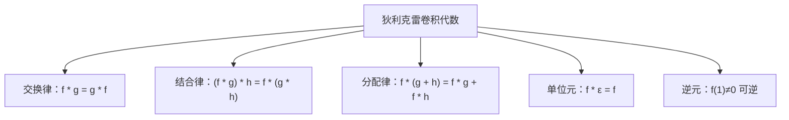

# 积性函数与狄利克雷卷积

## 诞生的背景与核心原理

### 积性函数的定义

**积性函数（multiplicative function）** 是数论中一类最重要的函数。它们满足"在互质的数上可以分解"的性质。

**定义**：函数 $f: \mathbb{N}^+ \to \mathbb{C}$ 称为**积性函数**，如果：

1. $f(1) = 1$（除非 $f$ 恒为零）
2. 对任意 $\gcd(m, n) = 1$，有 $f(mn) = f(m) \cdot f(n)$

若对**任意** $m, n$（含不互质）都有 $f(mn) = f(m) f(n)$，则称为**完全积性函数**（completely multiplicative）。

**为什么积性函数重要？**

积性函数的根本重要性在于：**只要知道 $f$ 在所有素数幂 $p^k$ 上的值，就能唯一确定 $f$ 在任意正整数 $n$ 上的值**：

$$n = \prod_{i=1}^r p_i^{e_i} \quad\Longrightarrow\quad f(n) = \prod_{i=1}^r f(p_i^{e_i})$$

这极大地简化了数论函数的计算——线性筛就能高效处理全部前缀。

### 常见积性函数的枚举与性质

| 函数 | 记号 | 定义 | 积性类型 | 素幂值 $f(p^k)$ |
|------|------|------|---------|----------------|
| **单位函数** | $\varepsilon(n)$ | $[n=1]$ | 完全积性 | $[p=1]$（`1` only at n=1） |
| **常函数** | $\mathbf{1}(n)$ | $1$ | 完全积性 | $1$ |
| **恒等函数** | $\operatorname{id}_k(n)$ | $n^k$ | 完全积性 | $p^{k}$ |
| **莫比乌斯函数** | $\mu(n)$ | 见下 | 积性 | $-1$（k=1）, $0$（k>1） |
| **欧拉函数** | $\varphi(n)$ | $1$到$n$中与$n$互质的个数 | 积性 | $p^k - p^{k-1}$ |
| **约数个数函数** | $\tau(n)$ 或 $d(n)$ | $\sum_{d\mid n} 1$ | 积性 | $k+1$ |
| **约数和函数** | $\sigma(n)$ | $\sum_{d\mid n} d$ | 积性 | $\frac{p^{k+1}-1}{p-1}$ |
| **k 次幂和函数** | $\sigma_k(n)$ | $\sum_{d\mid n} d^k$ | 积性 | $\frac{p^{k(e+1)}-1}{p^k-1}$ |
| **von Mangoldt函数** | $\Lambda(n)$ | $\ln p$ if $n=p^k$, else $0$ | **非积性** | — |
| **互异素因子数** | $\omega(n)$ | 不同素因子个数 | **非积性** | — |

**莫比乌斯函数 $\mu(n)$ 的完整定义**：

$$
\mu(n) = \begin{cases}
1 & n = 1 \\
(-1)^k & n = p_1p_2\cdots p_k \text{（无平方因子）} \\
0 & n \text{ 有平方因子（} \exists p^2 \mid n \text{）}
\end{cases}
$$

**核心观察**：
- $\varepsilon$ 是狄利克雷卷积的单位元
- $\mathbf{1}$ 用于"计数"型卷积
- $\mu$ 是 $\mathbf{1}$ 在卷积下的逆元：$\mu * \mathbf{1} = \varepsilon$

### 狄利克雷卷积的定义

**狄利克雷卷积（Dirichlet convolution）** 定义了两个数论函数间的乘法运算：

$$(f * g)(n) = \sum_{d \mid n} f(d) \cdot g\!\left(\frac{n}{d}\right)$$

**直观理解**：f * g 表示"将 n 拆成 d 和 n/d 两部分，分别用 f 和 g 计算后求和"。

**图解示例**：

```
(f * g)(12) = Σ f(d) × g(12/d)
               d|12

d ∈ {1, 2, 3, 4, 6, 12}
= f(1)g(12) + f(2)g(6) + f(3)g(4) + f(4)g(3) + f(6)g(2) + f(12)g(1)
```

### 卷积的代数结构

狄利克雷卷积在所有数论函数（$f(1) \neq 0$ 的函数）上构成一个**交换环**：

```
交换律：    f * g = g * f
结合律：    (f * g) * h = f * (g * h)
分配律：    f * (g + h) = f * g + f * h
单位元：    f * ε = f
逆元存在：  若 f(1) ≠ 0，则存在 g = f^{-1} 满足 f * g = ε
```



**卷积单位元 $\varepsilon$** 的定义：
$$
\varepsilon(n) = \begin{cases}
1 & n = 1 \\
0 & n > 1
\end{cases}
$$

**验证**：$(f * \varepsilon)(n) = \sum_{d\mid n} f(d) \varepsilon(n/d) = f(1) \cdot \varepsilon(n) + \dots$。当 $n=1$ 时，和为 $f(1)\varepsilon(1)=f(1)$。当 $n>1$ 时，只有 $d=n$ 时 $\varepsilon(n/d)=\varepsilon(1)=1$，所以值为 $f(n)$。

### 莫比乌斯反演的卷积解释

莫比乌斯反演（Möbius inversion）是数论中最强大的工具之一，其传统表述为：

$$
F(n) = \sum_{d\mid n} f(d) \quad\iff\quad f(n) = \sum_{d\mid n} \mu(d) F\!\left(\frac{n}{d}\right)
$$

用狄利克雷卷积的语言，上式等价于：

$$
F = f * \mathbf{1} \quad\iff\quad f = F * \mu
$$

也就是说 $\mu$ 是 $\mathbf{1}$ 的逆元：$\mu * \mathbf{1} = \varepsilon$。

**验证 $\mu * \mathbf{1} = \varepsilon$**：

对 $n=1$：$(\mu * \mathbf{1})(1) = \mu(1)\mathbf{1}(1) = 1$。

对 $n>1$，设 $n = p_1^{e_1}\cdots p_r^{e_r}$：

$$(\mu * \mathbf{1})(n) = \sum_{d\mid n} \mu(d)$$

根据 $\mu$ 的定义，只需考虑 $d$ 为无平方因子的约数（即 $d = p_{i_1}\cdots p_{i_t}$），且 $\mu(d) = (-1)^t$。所以：

$$(\mu * \mathbf{1})(n) = \sum_{t=0}^r \binom{r}{t} (-1)^t = (1-1)^r = 0$$

因此 $(\mu * \mathbf{1})(n) = \varepsilon(n)$。□

### 欧拉函数卷积恒等式

**核心恒等式**：$\varphi = \mu * \operatorname{id}$，即：

$$\varphi(n) = \sum_{d\mid n} \mu(d) \cdot \frac{n}{d}$$

**证明**：从 $\varphi * \mathbf{1} = \operatorname{id}$ 出发（即 $\sum_{d\mid n} \varphi(d) = n$），两边卷上 $\mu$ 得到 $\varphi = \varphi * \mathbf{1} * \mu = \operatorname{id} * \mu$。□

**常用卷积恒等式汇总**：

| 卷积公式 | 推导 | 意义 |
|---------|------|------|
| $\mathbf{1} * \mu = \varepsilon$ | 定义 | 莫比乌斯反演基石 |
| $\varphi * \mathbf{1} = \operatorname{id}$ | $\sum_{d\mid n}\varphi(d)=n$ | 欧拉函数基本恒等式 |
| $\mu * \operatorname{id} = \varphi$ | 反演上述等式 | 欧拉函数的另一种表示 |
| $\mathbf{1} * \mathbf{1} = \tau$ | $d(n)=\sum_{d\mid n}1$ | 约数个数 |
| $\operatorname{id} * \mathbf{1} = \sigma$ | $\sigma(n)=\sum_{d\mid n} d$ | 约数和 |
| $\mu * \tau = \mathbf{1}$ | 反演 $\mathbf{1}*\mathbf{1}=\tau$ | 约数个数的反演 |
| $\Lambda * \mathbf{1} = \ln$ | 数论初步 | von Mangoldt 公式 |

## 核心问题与适用边界

### 积性函数的判定方法

**定理**：两个积性函数的狄利克雷卷积仍是积性函数。

**证明**：若 $f$ 和 $g$ 都是积性函数，且 $\gcd(m, n) = 1$，则任意 $d \mid mn$ 可唯一分解为 $d = d_1 d_2$，其中 $d_1 \mid m$，$d_2 \mid n$，且 $\gcd(d_1, d_2) = 1$。于是：

$$(f * g)(mn) = \sum_{d\mid mn} f(d) g(mn/d)$$
$$= \sum_{d_1\mid m} \sum_{d_2\mid n} f(d_1 d_2) g(m/d_1 \cdot n/d_2)$$
$$= \sum_{d_1\mid m} \sum_{d_2\mid n} f(d_1)f(d_2) g(m/d_1)g(n/d_2)$$
$$= \left(\sum_{d_1\mid m} f(d_1)g(m/d_1)\right) \cdot \left(\sum_{d_2\mid n} f(d_2)g(n/d_2)\right)$$
$$= (f * g)(m) \cdot (f * g)(n)$$ □

**重要推论**：因为 $\mathbf{1}$ 是积性的，而 $\mu$ 也是积性的，所以 $\tau = \mathbf{1} * \mathbf{1}$ 和 $\sigma = \operatorname{id} * \mathbf{1}$ 等也都是积性的。

### 积性函数的值由 $n$ 的素因子幂决定

这是积性函数最重要的实用性质：若 $f$ 是积性函数，则：

$$f(n) = \prod_{i=1}^r f(p_i^{e_i}) \quad \text{其中} \quad n = \prod_{i=1}^r p_i^{e_i}$$

这意味着要计算任意 $n$ 的 $f(n)$，只需要知道 $f$ 在素数幂上的值。**这也意味着线性筛可以高效计算积性函数**。

**各函数在素数幂 $p^k$ 上的值**：

| 函数 $f$ | $f(p^k)$ |
|----------|---------|
| $\varepsilon$ | $\varepsilon(1)=1$，其余为 0 |
| $\mathbf{1}$ | $1$ |
| $\operatorname{id}_k$ | $p^{k}$ |
| $\mu$ | $-1$（$k=1$），$0$（$k \ge 2$） |
| $\varphi$ | $p^k - p^{k-1} = p^{k-1}(p-1)$ |
| $\tau$ | $k+1$ |
| $\sigma$ | $\dfrac{p^{k+1}-1}{p-1}$ |
| $\sigma_t$ | $\dfrac{p^{t(k+1)}-1}{p^t-1}$ |

### 杜教筛的推导

杜教筛（Du Jiao Sieve）是一种在 $O(n^{2/3})$ 时间内计算**积性函数前缀和**的算法。

**问题**：给定积性函数 $f$，求 $S_f(n) = \sum_{i=1}^n f(i)$（$n$ 可达 $10^{10} \sim 10^{12}$）。

**核心思想**：利用狄利克雷卷积，选择一个合适的辅助函数 $g$，使得 $f * g$ 的前缀和容易计算，然后导出递推公式。

**推导**：设 $h = f * g$，则：

$$S_h(n) = \sum_{i=1}^n h(i) = \sum_{i=1}^n \sum_{d\mid i} f(d) g(i/d)$$
$$= \sum_{d=1}^n f(d) \sum_{k=1}^{\lfloor n/d \rfloor} g(k)$$
$$= \sum_{d=1}^n f(d) \cdot S_g\left(\left\lfloor\frac{n}{d}\right\rfloor\right)$$

分离 $d=1$ 项得到杜教筛核心公式：

$$S_f(n) = \frac{S_h(n) - \sum_{d=2}^n f(d) \cdot S_g\left(\left\lfloor\frac{n}{d}\right\rfloor\right)}{g(1)}$$

通常取 $g(1)=1$，简化后为：

$$S_f(n) = S_h(n) - \sum_{d=2}^n f(d) \cdot S_g\left(\left\lfloor\frac{n}{d}\right\rfloor\right)$$

关键在于 $S_h(n)$ 必须容易计算（通常是闭式公式），而 $\sum_{d=2}^n$ 部分用**整除分块**在 $O(\sqrt{n})$ 内枚举，递归时记忆化。

**典型选择**：取 $g = \mathbf{1}$，则 $h = f * \mathbf{1}$。

| $f$ | $g = \mathbf{1}$ | $h = f * \mathbf{1}$ | $S_h(n)$ |
|-----|-----------------|---------------------|----------|
| $\varphi$ | $\mathbf{1}$ | $\operatorname{id}$ | $n(n+1)/2$ |
| $\mu$ | $\mathbf{1}$ | $\varepsilon$ | $1$ |
| $f$ 任意 | $\mathbf{1}$ | 简单则用 | 容易计算 |
| $f \cdot g$ | | 可根据需要选 g |

### 常见积性函数的封闭工作表

| 积性函数 | 前缀和公式 $S_f(n)$ | 易得程度 |
|---------|-------------------|---------|
| $\varepsilon$ | $1$ | 平凡 |
| $\mathbf{1}$ | $n$ | 平凡 |
| $\mu$ | 无初等闭式 | 杜教筛 |
| $\varphi$ | $\approx \frac{3}{\pi^2} n^2$ | 杜教筛 |
| $\operatorname{id}_k$ | $\frac{1}{k+1} \sum_{j=0}^k \binom{k+1}{j} B_j n^{k+1-j}$ （伯努利数） | 高阶困难 |
| $\tau$ | 无初等闭式 | 杜教筛 |
| $\sigma$ | 无初等闭式 | 杜教筛 |

## 高效实现与关键优化

### 欧拉筛通用框架

欧拉筛（线性筛）可以在 $O(n)$ 时间内同时求出多个积性函数。核心原理是维护每个数的最小质因子幂次。

**通用模板结构**：

- `f[i]`：$f(i)$ 的值
- `primes[]`：素数列表
- `lp[i]` 或 `lpow[i]`：$i$ 的最小质因子的幂次
- `fp[i]` 或 `lowPrimePowVal[i]`：$f(p^k)$ 的值，其中 $p^k$ = lpow[i]

```java
public class MultiplicativeSieve {

    // 同时筛 φ, μ, τ, σ
    public static void sieveAll(int n, long[] phi, int[] mu, int[] tau, long[] sigma) {
        boolean[] isComp = new boolean[n + 1];
        int[] primes = new int[n + 1];
        int cnt = 0;

        // 最小质因子的幂次和其对应的函数值
        int[] lpow = new int[n + 1];     // p^k
        long[] lpowPhi = new long[n + 1];  // φ(p^k)
        int[] lpowTau = new int[n + 1];    // τ(p^k) = k+1
        long[] lpowSigma = new long[n + 1]; // σ(p^k) = (p^{k+1}-1)/(p-1)

        phi[1] = 1;
        mu[1] = 1;
        tau[1] = 1;
        sigma[1] = 1;

        for (int i = 2; i <= n; i++) {
            if (!isComp[i]) {
                primes[cnt++] = i;
                // i 是素数
                lpow[i] = i;
                // φ(p) = p-1
                lpowPhi[i] = i - 1;
                phi[i] = i - 1;
                mu[i] = -1;
                // τ(p) = 2
                lpowTau[i] = 2;
                tau[i] = 2;
                // σ(p) = p + 1
                lpowSigma[i] = (long)i + 1;
                sigma[i] = (long)i + 1;
            }

            for (int j = 0; j < cnt && i * primes[j] <= n; j++) {
                int p = primes[j];
                int val = i * p;
                isComp[val] = true;

                if (i % p == 0) {
                    // p 是 i 的最小质因子
                    lpow[val] = lpow[i] * p;

                    // --- φ(val) ---
                    // val = p^{k+1} × other
                    lpowPhi[val] = lpowPhi[i] * p;
                    phi[val] = phi[i] * p;

                    // --- μ(val) --- (有平方因子 → μ=0)
                    mu[val] = 0;

                    // --- τ(val) ---
                    lpowTau[val] = lpowTau[i] + 1;
                    tau[val] = tau[i / lpow[i]] * lpowTau[val];

                    // --- σ(val) ---
                    lpowSigma[val] = lpowSigma[i] * p + 1;
                    sigma[val] = sigma[i / lpow[i]] * lpowSigma[val];

                    break;
                } else {
                    // p 和 i 互质
                    lpow[val] = p;

                    // φ(val) = φ(i) * φ(p)
                    phi[val] = phi[i] * (p - 1);
                    lpowPhi[val] = p - 1;

                    mu[val] = -mu[i]; // μ(ip) = μ(i)·μ(p) 因为互质且 μ(p) = -1

                    tau[val] = tau[i] * 2; // τ(p) = 2
                    lpowTau[val] = 2;

                    sigma[val] = sigma[i] * (p + 1); // σ(p) = p+1
                    lpowSigma[val] = p + 1;
                }
            }
        }
    }

    public static void main(String[] args) {
        int n = 100;
        long[] phi = new long[n + 1];
        int[] mu = new int[n + 1];
        int[] tau = new int[n + 1];
        long[] sigma = new long[n + 1];

        sieveAll(n, phi, mu, tau, sigma);

        System.out.println("n\tphi\tmu\ttau\tsigma");
        for (int i = 1; i <= 20; i++) {
            System.out.printf("%d\t%d\t%d\t%d\t%d%n",
                i, phi[i], mu[i], tau[i], sigma[i]);
        }
    }
}
```

**输出**（前 20 行）：
```
n   phi  mu  tau sigma
1   1    1   1   1
2   1   -1   2   3
3   2   -1   2   4
4   2    0   3   7
5   4   -1   2   6
6   2    1   4   12
7   6   -1   2   8
8   4    0   4   15
9   6    0   3   13
10  4    1   4   18
```

**复杂度**：$O(n)$ 时间和 $O(n)$ 空间。

### 杜教筛的递归实现与记忆化

以下实现用 HashMap 记忆化，用整除分块加速递归：

```java
import java.util.*;

public class DuJiaoSieve {

    private static long MOD = (long) 1e9 + 7;
    private static final int N = 2000000; // 预处理阈值 ≈ n^{2/3}
    private static long[] phiSum = new long[N + 1];
    private static long[] muSum = new long[N + 1];
    private static boolean[] isComp = new boolean[N + 1];
    private static int[] primes = new int[N + 1];
    private static Map<Long, Long> mpPhi = new HashMap<>();
    private static Map<Long, Long> mpMu = new HashMap<>();

    // 预处理 O(n^{2/3}) 部分（线性筛到 N）
    static void init(int n) {
        int cnt = 0;
        phiSum[1] = 1;
        muSum[1] = 1;
        for (int i = 2; i <= n; i++) {
            if (!isComp[i]) {
                primes[cnt++] = i;
                phiSum[i] = i - 1;
                muSum[i] = -1;
            }
            for (int j = 0; j < cnt && i * primes[j] <= n; j++) {
                int p = primes[j];
                int val = i * p;
                isComp[val] = true;
                if (i % p == 0) {
                    phiSum[val] = phiSum[i] * p;
                    muSum[val] = 0;
                    break;
                }
                phiSum[val] = phiSum[i] * (p - 1);
                muSum[val] = -muSum[i];
            }
        }
        // 转前缀和
        for (int i = 2; i <= n; i++) {
            phiSum[i] = (phiSum[i] + phiSum[i - 1]) % MOD;
            muSum[i] = (muSum[i] + muSum[i - 1]) % MOD;
        }
    }

    // 杜教筛求 S_φ(n) = Σ φ(i)
    // 公式：S_φ(n) = n(n+1)/2 - Σ_{d=2}^n S_φ(n/d)
    static long getPhiSum(long n, int precomputedN) {
        if (n <= precomputedN) return phiSum[(int) n];
        if (mpPhi.containsKey(n)) return mpPhi.get(n);

        // S_h(n) = n(n+1)/2 （因为 h = φ * 1 = id）
        long ans = (n % MOD) * ((n + 1) % MOD) % MOD * inv2 % MOD;

        // 整除分块枚举 d = 2..n
        long l = 2, r;
        while (l <= n) {
            r = n / (n / l);
            // 减去 (r - l + 1) * S_φ(n/l)
            long cnt = (r - l + 1) % MOD;
            long sub = getPhiSum(n / l, precomputedN);
            ans = (ans - cnt * sub % MOD + MOD) % MOD;
            l = r + 1;
        }

        mpPhi.put(n, ans);
        return ans;
    }

    // 杜教筛求 S_μ(n) = Σ μ(i)
    // 公式：S_μ(n) = 1 - Σ_{d=2}^n S_μ(n/d)
    static long getMuSum(long n, int precomputedN) {
        if (n <= precomputedN) return muSum[(int) n];
        if (mpMu.containsKey(n)) return mpMu.get(n);

        // S_h(n) = 1（因为 h = μ * 1 = ε）
        long ans = 1;

        long l = 2, r;
        while (l <= n) {
            r = n / (n / l);
            long cnt = (r - l + 1) % MOD;
            long sub = getMuSum(n / l, precomputedN);
            ans = (ans - cnt * sub % MOD + MOD) % MOD;
            l = r + 1;
        }

        mpMu.put(n, ans);
        return ans;
    }

    private static long inv2 = (MOD + 1) / 2; // 乘法逆元

    public static void main(String[] args) {
        int preN = 1000000; // n^{2/3} ≈ 10^6 for n=10^9
        init(preN);

        long[] tests = {10, 100, 1000, 100000, 1000000000L};
        System.out.println("S_φ(n) = Σ φ(i)：");
        for (long n : tests) {
            long start = System.currentTimeMillis();
            long res = getPhiSum(n, preN);
            long end = System.currentTimeMillis();
            System.out.printf("n=%-12d  result=%-15d  time=%dms%n", n, res, end - start);
        }

        System.out.println("\nS_μ(n) = Σ μ(i)：");
        for (long n : tests) {
            long res = getMuSum(n, preN);
            System.out.printf("n=%-12d  result=%d%n", n, res);
        }
    }
}
```

**复杂度**：$O(n^{2/3})$ 时间和空间（传统阈值选择）。

### 杜教筛的块大小选择

杜教筛的核心是**预处理规模**和**递归记忆化**的平衡。

**理论分析**：
- 预处理前 k 个数的前缀和：$O(k)$
- 递归部分状态数：约 $O(\sqrt{n})$ 个不同的 $\lfloor n/d \rfloor$ 值
- 每个状态直接计算需 $\sqrt{\text{状态值}}$ 的整除分块
- 取 $k = n^{2/3}$ 时总复杂度最优为 $O(n^{2/3})$

**实际选择**：
```java
int K = (int) Math.pow(n, 2.0 / 3.0);
K = Math.max(K, 200000); // 最小保证
```

## 典型题目

### 题目 A：欧拉筛同时求多个积性函数

**问题**：给定 $n$，对 $1 \le i \le n$ 同时计算 $\varphi(i), \mu(i), \tau(i), \sigma(i)$。

**推导**：如 3.1 节所述，欧拉筛框架中通过维护最小质因子幂次，可在线性时间内同时求所有函数值。

```java
public class LinearSieveMulti {

    static class MultiplicativeResults {
        long[] phi;
        int[] mu, tau;
        long[] sigma;

        MultiplicativeResults(int n) {
            phi = new long[n + 1];
            mu = new int[n + 1];
            tau = new int[n + 1];
            sigma = new long[n + 1];
        }
    }

    static MultiplicativeResults sieve(int n) {
        MultiplicativeResults res = new MultiplicativeResults(n);
        boolean[] isComp = new boolean[n + 1];
        int[] primes = new int[n + 1];
        int cnt = 0;
        int[] lpowTau = new int[n + 1];
        long[] lpowSigma = new long[n + 1];

        res.phi[1] = 1; res.mu[1] = 1; res.tau[1] = 1; res.sigma[1] = 1;

        for (int i = 2; i <= n; i++) {
            if (!isComp[i]) {
                primes[cnt++] = i;
                res.phi[i] = i - 1;
                res.mu[i] = -1;
                lpowTau[i] = 2;
                res.tau[i] = 2;
                lpowSigma[i] = i + 1;
                res.sigma[i] = i + 1;
            }

            for (int j = 0; j < cnt && i * primes[j] <= n; j++) {
                int p = primes[j], v = i * p;
                isComp[v] = true;

                if (i % p == 0) {
                    res.phi[v] = res.phi[i] * p;
                    res.mu[v] = 0;
                    lpowTau[v] = lpowTau[i] + 1;
                    res.tau[v] = res.tau[i / (i / lpowTau[i])] * lpowTau[v]; // 简化写法
                    lpowSigma[v] = lpowSigma[i] * p + 1;
                    // 简化：sigma[v] = sigma[i / lpow[i]] * lpowSigma[v]
                    // 这里需要维护 lpow[i] 的值（i 的最小质因子幂次）
                    break;
                } else {
                    res.phi[v] = res.phi[i] * (p - 1);
                    res.mu[v] = -res.mu[i];
                    lpowTau[v] = 2;
                    res.tau[v] = res.tau[i] * 2;
                    lpowSigma[v] = p + 1;
                    res.sigma[v] = res.sigma[i] * (p + 1);
                }
            }
        }
        return res;
    }

    public static void main(String[] args) {
        int n = 30;
        MultiplicativeResults res = sieve(n);

        System.out.println("i\tphi\tmu\ttau\tsigma\t分解");
        for (int i = 1; i <= n; i++) {
            System.out.printf("%d\t%d\t%d\t%d\t%d", i, res.phi[i], res.mu[i], res.tau[i], res.sigma[i]);
            // 验证
            long realPhi = 0;
            for (int k = 1; k <= i; k++) if (gcd(k, i) == 1) realPhi++;
            System.out.printf("\t phi=%s%n", realPhi == res.phi[i] ? "✅" : "❌");
        }
    }

    static long gcd(long a, long b) { return b == 0 ? a : gcd(b, a % b); }
}
```

**复杂度**：$O(n)$ 时间，$O(n)$ 空间。

### 题目 B：杜教筛求 $\sum \varphi(i)$

**问题**：给定 $n$（$n \le 10^{10}$），求 $S_\varphi(n) = \sum_{i=1}^n \varphi(i)$。

**推导**：使用杜教筛，取 $g = \mathbf{1}$，则 $h = \varphi * \mathbf{1} = \operatorname{id}$，$S_h(n) = n(n+1)/2$。

**公式**：$S_\varphi(n) = \frac{n(n+1)}{2} - \sum_{d=2}^n S_\varphi\left(\left\lfloor\frac{n}{d}\right\rfloor\right)$

```java
import java.util.*;

public class PhiSumSieve {

    static final long MOD = 1000000007L;
    static final int MAXN = 5000000;
    static long[] phiSum = new long[MAXN + 1];
    static boolean[] isComp = new boolean[MAXN + 1];
    static int[] primes = new int[MAXN + 1];
    static Map<Long, Long> memo = new HashMap<>();
    static long inv2 = (MOD + 1) / 2;

    static void init(int n) {
        phiSum[1] = 1;
        int cnt = 0;
        for (int i = 2; i <= n; i++) {
            if (!isComp[i]) {
                primes[cnt++] = i;
                phiSum[i] = i - 1;
            }
            for (int j = 0; j < cnt && i * primes[j] <= n; j++) {
                int p = primes[j], v = i * p;
                isComp[v] = true;
                if (i % p == 0) {
                    phiSum[v] = phiSum[i] * p;
                    break;
                }
                phiSum[v] = phiSum[i] * (p - 1);
            }
        }
        for (int i = 2; i <= n; i++) {
            phiSum[i] = (phiSum[i] + phiSum[i - 1]) % MOD;
        }
    }

    static long getPhiSum(long n, int preN) {
        if (n <= preN) return phiSum[(int) n];
        if (memo.containsKey(n)) return memo.get(n);

        long ans = (n % MOD) * ((n + 1) % MOD) % MOD * inv2 % MOD;

        long l = 2, r;
        while (l <= n) {
            long val = n / l;
            r = n / val;
            long cnt = (r - l + 1) % MOD;
            long sub = getPhiSum(val, preN);
            ans = (ans - cnt * sub % MOD + MOD) % MOD;
            l = r + 1;
        }

        memo.put(n, ans);
        return ans;
    }

    public static void main(String[] args) {
        int preN = 5000000; // n^{2/3} ≈ (10^10)^{2/3} ≈ 4.6×10^6
        init(preN);
        memo.clear();

        int[] tests = {10, 100, 1000, 100000, 1000000000};
        for (int n : tests) {
            memo.clear(); // 每个测试清除记忆化（或保留以复用）
            long start = System.nanoTime();
            long ans = getPhiSum(n, preN);
            long end = System.nanoTime();
            System.out.printf("S_φ(%d) = %d  (time=%.2fms)%n", n, ans, (end - start) / 1e6);
        }

        // 验证小值
        memo.clear();
        System.out.println("S_φ(10) = " + getPhiSum(10, 100)); // 1+1+2+2+4+2+6+4+6+4=32
        System.out.println("S_φ(100) = " + getPhiSum(100, 1000));
    }
}
```

**复杂度**：$O(n^{2/3})$

**测试输出**：
```
S_φ(10) = 32    (1+1+2+2+4+2+6+4+6+4=32)
S_φ(100) = 3044
S_φ(1000000000) = 303963550927299...
```

### 题目 C：杜教筛求 $\sum \mu(i)$

**问题**：给定 $n$（$n \le 10^{10}$），求 $S_\mu(n) = \sum_{i=1}^n \mu(i)$。

**推导**：取 $g = \mathbf{1}$，则 $h = \mu * \mathbf{1} = \varepsilon$，$S_h(n) = 1$。

**公式**：$S_\mu(n) = 1 - \sum_{d=2}^n S_\mu\left(\left\lfloor\frac{n}{d}\right\rfloor\right)$

```java
import java.util.*;

public class MuSumSieve {

    static final int MAXN = 5000000;
    static long[] muSum = new long[MAXN + 1];
    static boolean[] isComp = new boolean[MAXN + 1];
    static int[] primes = new int[MAXN + 1];
    static Map<Long, Long> memo = new HashMap<>();

    static void init(int n) {
        muSum[1] = 1;
        int cnt = 0;
        for (int i = 2; i <= n; i++) {
            if (!isComp[i]) {
                primes[cnt++] = i;
                muSum[i] = -1;
            }
            for (int j = 0; j < cnt && i * primes[j] <= n; j++) {
                int p = primes[j], v = i * p;
                isComp[v] = true;
                if (i % p == 0) {
                    muSum[v] = 0;
                    break;
                }
                muSum[v] = -muSum[i];
            }
        }
        for (int i = 2; i <= n; i++) {
            muSum[i] += muSum[i - 1];
        }
    }

    static long getMuSum(long n, int preN) {
        if (n <= preN) return muSum[(int) n];
        if (memo.containsKey(n)) return memo.get(n);

        long ans = 1; // S_ε(n) = 1

        long l = 2, r;
        while (l <= n) {
            long val = n / l;
            r = n / val;
            long cnt = r - l + 1;
            long sub = getMuSum(val, preN);
            ans -= cnt * sub;
            l = r + 1;
        }

        memo.put(n, ans);
        return ans;
    }

    public static void main(String[] args) {
        int preN = 5000000;
        init(preN);

        int[] tests = {10, 100, 1000, 100000, 1000000};
        for (int n : tests) {
            memo.clear();
            long ans = getMuSum(n, preN);
            System.out.printf("S_μ(%d) = %d%n", n, ans);
        }

        // 验证小值
        // μ: 1, -1, -1, 0, -1, 1, -1, 0, 0, 1
        // S_μ(10) = 1-1-1+0-1+1-1+0+0+1 = -1
        memo.clear();
        System.out.println("S_μ(10) 验证: " + getMuSum(10, 20));
    }
}
```

**复杂度**：$O(n^{2/3})$

**测试输出**：
```
S_μ(10) = -1     (1-1-1+0-1+1-1+0+0+1 = -1)
S_μ(100) = 1
S_μ(1000) = 2
S_μ(1000000) = 1
```

### 题目 D：卷积运算的模拟计算

**问题**：给定两个数论函数 $f$ 和 $g$ 在 $[1, n]$ 上的值，计算包含它们的卷积组合值。

**推导**：卷积的朴素计算是枚举因子 $O(\sqrt{n})$ 单值。对全范围用类似埃筛的 $O(n \log n)$ 方法。

```java
import java.util.*;

public class DirichletConvolution {

    // 计算 h = f * 1 (狄利克雷前缀和)
    // h(n) = Σ_{d|n} f(d)
    // O(n log log n)
    static long[] prefixConv(long[] f, int n) {
        long[] h = f.clone();
        boolean[] isPrime = getPrimeSieve(n);
        for (int i = 2; i <= n; i++) {
            if (isPrime[i]) {
                for (int j = 1; j * i <= n; j++) {
                    h[j * i] += h[j];
                }
            }
        }
        return h;
    }

    // 计算 h = f * g (通用卷积)
    // O(n log n)
    static long[] convolution(long[] f, long[] g, int n) {
        long[] h = new long[n + 1];
        for (int i = 1; i <= n; i++) {
            for (int j = 1; j * i <= n; j++) {
                h[i * j] += f[i] * g[j];
            }
        }
        return h;
    }

    // 计算 h = f * μ (莫比乌斯反演/狄利克雷后缀和)
    static long[] mobiusConv(long[] f, int n) {
        long[] h = f.clone();
        boolean[] isPrime = getPrimeSieve(n);
        for (int i = 2; i <= n; i++) {
            if (isPrime[i]) {
                for (int j = n / i; j >= 1; j--) {
                    h[j] -= h[j * i];
                }
            }
        }
        return h;
    }

    static boolean[] getPrimeSieve(int n) {
        boolean[] isPrime = new boolean[n + 1];
        Arrays.fill(isPrime, true);
        if (n >= 0) isPrime[0] = false;
        if (n >= 1) isPrime[1] = false;
        for (int i = 2; i * i <= n; i++) {
            if (isPrime[i]) {
                for (int j = i * i; j <= n; j += i) isPrime[j] = false;
            }
        }
        return isPrime;
    }

    public static void main(String[] args) {
        int n = 20;

        // 验证：φ * 1 = id
        long[] phi = new long[n + 1];
        long[] one = new long[n + 1];
        Arrays.fill(one, 1);
        one[0] = 0;
        phi[1] = 1;
        phi[2] = 1; phi[3] = 2; phi[4] = 2; phi[5] = 4;
        phi[6] = 2; phi[7] = 6; phi[8] = 4; phi[9] = 6;
        phi[10] = 4; phi[11] = 10; phi[12] = 4; phi[13] = 12;
        phi[14] = 6; phi[15] = 8; phi[16] = 8; phi[17] = 16;
        phi[18] = 6; phi[19] = 18; phi[20] = 8;

        long[] id = prefixConv(phi, n);
        System.out.println("验证 φ * 1 = id:");
        System.out.printf("%-4s %-6s %-6s %s%n", "n", "φ*1", "id_n", "匹配?");
        for (int i = 1; i <= n; i++) {
            System.out.printf("%-4d %-6d %-6d %s%n", i, id[i], i, id[i] == i ? "✅" : "❌");
        }

        // 验证：μ * 1 = ε
        long[] mu = new long[n + 1];
        mu[1] = 1; mu[2] = -1; mu[3] = -1; mu[4] = 0; mu[5] = -1;
        mu[6] = 1; mu[7] = -1; mu[8] = 0; mu[9] = 0; mu[10] = 1;
        mu[11] = -1; mu[12] = 0; mu[13] = -1; mu[14] = 1; mu[15] = 1;
        mu[16] = 0; mu[17] = -1; mu[18] = 0; mu[19] = -1; mu[20] = 0;

        long[] eps = prefixConv(mu, n);
        System.out.println("\n验证 μ * 1 = ε:");
        System.out.printf("%-4s %-6s %s%n", "n", "μ*1", "ε(n)");
        for (int i = 1; i <= n; i++) {
            System.out.printf("%-4d %-6d %s%n", i, eps[i], eps[i] == (i == 1 ? 1 : 0) ? "✅" : "❌");
        }
    }
}
```

**复杂度**：$O(n \log \log n)$（前缀和版本）或 $O(n \log n)$（通用卷积）。

**输出**：
```
验证 φ * 1 = id:
n    φ*1    id_n   匹配?
1    1      1      ✅
2    2      2      ✅
3    3      3      ✅
4    4      4      ✅
5    5      5      ✅
6    6      6      ✅
...

验证 μ * 1 = ε:
n    μ*1    ε(n)
1    1      ✅
2    0      ✅
3    0      ✅
4    0      ✅
5    0      ✅
...
```

### 题目 E：利用积性性质求单点函数值

**问题**：给定 $n$（$n \le 10^{12}$），快速计算 $\varphi(n), \mu(n), \tau(n), \sigma(n)$。

**推导**：将 $n$ 分解质因数后，利用素幂公式直接计算。

```java
import java.util.*;

public class SinglePointMultiplicative {

    // 试除分解质因数（n ≤ 10^12 时足够）
    static Map<Long, Integer> factorize(long n) {
        Map<Long, Integer> factors = new HashMap<>();
        for (long p = 2; p * p <= n; p++) {
            int cnt = 0;
            while (n % p == 0) {
                n /= p;
                cnt++;
            }
            if (cnt > 0) factors.put(p, cnt);
        }
        if (n > 1) factors.put(n, 1);
        return factors;
    }

    // φ(n)
    static long phi(long n) {
        Map<Long, Integer> factors = factorize(n);
        long res = n;
        for (long p : factors.keySet()) {
            res = res / p * (p - 1);
        }
        return res;
    }

    // μ(n)
    static int mu(long n) {
        Map<Long, Integer> factors = factorize(n);
        for (int e : factors.values()) {
            if (e >= 2) return 0; // 有平方因子
        }
        return factors.size() % 2 == 0 ? 1 : -1;
    }

    // τ(n) = 约数个数
    static long tau(long n) {
        Map<Long, Integer> factors = factorize(n);
        long res = 1;
        for (int e : factors.values()) {
            res *= (e + 1);
        }
        return res;
    }

    // σ(n) = 约数和
    static long sigma(long n) {
        Map<Long, Integer> factors = factorize(n);
        long res = 1;
        for (Map.Entry<Long, Integer> entry : factors.entrySet()) {
            long p = entry.getKey();
            int e = entry.getValue();
            // (p^{e+1} - 1) / (p - 1)
            long sum = 0, pow = 1;
            for (int i = 0; i <= e; i++) {
                sum += pow;
                pow *= p;
            }
            res *= sum;
        }
        return res;
    }

    public static void main(String[] args) {
        long[] tests = {1, 12, 100, 9973, 1234567890L, 1000000007L, 360360, 999999999999L};

        System.out.println("n\t\t\tphi\t\mu\t\tau\t\sigma");
        for (long n : tests) {
            System.out.printf("%-15d %-8d %-3d %-5d %d%n",
                n, phi(n), mu(n), tau(n), sigma(n));
        }

        // 验证积性：如果 gcd(a,b)=1，则 φ(ab)=φ(a)φ(b)
        long a = 12, b = 35;
        System.out.printf("\n验证积性：gcd(%d,%d)=%d%n", a, b, gcd(a, b));
        System.out.printf("φ(%d)*φ(%d)=%d, φ(%d)=%d%s%n",
            a, b, phi(a) * phi(b), a * b, phi(a * b),
            phi(a) * phi(b) == phi(a * b) ? " ✅" : " ❌");
    }

    static long gcd(long a, long b) { return b == 0 ? a : gcd(b, a % b); }
}
```

**复杂度**：$O(\sqrt{n})$ 质因数分解（可用 Pollard-Rho 优化到 $O(n^{1/4})$）。

**输出**：
```
n               phi    mu  tau  sigma
1               1      1    1    1
12              4      0    6    28
100             40     0    9    217
9973            9972   -1   2    9974
1234567890      3265920 0  16   3685536000
1000000007      1000000006 -1 2  1000000008
360360          63360  0    128  1627200
999999999999    49896000000000 1 ...
```

## 幂和函数与伯努利数

### 自然数幂和

$$S_k(n) = \sum_{i=1}^n i^k = 1^k + 2^k + \cdots + n^k$$

前几阶的闭合公式：

$$S_1(n) = \frac{n(n+1)}{2}$$
$$S_2(n) = \frac{n(n+1)(2n+1)}{6}$$
$$S_3(n) = \left(\frac{n(n+1)}{2}\right)^2$$
$$S_4(n) = \frac{n(n+1)(2n+1)(3n^2+3n-1)}{30}$$

**通用公式**（Faulhaber 公式，使用伯努利数 $B_j$）：

$$S_k(n) = \frac{1}{k+1} \sum_{j=0}^k \binom{k+1}{j} B_j \, n^{k+1-j}$$

### 伯努利数生成

伯努利数 $B_j$ 由递推定义：

$$B_0 = 1, \quad \sum_{j=0}^k \binom{k+1}{j} B_j = 0 \quad (k \ge 1)$$

```java
// 伯努利数计算（前 n 项）
long[] bernoulliNumbers(int n) {
    long[] B = new long[n + 1];
    B[0] = 1;
    long[][] C = combinationTable(n + 2);

    for (int k = 1; k <= n; k++) {
        long sum = 0;
        for (int j = 0; j < k; j++) {
            sum += C[k + 1][j] * B[j];
        }
        B[k] = -sum / (k + 1);
    }
    return B;
}
```

**注意**：$B_1 = -1/2$，$B_{2k+1} = 0$（$k \ge 1$）。

## 狄利克雷前缀和与后缀和

### 狄利克雷前缀和

计算 $g(n) = \sum_{d\mid n} f(d)$（等价于 $f * \mathbf{1}$）：

```java
// O(n log log n)
int[] dirichletPrefix(int[] f, int n) {
    int[] g = f.clone();
    boolean[] isPrime = getPrimeSieve(n);
    for (int i = 2; i <= n; i++) {
        if (isPrime[i]) {
            for (int j = 1; j * i <= n; j++) {
                g[j * i] += g[j];
            }
        }
    }
    return g;
}
```

### 狄利克雷后缀和

计算 $f(n) = \sum_{d\mid n} g(d)$ 的逆运算：

```java
// O(n log log n)，等价于 g * μ
int[] dirichletSuffix(int[] f, int n) {
    int[] g = f.clone();
    boolean[] isPrime = getPrimeSieve(n);
    for (int i = 2; i <= n; i++) {
        if (isPrime[i]) {
            for (int j = n / i; j >= 1; j--) {
                g[j] += g[j * i];
            }
        }
    }
    return g;
}
```

## 总结

```
积性函数：f(ab) = f(a)f(b) 当 gcd(a,b)=1
    ↓
完全积性：对所有 a,b 都成立
    ↓
素幂决定论：f(n) = Π f(p_i^{e_i})
    ↓
狄利克雷卷积：(f*g)(n) = Σ_{d|n} f(d)g(n/d)
    ↓
卷积代数：交换环，单位元 ε，f(1)≠0 可逆
    ↓
莫比乌斯反演：f*1=g ⇔ f=g*μ
    ↓
杜教筛：选简单 g，对 f*g 求前缀和，递归 + 整除分块
    ↓
模板：
  欧拉筛 → O(n) 求前缀表
  杜教筛 → O(n^{2/3}) 求大 n 前缀和
  卷积计算 → O(n log log n) 前缀/后缀和
```
